# 标签方法

## 3.1 动机

在[第 2 章](ch02.md)中，我们讨论了如何从非结构化数据集中产生金融特征矩阵 X。无监督学习算法可以从该矩阵 X 中学习模式，例如它是否包含层次聚类。另一方面，监督学习算法要求 X 中的行与标签或值数组 y 关联，以便这些标签或值可以在未见过的特征样本上被预测。在本章中，我们将讨论给金融数据打标签的方法。

## 3.2 固定时间窗口法

就金融而言，几乎所有 ML 论文都使用固定时间窗口法（fixed-time horizon method）标记观测。该方法可描述如下。考虑一个具有 I 行的特征矩阵 X，{X~i~}~i=1,...,I~，从索引为 t = 1, ..., T 的某些条中抽取，其中 I ≤ T。[第 2 章](ch02.md)第 2.5 节讨论了产生特征集 {X~i~}~i=1,...,I~ 的采样方法。观测 X~i~ 被分配标签 y~i~ ∈ {−1, 0, 1}，

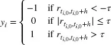

其中 τ 是预定义的常数阈值，t~i,0~ 是 X~i~ 发生之后紧接的条的索引，t~i,0~ + h 是 t~i,0~ 之后第 h 个条的索引，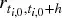 是条跨度 h 上的价格收益，

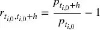

由于文献几乎总是使用时间条，h 隐含了一个固定时间窗口。参考文献部分列出了多项 ML 研究，其中 Dixon 等 [2016] 是该标记方法的一个近期例子。尽管它很流行，但在大多数情况下有若干理由应避免这种方法。第一，正如我们在[第 2 章](ch02.md)中看到的，时间条不具备良好的统计性质。第二，无论观测到的波动率如何，都应用相同的阈值 τ。假设 τ = 1E−2，有时我们在已实现条波动率为 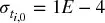（例如夜间时段）时将观测标记为 y~i~ = 1，有时在 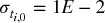（例如开盘附近）。绝大多数标签将是 0，即使收益  是可预测的且统计显著。

换言之，根据时间条上的固定阈值标记观测是一个非常常见的错误。以下是几个更好的替代方案。第一，按变化阈值 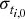 标记，使用收益的滚动指数加权标准差估计。第二，使用成交量条或美元条，因为它们的波动率更接近常数（同方差性）。但即使这两个改进也遗漏了固定时间窗口法的一个关键缺陷：价格遵循的路径。每个投资策略都有止损限制，无论是投资组合经理自行设定的、风控部门执行的，还是追加保证金触发的。构建一个从本应被交易所止损的头寸中获利的策略是不切实际的。几乎所有出版物在标记观测时都没有考虑这一点，这说明了当前投资文献的状态。

## 3.3 计算动态阈值

如上一节所述，在实践中我们希望设置止盈和止损限制，它们是下注所涉风险的函数。否则，考虑到当前波动率，有时我们会瞄得太高（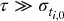），有时太低（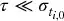）。

代码片段 3.1 在日内估计点计算日波动率，对指数加权移动标准差应用 `span0` 天的跨度。关于 `pandas.Series.ewm` 函数的详细信息请参见 pandas 文档。

> **代码片段 3.1 日波动率估计**

> 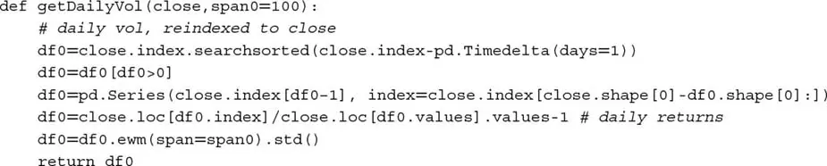

我们可以使用该函数的输出来设置本章后续部分的默认止盈和止损限制。

## 3.4 三重障碍法

这里我将介绍一种在文献中未见的替代标记方法。如果你是投资专业人士，我想你会同意它更有意义。我称之为三重障碍法（triple-barrier method），因为它根据三个障碍中首先触及的障碍来标记观测。第一，我们设置两个水平障碍和一个垂直障碍。两个水平障碍由止盈和止损限制定义，它们是估计波动率（已实现或隐含）的动态函数。第三个障碍以持仓后经过的条数（到期限制）定义。如果先触及上障碍，我们将观测标记为 1。如果先触及下障碍，我们将观测标记为 −1。如果先触及垂直障碍，我们有两个选择：收益的符号或 0。我个人偏好前者（作为在限制内实现盈亏），但你应探索在你的具体问题中 0 是否效果更好。

你可能已经注意到，三重障碍法是路径依赖的。为了标记一个观测，我们必须考虑跨越 [t~i,0~, t~i,0~ + h] 的整个路径，其中 h 定义了垂直障碍（到期限制）。我们将 t~i,1~ 记为首次触及障碍的时间，与观测特征关联的收益为 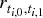。为清晰起见，t~i,1~ ≤ t~i,0~ + h，且水平障碍不一定对称。

代码片段 3.2 实现了三重障碍法。该函数接收四个参数：

- `close`：价格的 pandas 序列。
- `events`：pandas 数据框，包含列：
    - `t1`：垂直障碍的时间戳。当值为 `np.nan` 时，将没有垂直障碍。
    - `trgt`：水平障碍的单位宽度。
- `ptSl`：两个非负浮点值的列表：
    - `ptSl[0]`：乘以 `trgt` 以设置上障碍宽度的因子。如果为 0，将没有上障碍。
    - `ptSl[1]`：乘以 `trgt` 以设置下障碍宽度的因子。如果为 0，将没有下障碍。
- `molecule`：包含将由单一线程处理的事件索引子集的列表。其用途在本章后面将变得清晰。

> **代码片段 3.2 三重障碍标记方法**

> 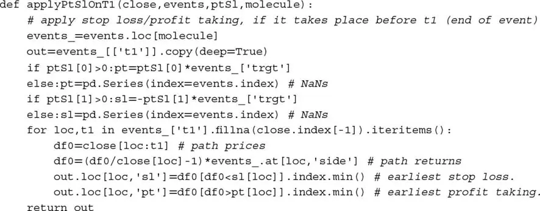

该函数的输出是一个 pandas 数据框，包含每个障碍被触及的时间戳（如果有）。从之前的描述可以看出，该方法考虑了三个障碍中每个都可能被禁用的可能性。让我们用三元组 [`pt,sl,t1`] 表示障碍配置，其中 0 表示该障碍不活跃，1 表示活跃。可能的八种配置是：

- **三种有用的配置：**
    - [1,1,1]：这是标准设置，我们定义三个障碍退出条件。我们希望获利，但对亏损有最大容忍度和持有期限。
    - [0,1,1]：在此设置中，我们希望在若干条之后退出，除非被止损。
    - [1,1,0]：这里我们希望只要不被止损就获利。这在某种意义上不太现实，因为我们愿意持仓多久就持多久。
- **三种较不现实的配置：**
    - [0,0,1]：这等价于固定时间窗口法。当应用于成交量条、美元条或信息驱动条，且在窗口内更新多个预测时，它可能仍然有用。
    - [1,0,1]：持仓直到获利或超过最大持有期限，不考虑中间的未实现亏损。
    - [1,0,0]：持仓直到获利。这可能意味着被锁定在亏损头寸上数年。
- **两种不合逻辑的配置：**
    - [0,1,0]：这是一种漫无目的的配置，我们持仓直到被止损。
    - [0,0,0]：没有障碍。头寸被永远锁定，不产生标签。

图 3.1 展示了三重障碍法的两种替代配置。左侧配置为 [1,1,0]，首先触及的障碍是下方水平障碍。右侧配置为 [1,1,1]，首先触及的障碍是垂直障碍。

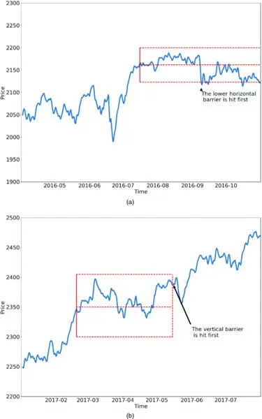

图 3.1 三重障碍法的两种替代配置

## 3.5 学习方向和规模

在本节中，我们将讨论如何标记示例，使 ML 算法能够同时学习下注的方向（side）和规模（size）。当我们没有底层模型来确定仓位符号（做多或做空）时，我们对学习下注的方向感兴趣。在这种情况下，我们无法区分止盈障碍和止损障碍，因为这需要知道方向。学习方向意味着要么没有水平障碍，要么水平障碍必须对称。

代码片段 3.3 实现了函数 `getEvents`，它找到首次触及障碍的时间。该函数接收以下参数：

- `close`：价格的 pandas 序列。
- `tEvents`：包含将作为每个三重障碍种子的时间戳的 pandas 时间索引。这些是[第 2 章](ch02.md)第 2.5 节讨论的采样程序选择的时间戳。
- `ptSl`：设置两个障碍宽度的非负浮点数。0 值表示相应的水平障碍（止盈和/或止损）将被禁用。
- `t1`：具有垂直障碍时间戳的 pandas 序列。当我们想禁用垂直障碍时传 `False`。
- `trgt`：以绝对收益表示的目标 pandas 序列。
- `minRet`：运行三重障碍搜索所需的最小目标收益。
- `numThreads`：函数并发使用的线程数。

> **代码片段 3.3 获取首次触及时间**

> 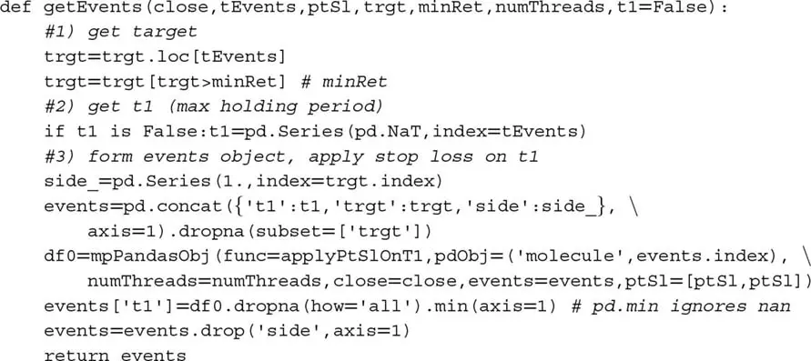

假设 I = 1E6 且 h = 1E3，则在单个工具上要评估的条件多达十亿个。许多 ML 任务计算量很大，除非你熟悉多线程，这是其中之一。这就是并行计算发挥作用的地方。[第 20 章](ch20.md)讨论了我们将在全书中使用的几个多进程函数。

函数 `mpPandasObj` 调用多进程引擎，在[第 20 章](ch20.md)中有深入解释。目前你只需知道该函数将并行执行 `applyPtSlOnT1`。函数 `applyPtSlOnT1` 返回每个障碍被触及的时间戳（如果有）。然后，首次触及时间是 `applyPtSlOnT1` 返回的三个时间中最早的。因为我们必须学习下注方向，我们传入了 `ptSl = ptSl,ptSl` 作为参数，并任意将方向设为始终做多（水平障碍对称，因此方向与确定首次触及时间无关）。该函数的输出是一个 pandas 数据框，包含列：

- `t1`：首次触及障碍的时间戳。
- `trgt`：用于生成水平障碍的目标。

代码片段 3.4 展示了定义垂直障碍的一种方式。对于 `tEvents` 中的每个索引，它找到 `numDays` 天数之后或紧接其后的下一个价格条的时间戳。该垂直障碍可以作为可选参数 `t1` 传给 `getEvents`。

> **代码片段 3.4 添加垂直障碍**

> 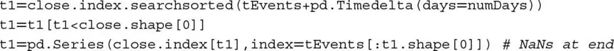

最后，我们可以使用代码片段 3.5 中定义的 `getBins` 函数标记观测。参数是我们刚才讨论的 `events` 数据框和 `close` 价格 pandas 序列。输出是包含列的数据框：

- `ret`：在首次触及障碍时实现的收益。
- `bin`：标签 {−1, 0, 1}，作为结果符号的函数。该函数可以轻松调整，将垂直障碍首先触及的事件标记为 0，我们将其留作练习。

> **代码片段 3.5 方向和规模的标记**

> 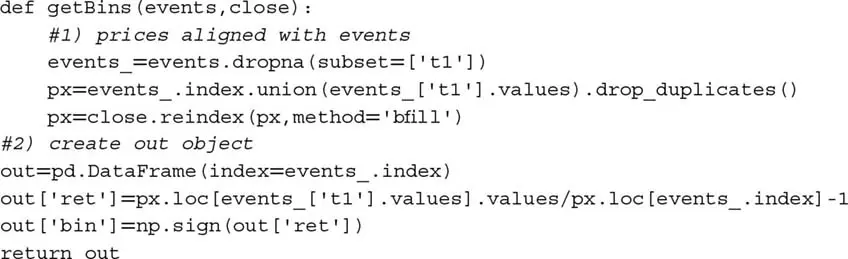

## 3.6 元标签

假设你有一个设定下注方向（做多或做空）的模型。你只需要学习该下注的规模，这包括完全不下注的可能性（零规模）。这是从业者经常面临的情况。我们通常知道是否想买入或卖出某个产品，唯一剩下的问题是我们应该在这样的下注中冒多少资金的风险。我们不希望 ML 算法学习方向，只告诉它合适的规模。此时，听到没有书籍或论文讨论过这个常见问题可能不会让你惊讶。幸运的是，这种痛苦到此结束。我称这个问题为**元标签**（meta-labeling），因为我们要构建一个二级 ML 模型，学习如何使用一个一级外生模型。

与其编写一个全新的 `getEvents` 函数，我们将对之前的代码做一些调整以处理元标签。第一，我们接受一个新的 `side` 可选参数（默认 `None`），包含由一级模型决定的下注方向。当 `side` 不为 `None` 时，函数理解元标签正在发挥作用。第二，因为现在我们知道方向，我们可以有效区分止盈和止损。水平障碍不需要像第 3.5 节那样对称。参数 `ptSl` 是两个非负浮点值的列表，其中 `ptSl[0]` 是乘以 `trgt` 设置上障碍宽度的因子，`ptSl[1]` 是乘以 `trgt` 设置下障碍宽度的因子。当任一为 0 时，相应障碍被禁用。代码片段 3.6 实现了这些增强。

> **代码片段 3.6 扩展 `getEvents` 以纳入元标签**

> 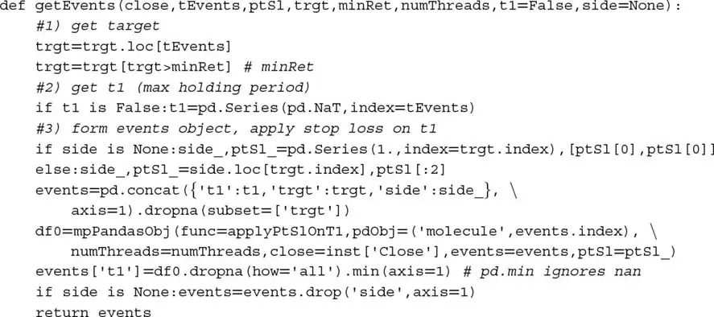

同样，我们需要扩展 `getBins` 函数，使其处理元标签。代码片段 3.7 实现了必要的更改。

> **代码片段 3.7 扩展 `getBins` 以纳入元标签**

> 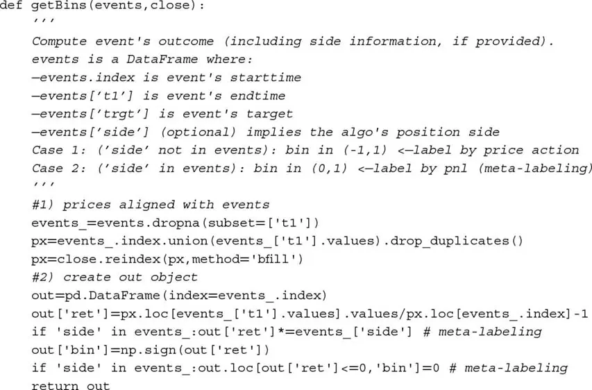

现在 `out['bin']` 中标签的可能值为 {0, 1}，而非之前的可行值 {−1, 0, 1}。ML 算法将被训练来决定是否下注或跳过——一个纯粹的二元预测。当预测标签为 1 时，我们可以使用该二级预测的概率来推导下注规模，其中仓位的方向（符号）已由一级模型设定。

## 3.7 如何使用元标签

二元分类问题在第一类错误（假阳性）和第二类错误（假阴性）之间存在权衡。一般来说，提高二元分类器的真阳性率往往会提高其假阳性率。二元分类器的接收者操作特征（ROC）曲线衡量了提高真阳性率的成本——以接受更高的假阳性率为代价。

图 3.2 说明了所谓的「混淆矩阵」。在一组观测上，有表现出条件的项目（正例，左矩形）和不表现出条件的项目（负例，右矩形）。二元分类器预测某些项目表现出条件（椭圆），其中 TP 区域包含真阳性，TN 区域包含真阴性。这导致两种错误：假阳性（FP）和假阴性（FN）。「精确率」（Precision）是 TP 区域与椭圆面积的比率。「召回率」（Recall）是 TP 区域与左矩形面积的比率。召回率（又称真阳性率）的概念在分类问题中，类似于假设检验中的「功效」（power）。「准确率」（Accuracy）是 TP 和 TN 面积之和除以整个项目集（正方形）。一般来说，减少 FP 面积以增加 FN 面积为代价，因为更高的精确率通常意味着更少的调用，因此更低的召回率。不过，存在某种精确率和召回率的组合，可以最大化分类器的整体效率。F1 分数衡量分类器的效率，作为精确率和召回率之间的调和平均（详见[第 14 章](ch14.md)）。

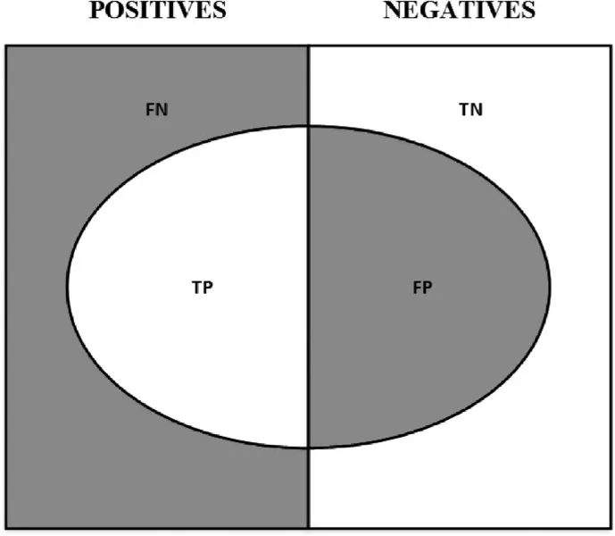

图 3.2 「混淆矩阵」的可视化

当你想达到更高的 F1 分数时，元标签特别有用。第一，我们构建一个达到高召回率的模型，即使精确率不是特别高。第二，我们通过对一级模型预测的正例应用元标签来纠正低精确率。

元标签将通过过滤掉假阳性来提高你的 F1 分数，其中大多数正例已由一级模型识别。换言之，二级 ML 算法的作用是确定一级（外生）模型的正例是真还是假。它的目的*不是*提出一个下注机会。其目的是确定我们应该行动还是放过已呈现的机会。

元标签是你武器库中非常强大的工具，还有四个额外原因。第一，ML 算法经常被批评为黑盒（见[第 1 章](ch01.md)）。元标签允许你在白盒（如基于经济理论的基本面模型）之上构建 ML 系统。这种将基本面模型转化为 ML 模型的能力，应使元标签对「量化基本面」公司特别有用。第二，应用元标签时过拟合的影响有限，因为 ML 不会决定你下注的方向，只会决定规模。第三，通过将方向预测与规模预测解耦，元标签支持复杂的策略结构。例如，考虑驱动反弹的特征可能与驱动抛售的特征不同。在这种情况下，你可能想基于一级模型的买入推荐开发一个专用于多头头寸的 ML 策略，并基于完全不同的一级模型的卖出推荐开发一个专用于空头头寸的 ML 策略。第四，在小注上达到高精度而在大注上达到低精度会毁了你。识别好机会与正确地确定其规模同样重要，因此开发一个专用于做好这一关键决策（规模化）的 ML 算法是有意义的。我们将在[第 10 章](ch10.md)重新讨论这第四点。根据我的经验，元标签 ML 模型可以比标准标记模型交付更稳健和可靠的结果。

## 3.8 量化基本面方法

你可能已在媒体上读到许多对冲基金正在拥抱量化基本面（quantamental）方法。简单的 Google 搜索将显示许多对冲基金（包括一些最传统的）正在投资数千万美元用于将人类专业知识与量化方法结合的技术。事实证明，元标签正是这些人一直等待的。让我们看看为什么。

假设你有一系列你认为可以预测某些价格的特征，你只是不知道如何预测。由于你没有确定每次下注方向的模型，你需要同时学习方向和规模。你应用在第 3.5 节学到的知识，用对称水平障碍的三重障碍法产生一些标签。现在你准备好在训练集上拟合算法，并在测试集上评估预测精度。或者，你可以这样做：

1. 使用一级模型的预测，生成元标签。记住，在这种情况下水平障碍不需要对称。
2. 在同一训练集上再次拟合模型，但这次使用你刚生成的元标签。
3. 将第一个 ML 模型的「方向」与第二个 ML 模型的「规模」结合。

你总是可以为任何一级模型添加元标签层，无论它是 ML 算法、计量经济方程、技术交易规则、基本面分析等。这包括仅凭直觉由人产生的预测。在这种情况下，元标签将帮助我们弄清楚何时应该追求或驳回自由裁量型 PM 的判断。这种元标签 ML 算法使用的特征可以从市场信息到生物特征统计再到心理评估。例如，元标签 ML 算法可能发现自由裁量型 PM 在存在结构性突变（[第 17 章](ch17.md)）时倾向于做出特别好的判断，因为他们可能更快地把握市场状态的变化。相反，它可能发现处于压力下的 PM（以睡眠时间少、疲劳、体重变化等为证据）倾向于做出不准确的预测。^1^ 许多职业要求定期心理检查，ML 元标签算法可能发现这些分数也与评估我们当前对 PM 预测的信心程度相关。也许这些因素都不影响自由裁量型 PM，他们的大脑独立于其情感存在运作，就像冷静的计算机器。我的猜测是事实并非如此，因此元标签应成为每个自由裁量型对冲基金的基本 ML 技术。在不久的将来，每个自由裁量型对冲基金都将成为量化基本面公司，元标签为他们提供了实现这一转型的清晰路径。

## 3.9 丢弃不必要的标签

当类别太不平衡时，一些 ML 分类器表现不佳。在这些情况下，最好丢弃极其罕见的标签，专注于更常见的结果。代码片段 3.8 展示了一个递归丢弃与极其罕见标签关联的观测的过程。函数 `dropLabels` 递归消除与出现次数少于 `minPct` 比例的类别关联的观测，除非只剩两个类别。

> **代码片段 3.8 丢弃人口不足的标签**

> 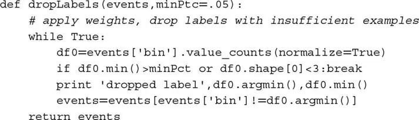

顺便说一句，你想丢弃不必要标签的另一个原因是这个已知的 sklearn bug：<https://github.com/scikit-learn/scikit-learn/issues/8566>。这类 bug 是 sklearn 实现中非常基本假设的后果，解决它们远非易事。在这个特定实例中，错误源于 sklearn 决定使用标准 numpy 数组而非结构化数组或 pandas 对象。在你阅读本章或不久的将来，不太可能有修复。在后面的章节中，我们将通过构建自己的类和扩展 sklearn 功能来研究规避这类实现错误的方法。

## 练习题

1. 为 E-mini S&P 500 期货形成美元条：
    1. 应用对称 CUSUM 滤波器（[第 2 章](ch02.md)第 2.5.2.1 节），其中阈值为日收益的标准差（代码片段 3.1）。
    2. 在 pandas 序列 `t1` 上使用代码片段 3.4，其中 `numDays = 1`。
    3. 在这些采样特征上应用三重障碍法，其中 `ptSl = [1,1]`，`t1` 是你在第 1.b 点创建的序列。
    4. 应用 `getBins` 生成标签。

2. 从练习 1，使用代码片段 3.8 丢弃罕见标签。

3. 调整 `getBins` 函数（代码片段 3.5），使其在垂直障碍首先触及时返回 0。

4. 基于流行的技术分析统计量（如交叉移动平均）开发趋势跟踪策略。对于每个观测，模型建议方向，但不建议下注规模。
    1. 为 `ptSl = [1,2]` 和 `t1`（其中 `numDays = 1`）导出元标签。使用代码片段 3.1 计算的日标准差作为 `trgt`。
    2. 训练随机森林决定是否交易。注意：决策是是否交易 {0,1}，因为底层模型（交叉移动平均）已决定方向 {−1,1}。

5. 基于布林带开发均值回归策略。对于每个观测，模型建议方向，但不建议下注规模。
    1. 为 `ptSl = [0,2]` 和 `t1`（其中 `numDays = 1`）导出元标签。使用代码片段 3.1 计算的日标准差作为 `trgt`。
    2. 训练随机森林决定是否交易。使用以下特征：波动率、序列相关和练习 2 的交叉移动平均。
    3. 一级模型（即如果二级模型不过滤下注）的预测精度是多少？精确率、召回率和 F1 分数是多少？
    4. 二级模型的预测精度是多少？精确率、召回率和 F1 分数是多少？

## 参考书目

1. Ahmed, N., A. Atiya, N. Gayar, and H. El-Shishiny (2010): "An empirical comparison of machine learning models for time series forecasting." *Econometric Reviews*, Vol. 29, No. 5--6, pp. 594--621.
2. Ballings, M., D. van den Poel, N. Hespeels, and R. Gryp (2015): "Evaluating multiple classifiers for stock price direction prediction." *Expert Systems with Applications*, Vol. 42, No. 20, pp. 7046--7056.
3. Bontempi, G., S. Taieb, and Y. Le Borgne (2012): "Machine learning strategies for time series forecasting." *Lecture Notes in Business Information Processing*, Vol. 138, No. 1, pp. 62--77.
4. Booth, A., E. Gerding and F. McGroarty (2014): "Automated trading with performance weighted random forests and seasonality." *Expert Systems with Applications*, Vol. 41, No. 8, pp. 3651--3661.
5. Cao, L. and F. Tay (2001): "Financial forecasting using support vector machines." *Neural Computing & Applications*, Vol. 10, No. 2, pp. 184--192.
6. Cao, L., F. Tay and F. Hock (2003): "Support vector machine with adaptive parameters in financial time series forecasting." *IEEE Transactions on Neural Networks*, Vol. 14, No. 6, pp. 1506--1518.
7. Cervelló-Royo, R., F. Guijarro, and K. Michniuk (2015): "Stock market trading rule based on pattern recognition and technical analysis: Forecasting the DJIA index with intraday data." *Expert Systems with Applications*, Vol. 42, No. 14, pp. 5963--5975.
8. Chang, P., C. Fan and J. Lin (2011): "Trend discovery in financial time series data using a case-based fuzzy decision tree." *Expert Systems with Applications*, Vol. 38, No. 5, pp. 6070--6080.
9. Kuan, C. and L. Tung (1995): "Forecasting exchange rates using feedforward and recurrent neural networks." *Journal of Applied Econometrics*, Vol. 10, No. 4, pp. 347--364.
10. Creamer, G. and Y. Freund (2007): "A boosting approach for automated trading." *Journal of Trading*, Vol. 2, No. 3, pp. 84--96.
11. Creamer, G. and Y. Freund (2010): "Automated trading with boosting and expert weighting." *Quantitative Finance*, Vol. 10, No. 4, pp. 401--420.
12. Creamer, G., Y. Ren, Y. Sakamoto, and J. Nickerson (2016): "A textual analysis algorithm for the equity market: The European case." *Journal of Investing*, Vol. 25, No. 3, pp. 105--116.
13. Dixon, M., D. Klabjan, and J. Bang (2016): "Classification-based financial markets prediction using deep neural networks." *Algorithmic Finance*, forthcoming (2017). Available at SSRN: <https://ssrn.com/abstract=2756331>.
14. Dunis, C., and M. Williams (2002): "Modelling and trading the euro/US dollar exchange rate: Do neural network models perform better?" *Journal of Derivatives & Hedge Funds*, Vol. 8, No. 3, pp. 211--239.
15. Feuerriegel, S. and H. Prendinger (2016): "News-based trading strategies." *Decision Support Systems*, Vol. 90, pp. 65--74.
16. Hsu, S., J. Hsieh, T. Chih, and K. Hsu (2009): "A two-stage architecture for stock price forecasting by integrating self-organizing map and support vector regression." *Expert Systems with Applications*, Vol. 36, No. 4, pp. 7947--7951.
17. Huang, W., Y. Nakamori, and S. Wang (2005): "Forecasting stock market movement direction with support vector machine." *Computers & Operations Research*, Vol. 32, No. 10, pp. 2513--2522.
18. Kara, Y., M. Boyacioglu, and O. Baykan (2011): "Predicting direction of stock price index movement using artificial neural networks and support vector machines." *Expert Systems with Applications*, Vol. 38, No. 5, pp. 5311--5319.
19. Kim, K. (2003): "Financial time series forecasting using support vector machines." *Neurocomputing*, Vol. 55, No. 1, pp. 307--319.
20. Krauss, C., X. Do, and N. Huck (2017): "Deep neural networks, gradient-boosted trees, random forests: Statistical arbitrage on the S&P 500." *European Journal of Operational Research*, Vol. 259, No. 2, pp. 689--702.
21. Laborda, R. and J. Laborda (2017): "Can tree-structured classifiers add value to the investor?" *Finance Research Letters*, Vol. 22 (August), pp. 211--226.
22. Nakamura, E. (2005): "Inflation forecasting using a neural network." *Economics Letters*, Vol. 86, No. 3, pp. 373--378.
23. Olson, D. and C. Mossman (2003): "Neural network forecasts of Canadian stock returns using accounting ratios." *International Journal of Forecasting*, Vol. 19, No. 3, pp. 453--465.
24. Patel, J., S. Sha, P. Thakkar, and K. Kotecha (2015): "Predicting stock and stock price index movement using trend deterministic data preparation and machine learning techniques." *Expert Systems with Applications*, Vol. 42, No. 1, pp. 259--268.
25. Patel, J., S. Sha, P. Thakkar, and K. Kotecha (2015): "Predicting stock market index using fusion of machine learning techniques." *Expert Systems with Applications*, Vol. 42, No. 4, pp. 2162--2172.
26. Qin, Q., Q. Wang, J. Li, and S. Shuzhi (2013): "Linear and nonlinear trading models with gradient boosted random forests and application to Singapore Stock Market." *Journal of Intelligent Learning Systems and Applications*, Vol. 5, No. 1, pp. 1--10.
27. Sorensen, E., K. Miller, and C. Ooi (2000): "The decision tree approach to stock selection." *Journal of Portfolio Management*, Vol. 27, No. 1, pp. 42--52.
28. Theofilatos, K., S. Likothanassis, and A. Karathanasopoulos (2012): "Modeling and trading the EUR/USD exchange rate using machine learning techniques." *Engineering, Technology & Applied Science Research*, Vol. 2, No. 5, pp. 269--272.
29. Trafalis, T. and H. Ince (2000): "Support vector machine for regression and applications to financial forecasting." *Neural Networks*, Vol. 6, No. 1, pp. 348--353.
30. Trippi, R. and D. DeSieno (1992): "Trading equity index futures with a neural network." *Journal of Portfolio Management*, Vol. 19, No. 1, pp. 27--33.
31. Tsai, C. and S. Wang (2009): "Stock price forecasting by hybrid machine learning techniques." *Proceedings of the International Multi-Conference of Engineers and Computer Scientists*, Vol. 1, No. 1, pp. 755--760.
32. Tsai, C., Y. Lin, D. Yen, and Y. Chen (2011): "Predicting stock returns by classifier ensembles." *Applied Soft Computing*, Vol. 11, No. 2, pp. 2452--2459.
33. Wang, J. and S. Chan (2006): "Stock market trading rule discovery using two-layer bias decision tree." *Expert Systems with Applications*, Vol. 30, No. 4, pp. 605--611.
34. Wang, Q., J. Li, Q. Qin, and S. Ge (2011): "Linear, adaptive and nonlinear trading models for Singapore Stock Market with random forests." Proceedings of the 9th IEEE International Conference on Control and Automation, pp. 726--731.
35. Wei, P. and N. Wang (2016): "Wikipedia and stock return: Wikipedia usage pattern helps to predict the individual stock movement." Proceedings of the 25th International Conference Companion on World Wide Web, Vol. 1, pp. 591--594.
36. Żbikowski, K. (2015): "Using volume weighted support vector machines with walk forward testing and feature selection for the purpose of creating stock trading strategy." *Expert Systems with Applications*, Vol. 42, No. 4, pp. 1797--1805.
37. Zhang, G., B. Patuwo, and M. Hu (1998): "Forecasting with artificial neural networks: The state of the art." *International Journal of Forecasting*, Vol. 14, No. 1, pp. 35--62.
38. Zhu, M., D. Philpotts and M. Stevenson (2012): "The benefits of tree-based models for stock selection." *Journal of Asset Management*, Vol. 13, No. 6, pp. 437--448.
39. Zhu, M., D. Philpotts, R. Sparks, and J. Stevenson, Maxwell (2011): "A hybrid approach to combining CART and logistic regression for stock ranking." *Journal of Portfolio Management*, Vol. 38, No. 1, pp. 100--109.

## 注释

^1^ 你可能知道至少有一家大型对冲基金每天监控其研究分析师的情绪状态。
