# 样本权重

## 4.1 动机

[第 3 章](ch03.md)提出了几种标记金融观测的新方法。我们引入了两个新概念——三重障碍法和元标签——并解释了它们在金融应用（包括量化基本面投资策略）中的用途。在本章中，你将学习如何使用样本权重来解决金融应用中另一个普遍存在的问题，即观测不是由独立同分布（IID）过程产生的。大多数 ML 文献基于 IID 假设，而许多 ML 应用在金融中失败的一个原因是，这些假设在金融时间序列的情况下是不切实际的。

## 4.2 重叠结果

在[第 3 章](ch03.md)中，我们为观测特征 X~i~ 分配了标签 y~i~，其中 y~i~ 是在区间 [t~i,0~, t~i,1~] 内发生的价格条的函数。当 t~i,1~ > t~j,0~ 且 i < j 时，y~i~ 和 y~j~ 都将依赖于一个共同的收益 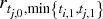，即区间 [t~j,0~, max(t~i,1~, t~j,1~)] 上的收益。这意味着，只要任何两个连续结果之间存在重叠（∃i | t~i,1~ > t~i+1,0~），标签序列 {y~i~}~i=1,...,I~ 就不是 IID 的。

假设我们通过将下注窗口限制为 t~i,1~ ≤ t~i+1,0~ 来规避这个问题。在这种情况下没有重叠，因为每个特征结果在下一次观测特征开始之前或之时就已确定。但这将导致粗糙的模型，特征的采样频率将受限于用于确定结果的窗口。一方面，如果我们希望调查持续一个月的结果，特征必须以不超过月度的频率采样。另一方面，如果我们将采样频率提高到比如每日，我们将被迫将结果的窗口缩减为一天。此外，如果我们希望应用路径依赖的标记技术（如三重障碍法），采样频率将服从于第一个障碍的触及。无论你做什么，通过限制结果窗口来消除重叠都是一个糟糕的解决方案。我们必须允许 t~i,1~ > t~i+1,0~，这又把我们带回到了前面描述的重叠结果问题。

这种情况是金融应用的典型特征。大多数非金融 ML 研究者可以假设观测来自 IID 过程。例如，你可以从大量患者身上采集血样并测量胆固醇。当然，各种潜在的共同因素会移动胆固醇分布的均值和标准差，但样本仍然独立：每个受试者一个观测。假设你采集了那些血样，实验室有人把每个管子里的血洒到右边接下来的九个管子里。也就是说，10 号管含有 10 号患者的血，但也含有 1-9 号患者的血。11 号管含有 11 号患者的血，但也含有 2-10 号患者的血，以此类推。现在你需要确定预测高胆固醇的特征（饮食、运动、年龄等），但不能确定每个患者的胆固醇水平。这就是我们在金融 ML 中面临的等价挑战，额外的不利条件是溢出模式是非确定性且未知的。就 ML 应用而言，金融不是即插即用的学科。任何告诉你相反的人都会浪费你的时间和金钱。

有几种方法可以攻击非 IID 标签的问题，在本章中，我们将通过设计采样和加权方案来解决它，这些方案纠正了重叠结果的不当影响。

## 4.3 并发标签数

两个标签 y~i~ 和 y~j~ 在 t 处并发，如果两者都是至少一个共同收益 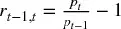 的函数。重叠不需要是完全的，即两个标签跨越相同的时间区间。在本节中，我们将计算作为给定收益 r~t−1,t~ 的函数的标签数量。第一，对于每个时间点 t = 1, ..., T，我们形成一个二元数组 {1~t,i~}~i=1,...,I~，其中 1~t,i~ ∈ {0, 1}。当且仅当 [t~i,0~, t~i,1~] 与 [t−1, t] 重叠时，变量 1~t,i~ = 1，否则为 0。回忆一下，标签的跨度 {[t~i,0~, t~i,1~]}~i=1,...,I~ 由[第 3 章](ch03.md)引入的 `t1` 对象定义。第二，我们计算在 t 处并发的标签数 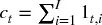。代码片段 4.1 展示了该逻辑的实现。

> **代码片段 4.1 估计标签的唯一性**

> 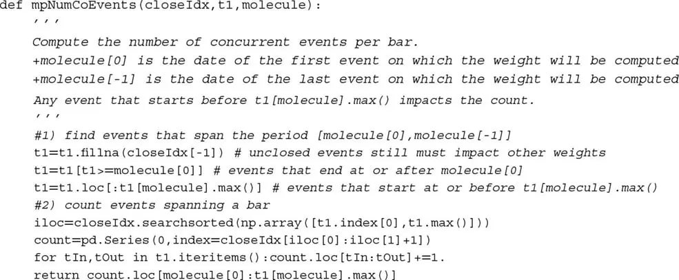

## 4.4 标签的平均唯一性

在本节中，我们将估计标签的唯一性（非重叠），以其生命周期内的平均唯一性来衡量。第一，标签 i 在时间 t 处的唯一性为 u~t,i~ = 1~t,i~ c~t~^−1^。第二，标签 i 的平均唯一性是 u~t,i~ 在标签生命周期上的平均值 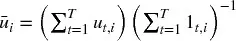。该平均唯一性也可以解释为 c~t~ 在事件生命周期上的调和平均的倒数。图 4.1 绘制了从 `t1` 对象导出的唯一性值的直方图。代码片段 4.2 实现了此计算。

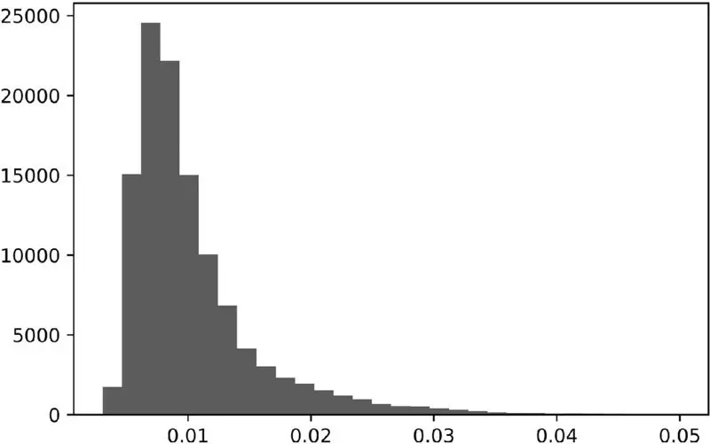

图 4.1 唯一性值直方图

> **代码片段 4.2 估计标签的平均唯一性**

> 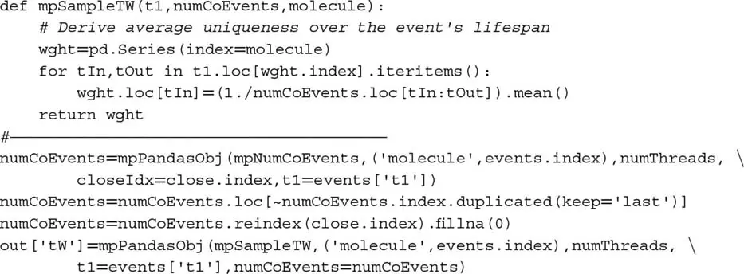

注意我们再次使用了 `mpPandasObj` 函数，它通过多进程加速计算（见[第 20 章](ch20.md)）。计算与标签 i 关联的平均唯一性 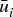 需要直到未来时间 `events['t1']` 才可用的信息。这不是问题，因为 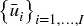 在训练集上与标签信息结合使用，而非测试集。这些  不用于预测标签，因此没有信息泄露。该过程允许我们以非重叠结果为标准，为每个观测特征分配 0 到 1 之间的唯一性得分。

## 4.5 Bagging 分类器与唯一性

在 I 个项目的集合上有放回地抽取 I 次后，不选中某个特定项目 i 的概率为 (1 − I^−1^)^I^。随着样本量增长，该概率收敛到渐近值 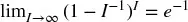。这意味着抽取的唯一观测数期望为 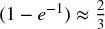。

假设非重叠结果的最大数量为 K ≤ I。根据同样的论证，在 I 个项目的集合上有放回地抽取 I 次后不选中某个特定项目 i 的概率为 (1 − K^−1^)^I^。随着样本量增长，该概率可以近似为 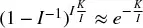。这意味着抽取的唯一观测数期望为 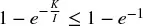。其含义是，错误地假设 IID 抽取会导致过采样。

在对观测进行有放回采样（bootstrap）时，当 ，袋内观测 increasingly likely 将 (1) 相互冗余，(2) 与袋外观测非常相似。抽取的冗余使 bootstrap 低效（见[第 6 章](ch06.md)）。例如，在随机森林的情况下，森林中的所有树本质上将是单个过拟合决策树的非常相似的副本。而且由于随机抽样使袋外示例与袋内示例非常相似，袋外精度将被严重夸大。我们将在[第 7 章](ch07.md)中研究非 IID 观测下的交叉验证时解决这第二个问题。目前，让我们集中关注第一个问题，即在  观测下的 bagging。

第一个解决方案是在执行 bootstrap 之前丢弃重叠结果。由于重叠不是完全的，仅因为有部分重叠就丢弃一个观测将导致信息的极端损失。我不建议你采用这个解决方案。

第二个更好的解决方案是利用平均唯一性 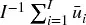 来减少包含冗余信息的结果的不当影响。因此，我们可以只采样观测的 `out['tW'].mean()` 部分，或其小的倍数。在 sklearn 中，`sklearn.ensemble.BaggingClassifier` 类接受参数 `max_samples`，可以设置为 `max_samples=out['tW'].mean()`。这样，我们强制袋内观测不以远高于其唯一性的频率被采样。随机森林不提供该 `max_samples` 功能，但一个解决方案是对大量决策树进行 bagging。我们将在[第 6 章](ch06.md)进一步讨论这个解决方案。

### 4.5.1 序贯 Bootstrap

第三个更好的解决方案是执行序贯 bootstrap（sequential bootstrap），其中抽取按照控制冗余的变化概率进行。Rao 等 [1997] 提出有放回的序贯重采样，直到出现 K 个不同的原始观测。虽然有趣，但他们的方案并不完全适用于我们的金融问题。在以下各节中，我们介绍一种直接解决重叠结果问题的替代方法。

第一，从均匀分布中抽取观测 X~i~，i ~ U[1, I]，即最初抽取任何特定值 i 的概率为 δ~i~^(1)^ = I^−1^。对于第二次抽取，我们希望降低抽取具有高度重叠结果的观测 X~j~ 的概率。记住，bootstrap 允许重复采样，因此仍然可能再次抽取 X~i~，但我们希望降低其可能性，因为 X~i~ 与自身之间存在重叠（实际上是完全重叠）。令 φ 为到目前为止的抽取序列，可能包含重复。到目前为止，我们知道 φ^(1)^ = {i}。在时间 t 处 j 的唯一性为 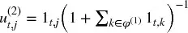，这是将替代 j 添加到现有抽取序列 φ^(1)^ 后产生的唯一性。j 的平均唯一性是 u~t,j~^(2)^ 在 j 生命周期上的平均值 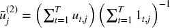。我们现在可以根据更新后的概率 {δ~j~^(2)^}~j=1,...,I~ 进行第二次抽取，

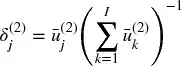

其中 {δ~j~^(2)^}~j=1,...,I~ 被缩放以加总为 1，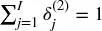。我们现在可以进行第二次抽取，更新 φ^(2)^ 并重新评估 {δ~j~^(3)^}~j=1,...,I~。重复该过程直到进行了 I 次抽取。该序贯 bootstrap 方案的优势在于，重叠（甚至重复）仍然可能，但可能性递减。序贯 bootstrap 样本将比标准 bootstrap 方法抽取的样本更接近 IID。这可以通过测量相对于标准 bootstrap 方法的  的增加来验证。

### 4.5.2 序贯 Bootstrap 的实现

代码片段 4.3 从两个参数导出指示矩阵：条的索引（`barIx`）和我们在[第 3 章](ch03.md)中多次使用的 pandas Series `t1`。作为提醒，`t1` 由包含观测特征时间的索引和包含标签确定时间的值数组定义。该函数的输出是一个二元矩阵，指示哪些（价格）条影响每个观测的标签。

> **代码片段 4.3 构建指示矩阵**

> 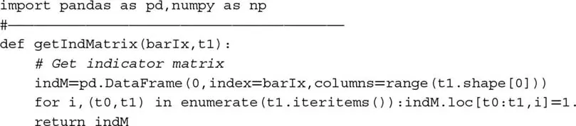

代码片段 4.4 返回每个观测特征的平均唯一性。输入是由 `getIndMatrix` 构建的指示矩阵。

> **代码片段 4.4 计算平均唯一性**

> 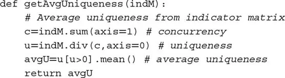

代码片段 4.5 给出了序贯 bootstrap 采样的特征索引。输入是指示矩阵（`indM`）和可选的样本长度（`sLength`），默认值为 `indM` 的行数。

> **代码片段 4.5 从序贯 Bootstrap 返回样本**

> 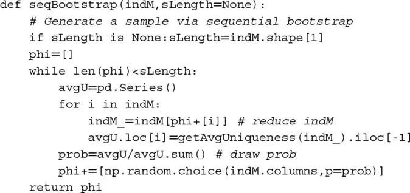

### 4.5.3 数值示例

考虑一组标签 {y~i~}~i=1,2,3~，其中标签 y~1~ 是收益 r~0,3~ 的函数，标签 y~2~ 是收益 r~2,4~ 的函数，标签 y~3~ 是收益 r~4,6~ 的函数。结果的重叠由该指示矩阵 {1~t,i~} 表征，

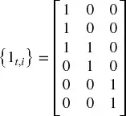

该过程从 φ^(0)^ = ∅ 和均匀概率分布 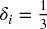 开始，∀i = 1, 2, 3。假设我们从 {1, 2, 3} 中随机抽取一个数，选中了 2。在从 {1, 2, 3} 进行第二次抽取之前（记住，bootstrap 有放回采样），我们需要调整概率。到目前为止抽取的观测集为 φ^(1)^ = {2}。第一个特征的平均唯一性为 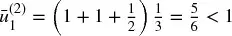，第二个特征为 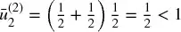。第二次抽取的概率为 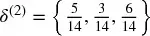。有两点值得提及：(1) 最低概率分配给第一次抽取中选中的特征，因为它表现出最高的重叠；(2) 在 φ^(1)^ 之外的两个可能抽取中，更大的概率分配给 δ~3~^(2)^，因为它是与 φ^(1)^ 无重叠的标签。假设第二次抽取选中了数字 3。我们将第三次也是最后一次抽取的概率 δ^(3)^ 的更新留作练习。代码片段 4.6 在本例中的 {1~t,i~} 指示矩阵上运行序贯 bootstrap。

> **代码片段 4.6 序贯 Bootstrap 示例**

> 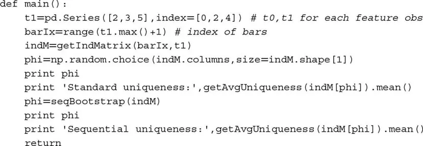

### 4.5.4 蒙特卡洛实验

我们可以通过实验方法评估序贯 bootstrap 算法的效率。代码片段 4.7 列出了为若干观测 `numObs`（I）生成随机 `t1` 序列的函数。每个观测在从均匀分布中抽取的随机数处进行，边界为 0 和 `numBars`，其中 `numBars` 是条数（T）。观测跨越的条数由从边界为 0 和 `maxH` 的均匀分布中抽取随机数确定。

> **代码片段 4.7 生成随机 T1 序列**

> 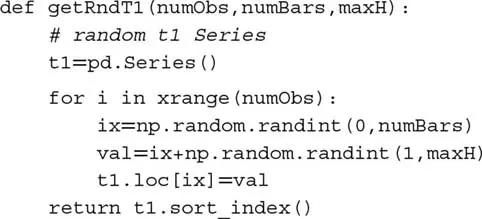

代码片段 4.8 接受该随机 `t1` 序列，并导出隐含的指示矩阵 `indM`。然后该矩阵接受两种过程。在第一种中，我们从标准 bootstrap（有放回随机采样）导出平均唯一性。在第二种中，我们通过应用序贯 bootstrap 算法导出平均唯一性。结果以字典形式报告。

> **代码片段 4.8 标准 Bootstrap 和序贯 Bootstrap 的唯一性**

> 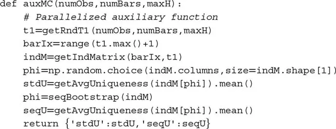

这些操作必须在大规模迭代上重复。代码片段 4.9 使用[第 20 章](ch20.md)讨论的多进程技术实现该蒙特卡洛。例如，对于 24 核服务器，执行 1E6 次迭代的蒙特卡洛大约需要 6 小时，其中 `numObs=10`、`numBars=100`、`maxH=5`。如果没有并行化，类似的蒙特卡洛实验将需要大约 6 天。

> **代码片段 4.9 多线程蒙特卡洛**

> 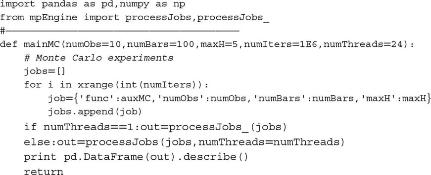

图 4.2 绘制了标准 bootstrap 样本（左）和序贯 bootstrap 样本（右）的唯一性直方图。标准方法的平均唯一性中位数为 0.6，序贯方法的平均唯一性中位数为 0.7。对均值差异的 ANOVA 检验返回了一个极小的概率。从统计上讲，序贯 bootstrap 方法的样本在任何合理的置信水平下都有超过标准 bootstrap 方法的期望唯一性。

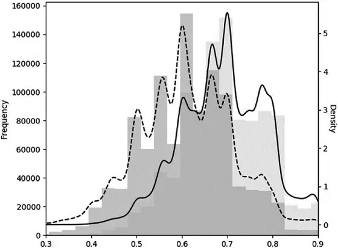

图 4.2 标准 Bootstrap 与序贯 Bootstrap 的蒙特卡洛实验

## 4.6 收益归因

在上一节中，我们学习了将样本 bootstrap 到更接近 IID 的方法。在本节中，我们将介绍一种为训练 ML 算法而加权这些样本的方法。如果将高度重叠的结果与非重叠结果视为等同，它们将拥有不成比例的权重。同时，与大的绝对收益关联的标签应比可忽略绝对收益的标签获得更多重要性。简言之，我们需要根据唯一性和绝对收益的某个函数对观测加权。

当标签是收益符号的函数（标准标记为 {−1, 1}，元标签为 {0, 1}）时，样本权重可以根据事件生命周期 [t~i,0~, t~i,1~] 上归因收益的总和来定义，

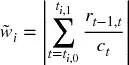

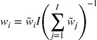

因此 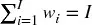。我们将这些权重缩放以加总为 I，因为库（包括 sklearn）通常在假设默认权重为 1 的情况下定义算法参数。

该方法的基本原理是，我们希望根据可唯一归因于观测的绝对对数收益的函数来加权观测。然而，如果存在「中性」（收益低于阈值）情况，该方法将不起作用。对于该情况，较低的收益应被分配较高的权重，而非倒数。「中性」情况是不必要的，因为它可以由低置信度的「−1」或「1」预测来暗示。这是我通常建议丢弃「中性」情况的几个原因之一。代码片段 4.10 实现了该方法。

> **代码片段 4.10 通过绝对收益归因确定样本权重**

> 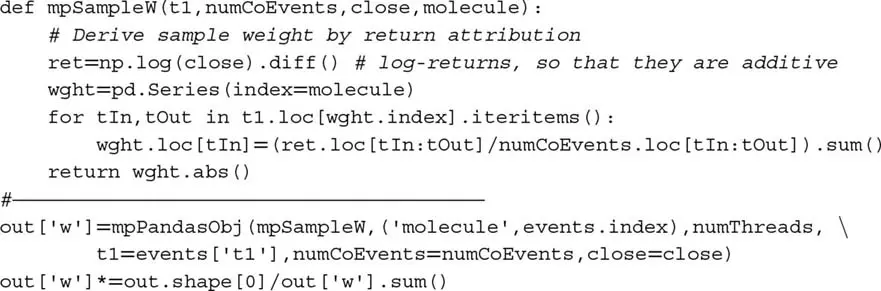

## 4.7 时间衰减

市场是自适应系统（Lo [2017]）。随着市场演变，较旧的示例不如较新的相关。因此，我们通常希望样本权重随着新观测的到来而衰减。令 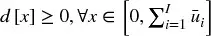 为将乘以上一节导出的样本权重的时间衰减因子。最终权重没有衰减 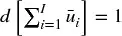，所有其他权重将相对于它进行调整。令 c ∈ (−1, 1] 为用户定义的参数，按如下方式确定衰减函数：对于 c ∈ [0, 1]，则 d~1~ = c，线性衰减；对于 c ∈ (−1, 0)，则 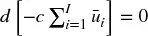，在 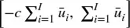 和 d[x] = 0 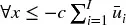 之间线性衰减。对于分段线性函数 d = max{a + bx, 0}，以下边界条件满足这些要求：

1.  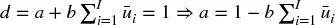。
2.  取决于 c：
    1.  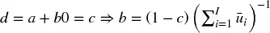，∀c ∈ [0, 1]
    2.  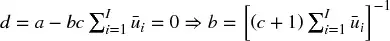，∀c ∈ (−1, 0)

代码片段 4.11 实现了这种形式的时间衰减因子。注意，时间并非指按时间顺序。在此实现中，衰减根据累积唯一性 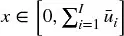 发生，因为按时间顺序的衰减会在冗余观测存在时过快地降低权重。

> **代码片段 4.11 时间衰减因子的实现**

> 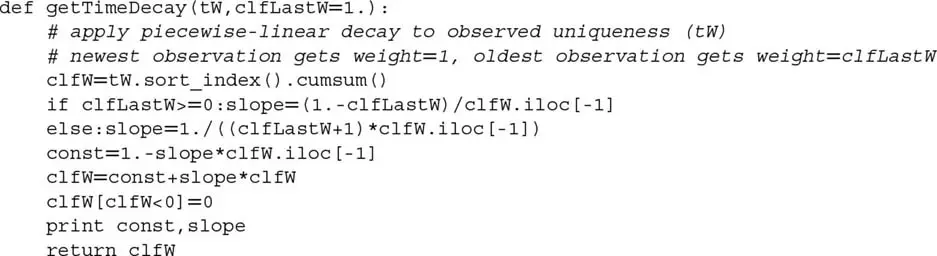

值得讨论几个有趣的情况：

- c = 1 意味着没有时间衰减。
- 0 < c < 1 意味着权重随时间线性衰减，但每个观测仍然获得严格正的权重，无论多旧。
- c = 0 意味着权重随着变旧线性收敛到零。
- c < 0 意味着最旧的部分 cT 的观测获得零权重（即从记忆中抹去）。

图 4.3 显示了对 c ∈ {1, .75, .5, 0, −.25, −.5} 应用衰减因子后的衰减权重 `out['w']*df`。虽然不一定实用，但该过程允许通过设置 c > 1 来生成随变旧而增加的权重。

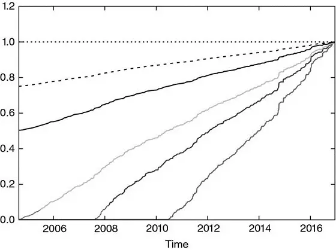

图 4.3 分段线性时间衰减因子

## 4.8 类别权重

除了样本权重，应用类别权重通常也很有用。类别权重是纠正代表性不足标签的权重。这在最重要类别出现稀少的分类问题中尤为关键（King 和 Zeng [2001]）。例如，假设你希望预测流动性危机，如 2010 年 5 月 6 日的闪电崩盘。相对于它们之间发生的数百万次观测，这些事件很少见。除非我们为与那些罕见标签关联的样本分配更高的权重，否则 ML 算法将最大化最常见标签的精度，而闪电崩盘将被视为异常值而非罕见事件。

ML 库通常实现处理类别权重的功能。例如，sklearn 以权重 `class_weight[j]` 而非 1 来惩罚 `class[j]`（j=1,...,J）样本中的错误。因此，标签 j 上更高的类别权重将迫使算法在 j 上达到更高的精度。当类别权重不加总为 J 时，效果等价于改变分类器的正则化参数。

在金融应用中，分类算法的标准标签为 {−1, 1}，其中零（或中性）情况将由概率仅略高于 0.5 且低于某个中性阈值的预测来暗示。没有理由偏向某一类的精度，因此一个好的默认值是分配 `class_weight='balanced'`。该选择重新加权观测，以模拟所有类别以相同频率出现。在 bagging 分类器的上下文中，你可能想考虑参数 `class_weight='balanced_subsample'`，这意味着 `class_weight='balanced'` 将应用于袋内 bootstrap 样本，而非整个数据集。有关完整细节，阅读 sklearn 中实现 `class_weight` 的源代码是有帮助的。还请注意这个已报告的 bug：https://github.com/scikit-learn/scikit-learn/issues/4324。

## 练习题

1. 在[第 3 章](ch03.md)中，我们将 `t1` 记为第一次触及障碍的时间戳 pandas 序列，索引为观测的时间戳。这是 `getEvents` 函数的输出。
    1. 在从 E-mini S&P 500 期货 tick 数据导出的美元条上计算 `t1` 序列。
    2. 应用函数 `mpNumCoEvents` 计算每个时间点的重叠结果数。
    3. 在主轴上绘制并发标签数的时间序列，在副轴上绘制收益的指数加权移动标准差的时间序列。
    4. 生成并发标签数（x 轴）和收益的指数加权移动标准差（y 轴）的散点图。你能看出关系吗？

2. 使用函数 `mpSampleTW` 计算每个标签的平均唯一性。该时间序列的一阶序列相关 AR(1) 是多少？统计显著吗？为什么？

3. 对 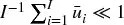 的金融数据集拟合随机森林。
    1. 平均袋外精度是多少？
    2. 同一数据集上的 k 折交叉验证（无打乱）的平均精度是多少？
    3. 为什么袋外精度比交叉验证精度高得多？哪个更正确/偏差更小？偏差的来源是什么？

4. 修改第 4.7 节的代码以应用指数时间衰减因子。

5. 考虑你对趋势跟踪模型确定的事件应用了元标签。假设三分之二的标签为 0，三分之一的标签为 1。
    1. 如果不平衡类别权重就拟合分类器会怎样？
    2. 标签 1 意味着真阳性，标签 0 意味着假阳性。通过应用平衡的类别权重，我们迫使分类器更关注真阳性，较少关注假阳性。这为什么有意义？
    3. 应用平衡类别权重前后，预测标签的分布是什么？

6. 更新第 4.5.3 节最后一次抽取的抽取概率。

7. 在第 4.5.3 节中，假设第二次抽取再次选中了数字 2。第三次抽取的更新概率是多少？

## 参考文献

1. Rao, C., P. Pathak and V. Koltchinskii (1997): "Bootstrap by sequential resampling." *Journal of Statistical Planning and Inference*, Vol. 64, No. 2, pp. 257--281.
2. King, G. and L. Zeng (2001): "Logistic Regression in Rare Events Data." Working paper, Harvard University. Available at https://gking.harvard.edu/files/0s.pdf.
3. Lo, A. (2017): *Adaptive Markets*, 1st ed. Princeton University Press.

## 参考书目

样本权重是 ML 文献中的常见主题。然而本章讨论的实际问题是投资应用的典型特征，学术文献对此极其稀缺。以下是一些间接涉及本章讨论问题的出版物。

1. Efron, B. (1979): "Bootstrap methods: Another look at the jackknife." *Annals of Statistics*, Vol. 7, pp. 1--26.
2. Efron, B. (1983): "Estimating the error rate of a prediction rule: Improvement on cross-validation." *Journal of the American Statistical Association*, Vol. 78, pp. 316--331.
3. Bickel, P. and D. Freedman (1981): "Some asymptotic theory for the bootstrap." *Annals of Statistics*, Vol. 9, pp. 1196--1217.
4. Gine, E. and J. Zinn (1990): "Bootstrapping general empirical measures." *Annals of Probability*, Vol. 18, pp. 851--869.
5. Hall, P. and E. Mammen (1994): "On general resampling algorithms and their performance in distribution estimation." *Annals of Statistics*, Vol. 24, pp. 2011--2030.
6. Mitra, S. and P. Pathak (1984): "The nature of simple random sampling." *Annals of Statistics*, Vol. 12, pp. 1536--1542.
7. Pathak, P. (1964): "Sufficiency in sampling theory." *Annals of Mathematical Statistics*, Vol. 35, pp. 795--808.
8. Pathak, P. (1964): "On inverse sampling with unequal probabilities." *Biometrika*, Vol. 51, pp. 185--193.
9. Praestgaard, J. and J. Wellner (1993): "Exchangeably weighted bootstraps of the general empirical process." *Annals of Probability*, Vol. 21, pp. 2053--2086.
10. Rao, C., P. Pathak and V. Koltchinskii (1997): "Bootstrap by sequential resampling." *Journal of Statistical Planning and Inference*, Vol. 64, No. 2, pp. 257--281.
