# 分数阶差分特征

## 5.1 动机
It is known that, as a consequence of arbitrage forces, financial
series exhibit low signal-to-noise ratios (López de Prado [2015]). To
make matters worse, standard stationarity transformations, like integer
differentiation, further reduce that signal by removing memory. Price
series have memory, because every value is dependent upon a long history
of previous levels. In contrast, integer differentiated series, like
returns, have a memory cut-off, in the sense that history is disregarded
entirely after a finite sample window. Once stationarity transformations
have wiped out all memory from the data, statisticians resort to complex
mathematical techniques to extract whatever residual signal remains. Not
surprisingly, applying these complex techniques on memory-erased series
likely leads to false discoveries. In this chapter we introduce a data
transformation method that ensures the stationarity of the data while
preserving as much memory as possible.

## 5.2 平稳性与记忆的困境
It is common in finance to find non-stationary time series. What makes
these series non-stationary is the presence of memory, i.e., a long
history of previous levels that shift the series\' mean over time. In
order to perform inferential analyses, researchers need to work with
invariant processes, such as returns on prices (or changes in
log-prices), changes in yield, or changes in volatility. These data
transformations make the series stationary, at the expense of removing
all memory from the original series (Alexander [2001], chapter 11).
Although stationarity is a necessary property for inferential purposes,
it is rarely the case in signal processing that we wish all memory to be
erased, as that memory is the basis for the model\'s predictive power.
For example, equilibrium (stationary) models need some memory to assess
how far the price process has drifted away from the long-term expected
value in order to generate a forecast. The dilemma is that returns are
stationary, however memory-less, and prices have memory, however they
are non-stationary. The question arises: What is the minimum amount of
differentiation that makes a price series stationary while preserving as
much memory as possible? Accordingly, we would like to generalize the
notion of returns to consider] *stationary series
where not all memory is erased.* [Under this framework, returns are just
one kind of (and in most cases suboptimal) price transformation among
many other possibilities.

Part of the importance of cointegration methods is their ability to
model series with memory. But why would the particular case of zero
differentiation deliver best outcomes? Zero differentiation is as
arbitrary as 1-step differentiation. There is a wide region between
these two extremes (fully differentiated series on one hand, and zero
differentiated series on the other) that can be explored through
fractional differentiation for the purpose of developing a highly
predictive ML model.

Supervised learning algorithms typically require stationary features.
The reason is that we need to map a previously unseen (unlabeled)
observation to a collection of labeled examples, and infer from them the
label of that new observation. If the features are not stationary, we
cannot map the new observation to a large number of known examples. But
stationarity does not ensure predictive power. Stationarity is a
necessary, non-sufficient condition for the high performance of an ML
algorithm. The problem is, there is a trade-off between stationarity and
memory. We can always make a series more stationary through
differentiation, but it will be at the cost of erasing some memory,
which will defeat the forecasting purpose of the ML algorithm. In this
chapter, we will study one way to resolve this
dilemma.

## 5.3 文献综述
Virtually all the financial time series literature is based on the
premise of making non-stationary series stationary through integer
transformation (see Hamilton [1994] for an example). This raises two
questions: (1) Why would integer 1 differentiation (like the one used
for computing returns on log-prices) be optimal? (2) Is
over-differentiation one reason why the literature has been so biased in
favor of the efficient markets hypothesis?

The notion of fractional differentiation applied to the predictive time
series analysis dates back at least to Hosking [1981]. In that paper,
a family of ARIMA processes was generalized by permitting the degree of
differencing to take fractional values. This was useful because
fractionally differenced processes exhibit long-term persistence and
antipersistence, hence enhancing the forecasting power compared to the
standard ARIMA approach. In the same paper, Hosking states: "Apart from
a passing reference by Granger (1978), fractional differencing does not
appear to have been previously mentioned in connection with time series
analysis."

After Hosking\'s paper, the literature on this subject has been
surprisingly scarce, adding up to eight journal articles written by only
nine authors: Hosking, Johansen, Nielsen, MacKinnon, Jensen, Jones,
Popiel, Cavaliere, and Taylor. See the references for details. Most of
those papers relate to technical matters, such as fast algorithms for
the calculation of fractional differentiation in continuous stochastic
processes (e.g., Jensen and Nielsen [2014]).

Differentiating the stochastic process is a computationally expensive
operation. In this chapter we will take a practical, alternative, and
novel approach to recover stationarity: We will generalize the
difference operator to non-integer steps.

## 5.4 方法
Consider the backshift operator,] *B* [, applied to
a matrix of real-valued features  *X
~[*t*]~* [}, where] *B^[*k*]^ X
~[*t*]~* [=] *X ~[*t*\ −\ *k*]~* for
any integer *k* [≥ 0] *.* For
example, (1 − *B* [) ^[2]^ = 1 −
2] *B* [+] *B^[2]^* [,
where] *B^[2]^ X ~[*t*]~*
=] *X ~[*t*\ −\ 2]~* [, so that (1
−] *B* [) ^[2]^ ] *X
~[*t*]~* [=] *X ~[*t*]~* [−
2] *X ~[*t*\ −\ 1]~* [+
*X ~[*t*\ −\ 2]~* [. Note that
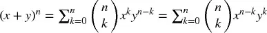 [,
for] *n* a positive integer. For a real
number *d* [,
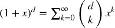 [, the
binomial series.

In a fractional model, the exponent] *d* [is allowed
to be a real number, with the following formal binomial series
expansion:

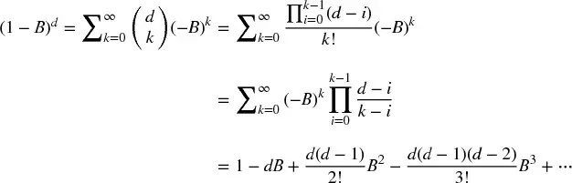

### 5.4.1 Long Memory

Let us see how a real (non-integer) positive] *d*
preserves memory. This arithmetic series consists of a dot
product

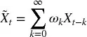

with weights ω

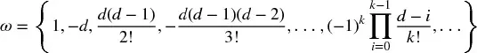

and values] *X*

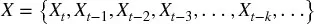

When] *d* is a positive integer
number, 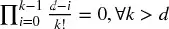 [, and memory beyond that point is cancelled.
For example,] *d* [= 1 is used to compute returns,
where] 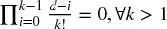 [, and ω = {1, −1, 0, 0, ...}.

### 5.4.2 Iterative Estimation

Looking at the sequence of weights, ω, we can appreciate that
for] *k* [= 0, ..., ∞, with ω ~[0]~ = 1, the
weights can be generated iteratively as:

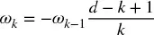

图 5.1 [plots the sequence of
weights used to compute each value of the fractionally differentiated
series. The legend reports the value of] *d* [used to
generate each sequence, the x-axis indicates the value
of] *k* [, and the y-axis shows the value of ω
~[*k*]~ . For example, for] *d* [= 0, all
weights are 0 except for ω ~[0]~ = 1] *.*
That is the case where the differentiated series coincides with the
original one. For] *d* [= 1, all weights are 0 except
for ω ~[0]~ = 1 and ω ~[1]~ = −1] *.*
That is the standard first-order integer differentiation, which is used
to derive log-price returns. Anywhere in between these two cases, all
weights after ω ~[0]~ = 1 are negative and greater than
−1.

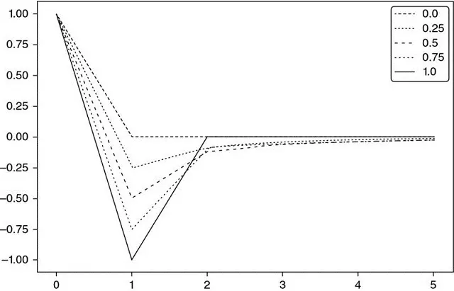

**图 5.1** *ω ~[*k*]~*
(y-axis) as *k* increases (x-axis). Each line is associated with a
particular value of *d* ∈ [0,1], in 0.1 increments.

图 5.2 plots the sequence of
weights where *d* [∈ [1, 2], at increments of 0.1.
For] *d* [\> 1, we observe ω ~[1]~ \< −1 and
ω ~[*k*]~ \> 0, ∀] *k* [≥
2] *.*

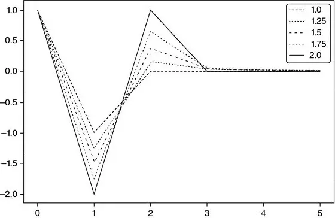

**图 5.2** *ω ~[*k*]~*
(y-axis) as *k* increases (x-axis). Each line is associated with a
particular value of *d* ∈ [1,2], in 0.1 increments.

代码片段 5.1 lists the code used to generate these
plots.

> **SNIPPET 5.1 WEIGHTING FUNCTION**

> 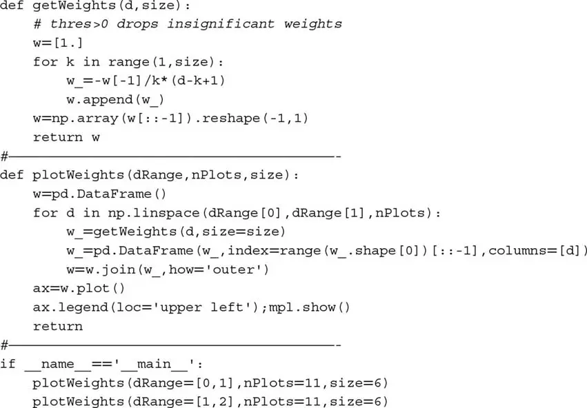

### 5.4.3 Convergence

Let us consider the convergence of the weights. From the above result,
we can see that for] *k* [\>] *d*
, if ω ~[*k*\ −\ 1]~ ≠ 0, then
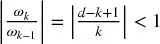 [, and ω
~[*k*]~ = 0 otherwise. Consequently, the weights converge
asymptotically to zero, as an infinite product of factors within the
unit circle. Also, for a positive] *d*
and] *k* [\<] *d* [+ 1, we
have] 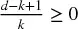 [, which makes the initial weights alternate in sign. For a
non-integer] *d* [, once] *k*
≥] *d* [+ 1, ω ~[*k*]~ will be negative if
int[] *d* [] is even, and positive otherwise.
Summarizing,] 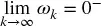 [(converges to zero from the left) when
int[] *d* [] is even, and
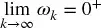 [(converges
to zero from the right) when Int[] *d* [] is odd.
In the special case] *d* [∈ (0, 1), this means that −
1 \< ω ~[*k*]~ \< 0, ∀] *k* [\>
0] *.* [This alternation of weight signs is necessary
to make] 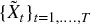 [stationary, as memory wanes or is offset over
the long run.

## 5.5 实现
在本节中我们将 explore two alternative implementations of
fractional differentiation: the standard "expanding window" method, and
a new method that I call "fixed-width window fracdiff"
(FFD).

### 5.5.1 Expanding Window

Let us discuss how to fractionally differentiate a (finite) time series
in practice. Suppose a time series with] *T* [real
observations,  *X ~[*t*]~*
}, ] *t* [= 1, ...,] *T* [.
Because of data limitations, the fractionally differentiated
value]  [cannot be computed on an infinite series of weights. For
instance, the last point
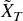 [will use
weights {ω ~[*k*]~}, ] *k* [= 0,
...,] *T* [− 1, and
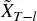 [will use
weights {ω ~[*k*]~}, ] *k* [= 0,
...,] *T* [−] *l* [− 1. This means
that the initial points will have a different amount of memory compared
to the final points. For each] *l* [, we can
determine the relative weight-loss,
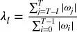 [. Given a
tolerance level τ ∈ [0, 1], we can determine the
value] *l* [* such that

and] 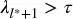 [. This value] *l* [* corresponds to the
first results] 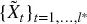 [where the weight-loss is beyond the acceptable
threshold, λ ~[*t*]~ \> τ (e.g., τ = 0.01)
*.*

From our earlier discussion, it is clear that
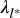 [depends on
the convergence speed of {ω ~[*k*]~}, which in turn depends
on] *d* [∈ [0, 1]. For] *d* [=
1, ω ~[*k*]~ = 0, ∀] *k* [\> 1, and λ
~[*l*]~ = 0, ∀] *l* [\> 1, hence it suffices
to drop] 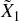 [. As] *d* [→ 0^[+]^
,] *l* [* increases, and a larger portion of the
initial]  [needs to be dropped in order to keep the
weight-loss] 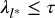 [.] 图 5.3 [plots the E-mini S&P 500
futures trade bars of size 1E4, rolled forward, fractionally
differentiated, with parameters (] *d* [= .4, τ = 1)
on the top and parameters (] *d* [= .4, τ =
1] *E* [− 2) on the bottom.

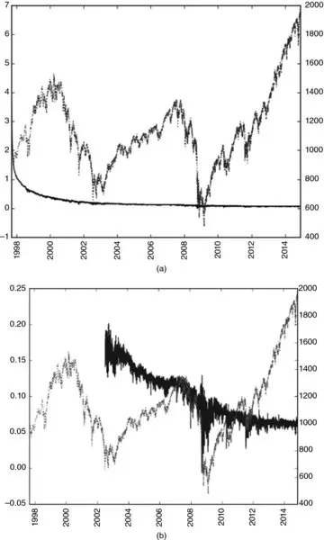

**图 5.3** Fractional
differentiation without controlling for weight loss (top plot) and after
controlling for weight loss with an expanding window (bottom plot)

The negative drift in both plots is caused by the negative weights that
are added to the initial observations as the window is expanded. When we
do not control for weight loss, the negative drift is extreme, to the
point that only that trend is visible. The negative drift is somewhat
more moderate in the right plot, after controlling for the weight loss,
however, it is still substantial, because values
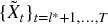 [are
computed on an expanding window. This problem can be corrected by a
fixed-width window, implemented in 代码片段 5.2.

> **SNIPPET 5.2 STANDARD FRACDIFF (EXPANDING WINDOW)**

> 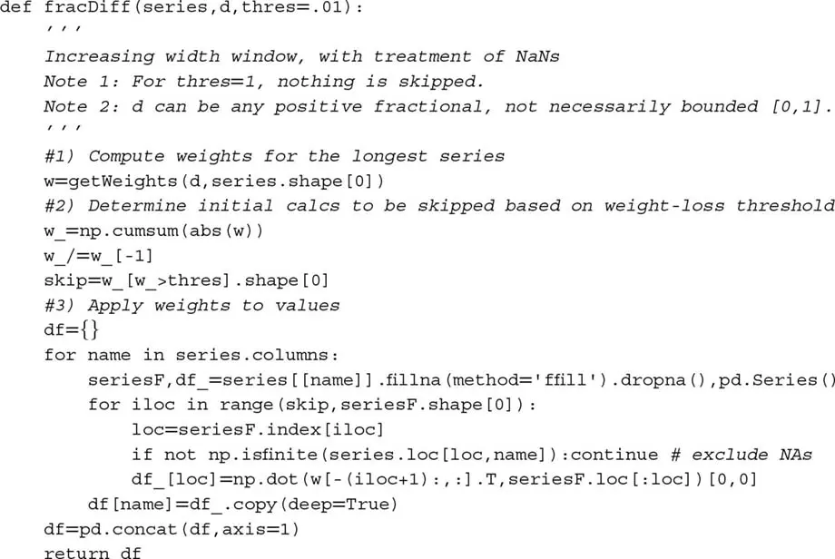

### 5.5.2 Fixed-Width Window Fracdiff

Alternatively, fractional differentiation can be computed using a
fixed-width window, that is, dropping the weights after their modulus
(\|ω ~[*k*]~ \|) falls below a given threshold value
(τ)] *.* This is equivalent to finding the
first *l* [* such that
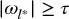
and] 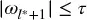 [, setting a new variable
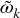

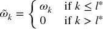

and] 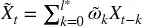 [, for] *t* [=] *T*
−] *l* [* + 1, ...,] *T*
.]  Figure
5.4 [plots E-mini S&P 500 futures
trade bars of size 1E4, rolled forward, fractionally differentiated
(] *d* [= .4, τ = 1] *E* [−
5).

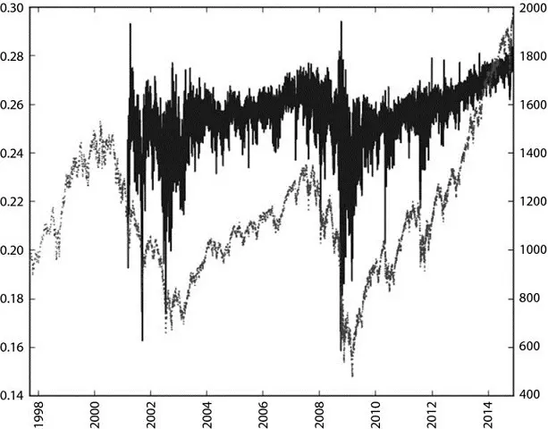

**图 5.4** Fractional
differentiation after controlling for weight loss with a fixed-width
window

This procedure has the advantage that the same vector of weights is
used across all estimates of
 [, hence
avoiding the negative drift caused by an expanding window\'s added
weights. The result is a driftless blend of level plus noise, as
expected. The distribution is no longer Gaussian, as a result of the
skewness and excess kurtosis that comes with memory, however it is
stationary. 代码片段 5.3 presents an implementation of this
idea.

> **SNIPPET 5.3 THE NEW FIXED-WIDTH WINDOW FRACDIFF METHOD**

> 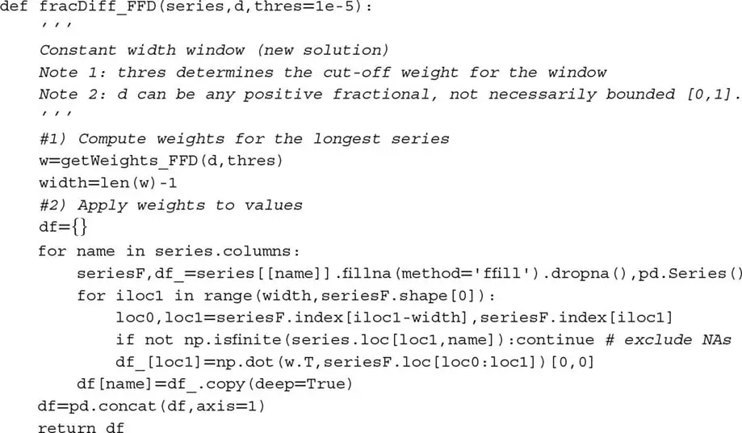

## 5.6 最大记忆保留下的平稳性
Consider a series  *X ~[*t*]~* [}
~[*t*\ =\ 1,\ ...,\ *T*]~ . Applying the fixed-width window
fracdiff (FFD) method on this series, we can compute the minimum
coefficient] *d* [* such that the resulting
fractionally differentiated series
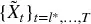 is
stationary. This coefficient *d* [* quantifies the
amount of memory that needs to be removed to achieve stationarity.
If]  is already stationary, then *d* [* =
0] *.* [If
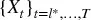 contains a
unit root, then *d* [* \< 1] *.*
If]  [exhibits explosive behavior (like in a bubble),
then] *d* [* \> 1] *.* A case of
particular interest is 0 \< *d* [* ≪ 1, when the
original series is "mildly non-stationary." In this case, although
differentiation is needed, a full integer differentiation removes
excessive memory (and predictive power).

图 5.5 [illustrates this
concept. On the right y-axis, it plots the ADF statistic computed on
E-mini S&P 500 futures log-prices, rolled forward using the ETF trick
(see [第 2 章](ch02.md)), downsampled to daily frequency, going back to the
contract\'s inception. On the x-axis, it displays
the] *d* [value used to generate the series on which
the ADF statistic was computed. The original series has an ADF statistic
of --0.3387, while the returns series has an ADF statistic of --46.9114.
At a 95% confidence level, the test\'s critical value is --2.8623. The
ADF statistic crosses that threshold in the vicinity
of] *d* [= 0.35] *.* [The left
y-axis plots the correlation between the original series
(] *d* [= 0) and the differentiated series at
various] *d* values. At *d* [=
0.35 the correlation is still very high, at 0.995. This confirms that
the procedure introduced in this chapter has been successful in
achieving stationarity without giving up too much memory. In contrast,
the correlation between the original series and the returns series is
only 0.03, hence showing that the standard integer differentiation wipes
out the series' memory almost entirely.

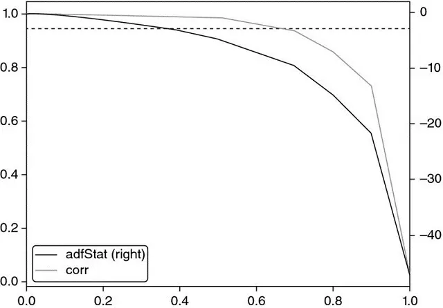

**图 5.5** ADF statistic as a
function of *d* , on E-mini S&P 500 futures log-prices

Virtually all finance papers attempt to recover stationarity by
applying an integer differentiation] *d* [= 1 ≫ 0.35,
which means that most studies have over-differentiated the series, that
is, they have removed much more memory than was necessary to satisfy
standard econometric assumptions. 代码片段 5.4 lists the code used to
produce these results.

> **SNIPPET 5.4 FINDING THE MINIMUM** ***D*** **VALUE THAT PASSES THE
> ADF TEST**

> 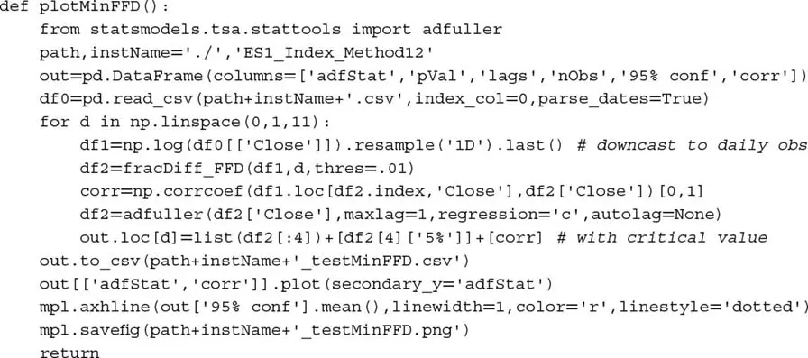

The example on E-mini futures is by no means an
exception.] Table 5.1 shows the ADF statistics
after applying FFD( *d* [) on various values
of] *d* [, for 87 of the most liquid futures
worldwide. In all cases, the standard] *d* [= 1 used
for computing returns implies over-differentiation. In fact, in all
cases stationarity is achieved with] *d* [\<
0.6] *.* [In some cases, like orange juice (JO1
Comdty) or live cattle (LC1 Comdty) no differentiation at all was
needed.

**表 5.1** **ADF Statistic on
FFD(** ***d*** **) for Some of the Most Liquid Futures Contracts**

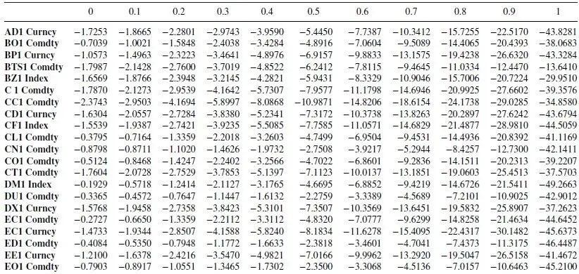

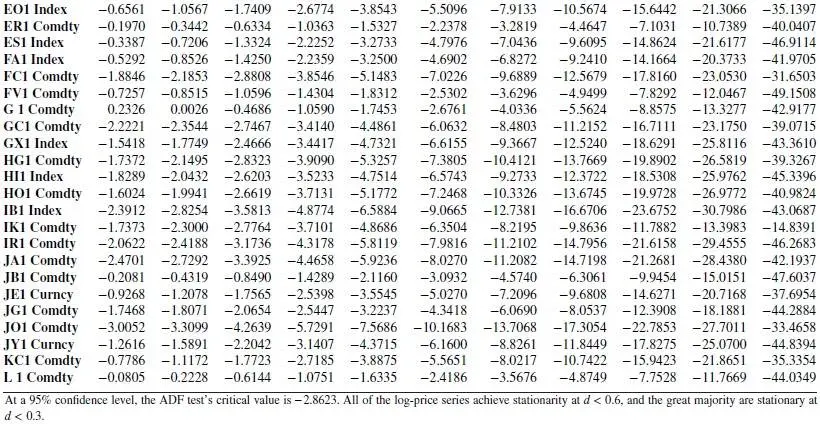

## 5.7 结论
To summarize, most econometric analyses follow one of two
paradigms:

1.  Box-Jenkins: Returns are stationary, however memory-less.
2.  Engle-Granger: Log-prices have memory, however they are
    non-stationary. Cointegration is the trick that makes regression
    work on non-stationary series, so that memory is preserved. However
    the number of cointegrated variables is limited, and the
    cointegrating vectors are notoriously unstable.

In contrast, the FFD approach introduced in this chapter shows that
there is no need to give up all of the memory in order to gain
stationarity. And there is no need for the cointegration trick as it
relates to ML forecasting. Once you become familiar with FFD, it will
allow you to achieve stationarity without renouncing to memory (or
predictive power).

In practice, I suggest you experiment with the following transformation
of your features: First, compute a cumulative sum of the time series.
This guarantees that some order of differentiation is needed. Second,
compute the FFD(] *d* [) series for
various] *d* [∈ [0, 1]. Third, determine the
minimum] *d* such that the p-value of the ADF
statistic on FFD( *d* [) falls below 5%. Fourth, use
the FFD(] *d* [) series as your predictive
feature.

## 练习题

1.  [Generate a time series from an IID Gaussian random process. This is
    > > a memory-less, stationary series:

    :::
    :::

    1.  Compute the ADF statistic on this series. What is the p-value?
    2.  Compute the cumulative sum of the observations. This is a
        non-stationary series without memory.
        1.  What is the order of integration of this cumulative series?
        2.  Compute the ADF statistic on this series. What is the
            p-value?
    3.  Differentiate the series twice. What is the p-value of this
        over-differentiated series?

2.  [Generate a time series that follows a sinusoidal function. This is
    > > a stationary series with memory.

    :::
    :::

    1.  Compute the ADF statistic on this series. What is the p-value?
    2.  Shift every observation by the same positive value. Compute the
        cumulative sum of the observations. This is a non-stationary
        series with memory.
        1.  Compute the ADF statistic on this series. What is the
            p-value?
        2.  Apply an expanding window fracdiff, with τ = 1*E* − 2*.* For
            what minimum *d* value do you get a p-value below 5%?
        3.  Apply FFD, with τ = 1*E* − 5*.* For what minimum *d* value
            do you get a p-value below 5%?

3.  [Take the series from exercise 2.b:

    :::
    :::

    1.  Fit the series to a sine function. What is the R-squared?
    2.  Apply FFD(*d = 1* ). Fit the series to a sine function. What is
        the R-squared?
    3.  What value of *d* maximizes the R-squared of a sinusoidal fit on
        FFD(*d* ). Why?

4.  [Take the dollar bar series on E-mini S&P 500 futures. Using the
    > > code in 代码片段 5.3, for some] *d* [∈ [0,
    > > 2], compute
    > > `fracDiff_FFD(fracDiff_FFD(series,d),-d)` [. What do you get?
    > > Why?

5.  [Take the dollar bar series on E-mini S&P 500
    > > futures.

    :::
    :::

    1.  Form a new series as a cumulative sum of log-prices.
    2.  Apply FFD, with τ = 1*E* − 5*.* Determine for what minimum *d* ∈
        [0, 2] the new series is stationary.
    3.  Compute the correlation of the fracdiff series to the original
        (untransformed) series.
    4.  Apply an Engel-Granger cointegration test on the original and
        fracdiff series. Are they cointegrated? Why?
    5.  Apply a Jarque-Bera normality test on the fracdiff series.

6.  [Take the fracdiff series from exercise 5.

    :::
    :::

    1.  Apply a CUSUM filter ([第 2 章](ch02.md)), where *h* is twice the
        standard deviation of the series.
    2.  Use the filtered timestamps to sample a features' matrix. Use as
        one of the features the fracdiff value.
    3.  Form labels using the triple-barrier method, with symmetric
        horizontal barriers of twice the daily standard deviation, and a
        vertical barrier of 5 days.
    4.  Fit a bagging classifier of decision trees where:
        1.  The observed features are bootstrapped using the sequential
            method from [第 4 章](ch04.md).
        2.  On each bootstrapped sample, sample weights are determined
            using the techniques from [第 4 章](ch04.md).

## 参考文献

1.  Alexander, C. (2001): *Market Models* , 1st edition. John Wiley &
    Sons.
2.  Hamilton, J. (1994): *Time Series Analysis* , 1st ed. Princeton
    University Press.
3.  Hosking, J. (1981): "Fractional differencing." *Biometrika* , Vol.
    68, No. 1, pp. 165--176.
4.  Jensen, A. and M. Nielsen (2014): "A fast fractional difference
    algorithm." *Journal of Time Series Analysis* , Vol. 35, No. 5, pp.
    428--436.
5.  López de Prado, M. (2015): "The Future of Empirical Finance."
    *Journal of Portfolio Management* , Vol. 41, No. 4, pp. 140--144.
    Available at <https://ssrn.com/abstract=2609734> .

## 参考书目

1.  Cavaliere, G., M. Nielsen, and A. Taylor (2017): "Quasi-maximum
    likelihood estimation and bootstrap inference in fractional time
    series models with heteroskedasticity of unknown form." *Journal of
    Econometrics* , Vol. 198, No. 1, pp. 165--188.
2.  Johansen, S. and M. Nielsen (2012): "A necessary moment condition
    for the fractional functional central limit theorem." *Econometric
    Theory* , Vol. 28, No. 3, pp. 671--679.
3.  Johansen, S. and M. Nielsen (2012): "Likelihood inference for a
    fractionally cointegrated vector autoregressive model."
    *Econometrica* , Vol. 80, No. 6, pp. 2267--2732.
4.  Johansen, S. and M. Nielsen (2016): "The role of initial values in
    conditional sum-of-squares estimation of nonstationary fractional
    time series models." *Econometric Theory* , Vol. 32, No. 5, pp.
    1095--1139.
5.  Jones, M., M. Nielsen and M. Popiel (2015): "A fractionally
    cointegrated VAR analysis of economic voting and political support."
    *Canadian Journal of Economics* , Vol. 47, No. 4, pp. 1078--1130.
6.  Mackinnon, J. and M. Nielsen, M. (2014): "Numerical distribution
    functions of fractional unit root and cointegration tests." *Journal
    of Applied Econometrics* , Vol. 29, No. 1, pp. 161--171.

**PART 2**\

**Modelling**

