# 集成方法

## 6.1 动机

在本章中，我们将讨论两种最流行的 ML 集成方法。^1^ 在参考文献和脚注中，你可以找到介绍这些技术的书籍和文章。与本书其他地方一样，我们假设你已经使用过这些方法。本章的目标是解释什么使它们有效，以及如何避免导致其在金融中被误用的常见错误。

## 6.2 误差的三个来源

ML 模型通常有三个误差来源：^2^

1.  **偏差（Bias）：** 此误差由不切实际的假设引起。当偏差高时，ML 算法未能识别特征与结果之间的重要关系。在这种情况下，算法被称为「欠拟合」。
2.  **方差（Variance）：** 此误差由对训练集微小变化的敏感性引起。当方差高时，算法过拟合了训练集，这就是为什么训练集的微小变化都能产生截然不同的预测。算法没有建模训练集中的通用模式，而是将噪声误认为信号。
3.  **噪声（Noise）：** 此误差由观测值的方差引起，如不可预测的变化或测量误差。这是不可约误差，无法被任何模型解释。

考虑一个观测训练集 {x~i~}~i=1,...,n~ 和实值结果 {y~i~}~i=1,...,n~。假设存在函数 f[x]，使得 y = f[x] + ϵ，其中 ϵ 是白噪声，E[ϵ~i~] = 0 且 E[ϵ~i~²] = σ~ϵ~²。我们希望估计最拟合 f[x] 的函数  的方差最小（由于 σ~ϵ~² 代表的噪声，均方误差不可能为零）。该均方误差可分解为

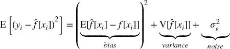

集成方法是一种将一组弱学习器组合的方法，所有学习器都基于相同的学习算法，以创建一个比任何单个学习器表现更好的（更强的）学习器。集成方法有助于减少偏差和/或方差。

## 6.3 Bootstrap 聚合

Bootstrap 聚合（bagging）是减少预测方差的有效方法。它的工作方式如下：第一，通过**有放回**随机采样生成 N 个训练数据集。第二，在每个训练集上拟合 N 个估计器。这些估计器相互独立拟合，因此模型可以并行拟合。第三，集成预测是 N 个模型各自预测的**简单**平均。对于分类变量，观测属于某一类的概率由将该观测分类为该类成员的估计器比例（多数投票）给出。当基础估计器可以进行带预测概率的预测时，bagging 分类器可以推导概率的均值。

如果你使用 sklearn 的 `BaggingClassifier` 类计算袋外精度，你应该注意这个 bug：<https://github.com/scikit-learn/scikit-learn/issues/8933>。一种变通方法是将标签重命名为整数顺序。

### 6.3.1 方差减少

Bagging 的主要优势是减少预测的方差，从而有助于解决过拟合。bagged 预测 φ~i~[c] 的方差是 bagged 估计器数量（N）、单个估计器预测的平均方差（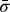）及其预测的平均相关性（）的函数：

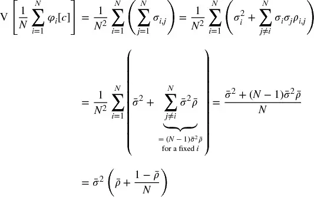

其中 σ~i,j~ 是估计器 i、j 预测的协方差；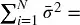 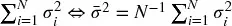；且 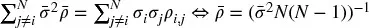 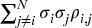。

上面的方程表明，bagging 仅在  的程度上有效；即 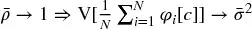。序贯 bootstrap（[第 4 章](ch04.md)）的目标之一是产生尽可能独立的样本，从而降低 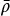，这将降低 bagging 分类器的方差。图 6.1 绘制了 bagged 预测的标准差作为 N ∈ [5, 30]、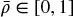 和 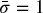 的函数。

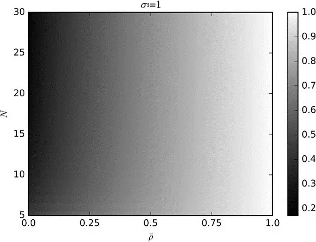

图 6.1 bagged 预测的标准差

### 6.3.2 精度提升

考虑一个 bagging 分类器，它通过 N 个独立分类器之间的多数投票对 k 个类进行预测。我们可以将预测标记为 {0, 1}，其中 1 表示正确预测。分类器的精度是将预测标记为 1 的概率 p。平均而言，我们将得到 Np 个标记为 1 的预测，方差为 Np(1−p)。当观察到最多预测的类时，多数投票做出正确预测。例如，对于 N = 10 和 k = 3，当观察到类 A 且投票为 [A, B, C] = [4, 3, 3] 时，bagging 分类器做出了正确预测。然而，当观察到类 A 且投票为 [A, B, C] = [4, 1, 5] 时，bagging 分类器做出了错误预测。充分条件是这些标签之和为 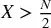。必要（非充分）条件是 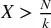，其发生概率为

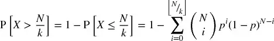

其含义是，对于足够大的 N（例如 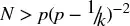），则 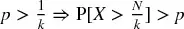，因此 bagging 分类器的精度超过单个分类器的平均精度。代码片段 6.1 实现了此计算。

> **代码片段 6.1 BAGGING 分类器的精度**

> 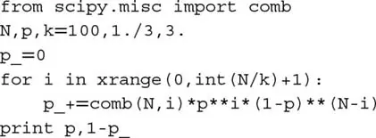

这是一个有力论据，支持在计算资源允许时对任何分类器进行 bagging。然而，与 boosting 不同，bagging 不能提高差分类器的精度：如果个体学习器是差分类器（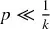），多数投票仍然表现不佳（尽管方差较低）。图 6.2 说明了这些事实。因为达到 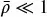 比 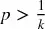 更容易，bagging 更可能在减少方差方面成功，而非减少偏差。

关于该主题的进一步分析，读者可参考 Condorcet 陪审团定理。虽然该定理是为政治科学中多数投票的目的而推导的，但该定理解决的问题与上述讨论有相似之处。

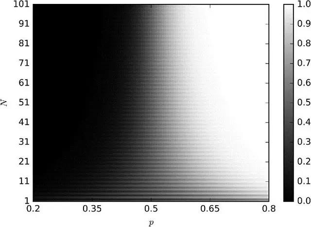

图 6.2 bagging 分类器的精度作为个体估计器精度（P）、估计器数量（N）和 k = 2 的函数

### 6.3.3 观测冗余

在[第 4 章](ch04.md)中，我们研究了金融观测不能假设为 IID 的一个原因。冗余观测对 bagging 有两个不利影响。第一，有放回抽取的样本更可能是几乎相同的，即使它们不共享相同的观测。这使得 ，bagging 将不会减少方差，无论 N 如何。例如，如果 t 处的每个观测根据 t 和 t+100 之间的收益标记，我们应该每个 bagged 估计器采样 1% 的观测，但不能更多。[第 4 章](ch04.md)第 4.5 节推荐了三种替代解决方案，其中一种是在 sklearn 的 bagging 分类器类实现中设置 `max_samples=out['tW'].mean()`。另一个（更好的）解决方案是应用序贯 bootstrap 方法。

观测冗余的第二个不利影响是袋外精度将被夸大。这是因为有放回随机采样在训练集中放置了与袋外非常相似的样本。在这种情况下，适当的分层 k 折交叉验证（划分前不打乱）将显示出比袋外估计的精度低得多的测试集精度。因此，建议在使用该 sklearn 类时设置 `StratifiedKFold(n_splits=k, shuffle=False)`，交叉验证 bagging 分类器，并忽略袋外精度结果。首选低 k 值而非高 k 值，因为过度划分会再次在测试集中放置与训练集中使用的过于相似的样本。

## 6.4 随机森林

决策树已知容易过拟合，这增加了预测的方差。^3^ 为了解决这个问题，随机森林（RF）方法被设计用来产生方差更低的集成预测。

RF 与 bagging 有一些相似之处，即在数据的 bootstrap 子集上独立训练单个估计器。与 bagging 的关键区别在于，随机森林引入了第二层随机性：在优化每个节点分裂时，只评估属性的随机子样本（无放回），目的是进一步去相关估计器。

与 bagging 一样，RF 在不过拟合的情况下减少预测的方差（记住，只要 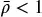）。第二个优势是 RF 评估特征重要性，我们将在[第 8 章](ch08.md)中深入讨论。第三个优势是 RF 提供袋外精度估计，但在金融应用中它们很可能被夸大（如第 6.3.3 节讨论）。但与 bagging 一样，RF 不一定比单个决策树表现出更低的偏差。

如果大量样本是冗余的（非 IID），过拟合仍然会发生：有放回随机采样将构建大量本质上相同的树（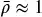），其中每棵决策树都是过拟合的（这是决策树众所周知的缺陷）。与 bagging 不同，RF 始终将 bootstrap 样本的大小固定为与训练数据集匹配的大小。让我们回顾在 sklearn 中解决 RF 过拟合问题的方法。出于说明目的，我将参考 sklearn 的类；然而，这些解决方案可以应用于任何实现：

1.  将参数 `max_features` 设置为较低的值，作为强制树之间差异的一种方式。
2.  早停：将正则化参数 `min_weight_fraction_leaf` 设置为足够大的值（例如 5%），使得袋外精度收敛到样本外（k 折）精度。
3.  在 `DecisionTreeClassifier` 上使用 `BaggingClassifier`，其中 `max_samples` 设置为样本之间的平均唯一性（avgU）。
    1.  `clf=DecisionTreeClassifier(criterion='entropy',max_features='auto',class_weight='balanced')`
    2.  `bc=BaggingClassifier(base_estimator=clf,n_estimators=1000,max_samples=avgU,max_features=1.)`
4.  在 `RandomForestClassifier` 上使用 `BaggingClassifier`，其中 `max_samples` 设置为样本之间的平均唯一性（avgU）。
    1.  `clf=RandomForestClassifier(n_estimators=1,criterion='entropy',bootstrap=False,class_weight='balanced_subsample')`
    2.  `bc=BaggingClassifier(base_estimator=clf,n_estimators=1000,max_samples=avgU,max_features=1.)`
5.  修改 RF 类，用序贯 bootstrap 替换标准 bootstrap。

总结，代码片段 6.2 展示了使用不同类设置 RF 的三种替代方式。

> **代码片段 6.2 设置 RF 的三种方式**

> 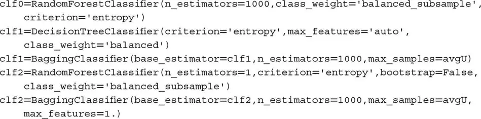

拟合决策树时，特征空间沿与轴对齐的方向旋转通常会减少树所需的层数。因此，我建议在特征的 PCA 上拟合 RF，因为这可能加速计算并减少一些过拟合（详见[第 8 章](ch08.md)）。此外，如[第 4 章](ch04.md)第 4.8 节讨论，`class_weight='balanced_subsample'` 将帮助你防止树误分类少数类。

## 6.5 Boosting

Kearns 和 Valiant [1989] 是最早提出是否可以组合弱估计器以实现高精度估计器的人之一。不久之后，Schapire [1990] 证明了对该问题的答案是肯定的，使用了我们今天称为 boosting 的过程。一般而言，它的工作方式如下：第一，根据某些样本权重（初始化为均匀权重）通过有放回随机采样生成一个训练集。第二，使用该训练集拟合一个估计器。第三，如果单个估计器达到大于接受阈值的精度（例如二元分类器中 50%，使其表现优于随机），则保留该估计器，否则丢弃。第四，给误分类观测更多权重，给正确分类观测更少权重。第五，重复前面的步骤直到产生 N 个估计器。第六，集成预测是 N 个模型各自预测的**加权**平均，权重由各个估计器的精度确定。有许多 boosting 算法，其中 AdaBoost 是最流行的之一（Geron [2017]）。图 6.3 总结了标准 AdaBoost 实现的决策流程。

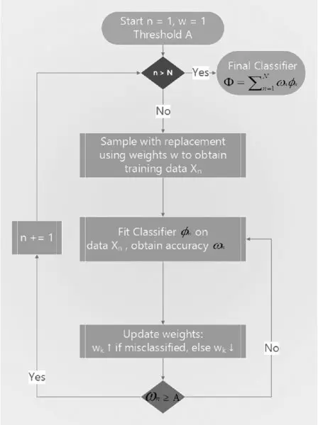

图 6.3 AdaBoost 决策流程

## 6.6 金融中的 Bagging 与 Boosting

从上面的描述可以看出，boosting 与 bagging 有几个方面的不同：^4^

-   单个分类器顺序拟合。
-   表现差的分类器被丢弃。
-   每次迭代中观测的权重不同。
-   集成预测是个体学习器的加权平均。

Boosting 的主要优势是它同时减少预测的方差和偏差。然而，纠正偏差以更大的过拟合风险为代价。可以说，在金融应用中，bagging 通常优于 boosting。Bagging 解决过拟合，而 boosting 解决欠拟合。过拟合通常是比欠拟合更大的担忧，因为由于低信噪比，过拟合 ML 算法到金融数据并不困难。此外，bagging 可以并行化，而 boosting 通常需要顺序运行。

## 6.7 面向可扩展性的 Bagging

如你所知，几种流行的 ML 算法在样本大小方面扩展性不好。支持向量机（SVM）是一个典型例子。如果你尝试在百万观测上拟合 SVM，算法收敛可能需要一段时间。而且即使收敛，也不能保证解是全局最优或不过拟合。

一种实用的方法是构建一个 bagging 算法，其中基础估计器属于样本大小扩展性不好的类（如 SVM）。在定义该基础估计器时，我们将施加严格的早停条件。例如，在 sklearn 的 SVM 实现中，你可以为 `max_iter` 参数设置低值，如 1E5 次迭代。默认值是 `max_iter=-1`，告诉估计器继续执行迭代直到误差降至容忍水平以下。或者，你可以通过参数 `tol` 提高容忍水平，默认值为 `tol=1E-3`。这两个参数中的任何一个都会强制早停。你可以用等效参数对其他算法进行早停，如 RF 中的层数（`max_depth`），或叶节点所需的所有输入样本权重总和的最小加权分数（`min_weight_fraction_leaf`）。

鉴于 bagging 算法可以并行化，我们将一个大型顺序任务转换为许多同时运行的小型任务。当然，早停会增加单个基础估计器输出的方差；然而，该增加可以被 bagging 算法相关的方差减少所抵消甚至超越。你可以通过添加更多独立基础估计器来控制该减少。这样使用，bagging 将允许你在极大数据集上实现快速且稳健的估计。

## 练习题

1. 为什么 bagging 基于有放回随机采样？如果采样无放回，bagging 是否仍然会减少预测的方差？

2. 假设你的训练集基于高度重叠的标签（即唯一性低，如[第 4 章](ch04.md)定义）。
    1. 这使 bagging 容易过拟合，还是仅仅无效？为什么？
    2. 袋外精度在金融应用中通常可靠吗？为什么？

3. 构建一个估计器集成，其中基础估计器是决策树。
    1. 该集成与 RF 有何不同？
    2. 使用 sklearn，产生一个行为像 RF 的 bagging 分类器。你必须设置哪些参数，如何设置？

4. 考虑 RF、它组成的树数和使用的特征数之间的关系：
    1. 你能设想 RF 中所需的最小树数与使用的特征数之间的关系吗？
    2. 对于使用的特征数，树数是否可能太少？
    3. 对于可用的观测数，树数是否可能太多？

5. 袋外精度与分层 k 折（有打乱）交叉验证精度有何不同？

## 参考文献

1. Geron, A. (2017): *Hands-on Machine Learning with Scikit-Learn and TensorFlow*, 1st edition. O'Reilly Media.
2. Kearns, M. and L. Valiant (1989): "Cryptographic limitations on learning Boolean formulae and finite automata." In Proceedings of the 21st Annual ACM Symposium on Theory of Computing, pp. 433--444, New York. Association for Computing Machinery.
3. Schapire, R. (1990): "The strength of weak learnability." *Machine Learning*. Kluwer Academic Publishers. Vol. 5 No. 2, pp. 197--227.

## 参考书目

1. Gareth, J., D. Witten, T. Hastie, and R. Tibshirani (2013): *An Introduction to Statistical Learning: With Applications in R*, 1st ed. Springer-Verlag.
2. Hackeling, G. (2014): *Mastering Machine Learning with Scikit-Learn*, 1st ed. Packt Publishing.
3. Hastie, T., R. Tibshirani and J. Friedman (2016): *The Elements of Statistical Learning*, 2nd ed. Springer-Verlag.
4. Hauck, T. (2014): *Scikit-Learn Cookbook*, 1st ed. Packt Publishing.
5. Raschka, S. (2015): *Python Machine Learning*, 1st ed. Packt Publishing.

## 注释

^1^ 关于集成方法的介绍，请访问：<http://scikit-learn.org/stable/modules/ensemble.html>。

^2^ 我通常不引用 Wikipedia，但在这个主题上，用户可能会发现这篇文章中的一些插图有用：<https://en.wikipedia.org/wiki/Bias%E2%80%93variance_tradeoff>。

^3^ 关于随机森林的直观解释，请访问：<https://quantdare.com/random-forest-many-is-better-than-one/>。

^4^ 关于 bagging 和 boosting 之间区别的视觉解释，请访问：<https://quantdare.com/what-is-the-difference-between-bagging-and-boosting/>。
