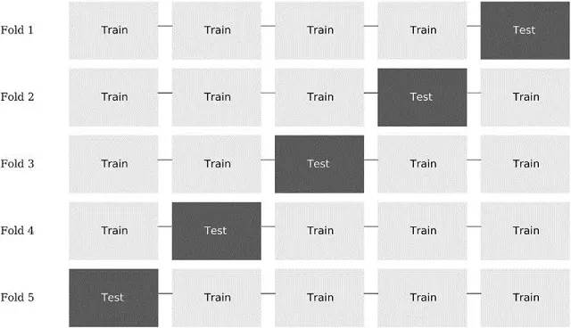
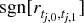
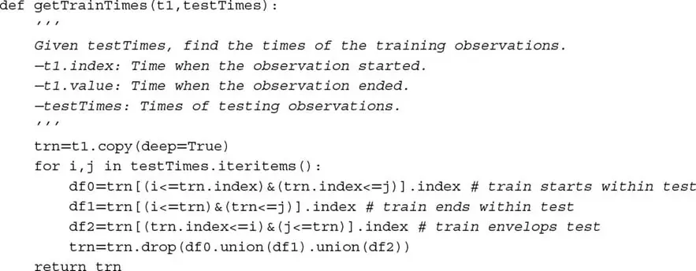
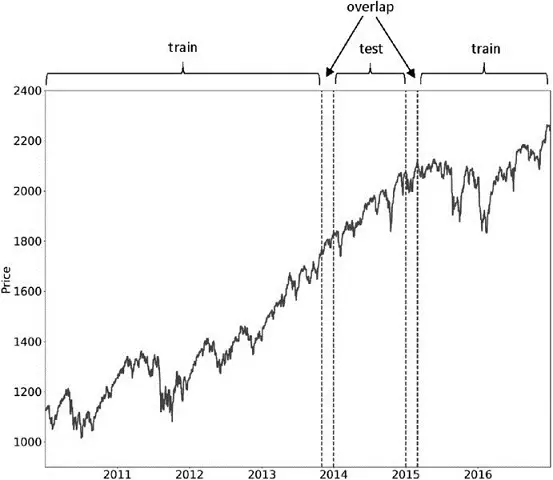
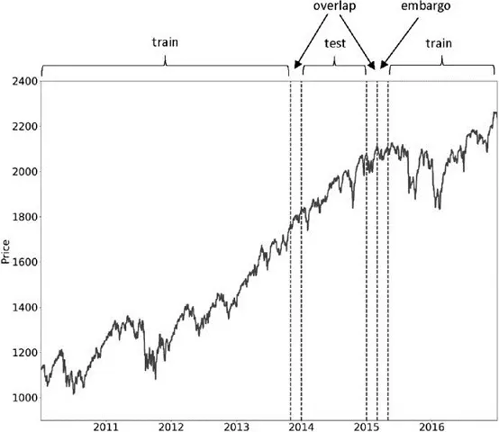
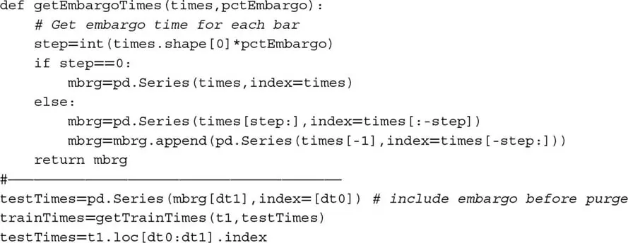
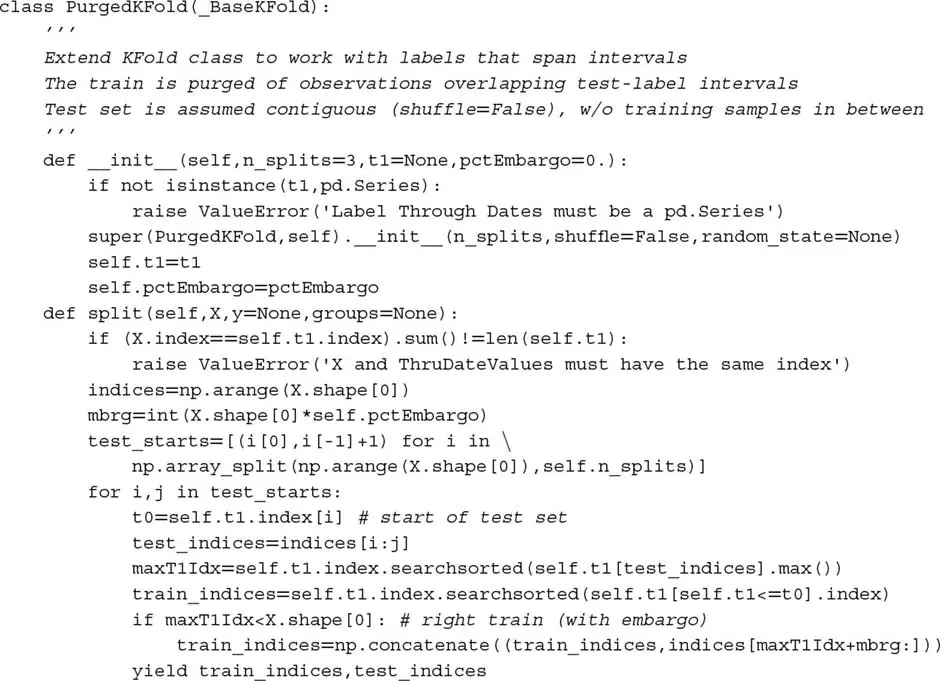
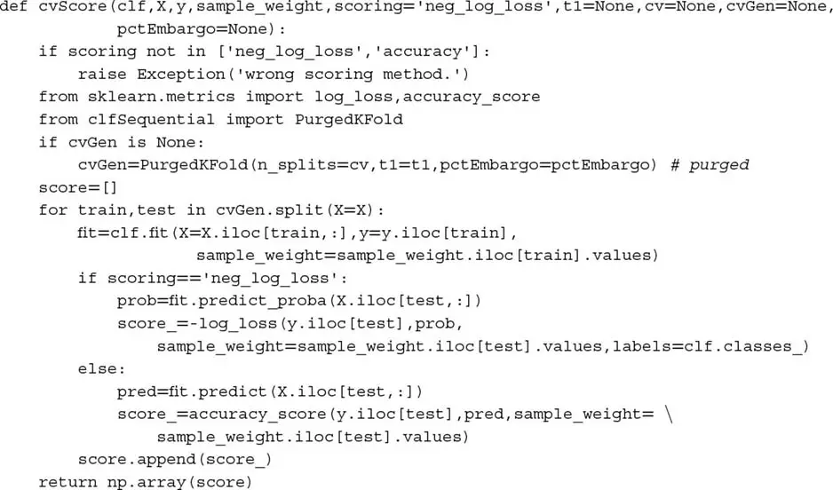

# 金融中的交叉验证

## 7.1 动机
交叉验证（CV）的目的是确定 ML 算法的泛化误差，以防止过拟合。CV 是
another instance where standard ML techniques fail when applied to
financial problems. Overfitting will take place, and CV will not be able
to detect it. In fact, CV will contribute to overfitting through
hyper-parameter tuning. 在本章中我们将学习 why standard CV
fails in finance, and what can be done about it.

## 7.2 交叉验证的目标
One of the purposes of ML is to learn the general structure of the
data, so that we can produce predictions on future, unseen features.
When we test an ML algorithm on the same dataset as was used for
training, not surprisingly, we achieve spectacular results. When ML
algorithms are misused that way, they are no different from file
lossy-compression algorithms: They can summarize the data with extreme
fidelity, yet with zero forecasting power.

CV splits observations drawn from an IID process into two sets:
the] *training* [set and the
*testing* [set. Each observation in the complete dataset belongs to one,
and only one, set. This is done as to prevent leakage from one set into
the other, since that would defeat the purpose of testing on unseen
data. Further details can be found in the books and articles listed in
the references section.

There are many alternative CV schemes, of which one of the most popular
is k-fold CV.]  Figure
7.1 illustrates
the *k* train/test splits carried out by a k-fold
CV, where *k* [= 5. In this
scheme:

1.  The dataset is partitioned into *k* subsets.
2.  For *i = 1,...,k*
    1.  The ML algorithm is trained on all subsets excluding *i.*
    2.  The fitted ML algorithm is tested on *i.*

**图 7.1** Train/test splits in
a 5-fold CV scheme

The outcome from k-fold CV is a] *kx1* [array of
cross-validated performance metrics. For example, in a binary
classifier, the model is deemed to have learned something if the
cross-validated accuracy is over 1/2, since that is the accuracy we
would achieve by tossing a fair coin.

In finance, CV is typically used in two settings: model development
(like hyper-parameter tuning) and backtesting. Backtesting is a complex
subject that we will discuss thoroughly in Chapters 10--16. In this
chapter, we will focus on CV for model development.

## 7.3 为什么 K 折交叉验证在金融中失效
By now you may have read quite a few papers in finance that present
k-fold CV evidence that an ML algorithm performs well. Unfortunately, it
is almost certain that those results are wrong. One reason k-fold CV
fails in finance is because observations cannot be assumed to be drawn
from an IID process. A second reason for CV\'s failure is that the
testing set is used multiple times in the process of developing a model,
leading to multiple testing and selection bias. We will revisit this
second cause of failure in Chapters 11--13. For the time being, let us
concern ourselves exclusively with the first cause of
failure.

Leakage takes place when the training set contains information that
also appears in the testing set. Consider a serially correlated
feature] *X* that is associated with
labels *Y* [that are formed on overlapping
data:

-   Because of the serial correlation, *X ~[*t*]~* ≈ *X
    ~[*t*\ +\ 1]~* .
-   Because labels are derived from overlapping datapoints, *Y
    ~[*t*]~* ≈ *Y ~[*t*\ +\ 1]~* .

By placing] *t* and *t + 1* [in
different sets, information is leaked. When a classifier is first
trained on (] *X ~[*t*]~*
,] *Y ~[*t*]~* [), and then it is asked to
predict E[] *Y ~[*t*\ +\ 1]~*
\|] *X ~[*t*\ +\ 1]~* [] based on an
observed] *X ~[*t*\ +\ 1]~* [, this
classifier is more likely to achieve] *Y
~[*t*\ +\ 1]~* [= E[] *Y
~[*t*\ +\ 1]~* [\|] *X ~[*t*\ +\ 1]~*
] even if] *X* is an irrelevant
feature.

If *X* [is a predictive feature, leakage will
enhance the performance of an already valuable strategy. The problem is
leakage in the presence of irrelevant features, as this leads to false
discoveries. There are at least two ways to reduce the likelihood of
leakage:

1.  Drop from the training set any observation *i* where *Y
    ~[*i*]~* is a function of information used to determine *Y
    ~[*j*]~* , and *j* belongs to the testing set.
    1.  For example, *Y ~[*i*]~* and *Y ~[*j*]~* should
        not span overlapping periods (see [第 4 章](ch04.md) for a discussion of
        sample uniqueness).
2.  Avoid overfitting the classifier. In this way, even if some leakage
    occurs, the classifier will not be able to profit from it. Use:
    1.  Early stopping of the base estimators (see [第 6 章](ch06.md)).
    2.  Bagging of classifiers, while controlling for oversampling on
        redundant examples, so that the individual classifiers are as
        diverse as possible.
        1.  Set `max_samples` to the average uniqueness.
        2.  Apply sequential bootstrap ([第 4 章](ch04.md)).

Consider the case where] *X ~[*i*]~*
and] *X ~[*j*]~* are formed on overlapping
information, where *i* belongs to the training set
and *j* [belongs to the testing set. Is this a case
of informational leakage? Not necessarily, as long
as] *Y ~[*i*]~* and *Y
~[*j*]~* [are independent. For leakage to take place, it must
occur that (] *X ~[*i*]~*
,] *Y ~[*i*]~* [) ≈ (] *X
~[*j*]~* [,] *Y ~[*j*]~* [), and it
does not suffice that] *X ~[*i*]~*
≈] *X ~[*j*]~* [or even
*Y ~[*i*]~* [≈] *Y ~[*j*]~*
.

## 7.4 解决方案：净化 K 折交叉验证
One way to reduce leakage is to purge from the training set all
observations whose labels overlapped in time with those labels included
in the testing set. I call this process "purging." In addition, since
financial features often incorporate series that exhibit serial
correlation (like ARMA processes), we should eliminate from the training
set observations that immediately follow an observation in the testing
set. I call this process "embargo."

### 7.4.1 Purging the Training Set

Suppose a testing observation whose label] *Y
~[*j*]~* [is decided based on the information set Φ
~[*j*]~ . In order to prevent the type of leakage described in
the previous section, we would like to purge from the training set any
observation whose label] *Y ~[*i*]~* [is
decided based on the information set Φ ~[*i*]~ , such that Φ
~[*i*]~ ∩Φ ~[*j*]~ = ∅] *.*

In particular, we will determine that there is informational overlap
between two observations] *i*
and] *j* whenever *Y
~[*i*]~* and *Y ~[*j*]~* [are
concurrent (see [第 4 章](ch04.md), Section 4.3), in the sense that both labels
are contingent on at least one common random draw. For example, consider
a label] *Y ~[*j*]~* [that is a function of
observations in the closed range] *t* [∈
] *t ~[*j*\ ,\ 0]~* [,
*t ~[*j*\ ,\ 1]~* [],] *Y ~[*j*]~*
=] *f* [[[] *t
~[*j*\ ,\ 0]~* [,] *t ~[*j*\ ,\ 1]~*
]] (with some abuse of notation). For example, in the context of the
triple-barrier labeling method ([第 3 章](ch03.md)), it means that the label is
the sign of the return spanning between price bars with
indices] *t ~[*j*\ ,\ 0]~*
and] *t ~[*j*\ ,\ 1]~* [, that
is]  [. A label] *Y ~[*i*]~*
=] *f* [[[] *t
~[*i*\ ,\ 0]~* [,] *t ~[*i*\ ,\ 1]~*
]] overlaps with] *Y ~[*j*]~* [if any of
the three sufficient conditions is met:

1.  *t ~[*j*\ ,\ 0]~* ≤ *t ~[*i*\ ,\ 0]~* ≤ *t
    ~[*j*\ ,\ 1]~*
2.  *t ~[*j*\ ,\ 0]~* ≤ *t ~[*i*\ ,\ 1]~* ≤ *t
    ~[*j*\ ,\ 1]~*
3.  *t ~[*i*\ ,\ 0]~* ≤ *t ~[*j*\ ,\ 0]~* ≤ *t
    ~[*j*\ ,\ 1]~* ≤ *t ~[*i*\ ,\ 1]~*

代码片段 7.1 implements this purging of observations from the training
set. If the testing set is contiguous, in the sense that no training
observations occur between the first and last testing observation, then
purging can be accelerated: The object] `testTimes`
can be a pandas series with a single item, spanning the entire testing
set.

> **SNIPPET 7.1 PURGING OBSERVATION IN THE TRAINING SET**

> 

When leakage takes place, performance improves merely by
increasing] *k* [→] *T* [,
where] *T* [is the number of bars. The reason is that
the larger the number of testing splits, the greater the number of
overlapping observations in the training set. In many cases, purging
suffices to prevent leakage: Performance will improve as we
increase] *k* [, because we allow the model to
recalibrate more often. But beyond a certain value
*k* [*, performance will not improve, indicating that the backtest is
not profiting from leaks.] 图 7.2 [plots one partition of
the k-fold CV. The test set is surrounded by two train sets, generating
two overlaps that must be purged to prevent leakage.

**图 7.2** Purging overlap in
the training set

### 7.4.2 Embargo

For those cases where purging is not able to prevent all leakage, we
can impose an embargo on training observations
*after* [every test set. The embargo does not need to affect training
observations prior to a test set, because training
labels] *Y ~[*i*]~* [=
*f* [[[] *t ~[*i*\ ,\ 0]~*
,] *t ~[*i*\ ,\ 1]~* []],
where] *t ~[*i*\ ,\ 1]~*
\<] *t ~[*j*\ ,\ 0]~* [(training ends before
testing begins), contain information that was available at the testing
time] *t ~[*j*\ ,\ 0]~* [. In other words, we
are only concerned with training labels] *Y
~[*i*]~* [=] *f* [[[] *t
~[*i*\ ,\ 0]~* [,] *t ~[*i*\ ,\ 1]~*
]] that take place immediately after the test,] *t
~[*j*\ ,\ 1]~* [≤] *t ~[*i*\ ,\ 0]~*
≤] *t ~[*j*\ ,\ 1]~* [+
*h.* We can implement this embargo period *h* by
setting *Y ~[*j*]~* [=
*f* [[[] *t ~[*j*\ ,\ 0]~*
,] *t ~[*j*\ ,\ 1]~* [+
*h* []] before purging. A small value] *h* [≈
.01] *T* [often suffices to prevent all leakage, as
can be confirmed by testing that performance does not improve
indefinitely by increasing] *k*
→] *T* [.] 图 7.3 [illustrates the
embargoing of train observations immediately after the testing set.
代码片段 7.2 implements the embargo logic.

**图 7.3** Embargo of post-test
train observations

> **SNIPPET 7.2 EMBARGO ON TRAINING OBSERVATIONS**

> 

### 7.4.3 The Purged K-Fold Class

In the previous sections we have discussed how to produce
training/testing splits when labels overlap. That introduced the notion
of purging and embargoing, in the particular context of model
development. In general, we need to purge and embargo overlapping
training observations whenever we produce a train/test split, whether it
is for hyper-parameter fitting, backtesting, or performance evaluation.
代码片段 7.3 extends scikit-learn\'s] `KFold` [class
to account for the possibility of leakages of testing information into
the training set.

> **SNIPPET 7.3 CROSS-VALIDATION CLASS WHEN OBSERVATIONS OVERLAP**

> 

## 7.5 Bugs in Sklearn\'s Cross-Validation

You would think that something as critical as cross-validation would be
perfectly implemented in one of the most popular ML libraries.
Unfortunately that is not the case, and this is one of the reasons you
must always read all the code you run, and a strong point in favor of
open source. One of the many upsides of open-source code is that you can
verify everything and adjust it to your needs. 代码片段 7.4 addresses two
known sklearn bugs:

1.  Scoring functions do not know `classes_` , as a consequence of
    sklearn\'s reliance on numpy arrays rather than pandas series:
    <https://github.com/scikit-learn/scikit-learn/issues/6231>
2.  `cross_val_score` will give different results because it passes
    weights to the fit method, but not to the `log_loss` method:
    <https://github.com/scikit-learn/scikit-learn/issues/9144>

> **SNIPPET 7.4 USING THE** ` `**`PURGEDKFOLD`**` ` **CLASS**

> 

Please understand that it may take a long time until a fix for these
bugs is agreed upon, implemented, tested, and released. Until then, you
should use] `cvScore` in 代码片段 7.4, and avoid
running the function `cross_val_score`
.

## 练习题

1.  [Why is shuffling a dataset before conducting k-fold CV generally a
    > > bad idea in finance? What is the purpose of shuffling? Why does
    > > shuffling defeat the purpose of k-fold CV in financial
    > > datasets?

2.  Take a pair of matrices ( *X*
    > > [,] *y* [), representing observed features
    > > and labels. These could be one of the datasets derived from the
    > > exercises in [第 3 章](ch03.md).

    :::
    :::

    1.  Derive the performance from a 10-fold CV of an RF classifier on
        (*X* , *y* ), without shuffling.
    2.  Derive the performance from a 10-fold CV of an RF on (*X* , *y*
        ), with shuffling.
    3.  Why are both results so different?
    4.  How does shuffling leak information?

3.  Take the same pair of matrices ( *X*
    > > [,] *y* [) you used in exercise
    > > 2.

    :::
    :::

    1.  Derive the performance from a 10-fold purged CV of an RF on (*X*
        , *y* ), with 1% embargo.
    2.  Why is the performance lower?
    3.  Why is this result more realistic?

4.  [In this chapter we have focused on one reason why k-fold CV fails
    > > in financial applications, namely the fact that some information
    > > from the testing set leaks into the training set. Can you think
    > > of a second reason for CV\'s failure?

5.  [Suppose you try one thousand configurations of the same investment
    > > strategy, and perform a CV on each of them. Some results are
    > > guaranteed to look good, just by sheer luck. If you only publish
    > > those positive results, and hide the rest, your audience will
    > > not be able to deduce that these results are false positives, a
    > > statistical fluke. This phenomenon is called "selection
    > > bias."

    :::
    :::

    1.  Can you imagine one procedure to prevent this?
    2.  What if we split the dataset in three sets: training,
        validation, and testing? The validation set is used to evaluate
        the trained parameters, and the testing is run only on the one
        configuration chosen in the validation phase. In what case does
        this procedure still fail?
    3.  What is the key to avoiding selection bias?

## 参考书目

1.  Bharat Rao, R., G. Fung, and R. Rosales (2008): "On the dangers of
    cross-validation: An experimental evaluation." White paper, IKM CKS
    Siemens Medical Solutions USA. Available at
    <http://people.csail.mit.edu/romer/papers/CrossVal_SDM08.pdf> .
2.  Bishop, C. (1995): *Neural Networks for Pattern Recognition* , 1st
    ed. Oxford University Press.
3.  Breiman, L. and P. Spector (1992): "Submodel selection and
    evaluation in regression: The X-random case." White paper,
    Department of Statistics, University of California, Berkeley.
    Available at
    <http://digitalassets.lib.berkeley.edu/sdtr/ucb/text/197.pdf> .
4.  Hastie, T., R. Tibshirani, and J. Friedman (2009): *The Elements of
    Statistical Learning* , 1st ed. Springer.
5.  James, G., D. Witten, T. Hastie and R. Tibshirani (2013): *An
    Introduction to Statistical Learning* , 1st ed. Springer.
6.  Kohavi, R. (1995): "A study of cross-validation and bootstrap for
    accuracy estimation and model selection." International Joint
    Conference on Artificial Intelligence. Available at
    http://web.cs.iastate.edu/∼jtian/cs573/Papers/Kohavi-IJCAI-95.pdf(http://web.cs.iastate.edu/~jtian/cs573/Papers/Kohavi-IJCAI-95.pdf)
    .
7.  Ripley, B. (1996): *Pattern Recognition and Neural Networks* , 1st
    ed. Cambridge University Press.
