# 特征重要性

## 8.1 动机

金融研究中最普遍的错误之一是：取一些数据，通过 ML 算法运行，回测预测，然后重复该序列直到出现好看的回测。学术期刊充满了这类伪发现，甚至大型对冲基金也经常落入这个陷阱。回测是否为走步法样本外并不重要。我们在同一数据上反复测试的事实很可能导致错误发现。这个方法论错误在统计学家中如此臭名昭著，以至于他们认为这是科学欺诈，美国统计协会在其道德准则中对此发出警告（American Statistical Association [2016]，讨论 #4）。通常大约需要 20 次这样的迭代才能发现一个（错误的）投资策略，满足 5% 的标准显著性水平（假阳性率）。在本章中，我们将探讨为什么这种方法是浪费时间和金钱的，以及特征重要性如何提供替代方案。

## 8.2 特征重要性的重要性

金融行业一个引人注目的方面是，如此多非常资深的投资组合经理（包括许多有量化背景的）没有意识到过拟合回测是多么容易。如何正确回测不是本章的主题；我们将在第 11-15 章讨论那个极其重要的话题。本章的目标是解释在进行任何回测*之前*必须执行的分析之一。

假设给定一对矩阵 (X, y)，分别包含特定金融工具的特征和标签。我们可以在 (X, y) 上拟合分类器，并通过净化 k 折交叉验证（CV）评估泛化误差，如我们在[第 7 章](ch07.md)中所见。假设我们获得了良好的性能。接下来的自然问题是试图理解哪些特征对这一性能做出了贡献。也许我们可以添加一些增强分类器预测力所负责信号的特征。也许我们可以消除一些只给系统增加噪声的特征。值得注意的是，理解特征重要性打开了 proverbial 黑盒。如果我们理解什么信息源对分类器是不可或缺的，我们就可以洞察分类器识别的模式。这是 ML 怀疑论者有些过度渲染黑盒说法的原因之一。是的，算法在没有我们引导过程的情况下（这就是 ML 的全部意义！）在黑盒中学习，但这并不意味着我们不能（或不应该）看看算法发现了什么。猎人不会盲目地吃他们的聪明狗衔回来的一切，对吧？

一旦我们发现了哪些特征重要，我们就可以通过进行一些实验来了解更多。这些特征是否一直重要，还是只在某些特定环境中？什么触发了重要性随时间的变化？这些状态切换可以被预测吗？那些重要特征是否也与相关金融工具相关？它们是否与其他资产类别相关？所有金融工具中最相关的特征是什么？在整个投资宇宙中排名相关性最高的特征子集是什么？这比愚蠢的回测循环是更好的策略研究方式。让我将这一准则陈述为我希望你从本书中学到的最关键的教训之一：


「回测不是研究工具。特征重要性才是。」

——Marcos López de Prado，《金融机器学习的进展》（2018）


## 8.3 带替代效应的特征重要性

我发现根据是否受替代效应影响来区分特征重要性方法是有用的。在这种情况下，当一个特征的重要性因其他相关特征的存在而降低时，就会发生替代效应。替代效应是统计和计量经济学文献中所谓的「多重共线性」的 ML 类比。解决线性替代效应的一种方法是对原始特征应用 PCA，然后在正交特征上执行特征重要性分析。详见 Belsley 等 [1980]、Goldberger [1991, pp. 245-253] 和 Hill 等 [2001]。

### 8.3.1 平均不纯度减少

平均不纯度减少（Mean Decrease Impurity, MDI）是一种快速的、解释性重要性（样本内，IS）方法，特定于基于树的分类器（如 RF）。在每棵决策树的每个节点上，选择的特征以减少不纯度的方式分割它接收的子集。因此，我们可以为每棵决策树推导出多少整体不纯度减少可以归因于每个特征。鉴于我们有一片树的森林，我们可以在所有估计器上平均这些值并相应地排列特征。详细描述见 Louppe 等 [2013]。使用 MDI 时，你必须记住一些重要考虑事项：

1.  当某些特征被基于树的分类器系统性地忽略而有利于其他特征时，就会发生掩蔽效应。为了避免它们，在使用 sklearn 的 RF 类时设置 `max_features=int(1)`。这样，每个层级只考虑一个随机特征。
    1.  每个特征都有机会（在某些随机树的某些随机层级）减少不纯度。
    2.  确保重要性为零的特征不被平均，因为为零的唯一原因是该特征未被随机选择。将这些值替换为 `np.nan`。
2.  该过程显然是 IS 的。每个特征都会有一些重要性，即使它们完全没有任何预测力。
3.  MDI 不能推广到其他非基于树的分类器。
4.  按构造，MDI 具有特征重要性加总为 1 的良好性质，且每个特征重要性在 0 和 1 之间有界。
5.  该方法不解决相关特征存在时的替代效应。MDI 稀释了替代特征的重要性，因为它们的可互换性：两个相同特征的重要性将被减半，因为它们以等概率被随机选择。
6.  Strobl 等 [2007] 实验表明 MDI 对某些预测变量有偏差。White 和 Liu [1994] 认为，在单个决策树的情况下，这种偏差是由于流行的杂质函数对具有大量类别的预测变量给予的不公平优势。

Sklearn 的 `RandomForest` 类将 MDI 实现为默认特征重要性分数。这一选择可能是出于能够以最低计算成本即时计算 MDI 的能力。^1^ 代码片段 8.2 展示了 MDI 的实现，纳入了前面列出的考虑事项。

> **代码片段 8.2 MDI 特征重要性**

> 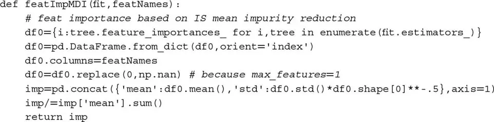

### 8.3.2 平均准确率减少

平均准确率减少（Mean Decrease Accuracy, MDA）是一种缓慢的、预测性重要性（样本外，OOS）方法。第一，它拟合分类器；第二，它根据某个性能分数（准确率、负对数损失等）推导其 OOS 性能；第三，它每次置换特征矩阵 X 的一列，推导每次列置换后的 OOS 性能。特征的重要性是其列置换导致的性能损失的函数。一些相关考虑包括：

1.  该方法可以应用于任何分类器，不仅限于基于树的分类器。
2.  MDA 不限于以准确率作为唯一的性能分数。例如，在元标签应用的上下文中，我们可能更喜欢用 F1 而非准确率来评分分类器（解释见[第 14 章](ch14.md)第 14.8 节）。这是一个更好的描述性名称应该是「置换重要性」的原因。当评分函数不对应于度量空间时，MDA 结果应作为排名使用。
3.  与 MDI 一样，该过程也容易受到相关特征存在时替代效应的影响。给定两个相同的特征，MDA 总是认为一个是另一个的冗余。不幸的是，MDA 会使两个特征看起来完全无关，即使它们至关重要。
4.  与 MDI 不同，MDA 可能得出所有特征都不重要的结论。这是因为 MDA 基于 OOS 性能。
5.  CV 必须被净化和禁运，原因见[第 7 章](ch07.md)的解释。

代码片段 8.3 实现了带样本权重的 MDA 特征重要性，使用净化 k 折 CV，以负对数损失或准确率评分。它将 MDA 重要性衡量为改善（从置换到不置换特征）相对于最大可能分数（负对数损失为 0，或准确率为 1）的函数。注意，在某些情况下，改善可能为负，意味着该特征实际上对 ML 算法的预测力有害。

> **代码片段 8.3 MDA 特征重要性**

> 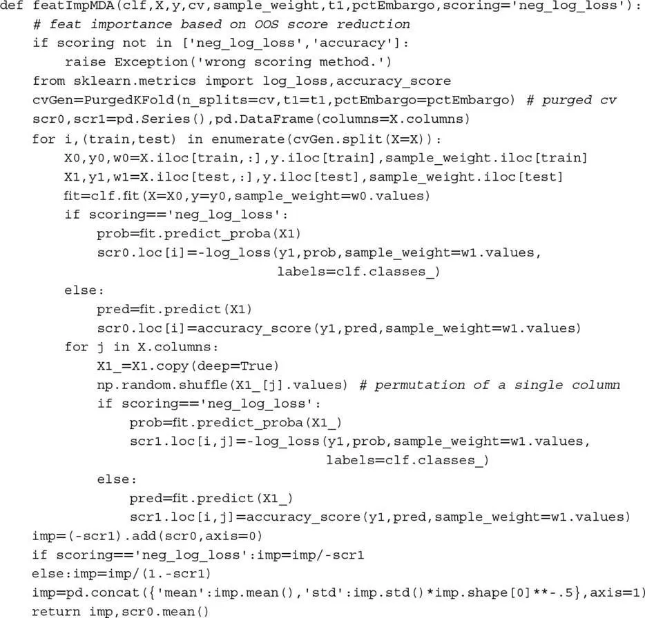

## 8.4 不带替代效应的特征重要性

替代效应可能导致我们丢弃恰好冗余的重要特征。这在预测的上下文中通常不是问题，但在我们试图理解、改进或简化模型时，它可能导致错误的结论。因此，以下单特征重要性方法可以作为 MDI 和 MDA 的良好补充。

### 8.4.1 单特征重要性

单特征重要性（Single Feature Importance, SFI）是一种横截面预测性重要性（样本外）方法。它独立计算每个特征的 OOS 性能分数。一些考虑事项：

1.  该方法可以应用于任何分类器，不仅限于基于树的分类器。
2.  SFI 不限于以准确率作为唯一的性能分数。
3.  与 MDI 和 MDA 不同，不会发生替代效应，因为一次只考虑一个特征。
4.  与 MDA 一样，它可能得出所有特征都不重要的结论，因为性能通过 OOS CV 评估。

SFI 的主要局限是具有两个特征的分类器可能比两个单特征分类器的 bagging 表现更好。例如，(1) 特征 B 可能只在结合特征 A 时有用；或 (2) 特征 B 可能在解释特征 A 的分裂方面有用，即使特征 B 单独不准确。换言之，联合效应和层次重要性在 SFI 中丢失了。一种替代方案是计算特征子集的 OOS 性能分数，但随着考虑更多特征，该计算将变得不可行。代码片段 8.4 展示了 SFI 方法的一种可能实现。关于 `cvScore` 函数的讨论可在[第 7 章](ch07.md)中找到。

> **代码片段 8.4 SFI 的实现**

> 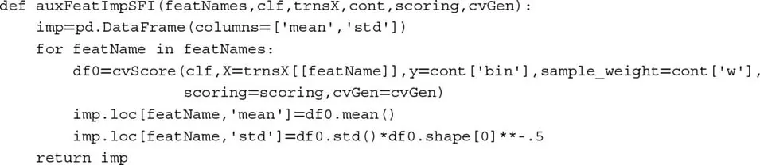

### 8.4.2 正交特征

如第 8.3 节所述，替代效应稀释了 MDI 衡量的特征重要性，并显著低估了 MDA 衡量的特征重要性。一个部分解决方案是在应用 MDI 和 MDA 之前对特征进行正交化。主成分分析（PCA）等正交化程序不能防止所有替代效应，但至少应该减轻线性替代效应的影响。

考虑一个平稳特征矩阵 {X~t,n~}，观测 t = 1, ..., T，变量 n = 1, ..., N。第一，我们计算标准化特征矩阵 Z，使得 Z~t,n~ = σ~n~^−1^(X~t,n~ − μ~n~)，其中 μ~n~ 是 {X~t,n~}~t=1,...,T~ 的均值，σ~n~ 是 {X~t,n~}~t=1,...,T~ 的标准差。第二，我们计算特征值 Λ 和特征向量 W 使得 Z'ZW = WΛ，其中 Λ 是 N×N 对角矩阵，主条目按降序排列，W 是 N×N 正交矩阵。第三，我们推导正交特征为 P = ZW。我们可以通过注意 P'P = W'Z'ZW = W'WΛW'W = Λ 来验证特征的正交性。

对角化在 Z 而非 X 上进行，原因有二：(1) 将数据中心化确保第一主成分正确地定向在观测的主方向上。这等价于在线性回归中添加截距；(2) 重新缩放数据使 PCA 关注解释相关性而非方差。如果不重新缩放，第一主成分将被 X 中方差最大的列主导，我们不会了解到太多关于变量结构或关系的信息。

代码片段 8.5 计算解释 Z 至少 95% 方差的最少正交特征数。

> **代码片段 8.5 正交特征的计算**

> 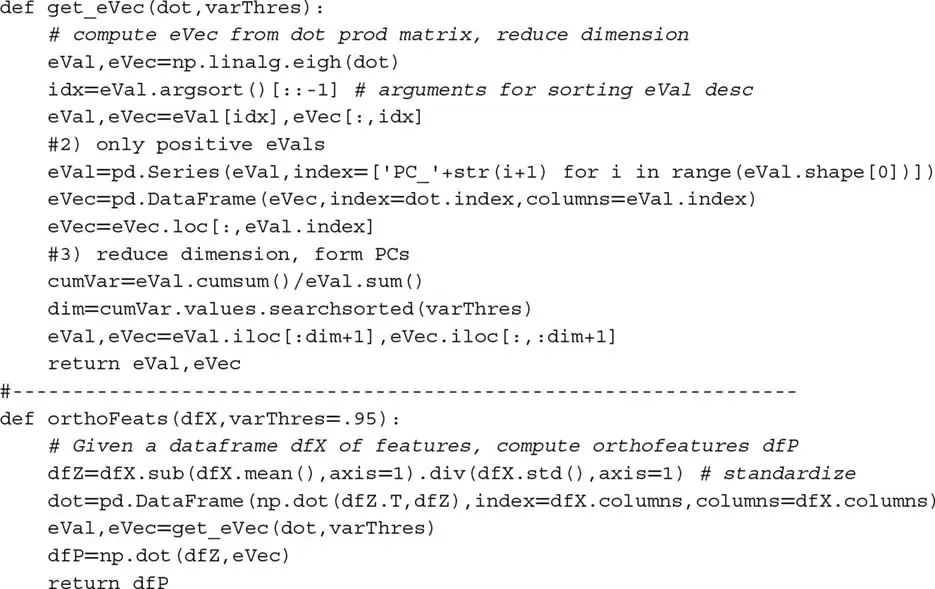

除了解决替代效应，使用正交特征还提供两个额外好处：(1) 正交化也可用于通过丢弃与小特征值关联的特征来降低特征矩阵 X 的维度。这通常加速 ML 算法的收敛；(2) 分析在设计用于解释数据结构的特征上进行。

让我强调后一点。贯穿全书的一个普遍担忧是过拟合风险。ML 算法总能找到模式，即使该模式是统计偶然。你应该始终对任何方法（包括 MDI、MDA 和 SFI）识别的所谓重要特征持怀疑态度。现在，假设你使用 PCA 推导正交特征。你的 PCA 分析在不了解标签的情况下（无监督学习），确定了某些特征比其他更「主要」。即 PCA 在没有任何分类意义上过拟合的情况下排列了特征。当你的 MDI、MDA 或 SFI 分析（使用标签信息）选择的最重要特征与 PCA（忽略标签信息）选择的主要特征相同时，这构成了 ML 算法识别的模式并非完全过拟合的确认性证据。如果特征完全随机，PCA 排名将与特征重要性排名没有对应关系。

图 8.1 显示了与特征向量关联的特征值（x 轴）与该特征向量关联特征的 MDI（y 轴）的散点图。Pearson 相关为 0.8491（p 值低于 1E-150），证明 PCA 识别了信息特征并在不过拟合的情况下正确排列了它们。

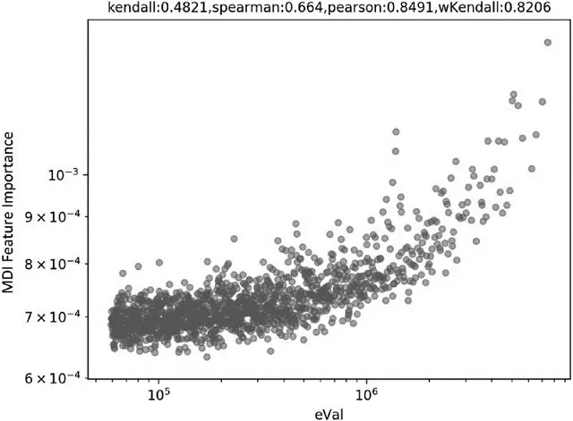

图 8.1 特征值（x 轴）和 MDI 水平（y 轴）的对数-对数散点图

我发现计算特征重要性与它们关联的特征值（或等价地，它们的逆 PCA 排名）之间的加权 Kendall τ 很有用。该值越接近 1，PCA 排名与特征重要性排名之间的一致性越强。偏好加权 Kendall τ 而非标准 Kendall 的一个论据是，我们希望优先考虑最重要特征之间的排名一致性。我们不太关心无关（可能是噪声）特征之间的排名一致性。图 8.1 中样本的双曲加权 Kendall τ 为 0.8206。

代码片段 8.6 展示了如何使用 Scipy 计算该相关性。在此示例中，按重要性降序排列特征给我们一个非常接近升序列表的 PCA 排名序列。因为 `weightedtau` 函数给较高值更高权重，我们在逆 PCA 排名 `pcRank**-1` 上计算相关性。所得加权 Kendall τ 相对较高，为 0.8133。

> **代码片段 8.6 特征重要性与逆 PCA 排名之间的加权 Kendall τ 计算**

> 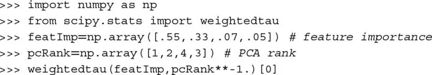

## 8.5 并行与堆叠特征重要性

特征重要性至少有两种研究方法。第一，对于投资宇宙中的每个证券 i（i = 1, ..., I），我们形成数据集 (X~i~, y~i~)，并并行推导特征重要性。例如，令 λ~i,j,k~ 为根据标准 k 的特征 j 对工具 i 的重要性。然后我们可以在整个宇宙上聚合所有结果，推导根据标准 k 的特征 j 的组合 Λ~j,k~ 重要性。在多种工具上都很重要的特征更可能与某种底层现象相关联，特别是当这些特征重要性在各标准间表现出高排名相关性时。深入研究使这些特征具有预测性的理论机制可能是值得的。该方法的主要优势是计算快速，因为它可以并行化。一个缺点是，由于替代效应，重要特征可能在工具间交换排名，增加估计 λ~i,j,k~ 的方差。如果我们对足够大的投资宇宙在工具间平均 λ~i,j,k~，该缺点变得相对较小。

第二种替代方案是我所称的「特征堆叠」（features stacking）。它包括将所有数据集 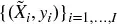 堆叠成一个组合数据集 (X, y)，其中 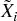 是 X~i~ 的变换实例（例如在滚动尾随窗口上标准化）。该变换的目的是确保某种分布同质性 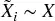。在这种方法下，分类器必须学习什么特征在所有工具上更重要，就好像整个投资宇宙实际上是单一工具。特征堆叠具有一些优势：(1) 分类器将在比并行化（第一种）方法使用的更大的数据集上拟合；(2) 重要性直接推导，不需要加权方案来组合结果；(3) 结论更通用，受异常值或过拟合的影响更小；(4) 因为重要性分数不在工具间平均，替代效应不会导致这些分数的衰减。

我通常偏好特征堆叠，不仅用于特征重要性，而且每当分类器可以在一组工具上拟合时（包括用于模型预测）。这降低了将估计器过拟合到特定工具或小数据集的可能性。堆叠的主要缺点是它可能消耗大量内存和资源，但这正是 HPC 技术的扎实知识将派上用场的地方（第 20-22 章）。

## 8.6 合成数据实验

在本节中，我们将测试这些特征重要性方法对合成数据的响应。我们将生成一个由三种特征组成的数据集 (X, y)：

1.  **信息性**：这些是用于确定标签的特征。
2.  **冗余**：这些是信息性特征的随机线性组合。它们将导致替代效应。
3.  **噪声**：这些是对确定观测标签没有影响的特征。

代码片段 8.7 展示了如何生成 40 个特征的合成数据集，其中 10 个信息性、10 个冗余、20 个噪声，共 10000 个观测。有关 sklearn 如何生成合成数据集的详细信息，请访问：http://scikit-learn.org/stable/modules/generated/sklearn.datasets.make_classification.html。

> **代码片段 8.7 创建合成数据集**

> 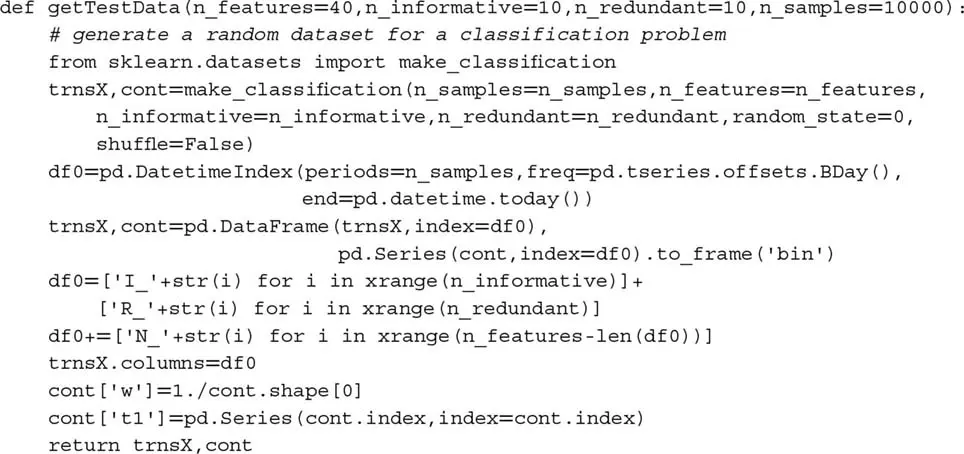

鉴于我们确切知道每个特征属于哪个类，我们可以评估这三种特征重要性方法是否按设计执行。现在我们需要一个可以在同一数据集上执行每种分析的函数。代码片段 8.8 完成了这一点，使用 bagged 决策树作为默认分类器（[第 6 章](ch06.md)）。

> **代码片段 8.8 为任何方法调用特征重要性**

> 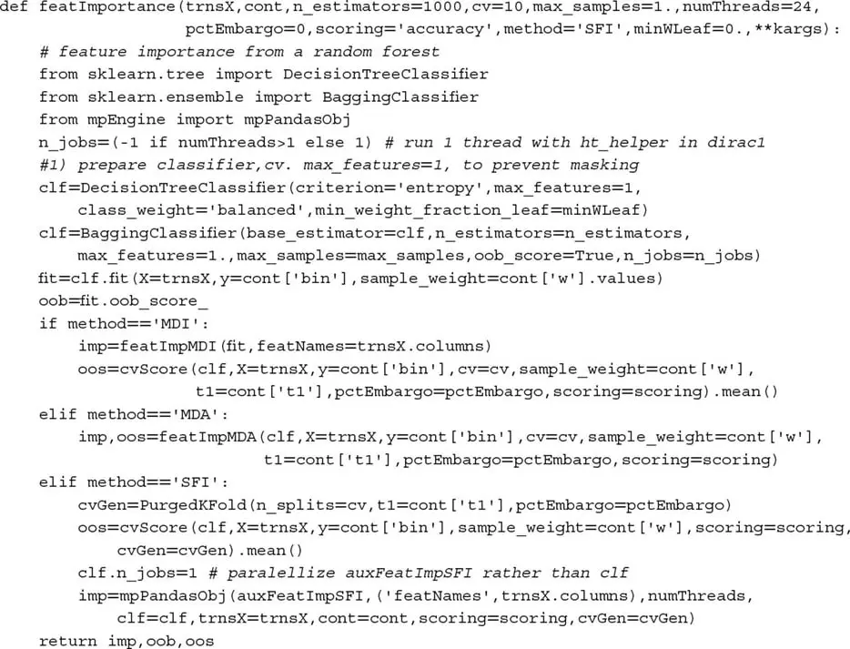

最后，我们需要一个主函数来调用所有组件，从数据生成到特征重要性分析再到输出的收集和处理。这些任务由代码片段 8.9 执行。

> **代码片段 8.9 调用所有组件**

> 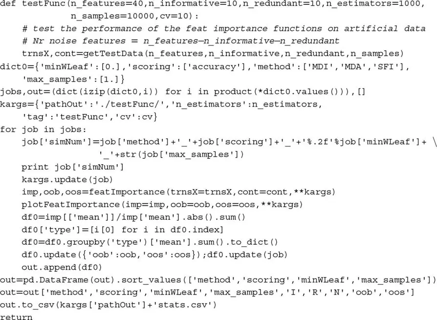

对于注重美观的读者，代码片段 8.10 提供了一个绘制特征重要性的漂亮布局。

> **代码片段 8.10 特征重要性绘图函数**

> 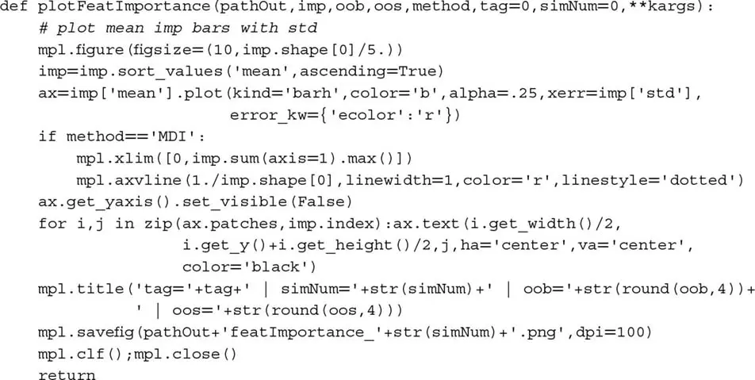

图 8.2 显示了 MDI 的结果。对于每个特征，水平条表示所有决策树上 MDI 值的均值，水平线是该均值的标凈差。由于 MDI 重要性加总为 1，如果所有特征同等重要，每个重要性的值为 1/40。垂直虚线标记了该 1/40 阈值，将重要性超过不可区分特征预期值的特征分开。如你所见，MDI 在将所有信息性和冗余特征置于红色虚线上方方面做得很好，除了 R_5 以微小差距未达标。替代效应导致一些信息性或冗余特征排名好于其他特征，这是预期的。

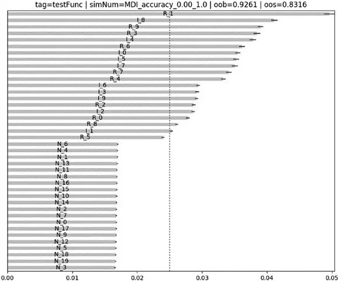

图 8.2 在合成数据集上计算的 MDI 特征重要性

图 8.3 显示 MDA 也做得很好。结果与 MDI 的一致，即所有信息性和冗余特征排名好于噪声特征，除了 R_6（可能是由于替代效应）。MDA 一个不太积极的方面是均值的标凈差稍高，尽管这可以通过增加净化 k 折 CV 中的划分数（例如从 10 增加到 100，在无并行化的情况下以 10 倍计算时间为代价）来解决。

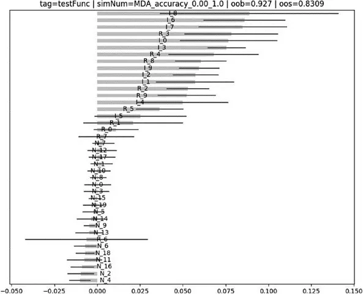

图 8.3 在合成数据集上计算的 MDA 特征重要性

图 8.4 显示 SFI 也做得不错；然而，一些重要特征排名低于噪声（I_6、I_2、I_9、I_1、I_3、R_5），可能是由于联合效应。

标签是特征组合的函数，尝试独立预测它们会错过联合效应。尽管如此，SFI 作为 MDI 和 MDA 的补充是有用的，正是因为两种分析受不同类型问题的影响。

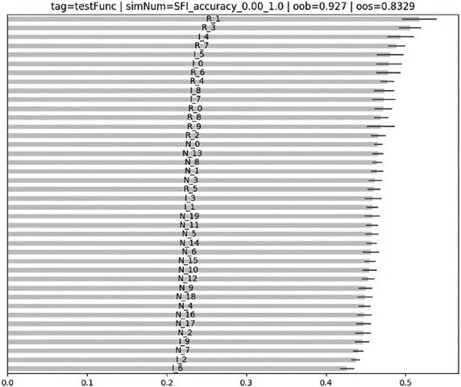

图 8.4 在合成数据集上计算的 SFI 特征重要性

## 练习题

1. 使用第 8.6 节中给出的代码：
    1. 生成数据集 (X, y)。
    2. 对 X 应用 PCA 变换，记为 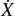。
    3. 在 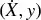 上计算 MDI、MDA 和 SFI 特征重要性，其中基础估计器为 RF。
    4. 三种方法是否就哪些特征重要达成一致？为什么？

2. 从练习 1，生成新数据集 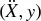，其中 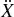 是 X 和  的特征并集。
    1. 在  上计算 MDI、MDA 和 SFI 特征重要性，其中基础估计器为 RF。
    2. 三种方法是否就重要特征达成一致？为什么？

3. 取练习 2 的结果：
    1. 根据每种方法丢弃最重要的特征，得到特征矩阵 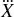。
    2. 在 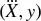 上计算 MDI、MDA 和 SFI 特征重要性，其中基础估计器为 RF。
    3. 相对于练习 2 的结果，你是否注意到重要特征排名的显著变化？

4. 使用第 8.6 节中给出的代码：
    1. 生成 1E6 个观测的数据集 (X, y)，其中 5 个特征信息性、5 个冗余、10 个噪声。
    2. 将 (X, y) 拆分为 10 个数据集 {(X~i~, y~i~)}~i=1,...,10~，每个 1E5 个观测。
    3. 在 10 个数据集 {(X~i~, y~i~)}~i=1,...,10~ 中的每一个上计算并行化特征重要性（第 8.5 节）。
    4. 在组合数据集 (X, y) 上计算堆叠特征重要性。
    5. 两者之间的差异是什么原因？哪个更可靠？

5. 重复练习 1-4 的所有 MDI 计算，但这次允许掩蔽效应。这意味着不要在代码片段 8.2 中设置 `max_features=int(1)`。结果因此变化如何？为什么？

## 参考文献

1. American Statistical Association (2016): "Ethical guidelines for statistical practice." Committee on Professional Ethics of the American Statistical Association (April). Available at http://www.amstat.org/asa/files/pdfs/EthicalGuidelines.pdf.
2. Belsley, D., E. Kuh, and R. Welsch (1980): *Regression Diagnostics: Identifying Influential Data and Sources of Collinearity*, 1st ed. John Wiley & Sons.
3. Goldberger, A. (1991): *A Course in Econometrics*. Harvard University Press, 1st edition.
4. Hill, R. and L. Adkins (2001): "Collinearity." In Baltagi, Badi H. *A Companion to Theoretical Econometrics*, 1st ed. Blackwell, pp. 256--278.
5. Louppe, G., L. Wehenkel, A. Sutera, and P. Geurts (2013): "Understanding variable importances in forests of randomized trees." Proceedings of the 26th International Conference on Neural Information Processing Systems, pp. 431--439.
6. Strobl, C., A. Boulesteix, A. Zeileis, and T. Hothorn (2007): "Bias in random forest variable importance measures: Illustrations, sources and a solution." *BMC Bioinformatics*, Vol. 8, No. 25, pp. 1--11.
7. White, A. and W. Liu (1994): "Technical note: Bias in information-based measures in decision tree induction." *Machine Learning*, Vol. 15, No. 3, pp. 321--329.

## 注释

^1^ http://blog.datadive.net/selecting-good-features-part-iii-random-forests/。
