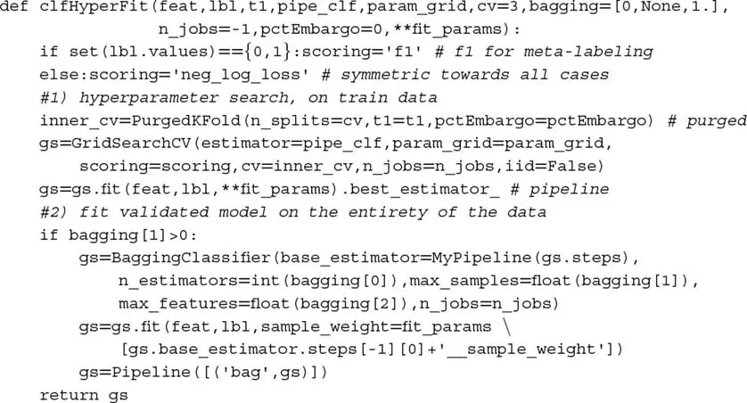
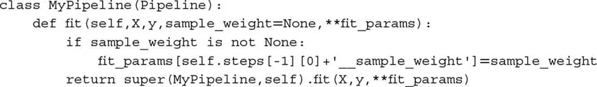
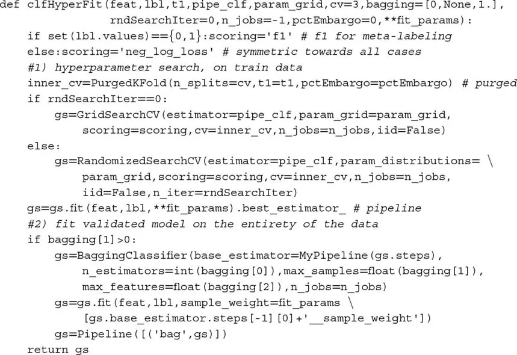
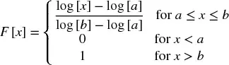
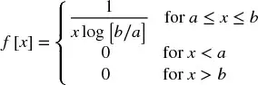
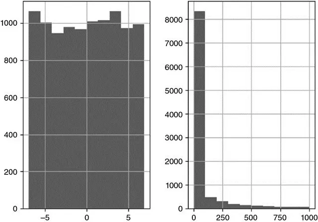
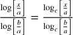
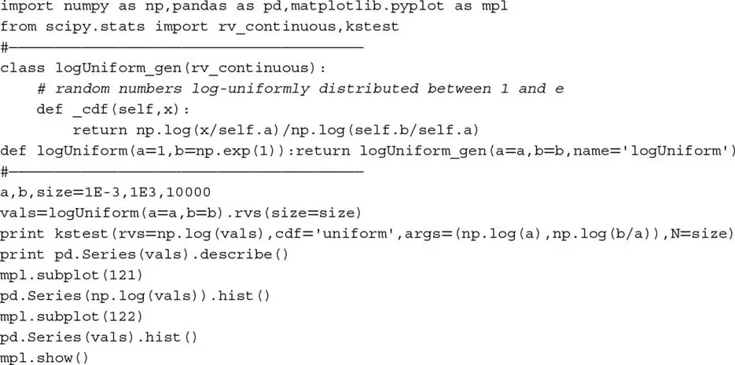
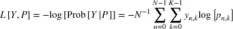
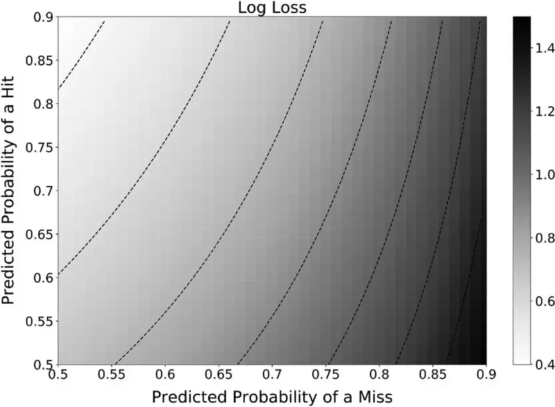

# 交叉验证超参数调优

## 9.1 动机

超参数调优是拟合 ML 算法的关键步骤。如果做得不当，算法很可能过拟合，实盘表现将令人失望。ML 文献特别关注对任何调优的超参数进行交叉验证。正如我们在[第 7 章](ch07.md)中所见，金融中的交叉验证（CV）是一个尤其困难的问题，其他领域的解决方案很可能失败。在本章中，我们将讨论如何使用净化 k 折 CV 方法调优超参数。参考文献部分列出了提出可能适用于特定问题的替代方法的研究。

## 9.2 网格搜索交叉验证

网格搜索交叉验证对所有参数组合进行穷举搜索，以根据某个用户定义的评分函数最大化 CV 性能。当我们对数据的底层结构知之甚少时，这是一个合理的初步方法。Scikit-learn 已在函数 `GridSearchCV` 中实现了该逻辑，它接受 CV 生成器作为参数。由于[第 7 章](ch07.md)中解释的原因，我们需要传入 `PurgedKFold` 类（代码片段 7.3），以防止 `GridSearchCV` 将 ML 估计器过拟合到泄露的信息。

> **代码片段 9.1 使用净化 K 折交叉验证的网格搜索**

> 

代码片段 9.1 列出了函数 `clfHyperFit`，它实现了净化的 `GridSearchCV`。参数 `fit_params` 可用于传递 `sample_weight`，`param_grid` 包含将组合成网格的值。此外，该函数允许对调优的估计器进行 bagging。出于[第 6 章](ch06.md)中解释的原因，对估计器进行 bagging 通常是个好主意，上述函数为此目的纳入了逻辑。

我建议你在元标签应用的上下文中使用 `scoring='f1'`，原因如下。假设一个样本有大量负例（即标签 '0'）。一个将所有案例预测为负例的分类器将达到高 `accuracy` 或 `neg_log_loss`，即使它没有从特征中学习如何区分案例。事实上，这样的模型达到零召回率和未定义的精确率（见[第 3 章](ch03.md)第 3.7 节）。`f1` 分数通过以精确率和召回率评分分类器来纠正这种性能膨胀（见[第 14 章](ch14.md)第 14.8 节）。

对于其他（非元标签）应用，使用 `accuracy` 或 `neg_log_loss` 是可以的，因为我们同样感兴趣于预测所有案例。注意，案例的重新标记对 `accuracy` 或 `neg_log_loss` 没有影响，但它会对 `f1` 产生影响。

这个例子很好地引入了 sklearn `Pipelines` 的一个局限：它们的 fit 方法不接受 `sample_weight` 参数。相反，它期望一个 `fit_params` 关键字参数。这是一个已在 GitHub 报告的 bug；然而，修复它可能需要一些时间，因为它涉及重写和测试大量功能。在此之前，请随意使用代码片段 9.2 中的变通方法。它创建了一个名为 `MyPipeline` 的新类，继承 sklearn 的 `Pipeline` 的所有方法。它用一个处理 `sample_weight` 参数的新方法覆盖了继承的 `fit` 方法，然后重定向到父类。

> **代码片段 9.2 增强的 Pipeline 类**

> 

如果你不熟悉这种扩展类的技术，你可能想阅读这篇入门 Stackoverflow 帖子：http://stackoverflow.com/questions/576169/understanding-python-super-with-init-methods。

## 9.3 随机搜索交叉验证

对于具有大量参数的 ML 算法，网格搜索交叉验证（CV）在计算上变得不可行。在这种情况下，一个具有良好统计性质的替代方案是从分布中采样每个参数（Bergstra 等 [2011, 2012]）。这有两个好处：第一，我们可以控制搜索的组合数量，无论问题的维度如何（相当于一个计算预算）。第二，在性能上相对不相关的参数不会实质性地增加我们的搜索时间，而在网格搜索 CV 中则会。

与其编写一个新函数来配合 `RandomizedSearchCV`，不如让我们扩展代码片段 9.1 以纳入此选项。一种可能的实现是代码片段 9.3。

> **代码片段 9.3 使用净化 K 折 CV 的随机搜索**

> 

### 9.3.1 对数均匀分布

一些 ML 算法通常只接受非负超参数。一些非常流行的参数就是如此，例如 SVC 分类器中的 `C` 和 RBF 核中的 `gamma`。^1^ 我们可以从 0 和某个大值（例如 100）之间的均匀分布中抽取随机数。这意味着 99% 的值预计大于 1。这不一定是探索其函数非线性响应的参数可行区域的最有效方式。例如，SVC 对 `C` 从 0.01 增加到 1 的响应可能与 `C` 从 1 增加到 100 一样。^2^ 因此，从 U[0, 100]（均匀）分布中采样 `C` 将是低效的。在这些情况下，从抽取的对数均匀分布的分布中抽取值似乎更有效。我称之为「对数均匀分布」（log-uniform distribution），由于我在文献中找不到它，我必须正确定义它。

随机变量 x 在 a > 0 和 b > a 之间服从对数均匀分布，当且仅当 log[x] ~ U[log[a], log[b]]。该分布的 CDF 为：

由此，我们推导 PDF：

图 9.1 测试 `logUniform_gen` 类的结果

注意 CDF 对对数的底不变，因为  对任何底 c，因此随机变量不是 c 的函数。代码片段 9.4 在 `scipy.stats` 中实现（并测试）了一个随机变量，其中 [a, b] = [1E−3, 1E3]，因此 log[x] ~ U[log[1E−3], log[1E3]]。图 9.1 说明了样本在对数尺度上的均匀性。

> **代码片段 9.4 `logUniform_gen` 类**

> 

## 9.4 评分与超参数调优

代码片段 9.1 和 9.3 为元标签应用设置 `scoring='f1'`。对于其他应用，它们设置 `scoring='neg_log_loss'` 而非标准的 `scoring='accuracy'`。虽然准确率有更直观的解释，但我建议你在调优投资策略的超参数时使用 `neg_log_loss`。让我解释我的理由。

假设你的 ML 投资策略以高概率预测你应该买入某个证券。你将根据策略的信心建立大量多头头寸。如果预测错误，市场反而抛售，你将损失很多钱。然而，准确率对高概率的错误买入预测和低概率的错误买入预测一视同仁。此外，准确率可以用低概率的命中来抵消高概率的错过。

投资策略从以高信心预测正确标签中获利。低信心好预测的收益不足以抵消高信心坏预测的损失。因此，准确率不能提供分类器性能的现实评分。相反，对数损失^3^（又称交叉熵损失）计算给定真实标签的分类器的对数似然，它考虑了预测的概率。对数损失可以估计如下：

其中

-   p~n,k~ 是标签 k 的预测 n 关联的概率。
-   Y 是一个 1-of-K 二元指示矩阵，当观测 n 被分配 K 个可能标签中的标签 k 时 y~n,k~ = 1，否则为 0。

假设分类器预测两个 1，其中真实标签为 1 和 0。第一个预测是命中，第二个预测是错过，因此准确率为 50%。图 9.2 绘制了当这些预测来自 [0.5, 0.9] 范围的概率时的交叉熵损失。可以观察到图的右侧，由于高概率的错过，对数损失很大，尽管所有情况下的准确率都是 50%。

图 9.2 对数损失作为命中和错过预测概率的函数

偏好交叉熵损失而非准确率的第二个原因是，CV 通过应用样本权重来评分分类器（见[第 7 章](ch07.md)第 7.5 节）。你可能记得[第 4 章](ch04.md)，观测权重是作为观测绝对收益的函数确定的。其含义是，样本加权交叉熵损失以涉及 PnL（盯市盈亏）计算的变量来估计分类器的性能：它使用正确的标签表示方向，概率表示仓位规模，样本权重表示观测的收益/结果。这才是金融应用超参数调优的正确 ML 性能指标，而非准确率。

当我们使用对数损失作为评分统计量时，我们通常偏好改变其符号，因此称为「负对数损失」。这一变化的原因是装饰性的，由直觉驱动：高负对数损失值优于低负对数损失值，就像准确率一样。使用 `neg_log_loss` 时请记住这个 sklearn bug：https://github.com/scikit-learn/scikit-learn/issues/9144。为规避此 bug，你应该使用[第 7 章](ch07.md)中介绍的 `cvScore` 函数。

## 练习题

1. 使用[第 8 章](ch08.md)的函数 `getTestData`，形成 10000 个观测、10 个特征的合成数据集，其中 5 个信息性、5 个噪声。
    1. 在 10 折 CV 上使用 `GridSearchCV` 查找带 RBF 核的 SVC 的 `C`、`gamma` 最优超参数，其中 `param_grid = {'C':[1E-2,1E-1,1,10,100],'gamma':[1E-2,1E-1,1,10,100]}`，评分函数为 `neg_log_loss`。
    2. 网格中有多少个节点？
    3. 找到最优解需要多少次拟合？
    4. 找到此解需要多长时间？
    5. 你如何访问最优结果？
    6. 最优参数组合的 CV 分数是多少？
    7. 你如何将样本权重传递给 SVC？

2. 使用练习 1 的同一数据集：
    1. 在 10 折 CV 上使用 `RandomizedSearchCV` 查找带 RBF 核的 SVC 的 `C`、`gamma` 最优超参数，其中 `param_distributions = {'C':logUniform(a = 1E-2,b = 1E2),'gamma':logUniform(a = 1E-2,b = 1E2)},n_iter = 25`，评分函数为 `neg_log_loss`。
    2. 找到此解需要多长时间？
    3. 最优参数组合是否与练习 1 中找到的相似？
    4. 最优参数组合的 CV 分数是多少？与练习 1 的 CV 分数相比如何？

3. 从练习 1：
    1. 计算点 1.a 所得样本内预测的夏普比率（夏普比率的定义见[第 14 章](ch14.md)）。
    2. 重复点 1.a，这次以 `accuracy` 作为评分函数。计算从超调优参数导出的样本内预测。
    3. 哪种评分方法导致更高的（样本内）夏普比率？

4. 从练习 2：
    1. 计算点 2.a 所得样本内预测的夏普比率。
    2. 重复点 2.a，这次以 `accuracy` 作为评分函数。计算从超调优参数导出的样本内预测。
    3. 哪种评分方法导致更高的（样本内）夏普比率？

5. 阅读对数损失的定义 L[Y, P]。
    1. 为什么评分函数 `neg_log_loss` 定义为负对数损失 −L[Y, P]？
    2. 最大化对数损失而非负对数损失的结果是什么？

6. 考虑一个不论预测信心如何都等额下注的投资策略。在这种情况下，对于超参数调优，哪种评分函数更合适——准确率还是交叉熵损失？

## 参考文献

1. Bergstra, J., R. Bardenet, Y. Bengio, and B. Kegl (2011): "Algorithms for hyper-parameter optimization." *Advances in Neural Information Processing Systems*, pp. 2546--2554.
2. Bergstra, J. and Y. Bengio (2012): "Random search for hyper-parameter optimization." *Journal of Machine Learning Research*, Vol. 13, pp. 281--305.

## 参考书目

1. Chapelle, O., V. Vapnik, O. Bousquet, and S. Mukherjee (2002): "Choosing multiple parameters for support vector machines." *Machine Learning*, Vol. 46, pp. 131--159.
2. Chuong, B., C. Foo, and A. Ng (2008): "Efficient multiple hyperparameter learning for log-linear models." *Advances in Neural Information Processing Systems*, Vol. 20. Available at http://ai.stanford.edu/~chuongdo/papers/learn_reg.pdf.
3. Gorissen, D., K. Crombecq, I. Couckuyt, P. Demeester, and T. Dhaene (2010): "A surrogate modeling and adaptive sampling toolbox for computer based design." *Journal of Machine Learning Research*, Vol. 11, pp. 2051--2055.
4. Hsu, C., C. Chang, and C. Lin (2010): "A practical guide to support vector classification." Technical report, National Taiwan University.
5. Hutter, F., H. Hoos, and K. Leyton-Brown (2011): "Sequential model-based optimization for general algorithm configuration." Proceedings of the 5th international conference on Learning and Intelligent Optimization, pp. 507--523.
6. Larsen, J., L. Hansen, C. Svarer, and M. Ohlsson (1996): "Design and regularization of neural networks: The optimal use of a validation set." Proceedings of the 1996 IEEE Signal Processing Society Workshop.
7. Maclaurin, D., D. Duvenaud, and R. Adams (2015): "Gradient-based hyperparameter optimization through reversible learning." Working paper. Available at https://arxiv.org/abs/1502.03492.
8. Martinez-Cantin, R. (2014): "BayesOpt: A Bayesian optimization library for nonlinear optimization, experimental design and bandits." *Journal of Machine Learning Research*, Vol. 15, pp. 3915--3919.

## 注释

^1^ http://scikit-learn.org/stable/modules/metrics.html.

^2^ http://scikit-learn.org/stable/auto_examples/svm/plot_rbf_parameters.html.

^3^ http://scikit-learn.org/stable/modules/model_evaluation.html#log-loss.
