# 下注规模

## 10.1 动机

策略游戏与投资之间有着迷人的相似之处。我合作过的一些最优秀的投资组合经理是出色的扑克玩家，也许比国际象棋玩家更甚。一个原因是下注规模（bet sizing），德州扑克为此提供了绝佳的类比和训练场。你的 ML 算法可以达到高精度，但如果你不正确地确定下注规模，你的投资策略将不可避免地亏损。在本章中，我们将回顾几种从 ML 预测确定下注规模的方法。

## 10.2 策略无关的下注规模方法

考虑同一工具上的两个策略。令 m~i,t~ ∈ [−1, 1] 为策略 i 在时间 t 的下注规模，其中 m~i,t~ = −1 表示满仓空头，m~i,t~ = 1 表示满仓多头。假设一个策略产生了下注规模序列 [m~1,1~, m~1,2~, m~1,3~] = [.5, 1, 0]，而市场价格遵循序列 [p~1~, p~2~, p~3~] = [1, .5, 1.25]，其中 p~t~ 是时间 t 的价格。另一个策略产生了序列 [m~2,1~, m~2,2~, m~2,3~] = [1, .5, 0]，因为它被迫在市场对初始满仓头寸不利时减少下注规模。两个策略产生的预测都被证明是正确的（价格在 p~1~ 和 p~3~ 之间增加了 25%），但第一个策略赚钱（0.5）而第二个策略亏损（−.125）。

我们更希望以一种在交易信号减弱之前为信号增强的可能性保留一些现金的方式来确定仓位规模。一种选择是计算序列 c~t~ = c~t,l~ − c~t,s~，其中 c~t,l~ 是时间 t 的并发多头下注数，c~t,s~ 是时间 t 的并发空头下注数。该下注并发性对每方的推导类似于我们在[第 4 章](ch04.md)中计算标签并发性的方式（回忆 `t1` 对象及其重叠时间跨度）。我们在 {c~t~} 上拟合两个高斯分布的混合，应用 López de Prado 和 Foreman [2014] 描述的方法。然后，下注规模推导为

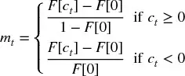

其中 F[x] 是值 x 的拟合双高斯混合的 CDF。例如，当观测到更大值信号的概率仅为 0.1 时，我们可以将下注规模定为 0.9。信号越强，信号变得更强的概率越小，因此下注规模越大。

第二种解决方案是遵循预算方法。我们计算并发多头下注的最大数量（或其他分位数）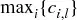 和并发空头下注的最大数量 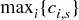。然后我们推导下注规模为 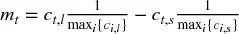，其中 c~t,l~ 是时间 t 的并发多头下注数，c~t,s~ 是时间 t 的并发空头下注数。目标是最大仓位在最后一个并发信号被触发之前不会达到。

第三种方法是应用元标签，如我们在[第 3 章](ch03.md)中解释的。我们拟合一个分类器（如 SVC 或 RF）来确定误分类的概率，并使用该概率推导下注规模。^1^ 该方法有几个优势：第一，决定下注规模的 ML 算法独立于一级模型，允许纳入预测假阳性的特征（见[第 3 章](ch03.md)）。第二，预测概率可以直接转换为下注规模。让我们看看如何做。

## 10.3 从预测概率确定下注规模

令 p[x] 为标签 x 发生的概率。对于两个可能的结果 x ∈ {−1, 1}，我们希望检验零假设 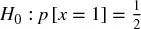。我们计算检验统计量 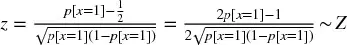，其中 z ∈ (−∞, +∞)，Z 表示标准正态分布。我们推导下注规模为 m = 2Z[z] − 1，其中 m ∈ [−1, 1]，Z[·] 是 Z 的 CDF。

对于两个以上可能的结果，我们遵循一对其余方法。令 X = {−1, ..., 0, ..., 1} 为与下注规模关联的各种标签，x ∈ X 为预测标签。换言之，标签由与其关联的下注规模标识。对于每个标签 i = 1, ..., ||X||，我们估计概率 p~i~，且 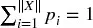。我们定义 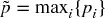 为 x 的概率，我们希望检验 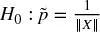。^2^ 我们计算检验统计量 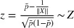，其中 z ∈ [0., . + ∞)。我们推导下注规模为 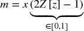，其中 m ∈ [−1, 1]，Z[z] 调节预测 x 的规模（方向由 x 隐含）。

图 10.1 绘制了下注规模作为检验统计量的函数。代码片段 10.1 实现了从概率到下注规模的转换。它处理预测来自元标签估计器以及标准标记估计器的可能性。在步骤 #2 中，它还平均活跃下注并离散化最终值，我们将在以下各节中解释。

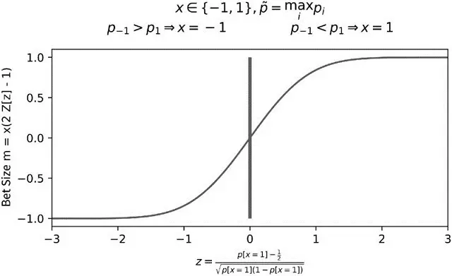

图 10.1 从预测概率得到的下注规模

> **代码片段 10.1 从概率到下注规模**

> 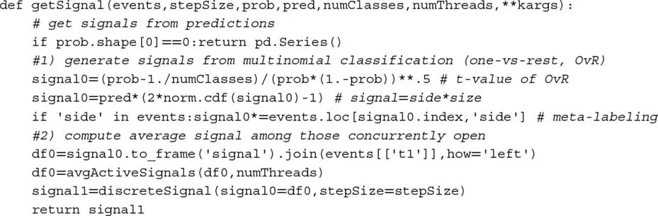

## 10.4 平均活跃下注

每个下注都与一个持有期关联，从其产生到首次触及障碍 `t1`（见[第 3 章](ch03.md)）。一种可能的方法是在新下注到达时覆盖旧下注；然而，这很可能导致过度换手。一种更合理的方法是在给定时间点上对所有仍然活跃的下注的规模取平均。代码片段 10.2 展示了该思想的一种可能实现。

> **代码片段 10.2 下注在仍然活跃时被平均**

> 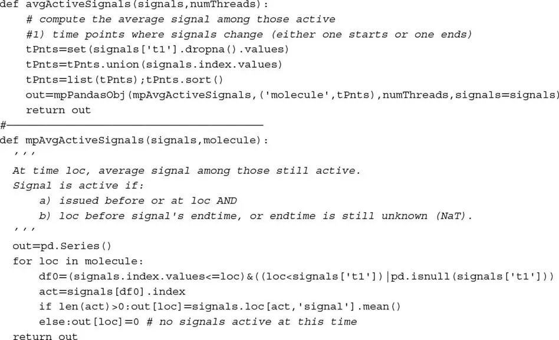

## 10.5 规模离散化

平均减少了部分过度换手，但每次预测仍然可能触发小额交易。由于这种抖动会导致不必要的过度交易，我建议你将下注规模离散化为 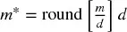，其中 d ∈ (0, .1] 确定离散化程度。图 10.2 说明了下注规模的离散化。代码片段 10.3 实现了该概念。

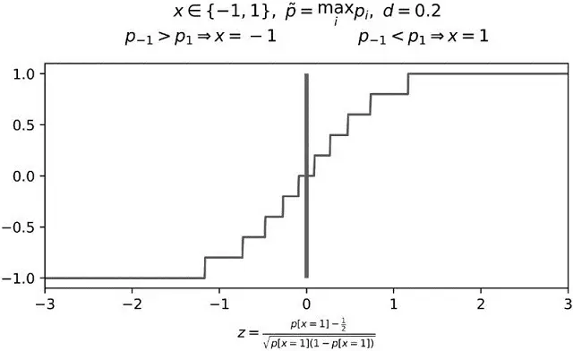

图 10.2 下注规模的离散化，d = 0.2

> **代码片段 10.3 防止过度交易的规模离散化**

> 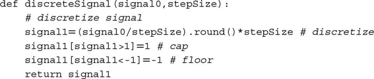

## 10.6 动态下注规模与限价

回忆[第 3 章](ch03.md)中提出的三重障碍标记法。条 i 在时间 t~i,0~ 形成，此时我们预测将触及的第一个障碍。该预测隐含一个预测价格 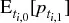，与障碍设置一致。在结果发生之前经过的期间 [t~i,0~, t~i,1~] 内，价格 p~t~ 波动，可能形成额外预测 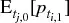，其中 j ∈ [i+1, I] 且 t~j,0~ ≤ t~i,1~。在第 10.4 节和第 10.5 节中，我们讨论了随着新预测形成而平均活跃下注和离散化下注规模的方法。在本节中，我们将介绍随着市场价格 p~t~ 和预测价格 f~i~ 波动而调整下注规模的方法。在此过程中，我们将推导订单的限价。

令 q~t~ 为当前仓位，Q 为最大绝对仓位规模， 为与预测 f~i~ 关联的目标仓位规模，使得

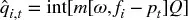

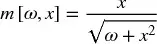

其中 m[ω, x] 是下注规模，x = f~i~ − p~t~ 是当前市场价格与预测之间的背离，ω 是调节 sigmoid 函数宽度的系数，Int[x] 是 x 的整数值。注意，对于实值价格背离 x，−1 < m[ω, x] < 1，整数值  有界 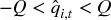。

目标仓位规模  可以随着 p~t~ 的变化动态调整。特别地，当 p~t~ → f~i~ 时，我们得到 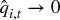，因为算法想要实现收益。这隐含了订单规模 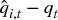 的盈亏平衡限价 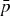，以避免实现亏损。特别地，

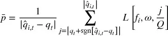

其中 L[f~i~, ω, m] 是 m[ω, f~i~ − p~t~] 关于 p~t~ 的反函数，

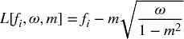

我们不需要担心 m² = 1 的情况，因为 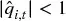。由于该函数是单调的，算法不会在 p~t~ → f~i~ 时实现亏损。

让我们校准 ω。给定用户定义的对 (x, m\*)，使得 x = f~i~ − p~t~ 且 m\* = m[ω, x]，m[ω, x] 关于 ω 的反函数为

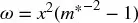

代码片段 10.4 实现了计算作为 p~t~ 和 f~i~ 函数的动态仓位规模和限价的算法。第一，我们校准 sigmoid 函数，使其对价格背离 x = 10 返回下注规模 m\* = .95。第二，我们计算最大仓位 Q = 100、f~i~ = 115、p~t~ = 100 时的目标仓位 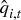。如果你尝试 f~i~ = 110，你将得到 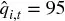，与 ω 的校准一致。第三，该规模 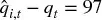 的订单限价为 p~t~ < 112.3657 < f~i~，介于当前价格和预测价格之间。

> **代码片段 10.4 动态仓位规模与限价**

> 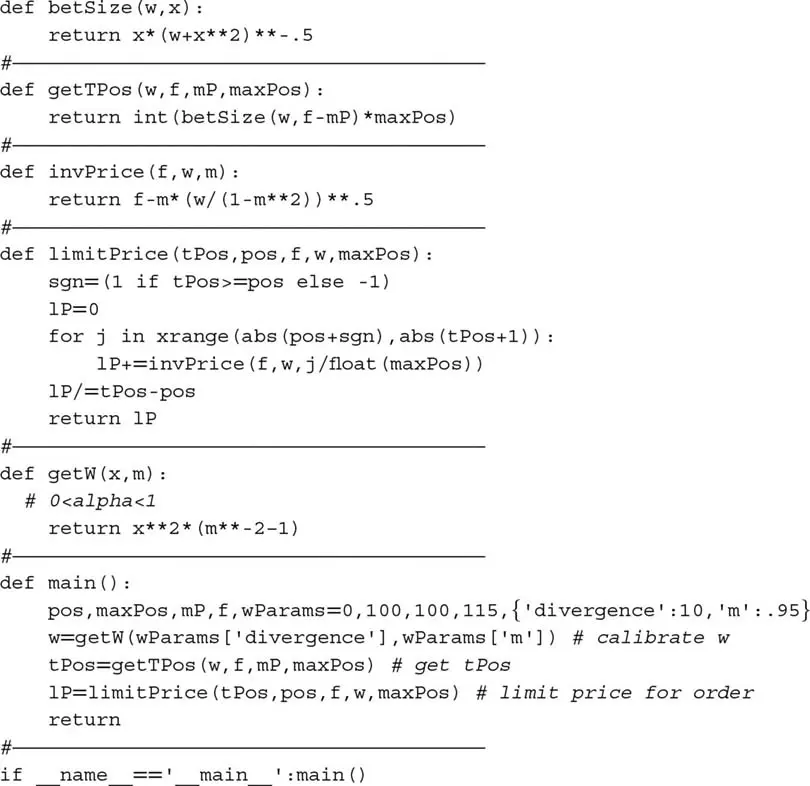

作为 sigmoid 函数的替代，我们可以使用幂函数 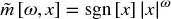，其中 ω ≥ 0，x ∈ [−1, 1]，得到 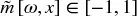。该替代方案的优势在于：

-   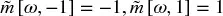。
-   曲率可以通过 ω 直接操作。
-   对于 ω > 1，函数从凹到凸，而非反过来，因此函数在拐点附近几乎平坦。

我们将幂函数方程的推导留作练习。图 10.3 绘制了 sigmoid 和幂函数的下注规模（y 轴）作为价格背离 f − p~t~（x 轴）的函数。

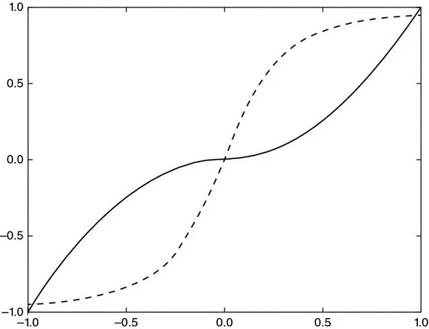

图 10.3 f[x] = sgn[x]|x|²（凹到凸）和 f[x] = x(.1 + x²)^−.5^（凸到凹）

## 练习题

1. 使用第 10.3 节的公式，绘制下注规模 (m) 作为最大预测概率 (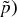) 当 ||X|| = 2, 3, ..., 10 时的函数。

2. 从界限 U[.5, 1.] 的均匀分布中抽取 10000 个随机数。
    1. 计算 ||X|| = 2 时的下注规模 m。
    2. 为下注规模分配 10000 个连续日历日。
    3. 从界限 U[1, 25] 的均匀分布中抽取 10000 个随机数。
    4. 形成一个 pandas 序列，索引为 2.b 中的日期，值等于向前移动 2.c 中天数的索引。这是一个类似于我们在[第 3 章](ch03.md)中使用的 `t1` 对象。
    5. 按照第 10.4 节计算所得的平均活跃下注。

3. 使用练习 2.d 的 `t1` 对象：
    1. 确定并发多头下注的最大数量 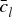。
    2. 确定并发空头下注的最大数量 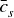。
    3. 推导下注规模 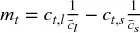，其中 c~t,l~ 是时间 t 的并发多头下注数，c~t,s~ 是时间 t 的并发空头下注数。

4. 使用练习 2.d 的 `t1` 对象：
    1. 计算序列 c~t~ = c~t,l~ − c~t,s~，其中 c~t,l~ 是时间 t 的并发多头下注数，c~t,s~ 是时间 t 的并发空头下注数。
    2. 在 {c~t~} 上拟合两个高斯分布的混合。你可能想使用 López de Prado 和 Foreman [2014] 描述的方法。
    3. 推导下注规模 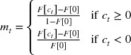，其中 F[x] 是值 x 的拟合双高斯混合的 CDF。
    4. 解释该序列 {m~t~} 与练习 3 中计算的下注规模序列有何不同。

5. 重复练习 1，用 `stepSize=.01`、`stepSize=.05` 和 `stepSize=.1` 离散化 m。

6. 重写第 10.6 节的方程，使下注规模由幂函数而非 sigmoid 函数确定。

7. 修改代码片段 10.4 以实现你在练习 6 中推导的方程。

## 参考文献

1. López de Prado, M. and M. Foreman (2014): "A mixture of Gaussians approach to mathematical portfolio oversight: The EF3M algorithm." *Quantitative Finance*, Vol. 14, No. 5, pp. 913--930.
2. Wu, T., C. Lin and R. Weng (2004): "Probability estimates for multi-class classification by pairwise coupling." *Journal of Machine Learning Research*, Vol. 5, pp. 975--1005.

## 参考书目

1. Allwein, E., R. Schapire, and Y. Singer (2001): "Reducing multiclass to binary: A unifying approach for margin classifiers." *Journal of Machine Learning Research*, Vol. 1, pp. 113--141.
2. Hastie, T. and R. Tibshirani (1998): "Classification by pairwise coupling." *The Annals of Statistics*, Vol. 26, No. 1, pp. 451--471.
3. Refregier, P. and F. Vallet (1991): "Probabilistic approach for multiclass classification with neural networks." Proceedings of International Conference on Artificial Networks, pp. 1003--1007.

## 注释

^1^ 参考文献部分列出了若干解释这些概率如何推导的文章。通常这些概率纳入了关于拟合优度或预测信心的信息。见 Wu 等 [2004]，并访问 <http://scikit-learn.org/stable/modules/svm.html#scores-and-probabilities>。

^2^ 当所有结果等可能时，不确定性是绝对的。
