# 回测的危险

## 11.1 动机
Backtesting is one of the most essential, and yet least understood,
techniques in the quant arsenal. A common misunderstanding is to think
of backtesting as a research tool. Researching and backtesting is like
drinking and driving. Do not research under the influence of a backtest.
Most backtests published in journals are flawed, as the result of
selection bias on multiple tests (Bailey, Borwein, López de Prado, and
Zhu [2014]; Harvey et al. [2016]). A full book could be written
listing all the different errors people make while backtesting. I may be
the academic author with the largest number of journal articles on
backtesting^\ [1]^
and investment performance metrics, and still I do not feel I would have
the stamina to compile all the different errors I have seen over the
past 20 years. This chapter is not a crash course on backtesting, but a
short list of some of the common errors that even seasoned professionals
make.

## 11.2 不可能的任务：完美的回测
In its narrowest definition, a backtest is a historical simulation of
how a strategy would have performed should it have been run over a past
period of time. As such, it is a hypothetical, and by no means an
experiment. At a physics laboratory, like Berkeley Lab, we can repeat an
experiment while controlling for environmental variables, in order to
deduce a precise cause-effect relationship. In contrast, a backtest
is] *not* [an experiment, and it does not prove
anything. A backtest guarantees nothing, not even achieving that Sharpe
ratio if we could travel back in time in our retrofitted DeLorean DMC-12
(Bailey and López de Prado [2012]). Random draws would have been
different. The past would not repeat itself.

What is the point of a backtest then? It is a sanity check on a number
of variables, including bet sizing, turnover, resilience to costs, and
behavior under a given scenario. A good backtest can be extremely
helpful, but backtesting well is extremely hard. In 2014 a team of
quants at Deutsche Bank, led by Yin Luo, published a study under the
title "Seven Sins of Quantitative Investing" (Luo et al. [2014]). It
is a very graphic and accessible piece that I would advise everyone in
this business to read carefully. In it, this team mentions the usual
suspects:

1.  **Survivorship bias:** Using as investment universe the current one,
    hence ignoring that some companies went bankrupt and securities were
    delisted along the way.
2.  **Look-ahead bias:** Using information that was not public at the
    moment the simulated decision would have been made. Be certain about
    the timestamp for each data point. Take into account release dates,
    distribution delays, and backfill corrections.
3.  **Storytelling:** Making up a story *ex-post* to justify some random
    pattern.
4.  **Data mining and data snooping:** Training the model on the testing
    set.
5.  **Transaction costs:** Simulating transaction costs is hard because
    the only way to be certain about that cost would have been to
    interact with the trading book (i.e., to do the actual trade).
6.  **Outliers:** Basing a strategy on a few extreme outcomes that may
    never happen again as observed in the past.
7.  **Shorting:** Taking a short position on cash products requires
    finding a lender. The cost of lending and the amount available is
    generally unknown, and depends on relations, inventory, relative
    demand, etc.

These are just a few basic errors that most papers published in
journals make routinely. Other common errors include computing
performance using a non-standard method ([第 14 章](ch14.md)); ignoring hidden
risks; focusing only on returns while ignoring other metrics; confusing
correlation with causation; selecting an unrepresentative time period;
failing to expect the unexpected; ignoring the existence of stop-out
limits or margin calls; ignoring funding costs; and forgetting practical
aspects (Sarfati [2015]). There are many more, but really, there is no
point in listing them, because of the title of the next
section.

## 11.3 即使你的回测完美，它可能也是错的
Congratulations! Your backtest is flawless in the sense that everyone
can reproduce your results, and your assumptions are so conservative
that not even your boss could object to them. You have paid for every
trade more than double what anyone could possibly ask. You have executed
hours after the information was known by half the globe, at a
ridiculously low volume participation rate. Despite all these egregious
costs, your backtest still makes a lot of money. Yet, this flawless
backtest is probably wrong. Why? Because only an expert can produce a
flawless backtest. Becoming an expert means that you have run tens of
thousands of backtests over the years. In conclusion, this is not the
first backtest you produce, so we need to account for the possibility
that this is a false discovery, a statistical fluke that inevitably
comes up after you run multiple tests on the same
dataset.

The maddening thing about backtesting is that, the better you become at
it, the more likely false discoveries will pop up. Beginners fall for
the seven sins of Luo et al. [2014] (there are more, but who\'s
counting?). Professionals may produce flawless backtests, and will still
fall for multiple testing, selection bias, or backtest overfitting
(Bailey and López de Prado [2014b]).

## 11.4 回测不是研究工具
[第 8 章](ch08.md) discussed substitution effects, joint effects, masking, MDI,
MDA, SFI, parallelized features, stacked features, etc. Even if some
features are very important, it does not mean that they can be monetized
through an investment strategy. Conversely, there are plenty of
strategies that will appear to be profitable even though they are based
on irrelevant features. Feature importance is a true research tool,
because it helps us understand the nature of the patterns uncovered by
the ML algorithm, regardless of their monetization. Critically, feature
importance is derived] *ex-ante* [, before the
historical performance is simulated.

In contrast, a backtest is not a research tool. It provides us with
very little insight into the reason why a particular strategy would have
made money. Just as a lottery winner may feel he has done something to
deserve his luck, there is always some] *ex-post*
story (Luo\'s sin number three). Authors claim to have found hundreds
of "alphas" and "factors," and there is always some convoluted
explanation for them. Instead, what they have found are the lottery
tickets that won the last game. The winner has cashed out, and those
numbers are useless for the next round. If you would not pay extra for
those lottery tickets, why would you care about those hundreds of
alphas? Those authors never tell us about all the tickets that were
sold, that is, the millions of simulations it took to find these "lucky"
alphas.

The purpose of a backtest is to discard bad models, not to improve
them. Adjusting your model based on the backtest results is a waste of
time . . . and it\'s dangerous. Invest your time and effort in getting
all the components right, as we\'ve discussed elsewhere in the book:
structured data, labeling, weighting, ensembles, cross-validation,
feature importance, bet sizing, etc. By the time you are backtesting, it
is too late. Never backtest until your model has been fully specified.
If the backtest fails, start all over. If you do that, the chances of
finding a false discovery will drop substantially, but still they will
not be zero.

## 11.5 一些通用建议
Backtest overfitting can be defined as selection bias on multiple
backtests. Backtest overfitting takes place when a strategy is developed
to perform well on a backtest, by monetizing random historical patterns.
Because those random patterns are unlikely to occur again in the future,
the strategy so developed will fail. Every backtested strategy is
overfit to some extent as a result of "selection bias": The only
backtests that most people share are those that portray supposedly
winning investment strategies.

How to address backtest overfitting is arguably the most fundamental
question in quantitative finance. Why? Because if there was an easy
answer to this question, investment firms would achieve high performance
with certainty, as they would invest only in winning backtests. Journals
would assess with confidence whether a strategy may be a false positive.
Finance could become a true science in the Popperian and Lakatosian
sense (López de Prado [2017]). What makes backtest overfitting so hard
to assess is that the probability of false positives changes with every
new test conducted on the same dataset, and that information is either
unknown by the researcher or not shared with investors or referees.
While there is no easy way to prevent overfitting, a number of steps can
help reduce its presence.

1.  Develop models for entire asset classes or investment universes,
    rather than for specific securities ([第 8 章](ch08.md)). Investors
    diversify, hence they do not make mistake *X* only on security *Y.*
    If you find mistake *X* only on security *Y* , no matter how
    apparently profitable, it is likely a false discovery.
2.  Apply bagging ([第 6 章](ch06.md)) as a means to both prevent overfitting and
    reduce the variance of the forecasting error. If bagging
    deteriorates the performance of a strategy, it was likely overfit to
    a small number of observations or outliers.
3.  Do not backtest until all your research is complete (Chapters
    1--10).
4.  Record every backtest conducted on a dataset so that the probability
    of backtest overfitting may be estimated on the final selected
    result (see Bailey, Borwein, López de Prado, and Zhu [2017a] and
    [第 14 章](ch14.md)), and the Sharpe ratio may be properly deflated by the
    number of trials carried out (Bailey and López de Prado [2014b]).
5.  Simulate scenarios rather than history ([第 12 章](ch12.md)). A standard
    backtest is a historical simulation, which can be easily overfit.
    History is just the random path that was realized, and it could have
    been entirely different. Your strategy should be profitable under a
    wide range of scenarios, not just the anecdotal historical path. It
    is harder to overfit the outcome of thousands of "what if"
    scenarios.
6.  If the backtest fails to identify a profitable strategy, start from
    scratch. Resist the temptation of reusing those results. Follow the
    Second Law of Backtesting.

> **SNIPPET 11.1 MARCOS' SECOND LAW OF BACKTESTING**

> > ["Backtesting while researching is like drinking and driving. Do not
> > research under the influence of a backtest."

> > > Marcos López de Prado *Advances in Financial
> > > Machine Learning* [(2018)

## 11.6 策略选择
In [第 7 章](ch07.md) we discussed how the presence of serial conditionality in
labels defeats standard k-fold cross-validation, because the random
sampling will spatter redundant observations into both the training and
testing sets. We must find a different (true out-of-sample) validation
procedure: a procedure that evaluates our model on the observations
least likely to be correlated/redundant to those used to train the
model. See Arlot and Celisse [2010] for a survey.

Scikit-learn has implemented a walk-forward timefolds method.
^[2]^ Under this approach, testing moves forward (in the time
direction) with the goal of preventing leakage. This is consistent with
the way historical backtests (and trading) are done. However, in the
presence of long-range serial dependence, testing one observation away
from the end of the training set may not suffice to avoid informational
leakage. We will retake this point in [第 12 章](ch12.md), Section
12.2.

One disadvantage of the walk-forward method is that it can be easily
overfit. The reason is that without random sampling, there is a single
path of testing that can be repeated over and over until a false
positive appears. Like in standard CV, some randomization is needed to
avoid this sort of performance targeting or backtest optimization, while
avoiding the leakage of examples correlated to the training set into the
testing set. Next, we will introduce a CV method for strategy selection,
based on the estimation of the probability of backtest overfitting
(PBO). We leave for [第 12 章](ch12.md) an explanation of CV methods for
backtesting.

Bailey et al. [2017a] estimate the PBO through the combinatorially
symmetric cross-validation (CSCV) method. Schematically, this procedure
works as follows.

First, we form a matrix] *M* by collecting the
performance series from the *N* trials. In
particular, each column *n* [= 1,
...,] *N* [represents a vector of PnL (mark-to-market
profits and losses) over] *t* [= 1,
...,] *T* [observations associated with a particular
model configuration tried by the researcher.] *M* is
therefore a real-valued matrix of order ( *TxN* [).
The only conditions we impose are that (1)] *M* [is a
true matrix, that is, with the same number of rows for each column,
where observations are synchronous for every row across
the] *N* [trials, and (2) the performance evaluation
metric used to choose the "optimal" strategy can be estimated on
subsamples of each column. For example, if that metric is the Sharpe
ratio, we assume that the IID Normal distribution assumption can be held
on various slices of the reported performance. If different model
configurations trade with different frequencies, observations are
aggregated (downsampled) to match a common index] *t*
= 1, ...,] *T* [.

Second, we partition] *M* across rows, into an even
number *S* [of disjoint submatrices of equal
dimensions. Each of these submatrices] *M
~[*s*]~* [, with] *s* [= 1,
...,] *S* [, is of order
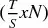
.

Third, we form all combinations] *C ~[*S*]~*
of] *M ~[*s*]~* [, taken in groups of
size] 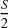 [. This gives a total number of
combinations

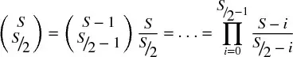

For instance, if] *S = 16* [, we will form 12,780
combinations. Each combination] *c*
∈] *C ~[*S*]~* is composed
of 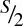 submatrices *M ~[*s*]~*
.

Fourth, for each combination] *c*
∈] *C ~[*S*]~* [, we:

1.  Form the *training set J* , by joining the
    
    submatrices *M ~[*s*]~* that constitute *c. J* is a matrix
    of order 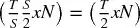
    .
2.  Form the *testing set* 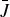 , as the complement of *J* in *M.* In other
    words,  is
    the 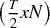
    matrix formed by all rows of *M* that are not part of *J.*
3.  Form a vector *R* of performance statistics of order *N* , where the
    *n* -th item of *R* reports the performance associated with the *n*
    -th column of *J* (the training set).
4.  Determine the element *n* * such that
    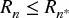 , ∀*n* =
    1, ..., *N* . In other words, 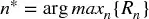 .
5.  Form a vector  of performance statistics of order *N* , where the *n*
    -th item of  reports the performance associated with the *n* -th
    column of 
    (the testing set).
6.  Determine the relative rank of 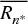 within 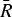 . We denote this relative rank as
    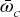 , where
    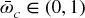 . This is
    the relative rank of the out-of-sample (OOS) performance associated
    with the trial chosen in-sample (IS). If the strategy optimization
    procedure does not overfit, we should observe that
    
    systematically outperforms  (OOS), just as
    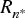
    outperformed *R* (IS).
7.  Define the logit 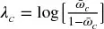 . This presents the property that λ ~[*c*]~ = 0
    when 
    coincides with the median of  . High logit values imply a consistency
    between IS and OOS performance, which indicates a low level of
    backtest overfitting.

Fifth, compute the distribution of ranks OOS by collecting all the λ
~[*c*]~ , for] *c* [∈] *C
~[*S*]~* [. The probability distribution
function] *f* [(λ) is then estimated as the relative
frequency at which λ occurred across all] *C
~[*S*]~* [, with
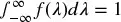 *.*
Finally, the PBO is estimated as
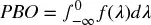 [, as that
is the probability associated with IS optimal strategies that
underperform OOS.

The x-axis of]  Figure
11.1 [shows the Sharpe ratio IS from
the best strategy selected. The y-axis shows the Sharpe ratio OOS for
that same best strategy selected. As it can be appreciated, there is a
strong and persistent performance decay, caused by backtest overfitting.
Applying the above algorithm, we can derive the PBO associated with this
strategy selection process, as displayed in
 图 11.2
.

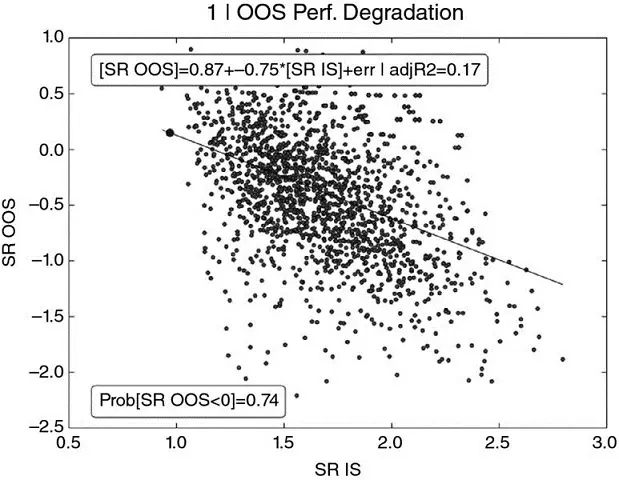

**图 11.1** Best Sharpe ratio
in-sample (SR IS) vs Sharpe ratio out-of-sample (SR OOS)

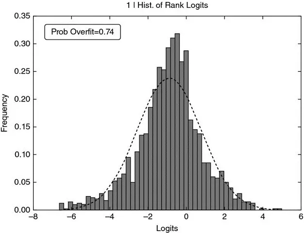

**图 11.2** Probability of
backtest overfitting derived from the distribution of logits

The observations in each subset preserve the original time sequence.
The random sampling is done on the relatively uncorrelated subsets,
rather than on the observations. See Bailey et al. [2017a] for an
experimental analysis of the accuracy of this
methodology.

## 练习题

1.  [An analyst fits an RF classifier where some of the features include
    > > seasonally adjusted employment data. He aligns with January data
    > > the seasonally adjusted value of January, etc. What "sin" has he
    > > committed?

2.  [An analyst develops an ML algorithm where he generates a signal
    > > using closing prices, and executed at close. What\'s the
    > > sin?

3.  [There is a 98.51% correlation between total revenue generated by
    > > arcades and computer science doctorates awarded in the United
    > > States. As the number of doctorates is expected to grow, should
    > > we invest in arcades companies? If not, what\'s the
    > > sin?

4.  The *Wall Street Journal* [has reported that
    > > September is the only month of the year that has negative
    > > average stock returns, looking back 20, 50, and 100 years.
    > > Should we sell stocks at the end of August? If not, what\'s the
    > > sin?

5.  [We download P/E ratios from Bloomberg, rank stocks every month,
    > > sell the top quartile, and buy the long quartile. Performance is
    > > amazing. What\'s the sin?

## 参考文献

1.  Arlot, S. and A. Celisse (2010): "A survey of cross-validation
    procedures for model selection." *Statistics Surveys* , Vol. 4, pp.
    40--79.
2.  Bailey, D., J. Borwein, M. López de Prado, and J. Zhu (2014):
    "Pseudo-mathematics and financial charlatanism: The effects of
    backtest overfitting on out-of-sample performance." *Notices of the
    American Mathematical Society* , Vol. 61, No. 5 (May), pp. 458--471.
    Available at <https://ssrn.com/abstract=2308659> .
3.  Bailey, D., J. Borwein, M. López de Prado, and J. Zhu (2017a): "The
    probability of backtest overfitting." *Journal of Computational
    Finance* , Vol. 20, No. 4, pp. 39--70. Available at
    <http://ssrn.com/abstract=2326253> .
4.  Bailey, D. and M. López de Prado (2012): "The Sharpe ratio efficient
    frontier." *Journal of Risk* , Vol. 15, No. 2 (Winter). Available at
    <https://ssrn.com/abstract=1821643> .
5.  Bailey, D. and M. López de Prado (2014b): "The deflated Sharpe
    ratio: Correcting for selection bias, backtest overfitting and
    non-normality." *Journal of Portfolio Management* , Vol. 40, No. 5,
    pp. 94--107. Available at <https://ssrn.com/abstract=2460551> .
6.  Harvey, C., Y. Liu, and H. Zhu (2016): ". . . and the cross-section
    of expected returns." *Review of Financial Studies* , Vol. 29, No.
    1, pp. 5--68.
7.  López de Prado, M. (2017): "Finance as an industrial science."
    *Journal of Portfolio Management* , Vol. 43, No. 4, pp. 5--9.
    Available at http://www.iijournals.com/doi/pdfplus/10.3905/jpm
    .2017.43.4.005(http://www.iijournals.com/doi/pdfplus/10.3905/jpm.2017.43.4.005)
    .
8.  Luo, Y., M. Alvarez, S. Wang, J. Jussa, A. Wang, and G. Rohal
    (2014): "Seven sins of quantitative investing." White paper,
    Deutsche Bank Markets Research, September 8.
9.  Sarfati, O. (2015): "Backtesting: A practitioner\'s guide to
    assessing strategies and avoiding pitfalls." Citi Equity
    Derivatives. CBOE 2015 Risk Management Conference. Available at
    <https://www.cboe.com/rmc/2015/olivier-pdf-Backtesting-Full.pdf> .

## 参考书目

1.  Bailey, D., J. Borwein, and M. López de Prado (2016): "Stock
    portfolio design and backtest overfitting." *Journal of Investment
    Management* , Vol. 15, No. 1, pp. 1--13. Available at
    <https://ssrn.com/abstract=2739335> .
2.  Bailey, D., J. Borwein, M. López de Prado, A. Salehipour, and J. Zhu
    (2016): "Backtest overfitting in financial markets." *Automated
    Trader* , Vol. 39. Available at <https://ssrn.com/abstract=2731886>
    .
3.  Bailey, D., J. Borwein, M. López de Prado, and J. Zhu (2017b):
    "Mathematical appendices to: 'The probability of backtest
    overfitting.'" *Journal of Computational Finance (Risk Journals)* ,
    Vol. 20, No. 4. Available at <https://ssrn.com/abstract=2568435> .
4.  Bailey, D., J. Borwein, A. Salehipour, and M. López de Prado (2017):
    "Evaluation and ranking of market forecasters." *Journal of
    Investment Management* , forthcoming. Available at
    <https://ssrn.com/abstract=2944853> .
5.  Bailey, D., J. Borwein, A. Salehipour, M. López de Prado, and J. Zhu
    (2015): "Online tools for demonstration of backtest overfitting."
    Working paper. Available at <https://ssrn.com/abstract=2597421> .
6.  Bailey, D., S. Ger, M. López de Prado, A. Sim and, K. Wu (2016):
    "Statistical overfitting and backtest performance." In *Risk-Based
    and Factor Investing* , Quantitative Finance Elsevier. Available at
    ttps://ssrn.com/abstract=2507040(https://ssrn.com/abstract=2507040)
    .
7.  Bailey, D. and M. López de Prado (2014a): "Stop-outs under serial
    correlation and 'the triple penance rule.'" *Journal of Risk* , Vol.
    18, No. 2, pp. 61--93. Available at https://ssrn.com/
    abstract=2201302(https://ssrn.com/abstract=2201302) .
8.  Bailey, D. and M. López de Prado (2015): "Mathematical appendices
    to: 'Stop-outs under serial correlation.'" *Journal of Risk* , Vol.
    18, No. 2. Available at <https://ssrn.com/abstract=2511599> .
9.  Bailey, D., M. López de Prado, and E. del Pozo (2013): "The strategy
    approval decision: A Sharpe ratio indifference curve approach."
    *Algorithmic Finance* , Vol. 2, No. 1, pp. 99--109. Available at
    <https://ssrn.com/abstract=2003638> .
10. Carr, P. and M. López de Prado (2014): "Determining optimal trading
    rules without backtesting." Working paper. Available at
    <https://ssrn.com/abstract=2658641> .
11. López de Prado, M. (2012a): "Portfolio oversight: An evolutionary
    approach." Lecture at Cornell University. Available at
    <https://ssrn.com/abstract=2172468> .
12. López de Prado, M. (2012b): "The sharp razor: Performance evaluation
    with non-normal returns." Lecture at Cornell University. Available
    at <https://ssrn.com/abstract=2150879> .
13. López de Prado, M. (2013): "What to look for in a backtest." Lecture
    at Cornell University. Available at
    <https://ssrn.com/abstract=2308682> .
14. López de Prado, M. (2014a): "Optimal trading rules without
    backtesting." Lecture at Cornell University. Available at
    <https://ssrn.com/abstract=2502613> .
15. López de Prado, M. (2014b): "Deflating the Sharpe ratio." Lecture at
    Cornell University. Available at <https://ssrn.com/abstract=2465675>
    .
16. López de Prado, M. (2015a): "Quantitative meta-strategies."
    *Practical Applications, Institutional Investor Journals* , Vol. 2,
    No. 3, pp. 1--3. Available at <https://ssrn.com/abstract=2547325> .
17. López de Prado, M. (2015b): "The Future of empirical finance."
    *Journal of Portfolio Management* , Vol. 41, No. 4, pp. 140--144.
    Available at <https://ssrn.com/abstract=2609734> .
18. López de Prado, M. (2015c): "Backtesting." Lecture at Cornell
    University. Available at https://ssrn.
    com/abstract=2606462(https://ssrn.com/abstract=2606462) .
19. López de Prado, M. (2015d): "Recent trends in empirical finance."
    *Journal of Portfolio Management* , Vol. 41, No. 4, pp. 29--33.
    Available at <https://ssrn.com/abstract=2638760> .
20. López de Prado, M. (2015e): "Why most empirical discoveries in
    finance are likely wrong, and what can be done about it." Lecture at
    University of Pennsylvania. Available at https://ssrn.com/
    abstract=2599105(https://ssrn.com/abstract=2599105) .
21. López de Prado, M. (2015f): "Advances in quantitative
    meta-strategies." Lecture at Cornell University. Available at
    <https://ssrn.com/abstract=2604812> .
22. López de Prado, M. (2016): "Building diversified portfolios that
    outperform out-of-sample." *Journal of Portfolio Management* , Vol.
    42, No. 4, pp. 59--69. Available at https://ssrn.com/
    abstract=2708678(https://ssrn.com/abstract=2708678) .
23. López de Prado, M. and M. Foreman (2014): "A mixture of Gaussians
    approach to mathematical portfolio oversight: The EF3M algorithm."
    *Quantitative Finance* , Vol. 14, No. 5, pp. 913--930. Available at
    <https://ssrn.com/abstract=1931734> .
24. López de Prado, M. and A. Peijan (2004): "Measuring loss potential
    of hedge fund strategies." *Journal of Alternative Investments* ,
    Vol. 7, No. 1, pp. 7--31, Summer 2004. Available at
    <https://ssrn.com/abstract=641702> .
25. López de Prado, M., R. Vince, and J. Zhu (2015): "Risk adjusted
    growth portfolio in a finite investment horizon." Lecture at Cornell
    University. Available at <https://ssrn.com/abstract=2624329> .

## Note

^\ [1]^
    <http://papers.ssrn.com/sol3/cf_dev/AbsByAuth.cfm?per_id=434076> ;
<http://www.QuantResearch.org/> .
