# 交叉验证回测

## 12.1 动机
回测使用过去的观测来评估投资策略的样本外表现。这些过去的观测可以用于
two ways: (1) in a narrow sense, to simulate the historical performance
of an investment strategy, as if it had been run in the past; and (2) in
a broader sense, to simulate scenarios that did not happen in the past.
The first (narrow) approach, also known as walk-forward, is so prevalent
that, in fact, the term "backtest" has become a] *de
facto* [synonym for "historical simulation." The second (broader)
approach is far less known, and in this chapter we will introduce some
novel ways to carry it out. Each approach has its pros and cons, and
each should be given careful consideration.

## 12.2 走步法
文献中最常见的回测方法是走步法（Walk-Forward, WF）。WF 是对策略过去表现的模拟。 每个策略决策都基于先于该决策的观测。 As we saw in [第 11 章](ch11.md), carrying out a
flawless WF simulation is a daunting task that requires extreme
knowledge of the data sources, market microstructure, risk management,
performance measurement standards (e.g., GIPS), multiple testing
methods, experimental mathematics, etc. Unfortunately, there is no
generic recipe to conduct a backtest. To be accurate and representative,
each backtest must be customized to evaluate the assumptions of a
particular strategy.

WF enjoys two key advantages: (1) WF has a clear historical
interpretation. Its performance can be reconciled with paper trading.
2. History is a filtration; hence, using trailing data guarantees that
the testing set is out-of-sample (no leakage), as long as purging has
been properly implemented (see [第 7 章](ch07.md), Section 7.4.1). It is a common
mistake to find leakage in WF backtests, where
`t1.index` [falls within the training set, but
`t1.values` [fall within the testing set (see [第 3 章](ch03.md)). Embargoing is
not needed in WF backtests, because the training set always predates the
testing set.

### 12.2.1 Pitfalls of the Walk-Forward Method

WF suffers from three major disadvantages: First, a single scenario is
tested (the historical path), which can be easily overfit (Bailey et al.
2014]). Second, WF is not necessarily representative of future
performance, as results can be biased by the particular sequence of
datapoints. Proponents of the WF method typically argue that predicting
the past would lead to overly optimistic performance estimates. And yet,
very often fitting an outperforming model on the reversed sequence of
observations will lead to an underperforming WF backtest. The truth is,
it is as easy to overfit a walk-forward backtest as to overfit a
walk-backward backtest, and the fact that changing the sequence of
observations yields inconsistent outcomes is evidence of that
overfitting. If proponents of WF were right, we should observe that
walk-backwards backtests systematically outperform their walk-forward
counterparts. That is not the case, hence the main argument in favor of
WF is rather weak.

To make this second disadvantage clearer, suppose an equity strategy
that is backtested with a WF on S&P 500 data, starting January 1, 2007.
Until March 15, 2009, the mix of rallies and sell-offs will train the
strategy to be market neutral, with low confidence on every position.
After that, the long rally will dominate the dataset, and by January 1,
2017, buy forecasts will prevail over sell forecasts. The performance
would be very different had we played the information backwards, from
January 1, 2017 to January 1, 2007 (a long rally followed by a sharp
sell-off). By exploiting a particular sequence, a strategy selected by
WF may set us up for a debacle.

The third disadvantage of WF is that the initial decisions are made on
a smaller portion of the total sample. Even if a warm-up period is set,
most of the information is used by only a small portion of the
decisions. Consider a strategy with a warm-up period that
uses] *t ~[0]~* observations out
of *T.* This strategy makes half of its
decisions 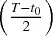 [on an average number of
datapoints,

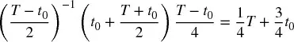

which is only a] 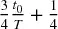 [fraction of the observations. Although this
problem is attenuated by increasing the warm-up period, doing so also
reduces the length of the backtest.

## 12.3 交叉验证法
投资者经常问，如果策略遭受像 2008 年危机那样不可预见的压力情景，它会表现如何。 or the dot-com
bubble, or the taper tantrum, or the China scare of 2015--2016, etc. One
way to answer is to split the observations into two sets, one with the
period we wish to test (testing set), and one with the rest (training
set). For example, a classifier would be trained on the period January
1, 2009--January 1, 2017, then tested on the period January 1,
2008--December 31, 2008. The performance we will obtain for 2008 is not
historically accurate, since the classifier was trained on data that was
only available after 2008. But historical accuracy was not the goal of
the test. The objective of the test was to subject a
strategy] *ignorant* [of 2008 to a stress scenario
such as 2008.

The goal of backtesting through cross-validation (CV) is not to derive
historically accurate performance, but to infer future performance from
a number of out-of-sample scenarios. For each period of the backtest, we
simulate the performance of a classifier that knew everything except for
that period.

**Advantages**

1.  The test is not the result of a particular (historical) scenario. In
    fact, CV tests *k* alternative scenarios, of which only one
    corresponds with the historical sequence.
2.  Every decision is made on sets of equal size. This makes outcomes
    comparable across periods, in terms of the amount of information
    used to make those decisions.
3.  Every observation is part of one and only one testing set. There is
    no warm-up subset, thereby achieving the longest possible
    out-of-sample simulation.

**Disadvantages**

1.  Like WF, a single backtest path is simulated (although not the
    historical one). There is one and only one forecast generated per
    observation.
2.  CV has no clear historical interpretation. The output does not
    simulate how the strategy would have performed in the past, but how
    it may perform *in the future* under various stress scenarios (a
    useful result in its own right).
3.  Because the training set does not trail the testing set, leakage is
    possible. Extreme care must be taken to avoid leaking testing
    information into the training set. See [第 7 章](ch07.md) for a discussion on
    how purging and embargoing can help prevent informational leakage in
    the context of CV.

## 12.4 组合净化交叉验证法
In this section I will present a new method, which addresses the main
drawback of the WF and CV methods, namely that those schemes test a
single path. I call it the "combinatorial purged cross-validation"
(CPCV) method. Given a number φ of backtest paths targeted by the
researcher, CPCV generates the precise number of combinations of
training/testing sets needed to generate those paths, while purging
training observations that contain leaked
information.

### 12.4.1 Combinatorial Splits

Consider] *T* observations partitioned
into *N* groups without shuffling, where
groups *n* [= 1, ...,] *N* [− 1
are of size ⌊] *T* [/] *N* [⌋,
the] *N* th group is of size *T*
− ⌊] *T* [/] *N*
⌋(] *N* [− 1), and ⌊.⌋ is the floor or integer
function. For a testing set of size] *k* [groups, the
number of possible training/testing splits is

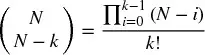

Since each combination involves] *k* [tested groups,
the total number of tested groups is
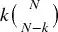 [. And since
we have computed all possible combinations, these tested groups are
uniformly distributed across all] *N* [(each group
belongs to the same number of training and testing sets). The
implication is that from] *k* [-sized testing sets
on] *N* [groups we can backtest a total number of
paths φ[] *N* [,] *k*
],

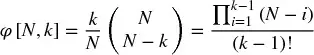

图 12.1 [illustrates the
composition of train/test splits for] *N* [= 6
and] *k* [= 2] *.* There
are 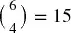 splits, indexed as *S1, ... ,S15.* For
each split, the figure marks with a cross ( *x* [)
the groups included in the testing set, and leaves unmarked the groups
that form the training set. Each group forms part of φ[6, 2] = 5
testing sets, therefore this train/test split scheme allows us to
compute 5 backtest paths.

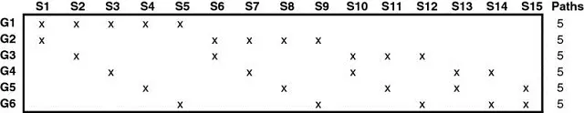

**图 12.1** Paths generated for
***φ*** [6, 2] = 5

图 12.2 [shows the assignment of
each tested group to one backtest path. For example, path 1 is the
result of combining the forecasts from (] *G*
1,] *S* [1), (] *G*
2,] *S* [1), (] *G*
3,] *S* [2), (] *G*
4,] *S* [3), (] *G*
5,] *S* [4) and (] *G*
6,] *S* [5). Path 2 is the result of combining
forecasts from (] *G* [1,] *S*
2), (] *G* [2,] *S* [6),
(] *G* [3,] *S* [6),
(] *G* [4,] *S* [7),
(] *G* [5,] *S* [8) and
(] *G* [6,] *S* [9), and so
on.

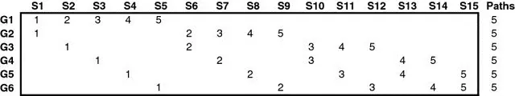

**图 12.2** Assignment of
testing groups to each of the 5 paths

These paths are generated by training the classifier on a portion θ = 1
−] *k* [/] *N* [of the data for
each combination. Although it is theoretically possible to train on a
portion θ \< 1/2, in practice we will assume that
*k* [≤] *N* [/2] *.* [The portion
of data in the training set θ increases with] *N*
→] *T* [but it decreases with
*k* [→] *N* [/2] *.* [The number
of paths φ[] *N* [,] *k* [
increases with] *N* [→] *T* and
with *k* [→] *N*
/2] *.* [In the limit, the largest number of paths
is achieved by setting] *N* [=
*T* and *k* [=] *N* [/2
=] *T* [/2, at the expense of training the classifier
on only half of the data for each combination (θ =
1/2).

### 12.4.2 The Combinatorial Purged Cross-Validation Backtesting
Algorithm

In [第 7 章](ch07.md) we introduced the concepts of purging and embargoing in
the context of CV. We will now use these concepts for backtesting
through CV. The CPCV backtesting algorithm proceeds as
follows:

1.  Partition *T* observations into *N* groups without shuffling, where
    groups *n* = 1, ..., *N* − 1 are of size ⌊*T* /*N* ⌋, and the *N* th
    group is of size *T* − ⌊*T* /*N* ⌋(*N* − 1).
2.  Compute all possible training/testing splits, where for each split
    *N* − *k* groups constitute the training set and *k* groups
    constitute the testing set.
3.  For any pair of labels (*y ~[*i*]~* , *y ~[*j*]~* ),
    where *y ~[*i*]~* belongs to the training set and *y
    ~[*j*]~* belongs to the testing set, apply the `PurgedKFold`
    class to purge *y ~[*i*]~* if *y ~[*i*]~* spans over
    a period used to determine label *y ~[*j*]~* . This class
    will also apply an embargo, should some testing samples predate some
    training samples.
4.  Fit classifiers on the 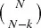 training sets, and produce forecasts on the
    respective  testing sets.
5.  Compute the φ[*N* , *k* ] backtest paths. You can calculate one
    Sharpe ratio from each path, and from that derive the empirical
    distribution of the strategy\'s Sharpe ratio (rather than a single
    Sharpe ratio, like WF or CV).

### 12.4.3 A Few Examples

For] *k* [= 1, we will obtain
φ[] *N* [, 1] = 1 path, in which case CPCV reduces
to CV. Thus, CPCV can be understood as a generalization of CV
for] *k* [\> 1] *.*

For] *k* [= 2, we will obtain
φ[] *N* [, 2] =] *N* [− 1 paths.
This is a particularly interesting case, because while training the
classifier on a large portion of the data, θ = 1 −
2/] *N* [, we can generate almost as many backtest
paths as the number of groups,] *N* [−
1] *.* An easy rule of thumb is to partition the
data into *N* [= φ + 1 groups, where φ is the number
of paths we target, and then form
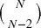
combinations. In the limit, we can assign one group per
observation,] *N* [=] *T* [, and
generate φ[] *T* [, 2] =] *T* [−
1 paths, while training the classifier on a portion θ = 1 −
2/] *T* [of the data per
combination.

If even more paths are needed, we can increase] *k*
→] *N* [/2, but as explained earlier that will come
at the cost of using a smaller portion of the dataset for training. In
practice,] *k* [= 2 is often enough to generate the
needed φ paths, by setting] *N* [= φ + 1
≤] *T* [.

## 12.5 How Combinatorial Purged Cross-Validation Addresses Backtest
Overfitting

Given a sample of IID random variables,] *x
~[*i*]~* [∼] *Z* [,] *i*
= 1, ...,] *I* [, where] *Z* [is
the standard normal distribution, the expected maximum of that sample
can be approximated as

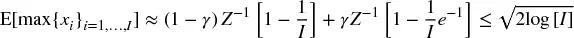

where] *Z^[−\ 1]^* [[.] is the inverse of
the CDF of] *Z* [, γ ≈ 0.5772156649⋅⋅⋅ is the
Euler-Mascheroni constant, and] *I* [≫ 1 (see Bailey
et al. [2014] for a proof). Now suppose that a researcher
backtests] *I* [strategies on an instrument that
behaves like a martingale, with Sharpe ratios  *y
~[*i*]~* [} ~[*i*\ =\ 1,\ ...,\ *I*]~ ,
E[] *y ~[*i*]~* [] = 0, σ ^[2]^
] *y ~[*i*]~* [] \> 0,
and] 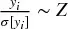 [. Even though the true Sharpe ratio is zero, we expect to
find one strategy with a Sharpe ratio of

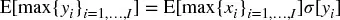

WF backtests exhibit high variance, σ[] *y
~[*i*]~* [] ≫ 0, for at least one reason: A large portion of
the decisions are based on a small portion of the dataset. A few
observations will have a large weight on the Sharpe ratio. Using a
warm-up period will reduce the backtest length, which may contribute to
making the variance even higher. WF\'s high variance leads to false
discoveries, because researchers will select the backtest with the
maximum] *estimated* Sharpe ratio, even if
the *true* [Sharpe ratio is zero. That is the reason
it is imperative to control for the number of trials
*(I)* [in the context of WF backtesting. Without this information, it is
not possible to determine the Family-Wise Error Rate (FWER), False
Discovery Rate (FDR), Probability of Backtest Overfitting (PBO, see
第 11 章](ch11.md)) or similar model assessment statistic.

CV backtests (Section 12.3) address that source of variance by training
each classifier on equal and large portions of the dataset. Although CV
leads to fewer false discoveries than WF, both approaches still estimate
the Sharpe ratio from a single path for a strategy
*i* [,] *y ~[*i*]~* [, and that estimation
may be highly volatile. In contrast, CPCV derives the distribution of
Sharpe ratios from a large number of paths,] *j* [=
1, ..., φ, with mean E[ *y
~[*i*\ ,\ *j*]~* [} ~[*j*\ =\ 1,\ ...,\ φ]~ ] = μ
~[*i*]~ and variance σ ^[2]^ [ *y
~[*i*\ ,\ *j*]~* [} ~[*j*\ =\ 1,\ ...,\ φ]~ ] = σ
^[2]^ ~[*i*]~ . The variance of the sample mean of CPCV
paths is

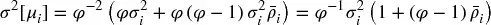

where σ ^[2]^ ~[*i*]~ is the variance of the Sharpe
ratios across paths for strategy] *i* [,
and] 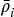 [is the average off-diagonal correlation among
 *y ~[*i*\ ,\ *j*]~* [}
~[*j*\ =\ 1,\ ...,\ φ]~ . CPCV leads to fewer false discoveries
than CV and WF, because
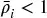 [implies that
the variance of the sample mean is lower than the variance of the
sample,

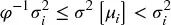

The more uncorrelated the paths are,
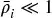 [, the lower
CPCV\'s variance will be, and in the limit CPCV will report the true
Sharpe ratio E[] *y ~[*i*]~* [] with zero
variance,] 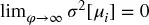 *.* [There will not be selection bias, because
the strategy selected out of] *i* [= 1,
...,] *I* will be the one with the
highest *true* [Sharpe ratio.

Of course, we know that zero variance is unachievable, since φ has an
upper bound,] 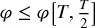 [. Still, for a large enough number of paths φ,
CPCV could make the variance of the backtest so small as to make the
probability of a false discovery negligible.

In [第 11 章](ch11.md), we argued that backtest overfitting may be the most
important open problem in all of mathematical finance. Let us see how
CPCV helps address this problem in practice. Suppose that a researcher
submits a strategy to a journal, supported by an overfit WF backtest,
selected from a large number of undisclosed trials. The journal could
ask the researcher to repeat his experiments using a CPCV for a
given] *N* and *k* [. Because
the researcher did not know in advance the number and characteristics of
the paths to be backtested, his overfitting efforts will be easily
defeated. The paper will be rejected or withdrawn from consideration.
Hopefully CPCV will be used to reduce the number of false discoveries
published in journals and elsewhere.

## 练习题

1.  [Suppose that you develop a momentum strategy on a futures contract,
    > > where the forecast is based on an AR(1) process. You backtest
    > > this strategy using the WF method, and the Sharpe ratio is 1.5.
    > > You then repeat the backtest on the reversed series and achieve
    > > a Sharpe ratio of --1.5. What would be the mathematical grounds
    > > for disregarding the second result, if any?

2.  [You develop a mean-reverting strategy on a futures contract. Your
    > > WF backtest achieves a Sharpe ratio of 1.5. You increase the
    > > length of the warm-up period, and the Sharpe ratio drops to 0.7.
    > > You go ahead and present only the result with the higher Sharpe
    > > ratio, arguing that a strategy with a shorter warm-up is more
    > > realistic. Is this selection bias?

3.  [Your strategy achieves a Sharpe ratio of 1.5 on a WF backtest, but
    > > a Sharpe ratio of 0.7 on a CV backtest. You go ahead and present
    > > only the result with the higher Sharpe ratio, arguing that the
    > > WF backtest is historically accurate, while the CV backtest is a
    > > scenario simulation, or an inferential exercise. Is this
    > > selection bias?

4.  [Your strategy produces 100,000 forecasts over time. You would like
    > > to derive the CPCV distribution of Sharpe ratios by generating
    > > 1,000 paths. What are the possible combinations of parameters
    > > (] *N* [,] *k* [) that
    > > will allow you to achieve that?

5.  [You discover a strategy that achieves a Sharpe ratio of 1.5 in a WF
    > > backtest. You write a paper explaining the theory that would
    > > justify such result, and submit it to an academic journal. The
    > > editor replies that one referee has requested you repeat your
    > > backtest using a CPCV method with] *N* [= 100
    > > and] *k* [= 2, including your code and full
    > > datasets. You follow these instructions, and the mean Sharpe
    > > ratio is --1 with a standard deviation of 0.5. Furious, you do
    > > not reply, but instead withdraw your submission, and resubmit in
    > > a different journal of higher impact factor. After 6 months,
    > > your paper is accepted. You appease your conscience thinking
    > > that, if the discovery is false, it is the journal\'s fault for
    > > not having requested a CPCV test. You think, "It cannot be
    > > unethical, since it is permitted, and everybody does it." What
    > > are the arguments, scientific or ethical, to justify your
    > > actions?

## 参考文献

1.  Bailey, D. and M. López de Prado (2012): "The Sharpe ratio efficient
    frontier." *Journal of Risk* , Vol. 15, No. 2 (Winter). Available at
    <https://ssrn.com/abstract=1821643> .
2.  Bailey, D. and M. López de Prado (2014): "The deflated Sharpe ratio:
    Correcting for selection bias, backtest overfitting and
    non-normality." *Journal of Portfolio Management* , Vol. 40, No. 5,
    pp. 94--107. Available at <https://ssrn.com/abstract=2460551.>
3.  Bailey, D., J. Borwein, M. López de Prado, and J. Zhu (2014):
    "Pseudo-mathematics and financial charlatanism: The effects of
    backtest overfitting on out-of-sample performance." *Notices of the
    American Mathematical Society* , Vol. 61, No. 5, pp. 458--471.
    Available at <http://ssrn.com/abstract=2308659> .
4.  Bailey, D., J. Borwein, M. López de Prado, and J. Zhu (2017): "The
    probability of backtest overfitting." *Journal of Computational
    Finance* , Vol. 20, No. 4, pp. 39--70. Available at
    <https://ssrn.com/abstract=2326253> .
