# 合成数据回测

## 13.1 动机
在本章中，我们将研究一种替代回测方法，它使用历史来生成具有统计
从观测数据估计的统计特征。这将允许我们在大量未见过的合成测试集上回测策略，从而降低策略被拟合到特定数据点集的可能性。^\ [[1]^
这是一个非常广泛的主题，为了达到一定深度，我们将专注于交易规则的回测。

## 13.2 交易规则
投资策略可以定义为假定市场低效存在的算法。 一些策略依赖计量经济学模型来预测价格， 使用 GDP 或通胀等宏观经济变量；其他策略使用基本面和会计信息来为证券定价，或在衍生品定价中寻找套利类机会等。 例如，假设金融中介机构倾向于在美国国债拍卖前两天卖出旧券，以筹集购买新「票据」所需的现金。 One could monetize on that knowledge by selling off-the-run
bonds three days before auctions. But how? Each investment strategy
requires an implementation tactic, often referred to as "trading
rules."

有数十种对冲基金风格，每种运行数十种独特的投资策略。 While strategies can be very heterogeneous in
nature, tactics are relatively homogeneous. 交易规则提供了进入和退出头寸必须遵循的算法。 For
example, a position will be entered when the strategy\'s signal reaches
a certain value. Conditions for exiting a position are often defined
through thresholds for profit-taking and stop-losses. These entry and
exit rules rely on parameters that are usually calibrated via historical
simulations. This practice leads to the problem of
*backtest overfitting* [, because these parameters target specific
observations in-sample, to the point that the investment strategy is so
attached to the past that it becomes unfit for the
future.

一个重要的澄清是，我们感兴趣的是最大化表现的退出走廊条件。 In other words, the
position already exists, and the question is how to exit it optimally.
This is the dilemma often faced by execution traders, and it should not
be mistaken with the determination of entry and exit thresholds for
investing in a security. For a study of that alternative question, see,
for example, Bertram [2009].

Bailey et al. [2014, 2017] discuss the problem of backtest
overfitting, and provide methods to determine to what extent a simulated
performance may be inflated due to overfitting. While assessing the
probability of backtest overfitting is a useful tool to discard
superfluous investment strategies, it would be better to avoid the risk
of overfitting, at least in the context of calibrating a trading rule.
在理论上，这可以通过直接从生成数据的随机过程推导交易规则的最优参数来实现，而非进行历史模拟。 This is the
approach we take in this chapter. Using the entire historical sample, we
will characterize the stochastic process that generates the observed
stream of returns, and derive the optimal values for the trading rule\'s
parameters without requiring a historical
simulation.

## 13.3 问题
假设一个投资策略] *S* invests
in *i* [= 1, ...] *I*
opportunities or bets. At each opportunity] *i*
,] *S* takes a position of *m
~[*i*]~* units of security *X* [,
where] *m ~[*i*]~* [∈ ( − ∞, ∞). The
transaction that entered such opportunity was priced at a
value] *m ~[*i*]~ P ~[*i*\ ,\ 0]~* [,
where] *P ~[*i*\ ,\ 0]~* is the average
price per unit at which the *m ~[*i*]~*
securities were transacted. As other market participants transact
security] *X* [, we can mark-to-market (MtM) the
value of that opportunity] *i*
after] *t* observed transactions
as *m ~[*i*]~ P ~[*i*\ ,\ *t*]~* [.
This represents the value of opportunity] *i* [if it
were liquidated at the price observed in the market
after] *t* [transactions. Accordingly, we can compute
the MtM profit/loss of opportunity] *i*
after] *t* [transactions as π
~[*i*\ ,\ *t*]~ =] *m ~[*i*]~*
(] *P ~[*i*\ ,\ *t*]~*
−] *P ~[*i*\ ,\ 0]~* [).

A standard trading rule provides the logic for exiting
opportunity] *i* at *t*
=] *T ~[*i*]~* [. This occurs as soon as one
of two conditions is verified:

-   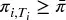 , where
    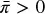 is the
    profit-taking threshold.
-   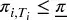 , where
    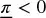 is the
    stop-loss threshold.

These thresholds are equivalent to the horizontal barriers we discussed
in the context of meta-labelling ([第 3 章](ch03.md)).
Because] 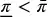 [, one and only one of the two exit conditions
can trigger the exit from opportunity] *i.* Assuming
that opportunity *i* can be exited
at *T ~[*i*]~* [, its final profit/loss
is]  [. At the onset of each opportunity, the goal is to realize
an expected profit
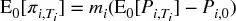 [,
where]  is the forecasted price and *P
~[*i*\ ,\ 0]~* is the entry level of
opportunity *i.*

> **Definition 1: Trading Rule:** A trading rule for
> strategy *S* is defined by the set of
> parameters 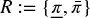 [.

One way to calibrate (by brute force) the trading rule is
to:

1.  Define a set of alternative values of *R* , Ω: ={*R*}.
2.  Simulate historically (backtest) the performance of *S* under
    alternative values of *R* ∈ Ω.
3.  Select the optimal *R* *.

More formally:

(13.1)
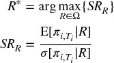

where E[.] and σ[.] are respectively the expected value and
standard deviation of
 [,
conditional on trading rule] *R* [,
over] *i* [= 1, ...] *I* [. In
other words, equation (] 13.1 [) maximizes the Sharpe ratio
of] *S* on *I* [opportunities
over the space of alternative trading rules] *R*
(see Bailey and López de Prado [2012] for a definition and analysis
of the Sharpe ratio). Because we count with two variables to
maximize] *SR ~[*R*]~* over a sample of
size *I* [, it is easy to
overfit] *R.* A trivial overfit occurs when a
pair  [targets a few outliers. Bailey et al. [2017] provide a
rigorous definition of backtest overfitting, which can be applied to our
study of trading rules as follows.

> **Definition 2: Overfit Trading Rule:** *R* [* is overfit
> if] 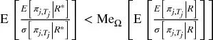 [, where] *j* [=
> *I* [+ 1, ...] *J* [and Me ~[Ω]~ [.] is
> the median.

Intuitively, an optimal in-sample (IS,] *i* [∈
1,] *I* []) trading rule] *R*
* is overfit when it is expected to underperform the median of
alternative trading rules] *R* [∈ Ω out-of-sample
(OOS,] *j* [∈ [] *I* [+
1,] *J* []). This is essentially the same definition
we used in chapter 11 to derive PBO. Bailey et al. [2014] argue that
it is hard not to overfit a backtest, particularly when there are free
variables able to target specific observations IS, or the number of
elements in Ω is large. A trading rule introduces such free variables,
because] *R* [* can be determined independently
from] *S.* [The outcome is that the backtest profits
from random noise IS, making] *R* [* unfit for OOS
opportunities. Those same authors show that overfitting leads to
negative performance OOS when Δπ ~[*i*\ ,\ *t*]~ exhibits serial
dependence. While PBO provides a useful method to evaluate to what
extent a backtest has been overfit, it would be convenient to avoid this
problem in the first
place.^\ [2]^
To that aim we dedicate the following section.

## 13.4 我们的框架
Until now we have not characterized the stochastic process from which
observations π ~[*i*\ ,\ *t*]~ are drawn. We are interested in
finding an optimal trading rule (OTR) for those scenarios where
overfitting would be most damaging, such as when π
~[*i*\ ,\ *t*]~ exhibits serial correlation. In particular,
suppose a discrete Ornstein-Uhlenbeck (O-U) process on
prices

(13.2)
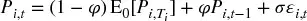

such that the random shocks are IID distributed ϵ
~[*i*\ ,\ *t*]~ ∼] *N* [(0, 1). The seed
value for this process is] *P ~[*i*\ ,\ 0]~*
, the level targeted by opportunity] *i*
is]  [, and φ determines the speed at which
*P ~[*i*\ ,\ 0]~* [converges towards
 [. Because π
~[*i*\ ,\ *t*]~ =] *m ~[*i*]~*
(] *P ~[*i*\ ,\ *t*]~*
−] *P ~[*i*\ ,\ 0]~* [), equation
(] 13.2 [) implies that the performance
of opportunity] *i* [is characterized by the
process

(13.3)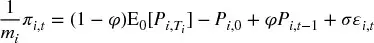

From the proof to Proposition 4 in Bailey and López de Prado [2013],
it can be shown that the distribution of the process specified in
equation (] 13.2
) is Gaussian with parameters

(13.4)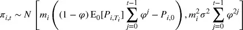

and a necessary and sufficient condition for its stationarity is that φ
∈ ( − 1, 1). Given a set of input parameters {σ, φ} and initial
conditions] 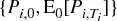 associated with
opportunity *i* [, is there an
OTR] 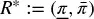 [? Similarly, should strategy] *S*
predict a profit target
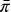 [, can we
compute the optimal stop-loss
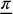 [given the
input values {σ, φ}? If the answer to these questions is affirmative, no
backtest would be needed in order to determine] *R*
*, thus avoiding the problem of overfitting the trading rule. In the
next section we will show how to answer these questions
experimentally.

## 13.5 最优交易规则的数值确定
In the previous section we used an O-U specification to characterize
the stochastic process generating the returns of
strategy] *S.* [在本节中我们将 present a
procedure to numerically derive the OTR for any specification in
general, and the O-U specification in particular.

### 13.5.1 The Algorithm

The algorithm consists of five sequential steps.

-   **Step 1** : We estimate the input parameters {σ, φ}, by linearizing
    equation ( 13.2 ) as:

    > > (13.5)
    > >  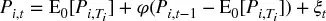

We can then form vectors] *X*
and] *Y* [by sequencing
opportunities:

(13.6)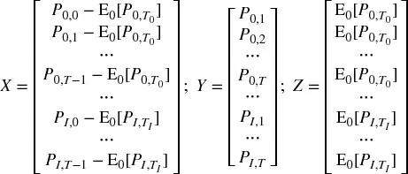

Applying OLS on equation (] 13.5 [), we can estimate the
original O-U parameters as,

(13.7)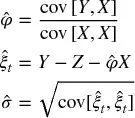

where cov[ ·, ·] is the covariance operator.

-   **Step 2** : We construct a mesh of stop-loss and profit-taking
    pairs,  .
    For example, a Cartesian product of
    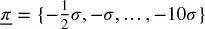 and
    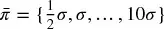 give us
    20 × 20 nodes, each constituting an alternative trading rule *R* ∈
    Ω.
-   **Step 3** : We generate a large number of paths (e.g., 100,000) for
    π ~[*i*\ ,\ *t*]~ applying our estimates
    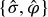 . As seed
    values, we use the observed initial conditions
    
    associated with an opportunity *i.* Because a position cannot be
    held for an unlimited period of time, we can impose a maximum
    holding period (e.g., 100 observations) at which point the position
    is exited even though 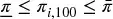 . This maximum holding period is equivalent to the
    vertical bar of the triple-barrier method (Chapter
    3).^\ [3]^
-   **Step 4** : We apply the 100,000 paths generated in Step 3 on each
    node of the 20 × 20 mesh  generated in Step 2. For each node, we apply
    the stop-loss and profit-taking logic, giving us 100,000 values of
    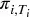 .
    Likewise, for each node we compute the Sharpe ratio associated with
    that trading rule 如 equation (
    13.1 ). See Bailey and López de
    Prado [2012] for a study of the confidence interval of the Sharpe
    ratio estimator. This result can be used in three different ways:
    Step 5a, Step 5b and Step 5c).
-   **Step 5a** : We determine the pair
     within
    the mesh of trading rules that is optimal, given the input
    parameters  and the observed initial conditions
     .
-   **Step 5b** : If strategy *S* provides a profit target
    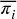 for a
    particular opportunity *i* , we can use that information in
    conjunction with the results in Step 4 to determine the optimal
    stop-loss, 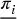 .
-   **Step 5c** : If the trader has a maximum stop-loss
     imposed
    by the fund\'s management for opportunity *i* , we can use that
    information in conjunction with the results in Step 4 to determine
    the optimal profit-taking  within the range of stop-losses
    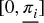 .

Bailey and López de Prado [2013] prove that the half-life of the
process in equation (
13.2 [) is
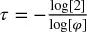 [, with the
requirement that φ ∈ (0, 1). From that result, we can determine the
value of φ associated with a certain half-life τ as
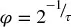
.

### 13.5.2 Implementation

代码片段 13.1 provides an implementation in Python of the experiments
conducted in this chapter. Function] `main` [produces
a Cartesian product of parameters
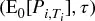 [, which
characterize the stochastic process from equation (
13.5 [). Without loss of generality,
in all simulations we have used σ = 1. Then, for each
pair]  [, function] `batch` [computes the Sharpe
ratios associated with various trading rules.

> **SNIPPET 13.1 PYTHON CODE FOR THE DETERMINATION OF OPTIMAL TRADING
> RULES**

> 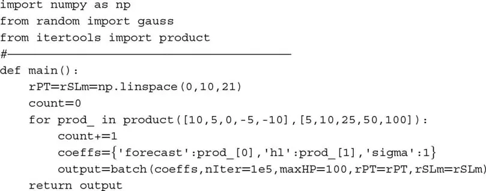

代码片段 13.2 computes a 20 × 20 mesh of Sharpe ratios, one for each
trading rule]  [, given a pair of
parameters]  [. There is a vertical barrier, as the maximum
holding period is set at 100 (] `maxHP = 100` [). We
have fixed] *P ~[*i*\ ,\ 0]~* [= 0, since it
is the distance] 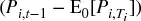 [in equation (
13.5 [) that drives the convergence,
not particular absolute price levels. Once the first out of three
barriers is touched, the exit price is stored, and the next iteration
starts. After all iterations are completed (1E5), the Sharpe ratio can
be computed for that pair
 [, and the
algorithm moves to the next pair. When all pairs of trading rules have
been processed, results are reported back to] `main`
. This algorithm can be parallelized, similar to what we did for the
triple-barrier method in [第 3 章](ch03.md). We leave that task as an
exercise.

> **SNIPPET 13.2 PYTHON CODE FOR THE DETERMINATION OF OPTIMAL TRADING
> RULES**

> 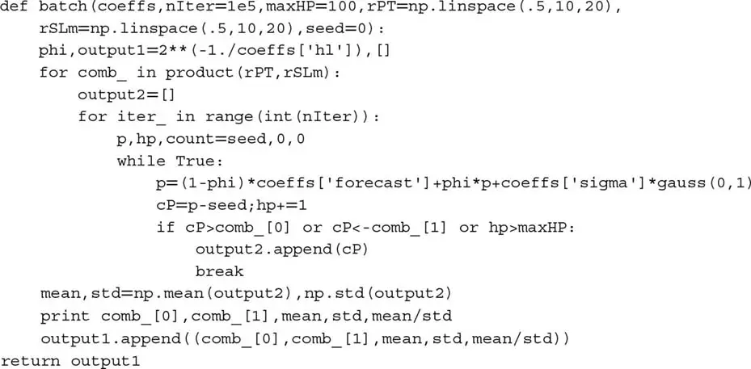

## 13.6 实验结果
表 13.1 [lists the combinations
analyzed in this study. Although different values for these input
parameters would render different numerical results, the combinations
applied allow us to analyze the most general cases. Column "Forecast"
refers to] 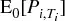 [; column "Half-Life" refers to τ; column
"Sigma" refers to σ; column "maxHP" stands for maximum holding
period.

**表 13.1** **Input Parameter
Combinations Used in the Simulations**

  --------------------------------- -------------- --------------- ----------- -----------
   **Figure**   **Forecast**   **Half-Life**   **Sigma**   **maxHP**
      [16.1]        051100
      [16.2]        0101100
      [16.3]        0251100
      [16.4]        0501100
      [16.5]        01001100
      [16.6]        551100
      [16.7]        5101100
      [16.8]        5251100
      [16.9]        5501100
     [16.10]        51001100
     [16.11]        1051100
     [16.12]        10101100
     [16.13]        10251100
     [16.14]        10501100
     [16.15]        101001100
     [16.16]        − 551100
     [16.17]        − 5101100
     [16.18]        − 5251100
     [16.19]        − 5501100
     [16.20]        − 51001100
     [16.21]       − 1051100
     [16.22]       − 10101100
     [16.23]       − 10251100
     [16.24]       − 10501100
     [16.25]       − 101001100
  --------------------------------- -------------- --------------- ----------- -----------

In the following figures, we have plotted the non-annualized Sharpe
ratios that result from various combinations of profit-taking and
stop-loss exit conditions. We have omitted the negative sign in the
y-axis (stop-losses) for simplicity. Sharpe ratios are represented in
grayscale (lighter indicating better performance; darker indicating
worse performance), in a format known as a heat-map. Performance
(]  [) is computed per unit held (] *m
~[*i*]~* [= 1), since other values of] *m
~[*i*]~* [would simply re-scale performance, with no impact on
the Sharpe ratio. Transaction costs can be easily added, but for
educational purposes it is better to plot results without them, so that
you can appreciate the symmetry of the functions.

### 13.6.1 Cases with Zero Long-Run Equilibrium

Cases with zero long-run equilibrium are consistent with the business
of market-makers, who provide liquidity under the assumption that price
deviations from current levels will correct themselves over time. The
smaller τ, the smaller is the autoregressive coefficient
(]  [). A small autoregressive coefficient in conjunction with a
zero expected profit has the effect that most of the
pairs] 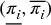 [deliver a zero performance.

图 13.1 [shows the heat-map for
the parameter combination
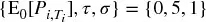 [. The
half-life is so small that performance is maximized in a narrow range of
combinations of small profit-taking with large stop-losses. In other
words, the optimal trading rule is to hold an inventory long enough
until a small profit arises, even at the expense of experiencing some
5-fold or 7-fold unrealized losses. Sharpe ratios are high, reaching
levels of around 3.2. This is in fact what many market-makers do in
practice, and is consistent with the "asymmetric payoff dilemma"
described in Easley et al. [2011]. The worst possible trading rule in
this setting would be to combine a short stop-loss with a large
profit-taking threshold, a situation that market-makers avoid in
practice. Performance is closest to neutral in the diagonal of the mesh,
where profit-taking and stop-losses are symmetric. You should keep this
result in mind when labeling observations using the triple-barrier
method ([第 3 章](ch03.md)).

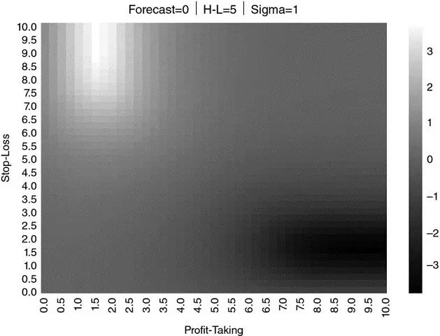

**图 13.1** Heat-map for

图 13.2 [shows that, if we
increase τ from 5 to 10, the areas of highest and lowest performance
spread over the mesh of pairs
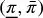 [, while the
Sharpe ratios decrease. This is because, as the half-life increases, so
does the magnitude of the autoregressive coefficient (recall
that]  [), thus bringing the process closer to a random
walk.

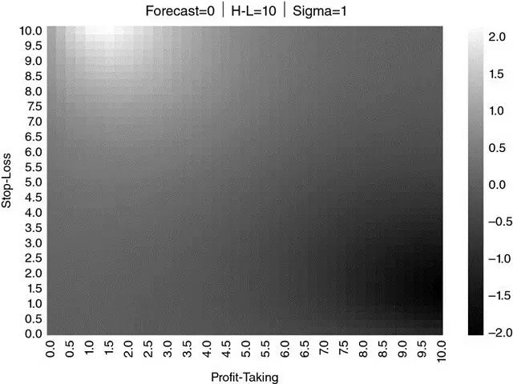

**图 13.2** Heat-map for
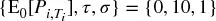

In]  Figure
13.3 [, τ = 25, which again spreads
the areas of highest and lowest performance while reducing the Sharpe
ratio.]  Figure
13.4 [(τ = 50)
and]  Figure
13.5 [(τ = 100) continue that
progression. Eventually, as φ → 1, there are no recognizable areas where
performance can be maximized.

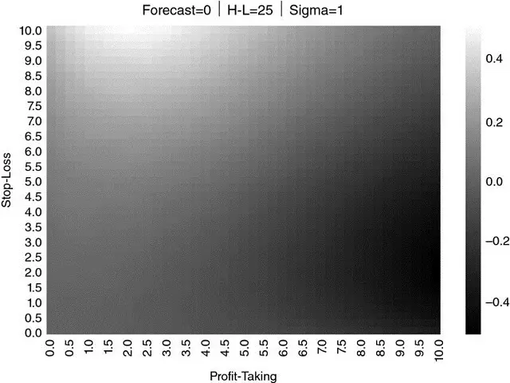

**图 13.3** Heat-map for
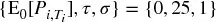

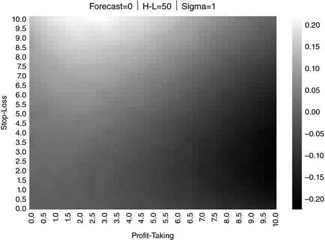

**图 13.4** Heat-map for
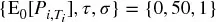

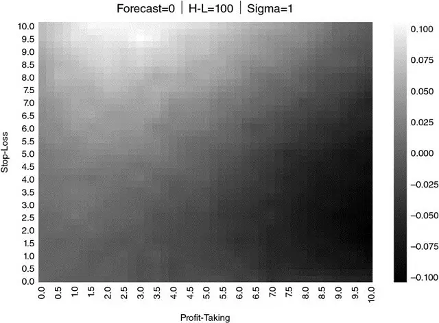

**图 13.5** Heat-map for
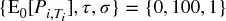

Calibrating a trading rule on a random walk through historical
simulations would lead to backtest overfitting, because one random
combination of profit-taking and stop-loss that happened to maximize
Sharpe ratio would be selected. This is why backtesting of synthetic
data is so important: to avoid choosing a strategy because some
statistical fluke took place in the past (a single random path). Our
procedure prevents overfitting by recognizing that performance exhibits
no consistent pattern, indicating that there is no optimal trading
rule.

### 13.6.2 Cases with Positive Long-Run Equilibrium

Cases with positive long-run equilibrium are consistent with the
business of a position-taker, such as a hedge-fund or asset
manager.]  Figure
13.6 [shows the results for the
parameter combination
 [. Because
positions tend to make money, the optimal profit-taking is higher than
in the previous cases, centered around 6, with stop-losses that range
between 4 and 10. The region of the optimal trading rule takes a
characteristic rectangular shape, as a result of combining a wide
stop-loss range with a narrower profit-taking range. Performance is
highest across all experiments, with Sharpe ratios of around
12.

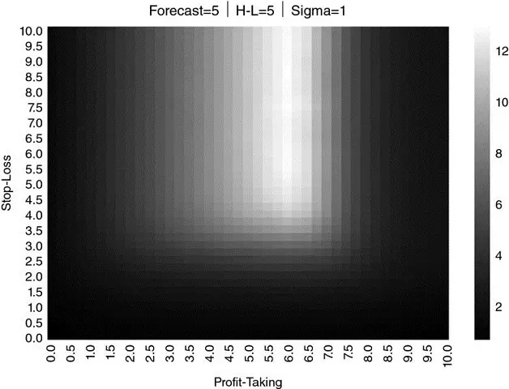

**图 13.6** Heat-map for
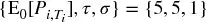

In]  Figure
13.7 [, we have increased the
half-life from τ = 5 to τ = 10] *.* [Now the optimal
performance is achieved at a profit-taking centered around 5, with
stop-losses that range between 7 and 10. The range of optimal
profit-taking is wider, while the range of optimal stop-losses narrows,
shaping the former rectangular area closer to a square. Again, a larger
half-life brings the process closer to a random walk, and therefore
performance is now relatively lower than before, with Sharpe ratios of
around 9.

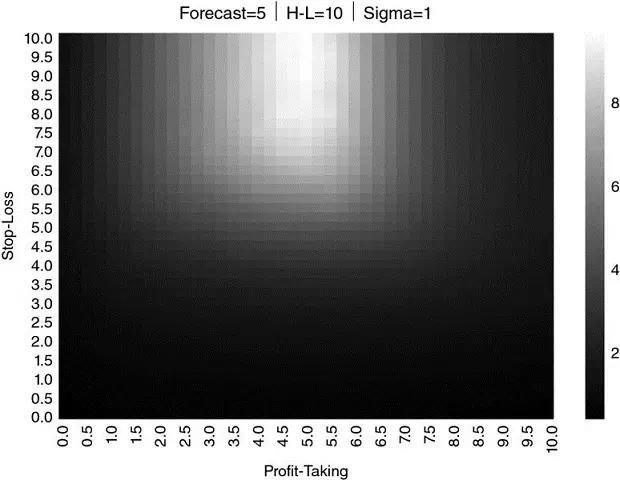

**图 13.7** Heat-map for
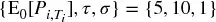

In]  Figure
13.8 [, we have made τ =
25] *.* [The optimal profit-taking is now centered
around 3, while the optimal stop-losses range between 9 and 10. The
previous squared area of optimal performance has given way to a
semi-circle of small profit-taking with large stop-loss thresholds.
Again we see a deterioration of performance, with Sharpe ratios of
2.7.

**图 13.8** Heat-map for

In]  Figure
13.9 [, the half-life is raised to τ
= 50] *.* [As a result, the region of optimal
performance spreads, while Sharpe ratios continue to fall to 0.8. This
is the same effect we observed in the case of zero long-run equilibrium
(Section 13.6.1), with the difference that because
now]  [, there is no symmetric area of worst
performance.

**图 13.9** Heat-map for

In]  Figure
13.10 [, we appreciate that τ = 100
leads to the natural conclusion of the trend described above. The
process is now so close to a random walk that the maximum Sharpe ratio
is a mere 0.32.

**图 13.10** Heat-map for

We can observe a similar pattern in
 Figures 13.11
through 13.15, where
 [and τ is
progressively increased from 5 to 10, 25, 50, and 100,
respectively.

**图 13.11** Heat-map for

**图 13.12** Heat-map for 

**图 13.13** Heat-map for 

**图 13.14** Heat-map for 

**图 13.15** Heat-map for 

### 13.6.3 Cases with Negative Long-Run Equilibrium

A rational market participant would not initiate a position under the
assumption that a loss is the expected outcome. However, if a trader
recognizes that losses are the expected outcome of a pre-existing
position, she still needs a strategy to stop-out that position while
minimizing such losses.

We have obtained]  Figure
13.16 as a result of applying
parameters  [. If we compare] Figure
13.16 [with
图 13.6 [, it appears as if one
is a rotated complementary of the other.] Figure
13.6 resembles a rotated
photographic negative of Figure
13.16 [. The reason is that the
profit in] Figure
13.6 is translated into a loss
in 图 13.16
, and the loss in] Figure
13.6 is translated into a profit
in 图 13.16
. One case is a reverse image of the other, just as a gambler\'s loss
is the house\'s gain.

**图 13.16** Heat-map for

As expected, Sharpe ratios are negative, with a worst performance
region centered around the stop-loss of 6, and profit-taking thresholds
that range between 4 and 10. Now the rectangular shape does not
correspond to a region of best performance, but to a region of worst
performance, with Sharpe ratios of around −12.

In]  Figure
13.17 [, τ = 10, and now the
proximity to a random walk plays in our favor. The region of worst
performance spreads out, and the rectangular area becomes a square.
Performance becomes less negative, with Sharpe ratios of about
−9.

**图 13.17** Heat-map for

This familiar progression can be appreciated in
 Figures 13.18
,] 13.19 [, and
 13.20 [, as τ
is raised to 25, 50, and 100. Again, as the process approaches a random
walk, performance flattens and optimizing the trading rule becomes a
backtest-overfitting exercise.

**图 13.18** Heat-map for

**图 13.19** Heat-map for

**图 13.20** Heat-map for

Figures 13.21 [through 13.25 repeat
the same process for
 [and τ that
is progressively increased from 5 to 10, 25, 50, and 100. The same
pattern, a rotated complementary to the case of positive long-run
equilibrium, arises.

**图 13.21** Heat-map for

**图 13.22** Heat-map for 

**图 13.23** Heat-map for 

**图 13.24** Heat-map for 

**图 13.25** Heat-map for 

## 13.7 结论
In this chapter we have shown how to determine experimentally the
optimal trading strategy associated with prices following a discrete O-U
process. Because the derivation of such trading strategy is not the
result of a historical simulation, our procedure avoids the risks
associated with overfitting the backtest to a single path. Instead, the
optimal trading rule is derived from the characteristics of the
underlying stochastic process that drives prices. The same approach can
be applied to processes other than O-U, and we have focused on this
particular process only for educational purposes.

While we do not derive the closed-form solution to the optimal trading
strategies problem in this chapter, our experimental results seem to
support the following OTR conjecture:

> **Conjecture:** [Given a financial instrument\'s price characterized
> by a discrete O-U process, there is a unique optimal trading rule in
> terms of a combination of profit-taking and stop-loss that maximizes
> the rule\'s Sharpe ratio.

Given that these optimal trading rules can be derived numerically
within a few seconds, there is little practical incentive to obtain a
closed-form solution. As it is becoming more common in mathematical
research, the experimental analysis of a conjecture can help us achieve
a goal even in the absence of a proof. It could take years if not
decades to prove the above conjecture, and yet all experiments conducted
so far confirm it empirically. Let me put it this way: The probability
that this conjecture is false is negligible relative to the probability
that you will overfit your trading rule by disregarding the conjecture.
Hence, the rational course of action is to assume that the conjecture is
right, and determine the OTR through synthetic data. In the worst case,
the trading rule will be suboptimal, but still it will almost surely
outperform an overfit trading rule.

## 练习题

1.  [Suppose you are an execution trader. A client calls you with an
    > > order to cover a short position she entered at a price of 100.
    > > She gives you two exit conditions: profit-taking at 90 and
    > > stop-loss at 105.

    :::
    :::

    1.  Assuming the client believes the price follows an O-U process,
        are these levels reasonable? For what parameters?
    2.  Can you think of an alternative stochastic process under which
        these levels make sense?

2.  [Fit the time series of dollar bars of E-mini S&P 500 futures to an
    > > O-U process. Given those parameters:

    :::
    :::

    1.  Produce a heat-map of Sharpe ratios for various profit-taking
        and stop-loss levels.
    2.  What is the OTR?

3.  [Repeat exercise 2, this time on a time series of dollar bars
    > > of

    :::
    :::

    1.  10-year U.S. Treasure Notes futures
    2.  WTI Crude Oil futures
    3.  Are the results significantly different? Does this justify
        having execution traders specialized by product?

4.  [Repeat exercise 2 after splitting the time series into two
    > > parts:

    :::
    :::

    1.  The first time series ends on 3/15/2009.
    2.  The second time series starts on 3/16/2009.
    3.  Are the OTRs significantly different?

5.  [How long do you estimate it would take to derive OTRs on the 100
    > > most liquid futures contracts worldwide? Considering the results
    > > from exercise 4, how often do you think you may have to
    > > re-calibrate the OTRs? Does it make sense to pre-compute this
    > > data?

6.  [Parallelize 代码片段s 13.1 and 13.2 using the
    > > `mpEngine` [module described in [第 20 章](ch20.md).

## 参考文献

1.  Bailey, D. and M. López de Prado (2012): "The Sharpe ratio efficient
    frontier." *Journal of Risk* , Vol. 15, No. 2, pp. 3--44. Available
    at <http://ssrn.com/abstract=1821643> .
2.  Bailey, D. and M. López de Prado (2013): "Drawdown-based stop-outs
    and the triple penance rule." *Journal of Risk* , Vol. 18, No. 2,
    pp. 61--93. Available at <http://ssrn.com/abstract=2201302> .
3.  Bailey, D., J. Borwein, M. López de Prado, and J. Zhu (2014):
    "Pseudo-mathematics and financial charlatanism: The effects of
    backtest overfitting on out-of-sample performance." *Notices of the
    American Mathematical Society* , 61(5), pp. 458--471. Available at
    http://ssrn.com/
    abstract=2308659(http://ssrn.com/abstract=2308659) .
4.  Bailey, D., J. Borwein, M. López de Prado, and J. Zhu (2017): "The
    probability of backtest overfitting." *Journal of Computational
    Finance* , Vol. 20, No. 4, pp. 39--70. Available at
    <http://ssrn.com/abstract=2326253> .
5.  Bertram, W. (2009): "Analytic solutions for optimal statistical
    arbitrage trading." Working paper. Available at
    <http://ssrn.com/abstract=1505073> .
6.  Easley, D., M. Lopez de Prado, and M. O\'Hara (2011): "The exchange
    of flow-toxicity." *Journal of Trading* , Vol. 6, No. 2, pp. 8--13.
    Available at <http://ssrn.com/abstract=1748633> .

## 注释

^\ [1]^
   I would like to thank Professor Peter Carr (New York University) for
his contributions to this chapter.

^\ [2]^
   The strategy may still be the result of backtest overfitting, but at
least the trading rule would not have contributed to that problem.

^\ [3]^
   The trading rule *R* could be characterized as a function of the
three barriers, instead of the horizontal ones. That change would have
no impact on the procedure. It would merely add one more dimension to
the mesh (20 × 20 × 20). In this chapter we do not consider that
setting, because it would make the visualization of the method less
intuitive.
