# 回测统计

## 14.1 动机

在前面的章节中，我们研究了三种回测范式：第一，历史模拟（走步法，第 11 章和 12）。第二，情景模拟（CV 和 CPCV 方法，[第 12 章](ch12.md)）。第三，合成数据上的模拟（[第 13 章](ch13.md)）。无论你选择哪种回测范式，你都需要根据一系列统计来报告结果，投资者将用这些统计来比较和评判你的策略与竞争对手。在本章中，我们将讨论一些最常用的绩效评估统计量。其中一些统计包含在全球投资绩效标准（GIPS）^1^ 中，然而全面的表现分析需要针对所审查的 ML 策略的特定指标。

## 14.2 回测统计的类型

回测统计包括投资者用于评估和比较各种投资策略的指标。它们应帮助我们揭示策略潜在的问题方面，如大量的非对称风险或低容量。总的来说，它们可以分为一般特征、绩效、运行/回撤、实现 shortfall、收益/风险效率、分类评分和归因。

## 14.3 一般特征

以下统计量告诉我们回测的一般特征：

-   **时间范围：** 时间范围指定开始和结束日期。用于测试策略的期间应足够长，以涵盖全面的市场状态（Bailey 和 López de Prado [2012]）。
-   **平均 AUM：** 这是管理资产的平均美元价值。为计算此平均值，多头和空头头寸的美元价值被视为正实数。
-   **容量：** 策略的容量可以衡量为实现目标风险调整表现所需的最高 AUM。需要最低 AUM 来确保适当的下注规模（[第 10 章](ch10.md)）和风险分散（[第 16 章](ch16.md)）。超过该最低 AUM 后，随着 AUM 增加，由于更高的交易成本和更低的换手率，表现将衰减。
-   **杠杆：** 杠杆衡量实现报告表现所需的借款量。如果发生杠杆，必须为其分配成本。衡量杠杆的一种方式是平均美元仓位规模与平均 AUM 的比率。
-   **最大美元仓位：** 最大美元仓位告诉我们策略是否有时持有的美元仓位大大超过了平均 AUM。一般来说，我们偏好最大美元仓位接近平均 AUM 的策略，表明它们不依赖极端事件（可能是异常值）的发生。
-   **多头比例：** 多头比例显示涉及多头头寸的下注比例。在多空市场中立策略中，理想情况下该值接近 0.5。如果不是，策略可能有仓位偏差，或回测期可能太短且不代表未来市场条件。
-   **下注频率：** 下注频率是回测中每年的下注数。同一方向的一系列仓位被视为同一下注的一部分。当仓位被平仓或翻转到相反方向时，下注结束。下注数总是小于交易数。交易计数会高估策略发现的独立机会数。
-   **平均持有期：** 平均持有期是一个下注持有的平均天数。高频策略可能持有头寸几分之一秒，而低频策略可能持有头寸数月甚至数年。短持有期可能限制策略的容量。持有期与下注频率相关但不同。例如，策略可能在每月非农就业数据发布时下注，每个下注只持有几分钟。
-   **年化换手率：** 年化换手率衡量每年平均交易美元金额与平均年 AUM 的比率。即使下注数少也可能出现高换手率，因为策略可能需要不断调整仓位。如果每笔交易涉及在最大多头和最大空头之间翻转仓位，低交易数也可能出现高换手率。
-   **与标的的相关性：** 这是策略收益与底层投资宇宙收益之间的相关性。当相关性显著为正或负时，策略本质上是在持有或做空投资宇宙，没有增加多少价值。

代码片段 14.1 列出了从目标仓位（`tPos`）的 pandas 序列中推导平仓或翻转交易时间戳的算法。这给出了已发生的下注数。

> **代码片段 14.1 从目标仓位序列推导下注时机**

> 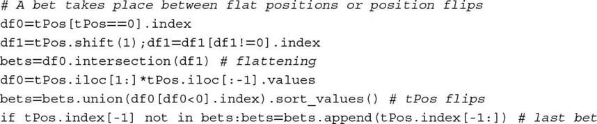

代码片段 14.2 展示了在给定目标仓位（`tPos`）pandas 序列的情况下，估计策略平均持有期的算法实现。

> **代码片段 14.2 持有期估计器的实现**

> 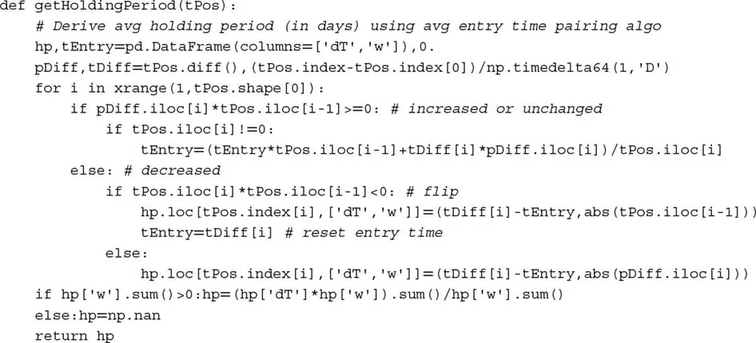

## 14.4 绩效

绩效统计是不含风险调整的美元和收益数字。一些有用的绩效衡量包括：

-   **PnL：** 回测期间产生的美元总额（或计价货币的等值），包括终端头寸的清算成本。
-   **多头头寸 PnL：** 完全由多头头寸产生的 PnL 美元部分。这是评估多空市场中立策略偏差的有价值指标。
-   **年化收益率：** 总收益的时间加权平均年率，包括股息、利息、成本等。
-   **命中率：** 产生正 PnL 的下注比例。
-   **命中平均收益：** 产生利润的下注的平均收益。
-   **错过平均收益：** 产生亏损的下注的平均收益。

### 14.4.1 时间加权收益率

总收益是已实现和未实现损益的收益率，包括计量期间的应计利息、已付利息和股息。GIPS 规则计算时间加权收益率（TWRR），根据外部现金流调整（CFA Institute [2010]）。定期和子定期收益以几何方式链接。对于 2005 年 1 月 1 日或之后开始的期间，GIPS 规则要求计算根据日加权外部现金流调整的投资组合收益。

我们可以通过确定每次外部现金流时点的投资组合价值来计算 TWRR。^2^ 投资组合 i 在子期间 [t−1, t] 之间的 TWRR 记为 r~i,t~，方程为

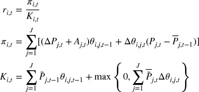

其中

-   π~i,t~ 是投资组合 i 在时间 t 的盯市（MtM）盈亏。
-   K~i,t~ 是投资组合 i 通过子期间 t 管理资产的市场价值。包含 max{·} 项的目的是为额外购买（加速）提供资金。
-   A~j,t~ 是工具 j 一个单位在时间 t 应计的利息或支付的股息。
-   P~j,t~ 是证券 j 在时间 t 的净价。
-   θ~i,j,t~ 是投资组合 i 在时间 t 对证券 j 的持仓。
-   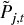 是证券 j 在时间 t 的全价。
-   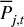 是投资组合 i 对证券 j 在子期间 t 内的平均交易净价。
-   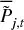 是投资组合 i 对证券 j 在子期间 t 内的平均交易全价。

假设现金流入在日初发生，现金流出在日终发生。这些子期间收益然后以几何方式链接为

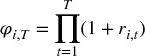

变量 φ~i,T~ 可以理解为在投资组合 i 的整个生命周期 t = 1, ..., T 内投资一美元的表现。最后，投资组合 i 的年化收益率为

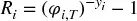

其中 y~i~ 是 r~i,1~ 和 r~i,T~ 之间经过的年数。

## 14.5 运行

投资策略很少产生来自 IID 过程的收益。在没有这一性质的情况下，策略收益序列表现出频繁的运行。运行是相同符号收益的不间断序列。因此，运行增加了下行风险，需要用适当的指标来评估。

### 14.5.1 收益集中度

给定下注收益的时间序列 {r~t~}~t=1,...,T~，我们计算两个权重序列 w^−^ 和 w^+^：

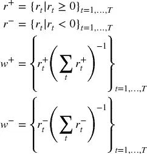

受 Herfindahl-Hirschman 指数（HHI）启发，对于 ||w^+^|| > 1（其中 ||·|| 是向量大小），我们定义正收益的集中度为

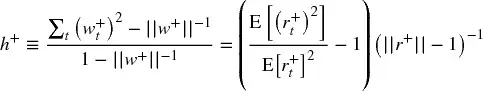

以及负收益集中度的等价定义，对于 ||w^−^|| > 1，

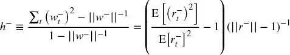

从 Jensen 不等式，我们知道 E[r~t~^+^]² ≤ E[(r~t~^+^)²]。因为 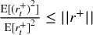，我们推导 E[r~t~^+^]² ≤ E[(r~t~^+^)²] ≤ E[r~t~^+^]²||r^+^||，对负下注收益有等价的边界。这些定义有几个有趣的性质：

1.  0 ≤ h^+^ ≤ 1
2.  h^+^ = 0 ⇔ w~t~^+^ = ||w^+^||^−1^，∀t（均匀收益）
3.  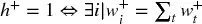（只有一个非零收益）

很容易推导各月下注集中度 h[t] 的类似表达式。代码片段 14.3 实现了这些概念。理想情况下，我们对*下注*收益表现出以下特征的策略感兴趣：

-   高夏普比率
-   每年高下注数，||r^+^|| + ||r^−^|| = T
-   高命中率（相对低的 ||r^−^||）
-   低 h^+^（无右胖尾）
-   低 h^−^（无左胖尾）
-   低 h[t]（下注不集中在时间上）

> **代码片段 14.3 推导 HHI 集中度的算法**

> 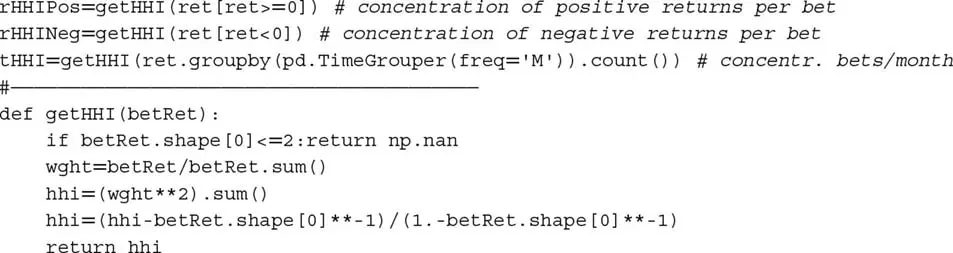

### 14.5.2 回撤和水下时间

直觉上，回撤（Drawdown, DD）是投资在两个连续高水位（High-Water Mark, HWM）之间遭受的最大损失。水下时间（Time under Water, TuW）是 HWM 与 PnL 超过先前最大 PnL 时刻之间经过的时间。这些概念最好通过阅读代码片段 14.4 来理解。该代码从 (1) 收益序列（`dollars = False`）或 (2) 美元表现序列（`dollar = True`）推导 DD 和 TuW 序列。图 14.1 提供了 DD 和 TuW 的示例。

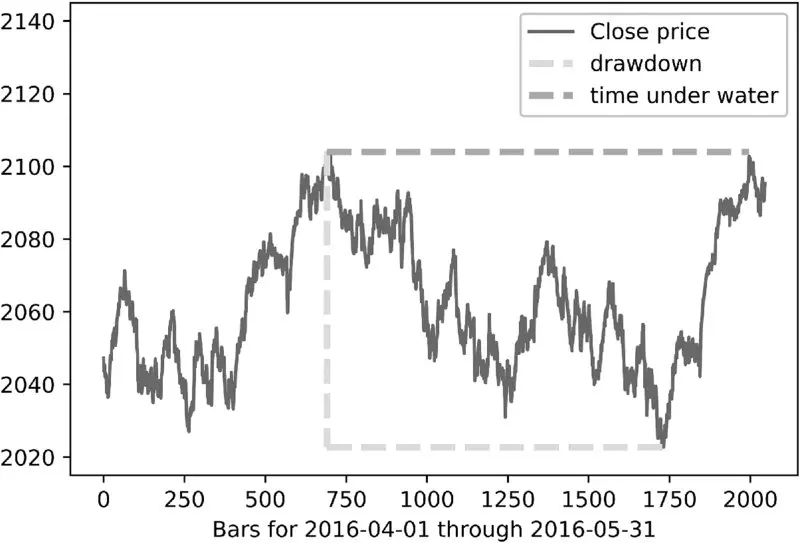

**图 14.1** 回撤 (DD) 和水下时间 (TuW) 的示例

> **代码片段 14.4 推导 DD 和 TuW 序列**

> 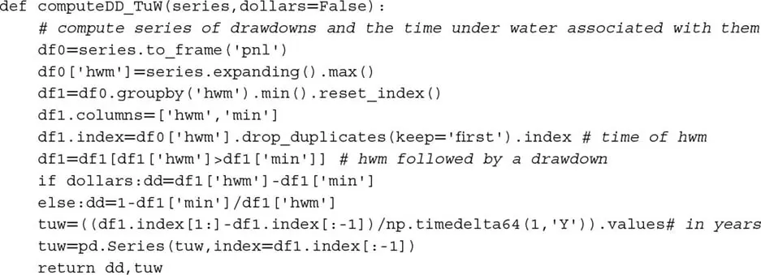

### 14.5.3 绩效评估的运行统计

一些有用的运行统计衡量包括：

-   **正收益的 HHI 指数：** 这是代码片段 14.3 中的 `getHHI(ret[ret >= 0])`。
-   **负收益的 HHI 指数：** 这是代码片段 14.3 中的 `getHHI(ret[ret < 0])`。
-   **下注间隔时间的 HHI 指数：** 这是代码片段 14.3 中的 `getHHI(ret.groupby(pd.TimeGrouper(freq='M')).count())`。
-   **95 百分位 DD：** 这是代码片段 14.4 推导的 DD 序列的第 95 百分位。
-   **95 百分位 TuW：** 这是代码片段 14.4 推导的 TuW 序列的第 95 百分位。

## 14.6 实现 shortfall

投资策略经常因对执行成本的错误假设而失败。一些重要的衡量包括：

-   **每次换手的经纪费用：** 这些是支付给经纪商用于翻转投资组合的费用，包括交易所费用。
-   **每次换手的平均滑点：** 这些是投资组合一次换手中涉及的执行成本（不包括经纪费用）。例如，它包括因以高于发送订单时中间价的成交价买入证券而造成的损失。
-   **每次换手的美元表现：** 这是美元表现（包括经纪费用和滑点成本）与投资组合总换手次数之间的比率。它表示执行变得多昂贵才会使策略盈亏平衡。
-   **执行成本回报率：** 这是美元表现（包括经纪费用和滑点成本）与总执行成本之间的比率。它应该是一个大的倍数，以确保策略能在比预期更差的执行中存活。

## 14.7 效率

到目前为止，所有绩效统计都考虑了利润、损失和成本。在本节中，我们考虑实现这些结果所涉及的风险。

### 14.7.1 夏普比率

假设策略的超额收益（超过无风险利率）{r~t~}~t=1,...,T~ 是 IID 高斯的，均值为 μ，方差为 σ²。夏普比率（Sharpe Ratio, SR）定义为

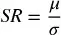

SR 的目的是评估特定策略或投资者的技能。由于 μ、σ 通常未知，真实的 SR 值无法确定地知道。不可避免的后果是夏普比率计算可能是大量估计误差的主题。

### 14.7.2 概率夏普比率

概率夏普比率（Probabilistic Sharpe Ratio, PSR）通过消除由具有偏斜和/或胖尾收益的短序列引起的膨胀效应，提供了 SR 的调整估计。给定用户定义的基准^3^ 夏普比率（SR\*）和观测夏普比率 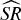，PSR 估计  大于假设 SR\* 的概率。根据 Bailey 和 López de Prado [2012]，PSR 可以估计为

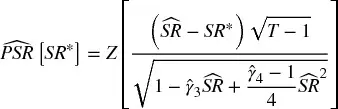

其中 Z[·] 是标准正态分布的累积分布函数（CDF），T 是观测收益数，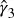 是收益的偏度， 是收益的峰度（高斯收益为 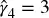）。对于给定的 SR\*，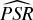 随更大的 （在原始采样频率即非年化情况下）、更长的业绩记录（T）或正偏收益（）而增加，但随更胖的尾部（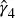）而减少。图 14.2 绘制了  对于 、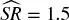 和 SR\* = 1.0 作为  和 T 的函数。

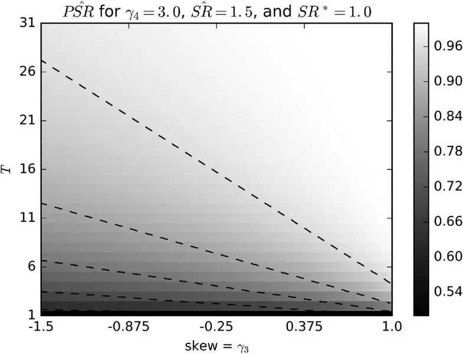

**图 14.2** PSR 作为偏度和样本长度的函数

### 14.7.3 Deflated 夏普比率

Deflated 夏普比率（Deflated Sharpe Ratio, DSR）是 PSR，其中拒绝阈值被调整以反映试验的多重性。根据 Bailey 和 López de Prado [2014]，DSR 可以估计为 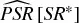，其中基准夏普比率 SR\* 不再是用户定义的。相反，SR\* 估计为

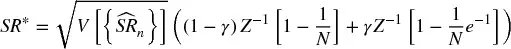

其中  是试验估计 SR 之间的方差，N 是独立试验数，Z[·] 是标准正态分布的 CDF，γ 是 Euler-Mascheroni 常数，n = 1, ..., N。图 14.3 绘制了 SR\* 作为 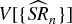 和 N 的函数。

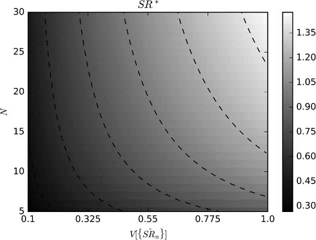

**图 14.3** SR\* 作为  和 N 的函数

DSR 背后的原理是：给定一组 SR 估计 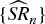，其期望最大值大于零，即使真实 SR 为零。在真实夏普比率为零的零假设 H~0~: SR = 0 下，我们知道期望最大值  可以估计为 SR\*。事实上，SR\* 随着更多独立试验（N）的尝试或试验涉及更大的方差 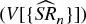 而快速增加。从这些知识我们推导出回测第三定律。

> **代码片段 14.5 MARCOS 的回测第三定律——大多数金融发现因违反它而错误**

> 「每个回测结果必须与产生它所涉及的所有试验一起报告。缺少该信息，就不可能评估回测的『错误发现』概率。」

> Marcos López de Prado，《金融机器学习的进展》（2018）

### 14.7.4 效率统计

有用的效率统计包括：

-   **年化夏普比率：** 这是 SR 值，通过因子 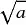 年化，其中 a 是每年观测的平均收益数。这种常见的年化方法依赖于收益 IID 的假设。
-   **信息比率：** 这是衡量相对于基准表现的投资组合的 SR 等价物。它是平均超额收益与跟踪误差之间的年化比率。超额收益衡量为投资组合收益超过基准收益的部分。跟踪误差估计为超额收益的标准差。
-   **概率夏普比率：** PSR 纠正 SR 因非正态收益或业绩记录长度引起的膨胀效应。它应超过 0.95，对应 5% 的标准显著性水平。它可以在绝对或相对收益上计算。
-   **Deflated 夏普比率：** DSR 纠正 SR 因非正态收益、业绩记录长度和多重检验/选择偏差引起的膨胀效应。它应超过 0.95，对应 5% 的标准显著性水平。它可以在绝对或相对收益上计算。

## 14.8 分类评分

在元标签策略（[第 3 章](ch03.md)第 3.6 节）的上下文中，独立理解 ML 覆盖算法的表现是有用的。记住，一级算法识别机会，二级（覆盖）算法决定是否追求或放过。一些有用的统计包括：

-   **准确率：** 准确率是覆盖算法正确标记的机会比例，

    > 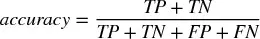

    其中 TP 是真阳性数，TN 是真阴性数，FP 是假阳性数，FN 是假阴性数。

-   **精确率：** 精确率是预测正例中真阳性的比例，

    > 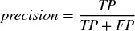

-   **召回率：** 召回率是正例中真阳性的比例，

    > 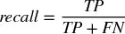

-   **F1：** 准确率可能不是元标签应用的充分分类评分。假设应用元标签后，负例（标签 '0'）远多于正例（标签 '1'）。在这种情况下，一个将每个案例预测为负例的分类器将达到高准确率，即使召回率=0 且精确率未定义。F1 分数通过以精确率和召回率的（等权重）调和平均来评估分类器，纠正了该缺陷，

    > 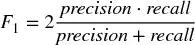

    作为旁注，考虑应用元标签后正例远多于负例的不寻常情况。一个将所有案例预测为正例的分类器将达到 TN=0 和 FN=0，因此准确率=精确率且召回率=1。准确率将很高，F1 不会小于准确率，即使分类器无法区分观测样本。一个解决方案是交换正例和负例的定义，使负例占多数，然后用 F1 评分。

-   **负对数损失：** 负对数损失在第 9 章第 9.4 节中超参数调优的上下文中介绍。详情请参阅该节。准确率和负对数损失之间的关键概念差异是，负对数损失不仅考虑我们的预测是否正确，还考虑这些预测的概率。

精确率、召回率和准确率的可视化表示见[第 3 章](ch03.md)第 3.7 节。表 14.1 表征了二元分类的四种退化情况。如你所见，F1 分数在其中两种情况下未定义。因此，当 Scikit-learn 被要求在没有观测 1 或没有预测 1 的样本上计算 F1 时，它将打印警告（`UndefinedMetricWarning`），并将 F1 值设为 0。

**表 14.1** 二元分类的四种退化情况

| 条件 | 坍塌 | 准确率 | 精确率 | 召回率 | F1 |
|------|------|--------|--------|--------|-----|
| 观测全为 1 | TN=FP=0 | [=召回率] | 1 | [0,1] | [0,1] |
| 观测全为 0 | TP=FN=0 | [0,1] | 0 | NaN | NaN |
| 预测全为 1 | TN=FN=0 | [=精确率] | [0,1] | 1 | [0,1] |
| 预测全为 0 | TP=FP=0 | [0,1] | NaN | 0 | NaN |

当所有观测值为正（标签 '1'）时，没有真阴性或假阳性，因此精确率为 1，召回率为 0 到 1（含）之间的正实数，准确率等于召回率。则 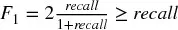。

当所有预测值为正（标签 '1'）时，没有真阴性或假阴性，因此精确率为 0 到 1（含）之间的正实数，召回率为 1，准确率等于精确率。则 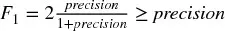。

## 14.9 归因

绩效归因的目的是按风险类别分解 PnL。例如，公司债券投资组合经理通常想了解其表现有多少来自他对以下风险类别的敞口：久期、信用、流动性、经济部门、货币、主权、发行人等。他的久期下注是否获利？他在哪些信用细分领域擅长？还是应该专注于发行人选择技能？

这些风险不是正交的，因此它们之间总存在重叠。例如，高流动性债券倾向于具有短久期和高信用评级，通常由大量发行美元的大型实体发行。因此，归因 PnL 的总和将不匹配总 PnL，但至少我们将能够计算每个风险类别的夏普比率（或信息比率）。也许这种方法最受欢迎的例子是 Barra 的多因子方法。详见 Barra [1998, 2013] 和 Zhang 与 Rachev [2004]。

同样有趣的是在每个类别内的各分类间归因 PnL。例如，久期类别可以划分为短久期（小于 5 年）、中等久期（5 到 10 年之间）和长久期（超过 10 年）。该 PnL 归因可以如下完成：第一，为避免前面提到的重叠问题，我们需要确保投资宇宙的每个成员在任何时间点属于每个风险类别的一个且仅一个分类。换言之，对于每个风险类别，我们将整个投资宇宙划分为不相交的分区。第二，对于每个风险类别，我们为每个风险分类形成一个指数。例如，我们将计算短期久期债券指数的表现、另一个中期久期债券指数和另一个长期久期债券指数。每个指数的权重是我们投资组合的重新缩放权重，使每个指数的权重加总为一。第三，我们重复第二步，但这次使用投资宇宙（如 Markit iBoxx Investment Grade）的权重形成风险分类指数，同样重新缩放使每个指数的权重加总为一。第四，我们在这些指数的收益和超额收益上计算本章前面讨论的绩效指标。为清晰起见，在此上下文中短期久期指数的超额收益是使用（重新缩放的）投资组合权重（步骤 2）的收益减去使用（重新缩放的）宇宙权重（步骤 3）的收益。

## 练习题

1. 一个策略表现出高换手率、高杠杆和高下注数，持有期短、执行成本回报率低、夏普比率高。它可能有大容量吗？你认为它是什么类型的策略？

2. 在 E-mini S&P 500 期货的美元条数据集上，计算：
    1. 正收益的 HHI 指数。
    2. 负收益的 HHI 指数。
    3. 条间时间的 HHI 指数。
    4. 95 百分位 DD。
    5. 95 百分位 TuW。
    6. 年化平均收益。
    7. 命中的平均收益（正收益）。
    8. 错过的平均收益（负收益）。
    9. 年化 SR。
    10. 信息比率，其中基准为无风险利率。
    11. PSR。
    12. DSR，假设有 100 次试验，试验 SR 的方差为 0.5。

3. 考虑一个在偶数年做多一份期货合约、在奇数年做空一份期货合约的策略。
    1. 重复练习 2 的计算。
    2. 与标的的相关性是多少？

4. 2 年回测的结果是月度收益均值 3.6%，标准差 0.079%。
    1. SR 是多少？
    2. 年化 SR 是多少？

5. 接续练习 1：
    1. 收益偏度为 0，峰度为 3。PSR 是多少？
    2. 收益偏度为 −2.448，峰度为 10.164。PSR 是多少？

6. 如果回测长度为 3 年，2.b 的 PSR 会是多少？

7. 5 年回测的年化 SR 为 2.5，基于日收益计算。偏度为 −3，峰度为 10。
    1. PSR 是多少？
    2. 为找到该最佳结果，进行了 100 次试验。这些试验的夏普比率方差为 0.5。DSR 是多少？

## 参考文献

1. Bailey, D. and M. López de Prado (2012): "The Sharpe ratio efficient frontier." *Journal of Risk*, Vol. 15, No. 2, pp. 3--44.
2. Bailey, D. and M. López de Prado (2014): "The deflated Sharpe ratio: Correcting for selection bias, backtest overfitting and non-normality." *Journal of Portfolio Management*, Vol. 40, No. 5. Available at https://ssrn.com/abstract=2460551.
3. Barra (1998): *Risk Model Handbook: U.S. Equities*, 1st ed. Barra. Available at http://www.alacra.com/alacra/help/barra_handbook_US.pdf.
4. Barra (2013): *MSCI BARRA Factor Indexes Methodology*, 1st ed. MSCI Barra.
5. CFA Institute (2010): "Global investment performance standards." CFA Institute, Vol. 2010, No. 4, February. Available at https://www.gipsstandards.org.
6. Zhang, Y. and S. Rachev (2004): "Risk attribution and portfolio performance measurement—An overview." Working paper, University of California, Santa Barbara.

## 参考书目

1. American Statistical Society (1999): "Ethical guidelines for statistical practice." Available at http://www.amstat.org/committees/ethics/index.html.
2. Bailey, D., J. Borwein, M. López de Prado, and J. Zhu (2014): "Pseudo-mathematics and financial charlatanism: The effects of backtest overfitting on out-of-sample performance." *Notices of the American Mathematical Society*, Vol. 61, No. 5. Available at http://ssrn.com/abstract=2308659.
3. Bailey, D., J. Borwein, M. López de Prado, and J. Zhu (2017): "The probability of backtest overfitting." *Journal of Computational Finance*, Vol. 20, No. 4, pp. 39--70. Available at http://ssrn.com/abstract=2326253.
4. Bailey, D. and M. López de Prado (2012): "Balanced baskets: A new approach to trading and hedging risks." *Journal of Investment Strategies (Risk Journals)*, Vol. 1, No. 4, pp. 21--62.
5. Beddall, M. and K. Land (2013): "The hypothetical performance of CTAs." Working paper, Winton Capital Management.
6. Benjamini, Y. and Y. Hochberg (1995): "Controlling the false discovery rate: A practical and powerful approach to multiple testing." *Journal of the Royal Statistical Society, Series B*, Vol. 57, No. 1, pp. 289--300.
7. Bennet, C., A. Baird, M. Miller, and G. Wolford (2010): "Neural correlates of interspecies perspective taking in the post-mortem Atlantic salmon: An argument for proper multiple comparisons correction." *Journal of Serendipitous and Unexpected Results*, Vol. 1, No. 1, pp. 1--5.
8. Bruss, F. (1984): "A unified approach to a class of best choice problems with an unknown number of options." *Annals of Probability*, Vol. 12, No. 3, pp. 882--891.
9. Dmitrienko, A., A.C. Tamhane, and F. Bretz (2010): *Multiple Testing Problems in Pharmaceutical Statistics*, 1st ed. CRC Press.
10. Dudoit, S. and M.J. van der Laan (2008): *Multiple Testing Procedures with Applications in Genomics*, 1st ed. Springer.
11. Fisher, R.A. (1915): "Frequency distribution of the values of the correlation coefficient in samples of an indefinitely large population." *Biometrika*, Vol. 10, No. 4, pp. 507--521.
12. Hand, D. J. (2014): *The Improbability Principle*, 1st ed. Scientific American/Farrar, Straus and Giroux.
13. Harvey, C., Y. Liu, and H. Zhu (2013): "... And the cross-section of expected returns." Working paper, Duke University. Available at http://ssrn.com/abstract=2249314.
14. Harvey, C. and Y. Liu (2014): "Backtesting." Working paper, Duke University. Available at http://ssrn.com/abstract=2345489.
15. Hochberg Y. and A. Tamhane (1987): *Multiple Comparison Procedures*, 1st ed. John Wiley and Sons.
16. Holm, S. (1979): "A simple sequentially rejective multiple test procedure." *Scandinavian Journal of Statistics*, Vol. 6, pp. 65--70.
17. Ioannidis, J.P.A. (2005): "Why most published research findings are false." *PloS Medicine*, Vol. 2, No. 8, pp. 696--701.
18. Ingersoll, J., M. Spiegel, W. Goetzmann, and I. Welch (2007): "Portfolio performance manipulation and manipulation-proof performance measures." *Review of Financial Studies*, Vol. 20, No. 5, pp. 1504--1546.
19. Lo, A. (2002): "The statistics of Sharpe ratios." *Financial Analysts Journal*, Vol. 58, No. 4, pp. 36--52.
20. López de Prado M., and A. Peijan (2004): "Measuring loss potential of hedge fund strategies." *Journal of Alternative Investments*, Vol. 7, No. 1, pp. 7--31. Available at http://ssrn.com/abstract=641702.
21. Mertens, E. (2002): "Variance of the IID estimator in Lo (2002)." Working paper, University of Basel.
22. Roulston, M. and D. Hand (2013): "Blinded by optimism." Working paper, Winton Capital Management.
23. Schorfheide, F. and K. Wolpin (2012): "On the use of holdout samples for model selection." *American Economic Review*, Vol. 102, No. 3, pp. 477--481.
24. Sharpe, W. (1966): "Mutual fund performance." *Journal of Business*, Vol. 39, No. 1, pp. 119--138.
25. Sharpe, W. (1975): "Adjusting for risk in portfolio performance measurement." *Journal of Portfolio Management*, Vol. 1, No. 2, pp. 29--34.
26. Sharpe, W. (1994): "The Sharpe ratio." *Journal of Portfolio Management*, Vol. 21, No. 1, pp. 49--58.
27. Studený M. and Vejnarová J. (1999): "The multiinformation function as a tool for measuring stochastic dependence," in M. I. Jordan, ed., *Learning in Graphical Models*. MIT Press, pp. 261--296.
28. Wasserstein R., and Lazar N. (2016) "The ASA's statement on p-values: Context, process, and purpose." *American Statistician*, Vol. 70, No. 2, pp. 129--133.
29. Watanabe S. (1960): "Information theoretical analysis of multivariate correlation." *IBM Journal of Research and Development*, Vol. 4, pp. 66--82.

## 注释

^1^ 更多详情请访问 https://www.gipsstandards.org。

^2^ 外部现金流是进入或退出投资组合的资产（现金或投资）。例如，股息和利息收入支付不被视为外部现金流。

^3^ 这可以设为零的默认值（即与无投资技能比较）。
