# 理解策略风险

## 15.1 动机
正如我们在第 3 章和第 13 章中看到的，投资策略通常以持仓直到满足两个条件之一来
met: (1) a condition to exit the position with profits (profit-taking),
or (2) a condition to exit the position with losses (stop-loss). Even
when a strategy does not explicitly declare a stop-loss, there is always
an implicit stop-loss limit, at which the investor can no longer finance
her position (margin call) or bear the pain caused by an increasing
unrealized loss. Because most strategies have (implicitly or explicitly)
these two exit conditions, it makes sense to model the distribution of
outcomes through a binomial process. This in turn will help us
understand what combinations of betting frequency, odds, and payouts are
uneconomic. The goal of this chapter is to help you evaluate when a
strategy is vulnerable to small changes in any of these
variables.

## 15.2 对称收益
考虑一个产生] *n* IID bets per
year, where the outcome *X ~[*i*]~* of a
bet *i* [∈ [1,] *n* [] is a
profit π \> 0 with probability P[] *X
~[*i*]~* [= π] =] *p* [, and a loss − π with
probability P[] *X ~[*i*]~* [= −π] = 1
−] *p* [. You can think of] *p*
as the precision of a binary classifier where a positive means betting
on an opportunity, and a negative means passing on an opportunity: True
positives are rewarded, false positives are punished, and negatives
(whether true or false) have no payout. Since the betting outcomes
 *X ~[*i*]~* [}
~[*i*\ =\ 1,\ ...,\ *n*]~ are independent, we will compute the
expected moments per bet. The expected profit from one bet is
E[] *X ~[*i*]~* [] = π
*p* [+ ( − π)(1 −] *p* [) = π(2
*p* [− 1). The variance is V[] *X ~[*i*]~*
] = E[] *X^[2]^ ~[*i*]~* [] −
E[] *X ~[*i*]~* [] ^[2]^ , where
E[] *X^[2]^ ~[*i*]~* [] = π
^[2]^ ] *p* [+ ( − π) ^[2]^ (1
−] *p* [) = π ^[2]^ , thus
V[] *X ~[*i*]~* [] = π ^[2]^ − π
^[2]^ (2] *p* [− 1) ^[2]^ = π
^[2]^ [1 − (2] *p* [− 1) ^[2]^ ] =
4π ^[2]^ ] *p* [(1 −] *p*
). For] *n* [IID bets per year, the annualized
Sharpe ratio (θ) is

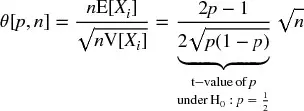

Note how π cancels out of the above equation, because the payouts are
symmetric. Just as in the Gaussian case, θ[] *p*
,] *n* [] can be understood as a re-scaled t-value.
This illustrates the point that, even for a small
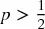 [, the Sharpe
ratio can be made high for a sufficiently large] *n.*
This is the economic basis for high-frequency trading,
where] *p* [can be barely above .5, and the key to a
successful business is to increase] *n* [. The Sharpe
ratio is a function of precision rather than accuracy, because passing
on an opportunity (a negative) is not rewarded or punished directly
(although too many negatives may lead to a small] *n*
, which will depress the Sharpe ratio toward zero).

For example, for] *p* [= .55,
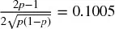 [, and
achieving an annualized Sharpe ratio of 2 requires 396 bets per year.
代码片段 15.1 verifies this result experimentally.
 图 15.1
plots the Sharpe ratio as a function of precision, for various betting
frequencies.

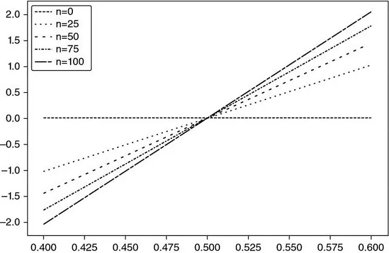

**图 15.1** The relation between
precision (x-axis) and sharpe ratio (y-axis) for various bet frequencies
(n)

> **SNIPPET 15.1 TARGETING A SHARPE RATIO AS A FUNCTION OF THE NUMBER OF
> BETS**

> 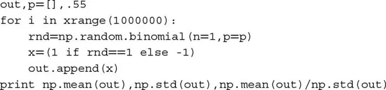

Solving for 0 ≤] *p* [≤ 1, we
obtain] 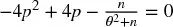 [, with solution

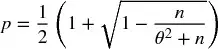

This equation makes explicit the trade-off between precision
(] *p* [) and frequency (] *n* [)
for a given Sharpe ratio (θ). For example, a strategy that only produces
weekly bets (] *n* [= 52) will need a fairly high
precision of] *p* [= 0.6336 to deliver an annualized
Sharpe of 2.

## 15.3 非对称收益
Consider a strategy that produces] *n* IID bets per
year, where the outcome *X ~[*i*]~* of a
bet *i* [∈ [1,] *n* [] is π
~[+]~ with probability P[] *X
~[*i*]~* [= π ~[+]~ ] =] *p* [, and
an outcome π ~[−]~ , π ~[−]~ \< π ~[+]~ occurs
with probability P[] *X ~[*i*]~* [= π
~[−]~ ] = 1 −] *p* [. The expected profit
from one bet is E[] *X ~[*i*]~* [
=] *p* [π ~[+]~ + (1 −
*p* [)π ~[−]~ = (π ~[+]~ − π ~[−]~
)] *p* [+ π ~[−]~ . The variance is
V[] *X ~[*i*]~* [] =
E[] *X^[2]^ ~[*i*]~* [] −
E[] *X ~[*i*]~* [] ^[2]^ , where
E[] *X^[2]^ ~[*i*]~* [
=] *p* [π ~[+]~ ^[2]^ + (1
−] *p* [)π ^[2]^ ~[−]~ = (π
~[+]~ ^[2]^ − π ^[2]^ ~[−]~
)] *p* [+ π ~[−]~ ^[2]^ , thus
V[] *X ~[*i*]~* [] = (π ~[+]~ − π
~[−]~ ) ^[2]^ ] *p* [(1
−] *p* [). For] *n* [IID bets per
year, the annualized Sharpe ratio (θ) is

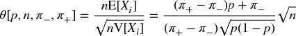

And for π ~[−]~ = −π ~[+]~ we can see that this
equation reduces to the symmetric case:
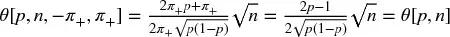 [. For
example, for] *n* [= 260, π ~[−]~ = −.01, π
~[+]~ = .005,] *p* [= .7, we get θ =
1.173.

Finally, we can solve the previous equation for 0 ≤
*p* [≤ 1, to obtain

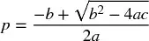

where:

-   *a* = (*n* + θ ^[2]^ )(π ~[+]~ − π ~[−]~ )
    ^[2]^
-   *b* = [2*n* π ~[−]~ − θ ^[2]^ (π ~[+]~ − π
    ~[−]~ )](π ~[+]~ − π ~[−]~ )
-   *c* = *n* π ^[2]^ ~[−]~

As a side note, 代码片段 15.2 verifies these symbolic operations using
SymPy Live:] <http://live.sympy.org/>
.

> **SNIPPET 15.2 USING THE SymPy LIBRARY FOR SYMBOLIC OPERATIONS**

> 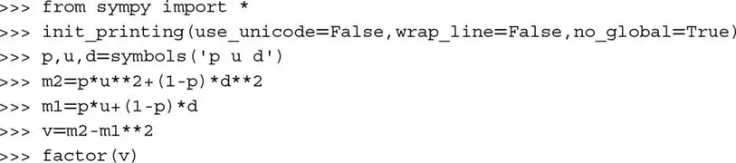

The above equation answers the following question: Given a trading rule
characterized by parameters  *n* [}, what is the precision
rate] *p* [required to achieve a Sharpe ratio of θ*?
For example, for] *n* [= 260, π ~[−]~ = −.01,
π ~[+]~ = .005, in order to get θ = 2 we require
a] *p* [= .72] *.* [Thanks to the
large number of bets, a very small change in] *p*
(from] *p* [= .7 to] *p* [= .72)
has propelled the Sharpe ratio from θ = 1.173 to θ =
2] *.* [On the other hand, this also tells us that
the strategy is vulnerable to small changes in] *p.*
代码片段 15.3 implements the derivation of the implied
precision.]  Figure
15.2 displays the implied precision
as a function of *n* [and π ~[−]~ , where π
~[+]~ = 0.1 and θ* = 1.5] *.* [As π
~[−]~ becomes more negative for a given] *n*
, a higher] *p* [is required to achieve θ* for a
given π ~[+]~ . As] *n* [becomes smaller for
a given π ~[−]~ , a higher] *p* [is required
to achieve θ* for a given π ~[+]~ .

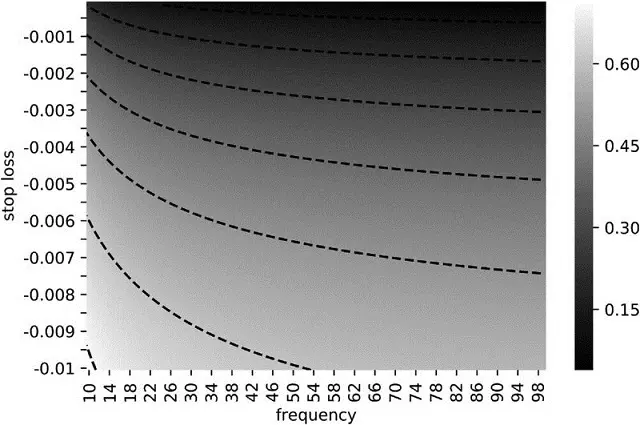

**图 15.2** Heat-map of the
implied precision as a function of *n* and π ~[−]~ , with π
~[+]~ = 0.1 and θ* = 1.5

> **SNIPPET 15.3 COMPUTING THE IMPLIED PRECISION**

> 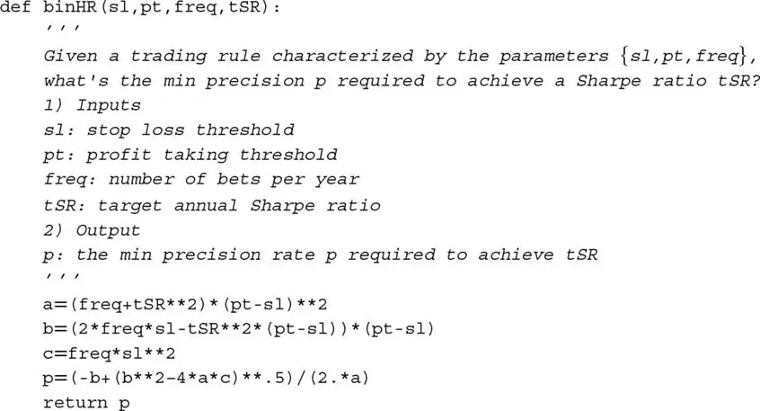

代码片段 15.4 solves θ[] *p* [,
*n* [, π ~[−]~ , π ~[+]~ ] for the implied betting
frequency,] *n.*  Figure
15.3 plots the implied frequency as
a function of *p* [and π ~[−]~ , where π
~[+]~ = 0.1 and θ* = 1.5] *.* [As π
~[−]~ becomes more negative for a given] *p*
, a higher] *n* [is required to achieve θ* for a
given π ~[+]~ . As] *p* [becomes smaller for
a given π ~[−]~ , a higher] *n* [is required
to achieve θ* for a given π ~[+]~ .

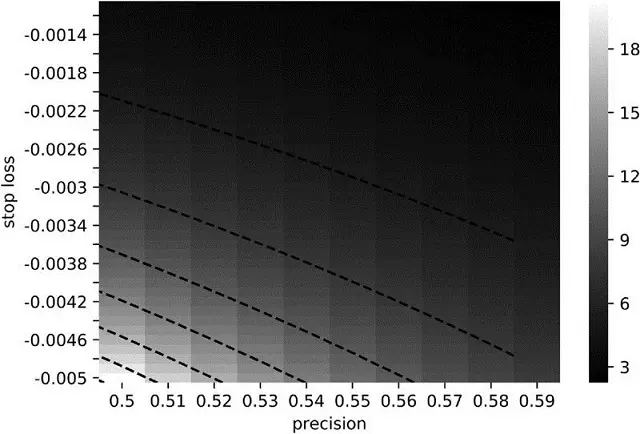

**图 15.3** Implied frequency as
a function of *p* and, with = 0.1 and = 1.5

> **SNIPPET 15.4 COMPUTING THE IMPLIED BETTING FREQUENCY**

> 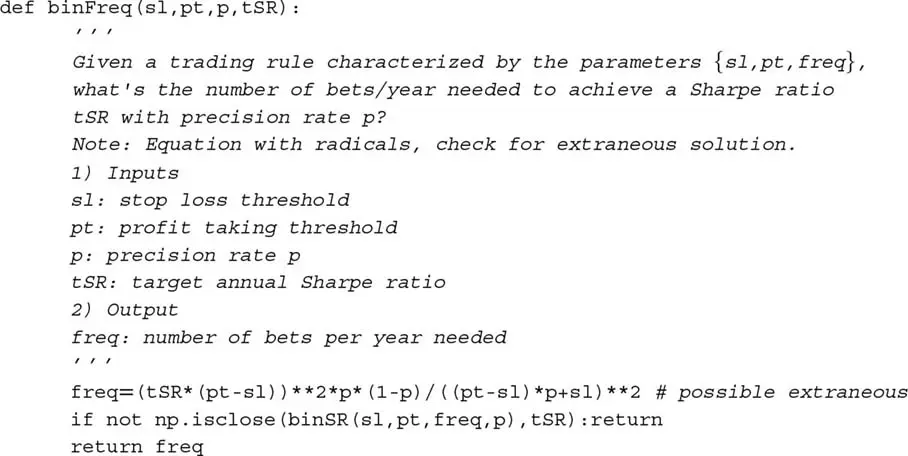

## 15.4 策略失败的概率
In the example above, parameters π ~[−]~ = −.01, π
~[+]~ = .005 are set by the portfolio manager, and passed to the
traders with the execution orders. Parameter] *n* [=
260 is also set by the portfolio manager, as she decides what
constitutes an opportunity worth betting on. The two parameters that are
not under the control of the portfolio manager are
*p* [(determined by the market) and θ* (the objective set by the
investor). Because] *p* [is unknown, we can model it
as a random variable, with expected value E[] *p*
]. Let us define
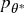 as the value
of *p* [below which the strategy will underperform a
target Sharpe ratio θ*, that is,
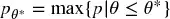 [. We can
use the equations above (or the] `binHR` [function)
to conclude that for
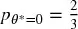
,] 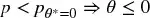 *.* [This highlights the risks involved in this strategy,
because a relatively small drop in] *p*
(from] *p* [= .7 to] *p* [= .67)
will wipe out all the profits. The strategy is intrinsically risky, even
if the holdings are not. That is the critical difference we wish to
establish with this chapter:] *Strategy risk* should
not be confused with *portfolio risk.*

Most firms and investors compute, monitor, and report portfolio risk
without realizing that this tells us nothing about the risk of the
strategy itself. Strategy risk is not the risk of the underlying
portfolio, as computed by the chief risk officer. Strategy risk is the
risk that the investment strategy will fail to succeed over time, a
question of far greater relevance to the chief investment officer. The
answer to the question "What is the probability that this strategy will
fail?" is equivalent to computing
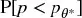 [. The
following algorithm will help us compute the strategy
risk.

### 15.4.1 Algorithm

在本节中我们将 describe a procedure to
compute]  [. Given a time series of bet outcomes {π
~[*t*]~} ~[*t*\ =\ 1,\ ...,\ *T*]~ , first we estimate
π ~[−]~ = E[{π ~[*t*]~ \|π ~[*t*]~ ≤ 0}
~[*t*\ =\ 1,\ ...,\ *T*]~ ], and π ~[+]~ = E[{π
~[*t*]~ \|π ~[*t*]~ \> 0}
~[*t*\ =\ 1,\ ...,\ *T*]~ ]. Alternatively, {π ~[−]~ ,
π ~[+]~} could be derived from fitting a mixture of two
Gaussians, using the EF3M algorithm (López de Prado and Foreman
2014]). Second, the annual frequency] *n* is
given by 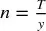 [, where] *y* is the number
of years elapsed between *t* [= 1
and] *t* [=] *T* [. Third, we
bootstrap the distribution of] *p* [as
follows:

1.  For iterations *i* = 1, ..., *I* :
    1.  Draw ⌊*nk* ⌋ samples from {π ~[*t*]~}
        ~[*t*\ =\ 1,\ ...,\ *T*]~ with replacement, where *k* is
        the number of years used by investors to assess a strategy
        (e.g., 2 years). We denote the set of these drawn samples as {π
        ^[(\ *i*\ )]^ ~[*j*]~}
        ~[*j*\ =\ 1,\ ...,\ ⌊\ *nk*\ ⌋]~ .
    2.  Derive the observed precision from iteration *i* as
        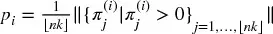 .
2.  Fit the PDF of *p* , denoted *f* [*p* ], by applying a Kernel
    Density Estimator (KDE) on {*p ~[*i*]~*}
    ~[*i*\ =\ 1,\ ...,\ *I*]~ .

For a sufficiently large] *k* [, we can approximate
this third step as
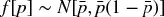 [,
where] 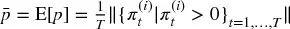 [. Fourth, given a threshold θ* (the Sharpe ratio that
separates failure from success), derive
 [(see
Section 15.4). Fifth, the strategy risk is computed
as] 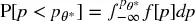 [.

### 15.4.2 Implementation

代码片段 15.5 lists one possible implementation of this algorithm.
Typically we would disregard strategies where
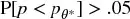 [as too
risky, even if they invest in low volatility instruments. The reason is
that even if they do not lose much money, the probability that they will
fail to achieve their target is too high. In order to be deployed, the
strategy developer must find a way to reduce

.

> **SNIPPET 15.5 CALCULATING THE STRATEGY RISK IN PRACTICE**

> 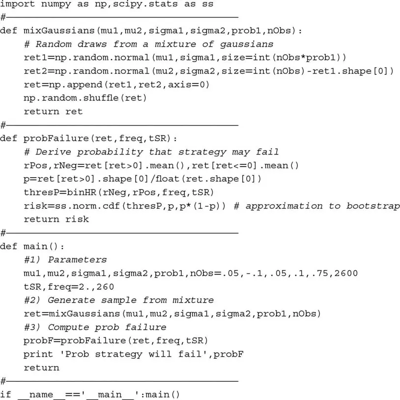

This approach shares some similarities with PSR (see [第 14 章](ch14.md), and
Bailey and López de Prado [2012, 2014]). PSR derives the probability
that the true Sharpe ratio exceeds a given threshold under non-Gaussian
returns. Similarly, the method introduced in this chapter derives the
strategy\'s probability of failure based on asymmetric binary outcomes.
The key difference is that, while PSR does not distinguish between
parameters under or outside the portfolio manager\'s control, the method
discussed here allows the portfolio manager to study the viability of
the strategy subject to the parameters under her control:  *n* [}. This is
useful when designing or assessing the viability of a trading
strategy.

## 练习题

1.  [A portfolio manager intends to launch a strategy that targets an
    > > annualized SR of 2. Bets have a precision rate of 60%, with
    > > weekly frequency. The exit conditions are 2% for profit-taking,
    > > and --2% for stop-loss.

    :::
    :::

    1.  Is this strategy viable?
    2.  *Ceteris paribus* , what is the required precision rate that
        would make the strategy profitable?
    3.  For what betting frequency is the target achievable?
    4.  For what profit-taking threshold is the target achievable?
    5.  What would be an alternative stop-loss?

2.  [Following up on the strategy from exercise 1.

    :::
    :::

    1.  What is the sensitivity of SR to a 1% change in each parameter?
    2.  Given these sensitivities, and assuming that all parameters are
        equally hard to improve, which one offers the lowest hanging
        fruit?
    3.  Does changing any of the parameters in exercise 1 impact the
        others? For example, does changing the betting frequency modify
        the precision rate, etc.?

3.  [Suppose a strategy that generates monthly bets over two years, with
    > > returns following a mixture of two Gaussian distributions. The
    > > first distribution has a mean of --0.1 and a standard deviation
    > > of 0.12. The second distribution has a mean of 0.06 and a
    > > standard deviation of 0.03. The probability that a draw comes
    > > from the first distribution is 0.15.

    :::
    :::

    1.  Following López de Prado and Peijan [2004] and López de Prado
        and Foreman [2014], derive the first four moments for the
        mixture\'s returns.
    2.  What is the annualized SR?
    3.  Using those moments, compute PSR[1] (see [第 14 章](ch14.md)). At a 95%
        confidence level, would you discard this strategy?

4.  [Using 代码片段 15.5, compute
    > >  [for
    > > the strategy described in exercise 3. At a significance level of
    > > 0.05, would you discard this strategy? Is this result consistent
    > > with] *PSR* [[θ*]?

5.  [In general, what result do you expect to be more
    > > accurate,] *PSR* [[θ*
    > > or] 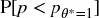 [? How are these two methods
    > > complementary?

6.  [Re-examine the results from [第 13 章](ch13.md), in light of what you have
    > > learned in this chapter.

    :::
    :::

    1.  Does the asymmetry between profit taking and stop-loss
        thresholds in OTRs make sense?
    2.  What is the range of *p* implied by 图 13.1, for a daily
        betting frequency?
    3.  What is the range of *p* implied by 图 13.5, for a weekly
        betting frequency?

## 参考文献

1.  Bailey, D. and M. López de Prado (2014): "The deflated Sharpe ratio:
    Correcting for selection bias, backtest overfitting and
    non-normality." *Journal of Portfolio Management* , Vol. 40, No. 5.
    Available at <https://ssrn.com/abstract=2460551> .
2.  Bailey, D. and M. López de Prado (2012): "The Sharpe ratio efficient
    frontier." *Journal of Risk* , Vol. 15, No. 2, pp. 3--44. Available
    at <https://ssrn.com/abstract=1821643.>
3.  López de Prado, M. and M. Foreman (2014): "A mixture of Gaussians
    approach to mathematical portfolio oversight: The EF3M algorithm."
    *Quantitative Finance* , Vol. 14, No. 5, pp. 913--930. Available at
    <https://ssrn.com/abstract=1931734> .
4.  López de Prado, M. and A. Peijan (2004): "Measuring loss potential
    of hedge fund strategies." *Journal of Alternative Investments* ,
    Vol. 7, No. 1 (Summer), pp. 7--31. Available at
    <http://ssrn.com/abstract=641702> .
