# 机器学习资产配置

## 16.1 动机
本章介绍层次风险平价（Hierarchical Risk Parity, HRP）方法。^1^
HRP portfolios address three major concerns of quadratic optimizers in
general and Markowitz\'s Critical Line Algorithm (CLA) in particular:
instability, concentration, and underperformance. HRP applies modern
mathematics (graph theory and machine learning techniques) to build a
diversified portfolio based on the information contained in the
covariance matrix. However, unlike quadratic optimizers, HRP does not
require the invertibility of the covariance matrix. In fact, HRP can
compute a portfolio on an ill-degenerated or even a singular covariance
matrix, an impossible feat for quadratic optimizers. Monte Carlo
experiments show that HRP delivers lower out-of-sample variance than
CLA, even though minimum-variance is CLA\'s optimization objective. HRP
produces less risky portfolios out-of-sample compared to traditional
risk parity methods. Historical analyses have also shown that HRP would
have performed better than standard approaches (Kolanovic et al.
2017], Raffinot [2017]). A practical application of HRP is to
determine allocations across multiple machine learning (ML)
strategies.

## 16.2 凸投资组合优化的问题
投资组合构建也许是最常见的金融问题。每天，投资经理必须构建整合其对风险和收益的观点和预测的投资组合。 This is the
primordial question that 24-year-old Harry Markowitz attempted to answer
more than six decades ago. His monumental insight was to recognize that
various levels of risk are associated with different optimal portfolios
in terms of risk-adjusted returns, hence the notion of "efficient
frontier" (Markowitz [1952]). One implication is that it is rarely
optimal to allocate all assets to the investments with highest expected
returns. Instead, we should take into account the correlations across
alternative investments in order to build a diversified
portfolio.

Before earning his PhD in 1954, Markowitz left academia to work for the
RAND Corporation, where he developed the Critical Line Algorithm. CLA is
a quadratic optimization procedure specifically designed for
inequality-constrained portfolio optimization problems. This algorithm
is notable in that it guarantees that the exact solution is found after
a known number of iterations, and that it ingeniously circumvents the
Karush-Kuhn-Tucker conditions (Kuhn and Tucker [1951]). A description
and open-source implementation of this algorithm can be found in Bailey
and López de Prado [2013]. Surprisingly, most financial practitioners
still seem unaware of CLA, as they often rely on generic-purpose
quadratic programming methods that do not guarantee the correct solution
or a stopping time.

Despite of the brilliance of Markowitz\'s theory, a number of practical
problems make CLA solutions somewhat unreliable. A major caveat is that
small deviations in the forecasted returns will cause CLA to produce
very different portfolios (Michaud [1998]). Given that returns can
rarely be forecasted with sufficient accuracy, many authors have opted
for dropping them altogether and focusing on the covariance matrix. This
has led to risk-based asset allocation approaches, of which "risk
parity" is a prominent example (Jurczenko [2015]). Dropping the
forecasts on returns improves but does not prevent the instability
issues. The reason is that quadratic programming methods require the
inversion of a positive-definite covariance matrix (all eigenvalues must
be positive). This inversion is prone to large errors when the
covariance matrix is numerically ill-conditioned, that is, when it has a
high condition number (Bailey and López de Prado
2012]).

## 16.3 Markowitz\'s Curse

协方差矩阵的条件数, correlation (or normal, thus
diagonalizable) matrix is the absolute value of the ratio between its
maximal and minimal (by moduli) eigenvalues.
 图 16.1
plots the sorted eigenvalues of several correlation matrices, where the
condition number is the ratio between the first and last values of each
line. This number is lowest for a diagonal correlation matrix, which is
its own inverse. As we add correlated (multicollinear) investments, the
condition number grows. At some point, the condition number is so high
that numerical errors make the inverse matrix too unstable: A small
change on any entry will lead to a very different inverse. This is
Markowitz\'s curse: The more correlated the investments, the greater the
need for diversification, and yet the more likely we will receive
unstable solutions. The benefits of diversification often are more than
offset by estimation errors.

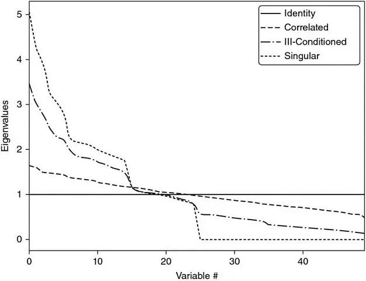

**图 16.1** Visualization of
Markowitz\'s curse\

A diagonal correlation matrix has the lowest condition number. As we add
correlated investments, the maximum eigenvalue is greater and the
minimum eigenvalue is lower. The condition number rises quickly, leading
to unstable inverse correlation matrices. At some point, the benefits of
diversification are more than offset by estimation errors.

Increasing the size of the covariance matrix will only make matters
worse, as each covariance coefficient is estimated with fewer degrees of
freedom. In general, we need at least
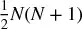 [independent
and identically distributed (IID) observations in order to estimate a
covariance matrix of size] *N* [that is not singular.
For example, estimating an invertible covariance matrix of size 50
requires, at the very least, 5 years of daily IID data. As most
investors know, correlation structures do not remain invariant over such
long periods by any reasonable confidence level. The severity of these
challenges is epitomized by the fact that even naïve (equally-weighted)
portfolios have been shown to beat mean-variance and risk-based
optimization out-of-sample (De Miguel et al.
2009]).

## 16.4 从几何到层次关系
These instability concerns have received substantial attention in
recent years, as Kolm et al. [2014] have carefully documented. Most
alternatives attempt to achieve robustness by incorporating additional
constraints (Clarke et al. [2002]), introducing Bayesian priors (Black
and Litterman [1992]), or improving the numerical stability of the
covariance matrix\'s inverse (Ledoit and Wolf
2003]).

All the methods discussed so far, although published in recent years,
are derived from (very) classical areas of mathematics: geometry, linear
algebra, and calculus. A correlation matrix is a linear algebra object
that measures the cosines of the angles between any two vectors in the
vector space formed by the returns series (see Calkin and López de Prado
2014a, 2015b]). One reason for the instability of quadratic
optimizers is that the vector space is modelled as a complete (fully
connected) graph, where every node is a potential candidate to
substitute another. In algorithmic terms, inverting the matrix means
evaluating the partial correlations across the complete
graph.]  Figure
16.2 [(a) visualizes the
relationships implied by a covariance matrix of 50 × 50, that is 50
nodes and 1225 edges. This complex structure magnifies small estimation
errors, leading to incorrect solutions. Intuitively, it would be
desirable to drop unnecessary edges.

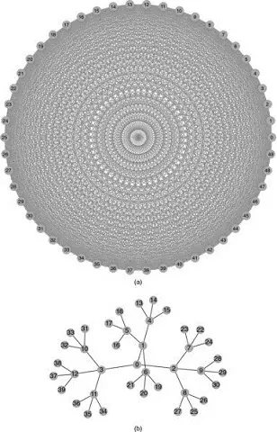

**图 16.2** The complete-graph
(top) and the tree-graph (bottom) structures\

Correlation matrices can be represented as complete graphs, which lack
the notion of hierarchy: Each investment is substitutable with another.
In contrast, tree structures incorporate hierarchical relationships.

Let us consider for a moment the practical implications of such a
topological structure. Suppose that an investor wishes to build a
diversified portfolio of securities, including hundreds of stocks,
bonds, hedge funds, real estate, private placements, etc. Some
investments seem closer substitutes of one another, and other
investments seem complementary to one another. For example, stocks could
be grouped in terms of liquidity, size, industry, and region, where
stocks within a given group compete for allocations. In deciding the
allocation to a large publicly traded U.S. financial stock like J. P.
Morgan, we will consider adding or reducing the allocation to another
large publicly traded U.S. bank like Goldman Sachs, rather than a small
community bank in Switzerland, or a real estate holding in the
Caribbean. Yet, to a correlation matrix, all investments are potential
substitutes to one another. In other words, correlation matrices lack
the notion of] *hierarchy.* [This lack of
hierarchical structure allows weights to vary freely in unintended ways,
which is a root cause of CLA\'s instability.] Figure
16.2 [(b) visualizes a hierarchical
structure known as a tree. A tree structure introduces two desirable
features: (1) It has only] *N* [− 1 edges to
connect] *N* [nodes, so the weights only rebalance
among peers at various hierarchical levels; and (2) the weights are
distributed top-down, consistent with how many asset managers build
their portfolios (e.g., from asset class to sectors to individual
securities). For these reasons, hierarchical structures are better
designed to give not only stable but also intuitive
results.

In this chapter we will study a new portfolio construction method that
addresses CLA\'s pitfalls using modern mathematics: graph theory and
machine learning. This Hierarchical Risk Parity method uses the
information contained in the covariance matrix without requiring its
inversion or positive-definitiveness. HRP can even compute a portfolio
based on a singular covariance matrix. The algorithm operates in three
stages: tree clustering, quasi-diagonalization, and recursive
bisection.

### 16.4.1 Tree Clustering

Consider a] *TxN* matrix of
observations *X* [, such as returns series
of] *N* variables over *T*
periods. We would like to combine these] *N*
column-vectors into a hierarchical structure of clusters, so that
allocations can flow downstream through a tree
graph.

First, we compute an] *NxN* [correlation matrix with
entries ρ = {ρ ~[*i*\ ,\ *j*]~}
~[*i*\ ,\ *j*\ =\ 1,\ ...,\ *N*]~ , where ρ
~[*i*\ ,\ *j*]~ = ρ[] *X ~[*i*]~*
,] *X ~[*j*]~* []. We define the distance
measure] 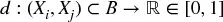 [,
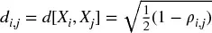 [,
where] *B* [is the Cartesian product of items in  *i* [, ...,] *N* [}. This
allows us to compute an] *NxN* distance
matrix *D* [=  *d
~[*i*\ ,\ *j*]~* [} ~[*i*\ ,\ *j*\ =\ 1,\ ...,\ *N*]~ .
Matrix] *D* [is a proper metric space (see Appendix
16.A.1 for a proof), in the sense that] *d*
[] *x* [,] *y* [] ≥ 0
(non-negativity),] *d* [[] *x*
,] *y* [] = 0⇔] *X*
=] *Y* [(coincidence),] *d*
[] *x* [,] *y* [
=] *d* [[] *Y*
,] *X* [] (symmetry), and] *d*
[] *X* [,] *Z* [
≤] *d* [[] *x*
,] *y* [] +] *d*
[] *Y* [,] *Z* [
(sub-additivity). See Example 16.1.

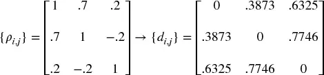

**Example 16.1 Encoding a correlation matrix** ***ρ*** **as a distance
matrix** ***D***

Second, we compute the Euclidean distance between any two
column-vectors of] *D* [,
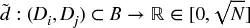
,] 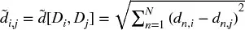 [. Note the difference between distance
metrics] *d ~[*i*\ ,\ *j*]~*
and]  [. Whereas] *d ~[*i*\ ,\ *j*]~*
is defined on column-vectors of] *X*
,]  is defined on column-vectors of *D* [(a
distance of distances). Therefore,
 is a
distance defined over the entire metric space *D* [,
as each] 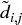 [is a function of the entire correlation matrix
(rather than a particular cross-correlation pair). See
Example 16.2.

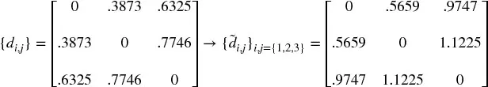

**Example 16.2 Euclidean distance of correlation distances**

Third, we cluster together the pair of columns (
*i* [*,] *j* [*) such that
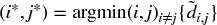 [, and
denote this cluster as] *u* [[1]. See
Example 16.3.

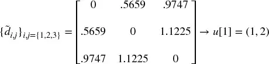

**Example 16.3 Clustering items**

Fourth, we need to define the distance between a newly formed
cluster] *u* [[1] and the single (unclustered)
items, so that]  [may be updated. In hierarchical clustering
analysis, this is known as the "linkage criterion." For example, we can
define the distance between an item] *i*
of] 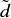 and the new cluster *u* [[1
as] 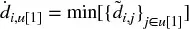 [(the nearest point algorithm). See
Example 16.4.

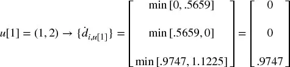

**Example 16.4 Updating matrix** 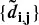 **with the new cluster** ***u***

Fifth, matrix] 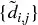 [is updated by appending
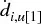 and dropping
the clustered columns and rows *j*
∈] *u* [[1]. See Example 16.5.

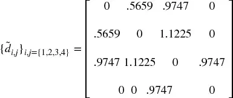

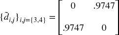

**Example 16.5 Updating matrix**  **with the new cluster** ***u***

Sixth, applied recursively, steps 3, 4, and 5 allow us to
append] *N* [− 1 such clusters to
matrix] *D* [, at which point the final cluster
contains all of the original items, and the clustering algorithm stops.
See Example 16.6.

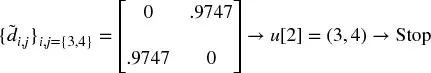

**Example 16.6 Recursion in search of remaining clusters**

图 16.3 [displays the clusters
formed at each iteration for this example, as well as the
distances] 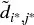 [that triggered every cluster (third step). This
procedure can be applied to a wide array of distance
metrics] *d ~[*i*\ ,\ *j*]~*
,]  and 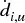 [, beyond those illustrated in this chapter. See
Rokach and Maimon [2005] for alternative metrics, the discussion on
Fiedler\'s vector and Stewart\'s spectral clustering method in Brualdi
2010], as well as algorithms in the scipy
library.^\ [2]^
代码片段 16.1 provides an example of tree clustering using scipy
functionality.

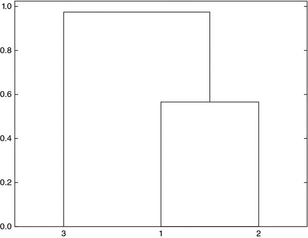

**图 16.3** Sequence of cluster
formation\

A tree structure derived from our numerical example, here plotted as a
dendogram. The y-axis measures the distance between the two merging
leaves.

> **SNIPPET 16.1 TREE CLUSTERING USING SCIPY FUNCTIONALITY**

> 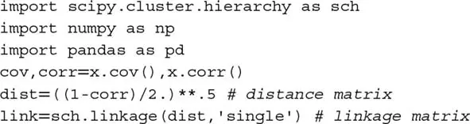

This stage allows us to define a linkage matrix as an
(] *N* [− 1)] *x* [4 matrix with
structure] *Y* [=  *y
~[*m*\ ,\ 1]~* [,] *y ~[*m*\ ,\ 2]~*
,] *y ~[*m*\ ,\ 3]~* [,
*y ~[*m*\ ,\ 4]~* [)} ~[*m*\ =\ 1,\ ...,\ *N*\ −\ 1]~
(i.e., with one 4-tuple per cluster). Items (] *y
~[*m*\ ,\ 1]~* [,] *y ~[*m*\ ,\ 2]~*
) report the constituents. Item] *y
~[*m*\ ,\ 3]~* [reports the distance between
*y ~[*m*\ ,\ 1]~* and *y
~[*m*\ ,\ 2]~* [, that is
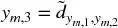 [.
Item] *y ~[*m*\ ,\ 4]~*
≤] *N* [reports the number of original items
included in cluster] *m* [.

### 16.4.2 Quasi-Diagonalization

This stage reorganizes the rows and columns of the covariance matrix,
so that the largest values lie along the diagonal. This
quasi-diagonalization of the covariance matrix (without requiring a
change of basis) renders a useful property: Similar investments are
placed together, and dissimilar investments are placed far apart
(see]  Figures
16.5 [and
 16.6 [for an
example). The algorithm works as follows: We know that each row of the
linkage matrix merges two branches into one. We replace clusters in
(] *y ~[*N*\ −\ 1,\ 1]~*
,] *y ~[*N*\ −\ 1,\ 2]~* [) with their
constituents recursively, until no clusters remain. These replacements
preserve the order of the clustering. The output is a sorted list of
original (unclustered) items. This logic is implemented in 代码片段
16.2.

> **SNIPPET 16.2 QUASI-DIAGONALIZATION**

> 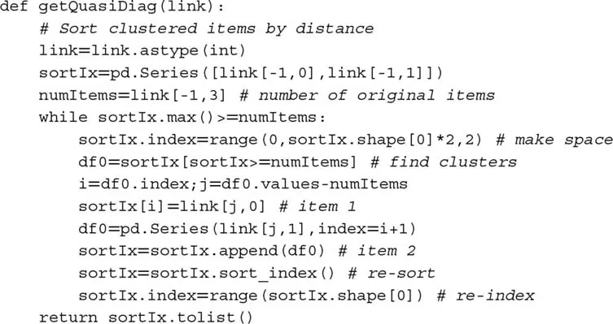

### 16.4.3 Recursive Bisection

Stage 2 has delivered a quasi-diagonal matrix. The inverse-variance
allocation is optimal for a diagonal covariance matrix (see Appendix
16.A.2 for a proof). We can take advantage of these facts in two
different ways: (1) bottom-up, to define the variance of a contiguous
subset as the variance of an inverse-variance allocation; or (2)
top-down, to split allocations between adjacent subsets in inverse
proportion to their aggregated variances. The following algorithm
formalizes this idea:

1.  The algorithm is initialized by:
    1.  setting the list of items: *L* = {*L ~[0]~*}, with *L
        ~[0]~* = {*n*} ~[*n*\ =\ 1,\ ...,\ *N*]~
    2.  assigning a unit weight to all items: *w ~[*n*]~* =
        1, ∀*n* = 1, ..., *N*
2.  If \|*L ~[*i*]~* \| = 1,  ∀*L ~[*i*]~* ∈ *L* , then
    stop.
3.  For each *L ~[*i*]~* ∈ *L* such that \|*L ~[*i*]~*
    \| \> 1:
    1.  bisect *L ~[*i*]~* into two subsets, *L^[(1)]^
        ~[*i*]~* ∪*L ~[*i*]~ ^[(2)]^* = *L
        ~[*i*]~* , where 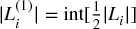 , and the order is preserved
    2.  define the variance of *L^[(\ *j*\ )]^ ~[*i*]~*
        , *j* = 1, 2, as the quadratic form
        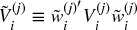 ,
        where *V^[(\ *j*\ )]^ ~[*i*]~* is the
        covariance matrix between the constituents of the *L^[(\ *j*\ )]^ ~[*i*]~* bisection, and
        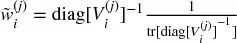 ,
        where diag[.] and tr[.] are the diagonal and trace operators
    3.  compute the split factor: 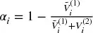 , so that 0 ≤ α ~[*i*]~ ≤ 14.  re-scale allocations *w ~[*n*]~* by a factor of α
        ~[*i*]~ , ∀*n* ∈ *L^[(1)]^ ~[*i*]~*
    5.  re-scale allocations *w ~[*n*]~* by a factor of (1 − α
        ~[*i*]~ ), ∀*n* ∈ *L^[(2)]^ ~[*i*]~*
4.  Loop to step 2

Step 3b takes advantage of the quasi-diagonalization bottom-up, because
it defines the variance of the partition] *L^[(\ *j*\ )]^ ~[*i*]~* using inverse-variance
weightings 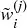 [. Step 3c takes advantage of the
quasi-diagonalization top-down, because it splits the weight in inverse
proportion to the cluster\'s variance. This algorithm guarantees that 0
≤] *w ~[*i*]~* [≤ 1, ∀
*i* [= 1, ...,] *N* [, and
 [, because at
each iteration we are splitting the weights received from higher
hierarchical levels. Constraints can be easily introduced in this stage,
by replacing the equations in steps 3c, 3d, and 3e according to the
user\'s preferences. Stage 3 is implemented in 代码片段
16.3.

> **SNIPPET 16.3 RECURSIVE BISECTION**

> 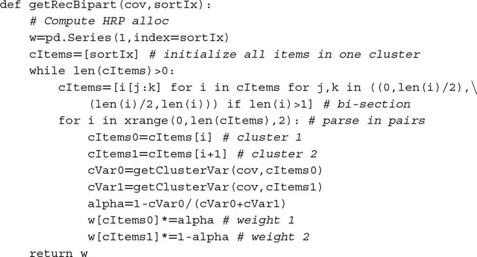

This concludes a first description of the HRP 算法, which solves
the allocation problem in best-case deterministic logarithmic
time,] 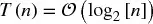 [, and worst-case deterministic linear
time,] 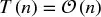 [. Next, we will put to practice what we have learned, and
evaluate the method\'s accuracy out-of-sample.

## 16.5 数值示例
We begin by simulating a matrix of observations] *X*
, of order (10000] *x* [10). The correlation matrix
is visualized in]  Figure
16.4 as a
heatmap. Figure
16.5 [displays the dendogram of the
resulting clusters (stage 1).] Figure
16.6 [shows the same correlation
matrix, reorganized in blocks according to the identified clusters
(stage 2). Appendix 16.A.3 provides the code used to generate this
numerical example.

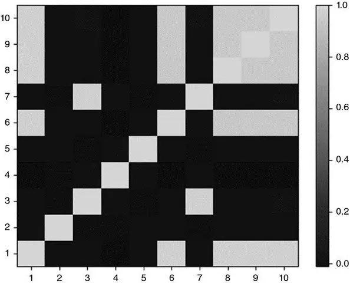

**图 16.4** Heat-map of original
covariance matrix\

This correlation matrix has been computed using function `generateData`
from snippet 16.4 (see Section 16.A.3). The last five columns are
partially correlated to some of the first five series.

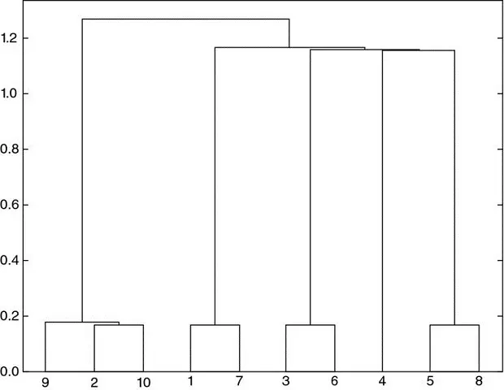

**图 16.5** Dendogram of cluster
formation\

The clustering procedure has correctly identified that series 9 and 10
were perturbations of series 2, hence (9, 2, 10) are clustered together.
Similarly, 7 is a perturbation of 1, 6 is a perturbation of 3, and 8 is
a perturbation of 5. The only original item that was not perturbated is
4, and that is the one item for which the clustering algorithm found no
similarity.

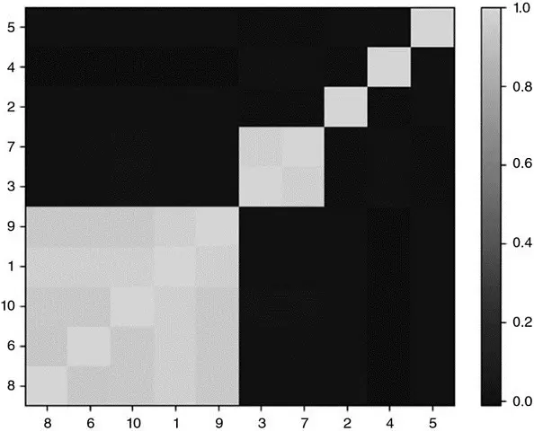

**图 16.6** Clustered covariance
matrix\

Stage 2 quasi-diagonalizes the correlation matrix, in the sense that the
largest values lie along the diagonal. However, unlike PCA or similar
procedures, HRP does not require a change of basis. HRP solves the
allocation problem robustly, while working with the original
investments.

On this random data, we compute HRP\'s allocations (stage 3), and
compare them to the allocations from two competing methodologies: (1)
Quadratic optimization, as represented by CLA\'s minimum-variance
portfolio (the only portfolio of the efficient frontier that does not
depend on returns' means); and (2) traditional risk parity, exemplified
by the Inverse-Variance Portfolio (IVP). See Bailey and López de Prado
2013] for a comprehensive implementation of CLA, and Appendix 16.A.2
for a derivation of IVP. We apply the standard constraints that 0
≤] *w ~[*i*]~* [≤ 1 (non-negativity),
∀] *i* [= 1, ...,] *N* [,
and] 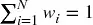 [(full investment). Incidentally, the condition number for
the covariance matrix in this example is only 150.9324, not particularly
high and therefore not unfavorable to CLA.

From the allocations in] 表 16.1 [, we can appreciate a
few stylized features: First, CLA concentrates 92.66% of the allocation
on the top-5 holdings, while HRP concentrates only 62.57%. Second, CLA
assigns zero weight to 3 investments (without the 0
≤] *w ~[*i*]~* [constraint, the allocation
would have been negative). Third, HRP seems to find a compromise between
CLA\'s concentrated solution and traditional risk parity\'s IVP
allocation. The reader can use the code in Appendix 16.A.3 to verify
that these findings generally hold for alternative random covariance
matrices.

**表 16.1** **A Comparison of
Three Allocations**

  ------------------------------------ --------- --------- ---------
   **Weight \#**   **CLA**   **HRP**   **IVP**
         [1]         14.44%     7.00%    10.36%
         [2]         19.93%     7.59%    10.28%
         [3]         19.73%    10.84%    10.36%
         [4]         19.87%    19.03%    10.25%
         [5]         18.68%     9.72%    10.31%
         [6]          0.00%    10.19%     9.74%
         [7]          5.86%     6.62%     9.80%
         [8]          1.49%     9.10%     9.65%
         [9]          0.00%     7.12%     9.64%
        [10]          0.00%    12.79%     9.61%
  ------------------------------------ --------- --------- ---------

A characteristic outcome of the three methods studied: CLA concentrates
weights on a few investments, hence becoming exposed to idiosyncratic
shocks. IVP evenly spreads weights through all investments, ignoring the
correlation structure. This makes it vulnerable to systemic shocks. HRP
finds a compromise between diversifying across all investments and
diversifying across cluster, which makes it more resilient against both
types of shocks.

What drives CLA\'s extreme concentration is its goal of minimizing the
portfolio\'s risk. And yet both portfolios have a very similar standard
deviation (σ ~[*HRP*]~ = 0.4640, σ ~[*CLA*]~ = 0.4486).
So CLA has discarded half of the investment universe in favor of a minor
risk reduction. The reality of course is that CLA\'s portfolio is
deceitfully diversified, because any distress situation affecting the
top-5 allocations will have a much greater negative impact on CLA\'s
than on HRP\'s portfolio.

## 16.6 样本外蒙特卡洛模拟
In our numerical example, CLA\'s portfolio has lower risk than HRP\'s
in-sample. However, the portfolio with minimum variance in-sample is not
necessarily the one with minimum variance out-of-sample. It would be all
too easy for us to pick a particular historical dataset where HRP
outperforms CLA and IVP (see Bailey and López de Prado [2014], and
recall our discussion of selection bias in [第 11 章](ch11.md)). Instead, in this
section we follow the backtesting paradigm explained in [第 13 章](ch13.md), and
evaluate via Monte Carlo the performance out-of-sample of HRP against
CLA\'s minimum-variance and traditional risk parity\'s IVP allocations.
This will also help us understand what features make a method preferable
to the rest, regardless of anecdotal
counter-examples.

First, we generate 10 series of random Gaussian returns (520
observations, equivalent to 2 years of daily history), with 0 mean and
an arbitrary standard deviation of 10%. Real prices exhibit frequent
jumps (Merton [1976]) and returns are not cross-sectionally
independent, so we must add random shocks and a random correlation
structure to our generated data. Second, we compute HRP, CLA, and IVP
portfolios by looking back at 260 observations (a year of daily
history). These portfolios are re-estimated and rebalanced every 22
observations (equivalent to a monthly frequency). Third, we compute the
out-of-sample returns associated with those three portfolios. This
procedure is repeated 10,000 times.

All mean portfolio returns out-of-sample are essentially 0, as
expected. The critical difference comes from the variance of the
out-of-sample portfolio returns: σ ^[2]^ ~[*CLA*]~ =
0.1157, σ ^[2]^ ~[*IVP*]~ = 0.0928, and σ ^[2]^
~[*HRP*]~ = 0.0671] *.* [Although CLA\'s goal
is to deliver the lowest variance (that is the objective of its
optimization program), its performance happens to exhibit the highest
variance out-of-sample, and 72.47% greater variance than HRP\'s. This
experimental finding is consistent with the historical evidence in De
Miguel et al. [2009]. In other words, HRP would improve the
out-of-sample Sharpe ratio of a CLA strategy by about 31.3%, a rather
significant boost. Assuming that the covariance matrix is diagonal
brings some stability to the IVP; however, its variance is still 38.24%
greater than HRP\'s. This variance reduction out-of-sample is critically
important to risk parity investors, given their use of substantial
leverage. See Bailey et al. [2014] for a broader discussion of
in-sample vs. out-of-sample performance.

The mathematical proof for HRP\'s outperformance over Markowitz\'s CLA
and traditional risk parity\'s IVP is somewhat involved and beyond the
scope of this chapter. In intuitive terms, we can understand the above
empirical results as follows: Shocks affecting a specific investment
penalize CLA\'s concentration. Shocks involving several correlated
investments penalize IVP\'s ignorance of the correlation structure. HRP
provides better protection against both common and idiosyncratic shocks
by finding a compromise between diversification across all investments
and diversification across clusters of investments at multiple
hierarchical levels.]  Figure
16.7 [plots the time series of
allocations for the first of the 10,000 runs.

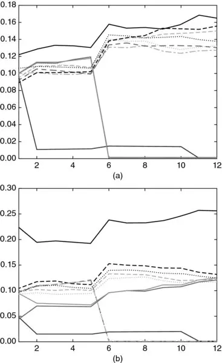

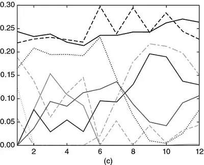

**图 16.7** (a) Time series of
allocations for IVP.\

Between the first and second rebalance, one investment receives an
idiosyncratic shock, which increases its variance. IVP\'s response is to
reduce the allocation to that investment, and spread that former
exposure across all other investments. Between the fifth and sixth
rebalance, two investments are affected by a common shock. IVP\'s
response is the same. As a result, allocations among the seven
unaffected investments grow over time, regardless of their correlation.\

(b) Time series of allocations for HRP\

HRP\'s response to the idiosyncratic shock is to reduce the allocation
to the affected investment, and use that reduced amount to increase the
allocation to a correlated investment that was unaffected. As a response
to the common shock, HRP reduces allocation to the affected investments
and increases allocation to uncorrelated ones (with lower variance).\

(c) Time series of allocations for CLA\

CLA allocations respond erratically to idiosyncratic and common shocks.
If we had taken into account rebalancing costs, CLA\'s performance would
have been very negative.

Appendix 16.A.4 provides the Python code that implements the above
study. The reader can experiment with different parameter configurations
and reach similar conclusions. In particular, HRP\'s out-of-sample
outperformance becomes even more substantial for larger investment
universes, or when more shocks are added, or a stronger correlation
structure is considered, or rebalancing costs are taken into account.
Each of these CLA rebalances incurs transaction costs that can
accumulate into prohibitive losses over time.

## 16.7 进一步研究
The methodology introduced in this chapter is flexible, scalable and
admits multiple variations of the same ideas. Using the code provided,
readers can research and evaluate what HRP configurations work best for
their particular problem. For example, at stage 1 they can apply
alternative definitions of] *d
~[*i*\ ,\ *j*]~* [,

and]  [, or different clustering algorithms, like biclustering; at
stage 3, they can use different functions for
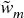 [and α, or
alternative allocation constraints. Instead of carrying out a recursive
bisection, stage 3 could also split allocations top-down using the
clusters from stage 1.

It is relatively straightforward to incorporate forecasted returns,
Ledoit-Wolf shrinkage, and Black-Litterman--style views to this
hierarchical approach. In fact, the inquisitive reader may have realized
that, at its core, HRP is essentially a robust procedure to avoid matrix
inversions, and the same ideas underlying HRP can be used to replace
many econometric regression methods, notorious for their unstable
outputs (like VAR or VECM).] 图 16.8 [displays (a) a large
correlation matrix of fixed income securities before and (b) after
clustering, with over 2.1 million entries. Traditional optimization or
econometric methods fail to recognize the hierarchical structure of
financial Big Data, where the numerical instabilities defeat the
benefits of the analysis, resulting in unreliable and detrimental
outcomes.

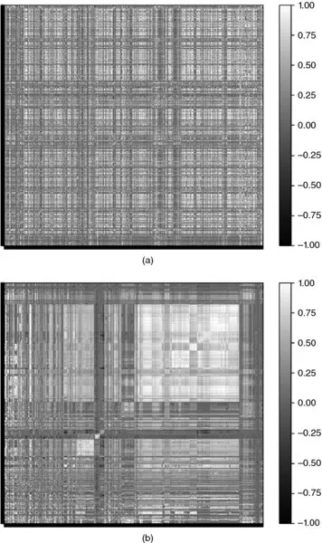

**图 16.8** Correlation matrix
before and after clustering\

The methodology described in this chapter can be applied to problems
beyond optimization. For example, a PCA analysis of a large fixed income
universe suffers the same drawbacks we described for CLA. Small-data
techniques developed decades and centuries ago (factor models,
regression analysis, econometrics) fail to recognize the hierarchical
nature of financial big data.

Kolanovic et al. [2017] conducted a lengthy study of HRP, concluding
that "HRP delivers superior risk-adjusted returns. Whilst both the HRP
and the MV portfolios deliver the highest returns, the HRP portfolios
match with volatility targets much better than MV portfolios. We also
run simulation studies to confirm the robustness of our findings, in
which HRP consistently deliver a superior performance over MV and other
risk-based strategies [...] HRP portfolios are truly diversified with
a higher number of uncorrelated exposures, and less extreme weights and
risk allocations."

Raffinot [2017] concludes that "empirical results indicate that
hierarchical clustering based portfolios are robust, truly diversified
and achieve statistically better risk-adjusted performances than
commonly used portfolio optimization techniques."

## 16.8 结论
Exact analytical solutions can perform much worse than approximate ML
solutions. Although mathematically correct, quadratic optimizers in
general, and Markowitz\'s CLA in particular, are known to deliver
generally unreliable solutions due to their instability, concentration,
and underperformance. The root cause for these issues is that quadratic
optimizers require the inversion of a covariance matrix. Markowitz\'s
curse is that the more correlated investments are, the greater is the
need for a diversified portfolio, and yet the greater are that
portfolio\'s estimation errors.

In this chapter, we have exposed a major source of quadratic
optimizers' instability: A matrix of size] *N* [is
associated with a complete graph with
 [edges. With
so many edges connecting the nodes of the graph, weights are allowed to
rebalance with complete freedom. This lack of hierarchical structure
means that small estimation errors will lead to entirely different
solutions. HRP replaces the covariance structure with a tree structure,
accomplishing three goals: (1) Unlike traditional risk parity methods,
it fully utilizes the information contained in the covariance matrix,
2. weights' stability is recovered and (3) the solution is intuitive by
construction. The algorithm converges in deterministic logarithmic (best
case) or linear (worst case) time.

HRP is robust, visual, and flexible, allowing the user to introduce
constraints or manipulate the tree structure without compromising the
algorithm\'s search. These properties are derived from the fact that HRP
does not require covariance invertibility. Indeed, HRP can compute a
portfolio on an ill-degenerated or even a singular covariance
matrix.

This chapter focuses on a portfolio construction application; however,
the reader will find other practical uses for making decisions under
uncertainty, particularly in the presence of a nearly singular
covariance matrix: capital allocation to portfolio managers, allocations
across algorithmic strategies, bagging and boosting of machine learning
signals, forecasts from random forests, replacement to unstable
econometric models (VAR, VECM), etc.

Of course, quadratic optimizers like CLA produce the minimum-variance
portfolio in-sample (that is its objective function). Monte Carlo
experiments show that HRP delivers lower out-of-sample variance than CLA
or traditional risk parity methods (IVP). Since Bridgewater pioneered
risk parity in the 1990s, some of the largest asset managers have
launched funds that follow this approach, for combined assets in excess
of \$500 billion. Given their extensive use of leverage, these funds
should benefit from adopting a more stable risk parity allocation
method, thus achieving superior risk-adjusted returns and lower
rebalance costs.

## APPENDICES

**16.A.1 Correlation-based Metric**

Consider two real-valued vectors] *X*
,] *Y* of size *T* [, and a
correlation variable ρ[] *x* [,
*y* [], with the only requirement that σ[] *x*
,] *y* [] = ρ[] *x*
,] *y* []σ[] *X*
]σ[] *Y* [], where σ[] *x*
,] *y* [] is the covariance between the two
vectors, and σ[.] is the standard deviation. Note that Pearson\'s is
not the only correlation to satisfy these
requirements.

Let us prove that
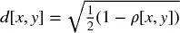 [is a true
metric. First, the Euclidean distance between the two vectors
is] 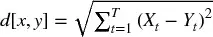 [. Second, we z-standardize those vectors
as] 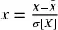 [,] 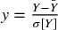 [. Consequently, 0 ≤ ρ[] *x*
,] *y* [] = ρ[] *x*
,] *y* []. Third, we derive the Euclidean
distance] *d* [[] *x*
,] *y* [] as,

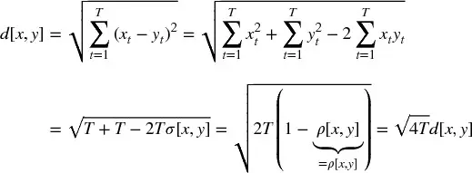

In other words, the distance] *d*
[] *x* [,] *y* [] is a linear
multiple of the Euclidean distance between the vectors
 *X* [,] *Y* [} after
z-standardization, hence it inherits the true-metric properties of the
Euclidean distance.

Similarly, we can prove that
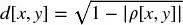 [descends to
a true metric on the
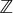
/2]  quotient. In order to do that, we
redefine  [, where sgn[.] is the sign operator, so that
0 ≤ ρ[] *x* [,] *y* [] =
\|ρ[] *x* [,] *y* []\|.
Then,

**16.A.2 Inverse Variance Allocation**

Stage 3 (see Section 16.4.3) splits a weight in inverse proportion to
the subset\'s variance. We now prove that such allocation is optimal
when the covariance matrix is diagonal. Consider the standard quadratic
optimization problem of size] *N*
,

with solution]  [. For the characteristic
vector] *a* [= 1 ~[*N*]~ , the solution is
the minimum variance portfolio. If] *V* is
diagonal,  [. In the particular case
of] *N* [= 2,
 [, which is
how stage 3 splits a weight between two bisections of a
subset.

**16.A.3 Reproducing the Numerical Example**

代码片段 16.4 can be used to reproduce our results and simulate
additional numerical examples. Function
`generateData` produces a matrix of time series where a
number `size0` of vectors are uncorrelated, and a
number `size1` [of vectors are correlated. The
reader can change the] `np.random.seed`
in] `generateData` [to run alternative examples and
gain an intuition of how HRP works. Scipy\'s
function] `linkage` [can be used to perform stage 1
(Section 16.4.1), function] `getQuasiDiag` [performs
stage 2 (Section 16.4.2), and function
`getRecBipart` [carries out stage 3 (Section
16.4.3).

> **SNIPPET 16.4 FULL IMPLEMENTATION OF THE HRP ALGORITHM**

> 
> 
> 

**16.A.4 Reproducing the Monte Carlo Experiment**

代码片段 16.5 implements Monte Carlo experiments on three allocation
methods: HRP, CLA, and IVP. All libraries are standard except for HRP,
which is provided in Appendix 16.A.3, and CLA, which can be found in
Bailey and López de Prado [2013]. The subroutine
`generateData` [simulates the correlated data, with two types of random
shocks: common to various investments and specific to a single
investment. There are two shocks of each type, one positive and one
negative. The variables for the experiments are set as arguments
of] `hrpMC` [. They were chosen arbitrarily, and the
user can experiment with alternative combinations.

> **SNIPPET 16.5 MONTE CARLO EXPERIMENT ON HRP OUT-OF-SAMPLE
> PERFORMANCE**

> 
> 
> 

## 练习题

1.  Given the PnL series on *N* [investment
    > > strategies:

    :::
    :::

    1.  Align them to the average frequency of their bets (e.g., weekly
        observations for strategies that trade on a weekly basis). Hint:
        This kind of data alignment is sometimes called "downsampling."
    2.  Compute the covariance of their returns, *V.*
    3.  Identify the hierarchical clusters among the *N* strategies.
    4.  Plot the clustered correlation matrix of the *N* strategies.

2.  Using the clustered covariance matrix *V* [from
    > > exercise 1:

    :::
    :::

    1.  Compute the HRP allocations.
    2.  Compute the CLA allocations.
    3.  Compute the IVP allocations.

3.  Using the covariance matrix *V* [from exercise
    > > 1:

    :::
    :::

    1.  Perform a spectral decomposition: *VW* = *W* Λ.
    2.  Form an array ϵ by drawing *N* random numbers from a *U* [0,
        1] distribution.
    3.  Form an *NxN* matrix  , where
         ,
        *n* = 1, ..., *N* .
    4.  Compute  .
    5.  Repeat exercise 2, this time using
         as
        covariance matrix. What allocation method has been most impacted
        by the re-scaling of spectral variances?

4.  [How would you modify the HRP algorithm to produce allocations that
    > > add up to 0, where \|] *w ~[*n*]~*
    > > [\| ≤ 1, ∀] *n* [= 1,
    > > ...,] *N* [?

5.  [Can you think of an easy way to incorporate expected returns in the
    > > HRP allocations?

## 参考文献

1.  Bailey, D. and M. López de Prado (2012): "Balanced baskets: A new
    approach to trading and hedging risks." *Journal of Investment
    Strategies* , Vol. 1, No. 4, pp. 21--62. Available at
    <http://ssrn.com/abstract=2066170> .
2.  Bailey, D. and M. López de Prado (2013): "An open-source
    implementation of the critical-line algorithm for portfolio
    optimization." *Algorithms* , Vol. 6, No. 1, pp. 169--196. Available
    at <http://ssrn.com/abstract=2197616> .
3.  Bailey, D., J. Borwein, M. López de Prado, and J. Zhu (2014)
    "Pseudo-mathematics and financial charlatanism: The effects of
    backtest overfitting on out-of-sample performance." *Notices of the
    American Mathematical Society* , Vol. 61, No. 5, pp. 458--471.
    Available at <http://ssrn.com/abstract=2308659> .
4.  Bailey, D. and M. López de Prado (2014): "The deflated Sharpe ratio:
    Correcting for selection bias, backtest overfitting and
    non-normality." *Journal of Portfolio Management* , Vol. 40, No. 5,
    pp. 94--107.
5.  Black, F. and R. Litterman (1992): "Global portfolio optimization."
    *Financial Analysts Journal* , Vol. 48, pp. 28--43.
6.  Brualdi, R. (2010): "The mutually beneficial relationship of graphs
    and matrices." Conference Board of the Mathematical Sciences,
    Regional Conference Series in Mathematics, Nr. 115.
7.  Calkin, N. and M. López de Prado (2014): "Stochastic flow diagrams."
    *Algorithmic Finance* , Vol. 3, No. 1, pp. 21--42. Availble at
    <http://ssrn.com/abstract=2379314> .
8.  Calkin, N. and M. López de Prado (2014): "The topology of macro
    financial flows: An application of stochastic flow diagrams."
    *Algorithmic Finance* , Vol. 3, No. 1, pp. 43--85. Available at
    <http://ssrn.com/abstract=2379319> .
9.  Clarke, R., H. De Silva, and S. Thorley (2002): "Portfolio
    constraints and the fundamental law of active management."
    *Financial Analysts Journal* , Vol. 58, pp. 48--66.
10. De Miguel, V., L. Garlappi, and R. Uppal (2009): "Optimal versus
    naive diversification: How inefficient is the 1/N portfolio
    strategy?" *Review of Financial Studies* , Vol. 22, pp. 1915--1953.
11. Jurczenko, E. (2015): *Risk-Based and Factor Investing* , 1st ed.
    Elsevier Science.
12. Kolanovic, M., A. Lau, T. Lee, and R. Krishnamachari (2017): "Cross
    asset portfolios of tradable risk premia indices. Hierarchical risk
    parity: Enhancing returns at target volatility." White paper, Global
    Quantitative & Derivatives Strategy. J.P. Morgan, April 26.
13. Kolm, P., R. Tutuncu and F. Fabozzi (2014): "60 years of portfolio
    optimization." *European Journal of Operational Research* , Vol.
    234, No. 2, pp. 356--371.
14. Kuhn, H. W. and A. W. Tucker (1951): "Nonlinear programming."
    Proceedings of 2nd Berkeley Symposium. Berkeley, University of
    California Press, pp. 481--492.
15. Markowitz, H. (1952): "Portfolio selection." *Journal of Finance* ,
    Vol. 7, pp. 77--91.
16. Merton, R. (1976): "Option pricing when underlying stock returns are
    discontinuous." *Journal of Financial Economics* , Vol. 3, pp.
    125--144.
17. Michaud, R. (1998): *Efficient Asset Allocation: A Practical Guide
    to Stock Portfolio Optimization and Asset Allocation* , 1st ed.
    Harvard Business School Press.
18. Ledoit, O. and M. Wolf (2003): "Improved estimation of the
    covariance matrix of stock returns with an application to portfolio
    selection." *Journal of Empirical Finance* , Vol. 10, No. 5, pp.
    603--621.
19. Raffinot, T. (2017): "Hierarchical clustering based asset
    allocation." *Journal of Portfolio Management* , forthcoming.
20. Rokach, L. and O. Maimon (2005): "Clustering methods," in Rokach, L.
    and O. Maimon, eds., *Data Mining and Knowledge Discovery Handbook*
    . Springer, pp. 321--352.

## 注释

^\ [1]^
   A short version of this chapter appeared in the *Journal of Portfolio
Management,* Vo1. 42, No. 4, pp. 59--69, Summer of 2016.

^\ [2]^
   For additional metrics see:

-   <http://docs.scipy.org/doc/scipy/reference/generated/scipy.spatial.distance.pdist.html>
-   <http://docs.scipy.org/doc/scipy-0.16.0/reference/generated/scipy.cluster.hierarchy.linkage.html>

**PART 4**\

**Useful Financial Features**

