# 结构性突变

## 17.1 动机
在开发基于 ML 的投资策略时，我们通常希望在多种因素汇聚、其预测结果提供了
favorable risk-adjusted return. Structural breaks, like the transition
from one market regime to another, is one example of such a confluence
that is of particular interest. For instance, a mean-reverting pattern
may give way to a momentum pattern. As this transition takes place, most
market participants are caught off guard, and they will make costly
mistakes. This sort of errors is the basis for many profitable
strategies, because the actors on the losing side will typically become
aware of their mistake once it is too late. Before they accept their
losses, they will act irrationally, try to hold the position, and hope
for a comeback. Sometimes they will even increase a losing position, in
desperation. Eventually they will be forced to stop loss or stop out.
Structural breaks offer some of the best risk/rewards. In this chapter,
we will review some methods that measure the likelihood of structural
breaks, so that informative features can be built upon
them.

## 17.2 结构性突变检验的类型
我们可以将结构性突变检验分为两大类：

-   **CUSUM tests:** 这些检验累计预测
    errors significantly deviate from white noise.
-   **Explosiveness tests:** Beyond deviation from white noise, these
    test whether the process exhibits exponential growth or collapse, as
    this is inconsistent with a random walk or stationary process, and
    it is unsustainable in the long run.

    :::
    :::

    -   **Right-tail unit-root tests:** These tests evaluate the
        presence of exponential growth or collapse, while assuming an
        autoregressive specification.
    -   **Sub/super-martingale tests:** These tests evaluate the
        presence of exponential growth or collapse under a variety of
        functional forms.

## 17.3 CUSUM 检验
在[第 2 章](ch02.md)中，我们介绍了 CUSUM 滤波器， which we applied in the
context of event-based sampling of bars. The idea was to sample a bar
whenever some variable, like cumulative prediction errors, exceeded a
predefined threshold. This concept can be further extended to test for
structural breaks.

### 17.3.1 Brown-Durbin-Evans CUSUM Test on Recursive Residuals

This test was proposed by Brown, Durbin and Evans [1975]. Let us
assume that at every observation] *t* [= 1,
...,] *T* [, we count with an array of
features] *x ~[*t*]~* predictive of a
value *y ~[*t*]~* [.
Matrix] *X ~[*t*]~* is composed of the time
series of features *t* [≤] *T* [,
 *x ~[*i*]~* [}
~[*i*\ =\ 1,\ ...,\ *t*]~ . These authors propose that we
compute recursive least squares (RLS) estimates of β, based on the
specification

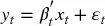

which is fit on subsamples ([1,] *k* [+ 1],
1,] *k* [+ 2], ..., [1,] *T*
]), giving] *T* [−] *k* least
squares estimates 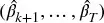 [. We can compute the standardized 1-step ahead
recursive residuals as

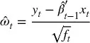

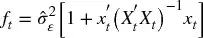

The CUSUM statistic is defined as

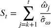

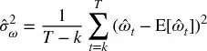

Under the null hypothesis that β is some constant
value,] *H ~[0]~* [: β ~[*t*]~ = β,
then] *S ~[*t*]~* [∼] *N*
[0,] *t* [−] *k* [− 1]. One
caveat of this procedure is that the starting point is chosen
arbitrarily, and results may be inconsistent due to
that.

### 17.3.2 Chu-Stinchcombe-White CUSUM Test on Levels

This test follows Homm and Breitung [2012]. It simplifies the
previous method by dropping  *x ~[*t*]~* [}
~[*t*\ =\ 1,\ ...,\ *T*]~ , and assuming
that] *H ~[0]~* [: β ~[*t*]~ = 0,
that is, we forecast no change (E ~[*t*\ −\ 1]~
Δ] *y ~[*t*]~* [] = 0). This will allow us
to work directly with] *y ~[*t*]~* [levels,
hence reducing the computational burden. We compute the standardized
departure of log-price] *y ~[*t*]~* relative
to the log-price at *y ~[*n*]~*
,] *t* [\>] *n* [,
as

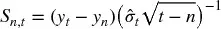

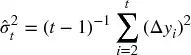

Under the null hypothesis] *H ~[0]~* [: β
~[*t*]~ = 0, then] *S
~[*n*\ ,\ *t*]~* [∼] *N* [[0, 1]. The
time-dependent critical value for the] *one-sided
test* [is

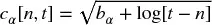

These authors derived via Monte Carlo that] *b
~[0.05]~* [= 4.6. One disadvantage of this method is that the
reference level] *y ~[*n*]~* [is set somewhat
arbitrarily. To overcome this pitfall, we could
estimate] *S ~[*n*\ ,\ *t*]~* on a series of
backward-shifting windows *n* [∈
1,] *t* [], and pick
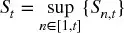
.

## 17.4 爆炸性检验
Explosiveness tests can be generally divided between those that test
for one bubble and those that test for multiple bubbles. In this
context, bubbles are not limited to price rallies, but they also include
sell-offs. Tests that allow for multiple bubbles are more robust in the
sense that a cycle of bubble-burst-bubble will make the series appear to
be stationary to single-bubble tests. Maddala and Kim [1998], and
Breitung [2014] offer good overviews of the
literature.

### 17.4.1 Chow-Type Dickey-Fuller Test

A family of explosiveness tests was inspired by the work of Gregory
Chow, starting with Chow [1960]. Consider the first order
autoregressive process

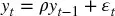

where ϵ ~[*t*]~ is white noise. The null hypothesis is
that] *y ~[*t*]~* follows a random
walk, *H ~[0]~* [: ρ = 1, and the
alternative hypothesis is that] *y ~[*t*]~*
starts as a random walk but changes at time τ*] *T*
, where τ* ∈ (0, 1), into an explosive process:

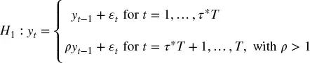

At time] *T* [we can test for a switch (from random
walk to explosive process) having taken place at time
τ*] *T* [(break date). In order to test this
hypothesis, we fit the following specification,

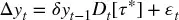

where] *D ~[*t*]~* [[τ*] is a dummy
variable that takes zero value if] *t* [\<
τ*] *T* [, and takes the value one
if] *t* [≥ τ*] *T* [. Then, the
null hypothesis] *H ~[0]~* [: δ = 0 is tested
against the (one-sided) alternative] *H
~[1]~* [: δ \> 1:

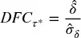

The main drawback of this method is that τ* is unknown. To address
this issue, Andrews [1993] proposed a new test where all possible τ*
are tried, within some interval τ* ∈ [τ ~[0]~ , 1 − τ
~[0]~ ]. As Breitung [2014] explains, we should leave out
some of the possible τ* at the beginning and end of the sample, to
ensure that either regime is fitted with enough observations (there must
be enough zeros and enough ones in] *D
~[*t*]~* [[τ*]). The test statistic for an unknown τ* is the
maximum of all] *T* [(1 − 2τ ~[0]~ ) values
of] 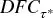 [.

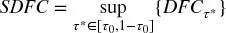

Another drawback of Chow\'s approach is that it assumes that there is
only one break date τ*] *T* [, and that the bubble
runs up to the end of the sample (there is no switch back to a random
walk). For situations where three or more regimes (random walk → bubble
→ random walk ...) exist, we need to discuss the Supremum Augmented
Dickey-Fuler (SADF) test.

### 17.4.2 Supremum Augmented Dickey-Fuller

In the words of Phillips, Wu and Yu [2011], "standard unit root and
cointegration tests are inappropriate tools for detecting bubble
behavior because they cannot effectively distinguish between a
stationary process and a periodically collapsing bubble model. Patterns
of periodically collapsing bubbles in the data look more like data
generated from a unit root or stationary autoregression than a
potentially explosive process." To address this flaw, these authors
propose fitting the regression specification

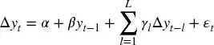

where we test for] *H ~[0]~* [: β ≤
0,] *H ~[1]~* [: β \> 0. Inspired by Andrews
1993], Phillips and Yu [2011] and Phillips, Wu and Yu [2011
proposed the Supremum Augmented Dickey-Fuller test (SADF). SADF fits the
above regression at each end point] *t* [with
backwards expanding start points, then computes

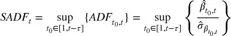

where] 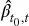 is estimated on a sample that starts
at *t ~[0]~* and ends
at *t* [, τ is the minimum sample length used in the
analysis,] *t ~[0]~* [is the left bound of
the backwards expanding window, and] *t* [= τ,
...,] *T* [. For the estimation
of] *SADF ~[*t*]~* [, the right side of the
window is fixed at] *t* [. The standard ADF test is a
special case of] *SADF ~[*t*]~* [, where τ
=] *t* [− 1.

There are two critical differences between] *SADF
~[*t*]~* and SDFC: First, *SADF
~[*t*]~* is computed at each *t* [∈
τ,] *T* [], whereas SDFC is computed only
at] *T* [. Second, instead of introducing a dummy
variable, SADF recursively expands the beginning of the sample
(] *t ~[0]~* [∈ [1,] *t*
− τ]). By trying all combinations of a nested double loop on
(] *t ~[0]~* [,] *t* [),
SADF does not assume a known number of regime switches or break
dates.]  Figure
17.1 [displays the series of E-mini
S&P 500 futures prices after applying the ETF trick ([第 2 章](ch02.md), Section
2.4.1), as well as the SADF derived from that price series. The SADF
line spikes when prices exhibit a bubble-like behavior, and returns to
low levels when the bubble bursts. In the following sections, we will
discuss some enhancements to Phillips' original SADF
method.

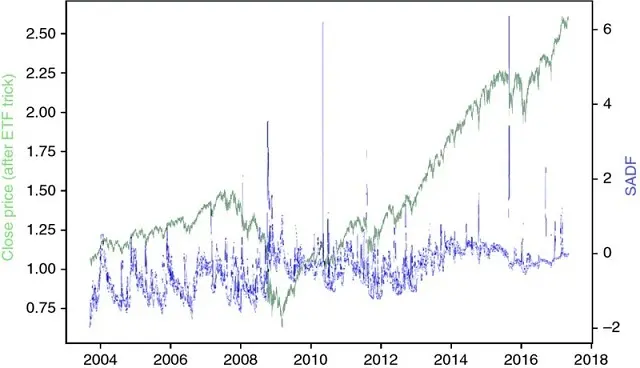

**图 17.1** Prices (left y-axis)
and SADF (right y-axis) over time

***17.4.2.1 Raw vs. Log Prices***

It is common to find in the literature studies that carry out
structural break tests on raw prices. 在本节中我们将 explore
why log prices should be preferred, particularly when working with long
time series involving bubbles and bursts.

For raw prices  *y ~[*t*]~* [}, if ADF\'s
null hypotesis is rejected, it means that prices are stationary, with
finite variance. The implication is that returns
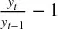 [are not time
invariant, for returns' volatility must decrease as prices rise and
increase as prices fall in order to keep the price variance constant.
When we run ADF on raw prices, we assume that returns' variance is not
invariant to price levels. If returns variance happens to be invariant
to price levels, the model will be structurally
heteroscedastic.

In contrast, if we work with log prices, the ADF specification will
state that

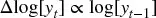

Let us make a change of variable,] *x
~[*t*]~* [=] *ky ~[*t*]~* [. Now,
log[] *x ~[*t*]~* [] =
log[] *k* [] + log[] *y
~[*t*]~* [], and the ADF specification will state
that

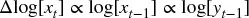

Under this alternative specification based on log prices, price levels
condition returns' mean, not returns' volatility. The difference may not
matter in practice for small samples, where] *k* [≈
1, but SADF runs regressions across decades and bubbles produce levels
that are significantly different between regimes (
*k* [≠ 1).

***17.4.2.2 Computational Complexity***

The algorithm runs in
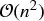 [, as the
number of ADF tests that SADF requires for a total sample
length] *T* [is

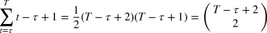

Consider a matrix representation of the ADF specification,
where] 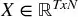 and 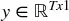 [. Solving a single ADF regression involves the
floating point operations (FLOPs) listed in
 表 17.1
.

**表 17.1** **FLOPs per ADF
Estimate**

  ---------------------------------------------------------------------- ---------------------------------------------
                **Matrix Operation**                       **FLOPs**
                      *o ~[1]~* = *X* \'*y*                                      (2*T* − 1)*N*
                      *o ~[2]~* = *X* \'*X*                               (2*T* − 1)*N^[2]^*
          *o ~[3]~* = *o^[−\ 1]^ ~[2]~*          *N^[3]^* + *N^[2]^* + *N*
          *o ~[4]~* = *o ~[3]~ o ~[1]~*                    2*N^[2]^* − *N*
               *o ~[5]~* = *y* − *Xo ~[4]~*                           *T* + (2*N* − 1)*T*
   *o ~[6]~* = *o^[\']^ ~[5]~ o ~[5]~*                    2*T* − 1
       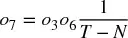                   2 + *N^[2]^*
       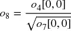                  [1
  ---------------------------------------------------------------------- ---------------------------------------------

This gives a total of] *f* [(
*N* [,] *T* [) =] *N^[3]^* [+] *N^[2]^*
(2] *T* [+ 3) +] *N*
(4] *T* [− 1) + 2] *T* [+ 2 FLOPs
per ADF estimate. A single SADF update requires
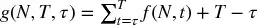 FLOPs
( *T* [− τ operations to find the maximum ADF stat),
and the estimation of a full SADF series requires
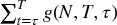
.

Consider a dollar bar series on E-mini S&P 500 futures. For
(] *T* [,] *N* [) = (356631, 3),
an ADF estimate requires 11,412,245 FLOPs, and a SADF update requires
2,034,979,648,799 operations (roughly 2.035 TFLOPs). A full SADF time
series requires 241,910,974,617,448,672 operations (roughly 242 PFLOPs).
This number will increase quickly, as the] *T*
continues to grow. And this estimate excludes notoriously expensive
operations like alignment, pre-processing of data, I/O jobs, etc.
Needless to say, this algorithm\'s double loop requires a large number
of operations. An HPC cluster running an efficiently parallelized
implementation of the algorithm may be needed to estimate the SADF
series within a reasonable amount of time. [第 20 章](ch20.md) will present some
parallelization strategies useful in these
situations.

***17.4.2.3 Conditions for Exponential Behavior***

Consider the zero-lag specification on log prices,
Δlog[] *y ~[*t*]~* [] = α +
βlog[] *y ~[*t*\ −\ 1]~* [] + ϵ
~[*t*]~ . This can be rewritten as
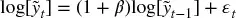 [,
where] 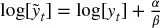 [. Rolling back] *t* discrete steps, we
obtain 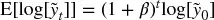 [, or
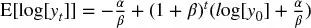 [. The
index] *t* [can be reset at a given time, to project
the future trajectory of] *y ~[0]~*
→] *y ~[*t*]~* after the
next *t* [steps. This reveals the conditions that
characterize the three states for this dynamic
system:

-   Steady: 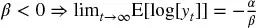
    .

    :::
    :::

    -   The disequilibrium is 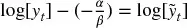 .
    -   Then 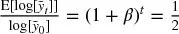
        at 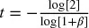
        (half-life).
-   Unit-root: β = 0, where the system is non-stationary, and behaves as
    a martingale.
-   Explosive: β \> 0, where 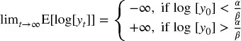 .

***17.4.2.4 Quantile ADF***

SADF takes the supremum of a series on t-values,
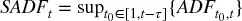 [. Selecting
the extreme value introduces some robustness problems, where SADF
estimates could vary significantly depending on the sampling frequency
and the specific timestamps of the samples. A more robust estimator of
ADF extrema would be the following: First, let
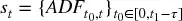 [. Second,
we define] *Q ~[*t*\ ,\ *q*]~*
=] *Q* [[] *s ~[*t*]~*
,] *q* [] the] *q* quantile
of *s ~[*t*]~* [, as a measure of centrality
of high ADF values, where] *q* [∈ [0, 1]. Third, we
define] 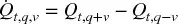 [, with 0 \<] *v* [≤
min *q* [, 1 −] *q* [}, as a
measure of dispersion of high ADF values. For example, we could
set] *q* [= 0.95 and] *v* [=
0.025. Note that SADF is merely a particular case of QADF,
where] *SADF ~[*t*]~* [=
*Q ~[*t*\ ,\ 1]~* [and
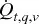 is not
defined because *q* [= 1.

***17.4.2.5 Conditional ADF***

Alternatively, we can address concerns on SADF robustness by computing
conditional moments. Let] *f* [[
*x* [] be the probability distribution function of
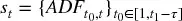 [,
with] *x* [∈] *s ~[*t*]~*
. Then, we define] *C ~[*t*\ ,\ *q*]~*
=] *K^[−\ 1]^* [∫ ^[∞]^
~[*Qt*\ ,\ *q*]~ ] *xf*
[] *x* []] *dx* [as a measure
of centrality of high ADF values, and
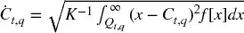 [as a
measure of dispersion of high ADF values, with regularization
constant] 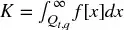 [. For example, we could
use] *q* [= 0.95.

By construction,] *C ~[*t*\ ,\ *q*]~*
≤] *SADF ~[*t*]~* [. A scatter plot
of] *SADF ~[*t*]~*
against] *C ~[*t*\ ,\ *q*]~* [shows that
lower boundary, as an ascending line with approximately unit gradient
(see]  Figure
17.2 [). When SADF grows beyond −1.5,
we can appreciate some horizontal trajectories, consistent with a sudden
widening of the right fat tail in] *s
~[*t*]~* [. In other words,
 can reach
significantly large values even if *C
~[*t*\ ,\ *q*]~* is relatively small,
because *SADF ~[*t*]~* [is sensitive to
outliers.

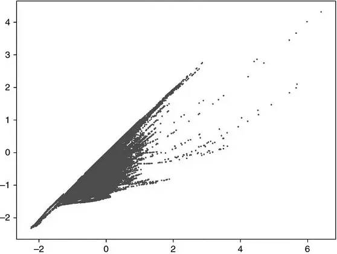

**图 17.2** SADF (x-axis) vs
CADF (y-axis)

图 17.3 [(a)
plots] 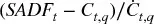 for the E-mini S&P 500 futures prices over
time. Figure
17.3 [(b) is the scatter-plot
of]  against *SADF ~[*t*]~* [,
computed on the E-mini S&P 500 futures prices. It shows evidence that
outliers in] *s ~[*t*]~*
bias] *SADF ~[*t*]~*
upwards.

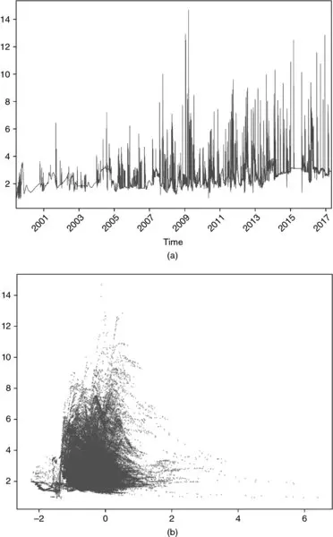

**图 17.3** (a)
 over time
(b)  (y-axis)
as a function of *SADF ~[*t*]~* (x-axis)

***17.4.2.6 Implementation of SADF***

This section presents an implementation of the SADF algorithm. The
purpose of this code is not to estimate SADF quickly, but to clarify the
steps involved in its estimation. 代码片段 17.1 lists SADF\'s inner loop.
That is the part that estimates
 [, which is
the backshifting component of the algorithm. The outer loop (not shown
here) repeats this calculation for an advancing] *t*
,  *SADF ~[*t*]~* [}
~[*t*\ =\ 1,\ ...,\ *T*]~ . The arguments
are:

-   `logP` : a pandas series containing log-prices
-   `minSL` : the minimum sample length (τ), used by the final
    regression
-   `constant` : the regression\'s time trend component

    :::
    :::

    -   `'nc'` : no time trend, only a constant
    -   `'ct'` : a constant plus a linear time trend
    -   `'ctt'` : a constant plus a second-degree polynomial time trend
-   `lags` : the number of lags used in the ADF specification

> **SNIPPET 17.1 SADF\'S INNER LOOP**

> 

代码片段 17.2 lists function] `getXY` [, which
prepares the numpy objects needed to conduct the recursive
tests.

> **SNIPPET 17.2 PREPARING THE DATASETS**

> 

代码片段 17.3 lists function] `lagDF` [, which
applies to a dataframe the lags specified in its
argument] `lags` [.

> **SNIPPET 17.3 APPLY LAGS TO DATAFRAME**

> 

Finally, 代码片段 17.4 lists function] `getBetas` [,
which carries out the actual regressions.

> **SNIPPET 17.4 FITTING THE ADF SPECIFICATION**

> 

### 17.4.3 Sub- and Super-Martingale Tests

在本节中我们将 introduce explosiveness tests that do not rely
on the standard ADF specification. Consider a process that is either a
sub- or super-martingale. Given some observations
*y ~[*t*]~* [}, we would like to test for the existence of an
explosive time trend,] *H ~[0]~* [: β =
0,] *H ~[1]~* [: β ≠ 0, under alternative
specifications:

-   Polynomial trend (SM-Poly1):

    > > 

-   Polynomial trend (SM-Poly2):

    > > 

-   Exponential trend (SM-Exp):

    > > 

-   Power trend (SM-Power):

    > > 

Similar to SADF, we fit any of these specifications to each end
point] *t* [= τ, ...,] *T* [, with
backwards expanding start points, then compute

The reason for the absolute value is that we are equally interested in
explosive growth and collapse. In the simple regression case (Greene
2008], p. 48), the variance of β is
 [,
hence]  [. The same result is generalizable to the multivariate
linear regression case (Greene [2008], pp. 51--52).
The]  of a weak long-run bubble may be smaller than
the  [of a strong short-run bubble, hence biasing the method
towards long-run bubbles. To correct for this bias, we can penalize
large sample lengths by determining the coefficient φ ∈ [0, 1] that
yields best explosiveness signals.

For instance, when φ = 0.5, we compensate for the
lower]  [associated with longer sample lengths, in the simple
regression case. For φ → 0,] *SMT ~[*t*]~*
will exhibit longer trends, as that compensation wanes and long-run
bubbles mask short-run bubbles. For φ → 1,] *SMT
~[*t*]~* [becomes noisier, because more short-run bubbles are
selected over long-run bubbles. Consequently, this is a natural way to
adjust the explosiveness signal, so that it filters opportunities
targeting a particular holding period. The features used by the ML
algorithm may include] *SMT ~[*t*]~*
estimated from a wide range of φ values.

## 练习题

1.  [On a dollar bar series on E-mini S&P 500
    > > futures,

    :::
    :::

    1.  Apply the Brown-Durbin-Evans method. Does it recognize the
        dot-com bubble?
    2.  Apply the Chu-Stinchcombe-White method. Does it find a bubble in
        2007--2008?

2.  [On a dollar bar series on E-mini S&P 500
    > > futures,

    :::
    :::

    1.  Compute the *SDFC* (Chow-type) explosiveness test. What break
        date does this method select? Is this what you expected?
    2.  Compute and plot the SADF values for this series. Do you observe
        extreme spikes around the dot-com bubble and before the Great
        Recession? Did the bursts also cause spikes?

3.  [Following on exercise 2,

    :::
    :::

    1.  Determine the periods where the series exhibited
        1.  Steady conditions
        2.  Unit-Root conditions
        3.  Explosive conditions
    2.  Compute QADF.
    3.  Compute CADF.

4.  [On a dollar bar series on E-mini S&P 500
    > > futures,

    :::
    :::

    1.  Compute SMT for SM-Poly1 and SM-Poly 2, where φ = 1. What is
        their correlation?
    2.  Compute SMT for SM-Exp, where φ = 1 and φ = 0.5. What is their
        correlation?
    3.  Compute SMT for SM-Power, where φ = 1 and φ = 0.5. What is their
        correlation?

5.  [If you compute the reciprocal of each price, the series
    > >  *y^[−\ 1]^ ~[*t*]~* [}
    > > turns bubbles into bursts and bursts into
    > > bubbles.

    :::
    :::

    1.  Is this transformation needed, to identify bursts?
    2.  What methods in this chapter can identify bursts without
        requiring this transformation?

## 参考文献

1.  Andrews, D. (1993): "Tests for parameter instability and structural
    change with unknown change point." *Econometrics* , Vol. 61, No. 4
    (July), pp. 821--856.
2.  Breitung, J. and R. Kruse (2013): "When Bubbles Burst: Econometric
    Tests Based on Structural Breaks." *Statistical Papers* , Vol. 54,
    pp. 911--930.
3.  Breitung, J. (2014): "Econometric tests for speculative bubbles."
    *Bonn Journal of Economics* , Vol. 3, No. 1, pp. 113--127.
4.  Brown, R.L., J. Durbin, and J.M. Evans (1975): "Techniques for
    Testing the Constancy of Regression Relationships over Time."
    *Journal of the Royal Statistical Society, Series B* , Vol. 35, pp.
    149--192.
5.  Chow, G. (1960). "Tests of equality between sets of coefficients in
    two linear regressions." *Econometrica* , Vol. 28, No. 3, pp.
    591--605.
6.  Greene, W. (2008): *Econometric Analysis* , 6th ed. Pearson Prentice
    Hall.
7.  Homm, U. and J. Breitung (2012): "Testing for speculative bubbles in
    stock markets: A comparison of alternative methods." *Journal of
    Financial Econometrics* , Vol. 10, No. 1, 198--231.
8.  Maddala, G. and I. Kim (1998): *Unit Roots, Cointegration and
    Structural Change* , 1st ed. Cambridge University Press.
9.  Phillips, P., Y. Wu, and J. Yu (2011): "Explosive behavior in the
    1990s Nasdaq: When did exuberance escalate asset values?"
    *International Economic Review* , Vol. 52, pp. 201--226.
10. Phillips, P. and J. Yu (2011): "Dating the timeline of financial
    bubbles during the subprime crisis." *Quantitative Economics* , Vol.
    2, pp. 455--491.
11. Phillips, P., S. Shi, and J. Yu (2013): "Testing for multiple
    bubbles 1: Historical episodes of exuberance and collapse in the S&P
    500." Working paper 8--2013, Singapore Management University.
