# 熵特征

## 18.1 动机
价格序列传达了供需力量的信息。在完美市场中，价格是不可预测的，因为每个观测
transmits everything that is known about a product or service. When
markets are not perfect, prices are formed with partial information, and
as some agents know more than others, they can exploit that
informational asymmetry. It would be helpful to estimate the
informational content of price series, and form features on which ML
algorithms can learn the likely outcomes. For example, the ML algorithm
may find that momentum bets are more profitable when prices carry little
information, and that mean-reversion bets are more profitable when
prices carry a lot of information. In this chapter, we will explore ways
to determine the amount of information contained in a price
series.

## 18.2 Shannon\'s Entropy

在本节中我们将 review a few concepts from information theory
that will be useful in the remainder of the chapter. The reader can find
a complete exposition in MacKay [2003]. 信息论之父
theory, Claude Shannon, defined entropy as the average amount of
information (over long messages) produced by a stationary source of
data. It is the smallest number of bits per character required to
describe the message in a uniquely decodable way. Mathematically,
Shannon [1948] defined the entropy of a discrete random
variable] *X* with possible
values *x* [∈] *A*
as

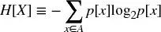

with 0 ≤] *H* [[] *X* [] ≤ log
~[2]~ [\|\|] *A* [\|\|
where:] *p* [[] *x* [] is the
probability of] *x* [;] *H*
[] *X* [] = 0⇔∃] *x*
\|] *p* [[] *x* [] =
1;] 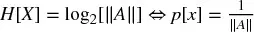 for all *x* [; and
\|\|] *A* [\|\| is the size of the
set] *A* [. This can be interpreted as the
probability weighted average of informational content
in] *X* [, where the bits of information are measured
as] 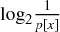 [. The rationale for measuring information
as] 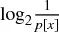 [comes from the observation that low-probability outcomes
reveal more information than high-probability outcomes. In other words,
we learn when something unexpected happens. Similarly, redundancy is
defined as

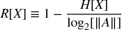

with 0 ≤] *R* [[] *X* [] ≤ 1.
Kolmogorov [1965] formalized the connection between redundancy and
complexity of a Markov information source. The mutual information
between two variables is defined as the Kullback-Leibler divergence from
the joint probability density to the product of the marginal probability
densities.

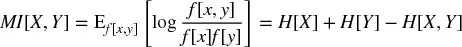

The mutual information (MI) is always non-negative, symmetric, and
equals zero if and only if] *X*
and] *Y* [are independent. For normally distributed
variables, the mutual information is closely related to the familiar
Pearson correlation, ρ.

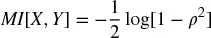

Therefore, mutual information is a natural measure of the association
between variables, regardless of whether they are linear or nonlinear in
nature (Hausser and Strimmer [2009]). The normalized variation of
information is a metric derived from mutual information. For several
entropy estimators, see:

-   In R: <http://cran.r-project.org/web/packages/entropy/entropy.pdf>
-   In Python: <https://code.google.com/archive/p/pyentropy/>

## 18.3 插入式（最大似然）估计量
在本节中我们将 follow the exposition of entropy\'s maximum
likelihood estimator in Gao et al. [2008]. The nomenclature may seem a
bit peculiar at first (no pun intended), but once you become familiar
with it you will find it convenient. Given a data
sequence] *x^[*n*]^ ~[1]~* [,
comprising the string of values starting in position 1 and ending in
position] *n* [, we can form a dictionary of all
words of length] *w* [\<] *n* in
that sequence, *A^[*w*]^* [. Consider an
arbitrary word] *y^[*w*]^ ~[1]~*
∈] *A^[*w*]^* of
length *w* [. We denote
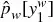 the
empirical probability of the word *y^[*w*]^
~[1]~* in *x^[*n*]^ ~[1]~*
, which means that
 is the
frequency with which *y^[*w*]^
~[1]~* appears in *x^[*n*]^
~[1]~* [. Assuming that the data is generated by a stationary
and ergodic process, then the law of large numbers guarantees that, for
a fixed] *w* and large *n* [,
the empirical distribution
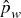 will be
close to the true distribution *p ~[*w*]~*
. Under these circumstances, a natural estimator for the entropy rate
(i.e., average entropy per bit) is

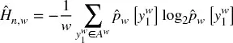

Since the empirical distribution is also the maximum likelihood
estimate of the true distribution, this is also often referred to as the
maximum likelihood entropy estimator. The value] *w*
should be large enough for
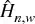 to be
acceptably close to the true entropy *H.* The value
of *n* needs to be much larger
than *w* [, so that the empirical distribution of
order] *w* [is close to the true distribution.
代码片段 18.1 implements the plug-in entropy
estimator.

> **SNIPPET 18.1 PLUG-IN ENTROPY ESTIMATOR**

> 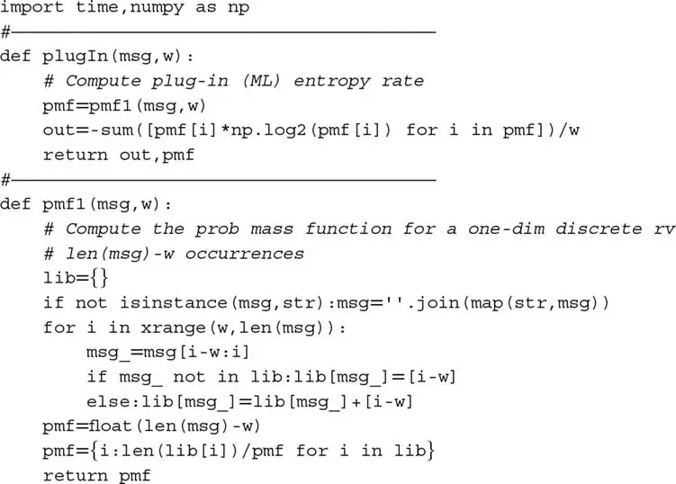

## 18.4 Lempel-Ziv 估计量
Entropy can be interpreted as a measure of complexity. A complex
sequence contains more information than a regular (predictable)
sequence. The Lempel-Ziv (LZ) algorithm efficiently decomposes a message
into non-redundant substrings (Ziv and Lempel [1978]). We can estimate
the compression rate of a message as a function of the number of items
in a Lempel-Ziv dictionary relative to the length of the message. The
intuition here is that complex messages have high entropy, which will
require large dictionaries relative to the length of the string to be
transmitted. 代码片段 18.2 shows an implementation of the LZ compression
algorithm.

> **SNIPPET 18.2 A LIBRARY BUILT USING THE LZ ALGORITHM**

> 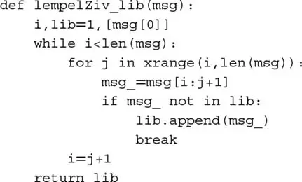

Kontoyiannis [1998] attempts to make a more efficient use of the
information available in a message. What follows is a faithful summary
of the exposition in Gao et al. [2008]. We will reproduce the steps in
that paper, while complementing them with code snippets that implement
their ideas. Let us define] *L^[*n*]^
~[*i*]~* [as 1 plus the length of the longest match found in
the] *n* bits prior to *i*
,

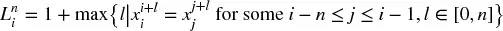

代码片段 18.3 implements the algorithm that determines the length of the
longest match. A few notes worth mentioning:

-   The value *n* is constant for a sliding window, and *n* = *i* for an
    expanding window.
-   Computing *L^[*n*]^ ~[*i*]~* requires data *x^[*i*\ +\ *n*\ −\ 1]^ ~[*i*\ −\ *n*]~* . In other
    words, index *i* must be at the center of the window. This is
    important in order to guarantee that both matching strings are of
    the same length. If they are not of the same length, *l* will have a
    limited range and its maximum will be underestimated.
-   Some overlap between the two substrings is allowed, although
    obviously both cannot start at *i.*

> **SNIPPET 18.3 FUNCTION THAT COMPUTES THE LENGTH OF THE LONGEST
> MATCH**

> 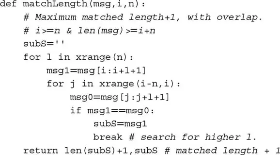

Ornstein and Weiss [1993] formally established
that

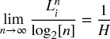

Kontoyiannis uses this result to estimate Shannon\'s entropy rate. He
estimates the average
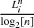 [, and uses
the reciprocal of that average to estimate] *H.* [The
general intuition is, as we increase the available history, we expect
that messages with high entropy will produce relatively shorter
non-redundant substrings. In contrast, messages with low entropy will
produce relatively longer non-redundant substrings as we parse through
the message. Given a data realization] *x^[∞]^ ~[−\ ∞]~* [, a window length
*n* [≥ 1, and a number of matches] *k* [≥ 1, the
sliding-window LZ estimator
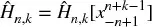 [is defined
by

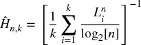

Similarly, the increasing window LZ estimator
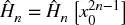 [, is
defined by

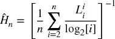

The window size] *n* is constant when
computing 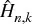 [, thus] *L^[*n*]^
~[*i*]~* [. However, when computing
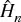 [, the window
size increases with] *i* [, thus
*L^[*i*]^ ~[*i*]~* [, with
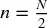 [. In this
expanding window case the length of the message] *N*
should be an even number to ensure that all bits are parsed (recall
that] *x ~[*i*]~* [is at the center, so for
an odd-length message the last bit would not be
read).

The above expressions have been derived under the assumptions of:
stationarity, ergodicity, that the process takes finitely many values,
and that the process satisfies the Doeblin condition. Intuitively, this
condition requires that, after a finite number of
steps] *r* [, no matter what has occurred before,
anything can happen with positive probability. It turns out that this
Doeblin condition can be avoided altogether if we consider a modified
version of the above estimators:

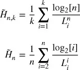

One practical question when estimating
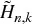 is how to
determine the window size *n.* [Gao et al. [2008
argue that] *k* [+] *n*
=] *N* [should be approximately equal to the message
length. Considering that the bias of] *L^[*n*]^ ~[*i*]~* [is of order
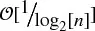 and the
variance of *L^[*n*]^ ~[*i*]~* is
order 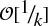 [, the bias/variance trade-off is balanced at
around] 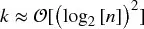 [. That is,] *n* could be
chosen such that *N* [≈] *n* [+
(log  ~[2]~ [] *n* []) ^[2]^ . For
example, for] *N* [= 2^[8]^ , a balanced
bias/variance window size would be] *n* [≈ 198, in
which case] *k* [≈ 58.

Kontoyiannis [1998] proved that
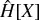 [converges to
Shannon\'s entropy rate with probability 1 as] *n*
approaches infinity. 代码片段 18.4 implements the ideas discussed in Gao
et al. [2008], which improve on Kontoyiannis [1997] by looking for
the maximum redundancy between two substrings of the same
size.

> **SNIPPET 18.4 IMPLEMENTATION OF ALGORITHMS DISCUSSED IN GAO ET AL.
> [2008]**

> 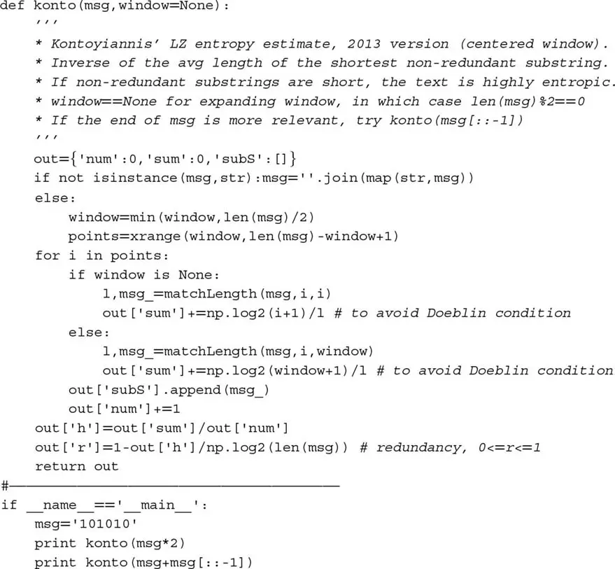

One caveat of this method is that entropy rate is defined in the limit.
In the words of Kontoyiannis, "we fix a large
integer] *N* [as the size of our database." The
theorems used by Kontoyiannis' paper prove asymptotic convergence;
however, nowhere is a monotonicity property claimed. When a message is
short, a solution may be to repeat the same message multiple
times.

A second caveat is that, because the window for matching must be
symmetric (same length for the dictionary as for the substring being
matched), the last bit is only considered for matching if the message\'s
length corresponds to an even number. One solution is to remove the
first bit of a message with odd length.

A third caveat is that some final bits will be dismissed when preceded
by irregular sequences. This is also a consequence of the symmetric
matching window. For example, the entropy rate for "10000111" equals the
entropy rate for "10000110," meaning that the final bit is irrelevant
due to the unmatchable "11" in the sixth and seventh bit. When the end
of the message is particularly relevant, a good solution may be to
analyze the entropy of the reversed message. This not only ensures that
the final bits (i.e., the initial ones after the reversing) are used,
but actually they will be used to potentially match every bit. Following
the previous example, the entropy rate of "11100001" is 0.96, while the
entropy rate for "01100001' is 0.84.

## 18.5 编码方案
Estimating entropy requires the encoding of a message. In this section
we will review a few encoding schemes used in the literature, which are
based on returns. Although not discussed in what follows, it is
advisable to encode information from fractionally (rather than integer)
differentiated series ([第 4 章](ch04.md)), as they still contain some
memory.

### 18.5.1 Binary Encoding

Entropy rate estimation requires the discretization of a continuous
variable, so that each value can be assigned a code from a finite
alphabet. For example, a stream of returns] *r
~[*t*]~* can be encoded according to the sign, 1
for *r ~[*t*]~* [\> 0, 0
for] *r ~[*t*]~* [\< 0, removing cases
where] *r ~[*t*]~* [= 0. Binary encoding
arises naturally in the case of returns series sampled from price bars
(i.e., bars that contain prices fluctuating between two symmetric
horizontal barriers, centered around the start price), because
\|] *r ~[*t*]~* [\| is approximately
constant.

When \|] *r ~[*t*]~* [\| can adopt a wide
range of outcomes, binary encoding discards potentially useful
information. That is particularly the case when working with intraday
time bars, which are affected by the heteroscedasticity that results
from the inhomogeneous nature of tick data. One way to partially address
this heteroscedasticity is to sample prices according to a subordinated
stochastic process. Examples of that are trade bars and volume bars,
which contain a fixed number of trades or trades for a fixed amount of
volume (see [第 2 章](ch02.md)). By operating in this non-chronological,
market-driven clock, we sample more frequently during highly active
periods, and less frequently during periods of less activity, hence
regularizing the distribution of \|] *r
~[*t*]~* [\| and reducing the need for a large
alphabet.

### 18.5.2 Quantile Encoding

Unless price bars are used, it is likely that more than two codes will
be needed. One approach consists in assigning a code to
each] *r ~[*t*]~* [according to the quantile
it belongs to. The quantile boundaries are determined using an in-sample
period (training set). There will be the same number of observations
assigned to each letter for the overall in-sample, and close to the same
number of observations per letter out-of-sample. When using the method,
some codes span a greater fraction of] *r
~[*t*]~* ['s range than others. This uniform (in-sample) or
close to uniform (out-of-sample) distribution of codes tends to increase
entropy readings on average.

### 18.5.3 Sigma Encoding

As an alternative approach, rather than fixing the number of codes, we
could let the price stream determine the actual dictionary. Suppose we
fix a discretization step, σ. Then, we assign the value 0
to] *r ~[*t*]~* [∈
.min *r* [}, min *r* [} +
σ)., 1 to] *r ~[*t*]~* [∈
.min *r* [} + σ, min *r*
} + 2σ). and so on until every observation has been encoded with a
total of] 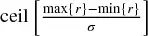 [codes, where ceil[.] is the ceiling
function. Unlike quantile encoding, now each code covers the same
fraction of] *r ~[*t*]~* ['s range. Because
codes are not uniformly distributed, entropy readings will tend to be
smaller than in quantile encoding on average; however, the appearance of
a "rare" code will cause spikes in entropy readings.

## 18.6 高斯过程的熵
The entropy of an IID Normal random process (see Norwich [2003]) can
be derived as

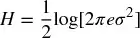

For the standard Normal,] *H* [≈ 1.42. There are at
least two uses of this result. First, it allows us to benchmark the
performance of an entropy estimator. We can draw samples from a standard
normal distribution, and find what combination of estimator, message
length, and encoding gives us an entropy estimate
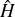 [sufficiently
close to the theoretically derived value] *H.* For
example,  Figure
18.1 [plots the bootstrapped
distributions of entropy estimates under 10, 7, 5, and 2 letter
encodings, on messages of length 100, using Kontoyiannis' method. For
alphabets of at least 10 letters, the algorithm in 代码片段 18.4 delivers
the correct answer. When alphabets are too small, information is
discarded and entropy is underestimated.

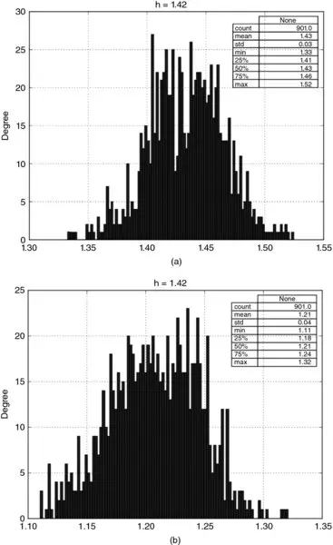

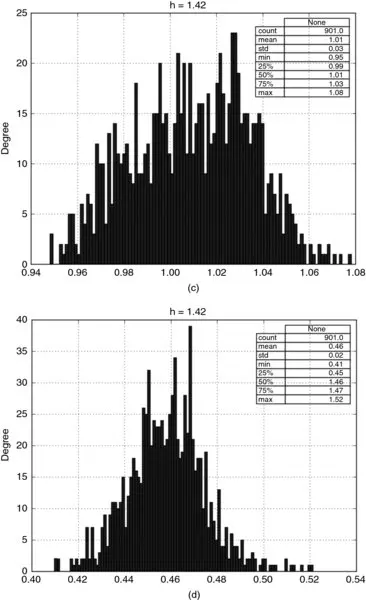

**图 18.1** Distribution of
entropy estimates under 10 (top), 7 (bottom), letter encodings, on
messages of length 100\

Distribution of entropy estimates under 5 (top), and 2 (bottom) letter
encodings, on messages of length 100

Second, we can use the above equation to connect entropy with
volatility, by noting that
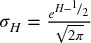 [. This gives
us an entropy-implied volatility estimate, provided that returns are
indeed drawn from a Normal distribution.

## 18.7 熵与广义均值
Here is an interesting way of thinking about entropy. Consider a set of
real numbers] *x* [=  *x
~[*i*]~* [} ~[*i*\ =\ 1,\ ...,\ *n*]~ and
weights] *p* [=  *p
~[*i*]~* [} ~[*i*\ =\ 1,\ ...,\ *n*]~ , such that 0
≤] *p ~[*i*]~* [≤ 1, ∀
*i* and 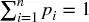 [. The generalized weighted mean
of] *x* with weights *p* on a
power *q* [≠ 0 is defined as

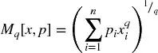

For] *q* [\< 0, we must require
that] *x ~[*i*]~* [\> 0,
∀] *i* [. The reason this is a generalized mean is
that other means can be obtained as special cases:

-   Minimum: 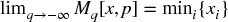

-   Harmonic mean: 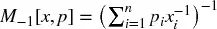

-   Geometric mean: 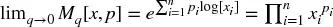

-   Arithmetic mean: 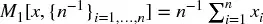

-   Weighted mean: 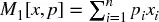

-   Quadratic mean: 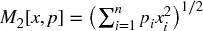

-   Maximum: 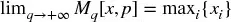

In the context of information theory, an interesting special case
is] *x* [=  *p ~[*i*]~*
} ~[*i*\ =\ 1,\ ...,\ *n*]~ , hence

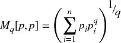

Let us define the quantity
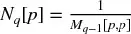 [, for
some] *q* [≠ 1. Again, for] *q*
\< 1 in] *N ~[*q*]~* [[
*p* [], we must have] *p ~[*i*]~* [\> 0,
∀] *i* [. If
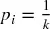
for] *k* [∈ [1,] *n* [
different indices and] *p ~[*i*]~* [= 0
elsewhere, then the weight is spread evenly across
*k* different items, and *N ~[*q*]~*
[] *p* [] =] *k*
for] *q* [\> 1. In other words,
*N ~[*q*]~* [[] *p* [] gives us
the] *effective number* [or
*diversity* of items in *p* [, according to some
weighting scheme set by] *q* [.

Using Jensen\'s inequality, we can prove that
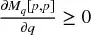 [,
hence]  [. Smaller values of] *q* [assign a more
uniform weight to elements of the partition, giving relatively more
weight to less common elements, and
 is simply
the total number of nonzero *p ~[*i*]~*
.

Shannon\'s entropy is
 [. This
shows that entropy can be interpreted as the logarithm of
the] *effective number* of items in a
list *p* [, where] *q* [→
1.]  Figure
18.2 [illustrates how the log
effective numbers for a family of randomly generated
*p* arrays converge to Shannon\'s entropy as *q*
approaches 1. Notice, as well, how their behavior stabilizes
as] *q* [grows large.

**图 18.2** Log effective
numbers for a family of randomly generated *p* arrays

Intuitively, entropy measures information as the level
of] *diversity* [contained in a random variable. This
intuition is formalized through the notion of generalized mean. The
implication is that Shannon\'s entropy is a special case of a diversity
measure (hence its connection with volatility). We can now define and
compute alternative measures of diversity, other than entropy,
where] *q* [≠ 1.

## 18.8 熵的几个金融应用
在本节中我们将 introduce a few applications of entropy to the
modelling of financial markets.

### 18.8.1 Market Efficiency

When arbitrage mechanisms exploit the complete set of opportunities,
prices instantaneously reflect the full amount of available information,
becoming unpredictable (i.e., a martingale), with no discernable
patterns. Conversely, when arbitrage is not perfect, prices contain
incomplete amounts of information, which gives rise to predictable
patterns. Patterns occur when a string contains redundant information,
which enables its compression. The entropy rate of a string determines
its optimal compression rate. The higher the entropy, the lower the
redundancy and the greater the informational content. Consequently, the
entropy of a price string tells us the degree of market efficiency at a
given point in time. A "decompressed" market is an efficient market,
because price information is non-redundant. A "compressed" market is an
inefficient market, because price information is redundant. Bubbles are
formed in compressed (low entropy) markets.

### 18.8.2 Maximum Entropy Generation

In a series of papers, Fiedor [2014a, 2014b, 2014c] proposes to use
Kontoyiannis [1997] to estimate the amount of entropy present in a
price series. He argues that, out of the possible future outcomes, the
one that maximizes entropy may be the most profitable, because it is the
one that is least predictable by frequentist statistical models. It is
the black swan scenario most likely to trigger stop losses, thus
generating a feedback mechanism that will reinforce and exacerbate the
move, resulting in runs in the signs of the returns time
series.

### 18.8.3 Portfolio Concentration

Consider an] *NxN* covariance
matrix *V* [, computed on returns. First, we compute
an eigenvalue decomposition of the matrix,] *VW*
=] *W* [Λ. Second, we obtain the factor loadings
vector as] *f ~[ω]~* [=
*W* [\'ω, where ω is the vector of allocations,

.^\ [[1]^
Third, we derive the portion of risk contributed by each principal
component (Bailey and López de Prado [2012]) as

where]  [, and θ ~[*i*]~ ∈ [0, 1],
∀] *i* [= 1, ...,] *N* [. Fourth,
Meucci [2009] proposed the following entropy-inspired definition of
portfolio concentration,

At first, this definition of portfolio concentration may sound
striking, because θ ~[*i*]~ is not a probability. The connection
between this notion of concentration and entropy is due to the
generalized mean, which we discussed in [第 18 章](ch18.md), Section
18.7.

### 18.8.4 Market Microstructure

Easley et al. [1996, 1997] showed that, when the odds of good news /
bad news are even, the probability of informed trading (PIN) can be
derived as

where μ is the rate of arrival of informed traders, ϵ is the rate of
arrival of uninformed traders, and α is the probability of an
informational event. PIN can be interpreted as the fraction of orders
that arise from informed traders relative to the overall order
flow.

Within a volume bar of size] *V* [, we can classify
ticks as buy or sell according to some algorithm, such as the tick rule
or the Lee-Ready algorithm. Let] *V^[*B*]^
~[τ]~* [be the sum of the volumes from buy ticks included in
volume bar τ, and] *V^[*S*]^ ~[τ]~*
the sum of the volumes from sell ticks within volume bar τ. Easley et
al. [2012a, 2012b] note that E[\|] *V^[*B*]^ ~[τ]~* [−] *V ~[τ]~
^[*S*]^* [\|] ≈ αμ and that the expected total volume is
E[] *V^[*B*]^ ~[τ]~*
+] *V ~[τ]~ ^[*S*]^* [] = αμ + 2ϵ.
By using a volume clock (Easley et al. [2012c]), we can set the value
of E[] *V^[*B*]^ ~[τ]~*
+] *V ~[τ]~ ^[*S*]^* [] = αμ + 2ϵ
=] *V* [exogenously. This means that, under a volume
clock, PIN reduces to

where]  [. Note that 2] *v^[*B*]^ ~[τ]~* [− 1 represents the order flow
imbalance,] *OI ~[τ]~* [, which is a bounded
real-valued variable, where] *OI ~[τ]~* [∈ [
− 1, 1]. The VPIN theory thus provides a formal link between the
probability of informed trading (PIN) and the persistency of order flow
imbalances under a volume clock. See [第 19 章](ch19.md) for further details on
this microstructural theory.

Persistent order flow imbalance is a necessary, non-sufficient
condition for adverse selection. For market makers to provide liquidity
to informed traders, that order flow imbalance \|
*OI ~[τ]~* [\| must also have been relatively unpredictable. In
other words, market makers are not adversely selected when their
prediction of order flow imbalance is accurate, even if
\|] *OI ~[τ]~* [\| ≫ 0. In order to determine
the probability of adverse selection, we must determine how
unpredictable the order flow imbalance is. We can determine this by
applying information theory.

Consider a long sequence of symbols. When that sequence contains few
redundant patterns, it encompasses a level of complexity that makes it
hard to describe and predict. Kolmogorov [1965] formulated this
connection between redundancy and complexity. In information theory,
lossless compression is the task of perfectly describing a sequence with
as few bits as possible. The more redundancies a sequence contains, the
greater compression rates can be achieved. Entropy characterizes the
redundancy of a source, hence its Kolmogorov complexity and its
predictability. We can use this connection between the redundancy of a
sequence and its unpredictability (by market makers) to derive the
probability of adverse selection.

Here we will discuss one particular procedure that derives the
probability of adverse selection as a function of the complexity
ingrained in the order flow imbalance. First, given a sequence of volume
bars indexed by τ = 1, ...,] *N* [, each bar of
size] *V* [, we determine the portion of volume
classified as buy,] *v^[*B*]^ ~[τ]~*
∈ [0, 1]. Second, we compute the] *q* [-quantiles
on  *v^[*B*]^ ~[τ]~* [} that
define a set] *K* of *q*
disjoint subsets,] *K* [=  *K
~[1]~* [, ...,] *K ~[*q*]~* [}.
Third, we produce a mapping from each] *v^[*B*]^ ~[τ]~* to one of the disjoint
subsets, *f* [:] *v^[*B*]^ ~[τ]~* [→  *q* [},
where] *f* [[] *v^[*B*]^
~[τ]~* [] =] *i* [⇔] *v
~[τ]~ ^[*B*]^* [∈] *K
~[*i*]~* [, ∀] *i* [∈
1,] *q* []. Fourth, we quantize
 *v^[*B*]^ ~[τ]~* [} by assigning
to each value] *v^[*B*]^ ~[τ]~* the
index of the subset *K* it belongs
to, *f* [[] *v^[*B*]^
~[τ]~* []. This results in a translation of the set of order
imbalances  *v^[*B*]^ ~[τ]~* [}
into a quantized message] *X* [=
] *f* [[] *v^[*B*]^
~[1]~* [],] *f* [[] *v
~[2]~ ^[*B*]^* [], ...,] *f*
[] *v^[*B*]^ ~[*N*]~* []].
Fifth, we estimate the entropy] *H*
[] *X* [] using Kontoyiannis' Lempel-Ziv
algorithm. Sixth, we derive the cumulative distribution
function,] *F* [[] *H*
[] *X* []], and use the time series of
 *F* [[] *H*
[] *X ~[τ]~* []]}
~[τ\ =\ 1,\ ...,\ *N*]~ as a feature to predict adverse
selection.

## 练习题

1.  [Form dollar bars on E-mini S&P 500 futures:

    :::
    :::

    1.  Quantize the returns series using the binary method.
    2.  Quantize the returns series using the quantile encoding, using
        10 letters.
    3.  Quantize the returns series using the sigma encoding, where σ is
        the standard deviation of all bar returns.
    4.  Compute the entropy of the three encoded series, using the
        plug-in method.
    5.  Compute the entropy of the three encoded series, using
        Kontoyiannis' method, with a window size of 100.

2.  [Using the bars from exercise 1:

    :::
    :::

    1.  Compute the returns series, {*r ~[*t*]~*}.
    2.  Encode the series as follows: 0 if *r ~[*t*]~ r
        ~[*t*\ −\ 1]~* \< 0, and 1 if *r ~[*t*]~ r
        ~[*t*\ −\ 1]~* ≥ 0.
    3.  Partition the series into 1000 non-overlapping subsets of equal
        size (you may have to drop some observations at the beginning).
    4.  Compute the entropy of each of the 1000 encoded subsets, using
        the plug-in method.
    5.  Compute the entropy of each of the 1000 encoded subsets, using
        the Kontoyiannis method, with a window size of 100.
    6.  Compute the correlation between results 2.d and 2.e.

3.  [Draw 1000 observations from a standard Normal
    > > distribution:

    :::
    :::

    1.  What is the true entropy of this process?
    2.  Label the observations according to 8 quantiles.
    3.  Estimate the entropy using the plug-in method.
    4.  Estimate the entropy using the Kontoyiannis method:
        1.  using a window size of 10.
        2.  using a window size of 100.

4.  [Using the draws from exercise 3,  *x
    > > ~[*t*]~* [} ~[*t*\ =\ 1,\ ...,\ 1000]~
    > > :

    :::
    :::

    1.  Compute *y ~[*t*]~* = ρ*y ~[*t*\ −\ 1]~* + *x
        ~[*t*]~* , where ρ = .5, *y ~[0]~* = 0.
    2.  Label {*y ~[*t*]~*} the observations according to 8
        quantiles.
    3.  Estimate the entropy using the plug-in method.
    4.  Estimate the entropy using the Kontoyiannis method
        1.  using a window size of 10.
        2.  using a window size of 100.

5.  [Suppose a portfolio of 10 holdings with equal dollar
    > > allocations.

    :::
    :::

    1.  The portion of the total risk contributed by the *i* th
        principal component is  , *i* = 1, ..., 10. What is the
        portfolio\'s entropy?
    2.  The portion of the total risk contributed by the *i* th
        principal component is  , *i* = 1, ..., 10. What is the
        portfolio\'s entropy?
    3.  The portion of the total risk contributed by the *i* th
        principal component is  , *i* = 1, ..., 10, α ∈ [0, 1]. Plot
        the portolio\'s entropy as a function of α.

## 参考文献

1.  Bailey, D. and M. López de Prado (2012): "Balanced baskets: A new
    approach to trading and hedging risks." *Journal of Investment
    Strategies* , Vol. 1, No. 4, pp. 21--62. Available at
    <https://ssrn.com/abstract=2066170.>
2.  Easley D., M. Kiefer, M. O\'Hara, and J. Paperman (1996):
    "Liquidity,information, and infrequently traded stocks." *Journal of
    Finance* , Vol. 51, No. 4, pp. 1405--1436.
3.  Easley D., M. Kiefer and, M. O\'Hara (1997): "The information
    content of the trading process." *Journal of Empirical Finance* ,
    Vol. 4, No. 2, pp. 159--185.
4.  Easley, D., M. López de Prado, and M. O\'Hara (2012a): "Flow
    toxicity and liquidity in a high frequency world." *Review of
    Financial Studies* , Vol. 25, No. 5, pp. 1547--1493.
5.  Easley, D., M. López de Prado, and M. O\'Hara (2012b): "The volume
    clock: Insights into the high frequency paradigm." *Journal of
    Portfolio Management* , Vol. 39, No. 1, pp. 19--29.
6.  Gao, Y., I. Kontoyiannis and E. Bienestock (2008): "Estimating the
    entropy of binary time series: Methodology, some theory and a
    simulation study." Working paper, arXiv. Available at
    <https://arxiv.org/abs/0802.4363v1.>
7.  Fiedor, Pawel (2014a): "Mutual information rate-based networks in
    financial markets." Working paper, arXiv. Available at
    <https://arxiv.org/abs/1401.2548.>
8.  Fiedor, Pawel (2014b): "Information-theoretic approach to lead-lag
    effect on financial markets." Working paper, arXiv. Available at
    <https://arxiv.org/abs/1402.3820.>
9.  Fiedor, Pawel (2014c): "Causal non-linear financial networks."
    Working paper, arXiv. Available at
    <https://arxiv.org/abs/1407.5020.>
10. Hausser, J. and K. Strimmer (2009): "Entropy inference and the
    James-Stein estimator, with application to nonlinear gene
    association networks," *Journal of Machine Learning Research* ,
    Vol. 10, pp. 1469--1484.
    <http://www.jmlr.org/papers/volume10/hausser09a/hausser09a.pdf.>
11. Kolmogorov, A. (1965): "Three approaches to the quantitative
    definition of information." *Problems in Information Transmission* ,
    Vol. 1, No. 1, pp. 1--7.
12. Kontoyiannis, I. (1997): "The complexity and entropy of literary
    styles", *NSF Technical Report* \# 97.
13. Kontoyiannis (1998): "Asymptotically optimal lossy Lempel-Ziv
    coding," *ISIT* , Cambridge, MA, August 16--August 21.
14. MacKay, D. (2003): *Information Theory, Inference, and Learning
    Algorithms, 1st ed* . Cambridge University Press.
15. Meucci, A. (2009): "Managing diversification." *Risk Magazine* ,
    Vol. 22, pp. 74--79.
16. Norwich, K. (2003): *Information, Sensation and Perception, 1st ed*
    . Academic Press.
17. Ornstein, D.S. and B. Weiss (1993): "Entropy and data compression
    schemes." *IEEE Transactions on Information Theory* , Vol. 39, pp.
    78--83.
18. Shannon, C. (1948): "A mathematical theory of communication." *Bell
    System Technical Journal* , Vol. 27, No. 3, pp. 379--423.
19. Ziv, J. and A. Lempel (1978): "Compression of individual sequences
    via variable-rate coding." *IEEE Transactions on Information Theory*
    , Vol. 24, No. 5, pp. 530--536.

## 参考书目

1.  Easley, D., R. Engle, M. O\'Hara, and L. Wu (2008): "Time-varying
    arrival rates of informed and uninformed traders." *Journal of
    Financial Econometrics* , Vol. 6, No. 2, pp. 171--207.
2.  Easley, D., M. López de Prado, and M. O\'Hara (2011): "The
    microstructure of the flash crash." *Journal of Portfolio
    Management* , Vol. 37, No. 2, pp. 118--128.
3.  Easley, D., M. López de Prado, and M. O\'Hara (2012c): "Optimal
    execution horizon." *Mathematical Finance* , Vol. 25, No. 3, pp.
    640--672.
4.  Gnedenko, B. and I. Yelnik (2016): "Minimum entropy as a measure of
    effective dimensionality." Working paper. Available at
    <https://ssrn.com/abstract=2767549.>

## Note

^\ [1]^
   Alternatively, we could have worked with a vector of holdings, should
the covariance matrix had been computed on price changes.
