# 微观结构特征

## 19.1 动机

市场微观结构研究「在显性交易规则下交换资产的过程和结果」（O'Hara [1995]）。微观结构数据集包含拍卖过程的一手信息，如订单撤单、双向拍卖簿、队列、部分成交、主动方、更正、替换等。主要来源是金融信息交换（FIX）消息，可以从交易所购买。FIX 消息中包含的细节水平使研究者能够了解市场参与者如何隐藏和揭示他们的意图。这使得微观结构数据成为构建预测性 ML 特征的最重要成分之一。

## 19.2 文献综述

市场微观结构理论的深度和复杂性随着时间的推移而演变，这是可用数据的数量和多样性的函数。第一代模型仅使用价格信息。早期的两个基础成果是交易分类模型（如 tick 规则）和 Roll [1984] 模型。第二代模型出现在成交量数据集开始可用之后，研究者将注意力转向研究成交量对价格的影响。这一代模型的两个例子是 Kyle [1985] 和 Amihud [2002]。

第三代模型出现在 1996 年之后，当时 Maureen O'Hara、David Easley 等人发表了他们的「知情交易概率」（PIN）理论（Easley 等 [1996]）。这构成了一个重大突破，因为 PIN 将买卖价差解释为流动性提供者（做市商）和持仓者（知情交易者）之间序贯战略决策的后果。本质上，它说明了做市商是出售被知情交易者逆向选择的期权的卖方，买卖价差是他们为该期权收取的溢价。Easley 等 [2012a, 2012b] 解释了如何在基于成交量的采样下估计 VPIN——PIN 的高频估计。

这些是微观结构文献使用的主要理论框架。O'Hara [1995] 和 Hasbrouck [2007] 提供了低频微观结构模型的良好概览。Easley 等 [2013] 展示了高频微观结构模型的现代处理。

## 19.3 第一代：价格序列

第一代微观结构模型致力于估计买卖价差和波动率作为流动性不足的代理。他们以有限的数据做到了这一点，且不对交易过程施加战略或序贯结构。

### 19.3.1 Tick 规则

在双向拍卖簿中，报价以各种价格水平卖出证券（卖盘）或以各种价格水平买入证券（买盘）。卖盘价格总是高于买盘价格，否则将立即匹配。当买方匹配卖盘或卖方匹配买盘时发生交易。每笔交易都有买方和卖方，但只有一方发起交易。

Tick 规则是一种用于确定交易主动方的算法。买入发起的交易标记为「1」，卖出发起的交易标记为「−1」，按照以下逻辑：

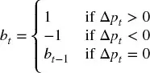

其中 p~t~ 是索引为 t = 1, ..., T 的交易价格，b~0~ 任意设为 1。多项研究确定，尽管 tick 规则相对简单，但它达到了高分类精度（Aitken 和 Frino [1996]）。竞争的分类方法包括 Lee 和 Ready [1991] 及 Easley 等 [2016]。

{b~t~} 序列的变换可以产生信息特征。此类变换包括：(1) 对其未来期望值 E~t~[b~t+1~] 的卡尔曼滤波；(2) 此类预测的结构性突变（[第 17 章](ch17.md)）；(3) {b~t~} 序列的熵（[第 18 章](ch18.md)）；(4) {b~t~} 上 Wald-Wolfowitz 运行检验的 t 值；(5) 累积 {b~t~} 序列 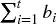 的分数阶差分（[第 5 章](ch05.md)）；等等。

### 19.3.2 Roll 模型

Roll [1984] 是最早提出证券交易的有效买卖价差解释的模型之一。这很有用，因为买卖价差是流动性的函数，因此 Roll 的模型可以被视为衡量证券流动性的早期尝试。考虑中间价序列 {m~t~}，其中价格遵循无漂移的随机游走，

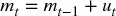

因此价格变化 Δm~t~ = m~t~ − m~t−1~ 独立同分布地从正态分布中抽取

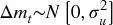

这些假设当然违背了所有经验观察，后者表明金融时间序列有漂移、是异方差的、表现出序列依赖性，且收益分布非正态。但通过适当的采样程序（如我们在[第 2 章](ch02.md)中所见），这些假设可能不会太不切实际。观测价格 {p~t~} 是对买卖价差序贯交易的结果：

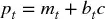

其中 c 是买卖价差的一半，b~t~ ∈ {−1, 1} 是主动方。Roll 模型假设买入和卖出等可能，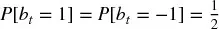，序列独立，E[b~t~b~t−1~] = 0，且与噪声独立，E[b~t~u~t~] = 0。给定这些假设，Roll 推导出 c 和 σ²~u~ 的值如下：

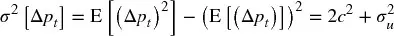

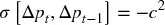

得到 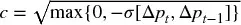 和 σ²~u~ = σ²[Δp~t~] + 2σ[Δp~t~, Δp~t−1~]。总之，买卖价差是价格变化序列协方差的函数，真实（未观测）价格的噪声（不包括微观结构噪声）是观测噪声和价格变化序列协方差的函数。

读者可能质疑在当今数据集包含多级簿买卖价格的情况下是否还需要 Roll 模型。Roll 模型尽管有其局限性仍在使用的一个原因是，它提供了一种相对直接的方式来确定那些很少交易的证券，或公布的报价不代表做市商愿意提供流动性的水平（如公司债、市政债和机构债券）的*有效*买卖价差。使用 Roll 的估计，我们可以推导关于市场流动性条件的信息特征。

### 19.3.3 高低价波动率估计器

Beckers [1983] 表明，基于高低价的波动率估计器比基于收盘价的标准波动率估计器更准确。Parkinson [1980] 推导出，对于遵循几何布朗运动的连续观测价格，

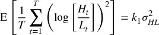

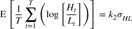

其中 k~1~ = 4log[2]，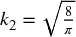，H~t~ 是条 t 的最高价，L~t~ 是条 t 的最低价。则波动率特征 σ~HL~ 可以基于观测的高低价稳健地估计。

### 19.3.4 Corwin 和 Schultz

在 Beckers [1983] 工作的基础上，Corwin 和 Schultz [2012] 引入了从最高价和最低价估计买卖价差的估计器。该估计器基于两个原理：第一，最高价几乎总是对卖盘匹配，最低价几乎总是对买盘匹配。最高价与最低价比率反映了基本面波动率和买卖价差。第二，由波动率导致的最高价与最低价比率的分量与两次观测之间经过的时间成正比增加。

Corwin 和 Schultz 表明，价差作为价格的百分比可以估计为

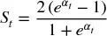

其中

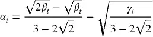

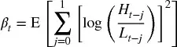

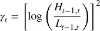

H~t−1,t~ 是 2 个条（t−1 和 t）上的最高价，L~t−1,t~ 是 2 个条（t−1 和 t）上的最低价。因为 α~t~ < 0 ⇒ S~t~ < 0，作者建议将负 α 设为 0（见 Corwin 和 Schultz [2012]，p. 727）。代码片段 19.1 实现了此算法。`corwinSchultz` 函数接收两个参数：一个包含列（`High`、`Low`）的序列数据帧，以及一个定义用于估计 β~t~ 的样本长度的整数值 `sl`。

> **代码片段 19.1 CORWIN-SCHULTZ 算法的实现**

> 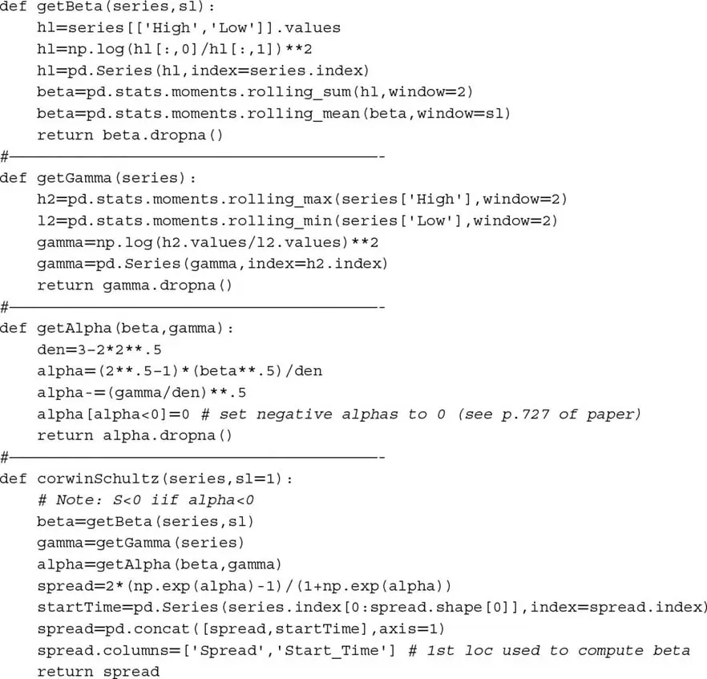

注意波动率不出现在最终的 Corwin-Schultz 方程中。原因是波动率已被其高低价估计器替换。作为该模型的副产品，我们可以推导 Becker-Parkinson 波动率，如代码片段 19.2 所示。

> **代码片段 19.2 估计高低价的波动率**

> 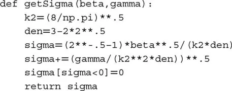

该程序在公司债券市场特别有用，因为没有集中的订单簿，交易通过竞价需求（BWIC）进行。所得特征——买卖价差 S——可以在滚动窗口上递归估计，值可以使用卡尔曼滤波平滑。

## 19.4 第二代：战略交易模型

第二代微观结构模型专注于理解和衡量流动性不足。流动性不足是金融 ML 模型中一个重要的信息特征，因为它是具有相关溢价的风险。这些模型比第一代模型有更强的理论基础，因为它们将交易解释为知情交易者和非知情交易者之间的战略互动。在此过程中，它们关注带符号成交量和订单流不平衡。

这些特征大多通过回归估计。在实践中，我观察到与这些微观结构估计关联的 t 值比（均值）估计本身更具信息性。虽然文献没有提到这一观察，但偏好基于 t 值的特征而非基于均值的特征有充分的理由：t 值按估计误差的标准差重新缩放，这纳入了均值估计中缺失的另一维度信息。

### 19.4.1 Kyle 的 Lambda

Kyle [1985] 引入了以下战略交易模型。考虑一个终端值为 v ~ N[p~0~, Σ~0~] 的风险资产，以及两个交易者：

-   噪声交易者交易量 u ~ N[0, σ²~u~]，与 v 独立。
-   知情交易者知道 v 并通过市价单需求量 x。

做市商观测总订单流 y = x + u，并据此设定价格 p。在此模型中，做市商无法区分噪声交易者和知情交易者的订单。他们根据订单流不平衡调整价格，因为那可能表明知情交易者的存在。因此，价格变化与订单流不平衡之间存在正相关关系，这被称为市场冲击。

知情交易者推测做市商有线性价格调整函数 p = λy + μ，其中 λ 是流动性的反向度量。知情交易者的利润为 π = (v − p)x，在 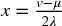 处最大化，二阶条件 λ > 0。

反过来，做市商推测知情交易者的需求是 v 的线性函数：x = α + βv，这意味着 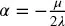 和 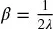。注意流动性越低意味着 λ 越高，意味着知情交易者的需求越低。

Kyle 认为做市商必须在利润最大化和市场效率之间找到均衡，在上述线性函数下，唯一可能的解出现在

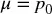

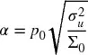

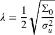

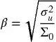

最后，知情交易者的期望利润可以重写为

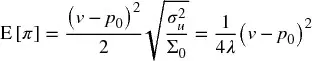

其含义是知情交易者有三个利润来源：

-   证券的错误定价。
-   噪声交易者净订单流的方差。噪声越高，知情交易者越容易隐藏意图。
-   终端证券方差的倒数。波动率越低，越容易将错误定价变现。

在 Kyle 的模型中，变量 λ 捕获价格冲击。流动性不足随 v 的不确定性增加，随噪声量减少。作为特征，可以通过拟合回归

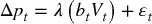

来估计，其中 {p~t~} 是价格的时间序列，{b~t~} 是主动方标志的时间序列，{V~t~} 是交易成交量的时间序列，因此 {b~t~V~t~} 是带符号成交量或净订单流的时间序列。图 19.1 绘制了在 E-mini S&P 500 期货序列上估计的 Kyle lambda 的直方图。

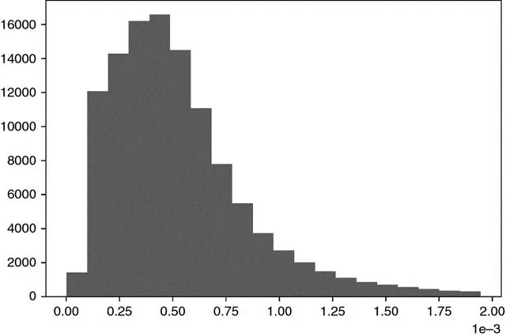

**图 19.1** 在 E-mini S&P 500 期货上计算的 Kyle Lambda

### 19.4.2 Amihud 的 Lambda

Amihud [2002] 研究了绝对收益与流动性不足之间的正相关关系。特别地，他计算了与一美元交易量关联的日价格响应，并认为其值是价格冲击的代理。该思想的一种可能实现是

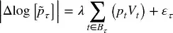

其中 B~τ~ 是包含在条 τ 中的交易集合，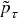 是条 τ 的收盘价，p~t~V~t~ 是交易 t ∈ B~τ~ 涉及的美元成交量。尽管表面简单，Hasbrouck [2009] 发现日 Amihud lambda 估计与有效价差的日内估计表现出高排名相关性。图 19.2 绘制了在 E-mini S&P 500 期货序列上估计的 Amihud lambda 的直方图。

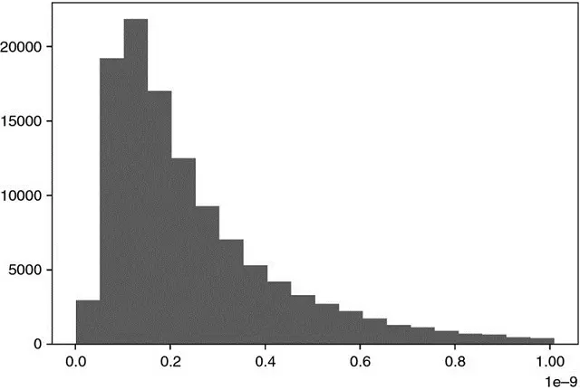

**图 19.2** 在 E-mini S&P 500 期货上估计的 Amihud Lambda

### 19.4.3 Hasbrouck 的 Lambda

Hasbrouck [2009] 跟进 Kyle 和 Amihud 的思想，将它们应用于基于交易和报价（TAQ）数据估计价格冲击系数。他使用 Gibbs 采样器对回归规范

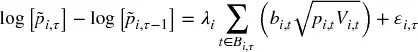

进行贝叶斯估计，其中 B~i,τ~ 是包含在证券 i（i = 1, ..., I）条 τ 中的交易集合，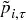 是证券 i 条 τ 的收盘价，b~i,t~ ∈ {−1, 1} 指示交易 t ∈ B~i,τ~ 是买入发起还是卖出发起；p~i,t~V~i,t~ 是交易 t ∈ B~i,τ~ 涉及的美元成交量。然后我们可以估计每个证券 i 的 λ~i~，并将其用作近似交易有效成本（市场冲击）的特征。

与大多数文献一致，Hasbrouck 建议使用 5 分钟时间条采样 tick。然而，出于[第 2 章](ch02.md)中讨论的原因，通过与市场活动同步的随机采样方法可以获得更好的结果。图 19.3 绘制了在 E-mini S&P 500 期货序列上估计的 Hasbrouck lambda 的直方图。

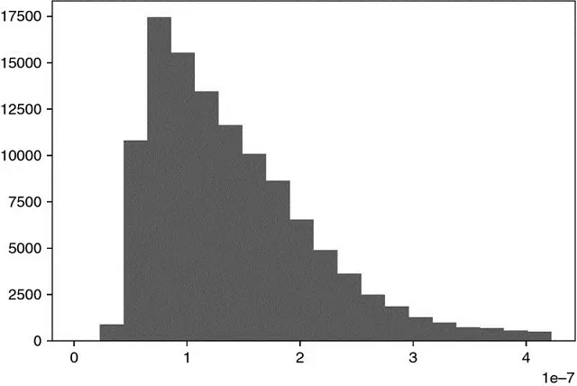

**图 19.3** 在 E-mini S&P 500 期货上估计的 Hasbrouck Lambda

## 19.5 第三代：序贯交易模型

正如我们在上一节中所见，战略交易模型以一个可以在多个时间交易的知情交易者为特征。在本节中，我们将讨论一种替代模型，其中随机选择的交易者序贯且独立地到达市场。

自出现以来，序贯交易模型在做市商中变得非常流行。一个原因是它们纳入了流动性提供者面临的不确定性来源，即信息事件发生的概率、该事件为负面的概率、噪声交易者的到达率和知情交易者的到达率。有了这些变量，做市商必须动态更新报价并管理库存。

### 19.5.1 信息交易概率

Easley 等 [1996] 使用交易数据确定单个证券的信息交易概率（PIN）。该微观结构模型将交易视为做市商和持仓者之间在多个交易期间重复进行的博弈。

将证券价格记为 S，当前价值为 S~0~。然而，一旦一定量的新信息被纳入价格，S 将是 S~B~（坏消息）或 S~G~（好消息）。新信息在分析时间范围内到达的概率为 α，消息为坏的概率为 δ，消息为好的概率为 (1−δ)。这些作者证明，证券价格的期望值可以在时间 t 计算为

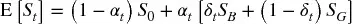

遵循泊松分布，知情交易者以速率 μ 到达，非知情交易者以速率 ε 到达。然后，为避免知情交易者造成的损失，做市商在买价 B~t~ 处达到盈亏平衡，

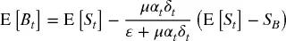

时间 t 的盈亏平衡卖价 A~t~ 必须是，

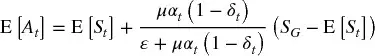

因此盈亏平衡买卖价差确定为

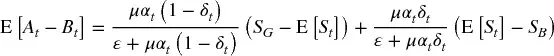

对于标准情况 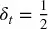，我们得到

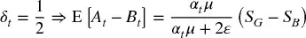

该方程告诉我们，确定做市商提供流动性的价格范围的关键因素是

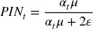

下标 t 表示概率 α 和 δ 是在该时间点估计的。作者应用贝叶斯更新过程，在每笔交易到达市场后纳入信息。

为确定 PIN~t~ 的值，我们必须估计四个不可观测参数，即 {α, δ, μ, ε}。最大似然方法是拟合三个泊松分布的混合，

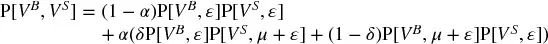

其中 V^B^ 是对卖盘交易的成交量（买入发起交易），V^S^ 是对买盘交易的成交量（卖出发起交易）。

### 19.5.2 成交量同步知情交易概率

Easley 等 [2008] 证明了

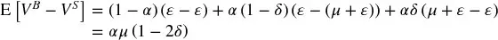

特别地，对于足够大的 μ，

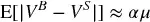

Easley 等 [2011] 提出了 PIN 的高频估计，命名为成交量同步知情交易概率（VPIN）。该程序采用*成交量时钟*，将数据采样与市场活动（以成交量捕获）同步（见[第 2 章](ch02.md)）。然后我们可以估计

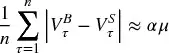

其中 V^B^~τ~ 是成交量条 τ 内买入发起交易的成交量之和，V^S^~τ~ 是成交量条 τ 内卖出发起交易的成交量之和，n 是用于产生该估计的条数。因为所有成交量条大小相同（V），我们按构造知道

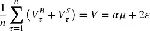

因此，PIN 可以高频估计为

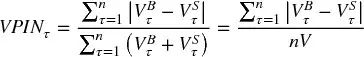

VPIN 的更多细节和案例研究见 Easley 等 [2013]。使用线性回归，Andersen 和 Bondarenko [2013] 得出结论 VPIN 不是波动率的好预测器。然而，多项研究发现 VPIN 确实具有预测力：Abad 和 Yague [2012]、Bethel 等 [2012]、Cheung 等 [2015]、Kim 等 [2014]、Song 等 [2014]、Van Ness 等 [2017] 和 Wei 等 [2013] 等。无论如何，线性回归是 18 世纪数学家（Stigler [1981]）已经知道的技术，经济学家不应惊讶于它在识别 21 世纪金融市场中的复杂非线性模式时失败。

## 19.6 微观结构数据集的附加特征

我们在第 19.3 到 19.5 节研究的特征是由市场微观结构理论提出的。此外，我们应考虑替代特征，这些特征虽然不由理论提出，但我们怀疑携带有关市场参与者运作方式及其未来意图的重要信息。这样做，我们将利用 ML 算法的力量，它可以学习如何使用这些特征而不需要理论的具体指导。

### 19.6.1 订单大小分布

Easley 等 [2016] 研究了每个交易大小的交易频率，发现具有整数大小的交易异常频繁。例如，频率率随交易大小快速衰减，但整数交易大小 {5, 10, 20, 25, 50, 100, 200, ...} 例外。这些作者将此现象归因于所谓的「鼠标」或「GUI」交易员，即通过点击 GUI（图形用户界面）上的按钮发送订单的人工交易员。以 E-mini S&P 500 为例，大小 10 比大小 9 频繁 2.9 倍；大小 50 比大小 49 可能性高 10.9 倍；大小 100 比大小 99 频繁 16.8 倍；大小 200 比大小 199 可能性高 27.2 倍；大小 250 比大小 249 频繁 32.5 倍；大小 500 比大小 499 频繁 57.1 倍。此类模式不是「硅交易员」的典型，后者通常被编程为随机化交易以掩盖其在市场中的足迹。

一个有用的特征可能是确定整数大小交易的正常频率，并监控与该期望值的偏差。ML 算法可以例如确定，高于通常比例的整数大小交易是否与趋势关联，因为人工交易员倾向于以基本面观点、信念或确信下注。相反，低于通常比例的整数大小交易可能增加价格横盘的可能性，因为硅交易员通常不持有长期观点。

### 19.6.2 撤单率、限价单和市价单

Eisler 等 [2012] 研究了市价单、限价单和报价撤单的影响。这些作者发现小股票对这些事件的响应不同于大股票。他们得出结论，衡量这些量级与建模买卖价差的动态相关。

Easley 等 [2012] 还认为，高报价撤单率可能表明低流动性，因为参与者发布的报价不打算成交。他们讨论了四类掠夺性算法：

-   **报价塞子：** 它们从事「延迟套利」。其策略涉及用消息淹没交易所，唯一目的是减慢竞争算法，后者被迫解析只有发起者知道可以忽略的消息。
-   **报价悬挂者：** 该策略发送报价，迫使被挤压的交易者违背其利益追逐价格。O'Hara [2011] 展示了其破坏性活动的证据。
-   **流动性挤压者：** 当困境中的大型投资者被迫平仓时，掠夺性算法同方向交易，尽可能多地抽取流动性。结果，价格超调，它们获利（Carlin 等 [2007]）。
-   **群体猎手：** 独立狩猎的掠夺者意识到彼此的活动，形成群体以最大化触发级联效应的机会（Donefer [2010]、Fabozzi 等 [2011]、Jarrow 和 Protter [2011]）。NANEX [2011] 展示了似乎是群体猎手强制止损的情况。虽然它们的个体行为太小而不引起监管者的怀疑，但它们的集体行为可能是市场操纵性的。当这种情况发生时，很难证明它们的串通，因为它们以去中心化、自发的方式协调。

这些掠夺性算法利用报价撤单和各种订单类型试图逆向选择做市商。它们在交易记录中留下不同的签名，衡量报价撤单、限价单和市价单的比率可以成为有用的特征，提供其意图的信息。

### 19.6.3 时间加权平均价格执行算法

Easley 等 [2012] 展示了如何识别针对特定时间加权平均价格（TWAP）的执行算法的存在。TWAP 算法是一种将大订单切成小订单、以规律时间间隔提交的算法，试图实现预定义的时间加权平均价格。这些作者取了 2010 年 11 月 7 日至 2011 年 11 月 7 日期间 E-mini S&P 500 期货的交易样本。他们一天分为 24 小时，每小时将每秒的交易成交量相加（不论分钟）。然后他们将这些汇总成交量绘制为曲面，x 轴分配给每秒成交量，y 轴分配给一天中的小时，z 轴分配给汇总成交量。该分析允许我们看到随着一天过去每分钟内成交量的分布，并在时间时间空间上搜索执行其大量订单的低频交易者。几乎一天中的每个小时，一分钟内最大的成交量集中倾向于发生在前几秒。这在 00:00-01:00 GMT（亚洲市场开盘附近）、05:00-09:00 GMT（英国和欧洲股票开盘附近）、13:00-15:00 GMT（美国股票开盘附近）和 20:00-21:00 GMT（美国股票收盘附近）尤其如此。

一个有用的 ML 特备可能是评估每分钟开始时的订单不平衡，并确定是否存在持续成分。然后可以用于抢跑大型机构投资者，同时其 TWAP 订单的更大部分仍在待处理。

### 19.6.4 期权市场

Muravyev 等 [2013] 使用美国股票和期权的微观结构信息研究两个市场不一致的事件。他们通过推导看跌-看涨平价报价隐含的底层买卖范围并将其与股票的实际买卖范围比较来表征此类不一致。他们得出结论，不一致倾向于以股票报价为准来解决，意味着期权*报价*不包含经济上显著的信息。同时，他们确实发现期权*交易*包含股票价格中未包含的信息。这些发现对于习惯于交易相对不流动产品（包括股票期权）的投资组合经理来说并不意外。报价可以在长时间内保持非理性，即使稀疏的价格是有信息量的。

Cremers 和 Weinbaum [2010] 发现，具有相对昂贵的看涨期权（同时具有高波动率价差和高波动率价差变化的股票）的股票表现优于具有相对昂贵的看跌期权（同时具有低波动率价差和低波动率价差变化的股票）的股票，每周超出 50 个基点。当期权流动性高且股票流动性低时，这种可预测性程度更大。

根据这些观察，有用的特征可以从计算由期权交易推导的看跌-看涨隐含股票价格中提取。期货价格仅代表均值或期望的未来值。但期权价格允许我们推导被定价的完整结果分布。ML 算法可以搜索各种行权价和到期日的希腊字母报价中的模式。

### 19.6.5 带符号订单流的序列相关

Toth 等 [2011] 研究了伦敦证券交易所股票的带符号订单流，发现订单符号在许多天内呈正自相关。他们将此观察归因于两个候选解释：羊群效应和订单拆分。他们得出结论，在少于几小时的时间尺度上，订单流的持续性主要由拆分而非羊群效应引起。

鉴于市场微观结构理论将订单流不平衡的持续性归因于知情交易者的存在，通过带符号成交量的序列相关来衡量此类持续性的强度是有意义的。此类特征将是我们第 19.5 节研究的特征的补充。

## 19.7 什么是微观结构信息？

让我通过解决我认为是市场微观结构文献中一个主要缺陷的问题来结束本章。关于该主题的大多数文章和书籍研究不对称信息，以及战略代理人如何利用它从做市商中获利。但信息在交易的上下文中究竟如何定义？遗憾的是，在微观结构意义上没有被广泛接受的信息定义，文献以惊人的松散而非正式的方式使用这一概念（López de Prado [2017]）。本节提出一个基于信号处理的适当信息定义，可应用于微观结构研究。

考虑一个特征矩阵 X = {X~t~}~t=1,...,T~，包含做市商通常用于确定是否在特定水平提供流动性或撤销其被动报价的信息。例如，列可以是本章讨论的所有特征，如 VPIN、Kyle lambda、撤单率等。矩阵 X 对每个决策点有一行。例如，做市商可以在每交易 10000 份合约时重新考虑提供流动性或退出市场的决策，或每当价格发生显著变化时（回忆[第 2 章](ch02.md)中的采样方法）等。第一，我们推导一个数组 y = {y~t~}~t=1,...,T~，将导致做市盈利的观测分配标签 1，将导致做市亏损的观测分配标签 0（标记方法见[第 3 章](ch03.md)）。第二，我们在训练集 (X, y) 上拟合分类器。第三，随着新的样本外观测到达 τ > T，我们使用拟合的分类器预测标签 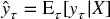。第四，我们推导这些预测的交叉熵损失 L~τ~，如[第 9 章](ch09.md)第 9.4 节。第五，我们在负交叉熵损失数组 {L~t~}~t=T+1,...,τ~ 上拟合核密度估计器（KDE），推导其累积分布函数 F。第六，我们估计时间 t 的微观结构信息为 φ~τ~ = F[−L~τ~]，其中 φ~τ~ ∈ (0, 1)。

该微观结构信息可以理解为做市商决策模型面临的复杂性。在正常市场条件下，做市商产生具有低交叉熵损失的*知情预测*，能够从向持仓者提供流动性中获利。然而，在（不对称）知情交易者存在的情况下，做市商产生*非知情预测*（以高交叉熵损失衡量），他们被逆向选择。换言之，微观结构信息只能相对于做市商的预测力来定义和衡量。其含义是 {φ~τ~} 应成为你金融 ML 工具箱中的重要特征。

考虑 2010 年 5 月 6 日闪电崩盘的事件。做市商错误预测他们在买盘上的被动报价可以被成交并以更高水平卖回。崩盘不是由单个不准确预测引起的，而是由数千个预测误差的累积引起的（Easley 等 [2011]）。如果做市商监控了他们预测不断上升的交叉熵损失，他们就会认识到知情交易者的存在和逆向选择危险上升的概率。这将使他们能够将买卖价差扩大到可以阻止订单流不平衡的水平，因为卖方不再愿意以那些折扣卖出。相反，做市商继续以极其慷慨的水平向卖方提供流动性，直到最终被迫止损，触发了震惊市场、监管者和学术界数月乃至数年的流动性危机。

## 练习题

1. 从 E-mini S&P 500 期货的 tick 数据时间序列中：
    1. 应用 tick 规则推导交易符号序列。
    2. 与 CME 提供的主动方（FIX 标签 5797）比较。tick 规则的准确率是多少？
    3. 选择 FIX 标签 5797 与 tick 规则不一致的情况。
        1. 你能看到什么明显的区别来解释不一致？
        2. 这些不一致是否与大的价格跳跃关联？还是高撤单率？还是薄的报价大小？
        3. 这些不一致在高或低市场活动期间更可能发生？

2. 在 E-mini S&P 500 期货 tick 数据的时间序列上计算 Roll 模型。
    1. σ²~u~ 和 c 的估计值是多少？
    2. 知道该合约是世界上最流动的产品之一，且以最紧的可能买卖价差交易，这些值是否符合你的预期？

3. 在 E-mini S&P 500 期货上计算高低价波动率估计器（第 19.3.3 节）：
    1. 使用周度值，这与收盘-收盘收益的标准差有何不同？
    2. 使用日度值，这与收盘-收盘收益的标准差有何不同？
    3. 使用美元条（平均每天 50 条），这与收盘-收盘收益的标准差有何不同？

4. 将 Corwin-Schultz 估计器应用于 E-mini S&P 500 期货的日度序列。
    1. 期望的买卖价差是多少？
    2. 隐含波动率是多少？
    3. 这些估计是否与练习 2 和 3 的结果一致？

5. 从以下数据计算 Kyle lambda：
    1. tick 数据。
    2. E-mini S&P 500 期货美元条的时间序列，其中：
        1. b~t~ 是交易符号的成交量加权平均。
        2. V~t~ 是该条中的成交量之和。
        3. Δp~t~ 是两个连续条之间的价格变化。

6. 重复练习 5，这次应用 Hasbrouck lambda。结果是否一致？

7. 重复练习 5，这次应用 Amihud lambda。结果是否一致？

8. 在 E-mini S&P 500 期货上形成成交量条的时间序列：
    1. 计算 2010 年 5 月 6 日（闪电崩盘）的 VPIN 序列。
    2. 绘制 VPIN 和价格的序列。你看到了什么？

9. 计算 E-mini S&P 500 期货的订单大小分布：
    1. 整个期间。
    2. 2010 年 5 月 6 日。
    3. 对两个分布进行 Kolmogorov-Smirnov 检验。它们在 95% 置信水平下是否显著不同？

10. 计算 E-mini S&P 500 期货数据集上的日报价撤单率和市价单部分的时间序列。
    1. 这两个序列之间的相关性是多少？是否统计显著？
    2. 这两个序列与日波动率之间的相关性是多少？这是你预期的吗？

11. 在 E-mini S&P 500 期货 tick 数据上：
    1. 计算每分钟前 5 秒内执行的成交量分布。
    2. 计算每分钟内执行的成交量分布。
    3. 对两个分布进行 Kolmogorov-Smirnov 检验。它们在 95% 置信水平下是否显著不同？

12. 在 E-mini S&P 500 期货 tick 数据上：
    1. 计算带符号成交量的一阶序列相关。
    2. 在 95% 置信水平下是否统计显著？

## 参考文献

1. Abad, D. and J. Yague (2012): "From PIN to VPIN." *The Spanish Review of Financial Economics*, Vol. 10, No. 2, pp. 74--83.
2. Aitken, M. and A. Frino (1996): "The accuracy of the tick test." *Journal of Banking and Finance*, Vol. 20, pp. 1715--1729.
3. Amihud, Y. and H. Mendelson (1987): "Trading mechanisms and stock returns." *Journal of Finance*, Vol. 42, pp. 533--553.
4. Amihud, Y. (2002): "Illiquidity and stock returns." *Journal of Financial Markets*, Vol. 5, pp. 31--56.
5. Andersen, T. and O. Bondarenko (2013): "VPIN and the Flash Crash." *Journal of Financial Markets*, Vol. 17, pp. 1--46.
6. Beckers, S. (1983): "Variances of security price returns based on high, low, and closing prices." *Journal of Business*, Vol. 56, pp. 97--112.
7. Bethel, E. W., D. Leinweber, O. Rubel, and K. Wu (2012): "Federal market information technology in the post-flash crash era." *Journal of Trading*, Vol. 7, No. 2, pp. 9--25.
8. Carlin, B., M. Sousa Lobo, and S. Viswanathan (2005): "Episodic liquidity crises." *Journal of Finance*, Vol. 42, No. 5, pp. 2235--2274.
9. Cheung, W., R. Chou, A. Lei (2015): "Exchange-traded barrier option and VPIN." *Journal of Futures Markets*, Vol. 35, No. 6, pp. 561--581.
10. Corwin, S. and P. Schultz (2012): "A simple way to estimate bid-ask spreads from daily high and low prices." *Journal of Finance*, Vol. 67, No. 2, pp. 719--760.
11. Cremers, M. and D. Weinbaum (2010): "Deviations from put-call parity and stock return predictability." *Journal of Financial and Quantitative Analysis*, Vol. 45, No. 2, pp. 335--367.
12. Donefer, B. (2010): "Algos gone wild." *Journal of Trading*, Vol. 5, pp. 31--34.
13. Easley, D., N. Kiefer, M. O'Hara, and J. Paperman (1996): "Liquidity, information, and infrequently traded stocks." *Journal of Finance*, Vol. 51, No. 4, pp. 1405--1436.
14. Easley, D., R. Engle, M. O'Hara, and L. Wu (2008): "Time-varying arrival rates of informed and uninformed traders." *Journal of Financial Econometrics*, Vol. 6, No. 2, pp. 171--207.
15. Easley, D., M. López de Prado, and M. O'Hara (2011): "The microstructure of the flash crash." *Journal of Portfolio Management*, Vol. 37, No. 2, pp. 118--128.
16. Easley, D., M. López de Prado, and M. O'Hara (2012a): "Flow toxicity and liquidity in a high frequency world." *Review of Financial Studies*, Vol. 25, No. 5, pp. 1457--1493.
17. Easley, D., M. López de Prado, and M. O'Hara (2012b): "The volume clock." *Journal of Portfolio Management*, Vol. 39, No. 1, pp. 19--29.
18. Easley, D., M. López de Prado, and M. O'Hara (2013): *High-Frequency Trading*, 1st ed. Risk Books.
19. Easley, D., M. López de Prado, and M. O'Hara (2016): "Discerning information from trade data." *Journal of Financial Economics*, Vol. 120, No. 2, pp. 269--286.
20. Eisler, Z., J. Bouchaud, and J. Kockelkoren (2012): "The impact of order book events." *Quantitative Finance*, Vol. 12, No. 9, pp. 1395--1419.
21. Fabozzi, F., S. Focardi, and C. Jonas (2011): "High-frequency trading." *Review of Futures Markets*, Vol. 19, pp. 7--38.
22. Hasbrouck, J. (2007): *Empirical Market Microstructure*, 1st ed. Oxford University Press.
23. Hasbrouck, J. (2009): "Trading costs and returns for US equities." *Journal of Finance*, Vol. 64, No. 3, pp. 1445--1477.
24. Jarrow, R. and P. Protter (2011): "A dysfunctional role of high frequency trading." *International Journal of Theoretical and Applied Finance*, Vol. 15, No. 3.
25. Kim, C., T. Perry, and M. Dhatt (2014): "Informed trading and price discovery around the clock." *Journal of Alternative Investments*, Vol. 17, No. 2, pp. 68--81.
26. Kyle, A. (1985): "Continuous auctions and insider trading." *Econometrica*, Vol. 53, pp. 1315--1336.
27. Lee, C. and M. Ready (1991): "Inferring trade direction from intraday data." *Journal of Finance*, Vol. 46, pp. 733--746.
28. López de Prado, M. (2017): "Mathematics and economics: A reality check." *Journal of Portfolio Management*, Vol. 43, No. 1, pp. 5--8.
29. Muravyev, D., N. Pearson, and J. Broussard (2013): "Is there price discovery in equity options?" *Journal of Financial Economics*, Vol. 107, No. 2, pp. 259--283.
30. NANEX (2011): "Strange days: June 8, 2011—NatGas Algo." NANEX blog. Available at www.nanex.net/StrangeDays/06082011.html.
31. O'Hara, M. (1995): *Market Microstructure*, 1st ed. Blackwell, Oxford.
32. O'Hara, M. (2011): "What is a quote?" *Journal of Trading*, Vol. 5, No. 2, pp. 10--15.
33. Parkinson, M. (1980): "The extreme value method for estimating the variance of the rate of return." *Journal of Business*, Vol. 53, pp. 61--65.
34. Patzelt, F. and J. Bouchaud (2017): "Universal scaling and nonlinearity of aggregate price impact." Working paper. Available at https://arxiv.org/abs/1706.04163.
35. Roll, R. (1984): "A simple implicit measure of the effective bid-ask spread." *Journal of Finance*, Vol. 39, pp. 1127--1139.
36. Stigler, Stephen M. (1981): "Gauss and the invention of least squares." *Annals of Statistics*, Vol. 9, No. 3, pp. 465--474.
37. Song, J., K. Wu and H. Simon (2014): "Parameter analysis of the VPIN metric." In *Quantitative Financial Risk Management*, 1st ed. Wiley.
38. Toth, B., I. Palit, F. Lillo, and J. Farmer (2011): "Why is order flow so persistent?" Working paper. Available at https://arxiv.org/abs/1108.1632.
39. Van Ness, B., R. Van Ness, and S. Yildiz (2017): "The role of HFTs in order flow toxicity." *Journal of Economics and Finance*, Vol. 41, No. 4, pp. 739--762.
40. Wei, W., D. Gerace, and A. Frino (2013): "Informed trading, flow toxicity and the impact on intraday trading factors." *Australasian Accounting Business and Finance Journal*, Vol. 7, No. 2, pp. 3--24.
