# 多进程与向量化

## 20.1 动机

多进程对 ML 至关重要。ML 算法计算量大，需要高效利用所有 CPU、服务器和集群。出于这个原因，本书中提出的大多数函数都是为异步多进程设计的。例如，我们频繁使用了一个神秘的函数 `mpPandasObj`，却从未定义它。在本章中，我们将解释该函数的功能。此外，我们将详细研究如何开发多进程引擎。本章提出的程序结构对用于执行它们的硬件架构是不可知的，无论我们使用单个服务器的核心还是分布在多个互联服务器上的核心（例如，在高性能计算集群或云中）。

## 20.2 向量化示例

向量化（又称数组编程）是并行化的最简单示例，其中一个操作一次应用于整个值集合。作为一个最简示例，假设你需要对一个 3 维空间进行暴力搜索，每个维度 2 个节点。该笛卡尔积的非向量化实现看起来像代码片段 20.1。如果你必须搜索 100 个维度，或者维度数由用户在运行时定义，这段代码会是什么样子？

> **代码片段 20.1 非向量化的笛卡尔积**

> 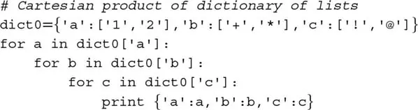

向量化解决方案将所有显式迭代器（如 `For...loops`）替换为矩阵代数操作或编译的迭代器或生成器。代码片段 20.2 实现了代码片段 20.1 的向量化版本。向量化版本更优有四个原因：(1) 慢的嵌套 `For...loops` 被快速迭代器取代；(2) 代码从 `dict0` 的维度推断网格的维度；(3) 我们可以运行 100 个维度而无需修改代码或需要 100 个 `For...loops`；(4) 在底层，Python 可以用 C 或 C++ 运行操作。

> **代码片段 20.2 向量化的笛卡尔积**

> 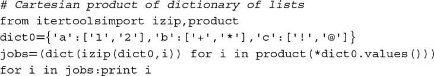

## 20.3 单线程 vs 多线程 vs 多进程

现代计算机有多个 CPU 插槽。每个 CPU 有多个核心（处理器），每个核心有几个线程。多线程是在两个或更多线程上并行运行多个应用程序的技术。多线程的一个优势是，由于应用程序共享同一个核心，它们共享相同的内存空间。这引入了几个应用程序可能同时写入相同内存空间的风险。为防止这种情况发生，全局解释器锁（GIL）一次将写访问分配给每个核心的一个线程。在 GIL 下，Python 的多线程被限制为每个处理器一个线程。因此，Python 通过多进程而非真正的多线程实现并行性。处理器不共享相同的内存空间，因此多进程不会有写入相同内存空间的风险；然而，这也使得在进程之间共享对象更加困难。

为单线程运行实现的 Python 函数将只使用现代计算机、服务器或集群的一小部分算力。让我们看一个简单任务在单线程执行时如何低效运行的示例。代码片段 20.3 找到 10000 个长度为 1000 的高斯过程触及宽度为标准差 50 倍的对称双重屏障的最早时间。

> **代码片段 20.3 一次触及双重屏障的单线程实现**

> 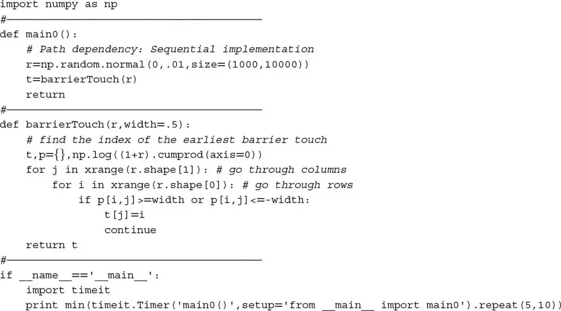

将此实现与代码片段 20.4 比较。现在代码将前一个问题拆分为 24 个任务，每个处理器一个。然后使用 24 个处理器异步并行运行这些任务。如果你在 5000 个 CPU 的集群上运行相同的代码，经过时间将约为单线程实现的 1/5000。

> **代码片段 20.4 一次触及双重屏障的多进程实现**

> 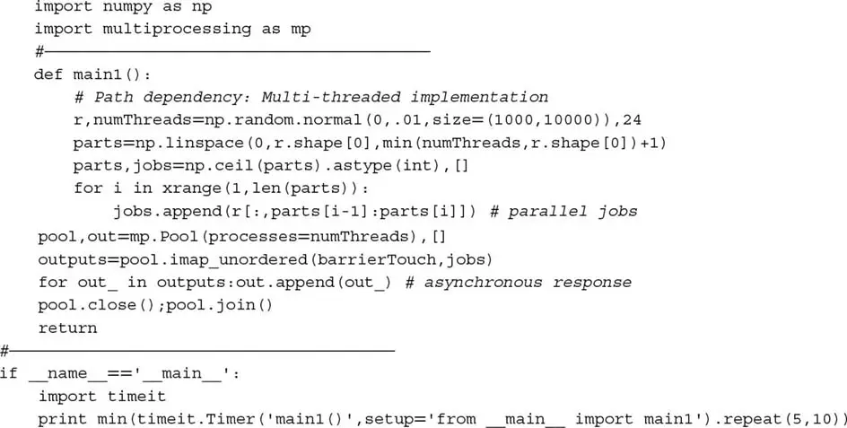

此外，你可以实现相同的代码来多进程一个向量化函数，正如我们在[第 3 章](ch03.md)中对函数 `applyPtSlOnT1` 所做的，其中并行进程执行包含向量化 pandas 对象的子程序。这样，你将同时实现两个级别的并行化。但为什么要停在那里？你可以通过在 HPC 集群中运行向量化代码的多进程实例来实现三个级别的并行化，其中集群中的每个节点提供第三级并行化。在接下来的各节中，我们将解释多进程如何工作。

## 20.4 原子与分子

在为并行化准备作业时，区分原子和分子是有用的。原子是不可分割的任务。我们不想在单个线程中顺序执行所有这些任务，而是将它们分组成分子，这些分子可以使用多个处理器并行处理。每个分子是一个原子子集，将由回调函数使用单个线程顺序处理。并行化发生在分子级别。

### 20.4.1 线性分区

形成分子的最简单方法是将原子列表划分为相等大小的子集，其中子集数是处理器数和原子数之间的最小值。对于 N 个子集，我们需要找到包围分区的 N+1 个索引。该逻辑在代码片段 20.5 中演示。

> **代码片段 20.5 `linParts` 函数**

> 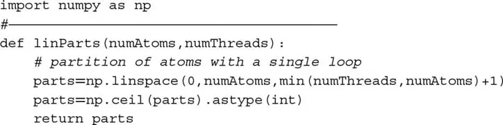

经常遇到涉及两个嵌套循环的操作。例如，计算 SADF 序列（[第 17 章](ch17.md)）、评估多重障碍触及（[第 3 章](ch03.md)）或计算未对齐序列上的协方差矩阵。在这些情况下，原子任务的线性分区将是低效的，因为一些处理器必须比其他处理器解决更多的操作，计算时间将取决于最重的分子。一个部分解决方案是将原子任务划分为处理器数倍数的作业，然后用重分子前加载作业队列。这样，轻分子将分配给先完成重分子的处理器，使所有 CPU 保持忙碌直到作业队列耗尽。在下一节中，我们将讨论更完整的解决方案。图 20.1 绘制了 20 个等复杂度原子任务到 6 个分子的线性分区。

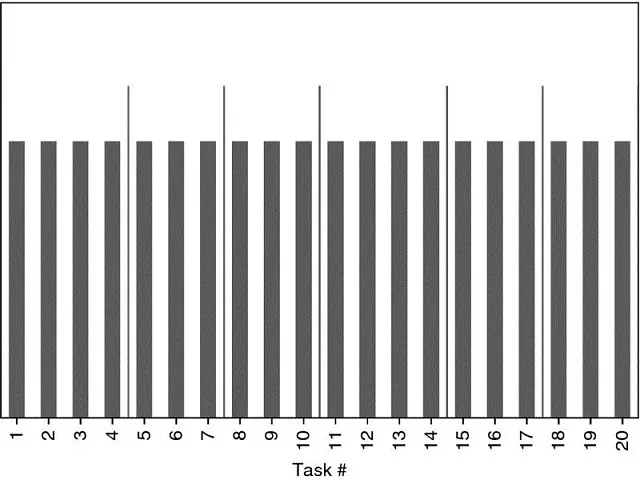

图 20.1 20 个原子任务到 6 个分子的线性分区

### 20.4.2 双嵌套循环分区

考虑两个嵌套循环，其中外循环迭代 i = 1, ..., N，内循环迭代 j = 1, ..., i。我们可以将这些原子任务 {(i, j)|1 ≤ j ≤ i, i = 1, ..., N} 排列为一个*下*三角矩阵（包括主对角线）。这涉及 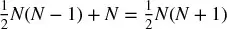 次操作，其中 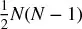 是非对角的，N 是对角的。我们希望通过将原子任务划分为 M 个行子集 {S~m~}~m=1,...,M~ 来并行化这些任务，每个子集大约包含  个任务。以下算法确定构成每个子集（分子）的行。

第一个子集 S~1~ 由前 r~1~ 行组成，即 S~1~ = {1, ..., r~1~}，总项目数为 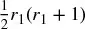。则 r~1~ 必须满足条件 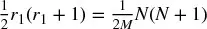。求解 r~1~，我们得到正根

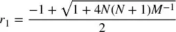

第二个子集包含行 S~2~ = {r~1~+1, ..., r~2~}，总项目数为 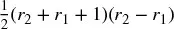。则 r~2~ 必须满足条件 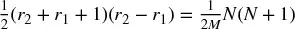。求解 r~2~，我们得到正根

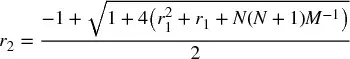

我们可以对未来的子集 S~m~ = {r~m−1~+1, ..., r~m~} 重复相同的论证，总项目数为 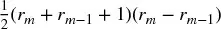。则 r~m~ 必须满足条件 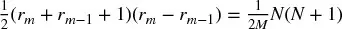。求解 r~m~，我们得到正根

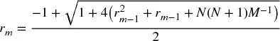

容易看出，当 r~m−1~ = r~0~ = 0 时，r~m~ 退化为 r~1~。因为行号是正整数，上述结果四舍五入到最近的自然数。这可能意味着某些分区的大小可能略微偏离 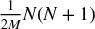 目标。代码片段 20.6 实现了该逻辑。

> **代码片段 20.6 `nestedParts` 函数**

> 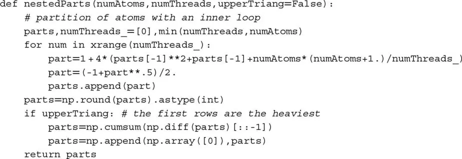

如果外循环迭代 i = 1, ..., N 且内循环迭代 j = i, ..., N，我们可以将这些原子任务 {(i, j)|1 ≤ i ≤ j, j = 1, ..., N} 排列为一个*上*三角矩阵（包括主对角线）。在这种情况下，参数 `upperTriang = True` 必须传给函数 `nestedParts`。对于好奇的读者，这是装箱问题的特例。图 20.2 绘制了复杂度递增的原子到分子的双嵌套循环分区。所得 6 个分子中的每个涉及相似的工作量，即使某些原子任务比其他难达 20 倍。

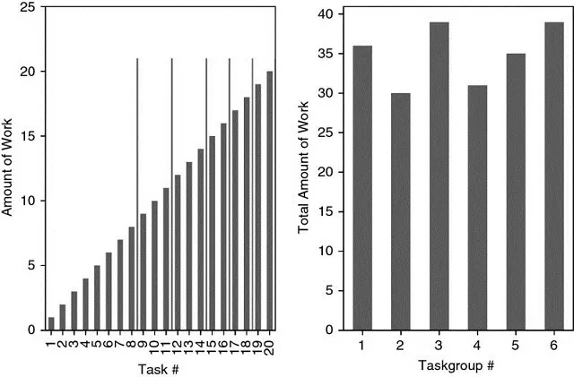

图 20.2 原子到分子的双嵌套循环分区

## 20.5 多进程引擎

为每个多进程函数编写并行化包装器是错误的。相反，我们应该开发一个可以并行化未知函数的库，无论其参数和输出结构如何。这就是多进程引擎的目标。在本节中，我们将研究一个这样的引擎，一旦你理解了逻辑，你就可以开发自己的引擎，包括各种定制属性。

### 20.5.1 准备作业

在前面的章节中，我们频繁使用了 `mpPandasObj`。该函数接收六个参数，其中四个是可选的：

-   `func`：回调函数，将并行执行
-   `pdObj`：包含以下内容的元组：
    -   用于将分子传递给回调函数的参数名称
    -   不可分割任务（原子）的列表，将被分组为分子
-   `numThreads`：将并行使用的线程数（每个线程一个处理器）
-   `mpBatches`：并行批次数（每个核心的作业数）
-   `linMols`：分区是线性的还是双嵌套的
-   `kargs`：`func` 需要的关键字参数

代码片段 20.7 列出了 `mpPandasObj` 的工作方式。第一，原子被分组为分子，使用 `linParts`（每个分子等量的原子）或 `nestedParts`（原子以下三角结构分布）。当 `mpBatches` 大于 1 时，分子数将多于核心数。假设我们将任务分为 10 个分子，其中分子 1 花费的时间是其余的两倍。如果我们在 10 个核心上运行此进程，9 个核心将在运行时的一半时间空闲，等待第一个核心处理分子 1。或者，我们可以设 `mpBatches = 10` 以将该任务分为 100 个分子。这样做，每个核心将获得相等的工作量，即使前 10 个分子花费的时间与接下来的 20 个分子一样多。在此示例中，`mpBatches = 10` 的运行将花费 `mpBatches = 1` 所消耗时间的一半。

第二，我们形成作业列表。作业是一个字典，包含处理分子所需的所有信息，即回调函数、其关键字参数和形成分子的原子子集。第三，如果 `numThreads == 1`（见代码片段 20.8），我们将顺序处理作业，否则并行处理（见第 20.5.2 节）。我们希望选择顺序运行作业的原因是为了调试目的。在多处理器上运行程序时不容易捕获 bug。^1^ 一旦代码调试完毕，我们将希望使用 `numThreads > 1`。第四，我们将每个分子的输出拼接成一个列表、序列或数据帧。

> **代码片段 20.7 `mpPandasObj`，在书中各处使用**

> 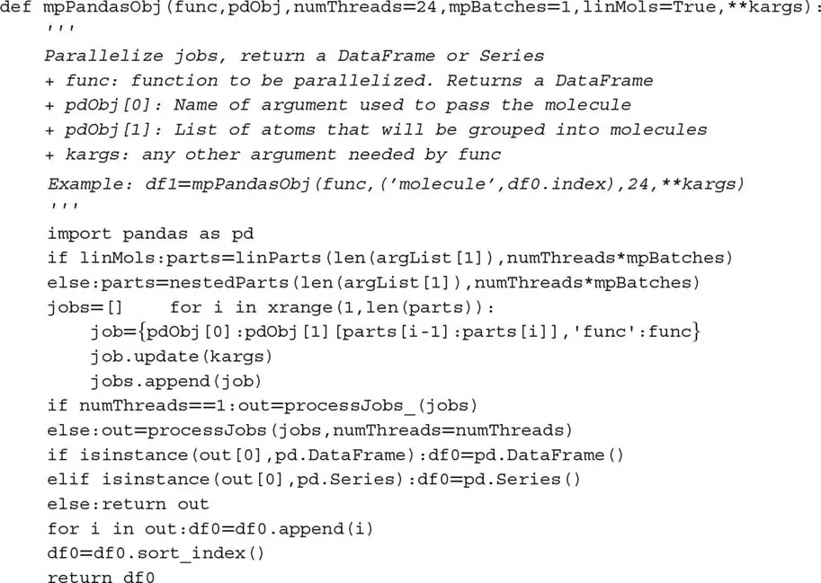

在第 20.5.2 节中，我们将看到代码片段 20.8 中函数 `processJobs_` 的多进程对应物。

> **代码片段 20.8 单线程执行，用于调试**

> 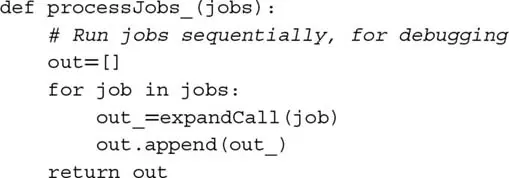

### 20.5.2 异步调用

Python 有一个名为 `multiprocessing` 的并行化库。该库是 `joblib`^2^ 等多进程引擎的基础，后者是许多 `sklearn` 算法^3^ 使用的引擎。代码片段 20.9 展示了如何对 Python 的 `multiprocessing` 库进行异步调用。`reportProgress` 函数让我们了解已完成作业的百分比。

> **代码片段 20.9 对 Python 多进程库进行异步调用的示例**

> 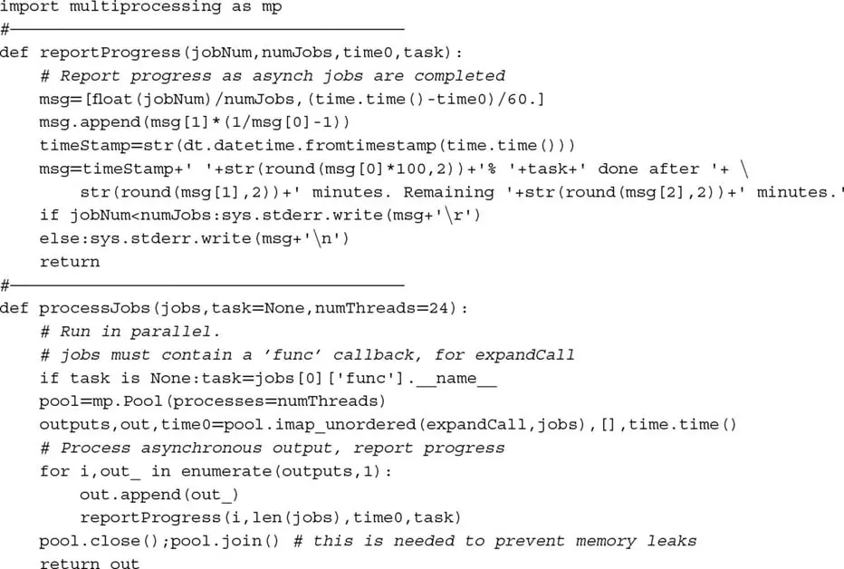

### 20.5.3 解包回调

在代码片段 20.9 中，指令 `pool.imap_unordered()` 通过在单个线程中运行 `jobs`（一个分子）中的每个项目来并行化 `expandCall`。代码片段 20.10 列出了 `expandCall`，它解包作业（分子）中的项目（原子），并执行回调函数。这个小函数是多进程引擎核心的技巧：它将字典转换为任务。一旦你理解了它扮演的角色，你就能开发自己的引擎。

> **代码片段 20.10 将作业（分子）传递给回调函数**

> 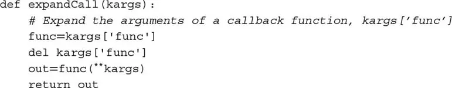

### 20.5.4 Pickle/Unpickle 对象

多进程必须 pickle 方法才能将它们分配给不同的处理器。问题是，绑定方法不可 pickle。^4^ 变通方法是为你的引擎添加功能，告诉库如何处理这类对象。代码片段 20.11 包含应列在多进程引擎库顶部的指令。如果你好奇需要这段代码的确切原因，你可能想阅读 Ascher 等 [2005]，第 7.5 节。

> **代码片段 20.11 将此代码放在引擎的开头**

> 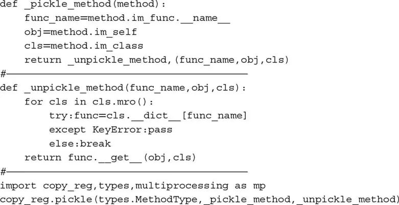

### 20.5.5 输出归约

假设你将任务分为 24 个分子，目标是引擎将每个分子分配给一个可用核心。代码片段 20.9 中的函数 `processJobs` 将捕获 24 个输出并将它们存储在列表中。该方法在输出不大的问题中有效。如果输出必须组合成单个输出，首先我们将等待最后一个分子完成，然后处理列表中的项目。只要输出的大小和数量不大，此后处理增加的延迟应该不显著。

然而，当输出消耗大量 RAM 且需要组合成单个输出时，将所有这些输出存储在列表中可能导致内存错误。在结果由 `func` 异步返回时即时执行输出归约操作会更好，而不是等待最后一个分子完成。我们可以通过改进 processJobs 来解决这个问题。特别是，我们将传递三个额外的参数来确定分子输出如何被*归约*为单个输出。代码片段 20.12 列出了 `processJobs` 的增强版本，包含三个新参数：

-   `redux`：这是执行归约的函数的回调。例如，`redux = pd.DataFrame.add`，如果输出数据帧应该求和。
-   `reduxArgs`：这是一个包含必须传递给 `redux` 的关键字参数的字典（如果有）。例如，如果 `redux = pd.DataFrame.join`，则可能是 `reduxArgs = {'how':'outer'}`。
-   `reduxInPlace`：一个布尔值，指示 `redux` 操作是否应*就地*发生。例如，`redux = dict.update` 和 `redux = list.append` 需要 `reduxInPlace = True`，因为追加列表和更新字典都是就地操作。

> **代码片段 20.12 增强 `processJobs` 以执行即时输出归约**

> 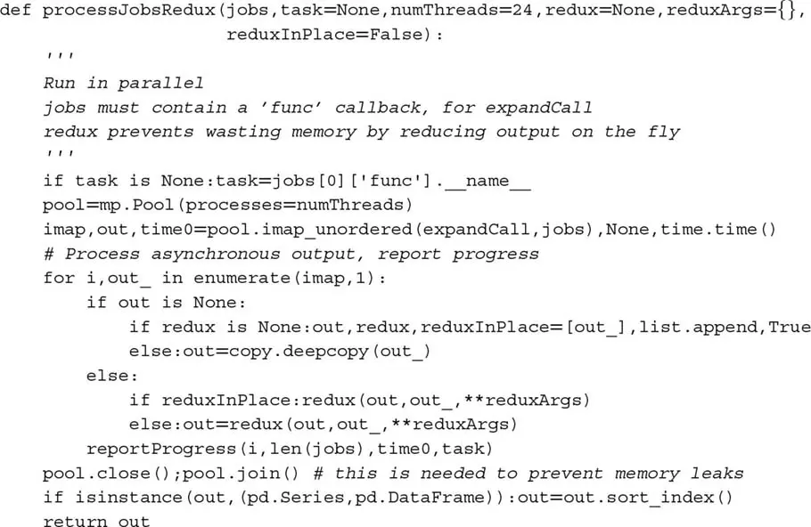

现在 `processJobsRedux` 知道如何处理输出，我们也可以从代码片段 20.7 增强 `mpPandasObj`。在代码片段 20.13 中，新函数 `mpJobList` 将三个输出归约参数传递给 `processJobsRedux`。这消除了像 `mpPandasObj` 那样处理输出列表的需要，从而节省内存和时间。

> **代码片段 20.13 增强 `mpPandasObj` 以执行即时输出归约**

> 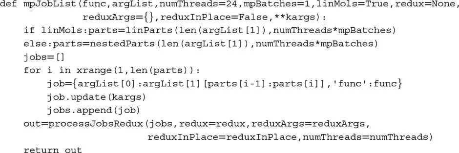

## 20.6 多进程示例

到目前为止本章提出的内容可以将许多冗长的大规模数学运算加速几个数量级。在本节中，我们将说明多进程的额外动机：内存管理。

假设你对 Z'Z 形式的协方差矩阵进行了谱分解（如我们在[第 8 章](ch08.md)第 8.4.2 节中所做的），其中 Z 大小为 T×N。这产生了特征向量矩阵 W 和特征值矩阵 Λ，使得 Z'ZW = WΛ。现在你想推导解释用户定义的总方差部分 0 ≤ τ ≤ 1 的正交主成分。为此，我们计算 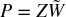，其中 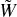 包含 W 的前 M ≤ N 列，使得 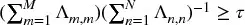。 的计算可以通过注意

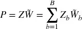

来并行化，其中 Z~b~ 是只有 T×N~b~ 个项目的稀疏 T×N 矩阵（其余为空）， 是只有 N~b~×M 个项目的 N×M 矩阵（其余为空），且 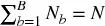。这种稀疏性是通过将列集划分为 B 个列子集分区，并仅将第 b 个列子集加载到 Z~b~ 中创建的。这种稀疏性的概念一开始听起来可能有点复杂，然而代码片段 20.14 展示了 pandas 如何让我们无缝实现它。函数 `getPCs` 通过参数 `eVec` 接收 。参数 `molecules` 包含 `fileNames` 中文件名的子集，其中每个文件代表 Z~b~。要掌握的关键概念是，我们计算 Z~b~ 与 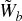 中由 Z~b~ 中的列定义的行片的点积，且分子结果即时聚合（`redux = pd.DataFrame.add`）。

> **代码片段 20.14 列子集的主成分**

> 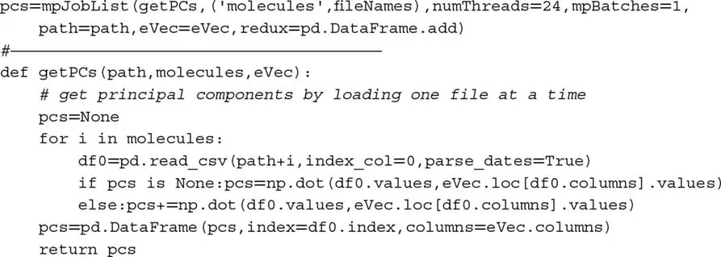

该方法有两个优势：第一，因为 `getPCs` 顺序加载数据帧 Z~b~，对于足够大的 B，RAM 不会被耗尽。第二，`mpJobList` 并行执行分子，从而加速计算。

在真实的 ML 应用中，我们经常遇到 Z 包含数十亿数据点的数据集。正如本例所示，并行化不仅在减少运行时间方面有益。许多问题如果没有并行化就无法解决，这是出于内存限制，即使我们愿意等待更长时间。

## 练习题

1. 用 `timeit` 运行代码片段 20.1 和 20.2。重复 10 批 100 次执行。每个代码片段的最小经过时间是多少？

2. 代码片段 20.2 中的指令对单元测试、暴力搜索和情景分析非常有用。你能记得书中其他哪里见过它们吗？还可以在哪里使用它们？

3. 调整代码片段 20.4，使用双嵌套循环方案而非线性方案形成分子。

4. 用 `timeit` 比较：
    1. 代码片段 20.4，重复 10 批 100 次执行。每个代码片段的最小经过时间是多少？
    2. 修改代码片段 20.4（来自练习 3），重复 10 批 100 次执行。每个代码片段的最小经过时间是多少？

5. 使用 `mpPandasObj` 简化代码片段 20.4。

6. 修改 `mpPandasObj` 以处理使用具有上三角结构的双嵌套循环方案形成分子的可能性。

## 参考文献

1. Ascher, D., A. Ravenscroft, and A. Martelli (2005): *Python Cookbook*, 2nd ed. O'Reilly Media.

## 参考书目

1. Gorelick, M. and I. Ozsvald (2008): *High Performance Python*, 1st ed. O'Reilly Media.
2. López de Prado, M. (2017): "Supercomputing for finance: A gentle introduction." Lecture materials, Cornell University. Available at https://ssrn.com/abstract=2907803.
3. McKinney, W. (2012): *Python for Data Analysis*, 1st ed. O'Reilly Media.
4. Palach, J. (2008): *Parallel Programming with Python*, 1st ed. Packt Publishing.
5. Summerfield, M. (2013): *Python in Practice*, 1st ed. Addison-Wesley.
6. Zaccone, G. (2015): *Python Parallel Programming Cookbook*, 1st ed. Packt Publishing.

## 注释

^1^ *海森堡 bug*（Heisenbugs）以海森堡不确定性原理命名，描述的是在被审查时改变行为的 bug。多进程 bug 是典型的例子。

^2^ https://pypi.python.org/pypi/joblib.

^3^ http://scikit-learn.org/stable/developers/performance.html#multi-core-parallelism-using-joblib-parallel.

^4^ http://stackoverflow.com/questions/1816958/cant-pickle-type-instancemethod-when-using-pythons-multiprocessing-pool-ma.
