# 暴力搜索与量子计算

## 21.1 动机

离散数学自然地出现在多个 ML 问题中，包括层次聚类、网格搜索、基于阈值的决策和整数优化。有时，这些问题没有已知的解析（闭式）解，甚至没有近似它的启发式方法，我们唯一的希望是通过暴力搜索。在本章中，我们将研究一个对现代超级计算机来说棘手的金融问题如何被重新表述为整数优化问题。这种表示使其适合量子计算机。从这个例子中，读者可以推断如何将他特定的金融 ML 棘手问题转化为量子暴力搜索。

## 21.2 组合优化

组合优化问题可以描述为存在有限数量可行解的问题，这些解由有限数量变量的离散值组合产生。随着可行组合数量的增长，穷举搜索变得不切实际。旅行商问题是已知为 NP 困难（Woeginger [2003]）的组合优化问题的例子，即至少与非确定性多项式时间内可解的最难问题一样难的类别。

使穷举搜索不切实际的是，标准计算机顺序评估和存储可行解。但如果我们可以一次评估和存储所有可行解呢？这就是量子计算机的目标。标准计算机的比特一次只能采用两种可能状态（{0, 1}）之一，而量子计算机依赖量子比特（qubit），这是可以保持两种状态*线性叠加*的内存元素。理论上，量子计算机由于量子力学现象可以实现这一点。在某些实现中，量子比特可以同时支持两个方向的电流，从而提供所需的叠加。这种线性叠加特性使量子计算机非常适合求解 NP 困难组合优化问题。量子计算机能力的全面论述见 Williams [2010]。

理解该方法的最佳方式是通过特定示例。我们现在将看到受一般交易成本函数约束的动态投资组合优化问题如何表示为量子计算机可处理的组合优化问题。与 Garleanu 和 Pedersen [2012] 不同，我们不假设收益来自 IID 高斯分布。这个问题对大型资产管理公司特别相关，因为过度换手和实现 shortfall 的成本可能严重侵蚀其投资策略的盈利能力。

## 21.3 目标函数

考虑一组资产 X = {x~i~}，i = 1, ..., N，其收益在每个时间范围 h = 1, ..., H 上遵循多元正态分布，具有变化的均值和方差。我们假设收益是多元正态的、时间独立的，但非时间同分布。我们定义交易轨迹为 N×H 矩阵 ω，确定在 H 个范围上分配给 N 个资产中每一个的资本比例。在特定范围 h = 1, ..., H 处，我们有预测均值 μ~h~、预测方差 V~h~ 和预测交易成本函数 τ~h~[ω]。这意味着，给定交易轨迹 ω，我们可以计算期望投资收益向量 r，如

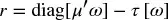

其中 τ[ω] 可以采用任何函数形式。不失一般性，考虑以下：

-   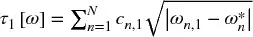
-   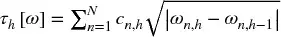，对于 h = 2, ..., H
-   ω~n~ 是工具 n 的初始配置，n = 1, ..., N

τ[ω] 是交易成本的 H×1 向量。换言之，与每个资产关联的交易成本是资本配置变化平方根之和，乘以随 h 变化的资产特定因子 C~h~ = {c~n,h~}~n=1,...,N~。因此，C~h~ 是确定跨资产相对交易成本的 N×1 向量。

与 r 关联的夏普比率（[第 14 章](ch14.md)）可以计算为（μ~h~ 已扣除无风险利率）

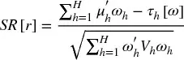

## 21.4 问题

我们想计算解决问题的最优交易轨迹

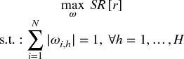

该问题试图计算全局动态最优，与均值-方差优化器推导的静态最优（见[第 16 章](ch16.md)）形成对比。注意非连续交易成本嵌入在 r 中。与标准投资组合优化应用相比，这不是凸（二次）规划问题，原因至少有三个：(1) 收益不是同分布的，因为 μ~h~ 和 V~h~ 随 h 变化。(2) 交易成本 τ~h~[ω] 非连续且随 h 变化。(3) 目标函数 SR[r] 非凸。接下来，我们将展示如何在不利用目标函数任何解析性质的情况下计算解（因此该方法的广义性质）。

## 21.5 整数优化方法

该问题的普遍性使其对标准凸优化技术不可处理。我们的解决策略是将其离散化，使其适合整数优化。这反过来允许我们使用量子计算技术找到最优解。

### 21.5.1 鸽巢分区

假设我们计算 K 单位资本可以在 N 个资产之间分配的方式数，其中我们假设 K > N。这等价于找到 x~1~ + ... + x~N~ = K 的非负整数解的数目，它有优美的组合解 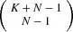。这与数论中的经典整数划分问题有相似性，Hardy 和 Ramanujan（后来 Rademacher）证明了其渐近表达式（见 Johansson [2012]）。虽然顺序在划分问题中不重要，但顺序对我们手头的问题非常相关。例如，如果 K = 6 且 N = 3，分区 (1, 2, 3) 和 (3, 2, 1) 必须被视为不同的（显然 (2, 2, 2) 不需要排列）。图 21.1 说明了将 6 单位资本分配给 3 个不同资产时顺序的重要性。这意味着我们必须考虑每个分区的所有不同排列。尽管找到此类分配数量的组合解很优美，但随着 K 和 N 变大，计算量可能仍然很大。然而，我们可以使用 Stirling 近似轻松得出估计。

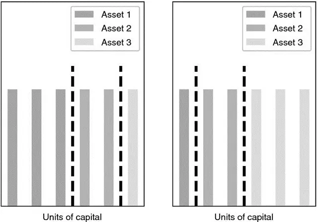

图 21.1 分区 (1, 2, 3) 和 (3, 2, 1) 必须被视为不同的

代码片段 21.1 提供了一个高效的算法来生成所有分区集 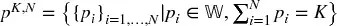，其中 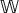 是包含零的自然数（非负整数）。

> **代码片段 21.1 K 个对象到 N 个槽的分区**

> 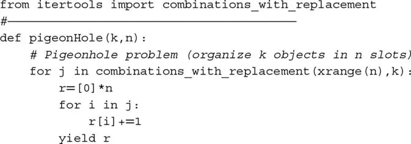

### 21.5.2 可行静态解

我们想计算任何给定范围 h 的所有可行解集，记为 Ω。考虑 K 单位到 N 个资产的分区集 p^K,N^。对于每个分区 {p~i~}~i=1,...,N~ ∈ p^K,N^，我们可以定义绝对权重向量，使得 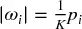，其中 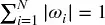（满仓投资约束）。该满仓（无杠杆）约束意味着每个权重可以为正或负，因此对于每个绝对权重向量 {|ω~i~|}~i=1,...,N~，我们可以生成 2^N^ 个（带符号）权重向量。这通过将 {|ω~i~|}~i=1,...,N~ 中的项目与 {−1, 1} 的 N 次重复笛卡尔积中的项目相乘来完成。代码片段 21.2 展示了如何生成与所有分区关联的所有权重向量集 Ω，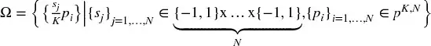。

> **代码片段 21.2 与所有分区关联的所有向量集 Ω**

> 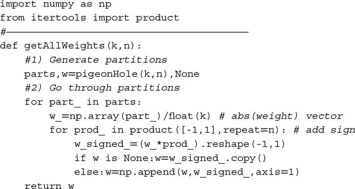

### 21.5.3 评估轨迹

给定所有向量集 Ω，我们定义所有可能轨迹集 Φ 为 Ω 与 H 次重复的笛卡尔积。然后，对于每条轨迹，我们可以评估其交易成本和 SR，并选择在 Φ 上表现最优的轨迹。代码片段 21.3 实现了该功能。对象 `params` 是一个包含 C、μ、V 值的字典列表。

> **代码片段 21.3 评估所有轨迹**

> 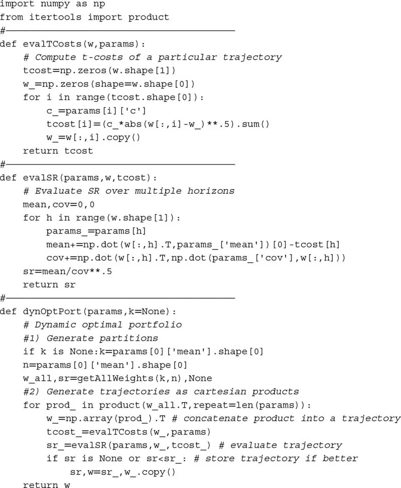

注意，该程序在不依赖凸优化的情况下选择全局最优轨迹。即使协方差矩阵病态条件化、交易成本函数非连续等，也能找到解。我们为这种普遍性付出的代价是计算解极其计算密集。事实上，评估所有轨迹类似于旅行商问题。数字计算机不适合此类 NP 完全或 NP 困难问题；然而，由于线性叠加的特性，量子计算机具有一次评估多个解的优势。

本章提出的方法为 Rosenberg 等 [2016] 奠定了基础，后者使用量子退火器解决了最优交易轨迹问题。相同的逻辑可以应用于涉及路径依赖的广泛金融问题，如交易轨迹。棘手的 ML 算法可以被离散化并转化为暴力搜索，专为量子计算机设计。

## 21.6 数值示例

下面我们说明如何在实践中使用数字计算机找到全局最优。量子计算机会一次评估所有轨迹，而数字计算机顺序执行此操作。

### 21.6.1 随机矩阵

代码片段 21.4 返回一个具有已知秩的高斯值随机矩阵，这在许多应用中很有用（见练习）。下次你想执行多元蒙特卡洛实验或情景分析时，你可能想考虑这段代码。

> **代码片段 21.4 产生给定秩的随机矩阵**

> 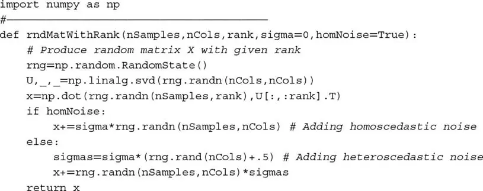

代码片段 21.5 生成 H 个均值向量、协方差矩阵和交易成本因子 C、μ、V。这些变量存储在 `params` 列表中。

> **代码片段 21.5 生成问题的参数**

> 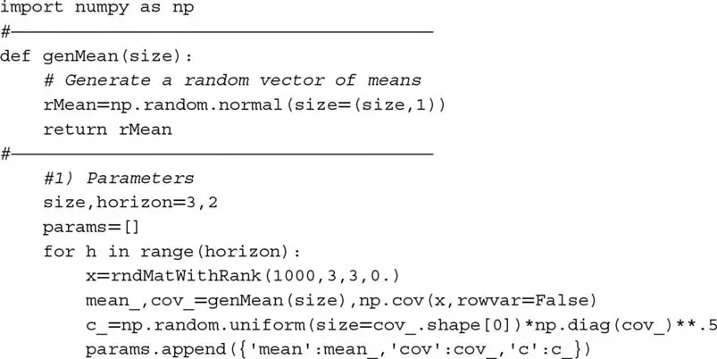

### 21.6.2 静态解

代码片段 21.6 计算由局部（静态）最优产生的轨迹的表现。

> **代码片段 21.6 计算和评估静态解**

> 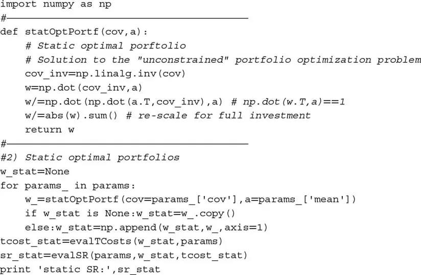

### 21.6.3 动态解

代码片段 21.7 计算与全局动态最优轨迹关联的表现，应用本章解释的函数。

> **代码片段 21.7 计算和评估动态解**

> 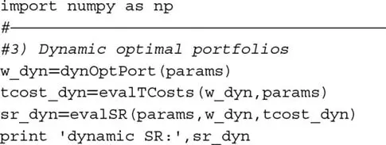

## 练习题

1. 使用鸽巢论证证明 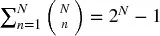。

2. 使用代码片段 21.4 产生大小为 (1000, 10) 的随机矩阵，`sigma = 1` 且：
    1. `rank = 1`。绘制协方差矩阵的特征值。
    2. `rank = 5`。绘制协方差矩阵的特征值。
    3. `rank = 10`。绘制协方差矩阵的特征值。
    4. 你观察到什么模式？你会如何将它与 Markowitz 的诅咒（[第 16 章](ch16.md)）联系起来？

3. 运行第 21.6 节中的数值示例：
    1. 使用 `size = 3`，用 `timeit` 计算运行时间。重复 10 批 100 次执行。花了多长时间？
    2. 使用 `size = 4`，用 `timeit` 计算运行时间。重复 10 批 100 次执行。花了多长时间？

4. 回顾本章所有代码片段。
    1. 有多少可以向量化？
    2. 有多少可以使用[第 20 章](ch20.md)的技术并行化？
    3. 如果你优化代码，你认为可以加速多少？
    4. 使用优化后的代码，一年内可以解决的问题维度是多少？

5. 在什么情况下，全局动态最优轨迹会匹配局部最优序列？
    1. 这是一组现实的假设吗？
    2. 如果不是：
        1. 这能解释为什么朴素解击败 Markowitz（[第 16 章](ch16.md)）吗？
        2. 你认为为什么这么多公司花这么多精力计算局部最优序列？

## 参考文献

1. Garleanu, N. and L. Pedersen (2012): "Dynamic trading with predictable returns and transaction costs." *Journal of Finance*, Vol. 68, No. 6, pp. 2309--2340.
2. Johansson, F. (2012): "Efficient implementation of the Hardy-Ramanujan-Rademacher formula." *LMS Journal of Computation and Mathematics*, Vol. 15, pp. 341--359.
3. Rosenberg, G., P. Haghnegahdar, P. Goddard, P. Carr, K. Wu, and M. López de Prado (2016): "Solving the optimal trading trajectory problem using a quantum annealer." *IEEE Journal of Selected Topics in Signal Processing*, Vol. 10, No. 6, pp. 1053--1060.
4. Williams, C. (2010): *Explorations in Quantum Computing*, 2nd ed. Springer.
5. Woeginger, G. (2003): "Exact algorithms for NP-hard problems: A survey." In *Combinatorial Optimization—Eureka, You Shrink!*, Springer, pp. 185--207.
