# 高性能计算智能与预测技术

**High-Performance Computational Intelligence and Forecasting
Technologies**

> > [Kesheng Wu and Horst D. Simon

## 22.1 动机
本章介绍 Lawrence Berkeley 国家实验室的计算智能与预测技术（CIFT）项目
国家实验室（LBNL）。CIFT 的主要目标是推广使用高性能计算（HPC）工具和技术来分析流数据。 在注意到 SEC 和 CFTC 将数据量作为延迟五个月发布 2010 年闪电崩盘调查报告的解释之后， LBNL 启动了 CIFT 项目，应用 HPC 技术来管理和分析金融数据。 对流数据做出及时决策是许多商业应用的需求，例如避免即将到来的电网故障或金融市场流动性危机。在所有这些情况下，
HPC 工具非常适合处理复杂数据依赖并提供及时解决方案。 多年来，CIFT 致力于多种不同形式的流数据，包括来自交通、电网、电力使用等的数据。以下各节解释了 HPC 系统的关键特性，介绍了这些系统上使用的一些特殊工具，并提供了使用这些 HPC 工具进行流数据分析的示例。

## 22.2 监管机构对 2010 年闪电崩盘的响应
2010 年 5 月 6 日，大约下午 2:45（美国东部夏令时），美国股市经历了道琼斯工业平均指数近 10% 的下跌，几分钟后又恢复了大部分损失。 监管机构花了大约五个月 才提出调查报告。在调查崩盘的国会小组面前，数据量（约 20 太字节）被给出为长期延迟的主要原因。 由于 HPC 系统（如国家
国家能源研究科学计算中心（NERSC）
中心的^\ [[1]^
）通常在几分钟内处理数百太字节，我们处理金融市场的数据应该没有问题。这促使 CIFT 项目成立，其使命是将 HPC 技术和工具应用于金融数据分析。

金融大数据的一个关键方面是它主要由时间序列组成。 Over the years, the CIFT team, along with numerous
collaborators, has developed techniques to analyze many different forms
of data streams and time series. This chapter provides a brief
introduction to the HPC system including both hardware (Section 22.4)
and software (Section 22.5), and recounts a few successful use cases
(Section 22.6). We conclude with a summary of our vision and work so far
and also provide contact information for interested
readers.

## 22.3 背景
计算技术的进步使得寻找复杂模式变得容易得多。 这种模式发现能力是一些近期科学突破的背后推动力， 例如
希格斯粒子（Aad 等 [2016]）和引力波（Abbot
et al. [2016]). 同样的能力也是许多互联网公司的核心，例如将用户与广告商匹配 (Zeff
and Aronson [1999], Yen et al. [2009]). However, the hardware and
software used in science and in commerce are quite different. HPC 工具具有一些关键优势，应该在各种商业应用中有用。

科学家使用的工具通常围绕高性能计算（HPC）平台构建，而商业应用的工具围绕云计算平台构建。 为了筛选大量数据以寻找有用模式，两种方法都被证明行之有效。 However, the marquee
application for HPC systems is large-scale simulation, such as weather
models used for forecasting regional storms in the next few days
(Asanovic et al. [2006]). 相比之下，商业云最初是出于并发处理大量独立数据对象（数据并行任务）的需求而推动的。

对于我们的工作，我们主要对流数据分析感兴趣。 In particular, high-speed complex data streams, such as those from
sensor networks monitoring our nation\'s electric power grid and highway
systems. This streaming workload is not ideal for either HPC systems or
cloud systems as we discuss below, but we believe that the HPC ecosystem
has more to offer to address the streaming data analysis than the cloud
ecosystem does.

云系统最初是为并行数据任务设计的，其中大量独立数据对象可以并发处理。
因此该系统设计用于高吞吐量，而非产生实时响应。 然而，许多商业应用需要实时或近实时响应。 例如，电网中的不稳定事件可能在几分钟内发展成灾难；足够快地找到预兆特征可以避免灾难。 类似地，金融研究文献中已识别出新出现的流动性不足事件的迹象；在活跃市场交易时间内快速找到这些迹象可以提供防止市场冲击和避免闪电崩盘的选项。在这些情况下，优先考虑快速周转时间的能力至关重要。

数据流按定义是渐进可用的；因此，可能没有大量数据对象可以并行处理。 通常，只有固定数量的最新数据记录可用于分析。在这种情况下，利用多个中央处理器（CPU）核心算力的有效方法是将单个数据对象（或单个时间步）的分析工作分配给多个 CPU 核心。 对于此类工作，HPC 生态系统比云生态系统拥有更先进的工具。

这些是激励我们工作的主要观点。 For a more thorough
comparison of HPC systems and cloud systems, we refer interested readers
to Asanovic et al. [2006]. In particular, Fox et al. [2015] have
created an extensive taxonomy for describing the similarities and
differences for any application scenario.

简言之，我们相信 HPC 社区在推进流数据分析的最先进技术方面有很多可以贡献。 The CIFT project was
established with a mission to transfer LBNL\'s HPC expertise to
streaming business applications. We are pursuing this mission via
collaboration, demonstration, and tool development.

为评估 HPC 技术的潜在用途，我们花时间与各种应用合作。 该过程不仅让我们的 HPC 专家接触到各种领域，也使我们能够收集资金支持来建立演示设施。

凭借一些早期支持者的慷慨捐赠，我们建立了一个专门用于此项工作的相当大的计算集群。 这台专用计算机（名为 dirac1）允许用户利用
HPC 系统并评估他们自己的应用。

我们还参与了使 HPC 系统更适用于流数据分析的工具开发工作。 在以下各节中，我们将描述专用 CIFT 机器的硬件和软件，以及一些演示和工具开发工作。
亮点包括将数据处理速度提高 21 倍，以及将早期预警指标的计算速度提高 720 倍。

## 22.4 HPC 硬件
传说第一代大数据系统是用从大学校园收集的闲置计算机组件构建的。
这很可能是一个都市传说，但它强调了 HPC 系统和云系统之间区别的一个重要观点。
理论上，HPC 系统用定制的高成本组件构建，而云系统用标准的低成本商品组件构建。 在实践中，由于全球对 HPC 系统的投资远小于个人计算机， 制造商无法仅为 HPC 市场生产定制组件。 事实是 HPC 系统在很大程度上像云系统一样由商品组件组装而成。 然而，由于它们的目标应用不同，在组件选择上有一些差异。

让我们依次描述计算元素、存储系统和网络系统。]  Figure
22.1 [is a high-level schematic
diagram representing the key components of the Magellan cluster around
year 2010 (Jackson et al. [2010]; Yelick et al. [2011]). The
computer elements include both CPUs and graphics processing units
(GPUs). These CPUs and GPUs are commercial products in almost all the
cases. For example, the nodes on dirac1 use a 24-core 2.2Ghz Intel
processor, which is common to cloud computing systems. Currently, dirac1
does not contain GPUs.

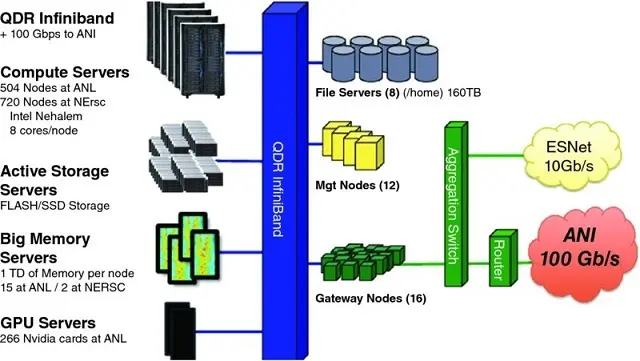

**图 22.1** Schematic of the
Magellan 集群（约 2010 年），HPC 计算机集群的一个例子

网络系统由两部分组成：连接集群内组件的 InfiniBand 网络，以及与外部世界的交换网络连接。 在此特定示例中，外部连接标记为「ESNet」和「ANI」。InfiniBand 网络交换机在云计算系统中也很常见。

图 1 中的存储系统包括旋转磁盘和闪存。 这种组合也很常见。不同之处在于
HPC 系统通常将存储系统集中在 the
计算节点之外，而典型的云计算系统将存储系统分布在计算节点中。这两种方法各有优缺点。例如，集中存储通常作为全局文件系统导出给所有计算节点，这使得处理存储在文件中的数据更容易。然而，这需要连接 CPU 和磁盘的高能力网络。相比之下，分布式方法可以使用较低容量的网络，因为有一些存储靠近每个 CPU。
通常，分布式文件系统（如 Google 文件系统）
(Ghemawat, Gobioff, and Leung [2003]), is layered on top of a cloud
computing system to make the storage accessible to all
CPU。

简言之，当前一代 HPC 系统和云系统使用几乎相同的商业硬件组件。 它们的差异主要在存储系统和网络系统的安排上。显然，存储系统设计的差异可能影响应用性能。然而，云系统的虚拟化层可能是应用性能差异的更大原因。在下一节中，我们将讨论另一个可能产生更大影响的因素——软件工具和库。

虚拟化通常在云计算环境中使用，以使同一硬件可供多个用户使用，并将一个软件环境与另一个隔离。 这是区分云计算环境和 HPC 环境的更突出特征之一。在大多数情况下，计算机系统的所有三个基本组件——CPU、存储和网络——都被虚拟化。这种虚拟化有很多好处。例如，现有应用可以在 CPU 芯片上运行而无需重新编译；多个用户可以共享相同的硬件；硬件故障可以通过虚拟化软件纠正；失败计算节点上的应用可以更容易地迁移到另一个节点。 然而，这个虚拟化层也施加了一些运行时开销，可能降低应用性能。
对于时间敏感的应用，这种性能降低可能成为关键问题。

测试表明性能差异可能很大。 接下来，我们简要描述 Jackson 等
2010].]  Figure
22.2 显示了使用不同计算机系统的性能减慢。横轴下方的名称是 NERSC 常用的不同软件包。左条对应商业云，中间条对应 Magellan，（有时缺失的）右条对应 EC2-Beta-Opt 系统。非优化的商业云实例运行这些软件包比 NERSC 超级计算机慢 2 到 10 倍。即使在更昂贵的高性能实例上，也有明显的减速。

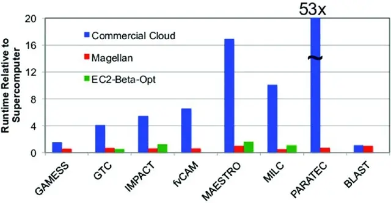

**图 22.2** The cloud ran
scientific applications considerably slower than on HPC systems (circa
2010)

图 22.3 [shows a study of the
main factor causing the slowdown with the software package PARATEC. In
图 2 中，我们看到 PARATEC 在商业云上完成比在 HPC 系统上长 53 倍。 我们从图 3 中观察到，随着核心数（横轴）增加，测量性能（以 TFLOP/s 为单位）之间的差异变大。特别是，标记为「10G-TCPoEth Vm」的线随着核心数增长几乎没有增加。这是网络实例使用虚拟化网络（TCP over Ethernet）的情况。它清楚地表明网络虚拟化开销是显著的，以至于使云变得无用。

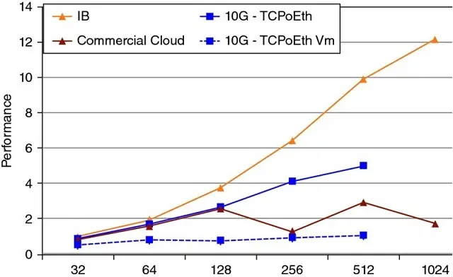

**图 22.3** As the number of
cores increases (horizontal axis), the virtualization overhead becomes
much more significant (circa 2010)

虚拟化开销的问题被广泛认识 (Chen et al.
2015]). There has been considerable research aimed at addressing both
the I/O virtualization overhead (Gordon et al. [2012]) as well as the
networking virtualization overhead (Dong et al. [2012]). As these
state-of-the-art techniques are gradually being moved into commercial
products, we anticipate the overhead will decrease in the future, but
some overhead will inevitably remain.

总结本节，我们简要涉及 HPC 与云的经济学。 Typically, HPC systems are run by nonprofit research
organizations and universities, while cloud systems are provided by
commercial companies. Profit, customer retention, and many other factors
affect the cost of a cloud system (Armburst et al. [2010]). In 2011,
the Magellan project report stated that "Cost analysis shows that DOE
centers are cost competitive, typically 3--7 × less expensive, when
compared to commercial cloud providers" (Yelick et al.
2010]).

一组高能物理学家认为他们的用例非常适合云计算，并进行了一项详细的比较研究 (Holzman et al. [2017]). Their cost comparisons still
show the commercial cloud offerings as approximately 50% more expensive
than dedicated HPC systems for comparable computing tasks; however, the
authors worked with severe limitations on data ingress and egress to
avoid potentially hefty charges on data movement. For complex workloads,
such as the streaming data analyses discussed in this book, we
anticipate that this HPC cost advantage will remain in the future. A
2016 National Academy of Sciences study came to the same conclusion that
even a long-term lease from Amazon is likely 2 to 3 times more expensive
than HPC systems to handle the expected science workload from NSF (Box
6.2 from National Academies of Sciences, [2016]).

## 22.5 HPC 软件
具有讽刺意味的是，超级计算机的真正力量在于其专用软件。 HPC 系统和云系统都有各种各样的软件包可用。 In most cases, the same software
package is available on both platforms. Therefore, we chose to focus on
software packages that are unique to HPC systems and have the potential
to improve computational intelligence and forecasting
technologies.

HPC 软件生态系统的一个显著特征是，大多数应用软件通过消息传递接口（MPI）执行自己的处理器间通信。 事实上，大多数科学计算书籍的基石是 MPI (Kumar et al. [1994], Gropp,
Lusk 和 Skjellum [1999]）。因此，我们对 HPC
software tools will start with MPI. As this book relies on data
processing algorithms, we will concentrate on data management tools
(Shoshami and Rotem [2010]).

### 22.5.1 Message Passing Interface

消息传递接口是一种用于并行计算的通信协议 (Gropp, Lusk, and Skjellum [1999], Snir et al. [1988]). It
defines a number of point-to-point data exchange operations as well as
some collective communication operations. The MPI standard was
established based on several early attempts to build portable
communication libraries. The early implementation from Argonne National
实验室命名为 MPICH，具有高性能、可扩展和可移植的特点。这
helped MPI to gain wide acceptance among scientific
users.

MPI 的成功部分归因于它将语言无关规范（LIS）与语言绑定分离。 这允许相同的核函数提供给许多不同的编程语言，这也促进了它的接受。 The first MPI
standard specified ANSI C and Fortran-77 bindings together with the LIS.
草案规范在 1994 年超级计算会议上向用户社区展示。

促成 MPI 成功的另一个关键因素是开源
license used by MPICH. This license allows the vendors to take the
source code to produce their own custom versions, which allows the HPC
system vendors to quickly produce their own MPI libraries. To this day,
all HPC systems support the familiar MPI on their computers. This wide
adoption also ensures that MPI will continue to be the favorite
communication protocol among the users of HPC
systems.

### 22.5.2 Hierarchical Data Format 5

在描述 HPC 硬件组件时，我们注意到 HPC 平台中的存储系统通常不同于云平台中的存储系统。 相应地，大多数用户用于访问存储系统的软件库也不同。 这种差异可以追溯到数据概念模型的差异。 通常，HPC 应用将数据视为多维数组，因此 HPC 系统上最流行的 I/O 库是为处理多维数组而设计的。 Here, we describe the most widely used array
format library, HDF5 (Folk et al. [2011]).

HDF5 是层次数据格式的第五次迭代，由
by the HDF
Group。^2^
HDF5 中的基本数据单元是数组及其关联的
information such as attributes, dimensions, and data type. Together,
they are known as a data set. Data sets can be grouped into large units
called groups, and groups can be organized into high-level groups. This
flexible hierarchical organization allows users to express complex
relationships among the data sets.

除了将用户数据组织到文件中的基本库之外，HDF Group 还提供了一套工具 and specialization of HDF5 for
different applications. For example, HDF5 includes a performance
profiling tool. NASA has a specialization of HDF5, named HDF5-EOS, for
data from their Earth-Observing System (EOS); and the next-generation
DNA 序列社区产生了一个名为 BioHDF 的专业化，用于
their bioinformatics data.

HDF5 提供了访问 HPC 上存储系统的有效方式
platform. In tests, we have demonstrated that using HDF5 to store stock
markets data significantly speeds up the analysis operations. This is
largely due to its efficient compression/decompression algorithms that
minimize network traffic and I/O operations, which brings us to our next
point.

**22.5.3** ***In Situ*** **Processing**

在过去几十年中，CPU 性能大约每 18 个月翻一番
months (Moore\'s law), while disk performance has been increasing less
than 5% a year. 这种差异导致写出 CPU 内存内容的时间越来越长。 为解决这个问题，一些研究工作专注于] *in situ*
analysis capability (Ayachit et al. [2016]).

在当前一代处理系统中，自适应 I/O 系统（ADIOS）是使用最广泛的 (Liu et al. [2014]). 它使用多种数据传输引擎，允许用户接入 I/O 流并执行分析操作。 这很有用，因为无关数据可以在传输过程中丢弃，从而避免其缓慢和大量的存储。 This same] *in situ* [mechanism
also allows it to complete write operations very quickly. In fact, it
initially gained attention because of its write speed. Since then, the
ADIOS 开发者与多个非常大的团队合作，改进了他们的 I/O 管道和分析能力。

因为 ADIOS 支持流数据访问，它与 CIFT 工作也高度相关。 In a number of demonstrations, ADIOS with ICEE
transport engine was able to complete distributed streaming data
analysis in real-time (Choi et al. [2013]). We will describe one of
the use cases involving blobs in fusion plasma in the next
section.

总结，*原位*数据处理能力
is another very useful tool from the HPC ecosystem.

### 22.5.4 Convergence

我们前面提到，HPC 硬件市场只是整个计算机硬件市场的一小部分。 The HPC software market is even
smaller compared to the overall software market. So far, the HPC
software ecosystem is largely maintained by a number of small vendors
along with some open-source contributors. Therefore, HPC system users
are under tremendous pressure to migrate to the better supported cloud
software systems. This is a significant driver for convergence between
software for HPC and software for cloud (Fox et al.
2015]).

尽管收敛似乎是不可避免的，我们倡导保持上述软件工具优势的收敛选项。 One of the motivations of the CIFT project is to seek a
way to transfer the above tools to the computing environments of the
future.

## 22.6 用例
数据处理是现代科学研究如此重要的一部分，以至于一些研究者称之为科学的第四范式
(Hey, Tansley, and Tolle [2009]). In economics, the same data-driven
research activities have led to the wildly popular behavioral economics
(Camerer and Loewenstein [2011]). 最近数据驱动研究的许多进展基于机器学习应用 (Qiu
et al. [2016], Rudin and Wagstaff [2014]). 它们在行星科学和生物信息学等各种领域的成功，引起了来自不同领域研究者的极大兴趣。
在本节的其余部分，我们描述了将先进数据分析技术应用于各个领域的几个例子， where many of these
use cases originated in the CIFT project.

### 22.6.1 Supernova Hunting

在天文学中，许多重要事实的确定，如宇宙膨胀速度，是通过测量爆炸的 Ia 型超新星的光来完成的 (Bloom et al. [2012]). 搜索夜空爆炸超新星的过程称为天体成像巡天。 The Palomar Transient Factory (PTF) is an example of
such a synoptic survey (Nicholas et al. [2009]). The PTF telescopes
scan the night sky and produce a set of images every 45 minutes. 新图像与同一区域天空的先前观测比较，以确定发生了什么变化并对变化进行分类。 Such
identification and classification tasks used to be performed by
astronomers manually. 然而，目前 PTF 望远镜传入的图像数量太大，无法人工检查。 An automated
workflow for these image processing tasks has been developed and
deployed at a number of different computer centers.

图 22.4 [shows the supernova
that was identified earliest in its explosion process. On August 23,
2011, a patch of the sky showed no sign of this star, but a faint light
showed up on August 24. This quick turnover allowed astronomers around
the world to perform detailed follow-up observations, which are
important for determining the parameters related to the expansion of the
universe.

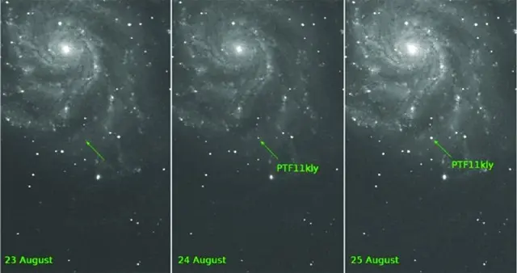

**图 22.4** Supernova SN 2011fe
was discovered 11 hours after first evidence of explosion, as a result
of the extensive automation in classification of astronomical
observations

该超新星的快速识别是自动化工作流程机器学习能力的重要证明。 该工作流处理传入图像以提取自上次观测以来发生变化的对象。 It then classifies the
changed object to determine a preliminary type based on the previous
training. 由于从快速变化的瞬变体中提取新科学的后续资源非常宝贵，分类不仅需要指示假设类型，还需要指示分类的可能性和置信度。 使用在 PTF 数据上训练的分类算法，瞬变体和变星的错误标记总错误率为 3.8%。 Additional work is expected to achieve higher accuracy rates
in upcoming surveys, such as for the Large Synoptic Survey
望远镜。

### 22.6.2 Blobs in Fusion Plasma

物理学和气候学等领域的大规模科学探索是涉及每个领域数千名科学家的庞大国际合作。 随着这些合作以越来越快的速度产生越来越多的数据，现有的工作流管理系统难以跟上步伐。 一个必要的解决方案是在数据到达相对较慢的磁盘存储系统之前对其进行处理、分析、汇总和缩减，这一过程称为传输中处理（或飞行中分析）。 Working with the ADIOS developers, we have
implemented the ICEE transport engine to dramatically increase the
data-handling capability of collaborative workflow systems (Choi et al.
2013]). 该新功能显著改善了分布式工作流的数据流管理。 Tests showed that the ICEE engine
allowed a number of large international collaborations to make near
real-time collaborative decisions. Here, we briefly describe the fusion
collaboration involving KSTAR.

KSTAR 是一个具有全超导磁体的核聚变反应堆。
它位于韩国，但世界各地有许多相关的研究团队。 在聚变实验运行期间，一些研究人员在 KSTAR 控制物理装置，但其他人可能希望通过协作分析之前的实验运行来参与，就如何为下一次运行配置装置提供建议。 During the analysis of the experimental
measurement data, scientists might run simulations or examine previous
simulations to study parametric choices. Typically, there may be a lapse
of 10 to 30 minutes between two successive runs, and all collaborative
analyses need to complete during this time window in order to affect the
next run.

我们用两种不同类型的数据展示了 ICEE 工作流系统的功能： one from the Electron Cyclotron Emission
成像（ECEI）数据，另一个涉及合成
diagnostic data from the XGC modelling. 分布式工作流引擎需要从这两个来源收集数据、提取称为 blob 的特征、跟踪这些 blob 的运动、预测实验测量中 blob 的运动，然后就要执行的操作提供建议。] 图 22.5 [shows how the ECEI data
is processed. The workflow for the XGC simulation data is similar to
what is shown in] Figure
22.5 [, except that the XGC data is
located at NERSC.

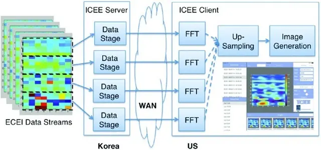

**图 22.5** A distributed
workflow for studying fusion plasma dynamics

要实时完成上述分析任务，使用 ADIOS 的 ICEE 传输引擎进行有效数据管理只是故事的一部分。 The second part is to detect blobs efficiently (Wu
et al. [2016]). In this work, we need to reduce the amount of data
transported across wide-area networks by selecting only the necessary
chunks. We then identify all cells within the blobs and group these
cells into connected regions in space, where each connected region forms
a blob. The new algorithm we developed partitions the work into
different CPU cores by taking full advantage of the MPI for
communication between the nodes and the shared memory among the CPU
cores on the same node. Additionally, we also updated the connected
component label algorithm to correctly identify blobs at the edge, which
were frequently missed by the earlier detection algorithms. Overall, our
algorithm was able to identify blobs in a few milliseconds for each time
step by taking full advantage of the parallelism available in the HPC
system.

### 22.6.3 Intraday Peak Electricity Usage

公用事业公司正在部署先进计量基础设施（AMI），以前所未有的空间和时间细节捕获电力消耗。 This vast and fast-growing stream of data provides an important
testing ground for the predictive capability based on big data
analytical platforms (Kim et al. [2015]). These cutting-edge data
science techniques, together with behavioral theories, enable behavior
analytics to gain novel insights into patterns of electricity
consumption and their underlying drivers (Todd et al.
2014]).

由于电力不易存储，其发电量必须与消费量匹配。 当需求超过发电能力时，将发生停电，通常在消费者最需要电力的时候。 由于增加发电能力昂贵且需要数年时间，监管机构和公用事业公司设计了许多定价方案，旨在阻止高峰需求期间的不必要消费。

为衡量定价政策对高峰需求的有效性，可以分析 AMI 生成的电力使用数据。 Our work
focuses on extracting baseline models of household electricity usage for
a behavior analytics study. The baseline models would ideally capture
the pattern of household electricity usage including all features except
the new pricing schemes. There are numerous challenges in establishing
such a model. For example, there are many features that could affect the
usage of electricity but for which no information is recorded, such as
the temperature set point of an air-conditioner or the purchase of a new
appliance. Other features, such as outdoor temperature, are known, but
their impact is difficult to capture in simple
functions.

我们的工作开发了几个可以满足上述要求的新基线模型。 At present, the gold standard baseline is a
well-designed randomized control group. We showed that our new
data-driven baselines could accurately predict the average electricity
usage of the control group. For this evaluation, we use a well-designed
study from a region of the United States where the electricity usage is
the highest in the afternoon and evening during the months of May
through August. Though this work concentrates on demonstrating that the
new baseline models are effective for groups, we believe that these new
models are also useful for studying individual households in the
future.

我们探索了多种标准黑盒方法。 在机器学习方法中，我们发现梯度树提升（GTB）比其他方法更有效。 However, the most accurate GTB models require
lagged variables as features (for example, the electricity usage a day
before and a week before). In our work, we need to use the data from
year T-1 to establish the baseline usage for year T and year T + 1. The
lagged variable for a day before and a week before would be
incorporating recent information not in year T-1. We attempted to modify
the prediction procedure to use the recent predictions in place of the
actual measured values a day before and a week before; however, our
tests show that the prediction errors accumulate over time, leading to
unrealistic predictions a month or so into the summer season. This type
of accumulation of prediction errors is common to continuous prediction
procedures for time series.

为解决上述问题，我们设计了几种白盒方法， the most effective of which, known as LTAP, is reported
here. LTAP is based on the fact that the aggregate variable electricity
usage per day is accurately described by a piece-wise linear function of
average daily temperature. This fact allows us to make predictions about
the total daily electricity usage. By further assuming that the usage
profile of each household remains the same during the study, we are able
to assign the hourly usage values from the daily aggregate usage. This
approach is shown to be self-consistent; that is, the prediction
procedure exactly reproduces the electricity usage in year T--1, and the
predictions for the control group in both year T and T + 1 are very
close to the actual measured values. Both treatment groups have reduced
electricity usages during the peak-demand hours, and the active group
reduced the usage more than the passive group. This observation is in
line with other studies.

虽然新的数据驱动基线模型 LTAP 准确预测了对照组的平均使用量，但在旨在减少高峰需求时段使用的新分时定价的预测影响方面存在一些差异 (see
 图 22.6
). For example, with the control group as the baseline, the active
group reduces its usage by 0.277 kWh (out of about 2 kWh) averaged over
the peak-demand hours in the first year with the new price and 0.198 kWh
in the second year. Using LTAP as the baseline, the average reductions
are only 0.164 kWh for both years. Part of the difference may be due to
the self-selection bias in treatment groups, especially the active
group, where the households have to explicitly opt-in to participate in
the trial. It is likely that the households that elected to join the
active group are well-suited to take advantage of the proposed new
pricing structure. We believe that the LTAP baseline is a way to address
the self-selection bias and plan to conduct additional studies to
further verify this.

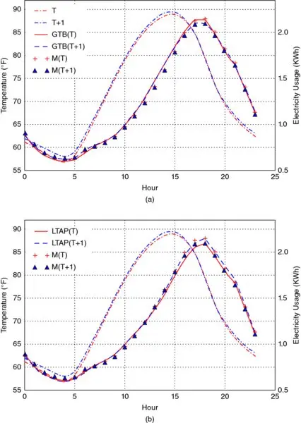

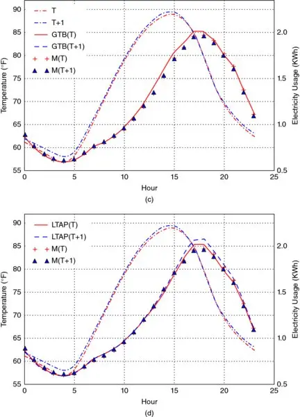

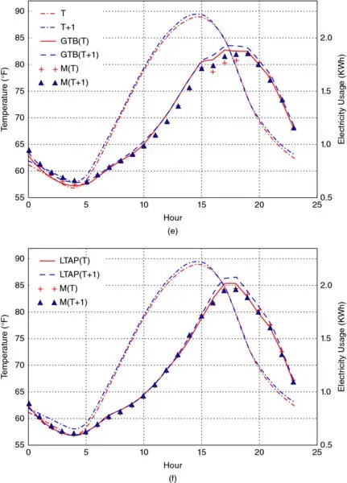

**图 22.6** Gradient tree
boosting (GBT) appears to follow recent usage too closely and therefore
not able to predict the baseline usage as well as the newly develop
method named LTAP. (a) GTB on Control group. (b) LTAP on Control group.
(c) GTB on Passive group. (d) LTAP on Passive group. (e) GTB on Active
group. (f) LTAP on Active group

### 22.6.4 The Flash Crash of 2010

The extended time it took for the SEC and CFTC 调查闪电
2010 年崩盘是 CIFT 工作的最初动机。联邦
investigators needed to sift through tens of terabytes of data to look
for the root cause of the crash. Since CFTC publicly blamed the volume
of data to be the source of the long delay, we started our work by
looking for HPC tools that could easily handle tens of terabytes. Since
HDF5 是最常用的 I/O 库，我们开始工作于
applying HDF5 to organize a large set of stock trading data (Bethel
et al. [2011]).

让我们快速回顾 2010 年闪电崩盘期间发生了什么。 5 月 6 日，大约下午 2:45（美国东部夏令时），道琼斯工业平均指数下跌近 10%， and many stocks traded at one
cent per share, the minimum price for any possible
trade.]  Figure
22.7 [shows an example of another
extreme case, where shares of Apple (symbol AAPL) traded at \$100,000
per share, the maximum possible price allowed by the exchange. 显然，这些是不寻常的事件，破坏了投资者对我们金融市场的信心和信任。 Investors demanded to know what
caused these events.

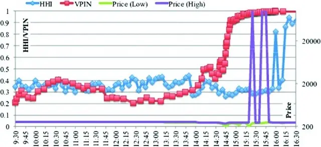

**图 22.7** Apple Stock price on
2010 年 5 月 6 日，以及每 5 分钟计算的 HHI 和 VPIN 值
during the market hours

为了使我们的工作与金融行业相关，我们尝试使用 HDF5 软件，并将其应用于计算早期预警指标的具体任务。 基于机构投资者、监管机构和学者组成的小组的建议，我们实施了两套已被证明在闪电崩盘前具有「早期预警」属性的指标。 They are the Volume
同步知情交易概率（VPIN）（Easley、López de
Prado, and O\'Hara [2011]) and a variant of the Herfindahl-Hirschman
指数（HHI）（Hirschman [1980]）的一个变体。我们实现了
these two algorithms in the C++ language, while using MPI for
inter-processor communication, to take full advantage of the HPC
systems. 这一选择背后的推理是，如果这些早期预警指标中的任何一个被证明成功，高性能实现将允许我们尽早提取预警信号，从而可能有时间采取纠正行动。 我们的努力是证明可以足够快地计算早期预警信号的第一步。

对于我们的工作，我们实现了两个版本的程序：一个使用 HDF5 文件组织的数据，另一个从常用的 ASCII 文本文件读取数据。
 图 22.8
shows the time required to process the trading records of all S&P 500
stocks over a 10-year timespan. Since the size of the 10-year trading
data is still relatively small, we replicated the data 10 times as well.
在单个 CPU 核心上 (labeled "Serial" in] Figure
22.8 [), 使用 ASCII 数据大约需要 3.5 小时，但使用 HDF5 文件仅需 603.98 秒。 When 512 CPU cores
are used, this time reduces to 2.58 seconds using HDF5 files, resulting
in a speedup of 234 times.

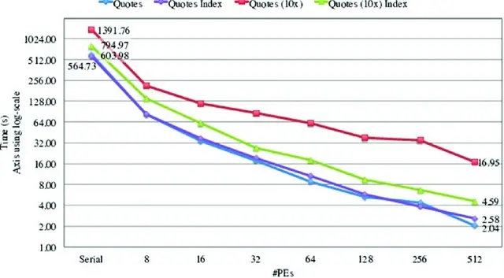

**图 22.8** Time to process
10-year worth of SP500 quotes data stored in HDF5 files, which takes 21
times longer when the same data is in ASCII files (603.98 seconds versus
approximately 3.5 hours)

在更大的（复制的）数据集上，HPC 代码在计算这些指数方面的优势更加明显。 With 10 times as much
data, it took only about 2.3 times longer for the computer to complete
the tasks, a below-linear latency increase. 使用更多 CPU 使 HPC 更加可扩展。

图 22.8 [also shows that with a
large data set, we can further take advantage of the indexing techniques
available in HDF5 to reduce the data access time (which in turn reduces
the overall computation time). When 512 CPU cores are used, the total
runtime is reduced from 16.95 seconds to 4.59 seconds, a speedup of 3.7
due to this HPC technique of indexing.

### 22.6.5 Volume-synchronized Probability of Informed Trading
校准

理解金融市场的波动性需要处理大量数据。 我们将数据密集型科学应用的技术应用于此任务，并通过在大规模期货合约集上计算称为成交量同步知情交易概率（VPIN）的早期预警指标来证明其有效性。 测试数据包含 100 种最常交易的期货合约的 67 个月交易数据。 平均而言，处理一个合约的 67 个月数据大约需要 1.5 秒。 在我们拥有这个 HPC 实现之前，完成相同任务大约需要 18 分钟。 我们的 HPC 实现实现了 720 倍的加速。

注意上述加速完全基于算法改进获得，没有并行化的好处。 The HPC
code can run on parallel machines using MPI, and thus is able to further
reduce the computation time.

我们工作中使用的软件技术包括上述通过 HDF5 的更快 I/O 访问，以及用于存储 VPIN 计算所用的条和桶的更精简数据结构。 More detailed information is available in Wu et al.
2013].

有了更快的 VPIN 计算程序，我们也能更仔细地探索参数选择。 For example, we were able to identify
the parameter values that reduce VPIN\'s false positive rate over one
hundred contracts from 20% to only 7%, see
 图 22.9
. The parameter choices to achieve this performance are: (1) pricing
the volume bar with the median prices of the trades (not the closing
price typically used in analyses), (2) 200 buckets per day, (3) 30 bars
per bucket, (4) support window for computing VPIN = 1 day, event
duration = 0.1 day, (5) bulk volume classification with Student
t-distribution with ν = 0.1, and (6) threshold for CDF of VPIN = 0.99.
同样，这些参数在
totality of futures contracts, and are not the result of individual
fitting.

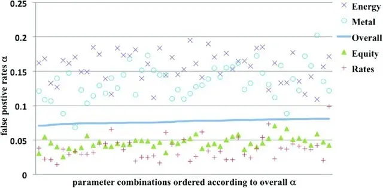

**图 22.9** The average false
positive rates (α) of different classes of futures contracts ordered
according to their average.

对于不同类别的期货合约，可以选择不同的参数来实现更低的假阳性率。 In some
cases, the false positive rates can fall significantly below 1%. Based
on] 图 22.9
, interest rate and index futures contracts typically have lower false
positive rates. The futures contracts on commodities, such as energy and
metal, generally have higher false positive rates.

此外，更快的 VPIN 计算程序使我们能够验证 VPIN 识别的事件是「内在的」， in the sense that
varying parameters such as the threshold on VPIN CDF only slightly
change the number of events detected. Had the events been random,
changing this threshold from 0.9 to 0.99 would have reduced the number
of events by a factor of 10. In short, a faster VPIN program also allows
us to confirm the real-time effectiveness of VPIN.

### 22.6.6 Revealing High Frequency Events with Non-uniform Fast
Fourier Transform

高频交易在所有电子金融市场中无处不在。 随着算法取代以前由人类执行的任务，类似 2010 年闪电崩盘的级联效应可能变得更可能。 In our work (Song et al. [2014]), we brought together a number
of high performance signal-processing tools to improve our understanding
of these trading activities. 作为说明，我们总结了对天然气期货交易价格的傅里叶分析。

通常，傅里叶分析应用于均匀间隔的数据。 由于市场活动呈爆发式出现，我们可能希望根据交易活动指数来采样金融时间序列。 For example, VPIN
samples financial series as a function of volume traded. 然而，按时间顺序的金融序列的傅里叶分析仍然可能有指导意义。 To this purpose, we use a non-uniform Fast Fourier
变换（FFT）程序。

从天然气期货市场的傅里叶分析中，我们看到了市场中高频交易的强有力证据。 The Fourier
components corresponding to high frequencies are (1) becoming more
prominent in the recent years and (2) are much stronger than could be
expected from the structure of the market. Additionally, a significant
amount of trading activity occurs in the first second of every minute,
which is a tell-tale sign of trading triggered by algorithms that target
a Time-Weighted Average Price (TWAP).

交易数据的傅里叶分析表明，每分钟一次频率的活动远高于邻近频率 (see]  Figure
22.10 [). Note that the vertical axis
is in logarithmic scale. The strength of activities at once-per-minute
frequency is more than ten times stronger than the neighboring
frequencies. Additionally, the activity is very precisely defined at
once-per-minute, which indicates that these trades are triggered by
intentionally constructed automated events. We take this to be strong
evidence that TWAP algorithms have a significant presence in this
market.

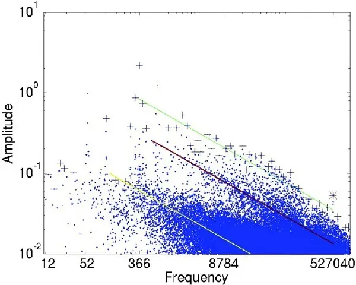

**图 22.10** Fourier spectrum of
trading prices of natural gas futures contracts in 2012. Non-uniform FFT
identifies strong presence of activities happening once per day
(frequency = 366), twice per day (frequency = 732), and once per minute
(frequency = 527040 = 366*24*60).

我们预期频率分析显示强烈的日循环。
In] 图 22.10
, we expect amplitude for frequency 365 to be large. However, we see
the highest amplitude was for the frequency of 366. This can be
explained because 2012 was a leap year. This is a validation that the
non-uniform FFT is capturing the expected signals. The second- and
third-highest amplitudes have the frequencies of 732 and 52, which are
twice-a-day and once-a-week. These are also
unsurprising.

我们另外对交易量应用了非均匀 FFT，发现了算法交易的进一步证据。 Moreover, the signals
pointed to a stronger presence of algorithmic trading in recent years.
显然，非均匀 FFT 算法对于分析高度不规则的时间序列很有用。

## 22.7 总结与参与呼吁
目前，构建大规模计算平台有两种主要方式：HPC 方法和云方法。 大多数科学计算工作使用 HPC 方法，而大多数商业计算需求通过云方法满足。 传统观点认为 HPC 方法占据一个不太重要的小众市场。 事实并非如此。 HPC 系统对科学研究的进展至关重要。 它们在包括希格斯粒子和引力波在内的激动人心的新科学发现中发挥了重要作用。 它们推动了行为经济学等新研究课题的发展，以及通过互联网进行商业活动的新方式。 超大规模 HPC 系统的有用性促成了 2015 年国家战略计算倡议。^\ [[3]^

有一些努力通过加速 HPC 工具在商业应用中的采用来使其更有用。 The
HPC4Mfg^4^
effort is pioneering this knowledge transfer to the U.S. manufacturing
industry, and has attracted considerable attention. Now is the time to
make a more concerted push for HPC to meet other critical business
needs.

近年来，我们将 CIFT 发展为一大类可以从 HPC 工具和技术中受益的商业应用。 In
decisions such as how to respond to a voltage fluctuation in a power
transformer and an early warning signal of impending market volatility
event, HPC software tools could help determine the signals early enough
for decision makers, provide sufficient confidence about the prediction,
and anticipate the consequence before the catastrophic event arrives.
这些应用具有复杂的计算要求，且通常对响应时间也有严格的要求。 HPC 工具比基于云的工具更适合满足这些要求。

在我们的工作中，我们展示了 HPC I/O 库 HDF5 可以将数据访问速度提高 21 倍， HPC 技术可以将闪电崩盘早期预警指标 VPIN 的计算加速 720 倍。 We have developed additional algorithms that
enable us to predict the daily peak electricity usage years into the
future. We anticipate that applying HPC tools and techniques to other
applications could achieve similarly significant
results.

除了上述性能优势外， a number of
published studies (Yelick et al. [2011], Holzman et al. [2017]) show
HPC 系统也具有显著的价格优势。 Depending on
the workload\'s requirement on CPU, storage, and networking, using a
cloud system might cost 50% more than using a HPC system, and, in some
cases, as much as seven times more. For the complex analytical tasks
described in this book, with their constant need to ingest data for
analysis, we anticipate the cost advantage will continue to be
large.

CIFT 正在扩大将 HPC 技术转移到私人公司的努力， so that they can also benefit from the price and performance
advantages enjoyed by large-scale research facilities. Our earlier
collaborators have provided the funds to start a dedicated HPC system
for our work. This resource should make it considerably easier for
interested parties to try out their applications on an HPC system. We
are open to different forms of collaborations. For further information
regarding CIFT, please visit CIFT\'s web page at
<http://crd.lbl.gov/cift/> [.

## 22.8 致谢
CIFT 项目是 David Leinweber 博士的构想。 Horst Simon 博士于 2010 年将其带到 LBNL。 Drs. E. W. Bethel and D. Bailey led
the project for four years.

CIFT 项目收到了多位捐赠者的慷慨赠予。
这项工作部分由先进科学计算研究办公室支持， Office of Science, of the U.S. Department of Energy
under Contract No. DE-AC02-05CH11231. This research also uses resources
of the National Energy Research Scientific Computing Center supported
under the same contract.

## 参考文献

1.  Aad, G., et al. (2016): "Measurements of the Higgs boson production
    and decay rates and coupling strengths using *pp* collision data at
    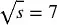 and 8 TeV
    in the ATLAS experiment." *The European Physical Journal C* , Vol.
    76, No. 1, p. 6.
2.  Abbott, B.P. et al. (2016): "Observation of gravitational waves from
    a binary black hole merger." *Physical Review Letters* , Vol. 116,
    No. 6, p. 061102.
3.  Armbrust, M., et al. (2010): "A view of cloud computing."
    *Communications of the ACM* , Vol. 53, No. 4, pp. 50--58.
4.  Asanovic, K. et al. (2006): "The landscape of parallel computing
    research: A view from Berkeley." *Technical Report
    UCB/EECS-2006-183* , EECS Department, University of California,
    Berkeley.
5.  Ayachit, U. et al. "Performance analysis, design considerations, and
    applications of extreme-scale in situ infrastructures." Proceedings
    of the International Conference for High Performance Computing,
    Networking, Storage and Analysis. IEEE Press.
6.  Bethel, E. W. et al. (2011): "Federal market information technology
    in the post Flash Crash era: Roles for supercomputing." Proceedings
    of WHPCF\'2011. ACM. pp. 23--30.
7.  Bloom, J. S. et al. (2012): "Automating discovery and classification
    of transients and variable stars in the synoptic survey era."
    *Publications of the Astronomical Society of the Pacific* , Vol.
    124, No. 921, p. 1175.
8.  Camerer, C.F. and G. Loewenstein (2011): "Behavioral economics:
    Past, present, future." In *Advances in Behavioral Economics* , pp.
    1--52.
9.  Chen, L. et al. (2015): "Profiling and understanding virtualization
    overhead in cloud." *Parallel Processing (ICPP)* , 201544th
    International Conference. IEEE.
10. Choi, J.Y. et al. (2013): ICEE: "Wide-area in transit data
    processing framework for near real-time scientific applications."
    4th SC Workshop on Petascale (Big) Data Analytics: Challenges and
    Opportunities in Conjunction with SC13.
11. Dong, Y. et al. (2012): "High performance network virtualization
    with SR-IOV." *Journal of Parallel and Distributed Computing* , Vol.
    72, No. 11, pp. 1471--1480.
12. Easley, D., M. Lopez de Prado, and M. O\'Hara (2011): "The
    microstructure of the 'Flash Crash': Flow toxicity, liquidity
    crashes and the probability of informed trading." *Journal of
    Portfolio Management* , Vol. 37, No. 2, pp. 118--128.
13. Folk, M. et al. (2011): "An overview of the HDF5 technology suite
    and its applications." Proceedings of the EDBT/ICDT 2011 Workshop on
    Array Databases. ACM.
14. Fox, G. et al. (2015): "Big Data, simulations and HPC convergence,
    iBig Data benchmarking": 6th International Workshop, WBDB 2015,
    Toronto, ON, Canada, June 16--17, 2015; and 7th International
    Workshop, WBDB 2015, New Delhi, India, December 14--15, 2015,
    Revised Selected Papers, T. Rabl, et al., eds. 2016, Springer
    International Publishing: Cham. pp. 3--17. DOI:
    10.1007/978-3-319-49748-8_1.
15. Ghemawat, S., H. Gobioff, and S.-T. Leung (2003): "The Google file
    system," *SOSP \'03: Proceedings of the nineteenth ACM symposium on
    operating systems principles* . ACM. pp. 29--43.
16. Gordon, A. et al. (2012): "ELI: Bare-metal performance for I/O
    virtualization." *SIGARCH Comput. Archit. News* , Vol. 40, No. 1,
    pp. 411--422.
17. Gropp, W., E. Lusk, and A. Skjellum (1999): *Using MPI: Portable
    Parallel Programming with the Message-Passing Interface* . MIT
    Press.
18. Hey, T., S. Tansley, and K.M. Tolle (2009): *The Fourth Paradigm:
    Data-Intensive Scientific Discovery* . Vol. 1. Microsoft research
    Redmond, WA.
19. Hirschman, A. O. (1980): *National Power and the Structure of
    Foreign Trade* . Vol. 105. University of California Press.
20. Holzman, B. et al. (2017): "HEPCloud, a new paradigm for HEP
    facilities: CMS Amazon Web Services investigation. *Computing and
    Software for Big Science* , Vol. 1, No. 1, p. 1.
21. Jackson, K. R., et al. (2010): "Performance analysis of high
    performance computing applications on the Amazon Web Services Cloud.
    *Cloud Computing Technology and Science (CloudCom)* . 2010 Second
    International Conference. IEEE.
22. Kim, T. et al. (2015): "Extracting baseline electricity usage using
    gradient tree boosting." IEEE International Conference on Smart
    City/SocialCom/SustainCom (SmartCity). IEEE.
23. Kumar, V. et al. (1994): *Introduction to Parallel Computing: Design
    and Analysis of Algorithms* . Benjamin/Cummings Publishing Company.
24. Liu, Q. et al., (2014): "Hello ADIOS: The challenges and lessons of
    developing leadership class I/O frameworks." *Concurrency and
    Computation: Practice and Experience* , Volume 26, No. 7, pp.
    1453--1473.
25. National Academies of Sciences, Engineering and Medicine (2016):
    *Future Directions for NSF Advanced Computing Infrastructure to
    Support U.S. Science and Engineering in 2017--2020* . National
    Academies Press.
26. Nicholas, M. L. et al. (2009): "The Palomar transient factory:
    System overview, performance, and first results." *Publications of
    the Astronomical Society of the Pacific* , Vol. 121, No. 886, p.
    1395.
27. Qiu, J. et al. (2016): "A survey of machine learning for big data
    processing." *EURASIP Journal on Advances in Signal Processing* ,
    Vol. 2016, No. 1, p. 67. DOI: 10.1186/s13634-016-0355-x
28. Rudin, C. and K. L. Wagstaff (2014) "Machine learning for science
    and society." *Machine Learning* , Vol. 95, No. 1, pp. 1--9.
29. Shoshani, A. and D. Rotem (2010): "Scientific data management:
    Challenges, technology, and deployment." *Chapman & Hall/CRC
    Computational Science Series* . CRC Press.
30. Snir, M. et al. (1998): *MPI: The Complete Reference. Volume 1, The
    MPI-1 Core* . MIT Press.
31. Song, J. H. et al. (2014): "Exploring irregular time series through
    non-uniform fast Fourier transform." Proceedings of the 7th Workshop
    on High Performance Computational Finance, IEEE Press.
32. Todd, A. et al. (2014): "Insights from Smart Meters: The potential
    for peak hour savings from behavior-based programs." Lawrence
    Berkeley National Laboratory. Available at
    <https://www4.eere.energy.gov/seeaction/system/files/documents/smart_meters.pdf>
    .
33. Wu, K. et al. (2013): "A big data approach to analyzing market
    volatility." *Algorithmic Finance* . Vol. 2, No. 3, pp. 241--267.
34. Wu, L. et al. (2016): "Towards real-time detection and tracking of
    spatio-temporal features: Blob-filaments in fusion plasma. *IEEE
    Transactions on Big Data* , Vol. 2, No. 3, pp. 262--275.
35. Yan, J. et al. (2009): "How much can behavioral targeting help
    online advertising?" Proceedings of the 18th international
    conference on world wide web. ACM. pp. 261--270.
36. Yelick, K., et al. (2011): "The Magellan report on cloud computing
    for science." U.S. Department of Energy, Office of Science.
37. Zeff, R.L. and B. Aronson (1999): *Advertising on the Internet* .
    John Wiley & Sons.

## 注释

^\ [1]^
   NERSC is a National User Facility funded by U.S. Department of
Energy, located at LBNL. More information about NERSC can be found at
<http://nersc.gov/> .

^\ [2]^
   The HDF Group web site is <https://www.hdfgroup.org/> .

^\ [3]^
   The National Strategic Computing Initiative plan is available online
at https://www.whitehouse.gov/
sites/whitehouse.gov/files/images/NSCI%20Strategic%20Plan.pdf(https://www.whitehouse.gov/sites/whitehouse.gov/files/images/NSCI%20Strategic%20Plan.pdf)
. The Wikipedia page on this topic (
<https://en.wikipedia.org/wiki/National_Strategic_Computing_Initiative>
) also has some useful links to additional information.

^\ [4]^
   Information about HPC4Manufacturing is available online at
<https://hpc4mfg.llnl.gov/> .

**Index**

-   Absolute return attribution method
-   Accounting data
-   Accuracy

    :::
    :::

    -   binary classification problems and
    -   measurement of
-   AdaBoost implementation
-   Adaptable I/O System (ADIOS)
-   Alternative data
-   Amihud\'s lambda
-   Analytics
-   Annualized Sharpe ratio
-   Annualized turnover, in backtesting
-   Asset allocation

    :::
    :::

    -   classical areas of mathematics used in
    -   covariance matrix in
    -   diversification in
    -   Markowitz\'s approach to
    -   Monte Carlo simulations for
    -   numerical example of
    -   practical problems in
    -   quasi-diagonalization in
    -   recursive bisection in
    -   risk-based. *See also* Risk-based asset allocation approaches
    -   tree clustering approaches to
-   Attribution
-   Augmented Dickey-Fuller (ADF) test. *See also* Supremum augmented
    Dickey-Fuller (SADF) test
-   Average holding period, in backtesting
-   Average slippage per turnover

-   Backfilled data
-   Backtesters
-   Backtesting

    :::
    :::

    -   bet sizing in
    -   common errors in
    -   combinatorial purged cross-validation (CPCV) method in
    -   cross-validation (CV) for
    -   customization of
    -   definition of
    -   "false discovery" probability and
    -   flawless completion as daunting task in
    -   general recommendations on
    -   machine learning asset allocation and
    -   purpose of
    -   as research tool
    -   strategy risk and
    -   strategy selection in
    -   synthetic data in
    -   uses of results of
    -   walk-forward (WF) method of
-   Backtest overfitting

    :::
    :::

    -   backtesters' evaluation of probability of
    -   bagging to reduce
    -   combinatorial purged cross-validation (CPCV) method for
    -   concerns about risk of
    -   cross-validation (CV) method and
    -   decision trees and proneness to
    -   definition of
    -   discretionary portfolio managers (PMs) and
    -   estimating extent of
    -   features stacking to reduce
    -   general recommendations on
    -   historical simulations in trading rules and
    -   hyper-parameter tuning and
    -   need for skepticism
    -   optimal trading rule (OTR) framework for
    -   probability of. *See* Probability of backtest overfitting (PBO)
    -   random forest (RF) method to reduce
    -   selection bias and
    -   support vector machines (SVMs) and
    -   trading rules and
    -   walk-forward (WF) method and
-   Backtest statistics

    :::
    :::

    -   classification measurements in
    -   drawdown (DD) and time under water (TuW) in
    -   efficiency measurements in
    -   general description of
    -   holding period estimator in
    -   implementation shortfall in
    -   performance attribution and
    -   performance measurements in
    -   returns concentration in
    -   runs in
    -   run measurements in
    -   time-weighted rate of returns (TWRR) in
    -   timing of bets from series of target positions in
    -   types of
-   Bagging

    :::
    :::

    -   accuracy improvement using
    -   boosting compared with
    -   leakage reduction using
    -   observation redundancy and
    -   overfitting reduction and
    -   random forest (RF) method compared with
    -   scalability using
    -   variance reduction using
-   Bars (table rows)

    :::
    :::

    -   categories of
    -   dollar bars
    -   dollar imbalance bars
    -   dollar runs bars
    -   information-driven bars
    -   standard bars
    -   tick bars
    -   tick imbalance bars
    -   tick runs bars
    -   time bars
    -   volume bars
    -   volume imbalance bars
    -   volume runs bars
-   Becker-Parkinson volatility algorithm
-   Bet sizing

    :::
    :::

    -   average active bets approach in
    -   bet concurrency calculation in
    -   budgeting approach to
    -   dynamic bet sizes and limit prices in
    -   holding periods and
    -   investment strategies and
    -   meta-labeling approach to
    -   performance attribution and
    -   predicted probabilities and
    -   runs and increase in
    -   size discretization in
    -   strategy-independent approaches to
    -   strategy\'s capacity and
-   Bet timing, deriving
-   Betting frequency

    :::
    :::

    -   backtesting and
    -   computing
    -   implied precision computation and
    -   investment strategy with trade-off between precision and
    -   strategy risk and
    -   targeting Sharpe ratio for
    -   trade size and
-   Bias
-   Bid-ask spread estimator
-   Bid wanted in competition (BWIC)
-   big data analysis
-   Bloomberg
-   Boosting

    :::
    :::

    -   AdaBoost implementation of
    -   bagging compared with
    -   implementation of
    -   main advantage of
    -   variance and bias reduction using
-   Bootstrap aggregation. *See* Bagging
-   Bootstraps, sequential
-   Box-Jenkins analysis
-   Broker fees per turnover
-   Brown-Durbin-Evans CUSUM test

-   Cancellation rates
-   Capacity, in backtesting
-   Chow-type Dickey-Fuller test
-   Chu-Stinchcombe-White CUSUM test
-   Classification models
-   Classification problems

    :::
    :::

    -   class weights for underrepresented labels in
    -   generating synthetic dataset for
    -   meta-labeling and
-   Classification statistics
-   Class weights

    :::
    :::

    -   decision trees using
    -   functionality for handling
    -   underrepresented label correction using
-   Cloud systems
-   Combinatorially symmetric cross-validation (CSCV) method
-   Combinatorial purged cross-validation (CPCV) method

    :::
    :::

    -   algorithm steps in
    -   backtest overfitting and
    -   combinatorial splits in
    -   definition of
    -   examples of
-   Compressed markets
-   Computational Intelligence and Forecasting Technologies (CIFT)
    project

    :::
    :::

    -   Adaptable I/O System (ADIOS) and
    -   business applications developed by
    -   Flash Crash of 2010 response and
    -   mission of
-   Conditional augmented Dickey-Fuller (CADF) test
-   Correlation to underlying, in backtesting
-   Corwin-Schultz algorithm
-   Critical Line Algorithm (CLA)

    :::
    :::

    -   description of
    -   Markowitz\'s development of
    -   Monte Carlo simulations using
    -   numerical example with
    -   open-source implementation of
    -   practical problems with
-   Cross-entropy loss (log loss) scoring
-   Cross-validation (CV)

    :::
    :::

    -   backtesting through
    -   combinatorial purged cross-validation (CPCV) method in
    -   embargo on training observations in
    -   failures in finance using
    -   goal of
    -   hyper-parameter tuning with
    -   k-fold
    -   leakage in
    -   model development and
    -   overlapping training observations in
    -   purpose of
    -   purging process in training set for leakage reduction in
    -   sklearn bugs in
-   CUSUM filter
-   CUSUM tests
-   CV\. *See* Cross-validation

-   Data analysis

    :::
    :::

    -   financial data structures and
    -   fractionally differentiated features and
    -   labeling and
    -   sample weights and
-   Data curators
-   Data mining and data snooping
-   Decision trees
-   Decompressed markets
-   Deflated Sharpe ratio (DSR)
-   Deployment team
-   Dickey-Fuller test

    :::
    :::

    -   Chow type
    -   supremum augmented (SADF)
-   Discretionary portfolio managers (PMs)
-   Discretization of bet size
-   Diversification
-   Dollar bars
-   Dollar imbalance bars (DIBs)
-   Dollar performance per turnover
-   Dollar runs bars (DRBs)
-   Downsampling
-   Drawdown (DD)

    :::
    :::

    -   definition of
    -   deriving
    -   example of
    -   run measurements using
-   Dynamic bet sizes

-   Econometrics

    :::
    :::

    -   financial Big Data analysis and
    -   financial machine learning versus
    -   HRP approach compared with
    -   investment strategies based in
    -   paradigms used in
    -   substitution effects and
    -   trading rules and
-   Efficiency measurements

    :::
    :::

    -   annualized Sharpe ratio and
    -   deflated Sharpe ratio (DSR) and
    -   information ratio and
    -   probabilistic Sharpe ratio (PSR) and
    -   Sharpe ratio (SR) definition in
-   Efficient frontier
-   Electricity consumption analysis
-   Engle-Granger analysis
-   Ensemble methods

    :::
    :::

    -   boosting and
    -   bootstrap aggregation (bagging) and
    -   random forest (RF) method and
-   Entropy features

    :::
    :::

    -   encoding schemes in estimates of
    -   financial applications of
    -   generalized mean and
    -   Lempel-Ziv (LZ) estimator in
    -   maximum likelihood estimator in
    -   Shannon\'s approach to
-   ETF trick
-   Event-based sampling
-   Excess returns, in information ratio
-   Execution costs
-   Expanding window method
-   Explosiveness tests

    :::
    :::

    -   Chow-type Dickey-Fuller test
    -   supremum augmented Dickey-Fuller (SADF) test

-   Factory plan
-   Feature analysts
-   Feature importance

    :::
    :::

    -   features stacking approach to
    -   importance of
    -   mean decrease accuracy (MDA) and
    -   mean decrease impurity (MDI) and
    -   orthogonal features and
    -   parallelized approach to
    -   plotting function for
    -   random forest (RF) method and
    -   as research tool
    -   single feature importance (SFI) and
    -   synthetic data experiments with
    -   weighted Kendall\'s tau computation in
    -   without substitution effects
    -   with substitution effects
-   Features stacking importance
-   Filter trading strategy
-   Finance

    :::
    :::

    -   algorithmization of
    -   human investors' abilities in
    -   purpose and role of
    -   usefulness of ML algorithms in
-   Financial data

    :::
    :::

    -   alternative
    -   analytics and
    -   essential types of
    -   fundamental
    -   market
-   Financial data structures

    :::
    :::

    -   bars (table rows) in
    -   multi-product series in
    -   sampling features in
    -   unstructured, raw data as starting point for
-   Financial Information eXchange (FIX) messages
-   Financial machine learning

    :::
    :::

    -   econometrics versus
    -   prejudices about use of
    -   standard machine learning separate from
-   Financial machine learning projects

    :::
    :::

    -   reasons for failure of
    -   structure by strategy component in
-   Fixed-time horizon labeling method
-   Fixed-width window fracdiff (FFD) method
-   Flash crashes

    :::
    :::

    -   class weights for predicting
    -   "early warning" indicators in
    -   high performance computing (HPC) tools and
    -   signs of emerging illiquidity events and
-   Flash Crash of 2010
-   F1 scores

    :::
    :::

    -   measurement of
    -   meta-labeling and
-   Fractional differentiation

    :::
    :::

    -   data transformation method for stationarity in
    -   earlier methods of
    -   expanding window method for
    -   fixed-width window fracdiff (FFD) method for
    -   maximum memory preservation in
-   Frequency. *See* Betting frequency
-   Fundamental data
-   Fusion collaboration project
-   Futures

    :::
    :::

    -   dollar bars and
    -   ETF trick with
    -   non-negative rolled price series and
    -   single futures roll method with
    -   volume bars and

-   Gaps series, in single future roll method
-   Global Investment Performance Standards (GIPS)
-   Graph theory
-   Grid search cross-validation

-   Hasbrouck\'s lambda
-   Hedging weights
-   Herfindahl-Hirschman Index (HHI) concentration
-   HHI indexes

    :::
    :::

    -   on negative returns
    -   on positive returns
    -   on time between bets
-   Hierarchical Data Format 5 (HDF5)
-   Hierarchical Risk Parity (HRP) approach

    :::
    :::

    -   econometric regression compared with
    -   full implementation of
    -   Monte Carlo simulations using
    -   numerical example of
    -   practical application of
    -   quasi-diagonalization in
    -   recursive bisection in
    -   standard approaches compared with
    -   traditional risk parity approach compared with
    -   tree clustering approaches to
-   High-frequency trading
-   High-low volatility estimator
-   High-performance computing (HPC)

    :::
    :::

    -   ADIOS and
    -   atoms and molecules in parallelization and
    -   CIFT business applications and
    -   cloud systems compared with
    -   combinatorial optimization and
    -   electricity consumption analysis using
    -   Flash Crash of 2010 response and
    -   fusion collaboration project using
    -   global dynamic optimal trajectory and
    -   hardware for
    -   integer optimization approach and
    -   multiprocessing and
    -   objective function and
    -   pattern-finding capability in
    -   software for
    -   streaming data analysis using
    -   supernova hunting using
    -   use cases for
    -   vectorization and
-   Holding periods

    :::
    :::

    -   backtesting and
    -   bet sizing and
    -   estimating in strategy
    -   optimal trading rule (OTR) algorithm with
    -   triple-period labeling method and
-   Hyper-parameter tuning

    :::
    :::

    -   grid search cross-validation and
    -   log loss scoring used with
    -   randomized search cross-validation and

-   Implementation shortfall statistics
-   Implied betting frequency
-   Implied precision computation
-   Indicator matrix
-   Information-driven bars (table rows)

    :::
    :::

    -   dollar imbalance bars
    -   dollar runs bars
    -   purpose of
    -   tick imbalance bars
    -   tick runs bars
    -   volume imbalance bars
    -   volume runs bars
-   Information ratio
-   Inverse-Variance Portfolio (IVP)

    :::
    :::

    -   asset allocation numerical example of
    -   Monte Carlo simulations using
-   Investment strategies

    :::
    :::

    -   algorithmization of
    -   bet sizing in
    -   evolution of
    -   exit conditions in
    -   human investors' abilities and
    -   log loss scoring used with hyper-parameter tuning in
    -   profit-taking and stop-loss limits in
    -   risk in. *See* Strategy risk
    -   structural breaks and
    -   trade-off between precision and frequency in
    -   trading rules and algorithms in
-   Investment strategy failure probability

    :::
    :::

    -   algorithm in
    -   implementation of algorithm in
    -   probabilistic Sharpe ratio (PSR) similarity to
    -   strategy risk and

-   K-fold cross-validation (CV)

    :::
    :::

    -   description of
    -   embargo on training observations in
    -   leakage in
    -   mean decrease accuracy (MDA) feature with
    -   overlapping training observations in
    -   purging process in training set for leakage reduction in
    -   when used
-   Kyle\'s lambda

-   Labeling

    :::
    :::

    -   daily volatility at intraday estimation for
    -   dropping unnecessary or under-populated labels in
    -   fixed-time horizon labeling method for
    -   learning side and size in
    -   meta-labeling and
    -   quantamental approach using
    -   triple-barrier labeling method for
-   Labels

    :::
    :::

    -   average uniqueness over lifespan of
    -   class weights for underrepresented labels
    -   estimating uniqueness of
-   Lawrence Berkeley National Laboratory (LBNL, Berkeley Lab)
-   Leakage, and cross-validation (CV)
-   Leakage reduction

    :::
    :::

    -   bagging for
    -   purging process in training set for
    -   sequential bootstraps for
    -   walk-forward timefolds method for
-   Lempel-Ziv (LZ) estimator
-   Leverage, in backtesting
-   Limit prices, in bet sizing
-   Log loss scoring, in hyper-parameter tuning
-   Log-uniform distribution
-   Look-ahead bias

-   Machine learning (ML)

    :::
    :::

    -   finance and
    -   financial machine learning separate from
    -   HRP approach using
    -   human investors and
    -   prejudices about use of
-   Machine learning asset allocation. *See also* Hierarchical Risk
    Parity (HRP) approach

    :::
    :::

    -   Monte Carlo simulations for
    -   numerical example of
    -   quasi-diagonalization in
    -   recursive bisection in
    -   tree clustering approaches to
-   Market data
-   Markowitz, Harry
-   Maximum dollar position size, in backtesting
-   Maximum likelihood estimator, in entropy
-   Mean decrease accuracy (MDA) feature importance

    :::
    :::

    -   computed on synthetic dataset
    -   considerations in working with
    -   implementation of
    -   single feature importance (SFI) and
-   Mean decrease impurity (MDI) feature importance

    :::
    :::

    -   computed on synthetic dataset
    -   considerations in working with
    -   implementation of
    -   single feature importance (SFI) and
-   Message Passing Interface (MPI)
-   Meta-labeling

    :::
    :::

    -   bet sizing using
    -   code enhancements for
    -   description of
    -   dropping unnecessary or under-populated labels in
    -   how to use
    -   quantamental approach using
-   Meta-strategy paradigm
-   Microstructural features

    :::
    :::

    -   alternative features of
    -   Amihud\'s lambda and
    -   bid-ask spread estimator (Corwin-Schultz algorithm) and
    -   Hasbrouck\'s lambda and
    -   high-low volatility estimator and
    -   Kyle\'s lambda and
    -   microstructural information definition and
    -   probability of informed trading and
    -   Roll model and
    -   sequential trade models and
    -   strategic trade models and
    -   tick rule and
    -   volume-synchronized probability of informed trading (VPIN) and
-   Mixture of Gaussians (EF3M)
-   Model development

    :::
    :::

    -   cross-validation (CV) for
    -   overfitting reduction and
    -   single feature importance method and
-   Modelling

    :::
    :::

    -   applications of entropy to
    -   backtesting in
    -   cross-validation in
    -   econometrics and
    -   ensemble methods in
    -   entropy features in
    -   feature importance in
    -   hyper-parameter tuning with cross-validation in
    -   market microstructure theories and
    -   three sources of errors in
-   Monte Carlo simulations

    :::
    :::

    -   machine learning asset allocation and
    -   sequential bootstraps evaluation using
-   Multi-product series

    :::
    :::

    -   ETF trick for
    -   PCA weights for
    -   single future roll in

-   National laboratories
-   Negative (neg) log loss scores

    :::
    :::

    -   hyper-parameter tuning using
    -   measurement of
-   Noise, causes of
-   Non-negative rolled price series

-   Optimal trading rule (OTR) framework

    :::
    :::

    -   algorithm steps in
    -   cases with negative long-run equilibrium in
    -   cases with positive long-run equilibrium in
    -   cases with zero long-run equilibrium in
    -   experimental results using simulation in
    -   implementation of
    -   overfitting and
    -   profit-taking and stop-loss limits in
    -   synthetic data for determination of
-   Options markets
-   Ornstein-Uhlenbeck (O-U) process
-   Orthogonal features

    :::
    :::

    -   benefits of
    -   computation of
    -   implementation of
-   Outliers, in quantitative investing
-   Overfitting. *See* Backtest overfitting

-   Parallelized feature importance
-   PCA (*see* Principal components analysis)
-   Performance attribution
-   Plotting function for feature importance
-   PnL (mark-to-market profits and losses)

    :::
    :::

    -   ETF trick and
    -   performance attribution using
    -   as performance measurement
    -   rolled prices for simulating
-   PnL from long positions
-   Portfolio construction. *See also* Hierarchical Risk Parity (HRP)
    approach

    :::
    :::

    -   classical areas of mathematics used in
    -   covariance matrix in
    -   diversification in
    -   entropy and concentration in
    -   Markowitz\'s approach to
    -   Monte Carlo simulations for
    -   numerical example of
    -   practical problems in
    -   tree clustering approaches to
-   Portfolio oversight
-   Portfolio risk. *See also* Hierarchical Risk Parity (HRP) approach;
    Risk; Strategy risk

    :::
    :::

    -   portfolio decisions based on
    -   probability of strategy failure and
    -   strategy risk differentiated from
-   Portfolio turnover costs
-   Precision

    :::
    :::

    -   binary classification problems and
    -   investment strategy with trade-off between frequency and
    -   measurement of
-   Predicted probabilities, in bet sizing
-   Principal components analysis (PCA)

    :::
    :::

    -   hedging weights using
    -   linear substitution effects and
-   Probabilistic Sharpe ratio (PSR)

    :::
    :::

    -   calculation of
    -   as efficiency statistic
    -   probability of strategy failure, similarity to
-   Probability of backtest overfitting (PBO)

    :::
    :::

    -   backtest overfitting evaluation using
    -   combinatorially symmetric cross-validation (CSCV) method for
    -   strategy selection based on estimation of
-   Probability of informed trading (PIN)
-   Probability of strategy failure

    :::
    :::

    -   algorithm in
    -   implementation of algorithm in
    -   probabilistic Sharpe ratio (PSR), similarity to
    -   strategy risk and
-   Profit-taking, and investment strategy exit
-   Profit-taking limits

    :::
    :::

    -   asymmetric payoff dilemma and
    -   cases with negative long-run equilibrium and
    -   cases with positive long-run equilibrium and
    -   cases with zero long-run equilibrium and
    -   daily volatility at intraday estimation points computation and
    -   investment strategies using
    -   learning side and size and
    -   optimal trading rule (OTR) algorithm for
    -   strategy risk and
    -   triple-barrier labeling method for
-   Purged K-fold cross-validation (CV)

    :::
    :::

    -   grid search cross-validation and
    -   hyper-parameter tuning with
    -   implementation of
    -   randomized search cross-validation and
-   Python

-   Quantamental approach
-   Quantamental funds
-   Quantitative investing

    :::
    :::

    -   backtest overfitting in
    -   failure rate in
    -   meta-strategy paradigm in
    -   quantamental approach in
    -   seven sins of
-   Quantum computing

-   Random forest (RF) method

    :::
    :::

    -   alternative ways of setting up
    -   bagging compared with
    -   bet sizing using
-   Randomized search cross-validation
-   Recall

    :::
    :::

    -   binary classification problems and
    -   measurement of
-   Reinstated value
-   Return attribution method
-   Return on execution costs
-   Returns concentration
-   RF. *See* Random forest (RF) method
-   Right-tail unit-root tests
-   Risk. *See also* Hierarchical Risk Parity (HRP) approach; Strategy
    risk

    :::
    :::

    -   backtest statistics for uncovering
    -   entropy application to portfolio concentration and
    -   liquidity and
    -   ML algorithms for monitoring
    -   PCA weights and
    -   portfolio oversight and
    -   profit taking and stop-loss limits and
    -   structural breaks and
    -   walk-forward (WF) approach and
-   Risk-based asset allocation approaches

    :::
    :::

    -   HRP approach comparisons in
    -   structural breaks and
-   Risk parity. *See also* Hierarchical Risk Parity (HRP) approach

    :::
    :::

    -   HRP approach compared with traditional approach to
-   Rolled prices
-   Roll model

-   Sample weights

    :::
    :::

    -   average uniqueness of labels over lifespan and
    -   bagging classifiers and uniqueness and
    -   indicator matrix for
    -   mean decrease accuracy (MDA) feature importance with
    -   number of concurrent labels and
    -   overlapping outcomes and
    -   return attribution method and
    -   sequential bootstrap and
    -   time-decay factors and
-   Sampling features

    :::
    :::

    -   downsampling and
    -   event-based sampling and
-   Scalability

    :::
    :::

    -   bagging for
    -   sample size in ML algorithms and
-   Scikit-learn (sklearn)

    :::
    :::

    -   class weights in
    -   cross-validation (CV) bugs in
    -   grid search cross-validation in
    -   labels and bug in
    -   mean decrease impurity (MDI) and
    -   neg log loss as scoring statistic and bug in
    -   observation redundancy and bagging classifiers in
    -   random forest (RF) overfitting and
    -   support vector machine (SVM) implementation in
    -   synthetic dataset generation in
    -   walk-forward timefolds method in
-   Selection bias
-   Sequential bootstraps

    :::
    :::

    -   description of
    -   implementation of
    -   leakage reduction using
    -   Monte Carlo experiments evaluating
    -   numerical example of
-   Shannon, Claude
-   Sharpe ratio (SR) in efficiency measurements

    :::
    :::

    -   annualized
    -   definition of
    -   deflated (DSR)
    -   information ratio and
    -   probabilistic (PSR)
    -   purpose of
    -   targeting, for various betting frequencies
-   Shorting, in quantitative investing
-   Signal order flows
-   Simulations, overfitting of
-   Single feature importance (SFI)
-   Single future roll
-   Sklearn. *See* Scikit-learn
-   Stacked feature importance
-   Standard bars (table rows)

    :::
    :::

    -   dollar bars
    -   purpose of
    -   tick bars
    -   time bars
    -   volume bars
-   Stationarity

    :::
    :::

    -   data transformation method to ensure
    -   fractional differentiation applied to
    -   fractional differentiation implementation methods for
    -   integer transformation for
    -   maximum memory preservation for
    -   memory loss dilemma and
-   Stop-loss, and investment strategy exit
-   Stop-loss limits

    :::
    :::

    -   asymmetric payoff dilemma and
    -   cases with negative long-run equilibrium and
    -   cases with positive long-run equilibrium and
    -   cases with zero long-run equilibrium and
    -   daily volatility computation and
    -   fixed-time horizon labeling method and
    -   investment strategies using
    -   learning side and size and
    -   optimal trading rule (OTR) algorithm for
    -   strategy risk and
    -   triple-barrier labeling method for
-   Storytelling
-   Strategists
-   Strategy risk

    :::
    :::

    -   asymmetric payouts and
    -   calculating
    -   implied betting frequency and
    -   implied precision and
    -   investment strategies and understanding of
    -   portfolio risk differentiated from
    -   probabilistic Sharpe ratio (PSR) similarity to
    -   strategy failure probability and
    -   symmetric payouts and
-   Structural breaks

    :::
    :::

    -   CUSUM tests in
    -   explosiveness tests in
    -   sub- and super-martingale tests in
    -   types of tests in
-   Sub- and super-martingale tests
-   Supernova research
-   Support vector machines (SVMs)
-   Supremum augmented Dickey-Fuller (SADF) test

    :::
    :::

    -   conditional ADF
    -   implementation of
    -   quantile ADF
-   Survivorship bias
-   SymPy Live
-   Synthetic data

    :::
    :::

    -   backtesting using
    -   experimental results using simulation combinations with
    -   optimal trading rule (OTR) framework using

-   Tick bars
-   Tick imbalance bars (TIBs)
-   Tick rule
-   Tick runs bars (TRBs)
-   Time bars

    :::
    :::

    -   description of
    -   fixed-time horizon labeling method using
-   Time-decay factors, and sample weights
-   Time period, in backtesting
-   Time series

    :::
    :::

    -   fractional differentiation applied to
    -   integer transformation for stationarity in
    -   stationarity vs. memory loss dilemma in
-   Time under water (TuW)

    :::
    :::

    -   definition of
    -   deriving
    -   example of
    -   run measurements using
-   Time-weighted average price (TWAP)
-   Time-weighted rate of returns (TWRR)
-   Trading rules

    :::
    :::

    -   investment strategies and algorithms in
    -   optimal trading rule (OTR) framework for
    -   overfitting in
-   Transaction costs, in quantitative investing
-   Tree clustering approaches, in asset allocation
-   Triple-barrier labeling method
-   Turnover costs

-   Variance

    :::
    :::

    -   boosting to reduce
    -   causes of
    -   ensemble methods to reduce
    -   random forest (RF) method for
-   Vectorization
-   Volume bars
-   Volume imbalance bars (VIBs)
-   Volume runs bars (VRBs)
-   Volume-synchronized probability of informed trading (VPIN)

-   Walk-forward (WF) method

    :::
    :::

    -   backtesting using
    -   overfitting in
    -   pitfalls of
    -   Sharpe ratio estimation in
    -   two key advantages of
-   Walk-forward timefolds method
-   Weighted Kendall\'s tau
-   Weights. *See* Class weights; Sample weights

**WILEY END USER LICENSE AGREEMENT**

Go to
www.wiley.com/go/eula](http://www.wiley.com/go/eula) [to access Wiley's
ebook EULA.

**Table of Contents**

About the Author

PREAMBLE

> > [第 1 章](ch01.md) Financial Machine Learning as a Distinct
> > Subject

> > > > > > 1.1 Motivation

> > > > > > 1.2 The Main Reason Financial Machine Learning Projects
> > > > > > Usually Fail

> > > > > > 1.3 Book Structure

> > > > > > 1.4 Target Audience

> > > > > > 1.5 Requisites

> > > > > > 1.6 FAQs

> > > > > > 1.7 Acknowledgments

> > > > > > 练习题

> > > > > > 参考文献

> > > > > > 参考书目

> > > > > > 注释

PART 1 DATA ANALYSIS

> > [第 2 章](ch02.md) Financial Data
> > Structures

> > > > > > 2.1 Motivation

> > > > > > 2.2 Essential Types of Financial
> > > > > > Data

> > > > > > 2.3 Bars

> > > > > > 2.4 Dealing with Multi-Product
> > > > > > Series

> > > > > > 2.5 Sampling Features

> > > > > > 练习题

> > > > > > 参考文献

> > [第 3 章](ch03.md) Labeling

> > > > > > 3.1 Motivation

> > > > > > 3.2 The Fixed-Time Horizon
> > > > > > Method

> > > > > > 3.3 Computing Dynamic
> > > > > > Thresholds

> > > > > > 3.4 The Triple-Barrier
> > > > > > Method

> > > > > > 3.5 Learning Side and
> > > > > > Size

> > > > > > 3.6 Meta-Labeling

> > > > > > 3.7 How to Use
> > > > > > Meta-Labeling

> > > > > > 3.8 The Quantamental Way

> > > > > > 3.9 Dropping Unnecessary
> > > > > > Labels

> > > > > > 练习题

> > > > > > 参考书目

> > > > > > Note

> > [第 4 章](ch04.md) Sample Weights

> > > > > > 4.1 Motivation

> > > > > > 4.2 Overlapping Outcomes

> > > > > > 4.3 Number of Concurrent
> > > > > > Labels

> > > > > > 4.4 Average Uniqueness of a
> > > > > > Label

> > > > > > 4.5 Bagging Classifiers and
> > > > > > Uniqueness

> > > > > > 4.6 Return Attribution

> > > > > > 4.7 Time Decay

> > > > > > 4.8 Class Weights

> > > > > > 练习题

> > > > > > 参考文献

> > > > > > 参考书目

> > [第 5 章](ch05.md) Fractionally Differentiated
> > Features

> > > > > > 5.1 Motivation

> > > > > > 5.2 The Stationarity vs. Memory
> > > > > > Dilemma

> > > > > > 5.3 Literature Review

> > > > > > 5.4 The Method

> > > > > > 5.5 Implementation

> > > > > > 5.6 Stationarity with Maximum Memory
> > > > > > Preservation

> > > > > > 5.7 Conclusion

> > > > > > 练习题

> > > > > > 参考文献

> > > > > > 参考书目

PART 2 MODELLING

> > [第 6 章](ch06.md) Ensemble Methods

> > > > > > 6.1 Motivation

> > > > > > 6.2 The Three Sources of
> > > > > > Errors

> > > > > > 6.3 Bootstrap
> > > > > > Aggregation

> > > > > > 6.4 Random Forest

> > > > > > 6.5 Boosting

> > > > > > 6.6 Bagging vs. Boosting in
> > > > > > Finance

> > > > > > 6.7 Bagging for
> > > > > > Scalability

> > > > > > 练习题

> > > > > > 参考文献

> > > > > > 参考书目

> > > > > > 注释

> > [第 7 章](ch07.md) Cross-Validation in
> > Finance

> > > > > > 7.1 Motivation

> > > > > > 7.2 The Goal of
> > > > > > Cross-Validation

> > > > > > 7.3 Why K-Fold CV Fails in
> > > > > > Finance

> > > > > > 7.4 A Solution: Purged K-Fold
> > > > > > CV

> > > > > > 7.5 Bugs in Sklearn\'s
> > > > > > Cross-Validation

> > > > > > 练习题

> > > > > > 参考书目

> > [第 8 章](ch08.md) Feature Importance

> > > > > > 8.1 Motivation

> > > > > > 8.2 The Importance of Feature
> > > > > > Importance

> > > > > > 8.3 Feature Importance with Substitution
> > > > > > Effects

> > > > > > 8.4 Feature Importance without Substitution
> > > > > > Effects

> > > > > > 8.5 Parallelized vs. Stacked Feature
> > > > > > Importance

> > > > > > 8.6 Experiments with Synthetic
> > > > > > Data

> > > > > > 练习题

> > > > > > 参考文献

> > > > > > Note

> > [第 9 章](ch09.md) Hyper-Parameter Tuning with
> > Cross-Validation

> > > > > > 9.1 Motivation

> > > > > > 9.2 Grid Search
> > > > > > Cross-Validation

> > > > > > 9.3 Randomized Search
> > > > > > Cross-Validation

> > > > > > 9.4 Scoring and Hyper-parameter
> > > > > > Tuning

> > > > > > 练习题

> > > > > > 参考文献

> > > > > > 参考书目

> > > > > > 注释

PART 3 BACKTESTING

> > [第 10 章](ch10.md) Bet Sizing

> > > > > > 10.1 Motivation

> > > > > > 10.2 Strategy-Independent Bet Sizing
> > > > > > Approaches

> > > > > > 10.3 Bet Sizing from Predicted
> > > > > > Probabilities

> > > > > > 10.4 Averaging Active
> > > > > > Bets

> > > > > > 10.5 Size Discretization

> > > > > > 10.6 Dynamic Bet Sizes and Limit
> > > > > > Prices

> > > > > > 练习题

> > > > > > 参考文献

> > > > > > 参考书目

> > > > > > 注释

> > [第 11 章](ch11.md) The Dangers of
> > Backtesting

> > > > > > 11.1 Motivation

> > > > > > 11.2 Mission Impossible: The Flawless
> > > > > > Backtest

> > > > > > 11.3 Even If Your Backtest Is Flawless, It Is Probably
> > > > > > Wrong

> > > > > > 11.4 Backtesting Is Not a Research
> > > > > > Tool

> > > > > > 11.5 A Few General
> > > > > > Recommendations

> > > > > > 11.6 Strategy Selection

> > > > > > 练习题

> > > > > > 参考文献

> > > > > > 参考书目

> > > > > > Note

> > [第 12 章](ch12.md) Backtesting through
> > Cross-Validation

> > > > > > 12.1 Motivation

> > > > > > 12.2 The Walk-Forward
> > > > > > Method

> > > > > > 12.3 The Cross-Validation
> > > > > > Method

> > > > > > 12.4 The Combinatorial Purged Cross-Validation
> > > > > > Method

> > > > > > 12.5 How Combinatorial Purged Cross-Validation Addresses
> > > > > > Backtest Overfitting

> > > > > > 练习题

> > > > > > 参考文献

> > [第 13 章](ch13.md) Backtesting on Synthetic
> > Data

> > > > > > 13.1 Motivation

> > > > > > 13.2 Trading Rules

> > > > > > 13.3 The Problem

> > > > > > 13.4 Our Framework

> > > > > > 13.5 Numerical Determination of Optimal Trading
> > > > > > Rules

> > > > > > 13.6 Experimental
> > > > > > Results

> > > > > > 13.7 Conclusion

> > > > > > 练习题

> > > > > > 参考文献

> > > > > > 注释

> > [第 14 章](ch14.md) Backtest Statistics

> > > > > > 14.1 Motivation

> > > > > > 14.2 Types of Backtest
> > > > > > Statistics

> > > > > > 14.3 General
> > > > > > Characteristics

> > > > > > 14.4 Performance

> > > > > > 14.5 Runs

> > > > > > 14.6 Implementation
> > > > > > Shortfall

> > > > > > 14.7 Efficiency

> > > > > > 14.8 Classification
> > > > > > Scores

> > > > > > 14.9 Attribution

> > > > > > 练习题

> > > > > > 参考文献

> > > > > > 参考书目

> > > > > > 注释

> > [第 15 章](ch15.md) Understanding Strategy
> > Risk

> > > > > > 15.1 Motivation

> > > > > > 15.2 Symmetric Payouts

> > > > > > 15.3 Asymmetric Payouts

> > > > > > 15.4 The Probability of Strategy
> > > > > > Failure

> > > > > > 练习题

> > > > > > 参考文献

> > [第 16 章](ch16.md) Machine Learning Asset
> > Allocation

> > > > > > 16.1 Motivation

> > > > > > 16.2 The Problem with Convex Portfolio
> > > > > > Optimization

> > > > > > 16.3 Markowitz\'s Curse

> > > > > > 16.4 From Geometric to Hierarchical
> > > > > > Relationships

> > > > > > 16.5 A Numerical Example

> > > > > > 16.6 Out-of-Sample Monte Carlo
> > > > > > Simulations

> > > > > > 16.7 Further Research

> > > > > > 16.8 Conclusion

> > > > > > APPENDICES

> > > > > > 16.A.1 Correlation-based
> > > > > > Metric

> > > > > > 16.A.2 Inverse Variance
> > > > > > Allocation

> > > > > > 16.A.3 Reproducing the Numerical
> > > > > > Example

> > > > > > 16.A.4 Reproducing the Monte Carlo
> > > > > > Experiment

> > > > > > 练习题

> > > > > > 参考文献

> > > > > > 注释

PART 4 USEFUL FINANCIAL FEATURES

> > [第 17 章](ch17.md) Structural Breaks

> > > > > > 17.1 Motivation

> > > > > > 17.2 Types of Structural Break
> > > > > > Tests

> > > > > > 17.3 CUSUM Tests

> > > > > > 17.4 Explosiveness Tests

> > > > > > 练习题

> > > > > > 参考文献

> > [第 18 章](ch18.md) Entropy Features

> > > > > > 18.1 Motivation

> > > > > > 18.2 Shannon\'s Entropy

> > > > > > 18.3 The Plug-in (or Maximum Likelihood)
> > > > > > Estimator

> > > > > > 18.4 Lempel-Ziv
> > > > > > Estimators

> > > > > > 18.5 Encoding Schemes

> > > > > > 18.6 Entropy of a Gaussian
> > > > > > Process

> > > > > > 18.7 Entropy and the Generalized
> > > > > > Mean

> > > > > > 18.8 A Few Financial Applications of
> > > > > > Entropy

> > > > > > 练习题

> > > > > > 参考文献

> > > > > > 参考书目

> > > > > > Note

> > [第 19 章](ch19.md) Microstructural
> > Features

> > > > > > 19.1 Motivation

> > > > > > 19.2 Review of the
> > > > > > Literature

> > > > > > 19.3 First Generation: Price
> > > > > > Sequences

> > > > > > 19.4 Second Generation: Strategic Trade
> > > > > > Models

> > > > > > 19.5 Third Generation: Sequential Trade
> > > > > > Models

> > > > > > 19.6 Additional Features from Microstructural
> > > > > > Datasets

> > > > > > 19.7 What Is Microstructural
> > > > > > Information?

> > > > > > 练习题

> > > > > > 参考文献

PART 5 HIGH-PERFORMANCE COMPUTING
RECIPES

> > [第 20 章](ch20.md) Multiprocessing and
> > Vectorization

> > > > > > 20.1 Motivation

> > > > > > 20.2 Vectorization
> > > > > > Example

> > > > > > 20.3 Single-Thread vs. Multithreading vs.
> > > > > > Multiprocessing

> > > > > > 20.4 Atoms and Molecules

> > > > > > 20.5 Multiprocessing
> > > > > > Engines

> > > > > > 20.6 Multiprocessing
> > > > > > Example

> > > > > > 练习题

> > > > > > Reference

> > > > > > 参考书目

> > > > > > 注释

> > [第 21 章](ch21.md) Brute Force and Quantum
> > Computers

> > > > > > 21.1 Motivation

> > > > > > 21.2 Combinatorial
> > > > > > Optimization

> > > > > > 21.3 The Objective
> > > > > > Function

> > > > > > 21.4 The Problem

> > > > > > 21.5 An Integer Optimization
> > > > > > Approach

> > > > > > 21.6 A Numerical Example

> > > > > > 练习题

> > > > > > 参考文献

> > [第 22 章](ch22.md) High-Performance Computational Intelligence and
> > Forecasting Technologies

> > > > > > 22.1 Motivation

> > > > > > 22.2 Regulatory Response to the Flash Crash of
> > > > > > 2010

> > > > > > 22.3 Background

> > > > > > 22.4 HPC Hardware

> > > > > > 22.5 HPC Software

> > > > > > 22.6 Use Cases

> > > > > > 22.7 Summary and Call for
> > > > > > Participation

> > > > > > 22.8 Acknowledgments

> > > > > > 参考文献

> > > > > > 注释

Index

EULA
