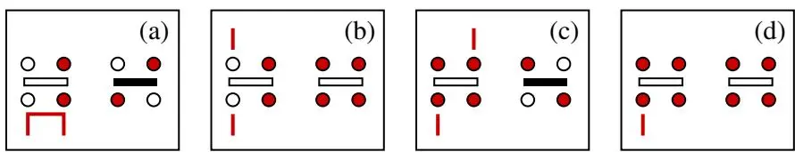
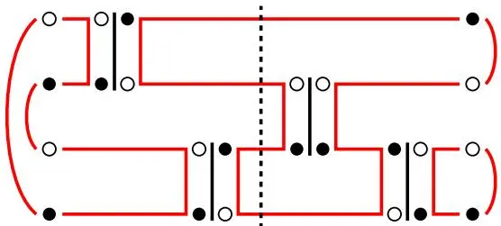

# 第6章 · 相关计算方法综述

在这些讲义中，我们详细讨论了精确对角化方法和SSE QMC方法，并考察了一些针对$S = 1 / 2$模型的计算实例及其结果。通过将讨论限定在$S = 1 / 2$系统，以及在此类系统中的自旋各向同性系统，有许多关于方法和物理的问题未被涉及。精确对角化方法可以很容易地用于任何自旋模型，但随着自旋S的增大，希尔伯特空间的规模迅速增长，这对$S > 1 / 2$系统的晶格尺寸施加了更为严格的限制。世界线和SSE QMC方法可以推广到任何自旋模型，只要系统中不存在导致符号问题的阻挫。在本节中，我们简要总结了一些适用于更一般自旋模型的QMC方案，以及针对各向同性$S = 1 / 2$系统的一些最新进展。

还有其他几种重要的计算方法超出了这些讲义的范围，例如级数展开技术（高温展开和围绕基态某些可解极限的展开，例如各向异性海森堡模型的伊辛极限）[261, 262]以及DMRG方法[28, 29]。虽然级数展开原则上可以应用于任何模型，但在以可控方式外推级数方面存在问题，而且在大多数感兴趣的情况下，人们无法期望达到与无符号问题模型的QMC模拟相同的精度（例如，在量子相变研究中）。尽管如此，级数展开方法仍然是目前可用于二维阻挫量子自旋系统的最强大的一类方法[100]，在这些系统中QMC方法受到符号问题的限制（但请注意在高温下控制符号问题的最新进展[193]）。更强大的级数展开方案仍在积极开发中[263]，预计这一领域将继续取得进展。DMRG方法对一维系统非常有效，也可用于中等尺寸的二维系统[94]。目前，人们正在非常积极地探索将DMRG方法以及相关的矩阵乘积态[26, 264, 21]推广到更高维度的“张量网络”态[21, 106, 265]。这是一条令人兴奋的研究路线，最终可能为无偏研究阻挫自旋系统（甚至费米子系统）提供可行方案。然而，在可预见的未来，这些方法似乎不太可能达到与针对非阻挫系统的现有QMC方法相同的精度水平来探测量子自旋系统。

图90. 各向异性$S = 1/2$海森堡模型（可能还包括外磁场）中，通过顶点的四种可能路径的例子，以及在定向环算法中沿这些路径移动时生成的新顶点。每个方框左侧顶点处的竖线表示入口和出口腿（两个方向的移动都是可能的）。给定一个入口腿，必须选择出口，使得当腿上的自旋翻转时生成一个允许的新顶点（右侧的顶点，未标出路径）。在“反弹”过程(d)中，出口与入口在同一腿上，顶点不改变。在一般的各向异性海森堡模型中，有六个允许的顶点——那些自旋（z分量）守恒的顶点。在第5节讨论的“确定性”环算法中，只有四个顶点，且只允许(a)类型的路径

综合考虑上述不同方法的优缺点，作者主张在研究量子自旋模型及相关系统时采取双管齐下的策略：(i) 探索新的和改进的方案（也包括 QMC 方案），这些方案可能有助于研究目前 QMC 技术无法触及的模型。(ii) 使用最先进的 QMC 方法研究无符号问题模型的有趣物理现象。认为在无符号问题模型上所有能做的都已经做了，这种说法远非事实（尽管有时能听到这种说法）！借助现有的 QMC 方法，例如第 5 节中描述的 SSE 算法，以及现代计算机的强大功能（其性能仍在以惊人的速度提升，例如每个 CPU 的内核数稳步增加），我们能够触及仅在几年前还无法企及的有趣物理现象。特别是第 5.3.5 节中对二聚化和 J-Q 类模型的讨论，希望能让读者相信，在这样系统中以及更广泛的领域（例如表现出反常态和量子相变 [266, 267, 268, 278] 的无序系统）还有很多值得探索。

定向环 QMC 算法。定向环算法是 SSE 算符环方案的推广，由 [33] 引入（建立在先前效率较低的公式 [190] 之上），并应用于具有各向异性相互作用（伊辛和 XY）和外磁场的 S = 1/2 海森堡系统。环与定向环（在 SSE 和世界线公式中）的主要区别在于，在定向环方案中，穿过顶点的路径不是唯一的。路径（给定一个顶点入口腿后的出口腿）是根据特定概率选择的，这些概率旨在在一个包含两个缺陷（开放的环端）的空间中维持细致平衡（在精神上与 "虫" 算法 [32] 类似）。对于 S = 1/2 系统，有四种类型的顶点路径，对应于出口相对于入口的位置，如图 90 所示并进行了更详细的讨论。这些路径概率，它们应该是对应定向环方程（用于细致平衡）的解，通常不是唯一的。对于某些模型，消除图 90(d) 中的 "反弹" 过程（bounce process）将定向环方案简化为先前为 S = 1/2 系统开发的其中一个标准环更新方案（如第 5 节讨论的各向同性系统）

和更高 S 模型 [191, 31, 189]。在其他情况下，定向环（和虫）算法允许在标准环算法不适用的地方进行高效模拟 [33, 269, 270, 271]。在此也可以提及，在 SSE 定向环算法中，有时使用定义在比包含哈密顿量基本算符（例如，海森堡模型的双自旋键算符）[272] 的胞元更大的胞元上的算符会很有用。这为当环穿过顶点时算符如何重构提供了更多选择，有时可以使模拟效率大大提高。

价键基下的 QMC 算法。在第 2.2 节中，我们简要讨论了价键基，其中一个基态是两个自旋单重态的乘积，如式 (20) 所示，且任何总单重态都可以在该基下展开。该基是过完备且非正交的，这意味着这种展开不是唯一的。使用价键基的一种方法是构建并优化变分态，其中最简单的类型是振幅乘积态（amplitude product states）[273]。这样的态是一个叠加态

$$
| \Psi \rangle = \sum_{\boldsymbol{\alpha}} \Psi_{\boldsymbol{\alpha}} | V_{\boldsymbol{\alpha}} \rangle ,\tag{297}
$$

其中 $| V_{\alpha} \rangle$ 是形式为 (20) 的价键乘积态，展开系数是与键的"形状"（对于二维系统，即 x 和 y 方向的键长）对应的振幅 $h ( \mathbf{r}_{\alpha , i} )$ 的乘积，其中 $i = 1 , \ldots , N / 2$ 指代由 标记的构型（键平铺）中的 $N / 2$ 个价键；

此类振幅乘积态能够精确再现许多二分海森堡系统的基态，其中每个单重态 $( a , b ) = ( | \uparrow_{a} \downarrow_{b} \rangle - | \downarrow_{a} \uparrow_{b} \rangle ) / \sqrt{2}$ 应定义在子晶格 A 上的位点 a 和子晶格 B 上的位点 b 之间。使用 (297) 式中所有的正展开系数 $\Psi_{\alpha}$，这种单重态符号约定对应于二分系统 [274] 基态波函数的马歇尔符号规则（Marshall's sign rule），在标准的自旋基下可写为

$$
\mathrm{sign} [ \Psi_{\alpha} ] = \Psi_{\alpha} / | \Psi_{\alpha} | = ( - 1 )^{n_{A \downarrow}} ,\tag{299}
$$

其中 $n_{A \downarrow}$ 是子晶格 A 上的自旋数。

这些二分振幅乘积态的性质可以通过价键的蒙特卡洛采样来研究 [273, 275, 50]。对于二维海森堡模型，所有振幅 $h ( x , y )$ 经变分优化后的状态是奈尔态（Néel state），其性质与真实基态非常吻合 [275]，例如，能量误差在量子蒙特卡洛计算值的 0.1% 以内，子晶格磁化强度误差在 1% 以内。对于阻挫系统，合适的符号规则未知（且在实践中可能过于复杂而难以写出）。

将振幅乘积态用作投影算子量子蒙特卡洛模拟起点的想法由来已久 [276, 277]，但直到最近才发展成为一种通用且高效的工具 [47, 49, 50]。投影方案（projector scheme）的总体思路与我们在第 4.2 节讨论的克雷洛夫子空间方法（Krylov space method）相同：通过将哈密顿量的高幂次 $H^{\Lambda}$ 作用于任意态 $\left| \Psi \right.$ ，在极限 $\Lambda \to \infty$ 下，只有该态中具有最大能量本征值（通常是基态；如果不是，可以通过从 H 中减去一个常数来实现）的分量存活，如方程 (170) 所示。形式如下的期望值

图 91. 价键投影算子 QMC 方法中环构型的一个示例（取自文献 [50]），该方法在自旋（空心和实心圆）与价键（左右边界上环的弧形）的联合空间中表述。带有四个自旋的横条是对角和无对角顶点，其含义和功能与 SSE 算子-环方法（如图 61 所示）中的顶点相同。环根据顶点的连通性以及边界处的价键形成，并且可以在不改变构型权重的情况下翻转。所有可能环构型的求和恰好对应于纯价键基（即完全不使用自旋）下投影方案的表述 [47]。使用自旋可以更有效地采样构型。期望值使用垂直虚线所示中点处的环估计量进行评估，这类似于环算法有限温度版本中的改进估计量（improved estimator，详见第 5.2.5 节）。

$$
\langle A \rangle = \frac{\langle \Psi | H^{\Lambda} A H^{\Lambda} | \Psi \rangle} {\langle \Psi | H^{2 \Lambda} | \Psi \rangle} ,\tag{300}
$$

其中 $\left| \Psi \right.$ 是一个价键态或叠加态（例如，一个振幅乘积态），可以通过蒙特卡洛模拟进行采样。在该方法的原始表述中 [62, 47]，H 被写为单重态投影算符（如海森堡反铁磁体中）或单重态算符乘积（如 J-Q 模型中）的和，并对这些算符的字符串（以及 $| \Psi \rangle$ 的价键构型）进行采样。方程 (21) 中定义的单重态投影算符 $S_{i j}$，在作用于价键态时会导致键对的简单重新配置。当作用于一个价键时，该算符是对角的，本征值为 1，

$$
S_{a b} ( a , b ) = ( a , b ) ,\tag{301}
$$

而当作用于一对不同的价键时，会导致这些键的简单重新配置，矩阵元为 $1/2$；

$$
\begin{array} {r} {S_{b c} ( a , b ) ( c , d ) = \frac{1} {2} ( c , b ) ( a , d ) ,} \end{array}\tag{302}
$$

只需回到$|S_z\rangle$和自旋基就可以轻松证明这一点。注意单重态中指标的顺序，它一致地反映了上述马歇尔符号规则对应的约定；$a , c$在子晶格A上，$b , d$在子晶格B上。这些规则允许状态具有类似于路径积分（或SSE）的传播，并且这些传播路径可以使用蒙特卡洛方案进行采样。

在价键投影算符方法[50]的较新表述中，通过将所有单重态表示为反平行自旋对的和，重新引入了$|S_z\rangle$和自旋基。这产生了一种与SSE和世界线环方法非常相似的算法。本质上，在固定温度下模拟系统时使用的周期性时间边界被切开，并被替换为两个单独的边界，价键态就存在于这些边界上。图91用一个四比特海森堡链的简单构型对此进行了说明和更详细的讨论。

价键基（或其到环方法的翻译[244, 50]）具有一些独特之处，使得能够访问通常难以或无法计算的观测量。在用于三重态扇区的扩展价键基中，可以研究激发态的某些性质[47, 49, 278]。还可以将价键基推广到包含一个[279]或几个[278]未配对自旋，这对于研究例如子晶格自旋占据数不等系统中磁化分布等问题非常有用。最近，价键基中的模拟也被应用于纠缠熵的研究[23, 280, 281, 282, 283]。还可以将价键投影算符方法扩展到SU(N)自旋[108]（甚至包括非整数N的推广[248]）和其他相关的对称群[282]。
