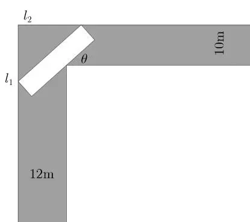
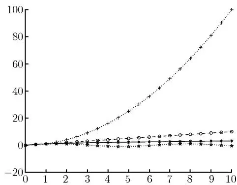
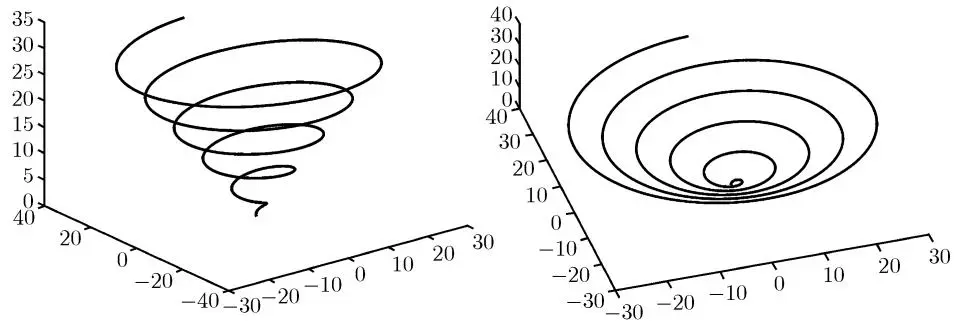
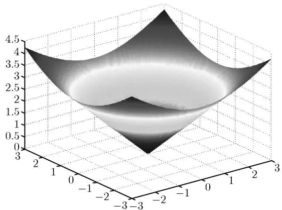
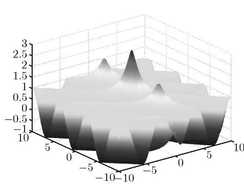
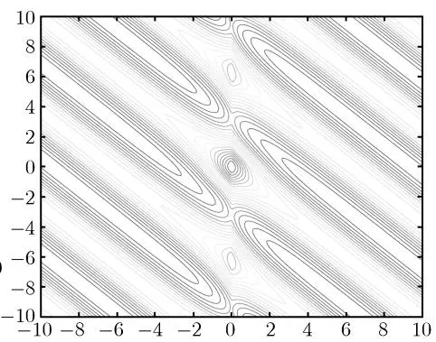
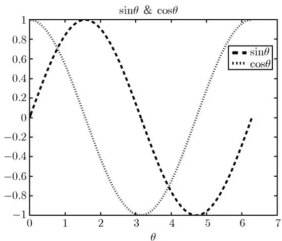

## 1.1 科学计算的意义

数值计算是随着计算机的出现和大规模计算的需求而发展起来的一门新兴学科. 数值计算主要考虑各种数学模型及其算法, 这些数学模型是为了解决各类应用领域, 特别是科学与工程计算领域的实际问题而提出的. 为此, 数值计算有时也称为科学计算、工程计算或科学工程计算. 随着科学技术的发展, 计算机的性能和算法的效率, 即计算机的硬件和软件水平, 都有了飞速的提高, 需要求解的实际问题规模也成倍扩大, 其中的数学模型日趋复杂. 通常, 这些数学模型是不能够精确地求解的, 这时需要简化模型并且提出相应的数值解法, 然后在计算机上编程实现, 求解这些问题并作实际检验. 随着硬件性能的提高和软件上各种高效算法的出现, 人类的计算能力迅猛提高, 并同时期待能解决一些超大规模的具有挑战性的问题, 如基因测序、全球天气模拟等. 对于同一个问题, 不同的算法在计算性能上可能相差百万倍甚至更多, 科学计算的主要任务就是设计高效可靠的数值算法. 例如: 用一个每秒钟计算一亿次浮点运算的计算机求解一个20阶的线性代数方程组, 用克拉默 (Cramer) 法和行列式展开法计算至少需要30万年, 而用高斯消去法只不过用几秒钟而已. 这个事实说明了两个问题: 一方面, 计算方法效率的提高速度往往比计算机性能的提高更快; 另一方面, 选择高效率的计算方法无疑是极其重要的.

科学与工程计算领域中的问题求解一般要经历下面的几个过程。首先根据实际问题构造相应的数学模型，把它转换为可以计算的问题，称为数值问题，然后根据问题特点选择计算方法并编制程序，最后在计算机上求解。科学计算的主要研究内容是提出数值问题，设计高效的算法，并探讨全过程中各种误差对近似解的影响。数值问题要求对有限个输入数据计算得出有限个输出数据，这些输出数据通常称为数值解，或者也可以理解为近似解。数值算法则是求解问题数值解的方法，它是由有限个明确的无歧义的操作组成的对输入数据的变换，其中每一个操作都是计算机能够完成的，例如，仅包含加减乘除的运算。一个算法只有在保证可靠的前提下才有可能评价其性能的好坏，通俗地讲，可靠性方面包含诸如算法的收敛性、稳定性、误差估计等多方面的内容。评价一个算法的优劣应该考虑其时间复杂度（即占用的计算机时间）、空间复杂度（即占用的计算机存储空间）以及逻辑复杂度（即程序开发的周期长短及维护的难易程度）。

由于各种科学计算问题最后通常都归结为求解一些基本的问题, 所以数值算法领域的许多工作者为这些基本问题设计了一些相对固定的高效算法, 并把它们设计成简单且容易调用的功能函数并形成软件包. 但由于实际问题的复杂性及算法自身的适应性, 调用者必须自行选择适合自己问题的功能函数. 现代数值计算领域流行的软件有 Maple, Mathematica, Matlab 等, 但不仅限于这些软件, 更多软件可以在网上查询 (<http://www.netlib.org>), 其中, Matlab 软件是在工程计算界广泛使用的深受计算工作者和工程师喜爱的软件之一. Matlab 的官方网站是 <http://www.mathworks.com>.

鉴于实际问题的复杂性, 通常将一个实际问题具体分解为一系列的子问题进行研究, 数值工作者把这些子问题归纳总结为数学上不同的几类问题. 本课程主要涉及如下几方面的问题: 第 1 章余下部分为数值计算的基本知识及 Matlab 软件简介, 其后各章内容包括函数的插值与逼近、数值积分与数值微分、线性方程组的直接解法和迭代解法、非线性方程组的求解、矩阵特征值问题的求解以及常微分方程的数值解.

## 1.2 误差基础知识

人们常用相对误差、绝对误差或有效数字来说明一个近似值的准确程度. 这些概念在科学计算中被广泛应用, 下面我们对有关概念作一介绍.

### 1.2.1 误差的来源

我们把通过任何途径得到的数据或模型与真实情况之间的差异称为误差。误差的来源经常是多方面的。在建立数学模型的过程中，不可避免要忽略一些次要的因素，因而数学模型往往只是对实际问题的一种近似的表达，这两者之间的差异我们称为模型误差。同时数学模型中可能包含一些参数，它们可以通过仪器观测得到或通过经验得到，这种数据间的误差我们称为观测误差。数值分析通常假定数学模型真实地反映了客观实际，直接处理已经归纳总结出来的数值问题，因而这两类误差在数值分析中并不常见。数学模型问题通常要转化为数值问题才能被求解，经常使用的转化手段往往有离散化、有限展开等方式。我们称这种数值问题与数学模型之间的误差为截断误差或方法误差，通常引起方法误差的原因在于我们必须在有限的步骤内在计算机上得到结果。在用计算机实现数值方法的过程中，由于计算机表示的浮点数是固定的有限字长，因此计算机并不能精确地表示所有的数，这样，不仅原始输入数据有误差，中间计算的数据及最终输出结果也必然有误差。这种因为计算机有限字长引起的误差称为舍入误差，原始数据的误差导致最终结果也有误差的过程称为误差传播。

### 1.2.2 误差度量

假设 x 是真值, $\bar{x}$ 是它的近似值, 则称 $\Delta x = x - \bar{x}$ 为该近似值的绝对误差, 或简称误差. 一般说来, 真值通常是求不出来的, 因此我们也不可能知道 $\Delta x$ 的值, 而只能有如下估计:

$$
| \Delta x | = | x - \bar{x} | \leqslant \varepsilon ,\tag{1.1}
$$

数 $\varepsilon$ 称为绝对误差限或误差限. 于是有

$$
\bar{x} - \varepsilon \leqslant x \leqslant \bar{x} + \varepsilon ,\tag{1.2}
$$

在工程上也记为 $x = \bar{x} \pm \varepsilon$ . 误差限给出了真值的范围, 但并不能很好地表示近似值的精确程度. 例如测量珠峰高度为 8848 米, 误差不超过 1 米; 在测量运动员身高时就绝对不可以用这个误差限, 否则结果是没有任何意义的. 同样的误差限对于不同的数据, 其反应近似真实的程度可以完全相反, 因此必须同时考虑真值的大小.

若 x 是不为零的真值, $\bar{x}$ 是它的近似值, 则称 $\delta x = \Delta x / x = (x - \bar{x}) / x$ 为该近似值的相对误差 (真值为零的情况没有定义). 若可求得某数 $\varepsilon_{r}$ 满足

$$
| \delta x | = | x - \bar{x} | / | x | \leqslant \varepsilon_{r},\tag{1.3}
$$

则称 $\varepsilon_{r}$ 为相对误差限. 由于真值难以求出, 通常也使用 $\delta x = \Delta x / \bar{x}$ , 假如 $\bar{x}$ 也非零.

### 1.2.3 有效数字

当 $x$ 有很多位数字, 为规定其近似数的表示法, 使得用它表示的近似数自身就指明了相对误差的大小, 我们引入有效数字的概念.

设十进制数有如下的标准形式:

$$
x = \pm 10^{m} \times 0. x_{1} x_{2} \cdot \cdot \cdot x_{n} x_{n + 1} \cdot \cdot \cdot ,\tag{1.4}
$$

其中 m 为整数, $\{x_{i}\} \subseteq \{0,1,2,\cdots,9\}$ 且 $x_{1} \neq 0$ . 对 x 四舍五入保留 n 位数字, 得到近似值 $\bar{x}$ :

$$
\bar{x} = \left\{\begin{array}{l l} \pm 10^{m} \times 0. x_{1} x_{2} \dots x_{n}, & x_{n + 1} \leqslant 4, \\ \pm 10^{m} \times 0. x_{1} x_{2} \dots (x_{n} + 1), & x_{n + 1} \geqslant 5. \end{array} \right.\tag{1.5}
$$

容易证明, 四舍五入近似数的误差限满足

$$
\left| x - \bar{x} \right| \leqslant 10^{m} \times \left(\frac{1}{2} \times 10^{- n}\right) = \frac{1}{2} \times 10^{m - n}.\tag{1.6}
$$

设 $x$ 的近似值 $\bar{x}$ 有如下标准形式

$$
\bar{x} = \pm 10^{m} \times 0. x_{1} x_{2} \dots x_{n} \dots x_{p},\tag{1.7}
$$

其中 m 为整数, $\{x_{i}\} \subseteq \{0,1,2,\cdots,9\}$ 且 $x_{1} \neq 0, p \geqslant n$ . 如果有

$$
| x - \bar{x} | \leqslant \frac{1}{2} \times 10^{m - n},\tag{1.8}
$$

则称 $\bar{x}$ 为 x 的具有 n 位有效数字的近似数, 其中 $x_{1}, x_{2}, \cdots, x_{n}$ 分别称为第 1 位到第 n 位有效数字. 当 p = n 时, 称 $\bar{x}$ 为有效数, 即全由有效数字组成的数是有效数. 有效数的误差限是末位数单位的一半, 其本身就体现了误差界, 因此有效数末尾是不可以随便添加零的.

### 1.2.4 计算机的浮点数系

计算机内部通常使用浮点数进行实数的运算. 计算机的浮点数是仅有有限字长的二进制数, 大部分实数存入计算机时需要做四舍五入, 由此引起的误差称为舍入误差. 一个浮点数的表示由正负号、小数形式的尾数以及为确定小数点位置的阶三部分组成. 例如单精度实数用 32 位的二进制表示, 其中符号占 1 位, 尾数占 23 位, 阶数占 8 位. 这样一个规范化的计算机单精度数 (零除外) 可以写成如下形式

$$
\pm 2^{p} \times (0. \alpha_{1} \alpha_{2} \alpha_{3} \dots \alpha_{23})_{2}, \quad | p | \leqslant 2^{7} - 1, \quad p \in Z, \alpha_{i} \in \{0, 1 \}.\tag{1.9}
$$

上面记号中, $Z$ 表示整数集. 二进制的非零数字只有 1, 所以 $\alpha_{1} = 1$ . 阶数的 8 位中须有 1 位表示阶数的符号, 所以阶数的值占 7 位. 凡是能够写成上述形式的数称为机器数. 设机器数 $a$ 有上述形式, 则与之相邻的机器数为 $b = a + 2^{p - 23}$ 和 $c = a - 2^{p - 23}$ . 这样, 区间 $(c, a)$ 和 $(a, b)$ 中的数无法准确表示, 计算机通常按规定用与之最近的机器数表示.

设实数 $x$ 在机器中的浮点 (float) 表示为 $fl(x)$ , 我们把 $x - fl(x)$ 称为舍入误差. 如当 $x \in \left[\frac{c + a}{2}, \frac{a + b}{2}\right) = [a - 2^{p - 1 - 23}, a + 2^{p - 1 - 23})$ 时, 用 $a$ 表示 $x$ , 记为 $fl(x) = a$ . 其相对误差满足

$$
\left| \varepsilon_{r} \right| = \left| \frac{x - f l (x)}{f l (x)} \right| \leqslant \frac{2^{p - 1 - 23}}{2^{p - 1}} = 2^{- 23} \approx 10^{- 6.9}.\tag{1.10}
$$

上式表明单精度实数有六至七位有效数字.

二进制阶数最高为 $2^{7} - 1$ ，相应于十进制的阶数38，即 $(2^{7} - 1)\lg 2$ 。因此单精度实数（零除外）的数量级不大于 $10^{38}$ 且不小于 $10^{-38}$ 。当输入数据、输出数据或中间数据太大而无法表示时，计算过程将会非正常停止，此现象称为上溢(overflow)；当数据太小而只能用零表示时，计算机将此数置零，精度损失，此现象称为下溢(underflow)。下溢并不总是有害的，在做浮点运算时，我们需要考虑数据运算可能产生的上溢及有害的下溢。

### 1.2.5 一个实例

下面我们通过一个简单的例子来说明, 一个实际问题从提出到解决过程中出现的各种误差.



图 1-1 河渠的图形


例 1.2.1 有一艘驳船, 宽度为 5 米, 欲驶过一个河渠. 该河渠有一个直角弯道, 形状和尺寸如图 1-1 所示. 试问, 要驶过这个河渠, 驳船的长度不能超过多少米?

解：易知，驳船的长度有如下关系

$$
l = l_{1} + l_{2} = \frac{10 - 5 \cos \theta}{\sin \theta} + \frac{12 - 5 \sin \theta}{\cos \theta} = f (\theta),\tag{1.11}
$$

其中， $l_{1}, l_{2}$ 分别为直角拐角处到船两头的距离。驳船如若能通过河渠，则其最大长度应是上式右端函数的最小值。因此，该问题就转化为求解极小化问题

$$
\min f (\theta) = \frac{10 - 5 \cos \theta}{\sin \theta} + \frac{12 - 5 \sin \theta}{\cos \theta},\tag{1.12}
$$

或者, 求解非线性函数零点的问题

$$
f^{\prime} (\theta) = \frac{5 - 10 \cos \theta}{\sin^{2} \theta} + \frac{12 \sin \theta - 5}{\cos^{2} \theta} = 0.\tag{1.13}
$$

可以证明, 对于任意 $\theta \in \left(0, \frac{\pi}{2}\right)$ , $f''(\theta) > 0$ . 因此 (1.12) 的极小点即是 (1.13) 的零点, 这两者完全等价. 通过本教材将要介绍的近似计算方法, 我们可以知道上述两个问题的解为

$$
\theta^{*} = 0.73, \quad f (\theta^{*}) = 21.\tag{1.14}
$$

因此, 驳船的长度不能超过 21m.

从实际的角度出发, 我们知道, 一艘驳船能不能通过河渠应该是一个复杂的问题: 驳船不完全是长方形的, 而且可能和水深也有关系. 我们把它简化为长方形的, 并且只在二维平面内考虑该问题, 这就造成了模型误差. 我们无法精确求解极小化问题 (1.12) 或求零点问题 (1.13), 用近似求解的方法代替精确求解的方法, 造成了方法误差. 测量的数据, 如 $5\mathrm{m}$ 、 $10\mathrm{m}$ 、 $12\mathrm{m}$ 等, 都带有误差, 称为观测误差. 因此, 结论中的数据也只给出了两位有效数字, 是一个近似的答案. 由于初始数据的误差导致最终答数的误差, 这个过程就是误差的传播过程.

### 1.2.6 数值计算中应注意的几个问题

舍入误差在实际计算中几乎是不可避免的, 定量地分析舍入误差的积累过程往往都是非常繁杂的. 一个可行的方法是研究舍入误差是否能够得到有效的控制, 不会影响到计算结果的实际效用. 一个算法, 如果在一定的条件下, 其舍入误差在整个运算过程中能够得到有效控制或者舍入误差的增长不影响产生可靠的结果, 则称该算法是数值稳定的, 否则称为数值不稳定的.

例 1.2.2 计算 $S_{n}=\int_{0}^{1}\frac{x^{n}}{x+5}dx$ ，其中 $n=0,1,2,\cdots,8$ .

解：由于

$$
S_{n} + 5 S_{n - 1} = \int_{0}^{1} \frac{x^{n} + 5 x^{n - 1}}{x + 5} \mathrm{d} x = \frac{1}{n},\tag{1.15}
$$

取 $S_0 = \ln 6 - \ln 5 = 0.182$ ，利用公式 $S_{n} = \frac{1}{n} -5S_{n - 1}$ ，可以逐步得到如下的数值，计算过程中所有的数精确到小数点后3位：

$$
\begin{array}{l l l l} S_{1} = 0.090, & S_{2} = 0.050, & S_{3} = 0.083, & S_{4} = - 0.165, \\ S_{5} = 1.025, & S_{6} = - 4.958, & S_{7} = 24.933, & S_{8} = - 124.540. \end{array}\tag{1.16}
$$

通过简单的积分估计, 有

$$
{\frac{1}{6 (n + 1)}} = \int_{0}^{1} {\frac{x^{n}}{6}} \mathrm{d} x \leqslant S_{n} \leqslant \int_{0}^{1} {\frac{x^{n}}{5}} \mathrm{d} x = {\frac{1}{5 (n + 1)}}.\tag{1.17}
$$

所以上述的 8 个计算结果中, 那些负数或者大于 1 的结果都是不可接受的. 当然, 其他结果也可能有比较大的误差.

下面我们分析造成这种现象的原因. 假设 $S_{n}$ 的真值为 $S_{n}^{*}$ , 误差为 $\varepsilon_{n}$ , 即 $\varepsilon_{n} = S_{n}^{*} - S_{n}$ . 对于真值, 我们也有关系式 $S_{n}^{*} + 5S_{n-1}^{*} = \frac{1}{n}$ . 综合两个递推等式, 有

$$
\varepsilon_{n} = - 5 \varepsilon_{n - 1}.\tag{1.18}
$$

这就意味着哪怕开始只有一点点误差, 就算整个过程都保留很长的小数位, 只要 n 足够大, 按照这种每计算一步误差增长 5 倍的方式, 所得的结果总是不可信的. 因此整个算法是数值不稳定的.

换一种方式, 若我们把计算方式改为

$$
S_{n - 1} = \frac{1}{5 n} - \frac{1}{5} S_{n}, \quad n = 8, 7, \dots , 1.\tag{1.19}
$$

则误差就会以每计算一步缩小到 1/5 的方式进行. 用这样的方式计算, 可以先用上面的估计式计算出 $S_{8}$ :

$$
S_{8} = \frac{1}{2} \left(\frac{1}{6 \times 9} + \frac{1}{5 \times 9}\right) \approx 0.020.\tag{1.20}
$$

逐步计算有

$$
\begin{array}{l l l l} S_{7} = 0.021, & S_{6} = 0.024, & S_{5} = 0.028, & S_{4} = 0.034, \\ S_{3} = 0.043, & S_{2} = 0.058, & S_{1} = 0.088, & S_{0} = 0.182. \end{array}\tag{1.21}
$$

这样的计算结果和实际是很相近的. 对 $S_{8}$ 不同的估计方式, 最后得到的结果也相似: 只需对递推计算公式进行同样的误差分析就可以得到这个结论.

误差的传播在一些实际的问题中经常是很复杂的, 不像上面的例子那样可以得到一个误差传播的具体的公式. 事实上, 这个误差传播的具体公式需要假定 $\frac{1}{n}$ 的计算是完全精确的.

通过对误差传播规律的简单分析, 下面我们指出在数值计算中应该注意的基本问题.

#### 1. 避免相近的数相减

在数值计算中, 两个相近的数相减时有效数字会损失. 例如计算

$$
y = \sqrt{x + 1} - \sqrt{x},\tag{1.22}
$$

其中 x 是比较大的数, 例如 x = 1000. 取四位有效数字计算, 有

$$
y = \sqrt{1001} - \sqrt{1000} = 31.64 - 31.62 = 0.02.\tag{1.23}
$$

可以看出, 在计算过程中, 每个根号的计算都有四位有效数字, 相减之后结果只有一位有效数字, 相对误差变得很大, 严重影响了结果的精确程度. 事实上, 可以有如下的等价计算公式:

$$
y = \frac{1}{\sqrt{x + 1} + \sqrt{x}}.\tag{1.24}
$$

按此公式计算可得 y = 0.01581, 仍旧有四位有效数字. 可见, 数学上等价的公式在计算上是不等价的. 其他计算公式中, 也经常有需要变形的, 例如

$$
\begin{array}{c} \frac{1}{x} - \frac{1}{x + 1} = \frac{1}{x (x + 1)}, \\ \ln (x + 1) - \ln x = \ln \frac{x + 1}{x}, \\ \ln (x - \sqrt{x^{2} - 1}) = - \ln (x + \sqrt{x^{2} - 1}), \\ \sin (x + \varepsilon) - \sin x = 2 \cos \left(x + \frac{\varepsilon}{2}\right) \sin \frac{\varepsilon}{2}. \end{array}\tag{1.25}
$$

当 x 比较大或者 $\varepsilon$ 比较小时, 上述各等式右边的计算方式都比左边有效.

#### 2. 避免数量级相差太大的两数相除

计算大数除以小数或者小数除以大数时, 容易出现计算溢出的情形, 使得计算过程非正常中断或者中间数据没有任何有效数字. 在这种情况下, 有必要在数量级上对这两个数做一些处理.

#### 3. 避免大数和小数相加减

在数值计算中, 有时候会碰到数量级相差很大的两个数相加减. 计算机做加减法首先要对阶, 即把这两个数都写成同一个阶数的表示方式, 再对其尾数进行相加减.

例如, 假设在十进制五位机器上, 做下面的加法:

$$
12345 + 0.7.\tag{1.26}
$$

计算机做加法时, 要把两个数都写成尾数小于 1 的数, 称为对阶, 即

$$
0.12345 \times 10^{5} + 0.000007 \times 10^{5}.\tag{1.27}
$$

但是, 计算机只能表示 5 位尾数, 因此第二个数在计算机上就等于 0. 我们可以把这种情形称为 “大数吃小数”.


$$
1 + \frac{1}{2} + \frac{1}{3} + \dots + \frac{1}{n}.\tag{1.28}
$$

解: 最自然的计算方式是设一个部分和为 $S$ , 依次把第 $k$ 项 $(k \leqslant n)$ 加到 $S$ 上. 对于比较大的 $n$ , 因为调和级数是发散的, $S$ 会越来越大, 趋向无穷. 但是, 当我们把第 $k$ 项加到 $S$ 上时, 所做的加法是

$$
S + \frac{1}{k}.
$$

依照上面的分析, 只要 k 足够大, 就会出现 “大数吃掉小数”, 更大的 k 更是如此. 因此, 实际计算时这个部分和并不会越来越大, 而是停在某一个大数上, 其后各项都被它吃掉.

我们有其他措施来防止大数和小数相加. 例如上面的例子, 可以从后面往前面加, 也可以在中间加括号, 等等.


#### 4. 简化计算步骤

同样的结果在数学上可以有不同的表达形式, 在计算机上它们的结果可能是完全不一样的. 例如, 计算多项式

$$
p_{n} (x) = a_{n} x^{n} + a_{n - 1} x^{n - 1} + \dots + a_{1} x + a_{0}.\tag{1.29}
$$

如果直接采用上面的公式逐项求和, 那么计算第 $k$ 项需要 $n - k + 1$ 个乘法, 因此总计算量为 $\frac{1}{2} n(n + 1)$ 个乘法和 $n$ 个加法. 然而, 多项式求值也可以采用下面的方式:

$$
p_{n} (x) = x (x \cdot \cdot \cdot (x (a_{n} x + a_{n - 1}) + \cdot \cdot \cdot + a_{1}) + a_{0}.\tag{1.30}
$$

这时总运算量为 $n$ 个乘法和 $n$ 个加法. 这个算法称为秦九韶算法或者 Horner 算法.

一个好的算法不仅应当是数值稳定的, 还应当是高精度的和高效的. 然而这些要求常常不能兼备, 很多情况下甚至是相互冲突、相互制约的.

## 1.3 Matlab 软件

### 1.3.1 简介

Matlab 源于 Matrix Laboratory 一词, 意为矩阵实验室. Matlab 软件是一个功能非常强大的科学计算软件. 早期的 Matlab 是一个专门为方便调用 LINPACK 和 EISPACK 软件包而做的界面程序; 最新的 Matlab 版本含有科学计算、符号计算、图形处理等功能, 可以很方便地处理各类矩阵及多项式运算、线性方程组求解、微分方程数值解、插值拟合、统计和优化等问题, 并且可以针对用户提供的问题所具有的特点自行选择合适的算法.

Matlab 的数据类型包括：数、字符串、矩阵、单元型数据和结构型数据。后两种实际上是复合数据类型，而数和字符串都可以看成是矩阵的特例，因此矩阵是最有代表性的数据类型，这也是 Matlab 名字的来源。

Matlab 的使用界面是一个集成的界面, 它包含如下几个窗口: 命令窗口、命令历史窗口、当前路径窗口、工作空间变量窗口等. 命令窗口是系统执行各项工作的主要场所, 一般地, 我们可以把想要执行的命令依次键入到命令窗口. 命令历史窗口则保留了以前键入的历史命令, 通过双击它之中的某条命令, 就可以重新执行该条命令. 当前路径窗口显示了当前路径下的各文件, 以备查询. 工作空间变量窗口显示了你所使用的各变量, 可以双击变量来显示或修改其值.

```txt
>> A = [1 3; 2 4]
A =
```

Matlab 的命令提示符为 >>, 在提示符后面键入命令并回车, 就可以运行命令. 运行结束后, 系统就会出现下一个提示符. 运行中, 系统可能给出部分结果的显示, 或者是某一步出错的警告. 例如,

```txt
>> 123 - 45 - 67 + 89 % my first code
ans =
100
>> 1 + 2^(3*4-5) - 6 - 789
ans =
-666
```

% 是注释符, 同一行上它之后的所有符号都被当成注释而忽略掉. 如果一行写不完, 可以在最后写上续行符, 即三个点 “...”, 系统会把下一行当成是这一行的继续.

Matlab 的变量不必事先说明, 也不需要指定类型, 它会根据变量所涉及到的操作来决定变量的类型. 任何以字母开头, 包含字母、数字或下划线并且长度少于 32 的字符串都可以作为变量的名字. 不同 Matlab 版本, 命名的最大字符长度可能会不一样, 但一般都足够使用. 变量名区分大小写, 并且不能与系统的关键字和内部函数同名. 通常 Matlab 中的变量 (系统的和用户的) 都以约定俗成的简写方式命名. 在前面的例子中, 运算结束后结果没有被赋给任何变量, 系统就默认地赋给了变量 ans.

### 1.3.2 向量和矩阵的基本运算

#### 1. Matlab 数据类型

Matlab 的基本数据类型是矩阵. 如下的方式定义了一个矩阵 $A = \begin{pmatrix} 1 & 3 \\ 2 & 4 \end{pmatrix}$ :

矩阵的界定符是 [和], 矩阵同一行的元素之间以空格或者逗号隔开, 不同行之间的元素以分号隔开或者直接换行. 例如上面的矩阵也可以如下输入

```txt
>> A = [1, 3
2, 4];
```

这里, 行末的分号起着抑制显示结果的作用. 后面, 我们不总是给出运行结果, 读者可以自行把命令复制到命令行执行以查看运行结果.

向量和数分别看成只有一行或一列, 以及只有一行一列的矩阵:

```txt
>> a = [1 2 3 4 5 6 ]
a =
```

该命令还可以这么写: a = 1:6. 在 Matlab 中 a:s:b 代表以 a 为起点, s 为步长, b 为终止的向量, 步长为 1 可以省略.

```matlab
ans =
>> 10:-1.5:6
ans =
    10.0000    8.5000    7.0000
>> 10:2:6
ans =
    Empty matrix: 1-by-0
是一个空矩阵. 在 Matlab 中变量是区分大小写的, A 和 a 是不同的变量. 如果在命令行中输入
>> A = [1; 2; 3]
A =
    1
    2
    3
则生成一个三行一列的列向量 A, 原来的矩阵 A 的值就没有了. 在 Matlab 中, 行向量和列向量是不同的. 另外, 变量的类型可以随时改变:
>> A = 'hello matlab'
A =
hello matlab
这时, A 就是一个字符串而非向量或矩阵. 字符串以引号界定, 里面可以是任何字符. 实际上, 字符串也是向量, A 的第一个和最后一个分量分别为字母 h 和字母 b. 若字符串本身含有引号, 只需把引号写两遍即可:
>> A = 'This''s matlab''s world.'
A =
This's matlab's world.
可以用如下的方式合并字符串:
>> A = [ A ' I love this game.']
A =
This's matlab's world. I love this game.
Matlab 的数据类型还有细胞、结构等, 这里我们就不展开了.
2. 常量和变量
常量就是在运行过程中不能变化的量, 例如上面提到的字符串 'hello matlab', 当然 3.14, [2,3,4] 也是常量.
Matlab 中的数据常量常用科学记数法来表示, 例如
>> 3.14159^10
ans =
    9.3647e+004
结果是 $9.3647 \times 10^{4}$. 如果想显示更多的小数位, 可以用命令 format:
```

```txt
>> format long
>> 3.14159^10
ans =
9.364725646787224e+004
>> format short
>> 3.14159^10
ans =
9.3647e+004
```

format 命令只影响该命令运行之后的数、向量或者矩阵的数值显示方式, 在计算机内部都是以 16 位小数的精度进行计算. 可以随时使用 format 命令切换输出方式.

变量则相反, 它的值可以随时变化, 例如上面的矩阵、字符串变量 A. 在计算机程序里, 变量都保存在一定的地方, 即内存里, 变量的名字实际上也就代表了找到内存一个确切地方的地址. 例如

```matlab
>> A = 'This''s matlab''s world.';
>> A(4)
ans =
s
>> B = [1 2;3 4];
>> B(2,2)
ans =
4
```

分别得到字符串 A 的第四个字母和矩阵 B 的 $(2,2)$ 元素.

Matlab 内部定义了一些固定变量, 一般不要轻易改变它们的值. 它们是虚根 i, j, 无穷大 Inf, 圆周率 pi, 和不定型 NaN(Not a Number). Inf 和 NaN 的运算遵循高等数学中的无限和不定型的运算规则, 例如

```txt
>> 2 + inf
ans =
Inf
>> inf - inf
ans =
NaN
>> NaN - 30
ans =
NaN
>> inf * 0
ans =
NaN
```

在 Matlab 中, 如一个计算结果超出 Matlab 所能表示的最大数, 即出现上溢时, 运算结果就记成 Inf 或者 -Inf.

```csv
>> A. ^B
ans =
```

```javascript
>> A = [1 2; 3 4];
>> B = [5 6; 7 8];
```

```txt
>> A = [1 2;3 4]; B = [1 0; 0 2];
>> A+B
ans =
>> A*B
ans =
>> A.*B
ans =
```

```txt
>> 2./B
```

#### 3. 基本运算

在 Matlab 中, 矩阵或者向量的加减乘除可以直接在命令行中操作:

最后一个运算 .\*, 称之为点乘, 是 Matlab 点运算的一种. 点运算实际上就是按分量运算, 两个同型矩阵按照分量进行乘、除或者乘方运算.

类似地, 我们有点幂运算, 但是对于一个方阵 A, A.^2 和 A^2 是不一样的. Matlab 还可以进行矩阵的数加和数乘, 即一个数和矩阵的每个分量进行加 (减) 或乘的运算.

```txt
ans =
    2    Inf
    Inf    1
>> 2+B
ans =
```

在 Matlab 中定义了矩阵的除法, 称之为左除, A\B 求出满足方程 AX = B 的矩阵 X, 而 A/B 求出满足方程 XB = A 的矩阵 X. 例如

```txt
>> C = A\B
C =
-3.0000 -4.0000
4.0000 5.0000
>> D = A/B
D =
3.0000 -2.0000
2.0000 -1.0000
```

可以用如下的方式检验:

```txt
>> A*C-B
ans =
>> D*B-A
ans =
    1.0e-014 *
    -0.1776    -0.3553
```

最后一个显示方式表示矩阵的每个元素都有一个阶数 $10^{-14}$ .

#### 4. 初等函数

Matlab 中自带了很多初等函数, 例如三角和反三角函数, 指数和对数函数, 等等, 它们都用约定的方式出现, 基本和数学上的表达方式一致:

```txt
>> format long e
>> x = 1.0e11;
>> log(x+2)
ans =
    2.532843602295450e+001
>> log(x)
ans =
    2.532843602293450e+001
>> log(x+2) - log(x)
ans =
    1.999822529796802e-011
>> log((x+2)/x)
ans =
    2.000000165460742e-011
```

这里, $\log$ 是自然对数 $\ln x$ . 最后两个表达式在数学上是完全等价的, 但是计算结果完全不同. 由于计算机是用有限位数存储数据的, 因此两个相近的数相减时, 只有很少的有效数字, 例如上例的 $\log(x + 2)$ 和 $\log(2)$ , 而相除时则没有这种现象. 换言之, 前面讲述的数值计算中应避免的做法还是成立的, 只是所谓的大数和小数的概念会随着计算机的精度不同而发生变化. 读者还可以试试

```csv
>> sqrt(x+2)-sqrt(x)
ans =
3.162305802106857e-006
>> 2/(sqrt(x+2)+sqrt(x))
ans =
3.162277660152568e-006
```

这再次说明了：在数学上等价的表达式，在计算上不一定等价.

Matlab 中的很多函数都有向量功能, 即这些函数可以作用于向量, 求出向量每一个分量的函数值:

```txt
>> x = [0 pi/6 pi/4 pi/3 pi/2];
>> sin(x)
ans =
    0    0.5000    0.7071    0.8660    1.0000
>> cos(x)
ans =
    1.0000    0.8660    0.7071    0.5000    0.0000
```

#### 5. 逻辑运算和关系运算

Matlab 用 >, <, >=, <=, == 和 \~ = 来判断两个数量之间的大小关系, 它们分别表示大于、小于、不小于、不大于、相等和不相等, 这些运算也具有向量功能. 例如

```txt
>> sqrt([9 10 11]) > pi
ans =
分别返回真值 0,1,1, 代表假、真、真. 又例如
>> x = (sqrt(5)+1)/2
x =
    1.6180
>> [x^2 x x^-1] == [1-x 1+1/x x-1]
ans =
>> [x^2 x x^-1] - [1-x 1+1/x x-1]
ans =
    3.2361    0    -0.0000
```

因此, 判断两个计算机内的浮点数是否相等必须很小心.

Matlab 系统中用 &, |, \~ 表示逻辑关系的与、或、非. 例如:

```txt
>> a = [2 3 0 0];
>> b = [-1 0 1 0];
>> a&b
```

```txt
ans =
>> a|b
ans =
>> ~b
ans =
在 Matlab 中, 所有非零的值都被当成是真. 因此, 例子中的 a 也可以换成 a = [1 1 0 0].
```

#### 6. 矩阵运算

矩阵的运算除了前面介绍的矩阵的加减、乘法、数乘和除法, 还有矩阵的行列及对角线的各种操作等. 命令 A(i,j) 给出矩阵 A 的 $(i,j)$ 元素, 分别称 i,j 为矩阵 A 的行列下标. 在矩阵 A 的行列下标的位置上写入由下标值构成的向量, 可以得到相应的那些分量组合成的向量或矩阵:

```txt
>> A = magic(3)
A =
>> A(2,1:3)
ans =
```

第一条命令生成一个 3 阶幻方 (n 阶幻方是 1 到 $n^{2}$ 的所有自然数为元素构成的 n 阶方阵, 它的每一行每一列以及两条对角线上的元素和为定值), 第二条取出幻方矩阵的第 2 行的第 1,2,3 列. 如果要取出矩阵所有的列, 如该例, 可以写 A(2,:). 换句话说, : 写在下标中可以解读为 “所有的”. 下标中若有 end, 则表示是最后的行或列指标, 例如下面的做法取出矩阵的第 2 行到最后一行, 头尾两列:

```txt
>> A(2:end, [1 end])
ans =
```

简单地把矩阵当成数, 可以像把元素合并成一个矩阵那样, 把一些小矩阵合并成一个大矩阵:

```txt
>> B = [23];
>> C = [12; 34];
>> D = [57]';
>> A = [B9; CD]
A =
```

```txt
```

生成 D 的命令中, 代表转置. 合并矩阵时, 必须注意, 小块矩阵的行列数必须是合法的. 去掉矩阵的某整行或整列的元素, 使得其阶数变小, 可以如下操作:

```txt
>> A([1,end], :) = []
A =
```

去掉了矩阵的头尾两行. “[]” 就是前面介绍过的空矩阵. 还可以用如下的方式对向量或矩阵取值, 或者进行其他操作:

```erlang
>> A = magic(3)
A =
>> A(A>=4) = 0
A =
>> v = 1:9;
>> v(abs(v-5)<=2) = [ ]
v =
```

其中, abs 为绝对值函数. 上述命令把向量 v 中满足 $\left|x-5\right|\leqslant2$ 的分量全部去掉了.

### 1.3.3 流程控制

#### 1. 分支结构

编程的流程一般地有顺序结构、分支结构和循环结构. 顺序结构就是按先后顺序把需要执行的语句写下来, 如上一节最后生成矩阵 A 的一系列语句.

分支结构则是依据不同的情况执行不同的语句, 用 if 语句实现. if 语句的一般格式如下:

```txt
if value1,
    statement1,
elseif value2,
    statement2,
else
    statement3
end

当 value1 的值为真, 即非零时, 执行语句 statement1; 否则, 当 value2 的值为真时, 执行语句 statement2, 等等; 如果都不成立, 就执行语句 statement3. else 部分可以没有, 而
```

elseif 部分可以有多个, 也可以没有. 在 Matlab 中, 所有非零的真值都当成真. 例如:

```matlab
if mod(n,2)==1,
    n = n * 3 + 1;
else
    n = n / 2;
end
```

其中, mod 是求余数的函数. 这几行命令的意思是, 当 n 是奇数时乘 3 加 1, 当 n 是偶数时除 2. 在命令行中输入这些命令时, 系统不会因为你键入了回车而警告你语句不完整, 而是等待你输入最后和 if 配对的 end.

下面的例子辨别一个年份是否闰年：

```matlab
if mod(year,400)==0,
    fprintf('%d is a leap year.\n',year);
elseif mod(year,100)==0,
    fprintf('%d is not a leap year.\n',year);
elseif mod(year,4)==0,
    fprintf('%d is a leap year.\n',year);
else
    fprintf('%d is not a leap year.\n',year);
end
```

当 if 语句执行到某一部分时, 意味着前面的判断皆为假, 而该部分对应的判断为真. fprintf 是 Matlab 中的格式输出语句.

分支结构也可以用 switch 语句实现.

#### 2. 循环结构

循环语句有两种, for 循环和 while 循环, 前者用于有规律的循环, 后者用于无规律次数不定的循环. for 语句的基本格式如下:

```txt
for loopvalue = value,
    statement,
```

通常, 我们称 loopvalue 为循环变量, 它将取遍 value 中的每一个值, 即向量的每一个元素或矩阵的每一列, 对于 loopvalue 取到的每一个值执行语句 statement. 例如, 下面的循环利用恒等式 $\frac{\pi^2}{6} = \sum_{k=1}^{\infty} \frac{1}{k^2}$ 计算圆周率的近似值:

```matlab
>> s = 0;
>> for k = 1:10000,
    s = s + 1/k^2;
    end
>> s = sqrt(6*s)
s =
3.141497163947215
```

计算机只能执行有限的循环, 因此这里求的是级数前 10 000 项的部分和. 实际上, 求 s 的值可以用如下命令:

```txt
>> N = [1:10000];
>> s = sqrt(6 * sum(1. / N.^2));
```

如果循环次数预先不能确定, 那么我们可以用 while 循环, 它的基本格式如下:

仅当 value 的值为真时, 执行语句 statement. 因此, 上面的求 $\pi$ 的近似值的例子可以改写如下:

```c
>> n = 0; p = 0; s = 0.0;
>> while abs(s-pi) >= 1e-5,
    n = n + 1;
    p = p + 1/n^2;
    s = sqrt(6*p);
    end
>> s
s =
3.141582653629836
```

这里, 判断 $\text{abs}(s-pi) >= 1e-5$ 可能因为里面的循环改变其真值, 也只有这样, 循环才有意义. 一般地, 若循环语句部分不能改变循环判断的真值, 则该循环可能有两种情况: 要么永远不执行, 要么永远不会停止执行 (称为死循环). 如果你碰到后一种情形, 可以按 Ctrl+C 退出. 循环判断最好不要写成 $s == pi$ 的方式, 否则也有可能造成死循环.

#### 3. 复杂的结构

顺序结构、分支结构和循环结构可以相互嵌套, 但是一个结构应该完全在另一个结构内. 下面的例子输入一个正整数 n, 如果它是偶数就除以 2, 是奇数就乘上 3 加上 1, 如此一直变换, 直到最后变成 1:

```matlab
n = input('n = ');
while n~=1,
    if mod(n,2)==1,
    n = n * 3 + 1;
    else
    n = n / 2;
    end
    disp(n);
end
这个问题称为 Collatz 猜
```

while-for 循环嵌套可以用冒泡排序来举例说明. 冒泡排序是一种对一系列数进行排序的方法. 把一列数想象为垂直存放, 排好序后, 数值大的在下方. 每轮比较时从上到下依次比较相邻的两个数, 若是上面的数大, 把它们对调, 否则不动. 这样一轮比较结束后, 最大的数就在最底下, 下一轮就少比较一个数. 若某一轮没有发生对调, 则这些数已经正确排序, 不必再进行下一轮了. 因为小的数就像是比较轻的一样, 一直往上冒, 该算法就有这样的一个名字. 程序如下:

```matlab
>> done = 0; k = 1;
>> v = input('a row vector: ');
a row vector: [1 8 6 3 9 7 5 0 2 4]
>> while ~done,
    done = 1;
    for p = 1:length(v) - k,
    if v(p) > v(p + 1),
    tmp = v(p);
    v(p) = v(p + 1);
    v(p + 1) = tmp;
    done = 0;
    end
    end
    k = k + 1;
    end
>> v
v =
```

由于 Matlab 的特点, 向量或矩阵中的两个数对调时 (while 第 5\~7 行), 有时可以不必有中间变量. 上面的写法是任一门计算机语言都可以用的, Matlab 可以这样写:

```javascript
v([p p+1]) = v([p+1 p]);
```

此外, Matlab 命令 sort 就实现了这个排序功能.

### 1.3.4 脚本文件和函数文件

#### 1. 脚本文件

把 Matlab 的一系列命令收集在一个文件里, 保存为以 .m 为后缀的文件, 称为脚本文件, 执行时只需要键入文件名, 不需键入后缀. 例如, 在命令行内键入 edit mysort.m, 在打开的文件内键入如下内容:

```txt
done = 0; k = 1;
v = input('a row vector: ');
while ~done,
    done = 1;
    for p = 1:length(v) - k,
    if v(p) > v(p + 1),
    tmp = v(p);
```

```txt
v(p) = v(p+1);
v(p+1) = tmp;
done = 0;
end
end
k = k + 1;
end
v
在命令行上运行 >> mysort, 情形如下:
>> mysort
a row vector: [1 8 6 3 9 7 5 0 2 4]
v =
```

在脚本文件中, 若一行程序太长, 可以使用 ... 换行: 即在一行末尾写上三个连续的点, 代表下一行是这一行的继续.

#### 2. 函数文件

函数文件是一种封装的文件, 具有特定的函数头格式:

```matlab
function [out1, out2, ...] = funname(in1, in2, ...)
```

其中, function 是关键字, out1, out2, ... 是输出列表, 以方括号括住; in1, in2, ... 是输入列表, 以圆括号括住. 输入和输出列表可以包含一个或多个输入和输出, 也可以没有. 若没有输出列表, 则不必写方括号和等号, 输出列表仅有一项时, 不必写方括号; 若没有输入列表, 则不必写圆括号. funname 是函数名, 函数名是一种 Matlab 的标识符. Matlab 的函数名必须和文件名一致, 即若函数名为 funname, 则文件名应为 funname.m.

例如, 如果我们要用函数文件实现上面的排序, 可以书写如下:

```matlab
function v = mysort2(v)
done = 0; k = 1;
while ~done,
    done = 1;
    for p = 1:length(v) - k,
    if v(p) > v(p + 1),
    tmp = v(p);
    v(p) = v(p + 1);
    v(p + 1) = tmp;
    done = 0;
    end
    end
    k = k + 1;
end
```

这里在函数头中, 圆括号中的 v 是输入变量, 等号左边的 v 是输出变量, mysort2 是函数名. 所以在 Matlab 系统中, 该文件应保存为 mysort2.m. 在函数文件中, 变量 v 的值由输入变量得到. 因此, 和前面的脚本相比, 没有了 input 一行; 返回变量也不需要显示, 也没有了原来脚本的最后一行.

#### 3. 函数传值

在上面的例子中, 如果需要知道冒泡过程中发生了多少次对调, 我们可以简单地修改程序如下:

```matlab
function [v,s] = mysort3(v)
done = 0; k = 1;
s = 0;
while ~done,
    done = 1;
    for p = 1:length(v) - k,
    if v(p) > v(p + 1),
    tmp = v(p);
    v(p) = v(p + 1);
    v(p + 1) = tmp;
    done = 0;
    s = s + 1;
    end
    end
    k = k + 1;
end
```

返回变量 s 就是在这个过程中对调的次数. 例如, 调用程序如下:

```matlab
>> d = [5 3 4 2 1];
>> [r, w] = mysort3(d)
r =
w =
    9
```

程序在运行时, d 的值传给了变量 v, 它在整个程序中发生了一系列的变化, 返回时它的值传给了变量 r, 而 s 的值传给了 w. 变量传值的对应关系只和它在输出或输入列表中的位置有关, 即命令表达式的列表按照书写次序把值传给函数输入列表中的各变量, 而函数输出列表中各变量的值在函数结束后依次传给命令表达式的各返回变量. 在这个过程中, 系统不理会各变量的名称是否重复. 我们有例子:

```txt
>> p = [5 3 4 2 1];
>> [k, v] = mysort3(p)
k =
```

```txt
v = 9
```

这里, v 和函数中的 v 同名, 而 k 和 p 在程序内部也出现过. 程序中的所有变量和命令行的变量是互不相通的, 它们的值不会相互影响. 想要它们的值可以相互传递, 可以用函数传值的方式, 也可以用全局变量. 全局变量在所有地方都有相同的值, 在任何一处改变其值都会影响其他各处的该变量的值. 需要声明一个全局变量时, 只需在所用到的各处书写如下命令, 例如声明变量 v, z 为全局变量:

```txt
>> global v z
```

如果该变量在函数文件和命令行是同一个全局变量, 则命令需要在两个地方 (函数文件和命令行上) 书写两次. 没书写该声明的地方, 若是也有变量 v,z, 这两个变量就仅是局部变量, 它们的值只能通过函数传值的方式传递. 全局变量没有封装性, 所有最好少使用或不使用.

函数在调用时, 输入参数的列表必须和函数的输入列表一样长, 以保证每个变量都可以正确地传到值; 而输出列表的变量可以少写, 甚至不写, 当然不写的那些变量值就取不到了:

```python
>> mysort3(d)
ans =
>> mysort3
??? Input argument "v" is undefined.
```

```txt
Error in ==> mysort3 at 6
for p = 1:length(v) - k,
```

#### 4. 缺省参数

Matlab 的函数允许有缺省的输入参数, 即输入参数可以在调用时不写, 它有指定的值. Matlab 使用内部变量 nargin 实现该功能的. nargin 出现在函数文件中, 当调用该函数时, nargin 的值是调用情形的输入参数个数. 例如, 假设某函数的前两行为

```matlab
function v = myfun(a, b, c, d, e)
v = nargin;
```

函数的实际功能在后面部分实现. 这里, 返回变量 v 的值就是输入参数的个数. 例如

```txt
>> r = myfun(1,2,4)
r =
3
>> r = myfun(2,3,5,6)
r =
4
>> r = myfun
r =
0
```

类似地, 变量 nargout 给出了输出参数的个数.

下面的函数根据输入参数个数的不同执行不同的功能: 输入参数为一个时, 计算以输入参数为半径的圆的周长; 输入参数为两个时, 计算以输入参数为长和宽的矩形的周长; 输入参数为三个时, 计算以输入参数为三边的三角形的周长.

```matlab
function s = zhouchang(a,b,c)
    if nargin == 1,
    s = 2*pi*a;
    elseif nargin == 2,
    s = 2*(a+b);
    elseif nargin == 3,
    s = a+b+c;
end
```

#### 5. 递归函数

Matlab 中的函数允许递归调用, 即函数在描述自己的功能如何执行的部分直接或间接地用到了自己. 例如, Fibonacci 数列定义如下: $F_{1} = F_{2} = 1$ , $F_{n+1} = F_{n} + F_{n-1}$ , $n \geqslant 2$ . 我们可以书写如下程序:

```matlab
function f = fib(n)
    if n>=3,
    f = fib(n-1)+fib(n-2);
    elseif n==1|n==2,
    f = 1;
    end
```

在描述函数 fib 如何实现时, 我们用到了函数 fib 本身. 和数学公式类似, 这种递归调用方式必须有适当的终止调用的时刻. 调用情形如下:

```txt
>> fib(7)
ans =
13
读者可以把 fib 函数内的分号去掉, 查看调用的过程.
```

### 1.3.5 帮助系统

#### 1. help 命令

Matlab 有非常出色的帮助系统, 它本身形成一个树的结构, 其顶端是 help 命令, 然后是各工具箱, 直到每一个具体的函数. 不带任何参数的 help 命令显示当前 Matlab 系统所含有的工具箱, 键入 help 命令, 则显示

```txt
>> help
HELP topics:
```

```txt
My Documents\MATLAB - (No table of contents file)
NAG\mex.w32 - (No table of contents file)
toolbox\NAG - NAG Toolbox
```

```txt
LINSPACE(X1, X2, N) generates N points between X1 and X2. For N < 2, LINSPACE returns X2.
```

```txt
matlab\general - General purpose commands.
matlab\ops - Operators and special characters.
matlab\lang - Programming language constructs.
matlab\elmat - Elementary matrices and matrix manipulation.
matlab\elfun - Elementary math functions.
matlab\specfun - Specialized math functions.
```

该命令给出了每一个具体的工具箱的名称和功能的简要描述, 其内容可能因为你所安装的Matlab 版本的不同而略有不同. 这里, 我们省略了后面显示的大部分工具箱, 读者可以在Matlab 系统中自行查看. 输入某个工具箱的名字, 就可以查询该工具箱中给出的每一个函数. 例如, elmat 是初等矩阵工具箱,

```txt
>> help elmat
Elementary matrices and matrix manipulation.
```

```txt
Elementary matrices.
zeros - Zeros array.
ones - Ones array.
eye - Identity matrix.
repmat - Replicate and tile array.
rand - Uniformly distributed random numbers.
randn - Normally distributed random numbers.
linspace - Linearly spaced vector.
```

我们可以看到 elmat 工具箱包含有函数 zeros, ones, 等等. 继续输入如下的命令, 我们可以看到一个函数的具体说明:

```txt
>> help linspace
LINSPACE Linearly spaced vector.
LINSPACE(X1, X2) generates a row vector of 100 linearly equally spaced points between X1 and X2.
```

Overloaded functions or methods (ones with the same name in other directories)

```batch
help cgvalue/linspace.m
Reference page in Help browser
doc linspace
```

这个帮助给出了函数 linspace 的使用方法, 总共有两种不同的调用方式, 以及和它相关的其他命令. 我们可以继续用 help logspace 得到相关的命令 logspace 的用法.

事实上, 这些帮助信息是写在文件里的. 例如, 系统文件 linspace.m 中是这样的, 文件在系统路径 toolbox\matlab\elmat\ 下:

```matlab
function y = linspace(d1, d2, n)
%LINSPACE Linearly spaced vector.
% LINSPACE(X1, X2) generates a row vector of 100 linearly
% equally spaced points between X1 and X2.
%
% LINSPACE(X1, X2, N) generates N points between X1 and X2
% For N < 2, LINSPACE returns X2.
%
% Class support for inputs X1,X2:
% float: double, single
%
% See also LOGSPACE, :.

% Copyright 1984-2004 The MathWorks, Inc.
% $Revision: 5.12.4.1 $ $Date: 2004/07/0517:01:20 $
if nargin == 2
    n = 100;
end

n = double(n);
y = [d1+(0:n-2)*(d2-d1)/(floor(n)-1) d2];
```

紧跟着 function 后面的注释有特别的含义. 正如我们看到的, 用 help 命令查看时, 系统会显示这一部分帮助信息, 并把其中每一行行首的 % 去掉. 我们自己编写的程序也可以使用这种方法. 例如, 前面我们有过一个函数 fib.m, 实现 Fibonacci 数列. 我们可以如下加注释:

```matlab
function f = fib(n)
% This function gives the n-th term of Fibonacci Seriers
% usage: f = fib(n)
    if n >= 3,
    f = fib(n - 1) + fib(n - 2);
    elseif n == 1 | n == 2,
```

```txt
f = 1;
end
我们在命令行上键入 help fib 就可以看到:
>> help fib
This function gives the n-th term of Fibonacci Seriers
usage: f = fib(n)
```

Matlab 中有很多工具箱, 其中 general, ops 和 lang 为该语言的最基本的部分, 一些基本的矩阵和函数的功能放在工具箱 elmat, elfun 和 matfun 中, funfun 和 polyfun 则包含了一些基本的功能函数, 包括常微分方程数值解和多项式函数等.

#### 2. 其他辅助命令

doc 命令可以打开一个新的帮助窗口. 如果该命令后紧跟着某个需要查看的命令, 则窗口中就显示该命令的详细内容. 这些显示内容通常要比 help 命令来得丰富, 当然也需要较多的资源来运行这个窗口, 例如计算机时间或者内存.

which 命令可以查看一些 Matlab 内部函数的所在, 这样可以查看 Matlab 工具箱的构造或者是函数的内部写法. 例如

```txt
>> which linspace
C:\MATLAB6p5p1\toolbox\matlab\elmat\linspace.m
```

命令 who 可以显示当前的变量, clear 可以清除变量:

```txt
>> who
Your variables are:
A B C D L U ans p x y
>> clear p y x
>> who
Your variables are:
A B C D L U ans
>> clear
>> who
>>
```

如果 clear 后面没有跟着任何变量, 则清除所有变量.

home 和 clc 都可以把光标放在命令窗口的左上角, 不同之处是后者运行之后就没有办法再滚屏了. 例如:

```matlab
>> s = 'hello matlab' 's world!';
>> for k = 1:length(s),
clc;
fprintf('%s', s(1:k));
pause(0.3);
end
可以在屏幕上看到打字的效果.
```

### 1.3.6 画图功能

#### 1. 二维画图

Matlab 最基本的画图命令是 plot. plot 命令用于实现二维平面上的点图和线图的功能, 它的基本格式如下: plot(x,y,style), 其中, x,y 分别是所画点的的横、纵坐标, style 则指定了线型、颜色和点型. 例如:

```matlab
>> x = 0:0.5:10;
>> y1 = x;
>> y2 = x.^0.5;
>> y3 = x.^2;
>> y4 = sin(x);
>> hold on;
>> plot(x,y1,'yo--');
>> plot(x,y2,'g*-');
>> plot(x,y3,'r+:');
>> plot(x,y4,'bp:');
```

结果如图 1-2 所示. hold on 命令指示系统以后每次画图时, 结果输出在一个窗口中, 且保留以前画图的结果; hold off 命令则关掉这个功能, 以后每次画图总先把之前的图形清除. style 选项通常含三个部分, 分别指定线型、颜色和点型, 省略这一部分时, 系统会自行指定, 以示区别. 其中的 y, g, r, b 等代表曲线的颜色, 即 yellow, green, red 和 blue 等; o, \*, +, p 代表所描点的形状, 称为点型, 意思为圆圈、星号、加号和五角星; -, --, : 代表线型, 即所描点之间以什么线相连, 这些符号分别表示线段、虚线和点线. 这里, 我们仅列举了一小部分的图例及符号, 读者可以用 help plot 或 doc plot 获得详细的说明.



图 1-2 命令 plot 演示


事实上, 上述的几条命令可以合并成为如下的形式:

$$
> > \text{plot} (x, y 1, ^{\prime} y o - - ^{\prime}, x, y 2, ^{\prime} g * - ^{\prime}, x, y 3, ^{\prime} r +: ^{\prime}, x, y 4, ^{\prime} b p: ^{\prime});
$$

此外, 当 x 是从 1 开始的顺序自然数序列时, 我们可以省略 x 而简单地写成 plot(y), 即把 x 当成向量 y 的下标.

类似 plot 的命令还有: loglog, semilogx, semilogy, 等等. 它们可以用于 x, y 变化相对剧烈的情形. 这三个命令的使用方式与 plot 完全相同, 仅是画出图形时坐标轴发生了变化: loglog 的横纵坐标为 $\ln x$ 和 $\ln y$ , 而 semilogx 或 semilogy 只把一个方向, $x$ 或者 $y$ 换成了对数坐标. 例如, 下面的命令:

```txt
>> x = 2:2:100;
>> y = exp(log(x).^2 - 3*log(x) + 2);
>> loglog(x,y,'r-');
```

#### 2. 三维画图

三维的点图和二维的点图类似, 其基本命令格式为 plot3(x,y,z,style), 其中 x,y,z 分别为所有点的三个坐标分量形成的向量, style 的含义和参数都和前面的 plot 一致.

下面的命令形成一条收缩的螺旋线 (见图 1-3 的左图):

```txt
>> t = linspace(0,10*pi,2000);
>> plot3(sin(t).*t,cos(t).*t,t,'r-');
```



图 1-3 命令 plot3 演示


我们可以用命令 view 来调节三维图像的观看角度, 该命令的两个参数分别是坐标架横向旋转角度和水平抬升角度. 例如下面的命令得到图 1-3 右边的图像:

三维画图比较常见的是画曲面. 首先, 需要介绍命令 meshgrid. 该命令对两个输入向量 x, y 生成两个矩阵 X, Y, 使得 $(X(i,j), Y(i,j))$ 就是 $(x(i), y(j))$ . 想象把二维坐标平面打上网格, 点的横坐标是 x, 纵坐标是 y, 则矩阵 X 就是所有网格交叉点的横坐标, Y 是所有网格交叉点的纵坐标, 且排列方式和网格点一样. 例如

```txt
>> x = 1:4;
>> y = 5:3:11;
>> [X,Y] = meshgrid(x,y)
X =
Y =
```

利用这两个矩阵就可以画出各种二元函数的图像. 例如, 若有二元函数 $z = \sqrt{x^2 + y^2}$ , 如下命令画出该函数在 $[-3, 3] \times [-3, 3]$ 上的图像:

```txt
>> x = linspace(-3,3);
>> y = x;
>> [X,Y] = meshgrid(x,y);
>> Z = sqrt(X.^2 + Y.^2);
>> surf(X,Y,Z)
产生图形如图 1-4 所示.
```



图 1-4 命令 surf 演示


如果输入的向量 x, y 相同, 命令 meshgrid 可以只写一个参数, 如 $[X, Y] = \text{meshgrid}(x)$ . 和 surf 命令类似的还有命令 mesh, 命令格式完全相同. 这两个命令都有几种不同的变形, 例如 surfc, surfl, meshc, meshz 等. 这里需要注意的是, 这种类型的矩阵操作中通常都是分量操作, 因此, 命令 $Z = \text{sqrt}(X.^2 + Y.^2)$ ; 中的点运算不可以写成 $Z = \text{sqrt}(X^2 + Y^2)$ ; 虽然后者在语法上也没有错, 但画出的图像不是我们所要的图像.

按照这种方式, 我们可以画出指定二元函数的图像. 例如:

$$
z = \mathrm{e}^{- | x |} + \cos (x + y) + \frac{1}{x^{2} + y^{2} + 1},\tag{1.31}
$$

该函数在区域 $[-10, 10] \times [-10, 10]$ 上的图像可以如下画出, 如图 1-5 左图所示:





图 1-5 命令 surf 和 contour 用于二元函数


```lisp
>> x = linspace(-10, 10, 200);
>> [X, Y] = meshgrid(x);
>> Z = exp(-abs(X)) + cos(X + Y) + 1. / (X.^2 + Y.^2 + 1);
>> surf(X, Y, Z);
```

用同样的数据, 画出等高线可以使用如下命令, 图像如图 1-5 右图:

```txt
>> contour(X,Y,Z,20)
```

其中, 最后一个参数是等高线不同高值的数目.

#### 3. 图形控制

Matlab 可以在图形上加上一定的标注. 例如, xlabel 命令可以在图像横轴上加注横坐标标识, 同样的命令还有 ylabel 和 zlabel. 命令 title 可以加注整幅图像的标题.

```txt
>> x = linspace(0,2*pi,200);
>> plot(x,sin(x),'r--',x,cos(x),'b:');
>> xlabel('\theta')
>> title('sin theta & cos theta')
>> legend('sin theta','cos theta')
```

产生图形 1-6. 其中, legend 可以添加图示, 给出不同曲线的含义. 一般地, 希腊字母都可以用 “\” 的方式直接给出.



图 1-6 图像的标注


figure 命令可以打开新的图形窗口, 而 close 命令关闭最新的图形窗口, 使用 close all 则关闭所有图形窗口. 命令 clf 清空图形窗口中的内容, 但不关闭窗口.

命令 axis 是较常使用的控制画图属性的一个命令. axis equal 使得坐标轴的比例相同; axis on/off 则可以显示或者关闭坐标轴; axis([x1 x2 y1 y2]) 则设置画图的区域为一个长方盒子, 两个坐标轴的上下限分别为这四个参数, 三维情形可以再增加两个参数, 即 axis([x1 x2 y1 y2 z1 z2]). 如果想要同时设置多个属性, 可以仿照如下方式书写:

```javascript
>> axis('equal', 'off', [-1 3 2 7]);
```

### 1.3.7 数据操作

#### 1. 文件的读与写

文件操作的基本命令是 fopen, fclose, fprintf 和 fscanf. 下面的例子是 Matlab 系统中的例子, 常用来说明这几个命令的用法:

```matlab
>> x = 0:0.1:1; y = [x; exp(x)];
>> fid = fopen('exp.txt', 'wt');
>> fprintf(fid, '%s\n', '% --- exp.txt ---');
>> fprintf(fid, '%6.2f %12.8f\n', y);
>> fclose(fid);
运行后, 你的当前文件夹中会有一个新的文件 exp.txt, 其内容为
%---exp.txt---
□□0.00□□□1.00000000
□□0.10□□□1.10517092
□□0.20□□□1.22140276
□□0.30□□□1.34985881
□□0.40□□□1.49182470
□□0.50□□□1.64872127
□□0.60□□□1.82211880
□□0.70□□□2.01375271
□□0.80□□□2.22554093
□□0.90□□□2.45960311
□□1.00□□□2.71828183
```

这里, □表示空格. 在程序运行过程中, y 是一个两行的矩阵. fopen 打开文件, 其第一个参数是文件名, 第二个参数指明文件打开的属性: r, w, a 分别表示读 (read)、写 (write)、添加 (append) 读写方式. fprintf 命令中, 第一个参数称为文件管道号, 指明往哪个文件写入, 由于 fid 的值是由上一步的 fopen 得到的, 我们说文件 exp.txt 的管道号是 fid. fprintf 命令后面的两个 (或更多的) 参数分别是控制符和输出列表. 控制符中的 % 或者 \ 有着特殊的作用. %s 或者 %6.2f 表明输出的是字符串或者是数量, 后者占 6 个字符宽度, 其中小数位 2 位. \n 和 \t 表示回车和制表符. 关于这些特殊符号的使用, 可以查看 Matlab 的 fprintf 帮助, 或者更详细地查看 C 语言的书籍.

数据以 fprintf 输出到文件时要注意使用的方式. Matlab 中, 矩阵存储的方式是按照列的方式, 但是文件只能按照行书写, 所以我们在文件里看到的是变量 y 的转置. 文件写完后应该用 fclose 关闭, 以防止文件内容丢失.

关于文件管道号的用法, 有更复杂的例子. 在下面的例子中, 我们打开了两个文件, 必须清楚什么时候往哪个文件里写内容:

```txt
>> STR = 'hello, this is my first matlab string.'
>> fid1 = fopen('exp.txt', 'wa');
>> fid2 = fopen('myfile.txt', 'wt');
>> fprintf(fid1, '%10.3f \n', y);
```

```txt
>> fprintf(fid2, '%s\n', STR);
>> ... ...
>> fclose(fid1);
>> fclose(fid2);
```

在这个例子中, 我们打开了文件 exp.txt 和 myfile.txt, 它们的管道号分别为 fid1 和 fid2. 变量 y 和 STR 分别写入两个文件, 后面还可以有其他的操作. 写完后把两个文件都关闭.

从文件读出的过程刚好相反. 例如, 从上面已经生成的文件中读出数据并赋给矩阵 A,

```diff
>> fid = fopen('exp.txt');
>> s = fscanf(fid, '%c', [1 17])
s =
% --- exp.txt ---
>> A = fscanf(fid, '%6f %12f\n', [2 inf]);
>> A = A'
A =
0 1.0000
0.1000 1.1052
0.2000 1.2214
0.3000 1.3499
0.4000 1.4918
0.5000 1.6487
0.6000 1.8221
0.7000 2.0138
0.8000 2.2255
0.9000 2.4596
1.0000 2.7183
>> fclose(fid)
```

需要注意的是, 读出数据时不可以指定数据的精度, 即使用 fprintf 读入数据时可以用控制格式 %12.8f, 但在使用 fscanf 读出数据时只能用 %12f, 不能用 %12.8f. 这里, 读出的矩阵 A 和文件中的数据仍为转置关系. 若想要把数据读出时直接形成一个向量, 可以把第三行换为

```txt
>> A = fscanf(fid, '%6f %12f\n', inf)
```

若想要形成一个 $m \times n$ 阶矩阵, 可以把第三个参数改成 $[\mathfrak{m}, \mathfrak{n}]$ ; 只想读出 $n$ 个数时, 可以把该参数直接写成 $\mathbf{n}$ .

Matlab 中提供了一种二进制的数据存储方式, 数据文件的后缀为 .mat.

```txt
>> load clown.mat
>> who
Your variables are:
X caption map
>> image(X); colormap(map)
```

Matlab 的内部数据文件 clown.mat 存储了 X 和 map 两个矩阵, 用 load 可以把该文件的数据读入. 命令 image 把矩阵的每一个元素当成像素值显示. 读者可以自行把这两行命令拷贝到命令行上查看结果.

若在命令窗口中有变量 x1, x2, ..., xn 和变量 A, 可以按如下的方式保存为二进制的数据文件:

```txt
>> save a.mat x* A
```

换言之, x\* 代表了所有以 x 开始的变量. 实行该命令后, 数据文件保存了命令行所有以 x 开始的变量以及变量 A. 下次使用时, 只需要键入 load a.mat. 如果数据文件是 .mat 格式, 命令中可以省略其后缀 .mat.

#### 2. 稀疏矩阵

一个矩阵, 若其非零元素非常少, 称之为稀疏矩阵. 这不是一个严格的定义, 一般非零元素个数少于矩阵元素个数的 $5\%$ , 我们就可以称其为稀疏矩阵. 不是稀疏的矩阵称为满矩阵. 在 Matlab 中, 稀疏矩阵可以有自己的存储方式, 即稀疏存储方式. 该方式以命令 sparse 实现:

```matlab
>> A = [1 2 0; 0 3 0; 0 -1 6];
>> A = sparse(A)
A =
(1,1)    1
(1,2)    2
(2,2)    3
(3,2)    -1
(3,3)    6
```

可以看到, 稀疏矩阵的存储方式是保存它的非零元素的行列下标以及对应该下标的元素值. sparse 把满矩阵的存储方式转化为稀疏矩阵的存储方式, 而命令 full 实现相反的功能.

我们也可以预先保存好矩阵非零元的下标和值, 然后保存为稀疏矩阵, 这样就不必生成一个满矩阵了:

```matlab
>> i = [1 1 2 3 3];
>> j = [1 2 2 2 3];
>> s = [1 2 3 -1 6];
>> A = sparse(i, j, s)
A =
(1,1)    1
(1,2)    2
(2,2)    3
(3,2)    -1
(3,3)    6
如果稀疏矩阵的最后一行或最后一列全为零, 可以指明其阶数:
>> A = sparse(i, j, s, 200, 100);
```

该矩阵 A 和前面的矩阵有着全部相同的非零元下标和值, 但是这个矩阵是 $200 \times 100$ 的矩阵. 反过来, 如果已经有了一个稀疏矩阵, 也可以使用命令 find 获得它的非零元的位置和值: >> [i, j, s] = find(A);

稀疏矩阵在 Matlab 中可以像满矩阵一样进行操作, 如 A+B 或者 A\*B. 当然, 进行了各种运算之后, 稀疏矩阵就可能不再稀疏了, 特别是求逆矩阵的运算.

## 评 注

Matlab 作为一个通用的软件, 我们在这里只能挂一漏万地简单介绍一下. 在它的更高级的版本中可能有 50 个以上的工具箱, 其中函数的使用方法以及如何更加深入和熟练地使用 Matlab 解决问题, 只能靠读者们自己摸索和实践. 对于本门课程所需要的部分, 我们在这里也只是稍微详细地介绍, 在后面的各个章节中会有更加详细的例子. 读者也可以参阅有关科学计算和 Matlab 方面专门的书籍.

## 习题一

1. 已知近似数 $x^{*}$ 的相对误差限为 $0.05\%$ , 问它至少有几位有效数字?

2. 说明当 N 足够大时, 应该如何计算 $\int_{N}^{N+1}\frac{1}{x^{2}+1}dx$ .

3. 利用四位数学用表求 $1 - \cos 2^{\circ}$ .

4. 假如你有一个四位数的平方根表, 如何计算方程 $x^{2} + 100x - 1 = 0$ 的两个根?

## 数值实验一

1. 给出简单的程序完成下列各小题: (1) 给出正整数 $n$ 的十进制位数; (2) 给出正整数 $n$ 的百位数; (3) 给出矩阵 $\mathbf{A}$ 的最小元素; (4) 判断一个向量是否所有元素相同.

2. 用向量 $\boldsymbol{a} = (a_{1}, a_{2}, \cdots, a_{n})^{\mathrm{T}}$ 代表映射 $f : i \to a_{i}, i = 1, 2, \cdots, n.$ 若 $a_{1}, a_{2}, \cdots, a_{n}$ 是正整数 1 到 n 的重排，称此映射为置换。输入代表置换的向量 a，给出其逆置换。

3. 利用 $\frac{\pi}{6} = \arctan \frac{\sqrt{3}}{3}$ , 以及 $\arctan x$ 的泰勒展开, 计算圆周率的近似值.

4. 计算欧拉常数 $\gamma = \lim_{n \to +\infty} \left(1 + \frac{1}{2} + \frac{1}{3} + \cdots + \frac{1}{n} - \ln n\right)$ ，精确到 10 位小数.

5. 画出下面函数的图像:

$$
f (x) = \left\{\begin{array}{l l} 2 - x^{2}, & | x | \leqslant 1, \\ (x - 2)^{2}, & 1 \leqslant x \leqslant 2, \\ (x + 2)^{2}, & - 2 \leqslant x \leqslant - 1, \\ 0, & | x | \geqslant 2. \end{array} \right.
$$

6. 输入一个对称矩阵 A, 对其作行列相同的调换, 使得 A 的对角线按绝对值从大到小排列. 所谓行列相同的调换是指, 若对调了 i, j 两行, 则同时也要对调 i, j 两列.

7. 计算一元多项式 $p(x)=a_{0}+a_{1}x+\cdots+a_{n}x^{n}$ 有如下的 Horner 方法:

$$
\left\{\begin{array}{l} u_{n} = a_{n}, \\ u_{k} = u_{k + 1} x + a_{k}, \quad k = n - 1, \dots , 1, 0, \\ p (x) = u_{0}. \end{array} \right.
$$

试用 Matlab 实现该方法.

8. 在一个图形窗口中画出下面几个函数的图像： $f_{1}(x)=1, f_{2}(x)=\frac{1}{x^{2}+1}, f_{3}(x)=\frac{\sin x}{\mathrm{e}^{x}+1}$ 9. 一个向量 $\boldsymbol{x}=(x_{1},x_{2},\cdots,x_{n})^{\mathrm{T}}$ 的欧几里德范数定义为

$$
\| \boldsymbol{x} \| = \left(\sum_{i = 1}^{n} x_{i}^{2}\right)^{1 / 2}.
$$

试写一个求欧几里德范数的程序, 说明你是如何避免上溢和下溢的.

## 第 2 章 线性方程组的直接解法
