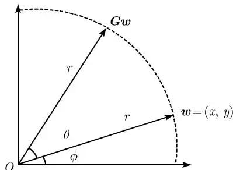
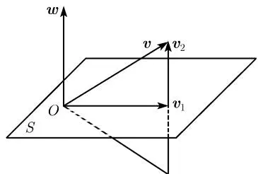

如何利用计算机来快速、稳定、有效地求解大规模线性方程组的问题是科学计算的核心问题之一. 实际上, 各种各样的科学与工程问题往往最终都要归结为一个求解线性方程组的问题. 例如, 结构分析、网络分析、数据分析、最优化及非线性方程组和微分方程数值解等.

求解线性方程组的方法可分为直接法和迭代法两大类.

直接法是指在没有舍入误差的情况下经过有限次运算可求得方程的精确解的方法。直接法需要的计算量比较大，一般为方程组维数的三次方。需要注意的是，由于浮点运算的精度的影响，在实际计算中，直接法往往不可能给出完全精确的计算解。

迭代法则是采取逐次逼近的方法, 从一个初始向量出发, 按照一定的计算格式, 构造一个向量的无穷序列, 其极限是方程组的精确解. 迭代法只经过有限次运算得不到精确解, 但是可以得到满足精度要求的近似解.

本章主要讨论一些最基本的直接法, 并在此基础上讨论它们的各种改进以及矩阵分解的一些概念. 求解线性方程组的迭代法将在第 6 章中介绍.

## 2.1 高斯消去法

考虑 $n$ 阶线性方程组

$$
\boldsymbol{A} \boldsymbol{x} = \boldsymbol{b},\tag{2.1}
$$

系数矩阵为 $\boldsymbol{A}=(a_{ij})_{n\times n}$ ，右端向量和精确解分别为： $\boldsymbol{b}=(b_{1},b_{2},\cdots,b_{n})^{\mathrm{T}},\boldsymbol{x}=(x_{1},x_{2},\cdots,x_{n})^{\mathrm{T}}$ 。它的分量形式为

$$
\left\{\begin{array}{c} a_{11} x_{1} + a_{12} x_{1} + \dots + a_{1 n} x_{n} = b_{1}, \\ a_{21} x_{1} + a_{22} x_{1} + \dots + a_{2 n} x_{n} = b_{2}, \\ \vdots \\ a_{n 1} x_{1} + a_{n 2} x_{1} + \dots + a_{nn} x_{n} = b_{n}. \end{array} \right.
$$

用高斯消去法求解上述线性方程组的计算过程如下.

为方便起见, 分别记矩阵 $\boldsymbol{A}^{(1)} = \boldsymbol{A}$ , 向量 $\boldsymbol{b}^{(1)} = \boldsymbol{b}$ , 它们的元素分别为

$$
a_{ij}^{(1)} = a_{ij}, \quad b_{i}^{(1)} = b_{i} \quad (i, j = 1, 2, \dots , n).
$$

(1) 消去过程

第一步. 如果 $a_{11}^{(1)} \neq 0$ , 可对 $i = 2, 3, \cdots, n$ 作如下的运算, 用数 $m_{i1} = -a_{i1}^{(1)} / a_{11}^{(1)}$ 依次乘以方程组的第一行, 并加到第 i 行上去, 可得到

$$
\left( \begin{array}{c c c c c} a_{11}^{(1)} & a_{12}^{(1)} & a_{13}^{(1)} & \dots & a_{1 n}^{(1)} \\ 0 & a_{22}^{(2)} & a_{23}^{(2)} & \dots & a_{2 n}^{(2)} \\ 0 & a_{32}^{(2)} & a_{33}^{(2)} & \dots & a_{3 n}^{(2)} \\ \vdots & \vdots & \vdots & \ddots & \vdots \\ 0 & a_{n 2}^{(2)} & a_{n 3}^{(2)} & \dots & a_{nn}^{(2)} \end{array} \right) \left( \begin{array}{c} x_{1} \\ x_{2} \\ x_{3} \\ \vdots \\ x_{n} \end{array} \right) = \left( \begin{array}{c} b_{1}^{(1)} \\ b_{2}^{(2)} \\ b_{3}^{(2)} \\ \vdots \\ b_{n}^{(2)} \end{array} \right),\tag{2.2}
$$

其中

$$
\begin{array}{l} a_{ij}^{(2)} = a_{ij}^{(1)} + m_{i 1} a_{1 j}^{(1)}, \quad i, j = 2, 3, \dots , n, \\ b_{i}^{(2)} = b_{i}^{(1)} + m_{i 1} b_{1}^{(1)}, \quad i = 2, 3, \dots , n. \end{array}\tag{2.3}
$$

第二步. 如果 $a_{22}^{(2)} \neq 0$ , 可对 $i = 3, \cdots, n$ 作如下的运算, 用数 $m_{i2} = -a_{i2}^{(2)} / a_{22}^{(2)}$ 依次乘以方程组 (2.2) 的第二行, 并加到第 i 行上去, 可得到

$$
\left( \begin{array}{c c c c c} a_{11}^{(1)} & a_{12}^{(1)} & a_{13}^{(1)} & \dots & a_{1 n}^{(1)} \\ 0 & a_{22}^{(2)} & a_{23}^{(2)} & \dots & a_{2 n}^{(2)} \\ 0 & 0 & a_{33}^{(2)} & \dots & a_{3 n}^{(2)} \\ \vdots & \vdots & \vdots & \ddots & \vdots \\ 0 & 0 & a_{n 3}^{(2)} & \dots & a_{nn}^{(2)} \end{array} \right) \left( \begin{array}{c} x_{1} \\ x_{2} \\ x_{3} \\ \vdots \\ x_{n} \end{array} \right) = \left( \begin{array}{c} b_{1}^{(1)} \\ b_{2}^{(2)} \\ b_{3}^{(3)} \\ \vdots \\ b_{n}^{(3)} \end{array} \right),\tag{2.4}
$$

其中

$$
\begin{array}{r c l} a_{ij}^{(3)} & = & a_{ij}^{(2)} + m_{i 2} a_{2 j}^{(2)}, \quad i, j = 3, \dots , n, \\ b_{i}^{(3)} & = & b_{i}^{(2)} + m_{i 2} b_{2}^{(2)}, \quad i = 3, \dots , n. \end{array}
$$

类似地, 这样的运算过程一直可作到第 $n - 1$ 步, 最后就把原方程组转化为一个上三角形方程组

$$
\left( \begin{array}{c c c c c} a_{11}^{(1)} & a_{12}^{(1)} & \dots & a_{1, n - 1}^{(1)} & a_{1 n}^{(1)} \\ 0 & a_{22}^{(2)} & \dots & a_{1, n - 1}^{(2)} & a_{2 n}^{(2)} \\ \vdots & \vdots & \ddots & \ddots & \vdots \\ 0 & 0 & \dots & a_{n - 1, n - 1}^{(n - 1)} & a_{n - 1, n}^{(n - 1)} \\ 0 & 0 & \dots & 0 & a_{nn}^{(n)} \end{array} \right) \left( \begin{array}{c} x_{1} \\ x_{2} \\ \vdots \\ x_{n - 1} \\ x_{n} \end{array} \right) = \left( \begin{array}{c} b_{1}^{(1)} \\ b_{2}^{(2)} \\ \vdots \\ b_{n - 1}^{(n - 1)} \\ b_{n}^{(n)} \end{array} \right).\tag{2.5}
$$

(2) 回代过程

如果 $a_{nn}^{(n)} \neq 0$ , 可以从上述上三角形方程组 (2.5) 逐次回代计算出线性方程组 (2.1) 的解.

$$
\left\{\begin{array}{l} x_{n} = b_{n}^{(n)} / a_{nn}^{(n)}, \\ x_{i} = (b_{i}^{(i)} - \sum_{j = i + 1}^{n} a_{ij}^{(i)} x_{j}) / a_{ii}^{(i)}, \quad (i = n - 1, \dots , 2, 1) \end{array} \right.
$$

整理如下:

算法 2.1.1(高斯消去法)

(1) 对 $k = 1, 2, \cdots, n - 1$ 做:

对 $i = k + 1, k + 2, \cdots, n$ 做：

用数 $m_{ik} = -a_{ik}^{(k)} / a_{kk}^{(k)}$ 乘以方程组的第 $k$ 行, 加到第 $i$ 行上;

标记得到的矩阵及右端向量的上标为 $(k+1)$ ;

(2) $x_{n} = b_{n}^{(n)} / a_{nn}^{(n)}$ 且对于 $i = n - 1, n - 2, \dots, 2, 1$ 做：

$$
x_{i} = (b_{i}^{(i)} - \sum_{j = i + 1}^{n} a_{ij}^{(i)} x_{j}) / a_{ii}^{(i)}.
$$

这就是求解线性方程组的高斯消去法. 在没有浮点运算误差的情况下, 该方法在有限的计算步骤内能够得到原线性方程组 (2.1) 的精确解, 故是一种直接法. 下面, 我们分析上述高斯消去法的乘除法运算工作量.

(1) 消去过程的第 $k$ 步, 对矩阵需作 $(n - k)^2$ 次乘法运算及 $(n - k)$ 次除法运算, 对右端向量需作 $(n - k)$ 次乘法运算, 所以消去过程总的乘除法运算工作量为

$$
\sum_{k = 1}^{n - 1} (n - k)^{2} + \sum_{k = 1}^{n - 1} (n - k) + \sum_{k = 1}^{n - 1} (n - k) = \frac{1}{3} n^{3} + \frac{1}{2} n^{2} - \frac{5}{6} n.
$$

(2) 回代过程中, 计算每个 $x_{k}$ 需作 $(n-k+1)$ 次乘除法运算, 其工作量为

$$
\sum_{k = 1}^{n} (n - k + 1) = \frac{1}{2} n (n + 1).
$$

因此, 用高斯消去法计算线性方程组 (2.1) 所需的总的乘除法运算工作量为

$$
\frac{1}{3} n^{3} + n^{2} - \frac{1}{3} n.
$$

从算法 2.1.1 的过程可以知道, 高斯消去法能够顺利进行到底是有前提条件的, 即要求所有的主导元素 (在计算中做除数的元素, 简称主元) $a_{ii}^{(i)} \neq 0 (i = 1, 2, \cdots, n)$ . 如果某个主元为零, 则高斯消去法中断.

例 2.1.2 取 $\varepsilon = 10^{-3}$ ，用高斯消去法计算下述线性方程组。(假定模型计算机具有 8 位字长的浮点表示及 16 位的累加器.)

$$
\left\{\begin{array}{l} \varepsilon x_{1} + x_{2} = 1, \\ x_{1} + x_{2} = 2. \end{array} \right.\tag{2.6}
$$

解：首先用高斯消去法对方程组消元, 这时 $m_{21} = -1/\varepsilon$ , 于是得到

$$
\left\{\begin{array}{l l} \varepsilon x_{1} + x_{2} = 1, \\ (1 - 1 / \varepsilon) x_{2} = 2 - 1 / \varepsilon , \end{array} \right.
$$

因此，

$$
x_{2} = \frac{2 - 1 / \varepsilon}{1 - 1 / \varepsilon}, x_{1} = \frac{1 - x_{2}}{\varepsilon}.
$$

在这个模型计算机上, 具体计算是这样的:

$$
\begin{array}{c} 1 / \varepsilon = 10^{9} = 0.10000 \times 10^{10}, \\ 2 = 0.0000000002 \times 10^{10}. \end{array}
$$

因此, $(1 / \varepsilon - 2)$ 最初被计算成 $0.099999998 \times 10^{10}$ , 然后通过四舍五入, 输出结果变成 $0.10000 \times 10^{10} = 1 / \varepsilon$ . 同理, $(1 / \varepsilon - 1)$ 的计算结果也是 $0.10000 \times 10^{10} = 1 / \varepsilon$ . 这样用高斯消去法的计算解为 $x_{1} = 0$ , $x_{2} = 1$ .

实际上方程组的精确解为 $x_{1} = 1 / (1 - \varepsilon)\approx 1$ ， $x_{2} = (1 - 2\varepsilon) / (1 - \varepsilon)\approx 1.$ 因此，未知量 $x_{1}$ 的计算解的相对误差达到了惊人的 $100\%$

例 2.1.2 说明, 由于浮点运算误差的影响, 高斯消去法过程中会出现 “大数吃小数” 的现象, 从而得到一个错误的解.

为了避免上述不稳定的现象, 对一般的线性方程组而言, 我们不直接使用算法 2.1.1, 而采用选主元的策略.

比较常用的方法是：取 $\left|a_{i_{1},1}\right|=\max_{1\leqslant i\leqslant n}\left|a_{i1}^{(1)}\right|$ ，如果 $i_{1}$ 是 $\left|a_{i1}^{(1)}\right|$ 达到最大值的一个指标，则 $i_{1}$ 行与第 1 行进行行交换，使得 $\left|a_{i_{1},1}\right|$ 成为 A 的 $(1,1)$ 元素，然后进行消去计算。同理，以后各步都可以进行类似的求最大值及相应的行交换，然后进行消去计算。

这样, 对于一般的线性方程组, 只要系数矩阵的行列式不等于零, 消去过程就能够顺利进行到底. 因为采用了列的最大元素作为主元, 从而可保证数 $\left|m_{ik}\right| \leqslant 1$ , 其中 $i = k + 1, \cdots, n$ . 这样, 在消去过程中, 就避免了使用绝对值很大的数, 使得总体舍入误差得到有效的控制, 计算过程是稳定的.

这种修改后的算法称为列主元素高斯消去法.

例 2.1.3 取 $\varepsilon = 10^{-3}$ ，用列主元素高斯消去法计算例 2.1.2 中的线性方程组。（假定模型计算机具有 8 位字长的浮点表示及 16 位的累加器。）

解：采用列主元素高斯消去法, 对方程组 (2.6) 进行行交换:

$$
\left\{\begin{array}{c} x_{1} + x_{2} = 2, \\ \varepsilon x_{1} + x_{2} = 1, \end{array} \right.
$$

这时 $m_{21} = -\varepsilon$ ，进行消元后，可得到

$$
\left\{\begin{array}{l l} x_{1} + x_{2} = 2, \\ (1 - \varepsilon) x_{2} = 1 - 2 \varepsilon . \end{array} \right.
$$

同理, 在模型计算机上, $(1 - \varepsilon)$ 和 $(1 - 2\varepsilon)$ 都被算成1. 这样, 列主元素高斯消去法的计算解为 $x_{1} = 1$ , $x_{2} = 1$ , 得到的结果是正确的.

虽然列主元素高斯消去法应用比较广, 但也存在一些缺陷. 例如对上述方程组 (2.6) 的第一个方程两边同时乘上一个很大的数 $1 / \varepsilon$ , 方程组等价地变为

$$
\left\{\begin{array}{l} x_{1} + \frac{1}{\varepsilon} x_{2} = \frac{1}{\varepsilon}, \\ x_{1} + x_{2} = 2. \end{array} \right.
$$

不管用高斯消去法, 还是用列主元素高斯消去法, 结果都是

$$
\left\{\begin{array}{l} x_{1} + \frac{1}{\varepsilon} x_{2} = \frac{1}{\varepsilon}, \\ \left(1 - \frac{1}{\varepsilon}\right) x_{2} = 2 - \frac{1}{\varepsilon}. \end{array} \right.
$$

因此，

$$
x_{2} = \frac{2 - 1 / \varepsilon}{1 - 1 / \varepsilon} \approx 1, x_{1} = \frac{1}{\varepsilon} - \frac{1}{\varepsilon} x_{2} \approx 0.
$$

很显然, 这是一个错误的解答. 其主要原因是方程两边都乘上了一个很大的数, 使得选主元变得毫无意义. 换句话说, 任何一个非零元素 (不管其绝对值多么小) 乘以一个很大的数后, 都有可能被选成主元, 这就是出错的真正原因.

因此, 可以对列主元素高斯消去法作某些改进来克服这方面的困难. 譬如, 在列主元素高斯消去法的第一步取 $|a_{i_1,j_1}| = \max_{1 \leqslant i \leqslant n, 1 \leqslant j \leqslant n} |a_{ij}^{(1)}|$ 等.

## 2.2 矩阵的三角分解

把一个 $n$ 阶矩阵分解成结构简单的三角形矩阵的乘积就称为矩阵的三角分解. 本节将利用初等矩阵来分析和描述高斯消去过程, 进而导出矩阵的三角分解.

### 2.2.1 LU 分解和 LDU 分解

回顾 §2.1 节的高斯消去过程, 如果所有碰到的主元素 $a_{ii}^{(i)} \neq 0$ 其中 $i = 1, 2, \cdots, n$ , 则消去过程与左乘下述矩阵是等价的:

$$
\boldsymbol{L}_{n - 1} \dots \boldsymbol{L}_{2} \boldsymbol{L}_{1} \boldsymbol{A} = \left( \begin{array}{c c c c c} a_{11}^{(1)} & a_{12}^{(1)} & \dots & a_{1, n - 1}^{(1)} & a_{1 n}^{(1)} \\ 0 & a_{22}^{(2)} & \dots & a_{2, n - 1}^{(2)} & a_{2 n}^{(2)} \\ \vdots & \vdots & \ddots & \vdots & \vdots \\ 0 & 0 & \dots & a_{n - 1, n}^{(n - 1)} & a_{n - 1, n}^{(n - 1)} \\ 0 & 0 & \dots & 0 & a_{nn}^{(n)}, \end{array} \right),\tag{2.7}
$$

这里

$$
\boldsymbol{L}_{i} = \left( \begin{array}{c c c c c c} 1 & & & & & \\ & \ddots & & & & \\ & & 1 & & & \\ & & m_{i + 1, i} & 1 & & \\ & & \vdots & & \ddots & \\ & & m_{n, i} & & & 1 \end{array} \right), \quad i = 1, 2, \dots , n - 1.
$$

通过简单的计算, 可知

$$
\boldsymbol{L}_{i}^{- 1} = \left( \begin{array}{c c c c c c} 1 & & & & & \\ & \ddots & & & & \\ & & 1 & & & \\ & & - m_{i + 1, i} & 1 & & \\ & & \vdots & & \ddots & \\ & & - m_{n, i} & & & 1 \end{array} \right), \quad i = 1, 2, \dots , n - 1.
$$

如果记式 (2.7) 右端的上三角形矩阵为 U, 则有

$$
\boldsymbol{A} = \boldsymbol{L}_{1}^{- 1} \boldsymbol{L}_{2}^{- 1} \dots \boldsymbol{L}_{n - 1}^{- 1} \boldsymbol{U}.
$$

通过矩阵的乘法运算, 可得

$$
\boldsymbol{L}_{1}^{- 1} \boldsymbol{L}_{2}^{- 1} \dots \boldsymbol{L}_{n - 1}^{- 1} = \left( \begin{array}{c c c c} 1 & & & \-m_{21} & 1 & & \\ \vdots & \ddots & \ddots & \-m_{n 1} & \dots & - m_{n, n - 1} & 1 \end{array} \right).
$$

如果记 $L = L_{1}^{-1}L_{2}^{-1}\cdots L_{n-1}^{-1}$ ，则有 A = LU。这里 L 是单位下三角矩阵，U 是上三角矩阵，这种矩阵分解称为杜利脱尔 (Doolittle) 分解，或者杜利脱尔三角分解。

事实上, 杜利脱尔分解中上三角矩阵 U 的对角元素可以提出来, 令 $D=\mathrm{diag}(u_{11},u_{22},\cdots,u_{nn})$ , 则 $\widetilde{U}=D^{-1}U$ 还是一个单位上三角矩阵, 且满足 $A=LD\widetilde{U}$ . 因而矩阵的三角分解除了杜利脱尔分解, 还有以下几种特殊的变形情况.

## - 克洛脱 (Crout) 分解

A = LU, 这里 L 是下三角矩阵, U 是单位上三角矩阵.

## - LDU 分解

A = LDU, 这里 L 是单位下三角矩阵, D 是对角矩阵, U 是单位上三角矩阵.

以上三种分解统称为矩阵的三角分解, 或者 LU 分解. 如果不作特殊说明, 一般我们所说的 LU 分解就是指杜利脱尔三角分解.

对矩阵 $\mathbf{A}$ 进行杜利脱尔分解是有条件的, 它要求在对 $\mathbf{A}$ 进行高斯消去的时候, 所有主元素 $a_{ii}^{(i)} (1 \leqslant i \leqslant n)$ 均不为零. 那么, $\mathbf{A}$ 应该满足什么样的条件才能保证这一要求呢?

事实上, 由高斯消去法的消去过程可以看出: 每一步消去就是对系数矩阵 A 进行若干次行变换, 所以在消去过程的任一阶段, 矩阵的各阶顺序主子式的值都保持不变, 即

$$
\Delta_{k} = \left| \begin{array}{c c c c} a_{11} & a_{12} & \dots & a_{1 k} \\ a_{21} & a_{22} & \dots & a_{2 k} \\ \vdots & \vdots & \ddots & \vdots \\ a_{k 1} & a_{k 2} & \dots & a_{kk} \end{array} \right| = a_{11}^{(1)} a_{22}^{(2)} \dots a_{kk}^{(k)}, \quad k = 1, 2, \dots , n.
$$

由此, 利用数学归纳法可以得到下述定理.


利用高斯消去法求解方程组 Ax=b 时的主元素 $a_{kk}^{(k)} \neq 0 (k = 1, 2, \cdots, n)$ 的充要条件是 n 阶矩阵 A 的所有顺序主子式均不为零.


实际上, 杜利脱尔分解还具有唯一性, 即下述定理.

**定理 2.2.2**　若 A 为 n 阶矩阵, 且所有顺序主子式均不等于零, 则 A 可分解为一个单位下三角矩阵 L 与一个上三角矩阵 U 的乘积, 即 A = LU, 且分解是唯一的.

证: 杜利脱尔分解的存在性上面已经给出了, 下面来证明它的唯一性. 不妨假设矩阵 A 有两种三角分解

$$
\boldsymbol{A} = \boldsymbol{L} \boldsymbol{U} = \boldsymbol{L}_{1} \boldsymbol{U}_{1},\tag{2.8}
$$

其中, L 和 $L_{1}$ 为单位下三角矩阵, U 和 $U_{1}$ 为上三角矩阵. 由于 A 非奇异, 则 U 和 $U_{1}$ 也是非奇异矩阵, 于是由式 (2.8) 可得:

$$
\boldsymbol{L}^{- 1} \boldsymbol{L}_{1} = \boldsymbol{U} \boldsymbol{U}_{1}^{- 1}.\tag{2.9}
$$

由于单位下三角矩阵的逆矩阵仍是单位下三角矩阵, 单位下三角矩阵与单位下三角矩阵的乘积仍是单位下三角矩阵, 且上三角矩阵的逆矩阵仍是上三角矩阵, 上三角矩阵与上三角矩阵的乘积仍是上三角矩阵. 这样, 式 (2.9) 的左边为单位下三角矩阵, 而右边为上三角矩阵, 所以必有

$$
\boldsymbol{L}^{- 1} \boldsymbol{L}_{1} = \boldsymbol{U} \boldsymbol{U}_{1}^{- 1} = \boldsymbol{I}.
$$

即 $L = L_{1}, U = U_{1}$ ，唯一性得证.

同理, 存在性和唯一性定理也适用于其他形式的三角分解.


如果矩阵 A 的所有顺序主子式均不等于零, 则有

(1) A 有唯一的三角分解: A = LDU.

(2) $\pmb{A}$ 有唯一的克洛脱分解: $\pmb{A} = \pmb{L}\pmb{U}$ .


上述的三角分解可以通过下列直接的紧凑方式来完成. 例如, 对于杜利脱尔分解, 基于矩阵的乘法运算规则, 可以先算 U 的第一行, 再算 L 的第一列:

$$
u_{1 j} = a_{1 j}, \quad j = 1, 2, \dots , n,
$$

$$
l_{i 1} = a_{i 1} / u_{11}, \quad j = 2, 3, \dots , n.
$$

然后, 计算 U 的第二行, 再算 L 的第二列:

$$
u_{2 j} = a_{2 j} - l_{21} u_{1 j}, \quad j = 2, 3, \dots , n,
$$

$$
l_{i 2} = (a_{i 2} - l_{i 1} u_{12}) / u_{22}, \quad i = 3, \dots , n.
$$

依次计算下去, 如果已求出 U 的前 k-1 行和 L 的前 k-1 列, 则有

$$
u_{kj} = a_{kj} - (l_{k 1} u_{1 j} + \dots + l_{k, k - 1} u_{k - 1, j}), \quad j = k, k + 1, \dots , n,
$$

$$
l_{ik} = (a_{ik} - l_{i 1} u_{1 k} - \dots - l_{i, k - 1} u_{k - 1, k}) / u_{kk}, i = k + 1, \dots , n.
$$

显然, L 和 U 的存储区域可与 A 的存储区域叠置, 因此, 杜利脱尔算法最终可表述如下.

### 算法 2.2.4(杜利脱尔算法)

(1) 对 $k = 1, 2, \cdots, n$ 做:

(2) $u_{kj} = a_{kj} - \sum_{s=1}^{k-1} l_{ks} u_{sj}, \quad j = k, k + 1, \cdots, n,$

(3) $l_{ik} = (a_{ik} - \sum_{s=1}^{k-1} l_{is} u_{sk}) / u_{kk}, \quad j = k + 1, \cdots, n.$

这里, 规定 $\sum_{1}^{0}$ 为零 (以后若碰到求和号上标比下标小, 按惯例都理解为 0).

类似地, 基于克洛脱分解及矩阵的乘法, 可得克洛脱算法如下.

算法 2.2.5(克洛脱算法)

(1) 对 $k = 1, 2, \cdots, n$ 做:

(2) $l_{ik} = a_{ik} - \sum_{s=1}^{k-1} l_{is} u_{sk}, i = k + 1, \cdots, n,$

$$
(3) u_{kj} = (a_{kj} - \sum_{s = 1}^{k - 1} l_{ks} u_{sj}) / l_{kk}, j = k, k + 1, \dots , n.
$$

当矩阵 A 的 LU 分解已经完成后, 求解线性方程组 Ax = b 只需做两个回代. 原方程组可分解为

$$
\left\{\begin{array}{l l} L y = b, \\ U x = y. \end{array} \right.
$$

由此可得计算公式

$$
\left\{\begin{array}{l l} y_{i} & = b_{i} - \sum_{j = 1}^{i - 1} l_{ij} y_{j}, \quad i = 1, 2, \dots , n, \\ x_{i} & = (y_{i} - \sum_{j = i + 1}^{n} u_{ij} x_{j}) / u_{ii}, \quad i = n, n - 1, \dots , 1. \end{array} \right.
$$

例 2.2.6 已知 Ax=b, 作 A 的杜利脱尔分解, 并求解方程组, 其中

$$
\boldsymbol{A} = \left( \begin{array}{c c c c} 1 & 2 & 3 & 4 \\ 1 & 4 & 9 & 16 \\ 1 & 8 & 27 & 64 \\ 1 & 16 & 81 & 256 \end{array} \right), \quad \boldsymbol{b} = \left( \begin{array}{c} 2 \\ 10 \\ 44 \\ 190 \end{array} \right).
$$

解:

$$
\left( \begin{array}{c c c c} 1 & 2 & 3 & 4 \\ 1 & 4 & 9 & 16 \\ 1 & 8 & 27 & 64 \\ 1 & 16 & 81 & 256 \end{array} \right) = \left( \begin{array}{c c c c} 1 & & & \\ l_{21} & 1 & & \\ l_{31} & l_{32} & 1 & \\ l_{41} & l_{42} & l_{43} & 1 \end{array} \right) \left( \begin{array}{c c c c} u_{11} & u_{12} & u_{13} & u_{14} \\ & u_{22} & u_{23} & u_{24} \\ & & u_{33} & u_{34} \\ & & & u_{44} \end{array} \right).
$$

按照算法 2.2.4, 可得

$$
\boldsymbol{L} = \left( \begin{array}{c c c c} 1 & & & \\ 1 & 1 & & \\ 1 & 3 & 1 & \\ 1 & 7 & 6 & 1 \end{array} \right), \quad \boldsymbol{U} = \left( \begin{array}{c c c c} 1 & 2 & 3 & 4 \\ & 2 & 6 & 12 \\ & & 6 & 24 \\ & & & 24 \end{array} \right).
$$

对 Ly = b 进行回代, 可得 $\boldsymbol{y} = (2, 8, 18, 24)^{\mathrm{T}}$ ; 再对 Ux = y 进行回代, 则 $\boldsymbol{x} = (-1, 1, -1, 1)^{\mathrm{T}}$ .
用 Matlab 可以计算矩阵的 LU 分解, 其语法为

$$
> > [ L, U ] = l u (A)
$$

其中 L 代表下三角形矩阵, U 代表上三角形矩阵.

### 2.2.2 乔列斯基分解

当 A 为对称正定矩阵时, 它的所有顺序主子式都大于零, 故由定理 2.2.2 可知存在唯一的 LU 分解. 由于对称正定的特殊性, 可以得到一个性质更好的三角分解. 根据定理 2.2.3, 由于 A 是对称正定矩阵, 所以存在唯一的 LDU 分解, 即 A = LDU, 其中, L 是单位下三角矩阵, D 是非奇异的对角矩阵, U 是单位上三角矩阵.

由 A 的对称性可得 $LDU = U^{T}DL^{T}$ ，按照分解的唯一性可得 $L = U^{T}$ ，从而得到 $A = LDLL^{T}$ 。设 $D = \text{diag}(d_{1}, d_{2}, \cdots, d_{n})$ ， $d_{i} \neq 0, i = 1, 2, \cdots, n$ 。下面进一步来证明 D 的对角元素均为正数，即 $d_{i} > 0$ 。

由于 L 是单位下三角矩阵, 所以 $L^{T}$ 是单位上三角矩阵, 当然也是非奇异矩阵. 故对于单位坐标向量 $e_{i} = (0, \cdots, 0, 1, 0, \cdots, 0)^{\mathrm{T}}$ , 存在非零向量 $x_{i}$ , 使得

$$
\boldsymbol{L}^{\mathrm{T}} \boldsymbol{x}_{i} = \boldsymbol{e}_{i}, \quad i = 1, 2, \dots , n.
$$

另外， $\boldsymbol{x}_{i}^{\mathrm{T}}\boldsymbol{A}\boldsymbol{x}_{i}=\boldsymbol{x}_{i}^{\mathrm{T}}(\boldsymbol{L}\boldsymbol{D}\boldsymbol{L}^{\mathrm{T}})\boldsymbol{x}_{i}=(\boldsymbol{L}^{\mathrm{T}}\boldsymbol{x}_{i})^{\mathrm{T}}\boldsymbol{D}(\boldsymbol{L}^{\mathrm{T}}\boldsymbol{x}_{i})=\boldsymbol{e}_{i}^{\mathrm{T}}\boldsymbol{D}\boldsymbol{e}_{i}=\boldsymbol{d}_{i}.$

由于 A 是对称正定矩阵, 则有 $x_{i}^{T}Ax_{i}>0$ , 从而 $d_{i}>0, i=1,2,\cdots,n$ . 这就证明了 D 的对角元素都为正数.

记 $D^{1/2}=\mathrm{diag}(\sqrt{d_{1}},\sqrt{d_{2}},\cdots,\sqrt{d_{n}})$ ，则有

$$
\boldsymbol{A} = \boldsymbol{LDL}^{\mathrm{T}} = \boldsymbol{LD}^{1 / 2} \boldsymbol{D}^{1 / 2} \boldsymbol{L}^{\mathrm{T}} = (\boldsymbol{LD}^{1 / 2}) (\boldsymbol{LD}^{1 / 2})^{\mathrm{T}}.
$$

如果记 $G = LD^{1/2}$ ，则有

$$
\boldsymbol{A} = \boldsymbol{G} \boldsymbol{G}^{\mathrm{T}}.\tag{2.10}
$$

其中, $G$ 是对角元素均大于零的下三角矩阵. 容易证明, 这个三角分解也是唯一的, 称之为对称正定矩阵 $\mathbf{A}$ 的乔列斯基 (Choleskey) 分解.

算法 2.2.7(乔列斯基算法)

(1) 对 $k = 1, 2, \cdots, n$ 做,

(2) $g_{ii} = \sqrt{a_{ii} - \sum_{s = 1}^{i - 1}g_{is}^2},$

(3) $g_{ki} = \left(a_{ki} - \sum_{s=1}^{i-1} g_{is} g_{ks}\right) / g_{ii}, \quad k = i + 1, i + 2, \cdots, n.$

从算法 2.2.7 可以看出 $a_{ii} = \sum_{s=1}^{i} g_{is}^{2}$ ，因此，可得

$$
\left| g_{is} \right| \leqslant \sqrt{a_{ii}}, \quad i = 1, 2, \dots , n, \quad s \leqslant i.
$$

这表明 G 的所有元素的绝对值是可以预先得到控制的, 因而计算过程是稳定的.

如果对称正定矩阵已经有了乔列斯基分解 $A = GG^{T}$ ，则原线性方程组可转化为

$$
\left\{\begin{array}{l} G \boldsymbol{y} = \boldsymbol{b}, \\ G^{\mathrm{T}} \boldsymbol{x} = \boldsymbol{y}. \end{array} \right.
$$

由此可得计算公式

$$
\left\{\begin{array}{l} y_{i} = \left(b_{i} - \sum_{j = 1}^{i - 1} g_{ij} y_{j}\right) / g_{ii}, \quad i = 1, 2, \dots , n, \\ x_{i} = \left(y_{i} - \sum_{j = i + 1}^{n} g_{ji} x_{j}\right) / g_{ii}, \quad i = n, n - 1, \dots , 1. \end{array} \right.
$$

上述求解对称正定方程组的计算方法称为平方根法.

用上述三角分解法来求解线性方程组的方案特别适合于求解具有多个右端项的线性方程组

$$
\boldsymbol{A} (x_{1}, x_{2}, \dots , x_{m}) = (b_{1}, b_{2}, \dots , b_{m}).
$$

这里的 $x_{i}, b_{i}$ 均为向量. 这是因为三角分解的计算工作量相当于作一次高斯消去过程的计算工作量, 即大约为 $\frac{1}{3} n^{3}$ , 而做两次回代的计算工作量大约仅为 $n^{2}$ . 对于求解高阶且具有多个右端项的线性方程组, 三角分解法的优势更加明显.

例 2.2.8 利用平方根法求解下述对称正定方程组

$$
\left( \begin{array}{r r r} 4 & 2 & - 2 \\ 2 & 2 & - 3 \-2 & - 3 & 14 \end{array} \right) \left( \begin{array}{c} x_{1} \\ x_{2} \\ x_{3} \end{array} \right) = \left( \begin{array}{c} 4 \\ 1 \\ 0 \end{array} \right).
$$

解：设 A 的乔列斯基分解 $A = LL^{T}$ ，按照算法 2.2.7，

$$
\begin{array}{l} {l_{11} = \sqrt{4} = 2, l_{21} = 2 / 2 = 1, l_{31} = - 2 / 2 = 1,} \\ {l_{22} = \sqrt{2 - 1} = 1, l_{32} = - 2,} \\ {l_{33} = \sqrt{14 - 1 - 4} = 3.} \end{array}
$$

由此可得

$$
\boldsymbol{L} = \left( \begin{array}{c c c} 2 & & \\ 1 & 1 & \-1 & - 2 & 3 \end{array} \right).
$$

对 $\pmb{L}\pmb{y} = \pmb{b}$ 进行回代, 则 $\pmb{y} = (2, -1, 0)^{\mathrm{T}}$ ; 再对 $\pmb{L}^{\mathrm{T}}\pmb{x} = \pmb{y}$ 进行回代, 则 $\pmb{x} = \left(\frac{3}{2}, -1, 0\right)^{\mathrm{T}}$ .

### 2.2.3 追赶法

利用矩阵的三角分解, 很容易导出一些特殊方程组的解法. 设有 $n$ 阶方程组 $\mathbf{A}\mathbf{x} = \mathbf{d}$ , 其中 $\mathbf{A}$ 为三对角矩阵, 即

$$
\boldsymbol{A} = \left( \begin{array}{c c c c c} b_{1} & c_{1} & & & \\ a_{2} & b_{2} & c_{2} & & \\ & \ddots & \ddots & \ddots & \\ & & a_{n - 1} & b_{n - 1} & c_{n - 1} \\ & & & a_{n} & b_{n} \end{array} \right), \quad \boldsymbol{d} = \left( \begin{array}{c c c c c} d_{1} & \\ d_{2} & \\ \vdots & \\ d_{n - 1} & \\ d_{n} & \end{array} \right).
$$

对矩阵 A 作克洛脱分解, 得到

$$
\boldsymbol{L} = \left( \begin{array}{c c c c c} l_{1} & & & & \\ v_{2} & l_{2} & & & \\ & \ddots & \ddots & & \\ & & v_{n - 1} & l_{n - 1} & \\ & & & v_{n} & l_{n} \end{array} \right), \quad \boldsymbol{U} = \left( \begin{array}{c c c c c} 1 & u_{1} & & & \\ & 1 & u_{2} & & \\ & & \ddots & \ddots & \\ & & & 1 & u_{n - 1} \\ & & & & 1 \end{array} \right).
$$

设 $\boldsymbol{y}=(y_{1},y_{2},\cdots,y_{n})^{\mathrm{T}}$ ，根据 L 和 U 的特点，可得以下计算方法.

算法 2.2.9(追赶法)

(1) 对 $i=1,2,\cdots,n-1$ , 做

$$
\left\{\begin{array}{l} l_{i} = b_{i} - a_{i} u_{i - 1}, \\ y_{i} = (d_{i} - y_{i - 1} a_{i}) / l_{i}, \\ u_{i} = c_{i} / l_{i}. \end{array} \right.\tag{2.11}
$$

这里，置 $u_0 = y_0 = a_1 = 0;$

(2) $l_{n} = b_{n} - a_{n}u_{n - 1},y_{n} = (d_{n} - y_{n - 1}a_{n}) / l_{n};$

(3) $x_{n} = y_{n}$ ;

(4) 对 $i = n - 1, \cdots, 2, 1$ 做

$$
x_{i} = y_{i} - u_{i} x_{i + 1}.\tag{2.12}
$$

这一解法称为追赶法. 它由两组递推公式组成, (1) 和 (2) 称为追的过程, (3) 和 (4) 称为赶的过程. 三对角方程组在样条插值、微分方程数值解等问题中大量出现, 并且系数矩阵大多具有比较好的性质, 所以不必选主元就能保证算法的稳定性.

追赶法的 Matlab 程序 tridiagsolver.m 如下.

```matlab
function x = tridiagsolver(A,b)
    [n,n] = size(A);
    for i=1:n
    if (i==1)
    l(i) = a(i,i);
    y(i) = b(i)/l(i);
    else
    l(i) = a(i,i) - a(i,i-1)*u(i-1);
    y(i) = (b(i)-y(i-1)*a(i,i-1))/l(i);
    end
    if (i<n)
    u(i) = a(i,i+1)/l(i);
    end
end
x(n)= y(n)
for j=n-1:-1:1
    x(j) = y(j)-u(j)*x(j+1);
end
```

例 2.2.10 用追赶法求解下述三对角线性方程组

$$
\left( \begin{array}{c c c c} 2 & - 1 & & \-1 & 3 & - 2 & \\ & - 2 & 4 & - 3 \\ & & - 3 & 5 \end{array} \right) \left( \begin{array}{c} x_{1} \\ x_{2} \\ x_{3} \\ x_{4} \end{array} \right) = \left( \begin{array}{c} 6 \\ 1 \-2 \\ 1 \end{array} \right).
$$

解：按照算法 2.2.9, 追的过程为

```matlab
$\begin{array}{llll}l_1 = b_1 = 2, & y_1 = d_1 / l_1 = 3, & u_1 = c_1 / l_1 = -\frac{1}{2};\\ l_2 = b_2 - a_2u_1 = 5 / 2, & y_2 = (d_2 - a_2y_1) / l_2 = 8 / 5, & u_2 = c_2 / l_2 = -\frac{4}{5};\\ l_3 = b_3 - a_3u_2 = 12 / 5, & y_3 = (d_3 - a_3y_2) / l_3 = 1 / 2, & u_3 = c_3 / l_3 = -\frac{5}{4};\\ l_4 = b_4 - a_4u_3 = 5 / 4, & y_4 = (d_4 - a_4y_3) / l_4 = 2. \end{array}$
```

赶的过程为

```matlab
$x_{4} = y_{4} = 2,$ $x_{3} = y_{3} - u_{2}x_{4} = 3,$ $x_{2} = y_{2} - u_{2}x_{3} = 4,$
```

$$
x_{1} = y_{1} - u_{1} x_{2} = 5.
$$

因此, 原方程组的解为 $\boldsymbol{x} = (5, 4, 3, 2)^{\mathrm{T}}$ .

### 2.2.4 分块三角分解

许多来源于实际问题 (离散的化学反应方程、对流扩散方程和 Navier-Stokes 方程等) 的线性方程组的系数矩阵具有分块结构. 譬如, 用五点差分格式离散泊松方程得到的系数矩阵通常具有如下分块三对角结构:

$$
\boldsymbol{A} = \left( \begin{array}{c c c c c} \boldsymbol{D} & \boldsymbol{E} & & & \\ \boldsymbol{E} & \boldsymbol{D} & \boldsymbol{E} & & \\ & \ddots & \ddots & \ddots & \\ & & \boldsymbol{E} & \boldsymbol{D} & \boldsymbol{E} \\ & & & \boldsymbol{E} & \boldsymbol{D} \end{array} \right),
$$

其中 D 和 E 分别是离散出来的三对角矩阵和对角矩阵. 因此, 考虑分块矩阵的分块三角分解及其算法具有非常重要的理论意义和实用价值.

我们这里仅讨论形如

$$
\boldsymbol{\mathcal{A}} = \left( \begin{array}{c c} \boldsymbol{A} & \boldsymbol{B} \\ \boldsymbol{C} & \boldsymbol{D} \end{array} \right)
$$

的 $2 \times 2$ 分块矩阵的分块三角分解, 其中 A 是非奇异矩阵.

令 L 和 u 分别是分块下三角矩阵和分块上三角矩阵:

$$
\mathcal{L} = \left( \begin{array}{c c} \boldsymbol{I} & \boldsymbol{0} \\ \boldsymbol{E} & \boldsymbol{I} \end{array} \right), \quad \mathcal{U} = \left( \begin{array}{c c} \boldsymbol{F} & \boldsymbol{G} \\ \boldsymbol{0} & \boldsymbol{H} \end{array} \right),
$$

且满足 $\mathcal{A} = \mathcal{L}\mathcal{U}$ .经计算可得

$$
\boldsymbol{E} = \boldsymbol{C} \boldsymbol{A}^{- 1}, \quad \boldsymbol{F} = \boldsymbol{A}, \quad \boldsymbol{G} = \boldsymbol{B}, \quad \boldsymbol{H} = \boldsymbol{D} - \boldsymbol{C} \boldsymbol{A}^{- 1} \boldsymbol{B}.
$$

因此, $2 \times 2$ 分块矩阵 $\mathcal{A}$ 的一个分块三角分解为

$$
\mathcal{L} = \left( \begin{array}{c c} I & 0 \\ C A^{- 1} & I \end{array} \right), \quad \mathcal{U} = \left( \begin{array}{c c} A & B \\ 0 & D - C A^{- 1} B \end{array} \right),
$$

其中, $S = D - CA^{-1}B$ 成为 $\mathbf{A}$ 的舒尔 (Schur) 补.

如 §2.2.1 节描述的一样, 矩阵 A 的分块三角分解也有很多种表达方式. 当 A 是对称正定矩阵时, 一个常用的分块三角分解如下:

$$
\mathcal{L} = \left( \begin{array}{c c} \boldsymbol{A}^{1 / 2} & \boldsymbol{0} \\ \boldsymbol{CA}^{- 1 / 2} & \boldsymbol{S}^{1 / 2} \end{array} \right), \quad \mathcal{U} = \left( \begin{array}{c c} \boldsymbol{A}^{1 / 2} & \boldsymbol{A}^{- 1 / 2} \boldsymbol{B} \\ \boldsymbol{0} & \boldsymbol{S}^{1 / 2} \end{array} \right),
$$

其中 $S = D - CA^{-1}B$

[例2.2](ch02.md).11 求分块矩阵

$$
\boldsymbol{\mathcal{A}} = \left( \begin{array}{c c} \boldsymbol{A} & \boldsymbol{B} \\ \boldsymbol{C} & \boldsymbol{D} \end{array} \right)
$$

的一个分块三角分解, 其中

$$
\boldsymbol{A} = \left( \begin{array}{c c} 3 & 1 \\ 4 & 2 \end{array} \right), \quad \boldsymbol{B} = \left( \begin{array}{c c} 2 & 0 \\ 0 & 2 \end{array} \right), \quad \boldsymbol{C} = \left( \begin{array}{c c} 2 & 0 \\ 0 & 2 \end{array} \right), \quad \boldsymbol{D} = \left( \begin{array}{c c} 5 & 3 \\ 1 & 8 \end{array} \right).
$$

解：因为

$$
\boldsymbol{A}^{- 1} = \frac{1}{2} \left( \begin{array}{c c} 2 & - 1 \-4 & 3 \end{array} \right),
$$

所以，

$$
\boldsymbol{E} = \boldsymbol{C} \boldsymbol{A}^{- 1} = \left( \begin{array}{c c} 2 & 0 \\ 0 & 2 \end{array} \right) \frac{1}{2} \left( \begin{array}{c c} 2 & - 1 \-4 & 3 \end{array} \right) = \left( \begin{array}{c c} 2 & - 1 \-4 & 3 \end{array} \right),
$$

$$
\boldsymbol{S} = \boldsymbol{D} - \boldsymbol{C} \boldsymbol{A}^{- 1} \boldsymbol{B} = \left( \begin{array}{c c} 5 & 3 \\ 1 & 8 \end{array} \right) - \left( \begin{array}{c c} 2 & 0 \\ 0 & 2 \end{array} \right) \frac{1}{2} \left( \begin{array}{c c} 2 & - 1 \-4 & 3 \end{array} \right) \left( \begin{array}{c c} 2 & 0 \\ 0 & 2 \end{array} \right) = \left( \begin{array}{c c} 1 & 5 \\ 9 & 2 \end{array} \right).
$$

因此, $2 \times 2$ 分块矩阵 $\mathcal{A}$ 的一个分块三角分解为:

$$
\mathcal{L} = \left( \begin{array}{c c} I & 0 \\ E & I \end{array} \right), \quad \mathcal{U} = \left( \begin{array}{c c} A & B \\ 0 & S \end{array} \right).
$$

## 2.3 QR 分解和奇异值分解

矩阵分解是将矩阵分解为数个具有特殊性质的矩阵因子的乘积. 除了三角分解以外, 还有本节要介绍的 QR 分解 (QR Factorization) 和奇异值分解法 (Singular Value Decomposition).

### 2.3.1 正交矩阵

首先我们引入正交矩阵的概念.


若矩阵 $Q \in R^{n \times n}$ ，且满足 $QQ^{T} = Q^{T}Q = I$ ，就称矩阵 Q 为正交矩阵.


正交矩阵 Q 有如下性质:

• $Q^{-1} = Q^{T};$

\- $\operatorname{det}(\boldsymbol{Q}) = \pm 1$ ;

\- $Qx$ 的长度与 $x$ 的长度相等.

下面介绍几类特殊的正交矩阵.

1. 单位矩阵和置换矩阵

形如

$$
\boldsymbol{I} = \left( \begin{array}{c c c c} 1 & & & \\ & 1 & & \\ & & \ddots & \\ & & & 1 \end{array} \right)_{n \times n}
$$

的矩阵称为单位矩阵. 单位矩阵除了对角线为 1 以外, 其他元素都为零.

将单位矩阵的任意两行 (列) 交换得到的矩阵, 称为置换矩阵. 譬如, 将单位矩阵的第 $i$

行和第 j 行交换, 得到置换矩阵 $P_{ij}$ :

$$
\boldsymbol{P}_{ij} = \left( \begin{array}{c c c c c c c c} 1 & & & & & & \\ & \ddots & & & & & \\ & & 0 & & 1 & & \\ & & & \ddots & & \\ & & 1 & & 0 & & \\ & & & & & \ddots & \\ & & & & & & 1 \end{array} \right) \begin{array}{c} i \\ . \\ j \\ \end{array}
$$

任意个置换矩阵的乘积仍然是置换矩阵.



图2-1 Givens变换


2. 旋转矩阵 (Givens 变换)

对于某个角度 $\theta$ ，记 $s = \sin \theta, c = \cos \theta$ ，那么， $\pmb{G} = \begin{pmatrix} c & s \-s & c \end{pmatrix}$ 是一个正交阵。记 $\pmb{w} = (x,y)^{\mathrm{T}}$ 为二维平面中的一个向量，用极坐标表示为 $\pmb{w} = (r\cos \phi, r\sin \phi)^{\mathrm{T}}$ 。那么，

$$
\boldsymbol{G} \boldsymbol{w} = \left( \begin{array}{c c} \cos \theta & \sin \theta \-sin \theta & \cos \theta \end{array} \right) \binom{r \cos \phi}{r \sin \phi} = \binom{r \cos (\theta + \phi)}{r \sin (\theta + \phi)},
$$

即 Gw 表示将向量 w 逆时针旋转 $\theta$ 角所得到的向量, 如图 2-1 所示.

推广到 $n \times n$ 的情形, 形如

$$
\boldsymbol{G} (i, j, \theta) = \left( \begin{array}{c c c c c c c c} 1 & & & & & & \\ & \ddots & & & & \\ & & \cos \theta & & \sin \theta & & \\ & & & \ddots & & \\ & & - \sin \theta & & \cos \theta & & \\ & & & & & \ddots & \\ & & & & & & 1 \end{array} \right)_{j}
$$

的矩阵称为 Givens 矩阵或 Givens 变换, 或称 (平面) 旋转矩阵 (旋转变换), 其中 $\theta$ 为旋转的角度. 显然, $G(i,j,\theta)$ 也是正交矩阵.

若 $x \in R^{n}$ , $y = G(i, j, \theta)x$ , 则 y 的分量为

$$
\left\{\begin{array}{l l} y_{i} = c x_{i} + s x_{j}, \\ y_{j} = - s x_{i} + c x_{j}, \\ y_{k} = x_{k}, & k \neq i, k \neq j. \end{array} \right.
$$

如果要使 $y_{j}=0$ ，只要选择 $\theta$ 满足

$$
c = \cos \theta = \frac{x_{i}}{\sqrt{(x_{i}^{2} + x_{j}^{2})}},
$$

$$
s = \sin \theta = \frac{x_{j}}{\sqrt{(x_{i}^{2} + x_{j}^{2})}}
$$

即可.

例 2.3.2 用 Givens 变换将海森伯格 (Hessenberg) 型矩阵

$$
\boldsymbol{A} = \left( \begin{array}{c c c} 4.8 & 2.56 & 2.528 \\ 3.6 & 4.92 & 3.296 \\ 0 & 1.8 & 1.84 \\ 0 & 0 & 0.6 \end{array} \right)
$$

化为上三角矩阵.

解：首先, 为了消去 A 中 $(2,1)$ 元, 我们构造 Givens 变换 $G(1,2,\theta)$ , 其中

$$
\cos \theta = \frac{4.8}{\sqrt{(4.8^{2} + 3.6^{2})}} = 0.8, \quad \sin \theta = \frac{3.6}{\sqrt{(4.8^{2} + 3.6^{2})}} = 0.6.
$$

从而，

$$
\boldsymbol{A}_{1} = \boldsymbol{G} (1, 2, \theta) \boldsymbol{A} = \left( \begin{array}{c c c} 6 & 5 & 4 \\ 0 & 2.4 & 1.12 \\ 0 & 1.8 & 1.84 \\ 0 & 0 & 0.6 \end{array} \right).
$$

其次, 消去 $A_{1}$ 中 (3,2) 元. 为此, 我们构造 Givens 变换 $\pmb{G}(2,3,\theta)$ , 其中 $\cos \theta = 0.8$ , $\sin \theta = 0.6$ . 从而,

$$
\boldsymbol{A}_{2} = \boldsymbol{G} (2, 3, \theta) \boldsymbol{A}_{1} = \left( \begin{array}{c c c} 6 & 5 & 4 \\ 0 & 3 & 2 \\ 0 & 0 & 0.8 \\ 0 & 0 & 0.6 \end{array} \right).
$$

最后, 消去 $A_{2}$ 中 (4,3) 元. 为此, 我们构造 Givens 变换 $\boldsymbol{G}(3,4,\theta)$ , 其中 $\cos\theta=0.8$ , $\sin\theta=0.6$ . 从而, 上三角矩阵 R 为

$$
\boldsymbol{R} = \boldsymbol{G} (2, 3, \theta) \boldsymbol{A}_{2} = \left( \begin{array}{c c c} 6 & 5 & 4 \\ 0 & 3 & 2 \\ 0 & 0 & 1 \\ 0 & 0 & 0 \end{array} \right).
$$

3. 反射矩阵 (Householder 变换)

设 $w \in R^{n}$ ，且 $\|w\|_{2}=1$ ，则

$$
\boldsymbol{P} = \boldsymbol{I} - 2 \boldsymbol{w} \boldsymbol{w}^{\mathrm{T}}
$$

称为 Householder 变换, 或者 Householder 矩阵.

Householder 矩阵有如下性质:

(1) $P^{T}=P$ , 即 P 是对称阵;

(2) $P P^{T} = P^{2} = I - 2w w^{T} - 2w w^{T} + 4w(w^{T}w)w^{T} = I,$ 即 $P$ 是正交阵.



图 2-2 Householder 变换


(3) 如图 2-2, 设 $\pmb{w}$ 是 $\mathbb{R}^3$ 上的一个单位向量, 并设 $S$ 为过原点且与 $\pmb{w}$ 垂直的平面, 则一切 $\pmb{v} \in \mathbb{R}^3$ 可分解成 $\pmb{v} = \pmb{v}_1 + \pmb{v}_2$ , 其中 $\pmb{v}_1 \in S$ , $\pmb{v}_2 \perp S$ . 不难验证 $\pmb{P}\pmb{v}_1 = \pmb{v}_1$ , $\pmb{P}\pmb{v}_2 = -\pmb{v}_2$ , 所以

$$
\boldsymbol{P} \boldsymbol{v} = \boldsymbol{v}_{1} - \boldsymbol{v}_{2}.
$$

这样, v 经变换后的象 Pv 是 v 关于 S 对称的向量. 所以, Householder 变换又称镜面反射变换, Householder 矩阵也称初等反射矩阵.

一个重要的应用是对 $x \neq 0$ ，求 Householder 矩阵 P，使得

$$
\boldsymbol{P} \boldsymbol{x} = k \boldsymbol{e}_{1},
$$

其中, $e_1 = (1,0,\cdots,0)^{\mathrm{T}}$ . 由正交矩阵的性质可知 $\| Px\| _2 = \| ke_1\| _2 = \| x\| _2$ , 即 $k = \pm \| x\| _2$ . 由上面所讨论的 $P$ 的构造, 有

$$
\boldsymbol{u} = \boldsymbol{x} - k e_{1}, \quad \boldsymbol{w} = \frac{\boldsymbol{u}}{\| \boldsymbol{u} \| _{2}}.
$$

设 $\boldsymbol{x}=(x_{1},\cdots,x_{n})^{\mathrm{T}}$ ，为了使 $x-ke_{1}$ 计算时不损失有效数位，取

$$
k = - \mathrm{sign} (x_{1}) \| \pmb{x} \| _{2}, \quad \mathrm{sign} (x_{1}) = {\left\{\begin{array}{l l} {1,} & {{\text{当}} x_{1} \geqslant 0,} \\ {- 1,} & {{\text{当}} x_{1} < 0,} \end{array} \right.}
$$

则

$$
\pmb{u} = (x_{1} + \mathrm{sgn} (x_{1}) \| \pmb{x} \| _{2}, x_{2}, \dots , x_{n})^{\mathrm{T}}.
$$

从而

$$
\boldsymbol{P} = \boldsymbol{I} - \beta \boldsymbol{u} \boldsymbol{u}^{\mathrm{T}},
$$

其中，

$$
\beta = (\| \boldsymbol{u} \| _{2}^{2})^{- 1} = (\| \boldsymbol{x} \| _{2} (\| \boldsymbol{x} \| _{2} + | x_{1} |))^{- 1}.
$$

例 2.3.3 已知 $\boldsymbol{x}=(3,5,1,1)^{\mathrm{T}}$ ，求 Householder 矩阵 P，使得 $Px=-6e_{1}$ ，其中 $\|x\|_{2}=6$ .
解：取 k = -6, $u = x - ke_{1} = (9, 5, 1, 1)^{\mathrm{T}}$ , $\|u\|_{2}^{2} = 108$ , $\beta = \frac{1}{54}$ , 则

$$
\boldsymbol{P} = \boldsymbol{I} - \beta \boldsymbol{u} \boldsymbol{u}^{\mathrm{T}} = \frac{1}{54} \left( \begin{array}{c c c c} - 27 & - 45 & - 9 & - 9 \-45 & 29 & - 5 & - 5 \-9 & - 5 & 53 & - 1 \-9 & - 5 & - 1 & 53 \end{array} \right).
$$

### 2.3.2 QR 分解

本节给出正交三角分解 (又称 QR 分解) 的存在性定理和唯一性定理.


设 $A \in R^{n \times n}$ ，则存在正交阵 P，使得 PA = R，其中 R 为上三角阵.


证：我们给出构造性证明. 首先, 考虑 A 的第一列 $\boldsymbol{a}_{1} = (a_{11}, a_{21}, \cdots, a_{n1})^{\mathrm{T}}$ , 可找到 Householder 矩阵 $P_{1}$ , 使得 $P_{1}a_{1}$ 的元素除了第 1 个以外都为零.

同理, 找到 $P_{2}$ 使得 $P_{2}P_{1}A$ 的第 2 列对角元以下元素为 0, 而第一列对角元以下元素与 $P_{1}A$ 一样是 0. 依次这样下去, 可以得到

$$
\boldsymbol{P}_{n - 1} \boldsymbol{P}_{n - 2} \dots \boldsymbol{P}_{1} \boldsymbol{A} = \boldsymbol{R},
$$

其中 R 为上三角矩阵, $P = P_{n-1} P_{n-2} \cdots P_{1}$ 为正交阵. 定理证毕.


设 $A \in R^{n \times n}$ ，且 A 非奇异，则存在正交阵 Q 与上三角阵 R，使得 A 有如下分解

$$
A = Q R,
$$

且当 R 的对角元均为正时, 分解是唯一的.


该定理保证了 A 可分解为 A = QR, 若 A 非奇异, 则 R 也非奇异. 如果不规定 R 的对角元为正, 则分解不是唯一的.

例 2.3.6 用 Householder 变换作矩阵 A 的 QR 分解

$$
\boldsymbol{A} = \left( \begin{array}{c c c} 2 & - 2 & 3 \\ 1 & 1 & 1 \\ 1 & 3 & - 1 \end{array} \right).
$$

解：找Householder矩阵 $P_{1}\in \mathbb{R}^{n\times n}$ ，使

(\* 为任意数)

$$
\boldsymbol{P} \left( \begin{array}{c} 2 \\ 1 \\ 1 \end{array} \right) = \left( \begin{array}{c} * \\ 0 \\ 0 \end{array} \right).
$$

则有

$$
\boldsymbol{P}_{1} = \left( \begin{array}{c c c} - 0.816497 & - 0.408248 & - 0.408248 \-0.408248 & 0.908248 & - 0.091751 \-0.408248 & - 0.091751 & 0.908248 \end{array} \right),
$$

$$
\boldsymbol{P}_{1} \boldsymbol{A} = \left( \begin{array}{c c c} - 2.44949 & 0 & 2.44949 \\ 0 & 1.44949 & - 0.224745 \\ 0 & 3.44949 & - 2.22474 \end{array} \right).
$$

再找 $\overline{\pmb{P}}_2\in \mathbb{R}^{2\times 2}$ ，使 $\overline{\pmb{P}}_2 = (1.44949,3.44949)^{\mathrm{T}} = (*,0)^{\mathrm{T}}$ ，得

$$
\boldsymbol{P}_{2} = \left( \begin{array}{c c} 1 & 0 \\ 0 & \overline{{P}}_{2} \end{array} \right) = \left( \begin{array}{c c c} 1 & 0 & 0 \\ 0 & - 0.387392 & - 0.921915 \\ 0 & - 0.921915 & 0.387392 \end{array} \right)
$$

且

$$
\boldsymbol{P}_{2} (\boldsymbol{P}_{1} \boldsymbol{A}) = \left( \begin{array}{c c c} - 2.44949 & 0 & - 2.44949 \\ 0 & - 3.74166 & 2.13809 \\ 0 & 0 & - 0.654654 \end{array} \right).
$$

这是一个下三角矩阵, 但对角元皆为负数. 只要令 $D = -I$ , $R = -P_{2}P_{1}A$ 就是对角元为正的上三角矩阵, 使得 $A = QR$ , 其中,

$$
\boldsymbol{Q} = - \left(\boldsymbol{P}_{2} \boldsymbol{P}_{1}\right)^{\mathrm{T}} = \left( \begin{array}{c c c} 0.816497 & - 0.534522 & - 0.218218 \\ 0.408248 & 0.267261 & 0.872872 \\ 0.408248 & 0.801783 & - 0.436436 \end{array} \right)
$$

QR 分解是计算特征值的有力工具, 也可用于其他矩阵计算问题, 包括解方程组 Ax = b. 这只要令 $y = Q^{T}b$ , 再解上三角方程组 Rx = y. 这个计算过程是稳定的, 也不必选主元, 但是计算量比高斯消去法将近大一倍.

Matlab 以 qr 函数来执行 QR 分解法, 其语法为

$$
> > [ Q, R ] = q r (A)
$$

其中 Q 为正交矩阵, 而 R 为上三角矩阵. 此外, 原矩阵 A 不必为方阵; 如果矩阵 $A \in R^{m \times n}$ , 则 $Q \in R^{m \times m}$ 且 $R \in R^{m \times n}$ .

### 2.3.3 奇异值分解

奇异值分解是线性代数中一种重要的矩阵分解, 在信号和图像处理、统计和数据压缩等领域有重要应用.


设 $A \in C^{m \times n}$ , $A^{H}A$ 的 n 个特征值的非负平方根叫作 A 的奇异值, 记为 $\sigma_{i}(A)$ .


$A^{H}$ 表示矩阵 A 的共轭转置. 如果把 $A^{H}A$ 的特征值记为 $\lambda_{i}(A)$ , 则 $\sigma_{i}(A)=\sqrt{\lambda_{i}(A)}$ .

关于矩阵的奇异值分解 (singular value decomposition, SVD), 我们有如下定理.

定理2.3.8(奇异值分解）设 $A \in \mathbb{C}^{m \times n}$ ，则存在酉阵 $U \in \mathbb{C}^{m \times m}$ 和 $V \in \mathbb{C}^{n \times n}$ ，使得

$$
\pmb{A} = \pmb{U} \pmb{S} \pmb{V}^{\mathrm{H}},
$$

其中 $\boldsymbol{S}=\mathrm{diag}(\sigma_{1},\sigma_{2},\cdots,\sigma_{n})\in\mathbb{R}^{m\times n},\sigma_{i}>0(i=1,\cdots,r),r=\operatorname{rank}(\boldsymbol{A}).$

很明显, $\sigma_{1}^{2}, \sigma_{2}^{2}, \cdots, \sigma_{n}^{2}$ 是 $AA^{T}$ 和 $A^{T}A$ 的特征值, 其对应的特征向量分别是酉阵 U 的列向量和 V 的列向量. 因此, 奇异值分解和特征值问题紧密相关.


设 $A \in R^{m \times n}$ ，则存在正交矩阵 $U \in R^{m \times m}$ 和 $V \in R^{n \times n}$ ，使得

$$
\boldsymbol{A} = \boldsymbol{U} \boldsymbol{S} \boldsymbol{V}^{\mathrm{H}},
$$

$$
\text{其中} \boldsymbol{S} = \mathrm{diag} (\sigma_{1}, \sigma_{2}, \dots , \sigma_{n}) \in \mathbb{R}^{m \times n}, \sigma_{i} > 0 (i = 1, \dots , r), r = \mathrm{rank} (\boldsymbol{A}).
$$


奇异值分解在某些方面与对称矩阵或埃尔米特矩阵基于特征向量的对角化类似, 但还是有明显的不同. 对称矩阵特征向量分解的基础是谱分析, 而奇异值分解则是谱分析理论在任意矩阵上的推广.

奇异值分解提供了一些关于 A 的信息, 例如非零奇异值的数目 (S 的阶数) 和 A 的秩相同. 一旦秩 r 确定, 那么 U 的前 r 列构成了 A 的列向量空间的正交基. 奇异值分解是非常有用和可靠的分解, 但是它需要比 QR 分解多近十倍的计算时间.

Matlab 以 svd 函数来执行奇异值分解, 其语法为

$$
> > [ U, S, V ] = \operatorname{svd} (A)
$$

其中 U 和 V 代表正交矩阵, 而 S 代表对角矩阵. 和 QR 分解相同, 矩阵 A 不必为方阵.

## 评 注

本章主要讨论了解线性方程组的高斯消去法、列主元素高斯消去法和矩阵的三角分解法。列主元素高斯消去法对解一般的线性方程组非常有效，但当同一个方程中的系数在数量级上相差很大时，该算法存在一定的缺陷。一些所谓的量化技巧可以克服列主元素高斯消去法在求解这一类问题时所遇到的困难。当然，利用全主元素高斯消去法也同样能够克服上述困难，不过，全主元素高斯消去法在主元素的选取上需求一个二维数组的最大值，计算量比较大，且要进行未知量的变换，算法相对来说要复杂。用计算机解题，舍入误差的积累对结果的影响不容忽视，因而浮点舍入误差分析是检查方法稳定性的一个重要工具。关于这个方法以及对高斯消去法的误差分析，请参见文献。直接法相对来说，工作量小，精度高，但程序复杂，并且易于受计算机容量的限制，一般不能求解高阶线性方程组，所以它适于求解中小型方程组。对于高阶大型线性方程组，有效的解法是[第6章](ch06.md)要讨论的迭代法。

## 习题二

1. 用高斯消去法求解下述线性方程组:

$$
\left\{\begin{array}{r l} 16 x_{1} - 12 x_{2} + 2 x_{3} + & 4 x_{4} = 17 \\ 12 x_{1} - & 8 x_{2} + 6 x_{3} + 10 x_{4} = 36 \\ 3 x_{1} - 13 x_{2} + 9 x_{3} + 23 x_{4} = & - 49 \-6 x_{1} + 14 x_{2} + & x_{3} - 28 x_{4} = - 54. \end{array} \right.
$$

2. 用列主元素高斯消去法求解下述线性方程组:

$$
\left\{\begin{array}{r l} x_{1} + 13 x_{2} - 2 x_{3} - 34 x_{4} & = 13 \\ 2 x_{1} + 6 x_{2} - 7 x_{3} - 10 x_{4} & = - 22 \-10 x_{1} - x_{2} + 5 x_{3} + 9 x_{4} & = 14 \-3 x_{1} - 5 x_{2} + 15 x_{4} & = - 36. \end{array} \right.
$$

3. 用矩阵 A 的杜利脱尔三角分解 A = LU, 求解方程组:

$$
\left( \begin{array}{c c c c} 15 & 7 & 0 & 10 \\ 6 & 18 & 15 & 9 \\ 0 & 10 & 28 & 7 \\ 5 & 0 & 6 & 35 \end{array} \right) \left( \begin{array}{c} x_{1} \\ x_{2} \\ x_{3} \\ x_{4} \end{array} \right) = \left( \begin{array}{c} 8 \\ 6 \\ 4 \\ 2 \end{array} \right).
$$

4. 用乔列斯基分解计算下述线性方程组:

$$
\left( \begin{array}{c c c c c} 4 & - 1 & 0 & 0 & 0 \-1 & 4 & - 1 & 0 & 0 \\ 0 & - 1 & 4 & - 1 & 0 \\ 0 & 0 & - 1 & 4 & - 1 \\ 0 & 0 & 0 & - 1 & 4 \end{array} \right) \left( \begin{array}{c} x_{1} \\ x_{2} \\ x_{3} \\ x_{4} \\ x_{5} \end{array} \right) = \left( \begin{array}{c} 5 \\ 8 \\ 16 \\ 24 \\ 36 \end{array} \right).
$$

5. 用追赶法求解下述线性方程组：

$$
\left( \begin{array}{c c c c c} 12 & 1 & 0 & 0 & 0 \\ 1 & 12 & 1 & 0 & 0 \\ 0 & 1 & 12 & 1 & 0 \\ 0 & 0 & 1 & 12 & 1 \\ 0 & 0 & 0 & 1 & 12 \end{array} \right) \left( \begin{array}{c} x_{1} \\ x_{2} \\ x_{3} \\ x_{4} \\ x_{5} \end{array} \right) = \left( \begin{array}{c} 11 \\ 10 \\ 10 \\ 10 \\ 11 \end{array} \right).
$$

6. 给出计算对称正定的三对角阵 A 的乔列斯基分解的计算格式, 其中

$$
\boldsymbol{A} = \left( \begin{array}{c c c c c c} \alpha_{1} & \beta_{1} & 0 & 0 & 0 & 0 \\ \beta_{1} & \alpha_{2} & \beta_{2} & 0 & 0 & 0 \\ 0 & \beta_{2} & \alpha_{3} & \beta_{3} & 0 & 0 \\ 0 & 0 & \ddots & \ddots & \ddots & 0 \\ 0 & 0 & 0 & \beta_{n - 2} & \alpha_{n - 1} & \beta_{n - 1} \\ 0 & 0 & 0 & 0 & \beta_{n - 1} & \alpha_{n} \end{array} \right).
$$

7. 求分块矩阵

$$
\boldsymbol{\mathcal{A}} = \left( \begin{array}{c c} \boldsymbol{A} & \boldsymbol{B} \\ \boldsymbol{C} & \boldsymbol{D} \end{array} \right)
$$

的一个分块三角分解, 其中

$$
\boldsymbol{A} = \left( \begin{array}{c c} 6 & 2 \\ 3 & 5 \end{array} \right), \quad \boldsymbol{B} = \left( \begin{array}{c c} 3 & 1 \\ 0 & 6 \end{array} \right), \quad \boldsymbol{C} = \left( \begin{array}{c c} 4 & 0 \\ 0 & 4 \end{array} \right), \quad \boldsymbol{D} = \left( \begin{array}{c c} 9 & 5 \\ 7 & 4 \end{array} \right).
$$

8. 描述用 Givens 变换把上海森伯格型矩阵

$$
\boldsymbol{A} = \left( \begin{array}{c c c c c} a_{11} & a_{12} & \dots & & a_{1 n} \\ a_{21} & a_{22} & \dots & & a_{2 n} \\ & a_{32} & & & a_{3 n} \\ & & \ddots & \ddots & \vdots \\ & & & a_{n, n - 1} & a_{nn} \end{array} \right)
$$

化为上三角阵的计算过程.

9. 已知 $\boldsymbol{x} = (4, 2, 5, -2)^{\mathrm{T}}$ ，求 Householder 矩阵 P，使得 $Px = -7e_{1}$ ，其中 $\|x\|_{2} = 7$ .
10. 用 Householder 变换作如下矩阵 A 的 QR 分解

$$
\boldsymbol{A} = \left( \begin{array}{c c c} 3 & - 4 & 1 \\ 4 & 2 & 2 \\ 0 & 4 & - 3 \end{array} \right).
$$

## 数值实验二

1. 写出用追赶法求解下述线性方程组的程序, 其中 n = 101,

$$
\left( \begin{array}{c c c c c} 12 & 1 & 0 & \dots & 0 \\ 1 & 12 & 1 & \dots & 0 \\ 0 & 1 & 12 & \ddots & 0 \\ \vdots & \vdots & \ddots & \ddots & 1 \\ 0 & 0 & \dots & 1 & 12 \end{array} \right) \left( \begin{array}{c} x_{1} \\ x_{2} \\ x_{3} \\ \vdots \\ x_{n} \end{array} \right) = \left( \begin{array}{c} 11 \\ 10 \\ 10 \\ \vdots \\ 11 \end{array} \right).
$$

2. 写出用 Givens 变换把上海森伯格矩阵

$$
\boldsymbol{A} = \left( \begin{array}{c c c c c} 15 & 4 & 7 & 0 & 6 \\ 12 & 3 & 0 & 24 & 9 \\ & 24 & 81 & 39 & 40 \\ & & 32 & 21 & 33 \\ & & & 15 & 17 \end{array} \right)
$$

化为上三角矩阵的程序.

邮电

## 第 3 章 多项式插值与样条插值
