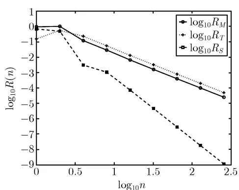
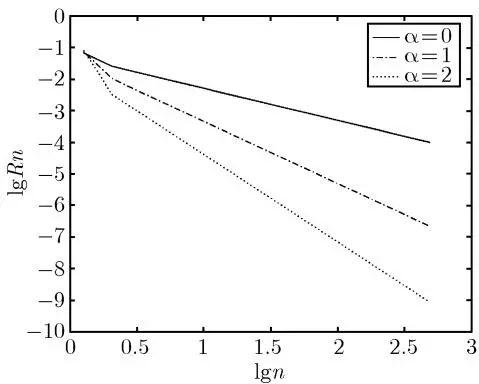
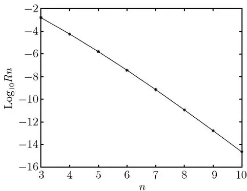
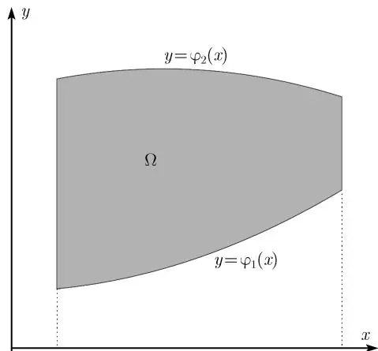
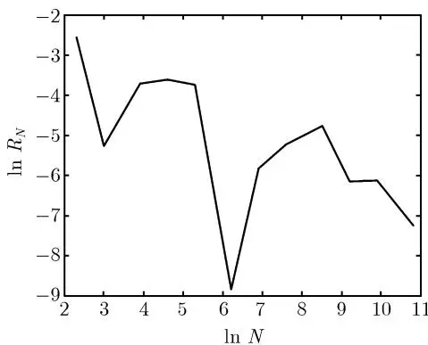

## 5.1 引言

本章我们研究各种求积分的数值方法. 主要讨论有限区间上的单重积分, 无穷区间上的积分以及高维数值积分的蒙特卡罗 (Monte Carlo) 方法.

由高等数学中的牛顿-莱布尼茨 (Newton-Leibniz) 公式, 若函数 $f(x)$ 在区间 $[a, b]$ 上连续, 则有积分

$$
I [ f ] = \int_{a}^{b} f (x) \mathrm{d} x = F (b) - F (a),
$$

其中 $F(x)$ 为 $f(x)$ 的原函数, 即 $F'(x) = f(x)$ . 由此可见, 只要求出原函数, 积分值即可求出. 但在许多实际问题中, $f(x)$ 的原函数很难求出, 甚至根本无法写出表达式. 例如 $f(x) = \mathrm{e}^{-x^{2}}$ , $\frac{\sin x}{x}$ 等. 另外, 有时函数是以在一系列离散点上的值的形式出现的, 如表 5-1 所示.

表 5-1 函数值表

<table><tr><td>x</td><td> $x_{1}$ </td><td> $x_{2}$ </td><td> $x_{3}$ </td><td> $\cdots$ </td><td> $x_{n}$ </td></tr><tr><td>f(x)</td><td> $f(x_{1})$ </td><td> $f(x_{2})$ </td><td> $f(x_{3})$ </td><td> $\cdots$ </td><td> $f(x_{n})$ </td></tr></table>

我们的目的就是合理利用上述信息, 构造适当的算法, 从而求出积分的近似值.

设在区间 $[a, b]$ (不妨先设 $a, b$ 为有限数) 上, $f(x) \approx P_n(x)$ , $P_n(x)$ 为某个较“简单”的函数, 则显然有

$$
\int_{a}^{b} f (x) \mathrm{d} x \approx \int_{a}^{b} P_{n} (x) \mathrm{d} x.\tag{5.1}
$$

误差为

$$
\begin{array}{l} \left| \int_{a}^{b} f (x) \mathrm{d} x - \int_{a}^{b} P_{n} (x) \mathrm{d} x \right| \leqslant \int_{a}^{b} | f (x) - P_{n} (x) | \mathrm{d} x \\ \quad \leqslant (b - a) \max_{a \leqslant x \leqslant b} | f (x) - P_{n} (x) | . \end{array}
$$

因此只要 $\max_{a\leqslant x\leqslant b}|f(x)-P_{n}(x)|\leqslant\varepsilon,$ 就有误差估计

$$
\left| \int_{a}^{b} f (x) \mathrm{d} x - \int_{a}^{b} P_{n} (x) \mathrm{d} x \right| \leqslant (b - a) \varepsilon .
$$

本章的数值求积分方法, 除了蒙特卡罗方法以外, 其他方法都可以看成是按照这一思路构造的.

## 5.2 几个常用积分公式及其复合公式

### 5.2.1 几个常用积分公式

对函数 $f(x)$ , 如果用它 $x = \frac{a + b}{2}$ 上的函数值近似代替, 即得中点公式

$$
\int_{a}^{b} f (x) \mathrm{d} x \approx \int_{a}^{b} f \left(\frac{a + b}{2}\right) \mathrm{d} x = (b - a) f \left(\frac{a + b}{2}\right).\tag{5.2}
$$

误差公式的推导如下. 设 $f(x) \in C^{2}[a, b]$ , 由泰勒公式,

$$
\begin{array}{c} f (x) = f \left(\frac{a + b}{2}\right) + f^{\prime} \left(\frac{a + b}{2}\right) \left(x - \frac{a + b}{2}\right) \\ + \frac{1}{2} f^{\prime \prime} (\eta (x)) \left(x - \frac{a + b}{2}\right)^{2}, \quad \eta (x) \in (a, b). \end{array}
$$

从而

$$
\begin{array}{l} \int_{a}^{b} f (x) \mathrm{d} x = \int_{a}^{b} f \left(\frac{a + b}{2}\right) \mathrm{d} x + f^{\prime} \left(\frac{a + b}{2}\right) \int_{a}^{b} \left(x - \frac{a + b}{2}\right) \mathrm{d} x \\ \qquad + \frac{1}{2} \int_{a}^{b} f^{\prime \prime} (\eta (x)) \left(x - \frac{a + b}{2}\right)^{2} \mathrm{d} x. \end{array}
$$

上面等式中积分 $\int_{a}^{b}\left(x - \frac{a + b}{2}\right)\mathrm{d}x = 0,$ 而利用积分第二中值定理，可得

$$
\begin{array}{c} \int_{a}^{b} f^{\prime \prime} (\eta (x)) \left(x - \frac{a + b}{2}\right)^{2} \mathrm{d} x = f^{\prime \prime} (\xi) \int_{a}^{b} \left(x - \frac{a + b}{2}\right)^{2} \mathrm{d} x \=frac{1}{12} (b - a)^{3} f^{\prime \prime} (\xi), \xi \in (a, b). \end{array}
$$

因此，

$$
\int_{a}^{b} f (x) \mathrm{d} x - (b - a) f \left(\frac{a + b}{2}\right) = \frac{1}{12} (b - a)^{3} f^{\prime \prime} (\xi).\tag{5.3}
$$

下面我们通过插值节点 $x_0 = a$ 和 $x_{1} = b$ 作线性插值函数 $L_{1}(x)$ , 利用 $f(x) \approx L_{1}(x)$ , 得梯形公式

$$
\begin{array}{c} \int_{a}^{b} f (x) \mathrm{d} x \approx \int_{a}^{b} L_{1} (x) \mathrm{d} x = \int_{a}^{b} \left[ \frac{x - b}{a - b} f (a) + \frac{x - a}{b - a} f (b) \right] \mathrm{d} x \=frac{1}{2} (b - a) [ f (a) + f (b) ]. \end{array}\tag{5.4}
$$

上面求积公式的右端值可看成是由线段 $x = a, x = b$ , 过点 $(a, f(a)), (b, f(b))$ 的直线以及 $x$ 轴围成的梯形面积. 如果 $f(x) \in C^2[a, b]$ , 则由线性插值函数的误差公式 (见第 3 章) 以及积

分中值定理得

$$
\begin{array}{l} \int_{a}^{b} f (x) \mathrm{d} x - \frac{1}{2} (b - a) [ f (a) + f (b) ] \=int_{a}^{b} f (x) \mathrm{d} x - \int_{a}^{b} L_{1} (x) \mathrm{d} x \=frac{1}{2} \int_{a}^{b} f^{\prime \prime} (\eta (x)) (x - a) (x - b) \mathrm{d} x \=- \frac{1}{12} (b - a)^{3} f^{\prime \prime} (\xi), \xi \in (a, b). \end{array}\tag{5.5}
$$

若 $f(x)$ 用通过节点 $x_0 = a, x_1 = \frac{a + b}{2}, x_2 = b$ 的二次插值多项式 $L_{2}(x)$ 代替，

$$
\begin{array}{l} {f (x) \approx L_{2} (x)} \\ {\qquad = \frac{(x - x_{1}) (x - x_{2})}{(x_{0} - x_{1}) (x_{0} - x_{2})} f (x_{0}) + \frac{(x - x_{0}) (x - x_{2})}{(x_{1} - x_{0}) (x_{1} - x_{2})} f (x_{1}) + \frac{(x - x_{0}) (x - x_{1})}{(x_{2} - x_{0}) (x_{2} - x_{1})} f (x_{2}),} \end{array}
$$

则得辛普森 (Simpson) 公式, 或称抛物型公式

$$
\int_{a}^{b} f (x) \mathrm{d} x \approx \int_{a}^{b} L_{2} (x) \mathrm{d} x = \frac{1}{6} (b - a) \left[ f (a) + 4 f \left(\frac{a + b}{2}\right) + f (b) \right].\tag{5.6}
$$

可以证明：若 $f(x)\in C^4 [a,b]$ ，则有误差公式

$$
\int_{a}^{b} f (x) \mathrm{d} x - \frac{1}{6} (b - a) \left[ f (a) + 4 f \left(\frac{a + b}{2}\right) + f (b) \right] = - \frac{(b - a)^{5}}{2880} f^{(4)} (\xi), \quad \xi \in (a, b).\tag{5.7}
$$

一般地, 若已知函数 $f(x)$ 在区间 $[a,b]$ 内节点 $x_{0},x_{1},\cdots,x_{n}$ 上的值 $f(x_{0}),f(x_{1}),\cdots,f(x_{n})$ , 则称形如

$$
\int_{a}^{b} f (x) \mathrm{d} x \approx \sum_{i = 0}^{n} \omega_{i} f (x_{i})\tag{5.8}
$$

的式子为求积公式, 其中 $x_{i}$ 称为求积节点, $\omega_{i}$ 称为求积系数. 求积节点及求积系数不依赖于被积函数 $f(x)$ 的具体形式.

通常记求积公式 (5.8) 的右端为 $Q[f]$ , 即

$$
Q [ f ] = \sum_{i = 0}^{n} \omega_{i} f (x_{i}),\tag{5.9}
$$

而误差记为 (也称为余项)

$$
R [ f ] = I [ f ] - Q [ f ].
$$

### 5.2.2 代数精度

由上面的讨论可知, 求积公式有许多种, 为了判别各种公式的优劣, 需要一个标准, 为此, 我们提出了代数精度的概念.


如果对所有次数小于等于 m 的多项式 $f(x)$ ，等式

$$
\int_{a}^{b} f (x) \mathrm{d} x = \sum_{i = 0}^{n} \omega_{i} f (x_{i})\tag{5.10}
$$

成立, 但对某个次数为 $m + 1$ 的多项式 $f(x)$ , (5.10) 不精确成立, 则称求积公式 (5.8) 的代数精度为 $m$ 次.


我们称一个数值积分公式不精确成立是指, 等式两边不相等, 即等式不成立, 但是我们可以用这个不成立的公式来近似计算积分. 显然一个求积公式的代数精度为 m 次的等价条件为: 式 (5.10) 对 $f(x)=1, x, \cdots, x^{m}$ 精确成立, 但对于 $f(x)=x^{m+1}$ 等式不成立.

代数精度是判别求积公式好坏的标准之一. 例如考虑求积公式 (5.2), 由于误差为

$$
R [ f ] = \frac{1}{12} (b - a)^{3} f^{\prime \prime} (\xi), \quad \xi \in (a, b),\tag{5.11}
$$

因此当 $f(x)$ 的次数为零次或一次多项式时, $R[f] = 0$ . 当 $f(x)$ 取二次多项式时 $R[f] \neq 0$ (例如 $f(x) = x^2$ ), 从而由代数精度定义可知求积公式 (5.2) 的代数精度为 1 次. 同理可证求积公式 (5.4) 和 (5.6) 的代数精度分别为 1 次和 3 次.

例 5.2.2 试确定系数 $\omega_{i}(i=0,1,2)$ ，使求积公式

$$
\int_{- 1}^{1} f (x) \mathrm{d} x \approx \omega_{0} f (- 1) + \omega_{1} f (0) + \omega_{2} f (1)
$$

有尽可能高的代数精度, 并求出此求积公式的代数精度.

解：分别令 $f(x)=1, x, x^{2}$ ，代入求积公式使之精确成立，则可得线性方程组

$$
\left\{\begin{array}{c} \omega_{0} + \omega_{1} + \omega_{2} = \int_{1}^{1} 1 \mathrm{d} x = 2 \-omega_{0} + \omega_{2} = \int_{1}^{1} x \mathrm{d} x = 0 \\ \omega_{0} + \omega_{2} = \int_{- 1}^{1} x^{2} \mathrm{d} x = \frac{2}{3}. \end{array} \right.
$$

解得 $\omega_0 = \omega_2 = \frac{1}{3},\omega_1 = \frac{4}{3}$ 从而求积公式为

$$
\int_{- 1}^{1} f (x) \mathrm{d} x \approx \frac{1}{3} f (- 1) + \frac{4}{3} f (0) + \frac{1}{3} f (1).
$$

为确定上述求积公式的代数精度, 将 $f(x) = x^3$ 代入, 此时左边等于右边; 但当将 $f(x) = x^4$ 代入时, 左边 $= \frac{2}{5}$ , 右边 $= \frac{2}{3}$ , 因此左右不等, 即得求积公式的代数精度为 3.

上面例 5.2.2 可推广为一般的问题：已知节点 $x_{i}(i=0,1,\cdots,n)$ 需确定求积系数，使其代数精度最高。类似地，此问题最后化为关于求积系数 $\omega_{0}, \omega_{1}, \cdots, \omega_{n}$ 的线性方程组。

设 $H = b - a$ ，由误差公式可知当 $H$ 很小时，求积公式(5.2)，(5.4)，(5.6)的误差分别为 $O(H^{3}),O(H^{3}),O(H^{5})$ .然而在通常情况下，积分区间 $[a,b]$ 的长度 $b - a$ 不是非常小，因此为了确保计算精度，通常采用复合求积公式

### 5.2.3 积分公式的复合

复合积分, 就是将积分区间分为若干份, 在每一个 “小区间” 上用低阶求积公式 (5.2), (5.4) 或 (5.6) 进行计算, 再将计算值相加即得原积分的近似值. 具体过程如下.

将积分区间 $[a,b]$ 分为 n 等分, 记步长 $h=\frac{b-a}{n}$ , 节点为 $x_{i}=a+ih(i=0,1,\cdots,n)$ , 并记 $x_{i+\frac{1}{2}}=\frac{1}{2}(x_{i}+x_{i+1})$ . 由定积分性质,

$$
\int_{a}^{b} f (x) \mathrm{d} x = \sum_{i = 0}^{n - 1} \int_{x_{i}}^{x_{i + 1}} f (x) \mathrm{d} x,\tag{5.12}
$$

对于上面每个区间 $[x_i, x_{i+1}]$ 上的积分 $\int_{x_i}^{x_{i+1}} f(x) \mathrm{d}x$ ，由于此时区间长度为 $x_{i+1} - x_i = h$ ，因此当 $n$ 很大时， $h$ 是一个很小的数。如果在每一个区间上采用求积公式 (5.2)，(5.4) 或 (5.6)，即得相应的复合求积公式。

## 复合中点公式

由公式 (5.2) 及 (5.12),

$$
\int_{a}^{b} f (x) \mathrm{d} x \approx \sum_{i = 0}^{n - 1} h f \left(x_{i + \frac{1}{2}}\right) \triangleq M_{n}.\tag{5.13}
$$

基于复合中点公式的 Matlab 计算程序如下:

```matlab
function I = fmid(fun, a, b, n)
    h = (b - a) / n;
    x = linspace(a + h / 2, b - h / 2, n);
    y = feval(fun, x);
    I = h * sum(y);
```

实际计算时, 还需编写函数 fun 的程序.

复合梯形公式

由公式 (5.4) 及 (5.12),

$$
\begin{array}{c} \int_{a}^{b} f (x) \mathrm{d} x \approx \sum_{i = 0}^{n - 1} \frac{h}{2} \left[ f (x_{i}) + f (x_{i + 1}) \right] \=frac{h}{2} \left[ f (a) + 2 \sum_{i = 1}^{n - 1} f (x_{i}) + f (b) \right] \triangleq T_{n}. \end{array}\tag{5.14}
$$

基于复合梯形公式的 Matlab 计算程序如下:

```matlab
function I = ftrapz(fun, a, b, n)
    h = (b - a) / n;
    x = linspace(a, b, n + 1);
    y = feval(fun, x);
    I = h * (0.5 * y(1) + sum(y(2:n)) + 0.5 * y(n + 1));
```

## 复合辛普森公式

由公式 (5.6) 及 (5.12),

$$
\begin{array}{c} \int_{a}^{b} f (x) \mathrm{d} x \approx \sum_{i = 0}^{n - 1} \frac{h}{6} \left[ f (x_{i}) + 4 f (x_{i + \frac{1}{2}}) + f (x_{i + 1}) \right] \=frac{h}{6} \left[ f (a) + 4 \sum_{i = 0}^{n - 1} f (x_{i + \frac{1}{2}}) + 2 \sum_{i = 1}^{n - 1} f (x_{i}) + f (b) \right] \triangleq S_{n}. \end{array}
$$

基于复合辛普森公式的 Matlab 计算程序如下:

```matlab
function I = fsimpson(fun, a, b, n)
    h = (b - a) / n;
    x = linspace(a, b, 2 * n + 1);
    y = feval(fun, x);
    I = (h / 6) * (y(1) + 2 * sum(y(3:2:2 * n - 1)) + 4 * sum(y(2:2:2 * n)) + y(2 * n + 1));
```

为分析上述复合求积公式 $M_{n}, T_{n}, S_{n}$ 的误差, 先给出一个定理.


设 $g(y) \in C[a, b]$ , $a < y_{0} < y_{1} < \cdots < y_{m} = b$ , $\omega_{i} \geqslant 0$ , 则存在 $\eta \in (a, b)$ , 使得

$$
\sum_{i = 0}^{m} \omega_{i} g (y_{i}) = g (\eta) \sum_{i = 0}^{m} \omega_{i}.
$$


证：设

$$
\begin{array}{l} {g^{*} = \max_{0 \leqslant i \leqslant m} g (y_{i}) = g (y^{*}),} \\ {g_{*} = \min_{0 \leqslant i \leqslant m} g (y_{i}) = g (y_{*}),} \end{array}
$$

其中 $y^{*}, y_{*} \in (a, b)$ . 则有

$$
g (y_{*}) \sum_{i = 0}^{m} \omega_{i} \leqslant \sum_{i = 0}^{m} \omega_{i} g (y_{i}) \leqslant g (y^{*}) \sum_{i = 0}^{m} \omega_{i}.
$$

利用连续函数的中值定理, 存在 $\eta \in (a, b)$ , 满足:

$$
\sum_{i = 0}^{m} \omega_{i} g (y_{i}) = g (\eta) \sum_{i = 0}^{m} \omega_{i}.
$$

下面设 $f(x) \in C^2[a, b]$ , 推导复合中点公式 (5.13) 的误差. 首先由 (5.12), (5.13) 及误差公式 (5.3), 得

$$
\begin{array}{l} R_{M} = \int_{a}^{b} f (x) \mathrm{d} x - M_{n} = \sum_{i = 0}^{n - 1} \int_{x_{i}}^{x_{i + 1}} f (x) \mathrm{d} x - \sum_{i = 0}^{n - 1} h f (x_{i + \frac{1}{2}}) \=sum_{i = 0}^{n - 1} \frac{1}{12} h^{3} f^{\prime \prime} (\xi). \end{array}
$$

利用定理 5.2.3, 便有

$$
\int_{a}^{b} f (x) \mathrm{d} x - M_{n} = \frac{1}{12} n h^{3} f^{\prime \prime} (\eta) = \frac{b - a}{12} h^{2} f^{\prime \prime} (\eta).\tag{5.15}
$$

如果 $\left|f''(x)\right|\leqslant M_{2}, x\in[a,b]$ ，则有结论：

$$
\left| \int_{a}^{b} f (x) \mathrm{d} x - M_{n} \right| \leqslant \frac{1}{12} (b - a) M_{2} h^{2}.\tag{5.16}
$$

同理可推得复合梯形公式、复合辛普森公式的误差估计：

$$
R_{T} = \int_{a}^{b} f (x) \mathrm{d} x - T_{n} = - \frac{1}{12} (b - a) h^{2} f^{\prime \prime} (\eta), \quad \eta \in (a, b),\tag{5.17}
$$

$$
R_{S} = \int_{a}^{b} f (x) \mathrm{d} x - S_{n} = - \frac{1}{2880} (b - a) h^{4} f^{(4)} (\eta), \quad \eta \in (a, b).\tag{5.18}
$$

例 5.2.4 分别用梯形公式和辛普森公式计算积分 $\int_{0}^{1} e^{-x} dx$ ，并估计误差.

解：记 $a = 0, b = 1, f(x) = \mathrm{e}^{-x}$ . 分别用梯形公式 (5.4) 及辛普森公式 (5.6) 计算得

$$
T = \frac{b - a}{2} [ f (a) + f (b) ] = \frac{1 - 0}{2} [ \mathrm{e}^{0} + \mathrm{e}^{- 1} ] = 0.6859,
$$

$$
S = \frac{b - a}{6} \left[ f (a) + 4 f \left(\frac{a + b}{2}\right) + f (b) \right] = \frac{1 - 0}{6} \left[ \mathrm{e}^{0} + 4 \mathrm{e}^{- 0.5} + \mathrm{e}^{- 1} \right] = 0.6323.
$$

与积分的精确值 $I = 0.6321 \cdots$ 相比较知, 两者的误差分别为 0.0518 及 0.0002.

[例5.2](ch05.md).5 设 $f(x) = \frac{\sin x}{x}$ , $f(x)$ 在9个节点处的值由表5-2给出, 分别用复合梯形公式和复合辛普森公式计算积分 $I = \int_{0}^{1}\frac{\sin x}{x}\mathrm{d}x$ .

表 5-2 函数值表

<table><tr><td>x</td><td>0</td><td> $\frac{1}{8}$ </td><td> $\frac{1}{4}$ </td><td> $\frac{3}{8}$ </td><td></td></tr><tr><td>f(x)</td><td>1</td><td>0.997 397 8</td><td>0.989 615 8</td><td>0.976 726 7</td><td></td></tr><tr><td>x</td><td> $\frac{1}{2}$ </td><td> $\frac{5}{8}$ </td><td> $\frac{3}{4}$ </td><td> $\frac{7}{8}$ </td><td>1</td></tr><tr><td>f(x)</td><td>0.953 851 0</td><td>0.935 155 6</td><td>0.908 851 6</td><td>0.877 192 5</td><td>0.842 470 9</td></tr></table>

解：将积分区间 $[0,1]$ 八等分，由复合梯形公式(5.14)（此时 $h = \frac{1}{8}$ ）计算得

$$
\begin{array}{l} T_{8} = \frac{1}{16} \left\{f (0) + 2 \left[ f \left(\frac{1}{8}\right) + f \left(\frac{1}{4}\right) + f \left(\frac{3}{8}\right) + f \left(\frac{1}{2}\right) \right. \right. \\ \left. \quad + f \left(\frac{5}{8}\right) + f \left(\frac{3}{4}\right) + f \left(\frac{7}{8}\right) \right] + f (1) \Bigg \} \=0.9456909. \end{array}
$$

如果将积分区间 $[0,1]$ 四等分，由复合辛普森公式(5.15)（此时 $h = \frac{1}{4}$ ）计算得

$$
\begin{array}{l} S_{4} = \frac{1}{24} \left\{f (0) + 4 \left[ f \left(\frac{1}{8}\right) + f \left(\frac{3}{8}\right) + f \left(\frac{5}{8}\right) + f \left(\frac{7}{8}\right) \right] \right. \\ \left. + 2 \left[ f \left(\frac{1}{4}\right) + f \left(\frac{1}{2}\right) + f \left(\frac{3}{4}\right) \right] + f (1) \right\} \=0.9460832. \end{array}
$$

比较计算结果 $T_{8}$ 和 $S_{4}$ ，由于它们都用到了 9 个节点上的函数值，因而计算量可以认为是相同的，然而计算精度却相差很大。与积分的精确值 $I = 0.946\ 083\ 1\cdots$ 相比较，复合梯形公式只有两位有效数字，而用复合辛普森公式却有六位有效数字！

从误差估计公式 (5.17) 及 (5.18) 可看出, 若被积函数 $f(x)$ 具有 4 阶连续导数, 则复合梯形公式及复合辛普森公式的误差数量级分别为 $O(h^2)$ 及 $O(h^4)$ . 由于 $O(h^2) \gg O(h^4)$ , 由此可见, 对于充分光滑的函数, 复合辛普森公式的计算精度要比复合梯形公式高.

例 5.2.6 分别使用复合中点公式 (5.13)、复合梯形公式 (5.14) 和复合辛普森公式计算下列积分值，

$$
I = \int_{0}^{2 \pi} x \mathrm{e}^{- x} \cos (2 x) \mathrm{d} x.
$$

并分别取 $n=2^{k}(k=0,1,\cdots,8)$ ，比较三种不同算法的收敛速度。积分的精确值为

$$
I = \frac{3 (\mathrm{e}^{- 2 \pi} - 1) - 10 \pi \mathrm{e}^{- 2 \pi}}{25} \approx - 0.122122499 \dots .
$$

解：由复合中点公式、复合梯形公式、复合辛普森公式计算，并分别记 $R_{M}, R_{T}, R_{S}$ 为三者计算的误差，则计算结果如表5-3所示.

表 5-3 三种不同方法的计算结果

<table><tr><td>n</td><td> $R_M$ </td><td> $R_T$ </td><td> $R_S$ </td></tr><tr><td>1</td><td>0.975 1</td><td>0.158 9</td><td>0.703 0</td></tr><tr><td>2</td><td>1.037 0</td><td>0.567 0</td><td>0.502 1</td></tr><tr><td>4</td><td>0.122 2</td><td>0.234 8</td><td> $3.139 \times 10^{-3}$ </td></tr><tr><td>8</td><td> $2.980 \times 10^{-2}$ </td><td> $5.635 \times 10^{-2}$ </td><td> $1.085 \times 10^{-3}$ </td></tr><tr><td>16</td><td> $6.748 \times 10^{-3}$ </td><td> $1.327 \times 10^{-2}$ </td><td> $7.381 \times 10^{-5}$ </td></tr><tr><td>32</td><td> $1.639 \times 10^{-3}$ </td><td> $3.263 \times 10^{-3}$ </td><td> $4.682 \times 10^{-6}$ </td></tr><tr><td>64</td><td> $4.066 \times 10^{-4}$ </td><td> $8.123 \times 10^{-4}$ </td><td> $2.936 \times 10^{-7}$ </td></tr><tr><td>128</td><td> $1.014 \times 10^{-4}$ </td><td> $2.028 \times 10^{-4}$ </td><td> $1.836 \times 10^{-8}$ </td></tr><tr><td>256</td><td> $2.535 \times 10^{-5}$ </td><td> $5.070 \times 10^{-5}$ </td><td> $1.148 \times 10^{-9}$ </td></tr></table>

为更清楚地比较三者的收敛速度, 将计算结果画成图 5-1, 其中横坐标为 $\log_{10} n$ , 纵坐标为 $\log_{10} R(n)$ . 从图中可看出三种计算公式的误差分别为三条不同折线.

$$
R_{M} \approx C h^{2}, R_{T} \approx C h^{2}, R_{S} \approx C h^{4},
$$



图 5-1 三种不同方法的收敛速度的比较


与理论误差估计相当吻合.

假设被积函数 $f(x)$ 不满足两阶连续可导或四阶连续可导的条件, 此时误差估计公式 (5.15), (5.17) 及 (5.18) 无法得到. 但是我们可以证明, 只要被积函数 $f(x)$ 在区间 $[a, b]$ 连续, 则当 $h \to 0$ (或 $n \to \infty$ ) 时, 由定积分的定义, 仍可得到收敛性结果, 即当 $h \to 0$ 时,

$$
M_{n} \to I, \quad T_{n} \to I, \quad S_{n} \to I.
$$

对于给定的节点 $a = x_{0} < x_{1} < \cdots < x_{n} = b$ 及相应的函数值 $f(x_{i})(i = 0, 1, \cdots, n)$ ，分别定义区间 $[a, b]$ 上的三个分段函数 $f_{n}^{(0)}(x), f_{n}^{(1)}(x), f_{n}^{(2)}(x)$ ，当 $x \in [x_{i}, x_{i+1}] (i = 1, 3, \cdots, n)$ 时，

$$
\begin{array}{l} f_{n}^{(0)} (x) = f (x_{i - \frac{1}{2}}), \\ f_{n}^{(1)} (x) = \frac{x - x_{i}}{x_{i - 1} - x_{i}} f (x_{i - 1}) + \frac{x - x_{i - 1}}{x_{i} - x_{i - 1}} f (x_{i}), \\ f_{n}^{(2)} (x) = \frac{(x - x_{i - \frac{1}{2}}) (x - x_{i})}{(x_{i - 1} - x_{i - \frac{1}{2}}) (x_{i - 1} - x_{i})} f (x_{i - 1}) + \frac{(x - x_{i - 1}) (x - x_{i})}{(x_{i - \frac{1}{2}} - x_{i - 1}) (x_{i - \frac{1}{2}} - x_{i})} f (x_{i - \frac{1}{2}}) \\ \qquad + \frac{(x - x_{i - \frac{1}{2}}) (x - x_{i - 1})}{(x_{i} - x_{i - \frac{1}{2}}) (x_{i} - x_{i - 1})} f (x_{i}), \end{array}
$$

则三个函数都可看成是 $f(x)$ 的某种逼近, 故复合中点公式、复合梯形公式和复合辛普森公式可看成被积函数 $f(x)$ 用 $f_{n}^{(j)}(x) (j = 0,1,2)$ 代替后的近似积分值, 即

$$
\begin{array}{l} \int_{a}^{b} f (x) \mathrm{d} x \approx \int_{a}^{b} f_{n}^{(0)} (x) \mathrm{d} x = M_{n}, \quad j = 0, \\ \int_{a}^{b} f (x) \mathrm{d} x \approx \int_{a}^{b} f_{n}^{(1)} (x) \mathrm{d} x = T_{n}, \quad j = 1, \\ \int_{a}^{b} f (x) \mathrm{d} x \approx \int_{a}^{b} f_{n}^{(2)} (x) \mathrm{d} x = S_{n}. \quad j = 2. \end{array}
$$

易证, 当 $f(x)$ 为连续函数时, $f_{n}^{(j)}(x) \to f(x)(n \to \infty)$ . 从而有

$$
\int_{a}^{b} f_{n}^{(j)} (x) \mathrm{d} x \rightarrow \int_{a}^{b} f (x) \mathrm{d} x, \quad n \rightarrow \infty .
$$

下面以公式 (5.14) 为例讨论复合求积公式的稳定性, 即积分值误差对于函数值误差的敏感程度.

设 $f(x)$ 在节点 $x_{i}$ 处的精确值为 $f(x_{i})$ ，而实际得到的值为 $\bar{f}(x_{i})$ 。由此得到节点 $x_{i}$ 处的误差为

$$
\varepsilon_{i} = f (x_{i}) - \bar{f} (x_{i}).
$$

记由数值 $f(x_{i})$ 及公式(5.14)计算所得的值为 $T_{n}$ ，而由 $\bar{f}(x_i)$ 及公式(5.14)计算所得的值为 $\bar{T}_n$ 。则可有

$$
T_{n} - \bar{T}_{n} = \frac{h}{2} \left(\varepsilon_{0} + 2 \sum_{i = 1}^{n - 1} \varepsilon_{i} + \varepsilon_{n}\right).
$$

设 $\varepsilon = \max_{0\leqslant i\leqslant n}|\varepsilon_i|$ ，则

$$
\left| T_{n} - \bar{T}_{n} \right| \leqslant \frac{h}{2} (\varepsilon + 2 (n - 1) \varepsilon + \varepsilon) = (b - a) \varepsilon .
$$

这表明复合梯形公式 (5.14) 是稳定的. 同理可证复合中点公式以及复合辛普森公式也是稳定的.

## 5.3 变步长方法与外推加速技术

上节给出的复合中点公式、梯形公式以及辛普森公式都是有效的求积方法, 步长 h 越小, 计算精度越高. 但在实际运用上述求积公式进行计算时须事先选取一个合适的步长 h, 如果步长取得太大, 计算精度就难以保证, 而如果步长取得太小, 则会增加不必要的计算开销. 因此在给定计算精度的情形下, 往往通过不断调整步长的方式进行计算.

### 5.3.1 变步长梯形法

在实际计算中往往会采用让步长逐次折半的方式, 反复使用复合求积公式进行计算, 直至相邻两次计算结果之差的绝对值小于给定的计算精度为止. 这种方法即称为变步长算法. 下面以变步长的梯形公式 (5.14) 加以说明.

由求积公式误差估计 (5.17),

$$
I - T_{n} = - \frac{1}{12} (b - a) h^{2} f^{\prime \prime} (\eta_{1}), \quad \eta_{1} \in (a, b),
$$

故

$$
I - T_{2 n} = - \frac{1}{12} (b - a) \left(\frac{h}{2}\right)^{2} f^{\prime \prime} (\eta_{2}), \quad \eta_{2} \in (a, b).
$$

若 $f''(\eta_1) \approx f''(\eta_2)$ , 则有

$$
I - T_{2 n} \approx \frac{1}{4} (I - T_{n}),
$$

以及

$$
I - T_{2 n} \approx \frac{1}{3} (T_{2 n} - T_{n}).\tag{5.19}
$$

由上式可知, 只要以步长分别为 $h$ 及 $\frac{h}{2}$ 的积分计算值 $T_{n}$ 和 $T_{2n}$ 充分接近, 就能保证最后一次计算值 $T_{2n}$ 与积分精确值的误差很小, 且误差约为 $\frac{1}{3}(T_{2n} - T_n)$ . 可将以上的分析过程归纳成算法 5.3.1.

算法 5.3.1 (区间折半法)

(1) 取初始步长 h = b - a;

(2) 计算 $T_{n}$ ;

(3) 取步长 $h_{1}=\frac{h}{2}$ ，计算出相应的积分值 $T_{2n}$ ;

(4) 若条件 $|T_{2n} - T_n| \leqslant \varepsilon$ 满足, 则取 $T_{2n}$ 为最后积分计算的近似值, 否则让步长折半, 回到第 (3) 步.

在计算 $T_{2n}$ 时, 为避免一些重复的计算, 提高计算效率, 可以采用下面的方法. 由于

$$
T_{n} = \frac{h}{2} \left[ f (a) + 2 \sum_{i = 1}^{n - 1} f (x_{i}) + f (b) \right],
$$

故

$$
\begin{array}{l} T_{2 n} = \frac{h}{4} \sum_{i = 0}^{n - 1} \left[ f (x_{i}) + 2 f \left(x_{i + \frac{1}{2}}\right) + f (x_{i + 1}) \right] \=frac{h}{4} \sum_{i = 0}^{n - 1} [ f (x_{i}) + f (x_{i + 1}) ] + \frac{h}{2} \sum_{i = 0}^{n - 1} f \left(x_{i + \frac{1}{2}}\right) \=frac{1}{2} T_{n} + \frac{h}{2} \sum_{i = 0}^{n - 1} f \left(x_{i + \frac{1}{2}}\right). \end{array}\tag{5.20}
$$

上面最后一个等式中第二部分为新增加的计算量, 而第一部分为上一次计算值的 1/2, 可不必再重复计算.

例 5.3.2 用变步长梯形公式计算积分 $I=\int_{0}^{1}\frac{\sin x}{x}dx$ 的近似值, 要求满足精度:

$$
\left| T_{2 n} - T_{n} \right| \leqslant 10^{- 7}.
$$

解：若补充定义函数 $f(x) = \frac{\sin x}{x}$ 在 $x = 0$ 处的值 $f(0) = 1$ ，则 $f(x)$ 为区间[0,1]上的光滑函数，因此复合梯形公式的误差估计式(5.17)成立。在区间[0,1]上直接用梯形公式计算得

$$
T_{2} = \frac{1}{2} T_{1} + \frac{1}{2} f \left(\frac{1}{2}\right) = 0.9379933.
$$

将区间 $[0,1]$ 分成二等份, 利用关系式 $(5.20)$ 计算得

$$
T_{4} = \frac{1}{2} T_{2} + \frac{1}{2} \left[ f \left(\frac{1}{4}\right) + f \left(\frac{3}{4}\right) \right] = 0.9445135.
$$

如此计算下去, 可得表 5-4 中的结果 (k 代表积分近似值的计算次数, $n = 2^{k}$ 表示区间等分次数).

表 5-4 区间折半法的计算结果

<table><tr><td>k</td><td> $T_n$ </td><td>k</td><td> $T_n$ </td></tr><tr><td>0</td><td>0.920 735 5</td><td>6</td><td>0.946 076 9</td></tr><tr><td>1</td><td>0.939 793 3</td><td>7</td><td>0.946 081 5</td></tr><tr><td>2</td><td>0.944 513 5</td><td>8</td><td>0.946 082 7</td></tr><tr><td>3</td><td>0.945 690 9</td><td>9</td><td>0.946 083 0</td></tr><tr><td>4</td><td>0.945 985 0</td><td>10</td><td>0.946 083 0</td></tr><tr><td>5</td><td>0.946 059 6</td><td></td><td></td></tr></table>

由此可见, 将积分区间 $[0,1]$ 等分了 $2^{10}$ 份时, 复合梯形公式的计算值才满足给定的计算精度 $\varepsilon = 10^{-7}$ (积分的精确值为 $0.946\ 083\ 1\cdots$ ).

变步长梯形方法的优点是算法简单, 编程容易; 缺点是收敛速度较慢. 可以利用下节将要介绍的加速技术进行改进.

### 5.3.2 外推加速技术与龙贝格求积方法

本节我们介绍 Richardson 外推加速收敛技术. 其实质是利用不同步长的复合梯形公式以及外推技术加速收敛速度. 通常也称为龙贝格 (Romberg) 求积方法. 为此, 我们先给出一个外推技术的理论基础 (证明过程略).


设 $f(x) \in C^{2k+2}[a, b]$ (k 为非负整数), $a_{0} = \int_{a}^{b} f(x) \, dx$ , $h = \frac{b - a}{n}$ . 则存在伯努利 (Bernoulli) 数 $B_{2i}$ ( $i = 1, 2, \cdots, 2k + 2$ ), 使得下面关系成立:

$$
T_{n} = a_{0} + \sum_{i = 1}^{k} \frac{B_{2 i}}{(2 i) !} h^{2 i} \left[ f^{(2 i - 1)} (b) - f^{(2 i - 1)} (a) \right] + \frac{B_{2 k + 2}}{(2 k + 2) !} (b - a) h^{2 k + 2} f^{(2 k + 2)} (\eta), \quad \eta \in (a, b).
$$


由上述定理可知复合梯形公式的误差为

$$
T_{n} - I = a_{1} h^{2} + a_{2} h^{4} + \dots + a_{k} h^{2 k} + R_{k + 1} (h),\tag{5.21}
$$

其中 $a_{i}(i=1,2,\cdots,k)$ 是与 h 无关的常数, 高阶余项 $R_{k+1}(h)$ 满足

$$
\left| R_{k + 1} (h) \right| \leqslant C_{k + 1} h^{2 k + 2},
$$

$C_{k+1}$ 也是与 h 无关的常数. 由此可见, $T_{n}-I=O(h^{2}), h\to0$ .

在式 (5.21) 中以 $\frac{h}{2}$ 代替 $h$ , 得

$$
T_{2 n} - I = a_{1} \left(\frac{h}{2}\right)^{2} + a_{2} \left(\frac{h}{2}\right)^{4} + \dots + a_{k} \left(\frac{h}{2}\right)^{2 k} + R_{k + 1} \left(\frac{h}{2}\right),
$$

再将 (5.21) 式的两边同时乘以 $\frac{1}{4}$ , 与上式相减, 经整理可得

$$
T_{n}^{(2)} - I = \tilde{a}_{2} h^{4} + \tilde{a}_{3} h^{6} + \dots + \tilde{a}_{k} h^{2 k} + \tilde{R}_{k + 1} (h),
$$

其中

$$
T_{n}^{(2)} = \frac{T_{2 n} - 2^{- 2} T_{n}}{1 - 2^{- 2}}, \quad \tilde{a}_{i} = \frac{2^{- 2 i} - 2^{- 2}}{1 - 2^{- 2}} a_{i}, \quad \tilde{R}_{k + 1} (h) = \frac{R_{k + 1} (\frac{h}{2}) - 2^{- 2} R_{k + 1} (h)}{1 - 2^{- 2}}.
$$

由此可见, $T_{n}$ 的计算精度为 $O(h^{2})$ , 而 $T_{n}^{(2)}$ 的计算精度为 $O(h^{4})$ . 一般地, 记 $T_{n} \equiv T_{n}^{(1)}$ , 若定义

$$
T_{n}^{(m)} = \frac{T_{2 n}^{(m - 1)} - 2^{- 2 m} T_{n}^{(m - 1)}}{1 - 2^{- 2 m}},\tag{5.22}
$$

则可证明 $T_{n}^{(m)}(m \leqslant n)$ 的计算精度为 $O(h^{2m})$ . 上述由公式 (5.22) 确定的计算过程即称为龙贝格方法.

例 5.3.4 用龙贝格方法求积分 $I=\int_{0}^{1}\frac{\sin x}{x}dx$ ，要求计算精度为 $\varepsilon=10^{-7}$ .

解：按照公式 (5.22) 及不同的步长 (初始步长 $h = 1$ ), 计算结果如表 5-5 所示. 其中 $i$ 表示积分区间 $[0,1]$ 的等分次数, 节点数为 $n = 2^i + 1$ .

表 5-5 龙贝格方法计算结果

<table><tr><td>i</td><td> $T_n^{(1)}$ </td><td> $T_n^{(2)}$ </td><td> $T_n^{(3)}$ </td><td> $T_n^{(4)}$ </td></tr><tr><td>0</td><td>0.920 735 5</td><td></td><td></td><td></td></tr><tr><td>1</td><td>0.939 793 3</td><td>0.946 145 9</td><td></td><td></td></tr><tr><td>2</td><td>0.944 513 5</td><td>0.946 086 9</td><td>0.946 083 0</td><td></td></tr><tr><td>3</td><td>0.945 690 9</td><td>0.946 083 4</td><td>0.946 083 1</td><td>0.946 083 1</td></tr></table>

上述龙贝格方法最后采用的步长为 $h = 2^{-3}$ 。而[例5.3](ch05.md).1的普通变步长方法的步长为 $h = 2^{-10}$ ，计算量约为龙贝格方法的 $2^7$ 倍，而两者的计算精度大致相同。因此龙贝格加速收敛的效果是非常明显的。

## 5.4 牛顿－科茨公式

中点公式、梯形公式及辛普森公式可分别看成是 $f(x)$ 用常数、线性插值函数和抛物型插值函数代替再积分所得。若将此想法进一步推广，将 $f(x)$ 用 $n + 1$ 个等距节点上的 $n$ 次拉格朗日插值多项式代替，即得所谓的牛顿-科茨 (Newton-Cotes) 公式。具体推导过程如下。

设 $x_{i} = a + ih, h = \frac{b - a}{n}$ , 作 $f(x)$ 的 $n$ 次拉格朗日插值多项式 $L_{n}(x)$ . 为方便起见, 令 $x = a + th, t \in [0, n]$ , 则 $L_{n}(x)$ 可表示为

$$
\begin{array}{l} L_{n} (x) = \sum_{i = 0}^{n} \left(\prod_{j = 0, j \neq i}^{n} \frac{x - x_{j}}{x_{i} - x_{j}}\right) f (x_{i}) \\ \qquad = \sum_{i = 0}^{n} \left(\prod_{j = 0, j \neq i}^{n} \frac{t - j}{i - j}\right) f (x_{i}) \\ \qquad = \sum_{i = 0}^{n} \frac{(- 1)^{n - i}}{i ! (n - i) !} \prod_{j = 0, j \neq i}^{n} (t - j) f (x_{i}), \end{array}
$$

从而

$$
\begin{array}{l} \int_{a}^{b} f (x) \mathrm{d} x \approx \int_{a}^{b} L_{n} (x) \mathrm{d} x \\ \qquad = (b - a) \sum_{i = 0}^{n} \frac{(- 1)^{n - i}}{n i ! (n - i) !} \left(\int_{0}^{n} \prod_{j = 0, j \neq i}^{n} (t - j) \mathrm{d} t\right) f (x_{i}) \\ \qquad = \sum_{i = 0}^{n} \omega_{i} f (x_{i}). \end{array}\tag{5.23}
$$

上面推导过程中利用了关系式 $dx = hdt = \frac{b - a}{n}dt$ ，而求积系数 $\omega_{i}$ 可表示为

$$
\begin{array}{l} \omega_{i} = (b - a) \frac{(- 1)^{n - i}}{n i ! (n - i) !} \int_{0}^{n} \prod_{j = 0, j \neq i}^{n} (t - j) \mathrm{d} t \=(b - a) C_{i}^{(n)}, \end{array}
$$

即 $\omega_{i}$ 可看成是积分区间长度与 $C_{i}^{(n)}$ 的乘积, 其中

$$
C_{i}^{(n)} = \frac{(- 1)^{n - i}}{n i ! (n - i) !} \int_{0}^{n} \prod_{j = 0, j \neq i}^{n} (t - j) \mathrm{d} t,
$$

称为科茨系数. 显然 $C_{i}^{(n)}$ 仅与区间节点数目及第 i 个节点有关, 而与积分区间无关, 因此可事先计算出结果. n = 1 到 n = 8 时的部分科茨系数见表 5-6.

可以看到科茨系数具有以下特点:

(1) $\sum_{i=0}^{n} C_i^{(n)} = 1$ ;

(2) $C_{i}^{(n)}$ 对 i 具有对称性: $C_{i}^{(n)} = C_{n-i}^{(n)}$ ;

表 5-6 科茨系数

<table><tr><td>n</td><td></td><td></td><td colspan="6"> $C_i^{(n)}$ </td></tr><tr><td>1</td><td> $\frac{1}{2}$ </td><td> $\frac{1}{2}$ </td><td></td><td></td><td></td><td></td><td></td><td></td></tr><tr><td>2</td><td> $\frac{1}{6}$ </td><td> $\frac{2}{3}$ </td><td> $\frac{1}{6}$ </td><td></td><td></td><td></td><td></td><td></td></tr><tr><td>3</td><td> $\frac{1}{8}$ </td><td> $\frac{3}{8}$ </td><td> $\frac{3}{8}$ </td><td> $\frac{1}{8}$ </td><td></td><td></td><td></td><td></td></tr><tr><td>4</td><td> $\frac{7}{90}$ </td><td> $\frac{16}{45}$ </td><td> $\frac{2}{15}$ </td><td> $\frac{16}{45}$ </td><td> $\frac{7}{90}$ </td><td></td><td></td><td></td></tr><tr><td>5</td><td> $\frac{19}{288}$ </td><td> $\frac{25}{96}$ </td><td> $\frac{25}{144}$ </td><td> $\frac{25}{144}$ </td><td> $\frac{25}{96}$ </td><td> $\frac{19}{288}$ </td><td></td><td></td></tr><tr><td>6</td><td> $\frac{41}{840}$ </td><td> $\frac{9}{35}$ </td><td> $\frac{9}{280}$ </td><td> $\frac{34}{105}$ </td><td> $\frac{9}{280}$ </td><td> $\frac{9}{35}$ </td><td> $\frac{41}{840}$ </td><td></td></tr><tr><td>7</td><td> $\frac{751}{17\ 280}$ </td><td> $\frac{3\ 577}{17\ 280}$ </td><td> $\frac{1\ 323}{17\ 280}$ </td><td> $\frac{2\ 989}{17\ 280}$ </td><td> $\frac{2\ 989}{17\ 280}$ </td><td> $\frac{1\ 323}{17\ 280}$ </td><td> $\frac{3\ 577}{17\ 280}$ </td><td> $\frac{751}{17\ 280}$ </td></tr><tr><td>8</td><td> $\frac{989}{28\ 350}$ </td><td> $\frac{5\ 888}{28\ 350}$ </td><td> $\frac{-928}{28\ 350}$ </td><td> $\frac{10\ 496}{28\ 350}$ </td><td> $\frac{-4\ 540}{28\ 350}$ </td><td> $\frac{10\ 496}{28\ 350}$ </td><td> $\frac{-928}{28\ 350}$ </td><td> $\frac{5\ 888}{28\ 350}$ </td></tr></table>

(3) $n \geqslant 8$ 时科茨系数有正有负, 此时对应的求积公式的稳定性得不到保证. 且由于对高次插值多项式来说, 收敛性一般不成立, 故在实际计算中一般不采用高阶的牛顿-科茨公式 $(n \geqslant 8)$ .

显然 $n = 1$ 和 $n = 2$ 时的牛顿-科茨公式分别为梯形公式 (5.4) 和辛普森公式 (5.6). 它们分别具有一次和三次代数精度. 一般地, 我们有如下结论.


当 n 为奇数时, 牛顿-科茨公式 (5.23) 的代数精度至少为 n 次; 而当 n 为偶数时, 代数精度至少为 $n+1$ 次.


证：由拉格朗日插值多项式的余项公式

$$
R_{n} (x) = f (x) - L_{n} (x) = \frac{f^{(n + 1)} (\xi)}{(n + 1) !} \Pi (x), \quad \xi \in (a, b),
$$

其中 $\Pi (x) = \prod_{i = 0}^{n}(x - x_i)$ ，故对应求积公式(5.23）的误差为

$$
R [ f ] = \int_{a}^{b} f (x) - L_{n} (x) \mathrm{d} x = \int_{a}^{b} \frac{f^{(n + 1)} (\xi)}{(n + 1) !} \Pi (x) \mathrm{d} x.\tag{5.24}
$$

若 $f(x)$ 为次数不超过 $n$ 的多项式, 则 $f^{(n + 1)}(x) = 0$ , 从而 $R[f] = 0$ . 定理的第一个结论成立. 为证明第二个结论, 我们设 $n$ 是任意偶数, 只须证明当 $f(x) = x^{n + 1}$ 时, 误差公式 (5.24) 中 $R[f] = 0$ 即可. 显然此时

$$
R [ f ] = \int_{a}^{b} \Pi (x) \mathrm{d} x.
$$

做变量替换 $x = a + th$ ，则 $x_{i} = a + ih$ ，从而

$$
R [ f ] = h^{n + 2} \int_{0}^{n} \prod_{i = 0}^{n} (t - i) \mathrm{d} t.
$$

对上述积分再做变量代换 n-t=s, 得

$$
\begin{array}{c} R [ f ] = h^{n + 2} \int_{0}^{n} \prod_{i = 0}^{n} (n - i - s) \mathrm{d} s \=(- 1)^{n + 1} h^{n + 2} \int_{0}^{n} \prod_{i = 0}^{n} [ s - (n - i) ] \mathrm{d} s. \end{array}
$$

观察到 $\prod_{i=0}^{n}[s-(n-i)] = \prod_{i=0}^{n}(t-i)$ , 以及此时 $n+1$ 为奇数, 故

$$
R [ f ] = - R [ f ].
$$

所以 $R[f] = 0$ . 这样便证明了求积公式 (5.23) 的代数精度至少为 $n + 1$ .

下面考虑形如 (5.9) 的求积公式的稳定性. 显然本章到目前为止讨论的求积公式, 例如 (5.13), (5.14) 以及 (5.23) 都属于此种类型, 且求积系数 $\omega_{i}$ 满足关系式

$$
\sum_{i = 0}^{n} \omega_{i} = b - a.\tag{5.25}
$$

在实际计算中, 由于计算误差或测量的原因, 不一定能提供准确的数据 $f_{i} = f(x_{i})$ , 而只能给出有误差的数据 $\bar{f}_{i}$ , 实际计算得到的积分值为

$$
Q [ \bar{f} ] = \sum_{i = 0}^{n} \omega_{i} \bar{f}_{i}.
$$

如果求积系数 $\omega_{i} \geqslant 0$ ，记 $\varepsilon_{i} = f_{i} - \bar{f}_{i}, (i = 0, 1, \cdots, n)$ ， $\varepsilon = \max_{0 \leqslant i \leqslant n} |\varepsilon_{i}|$ ，则

$$
Q [ f ] - Q [ \bar{f} ] = \sum_{i = 0}^{n} (f_{i} - \bar{f}_{i}).
$$

所以

$$
\left| Q [ f ] - Q [ \bar{f} ] \right| \leqslant \sum_{i = 0}^{n} \omega_{i} | f_{i} - \bar{f}_{i} | \leqslant \varepsilon \sum_{i = 0}^{n} \omega_{i} = (b - a) \varepsilon ,
$$

即积分的误差不超过 $f_{i}$ 最大误差的 $b - a$ 倍. 我们称此时的求积公式是稳定的. 由此可知这些求积公式都是稳定的. 而当 $n > 7$ 时, 由于求积系数 $\omega_{i}$ 有正有负, 因此稳定性一般不成立, 收敛性一般也不成立 (见数值实验题3). 因此对高阶牛顿-科茨公式, 尽管它具有较高的代数精度, 一般不采用. 常用的是中点公式、梯形公式和抛物型公式的复合求积公式以及下节将要介绍的采用非等分节点的高斯 (Gauss) 公式.

## 5.5 高斯公式

### 5.5.1 高斯公式的定义及性质

本节我们将考虑带权函数的求积公式

$$
I [ f ] = \int_{a}^{b} \rho (x) f (x) \mathrm{d} x \approx \sum_{i = 0}^{n} \omega_{i} f (x_{i}),\tag{5.26}
$$

其中函数 $\rho(x) \geqslant 0$ 为已知函数, 称为权函数. 与 §5.2 节类似, 我们可以定义求积公式 (5.26) 的代数精度: 若求积公式 (5.26) 对任何次数小于等于 $m$ 的多项式 $f(x)$ 成立等式, 但对于某一个次数为 $m+1$ 的多项式不成立, 则称积分公式 (5.26) 的代数精度为 $m$ 次. 显然 $\rho(x) \equiv 1$ 时上述定义与定义 5.2.1 一致, 因此可以将这里的代数精度的概念看成 §5.2 节中代数精度的概念的推广.

由定理 5.4.1 可看出, 对于等分节点的牛顿-科茨公式, 代数精度一般为 n 或 $n+1$ , 而如果采用非等分节点, 即节点 $x_{i}$ 与求积系数 $\omega_{i}$ 都待定的话, 能否提高代数精度呢? 形式上, 要使求积公式具有 m 次代数精度, 应对 $f(x)=1, x, \cdots, x^{m}$ 成立下列等式 (为简单起见, 以 $\rho(x) \equiv 1$ 为例加以叙述):

$$
\sum_{i = 0}^{m} \omega_{i} x_{i}^{k} = \frac{1}{k + 1} (b^{k + 1} - a^{k + 1}), \quad k = 0, 1, \dots , m.
$$

上述问题是一个关于未知量 $x_{i}$ 与 $\omega_{i}$ 的非线性代数方程组, 求解非常困难. 下面先看一个简单的情形: $a = -1$ , $b = 1$ , $\rho(x) \equiv 1$ , $n = 1$ . 此时未知量为 $x_{0}, x_{1}, \omega_{0}$ 和 $\omega_{1}$ . 为使方程组有唯一解, 我们取 $m = 3$ , 即要求解下列非线性方程组

$$
\left\{\begin{array}{l l} \omega_{0} + \omega_{1} = 2 \\ \omega_{0} x_{0} + \omega_{1} x_{1} = 0 \\ \omega_{0} x_{0}^{2} + \omega_{1} x_{1}^{2} = \frac{2}{3} \\ \omega_{0} x_{0}^{3} + \omega_{1} x_{1}^{3} = 0. \end{array} \right.\tag{5.27}
$$

将 (5.27) 中的第二式乘以 $x_0^2$ 并减去第四式, 得

$$
\omega_{1} x_{1} (x_{0}^{2} - x_{1}^{2}) = 0.
$$

考虑到 $\omega_{1}x_{1}\neq0$ (否则从 (5.27) 第二式得 $\omega_{0}x_{0}=0$ ，与 (5.27) 第三式矛盾)，以及 $x_{0}\neq x_{1}$ (否则变成只有一个节点的求积公式)，得

$$
x_{1} = - x_{0} \neq 0.
$$

代入 (5.27) 第二式, 利用 (5.27) 第一式, 得

$$
\omega_{0} = \omega_{1} = 1.
$$

再代入 (5.27) 第三式得 $x_{1} = -x_{0} = \frac{1}{\sqrt{3}}$ 。相应的求积公式为

$$
\int_{- 1}^{1} f (x) \mathrm{d} x \approx f \left(- \frac{1}{\sqrt{3}}\right) + f \left(\frac{1}{\sqrt{3}}\right).\tag{5.28}
$$

下面确定求积公式 (5.28) 的代数精度. 将 $f(x) = x^4$ 代入, 可以验证此时等式不精确成立, 故它的代数精度为 3.


若对于节点 $x_{i} \in [a, b]$ 及求积系数 $\omega_{i}$ ，求积公式 (5.26) 的代数精度为 $2n + 1$ ，则称节点 $x_{i}$ 为高斯点， $\omega_{i}$ 为高斯系数，相应的求积公式 (5.26) 称为带权的高斯公式.


由上面的定义, 公式 (5.28) 即为两个高斯点的高斯公式. 如果用同样的方法来推导任意个节点的高斯公式是非常困难的. 然而一旦确定了高斯点, 由于它的代数精度为 $2n + 1$ , 因此仍然可用待定系数法来确定系数 $\omega_{i}$ . 特别地, 若在高斯公式 (5.26) 中令 $f(x) = l_{j}(x)(l_{j}(x)$ 是关于节点 $x_{0}, x_{1}, \cdots, x_{n}$ 的插值基函数), 则有

$$
\omega_{j} = \int_{a}^{b} \rho (x) l_{j} (x) \mathrm{d} x.
$$

因此高斯公式仍可看成是一种插值型求积公式, 即高斯公式可看成是 $f(x)$ 用高斯点上的 n 次插值多项式代替所得积分值. 下面的定理确定了高斯点的一种求解方法.


$x_{i}(i=0,1,\cdots,n)$ 是求积公式 (5.26) 的高斯点的充分必要条件是，多项式 $\Pi(x)=\prod_{i=0}^{n}(x-x_{i})$ 与任意次数不超过 n 的多项式 $q(x)$ 关于权函数 $\rho(x)$ 正交:

$$
\int_{a}^{b} \rho (x) \Pi (x) q (x) \mathrm{d} x = 0.\tag{5.29}
$$


证：先证必要性. 设 $x_{i}$ 为高斯点, $q(x)$ 为任意次数不超过 $n$ 的多项式, 则 $\Pi(x)q(x)$ 的次数不超过 $2n + 1$ . 由高斯公式的定义, 将 $f(x) = \Pi(x)q(x)$ 代入 (5.26) 时成立等式, 即

$$
\int_{a}^{b} \rho (x) \Pi (x) q (x) \mathrm{d} x = \sum_{i = 0}^{n} \omega_{i} \Pi (x_{i}) q (x_{i}) = 0,
$$

故 (5.29) 成立.

再证充分性. 设 $f(x)$ 是任意次数不超过 $2n+1$ 的多项式, 利用多项式带余除法, 可得

$$
f (x) = q (x) \Pi (x) + r (x),
$$

其中 $\Pi(x)$ 为除式, $f(x)$ 为被除式, $q(x)$ 和 $r(x)$ 分别为商式和余式, $r(x)$ 的次数小于 $\Pi(x)$ 的次数 $(\Pi(x)$ 的次数为 $n + 1)$ , $q(x)$ 的次数也不超过 $n$ . 令

$$
\omega_{i} = \int_{a}^{b} \rho (x) l_{i} (x) \mathrm{d} x,
$$

则

$$
\int_{a}^{b} \rho (x) f (x) \mathrm{d} x = \int_{a}^{b} \rho (x) q (x) \Pi (x) \mathrm{d} x + \int_{a}^{b} \rho (x) r (x) \mathrm{d} x.
$$

对于 $r(x)$ ，由于其次数小于等于 n，故与它的拉格朗日插值多项式相等，即

$$
r (x) = \sum_{i = 0}^{n} r (x_{i}) l_{i} (x).
$$

从而

$$
\int_{a}^{b} \rho (x) r (x) \mathrm{d} x = \sum_{i = 0}^{n} r (x_{i}) \int_{a}^{b} \rho (x) l_{i} (x) \mathrm{d} x = \sum_{i = 0}^{n} \omega_{i} r (x_{i}).
$$

由于 $\Pi(x)$ 与任意次数不超过 n 的多项式正交, 故

$$
\int_{a}^{b} \rho (x) q (x) \Pi (x) \mathrm{d} x = 0,
$$

从而

$$
\int_{a}^{b} \rho (x) f (x) \mathrm{d} x = \int_{a}^{b} \rho (x) r (x) \mathrm{d} x = \sum_{i = 0}^{n} \omega_{i} r (x_{i}) = \sum_{i = 0}^{n} \omega_{i} f (x_{i}).
$$

由于对给定的区间 $[a, b]$ 及权函数 $\rho(x)$ , 正交多项式在相差一个常数倍数的意义下唯一, 从而由定理5.5.2知, $\Pi(x)$ 与区间 $[a, b]$ 上的 $n + 1$ 次正交多项式相差一个常数倍, 即 $x_i$ 为 $[a, b]$ 上的 $n + 1$ 次正交多项式的零点. 由正交多项式的零点的性质知, 这些零点都在区间 $[a, b]$ 内. 求出零点后, 再用待定系数法或证明过程中得到的公式, 即可求出高斯系数 $\omega_i$ . 下面的定理说明任意 $n + 1$ 个节点的插值型求积公式的代数精度不超过 $2n + 1$ , 即高斯求积公式是给定节点数下的代数精度最高的求积公式, 且求积系数 $\omega_i > 0$ , 故高斯求积公式是一种稳定的求积公式.


插值型求积公式

$$
\int_{a}^{b} \rho (x) f (x) \mathrm{d} x \approx \sum_{i = 0}^{n} \omega_{i} f (x_{i})
$$

的代数精度最高不超过 $2n + 1$ ，且当达到最高代数精度 $2n + 1$ 时，所有求积系数 $\omega_{i} > 0$ 证：用反证法证明第一个结论，即取一个次数为 $2n + 2$ 的多项式，使求积公式不能精确成立.令

$$
f (x) = \Pi^{2} (x) = (x - x_{0})^{2} (x - x_{1})^{2} \cdot \cdot \cdot (x - x_{n})^{2}.
$$

显然 $f(x)$ 是一个次数为 $2n+2$ 的多项式且满足条件 $f(x_{i})=0, i=0,1,\cdots,n.$ 故

$$
\sum_{i = 0}^{n} \omega_{i} f (x_{i}) = 0.
$$

另一方面，

$$
\int_{a}^{b} \rho (x) f (x) \mathrm{d} x = \int_{a}^{b} \rho (x) \Pi^{2} (x) \mathrm{d} x > 0.
$$

因此求积公式对 $f(x)$ 不精确成立, 从而求积公式的代数精度不超过 $2n + 1$ .

为证定理的第二个结论, 对任意的 $0 \leqslant j \leqslant n$ , 我们只要令 $f(x) = l_{j}^{2}(x)$ , 其中 $l_{j}(x)$ 为关于求积节点 $x_{i}(i = 0, 1, \cdots, n)$ 的第 j 个插值基函数. 由于高斯公式的代数精度为 $2n + 1$ , 而此时 $f(x)$ 是一个次数为 2n 的多项式, 因此有

$$
\int_{a}^{b} \rho (x) l_{j}^{2} (x) \mathrm{d} x = \sum_{i = 0}^{n} \omega_{i} l_{j}^{2} (x_{i}) = \sum_{i = 0}^{n} \delta_{ij} \omega_{i} = \omega_{j},
$$

从而证明了对任意的 $0 \leqslant j \leqslant n, \omega_j > 0$ . 其中, 若 $i = j$ , $\delta_{ij} = 1$ , 否则 $\delta_{ij} = 0$ .

若在高斯公式中特别取 $f(x)\equiv 1$ ，则有关系式

$$
\int_{a}^{b} \rho (x) \mathrm{d} x = \sum_{i = 0}^{n} \omega_{i}.
$$

利用 $\omega_{i}>0$ 的性质以及上节关于稳定性的讨论可知, 高斯公式 (5.26) 对任意 n 都是稳定的. 下面的定理还说明随着 n 的增大, 高斯公式是收敛的 (证明过程可见参考文献 [1]).


设 a, b 是有限数, 则对任意连续函数 $f(x) \in C[a, b]$ , 当 $n \to \infty$ 时, 高斯公式 (5.26) 收敛, 即

$$
\lim_{n \to \infty} \sum_{i = 0}^{n} \omega_{i} f (x_{i}) = \int_{a}^{b} \rho (x) f (x) \mathrm{d} x.
$$



### 5.5.2 常用高斯型公式

下面介绍几种常见的高斯公式.

(1) $\rho(x) \equiv 1, [a, b] = [-1, 1]$ . 此时关于权函数 $\rho(x) \equiv 1$ 的区间 $[-1, 1]$ 上的正交多项式为勒让德 (Legendre) 正交多项式. 由定理 5.5.2 知, 高斯点 $x_{i}$ 即为 $n + 1$ 次勒让德正交多项式的零点, 即 $P_{n+1}(x_{i}) = 0, i = 0, 1, \cdots, n$ . 因此这类求积公式称为高斯－勒让德公式. 例如 n = 0 时的高斯－勒让德公式为

$$
\int_{- 1}^{1} f (x) \mathrm{d} x \approx 2 f (0),\tag{5.30}
$$

即为中点公式. n = 1 时的高斯-勒让德公式为

$$
\int_{- 1}^{1} f (x) \mathrm{d} x \approx f \left(- \frac{1}{\sqrt{3}}\right) + f \left(\frac{1}{\sqrt{3}}\right).\tag{5.31}
$$

$n = 2$ 时的高斯-勒让德公式为

$$
\int_{- 1}^{1} f (x) \mathrm{d} x \approx \frac{5}{9} f \left(- \sqrt{\frac{3}{5}}\right) + \frac{8}{9} f (0) + \frac{5}{9} f \left(\sqrt{\frac{3}{5}}\right).\tag{5.32}
$$

一些常用的高斯点及高斯系数可见表 5-7.

表 5-7 勒让德高斯点及高斯系数

<table><tr><td>节点个数  $n + 1$ </td><td>高斯点  $x_i$ </td><td>高斯系数  $\omega_i$ </td></tr><tr><td>1</td><td>0.000 000 0</td><td>2.000 000 0</td></tr><tr><td>2</td><td>±0.577 350 3</td><td>1.000 000 0</td></tr><tr><td>3</td><td>±0.774 596 7</td><td>0.555 555 6</td></tr><tr><td></td><td>0.000 000 0</td><td>0.888 888 9</td></tr><tr><td>4</td><td>±0.861 136 3</td><td>0.347 854 8</td></tr><tr><td></td><td>±0.339 981 0</td><td>0.652 145 2</td></tr><tr><td>5</td><td>±0.906 179 8</td><td>0.236 926 9</td></tr><tr><td></td><td>±0.538 469 3</td><td>0.478 628 7</td></tr><tr><td></td><td>0.000 000 0</td><td>0.568 888 9</td></tr><tr><td>6</td><td>±0.932 469 51</td><td>0.171 324 49</td></tr><tr><td></td><td>±0.661 209 39</td><td>0.360 761 57</td></tr><tr><td></td><td>±0.238 619 19</td><td>0.467 913 93</td></tr></table>

一般地, 高斯系数可用下列公式结合数值方法计算得到

$$
\omega_{i} = \frac{1}{(1 - x_{i}) [ P_{n + 1}^{\prime} (x_{i}) ]^{2}}, \quad i = 0, 1, 2, \dots , n.
$$

而正交多项式的零点有下列定理 (见文献 [15]).

**定理 5.5.5**　$n+1$ 次正交多项式 $Q_{n+1}(x)$ 的零点 $\{x_{j}\}_{j=0}^{n}$ 是下列对称三对角矩阵的特征值

$$
A = \left[ \begin{array}{c c c c c} a_{0} & \sqrt{b_{1}} & & & \\ \sqrt{b_{1}} & a_{1} & \sqrt{b_{2}} & & \\ & \sqrt{b_{2}} & a_{2} & \ddots & \\ & & \ddots & \ddots & \sqrt{b_{n}} \\ & & & \sqrt{b_{n}} & a_{n} \end{array} \right]
$$

其中， $a_{j} = \frac{\beta_{j}}{\alpha_{j}} (j\geqslant 0),b_{j} = \frac{\gamma_{j}}{\alpha_{j - 1}\alpha_{j}} (j\geqslant 1).$ 参数 $\{\alpha_k,\beta_k,\gamma_k\}$ 是正交多项式 $Q_{k + 1}(x)$ 的三项递推公式

$$
$$

中的系数, 这里规定 $Q_{-1}(x) \equiv 0$ .

对于一般区间 $[a,b]$ 上的积分, 我们可以做变量代换

$$
x = \frac{a + b}{2} + \frac{b - a}{2} t
$$

将积分区间化为 $[-1, 1]$ ,

$$
\int_{a}^{b} f (x) \mathrm{d} x = \frac{b - a}{2} \int_{- 1}^{1} f \left(\frac{a + b}{2} + \frac{b - a}{2} t\right) \mathrm{d} t.
$$

然后再用相应的高斯-勒让德公式来计算

$$
\int_{a}^{b} f (x) \mathrm{d} x \approx \frac{b - a}{2} \sum_{i = 0}^{n} \omega_{i} f \left(\frac{a + b}{2} + \frac{b - a}{2} x_{i}\right),
$$

其中 $x_{i}$ 为高斯点, $\omega_{i}$ 为高斯系数.

计算勒让德多项式对应的三对角矩阵的元素的 Matlab 程序如下:

```matlab
function [a,b] = coeflege(n)
    a = zeros(n,1);
    b = a;
    b(1) = 2;
    k = [2:n];
    b(k) = 1./(4-1./(k-1).^2);
```

任意个高斯点及高斯系数的计算程序如下:

```matlab
function [x,w] = gauss_lege(n)
    [a,b] = coeflege(n);
    JacM = diag(a) + diag(sqrt(b(2:n)),1) + diag(sqrt(b(2:n)),-1);
    [w,x] = eig(JacM);
    x = diag(x);
    scal = 2;
    w = w(1,:)'.^2*scal;
    [x,ind] = sort(x);
    w = w(ind);
```

(2) $\rho(x) = \frac{1}{\sqrt{1 - x^2}}$ , $[a, b] = [-1, 1]$ . 同样由定理5.5.2知, 此时的高斯点为区间 $[-1, 1]$ 上关于权函数 $\rho(x) = \frac{1}{\sqrt{1 - x^2}}$ 的正交多项式——切比雪夫正交多项式 $T_{n+1}(x)$ 的零点, 因而得高斯点

$$
x_{i} = \cos{\frac{2 i + 1}{2 (n + 1)}} \pi , \quad i = 0, 1, \dots , n.
$$

可以证明对应的高斯系数为

$$
\omega_{i} = \frac{\pi}{n + 1}.
$$

我们称此时的求积公式为高斯－切比雪夫公式

$$
\int_{- 1}^{1} \frac{1}{\sqrt{1 - x^{2}}} f (x) \mathrm{d} x \approx \frac{\pi}{n + 1} \sum_{i = 0}^{n} f \left(\cos \frac{2 i + 1}{2 (n + 1)} \pi\right).
$$

例如 $n = 1$ 时的高斯-切比雪夫公式为

$$
\int_{- 1}^{1} \frac{1}{\sqrt{1 - x^{2}}} f (x) \mathrm{d} x \approx \frac{\pi}{2} \left[ f \left(- \frac{\sqrt{2}}{2}\right) + f \left(\frac{\sqrt{2}}{2}\right) \right].\tag{5.33}
$$

$n = 2$ 时的高斯-切比雪夫公式为

$$
\int_{- 1}^{1} \frac{1}{\sqrt{1 - x^{2}}} f (x) \mathrm{d} x \approx \frac{\pi}{3} \left[ f \left(- \frac{\sqrt{3}}{2}\right) + f (0) + f \left(\frac{\sqrt{3}}{2}\right) \right].\tag{5.34}
$$

(3) $\rho(x) = \mathrm{e}^{-x}$ , $[a, b] = [0, \infty)$ . 此时的高斯点应为区间 $[0, \infty)$ 上关于权函数 $\rho(x) = \mathrm{e}^{-x}$ 正交的多项式 —— $n + 1$ 次拉盖尔正交多项式 $L_{n+1}(x)$ 的零点, 高斯系数为

$$
\omega_{i} = \frac{x_{i}}{L_{n + 2}^{2} (x_{i})}, i = 0, 1, \dots , n.
$$

相应的求积公式

$$
\int_{0}^{\infty} \mathrm{e}^{- x} f (x) \mathrm{d} x \approx \sum_{i = 0}^{n} \omega_{i} f (x)
$$

称为高斯-拉盖尔公式. 例如 $n = 0$ 时的高斯-拉盖尔公式为

$$
\int_{0}^{\infty} \mathrm{e}^{- x} f (x) \mathrm{d} x \approx f (1).\tag{5.35}
$$

$n = 1$ 时的高斯-拉盖尔公式为

$$
\int_{0}^{\infty} \mathrm{e}^{- x} f (x) \mathrm{d} x \approx \frac{2 + \sqrt{2}}{4} f (2 - \sqrt{2}) + \frac{2 - \sqrt{2}}{4} f (2 + \sqrt{2}).\tag{5.36}
$$

$n = 2,3,4$ 时的高斯点及高斯系数见表5-8.

表 5-8 部分拉盖尔高斯点及高斯系数

<table><tr><td>n</td><td>i</td><td> $x_i$ </td><td> $ω_i$ </td></tr><tr><td rowspan="3">2</td><td>0</td><td>0.415 774</td><td>0.711 093</td></tr><tr><td>1</td><td>2.294 280</td><td>0.278 518</td></tr><tr><td>2</td><td>6.289 945</td><td>0.010 389</td></tr><tr><td rowspan="4">3</td><td>0</td><td>0.322 548</td><td>0.603 154</td></tr><tr><td>1</td><td>1.745 761</td><td>0.357 419</td></tr><tr><td>2</td><td>4.536 620</td><td>0.038 888</td></tr><tr><td>3</td><td>9.395 071</td><td>0.000 539</td></tr><tr><td rowspan="5">4</td><td>0</td><td>0.263 560</td><td>0.521 756</td></tr><tr><td>1</td><td>1.413 403</td><td>0.398 667</td></tr><tr><td>2</td><td>3.596 425</td><td>0.075 942</td></tr><tr><td>3</td><td>7.085 810</td><td>0.003 612</td></tr><tr><td>4</td><td>12.64 0801</td><td>0.000 023</td></tr></table>

对于形如 $\int_{\alpha}^{\infty}\mathrm{e}^{-\beta x}f(x)\mathrm{d}x$ ( $\beta >0$ ) 的积分, 可通过变量替换

$$
x = \frac{1}{\beta} t + \alpha
$$

化为标准的高斯-拉盖尔公式计算,

$$
\begin{array}{r} \int_{\alpha}^{\infty} \mathrm{e}^{- \beta x} f (x) \mathrm{d} x = \frac{1}{\beta} \mathrm{e}^{- \alpha \beta} \int_{0}^{\infty} \mathrm{e}^{- t} f \left(\frac{1}{\beta} t + \alpha\right) \mathrm{d} t \\ \approx \frac{1}{\beta} \mathrm{e}^{- \alpha \beta} \sum_{i = 0}^{n} \omega_{i} f \left(\frac{x_{i}}{\beta} + \alpha\right). \end{array}
$$

而对于形如 $\int_0^\infty g(x)\mathrm{d}x$ 的积分 $g(x)$ 须满足一定的条件，以保证无穷积分的收敛性，例如可以假设 $|g(x)|\leqslant \frac{1}{(1 + x)^{1 + \gamma}} (\gamma >0)$ ，同样可通过变换 $g(x) = \mathrm{e}^{-x}f(x)$ ，化为标准高斯-拉盖尔公式计算，

$$
\begin{array}{c} \int_{0}^{\infty} g (x) \mathrm{d} x = \int_{0}^{\infty} \mathrm{e}^{- x} f (x) \mathrm{d} x \approx \sum_{i = 0}^{n} \omega_{i} f (x_{i}) \=sum_{i = 0}^{n} \omega_{i} \mathrm{e}^{x_{i}} g (x_{i}). \end{array}
$$

计算高斯-拉盖尔公式中高斯点及高斯系数的 Matlab 计算程序如下:

```matlab
function [x,w] = gauss_laguerre(n)
% Nodes and weights for Gauss-Laguerre quadrature of
% arbitrary order
% Input: n = numbers of nodes of quadrature rule
% Output: x = vector of nodes, w = vector of weights
J = diag(1:2:2*n-1) - diag(1:n-1,1) - diag([1:n-1],-1);
% Jacobi matrix
[V,D] = eig(J); [x,ix] = sort(diag(D));
% nodes are eigenvalues, which are on diagonal of D
w= 1*V(1,ix)'^2;
% V(1,ix)' is column vector of first row of sorted V
```

$$
(4) \rho (x) = \mathrm{e}^{- x^{2}}, [ a, b ] = (- \infty , + \infty)
$$

$$
(- \infty , + \infty)
$$

$\rho (x) = \mathrm{e}^{-x^2}$ 正交的多项式—— $n + 1$ 次埃尔米特正交多项式 $H_{n + 1}(x)$ 的零点.高斯系数 $\omega_{i}$ 的计算公式为

$$
\omega_{i} = \frac{2^{n + 2} (n + 1) ! \sqrt{\pi}}{\left[ H_{n + 2} (x_{i}) \right]^{2}}, i = 0, 1, \dots , n.
$$

此时的求积公式为

$$
\int_{- \infty}^{+ \infty} \mathrm{e}^{- x^{2}} f (x) \mathrm{d} x \approx \sum_{i = 0}^{n} \omega_{i} f (x_{i}),
$$

称为高斯－埃尔米特（Gauss-Hermite）公式.

例如 $n = 1$ 时的高斯-埃尔米特公式为

$$
\int_{- \infty}^{+ \infty} \mathrm{e}^{- x^{2}} f (x) \mathrm{d} x \approx \frac{\sqrt{\pi}}{2} f \left(- \frac{\sqrt{2}}{2}\right) + \frac{\sqrt{\pi}}{2} f \left(\frac{\sqrt{2}}{2}\right).\tag{5.37}
$$

$n = 2$ 时的高斯-埃尔米特公式为

$$
\int_{- \infty}^{+ \infty} \mathrm{e}^{- x^{2}} f (x) \mathrm{d} x \approx \frac{\sqrt{\pi}}{6} f \left(- \frac{\sqrt{6}}{2}\right) + \frac{2 \sqrt{\pi}}{3} f (0) + \frac{\sqrt{\pi}}{6} f \left(\frac{\sqrt{6}}{2}\right).\tag{5.38}
$$

高斯-埃尔米特公式的另一形式为

$$
\int_{- \infty}^{+ \infty} g (x) \mathrm{d} x \approx \sum_{i = 0}^{n} \omega_{i} \mathrm{e}^{x_{i}^{2}} g (x_{i}).
$$

上述积分中需对 $g(x)$ 附加一些条件，以保证积分的收敛性，例如当 $g(x)$ 满足 $|g(x)| \leqslant \frac{C}{(1 + |x|)^{1 + \gamma}}$ ( $\gamma > 0$ ) 时，广义积分 $\int_{-\infty}^{+\infty} g(x) \, \mathrm{d}x$ 收敛.

表 5-9 给出了 n = 1, 2, 3, 4 时的高斯点和高斯系数.

表 5-9 埃尔米特高斯点及高斯系数

<table><tr><td>n</td><td>i</td><td> $x_i$ </td><td> $ω_i$ </td></tr><tr><td rowspan="2">1</td><td>0</td><td>-0.707 107</td><td>0.886 227</td></tr><tr><td>1</td><td>0.707 107</td><td>0.886 227</td></tr><tr><td rowspan="3">2</td><td>0</td><td>-1.224 745</td><td>0.295 409</td></tr><tr><td>1</td><td>0</td><td>1.181 636</td></tr><tr><td>2</td><td>1.224 745</td><td>0.295 409</td></tr><tr><td rowspan="4">3</td><td>0</td><td>-1.650 680</td><td>0.081 313</td></tr><tr><td>1</td><td>-0.524 648</td><td>0.804 914</td></tr><tr><td>2</td><td>0.524 648</td><td>0.804 914</td></tr><tr><td>3</td><td>1.650 680</td><td>0.081 313</td></tr><tr><td rowspan="5">4</td><td>0</td><td>-2.020 183</td><td>0.019 953</td></tr><tr><td>1</td><td>-0.958 572</td><td>0.393 519</td></tr><tr><td>2</td><td>0</td><td>0.945 309</td></tr><tr><td>3</td><td>0.958 572</td><td>0.393 619</td></tr><tr><td>4</td><td>2.020 183</td><td>0.019 953</td></tr></table>

计算高斯-埃尔米特公式中各高斯点及高斯系数的 Matlab 计算程序如下:

```matlab
function [x,w] = gauss_her(n)
% The function [x,w]=gauss-her(n)computes the Hermite-Gauss
% nodes x and the weight coefficients w
% n---degree of Hermite polynomial
% x----the zeros of H_n(x)
% w-the coefficients of quadrature rule
J = diag(sqrt([1:n-1]),1)+diag(sqrt([1:n-1]),-1);
% Jacobi matrix
x = sort(eig(sparse(J)))/sqrt(2);
% Compute eigenvalues
Hn = herval(n+1,x);
%Compute the value of Hermite with order n+1 at points x
w=sqrt(pi)* 2^{(n+1)}* factorial(n)./Hn.^2;
```

```txt
% Compute the Gauss coefficients w,
% factorial(n)=n!
```

应用上述程序时用到计算 n 次埃尔米特多项式的函数值, 须事先在工作目录中建立文件 herval.m, 程序如下:

```matlab
function yy = herval(n,x)
%Compute the values of Hermite polynomial with order n at x
if size(x, 1) == 1;
    x = x'; rot = 1;
end;
ytem = zeros(length(x), 1); ytem(:,1) = ones(length(x), 1);
ytem(:,2) = 2*x;
    if n == 0; y = ytem(:,1);
    yy = y;
    return
    end
    if n == 1; y = ytem(:,2);
    yy = y;
    return
    end
    if n > 1; m = 1; p = 2;
    for i = 2:n;
    ynew = 2*x.*ytem(:,p)-2*(i-1)*ytem(:,m);
    tem = m;
    m = p;
    p = tem;
    ytem(:,p) = ynew;
    end
    y = ynew;
    yy = y;
    end;
```

### 5.5.3 高斯型公式的应用

下面我们通过举例来说明, 如何应用高斯型公式进行计算以及计算的效果.
例 5.5.6 用高斯-勒让德公式计算积分

$$
I = \int_{0}^{1} {\frac{\sin x}{x}} \mathrm{d} x.
$$

解：作变换 $x = \frac{1}{2} (1 + t)$ ，将原积分区间[0,1]化为标准区间[-1,1],

$$
\int_{0}^{1} \frac{\sin x}{x} \mathrm{d} x = \int_{- 1}^{1} \frac{\sin \frac{1}{2} (t + 1)}{t + 1} \mathrm{d} t.
$$

利用两点高斯-勒让德公式(5.31), 计算得

$$
\begin{array}{l} I \approx \frac{\sin \frac{1}{2} (- 0.573503 + 1)}{- 0.573503 + 1} + \frac{\sin \frac{1}{2} (0.573503 + 1)}{0.573503 + 1} \=0.9460411. \end{array}
$$

利用三点高斯-勒让德公式(5.32)，计算得

$$
\begin{array}{l} {I \approx 0.5555556 \times \frac{\sin \frac{- 0.7745967 + 1}{2}}{- 0.7745967 + 1} + 0.8888889 \times \frac{\sin \frac{1}{2}}{0 + 1} + 0.5555556 \times \frac{\sin \frac{0.7745967 + 1}{2}}{0.7745967 + 1}} \\ {= 0.9460831.} \end{array}
$$

与积分的精确值 $I = 0.946\ 083\ 1 \cdots$ 相比, 可知二点高斯-勒让德公式的计算值有四位有效数字, 三点高斯-勒让德公式的计算值有 7 位有效数字. 而如果用复合梯形公式 (见例 5.3.1) 需要求出 $2^{10} + 1$ 个点上的函数值, 才能达到同样的精度. 这说明对于采用同样数目节点的求积公式, 用高斯-勒让德公式的计算精度更高, 而计算量则相同. 其他高斯型公式也有类似的性质. 因此高斯型公式 (包括高斯-勒让德、高斯-切比雪夫等) 又称为高精度的求积公式.

高斯型求积公式的另一个优点是可以计算一些无穷区间上的积分 (例如见公式 (5.35)～(5.38)) 以及带奇性被积函数的积分 (例如见公式 (5.33), (5.34)). 高斯型求积公式的主要缺点是事先需计算出高斯点及高斯系数, 特别是当 $n$ 很大时, 一般需用数值方法进行计算. 且当积分精度不满足要求而需要增加节点时, 所有的节点上的函数值需重新计算.

例 5.5.7 用高斯-勒让德公式计算下列积分

$$
\int_{- 1}^{1} | x | ^{\alpha + \frac{3}{5}} \mathrm{d} x.
$$

分别取 $\alpha=0,1,2$ ，观察误差随高斯点数 n 的变化规律.

解：首先可看出当 $\alpha = 0, 1, 2$ 时，函数 $f(x) = |x|^{\alpha + \frac{3}{5}}$ 在 x = 0 处分别为连续、一阶连续可导以及二阶连续可导的。其次令误差

$$
R_{n} = \left| \int_{- 1}^{1} f (x) \mathrm{d} x - Q [ f ] \right|.
$$

为方便表示误差 $R_{n}$ 随着高斯点数 n 的变化规律, 分别用 $\log_{10} n$ , $\log_{10} R_{n}$ 表示横坐标和纵坐标, 则计算结果如图 5-2.



图 5-2 被积函数的光滑性与高斯公式收敛速度的关系


从图 5-2 可看到, 无论 $\alpha$ 取 0, 1 或 2, 随着高斯点 n 的增加, 误差也相应地减小, 即高斯公式是收敛的. 且当 n 较大时, 误差 $R_{n}$ 有近似表达式 $R_{n} \approx C n^{-s} (C$ 为与 n 无关的正常数). 刻划收敛速度的指标 s 随着被积函数 $f(x)$ 的光滑性的提高而变大. 从而可知高斯公式的收敛速度与被积函数的光滑性有关. 当函数为无穷次可微的解析函数时, 可以证明此时误差为指数收敛 (或称为无穷次收敛速度) $R_{n} \approx C_{1} e^{-C_{2} n}, C_{1}, C_{2}$ 为正常数 (见例 5.5.8).


$$
I = \int_{- \infty}^{+ \infty} \mathrm{e}^{- x^{2}} \cos x \mathrm{d} x.
$$

(计算精确值为 1.380 388 447 0 $\cdots$ .)

解：利用表 5-9, 可得

$$
\begin{array}{r l} & I \approx \omega_{2} \cos x_{2} + 2 (\omega_{3} \cos x_{3} + \omega_{4} \cos x_{4}) \\ & \quad = 0.945309 + 2 \times (0.393619 \times 0.574689 - 0.019953 \times 0.434413) \\ & \quad = 1.380390. \end{array}
$$

误差约为 1.6296e-006. 计算程序如下:

$$
> > [ x, w ] = \text{gauss\_her} (5); y = \cos (x); \text{In} = w^{\prime} * y
$$

节点数 n 取其他值时的误差见图 5-3.



图 5-3 节点数与高斯公式的误差的关系


从图 5-3 可看出误差与高斯公式误差有近似关系： $R_{n} \approx C_{1}e^{-C_{2}n}, C_{1}, C_{2}$ 为正常数.


附注 1 计算无穷区域上的积分, 除了用无穷区域上的高斯-拉盖尔公式或高斯-埃尔米特公式之外, 还可用例 5.5.9 中的截断方法处理.


$$
I = \int_{2}^{\infty} \frac{1}{1 + x^{3}} \mathrm{d} x,
$$

要求精确到 $10^{-2}$

解：首先对任意正数 M，将无穷区间上的积分分为两部分：

$$
I = \int_{2}^{\infty} \frac{1}{1 + x^{3}} \mathrm{d} x = \int_{2}^{M} \frac{1}{1 + x^{3}} \mathrm{d} x + \int_{M}^{\infty} \frac{1}{1 + x^{3}} \mathrm{d} x = I_{1} + I_{2}.
$$

选 $M$ 使得上面最后一个等式的第二部分

$$
I_{2} = \int_{M}^{\infty} \frac{1}{1 + x^{3}} \mathrm{d} x < \frac{1}{2} \times 10^{- 2},
$$

显然

$$
\int_{M}^{\infty} \frac{1}{1 + x^{3}} \mathrm{d} x < \int_{M}^{\infty} \frac{1}{x^{3}} \mathrm{d} x = \frac{1}{2 M^{2}},
$$

只要选 M 使得 $\frac{1}{2M^{2}} < \frac{1}{2} \times 10^{-2}$ 即可, 解出 M = 10. 其次在有限区间上求积分 $\int_{2}^{10} \frac{1}{1 + x^{3}} dx$ . 选适当大的步长 h, 再用复合辛普森公式进行计算.

$$
\begin{array}{l l} h = 2, & I_{1} = 0.1206, \\ h = 1, & I_{1} = 0.1159. \end{array}
$$

由于 $|0.1206 - 0.1159| < \frac{1}{2} \times 10^{-2}$ , 因此 $I \approx I_1 \approx 0.12$ .


## 5.6 多重积分的计算

本节考虑多重积分的两种计算方法. 第一种方法可看成前面几节关于单重积分的推广, 它在计算重数较小的积分时有效. 第二种方法称为蒙特卡罗 (Monte Carlo) 方法, 是一种随机的算法, 它在处理高维积分时特别有效, 近年来在工程技术中得到了广泛的应用.

### 5.6.1 二重积分的计算

为方便起见, 我们以二重积分为例介绍多重积分的计算. 考虑积分

$$
I = \iint_{\Omega} f (x, y) \mathrm{d} x \mathrm{d} y,
$$

$\Omega$ 为平面上的一个区域, $\Omega = \{a \leqslant x \leqslant b, \varphi_1(x) \leqslant y \leqslant \varphi_2(x)\}$ , 如图5-4所示, $f(x, y)$ 在区域 $\Omega$ 上连续.



图 5-4 二重积分求积区域


由二重积分的性质

$$
I = \iint_{\Omega} f (x, y) \mathrm{d} x \mathrm{d} y = \int_{a}^{b} \mathrm{d} x \int_{\varphi_{1} (x)}^{\varphi_{2} (x)} f (x, y) \mathrm{d} y.
$$

令

$$
F (x) = \int_{\varphi_{1} (x)}^{\varphi_{2} (x)} f (x, y) \mathrm{d} y,
$$

则利用前几节介绍的单重积分的求积公式得

$$
I = \int_{a}^{b} F (x) \mathrm{d} x \approx \sum_{i = 0}^{n} \omega_{i}^{(1)} F (x_{i}).
$$

为了求出 $F(x_{i})$ ，将区间 $[\varphi_1(x),\varphi_2(x)]$ 分为 $m$ 份.利用单重积分求积公式得

$$
F (x_{i}) = \int_{\varphi_{1} (x_{i})}^{\varphi_{2} (x_{i})} f (x_{i}, y) \mathrm{d} y \approx \sum_{j = 0}^{m} \omega_{j}^{(2)} f (x_{i}, y_{j}).
$$

上面的系数 $\omega_{i}^{(1)}$ 和 $\omega_{j}^{(2)}$ 分别是 $x$ 方向和 $y$ 方向的求积系数. 若记 $\omega_{ij} = \omega_{i}^{(1)}\cdot \omega_{j}^{(2)}$ ，则得到二重积分的求积公式

$$
I = \iint_{\Omega} f (x, y) \mathrm{d} x \mathrm{d} y \approx \sum_{i = 0}^{n} \sum_{j = 0}^{m} \omega_{ij} f (x_{i}, y_{j}).
$$

顺着上述思路, 可得到积分区域为 $\Omega = \{a \leqslant x \leqslant b, c \leqslant y \leqslant d\}$ 的复合辛普森公式. 将 $x$ 方向和 $y$ 方向分成 $2n$ 份和 $2m$ 份, 记

$$
\begin{array}{l l} {h_{x} = \frac{b - a}{2 n}, x_{i} = a + i h_{x}, \qquad i = 0, 1, \dots , 2 n,} \\ {h_{y} = \frac{d - c}{2 m}, y_{j} = c + j h_{y}, \qquad j = 0, 1, \dots , 2 m,} \end{array}
$$

则计算二重积分的复合辛普森公式为

$$
\begin{array}{l} I = \iint_{\Omega} f (x, y) \mathrm{d} x \mathrm{d} y \\ \approx \frac{h_{1} h_{2}}{9} \left[ f (x_{0}, y_{0}) + 2 \sum_{i = 1}^{n - 1} f (x_{2 i}, y_{0}) + 4 \sum_{i = 1}^{n} f (x_{2 i - 1}, y_{0}) + f (x_{2 n}, y_{0}) \right. \\ \quad + 2 \sum_{j = 1}^{m - 1} f (x_{0}, y_{2 j}) + 4 \sum_{j = 1}^{m - 1} \sum_{i = 1}^{n - 1} f (x_{2 i}, y_{2 j}) \\ \quad + 8 \sum_{j = 1}^{m - 1} \sum_{i = 1}^{n} f (x_{2 i - 1}, y_{2 j}) + 2 \sum_{j = 1}^{m - 1} f (x_{2 n}, y_{2 j}) \\ \quad + 4 \sum_{j = 1}^{m} f (x_{0}, y_{2 j - 1}) + 8 \sum_{j = 1}^{m} \sum_{i = 1}^{n - 1} f (x_{2 i}, y_{2 j - 1}) \\ \quad + 16 \sum_{j = 1}^{m} \sum_{i = 1}^{n} f (x_{2 i - 1}, y_{2 j - 1}) + 4 \sum_{j = 1}^{m} f (x_{2 n}, y_{2 j - 1}) \\ \quad + f (x_{0}, y_{2 m}) + 2 \sum_{i = 1}^{n - 1} f (x_{2 i}, y_{2 m}) + 4 \sum_{i = 1}^{n} f (x_{2 i - 1}, y_{2 m}) + f (x_{2 n}, y_{2 m}) \Bigg ]. \end{array}\tag{5.39}
$$

如果 $f(x,y)\in C^{4}(\Omega)$ ，则上述复合辛普森公式的误差为

$$
R = - \frac{(d - c) (b - a)}{180} \left[ h_{x}^{4} \frac{\partial^{4} f}{\partial x^{4}} (\xi_{1}, \eta_{1}) + h_{y}^{4} \frac{\partial^{4} f}{\partial y^{4}} (\xi_{2}, \eta_{2}) \right], \quad (\xi_{i}, \eta_{i}) \in \Omega , \quad i = 1, 2.
$$

例 5.6.1 用复合辛普森公式计算积分

$$
I = \int_{0}^{\pi / 2} \mathrm{d} x \int_{0}^{\pi / 4} \sin (x + y) \mathrm{d} y.
$$

解：由复合辛普森公式 (5.39)(取 n=4, m=2)，计算得

$$
I = \int_{0}^{\pi / 2} \mathrm{d} x \int_{0}^{\pi / 4} \sin (x + y) \mathrm{d} y \approx 1.00028.
$$

此二重积分的精确值为 I = 1，故实际误差为 $2.8 \times 10^{-4}$ .

上述复合辛普森公式 (5.39) 原则上可推广至任何有界区域上的多重积分. 设 $\Omega$ 为任何 $d$ 维有界区域, 取 $d$ 维长方体

$$
\Omega^{*} = [ a_{1}, b_{1} ] \times [ a_{2}, b_{2} ] \times \dots \times [ a_{d}, b_{d} ] \supset \Omega .
$$

将被积函数 $f(x_{1},x_{2},\cdots,x_{d})$ 延拓为 $\Omega^{*}$ 上的函数 $f^{*}(x_{1},x_{2},\cdots,x_{d})$ :

$$
f^{*} (x_{1}, x_{2}, \dots , x_{d}) = \left\{\begin{array}{c l} f (x_{1}, x_{2}, \dots , x_{d}), & (x_{1}, x_{2}, \dots , x_{d}) \in \Omega , \\ 0, & (x_{1}, x_{2}, \dots , x_{d}) \in \Omega^{*} \setminus \Omega \end{array} \right.
$$

则积分 $I=\int_{\Omega}f(x_{1},x_{2},\cdots,x_{d})\mathrm{d}x_{1}\mathrm{d}x_{2}\cdots\mathrm{d}x_{d}$ 化为 d 维长方体上的积分：

$$
I = \int_{\Omega} f (x_{1}, x_{2}, \dots , x_{d}) \mathrm{d} x_{1} \mathrm{d} x_{2} \dots \mathrm{d} x_{d} = \int_{\Omega^{*}} f^{*} (x_{1}, x_{2}, \dots , x_{d}) \mathrm{d} x_{1} \mathrm{d} x_{2} \dots \mathrm{d} x_{d}.
$$

由于区域 $\Omega^{*}$ 为长方体, 因此可以对每一个方向 $x_{i}$ 用复合辛普森公式计算, 这样便可得积分 $I$ 的值.

下面考虑多重积分的计算误差与计算节点数之间的关系, 不妨以复合辛普森公式为例, 并设被积函数 $f(x_{1}, x_{2}, \cdots, x_{d})$ 充分光滑. 假设对上面每个积分用复合辛普森公式计算 (每个方向取 n 个点), 则每个方向的计算误差约为 $\frac{C_{0}}{n^{4}}$ , 而总的求积误差 $R \approx \frac{C_{1}}{n^{4}}$ , $C_{0}$ 及 $C_{1}$ 均为正常数. 一般地, $C_{1} > C_{0}$ 且随着 d 的增大而增大. 由于区域是 d 维, 因此总的节点数为 $m = n^{d}$ . 由此可见 d 维复合辛普森公式的误差 R 与节点数 m 的关系为

$$
R \approx C m^{- 4 / d}.
$$

随着维数 $d$ 的增大, 节点数 $m = n^d$ 急剧增多, 随之而来的是计算量大大增加了. 然而计算的误差 $R$ 的减少却很缓慢. 因此一般来说, 计算高维数值积分用复合辛普森公式以及前几节介绍的方法都失效. 目前使用比较广泛的有效方法即是我们将要介绍的蒙特卡罗方法.

### 5.6.2 蒙特卡罗模拟求积法简介

一般地, 我们将随机数序列的模拟方法称为蒙特卡罗方法. 它目前已成为解决许多工程、物理、金融等领域中问题的重要数学工具. 本小节介绍用蒙特卡罗方法数值求积分, 其计算结果随着不同的实验方案以及实验模拟次数的不同而不同. 因此计算结果具有某种 “波动性”. 为方便说明, 我们考虑区间 [0,1] 上的积分 $I[f] = \int_{0}^{1} f(x) \mathrm{d}x$ , 其方法可直接推广到多维的情形.

设随机变量 $X$ 服从[0,1]上的均匀分布, 即 $X \sim U(0,1)$ . $f(x)$ 为任意可积函数, 则

$$
\operatorname{E} [ f (X) ] = \int_{0}^{1} f (x) \mathrm{d} x.\tag{5.40}
$$

因此随机变量 X 的函数 $f(X)$ 的数学期望可以化为函数 $f(x)$ 在区间 [0,1] 上的积分值. 反之, 若有方法算出数学期望 $\mathrm{E}[f(X)]$ 的值, 则等价于求出了积分 $\int_{0}^{1} f(x) \, dx$ 的值. 为此设 $X_{i}(i = 1,2,\cdots,N)$ 为相互独立的服从区间 [0,1] 上均匀分布的随机变量, 记

$$
I_{N} [ f ] = \frac{1}{N} \sum_{i = 1}^{N} f (X_{i}).\tag{5.41}
$$

显然 $I_{N}[f]$ 是随机变量, 满足

$$
\operatorname{E} [ I_{N} [ f ] ] = \frac{1}{N} \sum_{i = 1}^{N} \operatorname{E} [ f (X_{i}) ] = \frac{1}{N} \sum_{i = 1}^{N} \int_{0}^{1} f (x) \mathrm{d} x = I [ f ].\tag{5.42}
$$

因此 $I_{N}[f]$ 可看成是 $I[f]$ 的无偏估计量, $X_{i}$ 可通过 N 次独立实验得到. 由概率论中的大数定理, 当 $N \to \infty$ 时, $I_{N}[f]$ 依概率收敛于 $I[f]$ , 即

$$
I_{N} [ f ] \xrightarrow{\mathrm{P}} I [ f ].\tag{5.43}
$$

下面估计误差 $R_{N}[f] = I_{N}[f] - I[f]$ . 由于 $R_{N}[f]$ 仍为随机变量, 我们估计其方差 (一般认为均方差即是误差).

以 $\operatorname{Var}(f)$ 表示随机变量 $f(X_{i})$ 的方差, 由于 $E[R_{N}[f]] = 0$ , 所以

$$
\begin{array}{l} \operatorname{Var} [ R_{N} [ f ] ] = \operatorname{E} [ R_{N}^{2} [ f ] ] = \operatorname{E} [ (I_{N} [ f ] - I [ f ])^{2} ] \\ \qquad = \frac{1}{N^{2}} \operatorname{E} \left\{\sum_{i = 1}^{N} (f (X_{i}) - I [ f ]) \sum_{j = 1}^{N} (f (X_{j}) - I [ f ]) \right\}. \end{array}
$$

由于 $X_{i}, X_{j} (i \neq j)$ 相互独立, 可推出当 $i \neq j$ 时,

$$
\operatorname{E} \left\{\left(f \left(X_{i}\right) - I [ f ]\right) \left(f \left(X_{j}\right) - I [ f ]\right) \right\} = \operatorname{E} \left(f \left(X_{i}\right) - I [ f ]\right) \operatorname{E} \left(f \left(X_{j}\right) - I [ f ]\right) = 0.
$$

因此

$$
\operatorname{Var} \left[ R_{N} [ f ] \right] = \frac{1}{N^{2}} \sum_{i = 1}^{N} \mathrm{E} \left[ \left(f \left(X_{i}\right) - I [ f ]\right)^{2} \right] = \frac{1}{N} \operatorname{Var} (f).\tag{5.44}
$$

从而我们得出结论：若 $f(x)$ 为平方可积函数 (此时 $\operatorname{Var}(f) < \infty$ )，误差随着 N 的增大以速度 $N^{-\frac{1}{2}}$ 趋于零。上述由 (5.41) 给出的数值模拟方法即称为数值求积的蒙特卡罗方法。

附注 2 有时我们需估计 f 的方差 $\operatorname{Var}(f)$ . 只需取随机变量 X 的 N 个样本值 $X_{1}, X_{2}, \cdots, X_{N}$ , 令

$$
\overline{{I}}_{N} = \frac{1}{N} \sum_{i = 1}^{N} f (X_{i}).
$$

再利用 $f(X)$ 的标准方差估计方法即可：

$$
\sigma = \sqrt{\operatorname{Var} (f)} \approx \sqrt{\frac{1}{N} \sum_{i = 1}^{N} (f (X_{i}) - \overline{{I}}_{N})^{2}}.\tag{5.45}
$$

下面讨论高维区域积分

$$
I = \int_{0}^{1} \dots \int_{0}^{1} f (x_{1}, x_{2}, \dots , x_{d}) \mathrm{d} x_{1} \mathrm{d} x_{2} \dots \mathrm{d} x_{d}.
$$

仍可取 $N$ 次独立样本值的算术平均

$$
I_{N} [ f ] = \frac{1}{N} \sum_{i = 1}^{N} f (x_{1}^{(i)}, x_{2}^{(i)}, \dots , x_{d}^{(i)})\tag{5.46}
$$

作为积分 $I$ 的无偏估计量, 其方差仍为 $\frac{\operatorname{Var}(f)}{N}$ , 即收敛速度不受积分区域维数 $d$ 的影响! 蒙特卡罗方法正因为具有这个特性, 才能成为计算高维积分的有效数值方法. 另外我们可以看出, 蒙特卡罗方法的收敛速度为 $N^{-\frac{1}{2}}$ , 与被积函数的光滑性无关. 这一性质与插值型积分公式, 特别是高斯公式性质大不相同.

附注 3 在实际计算中, 真正服从于均匀分布 $U(0,1)$ 的随机数 $x_{i}(i=1,2,\cdots,N)$ 是无法取到的, 而只能找到很 “接近” 于随机的数. 通常用数论方法产生, 也称为 “伪随机数” (pseudo random numbers). 在 Matlab 语言中, 用函数 rand() 可以产生服从均匀分布 $U(0,1)$ 的随机数 (实际上是伪随机数).


$$
I = \int_{0}^{2} {\frac{\sin x}{x}} \mathrm{d} x.
$$

(I 的精确值为 1.605 412 975 …)

解：首先将积分化为标准区间 $[0,1]$ ，只需作变换 $t=\frac{x}{2}$ ,

$$
I = \int_{0}^{1} \frac{\sin 2 t}{t} \mathrm{d} t.
$$

取 $x_{i}$ 为 N 次相互独立的均匀分布 $U(0,1)$ 的样本, 则

$$
I \approx I_{N} = \frac{1}{N} \sum_{i = 1}^{N} \frac{\sin 2 x_{i}}{x_{i}}.
$$

分别取 $N = 10, 20, 50, \cdots, 50\ 000$ ，计算出积分的近似值 $I_{N}$ 。程序如下：

```matlab
>> x = [10 20 50 100 200 500 1000 2000 5000 10000 20000 50000];
>> I = quad('sin(x)./x', 0, 2, 1.e-16);
>> for i = 1:length(x)
    z = rand(x(i), 1);
    In = sin(2*z)./z;
    In = mean(In);
    y(i) = abs(In-I);
    end
>> x = log(x); y = log(y); plot(x, y, '.-');
>> xlabel('ln N'); ylabel('ln R_N');
```

误差 $R_{N} = |I_{N} - I|$ 随 N 的变换规律见图 5-5. 其中横坐标取 $\ln N$ ，纵坐标取 $\ln R_{N}$ .



图 5-5 误差 $R_{N}$ 随节点 N 的变化规律


从图 5-5 可看出蒙特卡罗方法的收敛性与收敛速度, 即当随机数个数为 N 时, 误差正比于 $N^{-1/2}$ . 但与复合辛普森公式相比较, 计算一维区域上的定积分时蒙特卡罗方法没有任何优势, 蒙特卡罗方法的优势只有在计算高维积分 (一般维数大于 4) 时才体现出来. 限于篇幅限制, 这里不再细述, 有兴趣者可参阅有关文献 (例如 [7], [12] 等).


上面介绍的蒙特卡罗方法可进一步推广. 例如可以考虑积分

$$
\int_{a}^{b} f (x) \mathrm{d} x,
$$

其中 $a, b$ 可以为无限大, 被积函数 $f(x) = g(x)h(x)$ , $g(x) \geqslant 0$ 且 $\int_{a}^{b} g(x) \mathrm{d}x = 1$ . 此时 $g(x)$ 可看成某个随机变量 $X$ 的密度函数, 由概率论知识

$$
\operatorname{E} [ h (X) ] = \int_{a}^{b} g (x) h (x) \mathrm{d} x,
$$

即积分 $\int_{a}^{b}f(x)\mathrm{d}x$ 可看成某个随机变量 X 的函数 $h(X)$ 的数学期望.

例如, 若 $g(x) \equiv 1$ , $[a, b] = [0, 1]$ , 这就是我们上面介绍的蒙特卡罗方法. 若 $g(x) = \frac{1}{\sqrt{2\pi}} \mathrm{e}^{-\frac{x^2}{2}}$ , $[a, b] = (-\infty, +\infty)$ , 则积分 $\int_{-\infty}^{+\infty} f(x) \mathrm{d}x$ 可看成是服从于正态分布随机变量 $X$ 的函数 $h(X)$ 的数学期望, 可以通过 N 次独立取样的算术平均近似计算

$$
I \approx I_{N} = \frac{1}{N} \sum_{i = 1}^{N} h (x_{i}), \quad h (x) = \sqrt{2 \pi} \mathrm{e}^{\frac{x^{2}}{2}} f (x).\tag{5.47}
$$

实际上，

$$
\begin{array}{l} \mathrm{E} (I_{N}) = \frac{1}{N} \sum_{i = 1}^{N} \mathrm{E} h (X_{i}) = \frac{1}{N} \sum_{i = 1}^{N} \int_{- \infty}^{+ \infty} h (x) g (x) \mathrm{d} x \=int_{- \infty}^{+ \infty} f (x) \mathrm{d} x. \end{array}
$$

在 Matlab 中可用函数 randn() 产生服从于标准正态分布 $N(0,1)$ 的随机数.

附注 4 在实际计算中, 为了提高蒙特卡罗方法的收敛速度, 可以采用各种加速收敛方法, 例如可用重点取样、控制方差、分层抽样法、舍去采用法以及拟蒙特卡罗等技巧. 有兴趣者可查阅文献 [7], [9], [12].

## 5.7 数值微分

本节讨论如下问题：已知函数 $f(x)$ 在离散点处的函数值 $f(x_{i})(i=1,2,\cdots,n)$ ，求 $f(x)$ 导数。我们介绍两种近似方法：基于拉格朗日插值多项式的求导方法和基于样条函数的求导方法。

### 5.7.1 基于拉格朗日插值多项式的求导方法

由插值理论, 如果已知 $f(x)$ 在离散点处的函数值 $f(x_{i})(i=1,2,\cdots,n)$ , 可以作出 n 次拉格朗日插值多项式 $L_{n}(x)$ , 再利用 $L_{n}(x)$ 的导数来近似代替 $f(x)$ 的导数, 此方法称为基于拉格朗日插值多项式的数值求导方法. 其插值余项为

$$
R_{n} (x) = f (x) - L_{n} (x) = \frac{f^{(n + 1)} (\xi)}{(n + 1) !} \Pi (x), \quad \xi \in (a, b).
$$

其中 $\Pi (x) = \prod_{i = 0}^{n}(x - x_i)$ , 注意到 $\xi$ 通常依赖于 $x$ , 故可记 $\xi = \xi (x)$ . 在上式两边对 $x$ 求导,

$$
f^{\prime} (x) - L_{n}^{\prime} (x) = \frac{f^{(n + 1)} (\xi)}{(n + 1) !} \Pi^{\prime} (x) + \frac{\Pi (x)}{(n + 1) !} \frac{\mathrm{d}}{\mathrm{d} x} f^{(n + 1)} (\xi (x)).\tag{5.48}
$$

因为 $\xi(x)$ 的具体表达式无法写出, 故上面等式右端的第二部分一般无法求出. 但在 $x = x_{i}$ 处, 由于 $\Pi(x_{i}) = 0$ , 因而

$$
f^{\prime} (x_{i}) - L_{n}^{\prime} (x_{i}) = \frac{f^{(n + 1)} (\xi)}{(n + 1) !} \Pi^{\prime} (x_{i}) = \frac{f^{(n + 1)} (\xi)}{(n + 1) !} \prod_{j = 0, j \neq i}^{n} (x_{i} - x_{j}).\tag{5.49}
$$

由于高次插值会产生龙格现象, 因此实际应用中多采用低次拉格朗日插值型求导公式. 下面我们在等距节点的情况下, 具体推导几个低阶求导计算公式.

#### 1. 两点公式

作 $f(x)$ 的线性插值公式

$$
L_{1} (x) = \frac{x - x_{1}}{x - x_{0}} f (x_{0}) + \frac{x - x_{0}}{x_{1} - x_{0}} f (x_{1}),
$$

对上式求导, 并令 $x = x_{0}, x_{1} - x_{0} = h$ , 得

$$
L_{1}^{\prime} (x_{0}) = \frac{f (x_{1}) - f (x_{0})}{h}.
$$

由 (5.49) 式知求导的余项为 $\frac{f''(\xi)}{2} (x_0 - x_1)$ , 即

$$
f^{\prime} (x_{0}) = \frac{f (x_{1}) - f (x_{0})}{h} - \frac{h}{2} f^{\prime \prime} (\xi), \quad \xi \in (x_{0}, x_{1}).\tag{5.50}
$$

同理可得

$$
f^{\prime} (x_{1}) = \frac{f (x_{1}) - f (x_{0})}{h} + \frac{h}{2} f^{\prime \prime} (\xi), \quad \xi \in (x_{0}, x_{1}).\tag{5.51}
$$

略去余项, 称 (5.50) 和 (5.51) 为计算导数的二点公式, 分别称为向前差商公式和向后差商公式, 由于误差为 $O(h)$ , 因此精度都是一阶的.

#### 2. 三点及五点公式

作 $f(x)$ 的二次插值多项式

$$
L_{2} (x) = \frac{(x - x_{1}) (x - x_{2})}{(x_{0} - x_{1}) (x_{0} - x_{2})} f (x_{0}) + \frac{(x - x_{0}) (x - x_{1})}{(x_{1} - x_{0}) (x_{1} - x_{2})} f (x_{1}) + \frac{(x - x_{0}) (x - x_{1})}{(x_{2} - x_{0}) (x_{2} - x_{1})} f (x_{2}).
$$

令 $x = x_0 + th, x_i = x_0 + ih,$ 则上式变成

$$
L_{2} (x_{0} + t h) = \frac{1}{2} (t - 1) (t - 2) f (x_{0}) - t (t - 2) f (x_{1}) + \frac{1}{2} t (t - 1) f (x_{2}),
$$

两端对 t 求导, 得

$$
L_{2}^{\prime} (x_{0} + t h) = \frac{1}{2 h} \left[ (2 t - 3) f (x_{0}) - 4 (t - 1) f (x_{1}) + (2 t - 1) f (x_{2}) \right].
$$

分别令 $t = 0,1,2,$ 得

$$
\begin{array}{l} L_{2}^{\prime} (x_{0}) = \frac{1}{2 h} [ - 3 f (x_{0}) + 4 f (x_{1}) - f (x_{2}) ], \\ L_{2}^{\prime} (x_{1}) = \frac{1}{2 h} [ - f (x_{0}) + f (x_{2}) ], \\ L_{2}^{\prime} (x_{2}) = \frac{1}{2 h} [ f (x_{0}) - 4 f (x_{1}) + 3 f (x_{2}) ]. \end{array}
$$

利用式 (5.49), 即得带余项的三点求导公式:

$$
f^{\prime} (x_{0}) = \frac{1}{2 h} [ - 3 f (x_{0}) + 4 f (x_{1}) - f (x_{2}) ] + \frac{h^{2}}{3} f^{(3)} (\xi),\tag{5.52}
$$

$$
f^{\prime} (x_{1}) = \frac{1}{2 h} [ - f (x_{0}) + f (x_{2}) ] - \frac{h^{2}}{6} f^{(3)} (\xi),\tag{5.53}
$$

$$
f^{\prime} (x_{2}) = \frac{1}{2 h} [ f (x_{0}) - 4 f (x_{1}) + 3 f (x_{2}) ] + \frac{h^{2}}{3} f^{(3)} (\xi).\tag{5.54}
$$

上面计算公式的精度均为二阶, 其中第二式又称为中心差商公式. 类似方法可得五点求导公式:

$$
f^{\prime} (x_{0}) = \frac{1}{12 h} (- 25 f_{0} + 48 f_{1} - 36 f_{2} + 16 f_{3} - 3 f_{4}) + \frac{h^{4}}{5} f^{(5)} (\xi),\tag{5.55}
$$

$$
f^{\prime} (x_{1}) = \frac{1}{12 h} (- 3 f_{0} - 10 f_{1} + 18 f_{2} - 6 f_{3} + f_{4}) - \frac{h^{4}}{20} f^{(5)} (\xi),\tag{5.56}
$$

$$
f^{\prime} (x_{2}) = \frac{1}{12 h} (f_{0} - 8 f_{1} + 8 f_{3} - f_{4}) - \frac{h^{4}}{30} f^{(5)} (\xi),\tag{5.57}
$$

$$
f^{\prime} (x_{3}) = \frac{1}{12 h} (- f_{0} + 6 f_{1} - 18 f_{2} + 10 f_{3} + 3 f_{4}) - \frac{h^{4}}{20} f^{(5)} (\xi),\tag{5.58}
$$

$$
f^{\prime} (x_{4}) = \frac{1}{12 h} (3 f_{0} - 16 f_{1} + 36 f_{2} - 48 f_{3} + 25 f_{4}) + \frac{h^{4}}{5} f^{(5)} (\xi).\tag{5.59}
$$

例 5.7.1 给定函数 $f(x) = \mathrm{e}^{x}$ 的下列数据表, 试分别用二点和三点求导公式计算 x = 2.7 处的一阶导数值.

表 5-10 函数 $f\left( x\right)$ 数据表

<table><tr><td>x</td><td>2.5</td><td>2.6</td><td>2.7</td><td>2.8</td><td>2.9</td></tr><tr><td>f(x)</td><td>12.182 5</td><td>13.463 7</td><td>14.879 7</td><td>16.444 6</td><td>18.174 1</td></tr></table>

解：由于本题没有指明用哪些节点来计算 $f'(2.7)$ ，因此取不同的节点，会得到不同的计算结果.

在二点公式 (5.51) 中取 $x_0 = 2.6, x_1 = 2.7, h = 0.1$ , 则

$$
f^{\prime} (2.7) \approx \frac{1}{0.1} [ f (2.7) - f (2.6) ] = 14.1600.
$$

若在公式 (5.50) 中取 $x_{0}=2.7, x_{1}=2.8, h=0.1$ , 得

$$
f^{\prime} (2.7) \approx \frac{1}{0.1} [ f (2.8) - f (2.7) ] = 15.6490.
$$

在三点公式 (5.53) 中, 取 $x_0 = 2.6$ , $x_1 = 2.7$ , $x_2 = 2.8$ , $h = 0.1$ , 得

$$
f^{\prime} (2.7) \approx \frac{1}{2 \times 0.1} [ f (2.8) - f (2.6) ] = 14.9045.
$$

另外, 若在二点公式 (5.51) 中取 $x_0 = 2.7$ , $x_1 = 2.9$ , $h = 0.2$ , 则

$$
f^{\prime} (2.7) \approx \frac{1}{0.2} [ f (2.7) - f (2.5) ] = 13.4860.
$$

若在公式 (5.50) 中取 $x_0 = 2.7, x_1 = 2.9, h = 0.2$ , 得

$$
f^{\prime} (2.7) \approx \frac{1}{0.2} [ f (2.9) - f (2.7) ] = 16.4720.
$$

在三点公式 (5.53) 中, 取 $x_0 = 2.5$ , $x_1 = 2.7$ , $x_2 = 2.9$ , $h = 0.2$ , 得

$$
f^{\prime} (2.7) \approx \frac{1}{2 \times 0.2} [ f (2.9) - f (2.5) ] = 14.9790.
$$

最后在五点公式 (5.57) 中取 $x_0 = 2.5, x_1 = 2.6, x_2 = 2.7, x_3 = 2.8, x_4 = 2.9, h = 0.1$ , 计算得

$$
f^{\prime} (2.7) \approx \frac{1}{12 \times 0.1} [ f (2.5) - 8 f (2.6) + 8 f (2.7) - f (2.8) ] = 14.8797.
$$

将上述结果与 $f'(2.7)$ 的精确值 14.879 730 相比较可知, 步长越小, 一般误差也越小; 五点公式一般比三点公式精确, 三点公式一般比两点公式精确.

从上例可以看到 $h$ 越小, 一般精度越高. 但在实际计算中, 由于数据 $f_{i}$ 有误差, 并不是 $h$ 越小计算效果越好. 理由如下, 在 (5.49) 中设 $L_{n}^{\prime}(x_{i}) = \frac{1}{h} \sum_{j=0}^{n} A_{j} f(x_{j})$ , 并令 $f(x) \equiv 1$ , 则可得

$$
\sum_{j = 0}^{n} A_{j} = 0.
$$

由此可见系数 $A_{j}$ 有正数，也有负数。并且当数据 $f(x_{j})$ 有一定误差以及 $h$ 很小时，由于 $L_{n}^{\prime}(x_{i})$ 的表达式中会出现分母为“小数” $h$ ，因此会造成较大的数值误差，即算法不稳定。因此实际应用中步长 $h$ 不要取得太小。以上基于拉格朗日插值的求导方法的另一个缺点是只能求出节点处的导数，否则误差无法得到控制（见公式(5.48))。下一小节我们将介绍处理数值求导数问题的稳定的算法——基于样条的求导方法。

### 5.7.2 基于样条函数的求导方法

本节我们将用样条函数 $S(x)$ 代替拉格朗日插值多项式 $L_{n}(x)$ 作为函数 $f(x)$ 的近似. 若 $f(x) \in C^{4}[a, b]$ , 则有估计

$$
\max_{a \leqslant x \leqslant b} | f^{(k)} (x) - S^{(k)} (x) | \leqslant C h^{4 - k}, \quad k = 0, 1, 2, 3,\tag{5.60}
$$

其中 $h = \max_{0 \leqslant i \leqslant n-1} h_i$ . 即此时不但 $f(x)$ 与 $S(x)$ 的函数值很 “接近”, 它们的导数值也很 “接近”. 计算三次样条函数的三弯矩方法已在第 3 章介绍, 下面我们将推导直接以节点处的导数值 $S'(x_i) = m_i$ 作为未知量的三转角方程组. 该方法称为三转角方法.

设 $a = x_{0} < x_{1} < \cdots < x_{n} = b, h_{i} = x_{i+1} - x_{i} (i = 0, 1, \cdots, n-1)$ . 假定样条函数 $S(x)$ 在 $x_{i}$ 处的导数值 $S'(x_{i}) = m_{i}$ ，则在区间 $[x_{i}, x_{i} + 1]$ 上， $S(x)$ 为三次多项式. 利用埃尔米特插值公式, 可得

$$
\begin{array}{c} S (x) = \frac{h_{i} + 2 (x - x_{i})}{h_{i}^{3}} (x - x_{i + 1})^{2} f_{i} + \frac{h_{i} - 2 (x - x_{i + 1})}{h_{i}^{3}} (x - x_{i})^{2} f_{i + 1} \\ + \frac{(x - x_{i}) (x - x_{i + 1})^{2}}{h_{i}^{2}} m_{i} + \frac{(x - x_{i + 1}) (x - x_{i + 1})^{2}}{h_{i}^{2}} m_{i + 1}. \end{array}\tag{5.61}
$$

为求出 $m_{i}(i=0,1,\cdots,n)$ 的值, 需要 $S''(x)$ 在 $x=x_{i}$ 处的连续性条件:

$$
S^{\prime \prime} (x_{i} - 0) = S^{\prime \prime} (x_{i} + 0), \quad i = 1, 2, \dots , n - 1,
$$

以及在区间 $[a,b]$ 端点 x=a 及 x=b 处附加的边界条件.

1. 设 $S'(x_0) = f_0' = m_0$ , $S'(x_n) = f_n' = m_n$ 为已知. 使用与[第2章](ch02.md)类似的方法可知 $m_i$

满足方程组

$$
\left( \begin{array}{c c c c c c c} 2 & \mu_{1} & 0 & \dots & 0 & 0 & 0 \\ \lambda_{2} & 2 & \mu_{2} & \dots & 0 & 0 & 0 \\ \vdots & \vdots & \vdots & \ddots & \vdots & \vdots & \vdots \\ 0 & 0 & 0 & \dots & \lambda_{n - 2} & 2 & \mu_{n - 2} \\ 0 & 0 & 0 & \dots & 0 & \lambda_{n - 1} & 2 \end{array} \right) \left( \begin{array}{c} m_{1} \\ m_{2} \\ \vdots \\ m_{n - 2} \\ m_{n - 1} \end{array} \right) = \left( \begin{array}{c} g_{1} - \lambda_{1} f_{0}^{\prime} \\ g_{2} \\ \vdots \\ g_{n - 2} \\ g_{n - 1} - \mu_{n - 1} f_{n}^{\prime} \end{array} \right),\tag{5.62}
$$

其中

$$
\begin{array}{c} \lambda_{i} = \frac{h_{i}}{h_{i - 1} + h_{i}}, \quad \mu_{i} = \frac{h_{i - 1}}{h_{i - 1} + h_{i}}, \\ g_{i} = \frac{3 h_{i}}{h_{i - 1} + h_{i}} \frac{f_{i} - f_{i - 1}}{h_{i - 1}} + \frac{3 h_{i - 1}}{h_{i - 1} + h_{i}} \frac{f_{i + 1} - f_{i}}{h_{i}}, \qquad i = 1, 2, \dots , n - 1. \end{array}\tag{5.63}
$$

(5.64)

特别当 $h_{i+1}=h_{i}(i=1,2,\cdots,n-1)$ 时, 方程组 (5.62) 变为

$$
\left\{\begin{array}{l} m_{i - 1} + 4 m_{i} + m_{i + 1} = \frac{3}{h} (f_{i + 1} - f_{i}), \quad i = 1, 2, \dots , n - 1, \\ m_{0} = f_{0}^{\prime}, \quad m_{n} = f_{n}^{\prime}. \end{array} \right.
$$

2. 若 $S''(x_0) = f_0'', S''(x_n) = f_n''$ 已知, 则方程组为

$$
\left( \begin{array}{c c c c c c c} 2 & 1 & 0 & \dots & 0 & 0 & 0 \\ \lambda_{2} & 2 & \mu_{2} & \dots & 0 & 0 & 0 \\ \vdots & \vdots & \vdots & \ddots & \vdots & \vdots & \vdots \\ 0 & 0 & 0 & \dots & \lambda_{n - 1} & 2 & \mu_{n - 1} \\ 0 & 0 & 0 & \dots & 0 & \lambda_{n} & 2 \end{array} \right) \left( \begin{array}{c} m_{0} \\ m_{1} \\ \vdots \\ m_{n - 1} \\ m_{n} \end{array} \right) = \left( \begin{array}{c} g_{0} \\ g_{1} \\ \vdots \\ g_{n - 1} \\ g_{n} \end{array} \right),\tag{5.65}
$$

其中

$$
g_{0} = \frac{3 (f_{1} - f_{0})}{h_{0}}, \quad g_{n} = \frac{3 (f_{n} - f_{n - 1})}{h_{n}},
$$

$g_{i}(1\leqslant i\leqslant n - 1)$ 的定义同(5.64).

3. 若满足周期性条件 $S(x_{0}) = S(x_{n})$ , $S'(x_{0}) = S'(x_{n})$ , $S''(x_{0}) = S''(x_{n})$ , 则方程组变为

$$
\left( \begin{array}{c c c c c c c} 2 & \mu_{1} & 0 & \dots & 0 & 0 & \lambda_{1} \\ \lambda_{2} & 2 & \mu_{2} & \dots & 0 & 0 & 0 \\ \vdots & \vdots & \vdots & \ddots & \vdots & \vdots & \vdots \\ 0 & 0 & 0 & \dots & \lambda_{n - 1} & 2 & \mu_{n - 1} \\ \mu_{n} & 0 & 0 & \dots & 0 & \lambda_{n} & 2 \end{array} \right) \left( \begin{array}{c} m_{1} \\ m_{2} \\ \vdots \\ m_{n - 1} \\ m_{n} \end{array} \right) = \left( \begin{array}{c} g_{1} \\ g_{2} \\ \vdots \\ g_{n - 1} \\ g_{n} \end{array} \right),\tag{5.66}
$$

其中

$$
\lambda_{n} = \frac{h_{0}}{h_{0} + h_{n + 1}}, \quad \mu_{n} = \frac{h_{n - 1}}{h_{0} + h_{n - 1}},
$$

$\lambda_{i},\mu_{i}(i=1,2,\cdots,n-1)$ 的定义同 (5.63), $g_{i}(1\leqslant i\leqslant n-1)$ 的定义同 (5.64),

$$
g_{n} = \frac{3 h_{n - 1}}{h_{0} + h_{n - 1}} \frac{f_{1} - f_{0}}{h_{0}} + \frac{3 h_{0}}{h_{0} + h_{n - 1}} \frac{f_{n} - f_{n - 1}}{h_{n - 1}}.
$$

```txt
>> I = quad(@myfun, 0, 2)
```

```txt
>> I = quad(inline('1./(x.^3-2*x-5)'),0,2);
```

上述方程组 (5.62), (5.65), (5.66) 称为三转角方程组. 可用追赶法进行求解. 再将计算结果代入式 (5.61) 中便得 $S(x)$ 以及 $S(x)$ 在任意点 $x$ 处的导数值.

由于上述求导数的方法需要求解线性方程组, 因此也称为隐式格式. 它具有数值计算稳定的特点, 可以求出任意点 (不一定为节点) 的导数值, 而且精度较高.

在实际计算中, 数据 $f_{i}$ 通常是有误差的, 设 $|f_{i} - \overline{f}_{i}| \leqslant \delta$ , $\overline{f}_{i}$ 为实际所得数据, $f_{i}$ 为理论值, $f_{i} = f(x_{i})$ . 文献 [11] 中提出了一个基于正则化的求导方法, 减弱了对函数 $f(x)$ 的光滑性要求, 给出了一个稳定的求新的样条函数 $S(x)$ 的算法, 且满足下列误差结果: 若 $f''(x)$ 在 [0,1] 平方可积 $(f(x)$ 不一定满足四次连续可导的条件), 则

$$
\begin{array}{r l} & {\int_{0}^{1} (S^{\prime} (x) - f^{\prime} (x))^{2} \mathrm{d} x \leqslant \left(2 h + 4 \sqrt{\delta} + \frac{h}{\pi}\right) \left(\int_{0}^{1} (f^{\prime \prime} (x))^{2} \mathrm{d} x\right)^{1 / 2} + h + 2 \sqrt{\delta}.} \\ & {\qquad \text{评 注}} \end{array}
$$

本章讨论的各种数值积分方法, 大都是基于对被积函数作多项式插值或分段多项式插值的积分而得到的. 其中基于等距节点的复合梯形公式、复合辛普森公式及其龙贝格算法, 由于算法简单, 程序编制容易, 因此得到了广泛的应用. 而等距节点的高次牛顿-科茨公式由于不具有收敛的性质而不被采用. 高斯公式可看成节点数相同情况下, 代数精度最高的插值型求积公式, 因此在节点数相同的情况下, 高斯公式一般提供了最好的计算效果. 另外, 用高斯方法计算一些奇异积分和无限区间的积分更方便和有效. 高斯公式的缺点是节点无简单的规律, 且在给定计算精度的条件下, 用高斯方法多次计算时每次需要重新计算节点的位置及相应的函数值. 蒙特卡罗方法是计算高准积分的有效方法. 由于课时的限制, 关于蒙特卡罗的各种加速收敛方法. 拟蒙特卡罗方法以及蒙特卡罗方法在其他计算领域的应用就不介绍了. 有兴趣的读者可以参阅有关书籍. 对于数值微分, 我们介绍了常用的二点公式、三点公式以及五点公式, 这些公式除了用于数值求导以外, 在微分方程数值解中起着重要的作用. 基于样条的数值方法是近年来精确求导的有效方法.

Matlab 程序中有多个函数提供了积分的计算, 如 quad 和 quad1. 计算二重积分的函数有 dblquad. 利用某个函数的数据表求函数导数近似值的函数有 diff. 它们的基本格式为 >> quad('fun', a, b, tol)

fun 为求积函数, 可以直接写出表达式或事先定义 fun.m. a, b 分别表示积分的下限和上限, tol 为计算精度, 缺省值为 $10^{-6}$ . 例如计算积分 $\int_{0}^{2} \frac{1}{x^{3} - 2x - 5} \mathrm{d}x$ 可用方式

也可以用以下方式

以及用句柄函数方式

最后一种应事先在工作目录中建立 m 文件 myfun.m:

quad1 的使用格式与 quad 一样. 计算二重积分的函数 dblquad 格式为

$$
> > \text{dblquad(fun, a, b, c, d)}
$$

fun 为二元求积函数, a, b, c, d 分别表示二重积分的 x 方向和 y 方向的下限与上限. 计算导数的基本函数为

$$
> > \text{diff} (y). / \text{diff} (x)
$$

diff(x) 和 diff(y) 分别计算出数组 x 的元素之间的差值和数组 y 的元素之间的差值. 由于微分对于函数值的任何微小变化非常敏感, 如果需要较精确地计算导数, 最好使用样条方法处理.

## 习题五

1. 确定下列求积公式中的待定参数, 使其代数精度尽量高, 并指出所得求积公式的代数精度:

$$
(1) \int_{0}^{1} f (x) \mathrm{d} x \approx A_{0} f \left(\frac{1}{4}\right) + A_{1} f \left(\frac{1}{2}\right) + A_{2} f \left(\frac{3}{4}\right);
$$

$$
(2) \int_{0}^{2 h} f (x) \mathrm{d} x \approx A_{0} f (0) + A_{1} f (h) + A_{2} f (2 h);
$$

$$
(3) \int_{- 1}^{1} f (x) \mathrm{d} x \approx A [ f (- 1) + 2 f (x_{1}) + 3 f (x_{2}) ];
$$

$$
(4) \int_{0}^{2} f (x) \mathrm{d} x \approx A_{0} f (0) + \frac{4}{3} f (x_{1}) + A_{2} f (x_{2}).
$$

2. 分别用复合梯形公式、辛普森公式计算下列积分, 并估计每种方法的误差:

(1) $\int_0^1\mathrm{e}^x\mathrm{d}x,\quad n = 4;$ (2) $\int_{-1}^{1}\sqrt{x + 1.5}\mathrm{d}x,\quad n = 2.$

3. 试分别用下列方法计算积分 $\int_{1}^{3}\frac{1}{x}dx$ :

(1) 三点及五点高斯-勒让德公式;

(2) 用龙贝格算法 (二分三次).

4. 推导下列三种求积公式及相应误差:

$$
(1) \int_{a}^{b} f (x) \mathrm{d} x = (b - a) f (a) + \frac{1}{2} f^{\prime} (\xi) (b - a)^{2};
$$

$$
(2) \int_{a}^{b} f (x) \mathrm{d} x = (b - a) f (b) - \frac{1}{2} f^{\prime} (\zeta) (b - a)^{2};
$$

$$
(3) \int_{a}^{b} f (x) \mathrm{d} x = (b - a) f \left(\frac{a + b}{2}\right) + \frac{1}{24} f^{\prime \prime} (\eta) (b - a)^{3}.
$$

5. 设 $f(x) \in C^6[-1, 1]$ , $p(x)$ 为 $f(x)$ 的 5 次埃尔米特插值多项式, 它满足:

$$
p (x_{i}) = f (x_{i}), \quad p^{\prime} (x_{i}) = f^{\prime} (x_{i}), \quad x_{i} = - 1, 0, 1.
$$

(1) 证明

$$
\int_{- 1}^{1} p (x) \mathrm{d} x = \frac{7}{15} f (- 1) + \frac{16}{15} f (0) + \frac{7}{15} f (1) + \frac{1}{15} f^{\prime} (- 1) - \frac{1}{15} f^{\prime} (1);
$$

(2) 证明积分公式

$$
\int_{- 1}^{1} f (x) \mathrm{d} x \approx \frac{7}{15} f (- 1) + \frac{16}{15} f (0) + \frac{7}{15} f (1) + \frac{1}{15} f^{\prime} (- 1) - \frac{1}{15} f^{\prime} (1)
$$

具有 5 次代数精度, 并推导误差;

(3) 对给定的区间 $[a, b]$ ，作划分： $x_{i} = a + ih, i = 0, 1, \cdots, 2n, h = \frac{b - a}{2n}$ ，利用 (2) 中的求积公式推导相应的复合求积公式及误差.

6. 证明辛普森求积公式的余项为

$$
R [ f ] = - \frac{(b - a)^{5}}{2880} f^{(4)} (\eta), \quad \eta \in (a, b).
$$

7. 设 $C_{i}^{(n)}$ 为牛顿-科茨系数, 证明关系式:

$$
\sum_{i = 0}^{n} C_{i}^{(n)} = 1.
$$

8. 用高斯-切比雪夫公式计算积分 $(n=4)$ :

$$
I = \int_{- 1}^{1} \frac{\mathrm{d} x}{\sqrt{1 - x^{4}}}.
$$

(准确值 I = 2.622 057 554 292 13).

9. 用泰勒级数展开 $\mathrm{e}^{-x^2}$ 的方法求积分 $\int_0^1\mathrm{e}^{-x^2}\mathrm{d}x,$ 要求计算精度为 $10^{-4}$ .

10. 分别利用变量代换和泰勒级数展开方法计算积分 $\int_0^1\frac{\mathrm{d}x}{(4 - x)\sqrt{x}}$ ，要求精度 $10^{-4}$

11. 分别用高斯-拉盖尔求积公式和高斯-埃尔米特求积公式计算下列积分.

(1) $\int_0^\infty \frac{x\mathrm{e}^{-x}}{x + 2}\mathrm{d}x$ (n = 4); (2) $\int_{-\infty}^{+\infty}\frac{1}{x^2 + 1}\mathrm{e}^{-x^2}\mathrm{d}x$ (n = 4).

12. 已知积分

$$
\int_{- \infty}^{+ \infty} \exp (- x^{2}) \cos x \mathrm{d} x = \sqrt{\pi} \exp \left(- \frac{1}{4}\right),
$$

可以用以下两种方法求积:

(1) 截断积分区间方法

$$
\int_{- \infty}^{+ \infty} \exp (- x^{2}) \cos x \mathrm{d} x \approx \int_{- M}^{+ M} \exp (- x^{2}) \cos x \mathrm{d} x,
$$

M 为某个正数. 再分别取 M = 10, 20, 50 计算积分的近似值并估计误差;

(2) 用 4 点高斯-埃尔米特公式求解.

13. 验证高斯型求积公式

$$
\int_{0}^{\infty} \mathrm{e}^{- x} f (x) \mathrm{d} x \approx \omega_{0} f (x_{0}) + \omega_{1} f (x_{1})
$$

的高斯-拉盖尔点及高斯系数分别为

$$
x_{0} = 2 - \sqrt{2}, \quad \omega_{0} = \frac{1}{4} (2 + \sqrt{2}),
$$

$$
x_{1} = 2 + \sqrt{2}, \quad \omega_{1} = \frac{1}{4} (2 - \sqrt{2}).
$$

14. 构造高斯型积分公式

$$
\int_{0}^{1} \frac{f (x)}{1 + x^{2}} \mathrm{d} x \approx \omega_{0} f (x_{0}) + \omega_{1} f (x_{1}),
$$

并计算积分 $\int_0^1\frac{\sin x}{1 + x^2}\mathrm{d}x,\int_0^1\frac{\mathrm{e}^{-x}}{1 + x^2}\mathrm{d}x.$

15. 分别用复合辛普森公式 $(m = n = 4)$ 及高斯-勒让德公式 $(m = n = 4)$ 计算下列积分

(1) $\int_{3}^{4}\int_{1}^{2}\frac{1}{(x + y)^{2}}\mathrm{d}y\mathrm{d}x;$ (2) $\int_0^1\int_1^2\frac{\sin(x^2 + y^2)}{1 + 0.5x + 0.5y}\mathrm{d}y\mathrm{d}x.$

16. 设已知函数 $f(x)=\frac{1}{(1+x)^{2}}$ 的数据 (表 5-11), 试用三点公式计算 $f'(x)$ 在 x=1.0, 1.1, 1.2 处的近似值, 并估计误差.

表 5-11 习题 16 给定数据表

<table><tr><td>x</td><td>1.0</td><td>1.1</td><td>1.2</td></tr><tr><td>f(x)</td><td>0.2500</td><td>0.2268</td><td>0.2066</td></tr></table>

17. 用泰勒展开方法证明二阶导数的三点数值微分公式

$$
f^{\prime \prime} (x_{1}) \approx \frac{1}{h^{2}} [ f (x_{0}) - 2 f (x_{1}) + f (x_{2}) ]
$$

的截断误差是 $O(h^{2})$ .

## 数值实验五

1. 利用等式

$$
\pi = 4 \int_{0}^{1} {\frac{1}{1 + x^{2}}} \mathrm{d} x
$$

计算圆周率 $\pi$ . 要求误差小于 $10^{-8}$ .

(1) 用复合辛普森求积公式计算;

(2) 用龙贝格方法计算;

(3) 推导复合三点高斯 - 勒让德公式, 并进行圆周率的计算.

2. 计算积分 $I = \int_{0}^{\pi / 4} \sqrt{4 - \sin^2 x} \, \mathrm{d}x (I \approx 1.53439197)$ . 要求误差小于 $10^{-6}$ .

3. 分别对 $n = 1, 2, \cdots, 50$ 应用牛顿-科茨公式计算积分

$$
\int_{- 5}^{5} {\frac{1}{x^{2} + 1}} \mathrm{d} x \quad (\text{精确值为} 2 \arctan 5)
$$

的值. 并观察 $R_{n}$ 随 n 的变化情况. 是否收敛? 请说明理由.

4. 已知 20 世纪美国人口的统计数字如表 5-12(单位: 百万):

表 5-12 美国人口统计数据

<table><tr><td>年份</td><td>1900</td><td>1910</td><td>1920</td><td>1930</td><td>1940</td><td>1950</td><td>1960</td><td>1970</td><td>1980</td><td>1990</td></tr><tr><td>人口</td><td>76.0</td><td>92.0</td><td>106.5</td><td>123.2</td><td>131.7</td><td>150.7</td><td>179.3</td><td>204.0</td><td>226.5</td><td>251.4</td></tr></table>

试分别用两点公式和三点公式计算美国人口 20 世纪的年增长率.

5. 用下面所给的方法求解积分方程

$$
\int_{0}^{1} (x^{2} + s^{2})^{1 / 2} u (s) \mathrm{d} s = \frac{(x^{2} + 1)^{3 / 2} - x^{3}}{3}, \quad x \in [ 0, 1 ].
$$

(1) 将区间 $[0,1]$ 等距离散 $0 = x_{0} < x_{1} < \cdots < x_{n} = 1$ ，并设 $u(x_{i}) = u_{i}, (i = 0,1,\cdots,n)$ ， $U = (u_{0}, u_{1}, \cdots, u_{n})^{\mathrm{T}}$ .

(2) 对每一个节点 $x_{i}$ 用复合辛普森公式离散积分, 从而得线性方程组 $\mathbf{A}U = \mathbf{Y}$ . 求解此方程组, 并考察当 $n = 4, 8, 16, 32$ 时近似解与精确解 $u(x) = x$ 的误差的变化规律, 误差的定义为 $e_{n} = \max_{0 \leq i \leq n} |u(x_{i}) - u_{i}|$ .

(3) 计算上面方程组系数矩阵的条件数, 考察条件数与 n 的关系.

6. 分别用两个不同的两点公式离散微分方程初值问题:

$$
\left\{\begin{array}{l l} y^{\prime} = f (x, y), & x > a, \\ y (a) = y_{0} \end{array} \right.
$$

推导出计算微分方程的显式格式与隐式格式.

## 第6章 线性方程组的迭代解法
