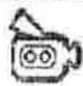
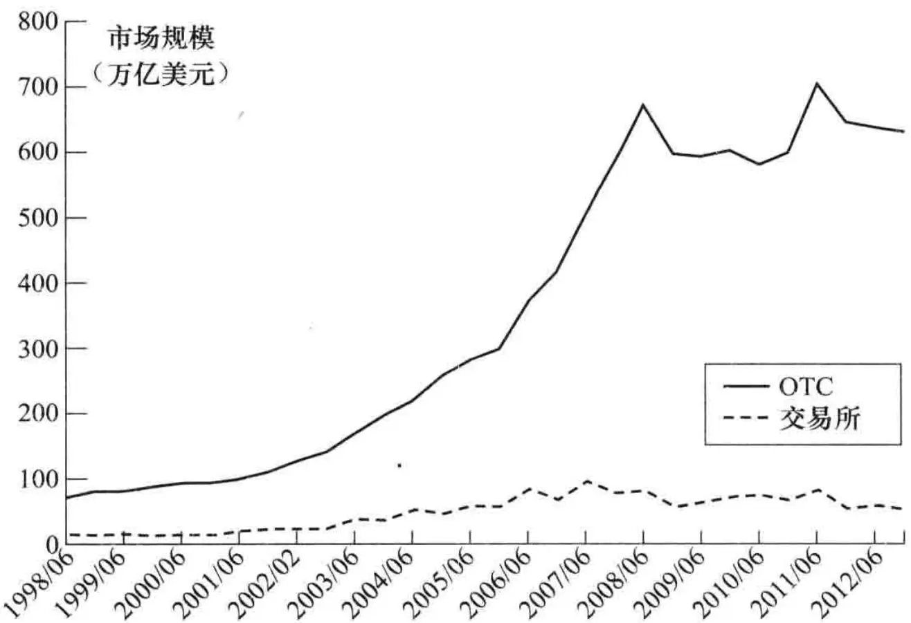
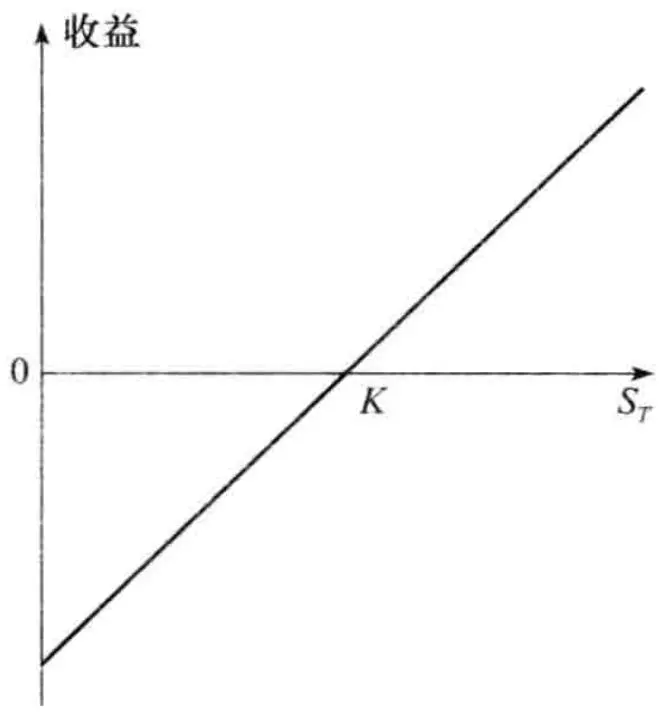
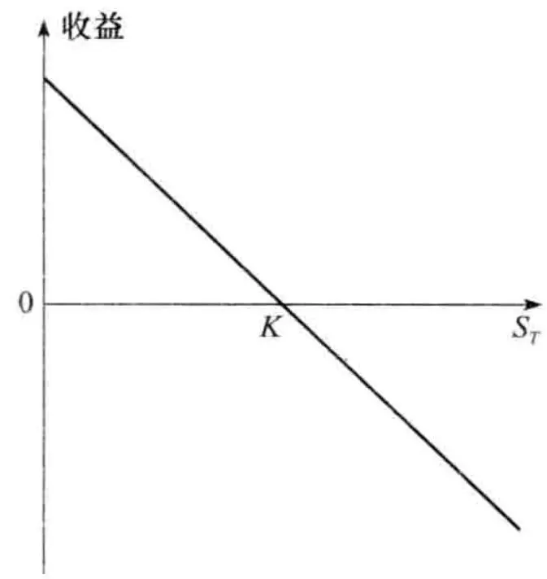
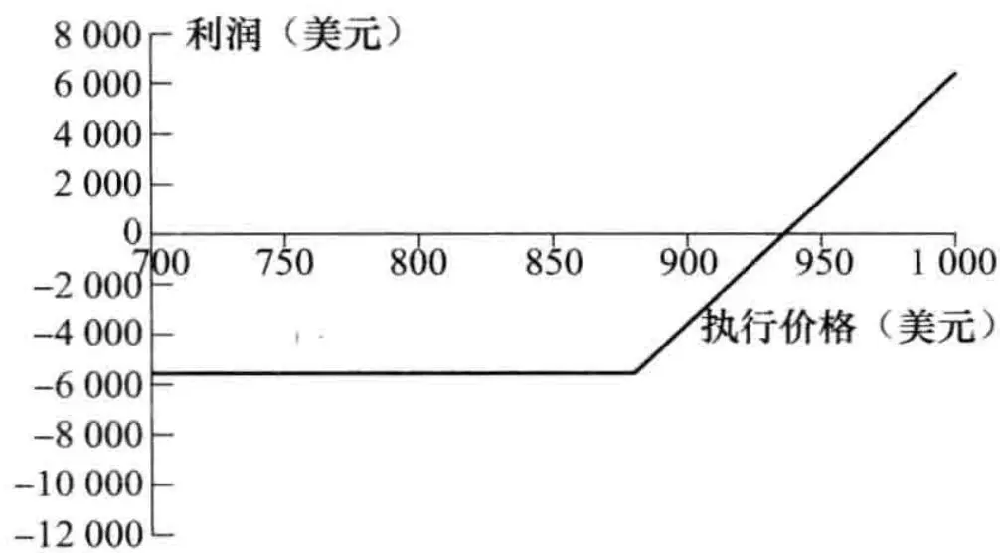
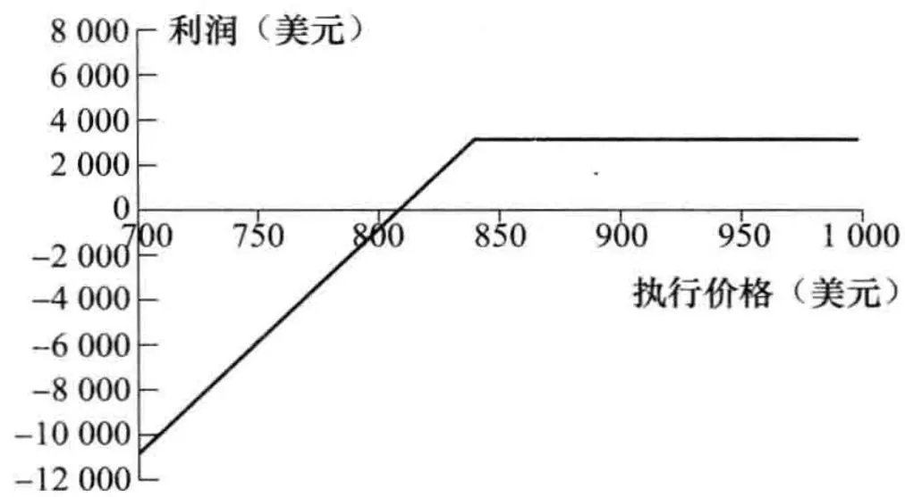
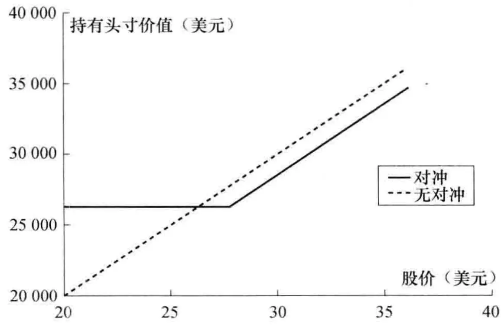
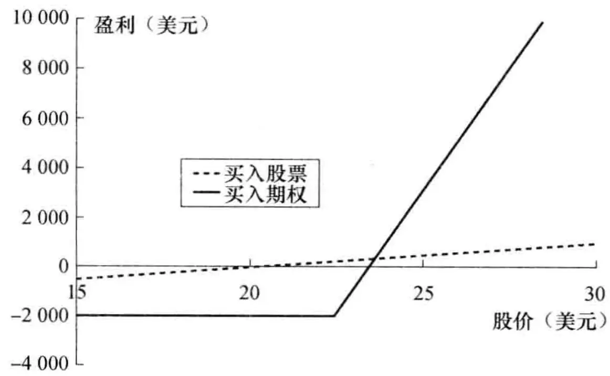

# [第1章](ch01.md) 交易所市场

在衍生产品交易所市场中，人们所交易的是经过交易所标准化之后的衍生产品。衍生产品交易所已经存在了很久。为了将农场主和商人联系起来，芝加哥交易所（Chicago Board of Trade, CBOT）于1848年成立。CBOT在最初的主要职能是将所交易的谷物进行数量和质量标准化。几年以后，在CBOT开发了最初的期货类合约（当时这类合约也称为将至合约（to-arrive contract））。投机者很快发现用这种合约可以替代对谷物的直接交易，从而对这种合约产生了很大兴趣。CBOT的竞争对手芝加哥商业交易所（Chicago Mercantile Exchange, CME）成立于1919年。现在世界上已经有许多期货交易所（见本书最后的列表）。现在CME和CBOT已经合并成立了CME集团（CME Group, <www.cmegroup.com>），该集团还包括纽约商品交易所（New York Mercantile Exchange, NYMEX）、商品交易所（Commodity Exchange, COMEX）以及堪萨斯市交易所（Kansas City Board of Trade, KCBT）。

芝加哥期权交易所（CBOE，<www.cboe.com>）从1973年开始交易关于16种股票的看涨期权合约。事实上，期权远在1973年之前就已经开始交易，但CBOE首先明确地定义了期权合约，并成功地为这样的产品建立了市场。交易所在1977年开始交易看跌期权。到目前为止，CBOE交易超过2500种股票期权和许多股指期权。与期货一样，期权合约也非常流行。现在世界上已经有许多交易所进行期权交易（见本书最后的列表），期权的标的资产包括外汇、期货合约以及股票和股指。

一旦两位交易员对一桩交易达成共识，具体的交易手续由交易所的清算中心负责。清算中心是两位交易员之间的中介，并对交易风险负责。例如，假设交易员A同意在将来某时间从交易员B手中按每盎司 $^{①}$ 1450美元的价格购买100盎司黄金，这项交易的结果是交易员A有一份从清算中心按每盎司1450美元的价格购买100盎司黄金的合约，而交易员B有一份按每盎司1450美元的价格卖给清算中心100盎司黄金的合约。这样安排交易的优点是交易员们不需要顾虑对手的信用问题。清算中心解决这个问题的方式是要求两个交易员都在清算中心储存一定数目的资金（保证金），以便确保他们履行自己的契约。在[第2章](ch02.md)里我们讨论对保证金的要求以及清算中心的运作方式。

## 电子交易市场

在传统上，衍生产品交易所是通过所谓的公开喊价系统（open outcry system）来进行交易的。这一系统包括在交易大厅上的面谈、喊叫和一套复杂的手势来表达交易意向。交易所已逐渐采用电子交易（electronic trading）来替代公开喊价系统。在电子交易中，交易员需要输入交易指令，然后电脑会促成买卖双方的交易。虽然公开喊价系统有它的拥护者，但随着时间的推移，公共喊价系统已变得越来越少。

电子交易促成了高频率交易（high-frequency trading）与算法交易（algorithmic trading）的发展，这种交易方式借助于计算机程序来进行，在交易过程中常常无须人员介入。电子交易已成为衍生产品市场的一个重要特色。



2008年9月15日，雷曼兄弟向法庭提出破产保护，这是美国历史上一起最大破产案，整个衍生产品市场都受到震动。直到破产的最后时刻，雷曼兄弟一直好像都有生存的机会。几家公司（比如韩国发展银行、英国巴克莱银行以及美国银行）都曾表示有购买雷曼的愿望，可是一直到最后都没有达成交易。许多人认为雷曼会是“大而不倒”（too big to fail）的公司，同时认为在最终没有买主的情况下，政府也会出资救助雷曼，但事实并非如此。

究竟发生了什么呢？雷曼的破产是由于高杠杆、高风险投资以及流动性问题等多种原因。商业银行因承接存款的原因，必须按照监管规定设定一定数量的资本金，但雷曼兄弟是一家投资银行，从而不受这一资本金监管规则的约束。在2007年，雷曼兄弟的杠杆比率高达31:1，这意味着资产只要跌价3%\~4%就会消耗掉整个银行的资本金。雷曼的主席与首席执行官理查德·福尔德（Richard Fuld）崇尚激进的风险文化，据说他曾对自己的高管讲“每天都是在打仗，你们必须去消灭敌手。”雷曼的首席风险官很有能力，但其影响却有限，这位风险官甚至在2007年被从高管委员会上除名。雷曼兄弟最终承担的风险产品包括大量由次债派生出的债券（我们将在[第8章](ch08.md)对这些产品进行描述）。雷曼的运作大多依赖于短期债务，但是当市场对雷曼失去信心时，这些贷款人拒绝再将贷款进行延期，因此造成了雷曼的破产。

雷曼在场外衍生产品市场上非常活跃，其交易对手数量高达8000多个，交易数量在百万笔以上。雷曼的交易对手在交易中常常要支付抵押品，但这些抵押品却被雷曼用于不同的目的。显然，在这种情况下要想搞清楚究竟谁欠谁的钱，简直就是个噩梦。




系统风险指的是当一家金融机构宣布破产时，它所产生的连锁反应会导致其他金融机构破产，从而威胁整个金融系统的稳定性。在银行之间有很多场外交易，如果银行A破产，由于和银行A所做的许多交易，这将会给银行B带来重大损失，从而可能会导致B的破产，与银行A和银行B有许多交易的银行C也许同样会有巨大损失，从而产生严重困难，等等。

尽管金融系统挺过了1990年德崇证券（Drexel）的破产以及2008年雷曼兄弟的破产，但目前监管部门仍是忧心忡忡。由于对系统风险的顾虑，政府在2007年和2008年的市场动荡期间营救了许多大型金融机构，使它们避免了破产的后果。


## 1.2 场外市场

并不是所有的衍生产品交易都是在交易所里进行的，场外市场（over-the-counter，OTC）

上也有许多交易。银行与其他大型金融机构、基金经理以及一些大公司都是衍生产品场外市场的主要参与者。一旦同意了场外交易，双方可以将交易递交到中央交易对手（central counterparty，CCP）或进行双边清算，中央交易对手的作用如同交易所的清算中心：它介于交易对手之间，从而使交易的一方不用顾虑对手的违约风险。当双边清算时，交易双方通常会签署一份覆盖它们之间所有交易的协约，在协约中常常会说明在什么情况下可以终止现存的交易、在终止交易时如何计算最终结算数量以及如何计算双方必须缴纳的抵押品（如果需要的话）数量。在[第2章](ch02.md)里我们将更详细地讨论中央交易对手与双边清算。

衍生产品场外市场参与者通常是通过电话或电子邮件来联系对方，或者通过经纪来为自己的交易寻找对手。金融机构常常是市场上流行产品的做市商（market maker）。这意味着他们在随时准备提供买入价（bid price）（即以这一价格买入产品）的同时，也提供卖出价（offer price）（即以这一价格卖出产品）。

在 2007 年开始的信用危机之前（见[第 8 章](ch08.md)中的讨论），在很大程度上衍生产品场外市场是不受监管约束的。在信用危机与雷曼兄弟倒闭之后（见业界事例 1-1），场外市场受到了许多新规则的影响，这些规则的目的是改善场外市场的透明度、改善市场有效性程度以及降低系统风险（见业界事例 1-2）。从某些方面来看，场外交易被强制性地变得越来越像交易所市场。三项最大的变化如下。

1. 在可能的情况下, 美国的场外标准衍生产品必须按互换交易执行场所 (swap execution facilities, SEF) 中所述的方式进行交易。在这样的交易平台上, 市场参与者可以出示买入价与卖出价, 并且一个市场参与者可以选择接受另一个市场参与者所出示的报价而进行交易。

2. 对于大多数标准衍生产品交易, 世界上许多地区都要求使用中央交易对手。

3. 所有交易都必须向登记中心提供备案。

### 市场规模

场外市场与交易所里的衍生产品交易数量都很大。尽管与交易所市场相比，场外市场交易数量相对较小，但是交易的平均规模却大得多。虽然这两个市场的统计结果不具有完全可比性，但很显然场外市场规模远远大于交易所市场。国际清算银行（Bank of International Settlement, <www.bis.org>）从1998年起开始统计市场交易数据，图1-1比较了①从1998年6月至

图1-1 场外衍生产品市场和交易所交易衍生产品市场的规模

2012年12月场外市场未平仓交易的面值总和，与②同一段时间内，交易所合约中的标的资产的总价值。这些数据显示，到2012年12月为止，场外市场交易量已经增至632.6万亿美元，而交易所市场交易量增至52.6万亿美元。

在分析这些数据时，我们应该认识到场外市场交易产品的合约金额（面值）与其价值并不是一回事。例如，某场外市场交易为1年期按某一指定汇率以英镑买入1亿美元的合约，这一交易的合约金额为1亿美元，但是这一交易的价值可能只有100万美元。据国际清算银行估计，截至2012年12月所有场外市场合约的市场总值大约为24.7万亿美元。 $^{②}$

## 1.3 远期合约

一种比较简单的衍生产品是远期合约（forward contract），它是在将来某一指定时刻以约定价格买入或卖出某一产品的合约。远期合约可以与即期合约（spot contract）对照，即期合约是指立刻就要买入或卖出资产的合约，远期合约常常是金融机构之间或金融机构与其客户之间在场外市场进行的交易。

在远期合约中，同意在将来某一时刻以约定价格买入资产的一方被称为持有多头寸（long position，简称多头），远期合约中的另外一方同意在将来某一时刻以同一约定价格卖出资产，这一方被称为持有空头寸（short position，简称空头）。

外汇远期合约在市场上十分流行。许多大银行都既雇用了即期交易员，也雇用了远期合约交易员。在后面的章节里我们会看到，在远期价格、即期价格以及两种货币的利率之间存在一种关系。表1-1列出的是2013年5月6日一家大型跨国银行给出的有关英镑（GBP）和美元（USD）之间汇率的买入和卖出价格，这里的汇率价格是指1英镑可兑现的美元数量。表中左边第1行数字表示该银行准备以每英镑1.5541美元的价格在即期市场（即马上交割）买入英镑（英镑也被称为sterling），同时也准备以每英镑1.5545美元的价格在即期市场卖出英镑；表中左边第2行、右边第1行和第2行表示该银行准备在1个月、3个月和6个月后分别以每英镑1.5538美元、1.5533美元和1.5526美元的价格买入英镑，同时银行也准备在1个月、3个月和6个月后分别以每英镑1.5543美元、1.5538美元和1.5532美元的价格卖出英镑。

表 1-1 2013 年 5 月 6 日美元/英镑即期和远期的买入和卖出价  
(表中所示价格为每英镑所对应的美元价格)

<table><tr><td></td><td>买入价</td><td>卖出价</td><td></td><td>买入价</td><td>卖出价</td></tr><tr><td>即期</td><td>1.5541</td><td>1.5545</td><td>3个月远期</td><td>1.5533</td><td>1.5538</td></tr><tr><td>1个月远期</td><td>1.5538</td><td>1.5543</td><td>6个月远期</td><td>1.5526</td><td>1.5532</td></tr></table>

远期合约可以用来对冲外汇风险，假定在2013年5月6日美国一家企业的资金部主管已经预料到在6个月后（2013年11月6日）需要支付100万英镑，这位主管准备对冲外汇风险，他可以同银行达成一个以表1-1所示的远期合约，在合约中约定在6个月后，这家企业必须以每英镑1.5532美元的价格买入100万英镑，在远期合约中这家企业为多头方，也就是说这家企业在2013年11月6日以155.32万美元的价格买入100万英镑，而银行在合约中处在空头方的位置，也就是说银行必须在2013年11月6日以155.32万美元的价格卖出100万英镑。企业

和银行都必须履行合约。

### 1.3.1 远期合约的收益

考虑上述交易中企业持有的头寸，远期合约在签署以后会产生什么样的结果呢？在这里的远期交易中，企业有义务在6个月后以1533200美元价格买入100万英镑。当汇率上涨时，假如在6个月后1英镑值1.6000美元，这时对企业来讲，远期合约价值为+46800美元（1600000-1553200）。远期合约保证企业可以按每英镑1.5332美元（而不是1.6000美元的价格）买入100万英镑。类似地，当在6个月后汇率降到1.5000时，对企业来讲，远期合约价值为-53200美元，这是因为由于持有远期合约而使企业比从市场直接购买英镑多花了53200美元。

一般来讲，在合约到期时，对于远期合约多头方来讲，每1单位合约的收益为

$$
S_{T} - K
$$

这里 $K$ 为合约的交割价格（delivery price）， $S_{T}$ 为资产在合约到期时的市场价格，合约中的多头方必须以 $K$ 的价格买入价值为 $S_{T}$ 的资产。同样，对于远期合约的空头方来讲，合约所带来的收益为

$$
K - S_{T}

$$

以上所列的两项收益均可正可负，这些收益表示在图1-2 中。因为签订远期合约的费用为 0，所以合约的收益也就是交易员所有的盈亏。

a）多头

b) 空头
图1-2 远期合约的收益  
注：合约的交割价格 = K，资产在合约到期时的价格 = $S_{T}$ 。

在上面例子中， $K = 1.5532$ ，企业持有多头。当 $S_{T} = 1.6000$ 时，每英镑的收益为 0.0468 美元；当 $S_{T} = 1.5000$ 时，每英镑的收益为 -0.0532 美元。

### 1.3.2 远期价格和即期价格

我们将在[第5章](ch05.md)里详细讨论远期价格和即期价格之间的关系。为了粗略地描述两者之间的关系，考虑现价为60美元的无股息股票。假定借入和借出1年期现金的利率均为 $5\%$ ，1年期的远期价格是多少呢？

答案是60美元以 $5\%$ 增长到1年后的数量，即63美元。如果股票的远期价格大于63美元，比如为67美元。你可以借入60美元资金，买进股票，然后以远期合约的价格在1年后以

67 美元卖出股票。在 1 年后，偿还贷款，你可以得到 4 美元的盈利。如果股票的远期价格小于 63 美元，比如为 58 美元。在投资组合中持有股票的投资者可以卖出股票而获得 60 美元资金，然后签订在 1 年后以 58 美元买进股票的远期合约。将卖出股票所得资金以 5% 进行投资后可以得到 3 美元的利息。在 1 年后以 58 美元的价格买回股票，这样做会使投资者在一年中比保留股票的做法多赚 5 美元。

## 1.4 期货合约

与远期合约类似，期货合约（futures contract）也是在将来某一指定时刻以约定价格买入或卖出某一产品的合约。与远期合约不同的是，期货合约交易是在交易所进行的。为了能够进行交易，交易所对期货合约做了一些标准化。期货合约的交易双方并不一定知道交易对手，交易所设定了一套机制来保证交易双方会履行合约承诺。

世界上最大的期货交易所是芝加哥交易所（CBOT）和芝加哥商业交易所（CME），这两个交易所已经合并成为 CME 集团。在这两个以及世界各地其他交易所中，期货交易的标的资产包括各种商品和金融资产。商品包括猪肉、活牛、糖、羊毛、木材、黄铜、铝、黄金和锡。金融资产包括股指、货币和国债。金融媒体会定期公布期货价格定期。假定在 9 月 1 日，12 月份黄金期货的价格为 1380 美元，该价格为（除佣金外）交易员同意买入或卖出在 12 月份交割的黄金价格。同其他资产价格一样，这一价格是由资产的供需关系来决定的：如果想买入资产的交易员比想卖出资产的交易员多，价格将会上涨；在相反情况下，价格将会下跌。

在[第 2 章](ch02.md)中将进一步讨论关于保证金要求、每日结算过程、交割过程、卖出 - 买入差价以及交易所清算中心的作用。

## 1.5 期权合约

期权产品在交易所市场和场外市场里均有交易。期权产品可以分成两种基本类型：看涨期权（call option）的持有者有权在将来某一特定时间以某一特定价格买入某种资产，看跌期权（put option）的持有者有权在将来某一特定时间以某一特定价格卖出某种资产。合约中所说的特定价格叫执行价格（exercise price）或敲定价格（strike price）；期权合约所指的特定时间叫到期日（expiration date）或期限（maturity）。美式期权（American option）是指期权持有人在到期日之前任何时间都可以选择行使期权；欧式期权（European option）是指期权持有人只能在到期日才能选择是否行使期权。 $^{①}$ 在交易所交易的股票期权大多为美式期权。一份合约的标的资产数量通常为100股。欧式期权比美式期权分析起来要容易一些，美式期权的性质常常与相应欧式期权性质一样。

在这里应该强调的是期权赋予持有者去做某一项事情的权利，当然持有者可以选择不去行使这一权力。与此相比，远期和期货合约中的双方必须要买入或卖出标的资产。这里我们应该注意到，尽管进入远期或期货合约时不需要支付任何费用，但必须付出一定费用才能拥有期权。

芝加哥期权交易所（CBOE）是世界上最大的股票期权交易所。表 1-2 给出了谷歌（股票代码：GOOG）股票看涨期权在2013年5月8日的买入价和卖出价。表1-3给出了相应看跌期权的价格。这些报价均来自于CBOE网页。谷歌公司股票在2013年5月8日的收盘买入价和卖出价分别为871.23美元和871.37美元，期权的买入－卖出差价（作为价格的百分比）通常比其标的股票的差价要大，而且同时也取决于其交易量。表1-2与表1-3中期权的执行价格分别为820美元、840美元、860美元、880美元、900美元和920美元。表中所示期权的到期日期分别为2013年6月、2013年9月和2013年12月。6月份期权的到期日为2013年6月22日，9月份期权的到期日为2013年9月21日，12月份期权的到期日为2013年12月21日。

表 1-2 谷歌股票看涨期权在 2013 年 5 月 8 日的价格：  
股票买入价为 871.23 美元，卖出价为 871.37 美元

<table><tr><td rowspan="2">执行价格(美元)</td><td colspan="2">2013年6月</td><td colspan="2">2013年9月</td><td colspan="2">2013年12月</td></tr><tr><td>买入价</td><td>卖出价</td><td>买入价</td><td>卖出价</td><td>买入价</td><td>卖出价</td></tr><tr><td>820</td><td>56.00</td><td>57.50</td><td>76.00</td><td>77.80</td><td>88.00</td><td>90.30</td></tr><tr><td>840</td><td>59.50</td><td>40.70</td><td>62.90</td><td>63.90</td><td>75.70</td><td>78.00</td></tr><tr><td>860</td><td>25.70</td><td>26.50</td><td>51.20</td><td>52.30</td><td>65.10</td><td>66.40</td></tr><tr><td>880</td><td>15.00</td><td>15.60</td><td>41.00</td><td>41.60</td><td>55.00</td><td>56.30</td></tr><tr><td>900</td><td>7.90</td><td>8.40</td><td>32.10</td><td>32.80</td><td>45.90</td><td>47.20</td></tr><tr><td>920</td><td>n.a. $^1$ </td><td>n.a.</td><td>24.80</td><td>25.60</td><td>37.90</td><td>39.40</td></tr></table>

1. n. a. 表示无数据，下同。
资料来源：CBOE。

表 1-3 谷歌股票看跌期权在 2013 年 5 月 8 日的价格：  
股票买入价为 871.23 美元，卖出价为 871.37 美元

<table><tr><td rowspan="2">执行价格(美元)</td><td colspan="2">2013年6月</td><td colspan="2">2013年9月</td><td colspan="2">2013年12月</td></tr><tr><td>买入价</td><td>卖出价</td><td>买入价</td><td>卖出价</td><td>买入价</td><td>卖出价</td></tr><tr><td>820</td><td>5.00</td><td>5.50</td><td>24.20</td><td>24.90</td><td>36.20</td><td>37.50</td></tr><tr><td>840</td><td>8.40</td><td>8.90</td><td>31.00</td><td>31.80</td><td>43.90</td><td>45.10</td></tr><tr><td>860</td><td>14.30</td><td>14.80</td><td>39.20</td><td>40.10</td><td>52.60</td><td>53.90</td></tr><tr><td>880</td><td>23.40</td><td>24.40</td><td>48.80</td><td>49.80</td><td>62.40</td><td>63.70</td></tr><tr><td>900</td><td>36.20</td><td>37.30</td><td>59.20</td><td>60.90</td><td>73.40</td><td>75.00</td></tr><tr><td>920</td><td>n.a.</td><td>n.a.</td><td>71.60</td><td>73.50</td><td>85.50</td><td>87.40</td></tr></table>

资料来源：CBOE。

这些表格显示了期权的一些性质。当执行价格上升时，看涨期权价格下降，而看跌期权价格上升。当期权期限增大时，这两种期权价值均会上升。在[第11章](ch11.md)，我们将讨论期权的这些性质。

假如某投资者向其经纪人发出购买谷歌股票12月看涨期权的指令，期权执行价格为880美元，经纪人会向CBOE的交易员传递购买指令，从而完成这项交易。如表1-2所示，期权的价格为56.30美元（列表中的卖出价格），这一价格是指买入1只股票的期权价格。在美国，每份股票期权合约的规模为100股，因而投资者必须通过经纪人向交易所注入5630美元资金，然后交易所会将此项资金转给期权的卖出方。

在我们的例子中，投资者以 5630 美元的价格买入了在将来某时刻以每股 880 美元价格买入 100 股谷歌股票的权利。如果在 2013 年 12 月 21 日之前，谷歌的股票价格没有高于 880 美元，期权持有人则不会行使权利，投资者（期权持有人）因此也就损失了 5630 美元。但是，如果谷歌公司的股票表现很好，在期权被行使时，谷歌股票（买入）价格为 1000 美元，这时期权持有人能够以每股 880 美元的价格买入每股实际价值为 1000 美元的股票，这会给投资者带来 12000 美元的收益。将最初买入期权的费用考虑在内后，期权持有人的实际盈利为 6370 美元。 $^{①}$

另外一种情形是假定投资者以31美元的价格卖出了执行价格为840美元的9月份看跌期权（列表中的买入价格）。出售期权后会马上收入 $100 \times 31.00 = 3100$ 美元。如果谷歌股票价格一直高于840美元，期权也就不会被行使，投资者的盈利为3100美元。但是，如果股票价格下跌，当期权被行使时股票价格为800美元，投资人将会产生损失。尽管股票的价格是800美元，但是投资者必须按每股840美元的价格购买100只股票，从而损失4000美元，将最初的期权收费考虑在内，投资者实际损失为900美元。

在 CBOE 内交易的期权为美式。但为了便于讨论，我们假设这些期权为欧式，也就是假设只有在到期日才能行使这些期权。将投资者的盈利作为到期时股票价格的函数，我们可以在图1-3 中画出期权的盈利图。

a）买入100份12月份到期的谷歌股票看涨期权，执行价格为880美元

b）卖出100份9月份到期的谷歌股票看跌期权，执行价格为840美元
图1-3 交易产生的净盈利

在今后的章节里我们将进一步讨论期权市场的运作机制以及交易员如何对表 1-2 和表 1-3 中的期权进行定价。我们在这里指出，期权市场上有 4 种参与者。

1. 看涨期权的买方；

2. 看涨期权的卖方；

3. 看跌期权的买方；

4. 看跌期权的卖方。

期权的买入方被称为持有多头（long position），期权的卖出方被称为持有空头（short position），卖出期权也被称为对期权承约（writing the option）。

## 1.6 交易员的种类

衍生产品市场已经非常成功，其中主要原因是这些市场吸引了许多不同类型的交易员，而且市场具有极强的流动性。当一个投资者想进入某个交易的一方时，通常可以很容易地找到想进入交易另一方的投资者。

交易员可以粗略地分为三大类：对冲者（hedger）、投机者（speculator）以及套利者（arbitrageur）。

对冲者采用衍生产品合约来减小自己所面临的由于市场变化而产生的风险，投机者利用这些产品对今后市场变量的走向下赌注，套利者则采用两个或更多相互抵消的交易来锁定盈利。如业界事例1-3所示，无论出于哪种目的，对冲基金都已经成为衍生产品的最大用户。

在接下来的几节中，我们将更详细地讨论每种交易员的交易行为。



在近年来对冲基金已经成为衍生产品市场的重要参与者，它们运用衍生产品进行对冲、投机以及套利。对冲基金与共同基金类似，基金管理者将客户的资金进行投资，但是对冲基金的资金来自较为老练的客户，并且对冲基金不能进行公开融资。共同基金受监管条约的限制：基金份额随时可以兑现，必须公布投资方针，限制使用杠杆效应，等等。而对冲基金通常不受这些条例的制约，从而可以采用较为复杂、与众不同并具有独到见解的投资策略。对冲基金的收费与对冲基金的表现有关，一般收费都较高，收费数量通常是管理资产的1%\~2%再加上盈利的20%。对冲基金现在已经十分普遍，全球有高达2万亿美元的资金投资在对冲基金上。“基金式基金”（funds of funds）的建立是在对冲基金的组合上进行投资。

对冲基金经理采用的投资策略常常包括利用衍生产品来设定投机和套利头寸。一旦设定这些策略，对冲基金投资经理要采取以下行动：

1. 对基金面临的风险进行评估;

2. 决定哪些风险可以接受，哪些风险应当对冲；

3. 设计交易策略（通常会涉及衍生产品）来对冲不能接受的风险。

以下是对冲基金的几种类型以及常常采用的交易策略。

股票多空对冲（long/short equities）：对冲组合包括买入价格被市场低估的股票和卖出价格被市场高估的股票，因此市场总体变化趋势对组合的影响会很小。

可转换债券套利（convertible arbitrage）：进入可转换债券的多头以及标的股票的空头，并以动态形式管理标的股票的空头。

受压（高风险）债券（distressed securities）：买入濒临破产企业的证券。

新兴市场（emerging markets）：投资于发展中国家或新兴市场公司的债券和股票，或投资于这些国家的国债。

全球宏观（global macro）：投资反映预期全球宏观经济走势的交易。

兼并套利（merger arbitrage）：在兼并和收购消息公布后进行交易。当并购交易成功后，可以达到盈利的目的。


## 1.7 对冲者

在这一节中，我们将说明对冲者如何利用远期合约和期权来减小他们所面临的风险。

### 1.7.1 利用远期进行对冲

假定今天是2013年5月6日，一家美国进口公司ImportCo得知在2013年8月6日因买入商品将向一家英国供应商支付1000万英镑。表1-1列出了金融机构关于美元/英镑汇率的报价。ImportCo可以从金融机构买入3个月期限、汇率为1.5538的英镑（GBP）远期合约来对冲其外汇风险。这样做的实际效果是向其英国供应商支付的美元数量锁定为15538000美元。

接下来我们考虑另一家美国出口公司 ExportCo，该公司向英国出口商品。在 2013 年 5 月 6 日得知公司在 3 个月后将收入 3000 万英镑。ExportCo 可以在 3 个月远期合约中以 1.5533 的价格卖出 3000 万英镑。这样做的实际效果是确定卖出英镑后收入美元的数量为 46599000 美元。

注意，一个公司选择不对冲时有可能会比选择对冲的盈利效果更好，但也有可能更差。考虑 ImportCo 公司。如果汇率在 8 月 6 日为 1.4000，假如公司没有选择对冲，这时对于 1000 万英镑只需支付 14000000 美元，这一数量小于 15538000 美元。但如果汇率变为 1.6000，1000 万英镑值 16000000 美元，这时公司会希望自己进行了对冲！ExportCo 的情形与以上刚好相反：如果 8 月份的汇率低于 1.5533，那么公司会希望进行了对冲；如果汇率高于 1.5533，公司会希望自己没有进行对冲。

这一例子说明了对冲的一个关键性质：对冲的目的是减小风险，对冲后的实际结果并不一定能保证比不对冲更好。

### 1.7.2 采用期权进行对冲

期权也可以用来对冲。考虑一位投资人在5月份拥有1000只某种股票的情形。股票价格为每股28美元。投资者非常担心在今后2个月内股票价格下跌，所以想买入保护。投资人可以在CBOT买入10份在这个股票上7月到期的股票看跌期权合约，期权的执行价格为27.50美元。持有这一期权可使投资者以27.50美元的价格卖出1000只股票。如果期权报价为1美元，每份期权合约的费用为 $100 \times 1 = 100$ 美元，对冲的整体费用为 $10 \times 100 = 1000$ 美元。

这一策略的费用为 1000 美元，它可以保证卖出股票的价格在期权期限内至少为27.50美元。如果市场价格低于27.50美元，投资者行使期权，这时持有股票的收入为27500美元。将期权费用考虑在内，实际收入26500美元。如果股票价格高于27.50美元，期权不会被行使，这时期权到期时价值为0。但是拥有股票的实际收入总是高于27500美元（将期权费用考虑在内，实际收入高于26500美元）。图1-4显示了交易组合的净值（考虑期权费用以后）与两个月时股票股价的函数关系图形。虚线显示没有对冲时交易组合的价值。

图1-4 证券组合在对冲与不对冲情形下，在两个月后的价值

### 1.7.3 比较

采用期货合约与采用期权进行对冲有一个关键性区别：以期货合约来中和风险的形式是通过设定买入和卖出标的资产的价格来对冲；而期权产品则是提供了价格保险。当价格向不利方向变化时，期权产品对投资者提供了保护，但同时又能使投资者在价格向有利方向变化时盈利。与期货不同，拥有期权是需要付费的。

## 1.8 投机者

我们接下来考虑投机者如何利用期货和期权。对冲者是想避免面对将来资产价格不利波动的风险敞口，而投机者却要建立头寸：他们或者对资产价格上涨下注，或者对资产价格下跌下注。

### 1.8.1 利用期货进行投机

在2月份，一位美国投机者认为英镑（相对美元）在今后两个月会升值。投机者的一种做法是在即期市场买入250000英镑，然后希望在今后以更高的价格卖出这些英镑（买入的英镑被存入支付利息的账户中）。另外一种做法是进入4份CME的4月份期货合约的多头（1份合约是买入62500英镑的合约）。表1-4总结了以上两种策略，其中当前汇率为1.5470（美元/英镑），4月份期货价格为1.5410。在4月份时如果汇率为1.6000，采用期货合约的做法可以使投机者盈利（1.6000 - 1.5410）×250000 = 14750美元。当采用即期汇率的做法时，投机者以1.5470的价格在2月份买入250000英镑，并以1.6000的价格在4月份将英镑卖出，其盈利为（1.6000 - 1.5470）×250000 = 13250美元。如果汇率跌至1.5000，期货带来的损失为（1.5410 - 1.5000）×250000 = 10250美元，而采用即期产品做法的损失为（1.5470 - 1.5000）×250000 = 11750美元。在两种情形下，即期市场的结果看上去比期货市场稍微差一点，这是因为对以上两种做法所产生的盈利与亏损计算中没有考虑利息的收入和支出。

以上两种做法的差别是什么呢？第1种做法在最初需要386750美元（=250000×1.5470）的投资。与之相比，第2种做法只需要将少量资金存入保证金账户（在[第2章](ch02.md)中，我们将解释保证金账户的运作过程）。在表1-4中，最初的保证金要求为每份合同5000美元，总共为20000美元。期货市场可以使投机者取得杠杆效应，即投资者只需要支出少量资金就可以建立一个很大的投机头寸。

表 1-4 利用即期和期货合约进行投机，1 份期货合约的  
规模为 62500 英镑，初始保证金为 20000 美元
(单位：美元)

<table><tr><td rowspan="2"></td><td colspan="2">可能的交易</td></tr><tr><td>买入250000英镑即期价格=1.5470</td><td>买入4份期货合约期货价格=1.5410</td></tr><tr><td>投资</td><td>386750</td><td>20000</td></tr><tr><td>4月的即期价格为1.6000时的盈利</td><td>13250</td><td>14750</td></tr><tr><td>4月的即期价格为1.5000时的盈利</td><td>-11750</td><td>-10250</td></tr></table>

### 1.8.2 利用期权进行投机

投机者还可以利用期权进行投机。假定现在是10月，一位投机者认为某公司的股票在今后两个月内要涨价。股票的当前价格为20美元，执行价格为22.50美元、期限为两个月的看涨期权的当前价格为1美元。表1-5说明了投资者可以选择的两种投机方式（这里假设他准备投资2000美元）：一种方式是买进100只股票，另外一种方式是买入2000份看涨期权（即20份合约）。假定投资者的猜测是正确的：股票在12月上涨到27美元。第1种投资方法带来的盈利为

$$
100 \times (27 - 20) = 700 (\text{美元})
$$

表 1-5 将 2000 美元投资于价格为 20 美元股票的  
两种不同策略的盈亏比较
(单位：美元)

<table><tr><td rowspan="2">投资策略</td><td colspan="2">12月的股票价格</td></tr><tr><td>15</td><td>27</td></tr><tr><td>买入100股股票</td><td>-500</td><td>700</td></tr><tr><td>买入2000个看涨期权</td><td>-2000</td><td>7000</td></tr></table>

但这时第2种方法盈利会更高。执行价格为22.50美元的看涨期权的收益为4.50美元（因为持有这一期权投资者可以按22.50美元的价格买入价值27美元的产品）。在第2种策略下，持有2000个期权的总收益为
$$
2000 \times 4.50 = 9000 (\text{美元})
$$

将最初的费用扣除后，净盈利为
$$
9000 - 2000 = 7000 (\text{美元})
$$

因此买入期权的投机策略盈利是买入股票盈利的10倍。

期权策略也会触发更大的损失：假定股票价格在 12 月降至 15 美元，买入股票的投机策略损失为
$$
100 \times (20 - 15) = 500 (\text{美元})
$$

因为期权在到期时价值为0，期权策略的损失为2000美元（即最初付出的期权费用）。图1-5显示了两种交易策略在两个月后的收益与股票价格的函数关系图形。

与期货类似，期权给投资者提供了杠杆效应。对于一项投资，使用期权会放大最终的经济效果：好的收益会更好，坏的收益可能会使投资者丧失最初的全部投资。

图1-5 对价格为 20 美元的股票的两种投机策略的盈亏

### 1.8.3 比较

对于投机者所取得的杠杆效应而言，期货和期权比较相似。但是，这两种产品有一个重要区别：投机者使用期货时，潜在的损失与收益都很大。但采用期权产品时，不管市场有多么糟糕，投机者的损失不会超过所支付的期权费用。

## 1.9 套利者

套利者是期货、远期以及期权市场的第3种重要参与者。套利包括同时进行两种或更多的交易来锁定无风险盈利。在后面的章节中，我们将会论述当某一个资产的期货价格与其即期市场价格不协调时，如何会产生套利机会。我们也将描述如何在期权市场中应用套利。在这一节里，我们用一个简单的例子来说明套利的概念。

我们考虑在纽约交易所（NYSE，<www.nyse.com>）和伦敦股票交易所（London Stock Exchange, <www.stockex.co.uk>）均有交易的某一股票。假定这一股票在纽约的价格为150美元，同时在伦敦的价格为100英镑，相应的汇率为每英镑1.5300美元。一个套利者可以在纽约买入100份股票并同时在伦敦将股票卖出，其无风险盈利为

$$
100 \times [ (1.53 \times 100) - 150 ]
$$

即 300 美元（计算中忽略了交易费用）。交易费用的存在可能会消除小投资者的盈利。但是，大型投资银行在股票市场以及外汇市场的交易费用都很低，所以投资银行会发现这一套利机会很诱人，他们会试图从中获利。

以上描述的套利机会不会持续太久。随着套利者在纽约买入股票，供需关系会使股票的美元价格上涨。类似地，随着套利者在伦敦卖出股票，供需关系会使股票的英镑价格下跌。市场会很快会使两个价格在当前汇率下趋向于平衡。事实上，套利者对于套利的急切渴望使得股票的美元价格以及英镑价格之间不可能存在如此严重的失衡。将此例推广，我们可以说正是由于套利者的存在，才使得在实际中的大多数金融市场报价中只会存在很小的套利机会。在本书中，大多数关于期货价格、远期价格和期权价格的讨论都是建立在无套利机会的假设之上。

## 1.10 危险

衍生产品变化莫测，它们可以被用来对冲、投机和套利。正是因为产品的变幻莫测才可能会带来巨大危害。有时一些被指定只能对冲或套利的交易员会在有意或无意之中变成市场投机者，而投机的后果有时是灾难性的。法国兴业银行（Société Général）的杰洛米·科维尔（Jerome Kerviel）给我们提供了一个典型的反面教材（见业界事例1-4）。



衍生产品变化莫测，它们可以被用来对冲风险、投机及套利。有时某些被指定只能做对冲或套利的交易员会在自觉或不自觉之中成为市场投机者，这正是公司在交易衍生产品时要面临的挑战之一。

杰洛米·科维尔在2000年加入法国兴业银行，一开始从事合规工作。2005年，他被提升为初级交易员，在银行的Delta One产品组工作。他主要交易股指，比如德国的DAX股指、法国的CAC40和欧元的Stoxx 50。他的职责是寻找套利机会：当股指期货在不同交易所的交易价格不相等时，就可能会出现套利机会，或者当股指期货的价格与构成指数的股票价格不一致时，套利机会也可能会出现（见[第5章](ch05.md)里有关这种套利的讨论）。

由于科维尔对银行监管流程非常熟悉，他进行了表面上看起来是套利，而实际是投机的交易。他持有很大的股指头寸，同时建立了虚假的对冲交易。事实上，他在豪赌股指的走向，随着日积月累，他的未对冲的实际头寸高达上百亿欧元。

2008 年 1 月，科维尔的行为被法国兴业银行发现，兴业银行用了 3 天时间对他的头寸进行平仓，损失高达 49 亿欧元，这是当时金融历史上由舞弊造成的最大经济损失。（后来由麦道夫的庞氏骗局造成的损失更大）。

在2008年之前，由无赖交易员而造成的损失就早有耳闻。比如20世纪90年代的尼克·利森是巴林银行派往新加坡分行的一名雇员。利森的职责类似于科维尔的职责，他负责在大阪交易所与新加坡交易所之间辨别日经225（Nikkei 225）期货指数的套利机会，而在交易过程中，利森由一个套利者变成了一个投机者：他用期货和期权对日经225进行豪赌，结果损失了近10亿美元。这一损失使得一家有近200年历史的银行破产。在2002年，爱尔兰银行的约翰·卢斯内克因进行非授权的外汇投机交易而损失了7亿美元。从以上的事例中我们可以吸取一个重要的教训：在交易行为中，金融或非金融机构一定要给交易员定义一个清楚的风险限额，并对限额进行谨慎的监测以保证交易员遵守风险限额。

要想避免类似兴业银行的错误，金融或非金融机构一定要控制其衍生产品的交易机制。衍生产品一定要被用于指定的目的，在交易中必须建立风险额度，银行必须经常监控交易员的交易以保证风险额度制度的贯彻执行。

不幸的是，有时即使交易员遵循风险额度，大的错误也会出现。在2007年7月危机开始以前，市场上某些交易员所做交易的风险远比雇用他们的金融机构所意识到的要大得多。如[第8章](ch08.md)所述，美国的房价在很长一段时间内增长极快，多数人认为房价增加的趋势会持续下去，即使在最糟糕的情形下房价即使不涨也不会下跌，很少有人对所发生的房价的急剧下跌有任何准备，也很少有人对全国不同地区按揭市场违约的高相关性有任何准备。尽管有些金融机构的风险管理人员对机构所存在的房产风险敞口表示出忧虑，但是在市场欣欣向荣的情况下（至少看起来是欣欣向荣），风险管理人员的声音是不会得到重视的。2006～2007年的市场就是这样一种状态。信用危机带给我们的教训之一就是：金融机构应当时常扪心自问“问题会出在哪里？”，同时还要问自己“如果出现问题，我们的损失会是多大？”


## 小结

在过去的40年中，衍生产品市场的迅猛增长是金融市场中最令人鼓舞的发展之一。在许多情形下，对冲者和投机者都会发现交易衍生产品比直接交易标的资产本身更为方便。有些衍生产品的交易是在交易所里，有些衍生产品的交易是在金融机构、基金经理和企业资金部之间的场外市场进行，还有一些衍生产品被嵌入在债券或股权之中。本书的目的是为了给出一套对衍生产品定价的统一框架，而不是仅仅对期权和期货进行定价。

在这一章中我们初步了解了远期、期货以及期权合约。远期和期货是在将来某一时刻以某一约定价格买入或卖出一项特定资产的合约。期权有两种类型：看涨期权和看跌期权。看涨期权的持有者有权在将来某一约定时间以某一约定价格买入某种资产；看跌期权的持有者有权在将来某一约定时间以某一约定价格卖出某种资产。远期、期货和期权的标的产品范围很广。

衍生产品是资本市场上很成功的创新。在市场上有3类投资者：对冲者、投机者和套利者。对冲者面临资产价格风险，他们利用衍生产品来减小或消除风险。投机者则是对今后的资产价格变动下注，衍生产品可以给他们提供更强的杠杆效应。套利者试图从两个不同市场价格的失衡中盈利。例如，当套利者发现期货价格和即期价格之间失衡时，他们会同时在两个市场中做相互抵消的交易来锁定盈利。

Chancellor, E. Devil Take the Hindmost—A History of Financial Speculation. New York: Farra Straus Giroux, 2000.

Merton, R. C. “Finance Theory and Future Trends: The Shift to Integration,” Risk, 12, 7 (July 1999): 48–51.

Miller, M. H. “Financial Innovation: Achievements and Prospects,” Journal of Applied Corporate Finance, 4 (Winter 1992): 4–11.

Zingales, L., “Causes and Effects of the Lehman Bankruptcy,” Testimony before Committee on Oversight and Government Reform, United States House of Representatives, October 6, 2008.

## 练习题

1.1 远期合约多头与远期合约空头的区别是什么？

1.2 仔细解释对冲、投机以及套利之间的区别。

1.3 解释以下交易的不同之处（a）当期货价格为50美元时，进入期货的多头；（b）进入1份执行价格为50美元的看涨期权的多头。

1.4 仔细解释卖出一个看涨期权同买入一个看跌期权之间的差别。

1.5 一个投资者进入了一个远期合约的空头：在该合约中，投资者能够以1.5000的汇率（美元/英镑）卖出100000英镑。当远期合约到期时的汇率为（a）1.4900，

1.6 某交易员进入期货价格每磅 $^{50}$ 美分的棉花远期合约空头方。合约的规模是50000磅棉花。当合约结束时棉花的价格分别为(a)每磅48.20美分，(b)每磅51.30美分，对应以上价格交易员的盈亏为多少？

1.7 假定你承约了一个执行价格为 40 美元的看跌期权，期限为 3 个月，股票的当前价格为 41 美元，1 份看跌期权合约的规模是 100 只股票。你做出的是什么承诺？你的盈亏将是什么？

1.8 场外交易市场和交易所交易市场的区别是什么？场外交易市场的造市商给出的卖出－买入差价是什么？

1.9 你认为某股票价格将要上升，股票的当前价格为29美元，而3个月期限，执行价格为30美元的看涨期权价格为2.90美元，你总共有5800美元的资金。说明两种投资方式：一种是利用股票，另一种是利用期权。每种方式的潜在盈亏是什么？

1.10 假如你拥有 5000 只股票，每股价格为 25 美元。你如何采用看跌期权而使你投资的价值在将来 4 个月内得到保护？

1.11 股票在最初发行时会给公司提供资金，对期权来讲这种说法是否正确？

1.12 解释为什么期货合约既可以用于投机也可以用于对冲。

1.13 假如 1 份在 3 月份到期的看涨期权价格为 2.50 美元，期权执行价格为 50 美元。假设期权一直被持有到到期日，在什么情形下期权持有人会盈利？在什么情形下持有人会行使期权？画出期权多头的盈利与在期权到期时股票价格之间关系的图形。

1.14 假如一个在6月份到期、执行价格为60美元的看跌期权价格为4美元。假设期权被一直持有到到期日。在什么情形下期权的卖出方会盈利？在什么情形下期权会被行使？画出一个期权空头在到期时的收益与股票价格之间的关系图。

1.15 现在是5月，一位交易员卖出了1份9月份到期的看涨期权，其执行价格为20美元。当前的股票价格为18美元，期权价格为2美元。如果期权一直被持有到9月份，那时股票价格为25美元，讨论投资者的现金流状况。

1.16 一个交易员卖出了12月到期的看跌期权，执行价格为30美元。期权价格为4美元。在什么情况下交易员会有盈利？

1.17 一家公司预期在4个月后将收入一定数量的外币。哪种期权可以作为合适的对冲产品？

1.18 一家美国公司得知在6个月后要支付100万加元。解释如何采用（a）远期，和（b）期权产品来对冲汇率风险。

1.19 一个交易员进入了面值为1亿日元期货的空头。远期汇率为0.0090（美元/日元）。在合约到期时汇率如下的情况下，交易员的损益是什么？(a) 0.0084，(b) 0.0101。

1.20 CME集团提供长期国债上的期货。具有什么特征的交易员可能会使用这些产品？

1.21 “期权和期货是零和博弈”（zero-sum game）。你如何理解这句话？

1.22 描述以下交易组合的盈利情况：某资产上远期合约多头和同一资产上与远期合约有相同期限的欧式看跌期权多头的组合，其中执行价格等于在建立交易组合时资产的远期价格。

1.23 在20世纪80年代，信孚银行（Bankers Trust）开发了一种指数货币期权债券（Index Currency Option Notes, ICONs）。债券持有人在到期时得到的收益与某个汇率有关。其中一个例子是信孚银行与日本长期信用银行（Long Term Credit Bank of Japan）所做的一笔交易。在ICON中约定如下：在到期日（1995年）如果汇率 $S_{T}$ 高于169（YEN/USD），债券持有人会收到1000美元。如果在到期日汇率低于169（YEN/USD），债券持有

人的收益为

$$
1000 - \max \left[ 0, 1000 \left(\frac{169}{S_{T}} - 1\right) \right]

$$

如果在到期日汇率低于84.5，债券持有人收益为零。证明 ICON 是一个简单债券与两个期权的组合。

1.24 在 2011 年 7 月 1 日，一家公司进入了在 2012 年 1 月 1 日到期的远期合约，在合约中公司要买入 1000 万日元。在 2011 年 9 月 1 日，公司进入了在 2012 年 1 月 1 日到期的远期合约，在合约中公司要卖出 1000 万日元，描述这一交易策略的收益。

1.25 假如美元/英镑之间即期和远期汇率如以下表格所示

即期 1.558090 天远期 1.5556180 天远期 1.5518

## 作业题

1.29 如表 1-2 所示，在 2013 年 5 月 8 日谷歌股票的即期卖出报价为 871.37 美元，而执行价格为 880 美元的 9 月份看涨期权卖出报价为 41.60 美元。某交易员在考虑两种不同策略：买 100 只谷歌股票，或者买 100 份 9 月份看涨期权。对每种选择计算（a）交易费用，（b）当 9 月份股票的价格是 950 美元时交易的总回报，（c）当 9 月份股票的价格是 800 美元时交易的总损失。我们假设在 9 月份之前期权未被行使，而且如果购买股票的话，我们假设在 9 月份将股票卖掉。

1.30 什么是套利？解释以下的套利机会：一家在两个交易所同时上市的矿业公司股票在纽约交易所的价格是50美元，在多伦多交易所的价格是52加元，而美元与加元之间的汇率是1美元兑换1.01加元。如果交易员利用这些机会取利，那么价格将会受何影响？

1.31 交易员A签订了在1年后以1000美元价格买入一种资产的远期合约多头，交易员B购买了1份1年后有权以1000美元当有以下两种情形时，套利者会有什么样的机会：

(a) 180 天期限、执行价格为 1.52 美元 (USD/GBP) 的欧式看涨期权价格为 2 美分；

(b) 90 天期限、执行价格为 1.59 美元 (USD/GBP) 的欧式看跌期权价格为 2 美分。

1.26 某交易员按3美元的价格买进执行价格为30美元的看涨期权，交易员是否会在选择行使期权的情况下而亏损？为什么？

1.27 某交易员按5美元的价格卖出1份执行价格为40美元的看跌期权。交易员的最大盈利与最大亏损是多少？为什么？

1.28 “购买已经持有的股票上的看跌期权其实是买了一份保险”。解释这句话的意思。

价格买入同项资产的看涨期权，期权的费用为100美元。这两个交易员的头寸有什么区别？以1年以后的资产价格为自变量，展示两位交易员的盈利情况。

1.32 在3月，一位美国投资人指示其经纪人出售7月份到期的股票看跌期权，目前的股票价格为42美元，执行价格为40美元，期权的价格为3美元。解释投资人承诺了什么。在什么情况下，这个交易对投资人是有利可图的？风险又是什么？

1.33 一家美国公司知道它在3个月后需要支付300万欧元，现在的汇率为每欧元兑换1.3500美元。讨论该公司如何运用远期合约和期权合约来对冲其汇率风险敞口。

1.34 股票价格为 29 美元，一位投资人买入 1 份看涨期权合约，执行价格为 30 美元；同时又卖出一个执行价格为 32.50 美元的看涨期权。市场上关于这两个期权的价格分别为 2.75 美元和 1.50 美元，期权具有相同的到期日。描述投资人的头寸情况。

1.35 当前黄金市价为每盎司 1400 美元，1 年期远期合约的远期价格为 1500 美元，一位套利者能够以每年 4% 的利息借入资金，套利者应如何去做才能达到套利目的？这里我们假设黄金存储费为 0，同时黄金不会带来任何利息收入。

1.36 股票的当前价格为94美元，同时3个月期、执行价格为95美元的欧式看涨期权价格为4.70美元，一个投资者认为股票价格会上涨，但他无法决定是应买入100只股票还是买入2000份（相当于20份合约）期权，这两种投资所需资金均为9400美元。在此你会给出什么样的建议？股票价位涨到什么样的水平后会使得期权投资盈利更好？

1.372013年5月8日，一个投资者拥有100股谷歌股票。如表1-3所示，股票价格为871美元，一个12月份到期、执行价格为820美元的看跌期权价格为37.50美元。该投资者试图比较两种投资方法对价格下跌风险进行控制的效果。第1种方法是买入12月份的看跌期权，执行价格为820美元。第2种方法包括通知经纪人当谷歌股票下跌到820美元时，马上卖出100只股票。讨论以上两种方法的优缺点。

1.38 一个由标准原油公司（Standard Oil）发行的债券形式如下：债券持有人不会收到通常的券息，但在债券到期时公司会给债券持有人偿还1000美元本金并付加一笔与原油价格有关的金额，数量等于

170 乘以在到期日原油价格高于 25 美元的差额（如果是正的话），附加数量的最大限额为 2550 美元（这价格对应于每桶 40 美元）。说明这一债券是由一个简单债券、一个执行价格为 25 美元的看涨期权多头和一个执行价格为 40 美元的看涨期权空头组合而成。

1.39 对应于表 1-1 的情形，一个资金部主管说：“在 6 个月后，我需要卖出 100 万英镑。如果汇率低于 1.52，我想让你给我的汇率为 1.52；如果汇率高于 1.58 时，我将接受 1.58 的汇率；如果汇率介于 1.52 和 1.58 之间，我将利用市场汇率卖出英镑。”你将如何利用期权来满足该资金部主管的要求？

1.40 描述如何利用外汇期权来对 1.7 节里描述的情形进行对冲，以保证（a）ImportCo 可以锁定小于 1.5700 的汇率；（b）可以保证 ExportCo 公司的汇率至少为 1.5300。利用 DerivaGem 来计算建立每种对冲策略所需的费用，假定汇率的波动率为每年 12%，美国的利率为 5%，英国的利率为 5.7%，当前的汇率等于表 1-1 所给出的买入和卖出汇率的平均值。

1.41 一位交易员买入了1份欧式看涨期权，同时又卖出了1份欧式看跌期权。期权具有同样的标的资产、执行价格以及期限。讨论交易员的头寸。在什么情况下看涨期权价格等于看跌期权价格？

### 期货市场的运作机制

在[第1章](ch01.md)中我们曾指出期货与远期合约均是在将来某时刻以既定价格卖出或买入某种资产的协议。期货合约交易是在有组织的交易所中进行的，而且交易所将合约标准化；而远期合约是在场外市场进行交易，交易双方可以按需要来设计合约。

本章将详细介绍期货市场的具体运作机制。我们将讨论合约条款的约定、保证金账户的运作、交易所的组织结构、市场监管规则、期货报价方式以及有关期货的财会与税务处理等内容。我们还将说明场外市场如何采用了一些最初由期货交易所提出的管理机制。

