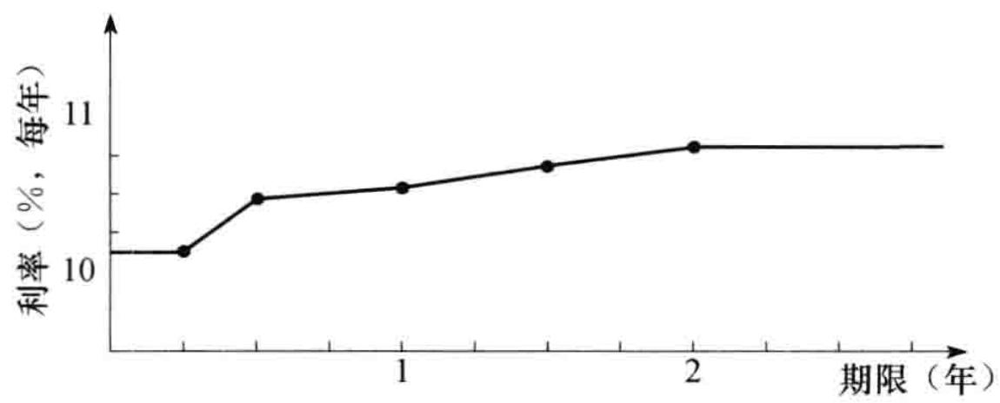
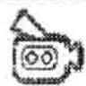
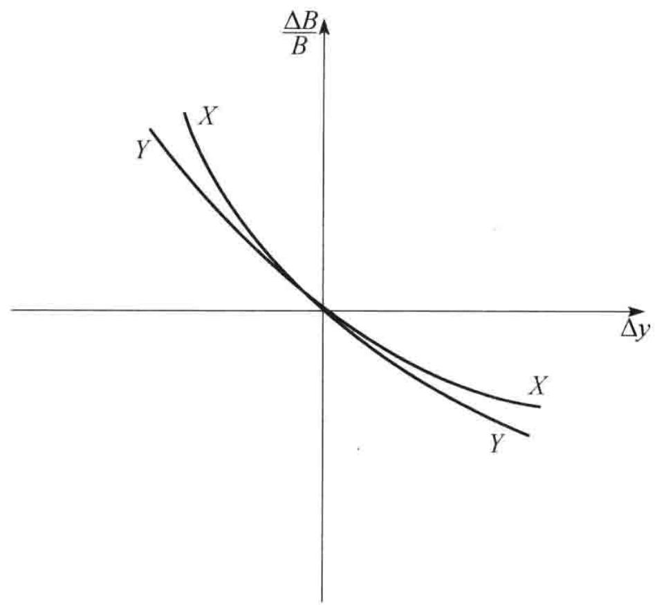
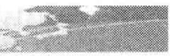
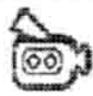
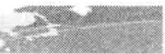
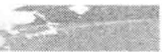
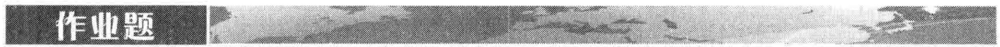

# 第4章 利率的种类

利率定义了在一定情况下借入方承诺支付给借出方的资金数量。在任何货币中都会经常引用许多种类型的利率，其中包括住房抵押贷款利率、存款利率、最优客户利率（prime borrowing rate）等。特定情形下所用的利率与信用风险有关，信用风险是指因为借入方对偿还本金和利息的承诺违约而造成的风险，信用风险越大，借入方承诺的利率也越高。

我们经常会用基点来表示利率，一个基点代表每年0.01%。

# 第4章 国债收益率

国债收益率是投资者将资金投资于国库券与国债时所挣得的收益率。国库券和国债是政府借入自身货币而发行的金融产品。日元国债收益率是指日本政府借入日元资金的利率，美国国债收益率是指美国政府借入美元的利率，等等。我们通常认为一个政府不会对自己发行并以自己货币为单位的债务违约，因此国债利率为无风险利率，即买入短期和中长期国债的投资者肯定会收到国债所承诺的本金和利息。

# 第4章 LIBOR

LIBOR 是伦敦同业银行拆借利率（London Interbank Offered Rate）的缩写，它是银行之间短期无抵押拆借利率。在每个业务日，通常是计算针对 10 种货币和 15 个借贷期限的 LIBOR 利率。借贷期限从 1 天到 1 年不等。在全球市场上，LIBOR 利率被用作好几百万亿美元交易的参考利率。一种常见的以 LIBOR 作为参考利率的衍生产品是利率互换（见第 7 章）。英国银行家协会（British Bankers Association，BBA）在每个业务日的上午 11 点半（英国时间）发布当天的 LIBOR 利率。为了计算 LIBOR 利率，英国银行家协会征询一些银行，看它们在正好上午 11 点（英国时间）以前，银行借入资金的利率。对于不同银行给出的报价，英国银行家协会删去前 1/4 的最高报价和后 1/4 的最低报价，然后计算中间数据的平均值，这个平均值就是当天的 LIBOR 报价，一般来讲，所有提供报价的银行的信用评级都是 AA 级。 $^{①}$ 因此，LIBOR 常被看作 AA 级金融机构之间的无抵押借贷利率。

在最近几年，市场上有人怀疑某些银行操纵了 LIBOR 利率。产生这些怀疑的原因有两个：一个原因是将银行的借贷利率报告的比实际利率低时，会使银行看起来比较健康；另外一个原因是像利率互换这样的交易，其现金流依赖于 LIBOR，因此有人会由此从中盈利。造成问题的原因是银行之间的拆借行为并不多，因此难以对不同的币种与借贷期限计算出关于 LIBOR 利率的精确估计。现在看来，在将来这些有关 LIBOR 利率的报价会被少数基于流动性较好的市场交易的报价所取代。

# 第4章 联邦基金利率

在美国，金融机构都要在美联储存入一定数量的现金（称为现金储备）。在任何时刻，银行需要存入现金储备的数量与银行的资产负债状态有关。在一天结束时，有些金融机构在美联储设定账户中会有资金盈余，有些金融机构会有资金缺口，这就导致了隔夜拆借。在美国，隔夜利率被称为联邦基金利率（federal funds rate）。借入和借出资金交易往往是通过经纪商来达成的，由经纪商所达成交易的利率加权平均（权重与交易规模有关）被称为有效联邦基金利率（effective federal funds rate），该利率由中央银行监控。在必要时，央行可以通过自身交易来对利率的水平进行调整。其他国家也有类似于美国的机制。例如，在英国，经纪商达成的平均利率被称作为英镑隔夜指数平均（stering overnight index average, SONIA）；在欧元区，相应的利率被称作是欧元隔夜指数平均（euro overnight index average, EONIA）。

LIBOR 和联邦基金利率均为无抵押利率。除了 2007 年 8 月到 2008 年 12 月这一段时间以外，平均来讲，隔夜 LIBOR 利率比有效联邦基金利率要高 6 个基点（0.06%）。造成两个利率差别的原因包括：时间差异、英国借贷群体和纽约借贷群体的不同以及伦敦和纽约结算机制的不同。 $^{②}$

# 第4章 再回购利率

与 LIBOR 和联邦基金利率不同，再回购（repo）利率是有抵押借贷利率。在再回购合约中，拥有证券的金融机构同意将证券出售给合约的另一方，并在将来以稍高价格将证券买回。金融机构由此得到的是贷款，所支付的利息等于证券卖出与买入之间的差价，相应的利率被称为再回购利率（repo rate）。

如果仔细地设计再回购合约，这种交易几乎没有信用风险。如果借款人不履行合约，那么借出方可以保留证券。如果借出方不履行合约，那么证券的原拥有人可以保留现金。最流行的再回购合约是隔夜回购（overnight repo），这种回购合约每天都要重新设定。但是期限较长的合约，即所谓的期限回购（term repo）有时也会被从业者使用。因为再回购利率对应于有抵押借贷，所以再回购利率比相应的联邦基金利率要稍低一些。

# 第4章 “无风险”利率

衍生产品的定价一般是通过建立一个无风险投资组合，然后使投资组合的回报等于无风险利率。因此无风险利率在衍生产品定价过程中起着一个关键性的作用。在本书的大部分地方我们会用到无风险利率，但并不明确说明无风险利率指的是什么。这是因为从事衍生产品交易的从业人员对于无风险利率有几个不同的近似。在传统上一直将 LIBOR 利率作为无风险利率，尽管我们知道 LIBOR 利率并非是无风险，因为 AA 级的金融机构对于短期借贷有很小的违约可能性。最近在市场上出现了一些变化，在第 9 章里我们将讨论从业者在选取无风险利率时会考虑的一些问题，以及一些有关的理论问题。

## 4.2 利率的度量

银行注明 1 年的储蓄利率为 10%，这句话听起来虽然非常直接并且含义清楚，但事实上这句话的精确含义依赖于利率的计算方式。

如果利率计算方式是 1 年复利 1 次，银行所说的 10% 利率是指 100 美元在年终会增长为

100 \times 1.1 = 110 (\text{美元})
$$

如果利率的计算方式为每半年复利 1 次，这表示每 6 个月会挣取 5% 的利息，而且利息也被用于再投资，这时 100 美元在 1 年后将会增长为

$$
100 \times 1.05 \times 1.05 = 110.25 (\text{美元})
$$

当利率计算方式为每季度复利 1 次，银行所说的利率是指每 3 个月会挣取 2.5% 的利息收入，而且所得利息均用于再投资，这样 100 美元在 1 年后将会增长为

$$
100 \times 1.025^{4} = 110.38 (\text{美元})
$$
表 4-1 列出了复利频率增长的影响。
$$

$$
表 4-1 利率为每年 10%，复利频率的增长对于 100 美元在 1 年后价值的影响
$$

$$
<table><tr><td>复利频率</td><td>100 美元投资在年底的价值(美元)</td><td>复利频率</td><td>100 美元投资在年底的价值(美元)</td></tr><tr><td>每年 1 次(m=1)</td><td>110.00</td><td>每月 1 次(m=12)</td><td>110.47</td></tr><tr><td>每半年 1 次(m=2)</td><td>110.25</td><td>每周 1 次(m=52)</td><td>110.51</td></tr><tr><td>每季度 1 次(m=4)</td><td>110.38</td><td>每日 1 次(m=365)</td><td>110.52</td></tr></table>
$$

$$
复利频率定义了在计算利率时的时间单位。1年复利1次的利率可以被转换成以按不同复利频率的等价利率。例如，由表4-1我们可以看到1年复利1次 $10.25\%$ 利率与1年复利2次 $10\%$ 利率等价，利率在不同计息频率下的关系可以与公里同英里之间的关系相比，它们代表的
$$

$$
是不同的计量单位。
$$

$$
为了推广以上结果，我们假设将数量为 $A$ 的资金投资 $n$ 年。如果利率是按年复利，那么投资的终值为
$$
A (1 + R) ^{n}
$$

如果利率是1年复利 $m$ 次，投资终值为

$$
A \left(1 + \frac{R}{m}\right) ^{m n}\tag{4-1}
$$
当 $m = 1$ 时所对应的利率有时被称为等值年利率（equivalent annual interest rate）。
$$

$$
## 连续复利
$$

$$
复利频率 m 趋于无穷大时所对应的利率叫按连续复利（continuous compounding）利率。 $^{①}$ 在连续复利情况下，可以证明数量为 A 的资金投资 n 年时，投资的终值为
$$
A \mathrm{e}^{R n}\tag{4-2}
$$

其中 $\mathrm{e} = 2.71828$ 。大多数计算器中都有计算指数函数 $\mathrm{e}^x$ 的功能，所以计算式（4-2）时不会产生任何麻烦。在表4-1的例子中， $A = 100, n = 1, R = 0.1$ ，按连续复利时数量为 $A$ 的资金在投资1年后将增长到

$$
100 \mathrm{e}^{0.1} = 110.52 (\text{美元})
$$
这个精确到小数点后两位的数值与用每天复利所得的结果一样。在大多数实际情况下，我们可以认为连续复利与每天复利等价。对一笔资金以利率 R 连续复利 n 年相当于乘上 $e^{Rn}$ 项。而对一笔在第 n 年后的资金以利率 R 按连续复利进行贴现，其效果是相当于乘上 $e^{-Rn}$ 。
$$

$$
在本书中，除非特别指明，利率将按连续复利来计算。习惯于按每年、每半年、每季度或其他复利频率的读者可能在开始时会感到别扭。但是，在衍生产品定价中，连续复利利率的应用非常广泛，所以应当习惯它的使用。
$$

$$
假设 $R_{c}$ 是连续复利利率, $R_{m}$ 是与之等价的每年 $m$ 次复利利率。由式（4-1）与式（4-2），我们得出
$$
A \mathrm{e}^{R_{c} n} = A \left(1 + \frac{R_{m}}{m}\right) ^{m n}
$$

或

$$
\mathrm{e}^{R_{c}} = \left(1 + \frac{R_{m}}{m}\right) ^{m}
$$

这就是说

$$
R_{c} = m \ln \left(1 + \frac{R_{m}}{m}\right)\tag{4-3}
$$

和

$$
R_{m} = m (\mathrm{e}^{R_{c} / m} - 1)\tag{4-4}
$$
这些式子可以将每年 $m$ 次复利的利率转换为连续复利的利率，反之亦然。自然对数函数 $\ln x$ 是指数函数的反函数（inverse function），其定义为：如果 $y = \ln x$ ，那么 $x = \mathrm{e}^{y}$ 。在大多数计算器里都有计算这个函数的功能。
$$

$$
## 例4-1
$$

$$
利率报价为每年 $10\%$ 按半年复利。因此 $m = 2, R_{m} = 0.1$ ，由式（4-3）得出，与之等价的连续复利利率为
$$
2 \ln \left(1 + \frac{0.1}{2}\right) = 0.09758
$$
即每年9.758%。
$$

$$
例4-2
$$

$$
假设某贷款人对贷款利率的报价为每年 $8\%$ ，连续复利，利息每季度支付1次，因此 $m = 4$ ， $R_{c} = 0.08$ 。由式（4-4）得出，与之等价的按季度复利的利率为
$$
4 \times (\mathrm{e}^{0.08 / 4} - 1) = 0.0808
$$
即每年 $8.08\%$ 。这意味着，对于1000美元的贷款，每季度支付利息为20.20美元。
$$

$$
## 4.3 零息利率
$$

$$
n 年的零息利率是指在今天投入资金并连续保持 n 年后所得的收益率。所有的利息以及本金都在 n 年末支付给投资者，在 n 年满期之前，不支付任何利息收益。n 年期的零息利率有时也叫作 n 年期的即期利率（spot rate），或者 n 年期零息率（zero rate），或者 n 年期的零率（zero）。假如 5 年期连续复利的零息利率是每年 5%，这意味着今天的 100 美元在投资 5 年后会增长到
$$
100 \times \mathrm{e}^{0.05 \times 5} = 128.40 (\text{美元})
$$
许多在市场上直接观察到的利率并不是纯零息利率。考虑一个票息为 $6\%$ 的5年期政府债券，这个债券本身的价格并不能决定5年期的零息利率，这是因为债券的一些券息发生在5年后的到期日之前。在本章以后的内容中，我们将讨论如何由带票息的债券市场价格计算零息利率。
$$

$$
## 4.4 债券定价
$$

$$
大多数债券提供周期性的票息，债券发行人在债券满期时将债券的本金（有时也称为票面值或面值）偿还给投资者。债券的理论价格等于对债券持有人在将来所收取的现金流贴现后的总和。有时债券交易者用单一贴现率对债券的所有现金流进行贴现，但更精确的办法是对不同现金流采用不同的零息贴现率。
$$

$$
为了说明这一点，假设零息利率由表4-2给出（我们在今后将说明如何计算这些值），表中的利率是按连续复利。假设一个两年期债券的面值为100美元，券息为 $6\%$ ，每半年付息一次。为了计算第1个3美元票息的现值，我们用 $5.0\%$ 的6个月贴现率贴现；为了计算第2个3美元票息的现值，我们用 $5.8\%$ 的1年贴现率，依次类推。因此债券的理论价格为
$$
3 \mathrm{e}^{- 0.05 \times 0.5} + 3 \mathrm{e}^{- 0.058 \times 1.0} + 3 \mathrm{e}^{- 0.064 \times 1.5} + 103 \mathrm{e}^{- 0.068 \times 2} = 98.39
$$
即 98.39 美元。
$$

$$
表 4-2 国债零息利率
$$

$$
<table><tr><td>期限(年)</td><td>零息利率(连续复利,%)</td><td>期限(年)</td><td>零息利率(连续复利,%)</td></tr><tr><td>0.5</td><td>5.0</td><td>1.5</td><td>6.4</td></tr><tr><td>1.0</td><td>5.8</td><td>2.0</td><td>6.8</td></tr></table>
$$

$$
## 4.4.1 债券收益率
$$

$$
债券收益率是指将此收益率用于对债券所有的现金流进行贴现时，所得价值等于债券的市场价格。假设我们上面考虑的债券理论价格也就是其市场价格，即98.39美元（这里的债券市场价格与表4-2中数据完全一致）。如果 $y$ 表示按连续复利的债券收益率，我们有
$$
3 \mathrm{e}^{- y \times 0.5} + 3 \mathrm{e}^{- y \times 1.0} + 3 \mathrm{e}^{- y \times 1.5} + 103 \mathrm{e}^{- y \times 2} = 98.39
$$
这一方程式的解可以通过迭代的方式（“试错法”）得出，其解为 $y = 6.76\%$ 。
$$

$$
## 4.4.2 平价收益率
$$

$$
对应于具有某一期限的债券，平价收益率（par yield）是使债券价格等于面值（par value）（这里的面值与本金是一样的）的券息率。债券通常每半年支付一次券息。假定债券每年支付的券息为 $c$ （或每6个月 $c / 2$ ）。采用表4-2中的零息利率，当以下方程成立时债券价格等于其面值，即100，
$$
\frac{c}{2} \mathrm{e}^{- 0.05 \times 0.5} + \frac{c}{2} \mathrm{e}^{- 0.058 \times 1.0} + \frac{c}{2} \mathrm{e}^{- 0.064 \times 1.5} + (100 + \frac{c}{2}) \mathrm{e}^{- 0.068 \times 2.0} = 100
$$
我们可以直接计算这一方程的解： $c = 6.87\%$ 。两年的平价收益率为 $6.87\%$ ，按半年复利（或 $6.75\%$ 按连续复利）。
$$

$$
一般地讲, 如果 $d$ 为债券到期时收到 1 美元的贴现值, $A$ 为一个年金 (annuity, 即在每个券息日支付 1 美元) 现金流的当前价值, $m$ 是每年券息支付的次数, 那么平价收益率满足
$$
100 = A \frac{c}{m} + 100 d
$$

因此

$$
c = \frac{(100 - 100 d) m}{A}
$$

在我们的例子中， $m = 2$ ， $d = \mathrm{e}^{-0.068\times 2} = 0.87284$ ，以及

$$
A = \mathrm{e}^{- 0.05 \times 0.5} + \mathrm{e}^{- 0.058 \times 1.0} + \mathrm{e}^{- 0.064 \times 1.5} + \mathrm{e}^{- 0.068 \times 2.0} = 3.70027
$$
这个公式证实了平价收益率为每年6.87%。
$$

$$
## 4.5 确定国库券零息利率
$$

$$
确定像表 4-2 里所示零息利率的一种方法是通过观测票息剥离产品（strips）所对应的利
$$

$$
率，这些产品是由交易员将国库券的本金和票息分开卖出时人工生成的无息证券。
$$

$$
另一种确定零息收益率的方法是通过一般的短期国债和国库券，最流行的方法是所谓的票息剥离方法（bootstrap method）。为了说明这一方法，考虑表4-3中有关5个债券价格的数据。因为前三个债券不支付票息，很容易计算对应于这些证券期限的零息
$$

$$
表 4-3 票息剥离法数据
$$

$$
<table><tr><td>债券本金(美元)</td><td>期限(年)</td><td>年票息(美元) $^1$ </td><td>债券价格(美元)</td></tr><tr><td>100</td><td>0.25</td><td>0</td><td>97.5</td></tr><tr><td>100</td><td>0.50</td><td>0</td><td>94.9</td></tr><tr><td>100</td><td>1.00</td><td>0</td><td>90.0</td></tr><tr><td>100</td><td>1.50</td><td>8</td><td>96.0</td></tr><tr><td>100</td><td>2.00</td><td>12</td><td>101.6</td></tr></table>
$$

$$
①票息每半年支付一次。
$$

$$
利率。第1个债券的结果是将97.5美元的投资在第3个月后变成100美元，因此3个月的连续复利利率 $R$ 满足
$$
100 = 97.5 \mathrm{e}^{R \times 0.25}
$$

即 $10.127\%$ 。类似地，6个月的连续复利利率 $R$ 满足

$$
100 = 94.9 \mathrm{e}^{R \times 0.5}
$$

即 10.469%，一年的连续复利利率 R 满足

$$
100 = 90 \mathrm{e}^{R \times 1.0}
$$
即 10.536%。
$$

$$
第 4 个债券的期限为 1.5 年，票息和本金支付如下：
$$

$$
6个月时：4美元
$$

$$
1年时：4美元
$$

$$
1.5年时：104美元
$$

$$
由前面的计算，对于在6个月后支付的利息应采用贴现率 $10.469\%$ ，对于在1年后支付的利息应采用贴现率 $10.536\%$ 。我们知道债券价格为96美元，它必须等于债券持有人所有收入现值的总和。假定在1.5年所对应的零息利率为 $R$ ，那么
$$
4 \mathrm{e}^{- 0.10469 \times 0.5} + 4 \mathrm{e}^{- 0.10536 \times 1.0} + 104 \mathrm{e}^{- R \times 1.5} = 96
$$

以上方程可被简化为

$$
\mathrm{e}^{- R \times 1.5} = 0.85196
$$

即

$$
R = - \frac{\ln (0.85196)}{1.5} = 0.10681
$$
因此 1.5 年所对应的零息利率为 10.681%。这是唯一与 6 个月期限、1 年期限以及表 4-3 数据一致的零息利率。
$$

$$
2年期的零息利率也可以通过类似的方法由6个月、1年以及1.5年的零息利率来求得：假定 $R$ 为两年期的零息利率，我们有
$$
6 \mathrm{e}^{- 0.10469 \times 0.5} + 6 \mathrm{e}^{- 0.10536 \times 1.0} + 6 \mathrm{e}^{- 0.10681 \times 1.5} + 106 \mathrm{e}^{- R \times 2.0} = 101.6 (\text{美元})
由此得出 R = 0.10808，即 10.808%。

表 4-4 总结了计算的结果。表示零息利率与期限关系的图形叫零息利率曲线（zero curve）。在由票息剥离法所得数值节点之间，一般假定零息利率曲线为线性（这意味着在我们的例子中 1.25 年的零息利率等于 $0.5 \times 10.536 + 0.5 \times 10.681 = 10.6085\%$ ）。通常还假定在零息曲线上第 1 个节点之前的利率和超出最后一个节点的利率为水平。图4-1 就是建立在这些假设下的零息曲线。采用期限更长的债券，我们可以将零息曲线推广到两年以上。

表 4-4 由表 4-3 数据所得出的连续复利利率

<table><tr><td>期限(年)</td><td>零息利率(连续复利,%)</td></tr><tr><td>0.25</td><td>10.127</td></tr><tr><td>0.50</td><td>10.469</td></tr><tr><td>1.00</td><td>10.536</td></tr><tr><td>1.50</td><td>10.681</td></tr><tr><td>2.00</td><td>10.808</td></tr></table>

图4-1 由票息剥离法得出的零息利率

在实际中，一般在市场上并没有期限正好等于1.5年、2年、2.5年等的债券。分析员通常的做法是在计算零息利率曲线之前首先对债券价格数据进行插值。例如，如果已知在2.3年到期、券息为 $6\%$ 的债券的价格为98，以及在2.7年到期、券息为 $6.5\%$ 的债券的价格为99，分析员可能会假定2.5年到期的、券息率为 $6.25\%$ 的债券价格为98.5。

## 4.6 远期利率

远期利率（forward interest rate）是由当前零息利率所隐含的对应于将来时间区间的利率。为了说明远期利率的计算方式，我们假设如表4-5中第2列所示的一组零息利率。假设这些利率是按连续复利，因此，1年期 $3\%$ 年利率意味着今天投资100美元，在1年后投资者将得到 $100\mathrm{e}^{0.03\times 1} = 103.05$ 美元；2年期 $4 \%$ 年利率意味着今天投资100美元，在2年后投资者会得到 $100\mathrm{e}^{0.04\times 2} = 108.33$ 美元，等等。

表4-5中第2年的远期利率为每年 $5\%$ 。这是由第1年年末与第2年年末的零息利率而隐含出的在第2年之间的利率，即由1年期每年 $3\%$ 的利率与2年期每年 $4\%$ 的零息利率计算得出的。这个用于第2年内的利率与第1年的利率结合将会得出2年期的利率 $4\%$ 。为了说明正确答案为每年 $5\%$ ，假定你投资100美元。第1年利率是 $3\%$ 和第2年利率是 $5\%$ 将意味着在第2年年末的收益是

100 \mathrm{e}^{0.03 \times 1} \mathrm{e}^{0.05 \times 1} = 108.33 (\text{美元})
将投资连续以 4% 利率投资两年得出的收益为
100 \mathrm{e}^{0.04 \times 2}
$$
也是 108.33 美元。这一例子说明一个一般结论：当利率按连续复利表达时，将相互衔接的时间段上的利率结合在一起，整个时间区间上的等价利率为各个时段利率的平均值。在我们的例子中，把第 1 年利率 3% 和第 2 年利率 5% 平均将会得到 2 年的利率 4%。对于非连续复利的利率，这一结论只是近似地成立。
$$

$$
表 4-5 计算远期利率
$$

$$
<table><tr><td>期限(年)</td><td>对应于n年投资零息利率(每年,%)</td><td>第n年的远期利率(每年,%)</td><td>期限(年)</td><td>对应于n年投资零息利率(每年,%)</td><td>第n年的远期利率(每年,%)</td></tr><tr><td>1</td><td>3.0</td><td></td><td>4</td><td>5.0</td><td>6.2</td></tr><tr><td>2</td><td>4.0</td><td>5.0</td><td>5</td><td>5.3</td><td>6.5</td></tr><tr><td>3</td><td>4.6</td><td>5.8</td><td></td><td></td><td></td></tr></table>
$$

$$
第3年的远期利率是由2年期的零息利率 $4\%$ 与3年期的零息利率 $4.6\%$ 所隐含而出的，结果为每年 $5.8\%$ 。这是因为以 $4\%$ 利率投资2年以后再以 $5.8\%$ 利率投资1年将得出3年期平均年利率为每年 $4.6\%$ 。用类似的方法可以计算其他远期利率，结果如表4-5第3列所示。一般来讲，如果 $R_{1}$ 和 $R_{2}$ 分别对应期限为 $T_{1}$ 和 $T_{2}$ 的零息利率， $R_{F}$ 为 $T_{1}$ 与 $T_{2}$ 之间的远期利率，那么
$$
R_{F} = \frac{R_{2} T_{2} - R_{1} T_{1}}{T_{2} - T_{1}}\tag{4-5}
$$
为了说明这一公式，考虑表4-5中第4年的远期利率： $T_{1}=3$ ， $T_{2}=4$ ， $R_{1}=0.046$ ， $R_{2}=0.05$ ，公式给出 $R_{F}=0.062$ 。
$$

$$
式（4-5）可以被写成
$$
R_{F} = R_{2} + (R_{2} - R_{1}) \frac{T_{1}}{T_{2} - T_{1}}\tag{4-6}
$$

这一公式说明如果零息利率曲线在 $T_{1}$ 与 $T_{2}$ 之间向上倾斜, 即 $R_{2} > R_{1}$ , 那么 $R_{F} > R_{2}$ (在 $T_{2}$ 结束的时间段上的远期利率大于期限为 $T_{2}$ 的零息利率)。类似地, 如果零息曲线为向下倾斜, 即 $R_{2} < R_{1}$ , 那么 $R_{F} < R_{2}$ (远期利率小于期限为 $T_{2}$ 的零息利率)。在式 (4-6) 中令 $T_{2}$ 接近于 $T_{1}$ , 并将共同值记为 $T$ , 我们得到

$$
R_{F} = R + T \frac{\partial R}{\partial T}
$$

其中 R 是期限为 T 的零息利率，以这种方式得到的 $R_{F}$ 被称为是 T 的瞬时远期利率（instantaneous forward rate），这是用于在 T 开始的一段很短时间里的远期利率。这一利率适用于由时刻 T 开始的一段很短的时间区间。定义 $P(0, T)$ 为在时刻 T 到期的零息债券的价格，因为 $P(0, T) = e^{-RT}$ ，瞬时远期利率的方程也可以写成

$$
R_{F} = - \frac{\partial}{\partial T} \mathrm{ln} P (0, T)
假如表4-5给出了大型金融机构借入与借出资金的利率，这时金融机构可以锁定远期利率。例如，假设金融机构借入100美元，利率是3%，期限为1年，然后以4%的利率将资金投资2年。结果现金流是在第1年年末流出 $100e^{0.03\times1}=103.05$ 美元，在第2年年末收入 $100e^{0.04\times2}=108.33$ 美元。因为 $108.33=103.05e^{0.05}$ ，在第2年的收益等于远期利率5%。也可以按5%的利率借入100美元，期限为4年，并同时以4.6%利率投资3年。在第3年年末收入 $100e^{0.046\times3}=114.80$ 美元，在第4年年末流出 $100e^{0.05\times4}=122.14$ 美元。因为 $122.14=114.80e^{0.062}$ ，资金在第4年的借款利率为远期利率6.2%。

如果投资者认为将来的利率会与今天的远期利率不同，那么投资者就会发现市场上有许多交易策略非常具有吸引力（见业界事例4-1）。其中一种做法是利用远期利率合约（forward rate agreement），我们在下面讨论这种合约的运作机制和定价方式。

## 业界事例 4-1 奥兰治县对收益曲线的赌博

假设一个大型投资者可以按表4-5所示的利率借出或借入资金，并认为在今后5年内1年期的利率不会有太大的变化。这个投资者可以借入1年期的资金并将资金投资5年。1年期借款可以在第1年年末、第2年年末、第3年年末和第4年年末向前滚动1年。如果利率确实保持不变，这种投资策略会大约每年盈利 $2.3\%$ ，这是因为收入的利率为 $5.3\%$ 而支出的利率为 $3\%$ 。这种投资方式叫作收益曲线赌博（yield curve play）。投资者认为将来的利率会与今天所观察到的远期利率很不相同，并对此观点进行投机（在我们的例子中，今天观察到的4个1年期远期利率分别为 $5\%$ 、 $5.8\%$ 、 $6.2\%$ 和 $6.5\%$ ）。

在 1992 年和 1993 年，美国奥兰治县资金主管罗伯特·西特伦（Robert Citron）非常成功地利用了以上的投机方式。西特伦所做交易的盈利对奥兰治县的预算做出了巨大贡献，而他本人也因此得以连任（在选举中有人指出这一投资方式风险太大，但没有人听取这一反对意见）。

在 1994 年西特伦进一步扩大了这种方式的投机，他选用了大量反向浮息债券（inverse float-ers），这种债券的票息为某一固定利率同某一浮动利率之间的利差，他通过在再回购市场上借入短期资金的方式进一步加大了杠杆效应。假如短期利率保持不变或下降的话，他依然会保持很好的收益。但在 1994 年利率急剧上涨，在 1994 年 12 月 1 日奥兰治县宣布其投资组合损失了 15 亿美元。在几天之后，奥兰治县宣布寻求破产保护。

## 4.7 远期利率合约

远期利率合约（FRA）是一种场外交易，这种交易的目的是锁定在将来一段时间借入或借出一定数量资金时的利率。在 FRA 合约中，借入和借出资金的利率常常设为 LIBOR。

如果合约中约定的固定利率大于对应于同一时间段的 LIBOR 利率，借入方要支付借出方的数量等于固定利率与 LIBOR 利率的差乘以面值；在相反情形下，借出方要支付借入方，数量等于 LIBOR 利率与固定利率的差乘以面值。因为利息是在时间段的末端支付的，所以这里所支付的利率之差的时间也是在时间段的末端，然而通常是在区间开始时支付经过贴现以后的数量，见例 4-3。

例4-3

假定一家公司签订了一项 FRA 合约，目的是使这家公司在 3 年后在 1 亿美元本金上收入 4% 的 3 个月期限固定利率。在 FRA 中公司将 LIBOR 转换成了 4% 的固定利率，期限为 3 个月。如果在 3 年后，3 个月期限 LIBOR 为 4.5%，资金借出方在 3.25 年时的现金流为

100000000 \times (0.04 - 0.045) \times 0.25 = - 125000 (\text{美元})
这一现金流与在3年时的以下现金流等价
- \frac{125000}{1 + 0.045 \times 0.25} = - 123609 (\text{美元})
$$
因此，对于交易对手而言，在3.25年时现金流为+125000美元，或在3年时现金流为+123609美元（在这一例子中所有利率均为按季度复利）。
$$

$$
考虑以下远期利率合约，其中公司 X 同意在 $T_{1}$ 和 $T_{2}$ 之间将资金借给公司 Y。定义
$$

$$
$R_{K}$ : FRA 中的约定利率;
$$

$$
$R_{F}$ ：由今天计算的介于时间 $T_{1}$ 和 $T_{2}$ 之间的 LIBOR 利率； $^{①}$
$$

$$
$R_{M}$ ：在时间 $T_{1}$ 观察到的 $T_{1}$ 和 $T_{2}$ 之间的真正 LIBOR 利率；
$$

$$
L: 合约的本金。
$$

$$
与以往不同，在这里我们将不采用连续复利的假设。我们假设 $R_{K}$ 、 $R_{F}$ 和 $R_{M}$ 的复合频率均与这些利率相对应的区间保持一致。这意味着，如果 $T_{2} - T_{1} = 0.5$ ，那么这些利率为每半年复利一次；如果 $T_{2} - T_{1} = 0.25$ ，那么这些利率为每季度复利一次，等等（这一假设与市场上关于FRA的做法一致）。
$$

$$
一般来讲，公司 X 由 LIBOR 贷款所得收益应当为 $R_{M}$ ，但 FRA 会使其收益为 $R_{K}$ 。签订 FRA 会使公司 X 得到额外利率（也可能为负）为 $R_{K} - R_{M}$ 。利率是在 $T_{1}$ 设定并在 $T_{2}$ 付出，因此对于 X 而言，额外利率会导致在 $T_{2}$ 有以下数量的现金流
$$
L (R_{K} - R_{M}) (T_{2} - T_{1})\tag{4-7}
$$

与此类似，对于Y而言，在 $T_{2}$ 的现金流为

$$
L (R_{M} - R_{K}) (T_{2} - T_{1})\tag{4-8}
$$
由式（4-7）和式（4-8）我们可以得出对于FRA的另外一种解释：在FRA中，X同意在 $T_{1}$ 与 $T_{2}$ 之间对本金收入固定利率 $R_{K}$ ，并同时付出在市场上所实现的LIBOR利率 $R_{M}$ ，公司Y对本金在 $T_{1}$ 与 $T_{2}$ 之间付出固定利率 $R_{K}$ ，并同时收入LIBOR利率 $R_{M}$ 。这种对FRA的理解对于我们在[第7章](ch07.md)里讨论互换时很重要。
$$

$$
通常 FRA 是在 $T_{1}$ 时刻（而不是在 $T_{2}$ 时刻）进行交割，因此必须将收益从 $T_{2}$ 贴现到 $T_{1}$ 。对于公司 X，在时刻 $T_{1}$ 的收益为
$$
\frac{L (R_{K} - R_{M}) (T_{2} - T_{1})}{1 + R_{M} (T_{2} - T_{1})}
$$

而对于公司 Y，在 $T_{1}$ 时刻的收益为

$$
\frac{L (R_{M} - R_{K}) (T_{2} - T_{1})}{1 + R_{M} (T_{2} - T_{1})}
$$
定价
$$

$$
为了对 FRA 定价, 我们首先注意当 $R_{K} = R_{F}$ 时, FRA 的价格是 0。当双方刚刚进入合约时, $R_{K}$ 被设定为 $R_{F}$ 的当前取值, 因此对于交易双方而言, 合约的价值为 0。随着时间变化, 利率会有所变化, FRA 合约的价值也就不再为 0。
$$

$$
衍生产品合约在一个时刻的市场价值被称为是其逐日盯市（mark-to-market，MTM）的价值，为了计算一个收入固定利率合约的FRA的MTM价值，我们考虑以下由两个FRA组成的投资组合。第1个FRA承诺在时间 $T_{1}$ 与 $T_{2}$ 之间收入的利率为 $R_{K}$ ，本金为L；第2个FRA承诺在 $T_{1}$ 和 $T_{2}$ 之间支付利率 $R_{F}$ ，本金也是L。第1个FRA在时刻 $T_{2}$ 的回报为 $L(R_{K}-R_{M})(T_{2}-T_{1})$ ，第2个FRA在时刻 $T_{2}$ 的回报为 $L(R_{M}-R_{F})(T_{2}-T_{1})$ ，投资组合的整体回报等于 $L(R_{K}-R_{F})(T_{2}-T_{1})$ ，该回报在今天为确定量，投资组合是一个无风险投资，其价值等于在 $T_{2}$ 时刻收益的贴现值，即
$$
L (R_{K} - R_{F}) (T_{2} - T_{1}) \mathrm{e}^{- R_{2} T_{2}}
$$

其中 $R_{2}$ 为 $T_{2}$ 期限的无风险利率。 $^{③}$ 因为第2个FRA中支付 $R_{F}$ , 其价值为0。在第1个FRA中收入 $R_{K}$ , 其价值是

$$
V_{\mathrm{FRA}} = L (R_{K} - R_{F}) (T_{2} - T_{1}) \mathrm{e}^{- R_{2} T_{2}}\tag{4-9}
$$

与此类似，支付 $R_{\kappa}$ 的FRA价值是

$$
V_{\mathrm{FRA}} = L \left(R_{F} - R_{K}\right) \left(T_{2} - T_{1}\right) \mathrm{e}^{- R_{2} T_{2}}\tag{4-10}
$$
将式（4-7）与式（4-9），或式（4-8）与式（4-10）进行比较，我们看到可以采取以下过程为FRA定价：
$$

$$
(1) 假定在远期利率会被实现的前提下（即 $R_{M} = R_{K}$ ）计算收益；
$$

$$
(2) 将收益用无风险利率进行贴现。
$$

$$
在第 7 章里对互换（FRA 组合）定价时，我们将会用到这个结果。
$$

$$
例4-4
$$

$$
假定第 1.5 年与第 2 年之间的远期 LIBOR 利率为 5%（每半年复利一次），某公司在此之前进入了一个 FRA 合约，约定该公司将收入 5.8%（每半年复利一次），同时将支付 LIBOR 利率，面值为 1 亿美元。2 年期限的无风险利率为 4%（连续复利）。由式（4-9），我们得出 FRA 的价值为
$$
100000000 \times (0.058 - 0.050) \times 0.5 \mathrm{e}^{- 0.04 \times 2} = 369200 (\text{美元})
$$
## 4.8 久期
$$

$$
顾名思义，债券的久期（duration）是指投资者收到所有现金流所要等待的平均时间。一个 $n$ 年期零息债券的久期为 $n$ 年，而一个 $n$ 年带券息（coupon-bearing）债券的久期小于 $n$ 年，这是因为持有人在 $n$ 年之前就已经收到一些现金付款。
$$

$$
假定债券在 $t_i$ 时刻给持有人提供的现金流为 $c_i (1 \leqslant i \leqslant n)$ 。债券价格 $B$ 与收益率 $y$ （连续复利）之间的关系式为
$$
B = \sum_{i=1} ^{n} c_{i} \mathrm{e}^{- y t_{i}}\tag{4-11}
$$

债券久期 $D$ 的定义是

$$
D = \frac{\sum_{i=1} ^{n} t_{i} c_{i} \mathrm{e}^{- y t_{i}}}{B}\tag{4-12}
$$

也可以写为

$$
D = \sum_{i=1} ^{n} t_{i} \left[ \frac{c_{i} \mathrm{e}^{- y t_{i}}}{B} \right]
$$
以上方括号中的项为 $t_i$ 时刻债券支付的现金流现值与债券价格的比率，而债券价格等于所有将来支付的现值总和，因此久期是付款时间 $t_i$ 的加权平均，其中对应于 $t_i$ 的权重等于 $t_i$ 时刻的支付现值与债券总值的比率，这里的所有权重相加等于1。注意为了定义久期，所有贴现均采用债券收益率 $y$ （对于不同现金流，我们没有像在4.4节描述的那样采用不同的零息利率）。
$$

$$
当收益率有微小变化时，以下公式近似成立
$$
\Delta B = \frac{\mathrm{d}B}{\mathrm{d}y} \Delta y\tag{4-13}
$$

由式（4-11），上式可以写成

$$
\Delta B = - \Delta y \sum_{i=1} ^{n} c_{i} t_{i} \mathrm{e}^{- y t_{i}}\tag{4-14}
$$

(注意 $B$ 与 $y$ 之间呈反向关系: 当收益率增加时, 债券价格降低; 而当收益率减小时, 债券价格升高)。由式 (4-12) 和式 (4-14), 我们可以得出下面关于久期的重要公式

$$
\Delta B = - B D \Delta y\tag{4-15}
$$

或写成

$$
\frac{\Delta B}{B} = - D \Delta y\tag{4-16}
$$
式（4-16）是关于债券价格百分比变化同收益率之间的一个近似关系式，这个公式非常易于使用，这也是为什么当麦考利（Macaulay）最初在 1938 年提出久期概念以后被广泛采用的原因。
$$

$$
表 4-6 久期的计算
$$

$$
<table><tr><td>期限(年)</td><td>现金流(美元)</td><td>现值(美元)</td><td>权重</td><td>年份×权重</td></tr><tr><td>0.5</td><td>5</td><td>4.709</td><td>0.050</td><td>0.025</td></tr><tr><td>1.0</td><td>5</td><td>4.435</td><td>0.047</td><td>0.047</td></tr><tr><td>1.5</td><td>5</td><td>4.176</td><td>0.044</td><td>0.066</td></tr><tr><td>2.0</td><td>5</td><td>3.933</td><td>0.042</td><td>0.083</td></tr><tr><td>2.5</td><td>5</td><td>3.704</td><td>0.039</td><td>0.098</td></tr><tr><td>3.0</td><td>105</td><td>73.256</td><td>0.778</td><td>2.333</td></tr><tr><td>合计</td><td>130</td><td>94.213</td><td>1.000</td><td>2.653</td></tr></table>
$$

$$
考虑一个面值为 100 美元、券息为 10% 的 3 年期债券。该债券按连续复利的年收益率为 12%，即 y=0.12。债券每 6 个月付息一次，券息值为 5 美元。表 4-6 显示有关债券久期的计算步骤，在计算中将收益率作为贴现率，计算出的现值被列在表中的第 3 列（例如第 1 次付息的现值为 $5e^{-0.12 \times 0.5} = 4.709$ ），第 3 列数字之和等于债券价格 94.213。将第 3 列中数字除以 94.213 美元即可得到久期的权重，第 5 列数字之和等于久期，即 2.653 年。
$$

$$
DV01 对应于当所有利率都变化一个基点时，价格的变化。Gamma 对应于利率变化一个基点时，DV01 的变化。以下例子验证了久期关系式（4-15）的精确性。
$$

$$
例4-5
$$

$$
由表 4-6 所描述的债券价格为 94.213，久期为 2.653，根据式（4-15）
$$
\Delta B = - 94.213 \times 2.653 \times \Delta y
$$

即

$$
\Delta B = - 249.95 \times \Delta y
$$

当收益率增加 10 个基点（=0.1%），即 $\Delta y = +0.001$ 后，久期公式给出 $\Delta B$ 的近似结果为

$$
\Delta B = - 249.95 \times 0.001 = - 0.250
$$

由久期公式所预计的债券价格会下降到 $94.213 - 0.25 = 93.963$ ，为了检验这个结果的准确性，我们计算当收益率增加 10 个基点到 $12.1\%$ 时的债券价格

$$
5 \mathrm{e}^{- 0.121 \times 0.5} + 5 \mathrm{e}^{- 0.121 \times 1.0} + 5 \mathrm{e}^{- 0.121 \times 1.5} + 5 \mathrm{e}^{- 0.121 \times 2.0} + 5 \mathrm{e}^{- 0.121 \times 2.5} + 105 \mathrm{e}^{- 0.121 \times 2.5} = 93.963
$$
这一数值同我们用久期公式预计的变化相同（精确到小数点后第3位）。
$$

$$
## 4.8.1 修正久期
$$

$$
以上的分析是建立在收益率 $y$ 为连续复利的前提之下。如果 $y$ 为1年复利1次的利率，可以证明这时的相应近似式（4-15）为
$$
\Delta B = - \frac{B D \Delta y}{1 + y}
$$

在 $y$ 为1年 $m$ 次复利的一般情形下

$$
\Delta B = - \frac{B D \Delta y}{1 + y / m}
$$

由

$$
D^{*} = - \frac{D}{1 + y / m}
$$

定义的变量 $D^{*}$ 为债券的修正久期（modified duration）。久期关系式可以简化为

$$
\Delta B = - B D^{*} \Delta y\tag{4-17}
$$
其中 $y$ 是以每年复利 $m$ 次所表示的收益率，以下的例子验证了修正久期的精确性。
$$

$$
## 例4-6
$$

$$
由表 4-6 描述的债券价格为 94.213，久期为 2.653。按每年复利两次的收益率为 12.3673%，修正久期为
$$
D^{*} = \frac{2.653}{1 + 0.123673 / 2} = 2.4985
$$

由式（4-17）我们得出

$$
\Delta B = - 94.213 \times 2.4985 \times \Delta y
$$

或

$$
\Delta B = - 235.39 \times \Delta y
$$
当收益率（1年复利2次）增加10个基点（0.1%），即 $\Delta y = +0.001$ 时，由久期关系式估计的债券价格变化为 $\Delta B$ 为 $-235.39 \times 0.001 = -0.235$ ，因此债券价格下降到 94.213 - 0.235 = 93.978。这个结果的精确度有多高呢？通过与前面例子相同的计算，我们可以得出当收益率增加10个基点到12.4673%时，债券的价格为93.978。这说明当债券收益率变化很小时，修正久期计算公式是非常精确的。
$$

$$
另外一个常用的名词为绝对额久期（dollar duration），这一变量为修正久期与债券价格的乘积，因此 $\Delta B = -D_{s} \Delta y$ ，其中 $D_{s}$ 为绝对额久期。
$$

$$
## 4.8.2 债券组合
$$

$$
债券组合的久期 $D$ 可以被定义为构成债券组合中每一个债券久期的加权平均, 其权重与相应债券价格成正比。式 (4-15) 至式 (4-17) 在这里仍然适用, 其中 $B$ 为债券组合的价值。这些方程可以用来估计当所有债券收益率都有一个微小变化 $\Delta y$ 时对证券组合价值的影响。
$$

$$
当将久期的概念用于债券组合时, 我们隐含地假设了所有债券的收益率变化都大致相同, 认识到这一点是很重要的。当债券有不同的期限时, 只有当零息利率曲线的变化是平行移动时, 情形才会是这样。因此我们应将式 (4-15) 至式 (4-17) 理解为当零息收益率曲线有微小的平行移动 $\Delta y$ 时, 对于债券组合价值的估计。
$$

$$
通过确保资产久期等于负债久期来对冲所面临的利率风险（即净久期为0），金融机构可以消除由于收益率曲线微小平行移动所带来的风险，尽管这样，金融机构仍然会对大的平行移动与非平行移动存在风险敞口。
$$

$$
## 4.9 曲率
$$

$$
久期仅适用于当收益率变化很小的情形。图4-2 显示了两个具有相同久期的交易组合价值百
$$

$$
分比变化与收益率变化之间的不同形式。这两条曲线在原点的斜率相同，这意味着，当收益率的变化很小时，两个交易组合价值变化的百分比相同，这与式（4-16）一致。但当利率变化较大时，两个组合价值变化不同。组合 $X$ 与收益率之间关系的曲率比组合 $Y$ 要大。一种叫作曲率（convexity）的变量可以用来衡量曲线的弯曲（curvature）程度，它可以用来改善式（4-16）的精确性。
$$

$$
测量曲率的一种方式是：
$$
C = \frac{1}{B} \frac{\mathrm{d} ^{2} B}{\mathrm{dy} ^{2}} = \frac{\sum_{i=1} ^{n} c_{i} t_{i=1} ^{2} \mathrm{e}^{- y t_{i}}}{B}

利用泰勒阶数展开，我们可以得到一个比式（4-13）

更精确的表达式

图4-2 两个具备同样久期的交易组合

\Delta B = \frac{\mathrm{d}B}{\mathrm{d}y} \Delta y + \frac{1}{2} \frac{\mathrm{d} ^{2} B}{\mathrm{d}y^{2}} \Delta y^{2}\tag{4-18}
由此可以得出
\frac{\Delta B}{B} = - D \Delta y + \frac{1}{2} C (\Delta y) ^{2}
对于给定的久期，当债券组合提供的收入均匀地分布在很长时间区间上时，组合的曲率一般是最大的；而当收入都集中在某一个时间附近时，曲率会最小。通过选择使净久期与净曲率为零的资产与债务组合，金融机构可以使自身对零息利率曲线相对较大的平行移动所引起的风险得到免疫，然而组合仍含有零息曲线非平行移动所带来的风险。

## 4.10 利率期限结构理论

我们很自然会问是什么因素决定了零息利率曲线的形状。为什么有时曲线向下倾斜，有时向上倾斜，而有时会部分向下倾斜与部分向上倾斜。关于这一点有几种理论，其中最简单的是预期理论（expectations theory）：这一种理论假设长期利率应该反映所期望的未来短期利率。更精确地讲，这一理论认为对应于将来某一段时间的远期利率等于这一段时间在未来的即期利率的期望值。另外一种理论是市场分割理论（market segmentation theory）：这一理论认为短期、中期以及长期利率之间没有任何关系。在这一理论中，类似于大型退休金等投资者只投资于某些期限的债券，并不会改变期限。短期利率由短期债券市场的供需关系来决定，中期利率由中期债券市场的供需关系来决定，以此类推。

最有说服力的是流动性偏好理论（liquidity preference theory）。这一理论的基本假设是投资者喜欢保持资金的流动性，并因此将资金投资于较短的期限。另一方面，借贷人一般喜欢借入较长期限的固定利率。流动性偏好理论造成了远期利率高于将来零息利率期望值的情形，这与所观察到的收益率曲线常常是向上倾斜（而不是向下倾斜）的实证结果是一致的。

## 4.10.1 净利息收入管理

为了理解流动性偏好理论，我们可以考虑银行接受存款和发放贷款时所面临的利率风险。净利息收入（net interest income）是指利息收入与利息支出的差，银行必须对净利息收入进行妥善管理。

为了展示利息收入的不同变化，我们假定某银行给客户提供1年与5年的存款利率，同时又给客户提供1年与5年的住房贷款利率，这些利率由表4-7所示。为了简化分析，我们假设将来的1年期利率期望值同今天市场上的1年利率相

表 4-7 银行给客户提供各种利率

<table><tr><td>期限(年)</td><td>存款利率(%)</td><td>住房贷款(按揭)利率(%)</td></tr><tr><td>1</td><td>3</td><td>6</td></tr><tr><td>5</td><td>3</td><td>6</td></tr></table>

同。不严格地讲，市场认为利率上涨与利率下降有相同的可能性，由此我们可以说由表4-7显示的利率是“公平”的，因为它们正确地反映了市场的期望（也就是对应于预期理论）。将资金投放1年然后再投资4年会同一个5年的投资带来相同的回报。类似地，以1年期借入资金然后接下4年里每年都再进行融资，这样同一个5年期的贷款会带来一样的融资费用。

假定你将资金存入银行，并且你认为利率上涨与利率下降有相同的可能性，你此时是会将资金以 $3\%$ 的利率存1年还是会以 $3\%$ 利率存5年？你此时往往会将资金存1年，因为将资金锁定在较短期限里会给你带来许多方便。

现在假定你需要住房贷款，你仍然认为利率上涨与下降的可能性相同，你此时是会选一个1年期 $6\%$ 的住房贷款还是会选一个5年期 $6\%$ 的住房贷款？这时你往往会选择一个5年期的住房贷款。因为这样做会将你的借款利率锁定在今后5年，从而你会面临较小的再融资风险。

当银行提供由表 4-7 所示的利率时, 大多数存款客户会选择 1 年期存款, 同时大多数住房贷款客户会选择 5 年期贷款。这样一来, 银行的资产与付债就会产生不匹配的现象, 从而对净利息收入产生风险敞口。利息降低时不会产生问题, 银行的贷款收入仍为 $6\%$ , 而支撑贷款的存款利息低于 $3\%$ 。因此利息收入会增加。但当利率上涨时, 银行贷款收入仍为 $6\%$ , 存款费用高于 $3\%$ , 由此使银行净利息收入降低, 当 1 年利率上涨幅度达到 $3\%$ 时, 利息收入会变为零。

资产负债管理部门的职责就是将带来收入的资产期限与带来利息费用的负债期限进行匹配。一种手段是提高5年的存款与住房贷款利率。例如，我们可以将利率调节为表4-8的形式，这时5年期的存款利率为 $4\%$ ，5年期的贷款利率为

表 4-8 提高 5 年期利率以达到资产负债的匹配

<table><tr><td>期限(年)</td><td>存款利率(%)</td><td>住房贷款(按揭)利率(%)</td></tr><tr><td>1</td><td>3</td><td>6</td></tr><tr><td>5</td><td>4</td><td>7</td></tr></table>

7%。这样做会将5年期存款与1年期住房贷款变得相对来讲更有吸引力，一些选择表4-7中1年期存款的投资者会将自己的资金转入到表4-8中所示的5年期存款；一些选择表4-7中5年期住房贷款的顾客会选择1年期住房贷款。这样所带来的效果可以使资产和负债得以匹配。如果顾客仍然过多地选择1年期存款和5年期住房贷款而造成资产负债的不平衡，我们可以进一步提高5年期存款和贷款利率，这样会逐渐消除资产负债的失衡。

如果所有银行均按以上所描述的方式进行资产负债管理，其效果是长期利率比预期的将来短期利率要高，这一现象就是所谓的流动性偏好理论。在大多时候收益率曲线都是向上倾斜，只有当市场预期短期利率会剧烈下跌时才会出现向下倾斜的现象。

许多银行都已经建立了一套完善的系统来监测客户的业务决策行为，当看到资产与负债有不匹配现象时，它们可以对利率做稍微调整。有时利率互换（在[第7章](ch07.md)中将会讨论）等衍生产品也会被用来管理利率风险敞口，这样做银行会保证利息收入的稳定并达到减少风险的目的。但并不是所有的银行都能做到这一点。在美国，20世纪80年代一些信贷公司和1984年大陆伊利诺伊破产的原因在很大程度上是由于资产和负债的不匹配所引起的，这些失败都为美国的纳税人带来了巨大损失。

## 4.10.2 流动性

除了以上描述的问题以外，投资组合期限的不匹配还会造成流动性困难。考虑一家金融机构，其5年期的固定利率贷款由3个月的批发存款来支撑。金融机构认识到自身对利率上升的风险敞口，因此对利率风险进行了对冲（一种做法是利用前面提到过的利率互换）。这样做以后，金融机构仍然会有流动性风险。批发存款人有可能会对金融机构失去信心，因此在短期内不愿意再将资金借给金融机构，即使有足够多股权资本的金融机构仍会深陷流动性的泥潭，甚至遭遇破产。如业界事例4-2所示，这一类流动性问题是在2007年开始的金融危机中一些金融机构破产的主要原因。

## 业界事例 4-2 流动性和 2007 \~ 2009 年金融危机

在2007年7月开始的信用危机中，有一种“择优而栖”现象，这是指金融机构和投资人不愿承担信用风险，只进行安全投资。依赖于短期融资的金融机构遭遇流动性困难。英国的北岩（Northern Rock）银行就是一个例子。北岩按揭贷款资金依赖于批发存款，这些存款的期限只有3个月。在2007年9月，忧心忡忡的贷款人不愿意再将贷款续借给北岩，即在3个月后不愿将资金继续存在北岩。这造成了北岩对自身资产失去了资金支持。英国政府在2008年年初接手了北岩。在美国，一些像贝尔斯登和雷曼兄弟这样的银行也遭遇了类似的流动性困难，这些金融机构同样利用短期批发存款作为融资来源支撑机构的部分运作。

对于衍生产品交易员来讲，国债利率和 LI-BOR 利率是两个非常重要的利率。国债利率是当政府借入自身货币的资金而支付的利率，LI-BOR 利率是银行在行业之间为借入短期资产而支付的利率。

利率的复利频率定义了度量利率的单位。1年复利1次的利率与1年复利4次的利率差别可以类比为英里同公里的差别。在分析期权及更复杂的衍生产品时，分析员常常采用连续复利的形式。

在金融市场中的报价采用许多不同类型的利率，而且分析员也常常计算这些利率。n年零息（或n年即期市场）利率对应于一个n年期并且所有投资收益均发生在到期日的一种投资的收益率，债券的平值收益率是使得其价格等于面值的券息率。远期利率是从今天零息收益曲线计算而应用于将来一段时间的利率。

一种计算零息曲线的常用方法是所谓的票息剥离法，这一方法由短期产品出发，循序渐进地利用长期限产品来计算利率。在计算过程中要保证在每一阶段计算的零息利率使得输入的产品价格与计算出的产品价格一致。交易平台常常采用这种方法来计算国债零息利率曲线。

远期利率合约（FRA）是一种场外交易。在此交易中，在将来某一时段一方将一种利率（常常是 LIBOR）与另一个指定的利率交换。对 FRA进行定价可以通过假定远期利率等于在将来实现的利率，然后对相应的收益进行贴现来进行。

在利率市场中，久期是一个重要概念。久期衡量了投资组合价格对零息收益率曲线平行移动变化的敏感度。准确地讲

\Delta B = - B D \Delta y

其中 B 为投资组合价值，D 为组合价值的久期，$\Delta y$ 为零息曲线平行移动的微小变量， $\Delta B$ 是由 $\Delta y$ 引起的组合价值变化。

流动性偏好理论可以用于解释现实中的利率期限结构。这一理论指出：大多数个人以及公司喜欢借长放短。为了保证借入资金与借出资金期限的匹配，金融机构有必要提高长期利率以使得远期利率高于将来即期利率的期望值。

Fabozzi, F. J. Bond Markets, Analysis, and Strategies, 8th edn. Upper Saddle River, NJ: Pearson, 2012.

Grinblatt, M., and F. A. Longstaff. “Financial Innovation and the Role of Derivatives Securities: An Empirical Analysis of the Treasury Strips Program,” Journal of Finance, 55, 3 (2000): 1415–36.

Jorion, P. Big Bets Gone Bad: Derivatives and Bankruptcy in Orange County. New York: Academic Press, 1995.

Stigum, M., and A. Crescenzi. Money Markets, 4th edn. New York: McGraw Hill, 2007.

## 练习题

4.1 一家银行的利率报价为每年 $14\%$ ，每季度复利一次。在以下不同的复利机制下对应的利率是多少？（a）连续复利，（b）1年复利1次。

4.2 LIBOR 与 LIBID 的含义是什么？哪一个更高？

4.36个月期与1年期的零息利率均为每年 $10\%$ 。一个剩余期限还有18个月，券息率为 $8\%$ （刚刚付过半年1次的券息）的债券，收益率为 $10.4\%$ 的债券价格为多少？18个月期的零息利率为多少？这里的所有利率均为每半年复利一次。

4.4 一个投资者在年初投入1000美元，年末收入1100美元。计算投资在不同复利机制下的收益率（a）1年复利1次，（b）1年复利2次，（c）每月复利1次，（d）连续复利。

4.5 假设连续复利的零息利率如下：

<table><tr><td>期限(以月计)</td><td>利率(%,年)</td></tr><tr><td>3</td><td>8.0</td></tr><tr><td>6</td><td>8.2</td></tr><tr><td>9</td><td>8.4</td></tr><tr><td>12</td><td>8.5</td></tr><tr><td>15</td><td>8.6</td></tr><tr><td>18</td><td>8.7</td></tr></table>

计算第2季度、第3季度、第4季度、第5季度和第6季度的远期利率。

4.6 假定零息利率如练习题 4.5 所示，一个收入 3 个月期固定利率为 9.5% 的 FRA 价值为多少？这里 FRA 的面值为 100 万美元，起始日期为 1 年以后，利率复利为每季度一次。

4.7 利率期限结构向上倾斜，将以下变量按大小排列：

(a) 5 年期零息利率。

(b) 5 年期带息债券的收益率。

(c) 将来从第 4.75\~5 年的远期利率。
当利率期限结构向下倾斜，结果会如何变化？

4.8 从久期你能知道债券组合对于利率有什么样的敏感度？久期有什么局限性？

4.9 与每年 $15\%$ ，按月复利等价的按连续复利的年利率是多少？

4.10 一个存款账户以每年 $12\%$ 的连续复利利率来计算利息，但利息每个季度支付一次，对应于10000美元存款在每季度的利息为多少？

4.11 假定6个月期、12个月期、18个月期、24个月期和30个月期的零息利率分别为每年 $4\%$ 、 $4.2\%$ 、 $4.4\%$ 、 $4.6\%$ 和 $4.8\%$ ，按连续复利。估计一个面值为 100 美元的债券的价格，假定此债券在第 30 个月后到期，债券券息率为每年 4%，每半年付息一次。

4.12 一个3年期债券的券息率为 $8\%$ ，每半年付息一次，债券的现金价格为104，债券的收益率为多少？

4.13 假定6个月期、12个月期、18个月期和24个月期的零息利率分别为每年 $5\%$ 、 $6\%$ 、 $6.5\%$ 和 $7\%$ 。2年期债券的平值收益率为多少？

4.14 假设连续复利的零息利率如下：

<table><tr><td>期限(以年计)</td><td>利率(%,年)</td></tr><tr><td>1</td><td>2.0</td></tr><tr><td>2</td><td>3.0</td></tr><tr><td>3</td><td>3.7</td></tr><tr><td>4</td><td>4.2</td></tr><tr><td>5</td><td>4.5</td></tr></table>

计算第2年、第3年、第4年和第5年的远期利率。

4.15 假定9个月及12个月的LIBOR利率分别为 $2\%$ 和 $2.3\%$ ，9个月和12个月之间的远期利率为多少？假定在一个FRA合约中，收入 $3\%$ 固定利率，同时支付 $9 \sim 12$ 个月之间的LIBOR利率，所有利率均为每季度复利一次，FRA的面值为1000万美元，假定LIBOR被用作无风险利率，这时FRA的价值是多少？

4.1610年期票息为 $8\%$ 的债券价格为90美元，10年期票息为 $4\%$ 的债券价格为80美元，10年期的零息利率为多少？（提示：考虑2份票息为 $4\%$ 的债券的多头和1份票息为 $8\%$ 的债券的空头。）

4.17 仔细解释为什么流动性偏好理论与市场上所观察到的利率期限结构向上倾斜多于向下倾斜这一现象一致。

4.18 “当零息利率曲线向上倾斜时，对应于某一期限的零息利率比相应期限的平值收益率要高。当零息利率为向下倾斜时，对应于某一期限的零息利率要比相应同一期限的平值收益率要低。”解释这是为什么？

4.19 为什么美国国债收益率远低于其他几乎无风险的投资收益率？

4.20 为什么再回购市场贷款的信用风险很低？

4.21 解释为什么一个FRA等价于以浮动利率交换固定利率？

4.22 一个年收益率为 $11\%$ （连续复利）的5年期债券在每年年底支付 $8\%$ 的票息，请计算

(a) 此债券价格为多少？

(b) 债券久期为多少？

(c) 运用久期公式来说明当收益率下降幅度为 0.2% 时对债券价格的影响。

(d) 重新计算年收益率为 $10.8\%$ 时债券的价格，并验证计算结果同（c）是一致的。

4.236个月期和1年期国债（零息）的价格分别为94.0美元和89.0美元。1.5年期的债券每半年付票息4美元，价格为94.84美元。2年期的债券每半年付票息5美元，价格为97.12美元。计算6个月期、1年期、1.5年期以及2年期的零息利率。

4.24 “一个利率互换中的浮动利率为6个月LIBOR，固定利率为 $5\%$ ，面值为1亿美元，这样的互换是一个FRA组合。”解释这一说法。

4.25 一个按年复利的利率为 $11\%$ ，当利率按以下复利计算时，数量分别为多少？

(a) 每半年复利一次，(b) 每季度复利一次，(c) 每月复利一次，(d) 每周复利一次，(e) 每天复利一次。

4.26 下表给出了零息国债的零息利率及现金流，零息利率为连续复利。

(a) 债券的理论价格为多少？

(b) 债券的收益率为多少？

<table><tr><td>期限(年)</td><td>零息利率(%)</td><td>票息(美元)</td><td>面值(美元)</td></tr><tr><td>0.5</td><td>2.0</td><td>20</td><td></td></tr><tr><td>1.0</td><td>2.3</td><td>20</td><td></td></tr><tr><td>1.5</td><td>2.7</td><td>20</td><td></td></tr><tr><td>2.0</td><td>3.2</td><td>20</td><td>1000</td></tr></table>

4.27 一个5年期的债券提供每年 $5\%$ 的票息，每半年支付一次，它的价格为104美元。债券的收益率为多少？

4.28 假设到期日为1、2、3、4、5和6个月的LIBOR利率分别为 $2.6\%$ 、 $2.9\%$ 、 $3.1\%$ 、 $3.2\%$ 、 $3.25\%$ 和 $3.3\%$ ，连续复利。在将来的1个月期的远期利率分别为多少？

4.29 一家银行可以按 LIBOR 利率进行贷款或放贷，2 个月期的 LIBOR 利率为每年 0.28%（连续复利）。假设利率不能为负，那么当 3 个月期的 LIBOR 为每年 0.1% 时（连续复利）存在什么样的套利机会？为保证无套利机会，3 个月期的 LIBOR 利率最低能达到多少？

4.30 一家银行可以按 LIBOR 利率进行借贷或放贷，假定6个月利率为5%，而9个月利率为6%；在6个月到9个月之间的利率可以通过FRA来锁定，其值为7%。假设所有利率均为连续复利，银行可以如何进行套利？

4.31 对一个年息 $5\%$ ，按半年复利的利率，在以下复利形式下所对应的利率为多少？(a) 1年复利1次，(b) 每月复利1次，(c) 连续复利。

4.326个月、12个月、18个月和24个月期限的零息利率分别为 $4\%$ 、 $4.5\%$ 、 $4.75\%$ 和 $5\%$ ，这里的利率为每半年复利1次。

(a) 相应的连续复利利率为多少?

(b) 在 18 个月开始的 6 个月期的远期利率为多少?

(c) 在 18 个月开始的 6 个月内支付 6% 利率（半年复利）的 FRA 价值是多少？假设本金为 100 万美元。

4.33 当零息利率由作业题 4.32 给定时，2 年的平值收益率为多少？2年期票息等于平值收益率的债券收益率为多少？

4.34 下表给出了债券价格。

<table><tr><td>债券面值(美元)</td><td>期限(以年为计)</td><td>年票息 $^1$ (美元)</td><td>债券价格(美元)</td></tr><tr><td>100</td><td>0.5</td><td>0</td><td>98</td></tr><tr><td>100</td><td>1.0</td><td>0</td><td>95</td></tr><tr><td>100</td><td>1.5</td><td>6.2</td><td>101</td></tr><tr><td>100</td><td>2.0</td><td>8.0</td><td>104</td></tr></table>

①以上表格中，每6个月支付所示利息的一半。

(a) 计算对应于 6 个月、12 个月、18 个月和 24 个月期限的零息利率。

(b) 以下时间段的远期利率为多少？6～12个月；12～18个月；18～24个月。

(c) 对于每半年支付一次票息，期限分别为6个月、12个月、18个月和24个月的债券的平值收益率为多少？

(d) 估计票息率为 $7\%$ 、每半年支付一次、2年期限债券的价格和收益率。

4.35 组合 A 由一个本金为 2000 美元的 1 年期。零息债券和一个面值为 6000 美元的 10 年期零息债券组成。组合 B 由一个面值为 5000 美元的 5.95 年期的零息债券组成。每个债券目前的收益率均是 10%。
(a) 证明两个组合具有相同的久期。

(b) 证明当两个组合的收益率每年都增长 $0.1\%$ 时，两个组合价值变化的百分比是一样的。

(c) 当收益率每年增长 $5\%$ 时，两个组合价值变化的百分比是多少？

4.36 通过 DerivaGem 来验证 4.4 节里的债券价格，并检验当收益率变化一个基点时，由 DV01 预测的价格变化精确度。由 DV01 来估计债券的久期。当收益率变化 200 个基点时，利用 DV01 和 Gamma 预测变化对于债券价格的影响。利用 Gamma 来估计债券的曲率（提示：在 DerivaGem 软件中，DV01 等于 dB/dy，其中 B 为债券价格，y 是以基点计量的收益率，Gamma 等于 $d^{2}B/dy^{2}$ ，y 是以百分比为计量的收益率。）

# 如何确定远期和期货价格

在这一章里，我们将讨论远期价格和期货价格与标的资产即期价格之间的关系。远期合约比期货合约更容易分析，这是因为对远期合约不需要每日结算（只是在到期日一次性结算），因此我们首先从远期价格与即期价格之间的关系开始。幸运的是，当同一资产上的远期合约和期货合约有相同期限时，可以证明远期价格和期货价格通常非常接近。这对我们的分析非常有用，因为有关远期合约的结论通常对期货合约也是适用的。

在本章的第一部分，我们将推导远期价格（或期货价格）与即期价格之间的一个重要关系式。然后我们利用这一结果来研究对于股指、外汇以及商品期货价格与即期价格之间的关系。我们在下一章里将考虑利率期货合约。

