# 第7章 互换合约的机制

在利率互换中，一家公司同意向另一家公司在今后指定的若干年内支付在指定名义本金上、由指定的固定利率所产生的现金流。作为回报，这家公司将从另一家公司收取在相同时间内和相同名义本金上按浮动利率产生的现金流。

### LIBOR

大多数利率互换合约中的浮动利率是[第4章](ch04.md)中引入的伦敦同业银行间拆借利率（LIBOR）。这一利率是指具有AA信用等级的银行可以从另一家银行借款所付的利率。

在国内金融市场上，最佳客户利率（prime rate）常常被用来作为浮动利率贷款的参考利率。与此相似，LIBOR 利率常常被用于国际金融市场中贷款的参考利率。为了理解 LIBOR 利率的应用方式，考虑一个 5 年期的债券，券息率为 6 个月期 LIBOR 加上 0.5%（每年）。债券的期限被分成长度为 6 个月的 10 个时间段，每个时间段（即 6 个月）所对应的券息为时间段开始时 6 个月期 LIBOR 利率加上 0.5%，而相应利息的支付是在时间段的末尾。

在本书的讨论中，我们称 LIBOR 利率与固定利率进行交换的利率互换为 LIBOR 与固定利率（LIBOR-for-fixed）互换。

### 例示

考虑一个在2014年3月5日开始、为期3年的虚拟利率互换合约。假定这一互换合约是在微软公司与英特尔公司之间达成的。我们假定微软同意向英特尔支付年息 $5\%$ 、本金1亿美元的利息；作为回报，英特尔向微软支付6个月期并且由同样本金所产生的浮动利息。微软为定

息支付方（fixed-rate payer），英特尔为浮息支付方（floating-rate payer）。我们假定合约规定双方每6个月互相交换现金流。这里的 $5\%$ 固定利率为每半年复利一次。这一互换如图7-1所示。

图7-1 微软及英特尔之间的利率互换交易

$$
第1次利息互换是在2014年9月5日，即合约达成6个月之后。微软向英特尔支付250万美元，这个数量是由年利率 $5\%$ 以及本金1亿美元在6个月时间内所产生的利息。英特尔将向微软支付浮动利息，其数量等于1亿美元按2014年9月5日之前6个月内市场上LIBOR利率所产生的利息，这个LIBOR是在3月5日确定的。假定在2014年3月5日6个月期的LIBOR利率为 $4.2\%$ ，这时英特尔向微软支付的浮动利息为 $0.5 \times 0.042 \times 1$ 亿 $= 210$ 万美元。 $^{\text{①}}$ 注意，对于首期支付的利息没有不确定性，因为这一支付利息是由在合约签署时的LIBOR来决定的。

第2次利息交换发生在2015年3月5日，即合约签署1年之后。微软将向英特尔支付250万美元。英特尔将向微软支付浮动利息，其数量等于1亿美元按2015年3月5日之前6个月内市场上LIBOR利率所产生的利息，这个LIBOR是在2014年9月5日确定的。假定在2014年9月5日的6个月期LIBOR利率为 $4.8\%$ 。因此英特尔向微软支付的浮动利息为 $0.5 \times 0.048 \times 1$ 亿 $= 240$ 万美元。

$$

这一互换总共包括6笔利息的交换，其中固定利息总是250万美元，在付款日浮动利息支付是利用付款日6个月之前确定的6个月期LIBOR来计算的。在实际中，利率互换通常只需要一方支付互换现金流的差额。在我们的例子中，在2014年9月5日微软向英特尔支付40万美元（=250-210），在2015年3月5日微软向英特尔支付10万美元（=250-240）。

表 7-1 展示了该例中对应于一组特定 6 个月期 LIBOR 所有的利息支付，这一表格是从微软公司的角度所看到的现金流。注意，这里的 1 亿美元本金只是在计算利息才被采用，本金并没有进行互换，这也就是我们为什么将它称为名义本金（notional principal）或本金的原因。

表 7-1 微软公司支付本金为 1 亿美元的固定利率 (5%)
并收入浮动利率的 3 年期利率互换的现金流 （单位：百万美元）

<table><tr><td>日期</td><td>6个月期LIBOR(%)</td><td>收入的浮动现金流</td><td>支付的固定现金流</td><td>净现金流</td></tr><tr><td>2014/03/05</td><td>4.20</td><td></td><td></td><td></td></tr><tr><td>2014/09/05</td><td>4.80</td><td>+2.10</td><td>-2.50</td><td>-0.40</td></tr><tr><td>2015/03/05</td><td>5.30</td><td>+2.40</td><td>-2.50</td><td>-0.10</td></tr><tr><td>2015/09/05</td><td>5.50</td><td>+2.65</td><td>-2.50</td><td>+0.15</td></tr><tr><td>2016/03/05</td><td>5.60</td><td>+2.75</td><td>-2.50</td><td>+0.25</td></tr><tr><td>2016/09/05</td><td>5.90</td><td>+2.80</td><td>-2.50</td><td>+0.30</td></tr><tr><td>2017/03/05</td><td></td><td>+102.95</td><td>-102.50</td><td>+0.45</td></tr></table>

如果在以上互换中交换名义本金，那么交易性质并没有改变。这是因为固定利息和浮动利息所对应的本金相同，在互换的末尾交换1亿美元资金对微软和英特尔双方都不会产生任何经济价值。表7-2展示了在表7-1中互换结束时加入本金交换后的现金流状况。这一表格给我们提供了看待互换交易一种有趣的方式：表中的第3列对应于一个浮息债券多头的现金流，第4列对应于一个定息债券空头的现金流。这说明利率互换可以看作定息债券与浮息债券的交换。微软的头寸为浮息债券的多头和定息债券的空头的组合；英特尔的头寸为浮息债券的空头和定息债券的多头的组合。

表 7-2 表 7-1 中的互换在最后交换本金时的现金流 （单位：百万美元）

<table><tr><td>日期</td><td>6个月期LIBOR(%)</td><td>收入的浮动现金流</td><td>支付的固定现金流</td><td>净现金流</td></tr><tr><td>2014/03/05</td><td>4.20</td><td></td><td></td><td></td></tr><tr><td>2014/09/05</td><td>4.80</td><td>+2.10</td><td>-2.50</td><td>-0.40</td></tr><tr><td>2015/03/05</td><td>5.30</td><td>+2.40</td><td>-2.50</td><td>-0.10</td></tr><tr><td>2015/09/05</td><td>5.50</td><td>+2.65</td><td>-2.50</td><td>+0.15</td></tr><tr><td>2016/03/05</td><td>5.60</td><td>+2.75</td><td>-2.50</td><td>+0.25</td></tr><tr><td>2016/09/05</td><td>5.90</td><td>+2.80</td><td>-2.50</td><td>+0.30</td></tr><tr><td>2017/03/05</td><td></td><td>+102.95</td><td>-102.50</td><td>+0.45</td></tr></table>

在互换中现金流的这种特性可以有助于解释为什么互换中的浮动利率在浮动利息支付前6个月就得以确定。在浮息债券中，利率通常在其适用期限的开始就得以确定并在期限的末尾支付。由表7-2所展示的“标准型”（plain vanilla）利率互换中的浮动利率反映了这一点。

### 利用互换转变负债的性质

对微软公司而言，利率互换可将其浮动利率贷款转换为固定利率贷款。假定微软公司已经安排了以 LIBOR + 10 个基点的利率借入面值 1 亿美元（一个基点是 1% 的 1%，实际贷款利率为 LIBOR + 0.1%）的贷款。当微软公司进入互换合约后，它会有以下 3 项现金流：

（1）支付给外部放款人的利率为 LIBOR + 0.1%。

(2) 在互换合约中收入 LIBOR。

(3) 在互换合约中付出 $5\%$ 的利率。

以上 3 项现金流的净效果为支出现金流的利率为 5.1%。该互换将微软的 LIBOR + 10 个基点的浮动利率贷款转换为 5.1% 的固定利率贷款。

对于英特尔公司而言，利率互换可将其固定利率贷款转换为浮动利率贷款。假定英特尔公司持有3年期 $5.2\%$ 的利率、面值为1亿美元的贷款。当英特尔公司进入互换合约后，它会有以下3项现金流：

(1) 支付给外部放款人 5.2% 利率。

(2) 在互换合约中付出 LIBOR。

(3) 在互换合约中收入 5%。

以上3项现金流的净效果为支付现金流的年率为 LIBOR + 20 个基点（即 LIBOR + 0.2%）。因此，对英特尔来讲，互换的效果是将5.2%的固定利率贷款转换为LIBOR + 0.2%的浮动利率贷款。微软与英特尔可能利用互换的方式显示在图7-2中。

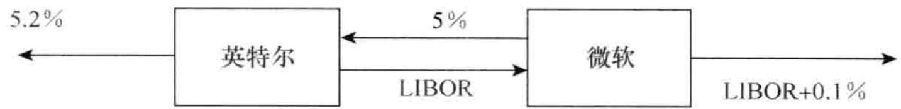图7-2 微软和英特尔采用利率互换来转变负债的性质

### 利用互换转变资产的性质

利率互换也可以转换资产的性质。考虑我们例子中的微软公司。利用利率互换，微软公司可以将收入为固定利率的资产转换为收入为浮动利率的资产。假定微软持有面值为1亿美元的3年期债券，债券每年提供的券息为 $4.7\%$ 。当微软公司进入互换合约后，它会有以下3项现金流：

(1) 债券收入为 4.7%。

(2) 在互换合约中收入 LIBOR。

(3) 在互换合约中付出 5%。

以上 3 项现金流的净效果为收入现金流的年率等于 LIBOR 减去 30 个基点。因此对于微软来讲，互换的一种应用是将收入为固定利率 4.7% 的资产转换为浮动利率 LIBOR-0.3% 资产。

接下来考虑英特尔公司。利率互换可将其浮动利率资产转换为固定利率资产。假定英特尔拥有一个1亿美元的投资，其收益为LIBOR减去20个基点。当英特尔公司进入互换合约后，它会有以下3项现金流：

(1) 投资收入为 LIBOR 减去 20 个基点。

(2) 在互换合约中付出 LIBOR。

(3) 在互换合约中收入 5%。

以上 3 项现金流的净效果为收入现金流的年率为 4.8%。对于英特尔来讲，利率互换可将其浮动利率等于 LIBOR 减去 20 个基点的资产转换为固定利率为 4.8% 的资产。微软与英特尔可能利用互换的方式显示在图7-3 中。

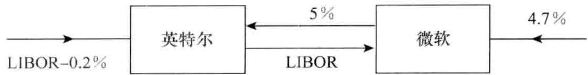图7-3 微软和英特尔采用利率互换来转变资产的性质

### 金融中介的作用

一般来讲，像微软和英特尔这样的非金融公司并不会像图7-2和图7-3所示的方式互相联系而直接进行互换交易，这些公司都会单独同银行或其他金融机构联系。在安排“标准型”固定与浮动美元利率互换时，金融机构通常会在每一对相互抵消的交易中收取3\~4个基点(0.03%\~0.04%)。图7-4 说明了在图7-2 的情况下金融机构可能扮演的角色。金融机构分别与微软公司和英特尔公司签署了两个相互抵消的互换。假定两家公司均不违约，金融机构肯定可以获得本金为 1 亿美元、年率为 0.03%（3 个基点）的盈利（在 3 年中每年盈利大约为 3 万美元）。微软最终付 5.115%（而不是图7-2 所示的 5.1%）的贷款利率；英特尔最终付 LIBOR + 21.5 个基点（而不是图7-2 所示的 LIBOR + 20 个基点）的贷款利率。

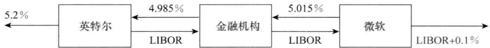图7-4 当金融机构介入时，图7-2 所对应的利率互换图7-5 说明了在图7-3 情形下金融机构的角色。互换与前面一样：如两家公司均不违约，金融机构肯定能赚取 3 个基点的利息。微软将会赚取 LIBOR 减去 31.5 基点（而不是 LIBOR 减去 30 基点），而英特尔将会挣取 4.785%（而不是像图7-3 中的 4.8%）的利率。

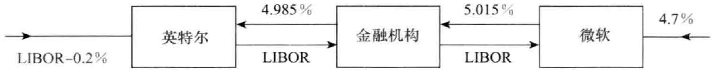图7-5 当金融机构介入时，图7-3 所对应的利率互换

注意在每一种情况下，金融机构有两个单独的合约：一个是与英特尔的，另一个是与微软的。在大多数情况下，英特尔甚至不知道金融机构与微软进行了抵消性的互换，反之亦然。如果一家公司违约，金融机构必须履行与另一方的合约。在金融机构所收入的3个基点差价中有一部分是用来补偿由于交易对手违约而带来的信用风险。

### 做市商

在实际中，两个公司不可能同时与某家金融机构接触并持有相同而且头寸相反的互换。因此，许多大型金融机构起着互换做市商的作用。这意味着金融机构在进入利率互换的同时，并不一定要进入与其他交易对手之间的互换交易。 $^{①}$ 做市商必须对自身面临的风险仔细地进行定量化，并采取对冲措施。互换合约的做市商可以采用债券、远期利率合约、利率期货等产品来对冲风险。表7-3是某做市商可能给出的关于标准美元互换的报价。一般来讲，溢差的买入-卖出差价为3\~4个基点。买入与卖出利率的平均值被称为互换利率（swap rate），表7-3的最后一列为互换利率。

表 7-3 利率互换市场中的互换利率买入和卖出报价（年利率%）；利息互换每半年一次

<table><tr><td>期限</td><td>买入价</td><td>卖出价</td><td>互换利率</td><td>期限</td><td>买入价</td><td>卖出价</td><td>互换利率</td></tr><tr><td>2</td><td>6.03</td><td>6.06</td><td>6.045</td><td>5</td><td>6.47</td><td>6.51</td><td>6.490</td></tr><tr><td>3</td><td>6.21</td><td>6.24</td><td>6.225</td><td>7</td><td>6.65</td><td>6.68</td><td>6.665</td></tr><tr><td>4</td><td>6.35</td><td>6.39</td><td>6.370</td><td>10</td><td>6.83</td><td>6.87</td><td>6.850</td></tr></table>

考虑一个新的互换合约，合约中的固定利率等于当前的互换利率。我们可以合理地假设这一互换的价值为0（不然造市商为什么会选择以互换利率为中心的买入－卖出报价呢？）。在表7-2中，我们看到互换的价值等于一个固定利率的债券与一个浮息债券的差。定义：

$B_{fix}$ ：所考虑互换中定息债券的价值。

$B_{\mathrm{fl}}$ ：所考虑互换中浮息债券的价值。

因为互换的价值为0，因此

$$
B_{\mathrm{fix}} = B_{\mathrm{fl}}\tag{7-1}
$$

在本章后面计算 LIBOR/互换零息利率曲线时，我们将用到这一结论。

## 7.2 天数计算惯例

在6.1节中我们曾讨论了天数计算惯例。天数计算惯例影响互换中支付利息的数量，但我们所给的例子中利率并没有完全反应天数计算惯例。例如，我们考虑由表7-1中6个月LIBOR利率所决定的利息，因为这里的利率为货币市场利率，因此6个月LIBOR的天数计算惯例为“实际天数/360”。表7-1中的第1个浮动利息支付为210万美元，这一利息所对应的LIBOR利率为 $4.2\%$ 。因为2014年3月5日及2014年9月5日之间总共有184天，因此利息支付数量应当为
$$
100 \times 0.042 \times \frac{184}{360} = 2.1467 (\text{百万美元})
$$

一般来讲，在互换合约中，一个基于 LIBOR 的浮动利率现金流等于 LRn/360，其中 L 为本金，R 为相关的 LIBOR 利率，n 为从上一个付款日到今天的天数。

在互换中通常也会指定固定利率的天数计算惯例。因此，在每个付款日，固定息的支付数量并不一定一样。固定利率的天数计算惯例通常为“实际天数/365”或“30/360”。这些惯例并不能与LIBOR直接相比较，因为固定利率的适用区间为一整年。为了保证利率有近似的可比性，我们要将LIBOR利率乘以365/360或将互换的固定利率乘以360/365。

为了方便叙述起见，在本章下面的计算中我们将忽略天数计算惯例的问题。

## 7.3 确认书

在互换中的确认书（confirmation）是由交易双方的代表鉴置的法律文件。确认书的初稿由总部在纽约的国际互换与衍生产品联合会（International Swaps and Derivatives Association，即ISDA，www.isda.org）提供。ISDA已经制定了一些主协议（Master Agreement）。这些主协议定义了合约的一些细节与互换合约中所采用的名词，也阐明了如果某交易方违约将如何对合约进行处理等条文。在业界事例7-1中，我们展示了微软与某家金融机构（假设为高盛）在图7-4中的互换合约确认书的摘要。一份完整的确认书可能会指明ISDA主协议里的条款适用于这一交易。



<table><tr><td>交易日(trade date):</td><td>2014年2月27日</td></tr><tr><td>生效日(effective date):</td><td>2014年3月5日</td></tr><tr><td>业务天约定(所有日期):</td><td>随后第1个工作日</td></tr><tr><td>假期日历:</td><td>美国</td></tr><tr><td>终止日:</td><td>2017年3月5日</td></tr><tr><td>固定息方</td><td></td></tr><tr><td>固定利息付出方:</td><td>微软</td></tr><tr><td>固定利息名义本金:</td><td>1亿美元</td></tr><tr><td>固定利率:</td><td>每年5.015%</td></tr><tr><td>固定利率天数计量惯例:</td><td>实际天数/365</td></tr><tr><td>固定利率付款日:</td><td>由2014年9月5日开始、直到并且包括2017年3月5日、每年的3月5日和9月5日</td></tr><tr><td>浮动息方</td><td></td></tr><tr><td>浮动利息付出方:</td><td>高盛</td></tr><tr><td>浮动利息本金:</td><td>1亿美元</td></tr><tr><td>浮动利率:</td><td>6个月期的美元LIBOR利率</td></tr><tr><td>浮动利率天数计量惯例:</td><td>实际天数/360</td></tr><tr><td>浮动利率付款日:</td><td>由2014年9月5日至2017年3月5日(包括这一天)之间所有的3月5日和9月5日</td></tr></table>

确认书中指明业务天惯例（business day convention）为随后第一个工作日（following business day）和由美国的日历来作为决定一天是工作日还是节假日。这意味着如果一个付款日刚好为周末或美国的假日，付款日会挪到下一个工作日。 $^{①}$ 2016年3月5日是星期六，因此，这一天的支付要推迟到2016年3月7日。


## 7.4 相对优势的观点

一种对互换合约在市场上如此流行的解释是所谓的相对优势（comparative-advantage）。考虑利用利率互换转换负债形态的例子：某些公司在固定利率市场贷款具有相对优势，而另一些公司在浮动利率市场贷款具有相对优势。当需要一笔新的贷款时，公司会进入自身有相对优势的市场。因此，本想借入固定利率贷款的公司可能会借入浮动利率贷款，而本想借入浮动利率贷款的公司可能会借入固定利率贷款。互换合同可以用来将固定利率贷款转化为浮动利率贷款，反之亦然。

假定两家公司 AAACorp 与 BBBCorp 均想借入 1000 万美元，期限为 5 年。表 7-4 给出了相应的贷款利率。AAACorp 公司的信用评级为 AAA；BBBCorp 公司的信用评级为 BBB； $^{①}$ 我们假定 BBBCorp 想借入固定利率贷款，AAACorp 想借入与 6 个月期 LIBOR 有关的浮动利率贷款。公司 BBBCorp 的信用等级比 AAACorp 公司差，因此，它所支付的固定利率与浮动利率都会比 AAACorp 公司更高。

表 7-4 给相对优势观点提供基础的借入资金的利率

<table><tr><td></td><td>固定利率</td><td>浮动利率</td></tr><tr><td>AAACorp</td><td>4.0%</td><td>6个月 LIBOR - 0.1%</td></tr><tr><td>BBBCorp</td><td>5.2%</td><td>6个月 LIBOR + 0.6%</td></tr></table>

提供给 AAACorp 及 BBBCorp 的利率报价中有一个重要特点：固定利率之间的差价大于浮动利率之间的差价。BBBCorp 在固定利率市场要比 AAACorp 多付 1.2%，而在浮动利率市场只多付 0.7%。BBBCorp 在浮动利率市场具有相对优势，AAACorp 在固定利率市场具有相对优势。 $^{②}$ 这一明显的差异也就触发了互换合约的形成：AAACorp 以每年 4% 借入固定利率，BBBCorp 以 LIBOR + 0.6% 借入浮动利率，然后它们进入利率互换交易，最终结果是 AAACorp 公司融资利率为浮动利率，而 BBBCorp 公司的融资利率为固定利率。

为了理解互换的运作过程，我们假定 AAACorp 公司与 BBBCorp 公司直接取得联系。它们达成的互换合约如图7-6 所示。这一互换与图7-2 的互换非常相似，AAACorp 同意向 BBBCorp 支付本金为 1000 万美元的 6 个月 LIBOR 利息。作为回报，BBBCorp 向 AAACorp 支付本金为 1000 万美元、每年 4.35% 的固定利息。

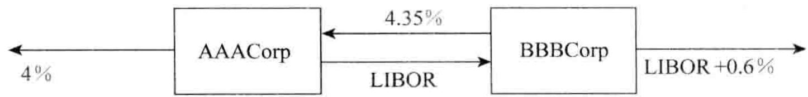图7-6 AAACorp 及 BBBCorp 之间的利率互换交易，利率由表 7-4 给出

AAACorp 会有以下 3 项现金流：

(1) 支付给外部放贷人的利率为 4%。

(2) 在互换合约中从BBBCorp收入 $4.35\%$ 。

(3) 在互换合约中向BBBCorp支付LIBOR。

以上3项现金流给AAACorp带来的净效果是支出现金流的年率为LIBOR-0.35%。这比直接在浮动市场上贷款的利率低了0.25%。当进入互换合约后，BBBCorp也有3项现金流：

(1) 支付给外部放贷人的利率为 LIBOR + 0.6%。

(2) 在互换合约中从 AAACorp 收入 LIBOR。

(3) 在互换合约中向 AAACorp 支付 4.35%。

以上3项现金流给BBBCorp带来的净效果是支出现金流的年率为 $4.95\%$ 。这比在固定利率市场的贷款利率低了 $0.25\%$ 。

在这个例子中，互换的构造使得双方均少付了 $0.25\%$ ，但不一定非是这样。很显然这类互换合约的总收益总是 $a - b$ ，其中 $a$ 为两家公司在固定利率市场的利率差， $b$ 为两家公司在浮动利率市场的利率差。在我们的例子中， $a = 1.2\%$ ， $b = 0.70\%$ ，所以总收益为 $0.5\%$ 。

如果 AAACorp 与 BBBCorp 之间并不是直接进行交易，而是利用金融机构，结果可能如图7-7 所示（这与图7-4 中的例子非常相似）。这时，AAACorp 的贷款利率为 LIBOR-0.33%，BBBCorp 的贷款利率为 4.97%，金融机构的收益为 4 个基点。AAACorp 的收益为 0.23%；BBBCorp 的收益为 0.23%；金融机构的收益为 0.04%。对于 3 方的总收益仍然等于以上所讨论的总收益差，即 0.50%。

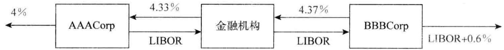图7-7 AAACorp 及 BBBCorp 之间的利率互换交易，利率由表 7-4 给出，交易中有金融机构介入

### 对相对优势观点的批评

我们刚刚描述的解释利率互换吸引力的观点存在一些问题。为什么表7-4所示的对于AAACorp及BBBCorp的利率差在固定利率市场与浮动利率市场会有所不同呢？利率互换市场已经存在了好长时间，我们可以合理地假定这种利差已经被套利者消除了。

利差差异存在的原因似乎在于这些公司在固定利率市场与浮动利率市场所能得到的这些合约的特点。AAACorp 和 BBBCorp 在固定利率市场得到的 4.0% 与 5.2% 的利率均为 5 年期（例如，公司可以发行 5 年期的债券的利率）。AAACorp 和 BBBCorp 在浮动利率市场得到的 LIBOR-0.1% 和 LIBOR + 0.6% 的利率为 6 个月的利率。在浮动利率市场上，资金的借出方通常有机会在每 6 个月内检查一次利率。当 AAACorp 及 BBBCorp 的信用等级下降时，资金的借出方可以选择在 LIBOR 利率上进行加息。甚至在极端的情形下，贷款人可以拒绝延续贷款。固定利率的贷款人没有以这种方式改变贷款条款的选择。 $^{①}$

市场提供给 AAACorp 和 BBBCorp 的贷款利率之间的价差反映了 BBBCorp 比 AAACorp 更有可能违约的程度。在今后的 6 个月内，AAACorp 及 BBBCorp 违约的机会都很小。当我们考虑更长期限时，信用等级相对较低的公司（如 BBBCorp）的违约概率比信用等级相对较高公司（如 AAACorp）的违约概率增长得更快。这也就是 5 年期的利率差价比 6 个月期的利率差价更大的原因。

在取得 LIBOR + 0.6% 的浮动利率贷款并进入图7-7 所示的互换之后，BBBCorp 似乎取得了 4.97% 的固定利率贷款。刚才的讨论说明事实并非如此。在实际中，只有在 BBBCorp 能够持续地以 LIBOR + 0.6% 借入浮动利率资金的前提下，固定利率才为 4.97%。例如，如果由于 BBBCorp 信用等级的下降而使浮动贷款利率变成了 LIBOR + 1.6%，这时 BBBCorp 所付出的利率将变为 $5.97\%$ 。市场会预计在互换有效期之内BBBCorp在LIBOR浮动利率之上的价差从平均来讲将会增加，因此在进入互换后BBBCorp借入资金的平均利率将会高于 $4.97\%$ 。图7-7 所示的互换使 AAACorp 公司在今后 5 年（而不是仅仅为 6 个月）之内锁定了 LIBOR-0.33% 的利率。对于 AAACorp 公司来讲，这似乎是一笔好交易。不利之处在于 AAACorp 必须承担金融机构违约的风险。如果公司采用通常的形式来借入资金，那么它无须承担这一风险。

## 7.5 互换利率的本质

我们现在可以考虑互换利率的本质以及互换市场与 LIBOR 市场之间的关系。在 4.1 节里我们曾经指出，LIBOR 利率是具有 AA 信用级别的银行向其他银行借入长到 12 个月期限资金的利率。而如表 7-3 所示，互换利率等于以下两个利率的平均值：（a）做市商在互换合约中收入 LIBOR，并准备付出的固定利率（买入利率），（b）做市商在互换合约中付出 LIBOR，并准备收入的固定利率（卖出利率）。

与 LIBOR 利率一样，互换利率并不是无风险利率。但是，它们同无风险利率非常接近。一家金融机构可以进行以下交易来使得一笔本金的投资收益率等于 5 年期的互换利率：

(1) 将本金借给一家信用级别为 AA 的公司, 期限为 6 个月, 并且在以后每 6 个月将相同数量的资金借给其他信用级别也为 AA 的公司;

(2) 进入一个 5 年期的互换交易, 而将 LIBOR 收入转换成 5 年期互换利率。

这说明 5 年期的互换利率等于借给 AA 级公司 10 个接连 6 个月期的 LIBOR 短期资金的收益率。类似地，7 年期的互换利率等于借给 AA 级公司的 14 个接连 6 个月期的 LIBOR 短期资金的收益率。对于其他期限的互换利率，我们也可以给出类似的解释。

注意 5 年期的互换利率小于 AA 级公司借入 5 年期资金的利率。在 5 年内每 6 个月将资金借给若干家信用级别总是为 AA 级公司比在 5 年开始时将资金借给单家信用级别为 AA 的公司并锁定 5 年期限会更具吸引力。

在讨论以上观点时，Collin-Dufresne 和 Solnik 将互换利率称为 “连续更新” 的 LIBOR 利率。

## 7.6 确定 LIBOR/互换零息利率

使用 LIBOR 利率的一个问题是我们所能直接观察到的利率期限都不超过 12 个月。如 6.3 节所述，一种将 LIBOR 零息曲线延长到长于 12 个月的方法是利用欧洲美元期货。一般来讲，欧洲美元可以用来将 LIBOR 零息曲线延长到 2 年，有时会长达 5 年，然后交易员利用利率互换将 LIBOR 零息曲线再进一步延长。所得零息曲线有时称为 LIBOR 零息曲线，有时称为互换零息曲线。为了不引起混乱，我们将其称为 LIBOR/互换零息曲线。下面我们将描述如何利用互换利率来确定 LIBOR/互换零息曲线。

第一点应注意的是如果贴现时采用 LIBOR/互换零息曲线，新发行的券息为 6 个月 LIBOR 的浮动息债券价格将总会等于本金价格（即平价）， $^{②}$ 原因是债券的利率为 LIBOR，同时贴现利率也为 LIBOR，债券的券息与贴现利率吻合。因此，债券价格为平价。

$$
在式（7-1）中，我们说明了对于一个新成交的互换交易，当固定利率等于互换利率时， $B_{\mathrm{fix}} = B_{\mathrm{fl}}$ 。我们刚才指出 $B_{\mathrm{fl}}$ 等于本金值，因此 $B_{\mathrm{fix}}$ 也等于本金值。这说明互换利率定义了一组平价债券。例如，由表7-3我们可以得出2年期LIBOR/互换平价收益率为 $6.045\%$ ，3年期的LIBOR/互换平价收益率为 $6.225\%$ ，等等。 $^{\ominus}$

$$

在 4.5 节中我们说明了如何利用票息剥离法来确定国债零息曲线。类似的方法也可以用在互换利率上来延长 LIBOR/互换零息曲线。

例 7-1

假定已经确定了6个月、12个月、18个月的LIBOR/互换零息利率分别为 $4\%$ 、 $4.5\%$ 及 $4.8\%$ （按连续复利），2年期互换利率（支付频率为每半年一次）为 $5\%$ 。 $5\%$ 的互换利率意味着本金为100美元，券息年率 $5\%$ （券息每年支付两次）的债券价格为平价。如果 $R$ 为2年期的零息利率，那么

$$
2.5 \mathrm{e}^{-0.04 \times 0.5} + 2.5 \mathrm{e}^{-0.045 \times 1.0} + 2.5 \mathrm{e}^{-0.048 \times 1.5} + 102.5 \mathrm{e}^{-2 R} = 100
$$

以上方程的解 $R = 4.953\%$ （注意在这里我们没有将天数计算惯例与假期日历考虑在内，见7.2节）。

## 7.7 利率互换的定价

我们现在考虑利率互换的定价问题。在合约刚开始时，利率互换的价值接近于0。随时间的变化，利率互换的价值可能为正，也可能为负。当LIBOR/互换利率被用作贴现利率时，利率互换有两种定价方式：第1种方式将利率互换作为两个债券的差；第2种方式将利率互换作为由FRA所组成的交易组合。DerivaGen 3.00可以用来计算以LIBOR或OIS贴现时的互换价值。

### 7.7.1 利用债券价格定价

在利率互换中，本金不进行交换。但是如表 7-2 所示，我们可以假设本金在互换的最后进行交换，这一假设并不影响互换的价值。这样做以后我们将收入固定利率而付出浮动利率的互换作为定息债券多头与浮息债券空头的组合，因此
$$
V_{\mathrm{swap}} = B_{\mathrm{fix}} - B_{\mathrm{fl}}
$$

$$
其中 $V_{\mathrm{swap}}$ 为互换的价值， $B_{\mathrm{fl}}$ 为互换中浮息债券的价值， $B_{\mathrm{fix}}$ 为互换中定息债券的价值。类似地，一个收入浮动利率并付出固定利率的互换可以作为浮息债券多头与定息债券空头的组合，因此

$$
$$
V_{\mathrm{swap}} = B_{\text{fl}} - B_{\mathrm{fix}}
$$

定息债券的价值可以由 4.4 节所描述的方式来计算。为了计算浮息债券的价格，我们注意债券在券息付出后等于其面值。因为在这时债券为 “公平交易”：借贷人对于每个计息区间所支付的利率均为 LIBOR。

假定名义本金为 $L$ ，下一个交换支付的时间为 $t^{*}$ ，而在 $t^{*}$ 支付的浮动息（在前一个付款日已确定）为 $k^{*}$ ，在支付之后，如前面所述，价值 = 在 $t^{*}$ 时刻的现值 $L + k^{*}$

$B_{\mathrm{fl}} = L$ 。因此在支付利息之前， $B_{\mathrm{fl}} = L + k^{*}$ 。因此，浮息债券可以看作在 $t^{*}$ 提供单一现金流的产品，对这一现金流进行贴现，即可得出浮动息债券在今天的价格（ $L + k^{*}$ ） $e^{-r^{*}t^{*}}$ ，其中 $r^{*}$ 为LIBOR/互换零息曲线上对应于 $t^{*}$ 的利率。图7-8展示了以上的讨论。

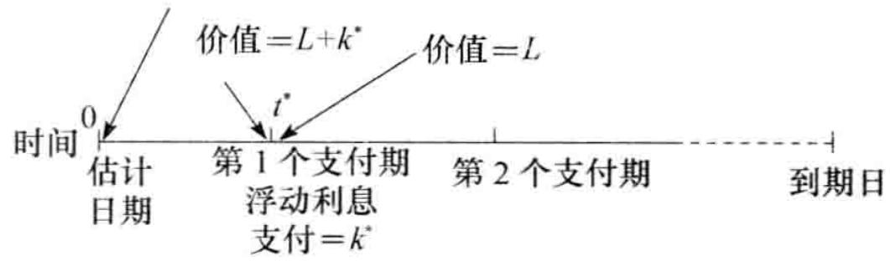图7-8 面值为 $L$ 在下一个付款日 $t^{*}$ 支付利息为 $k^{*}$ 的浮动债券的定价



假定在之前某金融机构同意在互换合约中收入6个月期的LIBOR利率并同时支付每年3%（每半年复利一次）的固定利率，互换的本金为1亿美元。互换合约还有1.25年的剩余期限。对应于期限为3个月、9个月和15个月的LIBOR利率（连续复利）分别为2.8%、3.2%和3.4%。前一个付款日所观察的6个月期LIBOR利率为2.9%（每半年复利一次）。

$$
表 7-5 总结了以债券形式对互换定价的计算。固定息债券的现金流在 3 个付款日上分别为 1.5, 1.5 和 101.5。对应于这 3 个付款日的贴现因子分别为 $e^{-0.028 \times 0.25}$ , $e^{-0.032 \times 0.75}$ , $e^{-0.034 \times 1.25}$ ，其数值结果列在表 7-5 的第 4 列。表中显示的定息债券价格（以百万美元计）为 100.2306。

表 7-5 利用债券价格来定价。其中 ${B}_{\text{fix}}$ 为互换中的定息债券, ${B}_{\mathrm{{fi}}}$ 为互换中的浮息债券

<table><tr><td>时间</td><td> $B_{fix}$ 现金流(百万美元)</td><td> $B_{fl}$ 现金流(百万美元)</td><td>贴现因子</td><td> $B_{fix}$ 现金流贴现值(百万美元)</td><td> $B_{fl}$ 现金流贴现值(百万美元)</td></tr><tr><td>0.25</td><td>1.5</td><td>101.4500</td><td>0.9930</td><td>1.4895</td><td>100.7423</td></tr><tr><td>0.75</td><td>1.5</td><td></td><td>0.9763</td><td>1.4644</td><td></td></tr><tr><td>1.25</td><td>101.5</td><td></td><td>0.9584</td><td>97.2766</td><td></td></tr><tr><td>总计</td><td></td><td></td><td></td><td>100.2306</td><td>100.7423</td></tr></table>

在该例中， $L = 1$ 亿美元， $k^{*} = 0.5 \times 0.029 \times 100 = 145$ 万美元， $t^{*} = 0.25$ 。因此，对浮息债券定价时，可以将其认为是在3个月具有10145万美元的现金流。表中显示的浮动债券价格（以百万美元计）为 $101.4500 \times 0.9930 = 100.7423$ 。

$$

债券价值为以上两个债券价格的差：

$$
V_{\mathrm{swap}} = 100.7423 - 100.2306 = 0.5117
$$

即 51.17 万美元。

如果金融机构处在相反的位置（即支付固定利率，并收入浮动利率时），互换的价值为负51.17万美元。注意，在计算中，我们没有考虑天数计算惯例以及假期日历。


### 7.7.2 利用FRA对互换定价

一个互换合约可以被当成远期利率合约的组合。考虑图7-1所示的微软与英特尔之间的互换合约，这一合约在2014年3月5日签订，期限为3年，付款频率为每半年一次。在合约成交时，我们已经知道第一个支付量为多少。其他5个支付量可以被看成FRA合约。在2015年3月5日的现金流互换可以看作固定利率 $5\%$ 与在2014年9月5日所观测到的6个月的浮动利率交换而形成的FRA；在2015年9月5日的现金流互换可以看作固定利率 $5\%$ 与在2015年3月5日所观测到的6个月的浮动利率交换而形成的FRA，等等。

如 4.7 节的末尾所示, 对 FRA 定价时可以假设远期利率在将来会得以实现。因为简单互换合约是远期利率合约 FRA 的组合, 对合约定价时我们可以假定远期利率在将来会实现, 具体过程如下:

(1) 利用 LIBOR/互换零息曲线计算每一个决定互换现金流的 LIBOR 利率所对应的远期利率;

(2) 假定 LIBOR 利率等于相应的远期利率, 并计算互换现金流;

(3) 对所得互换现金流进行贴现（利用 LIBOR/互换零息曲线）来得到互换的价值。



再一次考虑例 7-2 中的情形。在互换中，某金融机构同意支付 6 个月期的 LIBOR 并同时收入每年 3%（每半年复利一次）的固定利率。互换的本金为 1 亿美元，互换还有 1.25 年的剩余期限。对应于期限为 3 个月、9 个月和 15 个月的 LIBOR 利率（连续复利）分别为 2.8%、3.2% 和 3.4%。前一个付款日所对应的 6 个月期 LIBOR 利率为 2.9%（每半年复利一次）。

$$
表7-6总结了计算过程。表的第1行显示了在第3个月时现金流的交换，这时的现金流数量已经被确定。固定利率 $1.5\%$ 对应于 $100 \times 0.030 \times 0.5 = 150$ 万美元的现金流出。浮动利率 $2.9\%$ （在3个月以前设定）对应于 $100 \times 0.029 \times 0.5 = 145$ 万美元的现金收入。表中的第2行显示在9个月时的现金流交换，其中假设远期利率会实现。同上，现金流出为150万美元。为了计算现金流入，我们首先计算介于3个月与9个月之间的远期利率。由式（4-5），我们可以得出远期利率为
\frac{0.032 \times 0.75 - 0.028 \times 0.25}{0.5} = 0.034
$$

$$
即 $3.4\%$ （连续复利）。由式（4-4），对应于每半年复利一次的远期利率为 $3.429\%$ 。因此，收入现金流为 $100 \times 0.03429 \times 0.5 = 171.45$ 万美元。类似地，第3行显示在假定远期利率会实现时，在15个月时的现金流。对应于这3个付款日期的贴现因子分别为

$$
$$
\mathrm{e}^{-0.028 \times 0.25}, \quad \mathrm{e}^{-0.032 \times 0.75}, \quad \mathrm{e}^{-0.034 \times 1.25}
$$

表 7-6 利用 FRA 对互换定价。浮动利率现金流是假设远期利率将会被实现来计算的

<table><tr><td>时间</td><td>固定现金流(百万美元)</td><td>浮动现金流(百万美元)</td><td>净现金流(百万美元)</td><td>贴现因子</td><td>净现金流贴现值(百万美元)</td></tr><tr><td>0.25</td><td>-1.5000</td><td>+1.4500</td><td>-0.0500</td><td>0.9930</td><td>-0.0497</td></tr><tr><td>0.75</td><td>-1.5000</td><td>+1.7145</td><td>+0.2145</td><td>0.9763</td><td>+0.2094</td></tr><tr><td>1.25</td><td>-1.5000</td><td>+1.8672</td><td>+0.3672</td><td>0.9584</td><td>+0.3519</td></tr><tr><td>总计</td><td></td><td></td><td></td><td></td><td>+0.5117</td></tr></table>

在3个月支付的贴现值为-4.97万美元，与第9个月和第15个月时的交换所对应的FRA价值分别为 $+20.94$ 万美元和 $+35.19$ 万美元。互换的总价值为51.17万美元。这与例7-4中将互换分解为债券多头和空头所得出的价值一致。


## 7.8 期限结构的效应

在互换合约刚刚开始时，互换的价值接近于0。这意味着在开始时，互换中所有FRA的价值总和为0，但这并不意味着每个FRA的价值为0。一般来讲，有些FRA的价值为正，而有些FRA的价值为负。

考虑表 7-1 中所示微软与英特尔之间互换中的 FRA:

当远期利率 $>5.0\%$ 时，对于微软，FRA价值 $>0$

当远期利率 = 5.0% 时，对于微软，FRA 价值 = 0；

当远期利率 $< 5.0\%$ 时，对于微软，FRA价值 $< 0$ 。

假定利率期限结构在互换刚刚成交时为上升型，这意味着当FRA期限增长时，远期利率增大。因为所有FRA价值的总和为0，初始付款日所对应的远期利率一定小于 $5\%$ ；互换末端的付款日所对应的远期利率一定大于 $5\%$ 。因此对应前面付款日的FRA价值为负，对应于后面付款日的FRA价值为正。如果在互换刚刚成交时，利率曲线为下降型，以上结论会刚好相反。利率曲线结构形状对于互换中FRA的影响显示在图7-9中。

a)

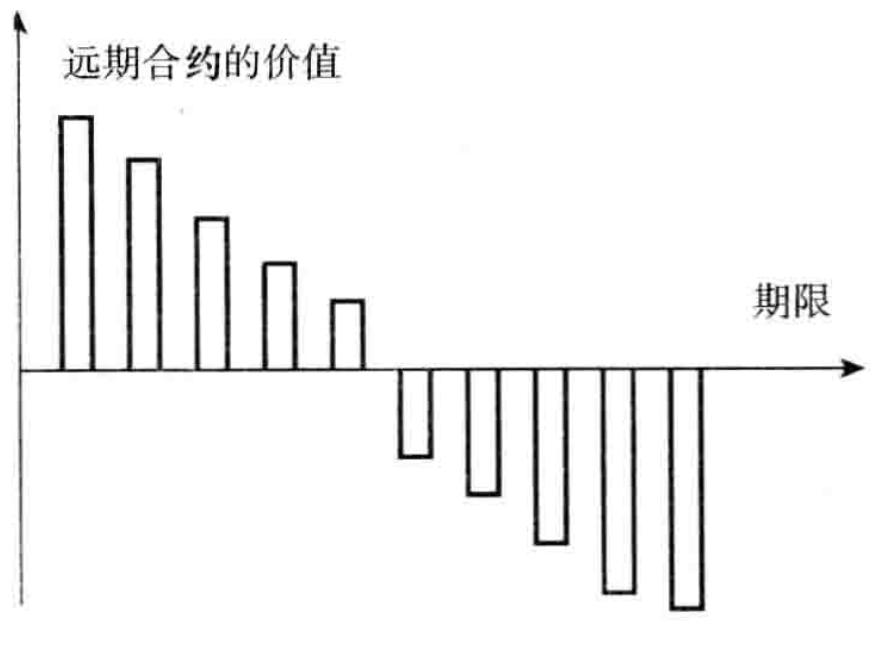

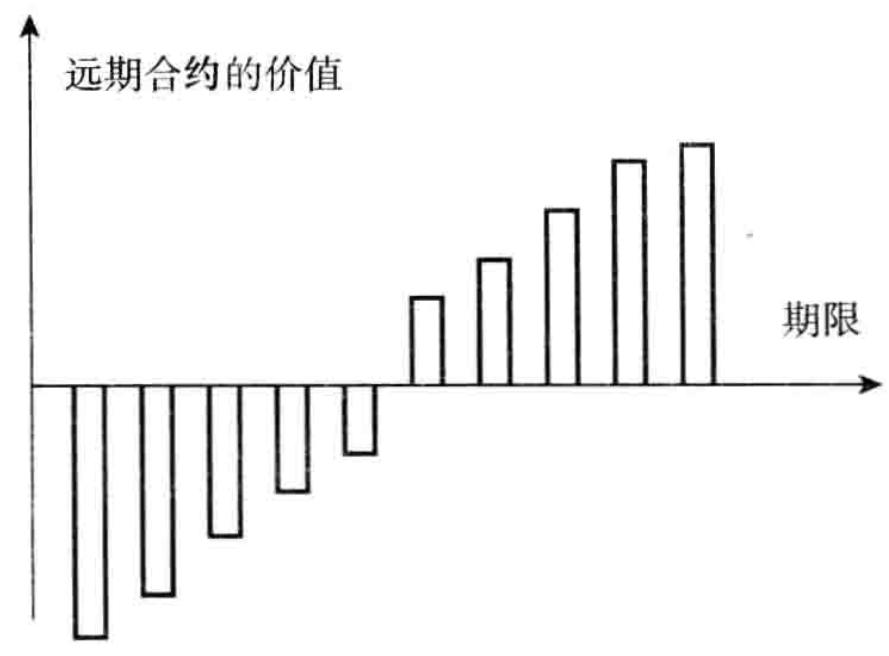
b)图7-9 互换合约中的 FRA 价格与期限的函数关系

注：在图7-9a 中，利率期限结构为上升型，在合约中我们收入固定利息；或者利率期限结构为下降型，在合约中我们收入浮动利息。在图7-9b 中，利率期限结构为上升型，在合约中我们收入浮动利息；或者利率期限结构为下降型，在合约中我们收入固定利息。

## 7.9 固定息与固定息货币互换

另外一种较为流行的互换是固定息与固定息货币互换（fixed-for-fixed currency swap），这是将一种货币下的固定利息和本金与另外一种货币下的固定利息和本金进行交换。

货币互换合约要求指明在两种不同货币下的本金数量。互换中通常包括开始时和结束时两种货币下本金的交换。通常货币本金数量的选取是使得在互换开始时的兑换率下，两种本金价值大致相同。但在最后交换时，两者的价值可能大不一样。

### 7.9.1 例示

考虑一个5年期IBM与英国石油公司（British Petroleum）之间的虚拟货币互换合约，互换的开始日期为2014年2月1日。我们假定IBM支付英镑上5%利率，同时从英国原油公司收入美元的利率为6%。现金流互换频率为一年一次，本金数量分别为1500万美元与1000万英镑。这一互换为固定息与固定息（fixed-for-fixed）的货币互换，互换之所以被如此命名是因为每个货币下所对应的利息均为固定利息。这一互换如图7-10所示。在开始时，本金的交换与图中箭头所指方向相反，在互换期限内与互换结束时，现金流与图中箭头所指方向一致。因此，在互换的开始，IBM首先支付1500万美元，同时收进1000万英镑。在互换期间的每一年里，IBM收进90万美元（即1500万美元的6%）并支付50万英镑（即1000万英镑的5%）。在互换结束时，IBM支付1000万英镑的本金同时收进1500万美元的本金。现金流如表7-7所示。

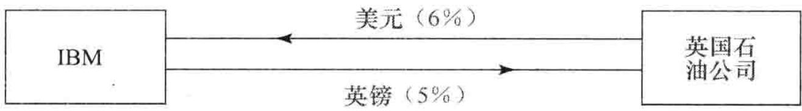图7-10 货币互换

表 7-7 货币互换中 IBM 的现金流

<table><tr><td>日期</td><td>美元现金流(百万)</td><td>英镑现金流(百万)</td><td>日期</td><td>美元现金流(百万)</td><td>英镑现金流(百万)</td></tr><tr><td>2014/02/01</td><td>-15.00</td><td>+10.00</td><td>2017/02/01</td><td>+0.90</td><td>-0.50</td></tr><tr><td>2015/02/01</td><td>+0.90</td><td>-0.50</td><td>2018/02/01</td><td>+0.90</td><td>-0.50</td></tr><tr><td>2016/02/01</td><td>+0.90</td><td>-0.50</td><td>2019/02/01</td><td>+15.90</td><td>-10.50</td></tr></table>

### 7.9.2 利用货币互换来改变债务与资产的特征

利用上面所描述的互换可以将一种货币下的贷款转化为另外一种货币下的贷款。假设 IBM 能够以 6% 的利率发行 1500 万美元债券，货币互换可以将美元债券转化为本金为 1000 万、利率为 5% 的英镑债券。最初的本金互换将发行债券的美元收入转化为英镑，之后货币互换的支付将美元利息与本金转化为英镑。

互换也可以用来转化资产的特征。假设 IBM 可以将 1000 万英镑以每年 5% 的收益率在英国投资 5 年，IBM 认为美元价格同英镑价格相比将会上涨，因此 IBM 想将其投资转化为美元的投资。货币互换的作用是将英镑投资转化成收益率为 6%、本金为 1500 万美元的投资。

### 7.9.3 相对优势

货币互换的动机可以由比较优势来解释。为了说明这一点，我们考虑另外一个虚拟的例

子：假定通用电气（General Electric，GE）与澳洲航空公司（Qantas Airways）分别借入美元与澳元（AUD）的5年期固定利率如表7-8所示。表中的数据显示澳元的利率比美元的利率高，并且通用电气在两种货币下所对应的信用等级都比澳洲航空好，所以在两种货币下通用电气所能得到的利率都好过澳洲航空。从互换交易员的角度来看，有意思的是表7-8中数据说明通用电气在两种不同货币下所付利率的差价与澳洲航空所付利率的差价不同。澳洲航空在美元市场所付的利率比通用电气要高 $2\%$ ，而在澳元市场只高 $0.4\%$ 。

表 7-8 为货币互换提供基础的利率表

<table><tr><td></td><td>美元 $^1$ </td><td>澳元 $^1$ </td></tr><tr><td>通用电气</td><td>5.0</td><td>7.6</td></tr><tr><td>澳洲航空</td><td>7.0</td><td>8.0</td></tr></table>

①表中报价已经体现了不同税率的影响。

这一现象同表 7-4 类似：通用电气在美元市场具有比较优势，而澳洲航空在澳元中具有比较优势。在表 7-4 中考虑标准利率互换时，我们曾指出比较优势的论点只不过是一种假象。而在这里我们比较的是在不同货币下的利率，比较优势的论点很可能是真实的。可能造成比较优势的一种原因是纳税环境：由于通用电气所处的地位，借入美元资金可能会使其在全球范围内收入的税率低于借入澳元所面临的税率。澳洲航空所处的位置可能刚好相反（注意，我们假设表 7-8 所提供的利率已经反映了这种税率上的优势）。

我们假定通用电气想借入2000万澳元，而澳洲航空想借入1800万美元，并且当前的汇率为0.9000（每美元所对应的澳元数量）。这是产生货币互换的完美情形：通用电气与澳洲航空在自身具有比较优势的市场借入资金，即通用电气借入美元，澳洲航空借入澳元，然后通过货币互换可以将通用电气的美元贷款转化为澳元贷款，并同时将澳洲航空的澳元贷款转化成美元贷款。

我们已经指出，两家公司以美元借入资金的差价为 $2\%$ ，以澳元借入资金的差价为 $0.4\%$ 。同利率互换的例子类似，我们期望对于交易各方的总收益为 $2 - 0.4 = 1.6\%$ （每年）。

互换有多种形式。图7-11显示了当金融机构介入时的情形。这时，通用电气借入美元，澳洲航空借入澳元。互换对通用电气的效果是将每年 $5\%$ 的美元利息转换为每年 $6.9\%$ 的澳元利息，这比通用电气直接在澳元市场贷款要好 $0.7\%$ 。类似地，澳洲航空将 $8\%$ 利息的澳元贷款转换成了 $6.3\%$ 利息的美元贷款，这比澳洲航空直接在美元市场贷款要好 $0.7\%$ 。金融机构在美元中收入 $1.3\%$ ，而在澳元亏损 $1.1\%$ 。如果我们忽略货币的差别，金融机构净收益为 $0.2\%$ 。正如预料的那样，所有参与方的收益总和为每年 $1.6\%$ 。

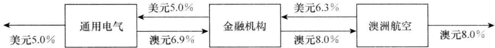图7-11 由比较优势为动机的货币互换

每一年金融机构的美元收益为 234000 美元（即 1800 万美元的 1.3%），亏损为 220000 澳元（即 2000 万澳元的 1.1%）。金融机构可以在互换期限内从远期市场每年买入 220000 澳元来避免外汇风险，这样做可以使金融机构锁定美元盈利。

我们也可以改变互换的设计而使金融机构锁定 $0.2\%$ 的美元差价。图7-12与图7-13是另外两种不同的互换形式。在实际中采用这两种形式的可能性不大，这是因为这两种做法不能使通用电气与澳洲航空免于外汇风险。 $^{①}$ 在图7-12中，澳洲航空承担外汇风险，因为它要支付每年 $1.1\%$ 的澳元利息，并且支付每年 $5.2\%$ 的美元利息。在图7-13中，通用电气承担外汇风险，因为它要收入每年 $1.1\%$ 的美元利息，同时支付每年 $8\%$ 的澳元利息。

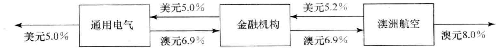图7-12 货币互换的一种形式：澳洲航空承担外汇风险

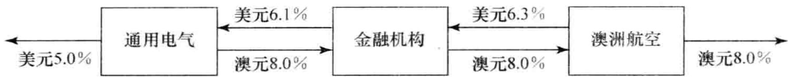图7-13 货币互换的一种形式：通用电气承担外汇风险

## 7.10 固定息与固定息货币互换的定价

与利率互换类似，固定息与固定息货币互换可以被分解成两个债券的差或一组远期货币合约的组合。

### 7.10.1 以债券形式进行定价

$$
如果我们定义 $V_{\mathrm{swap}}$ 为收入美元并支付外币的货币互换的美元价值，那么

V_{\mathrm{swap}} = B_{D} - S_{0} B_{F}

其中 $B_{F}$ 为互换中外汇现金流所对应的债券以外币计价的价值, $B_{D}$ 为互换中本国货币现金流所对应的债券以美元计价的价值, $S_{0}$ 为即期汇率 (表达形式为 1 单位外币所对应的美元数量)。互换的价值可以由两种货币下的利率和即期汇率来确定。

$$

类似地，收入外币同时支付美元的互换价值为：

$$
V_{\mathrm{swap}} = S_{0} B_{F} - B_{D}
$$



假设日元和美元的利率曲线为水平：日元利率为每年 $4\%$ ，美元利率为每年 $9\%$ （均为连续复利）。假设在此之前某金融机构进入了一笔货币互换：在互换中收入 $5\%$ 的日元利率，付出 $8\%$ 的美元利率，互换每年支付一次。两个货币的本金分别为 1000 万美元与 12 亿日元。互换期限为 3 年，当前汇率为 1 美元等于 110 日元。

计算结果列在表 7-9 中。互换中所对应的美元债券的现金流给出在第 2 列中，以 9% 利率贴现所得结果给出在第 3 列中，互换中所对应的日元债券的现金流给出在第 4 列中，以 4% 利率进行贴现所得结果给出在最后一列中。

表 7-9 以债券形式对货币互换定价
(单位：百万)

<table><tr><td>时间</td><td>美元债券现金流</td><td>美元现金流贴现值</td><td>日元债券现金流</td><td>日元现金流贴现值</td></tr><tr><td>1</td><td>0.8</td><td>0.7311</td><td>60</td><td>57.63</td></tr><tr><td>2</td><td>0.8</td><td>0.6682</td><td>60</td><td>55.39</td></tr><tr><td>3</td><td>0.8</td><td>0.6107</td><td>60</td><td>53.22</td></tr><tr><td>3</td><td>10.0</td><td>7.6338</td><td>1200</td><td>1064.30</td></tr><tr><td>总计</td><td></td><td>9.6439</td><td></td><td>1230.55</td></tr></table>

美元债券价格 $B_{D}$ 为964.39万美元，日元债券价格为12.3055亿日元，因此互换价值为

$$
\frac{1230.55}{110} - 9.6439 = 1.5430 (\text{百万美元})
$$


### 7.10.2 以远期合约组合的形式定价

互换合约中的每一个固定息与固定息进行交换都可以看作一个外汇远期合约。如5.7节所述，外汇远期合约可以在假定远期汇率会被实现的情况下来进行定价，对货币互换，我们可以采用类似的假设。



考虑例 7-4 中的情形，假定日元与美元的 LIBOR/互换曲线均为水平。日元利率为每年 4%，美元利率为每年 9%（利率均为连续复利）。在此之前某金融机构进入一笔货币互换：在互换中收入 5% 的日元利息，支付 8% 的美元利息，互换支付每年进行一次。两种货币的本金分别为 1000 万美元和 12 亿日元。互换的期限还有 3 年，当前汇率为 1 美元等于 110 日元。

$$
表7-10总结了计算结果。金融机构每年支付 $0.08 \times 1000$ 万 = 80 万美元，同时收入12亿 $\times 0.05 = 6000$ 万日元。另外，在3年后金融机构将支付1000万美元并且收入12亿日元。即期汇率为每日元等于0.009091美元。这时 $r = 9\%$ ， $r_f = 4\%$ ，由式（5-9）得出1年期远期汇率为每日元等于

$$
$$
0.009091 \mathrm{e}^{(0.09 - 0.04) \times 1} = 0.009557
$$

表 7-10 以远期合约组合形式对货币互换定价
(单位：百万)

<table><tr><td>时间</td><td>美元现金流</td><td>日元现金流</td><td>远期汇率</td><td>日元现金流的美元价值</td><td>净现金流的美元价值</td><td>贴现值</td></tr><tr><td>1</td><td>-0.8</td><td>60</td><td>0.009557</td><td>0.5734</td><td>-0.2266</td><td>-0.2071</td></tr><tr><td>2</td><td>-0.8</td><td>60</td><td>0.010047</td><td>0.6028</td><td>-0.1972</td><td>-0.1647</td></tr><tr><td>3</td><td>-0.8</td><td>60</td><td>0.010562</td><td>0.6337</td><td>-0.1663</td><td>-0.1269</td></tr><tr><td>3</td><td>-10.0</td><td>1200</td><td>0.010562</td><td>12.6746</td><td>2.6746</td><td>2.0417</td></tr><tr><td>总计</td><td></td><td></td><td></td><td></td><td></td><td>1.5430</td></tr></table>

$$
采用类似的方法可以计算表中所示的2年期和3年期远期汇率。对远期合约定价时可以假定远期汇率将会实现：如果1年期远期汇率被实现，在1年后日元现金流的美元价值为 $60 \times 0.009557 = 0.5734$ （百万美元），因此在1年后净现金流为 $0.5734 - 0.8 = -0.2266$ （百万美元），贴现值为 $-0.2266e^{-0.09 \times 1} = -0.2071$ （百万美元）。这一价值为1年后现金流互换所对应远期合约的价值。其他期限的远期合约也可以采用类似的方式计算。如表所示，互换的价值为154.30万美元。这与例7-4中将互换分解为一个债券多头与一个债券空头所计算的结果是一致的。

$$

货币互换在刚刚成交时，价值一般接近于0。采用成交时的汇率，如果两种本金价值相等，那么在本金刚刚交换后，互换的价值也为0。但是，与利率互换类似，这并不意味着互换中的每一个远期合约价值都为0。可以证明，如果在货币互换中的两个利率非常不同，那么对高利率货币的支付者而言，早期交换现金流的外汇远期价值为负，而对应于最后交换本金时的外汇远期价值为正。低利率的支付者所处的情形刚好相反：对应早期支付交换的外汇远期价值为正，而对应于最后互换本金时的外汇远期价值为负。这些结果对于计算互换的信用风险是十分重要的。


## 7.11 其他货币互换

另外两种较为普遍的货币互换具有以下形式：

(1) 一种货币下的浮动利率与另一种货币下的固定利率交换;

(2) 一种货币下的浮动利率与另一种货币下的浮动利率互换。

第1种互换的一个例子是支付700万英镑面值按英镑LIBOR利率与收入1000万美元面值按 $3\%$ 固定利率之间的交换，期限为10年，每半年交换一次。类似与固定息与固定息的货币互换，该互换也涉及最初和最末的本金交换：最初的本金交换方向与利息交换方向相反，而最末的本金交换与利息交换方向相同。固定息与浮动息货币互换可以被理解为一个固定息与固定息货币互换和一个固定息与浮动息利率互换的交易组合。例如，上面的货币互换可以被理解为以下两个互换的组合：（a）收入面值1000万美元上 $3\%$ 固定利率，支付面值700万英镑上 $4\%$ 固定利率的货币互换；（b）收入面值700万英镑上 $4\%$ 固定利率、支付英镑LIBOR利率的利率互换。

对于以上所考虑的互换定价时，我们将美元现金流以美元无风险利率贴现。对于英镑现金流，我们首先假设英镑远期 LIBOR 利率在将来会实现，并以此来确定现金流，然后以英镑无风险利率对现金流进行贴现。互换的价值等于以上两项现金流价值在当前汇率下之差。

第2种互换的一个例子是将700万英镑面值上以英镑LIBOR计算的利息与1000万美元面值上以美元LIBOR计算的利息进行交换。与我们考虑过的其他货币互换类似，这一互换也会涉及本金的交换：最初本金交换与利息支付的方向相反，最末本金交换与利息支付方向相同。浮动息与浮动息的互换可以看作固定息与固定息货币互换和两个不同货币下利率互换的组合。我们例子中的互换可以分解为：（a）收入面值1000万美元上 $3\%$ 的固定利息、支付面值700万英镑上的 $4\%$ 固定利息的货币互换；（b）收入 $4\%$ 固定利息，支付英镑LIBOR利息，面值700万英镑的利率互换；（c）支付 $3\%$ 固定利率，收入美元LIBOR利率，面值1000万美元的利率互换。

对浮动息与浮动息互换定价时，我们可以假设在不同货币下远期利率将会实现来确定现金流，然后用不同货币下的无风险利率对现金流贴现，互换的价值等于两组现金流价值在当前汇率下之差。

## 7.12 信用风险

像互换合约这样由两家公司私下达成的合约会包含信用风险。考虑与两家公司达成了相互抵消的互换合约的金融机构（见图7-4、图7-5或图7-7）。如果两家公司均不违约，金融机构完全处于对冲状态。其中一个互换合约价值的下降会被另一个合约价值的上升所抵消。然而，当互换交易的某一方陷入财务困境并违约时，金融机构仍然需要保持对另一方合约中的承诺。

假设图7-4 中的合约在签署了一段时间后，金融机构与微软的互换合约价值为正，但与英特尔的互换合约价值为负。假定金融机构与微软和英特尔之间没有其他衍生产品合约，并假定金融机构与这两家公司之间没有抵押品（在第 24 章中我们将讨论净值结算和抵押品协议的影响）。如果微软违约，金融机构将可能会失去这份合约中所有的正价值。为了保持对冲状态，金融机构必须寻找替代微软公司位置的第三方。但为了吸引第三方，金融机构支付给第三方的数量大致等于在微软违约之前金融机构与微软之间合约的价值。

显然，只有当互换对于金融机构具有正价值时，金融机构才会有信用风险的敞口。当对方陷入财务困境时，如果互换价值对金融机构而言为负，这时会发生什么情况呢？从理论上讲，金融机构能实现这一意外的收益，因为对方的违约有可能使它免除这项业务。但在实际中，对方很有可能会选择将合约卖给第三者，或重新安排自身的业务以便不丧失合约中的正价值。因

此，对于金融机构最合理的假定如下：在对手违约时，如果互换对于金融机构具有正价值，金融机构将会蒙受损失，但是如果互换对于金融机构具有负价值，交易对手违约不会对金融机构产生任何影响。这一情形如图7-14所示。

在互换中，有时是早期的现金流交换具有正价值，而后面的交换具有负价值。（在图7-9a这是对的，在汇率互换中支付低利率货币的时候也是对的。）这些互换很可能在期限内大部分时间都会具有负价值，因此与相反情形相比会有很小的信用风险。

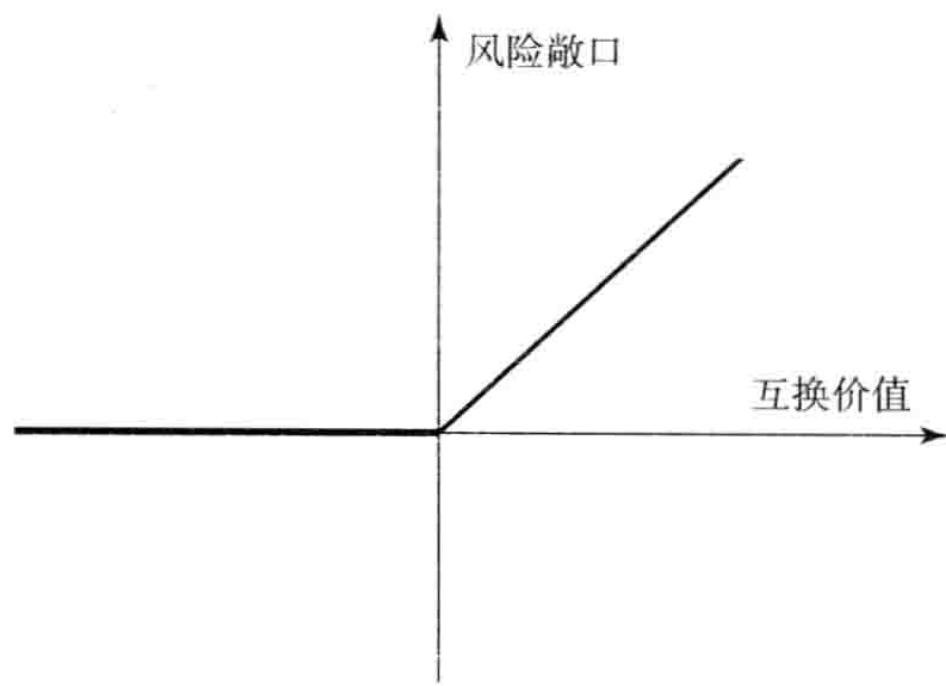图7-14 互换中的信用风险

由互换带来的潜在损失远远小于由具有相同本金的贷款所带来的潜在损失，这是因为互换的价值常常只是相应贷款价值的很小部分。由货币互换对手违约所带来的潜在损失要远远大于由利率互换对手违约所带来的潜在损失。这是因为在货币互换中包括两种不同货币下本金的交换。当对手违约时，货币互换可能会比利率互换具有更大的正价值。

在任意一项合约中，区分金融机构面临的市场风险与信用风险是非常重要的。如上所述，在合约具有正价值时，对手违约会触发信用风险。市场风险来源于利率、汇率等市场变量使得金融机构的互换合约价值变成负值的可能性。市场风险可以通过进入相互抵消的合约来进行对冲，但信用风险不能被简单地对冲。

业界事例 7-2 是互换市场发生的一件很古怪的事。这一件有关英国哈墨史密斯和富勒姆（Hammersmith and Fulham）市政局的故事说明，银行在进行互换交易时除了承担信用风险与市场风险外，有时也会面临法律风险。



1987～1989年之间，英国伦敦郡的哈墨史密斯和富勒姆进入了名义总面值为大约60亿英镑的600来个利率互换以及相关交易，这些交易的目的似乎不是为了对冲风险而是为了投机。对这些交易负有直接责任的哈墨史密斯和富勒姆的两个雇员对这些产品的交易风险与运作方式只是略有所知。

截止到 1989 年，因为英镑利率的变化，哈墨史密斯和富勒姆因为这些利率互换交易损失了好几亿英镑。对于与哈墨史密斯和富勒姆进行交易的银行而言，这些交易的价值为好几亿英镑，此时银行对信用风险产生了担忧，因此这些银行做了一些反方向的利率互换交易，如果哈墨史密斯和富勒姆违约的话，银行仍然需要履行这些反方向的交易许诺，并因此会承受巨大损失。

但真正发生的事情并不是违约，哈墨史密斯和富勒姆的审计人员要求宣布这些交易无效，原因是哈墨史密斯和富勒姆并没有权利交易这些产品，英国法庭也同意了这一决定。这一纠纷被一直上告到英国的上议院，上议院的最终裁决是哈墨史密斯和富勒姆确实没有权利交易这些互换产品，但如果是因为风险管理的需要，哈墨史密斯和富勒姆在将来应该是可以进行这些交易的。可以想象，法庭以这种方式终止这些合约使得同哈墨史密斯和富勒姆进行交易的银行感到非常恼火。


### 7.12.1 结算中心

如[第2章](ch02.md)所述，为了减少场外市场的信用风险，监管当局要求标准场外衍生产品要经过中央交易对手（CCP）的形式来进行结算，中央交易对手是场外交易商之间的中介。在交易过程中，交易双方都要向中央交易对手支付保证金。LCH. Clearnet（由伦敦结算所和位于巴黎的Clearnet合并而成）是世界上最大的利率互换结算中心，在2013年，其结算的利率互换的面值超过350万亿美元。

### 7.12.2 信用违约互换

自 2000 年以来在市场上变得越来越重要的一种互换是信用违约互换（credit default swap, CDS）。信用违约互换使得公司以类似于多年来他们对冲市场风险的方式对冲信用风险。当某一家公司或某个国家违约时，CDS 的支付与保险产品合约类似。这里的公司或国家被称为参考实体（reference entity）。在合约的期限内或者到参考实体违约为止，信用违约保护的买方要向信用违约卖出方支付被称为 CDS 溢差的保金。假定一个 CDS 合约的面值为 1 亿美元，期限为 5 年，CDS 溢差为 120 个基点，保金数量为 1 亿美元的 120 个基点，即每年 120 万美元。如果参考实体在 5 年内没有违约，保金支付方将不会收到任何赔偿。但当参考实体违约时，假定参考实体发行的债券每 1 美元面值只值 40 美分，这时信用违约的卖出方要向信用违约的买入方支付 6000 万美元。这种赔偿机制的意义是如果信用违约保护的买入方拥有面值为 1 亿美元由参考实体发行的债券组合，那么信用违约保护的收益使得交易组合的价值不会低于 1 亿美元。

我们将在第 25 章对 CDS 进行更详细的讨论。

## 7.13 其他类型的互换

在这一章里我们已经讨论了 LIBOR 与固定利率交换的利率互换交易以及一种货币下的固定利率与另一种货币下的固定利率进行交换的货币互换合约。市场上也有其他形式的互换交易。我们将在第 25 章、第 30 章及第 33 章中对其中一些互换进行详细讨论。我们在这里只提供一个概述。

### 7.13.1 标准利率互换的变形

在固定利率与浮动利率进行交换的互换合约中，LIBOR是最普遍的浮动参考利率。在本章的例子中，LIBOR的票期（tenor）（即付款频率）为6个月，但具有1个月、3个月和12个月票期LIBOR的互换在市场上也常常出现。浮动利率的票期不一定与固定利率的票期一致（事实上，如7.1.6节的脚注所示，在美国，标准利率互换中的LIBOR支付为每3个月一次，而固定利率的支付为每半年一次）。LIBOR是最常用的浮动利率，但偶尔也会采用像商业票据（CP）利率这样形式的浮动利率。有时也会成交所谓的基准：例如，3个月期商业票据利率加上10个基点可能会同3个月期限的LIBOR利率进行交换，两个浮动利率对应的本金相同（如果一家公司的资产与负债的参考利率为不同的浮动利率，在对冲风险敞口时，可以采用这种利率互换）。

在互换合约中可以使本金数量在互换期限内变化来满足交易对手的需要。在一个摊还互换（amortizing swap）中，本金以事先约定的方式减少（这一设计可能是与本金分期减少的贷款相对应）。在一个递升互换（step-up swap）中，本金以约定的方式增加（这一设计可能是对应于某贷款中本金的增加）。在延期互换（deferred swap）或远期互换（forward swap）中，直到将来的某一时刻才会开始利息的交换。有时互换合约的浮动利率所对应的本金与固定利率所对应的本金会有所不同。

固定期限互换（constant maturity swap，CMS）是将 LIBOR 与某种互换利率交换的合约。例如，在今后 5 年内每 6 个月将 6 个月期限的 LIBOR 利率与 10 年期的互换利率进行交换，双方所对应的本金相同。类似地，固定期限国债互换（constant maturity treasury swap，CMT swap）是将 LIBOR 与某个特定国债利率（例如 10 年期国债利率）进行交换的合约。

在一个复合互换（compounding swap）中，双方的利率都会以既定的形式被复合到互换的末端，这种互换的付款日只有一个，即互换的到期日。在 LIBOR 后置互换（LIBOR-in-arrears swap）中，在一个日期所观察到的 LIBOR 利率被用来计算在这个日期的付款数量（像在 7.1 节中解释的那样，在一个标准互换中，在某个时间所观察的 LIBOR 利率是用于决定在下一个付款日的支付数量）。在一个区间互换（accrual swap）中，某一方的利息只有当浮动利率在一定范围内时才进行累计。

### 7.13.2 Diff 互换

有时在某一种货币下所观察到的利率被用到另一种货币的本金之上。一种这类交易是在美国观察到的3个月LIBOR与在英国观察到的LIBOR进行交换，这里的浮动利率所对应的本金均为1000万英镑。这类互换被称为跨货币互换（differential swap）或Quanto。在[第30章](ch30.md)里我们将讨论这种互换。

### 7.13.3 股权互换

股权互换（equity swap）是将某个股指的总收益（股息和资本收益的总和）与某固定或浮动利率进行交换。例如，互换可能是在今后每6个月由标普500的整体收益与LIBOR的互换，互换双方的本金相同。股权互换可以被证券组合经理用来将固定或浮动资产收益转化为股指收益，反之亦然。在[第33章](ch33.md)里我们将讨论股权互换。

### 7.13.4 期权

有时在互换中会嵌有期权。例如，在可延期互换（extendable swap）中，互换的一方有权延长互换的期限。在可赎回互换（puttable swap）中，一方可以提前结束互换。互换期权（option on swap，或 swaption）在市场上也有交易，这时期权的持有人有权在将来进入一个互换，其中与浮动利率进行交换的固定利率要事先约定。在第 29 章里我们将讨论互换期权。

### 7.13.5 商品互换、波动率互换以及其他特殊产品

商品互换（commodity swap）在实际上等价于一组具有不同期限却具有同一交割价格的商品远期合约。在波动率互换（volatility swap）中，首先要阐明一定的时间段序列，在每一个时间段，互换的一方支付预先指定的固定波动率，而另一方支付在这一时间段内所实现的历史波动率。在计算支付量时，两种波动率都乘以相同的本金数量。在[第29章](ch29.md)里我们将讨论波动率互换。

互换的变化形式只受限于金融工程师的想象力与企业资金部总管和基金经理对于特殊交易结构的胃口。在[第33章](ch33.md)里我们将讨论著名的“5/30”互换，这一互换是由宝洁与信孚银行之间进行的交易，互换中的支付以一种复杂的形式依赖于30天的商业票据利率、30年期债券价格以及5年期国债的收益率。

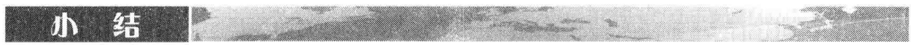

市场上最常见的两种互换为利率互换和货币互换。在利率互换中，一方同意向另一方支付对应于一定本金的固定利息，作为回报，这一方同时收入对应于同一本金与期限的浮动利息。在货币互换中，一方同意支付一种货币下一定本金数量上的利息，而作为回报，收入对应于另一种货币下一定数量本金上的利息。

在利率互换中，本金并不进行交换。在货币互换中，本金通常在互换的开始与结束时要进行交换。对于支付外币利率的一方，在互换开始时收入外币本金，并且同时付出本国货币的本金，在互换结束时，要支出外币本金并且同时收入本国货币本金。

利率互换可以用来将浮动利率贷款转化为固定利率贷款，反之亦然。同时，它也可以将浮动收益投资转化为固定收益投资，反之亦然。货币互换可以将在一种货币下的贷款转化为另一种货币下的贷款。它也可以将在一种货币下的投资转化为另一种货币下的投资。

对利率互换与货币互换的定价方式有两种。在第一种方法中，互换被分解为一个债券的多头和另一个债券的空头。在第二个方法中，互换被当成远期合约的组合。

当金融机构与两个不同的对手签署了一对相互抵消掉的互换时，它会面临信用风险。当与某一对手的互换对于金融机构有正价值时，如果这一交易对手违约，金融机构将会遭受损失，因为这时它仍然要向另一方保证其互换协议的承诺。在[第24章](ch24.md)里我们将讨论对手信用风险、抵押品以及净额结算的影响。

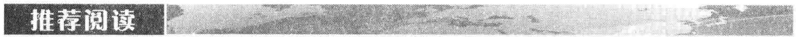

Alm, J., and F. Lindskog. “Foreign Currency Interest Rate Swaps in Asset-Liability Management for Insurers,” European Actuarial Journal, 3 (2013): 133–58.

Corb, H. Interest Rate Swaps and Other Derivatives. New York: Columbia University Press, 2012.

Flavell, R. Swaps and Other Derivatives, 2nd edn. Chichester: Wiley, 2010.

Klein, P. “Interest Rate Swaps: Reconciliation of Models,” Journal of Derivatives, 12, 1 (Fall 2004): 46–57.

Memmel, C., and A. Schertler. “Bank Management of the Net Interest Margin: New Measures,” Financial Markets and Portfolio Management, 27, 3 (2013): 275–97.

Litzenberger, R. H. "Swaps: Plain and Fanciful," Journal of Finance, 47, 3 (1992): 831–50.

Purnanandan, A. "Interest Rate Derivatives at Commercial Banks: An Empirical Investigation," Journal of Monetary Economics, 54 (2007): 1769–1808.

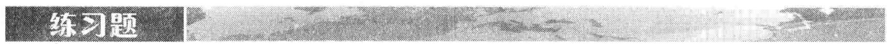

7.1 公司 A 和公司 B 可以按以下利率借入 2000 万美元 5 年期的贷款：

<table><tr><td></td><td>固定利率</td><td>浮动利率</td></tr><tr><td>公司A</td><td>5.0%</td><td>LIBOR+0.1%</td></tr><tr><td>公司B</td><td>6.4%</td><td>LIBOR+0.6%</td></tr></table>

公司 A 想得到浮动利率贷款；公司 B 想得到固定利率贷款。设计一个互换，使作为中介的银行有 0.1% 的净收益，并且同时对两家公司而言，这一互换具有同样的吸引力。

7.2 公司 X 希望以固定利率借入美元，公司 Y希望以固定利率借入日元。经即期汇率转换后，双方所需要的金额大体相等。经过税率调整后，两家公司可以得到的利率报价如下：

<table><tr><td></td><td>日元</td><td>美元</td></tr><tr><td>公司X</td><td>5.0%</td><td>9.6%</td></tr><tr><td>公司Y</td><td>6.5%</td><td>10.0%</td></tr></table>

设计一个互换，使作为中介的银行有50个基点的净收益，并使得该互换对双方具有相同的吸引力，在互换中要确保银行承担所有的汇率风险。

7.3 一个面值为1亿美元的互换还有10个月的剩余期限。根据互换条款，6个月LIBOR利率与固定利率 $7\%$ （每半年复利一次）进行交换。对于将LIBOR浮动利率与固定利率交换的所有期限的互换不互换利率的卖出与买入价的平均值为每年 $5\%$ （连续复利）。在2个月前，6个月的LIBOR利率为每年 $4.6\%$ 。对于支付浮动息方，这一互换的当前价值是多少？对于支付固定息方，价值又是多少？

7.4 解释什么是互换利率。互换利率与平价收益率的关系是什么？

7.5 一笔货币互换的剩余期限还有15个月，这一互换将年率为 $10\%$ ，本金为2000万英镑的利息转换为年率为 $6\%$ ，本金为3000万美元的利息。英国与美国的期限结构均为水平。如果互换今天成交，互换中的美元利率为 $4\%$ ，英镑利率为 $7\%$ ，所有利率均为按年复利。当前即期汇率为1.5500。对于支付英镑的一方而言，这一互换的价值是多少？对于支付美元的一方而言，这一互换的价值又是多少？

7.6 解释在一份金融合约中，信用风险与市场风险的区别。

7.7 一家企业资金部主管告诉你说，他刚刚以一个有竞争力的 $5.2\%$ 固定利率签署了一个5年期的贷款。资金部主管解释说，他取得这一利率是以6个月LIBOR加上150个基点借入资金，并同时进入一个LIBOR与固定利率为 $3.7\%$ 的互换来完成的，他解释说这么做的原因是因为他的公司在浮动利率市场有相对优势。这一企业资金部主管忽略了什么？

7.8 解释为什么当一家银行进入相互抵消的互换时，它会面临信用风险。

7.9 有人对公司 X 与公司 Y 的 500 万美元 10 年期投资许诺以下利率：

<table><tr><td></td><td>固定利率</td><td>浮动利率</td></tr><tr><td>公司X</td><td>8.0%</td><td>LIBOR</td></tr><tr><td>公司Y</td><td>8.8%</td><td>LIBOR</td></tr></table>

公司 X 想得到固定收益的投资；公司 Y 想得到浮动收益的投资。设计一个互换，使作为中介的银行有年率 0.2% 的净收益，并对于 X 与 Y 具有同样的吸引力。

7.10 某金融机构与公司 X 进行了一笔利率互换交易。在交易中，金融机构收入每年 10% 并同时付出 6 个月期的 LIBOR，互换的本金为 1000 万美元，期限为 5 年。支付频率为每 6 个月一次。假如在第 6 个支付日（第 3 年年末）X 违约，而这时对于所有的期限，利率约为 8%（每半年复利一次）。金融机构会有什么损失？假定在 2 年半时 6 个月的 LIBOR 为每年 9%。
7.11 公司 A 与公司 B 面临利率（经税率调整后）：

<table><tr><td></td><td>A</td><td>B</td></tr><tr><td>美元(浮动利率)</td><td>LIBOR + 0.5%</td><td>LIBOR + 1.0%</td></tr><tr><td>加元(固定利率)</td><td>5.0%</td><td>6.5%</td></tr></table>

假定公司 A 想以浮动利率借入美元，公司 B 想以固定利率借入加元。一家金融机构计划安排一个货币互换并想从中盈利 50 个基点。如果这一互换对于 A 和 B 有同样的吸引力，A 和 B 最终支付的利率分别为多少？

7.12 某金融机构与公司 Y 进行了一笔 10 年期的货币互换交易。在互换交易中，金融机构收入瑞士法郎的利率为每年 3%，并同时付出的美元利率为每年 8%。利息每年支付一次。本金分别为 700 万美元及 1000 万瑞士法郎。假定公司 Y 在第 6 年年末宣布破产，这时汇率为 0.80（每法郎值 0.80 美元）。破产给金融机构带来的费用是多少？假定在第 6 年年末，对于所有期限的瑞士法郎利率均为每年 3%，美元利率均为每年 8%。所有的利率都是每年复利一次。

7.13 在采用远期合约将外汇风险进行对冲以后，图7-11 中所示金融机构的平均利差可能会大于还是会小于 20 个基点？解释你的答案。

7.14 “信用风险很高的公司是那些不能直接进入固定利率市场的公司。这些公司在利率互换中往往支付固定利率并同时收入浮动利率。”假定这种说法是对的，你认为这样会提高还是降低金融机构互换组合中的风险？假定在利率很高时，公司违约可能性很大。

## 作业题

7.20 (a) 公司 A 可以拿到如表 7-3 所示的利率，它可以按 $6.45\%$ 的固定利率借款 3 年，那么通过互换，它可以将这个固定利率交换成什么样的浮动利率？

(b) 公司 B 可以拿到如表 7-3 所示的利率，它可以按 LIBOR 加 75 个基点借款 5 年，那么通过互换，它可以将这个浮动利率交换成什么样的固定利率？

7.21 (a) 公司 X 可以拿到如表 7-3 所示的利率，它可以以 $5.5\%$ 的固定利率投资 4 年，那么通过互换，它可以将这个固定利率交换成什么样的浮动利率？

(b) 公司 Y 可以拿到如表 7-3 所示的利率，它可以以 LIBOR 加 50 个基点的浮动利率投资 10 年，那么通过互换，它可以将这个浮动利率交换成什么样的固定利率？

7.221年期LIBOR利率为 $10\%$ （按年复利）。一家银行将固定利率与12个月期LIBOR进行交换，付款频率为一年一次。2年期

7.15 为什么对应于同一本金，利率互换在违约时的预期损失小于贷款在违约时的预期损失？

7.16 一家银行发现它的资产与负债不匹配。银行在运作过程中，收入浮动利率存款并且发放固定利率贷款。如何运用互换来抵消风险？

7.17 解释如何对于某一货币下的浮动利率与另一货币下的固定利率的互换来定价。

7.18 期限一直到1.5年的LIBOR零息曲线为水平 $5\%$ （连续复利）。2年与3年期每半年支付一次的互换利率分别为 $5.4\%$ 和 $5.6\%$ 。估计期限为2年、2.5年和3年的LIBOR零息利率（假定2.5年互换利率为2年和3年互换利率的平均值）。

7.19 如何确定互换的绝对额久期？

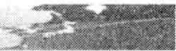

与 3 年期互换利率（按年复利）分别为年率 11% 和 12%。估计 2 年期与 3 年期的 LIBOR 零息利率。

7.23 根据利率互换的条款，一家金融机构同意支付每年 $10\%$ ，并同时收入3个月LIBOR，互换本金为1亿美元，每3个月支付一次，这一互换还有14个月的剩余期限。对于所有期限，与3个月LIBOR进行互换的固定互换利率买入卖出价的平均值为每年 $12\%$ ，1个月以前的3个月LIBOR利率为每年 $11.8\%$ 。所有的利率均为每季度复利一次，该互换的价值是多少？

7.24 公司 A 是一家英国制造商，它想以固定利率借入美元。公司 B 是一家美国的跨国公司，它想以固定利率进入英镑。两家公司可以获得以下年利率报价（经税率调整后）：

<table><tr><td></td><td>英镑</td><td>美元</td></tr><tr><td>公司A</td><td>11.0%</td><td>7.0%</td></tr><tr><td>公司B</td><td>10.6%</td><td>6.2%</td></tr></table>

设计一个互换使作为中介的银行有每年10个基点的净收益，并保证这个互换对A和B两家公司均有15个基点的好处。

7.25 假定美国与澳大利亚的利率期限结构均为水平。美元利率为每年 $7\%$ ，澳元利率为每年 $9\%$ 。每一个澳元的当前价格为0.62美元。在互换协议下，金融机构支付每年 $8\%$ 的澳元并且收入每年 $4\%$ 的美元。两种不同货币所对应的本金分别为1200万美元和2000万澳元。支付每年交换一次，其中一次交换刚刚发生。这一互换剩余期限还有2年。对于金融机构而言，这一互换的价值是多少？假定所

有利率均为连续复利。

7.26 一家英国公司 X 想在美国资金市场以固定利率借入 5000 万美元，期限为 5 年。因为这家公司在美国不太知名，直接借入资金几乎不可能。但是这家公司能够以每年 12% 的固定利率借入英镑。一家美国公司 Y 想借入 5000 万英镑，期限为 5 年。公司 Y 无法借入这笔英镑资金，但它可以取得每年为 10.5% 的美元资金。美国 5 年期的国债收益率为 9.5%，英国 5 年期的国债收益率为 10.5%。构造一个使得金融中介机构的净收益为每年 0.5% 的适当互换。

像远期、期货、互换以及期权这样衍生产品的主要用途是将风险从经济体系中的一个实体转移到另一个实体。本书的前7章已经着重讨论了远期、期货和互换。在讨论期权之前，我们考虑在经济生活中转移风险的另外一个重要方式：证券化。

由于在 2007 年开始的信用危机（有时也称为“信用紧缩”）中所扮演的角色，证券化已成为一个备受关注的话题。此次危机起源于美国房屋按揭所产生的金融产品，之后迅速从美国蔓延至其他国家，并且从金融市场到实体经济。有的金融机构破产，其他更多的机构不得不接受政府救助。毫无疑问，21 世纪的第 1 个 10 年对整个金融行业而言是灾难性的。

在这一章中，我们将讨论证券化的本质以及它在危机中所扮演的角色。我们还将深入了解美国按揭市场、资产支持证券、债务抵押债券（CDO）、瀑布式现金流和金融市场动机的重要性。

