# 第11章 影响期权价格的因素

有 6 种因素会影响股票期权的价格：

(1) 当前股票价格， $S_{0}$ ;

(2) 执行价格，K;

(3) 期权期限，T;

$$
(4) 股票价格的波动率, $\sigma$ ;

$$

(5) 无风险利率，r；

(6) 期权期限内预期支付的股息。

在这一节里我们将考虑当其中一个因素发生变化时（假定其他因素保持不变），对于期权价格的影响。表 11-1 总结了这些关系。

$$
表11-1与表11-2给出了欧式看跌和看涨期权价格与上面所列的前5种因素之间的关系，表中采用的参数为： $S_{0}=50$ ，K=50，r=5%（每年）， $\sigma=30\%$ （每年），T=1年，并且假定股票无股息。此时看涨期权价格为7.116，看跌期权价格为4.677。

$$

表 11-1 当一个变量增加而其他变量保持不变时，对于股票期权价格的影响

<table><tr><td>变量</td><td>欧式看涨</td><td>欧式看跌</td><td>美式看涨</td><td>美式看跌</td></tr><tr><td>当前股票价格</td><td>+</td><td>-</td><td>+</td><td>-</td></tr><tr><td>执行价格</td><td>-</td><td>+</td><td>-</td><td>+</td></tr><tr><td>时间期限</td><td>?</td><td>?</td><td>+</td><td>+</td></tr><tr><td>波动率</td><td>+</td><td>+</td><td>+</td><td>+</td></tr><tr><td>无风险利率</td><td>+</td><td>-</td><td>+</td><td>-</td></tr><tr><td>股息数量</td><td>-</td><td>+</td><td>-</td><td>+</td></tr></table>

注：+代表当这一变量增加时，期权价格增加或保持不变；-代表当这一变量增加时，期权价格减小或保持不变；?代表变化关系不明确。

### 股票价格与执行价格

如果在将来某一时刻行使看涨期权，期权收益等于股票价格与执行价格的差额。因此，随着股票价格的上升，看涨期权价值也会增大，而随着执行价格的上升，看涨期权价值将会减小。看跌期权的收益等于执行价格与股票价格的差额，因此，看跌期权的价格走向刚好与看涨期权相反，即随着股票价格的上升，看跌期权价值会减小；随着执行价格的上升，看跌期权价值将会增大。图11-1a \~图11-1d 展示了看涨与看跌期权价格对标的股票价格与执行价格的依赖方式。

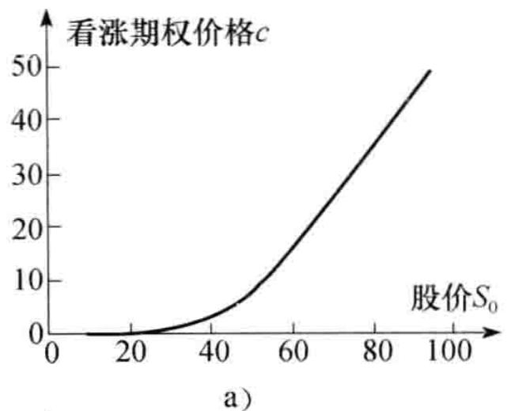

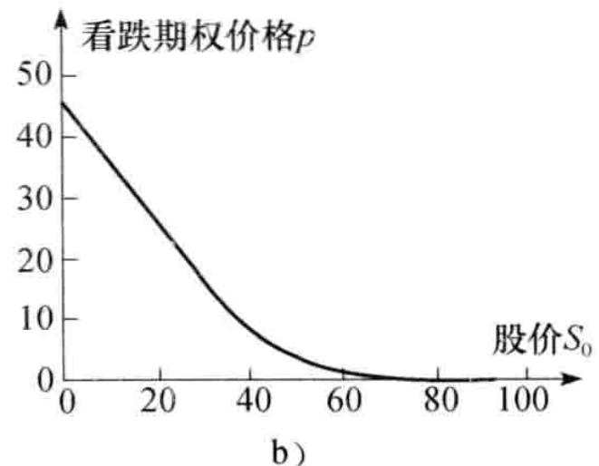

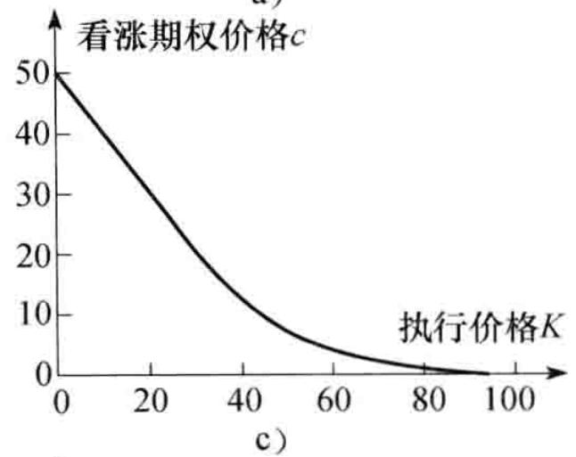

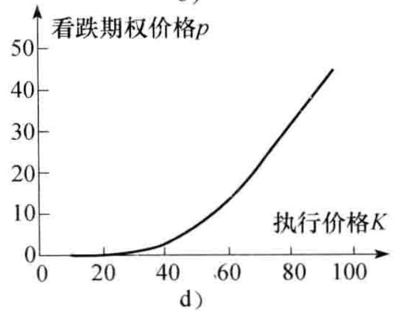

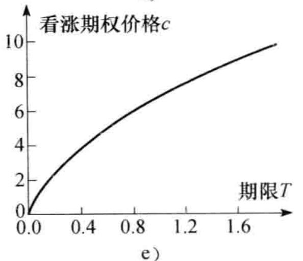

$$
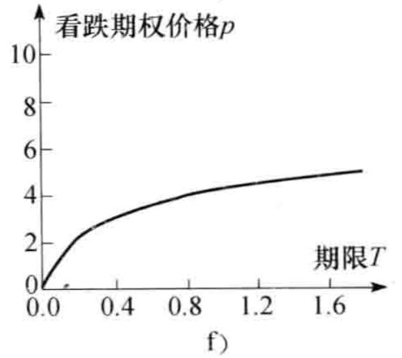图11-1 股票价格、执行价格以及期限的变化对于期权价格的影响注： $S_{0}=50,\ K=50,\ r=5\%,\ \sigma=30\%,\ T=1$ 。

$$

### 期权期限

接下来我们考虑期限对于期权价格的影响。当期限增加时，美式看涨期权与看跌期权价值都会增加（至少不会减小）。考虑两个只是期限不同的美式看涨期权：期限较短的期权在行使时，较长期限的期权也可以被行使。因此，长期限期权的价格至少不会低于短期限期权的价格。

随着期限的增加，欧式看跌期权和看涨期权的价值一般会增加（见图11-1e 和图11-1f），但这一结论并非总是成立。考虑两个同一股票上的欧式看涨期权，一个期权的到期日在 1 个月后，另一个期权的到期日在 2 个月后，假定在 6 个星期后股票支付一个大额股息。因为股息会使得期权价格下降，所以短期限期权价值可能会超过长期限的期权价值。 $^{①}$

### 波动率

在第 15 章里我们将讨论波动率的精确定义方式。粗略地讲，股票价格的波动率（volatility）是用于衡量未来股票价格变动不确定性的一个测度。当波动率增大时，股票价格大幅度上升或下降的机会将会增大。对于股票持有者而言，这两个变动会常常互相抵消，但对于看涨或看跌期权持有者而言，情况会有所不同。看涨期权的拥有者可以从股票上升中获利，但当股票下跌时，其损失是有限的，因为期权的最大损失只是期权费用。类似地，看跌期权持有者可以从价格下跌中获利，同时损失也会有限。因此随着波动率的增加，看涨期权及看跌期权价值都会增加（见图11-2a 和图11-2b）。

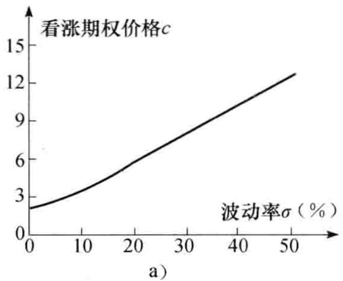

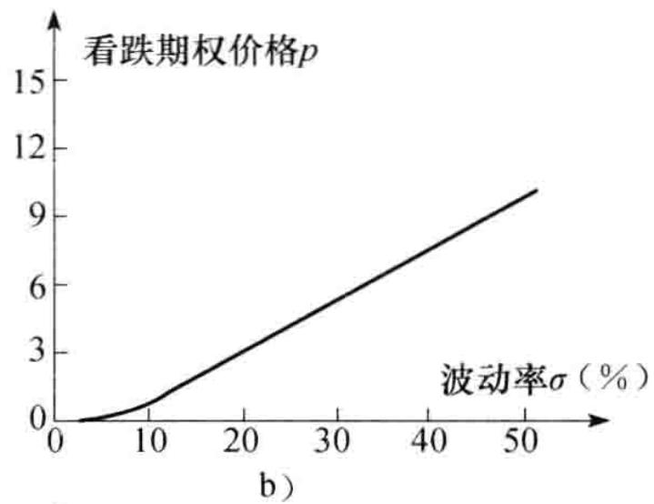

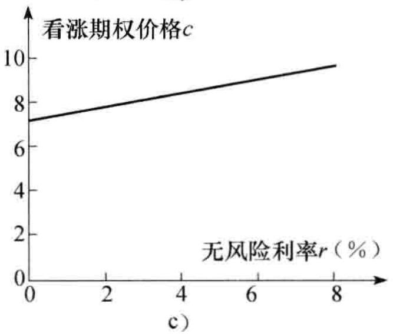

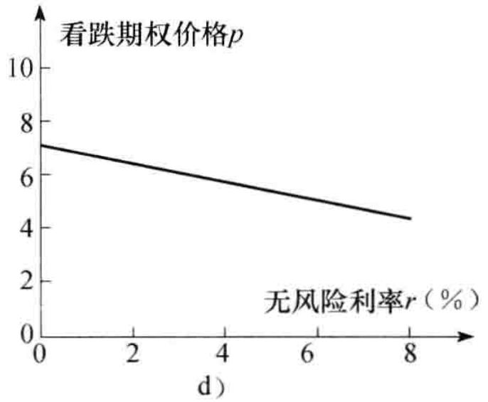图11-2 股票波动率、无风险利率的变化对于期权价格的影响
$$
注： $S_{0}=50,\ K=50,\ r=5\%,\ \sigma=30\%,\ T=1$ 。

$$

### 无风险利率

无风险利率对期权价格的影响并不是那么明显。当整个经济环境里利率增加时，投资者所要求股票收益的期望值也会增加。同时，期权持有人将来所收到现金流的贴现值会降低。以上两种效应的综合效应是看涨期权价值会增加，而看跌期权价值会降低（见图11-2c 和图11-2d）。

应该强调的是我们假定利率增大时其他变量的值保持不变。特别是在表 11-1 中当利率上升（下降）时，股票价格保持不变。在实际中，当利率上升（下降）时，股票价格往往会下降（上升）。利率上升与相应股票价格下降的整体效应可以使看涨期权价值下降，使看跌期权价格上升。类似地，利率下降与相应的股票价格上升的整体效应可以使看涨期权价值上升，使看跌期权价值下降。

### 将来的股息数量

股息将使股票在除息日的价格降低。对于看涨期权，这是一个坏消息；但对于看跌期权，这却是一个好消息。因此，看涨期权价值与预期股息的大小成反向关系；看跌期权的价值与预期股息的大小成正向关系。

## 11.2 假设与记号

在这一章中我们采用与[第5章](ch05.md)中推导远期与期货价格时类似的假设。假定市场上存在一些像大型投资银行这样的参与者，从而使下面的假设成立：

(1) 没有交易费用;

(2) 所有交易盈利（减去交易损失）的税率相同；

(3) 投资者可以按无风险利率借入与借出资金。

我们假定在市场上一旦出现套利机会时，参与者马上会利用这些机会。正如在[第1章](ch01.md)与[第5章](ch05.md)中所述，这意味着任何套利机会都会很快消失。因此，为了便于分析问题，我们可以合理地假定在市场上不存在套利机会。

我们将采用以下记号：

$S_{0}$ ：股票的当前价格；

K: 期权的执行价格;

T: 期权的期限；

$S_{T}$ : T 时刻股票的价格;

r: 在 T 时刻到期的无风险投资利率（连续复利）；

C: 买入 1 只股票的美式看涨期权价值;

P: 卖出 1 只股票的美式看跌期权价值;

c: 买入1只股票的欧式看涨期权价值;

p: 卖出 1 只股票的欧式看跌期权价值。

应该注意 r 为名义利率（而非实际利率）。我们可以假定 r > 0，否则无风险投资的收益不比持有现金更好（事实上，如果 r < 0，持有现金比无风险投资更好）。

## 11.3 期权价格的上限与下限

在这一节里我们将推导期权价格的上下限。这里的上下限不依赖于对11.1节中所述因素

的假设（ $r > 0$ 除外）。当期权价格大于上限或者小于下限时，就会出现套利机会。

### 11.3.1 上限

美式看涨期权或欧式看涨期权给其持有者以指定价格买入1只股票的权利。无论发生什么情况，期权的价格都不会超出股票价格。因此，股票价格是看涨期权价格的上限

$$
c \leqslant S_{0} \quad \text{与} \quad C \leqslant S_{0}\tag{11-1}
$$

如果以上的不等式不成立，那么套利人可以购买股票并同时出售期权来轻易获取无风险盈利。

美式看跌期权持有者有权以价格 $K$ 卖出1只股票。无论股票价格变得多么低，期权的价值都不会高于执行价格
$$
P \leqslant K\tag{11-2}
$$

对于欧式期权，我们知道在 T 时刻，期权的价值不会超出 K。因此，当前期权的价格不会超过 K 的贴现值，即
$$
p \leqslant \mathrm{e}^{- r T} K\tag{11-3}
$$

如果以上的不等式不成立，那么套利者可以通过卖出一个期权，并同时将所得收入以无风险利率进行投资，这样套利人将可以获取无风险盈利。

### 11.3.2 无股息股票上看涨期权的下限

不支付任何股息的股票上欧式看涨期权的下限为
$$
S_{0} - K \mathrm{e}^{- r T}
$$

在正式讨论以上结论之前，我们首先给出一个数值例子。

$$
假定 $S_{0} = 20$ 美元， $K = 18$ 美元， $r = 10\%$ （每年）， $T = 1$ 年。这时
$$
$$
S_{0} - K \mathrm{e}^{- r T} = 20 - 18 \mathrm{e}^{-0.1} = 3.71
$$

即 3.71 美元。考虑欧式看涨期权价格为 3 美元的情形，这一价格小于理论下限 3.71 美元。套利者可以卖空股票并同时买入看涨期权，交易的现金流入为 20 - 3 = 17 美元。以 10% 的利率投资 1 年后，17 美元将增长为 $17e^{0.01} = 18.79$ 美元。在年末期权到期时，如果股票价格高于 18 美元，套利者按 18 美元价格行使期权，并对卖空交易进行平仓，所得盈利为

$$
18.79 - 18 = 0.79 (\text{美元})
$$

如果股票价格低于 18 美元，套利者可以在市场上买入股票来对卖空交易进行平仓。这时套利人盈利会更多。例如，如果股票价格为 17 美元，套利者的盈利为
18.79 - 17 = 1.79 (\text{美元})
为了更正式的讨论，我们考虑以下两个投资组合：

组合 A: 一个欧式看涨期权加上在时间 T 提供收益 K 的零息债券。

$$
$$

组合 B: 1 只股票。
$$

$$
在组合 A 中，在时间 T 零息债券的价值为 K。在时间 T，如果 $S_{T} > K$ ，投资者行使看涨期权，组合 A 的价值为 $S_{T}$ 。如果 $S_{T} < K$ ，期权到期时价值为 0，这时组合 A 的价值为 K。因此，在 T 时刻组合 A 的价值为
$$
\max (S_{T}, K)
$$

组合 B 在时间 T 的价值为 $S_{T}$ 。在时间 T 组合 A 的价值总不会低于组合 B 的价值，因此，在无套利的条件下，组合 A 的价值也不会低于组合 B 的价值。零息债券在今天的价值是 $Ke^{-rT}$ ，因此

$$
c + K \mathrm{e}^{- r T} \geqslant S_{0}
$$

或

$$
c \geqslant S_{0} - K \mathrm{e}^{- r T}
$$

$$
对于看涨期权而言，最糟的情况是期权到期时价值为0，因此期权价值不能为负值，即 $c \geqslant 0$ 。因此

$$
$$
c \geqslant \max (S_{0} - K e^{- r T}, 0)\tag{11-4}
$$
例11-1
$$

$$
$$
考虑一个无股息股票上欧式看涨期权，假定股票价格为51美元，期权执行价格为50美元，期权期限为6个月，无风险利率为每年 $12\%$ 。在本例中， $S_{0} = 51$ ， $K = 50$ ， $T = 0.5$ 和 $r = 0.12$ 。由式（11-4）得出期权的下限为 $S_{0} - \mathrm{Ke}^{-rT}$ ，即
$$
$$
51 - 50 \mathrm{e}^{-0.12 \times 0.5} = 3.91 (\text{美元})
$$

### 11.3.3 无股息股票上欧式看跌期权下限

对于无股息股票上的欧式看跌期权，其价值下限为
K e^{- r T} - S_{0}
我们接下来仍先考虑一个数值例子，然后再进行正式讨论。

$$
假设 $S_{0} = 37$ 美元， $K = 40$ 美元， $r = 5\%$ （每年）， $T = 0.5$ 年，在这种情形下
$$
$$
K \mathrm{e}^{- r T} - S_{0} = 40 \mathrm{e}^{-0.05 \times 0.5} - 37 = 2.01 (\text{美元})
$$

$$
考虑欧式看跌期权价格为 1 美元的情形，这时期权价格小于 2.01 美元的理论下限值。套利者可借入 38 美元，借款期限为 6 个月，同时买入看跌期权与股票。在 6 个月结束时，套利者需支付 $38 \mathrm{e}^{0.05 \times 0.5} = 38.96$ 美元。如果股票价格低于 40 美元，套利者执行期权，以 40 美元价格卖出股票，偿还贷款，从而获利

$$
40 - 38.96 = 1.04 (\text{美元})
如果股票价格高于 40 美元，套利者放弃期权，卖出股票，偿还贷款，并获得更高盈利。例如，如果股票价格是 42 美元，这时套利者的盈利为
42 - 38.96 = 3.04 (\text{美元})
为了更正式的讨论，我们考虑以下两个投资组合：

组合 C：一个欧式看跌期权加上 1 只股票。

组合 D：在时间 T 收益为 K 的零息债券。

$$
如果 $S_{T} < K$ ，在到期时组合 C 里的期权会被执行，组合 C 的价值变为 $K$ ；如果 $S_{T} > K$ ，在到期时，期权价值为 0，C 的价值为 $S_{T}$ ，因此在 $T$ 时组合 C 的价值为
$$
\max (S_{T}, K)
在时间 T，组合 D 的价值为 K，因此在 T 时刻组合 C 的价值总是不会低于组合 D 的价值。在无套利条件下，在今天组合 C 的价值也不会低于组合 D 的价值
$$
p + S_{0} \geqslant K e^{- r T}
$$

或

$$
p \geqslant K \mathrm{e}^{- r T} - S_{0}
$$

对于一个看跌期权而言，最差的情况是期权到期时价值为0，因此期权价值不能为负值。因此
$$
p \geqslant \max (K e^{- r T} - S_{0}, 0)\tag{11-5}
$$

$$

$$
考虑一个无股息股票上的欧式看跌期权，假定股票价格为38美元，期权执行价格为40美元，期权期限为3个月，无风险利率为每年 $10\%$ 。在本例中， $S_{0} = 38$ ， $K = 40$ ， $T = 0.25$ 与 $r = 0.10$ 。由式（11-5）得出期权的下限为 $Ke^{-rT} - S_{0}$ ，即
$$
40 \mathrm{e}^{-0.1 \times 0.25} - 38 = 1.01 (\text{美元})


$$

## 11.4 看跌-看涨平价关系式

我们现在推导具有同样执行价格与期限的欧式看跌期权与看涨期权价格之间的一个重要关系式。考虑下面两个在前一节里已经用过的组合。

组合 A: 一个欧式看涨期权加上在时间 T 收益为 K 的零息债券。

组合 C：一个欧式看跌期权加上 1 只股票。

我们仍然假设股票不支付股息，看涨期权与看跌期权具有相同的执行价格 K 与期限 T。

$$
像在上一节里那样, 组合 A 中的零息债券在时间 $T$ 的价值为 $K$ 。如果在时间 $T$ 股票价格 $S_{T}$ 高于 $K$ , 那么组合的期权将被执行, 所以在这种情况下组合 A 在时间 $T$ 时的价值为 $(S_{T} - K) + K = S_{T}$ 。如果 $S_{T}$ 低于 $K$ , 那么在组合 A 里的看涨期权将会没有价值, 因此在时间 $T$ 组合的价值为 $K$ 。
$$

$$
在组合 C 中，在时间 T 时股票的价值为 $S_{T}$ 。如果 $S_{T}$ 低于 K，这时在组合 C 中的看跌期权将会被行使，这说明在时间 T，组合的价值为 $(K - S_{T}) + S_{T} = K$ 。如果 $S_{T}$ 高于 K，这时在组合 C 中的看跌期权将会没有价值，从而在时间 T，组合的价值为 $S_{T}$ 。
$$

$$
表 11-2 总结了这些结果：当 $S_{T} > K$ 时，在时间 T 两个组合的价值均为 $S_{T}$ ；当 $S_{T} < K$ 时，在时间 T 两个组合的价值均为 K。换句话说，在时间 T 当期权到期时，两个组合的价值均为
$$
\max (S_{T}, K)
由于组合 A 及组合 C 中的期权均为欧式期权，在到期日之前均不能行使，因此两个组合在时间 T 有相同的收益，从而组合 A 和组合 C 在今天必

$$
$$

表 11-2 组合 A 和组合 C 在时间 T 的价值
$$

$$
<table><tr><td></td><td></td><td> $S_T > K$ </td><td> $S_T < K$ </td></tr><tr><td rowspan="3">组合A</td><td>看涨期权</td><td> $S_T - K$ </td><td>0</td></tr><tr><td>零息债券</td><td>K</td><td>K</td></tr><tr><td>总和</td><td> $S_T$ </td><td>K</td></tr><tr><td rowspan="3">组合B</td><td>看跌期权</td><td>0</td><td> $K - S_T$ </td></tr><tr><td>股票</td><td> $S_T$ </td><td> $S_T$ </td></tr><tr><td>总和</td><td> $S_T$ </td><td>K</td></tr></table>
$$

$$

须有相同的价值。如果不是这样的话，套利者可以买入便宜的组合，而同时卖空较贵的组合。由于两个组合在时间 T 将会相互抵消，这种交易策略将会锁定无风险套利，数量等于两个组合价值的差。

$$
组合 A 中期权和债券在今天的价值分别为 c 和 $Ke^{-rT}$ ，组合 C 中期权和股票在今天的价值分别为 p 和 $S_{0}$ ，因此
$$
$$
c + K \mathrm{e}^{- r T} = p + S_{0}\tag{11-6}
$$

这就是所谓的看跌－看涨平价关系式（put-call parity）。此公式表明具有某个执行价格与行使日期的欧式看涨期权价格可由一个具有相同执行价格和行使日期的欧式看跌期权价值推导出来，这一结论反之亦然。

为了说明当式（11-6）不成立时就会出现套利机会，假定股票价格为31美元，执行价格为 30 美元，无风险利率为每年 10%，3 个月的欧式看涨期权为 3 美元，3 个月的欧式看跌期权为 2.25 美元，这时
$$
c + K \mathrm{e}^{- r T} = 3 + 30 \mathrm{e}^{-0.1 \times 3 / 12} = 32.26 (\mathrm{美元})
$$

$$
p + S_{0} = 2.25 + 31 = 33.25 (\text{美元})
$$

相对于组合 A 来讲，组合 C 的价格太高。一个套利策略是买入组合 A 中的证券并同时卖空组合 C 中的证券。在这个交易策略中包括买入看涨期权，卖出看跌期权并卖空股票，因此，今天的现金流为
-3 + 2.25 + 31 = 30.25 (\text{美元})
以无风险利率进行投资，这笔现金在3个月后将变为
$$
30.25 \mathrm{e}^{0.1 \times 0.25} = 31.02 (\text{美元})
$$

如果在到期日股票价格高于30美元，看涨期权将会被行使，如果股票价格低于30美元，看跌期权将被行使。在这两种情况下，投资者以30美元的价格买入1只股票，购入股票可用于平仓卖空的股票，因此净收益为
31.02 - 30 = 1.02 (\text{美元})
对于另外一种情况，假定看涨期权价格为3美元，看跌期权价格为1美元
$$
c + K \mathrm{e}^{- r T} = 3 + 30 \mathrm{e}^{-0.1 \times 3 / 12} = 32.26 (\mathrm{美元})
$$

$$
p + S_{0} = 1 + 31 = 32.00 (\text{美元})
$$

这时组合 A 的价值比组合 C 的价值高。套利者可以卖空组合 A 中的证券，并同时买入组合 C 中的证券来锁定盈利。交易策略包括卖出看涨期权，买入看跌期权与股票，最初的投资为
31 + 1 - 3 = 29 (\text{美元})
$$

当以无风险利率借入资金时，在3个月后需要偿还的金额为 $29 \mathrm{e}^{0.1 \times 0.25} = 29.73$ 美元。与前面的例子类似，或者看涨期权或者看跌期权将会被行使。卖出看涨期权与买入看跌期权将会使股票以30美元的价格被售出，因此净盈利为

$$
30 - 29.73 = 0.27 (\text{美元})
表 11-3 描述了以上例子。业界事例 11-1 说明看跌 - 看涨平价关系式可以被用来解释公司的债券人及股权人之间的相互关系。

表 11-3 看跌－看涨平价关系式不成立时会出现的套利机会。股票价格为 31 美元，利率为 10%，看涨期权价格为 3 美元，看跌及看涨期权的执行价格为 30 美元，期限均为 3 个月

<table><tr><td>3个月期限看跌期权价格为2.25美元</td><td>3个月期限看跌期权价格为1美元</td></tr><tr><td>当前交易</td><td>当前交易</td></tr><tr><td>买入看涨期权,付费3美元</td><td>借入29美元资金,期限3个月</td></tr><tr><td>卖出看跌期权,收入2.25美元</td><td>卖出看涨期权,收入3美元</td></tr><tr><td>卖空股票收入31美元</td><td>以1美元价格买入看跌期权</td></tr><tr><td>将30.25美元的资金以无风险利率投资3个月</td><td>以31美元的价格买入股票</td></tr><tr><td>当 $S_T >30$ 时,3个月后的交易</td><td>当 $S_T >30$ 时,3个月后的交易</td></tr><tr><td>由投资得到收入31.02美元</td><td>看涨期权被行使,以30美元价格卖出股票</td></tr><tr><td>行使看涨期权,以30美元价格买入股票</td><td>偿还29.73美元贷款</td></tr><tr><td>净盈利1.02美元</td><td>净盈利0.27美元</td></tr><tr><td>当 $S_T < 30$ 时,3个月后的交易</td><td>当 $S_T < 30$ 时,3个月以后的交易</td></tr><tr><td>由投资得到收入31.02美元</td><td>行使看跌期权,以30美元价格卖出股票</td></tr><tr><td>看跌期权被行使,以30美元价格买入股票</td><td>偿还29.73美元贷款</td></tr><tr><td>净盈利1.02美元</td><td>净盈利0.27美元</td></tr></table>



期权定价理论的先驱者是费希尔·布莱克（Fisher Black）、迈伦·斯科尔斯（Myron Scholes）、和罗伯特·默顿（Robert Merton）。在20世纪70年代初，他们还证明了可以用期权理论来刻画公司的资本结构。今天这一模型已被金融机构广泛地用于描述公司的信用风险。

为了示范这种分析，考虑一家资本结构包括零息债券与股票的公司。假定债券在第5年时到期，本金为K。公司不支付任何股息。如果在第5年时资产价值大于K，公司股东将会选择偿还债券，如果资产价格小于K，股东则选择宣布破产。这时债券持有人将掌握公司的拥有权。

公司的股权在第 5 年时价值为 $\max(A_{T}-K,0)$ ，其中 $A_{T}$ 为公司资产在第 5 年时的价值。这一关系式表示股东拥有一个在公司资产上执行价格为 K 的 5 年期欧式看涨期权。这时，债券持有者拥有什么呢？其收益为 $\min(A_{T}, K)$ ，这一表达式等价于 $K - \max(K - A_{T}, 0)$ 。这表示债券价格等于 K 的贴现值减去一个公司资产上执行价格为 K 的 5 年期欧式看跌期权的价值。

综上所述，令 $c$ 及 $p$ 分别为公司资产上看涨与看跌期权的价值，那么

$$
\mathrm{股权价值} = c
\mathrm{债券价值} = P V (K) - p
$$

将公司在当前的资产价值记为 $A_{0}$ 。资产价值等于所有构成资产成分的全部价值。这意味着公司资产的当前价值等于股票价值加上债券的价值，因此

$$
A_{0} = c + [ P V (K) - p ]
$$

重新组织以上表达式，我们得出
c + P V (K) = A_{0} + p
这正是由式（11-6）所述的在公司资产上看涨与看跌期权所满足的平价关系式。


### 美式期权

虽然看跌－看涨期权的平价关系式只对欧式期权成立，但我们也可以得出美式期权服从的一些关系式。可以证明（见练习题11.18），当没有股息时
$$
S_{0} - K \leqslant C - P \leqslant S_{0} - K \mathrm{e}^{- r T}\tag{11-7}
$$
例11-3
$$

$$

美式看涨期权的执行价格为 20 美元，期限为 5 个月，期权价值为 1.5 美元。假定当前股票价格为 19 美元，无风险利率为每年 10%。由式（11-7）我们得出
$$
19 - 20 \leqslant C - P \leqslant 19 - 20 \mathrm{e}^{-0.1 \times 5 / 12}
$$

即

$$
1 \geqslant P - C \geqslant 0.18
$$

以上关系式表示 $P - C$ 介于0.18美元与1美元之间。由于 $C$ 为1.5美元， $P$ 必须介于1.68美元及2.50美元之间。换句话说，与美式看涨期权具有相同执行价格和期限的美式看跌期权价格的上下限分别为2.50美元和1.68美元。

## 11.5 无股息股票上看涨期权

在这一节里，我们将说明在到期之前行使无股息股票上美式看涨期权永远不会是最佳选择。

为了说明问题的基本原理，考虑一个不付股息而且期限为1个月的美式看涨期权，股票价格为70美元，期权的执行价格为40美元。这一期权实值程度很大，期权的持有者可能会很想马上行使期权。但是，如果投资者计划在行使期权后将所得股票持有1个月以上，那么这不会是最佳策略。更好的方案是持有期权并在1个月后（即在到期日）行使期权，这样做可以使40美元的执行价格比马上行使晚1个月付出，因此可以挣到40美元在1个月内的利息。因为股票不付任何股息，投资者不会损失任何由股票带来的收入。持有期权而不马上行使期权的另一个好处是股票在1个月内有可能会低于40美元（尽管机会不大）。在这种情况下，投资者将不会行使期权，并且会很庆幸在1个月前没有提前行使期权。

以上讨论说明，如果投资者计划在期权的剩余期限内持有股票（本例中的期限为1个月），提前行使期权没有任何好处。但如果投资者认为股票的价格被高估了，这时是否应行使期权然后将股票卖掉呢？在这种情况下，投资者应卖掉期权，而不是行使期权。那些确实想持有股票的投资将会购买期权，而这样的投资者一定会存在，否则股票的当前价格就不会是70美元。综上所述，期权价格会大于其内涵价值30美元。

为了给出一个正式论证，我们利用式（11-4）
$$
c \geqslant S_{0} - K \mathrm{e}^{- r T}
$$

$$
因为美式期权的持有者行使期权的机会包括欧式期权行使期权的机会，所以 $C \geqslant c$ ，因此

$$
$$
C \geqslant S_{0} - K \mathrm{e}^{- r T}
$$
由于 $r > 0$ ，当 $T > 0$ 时我们有 $C > S_{0} - K$ 。这说明在到期之前期权价格 $C$ 总是大于其内涵价值。如果提前行使期权， $C$ 将等于在行使时的内涵价值，因此，提前行使期权不会是最优。
$$

$$

总结上面所述，不应当提前行使期权的原因有两个：一个与期权所提供的保险有关。拥有期权（而不是股票）实际上是对持有者提供了股票价格不会低于执行价格的保险，一旦行使了期权，而将执行价格换成了股票，那么失去了这种保险。另一个原因与货币的时间价值有关。从期权持有者的角度讲，付出执行价格越晚越好。

$$
$$

### 上下界
$$

$$

由于在没有股息时永远不会提前行使美式看涨期权，所以 $C = c$ 。由式（11-1）和式（11-4），期权价值的上下界分别为
$$
\max (S_{0} - K \mathrm{e}^{- r T}, 0) \quad \text{和} \quad S_{0}
这些上下界显示在图11-3 中。图11-4 显示了期权价格与标的股票价格 $S_{0}$ 之间的一般关系式。随着 r 或 T 或股票价格波动率的增长，看涨期权与股票价格关系的图形会朝箭头所示方向移动。

$$

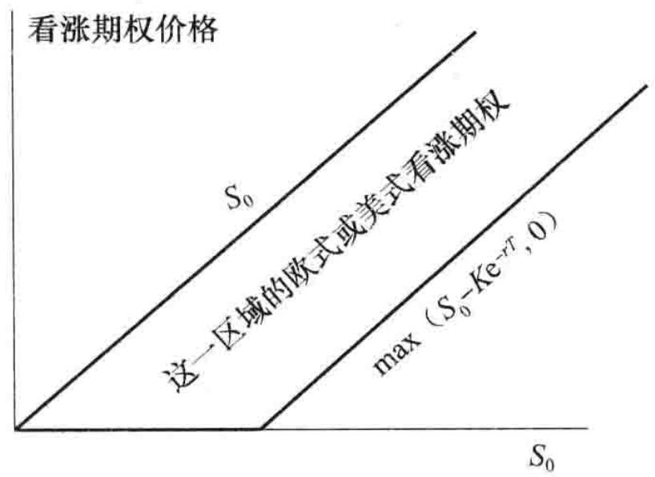图11-3 当没有股息时，美式与欧式看涨期权价格的上下界

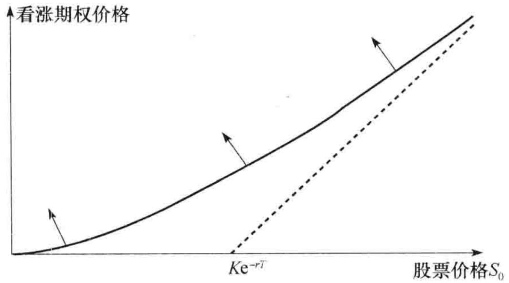图11-4 当没有股息时，美式与欧式看涨期权的价格与股票价格 $S_{0}$ 之间的变化关系。当利率、期限或股票价格波动率增长时，曲线朝箭头所指方向移动

## 11.6 无股息股票上看跌期权

提前行使无股息股票上看跌期权有时可能是最优的。事实上，在期权期限内的任一给定时刻，当期权的实值程度足够大时都应该提前行使期权。

为了说明这一点，考虑以下极端情形：假定执行价格为10美元，股票价格几乎为0。通过立即行使期权，投资者可以马上得到近10美元。如果投资者选择等待，行使期权的盈利可能低于10美元，但不可能高于10美元，这是因为股票的价值不可能为负值。不仅如此，现在收到10美元要比将来收到10美元更好。所以期权应该马上被行使。

$$
同看涨期权类似，看跌期权也可以看作一种保险，当同时持有股票与看跌期权时，看跌期权可以为持有者在股票价格下跌到一定程度时提供保险。但与看涨期权不同的是，放弃这一保险而提前行使期权来立即实现执行价格的做法可能为最优。一般来讲，当 $S_{0}$ 减小，r增大和 $\sigma$ 减小时，提前行使期权为最优选择的可能性也会增大。

$$

### 上下界

在没有股息的情况下，由式（11-3）与式（11-5）可知欧式看跌期权的上下界为

$$
\max (K \mathrm{e}^{- r T} - S_{0}, 0) \leqslant P \leqslant K \mathrm{e}^{- r T}
$$

对于没有股息的股票上的美式看跌期权，由于总是可以马上行使期权，所以它永远满足
$$
P \geqslant \max (K - S_{0}, 0)
$$

这比式（11-5）中欧式看跌期权的关系式更强。利用式（11-2）中的结果，无股息股票上美式看跌期权的上下界为
$$
\max (K - S_{0}, 0) \leqslant P \leqslant K
$$

图11-5 展示了这些上下界。

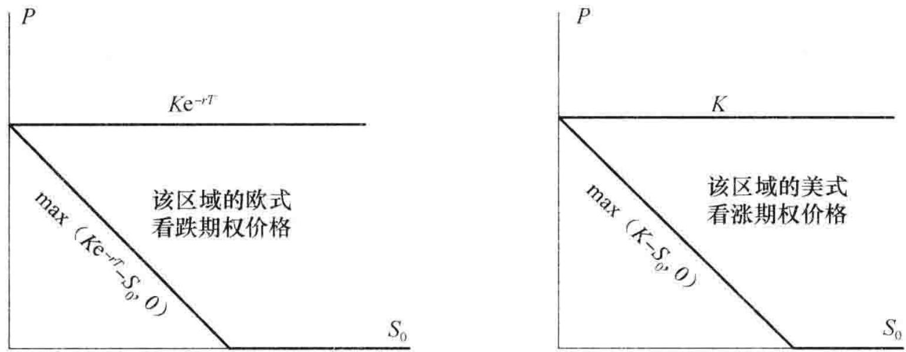图11-5 当没有股息时，欧式与美式看跌期权的上下界图11-6 说明了在一般情况下，美式看跌期权价格随 $S_{0}$ 变化的形式。只要 r > 0，当股票价格足够低时，立即行使美式期权的做法总是最佳的。当提前行使期权是最佳选择时，期权的价值为 $K - S_{0}$ 。因此当 $S_{0}$ 很小时，表示看跌期权价值的曲线与看跌期权的内涵价值 $K - S_{0}$ 相重合。在图11-6 中，这个 $S_{0}$ 的值由 A 点表示。当 r 减小或波动率增大或期限 T 增大时，表示看跌期权价格与股票价格之间关系的曲线会向箭头所指方式移动。

由于在某些情形下提前行使美式看跌期权是最佳的，美式看跌期权的价格总是会高于相应的欧式看跌期权价格。而且由于美式看跌期权的价值有时等于其内涵价值（见图11-6），因此欧式看跌期权的价值有时会低于内涵价值，这说明表示欧式期权价格与标的股票价格之间关系的曲线将会位于相应美式期权曲线之下。图11-7 给出了欧式看跌期权价格随股票价格变化的图形。注意在图11-7 中的 B 点上，期权价格等于其内涵价值，它所代表的股票价格必须大于图11-6 中 A 点所代表的股票价格，这是因为图11-7 里的曲线位于图11-6 中的曲线之下。在图11-7 中，E 点对应于 $S_{0}=0$ ，而看跌期权价格为 $Ke^{-rT}$ 的情形。

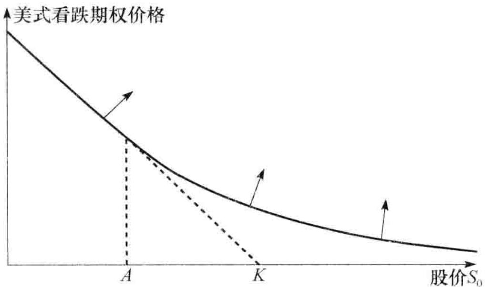图11-6 美式看跌期权的价格与股票价格之间的变化关系，当股票价格期限或波动率增大、或利率降低时，曲线朝箭头所指方向移动

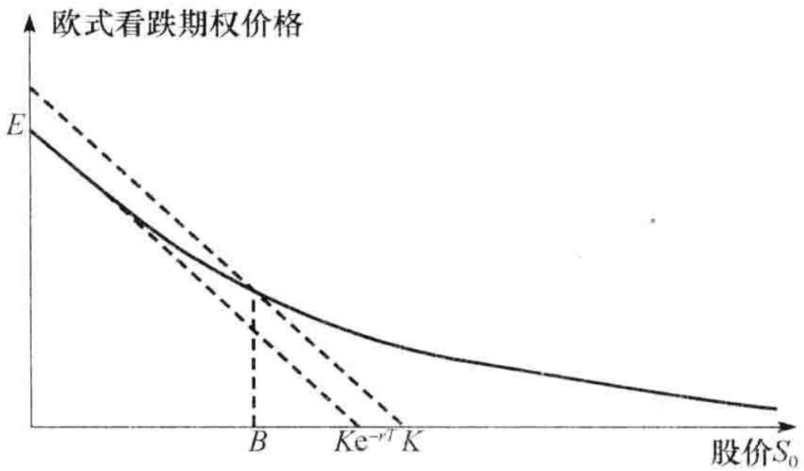图11-7 欧式看跌期权的价格与股票价格之间的变化关系

## 11.7 股息对于期权的影响

到目前为止，本章里的结论都是建立在假设标的股票不付任何股息的前提下得到的。在这一节里我们考虑股息对于期权的影响。我们假设在期权期限内股息的支付时间与数量都是已知的。因为大多数在交易所交易期权的期限都不超过1年，所以在大多数情况下这个假设并不是太不合理。我们用 $D$ 来表示期权期限内股息的贴现值。在计算 $D$ 时，我们假定股息是在除息日付出的。

### 11.7.1 看涨期权与看跌期权的下限

我们将组合 A 和组合 B 重新定义如下:

组合 A: 一个欧式看涨期权 c 加上数量为 $D + Ke^{-rT}$ 的现金。

组合 B: 1 只股票。

以推导式（11-4）的类似方法可以证明

$$
c \geqslant \max (S_{0} - D - K e^{- r T}, 0)\tag{11-8}
$$

我们将组合 C 和组合 D 重新定义如下：

组合 C: 一个欧式看跌期权 p 加上 1 只股票。

组合 D：数量为 $D + Ke^{-rT}$ 的现金。

以推导式（11-5）的类似方法可以证明
$$
p \geqslant \max (D + K e^{- r T} - S_{0}, 0)\tag{11-9}
$$

### 11.7.2 提前行使

当预计有股息时，我们将不再有美式看涨期权不会被提前行使的结论。有时在正好除息日之前行使美式看涨期权是最优的，而在其他时刻行使美式看涨期权则不会是最优策略。在15.12节中我们将进一步讨论这一点。

### 11.7.3 看跌-看涨平价关系式

比较经过重新定义的组合 A 与组合 C 在时间 T 的价值，我们可以得出当存在股息时，式（11-6）所表达的看跌 - 看涨平价关系式变为
$$
c + D + K \mathrm{e}^{- r T} = p + S_{0}\tag{11-10}
$$

股息会使式（11-7）变成（见练习题11.19）
$$
S_{0} - D - K \leqslant C - P \leqslant S_{0} - K \mathrm{e}^{- r T}\tag{11-11}
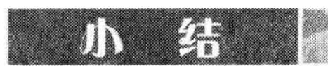

$$

影响股票期权价值的因素有6种：股票的当前价格、执行价格、期限、股票价格波动率、无风险利率以及在期权期限内所预期的股息。当股票的当前价格、期限、波动率以及无风险利率增长时，看涨期权的价值也会增加；当执行价格与预期股息增长时，看涨期权价值会减小。当执行价格、期限、波动率和预期股息增加时，看跌期权价值一般也会增加；当股票的当前价格与无风险利率增加时，看跌期权的价值会减小。

我们也可以在不对股票价格波动率做任何假设的前提下，得出一些关于期权价格的结论，例如，股票看涨期权的价格一定总是低于股票本身的价格。类似地，股票看跌期权的价格永远低于股票期权的执行价格。

无股息股票上看涨期权的价格必须高于

$$
\max \left(S_{0} - K e^{- r T}, 0\right)
其中 $S_{0}$ 为股票价格， $K$ 为执行价格， $r$ 为无风险利率， $T$ 为期限。无股息股票上看跌期权的价格必须高于
\max \left(K e^{- r T} - S_{0}, 0\right)
$$

假定股票所支付股息的贴现值为 D，欧式看涨期权的下限为
$$
\max (S_{0} - D - K \mathrm{e}^{- r T}, 0)
$$

欧式看跌期权的下限为
$$
\max (K \mathrm{e}^{- r T} + D - S_{0}, 0)
$$

看跌－看涨期权的平价关系式是同一股票上欧式看涨期权价格 $c$ 和欧式看跌期权价格 $p$ 之间的关系式。对于无股息股票，平价关系式为
$$
c + K \mathrm{e}^{- r T} = p + S_{0}
$$

对于支付股息的股票，平价关系式为
$$
c + D + K \mathrm{e}^{- r T} = p + S_{0}
$$

对于美式期权，看跌－看涨平价关系式不成立。但是，我们可以利用无套利理论获得美式看涨期权与看跌期权差价的上限和下限。

在第 15 章中，我们将利用对股票价格的概率分布所做的假设来对本章里的结论做出进一步分析。我们将推导欧式期权的准确定价公式。在第 13 章和第 21 章中我们将看到如何利用数值方法来对美式期权进行定价。

Broadie, M., and J. Detemple. "American Option Valuation: New Bounds, Approximations, and a Comparison of Existing Methods," Review of Financial Studies, 9, 4 (1996): 1211–50.

Merton, R. C.. “On the Pricing of Corporate Debt: The Risk Structure of Interest Rates,” Journal of Finance, 29, 2 (1974): 449–70.

Merton, R. C. "The Relationship between Put and Call Prices: Comment," Journal of Finance, 28 (March 1973): 183–84.

Stoll, H. R. “The Relationship between Put and Call Option Prices,” Journal of Finance, 24 (December 1969): 801–24.11.1 列出影响股票期权价格的6个因素。

11.2 无股息股票上看涨期权的期限为4个月，执行价格为25美元，股票的当前价格为28美元，无风险利率为每年 $8\%$ ，期权的下限是多少？

11.3 无股息股票上欧式看跌期权的期限为1个月，执行价格为15美元，股票的当前价格为12美元，无风险利率为每年 $6\%$ 时，期权的下限为多少？

11.4 列举两个原因来说明为什么无股息股票上美式看涨期权不应当被提前行使。第一个原因应涉及货币的时间价值；第二个原因在利率为0时也应成立。

11.5 “提前行使美式看跌期权是在货币的时间价值与看跌期权的保险价值之间的权衡。”解释这一观点。

11.6 解释为什么一个支付股息股票上美式看涨期权的价格至少等于其内涵价格。这对欧式看涨期权也成立吗？解释你的答案。

11.7 无股息股票的价格为 19 美元，其上 3 个月期执行价格为 20 美元的欧式看涨期权价格为 1 美元，无风险利率为每年 4%，这个股票上 3 个月期限执行价格为 20 美元的看跌期权价格为多少？

11.8 解释为什么关于欧式期权看跌-看涨平价关系的讨论对于美式期权不适用。

11.9 无股息股票上看涨期权的期限为6个月，执行价格为75美元，股票当前价格为80美元，无风险利率为每年 $10\%$ 时，期权价格的下限为多少？

11.10 无股息股票上欧式看跌期权的期限为2个月，执行价格为65美元，股票当前价格为58美元，无风险利率为每年 $5\%$ 时，期权价格的下限为多少？

11.11 一个期限为4个月，在支付股息股票上的欧式看涨期权价格为5美元，执行价格为60美元，股票当前价格为64美元，预计在1个月后股票将支付0.8美元的股息，对于所有期限的无风险利率均为 $12\%$ ，这时对于套利者而言存在什么样

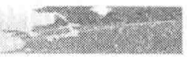

的套利机会？

11.12 期限为1个月的无股息股票上欧式看跌期权的当前价格为2.5美元。股票价格为47美元，执行价格为50美元，无风险利率为每年 $6\%$ ，这时对套利者而言存在什么样的套利机会？

11.13 当无风险利率上升与波动率下降时，用直观方式解释为什么提前行使美式看跌期权会变得更吸引人。

11.14 执行价格为30美元，期限为6个月的欧式看涨期权的价格为2美元。标的股票价格为29美元，在2个月与5个月时预计股票将会分别发放0.5美元股息，所有期限的无风险利率均为 $10\%$ 。执行价格为30美元，期限为6个月的欧式看跌期权价格是多少？

11.15 解释当练习题 11.14 中的欧式看跌期权价格为 3 美元时，会有什么样的套利机会。

11.16 无股息股票上美式看涨期权的价格为4美元，股票价格为31美元，执行价格为30美元，期限为3个月，无风险利率为8%。推导具有相同股票价格、相同执行价格与相同期限的美式看跌期权上下限。

11.17 在练习题 11.16 中，如果美式看跌期权价格高于其上限，仔细说明这时存在什么样的套利机会。

11.18 证明式（11-7）（提示：对于关系式的第一部分，考虑（a）一个欧式看涨期权与一个数量为 $K$ 的现金组合，及（b）一个美式看跌期权与1只股票的组合）。

11.19 证明式（11-11）（提示：对于关系式的第一部分，考虑（a）一个欧式看涨期权与一个数量为 $D + K$ 的现金的组合，以及（b）一个美式看跌期权与1只股票的组合）。

11.20 考虑一个5年期的雇员期权，标的股票不支付股息，期权可以在1年后任何时候行使。与通常在交易所内交易的看涨期权不同的是，雇员期权不能被出售。

这一限制对提前行使策略会有什么影响？

## 作业题

11.22 在交易所，看涨期权比看跌期权被更早引入，在看涨期权被引入而同时看跌期权还没有被引入时，对于一个无股息股票，你将如何由看涨期权来构造欧式看跌期权？

11.23 假定关于某无股息股票的看涨和看跌期权的价格分别为20美元和5美元，期权期限为12个月，执行价格为120美元，当前股票价格为130美元，由以上信息隐含得出的无风险利率为多少？

11.24 同一股票上的欧式看涨与看跌期权的执行价格均为20美元，期限均为3个月，两个期权的价格均为3美元，无风险利率均为每年 $10\%$ ，当前股票价格为19美元，在1个月时股票预计将支付1美元的股息。对于交易员来讲，这时会有什么样的套利机会？

11.25 假设 $c_{1}, c_{2}, c_{3}$ 分别代表执行价格为 $K_{1}, K_{2}$ 与 $K_{3}$ 的欧式看涨期权的价格，这里的执行价格满足 $K_{3} > K_{2} > K_{1}$ 和 $K_{3} - K_{2} = K_{2} - K_{1}$ 。所有期权具有相同的到期日，证明

$$
c_{2} \leqslant 0.5 (c_{1} + c_{3})

(提示：考虑以下交易组合：一个执行价格为 $K_{1}$ 的期权多头，一个执行价格为 $K_{3}$ 的期权多头，以及两个执行价格为 $K_{2}$ 的期权空头)。

$$

11.26 如果作业题 11.25 中的期权为欧式看跌期权，结果又会如何？

11.27 假设你是一家杠杆比例很高公司的经理和唯一股东，所有的债务在1年后到期，如果那时公司的价值高于债务的面值，你将偿还债务；如果那时公司价值小于债务的面值，你将宣布破产，同时债务

11.21 采用 DerivaGem 软件来验证图11-1 及图11-2 的正确性。

人将会拥有公司。

(a) 将公司的价值作为期权的标的资产，描述你的期权头寸状况。

(b) 将公司的价值作为期权的标的资产，描述债权人的期权头寸状况。

(c) 你应该如何提高你的期权头寸价值？

11.28 考虑以下期权：股票价格为41美元，执行价格为40美元，无风险利率为6%，波动率为35%，期限为1年。假定预计在6个月时将发放0.5美元的股息。

(a) 假定期权为欧式看涨期权，采用 DerivaGem 软件对这一期权定价。

(b) 假定期权为欧式看跌期权，采用 DerivaGem 软件对这一期权定价。

(c) 验证看跌 - 看涨平价关系式。

(d) 用 DerivaGem 说明当期权期限变得很长时，期权价格会如何改变。在分析中假定股票无股息。解释你所得出的结果。

11.29 考虑无股息股票上的看跌期权，股票价格是40美元，执行价格是42美元，无风险利率是 $2\%$ ，波动率是每年 $25\%$ ，期限是3个月。利用DerivaGem解决以下问题。

(a) 当期权是欧式时的价格（采用布莱克－斯科尔斯公式，欧式）。

(b) 当期权是美式时的价格（采用二叉树，美式，100步）。

(c)图11-7 中的点 B。

11.3011.1 节里给出了一个欧式看涨期权价格随时间期限增长而有所降低的例子，请给出一个具有同样性质，即价格随时间期限增长而有所降低的欧式看跌期权的例子。

在第 10 章中我们讨论过由单个期权所产生的盈利模式。在这一章里，我们将讨论当期权与其他资产相结合时能够产生什么样的盈利模式，特别是由以下头寸构成的组合：（a）期权与零息债券，（b）期权与标的资产，以及（c）同一标的资产上的两个或更多个期权。

人们很自然地会问以下问题：为什么交易员要构造这里讨论的不同盈利形式？对于这个问题的答案是：交易员选用不同的盈利形式取决于交易员对于价格走向的判断，以及交易员承担风险的意愿。12.1节里讨论的保本证券对于那些厌恶风险的投资人会很有吸引力，此类投资人不愿意损失本金，但他们对于某种特定资产价格是会升值或者减值持有一定看法，因此也愿意面对资产回报高低与自己的观点是否正确相关联的事实。如果一个交易员愿意承担比保本证券投资更大的风险，他可以选择12.3节讨论的牛市差价（bull spread）或熊市差价（bear spread），或者他直接选择风险更大的看涨或看跌期权的多头。

假定某交易员认为某资产价格会有一个大的变动，但不能确定价格究竟是上涨还是下跌，该交易员可以选择几种不同的交易形式，一个厌恶风险（risk-averse）的交易员可以选择12.3节里讨论的蝶式差价（butterfly spread）。如果交易员的直觉正确，该交易员会有一个小收益；如果交易员的直觉错误，该交易员也只会有一个小损失。一个更为激进的交易员可以采用12.4节讨论的跨式组合（straddle）或者异价跨式组合（strangle），其中收益和损失都可能会更大。

在以后的章节里还会考虑涉及期权的更多交易策略。例如，在[第17章](ch17.md)中将讨论如何利用股指来管理股票组合的风险，并解释如何利用范围远期来对冲关于外汇的风险敞口；在[第19章](ch19.md)里我们考虑在交易期权时如何利用希腊字母（风险敏感度）来管理风险；[第26章](ch26.md)考虑了特种期权以及所谓的静态期权复制方法。

