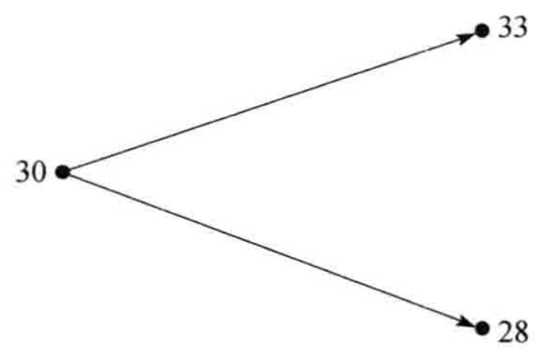
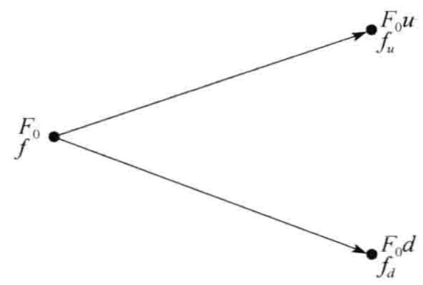
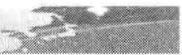
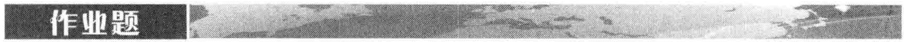

# 第18章 期货期权的特性

期货期权给予持有者权利（而非义务）在将来某一时刻以一定的期货价格进入期货合约。具体地讲，看涨期货期权给持有者在将来某时刻以一定期货价格持有合约多头的权利；看跌期货期权给持有者在将来某时刻以一定期货价格持有期货合约空头的权利。大多数期货期权为美式期权，也就是说期权持有者在合约有效期内随时可以行使期权。

当看涨期货期权被行使时, 期权持有者进入一个期货合约的多头, 加上数量等于最新期货结算价格减去执行价格的现金; 当看跌期货期权被行使时, 期权持有者进入一个期货合约的空头, 加上数量等于执行价格减去最新期货结算价格的现金。以下的例子说明, 一个关于看涨期货期权的实际收益等于 $\max (F - K, 0)$ , 而一个关于看跌期货期权的实际收益等于 $\max (K - F, 0)$ , $F$ 是执行期权时的期

货价格，K 为执行价格。

例18-1

假定现在是8月15日，某投资者持有1份9月份的黄铜期货期权合约，执行价格为每磅320美分。1份合约的规模是25000磅黄铜。假定当前9月份交割的黄铜期货价格为331美分，8月14日（最近一个结算日）黄铜期货的结算价格为330美分。如果期权被行使，投资者收入现金为

25000 \times (330 - 320) (\text{美分}) = 2500 (\text{美元})
与此同时，投资者进入了一个在9月份买入25000磅黄铜期货合约的多头。如果投资者愿意，他可以立即将期货平仓，投资者除收入2500美元外再加上以下数量的现金
25000 \times (331 - 330) (\text{美分}) = 250 (\text{美元})
这一数量反映了在最近一次结算后期货价格的变化。在8月15日行使期权的整体收益为2750美元，该数量正好等于 $25000(F - K)$ ，其中 $F$ 为行使期权时的期货价格， $K$ 为执行价格。

$$

$$

某投资者持有1份12月份玉米期货的看跌期权合约，执行价格为每蒲式耳600美分。每份合约的规模是5000蒲式耳玉米。假定当前12月份交割的玉米期货价格为580美分，在最近一个结算日，玉米期货的结算价格为579美分。如果行使期权，那么投资者收入的现金数量为
5000 \times (600 - 579) (\text{美分}) = 1050 (\text{美元})
同时投资者进入了一个在 12 月份卖出 5000 蒲式耳玉米期货合约的空头。如果投资者愿意，他可以立即将期货平仓，投资者收入 1050 美元，但同时要付出以下数量的现金
5000 \times (580 - 579) (\text{美分}) = 50 (\text{美元})
这一数量反映了在最近一次结算后期货价格的变化。投资者的净收益为 1000 美元，该数量等于 5000 (K - F)，其中 $F$ 为行使期权时的期货价格， $K$ 为执行价格。

$$


### 到期月
$$

期货期权是按标的期货到期月（而不是按期权到期月）来识别的。上面讲过，大多数期货期权为美式期权。期货期权到期日通常是标的期货交付日期的前几天（例如，CME 的长期国债期货期权到期日在期货合约到期月前一个月份，具体日期为距月底至少 2 个交易日之前的倒数第 1 个星期五）。CME 中线欧洲美元（mid-curve Eurodollar）合约是一个例外，该合约到期时间比相应期权到期时间要晚 1 或 2 年。

在美国比较流行的期货期权的标的资产包括玉米、大豆、棉花、糖、原油、天然气、黄金、长期国债、中期国债、5年期国债、30天期联邦基金、欧洲美元、1年与2年期中线欧洲美元、欧元银行间拆借利率（Euribor）、欧元债券（Eurobonds）和标普500指数。

### 利率期货期权

在美国的交易所里交易最为活跃的利率期权产品是关于长期国债期货、中期国债期货和欧洲美元期货的期权。

CME 集团交易的长期国债期货期权的持有者有权进入一个长期国债期货合约。如[第6章](ch06.md)所述，1份长期国债期货合约的规模是交割 100000 美元的长期国债。长期国债期货期权的报价是以标的长期国债面值的百分比给出的，价格被近似到面值 1% 的 1/64。

CME 集团交易的欧洲美元期货期权的持有者有权进入一个欧洲美元期货合约。如[第6章](ch06.md)所述，当欧洲美元期货的报价变化一个基点（即 $0.01\%$ ）时，欧洲美元期货合约的损益为25美元。与此类似，在对欧洲美元期货期权定价时，一个基点也代表25美元。

$$
利率期货期权合约的运作方式与本章中所讨论的其他期货期权合约相同。例如，在行使期权后，除现金收益外，看涨期权持有者还要同时得到期货合约的多头，而期权承约方将会持有相应期货合约的空头。期权的整体收益（包括期货交易的头寸）为 $\max(F-K,0)$ ，其中 F 为行使期权时的期货价格，K 为执行价格。
$$

当债券价格增长时（即利率下降时），利率期货价格会随之增长；当债券价格下降时（即利率增长时），利率期货价格会随之下降。如果一个投资者认为短期利率会增长，他可以买入关于欧洲美元期货的看跌期权来进行投机；如果一个投资者认为短期利率会下降，他可以买入关于欧洲美元期货的看涨期权来进行投机。如果一个投资者认为长期利率会增长，他可以买入关于长期或中期国债期货的看跌期权来进行投机；如果一个投资者认为长期利率会下降，他可以买入关于长期或中期国债期货的看涨期权来进行投机。

$$

$$

$$
现在是2月份，6月份欧洲美元合约的期货价格为93.82（对应于每年 $6.18\%$ 的3个月欧洲美元利率）。对以上合约，执行价格为94.00的看涨期权报价为0.1，即10个基点。该期权可能对于认为利率会下降的投资者具有吸引力。假定短期利率确实下降了大约100个基点，当欧洲美元期货价格为94.78时（对应于每年 $5.22\%$ 的3个月欧洲美元利率），期权持有人行使期权。这时期权收益为 $25 \times (94.78 - 94.00) \times 100 = 1950$ 美元，期权合约的费用为 $10 \times 25 = 250$ 美元，因此投资者的盈利为1700美元。
$$

$$



$$

$$
现在是8月份，12月份长期国债合约期货的价格为96-09（即 $96\frac{9}{32}=96.28125$ ）。长期国债的收益率大约为每年6.4%。某投资者认为这一利率到12月份时会下降，他可以买入在12月份到期，执行价格为98的看涨期权。假定期权价格为1-04（价格为面值的 $1\frac{4}{64}=1.0625\%$ ）。如果长期利率确实下降到了每年6%，长期国债期货价格上升到了100-00，投资者在每100美元债券期货上的净盈利为
$$
100.00 - 98.00 - 1.0625 = 0.9375
因为一个期权合约是关于面值为 100000 美元的产品买卖，因此投资者从每份买入的期权中盈利 937.50 美元。


## 18.2 期货期权被广泛应用的原因

人们很自然会问，为什么有人会选择交易期货期权而不是交易关于标的资产的期权呢？主要原因似乎是在大多数情形下，期货合约要比标的资产的流动性更好，而且容易交易。还有，在交易所很容易马上获得期货的价格，而标的资产的价格并不一定很容易取得。

考虑长期国债。长期国债的期货市场要比任何个别的国债市场都活跃得多，而且马上可以从交易所的交易中得到长期国债期货的价格。与此相比，只有通过联系一个或更多的交易商，投资者才能取得当前债券市场的价格。因此，当我们看到投资者更愿意交割长期国债期货而不是国债现货时，就不会感到奇怪了。

商品期货的交易往往比直接交易商品本身更容易。例如，在市场上，对活牛期货进行交割比对活牛本身进行交割要容易和方便得多。

期货期权的一个重要特点是对期权的行使并不一定会触发对标的资产的交割，因为在大多数情形下标的期货合约会在到期日之前被平仓。期货期权往往最终以现金结算，这对大多数投资者来讲颇具吸引力，尤其是对于那些缺乏资金而不能在期权行使后买入标的资产的投资者更是如此。另外一个有时人们会提到的优点是期货与期货期权在同一个交易所中同时交易。这给对冲、套利、投机都带来了方便，这也使市场有效性会更高。期货期权还有一个优点是在许多情况下，期货期权比即期期权的交易费用要低。

## 18.3 欧式即期期权和欧式期货期权

执行价格为 K 的欧式看涨即期期权收益为
\max (S_{T} - K, 0)
$$

其中 $S_{T}$ 为期权到期时资产的即期价格。具有同样执行价格 $K$ 的欧式看涨期货期权收益为

$$
\max (F_{T} - K, 0)
$$
其中 $F_{T}$ 为期权到期时的期货价格。如果期货与期权同时到期，那么 $F_{T} = S_{T}$ ，这时两个期权等价。类似地，当期货与期权同时到期时，欧式即期看跌期权与欧式期货看跌期权等价。
$$

大多数市场交易的期货期权为美式期权。但是我们会看到，研究欧式期货期权仍会很有用处，因为我们得出的结果可以用来对欧式即期期权定价。

## 18.4 看跌 - 看涨期权平价关系式

在[第11章](ch11.md)里我们得出了欧式股票期权的看跌-看涨期权的平价关系式。我们现在采用类似的方法来推导对于欧式期货期权的看跌-看涨平价关系式。考虑具有相同执行价格 $K$ 与期限 $T$ 的两个欧式看涨和看跌期货期权。我们可以构造以下两个交易组合

$$
组合 A: 一份欧式看涨期货期权加上数量为 $K_{\mathrm{e}}^{-rT}$ 的现金;
$$

$$
组合 B: 一份欧式看跌期货期权加上一份期货合约多头, 再加上数量为 $F_{0} \mathrm{e}^{-r T}$ 的现金, 其中 $F_{0}$ 为期货价格。
$$

$$
在组合 A 中，现金可以按无风险利率 r 进行投资，在 T 时刻，该投资会增长到 K。令 $F_{T}$ 为期权到期时的期货价格。如果 $F_{T} > K$ ，组合 A 中的期权会被行使，这时组合 A 的价值为 $F_{T}$ ；如果 $F_{T} \leqslant K$ ，组合 A 中的期权不会被行使，这时组合 A 的价值为 K。因此在 T 时刻，组合 A 的价值为
$$
\max (F_{T}, K)
$$

在组合 B 中，现金按无风险利率进行投资。在 T 时刻，该投资会增长到 $F_{0}$ 。看跌期权收益为 $\max(K - F_{T}, 0)$ ，期货提供的收益为 $F_{T} - F_{0}$ 。 $^{\ominus}$ 因此组合 B 在时刻 T 的价值为

$$
F_{0} + \left(F_{T} - F_{0}\right) + \max (K - F_{T}, 0) = \max (F_{T}, K)
因为以上两个交易组合在 $T$ 时刻的价值相等，并且欧式期权不能被提前行使，所以这里的两个交易组合在今天的价值应该相等。组合 A 在今天的价值为
c + K \mathrm{e}^{- r T}
其中 $c$ 为看涨期货期权的价格。每日结算过程保证组合 B 中的期货在今天的价格为 0，所以组合 B 的价值为
p + F_{0} \mathrm{e}^{- r T}
其中 $p$ 为看跌期货期权的价格，因此
c + K \mathrm{e}^{- r T} = p + F_{0} \mathrm{e}^{- r T}\tag{18-1}
$$
以上看跌-看涨期权平价关系式与式（11-6）中关系式之间的区别是股票价格 $S_{0}$ 被贴现后的期货价格 $F_{0} \mathrm{e}^{-r T}$ 所取代。
$$

如 18.3 节所示, 当期权与标的期货合约同时到期时, 欧式即期期权与欧式期货期权是等价的。当两种期权的到期日与期货相同时, 式 (18-1) 即给出了即期看涨期权、即期看跌期权和期货价格之间的关系式。

$$
例18-5
$$

假定一个对于即期白银的欧式看涨期权价格为每盎司0.56美元，期权期限为6个月，执行价格为8.5美元。假定6个月期限的白银期货价格为8美元，投资6个月的无风险利率为每年 $10\%$ 。将式（18-1）变形后可以得知一个具有同样期限和执行价格的欧式即期看跌期权价格为
0.56 + 8.50 \mathrm{e}^{- 0.1 \times 6 / 12} - 8.00 \mathrm{e}^{- 0.1 \times 6 / 12} = 1.04
对于美式期货期权，看跌-看涨期权的关系是（见练习题18.19）
F_{0} \mathrm{e}^{- r T} - K <   C - P <   F_{0} - K \mathrm{e}^{- r T}\tag{18-2}
## 18.5 期货期权的下限

看跌-看涨期权平价关系式式（18-1）给出了欧式看涨期权和看跌期权的下限。因为看跌期权的价格 $p$ 不能为负值，由式（18-1）得出
c + K \mathrm{e}^{- r T} \geqslant F_{0} \mathrm{e}^{- r T}
$$

即

$$
c \geqslant \max ((F_{0} - K) \mathrm{e}^{- r T}, 0)\tag{18-3}
类似地，因为看涨期权的价格 $c$ 不能为负值，由式（18-1）得出
K \mathrm{e}^{- r T} \leqslant F_{0} \mathrm{e}^{- r T} + p
$$

即

$$
p \geqslant \max ((K - F_{0}) \mathrm{e}^{- r T}, 0)\tag{18-4}
以上得出的下限与[第11章](ch11.md)中推导出的欧式股票期权的下限类似。当期权为深度实值状态时，欧式看涨和看跌期权会与它们的下限价格非常接近。为了说明这一点，我们重新考虑由式（18-1）所表达的看跌－看涨期权平价关系式。当一个看涨期权为深度实值状态时，相应的看跌期权为深度虚值状态，这意味着 $p$ 会接近于0， $c$ 与其下限的差等于 $p$ 。因此看涨期权会与其下限非常接近。对看跌期权我们也可以进行类似的讨论。

由于美式期货期权可以在任何时刻被行使，因此，我们有以下关系式
C \geqslant \max (F_{0} - K, 0)
$$

$$
P \geqslant \max (K - F_{0}, 0)
因此，假设利率为正，美式期权的下限一定会高于相应欧式期权的下限，美式期货期权总是有被提前行使的可能。

## 18.6 采用二叉树对期货期权定价

在本节里我们将比在第 13 章中更正式地探讨如何用二叉树对期货期权定价。期货期权与股票期权的关键区别是进入期货合约时无须付费。

$$
假定当前的期货价格为 30，在 1 个月后，期货价格将上涨到 33 或者下跌到 28。我们考虑对于在期货上执行价格为 29 的看涨期权。在分析过程中，我们忽略期货每日结算的性质。这一情形显示在图18-1 中。当期货价格上涨到 33 时，期权的收益为 4，同时期货合约的价值为 3；当期货价格下跌到 28 时，期权的收益为 0，同时期货合约的价值为 -2。 $^{①}$
$$

为了构造无风险对冲, 我们考虑由一个期权的空头与 $\Delta$ 份期货的多头所组成的交易组合。当期货价格上涨到 33 时, 交易组合价值为 $3 \Delta - 4$ ; 当期货价格下跌到 28 时, 交易组合价值为 $-2 \Delta$ 。当交易组合的终端价格为一样, 即以下公式满足时
3 \Delta - 4 = - 2 \Delta
或 $\Delta = 0.8$ 时，交易组合为无风险。

$$
当 $\Delta$ 取值为 0.8 时, 交易组合在 1 个月后的价值为 $3 \times 0.8 - 4 = -1.6$ 。假定无风险利率为 $6\%$ , 交易组合今天的价值为
$$
- 1.6 \mathrm{e}^{- 0.06 \times 1 / 12} = - 1.592
交易组合包含 1 份期货期权合约的空头与 $\Delta$ 份期货合约。因为今天的期货合约价值为 0，因此今天的期权价格必须是 1.592。

### 18.6.1 推广

我们可以将以上分析进行推广。假定 $F_{0}$ 为期货的初始价格，在时间段 $T$ 以后，期货价格会上涨到 $F_{0}u$ 或下跌到 $F_{0}d$ 。我们考虑一个在时间 $T$ 到期的期权，当期货价格上涨时，期权收益为 $f_{u}$ ，当期货价格下跌时，期权收益为 $f_{d}$ 。图18-2 是对这一情形的总结。

图18-1 数值例子中的期货价格变化

图18-2 一般情形下的期货与期权价格

这时的无风险交易组合包括1份期权的空头和 $\Delta$ 份期货的多头，其中

\Delta = \frac{f_{u} - f_{d}}{F_{0} u - F_{0} d}
交易组合在 $T$ 时刻的价值总是
\left(F_{0} u - F_{0}\right) \Delta - f_{u}
将无风险利率记为 $r$ ，我们得出交易组合在今天的价值为
\left[ \left(F_{0} u - F_{0}\right) \Delta - f_{u} \right] \mathrm{e}^{- r T}
另外一种表达交易组合今天价值的表达式为 -f，其中 f 为期权今天的价值。因此
- f = \left[ \left(F_{0} u - F_{0}\right) \Delta - f_{u} \right] \mathrm{e}^{- r T}
将 $\Delta$ 代入以上表达式，f 可以被简化为
f = \mathrm{e}^{- r T} [ p f_{u} + (1 - p) f_{d} ]\tag{18-5}
$$

其中

$$
p = \frac{1 - d}{u - d}\tag{18-6}
这与13.9节里的结果一致。式（18-6）给出了在风险中性世界里标的资产价格上涨的概率。

$$
在上面的数值例子中（见图18-1）， $u = 1.1$ ， $d = 0.9333$ ， $r = 0.06$ ， $T = 1 / 12$ ， $f_{u} = 4$ ， $f_{d} = 0$ 。由式（18-6），我们可以得出
$$
p = \frac{1 - 0.9333}{1.1 - 0.9333} = 0.4
$$

由式（18-5）得出

$$
f = \mathrm{e}^{- 0.06 \times 1 / 12} [ 0.4 \times 4 + 0.6 \times 0 ] = 1.592
这与我们以前得到的结果是一致的。

### 18.6.2 多步二叉树

$$
应用多步二叉树对美式期货期权定价与对股票期权定价的方式是基本相同的，这在13.9节中曾解释过。对应于期货价格上涨的参数 $u$ 等于 $\mathrm{e}^{\sigma \sqrt{\Delta t}}$ ，其中 $\sigma$ 为期货价格的波动率， $\Delta t$ 为步长，期货价格上升的概率由式（18-6）给出
$$
p = \frac{1 - d}{u - d}
例 13-3 说明了如何利用多步二叉树来对期货期权定价。第 21 章中的例 21-3 给出了进一步的描述。

## 18.7 期货价格在风险中性世界的漂移率

我们可以利用一种更广义的结果来将 17.3 节中的分析用到期货期权上。这一结果是：在风险中性世界里，期货价格的变化等价于支付股息收益率为国内无风险利率 r 的股票。

期货二叉树上关于 $p$ 的方程与股票二叉树上当 $q = r$ 时的概率方程一致（比较式（18-6）与式（17-15）和式（17-16）），从这一现象中我们可以得出一些线索。另外一些线索是期货期权的看跌－看涨期权平价关系式与将股票价格换成期货价格、令 $q = r$ 时等同（比较式（18-1）和式（17-3））。

$$
为了严格地证明以上结果，我们需要计算期货价格在风险中性世界里的漂移率。定义 $F_{t}$ 为时刻t的期货价格，并且假设结算日期为时刻0， $\Delta t$ ， $2\Delta t$ ，…如果在0时刻进入期货多头，其价值为0。在时刻 $\Delta t$ ，期货的收益为 $F_{\Delta t} - F_{0}$ 。如果 r 为在0时刻一段很短时间（ $\Delta t$ ）区间的利率，那么由风险中性定价方法得出在0时刻，合约收益的价值为
$$
\mathrm{e}^{- r \Delta t} \hat{E} [ F_{\Delta t} - F_{0} ]
$$

其中 $\hat{E}$ 为风险中性世界的期望。因此我们必须有

$$
\mathrm{e}^{- r \Delta t} \hat{E} [ F_{\Delta t} - F_{0} ] = 0
$$

从而

$$
\hat{E} \left[ F_{\Delta t} \right] = F_{0}
$$

类似，我们可以证明 $\hat{E}[F_{2\Delta t}] = F_{\Delta t}$ ， $\hat{E}[F_{3\Delta t}] = F_{2\Delta t}$ ，等等。将所有这些结果放在一起后，我们可以看到对于任意时刻 $T$

$$
\hat{E} \left[ F_{T} \right] = F_{0}
$$
因此，在风险中性世界里，期货价格的漂移率为0。由式（17-7）得出，期货价格类似于股息收益率q等于r的股票价格。这一结果具有一般性，它对所有的期货价格均成立，并且与关于利率、波动率等的假设无关。 $^{①}$
$$

在风险中性世界里，通常假设 $F$ 服从以下过程
\mathrm{d}F = \sigma F \mathrm{d}z\tag{18-7}
$$
其中 $\sigma$ 为常数。
$$

### 微分方程

$$
为了从另外一个角度来说明期货价格类似于股息收益率为 q 的股票，我们可以推导期货价格上衍生产品所满足的微分方程。推导方法类似于在 15.6 节中无股息股票上衍生产品所满足的微分方程的推导。期货价格上衍生产品的价格满足微分方程 $^{②}$
$$
\frac{\partial f}{\partial t} + \frac{1}{2} \frac{\partial^{2} f}{\partial F^{2}} \sigma^{2} F^{2} = r f\tag{18-8}
这与在式（17-6）中将 $q$ 取成 $r$ 的形式相同。这验证了在对衍生产品定价时，我们可以将期货价格看成股息收益率为 $r$ 的股票。

## 18.8 期货期权定价的布莱克模型

$$
通过将以上结果进行推广，我们可以对欧式期货期权定价。费希尔·布莱克在1976年发表的一篇文章中首先证明了这一点。 $^{③}$ 假设标的期货价格服从式（18-7）中的对数正态过程，期货期权上的欧式看涨期权价格c和看跌期权p可以由在式（17-4）与式（17-5）中将 $S_{0}$ 由 $F_{0}$ 取代，同时令q=r而给出
$$
c = \mathrm{e}^{- r T} (F_{0} N(d_{1}) - K N(d_{2}))\tag{18-9}
$$

$$
p = \mathrm{e}^{- r T} (K N(- d_{2}) - F_{0} N(- d_{1}))\tag{18-10}
$$

其中

$$
d_{1} = \frac{\ln (F_{0} / K) + \sigma^{2} T / 2}{\sigma \sqrt{T}}
$$

$$
d_{2} = \frac{\ln (F_{0} / K) - \sigma^{2} T / 2}{\sigma \sqrt{T}} = d_{1} - \sigma \sqrt{T}
$$
其中 $\sigma$ 为期货价格的波动率。当持有费用和便利收益率均为时间的函数时，我们可以证明期货价格的波动率等于标的资产的波动率。
$$

$$
例18-6
$$

$$
考虑一个原油期货上的欧式看跌期权，期权的期限为4个月，当前的期货价格为20美元，执行价格为20美元，无风险利率为每年 $9\%$ ，期货波动率为每年 $25\%$ 。这时 $F_{0} = 20$ ， $K = 20$ $r = 0.09$ ， $T = 4 / 12$ ， $\sigma = 0.25$ 和 $\ln (F_0 / K) = 0$ ，因此
$$
d_{1} = \frac{\sigma \sqrt{T}}{2} = 0.07216
$$

$$
d_{2} = - \frac{\sigma \sqrt{T}}{2} = - 0.07216
$$

$$
N(- d_{1}) = 0.4712, \quad N(- d_{2}) = 0.5288
看跌期权价格 $p$ 为
p = \mathrm{e}^{- 0.09 \times 4 / 12} (20 \times 0.5288 - 20 \times 0.4712) = 1.12
$$
即 1.12 美元。
$$

### 由布莱克模型代替布莱克－斯科尔斯－默顿模型

18.3节中的结果说明当期权期限与期货期限相同时，期货期权与即期期权等价。因此式（18-9）和式（18-10）也提供了一种对于即期资产上欧式期权定价的方法。

$$
例 18-7
$$

考虑一个6个月期限, 标的资产为即期黄金价格的欧式看涨期权, 即在6个月后买入1盎司黄金的期权。期权执行价格为1200美元, 6个月期限的黄金期货价格为1240美元, 无风险利率为每年 $5\%$ , 期货波动率为 $20\%$ , 这一期权等价于在6个月期限的期货价格上的欧式期权。式 (18-9) 可以给出这个期权的价格为
\mathrm{e}^{- 0.05 \times 0.5} [ 1240 N(d_{1}) - 1200 N(d_{2}) ]
$$

其中

$$
d_{1} = \frac{\ln (1240 / 1200) + 0.2^{2} \times 0.5 / 2}{0.2 \sqrt{0.5}} = 0.3026
$$

$$
d_{2} = \frac{\ln (1240 / 1200) - 0.2^{2} \times 0.5 / 2}{0.2 \sqrt{0.5}} = 0.1611
计算出的期权价格为 88.37 美元。

与布莱克－斯科尔斯－默顿模型相比，交易员更喜欢采用布莱克模型来对欧式即期期权定价。这种用法非常广泛。标的资产既可以是消费资产也可以是投资资产，而且资产也可以给持有人提供收入。在式（18-9）和式（18-10）中的变量 $F_{0}$ 被取成与期权期限一样的期货或远期合约价格。

式（17-13）和式（17-14）展示了如何将布莱克模型应用到关于货币即期期权的定价上。式（17-8）和式（17-9）则展示了如何将布莱克模型应用到关于股指即期期权的定价上。布莱克模型的很大优点是我们不需要去估计标的资产的收入（或方便收益）。在模型中的期货或远期价格已经将这些收入考虑在内。

在 17.4 节里, 当考虑股指情形时, 我们解释了由看跌 - 看涨期权平价关系式出发, 如何从市场交易活跃的指数期权中隐含地计算相应期限的远期价格, 通过对这些远期价格进行插值, 我们还可以估计对应于其他期限的远期价格。对于许多其他标的资产, 我们都可以进行类似的处理。

## 18.9 美式期货期权与美式即期期权

在实际中，市场交易的期货期权通常为美式期权。假定无风险利率 $r$ 为正，美式期货期权总是有被提前行使的可能性，因此，美式期货期权价格总是会高于相应的欧式期货期权的价格。

在当期权与期货具有相同期限时，美式期货期权的价格并不一定等于美式即期期权的价格。例如，假定我们有一个正常市场（normal market），其中期货价格在到期前一直高于即期资产价格。这时，美式看涨期货期权价格一定会高于相应的美式即期看涨期权。这是因为在某些情形下，期货期权可能会被提前行使，这会给期权持有者带来更大的收益。类似地，一个美式看跌期货期权的价格一定会低于相应的美式即期看跌期权的价格。当市场为反向（inverted market），即期货价格总是低于即期价格时，与以上相反的结论会成立。这时，美式看涨期货期权的价格会低于美式即期看涨期权的价格，而美式看跌期货期权的价格会高于美式即期看跌期权的价格。

上面描述了关于美式期货期权与美式即期期权的差别，这在期货与期权具有不同或相同期限时均成立。事实上，期货期限比期权期限越长，两种期权的差别也就越大。

## 18.10 期货式期权

有些交易所交易所谓的期货式期权（futures-style options），这是关于期权收益的期货合约。一般来讲，交易员在买入（卖出）即期或期货期权时要首先支付（收入）现金。与此不同的是，买入或卖出期货式期权的交易员要缴纳保证金，这一点与一般的期货交易没有什么两样（见[第2章](ch02.md)）。与其他期货一样，期货式期权要每天进行结算，而最终的结算为期权的收益。期货合约是对资产的将来价格下注，而期货式期权是对期权将来的收益下注。当利率为常数时，期货式期权中的期货价格等价于关于期权收益的远期合约中的远期价格，这一结论说明期货式期权中的期货价格等于一个在到期时才付费的期权价格。因此，期货式期权价格等于一个普通期权价格以无风险利率复利到期权满期的数量。

式（18-9）和式（18-10）中的布莱克模型给出了一个普通欧式期权的价格，其中期货（远期）价格 $F_{0}$ 对应于一个与期权具有同样期限的期货。因此，看涨期货式期权中的期货价格为

F_{0} N(d_{1}) - K N(d_{2})
看跌期货式期权中的期货价格为
K N(- d_{2}) - F_{0} N(- d_{1})
$$
其中 $d_{1}$ 和 $d_{2}$ 由式（18-9）和式（18-10）给出。这些公式不依赖于无风险利率，并且对于期货合约上的期货式期权和资产即期价格上的期货式期权都是正确的。在第1种情形下， $F_{0}$ 为期权标的合约的当前期货价格；在第2种情形下， $F_{0}$ 为与期权具有同样期限的期货合约的当前期货价格。
$$

期货式期权的看跌 - 看涨期权平价关系式为
p + F_{0} = c + K
一个美式期货式期权可以被提前行使，这时要马上结算期权的内涵价值。事实上，提前行使美式期货式期权肯定不是最优的决策，这是因为期权的期货价格永远大于内涵价值，因此我们可以将这种美式期货式期权视为相应的欧式期货式期权。

期货期权在行使时需要交割标的期货。当看涨期权被行使时，期权持有者取得期货多头加上数量为期货价格超出执行价格的现金。类似地，当看跌期权被行使时，期权持有者取得期货空头加上数量为执行价格超出期货价格的现金。期货的到期日通常比期权的到期日要略晚。

期货价格与支付股息收益率等于无风险利率 $r$ 的股票价格相似。这意味着当我们将期货价格取代股票价格，并同时令股息收益率等于无风险利率时，[第17章](ch17.md)中得出的对于股票期权定价公式也适用于期货期权。欧式期货期权的定价公式最初由费希尔·布莱克在1976年提出，公式中的主要假设是在期权到期时期货价格服从对数正态分布。

如果期权与期货具有同样的期限，欧式期货期权的价格等于相应的欧式即期期权的价格。这一结论常常被用来对欧式即期期权定价。这一结论对美式期权并不成立。如果期货市场为正常市场，美式看涨期货期权的价格会高于相应的美式即期看涨期权，美式看跌期货期权的价格会低于相应的美式即期看跌期权；当期货市场为反向市场时，与以上相反的结论将会成立。

Black, F. “The Pricing of Commodity Contracts,” Journal of Financial Economics, 3 (1976): 167–79.

## 练习题

18.1 解释一个关于日元的看涨期权和日元期货上看涨期权的不同。 18.2 为什么债券期货期权比债券期权交易更为活跃？

18.3 “期货价格类似于支付股息收益率的股票。”这里的股息收益率是多少？

18.4 一个期货的当前价格为50，在6个月后，价格会或者变为56或者46，无风险利率为每年 $6\%$ ，6个月期限、执行价格为50的欧式看涨期权价格是多少？

18.5 期货期权的看跌 - 看涨期权平价关系式与无股息股票上期权的看跌 - 看涨期权平价关系式的不同之处是什么？

18.6 考虑 1 美式期货看涨期权，其中期货与期权的到期日相同，在什么情况下期货期权价格会高于相应标的资产上的美式期权？

18.7 计算以下5个月期的欧式看跌期货期权价格：期货价格为19美元，期权执行价格为20美元，无风险利率为每年 $12\%$ ，期货价格波动率为每年 $20\%$ 。

18.8 假定你买入了关于10月份黄金期货的看跌期权，执行价格为每盎司1400美元，每一份期权合约的标的资产为100盎司黄金。当10月份期货价格为1380美元时，你行使期权会产生什么样的收益？

18.9 假定你卖出了一个关于4月份活牛期货的看涨期权，执行价格为每磅130美分，每一份期权合约的标的资产为40000磅活牛。在期货价格为135美分时，你行使期权会产生什么样的收益？

18.10 考虑一个2个月期限的期货看涨期权，执行价格为40，无风险利率为每年 $10\%$ ，当前期货价格为47。在以下两种情况下，期货期权的下限为多少？（a）欧式期权，（b）美式期权。

18.11 考虑一个4个月期限的看跌期货期权，执行价格为50，无风险利率为每年 $10\%$ ，期货的当前价格为47。在期权为以下两种情况下，期货期权价格的下限为多少？（a）欧式期权，（b）美式期权。

18.12 某一期货的当前价格为60，波动率为30%。无风险利率为每年8%。利用两步二叉树来估计在期货上6个月期，执行价格为60的欧式看涨期权价格。如果看涨期权为美式期权，期权是否应被提前行使？

18.13 在练习题 18.12 中，二叉树所给出的 6 个月期，执行价格为 60 的期货上欧式看跌期权价格是多少？如果看跌期权为美式期权，期权是否应该被提前行使？验证在练习题 18.12 中计算出的欧式看涨期权价格和本题中计算出的欧式看跌期权价格满足看跌－看涨期权平价关系式。

18.14 某期货的当前价格为 25，波动率为每年 30%，无风险利率为每年 10%。该期货上 9 个月期限、执行价格为 26 的欧式看涨期权价格是多少？

18.15 某期货当前价格为70，波动率为每年20%，无风险利率为每年6%。该期货上5个月期限，执行价格为65的欧式看跌期权价格是多少？

18.16 假定 1 年期限的期货当前价格为 35 美元。在这个期货上 1 年期的欧式看涨期权和 1 年期的欧式看跌期权价格均为 2 美元，这里看涨与看跌期权的执行价格均为 34，无风险利率为每年 10%，识别此处的套利机会。

18.17 “一个平值欧式看涨期货期权价格总是等于一个类似的平值欧式看跌期货期权价格。”解释这句话为什么正确。

18.18 假设期货当前价格为 30，无风险利率为每年 5%。3 个月期限、执行价格为 28 的美式看涨期货期权的价格为 4。计算 3 个月期执行价格为 28 的美式看跌期货期权价格的下限。

18.19 假定 $C$ 为美式看涨期货期权价格，其中执行价格 $K$ ，期限为 $T$ 。 $P$ 为同一期货上具有相同执行价格与期限的美式看跌期货期权价格，证明

F_{0} \mathrm{e}^{- r T} - K <   C - P <   F_{0} - K \mathrm{e}^{- r T}

其中 $F_{0}$ 为期货价格，r 为无风险利率。假定 r > 0，并且远期和期货价格等同。（提示：采用类似练习题 17.12 中的方法。）

18.20 计算即期白银上3个月期限的欧式看涨期权价格，这里3个月期限的期货价格为12美元，执行价格为13美元，无风险利率为 4%，白银价格波动率为 25%。

18.21 一家公司已知在3个月时会将500万美元投资90天，投资收益率为LIBOR-50个基点，这家公司想确保收益率不低于6.5%，它需要买入何种在交易所交易的期权来达到对冲目的？

18.22 某期货价格为 40，已知在 3 个月末，价格会变为 35 或 45。该期货上执行价格为 42 的 3 个月期欧式看涨期权的价格为多少？这里的无风险利率为每年 7%。

18.23 关于某资产的期货价格为78，无风险利率为 $3\%$ ，期货上一个6个月期限、执行价格为80的看跌期权价格为6.5。假定看跌期权为欧式期权，一个具有同样执行价格和同样期限的欧式看涨和看跌期权的价格为多少？如果看跌期权为美式期权，一个具有同样执行价格和同样期限的美式看涨和看跌期权的可能价格范围是什么？

18.24 利用3步二叉树计算关于期货的美式看跌期权价格：期货价格为50，期权期限为9个月，执行价格为50，无风险利率为 $3\%$ ，波动率为 $25\%$ 。

18.25 假定今天是2月4日。执行价格为260、270、280、290与300的7月份玉米期货看涨期权价格分别为26.75、21.25、17.25、14.00与11.375。具有相同执行价格的7月份看跌期权价格分别为8.50、13.50、19.00、25.625和32.625。期权到期日为6月19日，7月份玉米期货的目前价格为278.25，无风险利率为 $1.1\%$ 。采用DerivaGem来计算期权的隐含波动率。讨论你所得出的结果。

18.26 由以下关于大豆期货的欧式看跌期权价格表来计算大豆期货的隐含波动率

<table><tr><td>期货的当前价格</td><td>525</td></tr><tr><td>执行价格</td><td>525</td></tr><tr><td>无风险利率</td><td>每年6%</td></tr><tr><td>期限</td><td>5个月</td></tr><tr><td>看跌期权价格</td><td>20</td></tr></table>

18.27 计算标普500即期值上6个月期的欧式看跌期权价格。股指上6个月期限的远期价格为1400，执行价格为1450，无风险利率为 $5\%$ ，股指波动率为 $15\%$ 。

18.28 期货期权的执行价格是550美分，无风险利率为 $3\%$ ，期货价格的波动率为 $20\%$ ，期权的期限是9个月，期货价格是500美分。

(a) 当期权为欧式看涨期权时，价格是多少？

(b) 当期权为欧式看跌期权时，价格是多少？

(c) 验证看跌 - 看涨平价关系式。

(d) 如果期权是期货式看涨期权，期权的期货价格是多少？

(e) 如果期权是期货式看跌期权，期权的期货价格是多少？

### 希腊值

金融机构在场外市场向客户卖出期权后会面临风险管理的问题。如果出售的期权刚好与交易所内交易的期权相同，那么这家金融结构可以在交易所买入同样的期权来对冲其风险敞口。但是，如果所卖出场外市场上的期权是为了满足客户的特殊需要而构造的，那么这一期权与交易所内交易的标准化期权产品会有所不同，这时对冲这一期权的风险就会比较困难。

在这一章里我们将讨论解决这个问题的几种方式。我们将讨论希腊值（Greek letters，或简称为 Greeks）。每一个希腊值都是用来度量期权头寸的某种特定风险，而交易员的目标就是管理这些希腊值，以便将风险保持在一个可以接受的范围之内。本章中的分析既适用于交易所内的期权做市商，也适用于金融机构的场外市场交易员。

在本章末我们将讨论如何以合成的形式构造期权。这与期权对冲密切相关：以合成的形式构造期权与对冲相反头寸的期权是一回事。例如，以合成形式所构造的看涨期权多头等价于对冲看涨期权的空头。

