# 第19章 例解

在以下几节里，我们将采用一家金融机构的头寸来作为例子：该金融机构以300000 美元的价格卖出了 100000 份无股息股票的欧式看涨期权。我们假设股票价格为 49 美元，期权执行价格为 50 美元，无风险利率为每年 5%，股票价格的波动率为每年 20%，期权期限为 20 周（0.3846 年），股票的收益率期望为每年 13%。 $^{①}$ 采用惯用的符号，这意味着：

S_{0} = 49, K = 50, r = 0.05, \sigma = 0.20, T = 0.3846, \mu = 0.13
$$
由布莱克－斯科尔斯－默顿模型可以得出期权的价格大约为 240000 美元（即买 1只股票的期权价格是2.40美元)。这家金融机构卖出期权的价格比理论价格高出60000美元，但它却面临对冲风险的问题。 $^{①}$
$$

$$
## 19.2 裸露头寸和带保头寸
$$

$$
金融机构可采用的一种策略是对期权头寸不采取任何对冲措施，这种做法被称为持有裸露头寸（naked position）。在20周后，如果股票价格低于50美元，这种策略的收益会很好。期权在最终没有给金融机构带来任何费用，整个交易给金融机构带来净利润300000美元。如果在20周后期权被行使，这种策略的收益将不会这么好。在期权到期时，金融机构必须在市场上以市价买入100000只股票以兑现期权承诺。这样给金融机构带来的费用是100000乘以股票价格高于执行价格的数量。例如，如果在20周后，股票价格为60美元，期权会给金融机构带来1000000美元的费用。这一费用远远大于期权所带来的300000美元收入。
$$

$$
金融机构可以采用的另一种策略是带保头寸（covered position）。在这种策略中，金融机构在卖出期权的同时也买入100000只股票。如果期权被行使，这一交易策略会很好，而在其他情形下可能会导致很大损失。例如，假如股票价格降到40美元，金融机构持有的股票将损失900000美元，这一数量远远大于期权所带来的300000美元收入。 $^{②}$
$$

$$
裸露头寸和带保头寸都不是很好的对冲交易策略。如果布莱克－斯科尔斯－默顿公式的前提假设成立，在两种策略中，金融机构的平均费用应当总是240000美元。 $^{③}$ 但是，在以上各种情况下，成本从0到1000000美元以上不等。理想对冲交易策略的费用应当接近于240000美元。
$$

$$
## 19.3 止损交易策略
$$

$$
止损交易策略（stop-loss strategy）是一个很有意思的对冲方法。为了解释这个方法，假定某金融机构卖出了一个看涨期权，期权持有者有权以价格 $K$ 买进1只股票。止损交易策略的思路是这样的：在股票价格刚刚高于 $K$ 时马上买入股票，而在股票价格刚刚低于 $K$ 时马上卖出股票。这一对冲的核心思想就是当股票价格低于 $K$ 时，采用裸露头寸策略，而当股票价格高于 $K$ 时，采用带保头寸策略。对冲的设计过程保证了在时间 $T$ ，如果期权处于实值状态，金融机构会持有股票；如果期权处于虚值状态，金融机构不持有股票。如图19-1所示，这一策略在 $t_1$ 时刻买入股票、在 $t_2$ 时刻卖出股票、在 $t_3$ 时刻买入股票、在 $t_4$ 时刻卖出股票、在 $t_5$ 时刻买入股票并在时刻 $T$ 交割。
$$

$$
与以往一样, 我们假定股票的初始价格为 $S_{0}$ , 建立对冲策略的初始费用在当 $S_{0} > K$ 时为 $S_{0}$ , 否则为 0 。这样一来, 卖出期权并进行对冲后的全部费用为期权的内涵价值
$$
Q = \max (S_{0} - K, 0)\tag{19-1}
这是因为在时间0之后的买入以及卖出交易的价格均为 $K$ 。如果以上公式正确，在没有交易费用的情况下，该交易对冲策略会非常完美。而且，这种交易的对冲费用永远小于由布莱克-斯科尔斯－默顿公式所给出的期权价格。因此投资者通过卖出期权并以这一方式对冲后即可以获得无风险盈利。

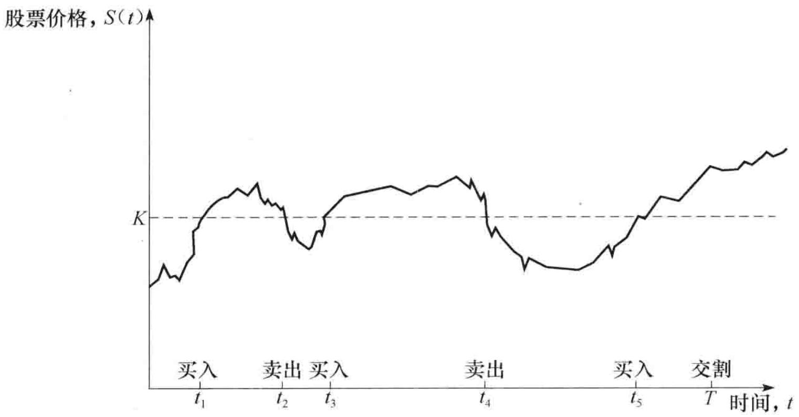图19-1 止损交易策略

式（19-1）并不正确，原因有两个：第一个原因是对冲者的现金流发生在不同的时刻，对这些现金流必须贴现；第二个原因是股票的买入与卖出不可能总是正好发生在价格等于 $K$ 的时刻。这里的第2个原因很关键。假如我们处在利率为0的风险中性世界里，这时可以忽略货币的时间价值。但我们并不能合理地假定股票的买入与卖出刚好发生在价格等于 $K$ 的时刻。如果市场是有效的，在股票市场价格为 $K$ 时，对冲者并不知道股票价格会变得高于 $K$ 还是低于 $K$ 。

一种可行的做法是在以上描述的过程中，股票的买入价格必须为 $K + \varepsilon$ ，股票的卖出价格必须为 $K - \varepsilon$ ，这里的 $\varepsilon$ 为一个小的正数。因此每一笔买入与卖出股票的费用为 $2\varepsilon$ （在这里我们忽略交易手续费）。对冲者一个自然的做法是增大价格观测的频率来使得 $\varepsilon$ 变得更小。但当 $\varepsilon$ 变得更小时，交易也会更加频繁，因此交易费用的减低会被交易频率的增加所抵消。但当 $\varepsilon \rightarrow 0$ 时，交易次数的期望值会趋向于无穷大。 $^{①}$

尽管止损交易策略从表面上看起来很诱人，但这一策略并不是个有效的对冲手段。例如，考虑1个虚值期权。如果股票价格从来达不到 $K$ 的价格，那么止损交易策略的费用为0。如果股票价格与执行价格水平线交叉很多次，止损交易策略的费用将会很高。蒙特卡罗模拟法（Monte Carlo simulation）可用于检验止损交易策略的整体效果，该方法先随机地产生股票价格的路径，然后再计算采用止损交易策略的结果。表19-1显示了关于19.1节里期权的结果。假定在时间间隔为 $\Delta t$ 的末尾观察股票价格， $^{②}$ 对冲的表现（对冲表现测度）以期权对冲费用的标准差与期权的布莱克－斯科尔斯－默顿价格的比率来衡量。（对冲费用的计算是除去支付利息与贴现影响后的费用。）每一个结果都是基于1000000个股票价格路径抽样来计算的。有效对冲策略将会使对冲表现测度接近于0，但在这里我们可以看出无论 $\Delta t$ 如何小，止损交易策略的对冲表现测度都不小于0.70。这说明止损交易策略不是一个好的对冲方法。

表 19-1 止损交易策略的表现。对冲的表现测度为期权承约费用的标准差与
做对冲所需理论上的费用之间的比例

<table><tr><td>Δt(周)</td><td>5</td><td>4</td><td>2</td><td>1</td><td>0.5</td><td>0.25</td></tr><tr><td>对冲效果</td><td>0.98</td><td>0.93</td><td>0.82</td><td>0.77</td><td>0.76</td><td>0.76</td></tr></table>

## 19.4 Delta对冲

大多数交易员采用的对冲策略要比我们前面所讨论的方法更为复杂，这包括计算 Delta、Gamma、Vega 等测度。在这一节里，我们将讨论 Delta 的作用。

在第 13 章里我们引入了期权的 Delta( $\Delta$ )，该变量定义为期权价格变动与其标的资产价格变动的比率。它是描述期权价格与标的资产价格之间关系曲线的切线斜率。假定某看涨期权

Delta 为 0.6，这意味着当股票价格变化一

个很小的数量时，相应期权价格变化大约等于股票价格变化的 $60\%$ 。图19-2展示了期权价格随标的资产价格变化的关系。当股票价格对应于点A时，期权价格对应于点B，而 $\Delta$ 为图中所示直线的斜率。一般来讲

\Delta = \frac{\partial c}{\partial S}

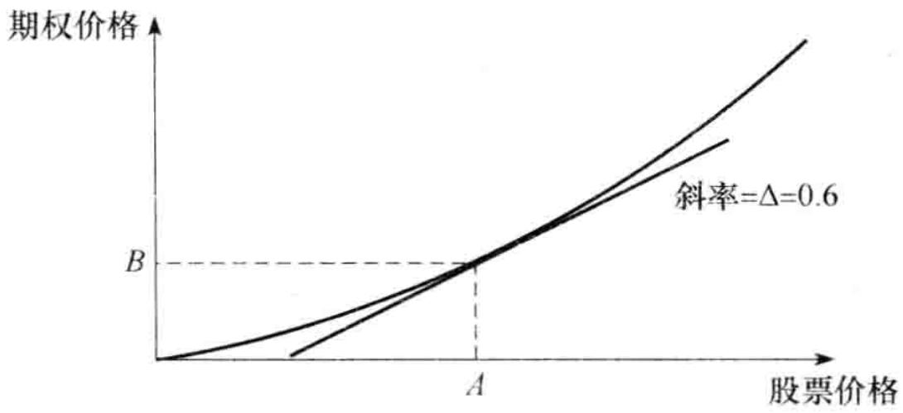图19-2 Delta的计算

其中 c 是看涨期权的价格，S 是股票的价格。

假设在图19-2 中股票价格为 100 美元，期权价格为 10 美元。假设投资者卖出了 20 份该股票上的看涨期权（期权持有者有权购买 2000 只股票）。投资者的头寸可以通过购买 $0.6 \times 2000 = 1200$ 只股票来进行对冲。期权头寸所对应的盈利（亏损）可由股票头寸上的亏损（盈利）来抵消。例如，如果股票价格上涨 1 美元（买入的股票会升值 1200 美元），期权价格将会上涨大约 $0.6 \times 1 = 0.6$ 美元（卖出期权会带来损失 1200 美元）；如果股票价格下跌 1 美元（买入股票会损失 1200 美元），期权价格将会下跌大约 0.6 美元（卖出期权会带来收益 1200 美元）。

在这一个例子中，交易员的2000个期权空头的Delta为

0.6 \times (-2000) = - 1200
换句话讲, 当股票上涨 $\Delta S$ 时, 交易员期权的空头就会损失 $1200 \Delta S$ 。每只股票本身的 Delta 为 1.0 , 于是持有 1200 只股票的 Delta 值为 +1200 , 因此, 投资者整体头寸的 Delta 为 0 : 股票头寸的 Delta 与期权头寸的 Delta 相互抵消。Delta 为 0 的头寸称为 Delta 中性 ( delta neutral )。

我们应当认识到由于 Delta 会变动, 投资者的 Delta 对冲状态 (或 Delta 中性状态) 只能维持在一段较短的时间里, 所以对冲策略要不断地调整。这种调整过程称为再平衡 (rebalancing)。在我们的例子中, 在 3 天后的股票价格也许会升到 110 美元。如图19-2 所示, 股票价格上涨时会使 Delta 变大, 假设 Delta 从 0.6 增加到 0.65, 如果仍要保持 Delta 中性, 投资者需要再买入 $0.05 \times 2000 = 100$ 只股票。当对冲头寸需要不断调整时, 这种策略叫动态对冲 (dynamical-hedging)。这种对冲策略与静态对冲 (static-hedging) 策略形成了对比: 静态对冲在最初设定后无须再进行调整。静态对冲有时也称为 “保完即忘” (hedge-and-forget) 策略。

Delta 对冲与布莱克－斯科尔斯－默顿分析密切相关。如第 15 章所述，通过由股票期权和标的股票建立的无风险交易组合，我们可以推导出布莱克－斯科尔斯－默顿偏微分方程。以 $\Delta$ 表示，所建立的交易组合为
\left\{\begin{array}{l l} - 1: \text{期权} \\ + \Delta : \text{股票} \end{array} \right.
$$
采用新的术语，我们可以将这种方法描述如下：在建立 Delta 中性的头寸后，可以通过论证该交易组合的收益率等于（瞬时）无风险利率来为期权定价。
$$

$$
## 19.4.1 欧式股票期权的 Delta
$$

$$
对于无股息股票期权上欧式看涨期权的 Delta，我们可以证明（见练习题 15.17）
$$
\Delta (\mathrm{看涨}) = N(d_{1})
$$
其中 $d_{1}$ 由式（15-20）给出， $N(x)$ 是标准正态分布的累积分布函数。以上公式为一个欧式看涨期权多头的 Delta。欧式看涨期权空头的 Delta 为 $-N(d_{1})$ 。对一个欧式看涨期权空头做对冲时，对卖出的每个期权，需要维持拥有 $N(d_{1})$ 只股票的多头。类似地，对一个看涨期权多头做对冲时，对买进的每个期权，需要维持拥有 $N(d_{1})$ 只股票的空头。
$$

$$
无股息股票上欧式看跌期权的 Delta 为
$$
\Delta (\text{看跌}) = N(d_{1}) \cdot 1
这里的 Delta 为负值，这意味着看跌期权的多头应该由标的股票的多头来对冲，而看跌期权的空头应该由标的股票的空头来对冲。图19-3 显示了看涨与看跌期权的 Delta 与股票价格之间的变化关系。图19-4 显示了实值期权、平值期权和虚值期权的 Delta 与期权期限之间的变化关系。

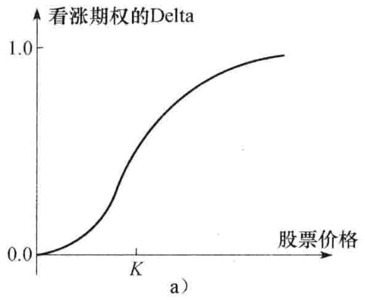

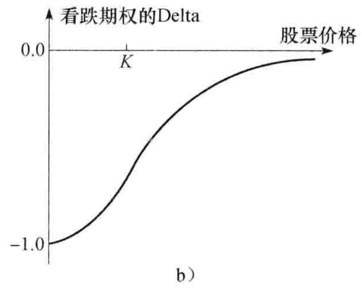图19-3 无股息股票看涨期权和看跌期权的 Delta 与股票价格之间的变化关系

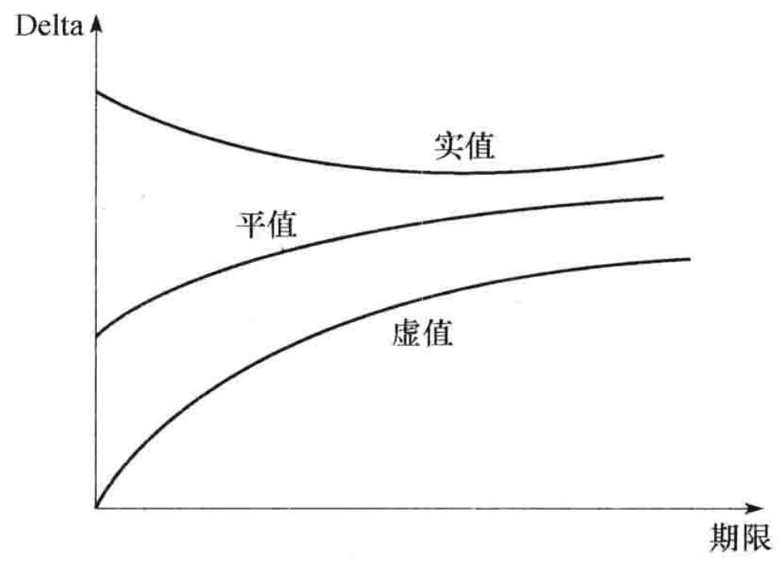图19-4 看涨期权的Delta与期权期限之间的变化关系

例19-1

再次考虑19.1节中无股息股票上的看涨期权，其中股票价格为49美元，执行价格为50美元，无风险利率为 $5\%$ ，期限为20周（=0.3846年），股票价格波动率为 $20\%$ 。这时，我们有

d_{1} = \frac{\ln (49 / 50) + (0.05 + 0.2^{2} / 2) \times 0.3846}{0.2 \times \sqrt{0.3846}} = 0.0542
Delta 为 $N(d_{1})$ ，即 0.522。当股票价格变化为 $\Delta S$ 时，期权价格变化为 $0.522\Delta S$ 。

## 19.4.2 Delta 对冲的动态特性

表 19-2 和表 19-3 给出了两个对 19.1 节中出售 100000 看涨期权的例子做 Delta 对冲的例子。在这里我们假设对冲交易是每个星期再平衡一次。在例 19-1 中我们计算了所卖出期权在最初的 Delta 为 0.522，因而所有期权空头的 Delta 为 $-100\ 000 \times 0.522$ ，即 -52200。这意味着在出售看涨期权的同时，交易员必须借入 2557800 美元并按每股 49 美元价格购买 52200 只股票。借入资金的利率为 5%，第一周的利息费用大约为 2500 美元。

表 19-2 Delta 对冲模拟（期权为实值期权；对冲费用为 263300 美元）

<table><tr><td>周数</td><td>股票价格</td><td>Delta</td><td>购买股票数量</td><td>购买股票费用(千美元)</td><td>累计现金流(千美元)</td><td>利息费用(千美元)</td></tr><tr><td>0</td><td>49.00</td><td>0.522</td><td>52200</td><td>2557.8</td><td>2557.8</td><td>2.5</td></tr><tr><td>1</td><td>48.12</td><td>0.458</td><td>(6400)</td><td>(308.0)</td><td>2252.3</td><td>2.2</td></tr><tr><td>2</td><td>47.37</td><td>0.400</td><td>(5800)</td><td>(274.7)</td><td>1979.8</td><td>1.9</td></tr><tr><td>3</td><td>50.25</td><td>0.596</td><td>19600</td><td>984.9</td><td>2966.6</td><td>2.9</td></tr><tr><td>4</td><td>51.75</td><td>0.693</td><td>9700</td><td>502.0</td><td>3471.5</td><td>3.3</td></tr><tr><td>5</td><td>53.12</td><td>0.774</td><td>8100</td><td>430.3</td><td>3905.1</td><td>3.8</td></tr><tr><td>6</td><td>53.00</td><td>0.771</td><td>(300)</td><td>(15.9)</td><td>3893.0</td><td>3.7</td></tr><tr><td>7</td><td>51.87</td><td>0.706</td><td>(6500)</td><td>(337.2)</td><td>3559.5</td><td>3.4</td></tr><tr><td>8</td><td>51.38</td><td>0.674</td><td>(3200)</td><td>(164.4)</td><td>3398.5</td><td>3.3</td></tr><tr><td>9</td><td>53.00</td><td>0.787</td><td>11300</td><td>598.9</td><td>4000.7</td><td>3.8</td></tr><tr><td>10</td><td>49.88</td><td>0.550</td><td>(23700)</td><td>(1182.2)</td><td>2822.3</td><td>2.7</td></tr><tr><td>11</td><td>48.50</td><td>0.413</td><td>(13700)</td><td>(664.4)</td><td>2160.6</td><td>2.1</td></tr><tr><td>12</td><td>49.88</td><td>0.542</td><td>12900</td><td>643.5</td><td>2806.2</td><td>2.7</td></tr><tr><td>13</td><td>50.37</td><td>0.591</td><td>4900</td><td>246.8</td><td>3055.7</td><td>2.9</td></tr><tr><td>14</td><td>52.13</td><td>0.768</td><td>17700</td><td>922.7</td><td>3981.3</td><td>3.8</td></tr><tr><td>15</td><td>51.88</td><td>0.759</td><td>(900)</td><td>(46.7)</td><td>3938.4</td><td>3.8</td></tr><tr><td>16</td><td>52.87</td><td>0.865</td><td>10600</td><td>560.4</td><td>4502.6</td><td>4.3</td></tr><tr><td>17</td><td>54.87</td><td>0.978</td><td>11300</td><td>620.0</td><td>5126.9</td><td>4.9</td></tr><tr><td>18</td><td>54.62</td><td>0.990</td><td>1200</td><td>65.5</td><td>5197.3</td><td>5.0</td></tr><tr><td>19</td><td>55.87</td><td>1.000</td><td>1000</td><td>55.9</td><td>5258.2</td><td>5.1</td></tr><tr><td>20</td><td>57.25</td><td>1.000</td><td>0</td><td>0.0</td><td>5263.3</td><td></td></tr></table>

在表 19-2 中，1 周以后股票价格降到了 48.12 美元，期权的 Delta 也随之降到了 0.458，期权头寸新的 Delta 为 -45800。要想保持 Delta 中性，这时需要从已持有的股票中卖出 6400 只股票。卖出股票所得现金收入为 308000 美元，因此第 1 周后的累计借款余额减至 2252300 美元。在第 2 周内，股票价格降到了 47.37 美元，期权的 Delta 也随之降低，依此类推。在期权接近到期时，很明显期权将会被行使，期权的 Delta 接近 1.0。因此在第 20 周结束时，对冲者会拥有 100000 只股票，期权持有人会在此时行使期权，对冲者以执行价格卖出股票而收到 500 万美元，卖出期权与对冲风险的总费用为 263300 美元。

表 19-3 给出另一组股票模拟价格。期权在期满时成为虚值期权，在第 20 周结束时，对冲人不持有任何股票，这里的总费用为 256600 美元。

表 19-3 Delta 对冲模拟（期权为实值期权；对冲费用为 256600 美元）

<table><tr><td>周数</td><td>股票价格</td><td>Delta</td><td>购买股票数量</td><td>购买股票费用(以千计)</td><td>累计现金流(以千计)</td><td>利息费用(以千计)</td></tr><tr><td>0</td><td>49.00</td><td>0.522</td><td>52200</td><td>2557.8</td><td>2557.8</td><td>2.5</td></tr><tr><td>1</td><td>49.75</td><td>0.568</td><td>4600</td><td>228.9</td><td>2789.2</td><td>2.7</td></tr><tr><td>2</td><td>52.00</td><td>0.705</td><td>13700</td><td>712.4</td><td>3504.3</td><td>3.4</td></tr><tr><td>3</td><td>50.00</td><td>0.579</td><td>(12600)</td><td>(630.0)</td><td>2877.7</td><td>2.8</td></tr><tr><td>4</td><td>48.38</td><td>0.459</td><td>(12000)</td><td>(580.6)</td><td>2299.9</td><td>2.2</td></tr><tr><td>5</td><td>48.25</td><td>0.443</td><td>(1600)</td><td>(77.2)</td><td>2224.9</td><td>2.1</td></tr><tr><td>6</td><td>48.75</td><td>0.475</td><td>3200</td><td>156.0</td><td>2383.0</td><td>2.3</td></tr><tr><td>7</td><td>49.63</td><td>0.540</td><td>6500</td><td>322.6</td><td>2707.9</td><td>2.6</td></tr><tr><td>8</td><td>48.25</td><td>0.420</td><td>(12000)</td><td>(579.0)</td><td>2131.5</td><td>2.1</td></tr><tr><td>9</td><td>48.25</td><td>0.410</td><td>(1000)</td><td>(48.2)</td><td>2085.4</td><td>2.0</td></tr><tr><td>10</td><td>51.12</td><td>0.658</td><td>24800</td><td>1267.8</td><td>3355.2</td><td>3.2</td></tr><tr><td>11</td><td>51.50</td><td>0.692</td><td>3400</td><td>175.1</td><td>3533.5</td><td>3.4</td></tr><tr><td>12</td><td>49.88</td><td>0.542</td><td>(15000)</td><td>(748.2)</td><td>2788.7</td><td>2.7</td></tr><tr><td>13</td><td>49.88</td><td>0.538</td><td>(400)</td><td>(20.0)</td><td>2771.4</td><td>2.7</td></tr><tr><td>14</td><td>48.75</td><td>0.400</td><td>(13800)</td><td>(672.7)</td><td>2101.4</td><td>2.0</td></tr><tr><td>15</td><td>47.50</td><td>0.236</td><td>(16400)</td><td>(779.0)</td><td>1324.4</td><td>1.3</td></tr><tr><td>16</td><td>48.00</td><td>0.261</td><td>2500</td><td>120.0</td><td>1445.7</td><td>1.4</td></tr><tr><td>17</td><td>46.25</td><td>0.062</td><td>(19900)</td><td>(920.4)</td><td>526.7</td><td>0.5</td></tr><tr><td>18</td><td>48.13</td><td>0.183</td><td>12100</td><td>582.4</td><td>1109.6</td><td>1.1</td></tr><tr><td>19</td><td>46.63</td><td>0.007</td><td>(17600)</td><td>(820.7)</td><td>290.0</td><td>0.3</td></tr><tr><td>20</td><td>48.12</td><td>0.000</td><td>(700)</td><td>(33.7)</td><td>256.6</td><td></td></tr></table>

在表 19-2 和表 19-3 中，贴现后的对冲成本很接近于布莱克－斯科尔斯－默顿公式所给出的理论价格（240000 美元），但这些近似值与布莱克－斯科尔斯－默顿价格并不完全相同。如果对冲是完美的话，对每一组模拟的股票价格变化，贴现后的对冲费用与理论价格都应当完全相等。Delta 对冲费用与理论值之间的差别是因为对冲交易的频率仅为一周一次。当对冲再平衡的频率增大时，对冲费用与理论值的差距将会减小。当然，表（19-2）和表（19-3）中的例子是建立在波动率为常数而且没有交易费用的假设之上。

表 19-4 给出在上面例子中模拟 100 万只股票价格随机路径后所对应的 Delta 对冲效果。与表 19-1 类似，对冲效果由对冲费用的标准差与期权的布莱克－斯科尔斯－默顿价格的比率来衡量。显然，Delta 对冲比止损策略有很大改进。与止损策略不同的是随着调整频率的提高，Delta 对冲的效果也逐步提高。

表 19-4 Delta 对冲的效果（衡量标准为卖出期权同时进行对冲所需的费用的标准差与期权理论价格的比率）

<table><tr><td>再平衡之间的时间(周)</td><td>5</td><td>4</td><td>2</td><td>1</td><td>0.5</td><td>0.25</td></tr><tr><td>对冲表现</td><td>0.42</td><td>0.38</td><td>0.28</td><td>0.21</td><td>0.16</td><td>0.13</td></tr></table>

Delta 对冲的目的是为了使金融机构所持头寸的价值尽量保持不变。最初卖出期权的价值为 240000 美元，在表 19-2 所示的情况下，第 9 周时的期权价值为 414500 美元，由于卖出期权而使金融机构损失了 174500 美元（414500 - 240000）。现金累计费用在第 9 周时比第 0 周时要多出 1442900 美元，所持有股票的价值由最初的 2557800 美元上涨为 4171100 美元。将所有头寸汇总在一起，金融机构的交易组合价值从第 0 周到第 9 周的变化仅为 4100 美元。

## 19.4.3 费用由何而来

由表 19-2 与表 19-3 所示的 Delta 对冲机制构造出一个等价于期权多头方的交易，从而与金融公司所持的空头相互抵消。如表所示，对空头进行的对冲会造成在价格下跌时卖出股票，而在价格上涨时买进股票。我们可以称此为“买高卖低”。数量为 240000 美元的费用来自于购买股票所付价格与卖出股票收入价格之间差别的平均值。

## 19.4.4 投资组合的 Delta

以某单一资产为标的资产的期权或其他衍生产品投资组合的 Delta 为
\frac{\partial \Pi}{\partial S}
$$
其中 $\Pi$ 为投资组合的价值。
$$

$$
投资组合的 Delta 值可以从投资组合内各个期权的 Delta 来计算。如果一个交易组合由数量为 $w_{i}$ 的期权 $i (1 \leqslant i \leqslant n)$ 来组成，那么投资组合的 Delta 值为
$$
\Delta = \sum_{i = 1} ^{n} w_{i} \Delta_{i}
$$
其中 $\Delta_{i}$ 为第 $i$ 个期权的 Delta。该公式可以用来计算使投资组合的 Delta 为 0 而需要持有的标的资产头寸。当持有这个头寸时，我们称投资组合为 Delta 中性（delta neutral）。
$$

$$
假定一个金融机构持有以下3个关于某股票的头寸。
$$

$$
(1) 100000 份看涨期权的多头, 执行价格为 55 美元, 期限为 3 个月, 每份期权的 Delta 为 0.533。
$$

$$
(2) 200000 份看涨期权的空头, 执行价格为 56 美元, 期限为 5 个月, 每份期权的 Delta 为 0.468。
$$

$$
(3) 50000份看跌期权的空头, 执行价格为56美元, 期限为2个月, 每份期权的 Delta 为 -0.508。
$$

$$
这时整个投资组合 Delta 为
$$
100000 \times 0.533 - 200000 \times 0.468 - 50000 \times (-0.508) = - 14900
$$
这意味着金融机构可以买入 14900 只股票来使该投资组合成为 Delta 中性。
$$

$$
## 19.4.5 交易费用
$$

$$
衍生产品交易商一般每天都会将其头寸重新平衡一次，以使其为 Delta 中性。如果交易商持有关于某种资产上少量的期权，这时按以上所描述方式进行对冲时将会引发昂贵的交易费用，但对一个很大的期权组合进行对冲时，Delta 中性就会切实可行。此时只需要进行一笔标的资产交易就可以将整个期权组合的 Delta 中性化，交易费用也会被其他交易盈利所承受。
$$

$$
## 19.5 Theta
$$

$$
期权组合的 Theta( $\Theta$ ) 定义为在其他条件不变时, 投资组合价值变化与时间变化的比率。Theta 有时称为组合的时间损耗 (time decay)。对于一个无股息股票上的欧式看涨期权, 计算 Theta 的公式可以从布莱克 - 斯科尔斯 - 默顿公式得出 (见练习题 15.17)
$$
\Theta (\mathrm{看涨}) = - \frac{S_{0} N^{\prime} (d_{1}) \sigma}{2 \sqrt{T}} - r K e^{- r T} N(d_{2})
$$

其中 $d_{1}$ 与 $d_{2}$ 由式（15-20）给出

$$
N^{\prime} (x) = \frac{1}{\sqrt{2 \pi}} \mathrm{e}^{- x^{2} / 2}\tag{19-2}
$$
为标准正态分布的密度函数。
$$

$$
对于一个股票上欧式看跌期权，计算 Theta 的公式为
$$
\Theta (\text{看跌}) = - \frac{S_{0} N^{\prime} (d_{1}) \sigma}{2 \sqrt{T}} + r K e^{- r T} N(- d_{2})
$$
因为 $N(-d_{2})=1-N(d_{2})$ ，看跌期权的 Theta 比相应看涨期权的 Theta 高出 $rKe^{-rT}$ 。
$$

$$
在这些公式中的时间是以年做单位。而通常在计算 Theta 时的时间是以天为单位，因此 Theta 为在其他变量不变时，在 1 天过后交易组合价值的变化。我们可以计算 “每日历天” 的 Theta 或 “每交易日” 的 Theta。为了计算每日历天的 Theta，上面计算 Theta 的公式必须除以 365，为了计算每个交易日的 Theta，上面计算 Theta 的公式则除以 252（DerivaGem 计算的是每日历天的 Theta）。
$$

$$
例 19-2
$$

$$
采用例 19-1 中的数据，考虑一个对于无股息股票上的看涨期权，其中股票价格为 49 美元，执行价格为 50 美元，无风险利率为 5%，期限为 20 周（=0.3846 年），股票价格波动率为 20%，这时 $S_{0}=49$ ，K=50，r=0.05， $\sigma=0.2$ 和 T=0.3846，期权的 Theta 为
$$
- \frac{S_{0} N^{\prime} (d_{1}) \sigma}{2 \sqrt{T}} - r K e^{- r T} N(d_{2}) = - 4.31
因此，每日历天的 Theta 为 -4.31/365 = -0.0118，每交易日的 Theta 为 -4.31/252 = -0.0171。

期权的 Theta 一般是负的， $^{①}$ 这是因为在其他条件不变的情况下，随着期限的减小，期权价值会降低。图19-5 显示一个股票上看涨期权的 Theta 与标的资产价格之间关系的曲线。当股票价格很低时，Theta 接近于零。对应于一个平值看涨期权，Theta 很大而且是负值。当股票价格很高时，Theta 接近于 $-rKe^{-rT}$ 。图19-6 显示实值期权、平值期权、虚值看涨期权的 Theta 随期权期限变化的规律。

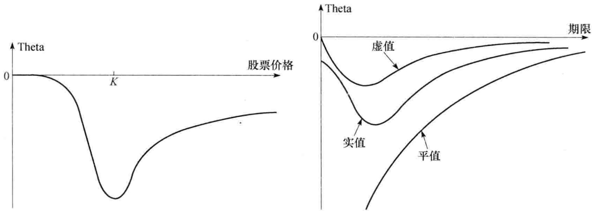图19-5 欧式看涨期权Theta与标的资产价格的关系图19-6 欧式看涨期权Theta随时间变化的规律

作为对冲参数，Theta 与 Delta 属于不同类型。这是因为未来股票的价格有很大的不定性，但时间走向却没有不定性。通过对冲来消除交易组合关于标的资产价格变化的风险很有意义，但对冲交易组合对于时间的变化就毫无意义。即使如此，许多交易员仍把 Theta 作为对交易组合有用的一种描述。正如我们在今后会看到的那样，在一个 Delta 中性的交易组合中，Theta 是 Gamma 的近似。

## 19.6 Gamma

一个期权交易组合的 Gamma(Γ) 是指交易组合 Delta 的变化与标的资产价格变化的比率。这是交易组合关于标的资产价格的二阶偏导数

\Gamma = \frac{\partial^{2} \Pi}{\partial S^{2}}
当 Gamma 很小时，Delta 变化缓慢，这时为保证 Delta 中性并不需要做太频繁的调整。但是当 Gamma 的值很大（正值或负值）时，Delta 对标的资产价格的变动就会很敏感，此时在一段时间内不对一个 Delta 中性的投资组合做调整都将会是非常危险的。图19-7 说明了这一点。当股票价格由 S 变成 $S'$ 时，Delta 对冲时假设期权价格由 C 变成 $C'$ ，而事实上期权由 C 变成了 $C''$ 。 $C'$ 与 $C''$ 的不同导致了对冲误差。这一误差的大小取决于期权价格与标的资产价格关系的曲率。Gamma 值正是对这一曲率的度量。

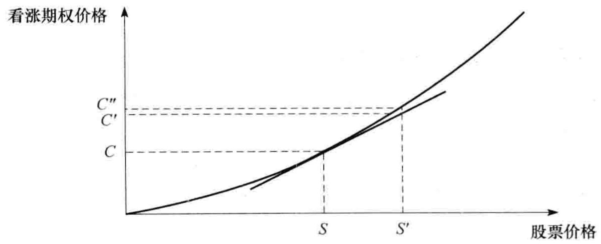图19-7 非线性所引入的对冲误差

假定 $\Delta S$ 为在很小时间区间 $\Delta t$ 内股票价格的变化, $\Delta \Pi$ 为相应的投资组合价格变化。对于

一个 Delta 中性的交易组合，本章末的附录证明了当忽略高阶项后

\Delta \Pi = \Theta \Delta t + \frac{1}{2} \Gamma \Delta S^{2}\tag{19-3}
其中 $\Theta$ 为投资组合的 Theta。图19-8 展示了 $\Delta \Pi$ 与 $\Delta S$ 之间的关系。当 Gamma 为正时， $\Theta$ 往往是负值。这时如果 $S$ 没有什么变化，交易组合的价值将会下降。但如果标的资产价格 $S$ 变化幅度较大，交易组合的价值将会上升；当 Gamma 为负时， $\Theta$ 往往会为正值，这时会有与上面相反的结论：当标的资产价格 $S$ 不变时，组合价值上升，而当标的资产价格 $S$ 变化很大时，组合价值将会下降。当 Gamma 的绝对值增加时，组合价值对于 $S$ 的敏感性会相应增大。

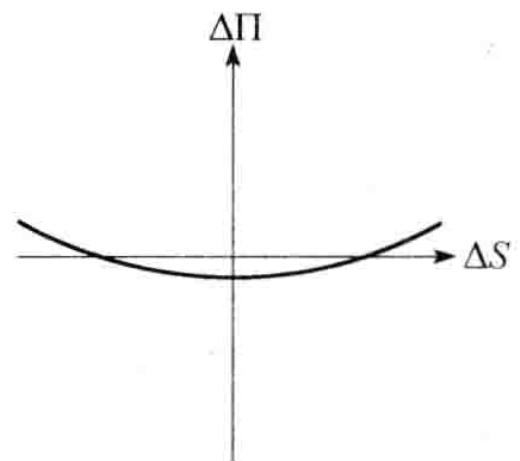
a）交易组合有较小的正Gamma

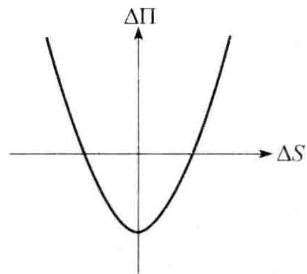
b）交易组合有较大的正Gamma

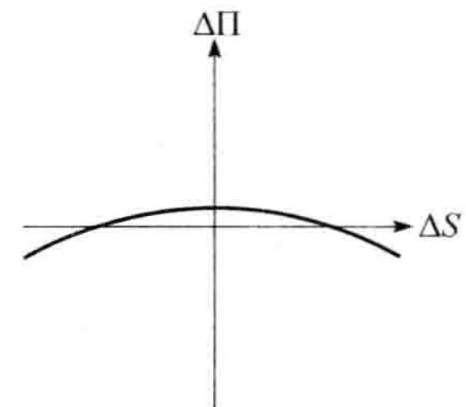
c）交易组合有较小的负Gamma

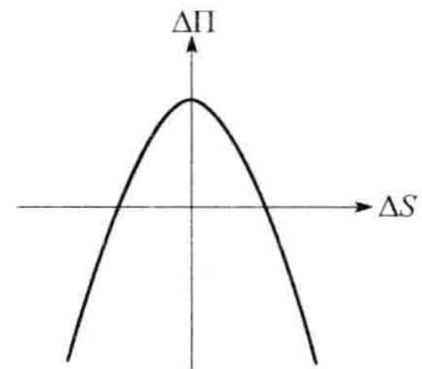
d）交易组合有较大的负Gamma图19-8 Delta中性交易组合的 $\Delta \Pi$ 与 $\Delta S$ 之间在 $\Delta t$ 时间内变化的几种关系图

例19-3

假定某一标的资产上的期权组合为 Delta 中性，Gamma 为 -10000。式（19-3）表明，如果标的资产价格在较短时间内变化 +2 或 -2，交易组合价值大约下跌

0.5 \times 10000 \times 2^{2} = 20000 (\text{美元})
## 19.6.1 使投资组合为 Gamma 中性

标的资产的 Gamma 总是为 0，因此不能被用来改变交易组合的 Gamma。改变交易组合的 Gamma 必须采用价格与标的资产价格呈非线性关系的产品，例如期权。

假如一个 Delta 中性交易组合的 Gamma 为 $\Gamma$ ，而一种正在交易的期权的 Gamma 为 $\Gamma_T$ 。如果决定将 $w_T$ 数量的期权加入到交易组合中，此时交易组合的 Gamma 为
w_{T} \Gamma_{T} + \Gamma
$$
因此要使交易组合为 Gamma 中性，期权头寸应为 $w_{T} = -\Gamma/\Gamma_{T}$ 。引入新的期权很可能会改变交易组合的 Delta，因此必须调整标的资产数量以保证新的交易组合 Delta 中性。值得注意的是交易组合仅仅在较短时间内能做到 Gamma 中性，随着时间变化，只有不断调整期权数量以使$w_{T}=-\Gamma/\Gamma_{T}$ 成立，这样才能保证交易组合为 Gamma 中性。
$$

$$
使一个交易组合既 Gamma 中性又 Delta 中性可以看作对于图19-7 中所示对冲误差的校正。Delta 中性保证了在对冲再平衡之间交易组合价值不受股票价格微小变化的影响，而 Gamma 中性则保证了在对冲再平衡之间交易组合价值不受股票价格较大变化的影响。假设某一交易组合
$$

$$
为 Delta 中性，而 Gamma 为 -3000。某个正在交易的期权的 Delta 和 Gamma 分别为 0.62 和 1.50。在交易组合中加入
$$
\frac{3000}{1.5} = 2000
份期权会使得此交易组合变成 Gamma 中性。但这时交易组合的 Delta 也从 0 变成了 $2\ 000 \times 0.62 = 1\ 240$ 。因此为保证新的交易组合 Delta 中性，我们必须卖出 1240 份标的资产。

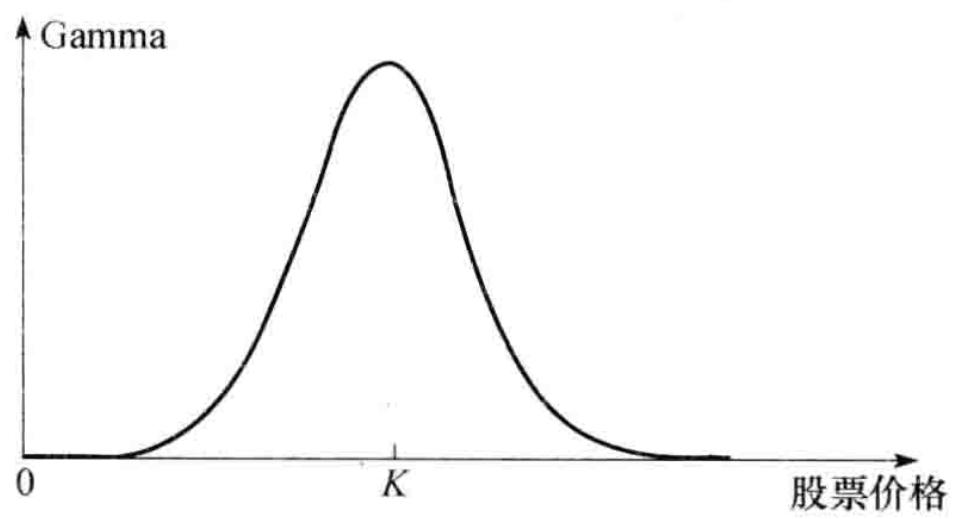图19-9 股票期权Gamma与标的资产价格的关系

## 19.6.2 Gamma 的计算

无股息股票上欧式看涨与看跌期权的 Gamma 由以下关系式给出

\Gamma = \frac{N^{\prime} (d_{1})}{S_{0} \sigma \sqrt{T}}
其中 $d_{1}$ 由式（15-20）定义， $N'(x)$ 由式（19-2）给出。多头的 Gamma 总是为正，它与 $S_{0}$ 之间的变化关系如图19-9 所示。图19-10 展示了虚值期权、平值期权和实值期权的 Gamma 与期限变化的关系。对于平值期权，Gamma 随期限的缩短而增大。短期限平值期权的 Gamma 很高，这意味着这种期权持有者的头寸价值对于股票价格变动是非常敏感的。

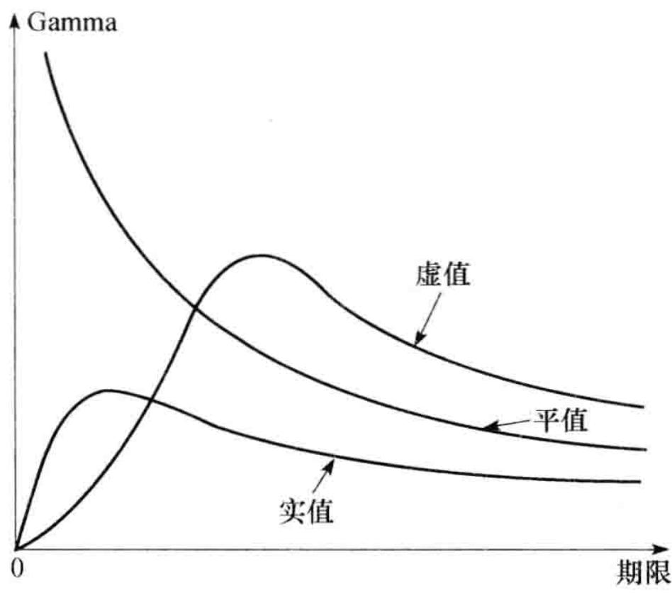图19-10 股票期权Gamma与期权期限的关系

例 19-4

与例 19-1 一样，考虑一个无股息股票上的看涨期权，其中股票价格为 49 美元，执行价格为 50 美元，无风险利率为 5%，期权期限为 20 周（0.3846 年），股票价格波动率为 20%。这时 $S_{0}=49$ ，K=50，r=0.05， $\sigma=0.2$ ，T=0.3846。期权的 Gamma 为

\frac{N^{\prime} (d_{1})}{S_{0} \sigma \sqrt{T}} = 0.066
当股票价格变化为 $\Delta S$ 时，期权 Delta 的变化为 $0.066\Delta S$ 。

## 19.7 Delta、Theta 和 Gamma 之间的关系

无股息股票上单个衍生产品的价格必须满足微分方程式（15-16）。因此，由这些衍生产品

所组成的资产组合 $\Pi$ 也一定满足以下微分方程
\frac{\partial \Pi}{\partial t} + r S \frac{\partial \Pi}{\partial S} + \frac{1}{2} \sigma^{2} S^{2} \frac{\partial^{2} \Pi}{\partial S^{2}} = r \Pi
$$

因为

$$
\Theta = \frac{\partial \Pi}{\partial t}, \Delta = \frac{\partial \Pi}{\partial S}, \Gamma = \frac{\partial^{2} \Pi}{\partial S^{2}}
$$

所以

$$
\Theta + r S \Delta + \frac{1}{2} \sigma^{2} S^{2} \Gamma = r \Pi\tag{19-4}
$$
对于其他标的资产，我们可以取得类似的结果（见练习题19.19）。
$$

$$
对于 Delta 中性交易组合， $\Delta=0$ ，因此
$$
\Theta + \frac{1}{2} \sigma^{2} S_{0} ^{2} \Gamma = r \Pi
$$
这一公式说明当 $\Theta$ 很大并且为正时, 交易组合的 Gamma 也很大, 但为负, 这一结论反过来也成立。这与图19-8 所示结果是一致的, 从而解释了为什么对于 Delta 中性的交易组合, 我们可以将 Theta 作为 Gamma 的近似。
$$

$$
## 19.8 Vega
$$

$$
截止到目前为止，我们一直假设衍生产品标的资产波动率为常数。在实际中，波动率会随时间变化，这意味着衍生产品价格会既随着标的资产价格与期限的变化而变化，同时也会随波动率的变化而变化。
$$

$$
交易组合的 Vega（V）是指交易组合价值变化与标的资产波动率变化的比率 $^{①}$
$$
\mathcal{V} = \frac{\partial \Pi}{\partial \sigma}
$$
如果一个交易组合 Vega 绝对值很大，此交易组合的价值会对波动率的细微变化非常敏感，当一个交易组合 Vega 接近零时，资产波动率的变化对交易组合价值的影响也会很小。
$$

$$
标的资产的头寸具有零 Vega。但是，在交易组合中加入某个正在交易的期权将会改变交易组合的 Vega。假设某交易组合的 Vega 为 V，正在交易的期权 Vega 为 $V_{T}$ ，在交易组合中加入头寸为 $-V/V_{T}$ 的这个期权可以使交易组合瞬时 Vega 中性。但不幸的是，一个 Gamma 中性的交易组合一般不会是 Vega 中性，反之亦然。一个投资者要想使得一个交易组合同时达到 Gamma 和 Vega 中性，通常必须至少引入与标的产品有关的两种不同衍生产品才能达到目的。
$$

$$
## 例 19-5
$$

$$
假如交易组合为 Delta 中性，Gamma 为 -5000，Vega 为 -8000。下表所列的期权可以用来交易。购买数量为 4000 份期权 1 会使组合成为 Vega 中性，这样做同时会使得 Delta 增至 2400，因此为了保证 Delta 中性必须卖出 2400 个单位的标的资产，交易组合的 Gamma 也会从 -5000 变成 -3000。
$$

$$
<table><tr><td></td><td>Delta</td><td>Gamma</td><td>Vega</td></tr><tr><td>组合</td><td>0</td><td>-5000</td><td>-8000</td></tr><tr><td>期权1</td><td>0.6</td><td>0.5</td><td>2.0</td></tr><tr><td>期权2</td><td>0.5</td><td>0.8</td><td>1.2</td></tr></table>
$$

$$
为了保证交易组合既 Gamma 中性又 Vega 中性，我们需要同时将期权 1 与期权 2 加入到组合中。用 $w_{1}$ 和 $w_{2}$ 来代表期权 1 与期权 2 的头寸，我们需要
$$
- 5000 + 0.5 w_{1} + 0.8 w_{2} = 0
$$

和

$$
- 8000 + 2.0 w_{1} + 1.2 w_{2} = 0
$$
以上方程的解是 $w_{1} = 400$ ， $w_{2} = 6000$ 。因此分别加入400份期权1和6000份期权2会使得交易组合Gamma和Vega都成为中性。加入这两种期权后，交易组合的Delta变为 $400 \times 0.6 + 6000 \times 0.5 = 3240$ ，因此必须卖出3240份标的资产才能保持交易组合为Delta中性。
$$

$$
无股息股票上欧式看涨期权或看跌期权的 Vega 由以下公式给出
$$
\mathcal{V} = S_{0} \sqrt{T N^{\prime}} (d_{1})
其中 $d_{1}$ 由式（15-20）定义， $N'(x)$ 由式（19-2）给出。欧式与美式期权多头的 Vega 总为正，Vega 与 $S_{0}$ 变化的一般形式如图19-11 所示。

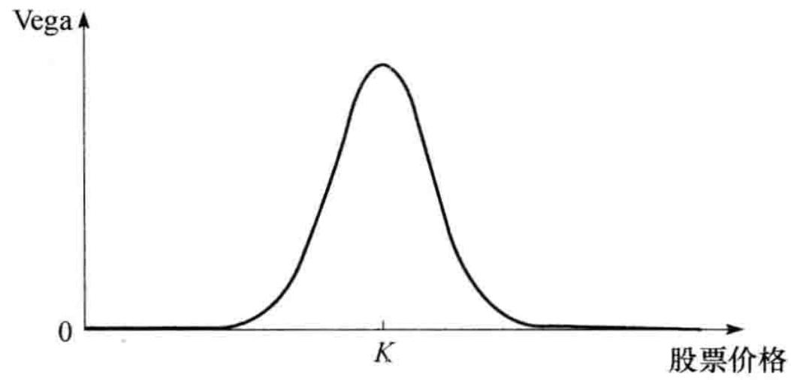图19-11 期权的 Vega 与股票价格的关系

例19-6

如例 19-1 一样, 考虑一个无股息股票上的看涨期权, 其中股票价格为 49 美元, 执行价格为 50 美元, 无风险利率为 $5\%$ , 期限为 20 周 ( $=0.3846$ 年), 股票价格波动率为 $20\%$ 。这时, $S_{0} = 49$ , $K = 50$ , $r = 0.05$ , $\sigma = 0.2$ , $T = 0.3846$ 。

期权的 Vega 为

S_{0} \sqrt{T N^{\prime}} (d_{1}) = 12.1
因此，当波动率增加 $1\%$ （0.01）时（由 $20\%$ 增长到 $21\%$ ），期权价格会相应增长大约 $0.01 \times 12.1 = 0.121$ 。

由布莱克－斯科尔斯－默顿模型及其推广形式来计算 Vega 看起来有些奇怪，因为这个模型的一个基本假设就是波动率为常数。从理论上讲，由一个假定波动率为随机变量的模型来计算 Vega 更为合理。但是结果表明，由随机波动率模型得出的 Vega 与布莱克－斯科尔斯－默顿模型得出的 Vega 很接近，因此，在实际应用中使用将波动率假设成常数而得出的 Vega 是比较合理的。 $^{①}$

Gamma 中性保证了在两个对冲平衡交易时间之间，交易组合价格不会因为标的资产较大幅度的变动而产生很大变动，而 Vega 中性则保证当 $\sigma$ 变动时，交易组合的价值会得到保护。就像所期望的那样，采用正在交易的期权来做 Vega 对冲与 Gamma 对冲是否是最好的选择将取决于对冲的再平衡时间间隔以及波动率的波动率。 $^{②}$

当波动率变化时，短期限期权的隐含波动率的变化要比长期限期权的隐含波动率要大，因此在计算组合的 Vega 时，长期限期权波动率改变的幅度常常比短期限期权波动率的改变幅度要小。在 22.6 节讨论了其中一种这样的处理方法。

## 19.9 Rho

期权交易组合的 Rho 为交易组合价值变化与利率变化的比率
\frac{\partial \Pi}{\partial r}
$$

这一变量用于衡量当其他变量保持不变时，交易组合价值对于利率变化的敏感性。对于一个无股息股票上的欧式看涨期权，Rho 由以下公式给出

$$
\mathrm{Rho(看涨)} = K T \mathrm{e}^{- r T} N(d_{2})
$$

其中 $d_{2}$ 由式（15-20）定义。对于欧式看跌期权

$$
\mathrm{Rho} (\text{看跌}) = - K T \mathrm{e}^{- r T} N(- d_{2})
$$
例19-7
$$

$$
如例 19-1 一样，考虑一个对于无股息股票上的看涨期权，其中股票价格为 49 美元，执行价格为 50 美元，无风险利率为 5%，期限为 20 周（=0.3846 年），股票价格波动率为 20%。这时， $S_{0}=49$ ，K=50，r=0.05， $\sigma=0.2$ 和 T=0.3846。
$$

$$
期权的Rho为
$$
K T \mathrm{e}^{- r T} N(d_{2}) = 8.91
因此，当利率增加 $1\%$ （0.01）时（由 $5\%$ 增长到 $6\%$ ），期权价格相应增长大约 $0.01 \times 8.91 = 0.0891$ 。

## 19.10 对冲的现实性

在一个理想世界里，金融机构的交易员可以随时调整对冲交易以确保投资组合的所有希腊值均为0，但在现实生活中这样做是不可能的。在管理依赖于某个单一资产的交易组合时，交易员通常是至少每天都重新平衡一次组合，以确保交易组合的Delta为0或接近于0。不幸的是，保证Gamma与Vega为0就没有那么容易，这是因为在市场上很难找到价格合理并且适量的期权或其他非线性产品来达到对冲目的。业界事例19-1中讨论了在金融机构里动态对冲是如何进行的。

## 业界事例 19-1 实践中的动态对冲

一家金融机构一般指定某一交易员或某一个交易组来负责管理与某一特定资产有关的期权交易组合。例如，高盛公司的某一交易员可能被指定负责与澳元有关的所有衍生产品交易组合。交易组合的市价和有关的希腊值均通过计算机系统来产生。对应于每一项风险都会设定不同的风险额度，如果交易员的交易量在交易日结束时超过额度，他必须得到特殊批准。

Delta 额度的表达形式通常是对应于标的资产的最大交易量。例如，假设高盛公司关于微软股票的 Delta 额度为 100 万美元。假如微软股价为 50 美元，这意味着对应的 Delta 绝对值数量不能超过 20000。Vega 的交易额度通常表达为当标的价格波动率变化 1% 时所对应价值变化的最大限量。

事实上，交易员在每天交易日结束时会保证交易组合 Delta 中性或接近中性。Gamma 和 Vega 会得到监控，但这些风险量并不是每天都得到调整。金融机构常常发现自己因业务需要而向客户卖出期权，天长日久自己会积累负的 Gamma 与 Vega。因此金融机构往往会寻求适当机会以合适的价格买入期权来中和自己所面临的 Gamma 与 Vega 风险。

期权组合的一个特征会从某种意义上减轻管理 Gamma 和 Vega 的负担。当期权刚刚被卖出时，期权一般为平值（或很接近平值），而此时期权的 Gamma 和 Vega 会很大。但随着时间的流逝，当标的资产价格变化足够大后，期权会变成实值或虚值期权，此时期权的 Gamma 和 Vega 会很小，从而对交易组合的影响很小。当一个期权接近到期而且标的资产价格与执行价格较为接近时进行对冲是最让交易员最头痛的事。

对于期权交易而言，这里存在一个很大的规模经济问题：为一个资产上的少数期权每天维持 Delta 中性从经济上讲往往是不现实的，这是因为对冲各个期权的交易费用是很高的。但是，对于衍生产品交易商来讲，保持某一个资产上很大的交易组合 Delta 中性就变得切实可行，这时对冲每份期权的交易费用可能会变得很合理。

## 19.11 情景分析

除了观察诸如 Delta、Gamma 和 Vega 等风险度量之外，期权交易员也常常做情景分析 (scenario analysis)。这种分析包括计算在某一指定时间内不同情景下交易组合的盈亏，分析中时间长度的选择通常与产品的流通性有关，分析中所采用的情景可由管理人员选定，也可由模型来产生。

考虑如下情况。一家银行持有一个汇率期权组合，交易组合的价值取决于两个主要变量：汇率与汇率波动率。假定当前汇率为1.0000，汇率波动率为每年 $10\%$ 。银行可以采用类似于表19-5一样的表格来计算在两周内不同情景下交易组合的盈亏。在表中，我们考虑了7种不同的汇率与3种不同的波动率。汇率在两周内变化的标准方差为0.02，表中汇率的变化对应于大约0个、1个、2个和3个标准方差的变化。

表 19-5 在不同情景下某汇率期权交易组合在两周内的盈亏

<table><tr><td rowspan="2">波动率</td><td colspan="7">汇率</td></tr><tr><td>0.94</td><td>0.96</td><td>0.98</td><td>1.00</td><td>1.02</td><td>1.04</td><td>1.06</td></tr><tr><td>8%</td><td>+102</td><td>+55</td><td>+25</td><td>+6</td><td>-10</td><td>-34</td><td>-80</td></tr><tr><td>10%</td><td>+80</td><td>+40</td><td>+17</td><td>+2</td><td>-14</td><td>-38</td><td>-85</td></tr><tr><td>12%</td><td>+60</td><td>+25</td><td>+9</td><td>-2</td><td>-18</td><td>-42</td><td>-90</td></tr></table>

在表 19-5 中，最大损失位于该表的右下角。这一损失对应的波动率为 12%，汇率为 1.06 的情景。在类似于表 19-5 的情景分析中，最大损失（像表 19-5）通常位于表格的角落位置，但这一特性并不是永远正确。例如，当银行的头寸为蝶式差价的空头时（见 12.3 节），最大损失是对应于标的资产市场价格不变时的情景。

## 19.12 公式的推广

到目前为止, 我们所推导出的 Delta、Theta、Vega 与 Rho 只适用无股息股票上的欧式期权。表 19-6 给出了当股票支付连续股息收益率 $q$ 时, 这些公式相应的形式, 其中 $d_{1}$ 和 $d_{2}$ 与式 (17-4) 和式 (17-5) 中一样。将 $q$ 取为股指的股息收益率时, 我们可以得出欧式股指期权的希腊值; 将 $q$ 取为外币无风险利率时, 我们可以得出欧式货币期权的希腊值; 当取 $q = r$ 时, 我们可以得出欧式期货期权的 Delta、Gamma 和 Vega 值。欧式期货看涨期权的 Rho 等于 $-cT$ , 而欧式看跌期货期权的 Rho 等于 $-pT$ 。

表 19-6 股息收益率为 q 的资产上期权的希腊值

<table><tr><td>希腊值</td><td>看涨期权</td><td>看跌期权</td></tr><tr><td>Delta</td><td> $e^{-qT}N(d_1)$ </td><td> $e^{-qT}[N(d_1)-1]$ </td></tr><tr><td>Gamma</td><td> $\frac{N'(d_1)e^{-qT}}{S_0\sigma\sqrt{T}}$ </td><td> $\frac{N'(d_1)e^{-qT}}{S_0\sigma\sqrt{T}}$ </td></tr><tr><td>Theta</td><td> $-S_0N'(d_1)\sigma e^{-qT}/(2\sqrt{T})+qS_0N(d_1)e^{-qT}-rKe^{-rT}N(d_2)$ </td><td> $-S_0N'(d_1)\sigma e^{-qT}/(2\sqrt{T})-qS_0N(-d_1)e^{-qT}+rKe^{-rT}N(-d_2)$ </td></tr><tr><td>Vega</td><td> $S_0\sqrt{T}N'(d_1)e^{-qT}$ </td><td> $S_0\sqrt{T}N'(d_1)e^{-qT}$ </td></tr><tr><td>Rho</td><td> $KTe^{-rT}N(d_2)$ </td><td> $-KTe^{-rT}N(-d_2)$ </td></tr></table>

对于外汇期权，对于两种不同的利率有两个不同的 Rho 值。国内利率的 Rho 由表 19-6 中公式给出（ $d_{2}$ 与式（17-11）中一样），欧式看涨期权对于外币利率的 Rho 是

\mathrm{Rho(看涨、外汇)} = - T \mathrm{e}^{- r / T} S_{0} N(d_{1})
欧式看跌期权对于外币利率的 Rho 是
\mathrm{Rho(看涨、外汇)} = T \mathrm{e}^{- r_{f} T} S_{0} N(- d_{1})
$$
其中 $d_{1}$ 与式（17-11）中一样。
$$

$$
在第 21 章里我们将讨论如何计算美式期权的希腊值。
$$

$$
## 19.12.1 远期合约的 Delta
$$

$$
Delta 的概念也适用于期权以外的其他金融产品。考虑一个无股息股票上的远期合约，式(5-5)表示远期合约的价值为 $S_{0} - K\mathrm{e}^{-rT}$ ，其中 $K$ 为交割价格， $T$ 为远期的期限。在其他变量不变的情况下，当股票价格变化为 $\Delta S$ 时，股票上远期合约的价格变化也为 $\Delta S$ ，因此远期合约多头的 Delta 永远为 1.0。这说明一个股票上远期合约的多头可以用 1 只股票的空头来对冲，而远期合约的空头可以用买入 1 只股票来对冲其风险。 $^{\ominus}$
$$

$$
对于支付股息收益率 q 的资产，式（5-7）给出远期合约的 Delta 为 $e^{-qT}$ 。对于股指合约，q 等于股息收益率。对于外汇远期合约，q 等于外币无风险利率 $r_{f}$ 。
$$

$$
## 19.12.2 期货合约的 Delta
$$

$$
由式（5-1）可知，一个无股息股票的期货价格为 $S_{0} \mathrm{e}^{r T}$ ，其中 $T$ 为期货的期限。这一公式说明，在其他变量不变的情况下，当股票价格变化为 $\Delta S$ 时，期货价格的变化为 $\Delta \mathrm{Se}^{r T}$ 。因为期货价格每天都按市场定价，期货合约多头的持有者几乎马上会得到 $\Delta \mathrm{Se}^{r T}$ 数量的收益，因此期货合约的 Delta 为 $\mathrm{e}^{r T}$ 。对于股息收益率为 $q$ 的股票，利用式（5-3）我们可以得出 Delta 为 $\mathrm{e}^{(r - q) T}$ 。
$$

$$
我们应当注意, 合约每日结算会造成期货合约 Delta 与远期合约 Delta 之间的轻微差别。在利率为常数, 而且远期价格等于期货价格时, 这一结论仍成立 (与其相关的讨论, 见业界事例 5-2)。
$$

$$
有时期货合约会用来构造 Delta 中性的头寸。定义
$$

$$
T: 期货合约的到期日；
$$

$$
$H_{A}$ ：Delta 对冲所需持有的资产头寸；
$$

$$
$H_{F}$ ：Delta 对冲时需要的期货合约数量。
$$

$$
如果标的资产不支付股息，上面的分析说明
$$
H_{F} = \mathrm{e}^{- r T} H_{A}\tag{19-5}
$$

如果标的资产支付的股息收益率为 q

$$
H_{F} = \mathrm{e}^{- (r - q) T} H_{A}\tag{19-6}
$$

对于股指， $q$ 等于股指收益率；对于货币， $q$ 等于外币汇率，因此

$$
H_{F} = \mathrm{e}^{- (r - r_{f}) T} H_{A}\tag{19-7}
$$
例19-8
$$

$$
假设一家美国银行持有一个外汇期权交易组合，并可以通过持有 458000 英镑的空头来达到 Delta 中性。假定美国无风险利率为 4%，英国无风险利率为 7%。由式（19-7）得出，采用 9 个月期的货币期货做对冲时需要的空头为
$$
\mathrm{e}^{- (0.04 - 0.07) \times 9 / 12} \times 458000
$$
即 468442 英镑。因为每一个期货合约是关于卖出或买入 62500 英镑。这时，该银行进入 7 份期货合约的空头（这里的合约数量 7 是与 468442/62500 最近的整数）即可以达到对冲目的。
$$

$$
## 19.13 资产组合保险
$$

$$
投资组合的管理人常常会想获取所其管理投资组合上的看跌期权。在市场下跌时，看跌期权会对投资组合提供保护，而在市场上涨时，投资组合仍有潜在的上涨空间。一种做法（在17.1节里曾有过讨论）是买入像标普500这样的股指看跌期权，而另外一种做法则是以合成的方式构造期权。
$$

$$
按合成的方式构造期权需要持有一定数量的标的资产（或标的资产的期货），所持资产头寸的 Delta 应当与所需期权头寸的 Delta 相同。构造合成期权所需的头寸与对冲该期权所需要的头寸刚好相反，这是因为对期权的对冲过程涉及了构造一个相同但具有相反头寸的合成期权。
$$

$$
对投资组合管理人而言，有两种原因可能会使构造合成看跌期权比在市场上买入期权更有吸引力。第1个原因是期权市场可能不具备足够大的流通性来提供大型基金经理所需要的产品，第2个原因是基金经理所需要期权的执行价格和到期日与交易所里的期权不同。
$$

$$
合成期权可以通过交易投资组合或交易指数期货合约来完成。我们首先描述如何由交易投资组合来构成一个看跌期权。由表 19-6 得出，投资组合欧式看跌期权的 Delta 为
$$
\Delta = \mathrm{e}^{- q T} [ N(d_{1}) - 1 ]\tag{19-8}
$$

与通常一样

$$
d_{1} = \frac{\ln (S_{0} / K) + (r - q + \sigma^{2} / 2) T}{\sigma \sqrt{T}}
$$
$S_{0}$ 为投资组合价格，K 为执行价格，r 为无风险利率，q 为投资组合的股息收益率， $\sigma$ 为投资组合价格波动率，T 为期权期限。组合的波动率通常假设为其 Beta 乘以一个风险充分扩散的市场指数的波动率。
$$

$$
为了以合成的方式构造看跌期权，基金经理在任意给定时刻所卖出股票占原投资组合的比例为
$$
\mathrm{e}^{- q T} \left[ 1 - N(d_{1}) \right]
$$
基金经理在卖出股票后将所得资金投入无风险资产。当原投资组合价值下跌时，由式（19-8）给出的看跌期权的 Delta 会变得越来越负，因此投资组合卖出的份额必须增加；当原投资组合的价值上涨时，看跌期权变负的程度会有所减少，因此投资组合卖出的份额要减少（即需购回原投资组合的一部分）。
$$

$$
采用这种策略来构造投资组合保险意味着在任意给定时刻，基金被分为两部分，一部分基金为需要为其提供保险的股票组合，另一部分为无风险资产。当股票组合价格上涨时，无风险资产要被变卖，股票组合头寸会有所增大；当股票价格下跌时，股票组合头寸要被减小，无风险资产要被买回。保险的成本是由于证券管理人买高卖低而造成的。
$$

$$
## 例19-9
$$

$$
一投资组合价值为 9000 万美元。为了在市场下滑时对投资组合提供保护，投资组合经理需要持有一个执行价格为 8700 万美元，期限为 6 个月的看跌期权。这里无风险利率为每年 9%，股息收益率为每年 3%，波动率为每年 25%，标普 500 股指的当前价格为 900。投资组合的结构很接近标普 500，因此投资组合经理的一种做法是买入 1000 份标普 500 上执行价格为 870 的看跌期权（17.1 节）。另外一种做法则是构造合成期权。这里， $S_{0} = 9000$ 万， $K = 8700$ 万， $r = 0.09$ ， $q = 0.03$ ， $\sigma = 0.25$ ， $T = 0.5$ ，因此
$$
d_{1} = \frac{\ln (90 / 87) + (0.09 - 0.03 + 0.25^{2} / 2) 0.5}{0.25 \sqrt{0.5}} = 0.4499
$$

初始时刻所需期权 Delta 为

$$
\mathrm{e}^{- q T} \left[ N(d_{1}) - 1 \right] = - 0.3215
$$
这说明，在最初要卖出 $32.15\%$ 的投资组合来匹配所需期权的 Delta。卖出证券的收入将被投资于无风险资产上。应该经常调整需要卖出投资组合的数量。例如，如果在 1 天后投资组合价值下跌到 8800 万美元，这时所需期权的 Delta 变为 -0.3679，因此需要再卖出原来投资组合的 $4.64\%$ ，并将所得收入投资于无风险资产上。如果交易组合价值增至 9200 万美元，所需期权的 Delta 变为 -0.2787，这时应买回原投资组合的 $4.28\%$ 。
$$

$$
## 利用指数期货
$$

$$
我们也可以利用指数期货来构造合成期权，而且这种做法有时比利用标的股票来构造合成期权更受欢迎，这是因为交易股指期货的费用要比交易相应标的资产的费用更低。由式（19-6）和式（19-8）可以得出，指数期货合约空头的金额占投资组合价值的比例应为
$$
\mathrm{e}^{- q T} \mathrm{e}^{- (r - q) T^{*}} [ 1 - N(d_{1}) ] = \mathrm{e}^{q (T^{*} - T)} \mathrm{e}^{- r T^{*}} [ 1 - N(d_{1}) ]
$$

其中 $T^{*}$ 为期货的到期日。如果投资组合价值等于 $A_{1}$ 乘以指数，指数期货的规模等于 $A_{2}$ 乘以指数，那么在任意时刻所持指数期货合约空头的数量为

$$
\mathrm{e}^{q (T^{*} - T)} \mathrm{e}^{- r T^{*}} [ 1 - N(d_{1}) ] A_{1} / A_{2}
$$
例19-10
$$

$$
假设在前一个例子中我们采用 9 个月期的标普 500 期货来构造合成期权，这时 T = 0.5， $T^{*} = 0.75$ ， $A_{1} = 100\,000$ ， $d_{1} = 0.449\,9$ ，每个股指期货是关于股指的 250 倍，因此 $A_{2} = 250$ ，最终需要期货合约空头的数量为
$$
\mathrm{e}^{q (T^{*} - T)} \mathrm{e}^{- r T^{*}} [ 1 - N(d_{1}) ] A_{1} / A_{2} = 122.96
即 123（近似到最近的整数）。随着时间推移与指数的变化，期货的头寸要随时加以调整。

在这里的分析中，我们假定投资组合的收益与指数一样。当实际情况不是这样时，我们需要（a）计算资产组合的 Beta，（b）计算提供保护所需的股指期权头寸数量，（c）选择股指期货头寸来构造合成期权。如 17.1 节所述，期权的执行价格应等于投资组合价格达到保险水平时所对应的市场指数的预期水平。所需指数期权的数量等于投资组合的 $\beta$ 乘以在投资组合 $\beta$ 值为 1 时所对应的期权数量。

## 19.14 股票市场波动率

在第 15 章里我们曾经讨论过究竟是纯粹由于新信息的出现还是交易本身也会引起股票波动率的问题。像以上所描述的这种投资组合保险交易策略有可能会使市场波动率增大。当市场下跌时，这些策略会使投资组合管理人要么卖出股票要么卖出指数期货。这两种交易都会加重市场的下跌幅度（见业界事例19-2）。抛售股票会直接导致股指进一步下跌，而卖出股指期货也往往会使期货价格下跌。根据指数套利机制（见[第5章](ch05.md)），这同样会对股票产生抛售的压力，市场指数也会因此下跌。类似地，当市场价格上涨时，投资组合保险会使投资组合管理人或者买入股票或者买入期货，这会进一步加剧市场价格上涨的幅度。

除了这些正式的投资组合保险交易策略外，我们还可以想象许多投资者在有意或无意之中实施自己的投资组合保险策略。例如，某投资者可能在市场下跌时出售证券以便限制自己的损失。

投资组合保险交易策略（正式或非正式）是否会影响市场波动率取决于市场对组合保险策略所产生交易量的容纳程度。如果组合保险交易仅仅占市场交易中很少一部分，那么这种交易策略对市场可能不会有太大影响。但当投资组合保险变得越来越普遍时，这种交易策略往往会产生使市场产生不稳定的影响，在1987年就发生了这种情况。

# 业界事例 19-2 投资组合保险是造成 1987 年股票暴跌的元凶吗

在1987年10月19日，星期一，道琼斯工业平均指数的下跌幅度超过了20%。对于市场暴跌，许多人认为组合保险策略起了重要的作用。在1987年10月，有近600亿\~900亿美元的股票资产受组合保险交易策略影响，这种保险策略利用我们在19.13节中所述的方法以合成的形式构造看跌期权。在1987年10月14日星期三至1987年10月16日星期五这段期间里，市场暴跌了近10%，其中大部分下跌发生在星期五的下午。由于这一下跌，由交易组合保险策略程序显示至少有价值120亿美元的股票或股指期货需要出售。但事实上，交易组合保险持有人的销售量只达到了40亿美元。在接下一周开始时，需要卖出大量股票来达到满足他们的模型所要求的数量。据估计在10月19日星期一由三家交易组合保险持有人所卖出股票的数量几乎占整个纽约股票交易所成交量的 $10\%$ ，而整个交易组合保险策略所产生的交易占整个股指期货交易的 $21.3\%$ 。其他投资者预见到交易组合保险持有人会大量抛售股票，这些投资者也纷纷将自己的股票抛出，这也可能进一步助长了股票市场的下跌幅度。

股票市场下跌如此之快造成了整个交易市场的超负荷运作。许多组合保险持有人不能够及时完成模型所要求的交易，因此组合保险也没有带来预定的效果。当然交易组合保险策略的使用在1987年后大幅减少。这一故事说明当所有市场参与者都在使用类似的交易策略时，这种交易策略（甚至对冲策略）是非常危险的。

## 小结

金融机构向其客户提供许多种类的期权产品。这些期权产品常常与交易所内交易的标准化期权有所不同。因此金融机构会面临对冲自身风险敞口的问题。裸露期权与带保头寸会使得他们面临的风险达到不可接受的水平。一种可以采用的策略是所谓的止损交易策略。这种交易策略在当期权为虚值状态时，持有裸露期权头寸；而当期权为实值状态时，马上进入带保期权头寸。虽然这种策略看起来很吸引人，但其对冲效果并不好。

期权的 Delta( $\Delta$ ) 为期权价格变化与标的资产价值变化的比率。Delta 对冲是指构造 Delta 为 0 的头寸（有时也称为 Delta 中性头寸）。因为标的资产的 Delta 值为 1.0，因此，对于每一个期权的多头，一种对冲的方法是持有 - $\Delta$ 数量的标的资产。期权的 Delta 随时间变化，这意味着应该经常调整标的资产的头寸。

一旦某个期权头寸已处于 Delta 中性状态，接下一步是观察其 Gamma( $\Gamma$ )。期权的 Gamma 值为期权的 Delta 变化与标的资产价格变化的比率。这一数量是衡量期权价格与标的资产价格关系曲线的曲率。通过使期权头寸的 Gamma 中性，我们可以减小曲率对 Delta 对冲效果的影响。如果某头寸的 Gamma 值为 $\Gamma$ ，那么通过持有 Gamma 值为 $-\Gamma$ 的可交易期权则可以达到以上目的。

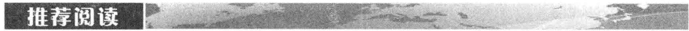

Delta 与 Gamma 两种对冲都假设波动率为常数。事实上，波动率会随时间变化。期权或期权组合的 Vega 等于头寸价值变化与波动率变化的比率。希望将自身期权组合对波动率变化呈中性的交易员可以持有一个 Vega 中性的交易组合。与构造 Gamma 中性状态相同，交易员通常可以持有抵消性交易头寸来达到目的。如果交易员希望同时达到 Gamma 和 Vega 中性，他必须持有至少两种可以交易期权的头寸。

衡量期权头寸风险的另外两个测度为 Theta 和 Rho。在其他变量不变时，Theta 等于头寸价值变化与时间变化的比率。类似地，在其他变量不变时，Rho 等于头寸价值变化与利率变化的比率。

在实际中，期权交易员常常会至少每一天都要调整交易组合以便保证 Delta 中性。要经常保证 Gamma 和 Vega 中性是不现实的。一般来讲，交易员会观察这些敏感度，当它们变动太大时，要采取适当措施以致停止交易。

为了对股票投资组合进行保险，有时投资组合管理人会对构造合成看跌期权产生兴趣。交易员可以通过交易自己的投资组合或交易该投资组合的股指期货来达到目的。交易投资组合需要将投资组合分成股权和无风险产品两个部分。当市场下跌时，投资于无风险产品的资金将会增加；当市场上涨时，投资于股权部分的资金将会增加。交易该投资组合的指数期货是在保证股权组合不变的同时，卖出指数期货合约。当市场下跌时，更多的指数期货会被卖出；当市场上涨时，更少的期货会被卖出。这种形式的投资组合保险在正常市场条件下效果会很好。但在1987年10月19日星期一，当道琼斯工业平均指数剧烈下跌时，这一保险策略的效果非常糟糕。这时投资组合的保险者不能及时卖出股票与指数期货来对其头寸进行保护。

Passarelli, D. Trading Option Greeks: How Time, Volatility, and Other Factors Drive Profits, 2nd edn. Hoboken, NJ: Wiley, 2012.

Taleb, N. N., Dynamic Hedging: Managing Vanilla and Exotic Options. New York: Wiley, 1996.19.1 解释如何实现对一个卖出的虚值看涨期权按止损策略进行对冲。为什么这种策略的效果并不好？

19.2 一个看涨期权 Delta 为 0.7 的含义是什么？当每个期权的 Delta 均为 0.7 时，如何使得 1000 份期权的空头组合成为 Delta 中性？

19.3 当无风险利率为每年 10%，股票波动率为每年 25% 时，计算无股息股票上平值欧式看涨期权的 Delta，其中期权的期限为 6 个月。

19.4 当时间以年做单位时，一个期权头寸的Theta为-0.1的含义是什么？假如交易人认为股票价格与其隐含波动率都不会变动时，什么样的期权头寸比较合适？

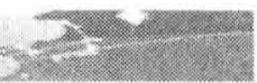

19.5 期权头寸的 Gamma 是什么含义？某个头寸的 Delta 为 0，而 Gamma 为一个很大的负值，该头寸的风险是什么？

19.6 “构造一个合成期权的过程，就是对冲这一期权头寸的反过程。”解释这句话的含义。

19.7 解释为什么投资组合保险策略在 1987 年 10 月 19 日的股票市场大跌中效果不好。

19.8 一个执行价格为40美元的虚值看涨期权的布莱克-斯科尔斯-默顿价格为4美元，卖出期权的交易员想采用止损交易策略。交易员想在股票价格为40.10美元时买入股票，而在39.90美元时卖出股票，估计股票被买入与卖出的次数。

19.9 假定某股票的当前价格为 20 美元，一个执行价格为 25 美元的看涨期权是由频繁交易标的股票头寸按合成的方式构造而成。考虑以下两个情形：

(a) 股票价格在期权期限内逐渐由 20 美元涨至 35 美元；

(b) 股票价格剧烈变动，最后的价格为35美元。

哪种情景会使合成期权的费用更高？解释你的答案。

19.10 数量为 1000 的白银期货上欧式看涨期权空头的 Delta 为多少？其中期权期限为 8 个月，标的期货的期限为 9 个月，目前 9 个月期限的期货价格为每盎司 8 美元，期权执行价格为 8 美元，无风险利率为每年 12%，白银价格波动率为每年 18%。

19.11 在练习题 19.10 中，为保证 Delta 对冲，9 个月期限的白银期货初始头寸为多少？如果采用白银本身来对冲，初始头寸又为多少？如果采用 1 年期的期货，初始头寸又为多少？这里我们假设白银没有存贮费用。

19.12 一家公司准备对由某一货币上的看跌和看涨期权所组成的投资组合多头来进行Delta对冲。在下面哪种情况下对冲的效果会最好？

(a) 一种基本上稳定的即期汇率。

(b) 一种变动剧烈的即期汇率。
解释你的答案。

19.13 重复练习题 19.12 中的分析，这里是一家持有外汇看涨期权和外汇看跌期权空头的金融机构。

19.14 一家金融机构刚刚卖出了1000份7个月期的日元欧式看涨期权。假设即期汇率为每日元0.80美分，执行价格为每日元0.81美元，美国的无风险利率为每年8%，日本的无风险利率为每年5%，日元汇率的波动率为每年15%，计算金融机构头寸的Delta、Gamma、Vega，Theta和 Rho。解释这些数值的含义。

19.15 在什么情况下只需要在组合中加入另外一种欧式期权的头寸即可使一个股指上欧式期权的 Gamma 和 Vega 同时中性化?

19.16 某基金经理拥有一个风险分散较好的投资组合，该投资组合的收益反映了标普500股指的收益，组合的价值为3.6亿美元。标普500取值为1200。投资组合经理打算购买保险，以便使得在今后6个月内投资组合价值下跌的程度不超过 $5\%$ 。无风险利率为每年 $6\%$ ，投资组合与标普500的股息收益率均为 $3\%$ ，标普500股指波动率为每年 $30\%$ ，

(a) 如果基金经理买入交易所内交易的欧式看跌期权，这时的保险费用是多少？

(b) 仔细解释有关交易所内交易的欧式看涨期权的其他交易策略，并说明这些交易策略会取得相同的效果。

(c) 如果基金经理决定将投资组合的一部分投放于无风险证券，最初的头寸应该为多少？

(d) 如果基金经理决定采用 9 个月期的指数期货来提供保险，最初的头寸应该为多少？

19.17 假定投资组合的 $\beta$ 为 1.5，重复练习题 19.16。假设投资组合股息收益率为每年 4%。

19.18 对于以下情景代入相应表达式，证明式（19-4）仍然成立：

(a) 无股息股票上欧式看涨期权。

(b) 无股息股票上欧式看跌期权。

(c) 无股息股票上欧式看涨与看跌期权的任意组合。

19.19 对以下两种情况，与式（19-4）相应的方程是什么？（a）外汇衍生产品组合，（b）期货行生产品组合。

19.20 假定我们要为价值为 700 亿美元的股权资产做出保险计划。假设这一保险的目的是保证在 1 年内，股权资产价值的下跌程度不会超过 5%，做出你认为需要的估计，并采用 DerivaGem 软件计算当在1天之内市场下跌23%时，该股权资产组合保险的管理人应出售股票或期货合约的数量是多少？

19.21 股指远期的 Delta 是否与相同头寸的股指期货的 Delta 相等？解释你的答案。

19.22 某银行持有的美元/欧元汇率期权头寸的 Delta 为 30000, Gamma 为 -80000。说明如何理解这些数字。汇率为 0.90 美元/欧元（每欧元所对应的美元数量为 0.90），为了使得头寸为 Delta 中性，你应该持什么样的头寸？在一段短暂时间后，汇率变化为 0.93，估计新的 Delta。这时为了保证 Delta 中性，你还要再进行什么样的交易？假定银行在最初的头寸已经是 Delta 中性，在汇率变动后，这一头寸会亏损还是会盈利？

19.23 对于无股息股票上期权，利用看跌-看涨期权平价关系式来推导

(a) 欧式看涨期权 Delta 与欧式看跌期权 Delta 的关系式。

(b) 欧式看涨期权 Gamma 与欧式看跌期权 Gamma 的关系式。

(c) 欧式看涨期权 Vega 与欧式看跌期权 Vega 的关系式。

(d) 欧式看涨期权 Theta 与欧式看跌期权 Theta 的关系式。

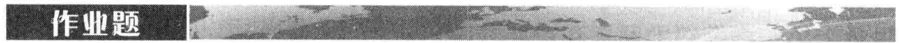

19.24 某金融机构持有以下有关英镑的场外交易期权组合

<table><tr><td>期权类型</td><td>头寸</td><td>期权Delta</td><td>期权Gamma</td><td>期权Vega</td></tr><tr><td>看涨</td><td>-1000</td><td>0.50</td><td>2.2</td><td>1.8</td></tr><tr><td>看涨</td><td>-500</td><td>0.80</td><td>0.6</td><td>0.2</td></tr><tr><td>看跌</td><td>-2000</td><td>-0.40</td><td>1.3</td><td>0.7</td></tr><tr><td>看涨</td><td>-500</td><td>0.70</td><td>1.8</td><td>1.4</td></tr></table>

某交易所里交易的期权 Delta 为 0.6, Gamma 为 1.5, Vega 为 0.8。

(a) 什么样的交易所内交易的英镑期权头寸和英镑头寸会使交易组合为 Gamma 与 Delta 中性?

(b) 什么样的交易所内交易的英镑期权头寸和英镑头寸会使得交易组合为 Vega 与 Delta 中性?

19.25 考虑作业题 19.24 中的情景，假定第 2 个交易所交易期权的 Delta 为 0.1，Gamma 为 0.5，Vega 为 0.6，进行什么样的交易可使得交易组合 Delta、Gamma 与 Vega 均为中性。

19.26 考虑一个1年期的欧式股票看涨期权，股票价格为30美元，执行价格为30美元，无风险利率为每年 $5\%$ 。波动率为每年 $25\%$ 。利用DervaGem软件来计算期权的价格、Delta、Gamma、Vega、Theta和Rho。将价格改变为30.1美元时，通过计算期权价格来验证Delta的正确性；通过计算期权在股票价位为30.1美元时的Delta来计算Gamma，并由此来验证Gamma的正确性。进行类似的计算来验证Vega、Theta和Rho的正确性。采用DerivaGem软件画出期权价格、Delta、Gamma、Vega、Theta和Rho与股票价格关系的图形。

19.27 某银行提供的存款产品中，有一种产品向投资者保证收益（a）等于0与（b）市场指数收益的 $40\%$ 的最大值。某投资者决定将100000美元投资于这种产品，描述该产品作为该市场指数上期权时的收益。假设无风险利率为每年 $8\%$ ，指数股息收益率为每年 $3\%$ ，指数波动率为每年 $25\%$ ，这一产品对于投资者而言合理吗？

19.28 [第18章](ch18.md)里给出的欧式期货看涨期权 $c$ 与期货价格 $F_{0}$ 的关系式为

c = \mathrm{e}^{- r T} \left[ F_{0} N(d_{1}) - K N(d_{2}) \right]

其中

$$
d_{1} = \frac{\ln (F_{0} / K) + \sigma^{2} T / 2}{\sigma \sqrt{T}} \quad \text{和}
$$

$$
d_{2} = d_{1} - \sigma \sqrt{T}
$$

其中 K、r、T 和 $\sigma$ 分别为执行价格、利率、期限和波动率。

(a) 证明 $F_{0}N^{\prime}(d_{1}) = KN^{\prime}(d_{2})$ 。

(b) 证明看涨期权对于期货价格的 Delta 等于 $\mathrm{e}^{-rT}N(d_{1})$ 。

(c) 证明看涨期权的 Vega 等于 $F_{0} \sqrt{T} N'$ ( $d_{1}$ ) $\mathrm{e}^{-rT}$ 。

(d) 证明19.12节里计算Rho的公式。在计算期货看涨期权的Delta、Gamma、Theta与Vega时，我们可以将一般期权希腊值计算公式中的 $q$ 由 $r$ 来代替， $S_0$ 由 $F_0$ 来代替， $q$ 为股息收益率。为什么这一做法对计算看涨期权的Rho时不

成立？

19.29 利用 DerivaGem 软件验证 19.1 节中的期权满足式（19-4）。（注意：DerivaGem 所计算的结果为每日历天，而式（19-4）的 Theta 对应于每年。）

19.30 利用 DerivaGem 的应用工具（Application Builder）功能重新生成表 19-2（注意：在表 19-2 中，期权头寸已被近似到最近的 100 股）。计算期权头寸每周的 Gamma 与 Theta。计算头寸每周的价值变化，并检验式（19-3）近似成立（注意：DerivaGem 所计算的结果为每日历天，而式（19-3）中的 Theta 对应于每年）。

## 附录 19A 泰勒级数展开和对冲参数

泰勒级数展开显示了在短时间内各个希腊值在交易组合价值变化中起的不同作用。如果标的资产的波动率为常数。作为标的资产价格 S 与时间 t 的函数，交易组合价值 $\Pi$ 的泰勒展开式为

$$
\Delta \Pi = \frac{\partial \Pi}{\partial S} \Delta S + \frac{\partial \Pi}{\partial t} \Delta t + \frac{1}{2} \frac{\partial^{2} \Pi}{\partial S^{2}} \Delta S^{2} + \frac{1}{2} \frac{\partial^{2} \Pi}{\partial t^{2}} \Delta t^{2} + \frac{\partial^{2} \Pi}{\partial S \partial t} \Delta S \Delta t + \dots\tag{19A-1}
$$

其中 $\Delta \Pi$ 和 $\Delta S$ 分别对应于在短时间 $\Delta t$ 内 $\Pi$ 与 $S$ 的变化。Delta对冲可将上式右端的第1项消除，第2项是一个非随机项，第3项可以在保证Delta中性且Gamma中性时被消除，其他项的阶数都高于 $\Delta t$ 。

对于一个 Delta 中性的交易组合，式（19A-1）右端第 1 项为 0，因此

$$
\Delta \Pi = \Theta \Delta t + \frac{1}{2} \Gamma \Delta S^{2}
$$

在这里我们忽略阶数高于 $\Delta t$ 的项。这正是式（19-3）。

当标的资产价格波动率也不确定时，作为 $\sigma$ 、S 以及 t 的函数，式（19A-1）变为

$$
\Delta \Pi = \frac{\partial \Pi}{\partial S} \Delta S + \frac{\partial \Pi}{\partial \sigma} \Delta \sigma + \frac{\partial \Pi}{\partial t} \Delta t + \frac{1}{2} \frac{\partial^{2} \Pi}{\partial S^{2}} \Delta S^{2} + \frac{1}{2} \frac{\partial^{2} \Pi}{\partial \sigma^{2}} \Delta \sigma^{2} + \dots
$$

其中 $\Delta \sigma$ 为波动率在 $\Delta t$ 内的变化量。这种情况下，通过 Delta 中性可以消除右端第 1 项。通过 Vega 中性可消除第 2 项，第 3 项为非随机项，第 4 项可以通过 Gamma 中性来消除。交易员有时也会定义相应于泰勒展开式中高阶项的希腊字母。

# 波动率微笑

由布莱克－斯科尔斯－默顿（Black-Scholes-Merton）模型所计算出的期权价格与市场价格有多么相近呢？交易员在交易中真的采用布莱克－斯科尔斯－默顿公式来对期权定价吗？资产价格真的服从对数正态分布吗？在这一章里我们将回答这些问题。交易员确实使用布莱克－斯科尔斯－默顿公式，但所应用的方式与布莱克、斯科尔斯和默顿最初的想法却有所不同，这是因为交易员允许波动率依赖于期权执行价格以及期权期限。

波动率微笑（volatility smile）是指描述期权隐含波动率与执行价格函数关系的图形。在这一章里，我们将描述交易员在股票与货币市场所采用的波动率微笑。我们将解释波动率微笑与所假设的将来标的资产价格风险中性概率分布之间的关系。我们还将讨论交易员如何将波动率曲面作为期权定价的工具。

