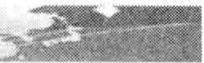
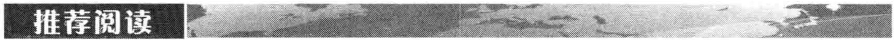
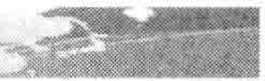
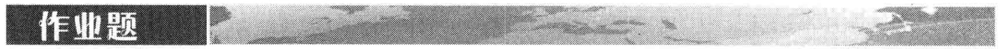

# 第24章 信用评级

穆迪（Moody's）、标准普尔（S&P）和惠誉（Fitch）等评级公司专门从事企业债券的信用评级业务。在穆迪的系统中，信用的最佳级别为 Aaa，具有这种信用级别的债券几乎没有违约的可能。接下来的级别为 Aa，再往下的排序为 A, Baa, Ba, B, Caa, Ca 及 C。评级为 Baa 及高于 Baa 的债券被称为投资级（investment grade）债券。标准普尔和惠誉与穆迪 Aaa, Aa, A, Baa, Ba, B, Caa, Ca 和 C 相对应的信用级别分别是 AAA, AA, A, BBB, BB, B, CCC, CC 和 C。为了产生更细的信用等级，穆迪将 Aa 等级分为 Aa1, Aa2 和 Aa3，并将 A 等级分为 A1, A2 和 A3 等；类似地，标准普尔和惠誉将 AA 级分为 AA +, AA 和 AA -，并将 A 等级分为 A +, A 和 A - 等。穆迪对 Aaa 没有再加细分，标准普尔和惠誉对 AAA 也没有再加细分，它们对最低的两个信用等级也通常没有再去细分。

## 24.2 历史违约概率

表 24-1 是由评级公司公布的一组典型数据，这些数据显示了在最初为某个级别的债券在今后 20 年内的违约情况。例如，初始信用级别为 Baa 的债券有 0.177% 的概率在一年内违约，有 0.495% 的概率在两年内违约，等等。债券在一个指定年份违约的概率可由这一表格计算得出。例如，初始信用级别为 Baa 的债券在期限中第二年违约的概率为 0.495% - 0.177% = 0.318%。

表 24-11970 \~ 2012 年的平均累积违约率（以百分比计）

<table><tr><td>时间(年)</td><td>1</td><td>2</td><td>3</td><td>4</td><td>5</td><td>7</td><td>10</td><td>15</td><td>20</td></tr><tr><td>Aaa</td><td>0.000</td><td>0.013</td><td>0.013</td><td>0.037</td><td>0.106</td><td>0.247</td><td>0.503</td><td>0.935</td><td>1.104</td></tr><tr><td>Aa</td><td>0.022</td><td>0.069</td><td>0.139</td><td>0.256</td><td>0.383</td><td>0.621</td><td>0.922</td><td>1.756</td><td>3.135</td></tr><tr><td>A</td><td>0.063</td><td>0.203</td><td>0.414</td><td>0.625</td><td>0.870</td><td>1.441</td><td>2.480</td><td>4.255</td><td>6.841</td></tr><tr><td>Baa</td><td>0.177</td><td>0.495</td><td>0.894</td><td>1.369</td><td>1.877</td><td>2.927</td><td>4.740</td><td>8.628</td><td>12.483</td></tr><tr><td>Ba</td><td>1.112</td><td>3.083</td><td>5.424</td><td>7.934</td><td>10.189</td><td>14.117</td><td>19.708</td><td>29.172</td><td>36.321</td></tr><tr><td>B</td><td>4.051</td><td>9.608</td><td>15.216</td><td>20.134</td><td>24.613</td><td>32.747</td><td>41.947</td><td>52.217</td><td>58.084</td></tr><tr><td>Caa-C</td><td>16.448</td><td>27.867</td><td>36.908</td><td>44.128</td><td>50.366</td><td>58.302</td><td>69.483</td><td>79.178</td><td>81.248</td></tr></table>

资料来源：穆迪。

表 24-1 显示具备投资级别的债券在一年内的违约概率随着期限的增大而增大（例如，A 级债券在第 0～5 年、5～10 年、10～15 年以及 15～20 年内的违约概率分别为 0.870%、1.610%、1.775% 和 2.586%）。这是因为在发行时，债券的信用级别较好，但随着时间的推移，公司信用出现问题的可能性会随之增大。而对于最初信用级别较差的债券，每年的违约率常常是时间的一个递减函数（例如，B 级债券在第 0～5 年、5～10 年、10～15 年以及 15～20 年的违约概率分别为 24.613%、17.334%、10.270% 和 5.867%）。产生这一现象的原因是如果一个债券的信用较差，债券在今后一两年能否生存会面临巨大挑战，但公司如果能够顺利渡过难关，那么今后的财务前景将会变得乐观起来。

## 违约率

由表24-1我们可以计算出Caa或更低级别的债券在第3年内的违约率为 $36.908\% - 27.867\% = 9.041\%$ 。我们将其称为无条件违约概率（unconditional default probability）。此概率是今天（即在0时刻）观察的在第3年内违约概率。Caa债券一直到第2年年底都不会违约的概率为 $100\% - 27.867\% = 72.133\%$ ，因此我们得出在前两年没有违约的条件下，公司在第3年内违约的概率为 $0.09041 / 0.72133 = 12.53\%$ 。

这里计算出的 $12.53\%$ 是对应于 1 年观察期的违约概率。假设我们考虑一个很短的时间段 $\Delta t$ ，定义在时间 $t$ 的违约率 $\lambda(t)$ 为在之前没有违约的条件下，违约发生在时间 $t$ 与 $t + \Delta t$ 之间的概率为 $\lambda(t) \Delta t$ 。如果 $V(t)$ 是从今天到时间 $t$ 公司仍然生存的累积概率（即在时间 $t$ 之前没有违约），那么在时间 $t$ 与 $t + \Delta t$ 之间违约的条件概率为 $[V(t) - V(t + \Delta t)] / V(t)$ ，由于这个概率等于 $\lambda(t) \Delta t$ ，我们有

V (t + \Delta t) - V (t) = - \lambda (t) V (t) \Delta t
$$

取极限后得出

$$
\frac{\mathrm{d}V (t)}{\mathrm{d}t} = - \lambda (t) V (t)
$$

因此

$$
V (t) = \mathrm{e}^{- \int_{\theta} ^{t} \lambda (\tau) \mathrm{d}\tau}
$$

定义 $Q(t)$ 为在时间 $t$ 之前违约的概率，因此 $Q(t) = 1 - V(t)$ ，我们得出

$$
Q (t) = 1 - \mathrm{e}^{- \int_{0} ^{t} \lambda (\tau) \mathrm{d}\tau}
$$

或者

$$
Q (t) = 1 - \mathrm{e}^{- \lambda (t) t}\tag{24-1}
$$
其中 $\bar{\lambda}(t)$ 为介于时间 0 与时间 t 之间违约率的平均值，条件违约概率被称为违约密度（default intensity）。
$$

$$
## 24.3 回收率
$$

$$
当一家公司破产时，公司的债权人会对公司的资产进行追索。 $^{①}$ 有时债权人会同意接受债
$$

$$
务的部分偿还，公司会进行重组；而在其他的情形下，公司部分资产被债权结算人变卖，所得资金将最大限度地用于偿还债务。在债务追索过程中，有些债权具有优先权，必须优先偿还。
$$

$$
债券回收率一般是指在刚刚违约后的几天里，债券的市场价值与面值的百分比。表24-2给出了不同种类债券平均回收率的历史数据。从表中可以看出，优先支付带抵押债券的平均回收率最高，为 $51.6\%$ ，而初级次级债券的平均回收率最低，为 $24.7\%$ 。
$$

$$
表 24-21982 \~ 2012 年企业债券作为面值百分比的回收率
$$

$$
<table><tr><td>类别</td><td>平均回收率(%)</td></tr><tr><td>优先支付有抵押债券</td><td>51.6</td></tr><tr><td>优先支付无抵押保债券</td><td>37.0</td></tr><tr><td>次优先级债券</td><td>30.9</td></tr><tr><td>次级债券</td><td>31.5</td></tr><tr><td>初级次级债券</td><td>24.7</td></tr></table>
$$

$$
资料来源：穆迪。
$$

$$
## 回收率对违约概率的依赖性
$$

$$
从[第8章](ch08.md)里可以看到，2007年开始的金融危机给人们的一个教训是按揭贷款的平均回收率与按揭贷款违约率有着负的相关性。利率上涨时，由于止赎按揭的原因将会有更多的房屋被卖掉，从而使房价下跌，因此造成回收率下降。
$$

$$
公司债券的平均回收率也显示了与违约率的负相关性。 $^{②}$ 当一年中违约的债券不多时，经济状态一般会很好，这时这些债券在违约时所得到的回收率可以高达60%。但当一年内有很多债券违约时，经济状况一般不好，违约债券的平均回收率可能会低至30%。负相关性所产生的影响是在高违约率的年头里使借出资金者雪上加霜，因为相伴随的往往是低回收率。
$$

$$
## 24.4 由债券收益率溢差来估计违约概率
$$

$$
像表 24-1 这样的数据提供了一种估计违约概率的方法，另一种方法是利用债券收益率溢差。债券的收益率溢差是所许诺的收益率高出无风险利率的部分。通常的假设是这部分多出的
$$

$$
收益率是对所承受违约风险的补偿。
$$

$$
假设一个 $T$ 年期债券的收益率溢差是每年 $s(T)$ 。这说明在时间0到 $T$ 之间债券的平均损失率大概是每年 $s(T)$ 。假设在这段时间里违约率的平均值是 $\bar{\lambda}(T)$ 。而对平均损失率的另一种估计是 $\bar{\lambda}(T)(1 - R)$ ，其中 $R$ 是所估计的回收率。因此近似地会有关系式
$$
\bar{\lambda} (T) (1 - R) = s (T)
$$

或

$$
\bar{\lambda} (T) = \frac{s (T)}{1 - R}\tag{24-2}
$$
在很多情况下这个逼近式都很有用处。
$$

$$
## 例24-1
$$

$$
假设一家公司所发行的1年期、2年期和3年期债券的收益率比无风险利率分别高出150个基点、180个基点和195个基点。如果预估的回收率是40%，由式（24-2）给出的一年平均违约率为 $0.0150/(1-0.4)=0.025$ ，即每年2.5%。类似地，前两年的平均违约率是 $0.0180/(1-0.4)=0.030$ ，即每年3.0%。前3年的平均违约率是 $0.0195/(1-0.4)=0.0325$ ，即每年3.25%。这些结果表明第2年的平均违约率是 $2\times0.03-1\times0.035$ ，即3.5%；而第3年的平均违约率是 $3\times0.0325-2\times0.03=0.0375$ ，即3.75%。
$$

$$
## 24.4.1 吻合债券价格
$$

$$
为了使计算更加精确，我们可以选择违约率使其与债券价格吻合，这种方式与在第4.5节里计算零息收益率曲线的做法类似。假设使用的是期限为 $t_i$ 的债券（ $t_i$ 满足： $t_1 < t_2 < t_3 < \cdots$ ）。用最短期限的债券计算直到 $t_1$ 的违约率，用下一个债券计算介于 $t_1$ 与 $t_2$ 之间的违约率，等等。
$$

$$
## 例 24-2
$$

$$
假设所有期限的无风险利率均为每年 $5\%$ （连续复利），1年期、2年期和3年期债券的收益率分别为 $6.5\%$ 、 $6.8\%$ 和 $6.95\%$ （也是连续复利，这与例24-1里的数据是一致的）。我们假设每个债券的面值都是100美元，票息都是每年 $8\%$ （每半年支付一次，而且刚刚付过一次票息）。由债券的收益率可以计算出它们的价格分别为101.33美元、101.99美元和102.47美元。假如债券是无风险的话，它们的价格应当分别是102.83美元、105.52美元和108.08美元（由 $5\%$ 的收益率计算）。这说明一年期债券的违约损失期望值的现值应当是 $102.83 - 101.33 = 1.50$ 美元。类似地，2年期与3年期债券的违约损失期望值应当是3.53美元和5.61美元。假设第 $i$ 年的违约率为 $\lambda_{i}(1 \leqslant i \leqslant 3)$ ，回收率为 $40\%$ 。
$$

$$
考虑1年期债券，在前6个月内违约的概率是 $1-e^{-0.5\lambda_{1}}$ ，在接下来6个月内违约的概率是 $e^{-0.5\lambda_{1}}-e^{-\lambda_{1}}$ 。假设违约只可能发生在6个月时间段的中间，那么违约可能发生的时间是3个月后和9个月后。在3个月时债券的无风险（远期）价格为
$$
4 \mathrm{e}^{- 0.05 \times 0.25} + 104 \mathrm{e}^{- 0.05 \times 0.75} = 104.12
$$

由上一节里回收率的定义我们知道，如果违约发生的话债券将会值40美元，所以当3个月后违约发生时所受损失的现值等于

$$
(104.12 - 40) \mathrm{e}^{- 0.05 \times 0.25} = 63.33
$$

在第9个月的时间点上债券的无风险价值为 $104 \mathrm{e}^{-0.05 \times 0.25} = 102.71$ ，而如果有违约的话，债券的价值将为40，所以当9个月后违约发生时所受损失的现值等于

$$
(102.71 - 40) \mathrm{e}^{- 0.05 \times 0.75} = 60.40
$$

因此，违约率 $\lambda_{1}$ 必须满足

$$
(1 - \mathrm{e}^{- 0.05 \times \lambda_{1}}) \times 63.33 + (\mathrm{e}^{- 0.5 \times \lambda_{1}} - \mathrm{e}^{- \lambda_{1}}) \times 60.40 = 1.50
$$
这个方程的解（可以利用Excel里的Solver）为 $\lambda_{1} = 2.46\%$ 。
$$

$$
接下来考虑2年期债券。这个债券在3个月与9个月时的违约概率可以从上面关于1年期债券的分析中得到，而对2年里违约率的计算可以通过使违约损失期望的现值等于3.53美元来完成。对3年期债券可以由类似的方法处理。通过这些计算，我们可以得到在第2年与第3年的违约率分别是 $3.48\%$ 与 $3.74\%$ （注意，这里所估计的违约率与在例24-1中通过式（24-2）所得结果非常相似）。
$$

$$
## 24.4.2 无风险利率
$$

$$
无风险利率的选择对我们刚刚介绍的计算违约概率方法有重要影响。例24-1中的溢差是债券收益率与无风险利率之差，而如何计算无风险债券价格对例24-2中计算由债券价格所蕴含的违约损失期望值有关键影响。债券交易员所用的参考无风险利率通常是某种国库券利率。例如，交易员对一个债券的报价也许是国库券上溢差250个基点。但是正如9.1节里所述，由于国库券利率太低，将其当成无风险利率没有太多用处。
$$

$$
信用违约互换合约（CDS）溢差（在7.1节里有过简单讨论，在[第25章](ch25.md)里将有更详细的论述）提供了不依赖所选择无风险利率的信用溢差估计。有些研究人员试图通过将债券溢差与CDS 溢差相比较，从而估计所蕴含的无风险利率。他们研究的结果表示，所蕴含的无风险利率比较接近于相应的 LIBOR/互换利率。例如，一种估计的结果是蕴含无风险利率比 LIBOR/互换利率低大约 10 个基点。 $^{①}$
$$

$$
## 24.4.3 资产互换溢差
$$

$$
在实际中，在计算信用风险时常常将 LIBOR/互换利率当成参考无风险利率。资产互换溢差更直接地提供了债券收益在 LIBOR/互换曲线之上溢差的估计。
$$

$$
为了解释资产互换的运作机制，考虑以下情形：某个债券的资产互换溢差报价为150个基点，对应于这一报价有三种可能：
$$

$$
(1) 债券价格等于账面价格, 即 100 美元。资产互换的一方 (公司 A) 支付债券的券息, 而另一方 (公司 B) 支付 LIBOR + 150 个基点。注意这里的交易是将债券所承诺的券息进行交换, 即无论债券是否违约, 交换都会进行。
$$

$$
(2) 债券价格低于其账面价格。假定债券价格为 95 美元。在资产互换中，A 方除了支付券息外，在互换开始时 A 方还要对每 100 美元的面值先支付 5 美元。B 方支付 LIBOR + 150 个基点。
$$

$$
(3) 债券价格高于其账面价格, 假定债券价格为 108 美元。在互换协议开始时, B 方首先对每 100 美元的面值先支付 8 美元。B 方付 LIBOR + 150 个基点, A 方支付券息。
$$

$$
在以上3种不同情形下，资产互换溢差（所对应的付款现金流）的贴现值等于无风险债券的价格与相似企业债券的差价。这里的无风险利率假设为LIBOR/互换曲线（见练习题24.20）。这个结果在例24-2这样的计算中很有用处。
$$

$$
## 24.5 违约概率估计的比较
$$

$$
由历史数据所估计出的违约概率通常要远远小于从债券价格中所隐含的违约概率，两者的差别在2007年中开始的信用危机期间显得尤为突出。在危机期间发生了所谓的“择优而栖”的现象，这时所有的投资人都想持有像国库券这样的安全证券。这种现象造成了公司债券价格下跌，从而导致收益率上涨。这些债券的信用溢差 $s$ 增大，因此类似式（24-2）中的计算将会给出很高的违约概率估计值。
$$

$$
表 24-3 中给出了通过历史数据所估计的违约概率与由信用溢差所估计的违约概率之差。为了避免使得结果过度地受危机影响，在计算债券收益溢差估计时，我们只使用危机发生之前的数据。
$$

$$
表 24-37 年间平均违约率（每年%）
$$

$$
<table><tr><td>级别</td><td>历史违约率</td><td>从债券计算的违约率</td><td>比率</td><td>差别</td></tr><tr><td>Aaa</td><td>0.04</td><td>0.60</td><td>17.0</td><td>0.56</td></tr><tr><td>Aa</td><td>0.09</td><td>0.73</td><td>8.2</td><td>0.64</td></tr><tr><td>A</td><td>0.21</td><td>1.15</td><td>5.5</td><td>0.94</td></tr><tr><td>Baa</td><td>0.42</td><td>2.13</td><td>5.0</td><td>1.71</td></tr><tr><td>Ba</td><td>2.17</td><td>4.67</td><td>2.1</td><td>2.50</td></tr><tr><td>B</td><td>5.56</td><td>8.02</td><td>1.4</td><td>2.35</td></tr><tr><td>Caa或更低</td><td>12.50</td><td>18.39</td><td>1.5</td><td>5.89</td></tr></table>
$$

$$
表 24-3 的第 2 列是基于表 24-1 中有关 7 年期限的数据（使用 7 年期这一列数据的原因是我们在后面所考虑的债券有大约 7 年的期限）。为了解释计算的过程，注意利用式（24-1）可以得出
$$
\bar{\lambda} (7) = - \frac{1}{7} \ln [ 1 - Q (7) ]
$$

其中， $\bar{\lambda}(t)$ 为截止到时间 $t$ 的平均违约率， $Q(t)$ 为截止到时间 $t$ 的累积违约概率。对应不同信用级别的 $Q(7)$ 值来自于表24-1。例如，对于信用级别为A的公司， $Q(7)$ 的值为0.01441，因此，7年的违约率平均值为

$$
\overline{{{\lambda}}} (7) = - \frac{1}{7} \ln (1 - 0.01441) = 0.0021
$$
即 0.21%。
$$

$$
为了利用表 24-3 中的第 3 列数据由债券价格计算平均违约率，我们利用式（24-2）与由美林证券（Merrill Lynch）发表的债券收益率数据。所示结果是 1996 年 12 月至 2007 年 6 月之间的平均值。在计算中，假设回收率为 40%。美林证券数据里的债券期限大约是 7 年（这也正是为什么在计算违约概率时, 我们使用表 24-1 里的 7 年期所对应的列)。在计算债券收益的溢差时, 我们假设无风险利率为 7 年期互换利率减去 10 个基点 (见上一节中的讨论)。例如, 对于 $A$ 级债券, 美林证券报告的平均收益率为 $5.995\%$ , 平均 7 年期互换利率为 $5.408\%$ , 因此平均无风险利率为 $5.308\%$ 。这就给出了 7 年平均违约率
$$
\frac{0.05995 - 0.05308}{1 - 0.4} = 0.0115
$$
即 1.15%。
$$

$$
表 24-3 展示了对于投资级债券，由债券价格所计算出的违约概率与由历史数据计算出的违约概率的比率很大，但这些比率随着信用级别降低而有所下降。 $^{①}$ 与此相比，两种违约概率的差随着信用级别的降低而有所增加。
$$

$$
表 24-4 是对这些结果提供的另一种解释。表中给出了投资者在不同信用级别的债券上所得收益溢差（这里仍然假定无风险利率等于 7 年互换利率减去 10 个基点）。仍然考虑 A 级债券，这种债券的收益率超过国债收益率的平均溢差为 111 个基点，其中的 42 基点是 7 年国库券与我们选取的无风险利率之间的平均溢差，补偿预期违约需要 12 个基点（这一值等于表 24-3 中的历史违约概率乘以 0.6，即回收率）。将预期违约考虑在内后，我们仍然有 57 个基点的额外预期收益。
$$

$$
表 24-4 债券额外收益的期望值
(单位：基点)
$$

$$
<table><tr><td>信用评级</td><td>债券与国债收益率的溢差</td><td>无风险利率与国债收益率的溢差</td><td>补偿历史违约的溢差</td><td>额外收益</td></tr><tr><td>Aaa</td><td>78</td><td>42</td><td>2</td><td>34</td></tr><tr><td>Aa</td><td>86</td><td>42</td><td>5</td><td>39</td></tr><tr><td>A</td><td>111</td><td>42</td><td>12</td><td>57</td></tr><tr><td>Baa</td><td>169</td><td>42</td><td>25</td><td>102</td></tr><tr><td>Ba</td><td>322</td><td>42</td><td>130</td><td>150</td></tr><tr><td>B</td><td>523</td><td>42</td><td>340</td><td>141</td></tr><tr><td>Caa</td><td>1146</td><td>42</td><td>750</td><td>354</td></tr></table>
$$

$$
由表 24-3 和表 24-4 可以看到，虽然两种违约概率差别很大，但对应的额外预期收益却相对较小（但仍然很显著）。对于 Aaa 级别的债券，两种违约概率的比率为 17.0，但额外预期收益只有仅仅 34 个基点。额外预期收益随着信用级别的降低而有所增加。 $^{②}$
$$

$$
表 24-4 所示的债券额外收益随着时间变化而不同。在 2001 年、2002 年和 2003 上半年，信用溢差（从而额外收益）均比较高。此后直到信用危机之前这段时间内，额外收益都比较低。
$$

$$
## 24.5.1 现实世界概率与风险中性概率的比较
$$

$$
由债券收益率所隐含的违约概率或违约率均为风险中性估计值。当存在违约风险时，我们可以用这些结果计算现金流在风险中性世界里的期望值，然后利用风险中性定价方法将现金流的期望值按无风险利率贴现，即可得到现金流的价值。例24-2是将这种方法用于计算违约费用的例子。在下一章中我们将会看到更多的应用。
$$

$$
与此相比，由历史数据计算出的概率或违约率都是在现实（有时也被称为真实（physical））世界里的估计值。表24-3显示的风险中性违约概率要比现实世界违约概率高出很多，表24-4中的额外预期收益直接来自在现实世界与风险中性世界里违约概率的差别。假如没有额外预期收益的话，现实世界违约概率将会等于风险中性违约概率，反之亦然。
$$

$$
为什么现实世界违约概率与风险中性世界违约概率会有如此大的差别呢？就像我们刚刚讨论的那样，这一问题等同于为什么企业债券交易员的平均收入要高于无风险利率。
$$

$$
一种解释是企业债券的流动性较差，因此它们要提供足够高的收益率才能对此进行补偿。事实确实是这样，但研究结果表明这并不能完全解释表24-4中的结果。 $^{①}$ 另外一种可能的原因是债券交易员的主观违约率假设也许比表24-1中给出的违约率要高得多，而交易员所假想的经济萧条情形可能要比历史数据中所有发生过的情形更差。但是，额外收益的很大一部分仍然很难用以上观点来解释。
$$

$$
到目前为止，人们发现造成表24-3和表24-4中结果的最主要原因是债券违约并不相互独立。在有些时间段内违约率较低，而在其他的时间段内违约率较高。观察不同年份的违约率将会证明这个结论。穆迪的统计结果表明，1970～2009年的违约率范围是从较低在1979年的 $0.09\%$ 到较高在2001年的 $3.97\%$ 和2009年的 $5.35\%$ 。年与年之间的违约率变化会导致系统风险（即不能通过风险分散而消除的风险），债券交易员因承担这种风险自然会索取额外收益（这与由资本资产定价模型所计算的股权持有者额外收益是类似的，见[第3章](ch03.md)附录）。年与年之间违约率的不同可能是归因于整体的经济状况，或者某公司的违约会触发其他公司的违约（这一现象常被称为信用蔓延（credit contagion））。
$$

$$
除了我们刚刚讨论的系统风险，每个债券都具有非系统风险。对于股票交易组合，我们可以认为当投资者选择适当的组合（例如组合含有30个股票）时，非系统风险可以被分散，因此当投资者持有非系统风险时就不应索取额外收益。但对于债券组合，以上观点就没有那么明显。债券收益具有很高的偏态性，同时投资收益的升势有限（例如，一个债券在1年内有 $99.75\%$ 的可能收益率为 $7\%$ ，同时有 $0.25\%$ 的可能收益率为 $-60\%$ 。第1种情形对应于没有违约出现，第2种情形对应于出现违约）。债券投资的这种风险很难分散），因为如果我们要想进行风险分散的话，需要持有成千上万的债券。在实际中，许多债券组合的风险远远没有达到完全分散，因此债券交易员可能对自己承担的非系统风险也会索取额外的回报。
$$

$$
## 24.5.2 应当使用哪种违约概率估计
$$

$$
现在我们自然会问，在信用风险分析中我们是应该采用现实世界里的违约率还是风险中性世界里的违约率？答案取决于我们分析的目的：当我们对信用衍生产品定价或者分析违约对产品价格的影响时，我们应该采用风险中性违约概率，这是因为在分析中会涉及计算将来预期现金流的贴现值，在计算中会不可避免（直接或间接）地采用风险中性定价理论。当我们采用情形分析法来估计因违约而可能触发的损失时，应该采用现实世界里的违约率。
$$

$$
## 24.6 利用股价估计违约概率
$$

$$
当我们利用类似于表 24-1 中数据来估计公司在现实世界里的违约概率时，我们必须依赖公司的信用评级，不幸的是公司信用评级的更新较慢。许多人认为在估计违约概率时，股票价格可以提供更及时的信息。
$$

$$
默顿在 1974 年提出了一种将公司股票当成公司资产上期权的模型。 $^{①}$ 为了便于讨论，假设公司仅发行了一个零息债券，债券到期时间为 T。定义：
$$

$$
$V_{0}$ ：公司资产的当前价值；
$$

$$
$V_{T}$ ：公司资产在时间 T 的价值；
$$

$$
$E_{0}$ ：公司股票的当前价值；
$$

$$
$E_{T}$ ：公司股票在时间 T 的价值；
$$

$$
D: 公司债券在时间 T 的本金;
$$

$$
$\sigma_{v}$ ：资产波动率（假设为常数）；
$$

$$
$\sigma_{E}$ ：股票的瞬时波动率。
$$

$$
当 $V_{T} < D$ 时, 公司会对自己发行的债券违约 (至少在理论上讲), 此时公司股票的价值为 0; 当 $V_{T} > D$ 时, 公司会支付自己在时间 $T$ 时应偿还的债务, 这时股票价值为 $V_{T} - D$ 。因此在默顿模型中, 在时间 $T$ 时公司的股票价值为
$$
E_{T} = \max (V_{T} - D, 0)
$$

这表示公司的股票可以被看作公司资产上的看涨期权：期权的执行价格为应偿还债券本金的总量。布莱克－斯科尔斯－默顿公式给出了这一期权的当前价值

$$
E_{0} = V_{0} N(d_{1}) - D \mathrm{e}^{- r T} N(d_{2})\tag{24-3}
$$

其中

$$
d_{1} = \frac{\ln (V_{0} / D) + (r + \sigma_{V} ^{2} / 2) T}{\sigma_{V} \sqrt{T}} \text{和} d_{2} = d_{1} - \sigma_{V} \sqrt{T}
$$
债券今天的价值等于 $V_{0}-E_{0}$ 。
$$

$$
公司在时间 T 时违约的风险中性概率为 $N(-d_{2})$ 。为了计算这一数量，我们需要 $V_{0}$ 与 $\sigma_{v}$ ，而这两个变量都不能从市场上直接观察到。但是如果公司是一家上市公司，我们可以观察到 $E_{0}$ ，这意味着式（24-3）给出了一个 $V_{0}$ 与 $\sigma_{v}$ 必须满足的等式。我们也可以通过历史数据或期权价格来估计 $\sigma_{E}$ 。由伊藤引理，我们得出
$$
\sigma_{E} E_{0} = \frac{\partial E}{\partial V} \sigma_{V} V_{0} = N(d_{1}) \sigma_{V} V_{0}\tag{24-4}
$$
以上方程是 $V_{0}$ 与 $\sigma_{V}$ 必须满足的另一个等式。式（24-3）与式（24-4）给出了一组关于 $V_{0}$ 和 $\sigma_{V}$ 的方程，由这两个方程我们可以求得 $V_{0}$ 及 $\sigma_{V}$ 。
$$

$$
## 例 24-3
$$

$$
某家公司的股权价值为300万美元，股权变化的波动率为80%，公司在1年后必须支付的债务总额为1000万美元，无风险利率为每年5%。在以下计算中的数量以百万计。对应这一情形 $E_{0}=3$ ， $\sigma_{E}=0.80$ ，r=0.05，T=1和D=10。对式（24-3）和式（24-4）求解，我们得出 $V_{0}=12.40$ 与 $\sigma_{V}=0.2123$ ，参数 $d_{2}=1.1408$ ，因此公司违约的概率为 $N(-d_{2})=0.127$ ，即12.7%。债券的当前市价为 $V_{0}-E_{0}$ ，即9.40%。债券面值的贴现值为 $10e^{-0.05\times1}=9.51$ ，因此债券的预期损失为 $(9.51-9.40)/9.51$ ，即无违约可能时价值的大约1.2%。预期损失（expected loss，EL）等于违约概率（probability of default，PD）乘以1减去回收率，因此回收率等于1减去EL/PD。在本例中，回收率为1-1.2/12.7，即无违约可能时价值的91%。
$$

$$
我们可以将上面的默顿模型基本形式在几个方面加以推广。例如，一种形式是假设一旦资产价格低于一定的障碍值时，就会触发违约，另一种推广是允许使债券需要多次进行偿还支付的情形。
$$

$$
由默顿模型及其推广形式所产生的违约概率与实际违约概率有多么接近呢？这一问题的答案是默顿模型及其推广对于违约概率提供了较好的排序功能（风险中性或现实世界）。这意味着通过某种单调变换，我们可以将由默顿模型产生的违约概率转换成对现实世界里或风险中性世界里违约概率的估计。 $^{①}$ 利用理论上的风险中性违约概率 $N(-d_{2})$ （因为这是由期权定价模型中估计的）来估计现实世界里的违约概率，这种做法看上去比较奇怪，但在对上面模型的矫正过程中，我们假设了对不同公司的风险中性违约概率排序与其现实世界里违约概率的排序是一样的。
$$

$$
## 24.7 衍生产品交易中的信用风险
$$

$$
在本节中我们考虑如何量化双边结算衍生产品交易中的信用风险。一般来讲两家公司之间的双边结算衍生产品交易服从国际互换和衍生产品协会（ISDA）的主协议（master agreement）中的规定。协议中的一条重要条款是关于净额结算（netting）的规则：这项规则指明为了（a）计算在违约事件发生时的权益，（b）计算必须提交的抵押数量，所有介于两家公司之间的未平仓交易都应当视作一项交易。
$$

$$
在主协议里还定义了违约事件（event of default）发生的情形。例如，当一方没有能够履行衍生产品交易所指明的支付，或没能按要求交付抵押品，或宣布破产时，就会有一个违约事件。交易对手有权利终止所有与其之间未平仓的交易。在下面两种情况下，这些结果很可能会给非违约方造成损失：
$$

$$
(1) 对非违约一方, 所有未平仓交易的总值是正的, 而且高于违约方所交付的抵押品 (假如有的话) 价值。对于交易中没有抵押品的部分, 非违约方成了无抵押债权人 (unsecured creditor)。
$$

$$
(2) 对违约的一方, 所有未平仓交易的总值是正的, 但是低于非违约方所交付的抵押品价值。为了要回自己已经交付的多余抵押品, 非违约方成了无抵押债权人。
$$

$$
为了简化讨论，我们忽略因为需要更换与违约方之间所做的交易，非违约方由买入－卖出差价而带来的费用。
$$

$$
## 24.7.1 CVA与DVA
$$

$$
在[第9章](ch09.md)里我们曾介绍过CVA（信用价值调节）与DVA（债务价值调节）的概念。一家银行对其交易对手的CVA调节值等于由于对手违约所产生的预期费用的贴现值，而DVA调节值等于银行自己违约而给对手造成的预期费用的贴现值。银行违约的可能性对银行自己有利，因为银行有可能不需要按衍生产品的要求向对方支付。因此，作为对手的费用，DVA是对银行有益的。
$$

$$
未平仓交易的无违约价值（no default value）是当假设交易的双方都不违约情况下的交易价值（像布莱克－斯科尔斯－默顿这样的衍生产品定价模型所给出的都是无违约价值）。如果 $f_{nd}$ 表示与某个交易对手之间未平仓交易对于银行的无违约价值，那么在考虑可能的违约情况后，未平仓交易的价值是
$$
f_{\mathrm{nd}} - \mathrm{CVA} + \mathrm{DVA}
$$

假设在银行与交易对手之间未平仓衍生产品交易中期限最长的是 $T$ 年, 如第 9 章里所述, 将 0 和 $T$ 之间分成 $N$ 个区间, CVA 和 DVA 的估计值为

$$
\mathrm{CVA} = \sum_{i = 1} ^{N} q_{i} v_{i}, \quad \mathrm{DVA} = \sum_{i = 1} ^{N} q_{i} ^{*} v_{i} ^{*}
$$
其中 $q_{i}$ 为对手在第 $i$ 个区间里违约的风险中性概率； $v_{i}$ 为当对手在第 $i$ 个区间的中间时间点上违约时，给银行造成损失的预期值的贴现值； $q_{i}^{*}$ 为银行在第 $i$ 个区间里违约的风险中性概率； $v_{i}^{*}$ 为当银行在第 $i$ 个区间的中间时间点上违约时，给对手造成损失（对银行有利）的预期值的贴现值。
$$

$$
首先考虑如何计算 $q_{i}$ 。因为我们是在利用风险中性方法对未来现金流定价，所以 $q_{i}$ 应当是风险中性违约概率（参见24.5节）。假设 $t_{i}$ 是第 $i$ 个区间的终点，那么 $q_{i}$ 是交易对手在时间 $t_{i}$ 和 $t_{i+1}$ 之间的风险中性违约概率。我们首先采用一些不同的期限来估计对手的信用溢差，然后利用插值，可得到对期限 $t_{i} (1 \leqslant i \leqslant N)$ 内交易对手的信用溢差估计值 $s(t_{i})$ 。由式（24-2），对手在时间0和 $t_{i}$ 之间的平均违约率估计值是 $s(t_{i}) / (1 - R)$ ，其中 $R$ 是当对手违约时的回收率期望值。由式（24-1），对手在直到 $t_{i}$ 时仍未违约的概率是
$$
\exp \left(- \frac{s (t_{i}) t_{i}}{1 - R}\right)
$$

这说明

$$
q_{i} = \exp \left(- \frac{s (t_{i - 1}) t_{i - 1}}{1 - R}\right) - \exp \left(- \frac{s (t_{i}) t_{i}}{1 - R}\right)
是对手在第 $i$ 个区间里违约的概率。可以利用类似的方法从银行的信用溢差来估计概率 $q_{i}^{*}$ 。

接下来我们考虑在假设没有提交抵押品的情况下如何计算 $v_{i}$ ，这里的计算常常需要花大量时间利用蒙特卡罗模拟来完成。从时间0到T，在风险中性世界里对一些市场变量进行模拟，而这些市场变量决定了交易商与对手之间所有未平仓交易的无违约价值。在每次模拟实验中，在每个时间区间的中间点上计算银行关于对手的风险敞口，这里的风险敞口等于 $\max(V,0)$ ，其中 $V$ 是交易对于银行的总值（如果对银行来讲，总价值是负值时没有风险敞口；而价值为正时，风险敞口等于这个值）。计算在所有模型实验中这项风险敞口的平均值，将其贴现值乘以1减去回报率即可得到变量 $v_{i}$ 的估计值。采用类似的方法，从对手对于银行的风险敞口可以计算变量 $v_{i}^{*}$ 。

当银行与对手之间有抵押协议时， $v_{i}$ 的计算会更复杂。在每次模拟实验中，在第 $i$ 个区间的中间点上如果有违约事件发生，我们需要估计双方所持抵押品的价值。在这样的计算中，通常假设从违约发生的 $c$ 天前开始，对方既不再提交抵押品，也不再归还超量的抵押品。参数 $c$ 通常被称为补救期（cure period），一般等于10或20天。为了知道在区间中间点上违约发生时都持有什么抵押品，需要计算所有交易在 $c$ 天前的价值。下面的例子展示了如何计算风险敞口的方法，预期损失 $v_{i}$ 的贴现值是按所有试验中风险敞口的平均值计算的（这与无违约的情形一样）。考虑对手关于银行的风险敞口时，利用类似的方法可以得到 $v_{i}^{*}$ 。

## 例24-4

在银行与交易对手之间有双边零槛（zero-threshold）抵押协议，这说明每方都需要向对手提交价值 $\max (V,0)$ 的抵押品，这里 $V$ 代表未平仓交易对于对手的价值。假设补救期为20天， $\tau$ 是在银行的CVA计算中所用的一个时间区间的中间点。

(1) 在一次模拟实验中, 在时间 $\tau$ , 未平仓交易对银行的价值是 50 , 而 20 天之前的价值是 45 。在这种情况下, 通常假设如果在时间 $\tau$ 违约发生的话, 银行所持有的抵押品价值是 45 , 银行的风险敞口是衍生产品价值中没有抵押品的部分, 即 5 。

(2) 在一次模拟实验中, 在时间 $\tau$ , 未平仓交易对银行的价值是 50 , 而 20 天之前的价值是 55 。在这种情况下, 通常假设如果在时间 $\tau$ 内发生违约的话, 银行持有足够的抵押品, 从而风险敞口是 0 。

(3) 在一次模拟实验中, 在时间 $\tau$ , 未平仓交易对银行的价值是 -50 , 而 20 天之前的价值是 -45 。在这种情况下, 通常假设如果在时间 $\tau$ 内发生违约的话, 银行所交付的抵押品价值不超过 50 , 从而风险敞口是 0 。

(4) 在一次模拟实验中, 在时间 $\tau$ , 未平仓交易对银行的价值是 -50 , 而 20 天之前的价值是 -55 。在这种情况下, 通常假设如果在时间 $\tau$ 内发生违约的话, 对手仍持有价值为 55 的抵押品, 银行的风险敞口是 5 , 即多余的抵押品部分。

除了计算 CVA 外，银行通常还计算每个区间中间点上的高峰敞口（exposure peak），这是在每次蒙特卡罗模拟中风险敞口的高百分位数。例如，如果百分位等于 97.5%，在 1 万次模拟实验中，一个区间中间点上的高峰敞口等于第 250 个高的风险敞口。最高峰敞口等于所有区间中间点上高峰敞口的最大值。 $^{①}$

通常银行会保存在模拟中所有市场变量的样本路径，以及所计算的所有价值，这样可以加快有关新交易的 CVA 和 DVA 计算：这是因为在计算新交易对 CVA 和 DVA 的影响时，只需要在每个样本路径上计算新交易的价值。如果新交易的价值与已有的交易具有正相关性，这时很可能将会增加 CVA 和 DVA，然而如果新交易的价值与已有的交易具有负相关性（比如完全或部分退出现存交易），这时很可能将会降低 CVA 和 DVA。

在上面有关计算 CVA 方法的讨论中，我们假设了对手违约的概率与银行的风险敞口之间是相互独立的。在许多情形下这种假设比较合理。交易人员常常用术语错向风险（wrong-way risk）来描述当对手违约概率与风险敞口具有正相关性时的情形，而用正向风险（right-way risk）来描述当对手违约概率与风险敞口具有负相关性时的情形。为了描述违约概率与风险敞口的依赖性，人们提出了许多比上面描述的方法更复杂的模型。

对每个交易对手，银行都会有一个 CVA 和一个 DVA，而这些 CVA 和 DVA 都可以被当成是衍生产品：其价值会随着市场变量变化、对手信用溢差变化以及银行信用溢差变化而变化。对 CVA 和 DVA 风险的管理方式与管理其他衍生产品风险的方式一样，可以计算希腊值、进行情形分析等。

## 24.7.2 信用风险的缓和

有许多种方法可以用来减少双边结算交易中的信用风险，其中之一是我们已经讲过的净额结算。假设银行与某个对手之间有3笔没有抵押的交易：价值分别为+1000万美元、+3000万美元和-2500万美元。如果将它们都作为独立交易，银行在这些交易上的风险敞口分别为+1000万美元、+3000万美元和0，总共为4000万美元。利用净额结算的话，将3笔交易放在一起作为一笔价值为1500万美元的交易，这样风险敞口从4000万降到了1500万。

抵押协议是减少信用风险的一种重要方式。抵押品可以是现金（挣取利息）或在市场上交易的证券。为计算抵押品数量问题，可以按某种百分比对证券的市场价值打折，所降低的数量被称为折扣（haircut）。在违约事件发生时，衍生产品交易将会受到优先考虑。非违约方有权扣留对方交付的所有抵押品，因此没有必要为此去打既耗财力又耗精力的官司。

金融机构用来降低信用风险的另一种方法是利用降级触发策略（downgrade trigger）。在ISDA总协议里有一项条款指明，如果对手的信用评级低于某个水平（比如 BBB），银行有权对所有未平仓交易按市价平仓。但是当信用级别跳动幅度很大时（比如由 A 跳到违约），降级触发策略并不能提供多少帮助，而且只有当使用这种策略不是很多时，其效果才会相对较好。如果某家公司与许多对手之间都有降级触发协议的话，对其对手而言，这种策略起不了什么保护的作用（见业界事例 24-1）。

## 业界事例 24-1 降级触发与安然公司的破产

在 2001 年 12 月，美国最大的公司之一安然（Enron）公司宣布破产。直到安然破产前几天，安然公司的信用评级仍然是投资级，穆迪对安然在临破产前的评级为 Baa3，而标准普尔的评级为 BBB-。但是股票市场在一定程度上对安然的破产却已有所料：在破产之前的一段时间里，安然的股票价格急剧下跌。在这一段时间里，在第 24.6 节里所讨论的那些模型对安然违约概率的估计将会急剧增长。

安然与交易对手进行的大量衍生产品交易中都设定了降级触发条约，这些降级触发条约阐明当安然的信用评级低于投资级（即 Baa3/BBB-）时，交易对手有权对交易进行平仓。假定安然的信用评级在 2001 年 10 月只是被降到低于投资级别，安然交易对手选择的平仓交易一定是那些对安然有负价值的交易（对交易对手而言具有正价值），因此安然公司要向交易对手付出大量的现金，而安然这时肯定是没有能力付出这一大笔费用，因此无论如何破产也会很快发生。

这一事例表明，降级触发条款只有在没有被滥用时才会有效，如果一个公司跟许多对手都签有降级触发条款，这也可能会导致公司破产。对于安然公司的情形，我们也许会说安然公司注定会破产，所以将破产进程提前两个月不会带来太多的危害。事实上，安然公司在2001年10月确实有一次生存的机会：另外一家能源公司Dynergy曾试图寻求抢救安然的方案。在 2001 年 10 月，无论是安然的股东还是贷款人都不希望安然破产。

信用评级公司发现它们自己处在比较尴尬的位置：它们如果为了正确反映安然的财务窘态而将安然降级，这无非是将安然立即判以死刑；如果它们不这样做，至少安然还有一线生机。

## 24.7.3 特殊情形

在本节里，我们考虑两个不需要蒙特卡罗模拟就可以计算 CVA 的特殊情形。

第一个特殊情形是当银行与对手之间只有一笔无抵押的衍生产品交易，而交易只是在时间 $T$ 向银行提供收益（例如，银行向对手购买了剩余期限为 $T$ 的欧式期权）。在将来时间银行的风险敞口等于期权在那个时间的无违约价值，因此风险敞口的现值等于衍生产品在将来时刻价值的贴现值，这正是衍生产品在今天的无违约价值：对所有 $i$

v_{i} = f_{\mathrm{nd}} (1 - R)

其中 $f_{nd}$ 为衍生产品在今天的无违约价值，R为回收率。这意味着

$$
\mathrm{CVA} = (1 - R) f_{\mathrm{nd}} \sum_{i = 1} ^{n} q_{i}
$$

在这种情形下，DVA = 0。因此在考虑信用风险后，衍生产品的价值为

$$
f = f_{\mathrm{nd}} - (1 - R) f_{\mathrm{nd}} \sum_{i = 1} ^{n} q_{i}\tag{24-5}
$$

我们现在考虑的衍生产品是由对手发行的 T 年期零息债券。假设债券的回收率与衍生产品回收率一样，债券的价值等于

$$
B = B_{\mathrm{nd}} - (1 - R) B_{\mathrm{nd}} \sum_{i = 1} ^{n} q_{i}\tag{24-6}
$$

其中 $B_{\mathrm{nd}}$ 为债券的无违约价值。由式（24-5）和式（24-6）

$$
\frac{f}{f_{\mathrm{nd}}} = \frac{B}{B_{\mathrm{nd}}}
$$

如果 $y$ 为由交易对手所发行的 $T$ 年期债券的收益率, $B_{\mathrm{nd}}$ 为类似的无风险债券收益率, $B = \mathrm{e}^{-yT}$ 和 $B_{\mathrm{nd}} = \mathrm{e}^{-y_{\mathrm{nd}}T}$ , 我们得到

$$
f = f_{\mathrm{nd}} \mathrm{e}^{- (y - y_{\mathrm{nd}}) T}
$$

这说明在对衍生产品定价时，贴现率可以取成对风险中性世界里收益用来贴现的利率加上对手的 T 年期信用溢差。

## 例 24-5

某个无抵押2年期期权的布莱克-斯科尔斯-默顿价格是3美元，由卖出这个期权的公司所发行的零息债券收益率比无风险利率高 $1.5\%$ ，当考虑违约风险后，期权的价值是 $3\mathrm{e}^{-0.015\times 2} = 2.91$ 美元。在这里我们假定当违约事件发生时，这个期权不与别的衍生产品进行净额结算。

对第二个特殊例子, 我们考虑如下情形: 银行与交易对手签订了远期合约, 银行在时间 $T$ 按价格 $K$ 购买某种资产。将在时间 $T$ 交付的远期合约在时间 $t$ 的远期价格定义为 $F_{t}$ , 由第 5.7

节知道，交易在时间 $t$ 时的价值为

$$
\left(F_{t} - K\right) \mathrm{e}^{- r (T - t)}
$$

其中 r 为无风险利率（假设为常数）。

因此银行在时间 $t$ 的风险敞口等于

$$
\max \left[ \left(F_{t} - K\right) \mathrm{e}^{- r (T - t)}, 0 \right] = \mathrm{e}^{- r (T - t)} \max \left[ F_{t} - K, 0 \right]
$$

$F_{t}$ 在风险中性世界里的期望值等于 $F_{0}$ ， $\ln F_{t}$ 的标准差为 $\sigma\sqrt{t}$ ，其中 $\sigma$ 为 $F_{t}$ 的波动率。由式（15A-1），在时间 t 风险敞口的期望值等于

$$
w (t) = \mathrm{e}^{- r (T - t)} \left[ F_{0} N(d_{1} (t)) - K N(d_{2} (t)) \right]
$$

其中

$$
d_{1} (t) = \frac{\ln (F_{0} / K) + \sigma^{2} t / 2}{\sigma \sqrt{t}}
$$

$$
d_{2} (t) = d_{1} (t) - \sigma \sqrt{t}
$$

这样可以得到

$$
v_{i} = w (t_{i}) \mathrm{e}_{i} ^{- r t} (1 - R)
$$

例24-6

一家银行与一家矿业公司签订了一项远期合约，合约是在2年后银行按每盎司1500美元的价格向矿业公司购买100万盎司的黄金。目前的2年期黄金远期价格是每盎司1600美元。在计算CVA时，我们假设只考虑长度为1年的两个时间区间，公司在第1年内违约的概率是 $2\%$ ，在第2年内违约的概率是 $3\%$ 。无风险概率是每年 $5\%$ ，在违约发生时，预计有 $30\%$ 的回收率。黄金远期价格的波动率是 $20\%$ 。

在本例中， $q_{1}=0.02,\quad q_{2}=0.03,\quad F_{0}=1\ 600,\quad K=1\ 500,\quad \sigma=0.2,\quad r=0.05,\quad R=0.3,\quad t_{1}=0.5,\quad t_{2}=1.5$ ，从而

$$
d_{1} (t_{1}) = \frac{\ln (1600 / 1500) + 0.2^{2} \times 0.5}{0.2 \times \sqrt{0.5}} = 0.5721
$$

$$
d_{2} (t_{1}) = d_{1} (t) - 0.2 \times \sqrt{0.5} = 0.3856
$$

于是

$$
w \left(t_{1}\right) = \mathrm{e}^{- 0.05 \times 1.5} [ 1600 \times N(0.5271) - 1500 \times N(0.3856) ] = 135.73
$$

和

$$
v_{1} = w \left(t_{1}\right) \mathrm{e}^{- 0.05 \times 0.5} \times (1 - 0.3) = 92.67
$$

类似地可以得到 $w(t_{2})=201.18$ 和 $v_{2}=130.65$ 。

违约的预期费用为

$$
q_{1} v_{1} + q_{2} v_{2} = 0.02 \times 92.67 + 0.03 \times 130.65 = 5.77
$$

远期合约的无违约价值是（1600 - 1500） $e^{-0.05 \times 2} = 90.48$ ，在考虑对手违约的可能后，价值降低到了90.48 - 5.77 = 84.71。我们可以将这里的计算推广到公司可能在更多时间点上违约的情形（见作业题24.29）。DVA将会使衍生产品的价值增加，对它的计算与CVA类似（见作业题24.30）。

## 24.8 违约相关性

违约相关性（default correlation）是用来描述两家公司同时违约的倾向。违约相关性的存在有许多原因：处于同一行业或位于同一地域的公司往往会受同样的外界因素影响，因此这些公司可能会同时遭遇财政困难。经济状况一般会造成在某些年份内的平均违约率高于其他年份。一家公司的违约可能会引起另一家公司的违约（信用蔓延效应，credit contagion effect）。违约相关性的存在意味着信用风险不能够被完全分散，这一点正是造成风险中性违约率远远大于现实世界违约率的主要原因（见24.5节）。

当资产组合与多家交易对手有关时，违约相关性是决定组合违约损失概率分布的重要决定因素。 $^{①}$ 研究人员提出了两种描述违约相关性的模型，一种是简化模型（reduced form models），另外一种是结构模型（structural models）。

在简化模型中假定不同公司的违约率服从与一些宏观经济变量相关的随机过程。当公司 A 违约率很高时，公司 B 违约率往往也会很高，这样就带来了公司之间的违约相关性。

简化模型的数学形式很吸引人，并反映了经济循环周期会带来违约相关性的倾向，其主要缺点是它所能取得的违约相关性的范围是有限的。即使两家公司的违约率具有完美的相关性，但两家公司在一个很短时间区间里同时违约的概率通常会很低，在某些情形下这会产生问题。例如，当两家公司在同一行业和同一国家运作，或者由于某种原因，一家公司的财政状态与另一家公司的财政状态息息相关时，我们往往希望产生较高的违约相关性。一种解决这个问题的方式是在违约率中引入跳跃性来对模型进行推广。

结构模型都类似于默顿模型（见24.6节）。当资产价值低于一定水平时，公司就会违约。公司A和公司B之间的违约相关性是通过公司A的资产价值所服从的随机过程与公司B的资产价值所服从的随机过程之间的相互关系来描述的。结构模型的主要优点是该模型可以产生任意的相关系数，其主要缺点是计算速度十分缓慢。

## 24.8.1 违约时间的高斯关联结构模型

对于违约时间，一种越来越流行的实用工具是高斯关联结构（copula）模型。该类模型与默顿的结构模型相似。在这种模型中假设所有的公司最终都会违约，并试图通过两家公司违约时间的概率分布来定量地描述违约相关性。

高斯关联结构模型既可以用在现实世界里，也可以用在风险中性世界里。在现实世界里，一家公司违约时间概率分布的左端尾部可由表24-1中所示的评级公司数据来估计；在风险中性世界中，违约时间概率分布的左端尾部可由24.4节里描述的债券价格信息来估计。

定义 $t_1$ 为公司1的违约时间， $t_2$ 为公司2的违约时间。如果 $t_1$ 和 $t_2$ 服从正态分布的话，我们可以假设 $t_1$ 和 $t_2$ 的联合分布为二元正态分布，但事实上，公司的违约时间连大概服从正态分布都不是。这正是引入高斯 Copula 模型的原因。我们将 $t_1$ 和 $t_2$ 用以下变换来转换为两个新的变量 $x_1$ 和 $x_2$

$$
x_{1} = N^{- 1} \left[ Q_{1} (t_{1}) \right], x_{2} = N^{- 1} \left[ Q_{2} (t_{2}) \right]
$$

其中 $Q_{1}$ 和 $Q_{2}$ 分别为 $t_{1}$ 和 $t_{2}$ 的累积概率分布， $N^{-1}$ 为累积正态分布的逆函数（即当 $v = N(u)$ 时， $u = N^{-1}(v)$ ）。以上变换为分位数与分位数之间（percentile-to-percentile）的映射， $t_{1}$ 概率分布上 5% 的分位数被映射到 $x_{1} = -1.645$ ，这正是标准正态分布上 5% 的分位数； $t_{1}$ 概率分布上 10% 的分位数被映射到 $x_{1} = -1.282$ ，这正是标准正态分布上 10% 的分位数，依此类推。

$t_{2}$ 与 $x_{2}$ 之间的映射与此类似。

由构造过程可知， $x_{1}$ 和 $x_{2}$ 均服从均值为 0、方差为 1 的正态分布。模型中假设 $x_{1}$ 和 $x_{2}$ 之间服从二元正态分布，我们将这一假设称为采用了高斯 Copula 模型。使用这一假设会很方便，因为 $t_{1}$ 和 $t_{2}$ 的联合概率分布完全由 $t_{1}$ 和 $t_{2}$ 的累积违约分布 $Q_{1}$ 和 $Q_{2}$ 及一个相关参数来定义。

高斯关联结构模型的诱人之处在于这一模型可以被推广到多个公司的情形。假如我们考虑 $n$ 家公司，第 $i$ 家公司的违约时间为 $t_i$ ，我们将 $t_i$ 转换为一个新的服从标准正态分布的变量 $x_i$ ，这里采用的映射为分位数与分位数之间的映射

$$
x_{i} = N^{- 1} \left[ Q_{i} (t_{i}) \right]
$$

其中 $Q_{i}$ 为 $t_{i}$ 的累积概率分布。然后我们假设这些 $x_{i}$ 服从多元正态分布。由此得出， $t_{i}$ 与 $t_{j}$ 之间的违约相关性由 $x_{i}$ 与 $x_{j}$ 之间的相关性来定义，这一相关性被称为关联结构（copula）相关系数（copula correlation）。 $^{\ominus}$

高斯关联结构模型常常被用于描述不服从正态分布的随机变量之间的相关性结构，这一模型允许将相关结构的估计与变量的边际（即无条件）分布分开。虽然这些变量本身并不满足多元正态分布，但对每一个变量进行变换后，所有这些变换后的变量满足多元正态分布。

例 24-7

假定我们希望对10家公司在今后5年内的违约进行模拟。每两家公司之间的Copula违约相关系数为0.2。每家公司在今后1年、2年、3年、4年和5年内的累积违约概率分别为 $1\%$ 、 $3\%$ 、 $6\%$ 、 $10\%$ 和 $15\%$ 。在应用高斯Copula模型时，我们从多元正态分布中进行抽样来得到 $x_{i}$ ( $1 \leqslant i \leqslant 10$ ) 的样本，在这里每两个变量之间的相关系数都是0.2。然后我们将 $x_{i}$ 转换为违约时间 $t_{i}$ 。当从正态分布得出的样本小于 $N^{-1}(0.01) = -2.33$ 时，违约发生在第1年；当样本介于-2.33和 $N^{-1}(0.03) = -1.88$ 之间时，违约发生在第2年；当样本介于-1.88和 $N^{-1}(0.06) = -1.55$ 之间时，违约发生在第3年；当样本介于-1.55和 $N^{-1}(0.10) = -1.28$ 之间时，违约发生在第4年；当样本介于-1.28和 $N^{-1}(0.15) = -1.04$ 之间时，违约发生在第5年；当样本大于-1.04时，在5年期间没有违约。

## 24.8.2 基于因子的相关性结构

在高斯 Copula 模型中, 为了避免对每两个变量 $x_{i}$ 与 $x_{j}$ 之间都定义不同的相关系数, 我们常常可以采用单因子模型, 其假设为

$$
x_{i} = a_{i} F + \sqrt{1 - a_{i} ^{2}} Z_{i}\tag{24-7}
$$

在以上方程中，F 为影响所有公司违约状态的共同因子， $Z_{i}$ 为只影响公司 i 的因子，F 与 $Z_{i}$ 服从独立标准正态分布。参数 $a_{i}$ 是 -1\~1 的常数。 $x_{i}$ 与 $x_{j}$ 之间的相关系数为 $a_{i}a_{j}$ 。

假定公司 $i$ 在 $T$ 时刻之前违约的概率为 $Q_{i}(T)$ 。在高斯 Copula 模型下，当条件 $N(x_{i}) < Q_{i}(T)$ 或 $x_{i} < N^{-1}[Q_{i}(T)]$ 满足时，违约在 $T$ 时刻之前发生。由式（24-7）得出以上条件的等价形式

$$
a_{i} F + \sqrt{1 - a_{i} ^{2}} Z_{i} <   N^{- 1} [ Q_{i} (T) ]
$$

或

$$
Z_{i} <   \frac{N^{- 1} [ Q_{i} (T) ] - a_{i} F}{\sqrt{1 - a_{i} ^{2}}}
$$

因此，在给定 F 值的条件下，违约概率为

$$
Q_{i} (T \mid F) = N \bigg (\frac{N^{- 1} [ Q_{i} (T) ] - a_{i} F}{\sqrt{1 - a_{i} ^{2}}} \bigg)\tag{24-8}
$$

单因子高斯 Copula 模型的一种特殊形式是当所有公司的违约概率分布都一样，并且所有不同的 $i$ 和 $j$ 之间相关系数也都相同的情形。假定对所有 $i, Q_{i}(T) = Q(T)$ ，共同的相关系数为 $\rho$ ，即对所有的 $i, a_{i} = \sqrt{\rho}$ 。这时式（24-8）变为

$$
Q (T \mid F) = N \left(\frac{N^{- 1} [ Q (T) ] - \sqrt{\rho} F}{\sqrt{1 - \rho}}\right)\tag{24-9}
$$

## 24.9 信用 VaR

信用风险价值度的定义与市场风险价值度类似（见[第22章](ch22.md)）。例如，1年展望期的 $99.9\%$ 信用VaR表示在今后一年内有 $99.9\%$ 的把握信用损失将不会超出这个数量。

考虑一家持有一个很大贷款组合的银行，组合中的贷款比较相似。作为近似，假设每笔贷款的违约概率都相等，并且贷款之间的相关系数也都相等。当采用违约时间的高斯 Copula 模型时，式（24-9）的右端项是对截止到时间 $T$ 、违约量占整体交易组合百分比的一个很好的估计，该估计值为 $F$ 的函数，其中 $F$ 服从标准正态分布。我们有 $X\%$ 把握肯定其价值大于 $N^{-1}(1 - X) = -N^{-1}(X)$ 。因此，我们有 $X\%$ 的把握肯定，在今后的 $T$ 年内，违约概率不会超出 $V(T, X)$ ，其中

$$
V (T, X) = N \left(\frac{N^{- 1} [ Q (T) ] + \sqrt{\rho} N^{- 1} (X)}{\sqrt{1 - \rho}}\right)\tag{24-10}
$$

以上结果是由 Vasicek 最先给出的。 $^{①}$ 如式（24-9）所示， $Q(T)$ 为在时间 T 之前违约的概率， $\rho$ 为任意两个贷款之间的 Copula 相关系数。

当采用 $X\%$ 置信度时, 展望期为 $T$ 的信用 VaR 可以近似估计为 $L(1 - R)V(X, T)$ , 其中 $L$ 为贷款组合的规模, $R$ 为回收率。每笔规模为 $L_{i}$ 的贷款对整体 VaR 的贡献是 $L_{i}(1 - R)V(X, T)$ 。以上模型是监管部门在计算信用资本金时所用的一些公式的基础。 $^{②}$

例24-8

假定一家银行持有价值 1 亿美元的零售贷款，每一笔贷款的年违约概率均为 2%，违约时贷款的平均回收率为 60%，Copula 相关系数估计值为 0.1，此时

$$
V (0.999, 1) = N \left(\frac{N^{- 1} (0.02) + \sqrt{0.1} N^{- 1} (0.999)}{\sqrt{1 - 0.1}}\right) = 0.128
$$

这说明我们有 $99.9\%$ 的把握肯定违约率不会高于 $12.8\%$ ，1年展望期的 $99.9\%$ 信用VaR为 $100 \times 0.128 \times (1 - 0.6)$ ，即513万美元。

## CreditMetrics

为了计算信用 VaR，许多银行都开发了供自己内部使用的程序，其中最流行的方法是 CreditMetrics。该系统通过对所有交易对手的信用评级变化进行蒙特卡罗模拟来估计信用损失的概率分布。假定我们想确定 1 年后的损失概率分布。在每次模拟中，我们通过抽样来决定每个交易对手在 1 年内的信用评级变化与违约，然后我们对每个尚未平仓的合约重新估价，来计算整体组合在本年内的信用损失。通过大量的模拟实验，我们可以得出信用损失的概率分布，并且可以以此计算信用风险价值度。

CreditMetrics 方法计算速度非常缓慢，但计算结果既体现了由违约所带来的损失，也体现了由于信用降级所带来的损失。同时也可以将第 24.7 节里所描述的信用风险缓解条款的作用反映在分析之中。

表 24-5 是由信用评级机构提供的关于信用转移历史数据的典型例子。这种数据可以作为 CreditMetrics 系统中蒙特卡罗模拟法的基础。表中数据显示债券在 1 年时间内由一种信用级别转变为另一种信用级别的概率。例如，一个当前信用级别为 A 的债券有 89.80% 的可能在第 1 年年底时的信用级别仍为 A 级，有 0.10% 的可能在第 1 年内违约，有 0.13% 的可能在第 1 年内降级为 B 级债券，等等。 $^{①}$

表 24-51 年的信用转移矩阵，这些是基于 1970 \~ 2012 年的历史数据，违约概率以百分比表达。在计算时调整了转移到没有评级的（without rating, WR）情形

<table><tr><td rowspan="2">初始评级</td><td colspan="9">年末评级</td></tr><tr><td>Aaa</td><td>Aa</td><td>A</td><td>Baa</td><td>Ba</td><td>B</td><td>Caa</td><td>Ca-C</td><td>违约</td></tr><tr><td>Aaa</td><td>90.59</td><td>8.31</td><td>0.89</td><td>0.17</td><td>0.03</td><td>0.00</td><td>0.00</td><td>0.00</td><td>0.00</td></tr><tr><td>Aa</td><td>1.25</td><td>89.48</td><td>8.05</td><td>0.90</td><td>0.20</td><td>0.04</td><td>0.01</td><td>0.01</td><td>0.08</td></tr><tr><td>A</td><td>0.08</td><td>2.97</td><td>89.80</td><td>6.08</td><td>0.79</td><td>0.13</td><td>0.03</td><td>0.01</td><td>0.10</td></tr><tr><td>Baa</td><td>0.04</td><td>0.30</td><td>4.58</td><td>88.43</td><td>5.35</td><td>0.84</td><td>0.14</td><td>0.02</td><td>0.30</td></tr><tr><td>Ba</td><td>0.01</td><td>0.09</td><td>0.52</td><td>6.61</td><td>82.88</td><td>7.72</td><td>0.67</td><td>0.07</td><td>1.43</td></tr><tr><td>B</td><td>0.01</td><td>0.05</td><td>0.16</td><td>0.65</td><td>6.39</td><td>81.69</td><td>6.40</td><td>0.57</td><td>4.08</td></tr><tr><td>Caa</td><td>0.00</td><td>0.02</td><td>0.03</td><td>0.19</td><td>0.81</td><td>9.49</td><td>72.06</td><td>4.11</td><td>13.29</td></tr><tr><td>Ca-C</td><td>0.00</td><td>0.03</td><td>0.12</td><td>0.07</td><td>0.57</td><td>3.48</td><td>9.12</td><td>57.93</td><td>28.69</td></tr><tr><td>Default</td><td>0.00</td><td>0.00</td><td>0.00</td><td>0.00</td><td>0.00</td><td>0.00</td><td>0.00</td><td>0.00</td><td>100.00</td></tr></table>

资料来源：穆迪。

在确定信用损失的抽样过程中，我们不应该将不同交易对手的信用评级变化假设为相互独立。与在上一节里用来描述违约时间联合分布类似，可以用高斯 Copula 模型来构造信用评级变化的联合概率分布。两个公司信用评级转移的 Copula 相关性一般被设定为等于股票收益的相关性，这里的股票收益是通常由类似于 24.8 节里所讨论的因子模型来确定。

为了说明 CreditMetrics 模型，假定我们采用表 24-5 所示的信用转移矩阵来对一家 Aaa 级公司和一家 Baa 级公司在 1 年时间内的信用评级变化进行模拟。假设两家公司股票收益之间的相关系数为 0.2。在每一模拟实验中，我们对于两个服从标准正态分布的变量 $x_A$ 和 $x_B$ 进行抽样，并保证 $x_{A}$ 和 $x_{B}$ 之间的相关系数为0.2，变量 $x_{A}$ 决定Aaa级公司新的信用等级，变量 $x_{B}$ 决定Baa级公司新的信用等级，因为 $N^{-1}(0.9059) = 1.3159$ ，当 $x_{A} < 1.3159$ 时，Aaa级公司的级别保持不变；因为 $N^{-1}(0.9059 + 0.0831) = 2.2904$ ，当 $1.3159 \leqslant x_{A} < 2.2904$ 时，Aaa级公司信用级别变为Aa级；因为 $N^{-1}(0.9059 + 0.0831 + 0.0089) = 2.8627$ ，当 $2.2904 \leqslant x_{A} < 2.8627$ Aaa级公司信用级别变为A级，并依此类推。考虑Baa级公司，因为 $N^{-1}(0.0004) = -3.3528$ 当 $x_{B} < -3.2528$ 时，B级公司信级别变为Aaa；因为 $N^{-1}(0.0004 + 0.0030) = -2.7065$ ，当 $-3.3528 \leqslant x_{B} < -2.7065$ 时，B级公司信用级别变为Aa；因为 $N^{-1}(0.0004 + 0.0030 + 0.0458) =$ $-1.6527$ ，当 $-2.7065 \leqslant x_{B} < -1.6527$ 时，B级公司信用级别变为A；等等。Aaa级公司在1年内不会违约，Baa级公司在 $x_{B} > N^{-1}(0.9970)$ 时违约，这对应于 $x_{B} > 2.7478$ 。

公司在将来某段时间内违约的概率可以由历史数据、债券价格或股票价格来估计。由债券价格估计出的概率为风险中性违约概率，而由历史数据估计出的概率为现实世界里的违约概率。现实世界里的概率可以用于情形分析与信用风险价值度（credit VaR）的计算，风险中性概率可以用于对信用有关的产品定价。风险中性违约概率通常远远高于现实世界里违约概率。

量通常被称为 CVA 调节量。而由于银行自己也有违约的可能，因此会将衍生产品的价值上调一定数量，这个数量通常被称为 DVA。在计算 CVA 和 DVA 时将会利用蒙特卡罗模拟来确定双方在未来的风险敞口。

由于交易对手有违约的可能，银行在计算衍生产品价值时会将其降低一定数量，这个数

信用 VaR 的定义与市场 VaR 的定义相似。一种计算信用 VaR 的方法是计算关于违约时间的高斯关联结构模型，这一方法已被监管部门用来计算信用风险资本金；另外一种计算信用 VaR 的方法是 CreditMetrics。这种方法利用高斯 Copula 模型来决定信用等级的变化。

Altman, E. I. "Measuring Corporate Bond Mortality and Performance," Journal of Finance, 44 (1989): 902–22.

Altman, E. I., B. Brady, A. Resti, and A. Sironi. “The Link Between Default and Recovery Rates: Theory, Empirical Evidence, and Implications,” Journal of Business, 78, 6 (2005), 2203–28.

Duffie, D., and K. Singleton “Modeling Term Structures of Defaultable Bonds,” Review of Financial Studies, 12 (1999): 687–720.

Finger, C.C. "A Comparison of Stochastic Default Rate Models," RiskMetrics Journal, 1 (November 2000): 49–73.

Gregory, J. Counterparty Credit Risk and Credit Value Adjustment: A Continuing Challenge for Global Financial Markets, 2nd edn. Chichester, UK: Wiley, 2012.

Hull, J., M. Predescu, and A. White. “Relationship between Credit Default Swap Spreads, Bond Yields, and Credit Rating Announcements,” Journal of Banking and Finance, 28 (November 2004): 2789–2811.

Kealhofer, S. "Quantifying Credit Risk I: Default Prediction," Financial Analysts Journal, 59, 1 (2003a): 30–44.

Kealhofer, S. "Quantifying Credit Risk II: Debt Valuation," Financial Analysts Journal, 59, 3 (2003b): 78–92.

Li, D. X. "On Default Correlation: A Copula Approach," Journal of Fixed Income, March 2000: 43–54.

Merton, R. C. "On the Pricing of Corporate Debt: The Risk Structure of Interest Rates," Journal of Finance, 29 (1974): 449–70.

Vasicek, O. "Loan Portfolio Value," Risk (December 2002), 160–62.

## 练习题

24.1 某家企业 3 年期债券的收益率与相似的无风险债券收益率之间的溢差为 50 个基点，债券回收率为 30%，估计 3 年内每年的平均违约率。

24.2 在练习题 24.1 中，假定同一家企业 5 年期债券的收益率与相似的无风险债券收益率之间的溢差为 60 个基点，回收率同样为 30%。估计 5 年内每年的平均违约率。你对第 4 年内和第 5 年内平均违约率的计算结果说明了什么？

24.3 对以下情形，研究人员应当采用现实世界还是风险中性违约概率？（a）计算信用风险价值度，（b）因违约而做的价格调整。

24.4 回收率通常是怎么定义的？

24.5 解释无条件违约概率密度与违约率的区别。

24.6 验证：（a）表24-3中第2列里的数字与表24-1中的数值一致；（b）表24-4中第4列里的数字与表24-3中的数值一致，其中回收率为 $40\%$ 。

24.7 解释净额结算的运作方式。一家银行与某一交易对手已经有一笔交易，解释为什么与同一交易对手进行另一笔交易时，有可能会增加也有可能会减小对于该交易对手的信用风险敞口。

24.8 “当银行经历财政困难时，DVA可能会使其处境改善。”解释为什么这句话是对的。

24.9 从以下两个方面解释关于违约时间的高斯 Copula 模型和 CreditMetrics 的不同：(a) 信用损失的定义；(b) 违约相关性的处理方式。

24.10 假定 LIBOR/互换曲线为水平 6%（以连续复利计），5 年期券息为 5%（每半年付息一次）的债券价格为 90.00，如何构造对应于这一债券的资产互换？此时资产互换的溢差应当如何计算？

24.11 证明在违约发生时，如果可以索赔的数量是关于无违约情形下债券的价值，那么一个企业的带息债券价值等于其所包含的零息债券价值的和。但如果可以索赔的数量是关于债券面值加上累计利息，以上结论不再成立。

24.12 一个4年期企业债券的券息为 $4\%$ （每半年付息一次），收益率为 $5\%$ （以连续复利为计），无风险收益率曲线为水平，利率为 $3\%$ （以连续复利为计），假定违约事件只可能在年末（支付券息或本金之前）发生，回收率为 $30\%$ 。在今后每年内都相等的假设下，估计风险中性违约概率。

24.13 假定某公司发生的3年期和5年期债券的券息均为每年 $4\%$ （每年支付一次），这两个债券的收益率（以连续复利计）分别为 $4.5\%$ 和 $4.75\%$ 。对应所有期限的无风险利率均为 $3.5\%$ （连续复利），回收率为 $40\%$ ，违约事件只能发生在每年的正中间，从第1\~3年的风险中性违约率为每年 $Q_{1}$ ，第4年和第5年的违约率为每年 $Q_{2}$ 。估计 $Q_{1}$ 和 $Q_{2}$ 。

24.14 假定某金融机构与交易对手 $X$ 之间有一笔与英镑利率有关的利率互换交易，同时与交易对手 $Y$ 之间有一个完全与此相抵消的互换交易，以下哪一种观点是正确的？哪一种是错误的？解释你的答案。

(a) 违约费用的总贴现值等于与 X 交易的违约费用的总贴现值加上与 Y 交易的违约费用的总贴现值。

(b) 在1年内，对两项交易的预期敞口头寸等于与 $X$ 交易的预期敞口头寸加上与 $Y$ 交易的预期敞口头寸。

(c) 以后在1年内在两项交易上的风险敞口头寸所对应的 $95\%$ 置信区间上限，等于1年内与X交易风险敞口头寸的95%置信区间上限加上1年内与Y交易风险敞口头寸的95%置信区间上限。

24.15 “具有信用风险的远期合约长头寸等于无违约看跌期权短头寸与一个具有信用风险的看涨期权长头寸之间的组合。”解释这句话。

24.16 解释为什么对于不同交易对手的两个相反方向的远期交易与一个跨式组合交易（straddle）相似。

24.17 解释为什么一对相反方向的利率互换的信用风险比相应的一对相反方向的汇率互换的信用风险要低。

24.18 “当一家银行在协商货币互换时，银行应尽量选择从低信用风险的公司接受具有低利率的货币。”解释这是为什么。

24.19 当存在违约风险时，看跌－看涨期权平价关系式是否还成立？解释你的答案。

24.20 考虑某资产互换，B 为对应于 1 美元面值的债券市场价格， $B^{*}$ 为对应于 1 美元面值的无风险债券价值，V 为对应于 1 美元本金的溢差贴现值，证明 $V = B^{*} - B$ 。

24.21 证明在24.6节里的默顿模型中， $T$ 年期零息债券的信用溢差等于 $-\ln [N(d_2) + N(-d_1) / L] / T$ 其中 $L = De^{-rT} / V_0$

24.22 假定某企业3年期零息债券收益率与相应的3年期无风险零息债券收益率的溢差为 $1\%$ 。对于该企业所卖出的期权，由布莱克-斯科尔斯所计算出的期权价值比真正价值高出多少？

24.23 对以下情形给出例子：（a）正向风险，(b) 错向风险。

24.24 假定一个3年期企业债券的券息为每年7%，券息每半年支付一次，债券的收益率为5%（每年复利两次），对应于所有期限的无风险债券收益率均为每年4%（每年复利两次）。假定违约事件每6个月可能发生一次（刚好在券息付出日之前），假定回收率为45%。估计在3年内的违约率（假设是常数）。

24.25 某公司有1年期与2年期的债券尚未平仓。两种债券的券息均为 $8\%$ ，券息每年支付一次，两债券的收益率分别为 $6\%$ 与 $6.6\%$ （以连续复利计）。对应于所有期限的无风险利率均为 $4.5\%$ ，回收率为 $35\%$ 。违约事件可能发生在年正中间，估计每年的风险中性违约率。

24.26 仔细解释现实世界概率与风险中性世界概率的不同，这两个概率哪个会更高？某银行签订了一个信用衍生产品合约，合约约定如果在1年内某公司的信用从A降为Baa或更低时，银行将在年末时支付100美元。1年期的无风险利率为 $5\%$ ，利用表24-5来估计衍生产品的价值，在计算中你需要做什么样的假设？你对衍生产品的价格往往会过高还是过低？

24.27 某公司的股票市价为 400 万美元，股票变动的波动率为 60%，在 2 年后要偿还债券的数量为 1500 万美元，无风险利率为每年 6%，采用默顿模型来估计违约预期损失、违约概率及违约时的回收率，解释为什么默顿模型会给出一个较高的回收率（提示：Excel 中的 Solver 功能可以用于对这一问题的方程求解）。

24.28 假定某银行有一项价值为 1000 万美元的某种风险敞口，1 年的违约概率平均为 1%，回收率平均为 40%，Copula 相关系数为 0.2，估计 1 年展望期 99.5% 信用 VaR。

24.29 对违约只可能发生在每个月中间的情形，推广例 24-5 中有关 CVA 的计算。假设在第 1 年的每个月内违约概率为 0.001667，在第 2 年的每个月内违约概率为 0.0025。

24.30 计算例 24-5 中的 DVA。假设违约事件只可能在每个月的正中间发生，而在 2 年内银行的违约概率为每个月 0.001。

自从20世纪90年代末以来，信用衍生产品是衍生产品市场中一项重要的发展。在2000年，信用衍生产品合约的总面值仅为8000亿美元，而到2009年12月，总面值已增至32万亿美元。信用衍生产品是指收益与一个（或多个）公司或国家的信用有关的合约。在本章里我们将解释信用衍生产品的运作和定价方式。

信用衍生产品能够使公司对信用风险就像对市场风险一样进行交易。在过去，银行或其他金融机构一旦承受了信用风险后只能被动地等待（而只能寄希望于发生最好的结果）；而现在金融机构可以主动地管理自己的信用风险组合，在保留一部分信用风险后，将其余的信用风险利用信用衍生产品来加以保护。如业界事例25-1所示，银行是最大的信用保护买入方，而保险公司一直是最大的信用保护卖出方。

信用衍生产品可以被分类为“单一公司”（single name）产品，或“多家公司”（multi name）产品。最流行的单一公司信用衍生产品是信用违约互换（credit default swap, CDS）：该产品的收益依赖于某家公司或某个国家的信用质量。在CDS合约里有两方，即信用保护的卖出方和买入方。当某个指定的实体（某公司或国家）对其债务违约时，信用保护的卖出方要向保护的买入方提供赔偿。最为流行的多家公司信用衍生产品为债务抵押债券（collateralized debt obligation, CDO）：在CDO中，首先需要阐明一个债券组合，然后将债券组合的资金流以一种约定的方式分配到若干类投资者。[第8章](ch08.md)里描述了在金融危机之前是如何从住房按揭贷款来产生多家公司信用衍生产品的。本章主要考虑关于某公司或某国家的标的信用风险。在2007年6月以前，与单一公司衍生产品相比，多家公司信用产品在市场上备受欢迎，但在2007\~2009年的信用危机期间，这类产品就变得不那么受欢迎了。

在本章里我们首先解释 CDS 的运作以及定价方式，然后我们将解释信用指数以及交易人员如何利用这些指数来购买对一个组合的保护。在这之后我们将考虑篮筐式信用违约互换、资产支持型债券以及债务抵押债券。本章还会将第 24 章中关于高斯 Copula 模型的结果加以推广，并说明如何采用违约相关性的关联结构（copula）模型来对债务抵押债券的份额进行定价。

## 业界事例25-1 谁承担了信用风险

在传统上，银行的业务是进行放贷，然后承担借款人的违约风险。但多年来银行不愿将贷款留在自己的资产负债表上，因为如果把将监管机构所要求的资本金考虑在内后，贷款的平均收益要逊色于其他形成的资产。如第8.1节里所述，通过构造资产支持型债券（asset-backed securities），银行可以将这些贷款（及其信用风险）转移给投资者。在20世纪90年代末和本世纪初，银行还大量地利用了衍生产品将自身贷款组合的信用风险转移给金融系统的其他参与者。

以上所讨论的种种原因造成了最终承担贷款信用风险的金融机构，与最初检测贷款人信用质量的机构往往是不同的。2007年的金融危机证明了这种现象对整个金融系统的健康是没有好处的。

