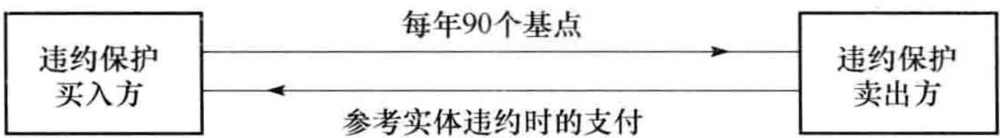
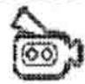
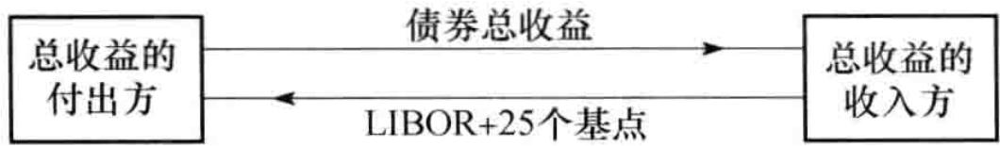
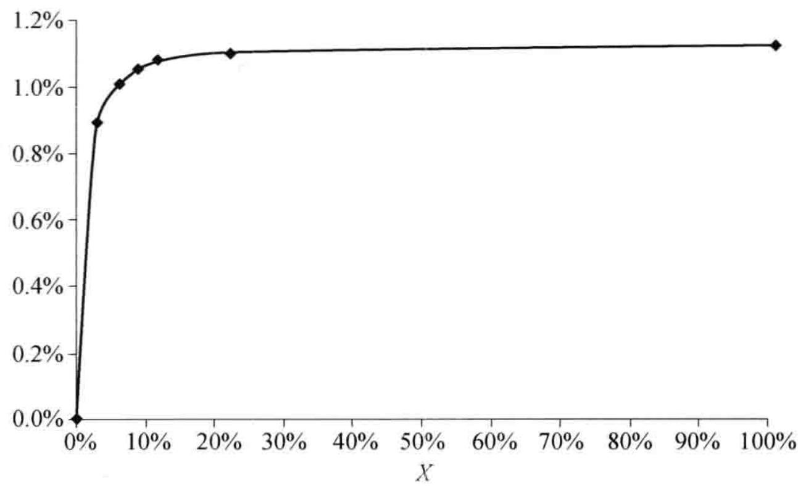
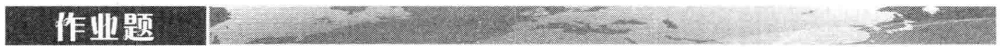

# 第25章 信用违约互换

在市场上最流行的信用衍生产品是信用违约互换（CDS）。这种合约是对某一特定公司违约的风险所提供的保险。这里所涉及的公司被称为参考实体（reference entity），而这个公司的违约被定义为信用事件（credit event）。在信用事件发生时，保险的买入方有权将违约公司的债券以面值的价格卖给保险的卖出方，而保险的卖出方则同意按面值的价格买进债券。 $^{①}$ 能够被卖出的债券总面值被称为 CDS 的名义本金（notional principal）。

CDS 的买入方定期向卖出方付款，直到 CDS 结束或信用事件发生。这里的定期付款通常是在每个季度末，但也有些交易规定定期付款的时间是在每月末、每半年末或者每年末，甚至可以提前付款。在违约事件发生后，合约的交割方式可能是交付债券实物或者是现金支付。

以下例子可以帮助我们理解 CDS 的结构。假如某两家公司在 2015 年 3 月 20 日签订 5 年期的信用违约互换，名义本金为 1 亿美元。为获得对某参考实体违约的保护，买入方同意每年付 90 个基点，每季度末付款一次。

图25-1 信用违约互换（CDS）

CDS 的结构如图25-1 中所示。如果参考实体没有违约（也就是没有信用事件发生），CDS 的买入方不会得到任何收益，并且在 2015 年 6 月和以后的每个季度末都支付 1 亿美元的 22.5 个基点（90 个基点的 1/4），直到 2020 年 3 月 20 日。每个季度所支付的数量为 $0.00225 \times 100000000$ ，或 $225000$ 美元。 $^{②}$ 当信用事件发生时，卖出方很可能需要向买入方支付一笔可观的赔偿。假设在 2018 年 5 月 20 日（在第 4 年里的 2 个月后）买入方通知卖出方有信用事件发生。如果合约指定的交割方式为实物交割，买入方有权以 1 亿美元的价格向卖出方出售面值为 1 亿美元、由参考实体所发行的债券。如果合约指定以现金形式交割（目前一般是这种方式），在信用事件发生后的几天内将会利用由国际互换与衍生工具协会（ISDA）组织的拍卖过程来确定最便宜可交割债券（cheapest deliverable bond）的市场中间价。假如通过拍卖确定了每 100美元本金的股票只值 35 美元，这时 CDS 卖出方必须向买入方支付 6500 万美元。

当信用事件发生后，信用保护的买入方向卖出方在每3个月、半年或一年的定期付款就会终止。但是，因为付款时间是期尾，通常买入方在最后仍然需要向卖出方支付最后的应计付款（accrual payment）。在我们的例子中，由于违约事件发生在2018年5月20日，买入方需要向卖出方支付由2018年3月20日到2018年5月20日之间的应计付款（大约为150000美元）。在这一次付款之后，买入方不再需要支付任何其他费用。

为了买入信用保护，买入方每年所付的资金数量作为名义本金的百分比被称为 CDS 的互换溢价（CDS spread）。CDS 市场的造市商是几家大银行。对于某公司 5 年 CDS 的报价，造市商可能会给出 250 个基点的买入价与 260 个基点的卖出价，这意味着造市商准备以每年 250 个基点（每年支付本金的 2.5%）买入这家公司的信用保护，同时也准备以每年收入 260 个基点（每年收入本金的 2.6%）卖出这家公司的信用保护。

许多不同的公司和国家可以成为在市场上交易的 CDS 合约参考实体。付款频率通常为每季度一次，付款时间为期尾。5 年期的 CDS 在市场上最为流行，但其他像 1 年、2 年、3 年、7 年和 10 年期的 CDS 在市场上也较为常见。合约的到期日通常是以下标准日期：3 月 20 日、6 月 20 日、9 月 20 日和 12 月 20 日。这种约定的结果是：在最初签订时，合约的真正期限年数与合约里所说的年数可能比较接近，但并不一定完全一致。假定你在 2015 年 11 月 15 日，你通知交易商要买入对某家公司 5 年期的信用保护，合约的有效期到 2020 年 12 月 20 日。你的第 1 次付款日为 2015 年 12 月 20 日，数量是基于 2015 年 11 月 15 日至 2015 年 12 月 20 日这一段时间。 $^{①}$ CDS 合约的关键是对违约事件的定义。违约事件通常为应当付款时未能支付、债务重组或破产。在北美的合约中，有时债务重组不算成违约事件（尤其是在公司债务有很高收益率的情形下）。业界事例 25-2 里有更多关于 CDS 市场的内容。

## 业界事例 25-2 CDS 市场

在 1998 年和 1999 年，国际互换与衍生工具协会（ISDA）为在场外交易市场上交易的 CDS 建立了标准合约。从此，这个市场飞速增长。在许多方面，CDS 合约与保险合约都很相似，但它们之间有一个关键区别：保险合约所保护的是买人方已经拥有资产的损失，而对 CDS 来讲，买方并不一定要拥有标的资产。

在 2007 年 8 月开始的信用危机期间，监管机构非常关心系统风险（见业界事例 2-3）。它们认为 CDS 是使金融市场动荡的原因之一。这些产品的危险之处在于，一家金融机构的违约可能会给予其之间有 CDS 交易的对手带来巨大损失，从而会进一步引起其他金融机构的违约。保险巨头 AIG 的麻烦更加重了它们的忧虑。这家公司是对由按揭贷款生成的 AAA 份额提供保险的大卖主（见[第8章](ch08.md)）。事实证明这些保护对 AIG 来讲是非常昂贵的，并且需要美国政府对其进行援助。

在 2007 年和 2008 年这两年中，虽然许多信用衍生产品都停止了交易，但 CDS 的交易却仍然很活跃（尽管购买保护的费用大幅度上涨）。相对其他信用衍生产品而言，CDS 的优点是结构很简单明了，而其他信用衍生产品（像由住房按揭贷款证券化所生成的产品，见第 8 章）却缺乏透明度。

在一家公司上的 CDS 合约规模超过其债务总额的情况并不罕见。这时候显然需要对合约进行现金交割。当雷曼在 2008 年 9 月违约时，雷曼债务上的 CDS 合约总量是 4000 亿美元，而雷曼公司尚未平仓的债务却只有 1550 亿美元。对 CDS 合约买入方支付的（通过 ISDA 拍卖确定）现金额为面值的 91.375%。

与本书中的其他场外交易衍生产品相比，CDS 有一个很大的区别：其他衍生产品价值所依赖的是利率、外汇兑换率、股指以及商品价格，等等。对于这些市场变量，我们没什么理由去假设一个市场参与者会比另一个拥有更多的信息。

信用违约互换溢价所依赖的是一家公司在某个特定时间段里违约的概率。对估计违约概率而言，一个市场参与者很有可能会比别人有更多信息。为一家公司出主意、提供贷款、处理发行新证券业务的金融机构会比另一家与这个公司之间没有业务往来的金融机构更了解该公司的信用状况。经济学家将这种现象称为信息不对称（asymmetric information）。金融机构常常会强调的是：做出购买对某家公司信用风险保护决定的是某个风险管理人员，而不是来源于和该公司之间有业务来往的其他部门所拥有的特殊信息。

# 第25章 CDS 与债券收益率

CDS 可以用来对冲企业债券头寸的风险。假定某投资者按面值的价格买入一个 5 年期、收益率为每年 7% 的企业债券，同时又签订了一份 5 年期 CDS 来获得对债券发行者违约时的保护。假定 CDS 的溢价为 200 个基点，即每年 2%。CDS 的作用是（至少在近似意义上）将企业债券转换成了无风险债券。如果债券发行人没有违约，投资者收益率为每年 5%（企业债券收益率减去 CDS 的溢价）。如果债券发行人违约，投资者在违约发生前的收益率为 5%。然后根据 CDS 合约的条款，投资者可以用债券换回债券的本金。投资者在收到本金后可以在 5 年的剩余时间内将资金以无风险利率进行投资。

这说明 $n$ 年期CDS溢价应该大约等于 $n$ 年的企业债券收益率与无风险利率的差价。如果CDS溢价远小于企业债券收益率与无风险利率的差价，那么投资者通过买入企业债券并购买信用保护而得出的收益率（近似于无风险）会大于无风险利率；如果CDS溢价远大于企业债券收益率与无风险利率的差价，投资者可以卖空企业债券并卖出信用保护而得到小于无风险利率的借款利率。

CDS 债券基点的定义是

\mathrm{CDS} \text{债券基点} = \mathrm{CDS} \text{溢价} - \text{债券溢差}
$$
其中债券溢差的计算是以 LIBOR/互换利率作为无风险利率的。在一般情况下，债券溢差取成资产互换的溢差。
$$

$$
上面的无套利论证说明 CDS 债券基点应当接近 0，但事实上有时这个值倾向于取正值（比如在 2007 年之前），有时会倾向于取负值（比如在 2007～2009 年）。在任何时间，CDS 基点的正负取决于所依赖的参考实体。
$$

$$
# 第25章 最便宜可交割债券
$$

$$
如24.3节解释的那样，债券的回收率等于债券在刚刚违约后的价格与面值的比率，这意味着CDS的收益等于 $L(1 - R)$ ，其中 $L$ 为面值， $R$ 为回收率。
$$

$$
在 CDS 合约中, 通常指定在违约时可以选择几种不同的债券用于交割, 这些债券的优先级别往往相同。但在违约发生后, 债券的卖价与本金的比率可能会有所不同。这样一来, CDS 给信用保护的买入方提供了选取某种最便宜可交割债券的期权。我们在前面已经提到过，最便宜交割债券的价值通常会由 ISDA 组织的拍卖程序来确定，这也就确定了信用保护买入方的收益。
$$

$$
## 25.2 CDS 定价
$$

$$
我们可以利用违约概率来估计关于特定参考实体的 CDS 溢价，下面的简单例子可以说明这一点。
$$

$$
假设参考实体在 CDS 的整个 5 年期限内的违约率都是每年 2%。表 25-1 给出了生存概率与无条件违约概率。由式（24-1），生存到时间 t 的概率是 $e^{-0.02t}$ ，在 1 年内违约的概率等于在年初的生存概率减去在年底的生存概率。例如，生存 2 年的概率是 $e^{-0.02 \times 2} = 0.9608$ ，而生存 3 年的概率是 $e^{-0.02 \times 3} = 0.9418$ ，因此在第 3 年内违约的概率是 0.9608 - 0.9418 = 0.0190。
$$

$$
表 25-1 无条件违约概率以及生存概率
$$

$$
<table><tr><td>时间(以年计)</td><td>生存到年底的概率</td><td>在年内违约的概率</td><td>时间(以年计)</td><td>生存到年底的概率</td><td>在年内违约的概率</td></tr><tr><td>1</td><td>0.9802</td><td>0.0198</td><td>4</td><td>0.9231</td><td>0.0186</td></tr><tr><td>2</td><td>0.9608</td><td>0.0194</td><td>5</td><td>0.9048</td><td>0.0183</td></tr><tr><td>3</td><td>0.9418</td><td>0.0190</td><td></td><td></td><td></td></tr></table>
$$

$$
我们接下来假设违约只会发生在1年的中间，并且在CDS中信用保护的付款时间是在每年的年底。我们还假定无风险利率为每年 $5\%$ （连续复利），回收率为 $40\%$ 。由此我们将计算过程分为3部分，计算结果显示在表25-2、表25-3和表25-4中。
$$

$$
表25-2 给出了CDS预期支付期望值的贴现值，在这里我们假定溢价为每年 $s$ ，名义本金为1美元。例如，第3次数量为 $s$ 的付款发生的概率为0.9418，因此付款数量的期望值为0.9418s，贴现值为 $0.9418se^{-0.05 \times 3} = 0.8106s$ 。所有付款期望值的贴现总和为4.0728s。
$$

$$
表 25-2 预期支付贴现值（数量 = 每年 s）
$$

$$
<table><tr><td>时间(以年计)</td><td>生存概率</td><td>预期付款</td><td>贴现因子</td><td>预期付款的贴现值</td></tr><tr><td>1</td><td>0.9802</td><td>0.9802s</td><td>0.9512</td><td>0.9324s</td></tr><tr><td>2</td><td>0.9608</td><td>0.9608s</td><td>0.9048</td><td>0.8694s</td></tr><tr><td>3</td><td>0.9418</td><td>0.9418s</td><td>0.8607</td><td>0.8106s</td></tr><tr><td>4</td><td>0.9231</td><td>0.9231s</td><td>0.8187</td><td>0.7558s</td></tr><tr><td>5</td><td>0.9048</td><td>0.9048s</td><td>0.7788</td><td>0.7047s</td></tr><tr><td>总计</td><td></td><td></td><td></td><td>4.0728s</td></tr></table>
$$

$$
表 25-3 预期收益的贴现值（名义本金 =1 美元）
$$

$$
<table><tr><td>时间(以年计)</td><td>违约概率</td><td>回收率</td><td>预期收益</td><td>贴现因子</td><td>预期收益的贴现值</td></tr><tr><td>0.5</td><td>0.0198</td><td>0.4</td><td>0.0119</td><td>0.9753</td><td>0.0116</td></tr><tr><td>1.5</td><td>0.0194</td><td>0.4</td><td>0.0116</td><td>0.9277</td><td>0.0108</td></tr><tr><td>2.5</td><td>0.0190</td><td>0.4</td><td>0.0114</td><td>0.8825</td><td>0.0101</td></tr><tr><td>3.5</td><td>0.0186</td><td>0.4</td><td>0.0112</td><td>0.8395</td><td>0.0094</td></tr><tr><td>4.5</td><td>0.0183</td><td>0.4</td><td>0.0110</td><td>0.7985</td><td>0.0088</td></tr><tr><td>总计</td><td></td><td></td><td></td><td></td><td>0.0506</td></tr></table>
$$

$$
表 25-3 给出了对应于名义本金为 1 美元的预期收益贴现值。在前面我们已经假设违约事件总是在年中发生。例如，收益发生在第 3 年年中的概率为 0.0190，因为回收率为 40%，所以对应于第 3 年年中的预期收益为 $0.0190 \times 0.6 \times 1 = 0.0114$ 美元，贴现值为 $0.0114e^{-0.05 \times 2.5} = 0.0101$ 美元。收益期望贴现值的总和为 0.0506 美元。
$$

$$
表 25-4 给出了计算的最后一步。在这里我们计算在违约时的应计付款（accrual payment）。例如，违约发生在第 3 年年中的概率为 0.0190，而此时对应的累积应计付款的期限为半年，所以应计付款的数量为 0.5s，对应这一时间段的应计付款期望值为 $0.0190 \times 0.5s = 0.0095s$ ，贴现值为 $0.0095se^{-0.05 \times 2.5} = 0.0084s$ ，应计付款期望值的贴现值为 0.0422s。
$$

$$
表 25-4 应计付款的贴现值
$$

$$
<table><tr><td>时间(以年计)</td><td>违约概率</td><td>预期应计付款</td><td>贴现因子</td><td>预期应计付款的贴现值</td></tr><tr><td>0.5</td><td>0.0198</td><td>0.0099s</td><td>0.9753</td><td>0.0097s</td></tr><tr><td>1.5</td><td>0.0194</td><td>0.0097s</td><td>0.9277</td><td>0.0090s</td></tr><tr><td>2.5</td><td>0.0190</td><td>0.0095s</td><td>0.8825</td><td>0.0084s</td></tr><tr><td>3.5</td><td>0.0186</td><td>0.0093s</td><td>0.8395</td><td>0.0078s</td></tr><tr><td>4.5</td><td>0.0183</td><td>0.0091s</td><td>0.7985</td><td>0.0073s</td></tr><tr><td>总计</td><td></td><td></td><td></td><td>0.0422s</td></tr></table>
$$

$$
由表 25-2 和表 25-4 我们得出支付期望值的贴现值为
$$
4.0728 s + 0.0422 s = 4.1150 s
$$

由表 25-3，收益期望值的贴现值为 0.0506 美元。令两者相等

$$
4.1150 s = 0.0506
$$
即 $s = 0.0123$ 。因此我们所考虑的5年期CDS溢价的市场中间价为0.0123乘以名义本金，或每年123个基点。这个结果也可以由DerivaGem里的CDS计算表产生。
$$

$$
在以上的计算里我们假设违约事件只可能发生在付款日之间的中间。尽管在一般情况下这个简单假设就可以给出较好的结果，但我们仍可以很容易地将结果推广到违约可能发生在更多时间点上的情形。
$$

$$
## 25.2.1 对 CDS 按市值计价
$$

$$
与其他形式的互换一样，对 CDS 每天都按市值定价。CDS 的价值可能是正，也可能是负。假设在我们例子中的 CDS 是在一段时间之前签订的，溢价是 150 个基点，这时买方所支付的费用为 $4.1150 \times 0.0150 = 0.0617$ ，收益期望值的贴现值为 $0.0506$ 。对于信用卖出方来讲，这一 CDS 的价值为 $0.0617 - 0.0506 = 0.0111$ ，即名义本金的 $0.0111$ 倍。对于信用保护的买入方而言，这一 CDS 按市场计价的价值为面值的 $-0.0111$ 倍。
$$

$$
## 25.2.2 估计违约概率
$$

$$
在 CDS 定价中，我们采用的违约概率应该是风险中性违约概率，而不是现实世界里的违约概率（关于这两个概率的差别，见第 24.5 节中的讨论）。在 24 章中我们曾解释过如何从债券价格或资产互换价格来估计风险中性违约概率。另外一种方法是从 CDS 的报价中隐含出违约概率的估计值。这一方式类似于在期权市场上交易商从比较活跃的期权价格中计算隐含波动率的做法。
$$

$$
在表 25-2、表 25-3 和表 25-4 中的例子中，假设我们并不知道违约概率，但已知市场上 5 年期 CDS 的报价为每年 100 个基点。（利用 Excel 里的 Solver）我们可以逆向计算出隐含违约概率为每年 1.63%。利用 DerivaGem，我们可以通过信用溢差期限结构来计算违约率的期限结构。
$$

$$
## 25.2.3 两点信用互换
$$

$$
两点信用互换（binary credit default swap）与普通的 CDS 相似，不同之处是它的收益为一个固定的值。假设在表 25-1 \~ 表 25-4 的例子中对应的收益为 1 美元（而不是 $1 - R$ ），将两点 CDS 的溢价记为 $s$ ，表 25-1、表 25-2 和表 25-4 均不变，但由表 25-5 代替表 25-3。新的两点 CDS 溢价由 4.1150s = 0.0844 给出，由此 $s = 0.0205$ ，即 205 个基点。
$$

$$
表 25-5 由两点 CDS 来计算预期收益的贴现值（本金 =1 美元）
$$

$$
<table><tr><td>时间(以年计)</td><td>违约概率</td><td>预期收益</td><td>贴现因子</td><td>预期收益的贴现值</td></tr><tr><td>0.5</td><td>0.0198</td><td>0.0198</td><td>0.9753</td><td>0.0193</td></tr><tr><td>1.5</td><td>0.0194</td><td>0.0194</td><td>0.9277</td><td>0.0180</td></tr><tr><td>2.5</td><td>0.0190</td><td>0.0190</td><td>0.8825</td><td>0.0168</td></tr><tr><td>3.5</td><td>0.0186</td><td>0.0186</td><td>0.8395</td><td>0.0157</td></tr><tr><td>4.5</td><td>0.0183</td><td>0.0183</td><td>0.7985</td><td>0.0146</td></tr><tr><td>总计</td><td></td><td></td><td></td><td>0.0844</td></tr></table>
$$

$$
## 25.2.4 回收率有多么重要
$$

$$
无论我们是采用 CDS 溢价还是债券价格来估计违约概率，我们都要有一个回收率的估计值，但是如果我们采用同样的回收率来估算风险中性违约概率和计算 CDS 价格，那么我们得出的 CDS 价值（或 CDS 溢价）对回收率的敏感性并不是很强，这是因为隐含违约概率大约同 $1 / (1 - R)$ 成比例，而 CDS 的收益大约同 $1 - R$ 成比例。
$$

$$
以上讨论对两点 CDS 的定价并不成立。隐含违约概率仍然大约同 $1 / (1 - R)$ 成比例，但是两点 CDS 的收益与 $R$ 无关。如果已知普通 CDS 和两点 CDS 的溢价，我们可以同时对回收率和违约概率进行估计（见作业题 25.24）。
$$

$$
## 25.3 信用指数
$$

$$
在信用衍生产品市场上，参与者已经构造了一些用于跟踪 CDS 溢价变化的信用指数。在 2004 年，不同的指数构造者达成了共识，从而使一些指数相互合并。指数提供者使用的两种最重要的标准交易组合如下。
$$

$$
(1) CDX NA IG: 由北美 125 家投资级公司组成的组合。
$$

$$
(2) iTraxx 欧洲: 由欧洲 125 家投资级公司组成的组合。
$$

$$
这些交易组合在每年的3月20日和9月20日被更新。在指数中将会除去不再具备投资等级的公司，同时加入新的投资级公司。 $^{①}$
$$

$$
假如某造市商对5年期CDX NA IG指数报出的买入价为65个基点，卖出价为66个基点（这被称为指数溢差）。粗略地讲，这表示一个交易员可以按每家公司都为66个基点的价格买入125家公司的CDS保护。假设一个交易员想对每家公司都取得面值为800000美元的保护，交易员的总费用为 $0.0066 \times 800000 \times 125$ ，即每年660000美元。类似地，交易员也可以按每年650000美元的价格卖出125家公司中每家面值为800000美元的信用保护。当某个公司违约时，信用保护的买入方会得到像通常一样的CDS收益，而且付款费用每年会减少 $660000 / 125 = 5280$ 美元。期限为3年、5年、7年和10年的CDS指数保护的买卖市场非常活跃。在指数上这些类型合约的到期日通常为12月20日和6月20日（这意味着，5年合约的期限实际是在 $4\frac{3}{4}$ 年和 $5\frac{1}{4}$ 年之间）。粗略地讲，指数值等于标的资产组合所包含公司的CDS溢价平均值。
$$

$$
## 25.4 固定券息的使用
$$

$$
CDS 和 CDS 指数交易的具体运作方式比以上的描述要更复杂一些。对于每个标的以及每个期限，都要指定券息和回收率。由指数溢价的报价，通过以下程序来计算价格：
$$

$$
(1) 每年付款 4 次，期末付款。
$$

$$
(2) 从溢价的报价隐含出一个违约率。计算过程与 25.2 节中相似，通过迭代可以求出与溢价报价相匹配的违约率。
$$

$$
(3) 计算 CDS 付款的 “久期” 值 $D$ 。久期值与溢价的乘积等于付款的贴现值（在 25.2 节里的例子中，久期值等于 4.1150）。
$$

$$
(4) 价格 $P$ 由公式 $P = 100 - 100 \times D \times (s - c)$ 给出, 其中 $s$ 为指数溢价, $c$ 为以小数形式表示的券息值。
$$

$$
当交易员买入信用保护时, 交易员对每 100 美元的剩余名义本金需支付 $100 - P$ , 信用保护的卖出方收取这一数量 (如果 $100 - P$ 为负值, 信用保护的买入方会收入款项, 信用保护的卖出方会支付款项)。在每个付款日, 信用保护的买入方需要向卖出方支付数量等于券息乘以剩余名义本金的款项 (对 CDS, 在未违约之前剩余名义本金等于原来名义本金的数量, 违约后名义本金为 0; 对 CDS 指数, 剩余名义本金等于指数中尚未违约公司的数量乘以每家公司的面值份额)。在违约事件发生时的收益按通常的方式计算。以上的安排便于进行交易, 这是因为交易方式与债券相同。信用保护买入方在每季度正常付款的数量与买入方刚签订合约时的溢价无关。
$$

$$
## 例 25- 1
$$

$$
假定 iTraxx 欧洲指数的报价为 34 个基点，券息为 40 个基点，期限为正好 5 年。这里的报价约定均为“实际天数/360”（这是 CDS 和 CDS 指数市场的通常约定）。在“实际天数/实际天数”约定下，指数的等价数量为 0.345%，关于券息的等价数量是 0.406%。假定收益率曲线呈水平状，为每年 4%（实际天数/实际天数，连续复利），指定的回收率为 40%，对应于每年付款 4 次、期末付款的隐含违约率为 0.5717%，久期值为 4.447 年。因此，价格等于
$$
100 - 100 \times 4.447 \times (0.00345 - 0.00406) = 100.27
考虑一个合约，其中对每个参考实体所保护的面值为100万。在合约开始时，信用保护的卖出方需向买入方支付 $1\ 000\ 000 \times 125 \times 0.0027$ 美元。此后买入方在每个季度末付款，付款的年率为 $1\ 000\ 000 \times 0.004\ 06 \times n$ ，其中n为指数中尚未违约公司的个数。当一家公司违约时，我们采用通常的方式来计算收益，而信用保护买入方需向卖出方支付累计利息，计算时所用利率为0.406%，面值为100万美元。

## 25.5 CDS 远期合约与期权

一旦 CDS 市场的发展趋于完善，衍生产品交易商自然会开始交易信用违约互换溢价上的远期合约和期权。 $^{①}$

信用违约互换远期合约是一种契约：在将来某个特定时间 T，签约者需要买入或卖出有关某个特定参考实体的特定信用违约互换。如果参考实体在时间 T 之前违约，远期合约自动失效。例如，某银行可以签订在 1 年后按 280 个基点卖出关于某公司 5 年期信用保护的远期合约。如果这家公司在一年内违约，远期合约将会自动失效。

信用违约互换期权是一种权利：在将来某个特定时间 $T$ ，期权持有者有权买入或卖出有关某个特定参考实体的特定信用违约互换。例如，一个投资者可以购买在1年后按280个基点的价格买入关于某公司5年期信用保护的权利。这是一种看涨期权。如果在1年后，这家公司的5年期CDS溢价高于280个基点，期权将会被行使，否则期权不会被行使。期权的费用要在期权交易成交时付清。类似地，一个投资者可以购买在1年后按280个基点的价格卖出关于某公司5年期信用保护的权利，这是一种看跌期权。如果在1年后这家公司的CDS溢价低于280个基点，期权将会被行使，否则期权不会被行使，期权的费用也必须在交易成交时付清。与CDS远期合约一样，如果在期权到期之前参考实体违约，CDS期权合约将会自动失效。

## 25.6 篮筐式CDS

在篮筐式 CDS（basket credit default swap）中有多个参考实体。附加篮筐式 CDS（add-up basket credit default swap）在任何一家参考实体违约时均提供违约赔偿。第 1 次违约篮筐式 CDS（first-to-default basket credit default swap）只对参考实体中的首次违约提供赔偿，第 2 次违约篮筐式 CDS（second-to-default basket credit default swap）只对参考实体中的第 2 次违约提供赔偿。在一般情况下，第 k 次违约篮筐式 CDS（kth-to-default basket credit default swap）只对参考实体中出现的第 k 次违约提供赔偿。以上的违约赔偿与一般 CDS 的违约赔偿方式相同。

在与合约有关的违约事件出现后，合约双方进行交割处理，然后合约自行解除，双方都不再需要任何其他付款。

## 25.7 总收益互换

总收益互换（total return swap）是一种信用衍生产品，这是将某个债券（或任何资产组合）的总收益与 LIBOR 加上一个差价相交换的互换合约。资产的总收益包括券息、利息以及在互换期限内资产的盈亏。

例如，一个5年期总收益互换的名义本金为1亿美元，互换的一方将某企业债券的收益同另一方LIBOR+25个基点进行交换。这一衍生产品的形式如图25-2中所示：在券息支付日期，总收益付出方将1亿美元债券所收入的券息付给总收益收入方，同时收入方将利率为LIBOR+25个基点时1亿美元面值的利息付给互换总收益付出方（LIBOR在券息日设定，但相应利息在下一个券息日付出，这与标准利率互换是一样的）。在互换合约结束时将会有最后一次付款来反映债券价值的变化。例如，如果债券在互换期限内价值增长了 $10\%$ ，在5年后总收益互换的付出方需要向收入方支付1000万美元（1亿美元的 $10\%$ ）；如果债券价值降低了 $15\%$ ，总收益互换的收入方在5年时需要向付出方支付1500万美元。如果债券违约，总收益互换合约将会停止，但是总收益互换的收入方必须向付出方支付债券市场价格与1亿美元的差额。

如果在合约结束的时间点上对双方均加上名义本金，我们可以这样理解总收益互换：总收益的付出方支付由1亿美元公司债券投资所收入的现金流，总收益的收入方支付由面值为1亿美元、利率为LIBOR+25个基点的债券所收入的现金流。如果付出方拥有公司债券，总收益互换可以将债券的信用风险转让给收入方。如果付出方不拥有债券，总收益互换可以使其达到卖空债券的目的。

总收益互换常常被当作融资工具。以下情形会产生图25-2 所示的总收益互换合约：总收益的收入方为了对参考债券的 1 亿美元投资进行融资，从而与付出方（可能是金融机构）达成一项总收益互换协议。然后总收益付出方买入 1 亿美元的债券。对于总收益收入方而言，这样做的结果与按 LIBOR + 25 个基点的利息贷款并买进债券是等价的。在总收益互换协议中，付出方在互换期限内仍然拥有债券的所有权。但对付出方而言，这样做比直接借钱给收入方来买入债券并以债券作为抵押品所面临的对手信用风险要小。如果总收益的收入方违约，付出方不用面临因抵押品的所有权问题而可能带来的法律纠纷。总收益互换与再回购协议（repos）（见第 4.1 节）相似，它们的构造方式是为了减小融资时的信用风险。

图25-2 总收益互换

在总收益互换中，由于总收益收入方有违约的可能性，在 LIBOR 之上的差价是对总收益付出方所承受的这种违约风险的补偿。当参考债券价格下跌时，总收益互换收入方的违约将会给付出方带来损失，因此这一差价依赖于总收益互换收入方的信用状态、债券发行者的信用状态以及两者之间的相关性。

以上描述的标准交易有几种不同形式。有时候在互换结束时，反映债券价格变化的现金付款可以由资产的实际交割而代替。在这种情况下，总收益付出方在互换的到期日以标的资产换回名义本金。有时反映债券价格变化的支付会定期进行（而不是全等到互换结束时才支付）。

## 25.8 债务抵押债券

在[第8章](ch08.md)里我们讨论了资产支持证券（ABS）。图8-1给出了这种产品的一种简单结构。当标的资产为债券时，这样的ABS称为债务抵押债券（collateralized debt obligations，CDO）。债券的利息与本金可以用与图8-2相似的瀑布形式来定义。尽管瀑布形式的精确规则很复杂，但其设计原则是高级份额比低级份额更可能收到所许诺的利息和本金。

## 25.8.1 合成 CDO

当 CDO 是按照以上所述形式由债券组合产生时, 所得结构称为现金 CDO (cash CDO)。信用产品市场上的重要发展是人们意识到, 如果在 CDS 中的参考实体是一家发行债券的公司, 那么持有企业债券的长头寸与持有以发行债券的企业作为参考实体的 CDS 短头寸 (即在 CDS 中卖出信用保护) 具有相似的风险。由此产生了合成 CDO (synthetic CDO) 的结构, 而且这种结构变得很受欢迎。

合成 CDO 的发起者首先选取一个公司组合与结构的期限（比如 5 年），然后出售组合中每家公司的 CDS 保护（CDS 的期限与结构的期限相等）。合成 CDO 的本金等于其中所有 CDS 名义本金的总和。发起者收入的现金流等于 CDS 的溢价，而当组合中的公司违约时将会支出现金流。在构造合成 CDO 时将会形成不同的份额（tranche），现金的流入和流出将会分配到份额里，而且合成 CDO 中现金流入与流出分配的规则比现金 CDO 要更直截了当。假定只有 3 个份额：股权、中间和高级份额。规则可能会采取以下的形式：

(1) 股权份额承担 CDS 的支付, 直到高达合成 CDO 本金的 $5\%$ , 股权份额收取份额本金剩余数量上每年 1000 个基点的差价。

(2) 中间份额承担超过合成 CDO 本金 $5\%$ ，但最多不超过 $20\%$ 的支出。该份额收取份额本金剩余数量上每年 100 个基点的差价。

(3) 高级份额承担超过合成 CDO 本金 $20\%$ 的支出。该份额收取份额本金剩余数量上每年 10 个基点的差价。

为了理解合成 CDO 是如何运作的，假设本金为 1 亿美元。股权份额、中间份额和高级份额的面值分别为 500 万美元、1500 万美元和 8000 万美元。在刚开始，份额挣取在这些名义本金上预先指定的溢差。假设在 1 年后，由于组合中一些公司的违约而导致对 CDS 有 200 万美元的支付，股权份额持有者负责这些支付。股权份额的本金降到了 300 万美元，因此 1000 个基点的差价是基于 300 万美元的本金（而不是最初的 500 万美元）。如果在 CDO 有效期的后期，对 CDS 又有 400 万美元的支付，这时股权份额的累计支付数目是 500 万美元，因此其剩余本金为 0。中间份额将需要支付余下的 100 万美元，其剩余份额降到了 1400 万美元。

现金 CDO 在刚开始时需要份额持有者的投资（用于购买标的债券）。与此相反，合成 CDO 持有者并不需要在开始时做任何投资，他们仅仅需要同意如何计算现金的流入和流出就够了。在实际中，一般总是要求他们将最初的份额本金作为抵押。当一个份额要对 CDS 的支付负责时，所需要的金额将会从抵押金里扣除。抵押金账户里的剩余金额会挣得利率等于 LIBOR 的利息。

## 25.8.2 标准组合与单份额交易

在上述的合成 CDO 里，份额持有者将信用保护卖给了 CDO 的发行人，而 CDO 发行人会转身将 CDS 上的保护卖给其他的市场参与者。市场上的一种革新是在没有构造标的 CDS 短头寸组合的情况下对份额进行交易。有时称这种交易为单份额交易（single tranche trading）。交易里有两方：份额保护的买入方和份额保护的卖出方。CDS 短头寸的组合被用来作为确定双方之间现金流的参考，但并没有真正建立起来。保护的买入方将份额差价支付给卖出方，而保护的卖出方支付给买入方的金额相应于在参考组合中份额所负责的损失。

在第 25.3 节里我们讨论了像 CDX NA IG 和 iTraxx 欧洲这样的 CDS 指数，在市场上投资人也利用这些指数里的标的组合来定义标准合成 CDO 的份额，而且这种产品的交易非常活跃。在 iTraxx 欧洲指数中 6 个标准份额分别负责 0 \~ 3%、3% \~ 6%、6% \~ 9%、9% \~ 12%、12% \~ 22% 和 22% \~ 100% 的损失。CDXNAIG 中的 6 个标准份额分别负责 0 \~ 3%、3% \~ 7%、7% \~ 10%、10% \~ 15%、15% \~ 30% 和 30% \~ 100% 的损失。

表 25-6 显示的是在连续 3 年中的 1 月底对 5 年期 iTraxx 份额的报价。如第 25.3 节所述，指数的差价是对指数中所有公司购买保护所需要的以基点计算的费用。除了 0～3% 份额外，份额的报价是指购买份额保护每年以基点计算的费用（在前面解释过，当份额经历损失后，计算费用时的本金将会减少）。对于 0～3%（股权）份额，保护购买方预先支付一笔费用，然后每年支付剩余份额本金上 500 个基点。表中的报价是指预先支付的数量作为初始份额本金的百分比。

表 25-6 iTraxx 欧洲指数 5 年期份额的中间市场报价。除了 0\~3% 份额外，表中标价均为基点数，0\~3% 份额的标价等于必须预先支付的份额面值百分比，另外再加上每年收费 500 个基点

<table><tr><td rowspan="2">日期</td><td colspan="5">份额</td><td rowspan="2">iTraxx指数</td></tr><tr><td>0~3%</td><td>3%~6%</td><td>6%~9%</td><td>9%~12%</td><td>12%~22%</td></tr><tr><td>2007年1月31日</td><td>10.34</td><td>41.59</td><td>11.95</td><td>5.60</td><td>2.00</td><td>23</td></tr><tr><td>2008年1月31日</td><td>30.98</td><td>316.90</td><td>212.40</td><td>140.00</td><td>73.60</td><td>77</td></tr><tr><td>2009年1月31日</td><td>64.28</td><td>1185.63</td><td>606.69</td><td>315.63</td><td>97.13</td><td>165</td></tr></table>

资料来源：Creditex Group Inc.

信用市场在短短两年之内可能会经历巨大变化。表 25-6 显示信用紧缩导致了信用溢差的暴涨。iTraxx 指数从 2007 年 1 月份的 23 个基点涨到了 2009 年 1 月份的 165 个基点。每个份额的报价也显出了巨大幅度的上升。出现这些变化的原因之一是市场对投资级公司违约概率的估计增加了。另外一个原因是在许多情形下保护卖出方也遭遇了流动性危机，因此变得更加小心，从而要求更高的风险溢价来补偿所承受的风险。

## 25.9 相关系数在篮筐式 CDS 与 CDO 中的作用

第 $k$ 次违约CDS保护的费用和CDO份额的溢价都与违约相关性密切相关。假如以含有100个参考实体的组合为基础定义了一个5年期、对第 $k$ 次信用违约CDS提供保护的产品，其中每一个参考实体在今后5年内违约的风险中性概率为 $2\%$ 。当参考实体的违约相关性为0时，由两项分布得出在今后5年内有至少有一个参考实体出现违约的概率为 $86.74\%$ ，我们也可以得出在今后5年内至少有10个参考实体出现违约的概率为 $0.0034\%$ 。由此可见对第一次违约

CDS 保护的价格会很高，而对第 10 次违约保护的价格几乎为 0。

随着违约相关性的增加，出现1个或多个参考实体违约的概率会随之降低，而10个或更多参考实体违约的概率会随之增大。在参考实体相关性为完美（等于1）的极端情形下，1个或更多参考实体违约的概率与10个或更多参考实体违约的概率均为 $2\%$ ，这是因为在这种极端情形下所有的参考实体基本上都是一样的，因此要么所有的参考实体一起违约（概率为 $2\%$ ），要么任何参考实体均不违约（概率为 $98\%$ ）。

与此相似，合成 CDO 份额的价值也同样与违约相关性密切相关。当相关性较低时，低级股权份额风险较大，高级份额非常安全。当相关性增加时，低级份额风险会减小，而高级份额风险将会增大。在具有完美相关性和回收率为 0 的极端情形下，所有份额将具有相同的风险。

## 25.10 合成 CDO 的定价

DerivaGem 软件可以用来对合成 CDO 定价。为了解释计算过程，假定合成 CDO 份额的付款时间为 $\tau_{1}, \tau_{2}, \cdots, \tau_{m}$ 和 $\tau_{0}=0$ 。定义 $E_{j}$ 为在时刻 $\tau_{j}$ 份额面值数量的期望值， $v(\tau)$ 为在时刻 $\tau$ 收取 1 美元的贴现值。假定关于特定份额的溢价（即为了买入信用保护所支付的基点数）为每年 s，该溢价应用于剩余份额面值上。CDO 的预期正常付费贴现值为 sA，其中

A = \sum_{j = 1} ^{m} (\tau_{j} - \tau_{j-1}) E_{j} v (\tau_{j})\tag{25-1}

时刻 $\tau_{j-1}$ 与 $\tau_{j}$ 之间损失的期望值为 $E_{j-1} - E_{j}$ 。假定损失发生在时间段的中间点（即在时刻 $0.5\tau_{j-1} + 0.5\tau_{j}$ ）。CDO份额的收益期望贴现值为

$$
C = \sum_{j = 1} ^{m} (E_{j-1} - E_{j}) v (0.5 \tau_{j-1} + 0.5 \tau_{j})\tag{25-2}
$$

损失发生时的应计付款为 sB，其中

$$
B = \sum_{j = 1} ^{m} 0.5 (\tau_{j} - \tau_{j-1}) (E_{j-1} - E_{j}) v (0.5 \tau_{j-1} + 0.5 \tau_{j})\tag{25-3}
$$

对于信用保护的买入方而言，份额的价值为 $C - sA - sB$ ，两平溢价（breakeven spread）是指付款贴现值等于收益贴现值时的情形，即

$$
C = s A + s B
$$

因此，两平溢价满足以下方程

$$
s = \frac{C}{A + B}\tag{25-4}
$$

式（25-1）\~式（25-3）展示了份额面值期望在计算两平溢价时所起的关键作用。如果对于所有付款日我们都已知份额面值期望，另外假定零息收益率曲线也为已知，那么我们可以通过式（25-1）\~式（25-4）来计算两平溢价。

## 25.10.1 利用违约时间的高斯 Copula 模型

在24.9节中，我们引入了关于违约时间的单因子高斯Copula模型，这是关于合成CDO定价的标准市场模型。假定到时间 $t$ 所有公司都具有相同的违约概率 $Q(t)$ ，式（24-9）将这个到时间 $t$ 的无条件违约概率转换成到时间 $t$ 之前在因子 $F$ 条件下违约的概率

$$
Q (t \mid F) = N \left(\frac{N^{- 1} [ Q (t) ] - \sqrt{\rho} F}{\sqrt{1 - \rho}}\right)\tag{25-5}
$$

其中 $\rho$ 为 Copula 相关系数。这里假定了所有公司之间的相关系数都是相同的。

在计算 $Q(t)$ 时, 通常假定公司的违约率为常数, 并与指数的溢价一致。通过第 25.2 节中的 CDS 定价公式, 我们可以求出违约率, 在求解过程中我们需要保证求到的违约率与指数的溢价相匹配。假定违约率为 $\lambda$ , 由式 (24-1) 得出

$$
Q (t) = 1 - \mathrm{e}^{- \lambda t}\tag{25-6}
$$

由两项式分布的性质，标准市场模型给出了正好有 k 个公司违约的概率为（在 F 的条件下）

$$
P (k, t \mid F) = \frac{n !}{(n - k) ! k !} Q (t \mid F) ^{k} [ 1 - Q (t \mid F) ] ^{n - k}\tag{25-7}
$$

其中 $n$ 为合成 CDO 中参考实体的总数量。假定这里考虑的份额所覆盖的资产组合损失范围为 $\alpha_{L}$ 至 $\alpha_{H}$ , 参数 $\alpha_{L}$ 被称为附着点 (attachment point), 参数 $\alpha_{H}$ 被称为离开点 (detachment point)。定义

$$
n_{_ L} = \frac{\alpha_{_ L} n}{1 - R} \text{和} n_{_ H} = \frac{\alpha_{_ H} n}{1 - R}
$$

其中 $R$ 为回收率。再有，定义 $m(x)$ 为大于 $x$ 的最小整数。在不失一般性的前提下，我们可以假设份额的最初面值为1。当违约数量 $k$ 小于 $m(n_{L})$ 时，份额面值为1；当违约数量 $k$ 大于或等于 $m(n_{H})$ 时，份额面值为0；在其他情形下，份额的面值为

$$
\frac{\alpha_{H} - k (1 - R) / n}{\alpha_{H} - \alpha_{L}}
$$

定义 $E_{j}(F)$ 为在给定因子 $F$ 值的条件下, 份额面值在时刻 $\tau_{j}$ 的期望值, 因此

$$
E_{j} (F) = \sum_{k = 0} ^{m (n_{L}) - 1} P (k, \tau_{j} | F) + \sum_{k = m (n_{L})} ^{m (n_{H}) - 1} P (k, \tau_{j} | F) \frac{\alpha_{H} - k (1 - R) / n}{\alpha_{H} - \alpha_{L}}\tag{25-8}
$$

定义 $A(F)$ 、 $B(F)$ 和 $C(F)$ 分别为在 $F$ 条件下 $A$ 、 $B$ 和 $C$ 的值。与式（25-1）\~式（25-3）类似，我们有

$$
A (F) = \sum_{j = 1} ^{m} (\tau_{j} - \tau_{j-1}) E_{j} (F) v (\tau_{j})\tag{25-9}
$$

$$
B (F) = \sum_{j = 1} ^{m} 0.5 (\tau_{j} - \tau_{j-1}) (E_{j-1} (F) - E_{j} (F)) v (0.5 \tau_{j-1} + 0.5 \tau_{j})\tag{25-10}
$$

$$
C (F) = \sum_{j = 1} ^{m} \left(E_{j-1} (F) - E_{j} (F)\right) v \left(0.5 \tau_{j-1} + 0.5 \tau_{j}\right)\tag{25-11}
$$

变量 F 服从标准正态分布。为了计算 A、B 和 C 的无条件值，我们必须对 $A(F)$ 、 $B(F)$ 和 $C(F)$ 在标准正态分布下进行积分。一旦求得无条件值后，两平溢价等于 $C/(A+B)$ 。

积分的计算最好是通过高斯求积公式（Gaussian quadrature）来完成。计算过程中涉及以下近似式

$$
\int_{- \infty} ^{+ \infty} \frac{1}{\sqrt{2 \pi}} \mathrm{e}^{- F^{2} / 2} g (F) \mathrm{d}F \approx \sum_{k = 1} ^{M} w_{k} g (F_{k})\tag{25-12}
$$

以上公式的精确程度随着 M 的增大而增大。对于不同的 M，作者网页上给出了参数 $w_{k}$ 和 $F_{k}$ 的取值。 $^{②}$ 这里的 M 是 DerivaGem 里 “积分点数”（number of integration points）的 2 倍。一般情况

下将积分点数设成 20 就足够了。

例 25-2

考虑 iTraxx 欧洲的中间份额（5 年期限），Copula 相关系数为 0.15，回收率为 40%。这时， $\alpha_{L}=0.03,\quad\alpha_{H}=0.06,\quad n=125,\quad n_{L}=6.25$ 以及 $n_{H}=12.5$ 。我们假设利率期限结构呈水平状，为 3.5%，付款频率为每季度一次，指数的 CDS 溢价为 50 个基本点。采用与 25.2 节中类似的计算方式，可以得到与 CDS 溢价相对应的常数违约率为 0.83%（连续复合）。其他计算的摘要列举在表 25-7 中。在式（25-12）中的 M=60，因子 $F_{k}$ 和权重 $w_{k}$ 的取值列在表的最上部；在因子取值的条件下，利用式（25-5）～式（25-8）所得到的份额面值期望值列在表的第二部分里；在因子取值的条件下，由式（25-9）～式（25-11）所得到的 A，B 和 C 的取值列在表的后三部分里：变量 A，B 和 C 的无条件值是通过在 F 概率分布上对 $A(F)$ 、 $B(F)$ 和 $C(F)$ 进行积分而得出的。计算过程是在式（25-12）中轮流将 $g(F)$ 换成 $A(F)$ 、 $B(F)$ 和 $C(F)$ 。计算结果为

$$
A = 4.2846, \quad B = 0.0187, \quad C = 0.1496
$$

两平溢价为 $0.1496/(4.2846+0.0187)=0.0348$ ，即 384 个基点。

表 25-7 例 25-2 中 CDO 的定价

<table><tr><td colspan="7">比重和价值</td></tr><tr><td> $w_k$ </td><td>...</td><td>0.1579</td><td>0.1579</td><td>0.1342</td><td>0.0969</td><td>...</td></tr><tr><td> $F_k$ </td><td>...</td><td>0.2020</td><td>-0.2020</td><td>-0.6060</td><td>-1.0104</td><td>...</td></tr><tr><td colspan="7">面值期望 $E_j(F_k)$ </td></tr><tr><td colspan="7">时间</td></tr><tr><td>j=1</td><td>...</td><td>1.0000</td><td>1.0000</td><td>1.0000</td><td>1.0000</td><td>...</td></tr><tr><td>:</td><td>:</td><td>:</td><td>:</td><td>:</td><td>:</td><td>:</td></tr><tr><td>j=19</td><td>...</td><td>0.9953</td><td>0.9687</td><td>0.8636</td><td>0.6134</td><td>...</td></tr><tr><td>j=20</td><td>...</td><td>0.9936</td><td>0.9600</td><td>0.8364</td><td>0.5648</td><td>...</td></tr><tr><td colspan="7">支付值期望的贴现 $A(F_k)$ </td></tr><tr><td>j=1</td><td>...</td><td>0.2478</td><td>0.2478</td><td>0.2478</td><td>0.2478</td><td>...</td></tr><tr><td>:</td><td>:</td><td>:</td><td>:</td><td>:</td><td>:</td><td>:</td></tr><tr><td>j=19</td><td>...</td><td>0.2107</td><td>0.2051</td><td>0.1828</td><td>0.1299</td><td>...</td></tr><tr><td>j=20</td><td>...</td><td>0.2085</td><td>0.2015</td><td>0.1755</td><td>0.1185</td><td>...</td></tr><tr><td>总计</td><td>...</td><td>4.5624</td><td>4.5345</td><td>4.4080</td><td>4.0361</td><td>...</td></tr><tr><td colspan="7">累计支付值期望的贴现 $B(F_k)$ </td></tr><tr><td>j=1</td><td>...</td><td>0.0000</td><td>0.0000</td><td>0.0000</td><td>0.0000</td><td>...</td></tr><tr><td>:</td><td>:</td><td>:</td><td>:</td><td>:</td><td>:</td><td>:</td></tr><tr><td>j=19</td><td>...</td><td>0.0001</td><td>0.0008</td><td>0.0026</td><td>0.0051</td><td>...</td></tr><tr><td>j=20</td><td>...</td><td>0.0002</td><td>0.0009</td><td>0.0029</td><td>0.0051</td><td>...</td></tr><tr><td>总计</td><td>...</td><td>0.0007</td><td>0.0043</td><td>0.0178</td><td>0.0478</td><td>...</td></tr><tr><td colspan="7">收益期望的贴现 $C(F_k)$ </td></tr><tr><td>j=1</td><td>...</td><td>0.0000</td><td>0.0000</td><td>0.0000</td><td>0.0000</td><td>...</td></tr><tr><td>:</td><td>:</td><td>:</td><td>:</td><td>:</td><td>:</td><td>:</td></tr><tr><td>j=19</td><td>...</td><td>0.0011</td><td>0.0062</td><td>0.0211</td><td>0.0412</td><td>...</td></tr><tr><td>j=20</td><td>...</td><td>0.0014</td><td>0.0074</td><td>0.0230</td><td>0.0410</td><td>...</td></tr><tr><td>总计</td><td>...</td><td>0.0055</td><td>0.0346</td><td>0.1423</td><td>0.3823</td><td>...</td></tr></table>

这个结果可以通过 DerivaGem 得到: 通过 CDS 工作表可以将 50 个基点的溢价转换成 $0.83\%$ 的违约率, 然后利用这个违约率并取 30 个积分点, 即可得到表中的结果。

## 25.10.2 第 $k$ 次违约CDS的定价

第 $k$ 次违约CDS（ $k$ th-to-default CDS）（见第25.6节）价值也可以通过在因子 $F$ 条件下用标准市场模型来求得。第 $k$ 次违约发生在介于 $\tau_{j-1}$ 和 $\tau_j$ 之间的条件概率等于到 $\tau_j$ 时至少有 $k$ 次违约发生的概率减去到 $\tau_{j-1}$ 时至少有 $k$ 个违约发生的概率。由式（25-5）\~式（25-7），我们可以得出所求的概率为

$$
\sum_{q = k} ^{n} P (q, \tau_{j} \mid F) - \sum_{q = k} ^{n} P (q, \tau_{j-1} \mid F)
$$

假定介于时间 $\tau_{j-1}$ 和 $\tau_{j}$ 之间的违约发生在时刻 $0.5\tau_{j-1} + 0.5\tau_{j}$ , 这样一来, 我们可以在因子 $F$ 的条件下计算收益的贴现值, 计算方式与一般的 CDS 收益计算方式相同 (见第 25.2 节)。通过在 $F$ 上积分, 我们可以求得费用和收益的无条件贴现值。

## 例 25-3

考虑一个由10个不同债券组成的组合，每个债券的违约率为2%。假定我们想计算对第3次违约提供保护的CDS价值，CDS的付款时间在每年的年底。假定Copula相关系数为0.3，回收率为40%，无风险利率为5%。如在表25-7中一样，我们考虑60个不同的因子值。截止到第1\~5年债券的无条件累计违约概率分别为0.0198, 0.0392, 0.0582, 0.0769和0.0952。式（25-5）表示在F = -1.0104条件下，相应的违约概率分别为0.0361, 0.0746, 0.1122, 0.1484和0.1830。由二项式分布得出截止到第1\~5年，至少有3个债券违约的条件概率分别为0.0047, 0.0335, 0.0928, 0.1757和0.2717。第3个债券违约发生在第1\~5年中的条件概率分别为0.0047, 0.289, 0.0593, 0.0829和0.0960。采用与25.2节里类似的分析，我们可以得出在F = -1.0104条件下，收益期望贴现值、付款贴现值、应计付款贴现值分别为0.1379, 3.8443s和0.1149s，其中s代表溢价。对其他的59个因子值可以利用类似的计算方式，然后利用式（25-12）在F上求积分。由此得出收益的无条件贴现值、付款贴现值和应计付款贴现值分别为0.0629, 4.0580s和0.0524s。CDS的两平溢价为 $0.0629/(4.0580+0.0524)=0.0153$ ，即153个基点。

## 25.10.3 隐含相关系数

在标准市场模型中，回收率通常被假定为 $40\%$ ，因此，参数 $\rho$ 为模型中唯一的未知参数。这一特性与在布莱克－斯科尔斯－默顿模型中波动率是唯一未知参数的情形相类似。市场参与者喜欢由份额市场报价来隐含出相关系数，这一点与他们由期权价格来隐含出期权波动率的做法是相似的。

假定份额 $\{\alpha_{L}, \alpha_{H}\}$ 从低级到高级的排序为 $\{\alpha_{0}, \alpha_{1}\}$ ， $\{\alpha_{1}, \alpha_{2}\}$ ， $\{\alpha_{2}, \alpha_{3}\}$ ，…，其中 $\alpha_{0}=0$ （例如，对于 iTraxx 欧洲指数， $\alpha_{0}=0, \alpha_{1}=0.03, \alpha_{2}=0.06, \alpha_{3}=0.09, \alpha_{4}=0.12, \alpha_{5}=0.22, \alpha_{6}=1.00$ ）。通常有两种不同的隐含相关系数度量。一种是复合相关系数（compound-correlation）或份额相关系数（tranche correlation）：对于份额 $\{\alpha_{q-1}, \alpha_{q}\}$ ，这是使得通过模型得到的份额溢价与市场溢价一致的相关系数 $\rho$ ，它可以通过迭代的方式进行；另一种相关系数叫基础相关系数（base correlation）：对于任意一个 $\alpha_{q}(q\geqslant1)$ ，这是使份额 $\{0, \alpha_{q}\}$ 的价值与市场价值一致的参数，其计算步骤如下：

(1) 计算每个份额的复合相关系数。

(2) 利用所得到的复合相关系数, 计算每个份额在 CDO 期限内损失期望值的贴现值占最初份额面值的百分比, 这一比率即为前面已经定义过的变量 $C$ 。假定对于份额 $\{\alpha_{q-1}, \alpha_q\}$ , 相应的 $C$ 取值为 $C_q$ 。

(3) 计算份额 $\{0, \alpha_{q}\}$ 损失期望值的贴现值占整体标的资产组合份额面值的百分比，所得值等于 $\sum_{p=1}^{q} C_{p} (\alpha_{p} - \alpha_{p-1})$ 。

(4) 对应于份额 $\{0, \alpha_{q}\}$ 的 $C$ 值等于第三步求得的数量除以 $\alpha_{q}$ 。基础相关系数就是与以上 $C$ 值保持一致的相关系数 $\rho$ ，这可以通过迭代法来求得。

对于表 25-6 中在 2007 年 1 月 31 日的 iTraxx 欧洲指数，图25-3 显示了上面第三步中对份额损失期望贴现值占整体资产组合份额面值百分比的计算结果。表 25-8 给出了这些报价的隐含相关系数。这些结果是通过 DerivaGem 来求得的，其中假设利率期限结构为水平，每年 3%，回收率为 40%。CDS 工作表显示对应于 23 个基点溢价的违约率为 0.382%。隐含相关系数是通过 CDO 工作表来计算的。图25-3 所用的值也可以利用上面第 3 步里的表达式通过这个工作表来计算。

图25-32007年1月31日iTraxx欧洲指数中0到 $X\%$ 份额的预期损失贴现值占整体面值的百分比

表 25-8 中所示的相关系数规律是在市场上所观察到的这种系数的典型代表。复合相关系数显示了相关系数微笑（correlation smile）特性：当份额级别变得越来越高时，隐含相关系数首先下降，然后又升高；基础相关系数展示相关系数偏态（volatility skew）特性：基础相关系数是份额附着点的递增函数。

表 25-82007 年 1 月 31 日 5 年期 iTraxx 欧洲指数的隐含相关系数

<table><tr><td colspan="6">复合相关系数</td></tr><tr><td>份额</td><td>0~3%</td><td>3%~6%</td><td>6%~9%</td><td>9%~12%</td><td>12%~22%</td></tr><tr><td>报价</td><td>17.7%</td><td>7.8%</td><td>14.0%</td><td>18.2%</td><td>23.3%</td></tr><tr><td colspan="6">基础相关系数</td></tr><tr><td>份额</td><td>0~3%</td><td>3%~6%</td><td>6%~9%</td><td>9%~12%</td><td>12%~22%</td></tr><tr><td>报价</td><td>17.7%</td><td>28.4%</td><td>36.5%</td><td>43.2%</td><td>60.5%</td></tr></table>

如果市场价格与单因子高斯 Copula 模型是一致的，那么对于所有的份额，隐含相关系数（无论是复合相关系数还是基础相关系数）均应相等。但从实际中所观察到的明显微笑和偏态特性可以看出，市场价格与这种模型并不一致。

## 25.10.4 非标准份额的定价

对 iTraxx 欧洲指数中标准资产组合，我们并不需要利用模型来计算标准份额的溢价，因为在市场上可以观察到这些溢价，但有时却需要对标准资产组合中的非标准份额提供报价。假如你想得到 iTraxx 欧洲指数中 4% \~ 8% 份额的报价，一种方法是通过对基础相关系数进行插值来得到对应于 0 \~ 4% 份额和 0 \~ 8% 份额的基础相关系数。由这两个相关系数我们可以计算这些份额预期损失的贴现值（作为整体资产组合面值的百分比）。4% \~ 8% 份额损失期望的贴现值（作为整体面值的百分比）可以被估计成 0 \~ 8% 份额和 0 \~ 4% 份额损失期望值贴现值之差，由此我们可以隐含出复合相关系数，并得出份额的两平溢价。

现在人们认识到以上的做法并非是最佳的选择，另一种更好的做法是对于每个标准份额，我们计算出相应的预期损失，并产生类似于图25-3的图形，该图形显示了0\~X%份额的损失期望值随X的变化。在这个图形上进行插值，我们得出0\~4%份额和0\~8%份额的损失期望值，由这两个值的差作为对4%\~8%份额损失期望值的估计要比通过对基础相关系数进行插值而得到的结果更好。

我们可以证明为了保证无套利条件的成立，图25-4 中损失期望值的递增速度必须越来越慢。如果对基础相关系数进行插值，并由此来计算损失期望值，无套利条件常常会不满足（这里的问题是 0 \~ X% 份额的基础相关系数是 0 \~ X% 份额损失期望的非线性函数），因此对预期损失直接进行插值要远远优于间接地对基础相关系数进行插值，而且这样做，我们可以保证前面所提到的无套利条件成立。

## 25.11 其他模型

在这一节里，我们将简要地讨论一些其他模型，这些模型可以用来代替已经成为市场标准的单因子高斯 Copula 模型。

## 25.11.1 异质模型（Heterogeneous Model） $^{①}$

市场标准模型是一个同质模型（homogeneous model）。同质模型是指所有公司的违约时间概率分布均相同，而且任意两家公司之间的 Copula 相关系数也相等。我们可以放宽同质性的假设并采用更为一般的模型。但是，由此得出的模型会更为复杂，因为各家公司在任何时刻都将会有不同的违约概率，并且我们不能再由二项式公式即式（25-7）来计算 $P(k, t \mid F)$ 。我们需要使用像 Andersen 等（2003）以及 Hull 和 White（2004）里所描述的数值方法来进行计算。

## 25.11.2 其他 Copula 模型

单因子高斯 Copula 模型是用于描述违约时间之间相关性的特殊模型。除此之外还有许多其他的单因子模型，其中包括 Student t Copula 模型、Clayton Copula 模型、Archimedean Copula 模型以及 Marshall-Olkin Copula 模型。我们还可以通过假设式（23-10）中的 $F$ 和 $Z_{i}$ 服从均值为 0、方差为 1 的非正态分布来得出新的模型。赫尔和怀特说明了当 $F$ 和 $Z_{i}$ 为具有 4 个自由度的 Student t 分布时，模型可以与市场达到较好的匹配， $^{①}$ 他们将相应的模型叫作双重 t Copula (double t Copula) 模型。

另一种处理方式是增加模型中的因子个数，但不幸的是这样做会使模型的运算变得很缓慢，因为时常需要在多个（而不是只在一个）正态分布上积分。

## 25.11.3 随机因子载荷模型

Andersen 和 Sidenius 提出了一种将式（25-5）中的 Copula 相关系数 $\rho$ 取成 F 函数的模型。

一般来讲， $\rho$ 会随 $F$ 的减小而增大，这意味着当违约率较高时（即当 $F$ 较低时），违约相关性也会很高，实证结果确实证明了这一点。③Andersen 和 Sidenius 发现他们的模型对于市场报价的匹配比标准市场模型要好。

## 25.11.4 隐含 Copula 模型

赫尔和怀特说明了如何由市场报价来通过隐含的形式计算 Copula 函数。 $^{③}$ 这种模型的最简单形式是假定在 CDO 期限内对所有公司均采用某个平均违约率，其中平均违约率的概率分布可以通过份额的市场价格以隐含的方式得出。在概念上讲，计算隐含 Copula 函数的做法同第 20 章中由期权价格计算隐含概率分布的做法相似。

## 25.11.5 动态模型

到目前为止，我们所讨论的模型均可以归纳为静态模型（static model）。从根本上来讲，这些模型只是在 CDO 期限内对平均违约环境进行模拟。对 5 年期 CDO 构造的模型与对 7 年期 CDO 构造的模型是不同的，而后者与对 10 年期 CDO 构造的模型也不相同。动态模型（dynamic model）与静态模型有所不同，它试图对资产组合随时间变化产生的损失进行模拟。有 3 种不同类型的动态模型：

(1) 结构模型（structural model）：这类模型与第 24.6 节里所描述的模型类似，其不同之处是需要同时建立描述许多公司资产价格的随机过程。当公司资产的价格达到一定的边界值时，违约会发生。资产价格所服从的过程之间具有相关性。这类模型的缺点是在实现过程中必须采用蒙特卡罗模拟，从而校正过程比较困难。

(2) 简化模型（reduced form model）：这类模型是对公司的违约率进行模拟。为了建立比较切合实际的相关系数，需要在违约率上附加一些跳跃。

(3) 至顶向下模型 (top down model): 这类模型对资产组合的整体损失进行模拟, 不考虑单一公司的信用变化。

## 小结

信用衍生产品能够使银行或其他金融机构积极主动地管理自身的信用风险。这些产品可以用来将一家公司的信用风险转移给另一家，或用来将一类风险敞口转换为另一类风险敞口，从而分散信用风险。

市场上最流行的信用衍生产品是信用违约互换（CDS）。在 CDS 合约中，一家公司从另一家公司买入有关第三家公司（参考实体）对自己债务违约的保护。合约的收益通常是参考实体所发行债券的面值与刚刚违约之后债券价值之差。对信用互换的分析，可以通过计算在风险中性时间里预期支付的贴现值与预期收益的贴现值来进行。

CDS 的远期合约是指在将来某个特定时刻签订某个特定 CDS 的一种契约，CDS 期权是指在将来某个特定时刻签订某个特定 CDS 的权利。如果在合约到期之前参考实体已经违约，CDS 的远期合约和期权合约都会自动消失。第 k 次违约 CDS 是当由公司组成的组合里有第 k 次违约时产生收益的 CDS。

总收益互换是一种与信用有关的资产组合总收益与 LIBOR 加上差价的交换协议。总收益互换常常被用来作为融资工具。当一家公司想买入某个债券组合时，可以同金融机构达成协议：协议中指明让金融机构为公司买入债券组合，然后与公司签订总收益互换。金融机构向这家公司支付债券组合的收益，同时收取 LIBOR 加上某种差价的利息。这种安排的好处是减小了金融机构对于这家公司的信用风险敞口。

债务抵押债券中（CDO）是由企业债券或商业贷款组合所派生出的不同债券。CDO对信用损失的分配指定了一定的规则：这些规则的直接作用是可以从资产组合派生出很高或很低信用等级的债券。在CDS交易的基础上，合成CDO生成了一些类似的证券。关于第 $k$ 次违约提供保护的CDS以及合成CDO份额定价的标准市场模型是用来描述违约时间的单因子高斯Copula模型。

Andersen, L., and J. Sidenius, “Extensions to the Gaussian Copula: Random Recovery and Random Factor Loadings,” Journal of Credit Risk, 1, No. 1 (Winter 2004): 29–70.

Andersen, L., J. Sidenius, and S. Basu, “All Your Hedges in One Basket,” Risk, 16, 10 (November 2003): 67–72.

Das, S., Credit Derivatives: Trading & Management of Credit & Default Risk, 3rd edn. New York: Wiley, 2005.

Hull, J. C., and A. White, “Valuation of a CDO and nth to Default Swap without Monte Carlo Simulation,” Journal of Derivatives, 12, No. 2 (Winter 2004): 8–23.

Hull, J. C., and A. White, “Valuing Credit Derivatives Using an Implied Copula Approach,” Journal of Derivatives, 14, 2 (Winter 2006), 8–28.

Hull, J. C., and A. White, “An Improved Implied Copula Model and its Application to the Valuation of Bespoke CDO Tranches,” Journal of Investment Management, 8, 3 (2010), 11–31.

Laurent, J.-P., and J. Gregory, “Basket Default Swaps, CDOs and Factor Copulas,” Journal of Risk, 7, 4 (2005), 8–23.

Li, D. X., “On Default Correlation: A Copula Approach,” Journal of Fixed Income, March 2000: 43–54.

Schönbucher, P.J., Credit Derivatives Pricing Models. New York: Wiley, 2003.

Tavakoli, J. M., Credit Derivatives & Synthetic Structures: A Guide to Instruments and Applications, 2nd edn. New York: Wiley, 1998.

## 练习题

25.1 解释普通 CDS 同两点 CDS 的区别。

25.2 某 CDS 需要每半年付款一次，付费溢价为每年 60 个基点，本金为 3 亿美元，交割方式为现金。假设违约发生在 4 年零 2 个月后，在刚刚违约时，由 CDS 指定计算人所估计的最便宜可交割债券的价格等于面值的 40%，列出 CDS 出售方的现金流和支付时间。

25.3 说明 CDS 的两种交割方式。

25.4 说明现金 CDO 和合成 CDO 的构造过程。

25.5 什么是第一次违约 CDS 合约？当信用相关性增加时，其价格是将会增加还是减小？解释你的答案。

25.6 解释在风险中性世界与现实世界中违约概率的不同。

25.7 解释为什么总收益互换可以被用来作为融资工具。

25.8 假定零息收益率曲线为水平，每年为7%（连续复利）。假定在新建立的5年期CDS 合约中违约只可能发生在每年的年中，回收率为30%，违约率为3%。估计CDS的溢价，在计算中假定CDS付费为1年1次。

25.9 假定在练习题 25.8 中 CDS 溢价为面值的 150 个基点，这一 CDS 对于信用买入方的价值为多少？

25.10 假如练习题 25.8 中的 CDS 为两点 CDS, 这时的溢价是多少?

25.11 一个5年期第 $n$ 次违约互换合约的运作方式是什么？假定有一个由100个参考实体所构成的组合，每一个参考实体的违约概率为每年 $1\%$ ，当参考实体的违约相关性增加时，第 $n$ 次违约互换合约在以下情形下的价值会如何变化： $n = 1$ 和 $n = 25$ ，解释你的答案。

25.12 将CDS收益、面值和回收率联系到一起

的公式是什么？

25.13 证明一个普通 CDS 的溢价等于 $1 - R$ 乘以一个两点 CDS 的溢价，这里的 $R$ 为回收率。

25.14 验证在表 25-1 \~ 表 25-4 的例子中如果 CDS 溢价为 100 个基点，那么违约率必须是每年 1.61%。当回收率由 40% 变为 20% 时，违约率会如何变化？验证你的答案和违约率与 $1/(1-R)$ 成比例的结论是一致的（ $R$ 为回收率）。

25.15 某家公司签订总收益互换合约，在合约中这家公司的收入为某企业券息为 $5\%$ 的债券收益，而同时需要付出的利率为LIBOR。解释这一合约和一个固定利率为 $5\%$ 、浮动利率为LIBOR的普通利率互换之间的区别。

25.16 解释 CDS 远期合约及 CDS 期权的结构。

25.17 “在 CDS 中买入方的头寸与无风险债券的长头寸加上企业债券的短头寸相似。”解释这一观点。

25.18 为什么在 CDS 中存在信息不对称问题？

25.19 在 CDS 定价中采用现实世界违约概率（而不是风险中性违约概率）会高估还是低估信用保护的价值？解释为什么。

25.20 总收益互换与资产互换之间的区别是什么？

25.21 假定在一个单因子高斯 Copula 模型中，125 家公司中每一家公司的 5 年违约概率均为 3%，Copula 相关系数为 0.2。对应于不同的因子值 -2, -1, 0, 1, 2，计算：（a）在已知因子取值条件下的违约概率；（b）在已知因子取值条件下，出现多于 10 个违约事件的概率。

25.22 解释基础相关系数与复合相关系数之间的区别。

25.23 在例 25-2 中，9% \~ 12% 份额的溢价为多少？假设份额相关系数是 0.15。

25.24 假定无风险零息收益曲线为水平，每年为6%（连续复利），并且假定在一个2年期普通 CDS 合约中违约只可能会发生在 0.25 年、0.75 年、1.25 年和 1.75 年，CDO 合约溢价付费为每半年一次。假定回收率为20%，并且无条件违约概率（在时间0观察到）在0.25年时和0.75年时均为1%，在1.25时和1.75年时均为1.5%。CDS溢价是多少？如果以上CDS变为两点CDS，那么溢价又会是多少？

25.25 假定某公司的违约率为 $\lambda$ ，回收率为 $R$ ，无风险利率为每年 $5\%$ 。违约只可能发生在每年的正中间。一年付款一次的 5 年期普通 CDS 溢价为 120 个基点，一年付款一次的 5 年期两点 CDS 溢价为每年 160 个基点。估计 $R$ 和 $\lambda$ 。

25.26 当组合中债券的相关性增加时，你预料合成 CDO 里不同份额所给出的回报会如何变化？

25.27 假设：

(a) 5 年期无风险债券的收益率为 7%;

(b) 5 年期的公司 X 债券的收益率为 9.5%;

(c) 对公司 X 违约提供保护的 5 年期 CDS 溢价为每年 150 个基点。

这时是否存在套利机会？当CDS的溢价由150个基点变为300个基点时，有什

么样的套利机会？

25.28 在例 25-3 中，以下产品的溢价分别为多少？(a) 第 1 次违约 CDS；(b) 第 2 次违约 CDS。

25.29 在例 25-2 中，6%\~9% 份额的溢价为多少？假设份额相关性为 0.15。

25.301年、2年、3年、4年和5年期CDS的溢价分别为100、120、135、145和152个基点。对应于所有期限的无风险利率均为 $3\%$ ，回收率为 $35\%$ ，每季度支付一次。利用DerivaGem计算每年的违约率。在1年内违约的概率是多少？在第2年内违约的概率是多少？

25.31 表 25-6 显示在 2008 年 1 月 31 日，5 年期 iTraxx 指数为 77 个基点。假定对于所有期限的无风险利率均为 5%，回收率为 40%，每季度付费一次。再假定 77 个基点的溢价对所有期限都适用。利用 DerivaGem 里的 CDS 工作表计算与溢价一致的违约率。在 CDO 工作表中利用这个结果，并选取 10 个积分点来计算对应于 2008 年 1 月 31 日报价中每个份额的隐含基础相关系数。

# 第26章 特种期权

欧式和美式看涨看跌期权等衍生产品可以统称为简单产品（plain vanilla product），这些产品的定义非常标准并且意义明确。在市场上这些简单产品的交易比较活跃，从交易所或衍生产品交易商那里可以随时得到这些产品的价格或隐含波动率。在场外衍生产品市场内，令人兴奋的是金融工程师发明了许多非标准产品（exotic options）（或称特种产品（exotics））。虽然特种产品占整体交易组合的比例仍然很小，但这类产品对衍生产品交易商非常重要，因为这些产品的盈利要比简单产品更高。

特种产品的产生有许多原因，有时这些产品是为了满足某种对冲需要。有时由于税务、财会、法律或监管等原因，企业资金部、基金经理以及金融机构发现特种产品更能满足他们的需要。有时这些产品的设计是为了反映对于一些市场变量将来走向的预测。在少数情况下，衍生产品交易商设计的特种产品是为了使某些本来普通的产品看起来更加诱人，以此来吸引那些不太老练的资金部主管或基金经理的注意力。

在本章中，我们将描述一些比较常见的特种期权并讨论它们的定价过程。我们考虑的资产提供收益率 $q$ 。如[第17章](ch17.md)和[第18章](ch18.md)所述，对于股指期权， $q$ 等于股息收益率；对于货币期权， $q$ 等于外币的无风险利率；对于期货期权， $q$ 等于国内无风险利率。本章讨论的大多数期权都可以利用DerivaGem软件来定价。

