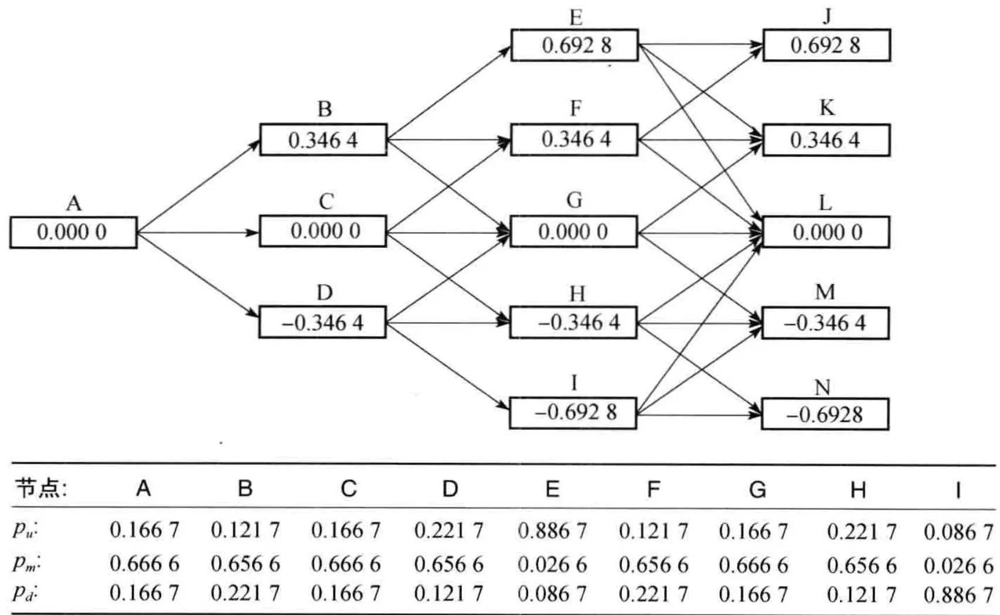
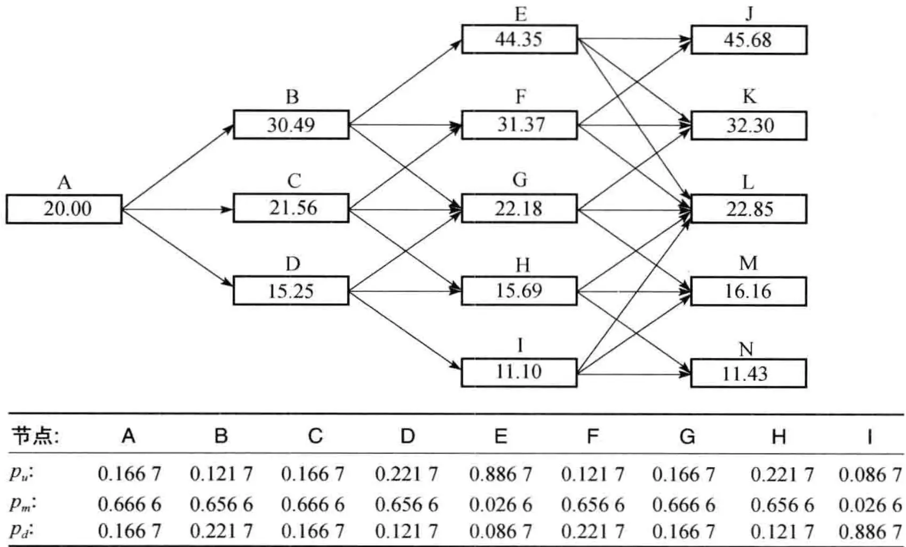
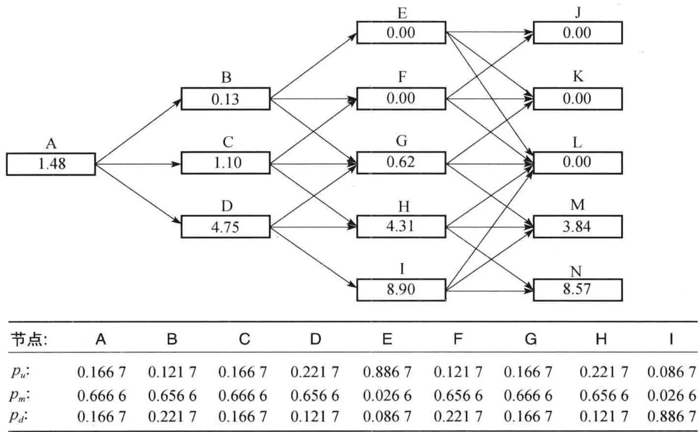
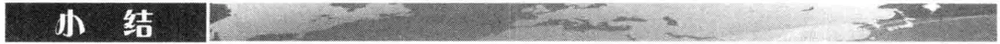
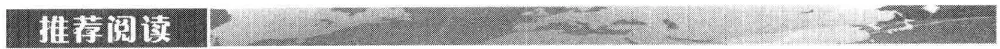
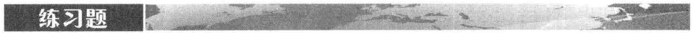
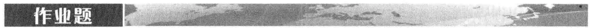

# [第34章](ch34.md) 农产品

农产品包括种植的产品（或由其产生的产品），像玉米、小麦、可可、咖啡、白糖、棉花和冻橙汁；也包括与家畜有关的产品，像活牛、猪肉和五花肉。与所有商品一样，农产品的价格是由市场供需决定的。美国农业部定期公布贮备与生产的状况。像棉花与小麦这样的农产品，一个被密切关注的统计量是库存－使用比例（stocks-to-use ratio），即年终库存量与该年度使用量的比例。一般情况下，这个比例是在20%\~40%。该比例对价格波动率有很大影响：如果关于某个商品的这项比例较低，那么商品价格对供应的变化将会很敏感，因此波动率将会上升。

在农产品价格上假设某种均值回归性质是有道理的。当价格下跌时，农场主将会发现生产这种产品不太合算，因此由于供应下降会对价格产生上升的压力。与此类似，当某种农产品价格上升时，农场主会将更多的资源用来生产这种产品，从而由于供应的增加而对产品价格产生下降的压力。

农产品价格常常会显示季节性，这是因为储存比较昂贵，而且产品储存的时间也是有限的。气候是决定大多数农产品的关键因素。冰霜会大面积摧毁巴西咖啡作物，而佛罗里达的飓风很可能会影响冰冻橙汁的价格，等等。农作物商品价格的波动率在收获季节之前往往是最高，而当产量确定后，波动率就会下降。在作物生长季节，随气候的变化，农产品价格所服从的过程往往显示出跳跃性。

许多交易的农作物产品是用来饲养家畜的（例如，CME 集团所交易的玉米期货指明是用来喂家畜的玉米）。家畜的价格（或在屠宰后的价格）往往会依赖于这些商品的价格，而这些商品的价格则受气候影响。

## 34.2 金属

另一类重要的商品是金属，包括黄金、白银、铂金、钯、铜、锡、钎、锌、镍和铝。金属与农产品的特征很不一样，它们的价格不受季节与气候的影响，因为它们是由地下挖出来的，由于可以分割而相对来讲容易储存。有些金属，比如铜，几乎总是用在产品加工上，所以应该将其分类为消费资产。如第5.1节所述，持有其他资产（比如黄金与白银）的主要目的是为了投资，所以应当将其分类为投资资产。

与农产品一样，分析员通过关注储存水平来确定短期价格波动率。货币汇率波动也可能会导致价格波动，这是因为开采金属的国家往往不同于报出金属价格的国家。从长远来讲，金属的价格取决于其在不同生产过程中被使用的趋势，以及发现这种金属的新产源。勘探技术、开采方法、地缘政治、企业联合以及环保政策对金属价格也会有影响。

金属供应的一个可能来源是回收。某种金属可能会用来制造某种产品，在今后20年里，由于回收，也许会有 $10\%$ 的这种金属又重新回到市场。

我们一般不假定作为投资资产的金属价格服从均值回归过程，因为均值回归过程将会给投资者一种套利的机会。作为消费资产的金属，有时可以假定其价格具有一些均值回归性质。当一种金属的价格上涨时，在一些生产过程中很可能会避免使用这种金属，而且从困难地方开采这种金属从经济上来讲切实可行，这些现象将会对价格产生下降的压力。与此类似，当价格下跌时，在一些生产过程中将会尽量使用这种金属，而且从困难地方开采这种金属将会不再可行，因此将会对价格产生上涨的压力。

## 34.3 能源产品

能源产品是最重要也是交易最活跃的商品之一。在场外市场和交易所里都有许多种类的能源衍生产品交易。在这里将我们考虑原油、天然气和电能。对于这些产品，有种种理由可以支持其价格服从均值回归过程的假设。当一种资源的价格上涨时，其消费量很可能会下降，产量相对过大，从而对价格产生下跌的压力。当一种资源的价格下跌时，其消费量很可能会上升，同时增加生产变得不划算，从而对价格产生上涨的压力。

### 34.3.1 原油

原油市场是世界上最大的商品市场，全球需求量大约为每天8000万桶。10年期的固定价格供油合约已经在场外市场上流行了许多年。这些合约通常是以原油固定价格与原油浮动价格进行交换。

由于比重与含硫量的不同，原油分成很多等级。对原油定价的两种重要基准是布兰特原油（Brent crude oil，来自北海）和德州轻油（West Texas Intermediate，WTI）。原油会被提炼成诸如汽油、民用燃料油、燃料油和煤油。

在场外市场上，几乎所有以股票或股指作为标的资产衍生产品的形式都有相应的以原油价格作为标的资产的衍生产品。互换、远期合约、期权都很普遍。在这些合约中，有时是需要现金交割，有时则需要实物交割（即交付原油）。

交易所里的合约也很流行。CME 集团和洲际交易所（Intercontinental-Exchange，ICE）交易一些原油期货和原油期货期权合约。有些期货合约以现金交割，其他合约以实物交割。例如，ICE 交易的布兰特原油期货有以现金交割的选择，而 CME 集团交易的轻质低硫（light sweet）原油期货则需要以实物交割。在两种情况下，一份合约的标的资产是 1 千桶原油。CME 集团交易的两种很受欢迎的成品油合约是民用燃料油和汽油。在这两种情况下，一份合约需要交付 42000 加仑。

### 34.3.2 天然气

在 20 世纪八九十年代，在全世界各地的天然气市场都经历了放松管制（deregulation）的阶段，政府不再垄断这个市场。现在供应天然气的公司与生产天然气的公司并不一定是一家，供应商面临着满足日常需求的问题。

一种典型的场外市场合约是在一个月内按大致均匀的速度交付指定数量的天然气。在场外市场上，远期合约、期权以及互换合约都有交易。通常天然气卖方负责将天然气通过管道输送到指定的地点。

CME 集团交易的天然气合约是交付 100 亿英国热量单位（British thermal unit）的天然气。对未被平仓的合约，在交付月内卖出方需要按大致均匀的速度将天然气输送到路易斯安那州的某个指定的枢纽。ICE 在伦敦也交易类似的合约。

天然气是建筑物取暖常用的能源，同时也被用来发电，而电力又用在空调设备上。因此，对天然气的需求具有季节性，而且受气候影响。

### 34.3.3 电力

电力是一种特殊的商品，原因是电力无法储存。 $^{①}$ 在任何时刻，对一个地区供电的最大数量是由该地区所有发电厂的最大发电量决定的。在美国，有140个所谓控制地区（control area）的区域。在一个控制地区内首先将供需达到平衡，然后再将多余的电力卖给其他控制地区。这些多余的电力形成了电力批发市场，将一个控制地区的电力卖给另一个控制地区的能力取决于两个地区输送电网的容量。由一个地区将电力输送到另一个地区时，电网拥有者会收取费用，

而且在输送过程中也会损失能量。

大部分电力被用于空调系统，因此对电力的需求（从而其价格）在夏天的几个月中要比在冬天的月份中高得多。由于电力是无法储存的，电力的即期价格有时会发生非常大的变化。酷暑曾经使即期价格在短时间内上涨到高达1000%。

与天然气一样, 电力也经历了放松管制的阶段, 政府垄断的现象逐渐消失, 而与此相随的是电力衍生产品市场的兴起。目前 CME 集团交易电力价格上的期货合约, 而且在场外市场上远期合约、期权以及互换的交易都很活跃。典型的合约 (交易所或场外) 是指明一方在一个指定的月份内、在一个指定的地点、按指定的价格接收一定数量兆瓦的电力。在一个 $5 \times 8$ 合约里, 在指明的月份内, 接收电力的时间是非高峰时间 (晚上 11 点到早上 7 点), 每周 5 天 (星期 1 到星期 5)。在一个 $5 \times 16$ 合约里, 在指明的月份内, 接收电力的时间是高峰时间 (早上 7 点到晚上 11 点), 每周 5 天。在一个 $7 \times 24$ 合约里, 在指明的月份内, 接收电力时间是每天昼夜不停。在期权合约里, 或者是日行权, 或是月行权。在日行权的情形下, 期权持有者可以在一个月内的每一天都选择是否行使期权 (提前一天通知) 而按指定的行使价格接收指定数量的电力。在月行权的情况下, 只是在月初决定是否行使期权, 从而在整个月内按指定的行使价格接收电力。

在电力与天然气市场上，一种有趣的合约是所谓的摆动期权（swing option），也叫作收购付款期权（take-and-pay option）。在这种合约里，期权持有者在一个月内每天按指定价格必须购买的最多与最少数量的电力是预先指定的，而且在整个月内的最多与最少数量也是预先指定的。在行权月内，期权持有者可以改变（或摆动）购买电力的速度，但一般情况下改变的次数是有限制的。

## 34.4 商品价格模型

为了对衍生产品定价，我们常常希望在传统风险中性世界里对商品的即期价格建立模型。由18.7节我们知道，在这个世界里商品价格在将来的期望值等于其期货价格。

### 34.4.1 简单过程

我们可以用以下方式对商品价格建立一种简单模型。假设商品价格增长率的期望仅依赖于时间，而且商品价格的波动率是常数，那么商品价格的风险中性过程为

$$
\frac{\mathrm{d}S}{S} = \mu (t) \mathrm{d}t + \sigma \mathrm{d}z\tag{34-1}
$$

而且我们有
$$
F (t) = \hat{E} [ S (t) ] = S (0) \mathrm{e}^{\int_{0} ^{t} \mu (\tau) \mathrm{d}\tau}
$$

其中 $F(t)$ 是期限为 t 的期货合约价格， $\hat{E}$ 表示在风险中性世界里的期望。于是

$$
\ln F (t) = \ln S (0) + \int_{0} ^{t} \mu (\tau) \mathrm{d}\tau
$$

对两边关于时间求导数将会得到
$$
\mu (t) = \frac{\partial}{\partial t} [ \ln F (t) ]
$$


假设在 2014 年 7 月末，活牛期货价格如下（每磅所值美分）

<table><tr><td>2014年8月</td><td>62.20</td><td>2015年2月</td><td>63.37</td></tr><tr><td>2014年10月</td><td>60.60</td><td>2015年4月</td><td>64.42</td></tr><tr><td>2014年12月</td><td>62.70</td><td>2015年6月</td><td>64.40</td></tr></table>

我们可以利用这些期货价格来估计活牛价格在风险中性世界里的增长率。例如，当使用式（34-1）所示的模型时，在风险中性世界里活牛价格在2014年10月与12月之间的增长率为
$$
\ln \left(\frac{62.70}{60.60}\right) = 0.034
$$

或每两个月为 $3.4\%$ ，按连续复利。当按年计算时，这相当于每年 $20.4\%$ 。





假设活牛期货价格如例 34-1 所示。一项养殖决策需要现在投资 10 万美元，而且在第 3 个月、第 6 个月和第 9 个月后各需要费用支出 2 万美元。投资的效果是在年底能有额外的牛群可以出售。这里的不确定性来源主要有两项：能够用于出售的额外牛群磅数和每磅活牛的价格。牛群磅数的期望值是 30 万。从例 34-1 中我们知道在风险中性世界里，1 年后活牛价格的期望值是每磅 64.40 美分，假设无风险利率是每年 10%，这项投资的价值为（按千美元计）
$$
- 100 - 20 \mathrm{e}^{- 0.1 \times 0.25} - 20 \mathrm{e}^{- 0.1 \times 0.50} - 20 \mathrm{e}^{- 0.1 \times 0.75} + 300 \times 0.644 \mathrm{e}^{- 0.1 \times 1} = 17.729
$$

在这里我们假定了可以销售的额外牛群的不确定性具有零系统风险，而且可以销售的额外牛群磅数与价格之间没有相关性。



### 34.4.2 均值回归

我们已经介绍过，大多数商品价格服从均值回归过程，价格有被拉回到中心价值的倾向。在描述商品价格 S 所服从的风险中性过程时，比式（34-1）更接近实际的过程是
$$
\mathrm{d}\ln S = [ \theta (t) - a \ln S ] \mathrm{d}t + \sigma \mathrm{d}z\tag{34-2}
$$

这种过程包含了均值回归，而且与[第31章](ch31.md)中对短期利率所假设的过程是类似的。这个过程有时也被写成
$$
\frac{\mathrm{d}S}{S} = \left[ \theta^{*} (t) - a \ln S \right] \mathrm{d}t + \sigma \mathrm{d}z
$$

由伊藤公式可知这与式（34-2）的过程是等价的，其中 $\theta^{*}(t) = \theta(t) + \sigma^{2}/2$ 。

第31.7节中的三叉树方法可以用来构造 $S$ 的树形，并且由此来确定式（34-2）中使得 $F(t) = \hat{E}[S(t)]$ 的 $\theta(t)$ 值。我们将通过建立关于商品价格的3步树形来展示这个构造过程。假设目前商品价格是20美元，而且1年、2年和3年的期货价格分别是22美元、23美元和24美元。假设在式（34-2）中 $a = 0.1, \sigma = 0.2$ 。我们首先定义初始值为零，并且服从如下过程的变量 $X$

$$
\mathrm{d}X = - a X \mathrm{d}t + \sigma \mathrm{d}z\tag{34-3}
$$

利用 31.7 节中的程序，我们可以构造 X 的三叉树，树形显示在图34-1 中。

<table><tr><td>节点:</td><td>A</td><td>B</td><td>C</td><td>D</td><td>E</td><td>F</td><td>G</td><td>H</td><td>I</td></tr><tr><td> $p_u$ :</td><td>0.1667</td><td>0.1217</td><td>0.1667</td><td>0.2217</td><td>0.8867</td><td>0.1217</td><td>0.1667</td><td>0.2217</td><td>0.0867</td></tr><tr><td> $p_m$ :</td><td>0.6666</td><td>0.6566</td><td>0.6666</td><td>0.6566</td><td>0.0266</td><td>0.6566</td><td>0.6666</td><td>0.6566</td><td>0.0266</td></tr><tr><td> $p_d$ :</td><td>0.1667</td><td>0.2217</td><td>0.1667</td><td>0.1217</td><td>0.0867</td><td>0.2217</td><td>0.1667</td><td>0.1217</td><td>0.8867</td></tr></table>图34-1 X 的树形。构造该树是建立即期商品价格 S 树形的第一步，这里 $p_{u}$ 、 $p_{m}$ 和 $p_{d}$ 是从一个节点向 “上”、“中” 和 “下” 移动的概率

变量 $\ln S$ 服从与 $X$ 同样的过程, 只是它具有依赖时间的漂移项。与第 31.7 节相似, 通过变动节点的位置, 我们可以将 $X$ 的树形转换成关于 $\ln S$ 的树形, 所得结果展示在图34-2 中。最初的节点对应于目前的商品价格 20 , 因此节点的变动是 $\ln 20$ 。假设在 1 年时间节点上的变动为 $\alpha_{1}$ 。 $X$ 在 1 年时 3 个节点上的值是 +0.3464 , 0 和 -0.3464 。所以相应的 $\ln S$ 值是 $0.3464 + \alpha_{1}, \alpha_{1}$ 和 $\alpha_{1} - 0.3464$ 。因此 $S$ 的值分别是 $\mathrm{e}^{0.3464 + \alpha_{1}}, \mathrm{e}^{\alpha_{1}}$ 和 $\mathrm{e}^{-0.3464 + \alpha_{1}}$ 。我们需要令 $S$ 的期望值等于期货价格。这意味着

$$
0.1667 \mathrm{e}^{0.3464 + \alpha_{1}} + 0.6666 \mathrm{e}^{\alpha_{1}} + 0.1667 \mathrm{e}^{- 0.3464 + \alpha_{1}} = 22
$$
方程的解是 $\alpha_{1} = 3.071$ 。这说明 $S$ 在一年时点上的值分别为30.49，21.56和15.25。

<table><tr><td>节点:</td><td>A</td><td>B</td><td>C</td><td>D</td><td>E</td><td>F</td><td>G</td><td>H</td><td>I</td></tr><tr><td> $p_u$ :</td><td>0.1667</td><td>0.1217</td><td>0.1667</td><td>0.2217</td><td>0.8867</td><td>0.1217</td><td>0.1667</td><td>0.2217</td><td>0.0867</td></tr><tr><td> $p_m$ :</td><td>0.6666</td><td>0.6566</td><td>0.6666</td><td>0.6566</td><td>0.0266</td><td>0.6566</td><td>0.6666</td><td>0.6566</td><td>0.0266</td></tr><tr><td> $p_d$ :</td><td>0.1667</td><td>0.2217</td><td>0.1667</td><td>0.1217</td><td>0.0867</td><td>0.2217</td><td>0.1667</td><td>0.1217</td><td>0.8867</td></tr></table>图34-2 即期商品价格 S 的树形: $p_{u}$ , $p_{m}$ 和 $p_{d}$ 是从一个节点向 “上”、“中” 和 “下” 移动的概率

在 2 年的时间点上, 我们首先通过到达节点 B、C 和 D 的概率来计算到达节点 E、F、G、H 和 I 的概率。到达节点 F 的概率等于到达节点 B 的概率乘以从 B 到达 F 的概率, 再加上到达节点 C 的概率乘以从 C 到达 F 的概率, 即

$$
0.1667 \times 0.6566 + 0.6666 \times 0.1667 = 0. \dot{2} 206
$$
与此类似，到达节点 E、G、H 和 I 的概率分别是 0.0203, 0.5183, 0.2206 和 0.0203。在 2 年的时间点上，节点被变动的数量 $\alpha_{2}$ 必须满足
$$
0.0203 \mathrm{e}^{0.6928 + \alpha_{2}} + 0.2206 \mathrm{e}^{0.3464 + \alpha_{2}} + 0.5183 \mathrm{e}^{\alpha_{2}} + 0.2206 \mathrm{e}^{- 0.3464 + \alpha_{2}} + 0.0203 \mathrm{e}^{- 0.6928 + \alpha_{2}} = 23
$$
它的解 $\alpha_{2} = 3.099$ 。这说明 $S$ 在2年时的值分别为44.35、31.37、22.18、15.69和11.10。

在第 3 年时，我们可以做类似的计算。图34-2 展示了所计算出的 S 树形。



假如我们利用图34-2 中的树形对即期商品价格上的 3 年期美式看跌期权定价，执行价格为 20，利率为每年 3%（连续复利）。在树形上以通常的方式向后计算，我们得到图34-3，期权的价值是 1.48 美元。在节点 D，H 和 I 上，期权会被提前行使。如果需要更精确的值，我们可以利用更多步数的树形。在更多步数的树形上，我们可以通过对期货价格进行插值来得到对应于树形上每一步的期货价格。

<table><tr><td>节点:</td><td>A</td><td>B</td><td>C</td><td>D</td><td>E</td><td>F</td><td>G</td><td>H</td><td>I</td></tr><tr><td> $p_u$ :</td><td>0.1667</td><td>0.1217</td><td>0.1667</td><td>0.2217</td><td>0.8867</td><td>0.1217</td><td>0.1667</td><td>0.2217</td><td>0.0867</td></tr><tr><td> $p_m$ :</td><td>0.6666</td><td>0.6566</td><td>0.6666</td><td>0.6566</td><td>0.0266</td><td>0.6566</td><td>0.6666</td><td>0.6566</td><td>0.0266</td></tr><tr><td> $p_d$ :</td><td>0.1667</td><td>0.2217</td><td>0.1667</td><td>0.1217</td><td>0.0867</td><td>0.2217</td><td>0.1667</td><td>0.1217</td><td>0.8867</td></tr></table>图34-3 利用图34-2中树形对执行价格为20美元的欧式看跌期权定价



### 34.4.3 插值与季节性

当使用许多步数的树形时, 我们需要在期货价格之间进行插值来得到相对于每一步末的期货价格。当价格呈现季节性时, 插值的方式应当反映这种特点。假设我们需要的时间步长等于一个月, 兼容季节性的一种简单做法是收集每月的即期价格历史数据, 并计算价格的 12 月移动平均。然后可以计算一个季节性因素百分比 (percentage seasonal factor), 这个值等于 1 个月内即期价格与以该月为中心的 12 个月即期价格的移动平均之比的平均值。

然后季节性因素百分比可以用来消除已知期货价格中的季节性。每个月消除季节性后的期货价格可以利用插值来得到。然后再利用季节性因素百分比将季节性加回到这些期货价格里，并且由此建立树形。例如，假设在市场上观察的9月份与12月份期货价格分别为40和44，我们需要计算10月份与11月份的期货价格。我们进一步假设由历史数据计算出的9月份、10月份、11月份和12月份的季节性因素百分比分别为0.95、0.85、0.8和1.1。消除季节性后的期货价格为：9月份 $40/0.95=42.1$ 和12月份 $44/1.1=40$ 。由插值得到的10月份与11月份消除季节性后的期货价格分别为41.4与40.7。在构造树形时所用的是10月份与11月份加上季节性后的期货价格，它们分别为 $41.4\times0.85=35.2$ 和 $40.7\times0.8=32.6$ 。

像我们讲过的那样，有时商品价格的波动会呈现季节性。例如，由于气候的不确定性，某些农产品价格在作物生长季节波动性较大。我们可以利用[第23章](ch23.md)里所讨论的方法来监测波动率，并且估算波动率的季节性因素百分百，从而在式（34-2）与式（34-3）里我们可以将参数 $\sigma$ 换成 $\sigma(t)$ 。当波动率是时间函数时，对其构造三叉树形的步骤在网页www.rotman.utoronto.ca/\~hull/TechnicalNotes中的Technical Note 9和16里有详细讨论。

### 34.4.4 跳跃

由于与气候相关的需求冲击，有些商品的价格（比如像电力和天然气）显示跳跃的特征。而另外一些商品（尤其是农产品），由于和气候有关的供应冲击，价格也往往会显示跳跃。我们可以在式（34-2）中引入跳跃项，那么即期价格所服从的过程变成了

$$
\mathrm{d}\ln S = [ \theta (t) - a \ln S ] \mathrm{d}t + \sigma \mathrm{d}z + \mathrm{d}p
$$
其中 dp 是生成百分比跳跃的泊松过程（Poisson process）。这与在 27.1 节里描述股票价格的默顿混合跳跃－扩散模型相似。一旦跳跃频率与跳跃大小的概率分布被选定后，我们可以计算在将来时间 t 由于跳跃所引起的商品价格平均增长幅度。为了确定 $\theta(t)$ ，在到期日为 t 的期货价格中减去这个增长量之后，我们可以利用三叉树方法。如 21.6 节与 27.1 节所述，蒙特卡罗模拟法可以用来实现这种模型。

### 34.4.5 其他模型

有时人们使用更加复杂的模型来描述原油价格。如果 $y$ 表示方便收益率, 那么即期价格的比例漂移项为 $r - y$ , 其中 $r$ 为短期无风险利率, 描述即期价格过程的一种很自然的选择是
$$
\frac{\mathrm{d}S}{S} = (r - y) \mathrm{d}t + \sigma_{1} \mathrm{d}z_{1}
$$

Gibson 和 Schwartz 建议将方便收益率作为一个具有均值回归性质的过程 $^{①}$

$$
\mathrm{d}y = k (\alpha - y) \mathrm{d}t + \sigma_{2} \mathrm{d}z_{2}
$$

其中 $k$ 和 $\alpha$ 为常数, $\mathrm{dz}_2$ 和 $\mathrm{dz}_1$ 是相关的维纳过程。为了能够与期货价格达到完全匹配, 我们假定 $\alpha$ 是时间 $t$ 的函数。

对于天然气与电力价格，Eydeland 和 Geman 提出了如下形式的随机波动率模型 $^{②}$

$$
\frac{\mathrm{d}S}{S} = a (b - \ln S) \mathrm{d}t + \sqrt{V} \mathrm{d}z_{1}
$$

$$
\mathrm{d}V = c (d - V) \mathrm{d}t + e \sqrt{V} \mathrm{d}z_{2}
$$

其中 $a 、 b 、 c 、 d$ 和 $e$ 均为常数, $\mathrm{dz}_{2}$ 和 $\mathrm{dz}_{1}$ 是相关的维纳过程。在假定 $b$ 也是随机时, Geman 用这种过程来描述原油的价格。 $^{\ominus}$

## 34.5 气候衍生产品

许多公司的业绩表现都可能会受到气候的负面影响。 $^{②}$ 对这些公司而言，像对冲其外汇风险或利率风险一样来对冲气候风险的做法是有道理的。

场外市场上的第一种气候衍生产品是在 1997 年引进的。为了理解产品的运作，我们首先解释两个变量：

HDD: 升温天数 (Heating degree days)

CDD: 降温天数 (Cooling degree days)

1 天的 HDD 定义成
$$
\mathrm{HDD} = \max (0, 65 - A)
$$

而1天的CDD定义成

$$
\mathrm{CDD} = \max (0, A - 65)
$$

其中 A 是在当天某个指定的气象站处最高与最低温度的平均（计量单位为华氏度）。例如，如果在一天内（子夜到子夜之间）的最高温度是 68 华氏度，而最低温度是 44 华氏度，这时 A = 56 ，因此这一天的 HDD 为 9 ，CDD 为 0 。

场外市场上的典型衍生产品是收益依赖于在一个月累积 HDD 或 CDD 的远期合约或期权。例如，某衍生产品交易商可能在 2014 年 1 月份卖给客户如下形式的期权：期权的标的变量是在芝加哥奥黑尔机场气象站 2015 年 2 月份的累积 HDD，执行价格是 700，每一度/天所对应的收益为 1 万美元。如果实际的累积 HDD 为 820，那么收益将为 120 万美元。在合约里常常会含有收益上限。如果在我们的例子中收益上限为 150 万美元，这个合约与牛市差价是等价的（见[第 12 章](ch12.md)）：客户持有标的为累积 HDD 上执行价格为 700 的看涨期权多头与执行价格为 850 的看涨期权空头。

一天的 HDD 是度量在一天内取暖所需要的能源，一天的 CDD 是度量在一天内降温所需要的能源。大多数气象衍生产品合约是在能源生产商与客户之间签订的。但是零售商、连锁超市、食品与饮料加工、卫生服务、农产品公司以及娱乐行业都是气候衍生产品的潜在用户。气候风险协会（The Weather Risk Management Association，见 <www.wrma.org>）的成立是为了向气候风险管理行业提供服务。

在 1999 年 9 月, 芝加哥商业交易所 (CME) 开始交易气候期货与气候期货上的欧式期权。合约的标的变量是在某个气象站所观察的某个月的累积 HDD 和 CDD。在月底一旦知道了 HDD 与 CDD 后, 合约马上按现金形式交割。一份期货合约的大小是 20 乘以当月的累积 HDD 与 CDD。目前 CME 为世界各地很多城市提供气候期货与期权, 而且也提供在飓风、结霜、降雪上的期货与期权。

## 34.6 保险衍生产品

当衍生产品合约用于对冲目的时，它们有许多与保险合约相同的特征。两种合约的设计都是为了对不利事件提供保护，因此许多保险公司都有附属部门进行衍生品交易，而且保险公司的许多业务与投资银行非常相似。

在对冲像飓风和地震这样的灾难性（CAT）风险敞口时，保险业传统的做法是进行所谓的再保险（reinsuarance）。再保险合约有多种形式。假设某家保险公司对加州地震有1亿美元的风险敞口，但希望将敞口降低到3000万美元。一种做法是每年签订再保险合约而对70%风险敞口提供保护。如果在某一年内加州地震的赔偿总数是5000万美元，那么对公司的费用仅有1500万美元。另一种更流行的方法可以降低再保险费用，即购买一系列覆盖所谓超额损失层（excess cost layers）的再保险合约。第一层可能对3000万美元到4000万美元之间的损失提供保障，下一层则可能会覆盖4000万美元到5000万美元之间的损失，等等。每个再保险合约都称为超额损失（excess-of-loss）再保险合约。再保险提供者卖出了总损失上的牛市差价，即执行价格等于损失层低端值的看涨期权多头和执行价格等于损失层高端值的看涨期权空头。

有时 CAT 风险可能会引起巨额赔偿。在 1992 年发生的安德鲁飓风在佛罗里达州造成的保险损失高达 150 亿美元，这比在佛罗里达州之前 7 年内所收的相关保险费用还要高。假如安德鲁飓风也袭击到迈阿密市的话，估计保险损失会高达 400 亿美元。安德鲁飓风与其他一些灾害性事件使保险/再保险的费用急剧上涨。

在场外市场上出现了一些代替传统再保险的产品，其中最受欢迎的是CAT债券。CAT债券是由保险公司的附属机构发行的债券，其利息比普通债券要高。与高利息相交换的是债券持有人同意一种提供对超额损失再保险的合约。由债券的条款决定，债券的利息或本金（或两者）可以被用来支付赔偿。在上面的例子里，一家保险公司希望对加州地震所造成的在3000万与4000万美元之间的损失进行保护，这时保险公司可以发行面值为1000万美元的CAT债券。当加州地震对保险公司所造成的损失超过3000万美元时，债券持有人将会损失一部分甚至全部本金。另一种覆盖这个超额损失层的做法是保险公司发行很大数量的债券，使得只有债券的利息受到影响。

## 34.7 气候与保险衍生产品定价

气候与保险衍生产品的一个明显特点是产品的收益中没有系统风险（即在市场上给予补偿的风险），这说明由历史数据所得到的估计值也可以同样用在风险中性世界里。因此气候与保险衍生产品可以通过以下方式定价：

1. 利用历史数据估计收益的期望值;

2. 按无风险利率对收益的期望值贴现。

气候与保险衍生产品的另一个关键特征是标的不确定性随时间增长的方式。对于股票价格，不确定性的增长大约与时间的平方根成正比。股票价格在4年内的不确定性（以价格对数值的标准差来度量）大约是1年价格不确定性的2倍。对于商品价格，尽管有均值回归性质的作用，但是在4年内的不确定性（以价格对数值的标准差来度量）仍然比在1年内的不确定性高很多。对于气候，不确定性随时间的增长就很不明显。某个地点在4年后2月份的HDD与在同一地点1年后2月份的HDD不确定性会稍稍高一些。与此类似，对4年后开始一段时间里由于地震所造成损失的不确定性只是比与1年后开始类似一段时间里由于地震所造成损失的不确定性稍高一些。

现在考虑对累积 HDD 上期权的定价问题。我们可以搜集 50 年历史数据，并由此来估计 HDD 的概率分布。这些数据可以用于吻合对数正态，或者其他的概率分布，然后可以计算收益的期望值。将其按无风险利率贴现即可得出期权的价值。通过分析历史数据的趋向与考虑气象学家的预测，我们可以对这里的分析加以改进。

例 34- 4

考虑以芝加哥奥黑尔机场气象站的累积 HDD 做标的资产、到期日为 2016 年 2 月、执行价格为 700 的看涨期权，每一度/天支付 1 万美元。假设从 50 年历史数据估计的 HDD 服从对数正态分布，均值为 710，HDD 自然对数的标准差等于 0.07。由式（15A-1），收益期望值为
$$
10000 \times [ 710 N(d_{1}) - 700 N(d_{2}) ]
$$

其中

$$
d_{1} = \frac{\ln (710 / 700) + 0.07^{2} / 2}{0.07} = 0.2376
$$

$$
d_{2} = \frac{\ln (710 / 700) - 0.07^{2} / 2}{0.07} = 0.1676
$$

即 250900 美元。假设无风险利率为 3%，所考虑期权的定价时间是 2015 年 2 月份（离到期日还有 1 年）。期权的价值是
$$
250900 \times \mathrm{e}^{- 0.03 \times 1} = 243400
$$
即 243400 美元。

为了反映温度趋向, 我们可以调整 HDD 的概率分布期望值。假设通过线性回归发现, 2 月份的 HDD 以每年 0.5 的速度下降 (也许是因为全球变暖的结果), 因此对 2016 年 2 月份的 HDD 估计只有 $697$ 。如果收益自然对数的标准差保持不变, 那么收益期望值将降至 180400 美元, 期权的价值降为 175100 美元。

最后，假设气候专家预测2013年的2月份很可能比较暖和，这时应当降低对HDD期望值的估计，从而期权的价值会降低。

在保险方面，Litzenberger 等人证明了 CAT 债券的收益与股票市场没有明显的相关性（这与我们想象的是一样的）。 $^{②}$ 这也印证了气候衍生品中没有系统风险，而且定价时可以利用保险

公司所收集的精算数据来进行。

CAT 债券一般会对高于通常水平的利率赋予很高的概率，对特大损失赋予低概率。投资人为什么会对这种证券感兴趣呢？答案是这种证券的收益期望（考虑到可能的损失后）比无风险投资的收益要高。然而在一个很大的组合里 CAT 债券的风险（至少在理论上）可以完全得以分散，因此 CAT 债券具有改进风险－收益均衡关系的可能性。

## 34.8 能源生产商如何对冲风险

能源生产商面临两类风险：一类是与能源市场价格有关的风险（价格风险），另一类是与能源被购买数量有关的风险（数量风险）。虽然价格会随着数量变化进行调节，但两者之间的关系并非完美。在构造对冲决策时，能源生产商必须将这两种风险都考虑在内。价格风险可以利用本章所讨论的能源衍生产品进行对冲，而数量风险则可以用气候衍生产品进行对冲。定义：

Y: 1 个月的盈利;

P : 1 个月的平均能源价格；

T: 1 个月的相关气温变量（HDD 或 CDD）。

能源生产商可利用历史数据来得到一个最佳拟合线性回归方程
Y = a + b P + c T + \varepsilon
其中 $\varepsilon$ 为误差项。能源生产商因此可以签订数量为 -b 的能源远期合约或期货合约以及数量为 -c 的气候远期合约或期货合约来对冲风险。以上的关系式也可以用于分析其他期权策略的有效性。

当需要控制和管理风险时，衍生产品市场在开发新产品来满足客户需求的方面有很强的创造力。

有许多不同形式的商品衍生品，标的变量可以是地里种植的农产品、家畜、金属以及能源产品。对它们定价的模型通常会包括均值回归，有时会明确考虑季节性并使模型包括跳跃项。以原油、天然气以及电力作为标的变量的能源衍生产品尤其重要，对这些产品定价的模型与描述股票价格、汇率以及利率所用的模型一样复杂。

在气候衍生产品市场里，HDD 和 CDD 两个测度可以用来描述一个月中的天气温度。这些测度可以用来描述交易所交易与场外市场衍生产品的最终收益。毫无疑问，随着气候衍生产品的发展，在今后我们将会看到有关降雨、降雪以及其他气候变量的衍生产品。

保险衍生产品已经逐渐开始取代传统的再保险合约。这些产品为保险公司管理像飓风和地震等这样灾难性风险提供了工具。毫无疑问，在将来我们会看到其他保险产品（例如，生命保险以及汽车保险）会以类似的方式进行交易。

在气候和保险衍生产品中，标的变量里没有系统风险。这意味着我们可以采用历史数据法来计算收益期望，并利用无风险利率对收益进行贴现来求得衍生产品的价值。

关于商品衍生生产品

Clewlow, L., and C. Strickland. Energy Derivatives: Pricing and Risk Management. Lacima Group, 2000.

Edwards, D.W. Energy, Trading, and Investing: Trading, Risk Management and Structuring Deals in the Energy Markets. Maidenhead: McGraw-Hill, 2010.

Eydeland, A., and K. Wolyniec. Energy and Power Risk Management. Hoboken, NJ: Wiley, 2003.

Geman, H. Commodities and Commodity Derivatives: Modeling and Pricing for Agriculturals, Metals, and Energy. Chichester: Wiley, 2005.

Gibson, R., and E. S. Schwartz. “Stochastic Convenience Yield and the Pricing of Oil Contingent Claims,” Journal of Finance, 45 (1990): 959–76.

Schofield, N. C. Commodity Derivatives: Markets and Applications. Chichester: Wiley, 2011.

### 关于气候衍生产品

Alexandridis, A. K., and A. D. Zapranis. Weather Derivatives: Modeling and Pricing Weather Related Risk. New York: Springer, 2013.

Cao, M., and J. Wei. “Weather Derivatives Valuation and the Market Price of Weather Risk,” Journal of Futures Markets, 24, 11 (November 2004), 1065–89.

关于保险衍生产品

Canter, M. S., J. B. Cole, and R. L. Sandor. “Insurance Derivatives: A New Asset Class for the Capital Markets and a New Hedging Tool for the Insurance Industry,” Journal of Applied Corporate Finance (Autumn 1997): 69–83.

Froot, K. A. “The Market for Catastrophe Risk: A Clinical Examination,” Journal of Financial Economics,” 60 (2001): 529–71.

Litzenberger, R. H., D. R. Beaglehole, and C. E. Reynolds. "Assessing Catastrophe Reinsurance-Linked Securities as a New Asset Class," Journal of Portfolio Management (Winter 1996): 76–86.

## 练习题

34.1 HDD与CDD的含义是什么？

34.2 典型的天然气远期合约是如何构造的？

34.3 对于衍生产品定价，历史数据法和风险中性之间的区别是什么？在哪种情形下，两种方法得出的结果是一致的？

34.4 假定在7月份每一天的最低温度为68华氏度，最高温度为82华氏度，一个基于7月份累积CDD、执行价为250的期权收益为多少？假定每一度/天的收益为5000美元。

34.5 为什么电力价格的波动比其他能源价格的波动率要大？

34.6 为什么我们可以采用历史数据法来计算气候衍生产品和CAT债券的价格？

34.7 “HDD 与 CDD 可以被看成是以温度为标的变量的期权收益。” 解释这一观点。

34.8 假定你有过去50年有关温度的数据可以使用，仔细解释如何由此数据来计算对于某一个月累积CDD的远期合约价格。

34.9 你认为一年期限的原油远期合约价格波动率是会大于还是会小于现期市场价格的波动率？解释你的观点。

34.10 具有较高波动率和较强均值回归性质的能源价格特点是什么？给出这种能源的一个例子。

34.11 能源制造商如何利用衍生产品来对冲风险？

34.12 解释 2009 年 5 月可每天行权的 $5 \times 8$ 电力期权运作方式。解释 2009 年 5 月依月行使的 $5 \times 8$ 期权的运作方式。哪一个期权价值更高？

34.13 解释CAT债券的运作方式。

34.14 假定两个券息、期限以及价格均相同的债券，其中一个公司债券信用评级为 B，另一个债券为 CAT 债券。由历史数据所做的推断显示出在今后每一年这两个债券的损失期望都相等。这时你会建议交易组合经理去购买哪一个债券？为什么？

34.15 考虑某种商品的价格，价格的波动率为

34.16 一家保险公司的某项保险损失可以用正态分布来描述。正态分布的期望值为1.5亿美元，标准差为5000万美元（假定风险中性损失与现实世界损失没有区别）。1年无风险利率为 $5\%$ ，解释在以下几种情形下保险合约的费用。

常数，增长率只是时间的函数。证明在传统风险中性世界里

(a) 在 1 年里支付占保险公司整体损失

## 作业题

$$
\ln S_{T} \sim \phi \left(\ln F (T) - \frac{1}{2} \sigma^{2} T, \sigma^{2} T\right)
$$

其中 $S_{T}$ 是商品在时间 T 的价格， $F(t)$ 是期限为 t 的期货价格在时间 0 的值， $\phi(m,v)$ 是均值为 m、方差为 v 的正态分布。

比例为 60% 的合约。

(b) 在 1 年里如果损失超出 2 亿美元，保险赔偿为 1 亿美元的保险合约。

34.17 当 1 年期与 2 年期的期货价格分别为 21 美元和 22 美元（而不是 22 美元和 23 美元）时，如何调整图34-2 中的图形？这对例 34-3 中的美式期权价格有什么影响？

到现在为止，我们所关心的问题几乎全是对金融资产的定价。在本章中，我们探讨如何将这些方法推广到对于实物资产的资本投资机会的评估上，这里的实物资产包括土地、建筑、厂房以及设备。由于在这些投资机会中常常含有隐含期权（像扩大投资的权利、放弃投资的权利、推迟投资的权利等），利用传统的资本投资评估技巧对这些期权定价是非常困难的。一种称为实物期权（real option）的方法试图利用期权定价理论来处理这些问题。

在本章里，我们首先解释如何利用传统方法对实物资产投资进行评估，并说明为什么利用这种方法对隐含期权估价会非常困难。此后我们将解释如何把风险中性定价方法推广到处理实物资产定价的问题上，并且利用几个例子来展示在不同情形下如何使用这种风险中性定价方法。

