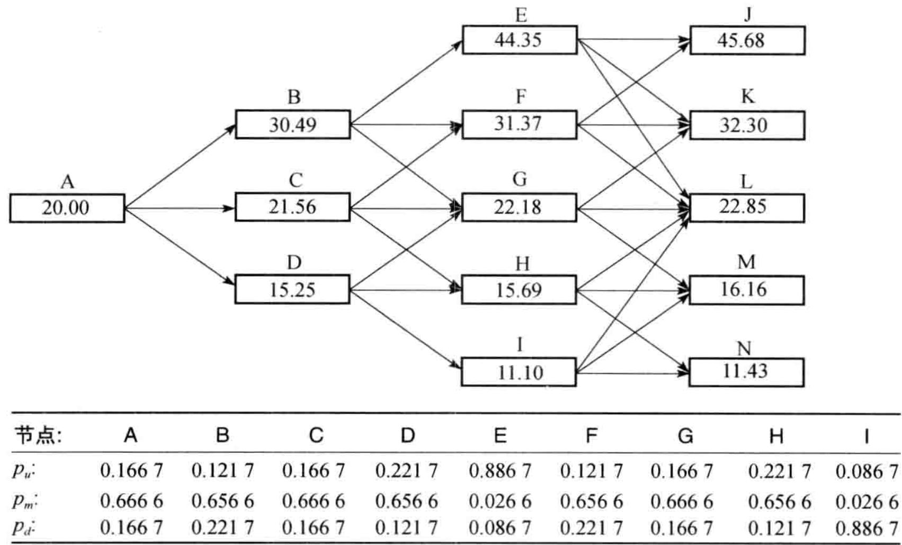
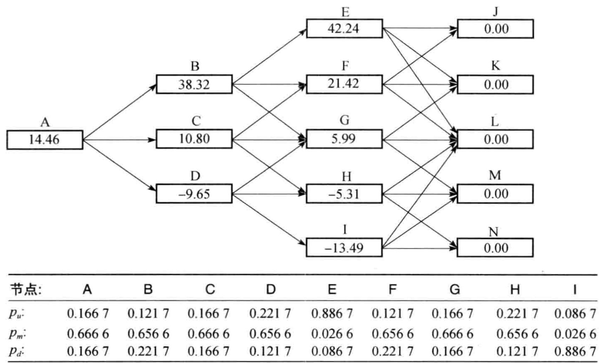
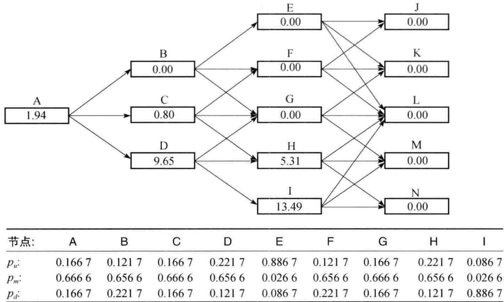
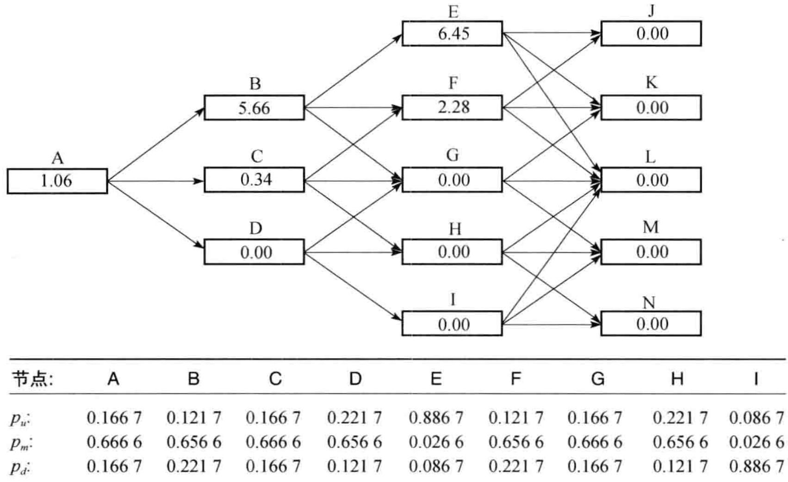
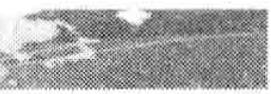
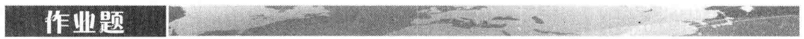

# 第35章 资本投资评估

对资本投资项目评估的传统处理方式是净现值（net present value，NPV）法。一个项目的 NPV 是其未来预期现金流增值的贴现值。计算贴现值所用的贴现率是一种经过“风险调整”（risk-adjusted）的贴现利率，它的选取反映了项目的风险程度。项目风险越大，贴现率也会越高。

作为例子，考虑一项费用为1亿美元而延续5年的投资。预期每年的现金流入估计为2500万美元。如果经过风险调整后的贴现率是 $12\%$ （连续复利），那么投资的净现值（以百万计）是

- 100 + 25 \mathrm{e}^{- 0.12 \times 1} + 25 \mathrm{e}^{- 0.12 \times 2} + 25 \mathrm{e}^{- 0.12 \times 3} + 25 \mathrm{e}^{- 0.12 \times 4} + 25 \mathrm{e}^{- 0.12 \times 5} = - 11.531
净现值为负值表明承担这个项目的结果将会降低公司对股东的价值，因此不应投资这一项目，而正的净现值则表明应当投资这个项目，因为这样做的结果将会增加股东的财富。

风险调整后的贴现率应当是公司（或公司的股东）投资所需求的收益率。它可以通过许多方式来计算。常常被推荐的一种方法是利用资本资产定价模型(capital asset pricing model, CAPM, 参见第 3 章附录 3A)。步骤如下。

（1）选取一些主要业务与所考虑项目类似的公司。

(2) 计算这些公司的 Beta，并将它们的平均值来作为项目 Beta 的近似。

(3) 将所需求的收益率设为无风险利率加上项目 Beta 乘上市场收益率超过无风险利率的部分。

利用传统 NPV 方法所遇到的一个难题是许多项目都含有隐含期权。例如，某个公司在考虑建造一个工厂来加工一项新产品，当情况不如预先想象得那么好时，公司常常有放弃这个项目的权利；而当市场上对其新产品的需求超出预料时，公司同样有扩大工厂的权利。这些权利常常具有与基本项目很不相同的风险特征，因此，在定价时需要使用不同的贴现率。

为了理解这里的问题，考虑在第 13 章开头给出的例子。这时，股票的当前价格为 20 美元，在 3 个月后价格可能是 22 美元也可能是 18 美元。风险中性定价说明了股票上执行价格为 21 美元、期限为 3 个月的看涨期权价值为 0.663。第 13 章开始的第一个脚注说明，如果在现实世界里投资者对股票所需求的预期收益率是 16%，那么相应的对期权所需求的预期收益率将会是 42.6%。类似的分析表明，如果这是个看跌期权而不是看涨期权，对期权所需求的预期收益率将会是 -52.5%。这些分析意味着，如果利用传统的净现值方法对看涨期权定价，正确的贴现率应当是 42.6%；而对看跌期权定价时，正确的贴现率却应当是 -52.5%。对于这些贴现率，我们没有什么容易的办法来估计（这里我们可以求得这些贴现率的原因是因为可以用别的方法对期权定价）。与此类似，对由于放弃、扩大以及其他权利所产生的现金流，也没有容易的办法来估计经风险调整的适当贴现率。这正是我们探讨能否将通常的金融资产期权上的风险中性定价原理用在实物资产期权上的动机。

利用 NPV 方法的另一个难题是如何计算适用于基本项目（即没有隐含期权的项目）贴现率。上面三步程序中用来计算 Beta 的公司本身也都应具有自己的扩大和放弃一些项目的权利，在它们的 Beta 里已经反映了这些期权信息，因此这些公司并不一定适用于估计基本项目的 Beta。

## 35.2 风险中性定价的推广

$$
在 28.1 节里，我们定义一个变量 $\theta$ 的风险市场价格为
$$
\lambda = \frac{\mu - r}{\sigma}\tag{35-1}
$$
其中 $r$ 是无风险利率, $\mu$ 是仅依赖于 $\theta$ 的可交易证券收益率, $\sigma$ 是它的波动率。如第28.1节所示, 对任何仅依赖于 $\theta$ 的可交易证券都会得到同样的风险市场价格 $\lambda$ 。
$$

$$
假设某个实物资产依赖于一些变量 $\theta_{i} (i = 1, 2, \cdots)$ 。令 $m_{i}$ 和 $s_{i}$ 分别为 $\theta_{i}$ 的增长率期望和波动率，于是
$$
\frac{\mathrm{d}\theta_{i}}{\theta_{i}} = m_{i} \mathrm{d}t + s_{i} \mathrm{d}z_{i}
$$
其中 $z_{i}$ 是一个维纳过程。定义 $\theta_{i}$ 的风险市场价格为 $\lambda_{i}$ 。可以通过推广风险中性定价原理来证明对任何依赖于 $\theta_{i}$ 的资产，我们都可以利用如下方式来定价
$$

$$
(1) 将每个 $\theta_{i}$ 的预期增长率从 $m_{i}$ 降到 $m_{i} - \lambda_{i}s_{i}$ ;
$$

(2) 用无风险利率对现金流进行贴现。

$$
例 35-1
$$

在某个城市里，租用商品房产的费用是按新签署的5年租用合同中每平方英尺每年所付款项来报价的。目前，每平方英尺的费用为30美元。费用的增长率期望为每年 $12\%$ ，波动率为每年 $20\%$ ，它的风险市场价格为0.3。某公司面临如下机会：它可以现在付100万美元而有权在2年后按每平方英尺35美元的费用租用100000平方英尺，租期为5年。无风险利率是每年 $5\%$ （假定是常数）。定义 $V$ 为两年后所报出的每平方英尺写字楼空间的费用。为简化运算，我们假设每年都是预先交付租金。期权的收益是
100000 A \max (V - 35, 0)
其中 $A$ 是由下面式子所给出的摊还因子
A = 1 + 1 \times \mathrm{e}^{- 0.05 \times 1} + 1 \times \mathrm{e}^{- 0.05 \times 2} + 1 \times \mathrm{e}^{- 0.05 \times 3} + 1 \times \mathrm{e}^{- 0.05 \times 4} = 4.5355
因此在风险中性世界里收益的期望值为
100000 \times 4.5355 \times \hat{E} [ \max (V - 35, 0) ] = 453550 \times \hat{E} [ \max (V - 35, 0) ]
$$

其中 $\hat{E}$ 表示在风险中性世界里的期望。利用式（15A-1），我们得出以上表达式等价于

$$
453550 \left[ \hat{E} (V) N(d_{1}) - 35 N(d_{2}) \right]
$$

其中

$$
d_{1} = \frac{\ln [ \hat{E} (V) / 35 ] + 0.2^{2} \times 2 / 2}{0.2 \sqrt{2}}
$$

$$
d_{2} = \frac{\ln [ \hat{E} (V) / 35 ] - 0.2^{2} \times 2 / 2}{0.2 \sqrt{2}}
$$
在风险中性世界里，商业房产费用的增长率期望是 $m - \lambda s$ ，其中 $m$ 是现实世界里的增长率， $s$ 是波动率， $\lambda$ 是风险市场价格。在这里， $m = 0.12, s = 0.2$ 和 $\lambda = 0.3$ ，于是风险中性增长率期望是0.06，或每年 $6\%$ ，因此 $\hat{E}(V) = 30\mathrm{e}^{0.06\times 2} = 33.82$ 。将此带入上面表达式中，我们即可得到在风险中性世界里收益的期望值是150.15万美元。以无风险利率贴现后，期权的价值为 $150.15\mathrm{e}^{-0.05\times 2} = 135.86$ 万美元，这说明为这个期权支付100万美元是划算的。
$$

## 35.3 估计风险市场价格

利用实物期权的方法来评估投资可以使我们避免诸如 35.1 节中所述的那样去估计风险调整后的贴现率，但却需要估计所有随机变量的风险市场价格参数。当一个变量有历史数据时，我们可以用资本资产定价模型来估计它的风险市场价格。为了说明这种估计方法，我们考虑一个仅依赖于这个变量的投资资产。定义：

$$
$\mu$ ：投资资产收益率的期望；
$$

$$
$\sigma$ ：投资资产收益的波动率；
$$

$$
$\lambda$ ：变量的风险市场价格；
$$

$$
$\rho$ ：变量的百分比变化与一个包含广泛股票的指数收益率之间的瞬时相关系数；
$$

$$
$\mu_{m}$ ：股票指数收益率的期望值；
$$

$$
$\sigma_{m}$ ：股票指数收益率的波动率；
$$

r：短期无风险利率。

$$
因为投资资产仅依赖于市场变量，它的收益与指数之间的瞬时相关系数也等于 $\rho$ 。应用连续时间下的资本资产定价模型（见第 3 章目录），我们有 $^{①}$
$$
\mu - r = \frac{\rho \sigma}{\sigma_{m}} (\mu_{m} - r)
$$

由式（35-1）， $\mu - r$ 的另一种表达方式为

$$
\mu - r = \lambda \sigma
$$

因此

$$
\lambda = \frac{\rho}{\sigma_{m}} (\mu_{m} - r)\tag{35-2}
$$
我们可以利用这个方程估计 $\lambda$ 。
$$

$$
例 35-2
$$

某公司的季度销售额历史数据所显示的公司销售额百分比变化与标普500股指收益之间的相关系数为0.3。标普500的波动率是每年 $20\%$ ，历史数据表明，标普500收益高于无风险利率部分的期望值是 $5\%$ 。式（35-2）给出了对公司销售额的风险市场价格估计为
\frac{0.3}{0.2} \times 0.05 = 0.075
当没有所考虑变量的历史数据时，有时可以使用其他变量代替。例如，如果建造了一个工厂用来加工一种新产品，那么我们可以搜集其他类似产品的销售额数据。市场指数与新产品之间的相关系数可以假设为这些其他产品与市场之间的相关系数。在一些情形下，对式（35-2）中 $\rho$ 的估计必须靠主观判断。如果分析员确信一个变量与市场指数的表现无关，那么应当将它的风险市场价格设成零。

对某些变量，如果可以直接估计它在风险中性世界里所服从的过程，那么将没有必要去估计它的风险市场价格。例如，当变量是一个金融资产的价格时，它在风险中性世界里的总收益率应该等于无风险利率。如果变量是短期利率 $r$ ，[第31章](ch31.md)说明了如何由初始利率期限结构来估计它的风险中性过程。

对于商品，如[第34章](ch34.md)所述，期货价格可以用来估计风险中性过程。例34-2是一个实物期权的简单应用，其中利用了期货价格来评估关于饲养活牛的投资决策。

## 35.4 对业务的评估

对业务评估的一种传统方法是将市盈倍数（P/E multiplier）乘以现时盈余，这一传统方法对新企业评估不太适用。一个新企业常常具有这样的特点：由于在头几年内企业试图获取更多的市场并与客户建立关系，企业的利润往往为负。对这些企业的评估必须要依靠估计企业在未

来不同情形下的利润和现金流。

在这种情况下，实物期权方法会很有用处。公司在未来的现金流一般会依赖于一些变量，像销售额增长、可变成本与销售额的百分比、固定成本等。对一些关键变量，我们应当利用像前两节所述的方法来估计它们的风险中性随机过程，然后可以用蒙特卡罗方法生成在各种不同情形下每年的净现金流。公司很可能在一些情形下盈利很好，而在另一些情形下却会倒闭而停止运作（在模拟过程中必须明确倒闭的规则，即在何种情形下公司会倒闭）。公司的价值等于每年净现金流的期望以无风险利率贴现的现值。业界事例35-1给了一个将此方法应用于对亚马逊公司（Amazon.com）定价的例子。



在利用实物期权对公司定价方面，最早的一篇文章是 Schwartz 和 Moon（2000）所发表，他们考虑了亚马逊公司在 1999 年年底的价格。假设公司的销售利润 R 与其收入增长率 $\mu$ 服从以下随机过程

\begin{array}{r l} \frac{\mathrm{d}R}{R} & = \mu \mathrm{d}t + \sigma (t) \mathrm{d}z_{1} \\ \mathrm{d}\mu & = \kappa (\bar{\mu} - \mu) \mathrm{d}t + \eta (t) \mathrm{d}z_{2} \end{array}
假定两个维纳过程 $\mathrm{dz}_1$ 和 $\mathrm{dz}_2$ 互不相关，并且根据历史数据，Schwartz和Moon对 $\sigma (t)$ 、 $\eta (t)$ 、 $\kappa$ 与 $\bar{\mu}$ 做了一些合理的假设。

假设卖出产品成本是销售额的 75%，其他可变成本是销售额的 19%，而固定成本是每季度 7500 万美元。最初销售额水平是 3.56 亿美元，最初税务结转亏损是 5.59 亿美元，税率是 35%。变量 R 的风险市场价格可以通过历史数据按上一节中所述方法估计，变量 $\mu$ 的风险市场价格被假设成零。

分析的展望期被设定为 25 年，在展望期最后，公司的价值被假定为 10 倍于公司的税前盈利，最初的现金持有量为 9.06 亿。当现金余额为负值时，公司将会破产。

蒙特卡罗模拟法可以在风险中性世界里产生将来的不同情形。在不同情形下，需要将行使可转换债券以及行使雇员期权的可能性考虑在内。对于股权人而言，公司的价值等于将来的现金流以无风险利率进行贴现后的总和。

在这些假设下，Schwartz 和 Moon 得出亚马逊公司股票在 1999 年年底的估价为 12.42 美元，当时其市场价格为 76.125 美元（虽然在 2000 年，该股票价格大幅下跌）。实物期权法的优点在于这一方法对关键的假设进行了识别。Schwartz 和 Moon 发现估计的股价对增长率的波动率 $\eta(t)$ 十分敏感，该波动率是期权价值的主要来源， $\eta(t)$ 上小小的增量会使得期权价值增大，从而会使得亚马逊公司股票的估价大大增大。


## 35.5 投资机会中期权的定价

我们已经提到过，大多数投资项目都会涉及期权。这些期权可以给项目增加可观的价值，但人们常常会忽略这些期权或使用错误的方法定价。隐含在投资项目里的期权可能包括以下几种。

(1) 放弃期权（abandonment option）。这是指转让或关闭项目的权利。它是项目价值上的美式看跌期权，期权的执行价格是项目的清仓（或转让）价值减去清仓时的所有费用。当清仓价值很低时，执行价格可能为负值。放弃期权可以减轻非常糟糕的投资结果对项目的影响，从而增加最初项目的价值。

(2) 扩大期权（expansion option）。这是指在以后当条件有利时增加投资，从而增加生产的权利。它是在增加生产能力价值上的美式看涨期权。期权的执行价格是增加生产能力的成本被贴现到行使期权时的价值。执行价格常常与最初的投资有关。如果在最初选择构建时，管理层计划的生产规模已经超过预期生产的水平，那么执行价格会相对很小。

(3) 缩减期权（contraction option）。这是减小项目规模的权利，它是关于减少生产能力的价值上的美式看跌期权。期权的执行价格是在行使时刻所有将被节省的未来支出的贴现值。

(4) 推迟期权（option to defer）。对于管理人而言，一种非常重要的权利是能够推迟项目。这是项目价值上的美式看涨期权。

(5) 延期期权（option to extend life）。有时可能在付出一笔固定费用后可以延长一个资产的寿命，这是在资产将来价值上的欧式看涨期权。

### 35.5.1 例子

作为对含有隐含期权投资评估的简单例子，我们考虑下面问题：一家公司需要决定是否要投资1500万美元以便在今后3年内从某处按每年200万单位的速度提取600万单位商品。运作设备的固定成本是每年600万美元，而可变成本（variable cost）是提取每单位商品需要17美元。我们假设所有期限的无风险利率均为每年 $10\%$ ，商品即期价格是每单位20美元，1年、2年和3年的期货价格分别是每单位22美元、23美元和24美元。

### 35.5.2 当没有隐含期权时的定价

我们首先假定这个项目中没有隐含期权。在1年、2年和3年后，商品价格在风险中性世界里的期望值分别是22美元、23美元和24美元。在风险中性世界里项目收益的期望值可以通过费用支出数据计算，在1年、2年和3年的值分别是（按百万美元计）4.0，6.0和8.0。因此，项目的价值为
- 15.0 + 4.0 \mathrm{e}^{- 0.1 \times 1} + 6.0 \mathrm{e}^{- 0.1 \times 2} + 8.0 \mathrm{e}^{- 0.1 \times 3} = - 0.54
这个分析表明，公司不应当承担这个项目，因为这样做会使股权持有者的财富降低54万美元。

### 35.5.3 利用树形

我们现在假设商品的即期价格服从随机过程
\mathrm{d}\ln S = [ \theta (t) - a \ln S ] \mathrm{d}t + \sigma \mathrm{d}z\tag{35-3}
$$
其中 $a = 0.1$ 和 $\sigma = 0.2$ 。对于这里的例子，在第34.4节里我们说明了如何对商品价格构造树形，如图35-1所示（与图34-2相同）。树形所代表的过程与对 $S$ 所假设的过程、对 $a$ 和 $\sigma$ 所假设的值，以及1年、2年和3年的期货价格是一致的。
$$

$$
当没有隐含期权时，我们不需要利用树形来对项目估价（我们已经知道在没有期权时项目的基本价值是-0.54）。但是，在我们考虑期权之前，为了帮助理解以及将来计算，我们利用树形来对没有期权时的项目进行估价，并且验证前面所得到的结果。图35-2展示了项目在图35-1中的每个节点上的价值。例如，考虑节点H，在第3年年末商品价格为22.85的概率是0.2217，于是在第3年内的盈利是 $2 \times 22.85 - 2 \times 17 - 6 = 5.70$ 。与此类似，在第3年年末商品价格为16.16的概率是0.6566，因此盈利是-7.68，以及在第3年年末商品价格为11.43的概率是0.1217，因此盈利是-17.14。由此可以得到在图35-2中节点H上的项目价值为
$$
[ 0.2217 \times 5.70 + 0.6566 \times (-7.68) + 0.1217 \times (-17.14) ] e^{- 0.1 \times 1} = - 5.31
$$

作为另一个例子，考虑节点 C，移动到价格为 31.37 的节点 F 的概率是 0.1667。在第 2 年的现金流为 $2 \times 31.37 - 2 \times 17 - 6 = 22.74$ 。在节点 F 后的现金流价值为 21.24。因此，当移动到节点 F 时项目的总价值为 $21.42 + 22.74 = 44.16$ 。类似地，当我们移动到节点 G 和 H 时，项目的总价值分别为 10.35 和 -13.93。因此，项目在节点 C 的价值为

$$
[ 0.1667 \times 44.16 + 0.6666 \times 10.35 + 0.1667 \times (-13.93) ] e^{- 0.1 \times 1} = 10.80
图35-2 显示了在最初的节点 A 上，项目的价值为 14.46。因此，当我们将项目在开始时的投资考虑进去时，项目的价值为 -0.54，这与我们前面的计算结果一致。

<table><tr><td>节点:</td><td>A</td><td>B</td><td>C</td><td>D</td><td>E</td><td>F</td><td>G</td><td>H</td><td>I</td></tr><tr><td> $p_u$ :</td><td>0.1667</td><td>0.1217</td><td>0.1667</td><td>0.2217</td><td>0.8867</td><td>0.1217</td><td>0.1667</td><td>0.2217</td><td>0.0867</td></tr><tr><td> $p_m$ :</td><td>0.6666</td><td>0.6566</td><td>0.6666</td><td>0.6566</td><td>0.0266</td><td>0.6566</td><td>0.6666</td><td>0.6566</td><td>0.0266</td></tr><tr><td> $p_d$ :</td><td>0.1667</td><td>0.2217</td><td>0.1667</td><td>0.1217</td><td>0.0867</td><td>0.2217</td><td>0.1667</td><td>0.1217</td><td>0.8867</td></tr></table>图35-1 即期商品价格的树形：这里 $p_{u}$ ， $p_{m}$ 和 $p_{d}$ 是从一个节点向 “上” “中” 和 “下” 移动的概率

<table><tr><td>节点:</td><td>A</td><td>B</td><td>C</td><td>D</td><td>E</td><td>F</td><td>G</td><td>H</td><td>I</td></tr><tr><td> $p_u$ :</td><td>0.1667</td><td>0.1217</td><td>0.1667</td><td>0.2217</td><td>0.8867</td><td>0.1217</td><td>0.1667</td><td>0.2217</td><td>0.0867</td></tr><tr><td> $p_m$ :</td><td>0.6666</td><td>0.6566</td><td>0.6666</td><td>0.6566</td><td>0.0266</td><td>0.6566</td><td>0.6666</td><td>0.6566</td><td>0.0266</td></tr><tr><td> $p_d$ :</td><td>0.1667</td><td>0.2217</td><td>0.1667</td><td>0.1217</td><td>0.0867</td><td>0.2217</td><td>0.1667</td><td>0.1217</td><td>0.8867</td></tr></table>图35-2 对没有内含期权的基本项目进行评估：这里 $p_{u}$ 、 $p_{m}$ 和 $p_{d}$ 是从一个节点向 “上” “中” 和 “下” 移动的概率

### 35.5.4 放弃期权

现在假设公司具有随时放弃项目的选择。我们假定项目一旦被放弃，项目将没有残值，而且不需要再支付费用。放弃期权是执行价格为零的美式看跌期权，其价格的计算显示在图35-3中。由于在节点E，F和G上项目的价值为正，期权不应当被行使，而在节点H和I上应当行使期权。在节点H和I上看跌期权的价值分别是5.31和13.49。在树形上向前递推计算，我们可以计算在节点D上如果期权不被行使，其价值为

(0.1217 \times 13.94 + 0.6566 \times 5.31 + 0.2217 \times 0) e^{- 0.1 \times 1} = 4.64
在节点 D 行使看跌期权的价值为 9.65。这个值大于 4.64，因此我们应当在节点 D 上行使期权。看跌期权在节点 C 的价值为
(0.1667 \times 0 + 0.6666 \times 0 + 0.1667 \times 5.31) \mathrm{e}^{- 0.1 \times 1} = 0.80
在节点A的价值为
(0.1667 \times 0 + 0.6666 \times 0.80 + 0.1667 \times 9.65) e^{- 0.1 \times 1} = 1.94
因此，放弃期权具有 194 万美元的价值，它将项目的价值由 -54 万增加到 +140 万。由此可见，前面一个不吸引人的项目却会给股权持有人带来正价值。

<table><tr><td>节点:</td><td>A</td><td>B</td><td>C</td><td>D</td><td>E</td><td>F</td><td>G</td><td>H</td><td>I</td></tr><tr><td> $p_{u}$ :</td><td>0.1667</td><td>0.1217</td><td>0.1667</td><td>0.2217</td><td>0.8867</td><td>0.1217</td><td>0.1667</td><td>0.2217</td><td>0.0867</td></tr><tr><td> $p_{m}$ :</td><td>0.6666</td><td>0.6566</td><td>0.6666</td><td>0.6566</td><td>0.0266</td><td>0.6566</td><td>0.6666</td><td>0.6566</td><td>0.0266</td></tr><tr><td> $p_{d}$ :</td><td>0.1667</td><td>0.2217</td><td>0.1667</td><td>0.1217</td><td>0.0867</td><td>0.2217</td><td>0.1667</td><td>0.1217</td><td>0.8867</td></tr></table>图35-3 对含有放弃期权的项目进行评估：这里 $p_{u}$ 、 $p_{m}$ 和 $p_{d}$ 是从一个节点向 “上”、“中” 和 “下” 移动的概率

### 35.5.5 扩大期权

下面我们假设公司没有放弃项目的选择，但却具有随时将项目的规模扩大 $20\%$ 的选择，扩大规模的费用是200万美元。商品产量从每年200万个单位增加到240万单位，可变成本仍保持在每单位17美元，但固定支出却增加了 $20\%$ ，由600万美元增至720万美元。这里所描述的扩大期权是付200万美元来购买由图35-2表示的基本项目 $20\%$ 价值上的美式看涨期权，期权价值由图35-4计算。在节点E，应当行使期权，收益是 $0.2 \times 42.24 - 2 = 6.45$ 。在节点F也应当行使期权，收益是 $0.2 \times 21.42 - 2 = 2.28$ 。在节点G，H和I上，期权不应当被行使。在节点B，行使期权要比等待的价值大，期权价值为 $0.2 \times 38.32 - 2 = 5.66$ 。在节点 C，如果期权不被行使，它的价值为 $(0.1667 \times 2.28 + 0.6666 \times 0.00 + 0.1667 \times 0.00) \mathrm{e}^{-0.1 \times 1} = 0.34$

而如果期权被行使，它的价值为 $0.2 \times 10.80 - 2 = 0.16$ 。因此，在节点C不应当行使期权。在节点A，如果期权不被行使，其价值为

(0.1667 \times 5.66 + 0.6666 \times 0.34 + 0.1667 \times 0.00) e^{- 0.1 \times 1} = 1.06

如果期权被行使，其价值为 $0.2 \times 14.46 - 2 = 0.89$ 。因此提前行使期权不是最优。在此情形下，期权会将项目的价值从 $-0.54$ 增加到 $+0.52$ 。这里我们再次发现，尽管以前项目具有负值，但现在却是正值。

<table><tr><td>节点:</td><td>A</td><td>B</td><td>C</td><td>D</td><td>E</td><td>F</td><td>G</td><td>H</td><td>I</td></tr><tr><td> $p_u$ :</td><td>0.1667</td><td>0.1217</td><td>0.1667</td><td>0.2217</td><td>0.8867</td><td>0.1217</td><td>0.1667</td><td>0.2217</td><td>0.0867</td></tr><tr><td> $p_m$ :</td><td>0.6666</td><td>0.6566</td><td>0.6666</td><td>0.6566</td><td>0.0266</td><td>0.6566</td><td>0.6666</td><td>0.6566</td><td>0.0266</td></tr><tr><td> $p_d$ :</td><td>0.1667</td><td>0.2217</td><td>0.1667</td><td>0.1217</td><td>0.0867</td><td>0.2217</td><td>0.1667</td><td>0.1217</td><td>0.8867</td></tr></table>图35-4 对含有扩大期权的项目进行评估：这里 $p_{u}$ 、 $p_{m}$ 和 $p_{d}$ 是从一个节点向 “上”、“中” 和 “下” 移动的概率

相对来说，图35-4中的扩大期权比较容易评估，因为一旦期权被行使，随后的所有现金流出和流入均增加 $20\%$ 。在固定成本保持不变或增长小于 $20\%$ 的情形，我们将需要在图35-4的节点上考虑更多的信息。明确地讲，我们需要记录下面信息来计算行使期权所带来的收益：

(1) 其后固定成本的贴现值;

(2) 其后除去可变成本的收入。

然后可以计算行使期权时的收益。

### 35.5.6 多种期权

当一个项目具有两个或更多个期权时，它们一般不会是独立的。同时含有期权 A 和 B 的价值一般不等于两个期权之和。为了说明这一点，假定我们所考虑的公司同时具有放弃和扩大的权利。当项目已经被放弃时，再扩大项目是不可能的。而且放弃项目的看跌期权价值一般会依赖于项目是否已经被扩大过。 $^{①}$

我们例子中的两个期权之间的相互影响可以通过在每个节点上考虑4个状态来处理：

(1) 还没有放弃，还没有扩大；

(2) 还没有放弃，已经被扩大；

(3) 已经放弃，还没有被扩大；

(4) 已经放弃，已经被扩大。

从树上向前递推时, 我们需要在每个节点上计算所有 4 种不同期权的价值总和。在第 27.5 节里对依赖路径期权定价的处理方法有更详细的讨论。

### 35.5.7 多个随机变量

当存在多个随机变量时，基本项目的价值一般可以通过蒙特卡罗模拟来确定。但对项目的隐含期权定价却变得更加困难。这是因为蒙特卡罗模拟是从工程开始进行模拟，直到工程结束。当模拟到某一点时，我们没有关于工程未来现金流贴现值的信息。然而，有时可以使用在27.8节中提到的关于利用蒙特卡罗方法计算美式期权价格的技巧。

为了说明这一点，Schwartz 和 Moon（2000）解释了如何将业界事例 35-1 中的分析推广到可以考虑包括当未来现金流的贴现值为负时放弃项目的权利（即宣布破产的权利）。 $^{①}$ 在每个时间步上，假定不放弃的价值与一些变量诸如现期收入、收入增长率、波动率、现金余额以及税务结转亏损之间存在一种多项式关系。每次模拟都在时间点上提供了一个为取得以上关系的最小二乘法估计的观察样本，这正是 27.8 节里的 Langstaff 和 Schwartz 方法。 $^{②}$

## 小结

在本章中，我们探讨了如何将书中前面所建立的定价原理应用在实物资产和实物资产的期权上，我们说明了如何利用风险中性定价原理对依赖于任何一组变量的资产定价。为了反应风险市场价格，我们需要对每个变量的增长率期望加以调整。在调整之后，资产的价格等于其现金流的期望值按无风险利率贴现后的现值。

风险中性定价原理为资本投资评估提供了一种内在一致的处理方法，同时也可以用来对许多常常含有隐含期权的实际项目进行定价。通过对Amazon.com在1999年年底的定价和一个商品项目定价的例子，我们演示了如何使用这种方法。

## 推荐阅读

Amran, M., and N. Kulatilaka, Real Options, Boston, MA: Harvard Business School Press, 1999.

Copeland, T., and V. Antikarov, Real Options: A Practitioners Guide, New York: Texere, 2003.

Koller, T., M. Goedhard, and D. Wessels, Valuation: Measuring and Managing the Value of Companies, 5th edn. New York: Wiley, 2010.

Mun, J., Real Options Analysis, Hoboken, NJ: Wiley, 2006.

Schwartz, E. S., and M. Moon, “Rational Pricing of Internet Companies,” Financial Analysts Journal, May/June (2000): 62–75.

Trigeorgis, L., Real Options: Managerial Flexibility and Strategy in Resource Allocation, Cambridge, MA: MIT Press, 1996.35.1 对于新的资本投资机会进行评估有两种不同的方法，它们是净现值定价法和风险中性定价法。解释它们之间的区别。在对实物期权定价时，风险中性定价方法有什么优点？

35.2 铜价的风险市场价格是0.5，铜价的波动率是每年 $20\%$ ，即期市场价格是每磅80美分，而且6月期的期货价格是每磅75美分。在以后6个月里，铜价的百分比增长率期望是多少？

35.3 如果 $y$ 代表某商品的便利收益率， $u$ 为储存费用率，证明在传统中性世界里该商品的整长率为 $r - y + u$ ，其中 $r$ 为无风险利率。推导商品的风险市场价格，其在现实世界的增长率、波动率、 $y$ 以及 $u$ 之间的关系。

35.4 一个公司的毛收入与市场指数之间的相关系数是0.2。市场收益高于无风险利率

6%，而且市场收益的波动率是18%。公司收入的风险市场价格是多少？

35.5 一家公司可以购买一种在3年后按每单位25美元价格买入100万单位商品的期权。商品的3年期期货价格是每单位24美元。无风险利率是年息 $5\%$ 按连续复利，期货价格的波动率是每年 $20\%$ 。期权的价值是多少？

35.6 一个正在签约租车合同的司机可以得到在4年后以1万美元购买此车的权利，汽车的当前价格为3万美元。假设汽车价格S服从如下随机过程 $\mathrm{d}S = \mu S\mathrm{d}t + \sigma S\mathrm{d}z$ ，其中 $\mu = -0.25, \sigma = 0.15, \mathrm{d}z$ 是一个维纳过程。已估计出汽车价格的风险市场价格是-0.1，期权的价值是多少？假设所有期限的无风险利率均为 $6\%$ 。

35.7 假设小麦的即期价格、6月期期货价格和12月期期货价格分别是每蒲式耳250美分、260美分和270美分。假设小麦价格服从式（35-4）中的过程，其中 $a = 0.05$ ， $\sigma = 0.15$ 。在风险中性世界里对小麦价格构造一个2步树。

一个农场主的项目需要现在支出1万美元，而且在6个月后再支出9万美元。这个项目将会增收的小麦产量为每年4万蒲式耳，则项目的价值是多少？假设农场主能够在6个月后放弃项目，从而避免在那时数量为9万美元的费用，则放弃期权的价值是多少？假设无风险利率为5%，按连续复利。

35.8 在 35.5 节考虑的例子中：

(a) 如果费用是 300 万美元而不是零，则放弃期权的价值是多少？

(b) 如果费用是 500 万美元而不是 200 万美元，则扩大期权的价值是多少？

## 重大金融损失与借鉴

自20世纪80年代中期开始，衍生品市场出现了若干起引人注目的重大损失，其中最大的损失来自于有关美国住房按揭产品的交易，这在[第8章](ch08.md)已经有所讨论。在业界事例36-1中，我们列举了其中一些金融机构的损失；在业界事例36-2中，我们列举了其中一些非金融机构的损失。这些事件有一个显著特点，那就是由某一个雇员造成重大损失所出现的次数较为突出。在1995年，由于尼克·利森（Nick Leeson）的交易而使一个运作了200年之久的英国老牌银行巴林银行垮台；在1994里，由于罗伯特·西特仑（Robert Citron）的交易而给美国加州奥兰治县造成的损失高达20亿美元；约瑟夫·杰特（Joseph Jett）的交易给基德公司（Kidder Peabody）造成的损失达3.5亿美元；约翰·拉斯纳克（John Rusnak）给爱尔兰联合银行（Allied Irish Bank）带来的7亿美元损失在2002年得以曝光；在2006年，由于布莱恩·亨特（Brian Hunter）的风险交易而使Amaranth对冲基金损失了60亿美元；在2008年，法国兴业银行（Societe Generale）的杰里米·科维尔（Jerome Kerviel）在股指期货交易中，给银行造成的损失数量超出了70亿美元。瑞银集团（UBS）、壳牌原油公司（Shell）以及住友株式会社（Sumitomo）的巨额损失均是由某一个人的行为而造成的。

这里列举的损失有些涉及衍生产品，但这些损失并不能代表整个衍生产品市场的现状。衍生产品市场的规模达数万亿，无论从哪个角度看这个行业都是一个十分成功的行业，这个市场确实满足了许多客户的需求。业界事例36-1和业界事例36-2中所列举的事件只是整个交易市场的一小部分（无论是交易数量还是交易规模），尽管如此，我们仍然应该认真思考一下从这些事件中能够吸取什么样的教训。

