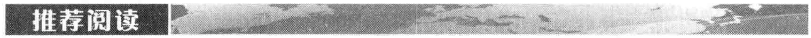
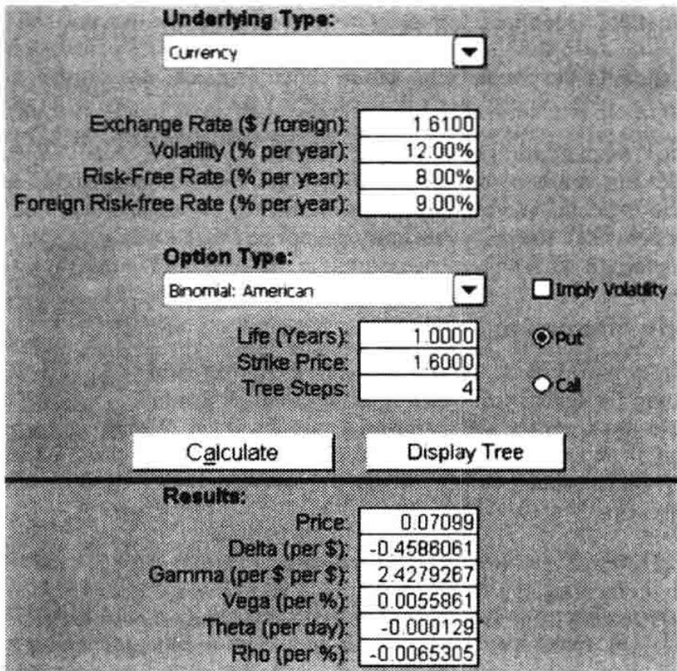
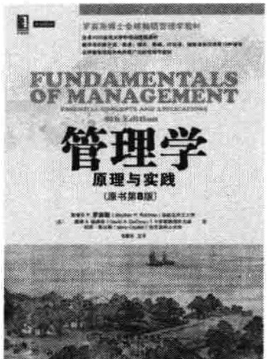
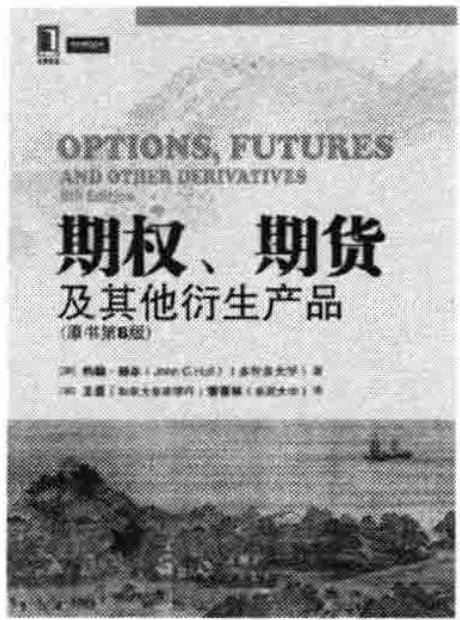

# 第36章 所有衍生产品使用者的教训

我们首先考虑一些对所有衍生产品使用者（不管是金融公司还是非金融公司）都适用的一些教训。




### 爱尔兰联合银行（Allied Irish Bank）

这家银行因为其外汇交易员约翰·拉斯纳克在若干年内的投机交易而损失了7亿美元，拉斯纳克以制造虚假期权交易的形式掩盖了他的损失。

### Amaranth 对冲基金

在 2006 年，这一对冲基金因为对天然气价格走向的赌博而蒙受 60 亿美元的损失。

### 巴林银行（Barings Bank）

这家运作了200年的英国老牌银行因为其外派新加坡的交易员尼克·利森的行为而在1995年毁于一旦。尼克·利森采用期货与期权对日经225指数进行了大笔的方向性投机，他最终给银行造成的损失高达10亿美元。

### 安然交易对手

通过一些极有想象力的合约，安然对自己的股东隐瞒了公司的真实情况。几家被指帮助安然实现目的的金融机构与安然股东们在庭外解决了纷争，所需至少有10亿美元。

### 基德公司

由于公司一名交易员约瑟夫·杰特的行为，这家纽约投资商在交易美国国债中损失了3.5亿美元。损失是由公司计算机系统计算盈利公式的错误而造成的。




### 联合里昂食品公司（Allied Lyons）

这家餐饮业公司的资金部在 1991 年因卖出美元/英镑的汇率看涨期权而损失 1.5 亿美元。

### 吉布森贺卡公司（Gibson Greetings）

这家制作礼品卡公司的资金部在 1994 年因与信孚银行交易结构性产品而损失了 2000 万美元。后来这家公司起诉了信孚银行，法律纠纷最终在庭外解决。

### 哈默史密斯－富勒姆区市政当局

这个英国的地方当局因为英镑互换与期权交易在1988年损失了近6亿美元，但使其交易对手恼火的是后来英国法院宣布所有这些合约都是无效的。

### 德国金属集团公司（Metallgesellschaft）

### 长期资本管理公司（LTCM）

在 1998 年，由于俄罗斯政府对自身所发行债券的违约以及随后的市场 “择优而栖” 现象，这家对冲基金损失了大约 40 亿美元。纽约联储银行组织了 14 家银行对该基金注资，从而使该基金能够得到有序的解体。

### 英国米德兰银行（Midland Bank）

这家英国银行在20世纪90年代初很大程度上因为对利率方向的错误赌博而损失了5亿美元。该银行后来被香港的汇丰银行兼并。

### 法国兴业银行

杰里米·科维尔在 2008 年 1 月因为对股指走向的投机行为而给这家法国银行造成了超过 70 亿美元的损失。

### 次级住房抵押贷款损失

在 2007 年，投资者对由美国次级住房抵押贷款产生的结构产品丧失了信心，从而导致了“信用紧缩”现象，许多像瑞银集团、美林（Merill Lynch）、花旗集团这样的金融机构都遭受了数百亿美元的损失。

### 瑞银集团

在2011年，由Kweku Adoboli擅自做出的一些股指投机交易导致瑞银集团损失了23亿美元。

这家德国公司与其客户签署了供应原油和汽油的长期合约，并利用对短期期货的延展来对冲风险，后来因为终止这项业务时损失了13亿美元。

### 奥兰治县

在 1994 年，由于奥兰治县的资金管理人罗伯特·西特仑的行为而使这个美国加州城市损失了近 20 亿美元，这位管理人利用衍生产品来对利率进行投机，他赌的是利率不会增长。

### 宝洁公司

在 1994 年，这家美国公司的资金部与信孚银行进行结构性产品交易时损失了大约 9000 万美元，后来这家公司起诉了信孚银行，法律纠纷最终在庭外解决。

### 壳牌原油公司

这家公司在日本子公司的一个雇员因交易未被授权的货币期货给公司造成了10亿美元的损失。

### 住友株式会社

在20世纪90年代，一位为这家日本公司工作的交易员在黄铜即期、期货以及期权市场的交易给公司带来了大约20亿美元的损失。

### 定义风险额度

所有的公司必须对自身所能承担的风险有一个清晰并且含义明确的定义，这一点至关重要。公司应该设定管理程序来保证风险额度的贯彻执行。整体的风险额度最好由董事会决定，然后这些额度应被转化为负责某种特定风险的管理人员的特定额度，每天的风险报告应该指明由市场变量变化所带来的盈亏，然后将这些数值与实际盈亏进行比较来保证产生报告所使用的定价工具的准确性。

在使用衍生产品时，公司尤其应该对自身面临的风险进行仔细的检测。正如我们在[第1章](ch01.md)看到的那样，衍生产品既可以被用来对冲风险也可以被用于进行投机与套利。如果不对风险进行仔细检测，我们几乎不可能知道交易员是否由一个对冲者变成了投机者，或者从一个套利者变成了一个投机者。巴林银行、兴业银行以及瑞银集团都是管理失败的典型案例。在这些案例中，交易员的任务是做一些低风险的套利与对冲交易，但在他们上司不知情的情况下，这些交易员都从套利与对冲变成了对市场变量的走向进行巨大赌博的投机者。他们所属银行的管理系统很不完善，以至于当时没有人知道他们在做什么。

我们这里的观点并不是说我们不能承担任何形式的风险。应当允许金融机构的交易员，或者基金经理对市场变量在将来的变化建仓，但我们在这里是想说明这些交易人员的交易量一定要受到某种制约，公司必须建立完善的系统从而准确地报告有关交易的风险。

### 认真对待风险额度

如果某个交易员在超过了风险额度的情况下取得了盈利，我们这时应该怎么办？对于管理部门来讲这是一个棘手的问题，交易员的盈利会使人们忽略其违犯风险额度的行为，但这是一种短见的做法，这样所形成的风险文化会对风险额度不再重视，也会给将来的灾难埋下隐患。在业界事例36-1和业界事例36-2中很多情形都是因为曾经承担过某些风险并因此盈利，这些公司对这些风险出现了一些过分自满的态度。

一个典型的例子是奥兰治县。罗伯特·西特仑在 1991 \~ 1993 年曾给奥兰治县带来了巨大的盈利，城市也依赖于他的交易收入作为运转资金。这使人们因为他的交易盈利而忽略了他所承担的风险，不幸的是西特仑在 1994 年的损失远远超过了他在此之前的盈利。

在盈利时对于违反交易额度的惩罚与在亏损时的惩罚要一视同仁，否则的话交易员在交易损失之后会增大自己的交易量来企图取得盈利并希望人们会忘记自己的交易损失。

### 不要认为你会猜透市场

有的交易员很可能比其他人更为优秀，但是没有任何人能够对市场做出永远正确的预测。交易员在所有的预测中有 $60\%$ 的正确率就已经相当不错了。一个交易员的突出战绩（像20世纪90年代初的罗伯特·西特仑）往往可能是由于运气，而并非是因为有更好的交易技巧。

假定某金融机构雇用了16名交易员，其中一位交易员在过去一年中每一个季度都带来盈利，这位交易员是否应拿到更多的分红呢？他的风险额度是否应该增加呢？对第一个问题的答案无疑是肯定的，但对于第二个问题的答案应该是否定的。在四个季度中均盈利的概率为 $0.5^{4}$ ，即 $1 / 16$ ，这意味着即使完全出于机遇，每16个交易员中也会有一位在每个季度都搞对。我们不应该相信交易员的运气会永远持续下去，因此我们不能因为交易员的暂时盈利而给他增加风险额度。

### 不要忽略多元化的好处

当交易员比较擅长预测某个市场变量时，公司常有给这些交易员增加额度的倾向，我们在上面指出，这么做可能是一个很糟糕的决策，这是因为交易员的交易结果可能是出于运气而并非是由于智慧。即使我们确信某交易员具备某种天赋，这时我们应该如何决定组合风险的集中程度来从这个交易员的天赋中盈利呢？答案是，风险分散所带来的好处是巨大的，放弃风险分散的好处而对某一个市场变量下赌注的做法往往是很不明智的。

我们用一个例子来说明这个问题，假定我们有20种股票，每个股票的预期收益均为 $10\%$ ，标准差均为 $30\%$ ，股票两两之间的相关性为0.2，投资者将资产以均等的形式投入这20种股票，投资者投资组合的预期收益为 $10\%$ ，标准差为 $14.7\%$ ，风险分散使得投资者的风险降低了超过了一半，我们也可以说风险分散使得我们对于每一份承担的风险所赚得的收益增大了一倍，只进行一种股票投资的投资者必须极端“聪明”才能取得比以上更好的风险-收益的权衡关系。

### 36.1.5 进行情形分析以及压力测试

在计算诸如 VaR 的风险度量时我们必须进行情形分析与压力测试，这会有助于我们进一步了解薄弱环节的风险。在第 22 章中，我们曾讨论过情形分析以及压力测试等管理工具，这些工具对于管理人员来讲是至关重要的。人类有一个很不好的倾向，那就是在做出决策时往往会过分地依赖一两个情形，例如在 1993 年及 1994 年，宝洁公司在其决策过程中如此相信利率会维持在低水平上，它们完全忽略了利率增长 100 个基点的可能性。

对于不同情形的构造，管理人员一定要有创造力，并且利用经验丰富的管理人员的判断。一种途径是选取10年或20的历史数据中最极端的事件作为分析的情形。如果对于关键变量缺乏数据，我们可以选某些相近的变量作为近似，可以将这些近似变量的历史收益数据作为是对于关键变量收益的近似。例如，假如我们对于某个国家发行的债券没有太多的历史数据，我们可以采用一些与其相似国家的债券作为近似，并从这些相似国家债券的历史数据中计算我们需要的情形。

## 36.2 对于金融机构的教训

在这一节里我们主要考虑金融机构应该吸取的教训。

### 36.2.1 对于交易员的管理

在交易大厅里往往有这样的倾向：那些交易表现出色的交易员往往是“碰不得”的，对于这些交易员的监管要松得多。很显然基德公司国债产品的明星交易员约瑟夫·杰特平时“很忙”，以至于他没有时间来回答公司风险管理人员的问题。

所有的交易员，特别是那些盈利高的交易员都应该对其行为负责，这一点至关重要。金融机构对某笔交易的高额盈利是否由于高风险所致应该有一个清醒的认识。另外，银行必须检验自身交易系统以及定价模型的准确性，并要确保这些交易工具没有被滥用。

### 36.2.2 确保前台、中台以及后台职责的分离

金融机构前台（front office）主要由交易员组成，这些交易员职责是进行交易，即对产品进行买卖；中台（middle office）主要是由风险管理人员所组成，这些风险管理人员的职责是监测所承受的风险；后台（back office）的职责主要是记账（record keeping）以及财会结算。有些金融衍生产品灾难的源头是没有对以上几个职能部门的职责加以严格区分，尼克·利森掌管了巴林银行在新加坡分行的前台与后台，因此他有机会在长时间内掩盖其大笔交易损失，远在伦敦的上级高管对他的行为竟毫无察觉。而杰里米·科维尔曾在兴业银行的后台工作过。在成为交易员后，他利用自己对银行系统的知识隐瞒了所做的交易。

### 36.2.3 不可盲目地相信模型

有些金融机构的大笔损失是由于所用模型与计算机系统错误而造成的。在业界事例5-1里我们曾经讨论过基德公司是如何被自己的计算机系统所愚弄的。

如果某家金融机构采用相对简单的交易策略而获得了大笔盈利，那么有很大可能是这家机构计算盈利的模型存在问题。类似地，如果某家金融机构对于某个特定产品报价一直比其他同业竞争者报价要好，那么有很大可能这家公司所采用的模型与其他市场参与者的模型有所不同，这时这家机构应对自己的模型进行仔细分析。对于交易平台的总管来讲，太多地获得某种单项生意和太少地获得某种单项生意一样令人担忧。

### 36.2.4 以保守的方式记录起始盈利

当金融机构向非金融机构出售非常复杂的结构性产品时，产品的价格会与模型有直接的关系。例如，产品中如果包含期限较长的利率期权，产品价格会同所采用的利率模型有相当大的关系。在这种情况下，市场上经常以按模型计价（mark to model）的方式来计算产品每天的价格变动，因为这时在市场上找不到类似的产品来作为对这些结构性产品定价的标准。

假定一金融机构出售给客户某产品的价格比实际价格或者模型价格高出1000万美元，这里的1000万美元被称为起始盈利（inception profit），这一起始盈利应该在什么时刻被记入账户呢？对于这笔盈利的处理方法有多种多样，有些银行会马上将这笔钱记入为盈利，而一些其他的银行会比较保守地在合约期限内逐渐地将这笔收入计入盈利账户。

将起始盈利马上记入盈利账户是一种非常危险的做法。这样做会鼓励交易员采用激进的模型，交易员会在挣得分红后，选择在模型以及交易价格受到严格审核之前离开银行。将起始盈利慢慢记入盈利账户的做法比较合理，这样做会使交易员在交易之前有动机去检测不同模型以及不同假设对于交易产品价格的影响。

### 36.2.5 不要向客户出售不适宜的产品

卖给客户不适宜产品对于金融机构来讲是很有诱惑力的，尤其是在客户具有承担某种风险的胃口时更为明显，但这么做是非常没有远见的。关于这一点最明显例子是信孚银行（BT）在1994年春季之前的一些交易行为，那时许多BT的客户被BT说服购买了许多高风险但对客户根本不适宜的产品，一个典型产品是给客户提供一个较大的机会节省几个基点的融资费用，但同时有一个较小的机会造成大笔费用的支出（如在业界事例33-4中提到过的5/30互换），这些产品在1992年及1993年给许多BT的客户带来了收益，但在1994年利率上涨时终于出现了问题，这些问题最终对BT的公众形象产生了很大伤害，随后BT需要花很多年时间去修复同企业客户之间的关系，BT在开发衍生产品上的名声因为几个激进的销售员而毁于一旦，并不得不向客户付出大笔赔偿以试图庭外解决法律纠纷。后来BT终于在1999年被德意志银行吞并。

### 36.2.6 小心轻而易举所得的盈利

从安然公司的例子我们可以看到，一些激进的交易人员如何能轻易地使他们所效力的银行遭受数十亿美元的损失。当时与安然做交易似乎很容易赚钱，许多银行都挤破头皮要与其交易，但事实上许多银行争先恐后与其所做的交易并不见得最终会使银行得到盈利。由于与安然所做的一些交易，一些银行被安然的股东们诉至法庭，而最终使这些银行损失了很大一笔钱。一般来讲，对很容易获利的一些交易，人们应当认真考虑其中潜在的风险。

一些由次级债生成的 ABS CDO 份额得到了 AAA 评级，但这些产品所付的利息远远高于普通 AAA 级别的产品，因此投资这些份额看来是个很好的机会。大部分投资人都没有想到去问一问，这些额外的回报来源是不是由于信用评级公司没有将某些风险考虑在内。

### 36.2.7 不要忽略流动性风险

在对于市场上交易不太活跃的奇异性产品定价时，金融工程师往往要依靠市场上交易活跃的产品价格，例如：

(1) 金融工程师往往采用市场上交易活跃的政府债券, 即指标债券 (on the run bonds) 来建立零息收益曲线, 然后利用这些曲线来对交易不活跃的产品即非指标债券 (off the run bonds) 进行定价。

(2) 金融工程师经常用交易活跃的期权价格来计算隐含资产波动率, 然后将这些波动率用于对市场上交易不活跃的产品进行定价。

(3) 金融工程师经常从交易活跃的利率交易产品（例如利率上限及利率期权）求得利率变动的隐含信息，然后将这些信息用于计算复杂的结构性产品的价格。

以上的做法并不是不合理，但是有时假设市场交易不频繁的产品交易价格与其理论价格等同的做法可能非常危险。当金融市场经历某种形式的风波之后，可能会产生“择优而栖”现象。这时流动性对于投资者来讲非常重要，而非流动性产品往往只能以同其理论价格相比有很大折扣的价格卖出，一起事例就发生在2007年9月，当时由于缺少了对次级房屋抵押贷款债券的信心，引发了信用市场的剧烈震荡。因此在交易决策中，如果假设流动性相对不好的产品在短期内售出的价格同其理论价值相同，那么很可能会造成危险的后果。

另一起由于流通风险造成重大损失的例子是业界事例 2-2 提到的长期资本管理公司（LTCM）。LTCM 采用的套利策略是收敛性套利（convergence arbitrage），在这种套利策略中需要识别理论价格应该一致的两种债券（或债券组合）。如果在市场上某种债券的价格较低，这时可以买入低价格债券而卖空高价格债券，这种套利的基本假设就是如果两个债券的理论价值一致，那么其市场价格最终也会一致。

在 1998 年夏天，LTCM 遭受了巨大损失。其损失的根本原因是俄罗斯政府对自己债券的违约导致市场上发生了“择优而栖”现象，LTCM在交易中持有流动性差产品的多头而同时持有流动性好产品的空头（例如，LTCM同时持有非指标债券多头与指标债券的空头）。在俄国债券违约后，流动性好的产品与流动性差的产品差价急剧增大，LTCM的杠杆效应又极强，因此在蒙受损失的同时又伴随着追加抵押金的要求，这时LTCM无法再满足追加抵押金的要求。

LTCM 的故事再一次突出了情形分析以及压力测试的重要性。通过这些分析我们可以看到最坏情形所对应的损失，LTCM 在决策过程中应该检验以前历史上所发生过的“择优而栖”现象，并以此来对自己面临的流动性风险进行定量化检测。

### 36.2.8 在所有人都做同样交易时应加倍小心

有时市场上许多参与者都在同时进行基本相同的交易，这种现象会造成危险的市场环境，市场会产生大幅度振荡，并使市场参与者蒙受巨大损失。

我们在第 19 章中曾给出了一个例子。这是关于资产组合保险策略与 1987 年 10 月的市场暴跌。在市场暴跌的前几个月里，有越来越多的交易组合管理人以合成看跌期权的形式来对他们的资产组合进行保护。组合管理人在市场升值时买入股票或股票指数期货，而在市场下跌时卖出股票或股票指数期货。这种策略会造成市场的不稳定，市场一个较小的下跌可能会造成资产管理者抛出股票的热潮，这一热潮会进一步使得市场下跌，然后会进一步促成投资组合管理人抛售股票。毫无疑问，如果没有投资组合保险策略的存在，1987 年 10 月股票的下跌也许不会那么严重。

另外一个例子是 1998 年发生在 LTCM 上的损失。LTCM 在遇到麻烦以后，其他采用同样收敛套利策略的对冲基金的行为使得 LTCM 的困境雪上加霜。在俄国债券违约造成“择优而栖”现象以后，LTCM 曾试图变卖自己的部分资产以满足抵押金的要求，不幸的是其他对冲基金也同时面临类似于 LTCM 所面临的问题，这些对冲基金也想做类似的交易，从而又使市场情况进一步恶化，导致流通差价变得比原来更大，这使得“择优而栖”现象更加严重。比如 LTCM 的头寸为美国国债，LTCM 持有流动性差的非指标债券多头以及持有流动性好的指标债券空头，当“择优而栖”现象产生后两种债券的收益率的差价增大，LTCM 只有变卖部分非指标债券并且同时买入指标债券，其他对冲基金也在进行同样的交易，所有这些交易促成了指标债券价格相对非指标债券价格继续上涨，从而使两种债券收益率的差价比以前更大。

还有一个例子是20世纪90年代后期的一些英国保险公司所受的损失。当时许多英国保险公司都卖出了大量的保险合约，在这些保险合约中保险公司承诺投保者在退休时收到的年保金（annuity）收益率要远高于市场上及其他锁定利息的产品。如果长期利率低于保险公司所承诺的收益率，那么保险公司将会赔钱。由于多方面原因，所有这些保险公司都利用衍生产品来对冲自己面临的部分风险，而同保险公司进行交易的金融机构决定买入长期英镑国债来对冲自己面临的风险，这就造成了债券市场价格的上扬，因此利率下降。这时在市场上需要购买更多的国债来维持动态对冲，从而造成英镑长期利率进一步下降。金融机构因长期利率的下降而蒙受了损失，而保险公司发现由于自己没有选择对冲的一些风险而处境更为糟糕。

从这些故事中我们得到的主要教训是对于金融市场的整体认识至关重要。当市场许多参与者都采用相似的交易策略时，我们应该对市场隐含的内在危机保持清醒的认识。

### 36.2.9 不能过多地用短期资金来满足长期需要

所有的金融机构都在一定程度上用短期资金来满足长期的需要。但是，如果金融机构过多

地依赖短期资金将会使其暴露于难以承受的流动性风险之中。

假设一家金融机构采用在每个月都延伸商业票据的方式为长期需要提供资金，在4月1号发行的商业票据将以在5月1号发行的商业票据来兑现，而这个新的商业票据将以在6月1号发行的商业票据来兑现，依此类推。只要市场认为这家金融机构是健康的，那么这样做是没有问题的，但是如果投资人一旦对其失去信心（不管是对还是错），向前延伸商业票据的做法将会行不通，从而金融机构将会遭遇严重的流动性问题。

在金融危机时，许多金融机构的失败都是由于过多依赖短期资金造成的（例如，雷曼兄弟和北岩银行），因此，为国际性银行提供监管的巴塞尔委员会正在提出银行应当满足的流动性指标。

### 36.2.10 市场透明度至关重要

2007 年的信用紧缩给我们的教训之一是市场透明度的重要性。在 2007 年之前，交易高度结构性产品的投资者对标的资产缺乏认识，他们唯一所知的仅是评级公司对于资产的评级。从事后来看，我们认为投资者当时应该对标的资产有所了解，并且认真检验自身所承担的风险。但我们必须承认，事后诸葛亮总是好做！

由于2007年次级债券危机，投资者对所有的结构性产品都丧失了信心，并纷纷撤离这一市场，因而造成了结构性产品市场的崩溃，结构产品份额所能卖出的价格远远低于其理论价格。伴着“择优而栖”现象的出现，信用溢差进一步增大。如果市场具有透明度，投资者了解自己买入的资产担保债券产品，虽然次债仍会产生一定损失，但“择优而栖”现象以及市场震荡的效应就不会那么强。

### 36.2.11 管理奖励制度

2007 年和 2008 年的信用危机给我们的一个关键教训是奖励制度的重要性。银行的奖励制度常常强调雇员的短期表现，现在有的金融机构已经改变奖励制度，奖金是基于在长于 1 年内的表现（比如 5 年）。这样做的优势是很明显的，它将会阻止交易员去做那些在近期看起来很好但在将来可能会造成巨大损失的生意。

当贷款被债券化时，使放贷人的利益与最终承担风险的投资人利益相一致是很重要的，这样的话放贷人将不会有谎报贷款质量的动机。一种达到这个目的方式是监管部门要求贷款组合的放贷人保留一部分由组合产生的所有份额以及其他产品。

### 36.2.12 永远不能忽略风险管理

当一切都好（或看起来挺好）时，人们常常会有假定情况永远不会变糟的倾向，并且常会忽略风险管理部门所做的压力测验以及其他分析的结果。在2007年的信用危机之前，常常会听到一些风险管理被忽视的故事。在2007年7月（信用危机之前），花旗集团总裁查克·普林斯所做的评论正是这种对风险管理错误态度的例子：

当音乐停止时，就流动性而言，情况会很复杂。但是只要音乐还在演奏，你就该起身跳舞。我们还在跳。

查克·普林斯先生在当年的下半年丢了工作，花旗集团由于信用危机所造成的损失高于500亿美元！

## 36.3 对于非金融机构的教训

在这一节里我们主要考虑非金融结构应该吸取的教训。

### 36.3.1 理解你的交易

企业一定不要去做自己不完全理解的交易，并且不要去采用自己不完全理解的交易策略。这听起来是件十分明显的事，但在蒙受许多巨大损失之后，我们往往会惊讶地发现非金融机构的交易员承认自己对所做交易的无知，并且常常声称自己的错误是由于投资银行的误导而造成的。奥兰治县的资金主管罗伯特·西特仑就是其中一位，还有哈默史密斯－富勒姆区的交易员。虽然他们的交易量巨大，但他们对于利率互换与其他利率衍生产品的无知程度令人吃惊。

如果一个企业的高管对于下级所提出的交易不理解，那么这个交易是不应该被通过的。一个简单的约定俗成的规则是：如果进行一个交易的动机是如此复杂，以至于管理人员都不能理解，这时我们基本上可以肯定这一交易对企业来讲是不合适的。如果采用这一规则的话，宝洁公司和基布森礼品公司所遭受的损失都会得到避免。

一种保证彻底理解金融产品的方式是对这一产品进行定价，如果一个企业没有自己的雇员能去对产品进行定价，那么企业就不应该交易这种产品。在实际中企业常常依赖自己的投资银行给出关于价格的建议，这样做是很危险的。宝洁公司以及基布森礼品公司的案例就说明了这一点，当企业想对交易进行平仓时，产品的价格是由信孚银行（Bankers Trust）的特有模型计算得出的，它们根本不可能对价格做任何的检验。

### 36.3.2 确保对冲者不变成投机者

现实中一个不幸的事实是对冲交易相对枯燥无味，而投机行为却充满刺激。当一家公司雇用了一名交易员来管理其外汇、商品以及利率风险时，以下的危险现象可能会产生：在最初时交易员工作勤奋，并且赢得了公司高管的信任。他/她会对公司的风险敞口进行评估并采取对冲措施，但随着时间的推移，交易员逐渐认为自己可以看准市场走势，并渐渐地会变成投机者。在刚刚开始投机时，可能会一切顺利，但不久产生了交易损失。为了掩盖损失，交易员会将交易量加倍来进行赌博，进而又可能触发更大的损失，久而久之交易员的行为可能会造成灾难性的损失。

就像我们以前讨论的那样，风险额度一定要由高管来事先确定，对于额度的实施要设立一定的控制环节，企业在进行交易之前要首先对自身面临的外汇、利率、商品等风险做一个分析，交易决策是为了如何保证将风险控制在一定的可接受范围内，企业的交易与企业的风险敞口脱节是出现问题的明显前兆。

### 36.3.3 要警惕将资金部变成盈利中心

在过去的20年内有一种将公司的资金部变为盈利中心的趋势，这么做看起来似乎有一定好处，资金部有动机去减小融资费用并且尽可能提高自身的风险盈利，问题是资金部所能取得的盈利是有限的，在进行融资或者将额外资金进行投资时，资金主管面临的市场是一个有效市场，资金部只有在承担更大风险的前提下才能改善自身的管理底线（即降低融资成本），公司的对冲项目会给资金部主管采取英明决策来提高盈利的机会，但我们应该牢记对冲的主要目的是为了减小风险而不是增加预期盈利。如[第3章](ch03.md)所述，采用对冲决策后的结果比不采用任何对冲决策的结果更糟的可能性是 $50\%$ 。因此如果将资金部变为盈利中心，这样做的危险是将会使资金部（主管）成为投机者，因此像奥兰治县、宝洁公司和吉布森贺卡公司的现象也就容易产生。

由于使用衍生产品而带来的巨大损失使许多资金部管理人员忧心忡忡，针对这些损失，一些非金融机构宣称他们要缩减甚至杜绝使用衍生产品，这一决定很不幸，因为衍生产品确实可以给资金管理人员提供一些管理风险的有效工具。

不当，在这些情形中，那些有明确或不明确责任对公司风险进行对冲的雇员却对风险进行了投机。

这些损失突出了我们在[第1章](ch01.md)中提出的观点：衍生产品既可用于对冲也可用于投机。也就是说衍生产品既可减低风险也可以增加风险。损失产生的大多数情形是因为对衍生产品使用

由这些损失所得出的一个重要教训是内部控制的重要性。公司高管一定要对衍生产品的使用政策，以及允许雇员对市场变动所取的头寸有一个明确的说明。管理人员要确保内控和政策的实施。如果仅仅给予某个人交易衍生产品的授权，但同时对这个人没有实现风险监控，往往会带来金融灾难。

Dunbar, N. Inventing Money: The Story of Long-Term Capital Management and the Legends Behind It. Chichester, UK: Wiley, 2000.

Jorion, P. "How Long-Term Lost Its Capital," Risk (September 1999).

Jorion, P., and R. Roper. Big Bets Gone Bad: Derivatives and Bankruptcy in Orange County. New York: Academic Press, 1995.

Persaud, A. D. (ed.) Liquidity Black Holes: Understanding, Quantifying and Managing Financial Liquidity Risk. London, Risk Books, 2003.

Sorkin, A. R., Too Big to Fail. New York: Penguin, 2009.

Tett, G. Fool's Gold: How the Bold Dream of a Small Tribe at J.P. Morgan Was Corrupted by Wall Street Greed and Unleashed a Catastrophe. New York: Free Press, 2009.

## 术语表

(次序以原文字母顺序为准)

### A

ABS 见资产支持证券（Asset-Backed Security）。ABS CDO 由 ABS 所派生出的份额产品。

Accrual Swap 计息互换 利率互换的一种变形，一方的利息只在满足一定的条件时才进行累积。

Accrued Interest 应计利息 自上一个券息付出日到今天为止债券所累积的券息。

Adaptive Mesh Model 自适应网格模型 由 Figlewski 和 Gao 提出的一种模型，该模型在资产价格的重要区域上自动由粗网格的树形变成细网格的树形。

Agency Costs 代理费用 由于管理人不以股权人的利益为主，而给股权人带来的费用。

American Option 美式期权 一种在期权期限内随时可以行使的期权。

Amortizing Swap 摊还互换 在互换交易中的面值按某种指定的方式递减。

Analytic Result 解析结果 一种被某种方程式所表达的结果。

Arbitrage 套利 由两种或更多产品价格之间的差异中锁定盈利的投资方式。

Arbitrageur 套利者 套利的参与者。

Asian Option 亚式期权 期权收益与指定时间段内标的资产的平均价格有关。

Ask Price 卖盘价 交易商卖出资产的价格，也被称为卖出价（Offer Price）。

Asked Price 索取价 见卖盘价（Ask Price）。

Asset-Backed Security, ABS 资产支持证券由贷款组合、证券、信用卡应收款以及其他资产所派生出的债券产品。

Asset-or-Nothing Call Option 资产或空手看涨期权 当标的资产价格高于执行价格时，期权收益等于标的资产的价格，否则期权收益为0。

Asset-or-Nothing Put Option 资产或空手看跌期权 当标的资产价格低于执行价格时，期权收益等于标的资产的价格，否则期权收益为0。

Asset Swap 资产互换 债券的券息与 LIBOR 加上溢差进行交换而形成的互换。

As-You-Like-It Option 任选期权 见选择人期权 (Chooser Option)。

At-the-Money Option 平值期权 期权执行价格等于标的资产价格。

Average Price Call Option 平均价格看涨期权期权收益等于标的资产价格平均值与执行价格之差与0之间的最大值。

Average Price Put Option 平均价格看跌期权期权收益等于执行价格与资产价格平均值的差与0之间的最大值。

Average Strike Option 平均执行价格期权 期权收益依赖于资产价格与资产价格平均值的差。

### B

Backdating 倒填日期 将文件日期修改成早于当前日期的行为（常常是违法的）。

Back Testing 回顾测试 利用历史数据对 VaR 进行检测的方式。

Backwards Induction 倒推归纳 一种由树形的末端倒推到树的起点来对期权定价的过程。

Barrier Option 障碍期权 期权收益与标的资产的价格是否达到一定的障碍水平（即事先约定的水平）有关。

Base Correlation 基础相关系数 对于一个 X 值，由该相关系数所求出的由 0% \~ X % 的 CDO 份额价值与市场价值一致。

Basel Committee 巴塞尔委员会 负责全球银行监管的国际性委员会。

Basis 基差 商品即期价格与期货价格之间的差别。

Basis Point 基点 在描述利率时，一个基点等于百分之一的百分之一（即 $0.01\%$ ）。

Basis Risk 基差风险 在对冲时由于将来基差的

不定性所引起的风险。

Basis Swap 基差互换 互换交易两方的利率计算分别与两个不同的浮动利率有关。

Basket Credit Default Swap 篮筐式信用违约互换 具有多个参考实体的信用违约互换。

Basket Option 篮筐式期权 收益依赖于资产交易组合价值的期权。

Bear Spread 熊市差价 执行价格为 $K_{1}$ 的看跌期权空头头寸与执行价格为 $K_{2}$ 的看跌期权多头头寸的组合，其中 $K_{2} > K_{1}$ （熊市差价也可以由看涨期权来组成）。

Bermudan Option 百慕大式期权 期权持有者在期权期限内的一些指定的时间点上可以行使期权。

Beta 贝塔 用于度量一个资产系统风险的测度。

Bid-Ask Spread 买入索取差价 见买入卖出差价（Bid-Offer Spread）。

Bid-Offer Spread 买入卖出差价 卖出（或索取）价格与买入价格的差别。

Bid Price 买入价 交易商准备买入某资产所付的价格。

Bilateral Clearing 双边结算 场外市场交易双方设定的交易协议，双边协议通常会以国际互换和衍生产品协会（ISDA）设定的主协议为基础。

Binary Credit Default Swap 两点式信用违约互换在此合约中，当参考实体违约时会触发一个固定数量的收益。

Binary Option 两值期权 具有不连续收益形式的期权。例如，现金或空手期权（Cash-or-Nothing Option）以及资产或空手期权（Asset-or-Nothing Option）。

Binomial Model 二项式模型 用于描述资产在一系列相继小时间区间内价格变化的模型。假设在一个小时间区间内价格变化只有两种可能。

Binomial Tree 二叉树 在二项式模型假设下描述资产变化的树形结构。

Bivariate Normal Distribution 二元正态分布 由两个相关并且分别服从正态分布的变量所组成的联合分布。

Black's Approximation 布莱克近似 由 Fisher Black 提出的用于对标的资产为支付股息股票的期权定价的近似方法。

Black's Model 布莱克模型 用于欧式期货期权定价的模型，这是布莱克－斯科尔斯模型的推广，当资产价格在到期日服从对数正态分布时，这种欧式期权定价模型有着广泛的应用。

Black-Scholes-Merton Model 布莱克-斯科尔斯-莫顿模型 一种用于股票欧式期权的定价模型，由 Fisher Black, Myron Scholes 和 Robert Merton 建立。

Bond Option 债券期权 标的资产为债券的期权。

Bond Yield 债券收益率 使得债券资金流的贴现总和等于债券市场价格的贴现利率。

Bootstrap Method 票息剥离方法 由市场数据来计算零息收益率的一种方法。

Boston Option 波士顿期权 见延迟付款期权 (Deferred Payment Option)。

Box Spread 盒式差价 由一个由看涨期权组成的牛市差价和一个由看跌期权组成的熊市差价所组成的期权组合。

Break Forward 断点远期 见延迟付款期权 (Deferred Payment Option)。

Brownian Motion 布朗运动 见维纳过程（Wieder Process）。

Bull Spread 牛市差价 执行价格为 $K_{1}$ 的看涨期权的多头头寸与执行价格为 $K_{2}$ 的看涨期权的空头头寸的组合，其中 $K_{2} > K_{1}$ （牛市差价也可以由看跌期权来组成）。

Butterfly Spread 蝶式差价 此交易由执行价格为 $K_{1}$ 的看涨期权的多头头寸，执行价格为 $K_{3}$ 的看涨期权的多头头寸，以及两倍数量的执行价格为 $K_{2}$ 的看涨期权的空头头寸组合而成，其中 $K_{3} > K_{2} > K_{1}, K_{2} = 0.5(K_{1} + K_{3})$ （蝶式差价也可以由看跌期权来组成）。

### C

Calendar Spread 日历差价 日历差价可以由一个具有某一执行价格与一定期限的看涨期权空头头寸和具有同样执行价格，但具有较长期限看涨期权多头头寸来构成（日历差价也可以由看跌期权来构成）。

Calibration 校正 由市场上交易活跃的产品价格来计算隐含参数的方法。

Callable Bond 可赎回债券 债券上条款注明发行者可在债券期限内的某些指定时间以约定的

价格将债券购回。

Call Option 看涨期权 在将来时刻以指定价格买入资产的权力。

Cancelable Swap 可取消互换 互换的一方可以在指定的日期上终止互换交易。

Cap 上限 见利率上限（Interest Rate Cap）。

Cap Rate 上限利率 决定利率上限收益的利率。

Capital Asset Pricing Model 资本资产定价模型关于资产预期收益与资产的 Beta 系数之间关系的模型。

Caplet 上限单元 利率上限的组成成分。

Case-Shiller Index 凯斯－席勒指数 美国的房屋价格指数。

Cash Flow Mapping 现金流映射 一种为了计算 VaR 而将产品拆解为一套标准零息债券的方法。

Cash-or-Nothing Call Option 现金或空手看涨期权 当标的资产价格高于执行价格时，期权收益等于固定的现金数量，否则期权收益为0。

Cash-or-Nothing Put Option 现金或空手看跌期权 当标的资产价格低于执行价格时，期权收益等于固定的现金数量，否则期权收益为0。

Cash Settlement 现金交割 以现金而不是以实物形式将交易进行交割的方式。

CAT Bond CAT 债券 债券的券息以至于本金都可能在某种灾难（catastrophic）保险赔偿超出一定数量后被扣除。

CCP 见中央结算对手（Central Clearing Party）。

Cooling Degree Days, CDD 降温天数 平均温度超出华氏65度的数量与0之间的最大值，这里平均温度是指最高温度与最低温度的平均（子夜到子夜）。

CDO 见债务抵押债券（Collateralized Debt Obligation）。

CDO Squared CDO 平方 该债券的抵押证券组合由 CDO 份额组成，其信用风险的分配再以份额形式被分派到债券之中。

CDS 见信用违约互换（Credit Default Swap）。

CDS Spread CDS 溢差 在 CDS 合约中，买入信用违约保护需要支付费用（以基点计量）。

CDX NA IG 由 125 家北美投资级公司构成的资产组合。

CEBO 见信用事件两点式期权（Credit Event Binary Option）。

Central Clearing 中心结算 用于场外交易的结算方法。

Central Clearing Party 中央结算对手 场外交易的中央结算机构。

Central Counterparty 中央交易对手 场外交易的中央交易对手，也是场外交易的中央结算机构。

Cheapest-to-Deliver Bond 最便宜可交割债券芝加哥期货交易所的债券期货中可以用于交割的最便宜的债券。

Cholesky Decomposition 乔里斯基分解 乔里斯基分解是对矩阵进行分解的一种方法，借助于此，我们可由相互无关的随机抽样来产生具有一定相关性的抽样。

Chooser Option 选择人期权 期权持有人在将来某时刻行使期权时可以选择拥有看涨期权或看跌期权。

Class of Options 期权分类 见期权分类（Option Class）。

Clean Price of Bond 债券除息价格（洁净价）债券的报价，买入债券的价格（带息价格）等于这一报价加上应计利息。

Clearing House 结算中心 交易所设定的、保证交易双方履行交易所衍生产品交割义务的实体（也被称为结算机构）。

Clearing Margin 结算保证金 结算中心所要求的保证金数量。

Cliquet Option 棘轮期权 具有确定执行价格规则的一系列看涨及看跌期权组合，一般是一个期权结束时，另外一个期权才会开始。

CMO 见房产抵押债券（Collateralized Mortgage Obligation）。

Collar 双限 见利率双限（Interest Rate Collar）。

Collateralization 抵押品策略 在衍生产品交易中一方向另一方提供抵押品的运作方式。

Collateralized Debt Obligation 债务抵押债券一种将信用风险打包的方式，这是一个由某种交易组合派生出来几种不同债券的形式，违约的摊派服从事先指明的规则。

Collateralized Mortgage Obligation 房产抵押债券 这是一个由房屋贷款派生出的债券形式。债券投资者被分成若干类，本金的偿还以事先指明的规则被分配给不同的投资者。

Combination 组合 同一标的资产的看涨和看跌期权组合。

Commodity Futures Trading Commission 商品期货交易管理委员会 此委员会的职责是对美国商品期货交易进行监管。

Commodity Swap 商品互换 互换交易一方的现金流与商品价格有关。

Compound correlation 复合相关系数 由 CDO 份额所隐含的相关系数。

Compound Option 复合期权 期权上的期权。

Compounding Frequency 复利频率 用于计算利率的约定方式。

Compounding Swap 复合利率互换 互换的利息不在中间交换，而是复合到最后进行交换。

Conditional Value at Risk, C-VaR 条件 VaR 在 $(100 - X)\%$ 的盈利/亏损分布的条件下，在 $N$ 天内的损失期望值。其中， $N$ 为展望期， $X\%$ 为置信水平。

Confirmation 交易确认书 在场外市场用于确认双方口头交易的书面合约。

Constant Elasticity of Variance (CEV) Model 常方差弹性模型 在一个短时间内，此模型所描述变量变化的方差与变量本身的大小成正比。

Constant Maturity Swap, CMS 固定期限互换 互换协议中的一方的利率为某一固定期限的互换利率，另一方为浮动利率或固定利率。

Constant Maturity Treasury Swap 固定期限国债互换 互换协议一方的利率是基于国债的收益率，另外一方是基于固定利率或浮动利率。

Consumption Asset 消费资产 用于消费而不是投资的资产。

Contango 期货溢价 期货价格高于将来即期价格的期望值。

Continuous Compounding 连续复利 利率报价的一种方式，当报价复利区间变得越来越小时，其极限形式就是这里的连续复利。

Control Variate Technique 控制变量技术 这种技术可用于改善数值计算的精度。

Convenience Yield 便利收益率 用于计量拥有某种资产而带来的便利，这种便利是期货合约的多头头寸持有者所不拥有的。

Conversion Factor 转换因子 在芝加哥交易所中交易的期货合同中用于计算交割债券数量的

因子。

Convertible Bond 可转换债券 一种由公司发行的并可以在债券期限某时刻转换为一定数量股权的债券。

Convexity 曲率 测定债券价格同收益率之间曲线函数的曲率。

Convexity Adjustment 曲率调整 这一术语被应用之处很多，例如它可以用于描述将期货利率转换为远期利率的调节量，它还可以用于将对某些产品利用布莱克模型定价时对于远期利率的调节。

Copula 一种由已知变量之间相关系数来定义联合分布的方法。

Cornish-Fisher Expansion 科尼什－费雪展开概率分布的百分位数与其矩之间的近似关系。

Cost of Carry 持有成本 存储成本加上购买资产融资费用再减去资本的收益。

Counterparty 交易对手 金融交易的另一方。

Coupon 券息 债券所付的利息。

Covariance 协方差 描述两个变量之间的相互关系（等于变量的相关系数乘以它们的标准差）。

Covariance Matrix 协方差矩阵 见方差 - 协方差矩阵（Variance-Covariance Matrix）。

Covered Call 备保看涨期权 持有欧式期权空头头寸与持有资产多头头寸的组合。

Crashophobia 暴跌恐惧症 人们对于类似 1987 年股票大跌的恐惧症，有人认为这一现象造成了市场参与者提高了深度虚值看跌期权的价值。

Credit Contagion 信用蔓延 一家公司的违约导致其他公司也会违约的倾向。

Credit Default Swap 信用违约互换 信用违约互换的买入方可以在债券违约时以面值的价格将债券卖给信用互换的卖出方。

Credit Derivative 信用衍生产品 收益与某家公司或多家公司信用有关的衍生产品合约。

Credit Event 信用事件 触发信用衍生品支付的事件，比如破产或改组事件等。

Credit Event Binary Option 信用事件两点式期权是一种场内衍生品。当参考实体出现违约事件时，该产品会支付一个固定支付数量。

Credit Index 信用指数 跟踪购买关于交易组合内每个公司的信用保护费用的指数（例如，CDX NA IG 和 iTraxx Europe）。

Credit Rating 信用等级 债券信用的一种度量。

Credit Ratings Transition Matrix 信用评级转移矩阵 此矩阵给出了某公司在某时间内由某一信用等级转换为另一信用等级的概率。

Credit Risk 信用风险 在衍生产品交易中因为交易对手违约而造成的风险。

Credit Spread Option 信用差价期权 期权收益与两个资产收益率之差有关。

Credit Support Annex, CSA 信用支持附约 在 ISDA 主协议中（ISDA Master Agreement），关于抵押品的说明文件。

Credit Value Adjustment, CVA 信用价值调节量对衍生产品价值的调节，以反映交易对手的风险。

Credit Value at Risk 信用风险价值度 对应于某一置信区间，信用损失不能超出的数量。

CreditMetrics 一种计算信用风险价值度的系统。

Cross Hedging 交叉对冲 采用不同的资产来对冲另一资产所产生的风险敞口。

Cumulative Distribution Function 累积分布函数变量小于 $x$ 的概率作为自变量 $x$ 的函数。

Currency Swap 货币互换 某种货币的本金以及利息同另外一种货币的本金以及利息进行互换的合约。

CVA 见信用价值调节量。

### D

Day Count 计天方式 为了计算利息而设定的用于计算天数的方法。

Day Trade 即日交易 在当天进入并在同一天平仓的交易。

Debt (Debit) Value Adjustment, DVA 债务价值调节量 一家公司对于衍生品可能会违约，因此给自身带来的价值。

Default Correlation 违约相关性 用于计量两个公司同时违约的趋势。

Default Intensity 违约密度 见风险率（Hazard Rate）。

Default Probability Density 违约概率密度 度量在将来短暂区间内的无条件违约概率。

Deferred Payment Option 延迟付款期权 期权费用被推迟到期权的到期日付出。

Deferred Swap 延期互换 在将来开始的互换交

易，也被称为远期互换（Forward Swap）。

Delivery Price 交割价格 在远期合约中同意（可能在一段时间之前）收入或付出的价格。

Delta 衍生产品价格变化同标的资产价格变化的比率。

Delta Hedging Delta 对冲 为了使衍生产品交易组合价格与标的资产价格微小变化无关的一种对冲机制。

Delta-Neutral Portfolio Delta 中性交易组合
Delta 为 0 的交易组合，这种交易组合的价格同标的资产价格的微小变化无关。

DerivaGem 在作者网页上可以下载的用于计算期权价格的软件。

Derivative 衍生产品 由某种资产而派生出来的产品。

Deterministic Variable 确定性（非随机）变量变量在将来的值是已知的。

Diagonal Spread 对角差价 两个具有不同期限与不同执行价格的看涨期权组合（对角差价也可以由看跌期权来组成）。

Differential Swap 交叉货币度量互换 互换交易中将一种货币下的浮动利率与另一种货币下的浮动利率相交换，两种利率均应用同一本金。

Diffusion Process 扩散过程 在此模型下，资产以连续形式变化。

Dirty Price of Bond 带息价格 债券的现金价格。

Discount Bond 折扣债券 见零息债券（Zero Coupon Bond）。

Discount Instrument 折扣产品 不提供券息的产品，例如短期国债。

Diversification 分散化 将投资组合分布于不同资产的投资方式。

Discount Rate 贴现率 由短期债券或其他产品收益占面值的百分比所得出的年收益率。

Dividend 股息 股票发行人给出的现金收益。

Dividend Yield 股息收益率 票息与股票价格的百分比。

Dodd-Frank Act 《多德－弗兰克法案》 在 2010 年美国设立的新法案，其目的是保护消费者和投资人、避免未来对银行的救助、更加审慎地对金融系统进行监督等。

Dollar Duration 绝对额久期 债券的修正久期与债券价格的乘积。

DOOM Option DOOM 期权 末日期权，芝加哥交易所提供的一种深度虚值（deep-out-of-the-money）看跌期权。

Down-and-In Option 下降－敲入期权 标的资产价格下跌到一定水平之后，这一期权才会存在。

Down-and-Out Option 下降－敲出期权 标的资产价格下跌到一定水平之后，这一期权将不再存在。

Downgrade Trigger 降级触发 合约中的一种条款，它指明当某方的信用评级低于一定水平时，合约将终止，并以现金交割。

Drift Rate 漂移变化率 一个随机变量在每单位时间的平均增长量。

Duration 久期 用以度量债券的平均寿命，这一测度也是债券价格百分比变化同债券收益率变化比率的近似。

Duration Matching 久期匹配 将金融机构资产久期与负债久期进行匹配的一种过程。

DV01 利率变化一个基点所对应的价值变化。

DVA 见债务价值调节量。

Dynamic Hedging 动态对冲 为了对冲期权头寸，需要不断调节持有的标的资产数量的对冲过程。对冲目的一般是为了保证交易组合 Delta 中性。

### E

Early Exercise 提前行使 在到期前行使期权。

Effective Federal Funds Rate 有效联邦基金利率对于促成交易（brokered transition）的联邦基金利率的加权平均。

Efficient Market Hypothesis 有效市场假设 资产价格反映了相关信息的一种假设。

Electronic Trading 电子交易 使得买方与卖方得到匹配的电子计算机系统。

Embedded Option 内含期权 产品中不可分割的期权部分。

Empirical Research 实证研究 基于历史数据的研究方式。

Employee Stock Option 雇员股票期权 作为薪酬的一部分，公司给予雇员的公司股票看涨期权。

Equilibrium Model 均衡模型 一种由经济模型来

导出的利率变化模型。

Equity Swap 股权互换 股票（或股票组合）收益与固定利率或浮动利率进行交换的合约。

Equity Tranche 股权份额 首先承担损失的份额。

Equivalent Annual Interest Rate 等价年利率 每年复利利率。

Euribor 欧元区内银行间拆借利率。

Eurocurrency 欧洲货币 一种脱离其发行国的货币控制系统的货币。

Eurodollar 欧洲美元 存于美国之外银行的美元。

Eurodollar Futures Contract 欧洲美元期货合约关于欧洲美元的期货合约。

Eurodollar Interest Rate 欧洲美元利率 欧洲美元存款利率。

Euro LIBOR 欧元 LIBOR 欧元的同业拆借利率。

European Option 欧式期权 只能在期权到期日才能被行使的期权。

EWMA 指数加权移动平均。

Exchange Option 互换期权 期权持有者有权以一种资产来换取另一种资产。

Ex-dividend Date 除息日 当公布票息时，除息日也被指明，在除息日之前买入股票的投资者会收到股息。

Exercise Limit 行使限额 期权持有人在任意5个连续的交易日可行使期权的最大限额。

Exercise Multiple 行使倍数 在雇员期权被行使时股票价格与执行价格的比。

Exercise Price 执行价格 在期权合约中资产可以被买入或被卖出的固定价格（此价格也被称为敲定价格（Strike Price））。

Exotic Option 特种期权 非标准期权。

Expectations Theory 预期理论 该理论认为远期利率等于未来的即期利率的期望值。

Expected Shortfall 预期亏损 见条件风险价值度（Conditional Value at Risk）。

Expected Value of a Variable 变量的期望值 变量的取值被其出现概率加权后得出的加权平均值。

Expiration Date 到期日 合约期限的终止日。

Explicit Finite Difference Method 显式有限差分方法通过求解微分方程来对衍生产品定价的一种方法。衍生产品在时间 t 的价格与其在时间 $t + \Delta t$ 的三个价格存在一种关系，这一方法在实质上就是三叉树方法。

指数加权移动平均模型 对于历史数据给予某种指数权重来进行预测的模型，有时这种模型被用于计算与 VaR 相关的方差以及协方差的计算。

Exponential Weighting 指数加权 这种加权方式与数据的新旧有关，对于 $t$ 时刻的加权权重等于 $\lambda$ 乘以 $t - 1$ 时刻的权重，这里 $\lambda < 1$ 。

Exposure 风险敞口 对手违约带来的损失最大值。

Extendable Bond 可展期债券 债券持有人有权延长债券的期限。

Extendable Swap 可延期互换 互换的一方有权延长互换的期限。

### F

Factor 因子 不定性的起源。

Factor Analysis 因子分析 这一方法与主成分分析法（Principal Component Analysis）相似，其目的是在分析许多变量的相关变化中，找出少量但可解释大部分变化的因素。

FAS 123 美国关于雇员期权的会计准则。

FAS 133 美国关于用于对冲产品的会计准则。

FASB 财务会计准则委员会。

Federal Funds Rate 联邦基金利率 银行间的隔夜贷款利率。

FICO 由 Fair Isaac 公司研发出的信用评分。

Financial Intermediary 金融媒介 在经济环境中对不同实体的资金流动提供协助的银行或其他金融机构。

Finite Difference Method 有限差分法 对微分方程的一种求解方法。

Flat Volatility 单一波动率 当对上限定价时，采用同一波动率来对所有的上限单元定价时的波动率。

Flex Option 灵活期权 交易所内交易员可提供的非标准化条款期权。

Flexi Cap Flexi 上限 在此上限（Cap）交易中，可行使的上限单元数量被限制。

Floor 下限 见利率下限（Interest Rate Floor）。

Floor-Ceiling Agreement 下限 - 上限协议 见双限（Collar）。

Floorlet 下限单元 利率下限交易中对应于一段时间区间的组成元素。

Floor Rate 下限利率 利率下限交易中标明的利率。

Foreign Currency Option 外汇期权 有关汇率的期权。

Forward Contract 远期合约 合约约定买方和卖方在将来某指定时刻以指定价格买入或卖出某种资产。

Forward Exchange Rate 远期汇率 汇率的远期合约价格。

Forward Interest Rate 远期利率 由今天市场利率所得出的应用于将来某时间段的利率。

Forward Price 远期价格 远期合约中使得合约价格为0的交割价格。

Forward Rate 远期率 由今天的零息利率所隐含出的用于将来时间段的利率。

Forward Rate Agreement, FRA 远期利率合约交易双方达成的在将来某时刻以某种固定利率对于一定面值来计息的协议。

Forward Risk-Neutral World 远期风险中性世界当资产的风险市场价格等于其波动率时，这样的世界被称为关于这个资产的远期风险中性世界。

Forward Start Option 远期开始期权 将来某时刻开始的平值期权。

Forward Swap 远期互换 见延期互换（Deferred Swap）。

Futures Commission Merchants 期货佣金经纪人执行客户指令的期货交易商。

Futures Contract 期货合约 一种约定双方在将来某时刻以指定价格买卖资产的合约，此合约每天都要进行结算。

Futures Option 期货期权 期货上的期权。

Futures Price 期货价格 期货合约中当前的交割价格。

Futures-Style Option 期货式期权 关于期权收益的期货合约。

### G

Gamma Delta 的变化与资产价格变化的比率。

Gamma-Neutral Gamma 中性 Gamma 为 0 的交易组合。

GAP Management 缺口管理 用于匹配资产负债期限的管理过程。

Gap Option 缺口期权 欧式看涨或看跌期权在期权中会涉及两个执行价格，一个执行价格是确定期权是否会被行使，另外一个执行价格是用于确定期权收益。

GARCH Model GARCH 模型 一种预测波动率的模型，在此模型中方差具有均值回归的特性。

Gaussian Copula Model 高斯 Copula 模型 一种定义两个或多个变量相关性的模型，在某些信用衍生产品定价中，该模型被用于定义违约时间的相关性结构。

Gaussian Quadrature 高斯求积公式 一种在正态分布变量上的积分方式。

Generalized Wiener Process 广义维纳过程 在此随机过程中，变量在时间段 t 内的变化服从正态分布，并且均值和方差均与 t 成比例。

Geometric Average 几何平均 $n$ 个数字乘积的 $n$ 次方根。

Geometric Brownian Motion 几何布朗运动 常常用于描述资产变化的随机过程，其中标的资产的对数变化服从广义维纳过程。

Girsanov's Theorem 哥萨诺夫定理 这一定理说明，当我们进行测度变换时（例如，从现实世界变换到风险中性世界），变量的漂移率会有所变化，而波动率不变。

Greeks 希腊值 Delta, Gamma, Vega, Theta 以及 Vega 等对冲参数。

Guaranty Fund 担保基金 交易中心或 CCP 的结算会员提供的在违约事件中抵御损失的资金数量。

### H

Haircut 折扣 当计算资产抵押品时采用的折扣。

Hazard Rate 风险率 一种用于度量在没有前期违约条件下一段短时期内违约概率的测度。

HDD 升温天数，一天平均温度超出华氏 $65^{\circ}$ 的数值与0之间的极大值，这里平均温度为一天最高温度与最低温度的平均值（子夜到子夜）。

Hedge 对冲 用于减小风险的交易。

Hedge Funds 对冲基金 这类基金所受限制要远少于互惠基金，它们可以利用衍生产品，采用卖空交易策略，但是不能向公众发行证券。

Hedger 对冲者 进入对冲交易的个人。

Hedge Ratio 对冲比率 对冲产品数量与被对冲头寸的比率。

Historical Simulation 历史模拟 基于历史数据的模拟方式。

Historical Volatility 历史波动率 由历史数据估计的波动率。

Holiday Calendar 假期日历 用于定义假期的日历，这一日历的目的是为了确定互换的付款日期。

### I

IMM Dates IMM 日期 3 月份、6 月份、9 月份和 12 月份的第三个星期三。

Implicit Finite Difference Method 隐式有限差分通过求解微分方程来对衍生产品定价的方法。在该方法中，衍生产品在 $t + \Delta t$ 时刻的价格与其在 $t$ 时刻的3个价格之间满足一定的关系。

Implied Correlation 隐含相关系数 利用高斯 Copula 模型或其他模型由信用衍生产品价格隐含出的相关系数。

Implied Distribution 隐含分布 由期权价格所隐含出的将来资产价格的分布。

Implied Tree 隐含树形 用于描述资产价格未来走向并与所观察到的市场期权价格一致的树形结构。

Implied Volatility 隐含波动率 使布莱克－斯科尔斯模型（或类似模型）的价格等于相应市场价格的波动率。

Implied Volatility Function (IVF) Model 隐含波动率函数模型 模型的设计保证了欧式期权的模型价格与市场价格一致。

Inception Profit 起始盈利 由衍生产品的卖出价格高于理论价格所产生的盈利。

Index Amortizing Swap 指数递减互换 见指数本金互换（Index Principal Swap）。

Index Arbitrage 指数套利 此套利策略涉及交易指数内所含有的股票和股指期货。

Index Futures 指数期货 股指或其他指数上的期货合约。

Index Option 指数期权 股指或其他指数的

期权。

Index Principal Swap 指数本金互换 互换中的本金随着时间的变化而减小，本金减小的速度与利率水平有关。

Initial Margin 初始保证金 在最初交易期货时所需要的现金保证金。

Instantaneous Forward Rate 瞬时远期利率将来一个非常短的时间段上的远期利率。

Interest Rate Cap 利率上限 在利率高于一定水平时，这种期权会产生收益，这里对应的利率为定期设定的浮动利率。

Interest Rate Collar 利率双限 一个利率上限和下限的组合。

Interest Rate Derivative 利率衍生产品 收益与将来利率有关的衍生产品。

Interest Rate Floor 利率下限 在利率低于一定水平时，这种期权会产生收益，这里对应的利率为定期设定的浮动利率。

Interest Rate Option 利率期权 收益与将来利率有关的期权。

Interest Rate Swap 利率互换 固定利率与浮动利率的互换合约，双方用于计算利息的本金相同。

International Swap and Derivatives Association
国际互换和衍生产品协会 该协会是为了场外交易而设定，并开发了用于场外交易的标准协议。

In-the-Money Option 实值期权 这种期权或者是资产价格大于执行价格的看涨期权，或者是资产价格低于执行价格的看跌期权。

Intrinsic Value 内涵价值 对于看涨期权，此价值等于资产价格超出执行价格的值与0之间的最大值，对于看跌期权，此价值等于执行价格超出资产价格的值与0之间的最大值。

Inverted Market 反向市场 在反向市场中期货价格随期限的增大而减小。

Investment Asset 投资资产 一种被相当数量的个人拥有并用于投资目的的资产。

IO 纯息债券。

ISDA 见国际互换和衍生产品协会（International Swap and Derivatives Association）。

Ito Process 伊藤过程 在一个短的时间区间 $\Delta t$ 内，某随机过程所描述的随机变量变化服从正态分布。变化的期望值和方差与 $\Delta t$ 成比例，但

不一定为常数。

Ito's Lemma 伊藤引理 由描述一个变量的随机过程来导出描述该变量的函数的随机过程的数学结论。

ITraxx Europe ITraxx 欧洲 由 125 个欧洲投资级公司构成的组合。

### J

Jump-Diffusion Model 跳跃扩散模型 在描述资产价格变化的扩散过程（例如几何布朗运动）上附加价格跳跃的模型。

Jump Process 跳跃过程 在扩散过程（例如，几何布朗运动）上附加有跳跃的随机过程。

### K

Kurtosis 峰度 用于检验尾部肥瘦的测度。

### L

LEAPS 长期资产预期证券 这是期限较长的股票或股指期权。

LIBID 伦敦同业银行借款利率 银行对于借入欧洲货币的利息率（也就是银行愿意以这一利率从其他银行借入资金）。

LIBOR 伦敦同业银行拆出利率 银行对于存入欧洲货币的利息率（也就是银行愿意以这一利率将资产借给其他银行）。

LIBOR Curve LIBOR 曲线 以 LIBOR 零息利率作为期限的函数。

LIBOR-in-Arrears Swap LIBOR 后置互换 在此交易中，利率观察日与付款日相同（利率的计算不是取决于前一阶段所观察到的利率）。

LIBOR-OIS Spread LIBOR-OIS 溢差 对于一定期限的 LIBOR 利率与 OIS 利率的差。

Limit Move 涨跌停版变动 交易所限定的在一交易时间区间内价格变化的最大限额。

Limit Order 限价指令 只在达到某指定价格或更优惠价格时才执行的指令。

Liquidity Preference Theory 流动性偏好理论由这一理论得出的结果是远期利率会高于将来即期利率的期望值。

Liquidity Premium 流动性溢价 远期利率超出将来即期利率期望值的数量。

Liquidity Risk 流动性风险 一个资产的卖出价格不能达到其理论价格的风险。

Locals 自营经纪人 在交易大厅为自己的账户，而不是为其他客户进行交易的交易员。

Lognormal Distribution 对数正态分布 一个变量服从对数正态分布是指这一变量的对数服从正态分布。

Long Hedge 多头对冲 涉及进入期货多头头寸的对冲策略。

Long Position 多头头寸 买入某资产的交易。

Lookback Option 回望期权 在到期日期权收益与资产价格与在一段时间内所取得的最大值或最小值有关。

Low Discrepancy Sequence 低偏差序列 见伪随机序列（Quansi-Random Sequences）。

### M

Maintenance Margin 维持保证金 当交易员的保证金低于这一水平时，交易员会被要求增加保证金，以使得保证金恢复到最初保证金的水平。

Margin 保证金 期货或期权交易员必须维持的现金存款（或其他形式的证券）数量。

Margin Call 保证金催付 当保证金账号存款低于维持保证金水平时所做出的增加额外保证金的要求。

Market-Leveraged Stock Unit, MSU 市场股票凭据 该凭据的持有者在将来有权收入一定数量的股票，收入股票数量与股价有关。

Market Maker 做市商 给出买入与卖出两种报价的交易员。

Market Model 市场模型 被交易员广泛采用的模型。

Market Price of Risk 风险市场价格 投资者检测风险与收益之间替换关系的测度。

Market Segmentation Theory 市场分割理论 该理论认为短期利率和长期利率相互无关。

Marking to Market 按市场定价 对产品重新定价时，反映市场变量当前市场价格的做法。

Markov Process 马尔科夫过程 随机过程所描述的变量在将来一个较短时间段内的变化只与变量在时间段开始时的取值有关，而与其历史值无关。

Martingale 鞅 漂移率为 0 的随机过程。

Maturity Date 到期日 合约的终结时间。

Maximum Likelihood Method 极大似然方法 一种选择参数的方法，由这一方法所得出的参数可以保证出现观察值的概率达到最大。

Mean Reversion 均值回归 市场变量（例如波动率或利率）回归到长期平均水平的倾向。

Measure 测度 有时也被称为概率测度，它定义了风险的市场价格。

Mezzanine Tranche 中层份额 损失发生在股权份额之后，但在高级份额之前的份额。

Modified Duration 修正久期 一种对标准久期的修正，其目的是为了更准确地描述债券价格变化同收益率变化的比率关系，修正久期考虑了收益率报价的复利频率。

Money Market Account 货币市场账户 在最初投资为 1 美元，在时刻 t 该投资在很短的时间区间内的增长率等于该时间区间内的无风险利率。

Monte Carlo Simulation 蒙特卡罗模拟 一种对市场变量进行随机抽样而为衍生产品定价的程序。

Mortgage-Backed Security 房产抵押贷款证券此债券持有人的现金流来自于一个住房抵押贷款组合。

### N

Naked Position 裸露期权 一个不与标的资产多头头寸结合的看涨期权空头头寸。

Netting 净额结算 在对手违约时能够使具有正价值的合约与负价值的合约相互抵消的能力。

Newton-Raphson Method Newton-Raphson 方法 一种用于对非线性方程的迭代求解法。

NINJA 描述没有工作、没有收入、没有资产，信用差的群体。

No-Arbitrage Assumption 无套利假设 在市场上没有套利机会的假设。

No-Arbitrage Interest Rate Model 无套利利率模型 一种描述利率变化的模型，模型所产生的初始利率期限结构与所观察到的市场利率期限结构一致。

Nonstationary Model 非平稳模型 此模型中的波动率参数为时间的函数。

Nonsystemic Risk 非系统风险 能够被分散掉的

风险。

Normal Backwardation 正常现货溢价 期货价格低于将来即期价格的期望值。

Normal Distribution 正态分布 统计上标准的铃状分布。

Normal Market 正常市场 期货价格随着期限增大而增长的市场。

Notional Principal 面值（本金） 用于计算利率互换付款量的本金数量，这里的本金是一种“面值”（notional）形式，因为这一本金有可能被支付也有可能不被支付。

Numeraire 计价单位 该参数定义了证券价格的计量单位。例如，如果 IBM 的股票为计价单位，那么所有的证券均以 IBM 股票计量。假如 IBM 股票的价格为 80 美元，某证券的价格为 50 美元，那么当 IBM 股票为计价单位时，这一证券的价格为 0.625。

Numerical Procedure 数值方法 在没有解析公式时所采用的计算方法。

### O

Option Clearing Corporation, OCC 期权结算中心见结算中心（Clearing house）。

Offer Price 卖出价格 交易商给出的资产卖出价格（也被称为索取价格（Ask Price））。

OIS 见隔夜指数互换。

Open Interest 未平仓合约 期货市场上所有的多头头寸数量（等于市场上所有的空头头寸数量）。

Open Outcry 公开喊价 交易员在交易大厅相见，以公开喊价的形式报出价格的一种交易方式。

Option 期权 买入或卖出资产的权利。

Option-Adjusted Spread 期权调整差价 此差价附加于政府债券收益率之上来使得利率衍生产品价格等于其理论价格。

Option Class 期权种类 对于某一股票的不同期权类型（看涨或看跌）。

Option Series 期权系列 具有相同期限和执行价格的某个期权种类的所有期权。

Out-of-the-Money Option 虚值期权 这种期权是资产价格低于执行价格的看涨期权，或者是资产价格高于执行价格的看跌期权。

Overnight Indexed Swap 隔夜指数互换 互换中的一个区间的固定利率（例如，一个月）与这一区间上的隔夜利率的平均值进行交换。

Over-the-Counter Market 场外交易市场 交易员通过电话交流的市场，这里的交易员通常代表金融机构、企业或资金管理公司。

### P

Package 组合期权 由标准欧式看涨期权、标准欧式看跌期权、远期合约以及标的资产本身所构成的证券组合。

Par Value 面值 债券的本金。

Par Yield 面值收益 使得债券价格等于本金的券息。

Parallel Shift 平行移动 收益曲线上每一点移动量均等同的变化形式。

Parisian Option 巴黎期权 当资产价格比障碍值高或低的时间超出一段预先约定时间长度时，期权才被敲入或敲出。

Path-Dependent Option 路径依赖型期权 期权的收益不仅仅只是与资产的终端值有关，并且与资产价格变化的路径有关。

Payoff 收益 在期权或其他衍生产品到期时所实现的现金收入。

PD 违约概率。

Perpetual Derivatives 永续衍生品 衍生品不具有任何期限。

Plain Vanilla 简单 用于描述标准交易的术语。

P-Measure P-测度 现实世界的测度。

PO 纯本金债券。

Poisson Process 泊松过程 描述事件发生次数的一种随机过程，在时间段 $\Delta t$ 内，事件发生的概率为 $\lambda\Delta t$ ，其中 $\lambda$ 为过程的密度。

Portfolio Immunization 组合免疫 使得资产组合与利率变化不太敏感的一种方法。

Portfolio Insurance 证券组合保险 此交易策略保证交易组合的价值不低于一定的水平。

Position Limit 头寸限额 交易员（或一组交易员）所能持有的头寸限额。

Premium 期权付费 期权的价格。

Prepayment Function 提前偿付函数 通过此函数由其他变量来估计住房贷款本金提前偿付的数量。

Principal 本金 债券产品的面值。

Principal Components Analysis 主因子分析 一种在大量相关因子中找出少数因子来描述其大部分变化的分析方法（与因子分析法（Factor Analysis）类似）。

Principal Protected Notes 保本型证券 产品回报取决于风险资产的表现，但最终回报不会为负，即投资人本金受到保护。

Program Trading 程序交易 交易指令是由计算机自动产生并由计算机向交易所自动发出。

Protective Put 保护看跌期权 看跌期权与标的资产的组合。

Pull-to-Par 收敛于面值现象 债券价格在到期时收敛于面值的现象。

Put-Call Parity 看跌 - 看涨期权平价关系式 具有同样执行价格与期限的欧式看涨期权和欧式看跌期权所满足的关系式。

Put Option 看跌期权 在将来某时刻以某指定价格卖出某资产的权利。

Puttable Bond 可提前退还债券 持有此债券的投资者在将来某时刻有权以预先指定价格将债券卖给债券发行人。

Puttable Swap 可赎回互换 互换协议的一方有权提前中止互换协议。

### Q

Q-Measure Q-测度 风险中性测度。

Quanto 期权的收益由某种货币决定，但付出收益的货币品种却为另一种货币。

Quansi-Random Sequences 伪随机序列 蒙特卡罗模拟所采用的数值序列，该序列表示不同结果的代表值的样本，而并非随机抽样。

### R

Rainbow Option 彩虹期权 期权收益与两个或多个标的资产变量有关。

Range-Forward Contract 远期范围合约 看涨期权多头头寸与看跌期权空头头寸的组合，或者看涨期权空头头寸与看跌期权多头头寸的组合。

Ratchet Cap 执行价格调整上限 利率上限中一个计利区间的上限利率等于前一计利区间的利率加上一个溢差。

Real Option 实物期权 期权涉及商品实物（而不是金融产品），商品实物可以是土地、工厂或设备等。

Rebalancing 再平衡 对交易头寸的调整，其目的一般是为了保证 Delta 中性。

Recovery Rate 回收率 违约时债券收回价值作为面值的百分比。

Reference Entity 参考实体 CDS 中指明的信用所保护的实体。

Repo 再回购 再回购协议的简称，这种协议的一方以卖出资产并保证在今后以稍高价格购回的形式借入资金。

Repo Rate 再回购利率 再回购协议中采用的利率。

Reset Date 重置日（定息日） 在互换和上限/下限协议中，对一个区间上利率的设定时间。

Restricted Stock Unit, RSU 受限股票单位 持有人在将来有权收入一份股票。

Reversion Level 回归水平 市场变量（例如波动率）回归到的水平。

Rho 衍生产品价格变化同利率变化的比率。

Rights Issue 优先权证 对现有证券持有人发行的在将来以某固定价格购买新发行股票的权利。

Risk-Free Rate 无风险利率 不承担任何风险而收入的利率。

Risk-Neutral Valuation 风险中性定价 在期权和其他衍生产品定价中假设世界为风险中性，风险中性定价给出的价格不只是对于风险中性世界成立，在所有的世界里，其价格均正确。

Risk-Neutral World 风险中性世界 在这一世界中，投资者对所承担风险不索取额外回报。

Roll Back 倒推 见倒退归纳（Backwards Induction）。

### S

Scalper 投机者 此类投资者持有债券的时间非常短暂。

Scenario Analysis 情形分析 一种分析市场变量的不同变化情形对于组合价值影响的分析过程。

SEC 证券交易委员会。

Securitization 证券化 将一投资组合资产的风险进行分配的过程。

SEF 见互换产品执行场所。

Settlement Price 结算价格 在交易日结束前合约价格的平均交易价格，此价格用于按市场定价。

Sharpe Ratio Sharpe 比率 资产高于无风险利率以上的回报与资产标准差的比率。

Short Hedge 空头头寸对冲 此对冲采用期货的空头头寸。

Short Position 空头头寸 交易员卖出自己并不拥有的证券。

Short Rate 短期利率 适用于短暂时间区间的利率。

Short Selling 卖空交易 从其他投资者处借入资产并在市场上变卖的交易形式。

Short-Term Risk-Free Rate 短期无风险利率见短期利率（Short Rate）。

Shout Option 喊价期权 在该期权中，期权持有者在期权到期前有一次机会锁定收益的最小值。

Simulation 模拟 见蒙特卡罗模拟（Monte Carlo Simulation）。

Specialist 专家 在交易所负责管理限价指令（limit order）的管理人员，这些专家不向其他交易人员公布限价指令信息。

Speculator 投机者 市场上持有某种头寸的个人，通常他/她对于资产价格的上涨或下跌进行下赌。

Spot Interest Rate 即期利率 见零息利率（Zero Coupon Interest Rate）。

Spot Price 即期价格 即期交割的资产价格。

Spot Volatility 即期波动率 对于一个上限的不同上限单元定价所采用的不同波动率。

Spread Transaction 差价交易 期权的收益等于两个市场变量的差值。

Stack and Roll 滚动对冲 将短期期货叠在一起向前滚动来对冲长期风险敞口的方式。

Static Hedging 静态对冲 头寸在设定后无须再加调整的对冲策略。

Static Option Replication 静态期权复制 一种对交易组合进行对冲的方式，这一对冲过程涉及寻求另一交易组合来使得其在某边界上的值与被对冲的交易组合在同一边界上的值近似相等。

Step-up Swap 本金逐渐增加互换 此互换中的本金随时间的变化以某种既定的方式递增。

Sticky Cap 黏性上限 在这一利率上限中，一个计利区间的上限利率等于前一计利区间封顶后的利率加上一个溢差。

Stochastic Process 随机过程 描述随机变量将来可能变化的数学方程。

Stochastic Variable 随机变量 将来价值不确定的变量。

Stock Dividend 股票式股息 股票的股息以额外附加股票的形式付出。

Stock Index 股指 用于跟踪股票组合的指数。

Stock Index Futures 股指期货 股票指数上的期货产品。

Stock Index Option 股指期权 股指上的期权。

Stock Option 股票期权 股票上的期权。

Stock Split 股票分股 每一份既存股票被转换为更多的股票。

Storage Costs 贮存费用 贮存某种商品的费用。

Straddle 跨式期权 一个看涨期权的多头头寸与一个看跌期权的多头头寸的交易组合，这里的看涨期权和看跌期权具有同样的执行价格与到期日。

Strangle 异价跨式期权 一个看涨期权多头头寸与一个具有相同到期日的看跌期权多头头寸的交易组合，这里的看涨期权和看跌期权具有不同的执行价格。

Strap 带式组合 两个看涨期权多头头寸与一个看跌期权多头头寸的交易组合，这里的看涨期权和看跌期权具有同样的执行价格与到期日。

Stress VaR 压力风险价值度 利用受压市场数据来计算出的风险价值度。

Stress Testing 压力测试 用于检验极端市场变化对于组合价值的影响。

Strike Price 执行价格（敲定价格） 期权合约中所指明的资产买入或卖出的价格（也被称为行使价格（Exercise Price）。

Strip 序列组合 一个看涨期权多头头寸与两个看跌期权多头头寸的交易组合，这里的看涨期权和看跌期权具有同样的执行价格与到期日。

Strip Bonds 剥离债券 由长期国债中与本金分离的券息所产生的零息债券。

Subprime Mortgage 次级住房抵押贷款 向信用历史较差或无信用历史的贷款人所发放的住房抵押贷款。

Swap 互换协议 在将来以某种指定的形式交换

现金流的合约。

Swap Execution Facility 互换执行场所 场外衍生产品的电子交易平台。

Swap Rate 互换利率 保证利率互换价格为0的固定互换利率。

Swaption 互换期权 一种在将来某时刻以某一固定利率进入利率互换的权利。

Swing Option 摆动期权 这些合约通常阐明期权持有人以某指定价格每天接受电力的最低数量以及在每月所接收电力的最高数量，期权持有人可以变化（摆动）在每月买入电力的快慢，但一般来讲合约对期权持有人的变化次数有一定限制。

Synthetic CDO 合成 CDO 由卖出信用违约互换而构成的 CDO。

Synthetic Option 合成期权 由交易标的资产而构成的期权。

Systematic Risk 系统风险 不能被分散的风险。

### T

Tailing the Hedge 尾随对冲 为了反映每天的结算而对对冲期货合约的数量进行调整的方式。

Tail Loss 尾部损失 见预期亏损（Expected Shortfall）。

Take-and-Pay Option 且取且付期权 见摆动期权（Swing Option）。

TED Spread TED 溢差 3 个月期限的 LIBOR 利率与 3 个月期限短期国债利率的差。

Tenor 支付期限 用于支付的时间长度。

Term Structure of Interest Rates 利率期限结构利率与其期限的变化关系。

Terminal Value 终端值 在合约到期时产品的价值。

Theta 随着时间的推移，期权或衍生产品的价值变化率。

Time Decay 时间衰减 见 Theta。

Time Value 时间价值 由于今天与到期日之间的时间而产生的期权价值（等于期权价值减去内涵价值）。

Timing Adjustment 时间调整 对某一变量的远期价格进行调整以便反映衍生产品收益发生的时刻。

Total Return Swap 总收益互换 在这一互换协议中，资产（比如债券）收益与 LIBOR 加上一个溢差进行交换，资产收益包括收入（比如券息）以及资产价格的升值。

Tranche 份额 具有不同风险特征的证券的一部分，例如 CDO 的份额。

Transaction Costs 交易费用 进行交易而产生的费用（佣金以及取得的价格与产品中间价格的差值，产品中间价格等于买入与卖出价的平均）。

Treasury Bill 短期政府债券 政府发行的用于融资的短期无券息证券。

Treasury Bond 长期政府债券 政府发行的用于融资的长期有券息证券。

Treasury Bond Futures 长期政府债券期货 关于长期政府债券的期货。

Treasury Note 中期国库券 见 Treasury Bond （中期国库券的期限小于10年）。

Treasury Note Futures 中期国库券期货 中期国库券上的期货。

Tree 树形 为了用于给期权以及其他衍生产品定价而建立的描述市场变量的树形结构。

Trinomial Tree 三叉树形 在树形结构上的每个节点均有三支分叉。类似于二叉树，三叉树形也可用于对衍生产品定价。

Triple Witching Hour 三重合时刻 股指期货、股指期权以及股指期货期权同时到期的时间。

### U

Underlying Variable 标的变量 决定期权以及其他衍生产品价格的变量。

Unsystematic Risk 非系统风险 见非系统风险 (Nonsystematic Risk)。

Up-and-in Option 上升 - 敲入期权 标的资产价格上升到一定水平之后，这一期权将会生效。

Up-and-out Option 上升 - 敲出期权 标的资产价格上升到一定水平之后，这一期权会被终止。

Uptick 价格升档 价格的增加。

### V

Value at Risk, VaR 风险价值度 在一定置信水平之下，损失不能超出的数量。

Variance-Covariance Matrix 方差 - 协方差矩阵用于表达不同市场变量之间方差和协方差的矩阵。

Variance-Gamma Model 方差 - Gamma 模型一种纯价格跳跃模型，其中小的价格跳跃经常发生，大的价格跳跃不经常发生。

Variance Rate 方差率 波动率的平方。

Variance Reduction Procedures 方差缩减程序一种减小蒙特卡罗模拟法中误差的方法。

Variance Swap 方差互换 将一段时间内资产价格所实现的方差率与某一事先约定的方差率进行交换的合约。

Variation Margin 变动保证金 当产生保证金催付时，将保证金账户的资金提高到初始保证金水平所需要的额外保证金。

Vega 期权或其他衍生产品价格变化同波动率变化的比率。

Vega-Neutral Portfolio Vega 中性交易组合 Vega 为 0 的交易组合。

Vesting Period 等待时间 在这段时间内，期权不能被行使。

VIX Index VIX 指数 关于 S&P 500 股指波动率的指数。

Volatility 波动率 用于检验资产收益不定性的测度。

Volatility Skew 波动率倾斜 用于描述非对称波动率微笑的术语。

Volatility Smile 波动率微笑 隐含波动率作为执行价格的函数曲线。

Volatility Surface 波动率曲面 隐含波动率随执行价格与期限的变化表。

Volatility Swap 波动率互换 在此互换协议中，一个将计利区间内价格变化的实际波动率与一以固定波动率进行交换，计算双方现金流的本金相同。

Volatility Term Structure 波动率期限结构 隐含波动率随期限的变化。

Volcker Rule 沃克尔法则 多德-弗兰克法案中限制银行进行自营交易的规则，该法则由美联储前主席保罗·沃克尔（Paul Volcker）提出。

### W

Warrant 认股权证 由公司或金融机构所发行的期权，公司经常会发行关于自身股票上的认股权证。

Waterfall 瀑布现金流 将标的资产组合所产生的现金流进行分配的规则。

Weather Derivative 气候衍生产品 收益与气候有关的衍生产品。

Weeklyes 单周期权 在每个星期四发行，在接下来的星期五到期的期权。

Wiener Process 维纳过程 在一个短时间区间 $\Delta t$ 内，随机过程所描述的变量变化服从正态分布，变量变化期望值为0，方差等于 $\Delta t$ 。

Wild Card Play 万能牌游戏 在交易结束后的某时间段以交易封仓价格（closing price）将期货进行交割的权利。

Writing an Option 期权承约 卖出一个期权。

### Y

Yield 收益率 产品提供的回报率。

### Z

Zero-coupon Bond 零息债券 没有券息的债券。

Zero-coupon Interest Rate 零息利率 无息债券所对应的收益率。

Zero-coupon Yield Curve 零息收益率曲线 零息利率与期限之间的函数关系。

Zero Curve 零曲线 见零息收益率曲线（Zero-Coupon Yield Curve）。

Zero Rate 零息利率 见零息利率（Zero-Coupon Interest Rate）。

## 附录 A DerivaGem 软件

DerivaGem 3.00 软件为《期权、期货及其他衍生产品》一书第 9 版的读者增加了若干功能。用户可以通过第 27 章所讨论的 CEV、默顿、混合跳跃扩散 (mixed-jump diffusion)、方差 Gamma 等模型来对欧式期权定价，也可以进行蒙特卡罗模拟；同时，利用市场数据，用户还可以构建 LIBOR 和 OIS 曲线，可以对于互换和债券来进行定价。对互换、上限及互换期权定价时，用户可以采用 OIS 和 LIBOR 两种不同的贴现方式。

### 初始设定

使用软件最困难的阶段的往往是第一步，以下是 DerivaGem 软件 3.00 版一个循序渐进的初始设定过程。

(1) 使用本书设定的通行证, 将文件 DG300.xls, DG300 functions.xls 和 DG application.xls 下载到你的计算机上, 并打开 DG300.xls 文件。

(2) 你要确保 Macros（宏）功能属于开启状态，如果在你的工作页上有 Enable Editing 和 Enable Macros，请点击开启。某些 Windows 和 Office 版本的用户需要将 Macros 的安全等级设定为 Medium（中级）或者 Low（低级）。

(3) 在页面的底部选择 Equity_FX_Index_Fut_Opts_Calc 工作页。

（4）将标的资产选定为 Currency，期权类型选定为 Binomial American，选择 Put 键，不要选择 Imply Volatility 一项。

(5) 你现在可以对美式货币看跌期权进行定价, 定价需要 6 个输入值: 汇率、波动率、国内无风险利率、国外无风险利率、期限 (以年为计)、执行价格和时间步长。在计算单元 D5, D6, D7, D8, D13, D14 和 D15 中分别输入 1.61, $12\%$ , $8\%$ , $9\%$ , 1.0, 1.60 和 4。

(6) 输入回车键, 并点击 Calculate 键。D20 的数值将是 0.07099, D21 和 D25 是希腊值, 在接下一页, 我给出了屏幕输出。

(7) 点击 Display Tree 之后, 你可以看到用于期权定价的二叉树。这正是第 21 章的图21-6。

### 下面的步骤

熟悉了初始设定后，对于其他类型的期权定价，你不应该再有很大困难。为了计算隐含波动率，你需要点击 Imply Volatility 一项，并同时在计算单元中 D20 中输入期权价值，打入回车，点击计算键，最终的波动率会显示在单元 D6 上。

在接下的一个工作页，软件可以显示不同的图形。为了显示图形，你需要设定横轴和数轴自变量取值区间和竖轴的应变量，设定完毕后，点击回车（点击 Draw Graph）。

使用 Equity_FX_Index_Fut_Opts_Calc 工作页时，需注意以下几点：

(1) 对于美式和欧式股票期权, 用户最多可以在一个输入表格中输入标的资产的 7 个股息, 输入股息格式为第 1 列为股息时间 (从今天算起以年为计量), 第 2 列为股息量, 股息必须按时间的前后次序给出。

(2) 美式期权的定价树的最大步数为 500 步, 图像最多可以展示 10 步的定价树。

(3) 标准看涨和看跌期权的希腊值是由对输入值进行扰动来产生的, 计算中没有采用解析公式。

（4）对于亚式期权，当前平均（current average）是由期权开始算起，对于一个新交易（距离期权开始时间为0），该变量没有用于计算。

(5) 对于回望期权, 截止到目前的极小 (minimum to date) 用于看涨期权计算和截止到目前的极大 (maximum to date) 用于看跌期权计算, 对于一个新交易, 这些数量应被设定为标的产品的当前值。

(6) 利率为连续复利。

另外一个工作页 Alternative Models 的操作过程与 Equity_FX_Index_Fut_Opts_Calc 工作页类似，用户可以通过 CEV、默顿（Merton）、混合跳跃扩散（mixed-jump diffusion）、方差 Gamma 等模型来对欧式期权来定价；同时可以显示图形，隐含波动率可以显示在竖轴，横轴可以选取执行价格，以此用户可以展示波动率微笑。

### 蒙特卡罗模拟

在 Monte Carlo 工作页，用户可以看到不同模型对于期权的定价过程，可选用的模型包括对数正态、CEV、默顿（Merton）、混合跳跃扩散（mixed-jump diffusion）、方差 Gamma 等。图形将显示 10 个抽样结果。如果用户选取 Do AntiThetic，图形结果是针对 5 对抽样；如果用户没有选取 Do AntiThetic，图形结果是针对 10 个抽样。整体模拟和 10 个抽样的标准差在工作页中也有所显示。

### 零息曲线

LIBOR 零息曲线计算是基于 LIBOR 存款利率和 LIBOR 与固定息互换利率，OIS 零息利率则是基于 OIS 利率。为了教学展示，我们将真实世界的情形简化为利息累计区间为整年的一部分（例如 1 年、0.5 年、0.25 年等），天数计量惯例为实际天数/实际天数。如第 9 章所示，LIBOR零息曲线可以利用 LIBOR 贴现或 OIS 贴现。利用这个工作页，用户可以用来检验将 LIBOR 贴现转换为 OIS 贴现对于 LIBOR 零息曲线的影响。

### 债券和互换

Bond_and_Swap_Price 工作页的运作与前面讨论的工作页运作类似，互换的定价可以采用 LIBOR 和 OIS 两种不同的贴现。对于 OIS 贴现，用户需要输入 OIS 零息利率和 LIBOR 零息利率，LIBOR 零息利率的计算通常可以通过 Zero Curve 计算页来实现。

### 债券期权

债券期权（Bond_Option）工作页的操作与前面工作页类似，用户可以选择的定价模型包括布莱克模型（见29.1节）、短期利率的正态分布模型（见式（31-13））和短期利率的对数正态分布模型（见式（31-18））。第一个模型只能用于欧式期权，另外两个模型可以用于美式或欧式期权，券息为每年券息率，券息时间频率可以是Quarterly（每季度）、Semi-Annual（每半年）和Annual（每年）。在名为Term Structure数表中，用户需要输入零息收益曲线，在第1列中输入期限（以年为计），在第2列输入要连续复利的利率。DerivaGem采用与图4-1类似的分段线性零息收益曲线的假设。用户应注明执行价格是一个洁净价格（clean price）还是一个带息价格（dirty price）（见21.1节）。软件计算债券价格和输入执行价格均对应于100美元本金量。

### 上限和互换期权

上限和互换期权（Cap_and_Swap_Options）工作页的操作大体和股票、外汇、股指、期货期权的操作类似，用户可以利用这一页来对利率上限/下限和互换期权定价。29.2节和29.3节分别解释了如何利用布莱克模型对于上限/下限和欧式互换期权进行定价，关于短期利率的正态模型和对数正态模型分别由式（31-13）和式（31-18）给出。利率期限结构的输入方式和债券期权类似，付款时间频率可以是每季度、每半年和每年。DerivaGem从产品到期日开始以倒推的方式得出期权的付款日期，最初的计利区间可能是非标准的，其长度可能介于正常计利区间的0.5～1.5倍，贴现利率可以选用OIS和LIBOR两种。

### 信用违约互换

信用违约互换（CDS）工作页可以根据 CDS 溢差来计算违约率，反之亦然。用户需要输入（连续复利）利率的期限结构以及 CDS 溢差的期限结构或者违约率的期限结构。第一个违约率对应于零时刻到期限结构第一个时间点，第二个违约率对应的时间间隔为期限结构的第一个时间点到第二个时间点，依此类推。我们的计算中假设违约只可能发生在支付日与支付日之间的中点时间，见第 25.2 节的实例计算。

### 债务抵押债券

债务抵押债券（CDO）工作页根据用户输入的份额相关性计算 CDO 份额的报价。用户可以输入份额的附着点和离开点；报价可以是以溢差基点为单位或者涉及一个前端支付（up-front payment），是以份额面值百分比为计，此值可以是输入值，也可以为输出值（比如，iTraxx European 或 CDX NA IG 的股权份额的固定溢差为 500 个基点）。积分点个数（见式（25-(12)) 决定了计算的精度, 在大多数情况下, 10 个积分点足以满足精度要求 (最大值为 30)。软件中会以份额本金的百分比形式显示预期损失 (expLoss), 并且以每年每 10000 个基点的比率显示预期支付的贴现值 (PVPmts)。这样, 溢差 (spread) 等于 ExpLoss * 10000 / PVPmts, 前端支付为 ExpLoss - (Spread * PVPmts / 10000)。工作页可以根据用户输入的报价来推算出份额的复合相关性 (compound correlation) 或基底相关性 (base correlation)。对于基底相关性, 必须将第一个份额的附着点设为 $0\%$ , 一个份额的离开点是另一个份额的附着点。

### 希腊值的定义方式

在 “Equity_FX_Index_Futures” 工作页中，计算出的希腊值分别为：

Delta: 当资产价格增长 1 美元时, 期权价格相应的变化量;

Gamma: 当资产价格增长 1 美元时, 期权 Delta 相应的变化量;

Vega: 当波动率增长 $1\%$ 时（例如，波动率由 $20\%$ 变为 $21\%$ ），期权价格相应的变化量；

Rho: 当利率增长 $1\%$ 时（例如，利率由 $5\%$ 变为 $6\%$ ），期权价格相应的变化量；

Theta: 日历日往前提进一日时, 期权价格的变化量。

在 “Bond_Options” 和 “Caps_and_Swap_Options” 工作表中，计算出的希腊值分别为：

DV01：当收益曲线往上平移一个基点时，期权价格相应的变化量；

Gamma01：当收益曲线往上平移一个基点时，DV01相应的变化量；

Vega: 当波动率增长 $1\%$ 时（例如，波动率由 $20\%$ 变为 $21\%$ ），期权价格相应的变化量。

### 应用工具

在熟悉了期权计算器（DG300.xls）后，你可以开始使用应用工具（Application Builder, DG300 application.xls），通过这个应用工具，你可以进一步来研发新的应用。DerivaGem 函数中含有 VBA 源代码，软件包含以下应用：

(1) 二叉树收敛性 (binomial convergence): 这一应用实例用于检验第 13 章及第 21 章所讨论的二叉树的收敛性。

(2) 希腊值 (Greek Letters): 这一应用实例将第 19 章所讨论的希腊值图形化。

(3) Delta 对冲 (DeltaHedge): 这一应用实例用于检验表 19-2 及表 19-3 中的 Delta 对冲的表现。

(4) Delta 及 Gamma 对冲 (Delta and GammaHedge): 这一应用实例用于检验 Delta 及 Gamma 对冲对于两值期权的表现。

(5) 风险价值度（value at risk）：这一应用实例采用三种不同的方法来计算有同一标底的三个期权所组成的交易组合的风险价值度。

(6) 障碍期权复制（barrier replication）：这一应用实例进行静态期权复制计算（见 26.16 节）。

(7) 三叉树收敛性（trinomial convergence）：这一应用实例用于检验三叉树的收敛性。

## 附录 B 世界上的主要期权期货交易所

<table><tr><td>澳大利亚股票交易所(Australian Stock Exchange)</td><td>ASX</td><td>www.asx.com.au</td></tr><tr><td>巴西商品及期货交易所(BM&amp;FBOVESPA)</td><td>BMF</td><td>www.bmfbovespa.com.br</td></tr><tr><td>孟买证券交易所(Bombay Stock Exchange)</td><td>BSE</td><td>www.bseindia.com</td></tr><tr><td>波士顿期权交易所(Boston Options Exchange)</td><td>BOX</td><td>www.bostonoptions.com</td></tr><tr><td>马来西亚股票交易所(Bursa Malaysia)</td><td>BM</td><td>www.bursamalaysia.com</td></tr><tr><td>芝加哥期权交易所(Chicago Board Options Exchange)</td><td>CBOE</td><td>www.cboe.com</td></tr><tr><td>中国金融期货交易所(China Financial Futures Exchange)</td><td>CFFEX</td><td>www.cffex.com.cn</td></tr><tr><td>芝加哥商业交易所集团(CME Group)</td><td></td><td>www.cmegroup.com</td></tr><tr><td>大连商品交易所(Dalian Commodity Exchange)</td><td>DCE</td><td>www.dce.com.cn</td></tr><tr><td>欧洲期货交易所(Eurex)</td><td>EUREX</td><td>www.eurexchange.com</td></tr><tr><td>香港期货交易所(Hong Kong Futures Exchange)</td><td>HKFE</td><td>www.hkex.xom.hk</td></tr><tr><td>洲际交易所(Intercontinental Exchange)</td><td>ICE</td><td>www.theice.com</td></tr><tr><td>国际债券交易所(International Securities Exchange)</td><td>ISE</td><td>www.iseoptions.com</td></tr><tr><td>堪萨斯城交易所(Kansas City Board of Trade)</td><td>KCBT</td><td>www.kbct.com</td></tr><tr><td>伦敦金属交易所(London Metal Exchange)</td><td>LME</td><td>www.lme.co.uk</td></tr><tr><td>西班牙固定利得及不定利得金融期货交易所(MEFF Renta Fija and Variable, Spain)</td><td>MEFF</td><td>www.meff.com</td></tr><tr><td>墨西哥衍生产品交易所(Mexican Derivatives Exchange)</td><td>MEXDER</td><td>www.mexder.com</td></tr><tr><td>明尼阿波利斯谷物交易所(Minneapolis Grain Exchange)</td><td>MGE</td><td>www.mgex.com</td></tr><tr><td>蒙特利尔交易所(Montreal Exchange)</td><td>ME</td><td>www.me.org</td></tr><tr><td>纳斯达克 OMX(NASDAQ OMX)</td><td></td><td>www.nasdaqomx.com</td></tr><tr><td>孟买国家证券交易所(National Stock Exchange, Mumbai)</td><td>NSE</td><td>www.nseindia.com</td></tr><tr><td>纽约泛欧交易所(NYSE Euronext)</td><td></td><td>www.nyse.com</td></tr><tr><td>大阪证券交易所(Osaka Securities Exchange)</td><td>OSE</td><td>www.ose.or.jp</td></tr><tr><td>上海期货交易所(Shanghai Futures Exchange)</td><td>SHFE</td><td>www.shfe.com.cn</td></tr><tr><td>新加坡交易所(Singapore Exchange)</td><td>SGX</td><td>www.ses.com.sg</td></tr><tr><td>东京谷物交易所(Tokyo Grain Exchange)</td><td>TGE</td><td>www.tge.or.jp</td></tr><tr><td>东京金融交易所(Tokyo Financial Exchange)</td><td>TFX</td><td>www.tfx.co.jp</td></tr><tr><td>郑州商品交易所(Zhengzhou Commodity Exchange)</td><td>ZCE</td><td>www.zce.cn</td></tr></table>

在最近几年，世界上若干家衍生产品交易所纷纷进行合并。例如，芝加哥交易所和芝加哥商业交易所两家合并为一，成立了芝加哥商业交易所集团（CME Group），同时包括纽约商品交易所（NYMEX）；Euronext 和 NYSE 两家交易所合并成立纽约泛欧交易所 NYSE Euronext，同时拥有美国股票交易所（AMEX）、太平洋交易所（PXS）、伦敦国际金融期货交易所（LIFFE）和两家法国的交易所；澳大利亚股票交易所（ASX）与悉尼期货交易所（SFE）合并为一成为澳大利亚证券交易所（ASX）；洲际交易所（ICE）购买了纽约交易所（NYBOT）、国际石油交易所（International Petroleum Exchange，IPE）和温尼伯商品交易所（Winnipeg Commodity Exchange，WCE）；EUREX 现由德国的 Borse AG 公司及瑞士 SWX 交易所共同拥有，并且收购了国际证券交易所（ISE）。毫无疑问，交易所合并的原因在于经济规模效应，规模大的交易所会降低交易费用。

## 附录 C $x \leqslant 0$ 时 $N(x)$ 的取值

下表列出了对应于 $x \leqslant 0$ 时的 $N(x)$ 的取值，此表应该与插值并用。例如

$$
\begin{array}{r l} N(-0.1234) & = N(-0.12) - 0.34 [ N(-0.12) - N(-0.13) ] \\ & = 0.4522 - 0.34 (0.4522 - 0.4483) \\ & = 0.4509 \end{array}
$$

<table><tr><td>x</td><td>0.00</td><td>0.01</td><td>0.02</td><td>0.03</td><td>0.04</td><td>0.05</td><td>0.06</td><td>0.07</td><td>0.08</td><td>0.09</td></tr><tr><td>0.00</td><td>0.5000</td><td>0.4960</td><td>0.4920</td><td>0.4880</td><td>0.4840</td><td>0.4801</td><td>0.4761</td><td>0.4721</td><td>0.4681</td><td>0.4641</td></tr><tr><td>-0.10</td><td>0.4602</td><td>0.4562</td><td>0.4522</td><td>0.4483</td><td>0.4443</td><td>0.4404</td><td>0.4364</td><td>0.4325</td><td>0.4286</td><td>0.4247</td></tr><tr><td>-0.20</td><td>0.4207</td><td>0.4168</td><td>0.4129</td><td>0.4090</td><td>0.4052</td><td>0.4013</td><td>0.3974</td><td>0.3936</td><td>0.3897</td><td>0.3859</td></tr><tr><td>-0.30</td><td>0.3821</td><td>0.3783</td><td>0.3745</td><td>0.3707</td><td>0.3669</td><td>0.3632</td><td>0.3594</td><td>0.3557</td><td>0.3520</td><td>0.3483</td></tr><tr><td>-0.40</td><td>0.3446</td><td>0.3409</td><td>0.3372</td><td>0.3336</td><td>0.3300</td><td>0.3264</td><td>0.3228</td><td>0.3192</td><td>0.3156</td><td>0.3121</td></tr><tr><td>-0.50</td><td>0.3085</td><td>0.3050</td><td>0.3015</td><td>0.2981</td><td>0.2946</td><td>0.2912</td><td>0.2877</td><td>0.2843</td><td>0.2810</td><td>0.2776</td></tr><tr><td>-0.60</td><td>0.2743</td><td>0.2709</td><td>0.2676</td><td>0.2643</td><td>0.2611</td><td>0.2578</td><td>0.2546</td><td>0.2514</td><td>0.2483</td><td>0.2451</td></tr><tr><td>-0.70</td><td>0.2420</td><td>0.2389</td><td>0.2358</td><td>0.2327</td><td>0.2296</td><td>0.2266</td><td>0.2236</td><td>0.2206</td><td>0.2177</td><td>0.2148</td></tr><tr><td>-0.80</td><td>0.2119</td><td>0.2090</td><td>0.2061</td><td>0.2033</td><td>0.2005</td><td>0.1977</td><td>0.1949</td><td>0.1922</td><td>0.1894</td><td>0.1867</td></tr><tr><td>-0.90</td><td>0.1841</td><td>0.1814</td><td>0.1788</td><td>0.1762</td><td>0.1736</td><td>0.1711</td><td>0.1685</td><td>0.1660</td><td>0.1635</td><td>0.1611</td></tr><tr><td>-1.00</td><td>0.1587</td><td>0.1562</td><td>0.1539</td><td>0.1515</td><td>0.1492</td><td>0.1469</td><td>0.1446</td><td>0.1423</td><td>0.1401</td><td>0.1379</td></tr><tr><td>-1.10</td><td>0.1357</td><td>0.1335</td><td>0.1314</td><td>0.1292</td><td>0.1271</td><td>0.1251</td><td>0.1230</td><td>0.1210</td><td>0.1190</td><td>0.1170</td></tr><tr><td>-1.20</td><td>0.1151</td><td>0.1131</td><td>0.1112</td><td>0.1093</td><td>0.1075</td><td>0.1056</td><td>0.1038</td><td>0.1020</td><td>0.1003</td><td>0.0985</td></tr><tr><td>-1.30</td><td>0.0968</td><td>0.0951</td><td>0.0934</td><td>0.0918</td><td>0.0901</td><td>0.0885</td><td>0.0869</td><td>0.0853</td><td>0.0838</td><td>0.0823</td></tr><tr><td>-1.40</td><td>0.0808</td><td>0.0793</td><td>0.0778</td><td>0.0764</td><td>0.0749</td><td>0.0735</td><td>0.0721</td><td>0.0708</td><td>0.0694</td><td>0.0681</td></tr><tr><td>-1.50</td><td>0.0668</td><td>0.0655</td><td>0.0643</td><td>0.0630</td><td>0.0618</td><td>0.0606</td><td>0.0594</td><td>0.0582</td><td>0.0571</td><td>0.0559</td></tr><tr><td>-1.60</td><td>0.0548</td><td>0.0537</td><td>0.0526</td><td>0.0516</td><td>0.0505</td><td>0.0495</td><td>0.0485</td><td>0.0475</td><td>0.0465</td><td>0.0455</td></tr><tr><td>-1.70</td><td>0.0446</td><td>0.0436</td><td>0.0427</td><td>0.0418</td><td>0.0409</td><td>0.0401</td><td>0.0392</td><td>0.0384</td><td>0.0375</td><td>0.0367</td></tr><tr><td>-1.80</td><td>0.0359</td><td>0.0351</td><td>0.0344</td><td>0.0336</td><td>0.0329</td><td>0.0322</td><td>0.0314</td><td>0.0307</td><td>0.0301</td><td>0.0294</td></tr><tr><td>-1.90</td><td>0.0287</td><td>0.0281</td><td>0.0274</td><td>0.0268</td><td>0.0262</td><td>0.0256</td><td>0.0250</td><td>0.0244</td><td>0.0239</td><td>0.0233</td></tr><tr><td>-2.00</td><td>0.0228</td><td>0.0222</td><td>0.0217</td><td>0.0212</td><td>0.0207</td><td>0.0202</td><td>0.0197</td><td>0.0192</td><td>0.0188</td><td>0.0183</td></tr><tr><td>-2.10</td><td>0.0179</td><td>0.0174</td><td>0.0170</td><td>0.0166</td><td>0.0162</td><td>0.0158</td><td>0.0154</td><td>0.0150</td><td>0.0146</td><td>0.0143</td></tr><tr><td>-2.20</td><td>0.0139</td><td>0.0136</td><td>0.0132</td><td>0.0129</td><td>0.0125</td><td>0.0122</td><td>0.0119</td><td>0.0116</td><td>0.0113</td><td>0.0110</td></tr><tr><td>-2.30</td><td>0.0107</td><td>0.0104</td><td>0.0102</td><td>0.0099</td><td>0.0096</td><td>0.0094</td><td>0.0091</td><td>0.0089</td><td>0.0087</td><td>0.0084</td></tr><tr><td>-2.40</td><td>0.0082</td><td>0.0080</td><td>0.0078</td><td>0.0075</td><td>0.0073</td><td>0.0071</td><td>0.0069</td><td>0.0068</td><td>0.0066</td><td>0.0064</td></tr><tr><td>-2.50</td><td>0.0062</td><td>0.0060</td><td>0.0059</td><td>0.0057</td><td>0.0055</td><td>0.0054</td><td>0.0052</td><td>0.0051</td><td>0.0049</td><td>0.0048</td></tr><tr><td>-2.60</td><td>0.0047</td><td>0.0045</td><td>0.0044</td><td>0.0043</td><td>0.0041</td><td>0.0040</td><td>0.0039</td><td>0.0038</td><td>0.0037</td><td>0.0036</td></tr><tr><td>-2.70</td><td>0.0035</td><td>0.0034</td><td>0.0033</td><td>0.0032</td><td>0.0031</td><td>0.0030</td><td>0.0029</td><td>0.0028</td><td>0.0027</td><td>0.0026</td></tr><tr><td>-2.80</td><td>0.0026</td><td>0.0025</td><td>0.0024</td><td>0.0023</td><td>0.0023</td><td>0.0022</td><td>0.0021</td><td>0.0021</td><td>0.0020</td><td>0.0019</td></tr><tr><td>-2.90</td><td>0.0019</td><td>0.0018</td><td>0.0018</td><td>0.0017</td><td>0.0016</td><td>0.0016</td><td>0.0015</td><td>0.0015</td><td>0.0014</td><td>0.0014</td></tr><tr><td>-3.00</td><td>0.0013</td><td>0.0013</td><td>0.0013</td><td>0.0012</td><td>0.0012</td><td>0.0011</td><td>0.0011</td><td>0.0011</td><td>0.0010</td><td>0.0010</td></tr><tr><td>-3.10</td><td>0.0010</td><td>0.0009</td><td>0.0009</td><td>0.0009</td><td>0.0008</td><td>0.0008</td><td>0.0008</td><td>0.0008</td><td>0.0007</td><td>0.0007</td></tr><tr><td>-3.20</td><td>0.0007</td><td>0.0007</td><td>0.0006</td><td>0.0006</td><td>0.0006</td><td>0.0006</td><td>0.0006</td><td>0.0005</td><td>0.0005</td><td>0.0005</td></tr><tr><td>-3.30</td><td>0.0005</td><td>0.0005</td><td>0.0005</td><td>0.0004</td><td>0.0004</td><td>0.0004</td><td>0.0004</td><td>0.0004</td><td>0.0004</td><td>0.0003</td></tr><tr><td>-3.40</td><td>0.0003</td><td>0.0003</td><td>0.0003</td><td>0.0003</td><td>0.0003</td><td>0.0003</td><td>0.0003</td><td>0.0003</td><td>0.0003</td><td>0.0002</td></tr><tr><td>-3.50</td><td>0.0002</td><td>0.0002</td><td>0.0002</td><td>0.0002</td><td>0.0002</td><td>0.0002</td><td>0.0002</td><td>0.0002</td><td>0.0002</td><td>0.0002</td></tr><tr><td>-3.60</td><td>0.0002</td><td>0.0002</td><td>0.0001</td><td>0.0001</td><td>0.0001</td><td>0.0001</td><td>0.0001</td><td>0.0001</td><td>0.0001</td><td>0.0001</td></tr><tr><td>-3.70</td><td>0.0001</td><td>0.0001</td><td>0.0001</td><td>0.0001</td><td>0.0001</td><td>0.0001</td><td>0.0001</td><td>0.0001</td><td>0.0001</td><td>0.0001</td></tr><tr><td>-3.80</td><td>0.0001</td><td>0.0001</td><td>0.0001</td><td>0.0001</td><td>0.0001</td><td>0.0001</td><td>0.0001</td><td>0.0001</td><td>0.0001</td><td>0.0001</td></tr><tr><td>-3.90</td><td>0.0000</td><td>0.0000</td><td>0.0000</td><td>0.0000</td><td>0.0000</td><td>0.0000</td><td>0.0000</td><td>0.0000</td><td>0.0000</td><td>0.0000</td></tr><tr><td>-4.00</td><td>0.0000</td><td>0.0000</td><td>0.0000</td><td>0.0000</td><td>0.0000</td><td>0.0000</td><td>0.0000</td><td>0.0000</td><td>0.0000</td><td>0.0000</td></tr></table>

## 附录 D $x \geqslant 0$ 时 $N(x)$ 的取值

下表列出了对应于 $x \geqslant 0$ 时的 $N(x)$ 的取值，此表应该与插值并用。例如

$$
\begin{array}{r l} N(0.6278) & = N(0.62) + 0.78 [ N(0.63) - N(0.62) ] \\ & = 0.7324 + 0.78 \times (0.7357 - 0.7324) \\ & = 0.7350 \end{array}
$$

<table><tr><td>x</td><td>0.00</td><td>0.01</td><td>0.02</td><td>0.03</td><td>0.04</td><td>0.05</td><td>0.06</td><td>0.07</td><td>0.08</td><td>0.09</td></tr><tr><td>0.00</td><td>0.5000</td><td>0.5040</td><td>0.5080</td><td>0.5120</td><td>0.5160</td><td>0.5199</td><td>0.5239</td><td>0.5279</td><td>0.5319</td><td>0.5359</td></tr><tr><td>0.10</td><td>0.5398</td><td>0.5438</td><td>0.5478</td><td>0.5517</td><td>0.5557</td><td>0.5596</td><td>0.5636</td><td>0.5675</td><td>0.5714</td><td>0.5753</td></tr><tr><td>0.20</td><td>0.5793</td><td>0.5832</td><td>0.5871</td><td>0.5910</td><td>0.5948</td><td>0.5987</td><td>0.6026</td><td>0.6064</td><td>0.6103</td><td>0.6141</td></tr><tr><td>0.30</td><td>0.6179</td><td>0.6217</td><td>0.6255</td><td>0.6293</td><td>0.6331</td><td>0.6368</td><td>0.6406</td><td>0.6443</td><td>0.6480</td><td>0.6517</td></tr><tr><td>0.40</td><td>0.6554</td><td>0.6591</td><td>0.6628</td><td>0.6664</td><td>0.6700</td><td>0.6736</td><td>0.6772</td><td>0.6808</td><td>0.6844</td><td>0.6879</td></tr><tr><td>0.50</td><td>0.6915</td><td>0.6950</td><td>0.6985</td><td>0.7019</td><td>0.7054</td><td>0.7088</td><td>0.7123</td><td>0.7157</td><td>0.7190</td><td>0.7224</td></tr><tr><td>0.60</td><td>0.7257</td><td>0.7291</td><td>0.7324</td><td>0.7357</td><td>0.7389</td><td>0.7422</td><td>0.7454</td><td>0.7486</td><td>0.7517</td><td>0.7549</td></tr><tr><td>0.70</td><td>0.7580</td><td>0.7611</td><td>0.7642</td><td>0.7673</td><td>0.7704</td><td>0.7734</td><td>0.7764</td><td>0.7794</td><td>0.7823</td><td>0.7852</td></tr><tr><td>0.80</td><td>0.7881</td><td>0.7910</td><td>0.7939</td><td>0.7967</td><td>0.7995</td><td>0.8023</td><td>0.8051</td><td>0.8078</td><td>0.8106</td><td>0.8133</td></tr><tr><td>0.90</td><td>0.8159</td><td>0.8186</td><td>0.8212</td><td>0.8238</td><td>0.8264</td><td>0.8289</td><td>0.8315</td><td>0.8340</td><td>0.8365</td><td>0.8389</td></tr><tr><td>1.00</td><td>0.8413</td><td>0.8438</td><td>0.8461</td><td>0.8485</td><td>0.8508</td><td>0.8531</td><td>0.8554</td><td>0.8577</td><td>0.8599</td><td>0.8621</td></tr><tr><td>1.10</td><td>0.8643</td><td>0.8665</td><td>0.8686</td><td>0.8708</td><td>0.8729</td><td>0.8749</td><td>0.8770</td><td>0.8790</td><td>0.8810</td><td>0.8830</td></tr><tr><td>1.20</td><td>0.8849</td><td>0.8869</td><td>0.8888</td><td>0.8907</td><td>0.8925</td><td>0.8944</td><td>0.8962</td><td>0.8980</td><td>0.8997</td><td>0.9015</td></tr><tr><td>1.30</td><td>0.9032</td><td>0.9049</td><td>0.9066</td><td>0.9082</td><td>0.9099</td><td>0.9115</td><td>0.9131</td><td>0.9147</td><td>0.9162</td><td>0.9177</td></tr><tr><td>1.40</td><td>0.9192</td><td>0.9207</td><td>0.9222</td><td>0.9236</td><td>0.9251</td><td>0.9265</td><td>0.9279</td><td>0.9292</td><td>0.9306</td><td>0.9319</td></tr><tr><td>1.50</td><td>0.9332</td><td>0.9345</td><td>0.9357</td><td>0.9370</td><td>0.9382</td><td>0.9394</td><td>0.9406</td><td>0.9418</td><td>0.9429</td><td>0.9441</td></tr><tr><td>1.60</td><td>0.9452</td><td>0.9463</td><td>0.9474</td><td>0.9484</td><td>0.9495</td><td>0.9505</td><td>0.9515</td><td>0.9525</td><td>0.9535</td><td>0.9545</td></tr><tr><td>1.70</td><td>0.9554</td><td>0.9564</td><td>0.9573</td><td>0.9582</td><td>0.9591</td><td>0.9599</td><td>0.9608</td><td>0.9616</td><td>0.9625</td><td>0.9633</td></tr><tr><td>1.80</td><td>0.9641</td><td>0.9649</td><td>0.9656</td><td>0.9664</td><td>0.9671</td><td>0.9678</td><td>0.9686</td><td>0.9693</td><td>0.9699</td><td>0.9706</td></tr><tr><td>1.90</td><td>0.9713</td><td>0.9719</td><td>0.9726</td><td>0.9732</td><td>0.9738</td><td>0.9744</td><td>0.9750</td><td>0.9756</td><td>0.9761</td><td>0.9767</td></tr><tr><td>2.00</td><td>0.9772</td><td>0.9778</td><td>0.9783</td><td>0.9788</td><td>0.9793</td><td>0.9798</td><td>0.9803</td><td>0.9808</td><td>0.9812</td><td>0.9817</td></tr><tr><td>2.10</td><td>0.9821</td><td>0.9826</td><td>0.9830</td><td>0.9834</td><td>0.9838</td><td>0.9842</td><td>0.9846</td><td>0.9850</td><td>0.9854</td><td>0.9857</td></tr><tr><td>2.20</td><td>0.9861</td><td>0.9864</td><td>0.9868</td><td>0.9871</td><td>0.9875</td><td>0.9878</td><td>0.9881</td><td>0.9884</td><td>0.9887</td><td>0.9890</td></tr><tr><td>2.30</td><td>0.9893</td><td>0.9896</td><td>0.9898</td><td>0.9901</td><td>0.9904</td><td>0.9906</td><td>0.9909</td><td>0.9911</td><td>0.9913</td><td>0.9916</td></tr><tr><td>2.40</td><td>0.9918</td><td>0.9920</td><td>0.9922</td><td>0.9925</td><td>0.9927</td><td>0.9929</td><td>0.9931</td><td>0.9932</td><td>0.9934</td><td>0.9936</td></tr><tr><td>2.50</td><td>0.9938</td><td>0.9940</td><td>0.9941</td><td>0.9943</td><td>0.9945</td><td>0.9946</td><td>0.9948</td><td>0.9949</td><td>0.9951</td><td>0.9952</td></tr><tr><td>2.60</td><td>0.9953</td><td>0.9955</td><td>0.9956</td><td>0.9957</td><td>0.9959</td><td>0.9960</td><td>0.9961</td><td>0.9962</td><td>0.9963</td><td>0.9964</td></tr><tr><td>2.70</td><td>0.9965</td><td>0.9966</td><td>0.9967</td><td>0.9968</td><td>0.9969</td><td>0.9970</td><td>0.9971</td><td>0.9972</td><td>0.9973</td><td>0.9974</td></tr><tr><td>2.80</td><td>0.9974</td><td>0.9975</td><td>0.9976</td><td>0.9977</td><td>0.9977</td><td>0.9978</td><td>0.9979</td><td>0.9979</td><td>0.9980</td><td>0.9981</td></tr><tr><td>2.90</td><td>0.9981</td><td>0.9982</td><td>0.9982</td><td>0.9983</td><td>0.9984</td><td>0.9984</td><td>0.9985</td><td>0.9985</td><td>0.9986</td><td>0.9986</td></tr><tr><td>3.00</td><td>0.9987</td><td>0.9987</td><td>0.9987</td><td>0.9988</td><td>0.9988</td><td>0.9989</td><td>0.9989</td><td>0.9989</td><td>0.9990</td><td>0.9990</td></tr><tr><td>3.10</td><td>0.9990</td><td>0.9991</td><td>0.9991</td><td>0.9991</td><td>0.9992</td><td>0.9992</td><td>0.9992</td><td>0.9992</td><td>0.9993</td><td>0.9993</td></tr><tr><td>3.20</td><td>0.9993</td><td>0.9993</td><td>0.9994</td><td>0.9994</td><td>0.9994</td><td>0.9994</td><td>0.9994</td><td>0.9995</td><td>0.9995</td><td>0.9995</td></tr><tr><td>3.30</td><td>0.9995</td><td>0.9995</td><td>0.9995</td><td>0.9996</td><td>0.9996</td><td>0.9996</td><td>0.9996</td><td>0.9996</td><td>0.9996</td><td>0.9997</td></tr><tr><td>3.40</td><td>0.9997</td><td>0.9997</td><td>0.9997</td><td>0.9997</td><td>0.9997</td><td>0.9997</td><td>0.9997</td><td>0.9997</td><td>0.9997</td><td>0.9998</td></tr><tr><td>3.50</td><td>0.9998</td><td>0.9998</td><td>0.9998</td><td>0.9998</td><td>0.9998</td><td>0.9998</td><td>0.9998</td><td>0.9998</td><td>0.9998</td><td>0.9998</td></tr><tr><td>3.60</td><td>0.9998</td><td>0.9998</td><td>0.9999</td><td>0.9999</td><td>0.9999</td><td>0.9999</td><td>0.9999</td><td>0.9999</td><td>0.9999</td><td>0.9999</td></tr><tr><td>3.70</td><td>0.9999</td><td>0.9999</td><td>0.9999</td><td>0.9999</td><td>0.9999</td><td>0.9999</td><td>0.9999</td><td>0.9999</td><td>0.9999</td><td>0.9999</td></tr><tr><td>3.80</td><td>0.9999</td><td>0.9999</td><td>0.9999</td><td>0.9999</td><td>0.9999</td><td>0.9999</td><td>0.9999</td><td>0.9999</td><td>0.9999</td><td>0.9999</td></tr><tr><td>3.90</td><td>1.0000</td><td>1.0000</td><td>1.0000</td><td>1.0000</td><td>1.0000</td><td>1.0000</td><td>1.0000</td><td>1.0000</td><td>1.0000</td><td>1.0000</td></tr><tr><td>4.00</td><td>1.0000</td><td>1.0000</td><td>1.0000</td><td>1.0000</td><td>1.0000</td><td>1.0000</td><td>1.0000</td><td>1.0000</td><td>1.0000</td><td>1.0000</td></tr></table>

### CFA协会投资系列

机械工业出版社华章公司、Wiley出版社和CFA协会非常荣幸地推出CFA协会投资系列及CFA协会机构投资系列丛书，这套丛书通过享有盛誉的学者和金融专业人士的努力，针对金融领域的重要问题提供了大量的关键资料。在每一本书中，这些善于思考的领导者在理论和实践层面针对金融问题提出了自己的洞见。这些书籍是金融研究生和从业人员的理想读物。

<table><tr><td>序号</td><td>丛书名</td><td>中文书号</td><td>中文书名</td><td>原作者</td><td>译者</td><td>定价</td></tr><tr><td>1</td><td>CFA协会投资系列</td><td>978-7-111-45367-3</td><td>公司金融:实用方法</td><td>Michelle R. Clayman, Martin S. Fridson, George H. Troughton</td><td>汤震宇 等</td><td>99</td></tr><tr><td>2</td><td>CFA协会投资系列</td><td>978-7-111-38805-0</td><td>股权资产估值(原书第2版)</td><td>Jeffrey K.Pinto, Elaine Henry, Jerald E. Pinto, Thomas R. Robinson, John D. Stowe, Abby Cohen</td><td>刘醒云 等</td><td>99</td></tr><tr><td>3</td><td>CFA协会投资系列</td><td>978-7-111-38802-9</td><td>定量投资分析(原书第2版)</td><td>Jerald E. Pinto, Richard A. DeFusco, Dennis W. McLeavey, David E. Runkle</td><td>劳兰珺 等</td><td>99</td></tr><tr><td>4</td><td>CFA协会投资系列</td><td>978-7-111-38719-0</td><td>投资组合管理:动态过程(原书第3版)</td><td>John L. Maginn, Donald L. Tuttle, Dennis W. McLeavey, Jerald E. Pinto</td><td>李翔 等</td><td>149</td></tr><tr><td>5</td><td>CFA协会投资系列</td><td>2014即将出版</td><td>固定收益证券分析(原书第2版)</td><td>Frank J. Fabozzi</td><td>汤震宇 等</td><td>99</td></tr><tr><td>6</td><td>CFA协会投资系列</td><td>2014即将出版</td><td>国际财务报表分析</td><td>Thomas R. Robinson, Elaine Henry, Wendy L. Pirie, Michael A. Broihahn</td><td>汤震宇 等</td><td>149</td></tr><tr><td>7</td><td>CFA协会投资系列</td><td>2014即将出版</td><td>投资决策经济学:微观、宏观与国际经济学</td><td>Christopher D. Piros</td><td>韩复龄 等</td><td>99</td></tr><tr><td>8</td><td>CFA协会投资系列</td><td>2014即将出版</td><td>投资学:投资组合理论和证券分析</td><td>Michael G. McMillan</td><td>王晋忠 等</td><td>99</td></tr><tr><td>9</td><td>CFA协会投资系列</td><td>2014即将出版</td><td>新财富管理:理财顾问客户资产管理指南</td><td>Roger C. Gibson</td><td>翟立宏 等</td><td>99</td></tr><tr><td>10</td><td>CFA协会机构投资系列</td><td>978-7-111-43668-3</td><td>投资绩效测评:评估和结果呈报</td><td>Todd Jankowski, Watts S. Humphrey, James W. Over</td><td>潘席龙 等</td><td>99</td></tr><tr><td>11</td><td>CFA协会机构投资系列</td><td>2015即将出版</td><td>风险管理:变化的金融世界的基础</td><td>Austan Goolsbee, Steven Levitt, Chad Syverson</td><td>郑磊 等</td><td>149</td></tr><tr><td>12</td><td>CFA协会机构投资系列</td><td>2014即将出版</td><td>估值技术:现金流贴现、收益质量、增加值衡量和实物期权</td><td>David T. Larrabee</td><td>王晋忠 等</td><td>99</td></tr><tr><td>13</td><td>CFA协会机构投资系列</td><td>2014即将出版</td><td>私人财富管理:财富管理实践</td><td>Stephen M. Horan</td><td>翟立宏 等</td><td>99</td></tr></table>

### 华章教材经典译丛（清明上河图）系列

<table><tr><td>课程名称</td><td>书号</td><td>书名、作者及出版时间</td><td>定价</td></tr><tr><td>财务会计</td><td>978-7-111-39244-6</td><td>财务会计教程(第10版)(亨格瑞)(2012年)</td><td>79</td></tr><tr><td>财务管理(公司理财)学习指导</td><td>978-7-111-32466-9</td><td>公司理财(第8版)习题集(汉森)(2010年)</td><td>42</td></tr><tr><td>财务管理(公司理财)</td><td>978-7-111-36751-2</td><td>公司理财(第9版)(罗斯)(2012年)</td><td>88</td></tr><tr><td>财务管理(公司理财)</td><td>978-7-111-47887-4</td><td>公司理财(精要版)(第10版)(罗斯)(2014年)</td><td>75</td></tr><tr><td>电子商务</td><td>978-7-111-45187-7</td><td>电子商务:管理与社会网络的视角(第7版)(特班)(2014年)</td><td>79</td></tr><tr><td>战略管理</td><td>978-7-111-39138-8</td><td>战略管理:概念与案例(第8版)(希尔)(2012年)</td><td>69</td></tr><tr><td>战略管理</td><td>978-7-111-43844-1</td><td>战略管理:获取持续的竞争优势(第4版)(巴尼)(2013年)</td><td>69</td></tr><tr><td>商业伦理学</td><td>978-7-111-37513-5</td><td>企业伦理学(第7版)(乔治)(2012年)</td><td>79</td></tr><tr><td>领导学</td><td>978-7-111-47356-5</td><td>领导学(第8版)(尤克尔)(2014年)</td><td>65</td></tr><tr><td>管理学</td><td>978-7-111-46255-2</td><td>管理学(诺里亚)(2014年)</td><td>69</td></tr><tr><td>管理学</td><td>978-7-111-41449-0</td><td>管理学:原理与实践(第8版)(罗宾斯)(2013年)</td><td>59</td></tr><tr><td>管理技能</td><td>978-7-111-37591-3</td><td>管理技能开发(第8版)(惠顿)(2012年)</td><td>98</td></tr><tr><td>创业管理</td><td>978-7-111-40258-9</td><td>公司创新与创业(第3版)(库拉特科)(2012年)</td><td>49</td></tr><tr><td>项目管理</td><td>978-7-111-39774-8</td><td>项目管理:基于团队的方法(布朗)(2012年)</td><td>49</td></tr><tr><td>数据、模型与决策</td><td>即将出版</td><td>数据、模型与决策(第5版)(希利尔)(2014年)</td><td>79</td></tr><tr><td>管理会计</td><td>978-7-111-39512-6</td><td>管理会计教程(第15版)(亨格瑞)(2012年)</td><td>88</td></tr><tr><td>投资银行学</td><td>978-7-111-41476-6</td><td>投资银行、对冲基金和私募股权投资导论(斯托厄尔)(2013年)</td><td>99</td></tr><tr><td>金融中介学</td><td>978-7-111-43694-2</td><td>金融市场与金融机构(第7版)(米什金)(2013年)</td><td>99</td></tr><tr><td>金融学(货币银行学)指导或案例</td><td>978-7-111-44311-7</td><td>货币金融学(第2版)学习指导(米什金)(2013年)</td><td>45</td></tr><tr><td>金融学(货币银行学)</td><td>978-7-111-34261-8</td><td>货币金融学(第2版)(米什金)(2011年)</td><td>75</td></tr><tr><td>金融市场学</td><td>978-7-111-26674-7</td><td>金融市场学(第10版)(罗斯)(2009年)</td><td>79</td></tr><tr><td>金融工程学习指导</td><td>978-7-111-30014-4</td><td>期权、期货及其他衍生产品习题集(第7版)(赫尔)(2010年)</td><td>42</td></tr><tr><td>金融工程</td><td>978-7-111-35821-3</td><td>期权、期货及其他衍生产品(第8版)(赫尔)(2011年)</td><td>98</td></tr><tr><td>金融工程</td><td>即将出版</td><td>期权、期货及其他衍生产品(第9版)(赫尔)(2014年)</td><td>119</td></tr><tr><td>(证券)投资学学习指导</td><td>978-7-111-42662-2</td><td>投资学习题集(第9版)(博迪)(2013年)</td><td>49</td></tr><tr><td>(证券)投资学</td><td>978-7-111-39028-2</td><td>投资学(第9版)(博迪)(2012年)</td><td>98</td></tr><tr><td>(证券)投资学</td><td>978-7-111-44485-5</td><td>投资学(第9版)(珍藏版)(博迪)(2013年)</td><td>199</td></tr><tr><td>中级宏观经济学</td><td>978-7-111-43155-8</td><td>宏观经济学(第5版·升级版)(布兰查德)(2013年)</td><td>75</td></tr><tr><td>西方经济学学习指导</td><td>978-7-111-33099-8</td><td>哈伯德《经济学》学习指南(第3版)(斯卡希尔)(2011年)</td><td>45</td></tr><tr><td>西方经济学学习指导</td><td>978-7-111-31352-6</td><td>经济学精要(精要版)(第4版)学习指南(拉什)(2010年)</td><td>39</td></tr><tr><td>西方经济学(微观)</td><td>978-7-111-32767-7</td><td>经济学(微观)(第3版)(哈伯德)(2011年)</td><td>59</td></tr><tr><td>西方经济学(微观)</td><td>978-7-111-42810-7</td><td>经济学(微观部分)(第2版)(斯通)(2013年)</td><td>55</td></tr><tr><td>西方经济学(宏观)</td><td>978-7-111-32768-4</td><td>经济学(宏观)(第3版)(哈伯德)(2011年)</td><td>49</td></tr><tr><td>西方经济学(宏观)</td><td>978-7-111-42849-7</td><td>经济学(宏观部分)(第2版)(斯通)(2013年)</td><td>49</td></tr><tr><td>西方经济学</td><td>978-7-111-28088-0</td><td>经济学:私人与公共选择(第12版)(格瓦特尼)(2009年)</td><td>78</td></tr><tr><td>西方经济学</td><td>978-7-111-27481-0</td><td>经济学原理(精要版)(第4版)(帕金)(2009年)</td><td>62</td></tr><tr><td>商务与经济统计</td><td>978-7-111-37641-5</td><td>商务与经济统计(第11版)(安德森)(2012年)</td><td>108</td></tr><tr><td>商务与经济统计</td><td>即将出版</td><td>商务与经济统计(第12版)(安德森)(2014年)</td><td>109</td></tr><tr><td>组织行为学</td><td>978-7-111-44814-3</td><td>组织行为学精要(第12版)(罗宾斯)(2014年)</td><td>45</td></tr><tr><td>人力资源管理</td><td>978-7-111-40189-6</td><td>人力资源管理(亚洲版·第2版)(德斯勒)(2012年)</td><td>65</td></tr><tr><td>消费者行为学</td><td>978-7-111-47509-5</td><td>消费者行为学(第12版)(霍金斯)(2014年)</td><td>79</td></tr><tr><td>市场营销学(营销管理)</td><td>978-7-111-43017-9</td><td>市场营销学(第11版)(阿姆斯特朗、科特勒)(2013年)</td><td>75</td></tr><tr><td>市场营销学(营销管理)</td><td>978-7-111-43202-9</td><td>市场营销原理(亚洲版·第3版)(科特勒)(2013年)</td><td>79</td></tr><tr><td>服务营销学</td><td>即将出版</td><td>服务营销(第6版)(泽丝曼尔)(2014年)</td><td>75</td></tr><tr><td>供应链(物流)管理</td><td>978-7-111-45565-3</td><td>供应链物流管理(第4版)(鲍尔索克斯)(2014年)</td><td>59</td></tr><tr><td>管理信息系统</td><td>978-7-111-34151-2</td><td>管理信息系统(第11版)(劳顿)(2011年)</td><td>55</td></tr></table>