# [第2章](ch02.md)　K　线

　　本章我们将重点讲讲K线，这是整个裸K线交易系统的基础。没有K线，我们无从谈起"裸K线"，只有充分掌握了K线的相关知识，才可以让我们进行后续的学习。如果你对K线有非常深刻的理解，有相当好的基础，那么可以跳过这一章的学习。本章的内容是给初学者准备的基础知识，相对比较简单、常见。通过本章的内容，交易者可以有一个大概的、模糊的买卖概念。别急，我们会在后续的学习之中完善这个概念。

　　K线(如图2-1所示)，状似一根一根的蜡烛，因此得名蜡烛线；又因为价格有涨有跌，有阴有阳，也称作阴阳烛。自从日本人本间宗久创造了K线以来，就给金融交易市场带来了很大的变化，人们可以更加直观地体会到价格的波动可能对后市带来的影响。除了K线之外，美国线(柱状图，如图2-2所示)也是国际金融市场的主要分析图表，两者没有孰优孰劣，交易者可根据个人喜好进行取舍。当然，
K线可能更符合东方人的思维习惯，裸K线交易法也是以K线分析为主，毕竟早期国人进入交易市场首先接触的大多都是K线图。

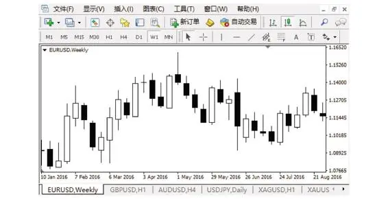

图2-1　蜡烛图盘面

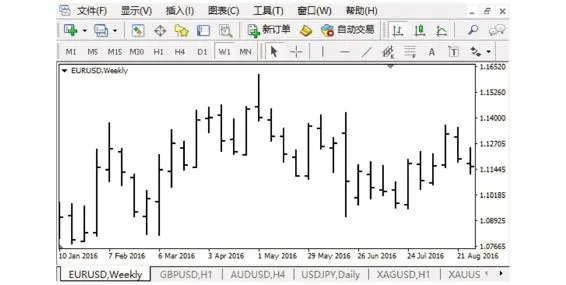

图2-2　柱状图盘面

　　K线是种语言，就像生活当中人与人之间需要语言进行交流和沟通一样。在交易市场当中，交易者也需要通过K线与交易品种进行沟通，每个交易品种都有不同的脾性，你可以把"他"当作"大老板"，也可以把"她"当作"小情人"，哪怕他们变幻无常，"心情"时好时坏，也需要用心"呵护"，摸清他们的脾性，才能对症下药，事半功倍，这些脾性或多或少可以通过K线反映出来。所以，K线也是一门语言艺术。

　　甚至很多时候单凭K线就可以进行交易，当然单独看K线就交易的成功率不能保证。

　　本章所引用的例子以外汇盘面为主。

## 2.1　K线的构成及四要素

　　K线是以一段特定周期行情中的开盘价、收盘价、最高价、最低价这四个特殊价位为根据绘制成的用以分析市场行情走势的技术图表。

　　如图2-3，K线分别由影线和实体两个部分构成，而影线又分为上影线和下影线。

图2-3　K线的构成

　　在特定的一段时间周期内，价格从起始点随着时间变化而上下波动至终点，这个过程中一定会产生一个最高价和一个最低价，起始点价格称为开盘价，终点价格称为收盘价，这四个特殊价位就是形成一根K线的四要素。开盘价与收盘价之间用实体表示，最高价与最低价之间用影线表示。若开盘价较低，收盘价较高，那么形成的K线就是一根阳线(阳烛)，如图2-4。若开盘价较高而收盘价较低，那么形成的K线就是一根阴线(阴烛)，如图2-5。

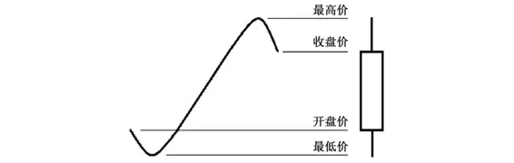

图2-4　阳线的形成

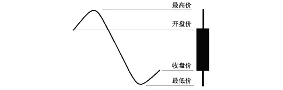

图2-5　阴线的形成

　　有朋友可能会对之前提到的柱状图(美国线)感兴趣，这里也稍微提一下这种图的绘图方式。与K线图相同的是，柱状图的最高价与最低价之间也是由一根线(柱)连接构成；与K线图不同的是，柱状图的开盘价是由左侧的横杠表示，而收盘价是由右侧的横杠表示，本质上与K线图没有太大区别，如图2-6、图2-7所示。

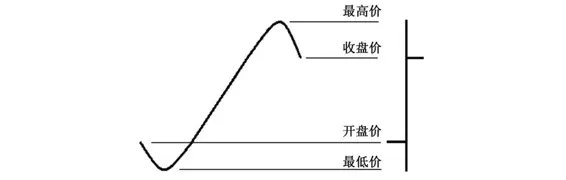

图2-6　上涨柱状图

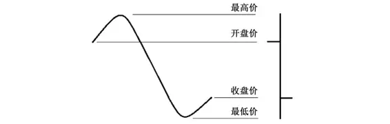

图2-7　下跌柱状图

　　不论K线形态如何，或者形成K线的价格运行轨迹如何，我们只需要严格把握最高价、最低价、开盘价、收盘价这4个重要组成要素即可，这样才能更好地了解K线和K线语言。

## 2.2　K线的分类及特点

　　为了先让大家能大致了解K线，我们按照K线根数的组成数量多少，大致把K线分为单根K线、双根K线、三根或多根K线组合，三大类别。

　　单根K线，包括大阳(阴)线、中阳(阴)线、小阳(阴)线、流星线、锤线、丁字线、倒丁字线、十字星等。

　　双根K线，包括吞没(阳包阴及阴包阳)、乌云盖顶、刺穿线、孕线等。

　　三根或多根K线组合，包括黄昏星、启明星、红三兵、黑三兵等。

### 2.2.1 单根K线

　　1.大阳(阴)线

　　如图2-8，大阳线大多具有较明显长度的实体部分以及少量的影线，表明当前市场多头力量强劲，空头毫无抵抗力，大量多头资金入场使得价格短时间内强势上扬，后市继续走强的可能性较大。一般交易者遇到这种情况，不建议激进地逆势操作空单，这样风险很大，应该等待价格回调一定空间后择机顺势入场多单，尤其是在阶段性底部盘整很久之后出现的大阳线，更不能随便逆势做空，这种走势往往预示后市依然会有几波上涨行情。反之，大阴线也是如此。

图2-8　大阳线和大阴线

　　图2-9底部大阳线之后出现了一波较强的上涨趋势。

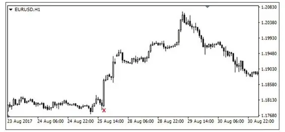

图2-9　底部大阳线

　　2.中阳(阴)线

　　如图2-10，中阳线与大阳线相比较而言，在形成过程中市场多头力量没那么强势，包含一定程度的实体以及影线，往往是多空力量争夺后的产物，这个过程中空头一直都在与多头争夺空间，仿佛拔河一样的拉锯战，市场空间是在来回拉锯中被多头慢慢攻占，这种你来我往的争夺往往会在K线中作为影线来体现。当然，这个过程并不是毫无意义，K线的收盘形态依然预示了市场的多头强势，后市大概率依然上涨。而中阴线所体现的意义正好与中阳线相反。

图2-10　中阳线和中阴线

　　3.小阳(阴)线

　　如图2-11，这种K线反映出市场交易者浓厚的观望情绪，操作意愿不明显，往往出现在震荡行情当中，多空方向不明确，市场没有资金注入活力，所以盘面也如一潭死水毫无波澜，比如一些国家和地区有节假日停盘休市；也或者是暴风雨出现之前的宁静，比如即将有较大数据公布，而这种数据往往会对交易市场产生明显的效应波动，而市场预测又没有明确风向，市场交易者出于规避风险的目的不急于提前入市博弈反而选择静观其变，也会出现横盘现象；还有一种情况，比如市场受到明确数据影响或存有强烈预期，盘面经历长时间大幅的上涨或者下跌消耗掉了多头或者空头的动能，像弹簧一样，压缩或者拉伸到一定程度随时可能反弹时，市场恐惧心理逐渐增强，伴随离场资金越来越多，入场资金越来越少，也会使得盘面出现长时间的横盘调整，等待下一波的市场刺激。

图2-11　小阳线和小阴线

　　4.流星线

　　如图2-12，这种K线表明在形成过程中，价格先扬后抑，多头做出的努力被空头打压，表明市场空头的强烈意愿和决心。流星线是由较小的实体部分(不分阴阳)和较长上影线来构成的，一般我们认为上影线的长度最好是实体长度的2倍甚至以上，上影线越长，代表盘面的下跌意愿越强，偶尔有较短下影线并无影响。由于这种K线状似一颗流星坠落，所以得名流星线，也因为这种K线形似墓碑，也叫墓碑线。不管这种特殊K线形态叫什么，怎么叫，我们只要知道它所预示的空头意愿即可。

图2-12　流星线

　　任何特殊K线都需要配合市场关键位置来进行分析，流星线一般出现在市场的顶部，由于价格遭遇上方关键位置的阻力，使得市场多空双方在关键位附近争夺主导权，而流星线的出现往往表明空头强势，后市有下跌的可能性。

　　如图2-13，在欧元1小时级别中，价格向上测试1.1600双零整数关口附近压力后被空头打压形成上影线较长的流星线，价格快速走出一波下跌行情。

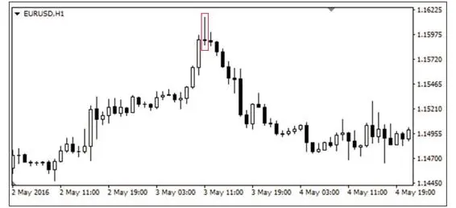

图2-13　欧元双零整数关口的流星线

　　图2-14欧元行情，流星线收线后直接暴跌。

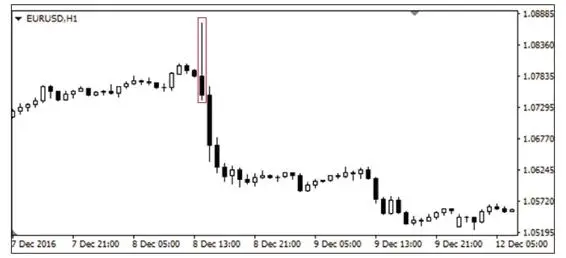

图2-14　欧元数据预期影响下的流星线

　　图2-15中，价格第二次试探上方1.1450压力位置，冲高回落后出现了较长上影线的流星线，这是明显做空的信号。

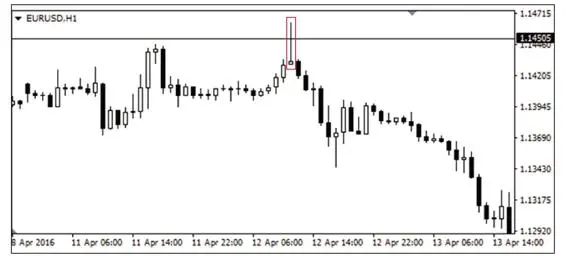

图2-15　二次试探压力的流星线

　　除了水平压力位附近的特殊K线信号以外，下降趋势线的斜向压力附近也经常会看到流星线的做空信号，如图2-16。

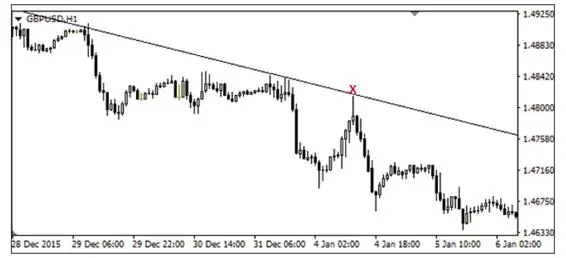

图2-16　下降趋势线附近的流星线

　　通过关键位(压力位)附近的流星线判断入场空单的时机，这在交易市场中非常普遍。不同周期形成的流星线，其看空信号的强度是不同的，在越大周期形成的特殊K线形态，其表明的信号强度越强。刚开始进入市场的日内交易者，建议观察1小时(H1)和4小时(H4)级别的特殊K线形态，这两个周期的K线信号相对比较稳定。再小的周期就不太建议初学者操作了，价格波动较快，容易影响交易心态，只建议作为看盘的辅助周期。

　　5.锤线

　　如图2-17，锤线一般出现在市场的阶段性底部，因为状似一把锤子而得名，实体部分为锤头(不分阴阳)，影线部分为锤柄，意义正好与流星线相反，代表价格在底部支撑区域被市场多头力量强拉回来，表明支撑区域附近多空力量胶着，多方暂时胜出，后市行情大概率看涨。锤线的下影线长度最好是实体长度的2倍甚至以上，而且下影线越长代表多方的力量越强，如果锤线有较短上影线也不影响判断。

图2-17　锤线

　　如图2-18，欧元价格在下跌至1.0350附近受到支撑探底回升，在1小时级别里形成锤线后，价格一路上行，给交易者提供了很好的多单进场机会，而且从图中很明显能够看到，这根锤线的下影线非常长，说明市场多头具有顽强的抵抗意图，预示后市上涨的概率非常大。

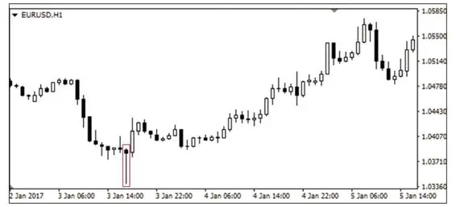

图2-18　欧元1小时级别锤线

　　而在图2-19中，欧元价格在前期经历了非常迅速的下跌，连续收出若干根阴线，在触及1.1200附近双零整数关口后，虽然1小时级别第一次在整数关口收出锤线后价格没有明显上涨，但是下跌势头有所放缓，说明此时市场多头出现了反抗，并且部分空头可能受到关键整数位置的支撑也选择了获利离场，使得价格在后续收出第二根锤线后一路上扬。(图中带有较短上影线的K线也可以看做锤线，同时也可以看做带有长下影线的十字星，后文有对十字星的阐述)

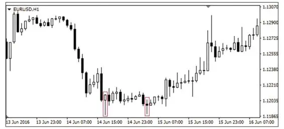

图2-19　双针探底

　　注意事项：大多数情况下我们认为流星线是看空信号，锤线是看多信号，但是交易市场当中偶尔也有例外。

　　如图2-20，英镑价格下跌触碰1.4850支撑，收出了一根状似流星线的特殊K线形态，之后便一路上扬。这种出现在市场底部形似流星线的K线有另外一个名字，叫倒锤线。我们可以把它想象成倒置的锤子，便于初学者记忆和理解。说明价格在支撑位多空力量胶着，其后的一根阳线代表多方力量暂时胜出，也是后期走势看涨的验证信号，所以交易者如果在支撑位上方附近看到倒锤线，首先想到的是获利空单需要减仓或平仓获利离场，其次可以考虑择机入场做多。

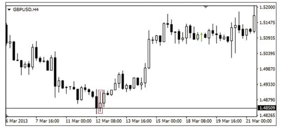

图2-20　英镑4小时级别倒锤线

　　在图2-21中，英镑价格在底部支撑位置1.5330一线出现了两根倒锤线，说明市场空头情绪已经转淡，预示多方力量有抬头迹象，交易者在收出一根阳线后则可择机入场多单。

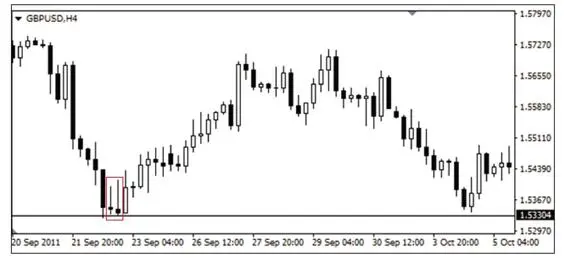

图2-21　英镑4小时盘面出现倒锤线

　　而锤线也有例外的情况，如图2-22所示，英镑价格在上涨至1.6300双零整数关口后遭遇阻力，形成了一根类似锤线的特殊K线形态后便一路下挫，这种出现在顶部压力位下方附近的"类锤线"是看跌的信号，它也有一个名字，叫吊颈线，或上吊线。说明市场多空力量处于胶着情况，需要后一根K线来验证方向，如果后一根K线是阴线，则说明空头成了力量争夺的暂时强者，持有多单的交易者需要考虑减仓或平仓离场。如果空仓，可以适当择机入场空单。

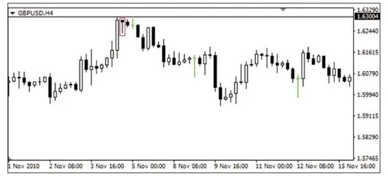

图2-22　英镑4小时出现吊颈线

　　倒锤线和吊颈线在交易市场当中偶尔会出现，需要交易者留意与流星线及锤线的区别，以免混淆。这类线统称为"Pinbar"，是我们交易系统的重点，我会在后面补充说明。

　　6.丁字线和倒丁字线

　　丁字线与倒丁字线如图2-23所示。

图2-23　丁字线和倒丁字线

　　丁字线与锤线的形成走势一致，都属于价格探底回升，只不过丁字线的看涨信号一般要弱于锤线，原因是大多丁字线在形成过程中，价格波动都比较缓慢，造成了开盘价无限接近于收盘价，使得K线的实体部分变成一条横线，如果形成特殊K线过程中价格波动较快，一般很难有开盘价与收盘价处于同一价位的情况。如果有丁字线在形成过程中，其价格波动频率较快波幅较大，说明市场多空争夺比较激烈，那么这种丁字线预示的做多信号也极强。反之，倒丁字线与流星线的走势也相对一致，但是其看空信号一般也弱于流星线。

　　丁字线与倒丁字线用法可直接参照锤线与流星线的用法，在此不赘述。

　　7.十字星

　　十字星如图2-24所示。

图2-24　十字星

　　十字星是多空双方博弈势均力敌的表现，开盘价与收盘价无限接近，使得实体表现为一条横线。如果这种特殊K线形态出现在阶段性顶部或者底部往往表明局势可能发生转换，也可以叫变盘十字星，但是假如出现在行情中继过程中，则表示市场方向不明，没有任何意义。

　　除此之外，如果在市场顶部压力附近出现的十字星上影线较长下影线较短，那么预示后续市场走势偏空，大概率下跌；如果在市场底部支撑附近出现的十字星下影线较长上影线较短，那么预示后续市场走势偏多，大概率上涨；假如在顶部和底部出现的十字星上下影线长度相对一致，则需要等待后续K线作为验证信号来判断方向。

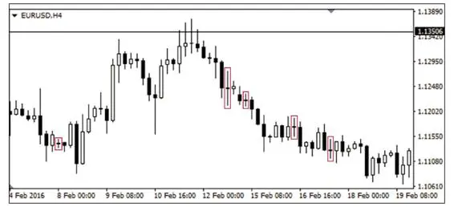

图2-25　欧元4小时看空十字星和无意义的十字星线

　　在图2-25中，欧元震荡上扬测试1.1350压力，收出若干根上影线较长的K线，表明价格上涨的动能可能消耗殆尽，后市风向可能发生转变，大概率下跌，交易者可在十字星收线后激进进场，或在作为验证信号的流星线收线之后择机入场空单。

　　图2-26所示，为欧元价格下跌至1.3450探底回升，形成较长下影线的十字星，下一根K线收阳，说明多空力量胶着后多方暂时占据主导，交易者可择机入场多单。

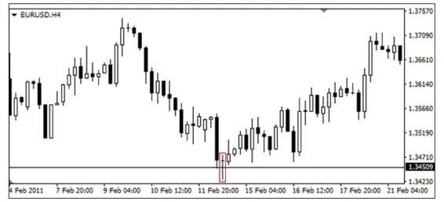

图2-26　欧元4小时看涨十字星线

### 2.2.2 双根K线组合

　　1.吞没形态

　　如图2-27，吞没形态，是由阴阳不同的两根K线组合而成，吞没形态的后一根K线实体要包裹住前一根K线的实体部分，所以也叫
"穿头破脚"。看涨吞没，其后面阳线的开盘价要低于前面阴线的收盘价，阳线的收盘价要高于阴线的开盘价，也叫"阳包阴"；看空吞没，其后一根阴线的开盘价要高于前一根阳线的收盘价，阴线的收盘价要低于阳线的开盘价，也叫"阴包阳"。当然，由于外汇交易市场大多数盘面价格都具有良好的连续性，所以我们在汇市当中看到的看涨吞没在一般情况下，其阴线的收盘价与阳线的开盘价是无限接近的(基本持平)，而看跌吞没在一般情况下，阳线的收盘价无限接近阴线的开盘价。

图2-27　吞没形态

　　如图2-28所示，欧元价格在关键支撑位1.1110上方出现看涨吞没后开启了一波涨势，这种形态组合是极强的看涨信号，经常作为预判后市涨势的重要依据。

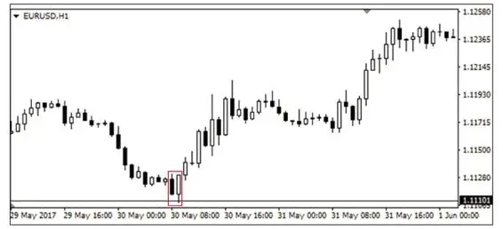

图2-28　欧元1小时看涨吞没

　　在图2-29中，欧元价格在上行至某一压力位附近时，上涨动力逐渐减弱，在出现看空吞没，并经过下一根流星线验证之后，价格一路下行。看空吞没与流星线的看跌效力强度一致，是预判后期跌势的重要信号。

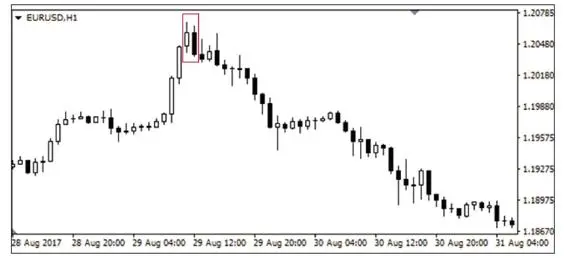

图2-29　欧元1小时看空吞没

　　吞没形态一般情况下只需关注组成吞没的两根K线的实体部分即可，允许伴有较短的上下影线，如果上下影线较长，则需另行考量。

　　2.刺穿线(看涨)和乌云盖顶(看空)

　　如图2-30左图，刺穿线，可以理解成是看涨吞没的变体，具有较强的看涨信号，也是由一阴一阳两根K线组成，需要注意的是，刺穿线与看涨吞没的区别在于：阳线的实体长度没有超过前一根阴线的实体长度，但是需要超过阴线实体长度的1/2。

图2-30　刺穿线和乌云盖顶

　　如图2-31，欧元在前期低点的底部支撑位1.1120附近出现刺穿线，是明显的看涨信号，后面伴有长下影线的K线更进一步验证了后市价格上涨的可能性。

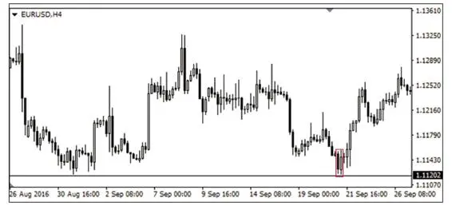

图2-31　欧元4小时刺穿线

　　如图2-30右图，乌云盖顶，是看跌吞没形态组合的变体，具有较强的看空信号，是由前阳后阴两根K线组成，后面阴线的实体长度要小于前面阳线的实体长度，但是需要超过阳线实体长度的1/2。

　　在图2-32中，欧元价格上行至上方双零整数压力关口1.0900后，收出乌云盖顶的看空形态组合，预示后市价格大概率下跌。

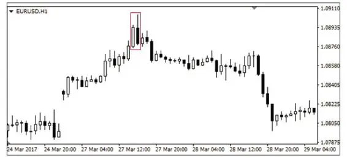

图2-32　欧元1小时乌云盖顶

　　实盘操作时，如果底部出现刺穿线或者顶部出现乌云盖顶，交易者在有一定把握的情况下偶尔可以激进入场，不一定非要等待后期K线的验证再考虑进场。

　　因为它们与吞没、流星线、锤线等特殊K线形态一样，其信号强度相对较强，配合明显的支撑阻力位置分析后，在风险可控的前提下，为了不错失良好的进场点位，可以适当提前入场。

　　3.孕线

　　如图2-33，孕线，也是吞没形态的变体，看涨孕线的阳线实体长度不能超过前面阴线实体的1/2，只能代表后市看涨的一种可能性；看空孕线的阴线实体长度不能超过前面阳线实体的1/2，只能预示后市看空的可能性。孕线仅仅预示后市反转的希望，其预判市场走势的信号强度相对较弱，所以在实盘操作时，它与其他信号较强的特殊K线形态不同，必须要等后面K线对后市方向的进一步验证才可以入场操作，否则只建议观望。

图2-33　孕线

　　如图2-34所示，欧元价格在下跌至1.2250附近后，触底小幅反弹，收出一根小阳线，与前一根阴线形成看涨孕线组合，一般情况下我们不建议交易者此时入场多单，应该等待下一根阳线确认后再择机做多。随后我们发现后一根阳线涨幅相对较大，虽然方向明确了，但是此时入场价位并不理想，那么可以等待价格小幅回调后再考虑入场多单。

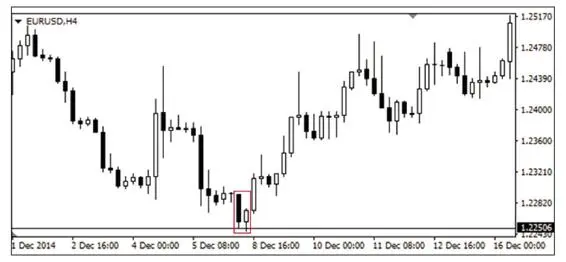

图2-34　欧元4小时看涨孕线

　　图2-35中，欧元价格在下降趋势线的压力位附近出现了看空孕线，遇到这种情况，交易者可以等待后一根K线收阴之后，直接入场空单。

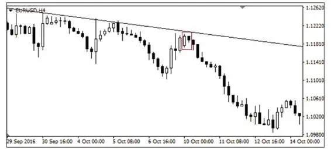

图2-35　欧元4小时看空孕线

### 2.2.3 三根或多根K线组合

　　1.黄昏星

　　黄昏星一般情况下是由三根K线组合而成，如图2-36所示，第一根是阳线，第二根为十字星，第三根为阴线且实体长度超过第一根阳线实体长度1/2以上。这种形态组合可以理解为在乌云盖顶或者看空吞没的两根K线中间插入了一根代表多空力量胶着的十字星，也属于具有极强信号的看空形态组合。

图2-36　黄昏星

　　图2-37中，欧元价格在向上试探1.1300双零整数关口压力后，形成了非常标准的黄昏星，开启了后市的快速下跌。

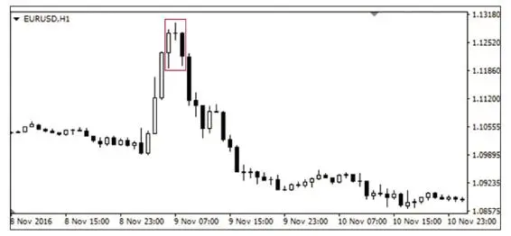

图2-37　欧元1小时标准黄昏星

　　图2-38中所示黄昏星，在交易市场当中非常常见，在阳线与阴线之间出现了一根上吊线，虽然不是十字星，但是也包含了多空双方在关键位置争夺的含义，所以也可以理解为黄昏星；或者单独在顶部出现上吊线的基础上，把后一根阴线当作是对预判空头方向的验证信号。除此之外，中间的K线如果是流星线、丁字线等特殊K线形态，那么这种K线组合也可以理解为黄昏星的变体。

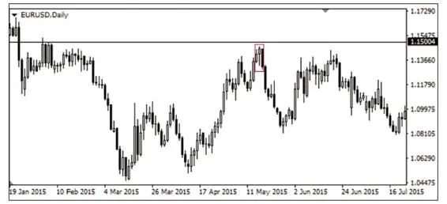

图2-38　欧元日线常见的黄昏星

　　而在图2-39中，我们在欧元1.1490(1.1500双零压力附近)下方看到的四根K线组合，也可以当作黄昏星的变体来看待。第一根阳线看作是多头对冲击上方压力做出的努力，第四根阴线可以作为空头对多方力量的打压，中间的两根小阳小阴线可以理解为多空力量胶着或市场情绪犹豫的体现，这与标准的黄昏星从本质上是没有区别的。

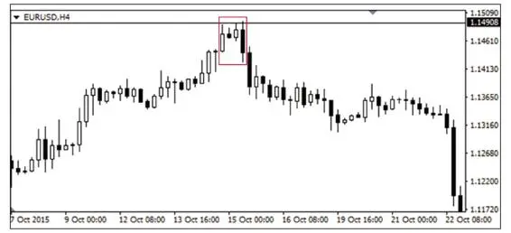

图2-39　欧元4小时黄昏星的变体

　　2.启明星

　　启明星与黄昏星正好相反，也是由三根K线组合而成，如图2-40所示，第一根是阴线，第二根为十字星，第三根为阳线且实体长度超过第一根阴线实体长度1/2以上。这种形态组合可以理解为在刺穿线或者看涨吞没的两根K线中间插入了一根代表多空力量胶着的十字星，是极强信号的看涨形态组合。

图2-40　启明星

　　图2-41中所示的2组启明星，两次在欧元价格触摸1.0500双零支撑关口后，都给出了价格上涨的明确信号，尤其是第二次的探底回升，给出交易者的进场点位置更好，形态更漂亮。

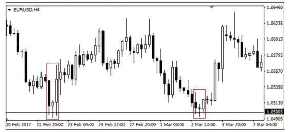

图2-41　欧元4小时常见启明星与标准启明星

　　3.红三兵与黑三兵

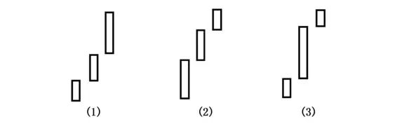

图2-42　红三兵的三种模式

　　红三兵，一般是由连续的三根阳线组成，代表了多头动能的延续。如图2-42所示，第一种红三兵的三根阳线实体长度逐渐放大，代表了多头动能的力量越来越强，上涨势头也逐渐增强，预示后市价格继续上涨的概率较大，如交易者此时手中持有多单，则可继续持仓观望，直至接触上方关键压力使得价格回调后再行减仓或清仓离场，等待入场操作的交易者则可等待市场回调一定空间后，价格获得支撑再择机入场多单，这种走势一般出现在阶段性市场低点或底部位置的强势反弹初期或是出现在强势多头市场中经过价格回调后多头蓄力的再次上扬，所以经常称之为红三兵的"前进模式"。第二种红三兵则正好相反，是红三兵的"停滞模式"，它的实体长度逐渐减小，代表多头市场动能逐渐减弱，之前积蓄的力量暂时得到释放，后期价格走势不明，甚至有可能会随时变盘下跌，此时持有多单的交易者则需要配合盘面上方关键压力位随时准备平仓或减仓，控制风险落袋为安，一般这种走势经常会出现在一波上涨行情的末期(暂时高点)或是在下跌过程中产生的回调反弹中。第三种红三兵为"滞涨模式"，第一根与第三根阳线相对短小，中间阳线一般为大阳线，这种走势一般反映了多头市场在经历快速的力量释放，而价格又恰好处于关键压力位下方附近，没有更多的资金入场提振市场信心，使得多头后继无力，市场观望情绪渐浓，后期走势方向不明确，建议持有多单的交易者选择平仓离场观望。

　　红三兵的三种模式实例分别如图2-43、图2-44、图2-45所示。

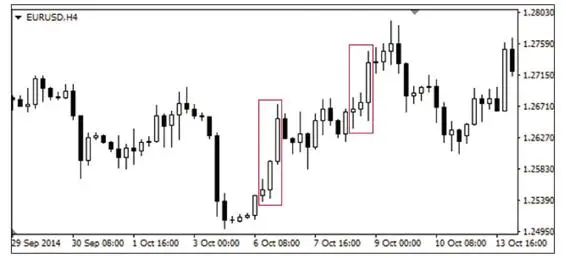

图2-43　欧元4小时红三兵"前进模式"

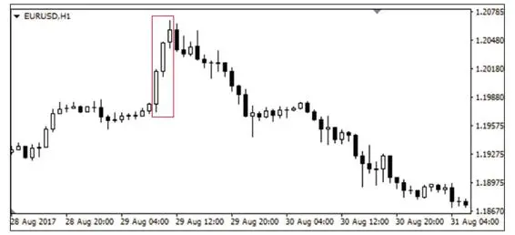

图2-44　欧元1小时红三兵"停滞模式"

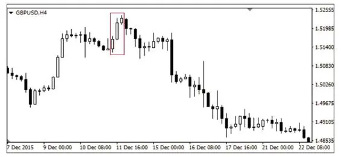

图2-45　英镑4小时红三兵"滞涨模式"

　　黑三兵又叫"三只乌鸦"，其三种模式的意义与红三兵基本一致，只不过方向相反，分别是黑三兵的"前进模式""停滞模式""滞跌模式"，如图2-46所示。其实例分别如图2-47、图2-48、图2-49所示。

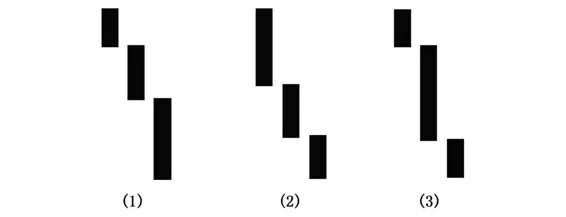

图2-46　黑三兵的三种模式

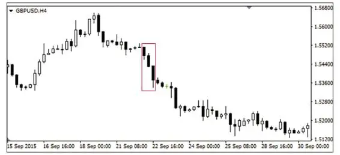

图2-47　英镑4小时黑三兵"前进模式"

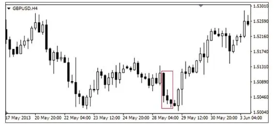

图2-48　英镑4小时黑三兵的"停滞模式"

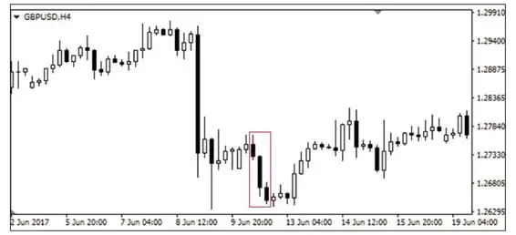

图2-49　英镑4小时黑三兵"滞跌模式"

　　需要注意的是，任何K线形态所表现出的只是一种统计学层面的可能性，依然是大概率事件，很多时候交易者根据K线形态技术分析来进行交易计划制定及盘面操作都需要处于常规情况下考量，在非常规情况下(比如数据行情)往往容易出现错误判断，可能会出现一定失误，这个时候就需要交易者多方面多角度进行分析。

## 2.3　K线形态的本质

　　熟悉和应用以上特殊K线形态及组合，可以算达到了第一步"看山是山"的程度；如果再进一步体会"看山不是山"的境界，就需要了解各种K线形态的本质——价格的运行轨迹。

　　如图2-50所示，在一段1小时周期的价格运行轨迹当中，三波行情的起始价、终点价及最高价都是一致的，但是由于看盘周期的不同，使得交易者观测到的外观形态也有所不同。同样是一波冲高回落的行情，在1小时周期看到的是一根流星线；在30分钟周期里把这段行情一切为二，看到的就是看跌吞没形态；在15分钟周期里把这段行情一分为四，那么可能看到的就是黄昏星。虽然交易者从盘面接收到的K线外观状态不一样，但是从本质来讲，其价格运行轨迹是一致的，所代表的含义也都预示了后期空头走势的大概率。

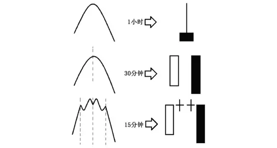

图2-50　看盘周期与K线形态

　　影响K线外观形态的原因主要是由于盘面周期的划分，使得盘面截取的K线四要素在不同周期里有所区别，所以交易者需要辩证地看。

　　M头的走势可以看作是黄昏星，如图2-51。

图2-51　M头的变体黄昏星

　　此外，M头也可以看作两根流星线，如图2-52。

图2-52　M头的变体双流星线

　　反之，W底可以看作是启明星，如图2-53。

图2-53　W底的变体启明星

　　W底也可以看作是两根锤线，如图2-54。

图2-54　W底的变体双锤线

　　在学习K线的过程中，我们不能"想当然"，别人讲什么就是什么，听什么就信什么；或者拿来主义，死记硬背直接就用，只观其形而不领其神；更多的是需要我们去灵活思考、去认真探索、去仔细求证，这样才能寻找到符合我们自身的交易体系和交易习惯。

