# 第7章　裸K线交易法实战应用

　　我们已经学习了裸K线交易系统的绝大多数理论知识，下面我们将进入实战。以下实战都是以我个人的交易系统来操作的，仅供各位参考。各位在实战中应该有自己的特点，没有必要完全复制。

　　有些比较散乱的知识点我会在本章中通过实战案例给大家讲解。请耐心地看完本章，这对理解和掌握裸K线交易法有着至关重要的帮助。

## 7.1　黄金实战

　　我们先来看一个黄金4小时盘面的信号，见图7-1。

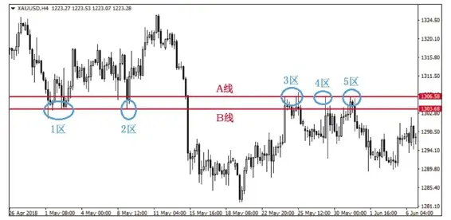

图7-1　黄金4小时走势

　　我们先参考一下图中较明显的一个价格区间，我画了两根线：上面的A线和下面的B线。而现在的价格已经运行到了图中所示的5区之后，A线和B线组成了一个关键区间。那么，现在如何判定是A线更强还是B线更强？

　　当价格运行到1区和2区的时候，发生了明显的反转，也就是说价格在这里是有支撑的。然后，价格破位下跌，跌穿B线。之后反弹至3、4、5区，受到了阻力。这很好地呼应了"极限转换原则"：当支撑或者阻力位被突破之后性质会发生转变；这里就是：支撑位被突破之后变成了阻力位！

　　根据我们的原则：拐点离现价越近，关键位越有效。而1、2区和3、4、5区是同级别的，并且通过的拐点数量相近。所以我们认为：A线目前更加有效。

　　然后，价格再次进行整理，在5区过去之后，出现了我们等待的信号——Pinbar。如图7-2所示。

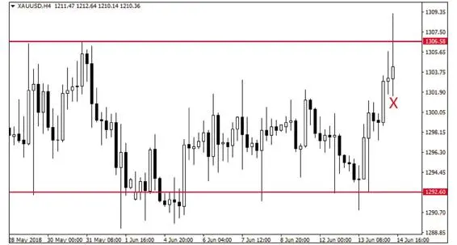

图7-2　出现了Pinbar

　　现在是一个很明显的横向市场，也就是大家常说的盘整。通常情况下，我们盘整只关注两个关键位，即盘整上方阻力和盘整下方支撑，这两根线我已经画出来了。

　　我们先看看盘面上的一些具体数据(见图7-3)：Pinbar最高价是1309.2，这是我们的止损参考位置；最低价是1301.5，这是我们突破进场的参考位；下方关键位置1292.6，这是我们参考止盈的位置。

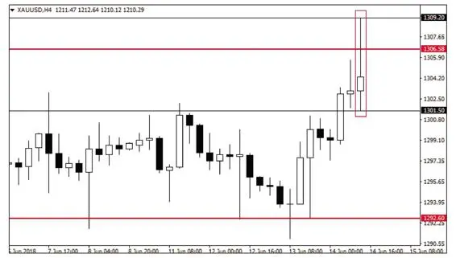

图7-3　盘面上的具体数据

　　接下来我们要对Pinbar进行研判。

　　Pinbar的研判方法，我们一共有七条硬指标：两个基本条件和五个细节项。

　　两个基本条件：

　　1.是否处于明显的关键位？

　　2.是不是处于明显的高位或者低位？

　　这是两个必要条件，但不是充分条件，如果有一项不符合，则Pinbar不能交易。

　　五个细节项：

　　1.整个Pinbar在盘面上是否明显？

　　2.有没有假突破？

　　3.Pinbar的实体有没有包含在之前的K线(左眼)的最高价和最低价之内，并且左眼的幅度要比信号小？

　　4.是不是顺着较大级别趋势？

　　5.突破入场的盈亏比是否大于1.5︰1？

　　这五个条件必须要满足两个以上，我们的信号才算合格，才可以交易。

　　我要求的盈亏比是1.5︰1，如果我们选择破出进场，则止损是76个点，盈利是89个点，盈亏比小于1.5︰1，不符合我们的要求。当然，所有人都希望盈亏比越高越好！很多人的盈亏比要求都要达到2︰1，这点可以根据自己的操作习惯和预期做调整，并不是一定要达到1.5︰1或者2︰1，如果你愿意1.2︰1也是可以的。但是最好不要小于1︰1，比如说0.8︰1这样子的，即每一单的预期盈利比预期的亏损还要少，因为这对于整个交易系统的正确率就有非常严苛的要求了。

　　为了达到盈亏比，我们考虑回调进场。如果回调38.2%进场，那么止损是47个点，而止盈是118个点，盈亏比是118︰47≈2.5︰1，这个盈亏比是符合我们预期的。如果我们选择50%回调进场，那么止损是38个点，止盈则是127个点，盈亏比是127︰38=3.3︰1！大家可以看到：如果选择回调，我们所获取的利润会比突破进场高出很多。而且，如果我们是固定风险建仓，也就是说，我们确定了每一笔交易损失的资金，以此来制定我们的交易策略，那么预期收益会更加夸张。

　　固定风险(亏损)建仓：每点波动所对应的资金变化×仓位大小×止损点位=设定的止损金额(这个金额是交易员自己设定好的，是不变的)

　　就拿这个例子来说，如果我们是固定亏损建仓，那么回调50%入场的话，我们这边所面临的止损点位就少了50%，这样我们的仓位可以增加接近100%！(当然，要考虑给市场留出的空间，这里只是理论上接近100%)而我们的利润空间，从90个点，提高到了128个点，那么，两种不同方式的盈利比就是128×2︰90×1≈2.84︰1！这个是截然不同的交易了！同样的行情，大家看的点位和方向都一样的情况下，两种不同的入场方法带来的利润简直是天差地别！这就是回调入场的优势！不过并不是每次都可以拿到好的回调点位的，很多时候行情可能一去不返，所以稳定能够拿到的点位是突破入场和收线入场。

　　现在我们对这个信号进行研判：

　　1.是否处于明显的关键位？

　　答：是。此Pinbar在所处的价格之前有过明显的拐点，是一个有效的关键位。

　　2.是不是处于明显的高位或者低位？

　　答：是。在此Pinbar之前K线走出了上涨趋势，Pinbar处于明显的高位。

　　既然两个基本条件都通过了，那么我们进入细节项。

　　1.整个Pinbar在盘面上是否明显？

　　答：是的。Pinbar幅度较大，在附近的盘面上看来是一个较明显的"鼻子"。

　　2.有没有假突破？

　　答：有的。Pinbar的影线刺穿了关键位，但是又收在了关键位下方，是一个假突破。

　　3.Pinbar的实体有没有包含在之前的K线(左眼)的最高价和最低价之内，并且左眼的幅度要比信号小？

　　答：满足。Pinbar的实体部分包含在左边K线的最高价和最低价之内，而且左眼的幅度要比信号小。

　　4.是不是顺着较大级别趋势？

　　答：不是。此时盘面并没有明显的趋势，价格正处于盘整行情。

　　5.突破入场的盈亏比是否大于1.5︰1？

　　答：不满足。

　　总体的评价是2+3，可以进行操作。

　　这里由于盈利空间问题，我们选择收线入场，此时止损为48个点，盈利空间是117，盈亏比为117︰48=2.43︰1，符合我们的要求。我们把止盈位放在下方的关键位上方。

　　这样就可以得出我们的交易计划了，如图7-4所示。

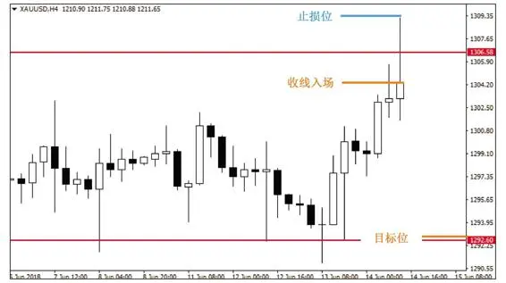

图7-4　交易计划

　　后续的走势如图7-5所示，行情很快就走到了我们的目标位，我们的交易快速地止盈了。

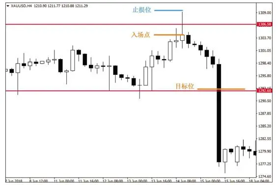

图7-5　后续走势

　　价格走得很平稳，稍有回调之后就一路下跌。整个下跌持续了数月，最多超过900个点的跌幅，如图7-6所示。当然，我们这笔交易的盈利只有100多个点。

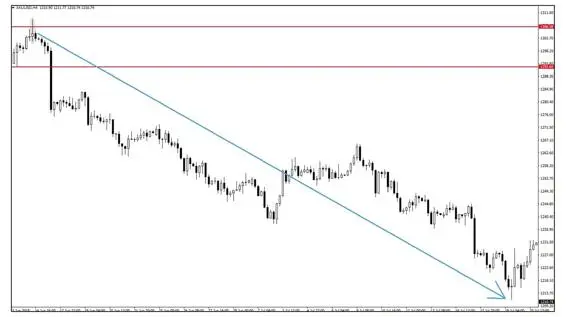

图7-6　持续数月的下跌

　　可能有人要问了：下跌这么多，我们只抓了100个点，是不是太差劲了？

　　其实，在这波下跌的过程中，还有几个很好的操作机会。后面大家可以自己去看看。当然，我们有一些非常实用的出场方式，既可以让我们锁定现有收益，也可以避免在单边行情中过早离场而减少利润。

　　有一点我需要补充一下，其实在之前有人问过：图7-7的灰色区域也有很多Pinbar，而且后来都走得蛮好的，为什么你不选这些Pinbar作为信号呢？

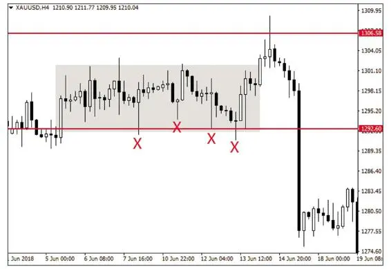

图7-7　无效信号

　　在图7-7的灰色区域中，大家可以找到至少有4个形态较好的看涨Pinbar，这些Pinbar自身的幅度还都不小，我用×标出了。但是大家可以看到，这些信号并不处于明显的高位或者低位，而是扭在一起，不符合我们的第二个基本要求，所以它们都被忽略了。

　　再者，灰色区域的行情基本上就是横盘，而且幅度小得可怕，基本上是没有机会盈利的。这种行情，我们一般是直接跳过的，在这种行情下要判断后市的走向是不准确的，在这里所有的信号都视为无效信号。

## 7.2　日元实战

　　我们来看一下日元，见图7-8。

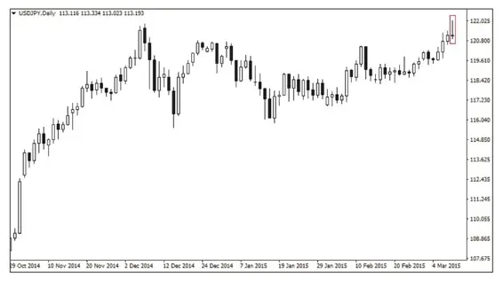

图7-8　日元日线级别走势

　　图7-8是日元日线级别走势，正处于一波较明显的上涨趋势中。而且没有太多的"鼻子"出现，说明在这段时间行情走得较为平稳，也适合我们交易。此时日线级别出现了一个Pinbar。

　　这个位置出现Pinbar之后，我们将比较明显的拐点都画出来，这些都是近期会遇到的关键位，见图7-9。

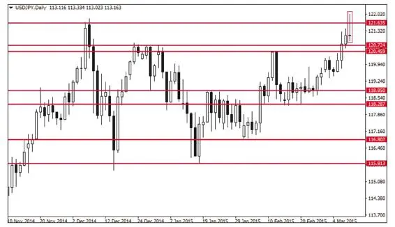

图7-9　比较明显的关键位

　　可能这个时候有朋友会问了：怎么这么多关键位啊？感觉所有的位置都是关键位啊，这还怎么操作啊！

　　要知道我们看的是日线图，两个关键位之间的距离少说也有几十个点，多则上百点，所以只是我们"看起来"关键位都集中在一起了，其实如果放在4小时图上看的话关键位之间的距离是很大的。

　　看起来我们需要对其进行研判。老规矩，还是我们之前设定好的研判系统。

　　两个基本条件：

　　1.是否处于明显的关键位 ？

　　是的。这个Pinbar出现在了前期的高点，是一个明显而且有效的关键位。

　　2.是不是处于明显的高位或者低位？

　　是的。在这个Pinbar之前是一段明显的上涨趋势。

　　符合我们交易系统的两个基本条件，那么我们有必要继续往下看了，现在可以对其进行细节研判。

　　我把图放得大一点，如图7-10所示，大家可以仔细观察这个Pinbar的一些细节。

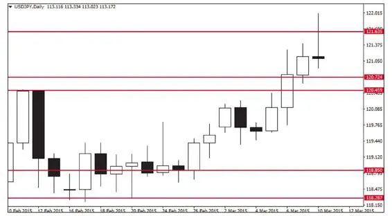

图7-10　放大的图

　　五个细节项：

　　1.整个Pinbar在盘面上是否明显？

　　不明显，这个Pinbar的长度一般，虽然也有110个点的幅度，但是相比较周围盘面并不算突出，不过也不能称之为小。所以这里可能有点争议。如果让我来判断的话，我个人认为是不符合"明显"这个标准的。

　　2.有没有假突破？

　　有的，这个Pinbar在突破前高之后又转头下跌，收线于前高之下，这是一个假突破动作。

　　3.Pinbar的实体有没有包含在之前的K线(左眼)的最高价和最低价之内，并且信号的幅度要大于左眼？

　　是的，Pinbar的开盘价和收盘价几乎持平，而且和左边K线的收盘价在同一价位，而且Pinbar的幅度要明显大于左边的K线。

　　4.是不是顺着较大级别趋势？

　　不是，大趋势是上升趋势，这个用眼睛就可以看得出来。

　　5.突破入场的盈亏比是否大于1.5︰1？

　　不是，突破入场后随即就遇到关键位，止损110个点，而目标却只有17个点，不符合我们1.5︰1的盈亏比要求。

　　盈利空间如果不够，我们就需要通过回调50%信号位置进场了。可是通过计算出现了一个尴尬的事情：回调50%的话，盈亏比是(55+17)︰55，依旧不符合1.5︰1的要求！

　　此时，我们需要通过回调信号的61.8%来交易，则盈亏比是(69+17)︰41，这才符合要求，不过好在61.8%的位置处于关键位下方。所以这个信号的进场方式是比较冒险的回调61.8%进场。

　　我们制定好我们的交易计划：回调信号的61.8%入场，止损于信号的上方，止盈在下一个目标位上方，如图7-11所示。

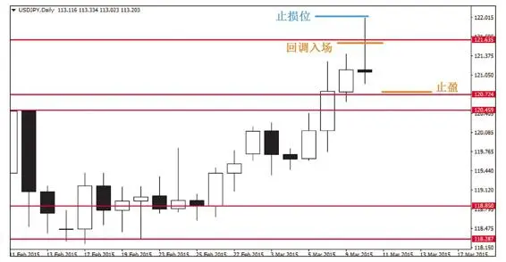

图7-11　交易计划

　　由于是回调61.8%入场，但是行情未必会给我们这么深的回调，如果给到了，我们就入场；如果没有给到，我们就选择不做。

　　如图7-12，行情在右眼给到了我们入场位上并且很快就走到了我们的目标位置，这笔单子我们顺利地盈利出场。

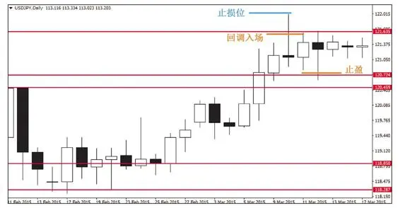

图7-12　后续走势

　　我们的止损和止盈一定要留一定的空间，就像图7-12这样子，止损超过Pinbar的影线，而止盈要适当地给关键位留一点位置。

　　我们来介绍一个在不扩大风险的情况下，有机会扩大收益的出场方式：三线战法。不过请注意：收益永远和风险成正比，没有一个方法既能保证最大化收益，又能把风险降到最低。

　　**在强势趋势里，一般行情的回调不会超过3根K线，如果超过三根K线，则行情反转的概率较大。三线战法**
就是交易的时候不设置止盈，而只设置止损，止损按照最新的3根K线的极值来设定，直到行情打到止损为止。其原理是以三根K线作为一个较小的整理周期，把小级别整理周期的高低点作为我们的出场点。三线战法的信号研判和裸K线交易法一样，只是出场方式不同而已，要执行这个战术，初始止损必须设定在信号的极值后方。三线战法最重要的用处是在保证部分利润的同时可以抓住较强的单边趋势。

　　我们具体看看用三线战法来操作这笔交易会有什么不同。

　　在交易开始的时候，并没有任何区别，我们没有设置止盈，但是止损是一定要带着的！如图7-13所示。

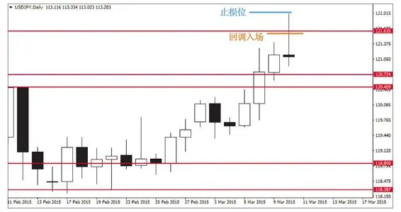

图7-13　设置止损位

　　等两根K线出来的时候，我们需要把止损位放到这三根K线的最高价之上，当然，如果我们做的是多单，那么需要把止损位放到3根K线的最低价之下。这笔单子是空单，则需要把止损位放到3根K线的最高价上方。

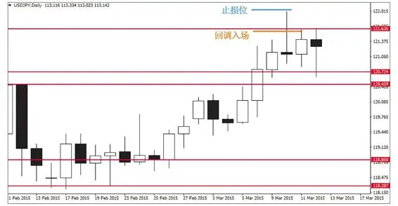

图7-14　设置止损位到3根K线的最高价上方

　　在这里，最高价还是信号的最高价，而且只能是信号的最高价，如果行情在信号出现后两根K线的时间内就突破高点，我们单子就已经止损出局了！所以暂时不用动止损位。

　　等到信号之后的第三根K线收线的时候，我们发现最新的三根K线最高价有所变化：最新的3根K线的最高价是第二根阴线的最高价，所以，我们需要把止损位移动到第二根K线的最高价的上方，如图7-15所示。

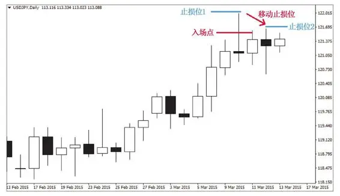

图7-15　移动止损位

　　之后我们要继续按照最新的3根K线的最高价来设定我们的止损。

　　如图7-16所示，第8根线的时候我们移动的止损位已经不会让我们再亏损了。

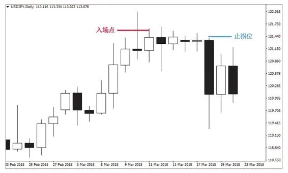

图7-16　止损位移动到了不会再亏损的位置

　　我们继续看，如图7-17所示，行情下跌果断，一直没有触及我们的止损，我们按规矩下调我们的止损位。

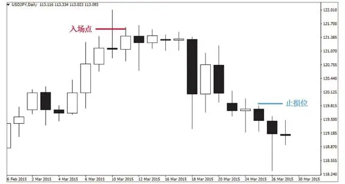

图7-17　按规矩下调止损位

　　如图7-18，行情一个大阳线将我们止损打掉，我们平仓出局。而此时可以看到：我们从入场点到出场点一共有170个点！而当初我们的止损只有50个点不到，这个单子的盈亏比达到了3︰1以上。这是单纯的入场后设定止盈位和止损位所办不到的！

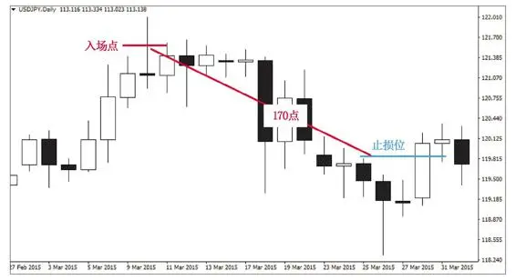

图7-18　平仓出局

　　任何方法有优势肯定也存在劣势。就好像你买保险，保费就是你所承担的所有风险，而保单里所约定的赔偿方案就是你的预期收益。比如说车险，你付了保费之后，可能一年都没有任何故障或者事故，保险公司拿走了你的保费而不用承担任何支出，这个时候如果你没有买车险就省下了一笔钱，因为没有产生理赔。但是如果你的车出了问题，保险公司就有可能赔付超过你保费的损失，这个时候，你的保险就起到了该有的作用！

　　三线战法同样存在劣势。比如说行情在信号之后第一根K线就触及我们的最初目标位，然后就回来打掉我们的止损位，按照最初的交易计划，我们是可以盈利出场的。但是如果使用三线战法的话我们不仅拿不到本来该有的利润，而且还将亏损！所以我建议在行情比较激烈的时候(比如说盘面上出现很多很多的影线或者大阴线和大阳线交替)使用较为保守的交易计划，而当行情走得比较稳，并且信号出现在较大趋势的最高位或者最低位的时候，可以使用三线战法来博取较高利润。

## 7.3　原油实战

　　以下我会给大家分析几个原油期货的交易机会。

　　如图7-19，是原油在2012年12月左右的日线级别走势，可以明显看到，在一波下跌之后，行情在低位震荡，此时出现了一个Pinbar，我们用×标记出来了。

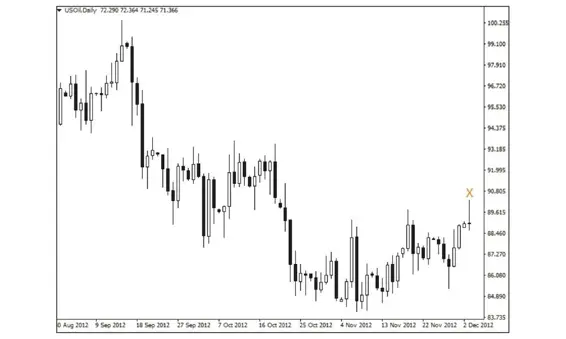

图7-19　原油日线级别走势

　　那么这个Pinbar是否可以交易呢？我们先要补上关键位，见图7-20。

　　好了，我们可以对其进行研判了。

　　两个基本条件：

　　1.是否处于明显的关键位？

　　是的。该信号处于两个关键位的压力区间。

　　2.是不是处于明显的高位或者低位？

　　是的。该信号处于明显的一波小幅上涨的高点。

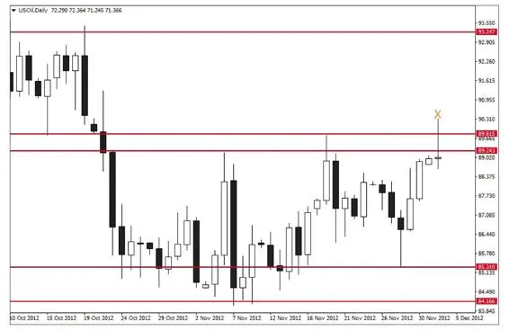

图7-20　关键位

　　五个细节项：

　　1.整个Pinbar在盘面上是否明显？

　　不明显，虽然信号的形态很标准，但是相比之下幅度不算大，在整个盘面上也不算特别明显。

　　2.有没有假突破？

　　有的。信号突破了关键位，之后又收线于关键位下方，是一个明显的假突破行为。

　　3.Pinbar的实体有没有包含在之前的K线(左眼)的最高价和最低价之内，并且信号的幅度要大于左眼？

　　满足。左眼较小，而Pinbar的幅度比左眼大很多。

　　4.是不是顺着较大级别趋势？

　　是的。现在处于下跌趋势，而这个信号是一个看空的信号，所以是顺势。

　　5.突破入场的盈亏比是否大于1.5︰1？

　　满足。该信号长度170，而突破入场距离下方目标位有325个点，325︰170=1.91︰1，符合我们对于盈亏比的要求。

　　综上所述，这个信号的强度为2+4，是一个非常好的信号，可以进行操作。

　　既然盈利空间足够大，我们对于进场的选择就可以采用最好的突破信号入场，并且把止损位放在信号的影线后方——这样设置止损位也是最保险的。我们的交易计划就制定出来了。

　　如图7-21，我们选择突破信号入场，止损一共175点(加了5点的保险空间)，止盈一共310点(让给了市场15个点)，这个空间大家自己去把握就行了，我的习惯是5个点左右。不过有人习惯只给一个点，就是说影线的最高点再加一个点作为止损，关键位也可能拿得比较死，这里并不做硬性规定。就像一门手艺，需要自己去体会、去把握，每个人都有适合自己的节奏。

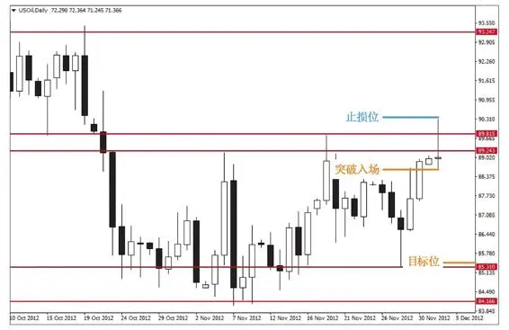

图7-21　交易计划

　　那么入场之后，我们就等待市场走出来就行了。

　　如图7-22，最终价格顺利到达我们的目标位，之后就开始拐头向上，也说明我们的关键位画得不错，我们设置的目标位附近就有较强的支撑，如果不是及时出场，就有可能回吐利润。

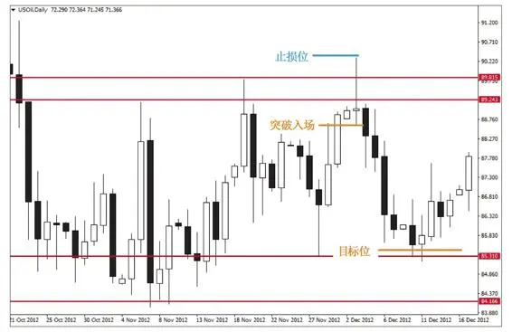

图7-22　后续走势

　　我们再继续看看原油市场的一些交易机会。

　　图7-23是原油期货2015-2016年的一段日线盘面，经历了持久的上涨之后，日线级别高位出现吞没，并且正处于2015年10月期间的高点附近。

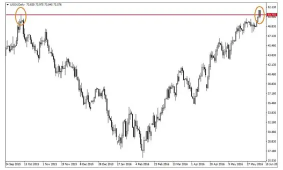

图7-23　原油日线盘面

　　这是一个非常明显的拐点位置，我们对这个吞没进行研判，先画出其附近的关键位，如图7-24所示。

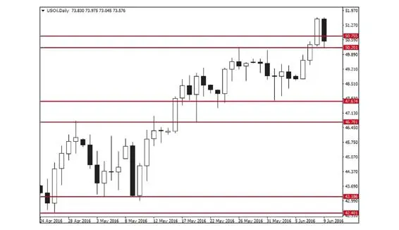

图7-24　关键位

　　那么也请大家自己先思考思考，按照自己的分析方法，这个信号能得几分？

　　两个基本条件：

　　1.是否处于明显的关键位？

　　是的。处于明显的大级别拐点位置。

　　2.是不是处于明显的高位或者低位？

　　是的。该信号处于明确的高点。

　　五个细节项：

　　1.整个Pinbar在盘面上是否明显？

　　是的。比较明显。

　　2.有没有假突破？

　　有的。左线突破了之前的高点，然后右线又收回于高点之下，是一个明显的假突破。

　　3.Pinbar的实体有没有包含在之前的K线(左眼)的最高价和最低价之内，并且信号的幅度要大于左眼？

　　是的。如果把吞没形态合成一个Pinbar，则其实体处于前一根K线的幅度之内，并且其长度要大于左眼。

　　4.是不是顺着较大级别趋势？

　　不是。大级别是上涨，而这个吞没属于看空信号。

　　5.突破入场的盈亏比是否大于1.5︰1？

　　是的。突破信号入场时止损要140多点，而盈利将近250个点，盈亏比是250︰140=1.78︰1，符合我们的1.5︰1的要求。

　　不过，吞没形态的下方，也就是吞没形态被突破的位置，正好是一个小级别的高点，虽然说上方的大级别压力位明显强于这个关键位，但是保险起见，我们选择突破入场，因为突破时不但信号成立，而且突破了下方的高点关键位，下跌趋势会更强，何况我们这笔交易突破入场的盈亏比大于1.5︰1，完全可以把止损设置在前高上方！

　　如图7-25所示，具体的入场、止损位和止盈位的设定参考。这里插一句：这里选择破位入场然后止损设置在信号的50%位置也是不错的选择，因为上方大级别关键位正好在信号的50%下方，是一个很保险的止损位。

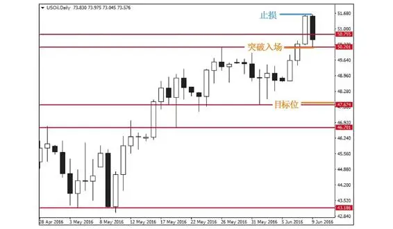

图7-25　交易计划

　　如图7-26，行情顺利走到了我们的目标位。

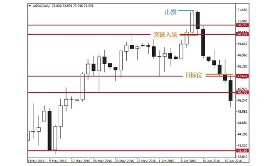

图7-26　后续走势

　　后续的行情又是连着几根阴线，此时行情再次出现了我们需要的信号，如图7-27所示，日线级别一个看涨吞没形态，再一次让我们看到了不错的交易信号。

　　我把图缩小一点，如图7-28所示，可能大家看得更加直观。

　　这个信号我目测就是很不错的信号，不过安全起见，我们依旧对其进行研判。

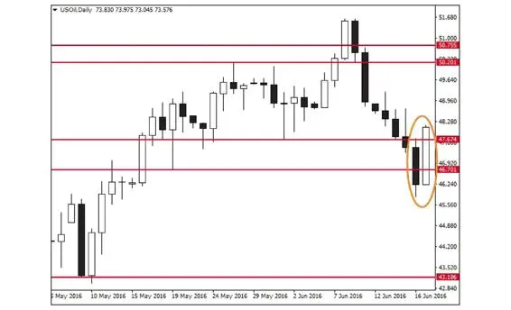

图7-27　看涨吞没形态

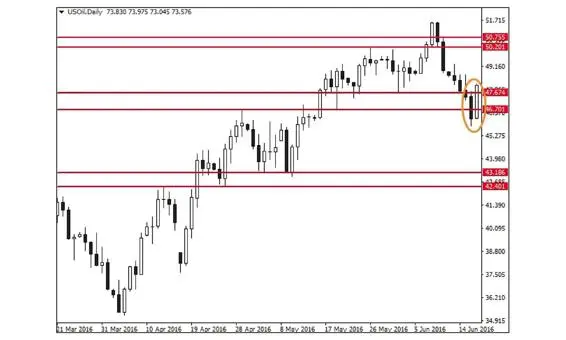

图7-28　缩小的图

　　两个基本条件：

　　1.是否处于明显的关键位？

　　是的。其处于两个较明显的关键位。

　　2.是不是处于明显的高位或者低位？

　　是的。信号之前是一波明显的下跌走势。

　　五个细节项：

　　1.整个Pinbar在盘面上是否明显？

　　是的。这个Pinbar是由一个吞没组成，吞没的幅度很大，非常显眼。

　　2.有没有假突破？

　　有的。最下方关键位有被突破，后续又收回来，是一个明显的吞没形态。

　　3.Pinbar的实体有没有包含在之前的K线(左眼)的最高价和最低价之内，并且信号的幅度要大于左眼？

　　是的。吞没形态组成的Pinbar实体处于左眼之内，而且比左眼要大。

　　4.是不是顺着较大级别趋势？

　　是的。虽然有所下跌，但是较大趋势目前还是上涨趋势。

　　5.突破入场的盈亏比是否大于1.5︰1？

　　不满足。盈利空间190余点，由于信号幅度过大，止损有240多点。

　　这个信号最终是2+4的优质信号，这里有一点特殊情况是这个吞没形态穿过了2个关键位，那么，回调入场不太合适，因为如果回调的话要下穿关键位，这个时候对我们看多是不利的，所以，这个信号只能突破入场，并且把止损设置在50%位置。

　　如图7-29，这笔交易的入场和止损位、止盈位的参考点位都用线标出了。

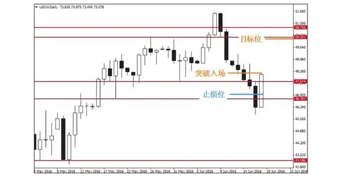

图7-29　交易计划

　　这笔单子走得也挺快的，如图7-30，3根线到止盈位，当然，考虑到是日线级别，3天的持仓对于新手可能会比较难熬，但是这已经是很快的一笔交易了。有的交易可能耗时几个月都有可能。

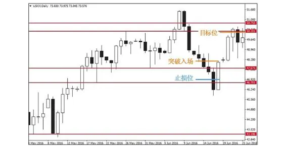

图7-30　后续走势

　　我们再往下看，如图7-31，2016年10月原油盘面在前期高位附近出现看空吞没。

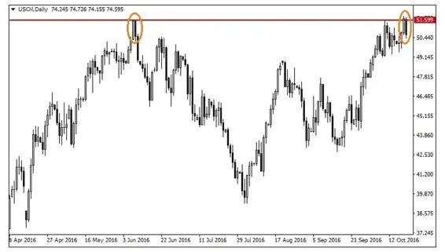

图7-31　看空吞没

　　我们先把明显的关键位画出来，如图7-32所示。可能还有一些比较隐蔽的关键位，大家不要钻牛角尖，我们做最明显的关键位就可以了。

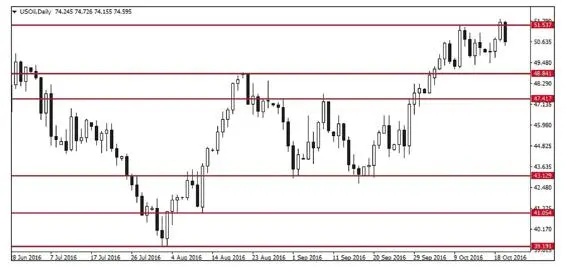

图7-32　关键位

　　我们对这个信号进行研判。

　　两个基本条件：

　　1.是否处于明显的关键位？

　　是的。信号处于非常明显的拐点。

　　2.是不是处于明显的高位或者低位？

　　是的。信号之前处于明显的上涨趋势高点。

　　五个细节项：

　　1.整个Pinbar在盘面上是否明显？

　　明显。信号是一个较大幅度的吞没形态。

　　2.有没有假突破？

　　有。此吞没无论是对于较早之前的高点还是近期的高点，都是假突破。

　　3.Pinbar的实体有没有包含在之前的K线(左眼)的最高价和最低价之内，并且信号的幅度要大于左眼？

　　是的。都满足。

　　4.是不是顺着较大级别趋势？

　　不是。目前趋势是上涨趋势，但是这个信号是看空信号。

　　5.突破入场的盈亏比是否大于1.5︰1？

　　不满足。信号长度有149个点，而突破后距离最近的目标位只有155个点，盈亏比约为1：1，所以不满足。

　　最终该吞没形态为2+3，符合我们的交易要求，可以操作。

　　如图7-33，这里我们采用双保险战术，挂两个单：突破入场，止损位放在信号的50%位置上方；回调50%入场，止损位放在前期高点上方。不过这里还可以使用回调33%入场，因为按照我们的交易要求，盈亏比要达到1.5︰1，则我们需要的盈利和亏损达到这一比例即可，所以，在这种情况之下，我们可以使用回调1/3的方式入场，这时的盈利空间是204个点，止损有100个点，盈亏比达到了2︰1，如果我们采取回调50%入场的话，我们的盈亏比是230︰75=3.07︰1，这笔交易的盈亏比将会非常有优势。

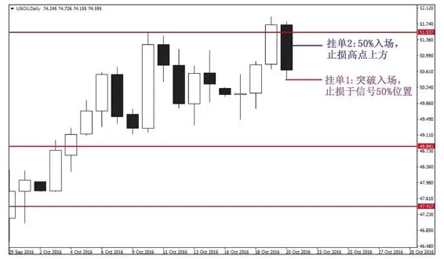

图7-33　交易计划

　　如图7-34所示，最后行情是先突破了信号，然后顺利地走到了我们的目标位。

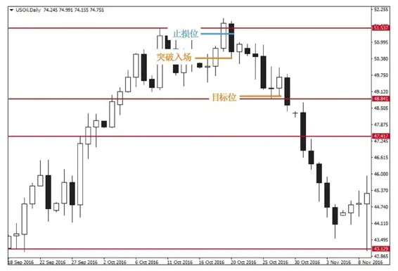

图7-34　后续走势

　　不过，正如我们之前提到的，这个信号如果用回调33%来做也是可以的，而且盈亏比还是2︰1，可以获得不错利润的。

　　这里的走势非常流畅，如果试一下三线战法，我们看看能不能获得更大收益。

　　我们通过破位入场，设置止损于信号末端之后，不设置止盈，然后按照最新的3根K线的极值来移动止损位，止损不能放大，只能缩小。三线战法的最后必然是以打止损出场，但是通过不断地移动止损，可以获得非常夸张的单边收益。

　　如图7-35所示，我们的入场位设置在2号K线的最低价，我们在3号K线形成的期间突破了该最低价，所以我们入场，最初的止损位于1号K线的最高价上方，之后按照最新的三根K线的最高价不断地移动止损之后，最终止损放在了4号K线最高位，然后5号K线(画了圈)触及此止损位，导致我们平仓出场。这笔单子的总体利润达到了540个点，而最初的止损只有150个点，盈亏比超过了3︰1。这就是三线战法的神奇所在。

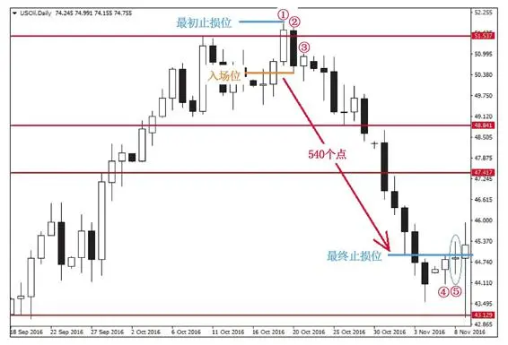

图7-35　三线战法

　　紧接着我们这笔交易，行情又给出了一个很明显的Pinbar信号，如图7-36。这是一个在关键位出现的巨大的Pinbar，我们需要对其进行研判。

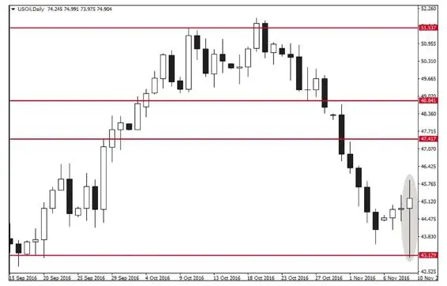

图7-36　出现Pinbar

　　两个基本条件：

　　1.是否处于明显的关键位？

　　是的。这个Pinbar处于明确的关键位上。

　　2.是不是处于明显的高位或者低位？

　　是的。Pinbar自身处于一波下跌趋势的低点。

　　五个细节项：

　　1.整个Pinbar在盘面上是否明显？

　　很明显。这个信号的长度非常大，是一个明显的Pinbar。

　　2.有没有假突破？

　　没有。关键位踩得比较精准，没有明显的假突破。这里有朋友可能会觉得之前的那3根阳线之前有一个拐点，我个人认为只有3根K线的小波段不足够让我们重视。我们可以比较一下下方和这个小低点的差距。

　　如图7-37所示，灰色区域内的拐点非常明显，而粉色小级别拐点的级别就太小了，而且在触及这个位置的时候，没有出现长度很大的线，这也说明这个位置多和空投入的力量都不大，所以可以暂时无视。

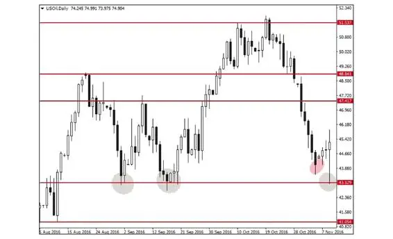

图7-37　拐点的比较

　　3.Pinbar的实体有没有包含在之前的K线(左眼)的最高价和最低价之内，并且信号的幅度要大于左眼？

　　是的。满足。

　　4.是不是顺着较大级别趋势？

　　不是。较大级别趋势是下跌趋势，这个信号是一个看多信号，所以不算顺趋势。

　　5.突破入场的盈亏比是否大于1.5︰1？

　　不满足。突破入场目标位有150个点，但是却面临了290个点的止损！所以不满足我们的盈亏比，需要采用回调入场。

　　这个信号最终拿到了2+2，可以操作，我们需要采用回调50%的位置进行买入，那么我们的交易计划如图7-38所示。

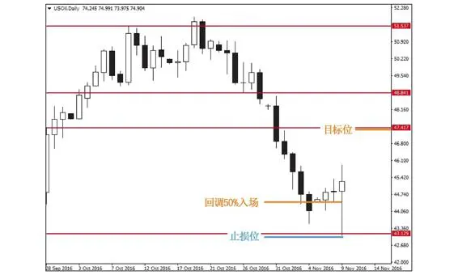

图7-38　交易计划

　　执行我们的交易计划。如图7-39所示，我们这笔交易没有盈利，行情下探了3根线之后在第四根线的时候打穿关键位触发我们的止损，这笔交易以止损结束。

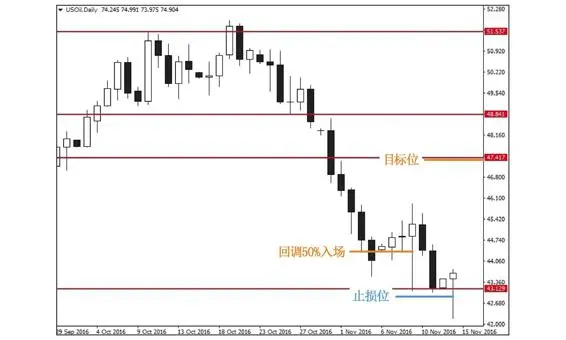

图7-39　后续走势

　　怎么打止损了？是不是我们的交易系统有问题呢？

　　其实无须感慨，这就是市场。我从来没有说过我的裸K线交易法是100%的胜率，按照1.5︰1的盈亏比，只要做到40%的胜率，我就是整体盈利的，更别说我们的成功率远远高于40%。我们可以去反思一笔失败的交易，但是如果是严格按照交易系统来做的，那么就没有必要去后悔。亏损的交易不代表是失败的交易。失败的交易是指因为人为因素而导致的亏损，而不是严格执行了策略而打止损的交易。

　　这笔交易也提醒我们：Pinbar被突破之后才是真正的有效信号。回调买入的风险就在这里：虽然能拿到好的点位，但是信号如果一直没有被突破，那再好的点位也是徒然。

　　这笔交易虽然止损了，但是止损之后日线又在关键位收出了一个Pinbar，见图7-40，那么我们应该把刚刚的失败放一边，继续对新出来的Pinbar做研判。

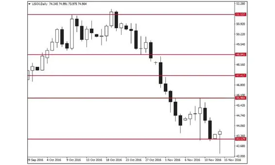

图7-40　出现Pinbar

　　如图7-40，由于之前Pinbar的幅度很大，而且自此行情下探并且突破低点，所以我把Pinbar的高点视为拐点，作为我们需要观察的关键位。

　　我们对这个信号进行研判。

　　两个基本条件：

　　1.是否处于明显的关键位？

　　是的。信号处于明显的关键位。

　　2.是不是处于明显的高位或者低位？

　　是的。信号处于近一段行情的低点。

　　五个细节项：

　　1.整个Pinbar在盘面上是否明显？

　　是的。虽然之前的Pinbar更大，但是这个信号依旧非常显眼。

　　2.有没有假突破？

　　有的。信号突破了关键位之后再次拉升到关键位上方，形成了一个Pinbar，这也是我们上一笔交易失败的原因！

　　3.Pinbar的实体有没有包含在之前的K线(左眼)的最高价和最低价之内，并且信号的幅度要大于左眼？

　　没有。Pinbar左边的K线是个小阳线，而K线实体完全超过了小阳线。

　　4.是不是顺着较大级别趋势？

　　不是。当前趋势是下跌趋势，而这个信号是一看涨信号，所以不属于顺趋势交易。

　　5.突破入场的盈亏比是否大于1.5︰1？

　　不满足。突破入场后盈利空间有205点，而止损有160个点，所以不满足1.5︰1的盈亏比要求。

　　最终得出信号的有效性为2+2，可以交易。

　　鉴于这个信号的自身长度以及关键位所在的位置，我有两个方案给大家参考：

　　1.突破信号买入，止损于信号回调的50%下方，因为下方关键位在信号的50%上方，所以我们把止损设置在信号的50%以下是很保险的。

　　2.回调33%左右买入，止损于信号的最低价下方，因为关键位约在信号的40%位置，所以不太可能回调到50%，如果真的回调到了50%，也就是关键位下方，那么这个信号就有危险了，我们不应该做多。

　　同样的，我们这里可以采取双保险，同时挂两个单，看哪个单子先成交就把另一个单子撤销掉。如图7-41所示，就是我们的交易计划。

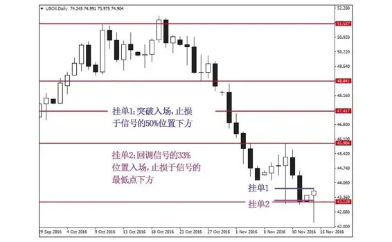

图7-41　交易计划

　　那么我们看一下行情到底是怎么走的，见图7-42。

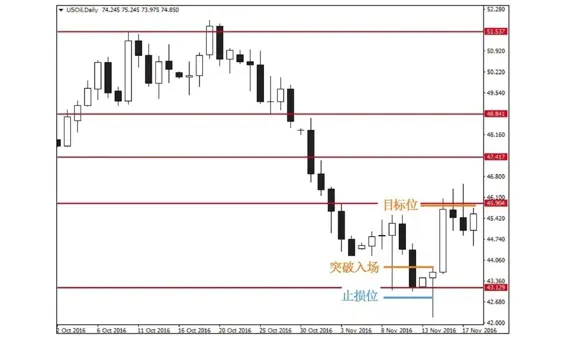

图7-42　后续走势

　　行情最终没有给回调的机会，就拉上去直接走到了我们的目标位。

　　我们之前说过，三线战法，看看这里如果用三线战法会不会有扩大盈利的机会。

　　我们依旧突破入场，初始止损放在最低点下方，见图7-43。

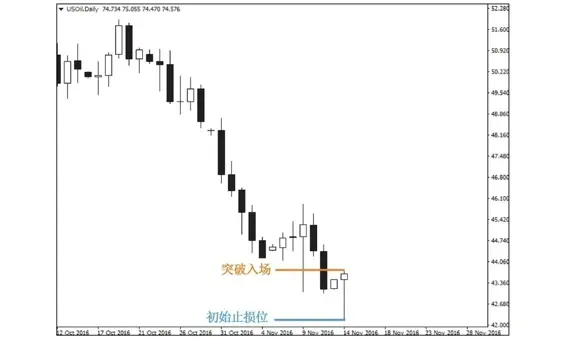

图7-43　三线战法初始交易计划

　　等3根K线之后，第一次挪动止损，如图7-44。

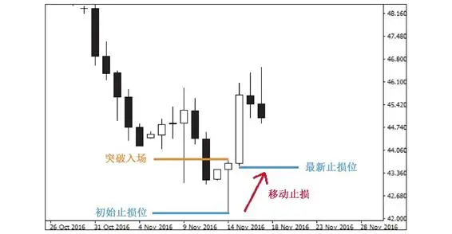

图7-44　移动止损

　　之后随着行情的演变，我们要继续挪动几次止损，如图7-45\~图7-47。

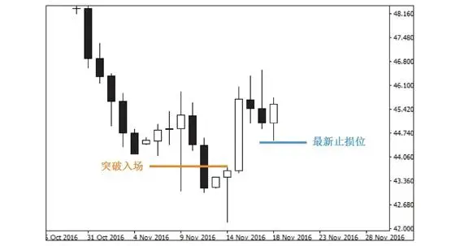

图7-45　行情演变1

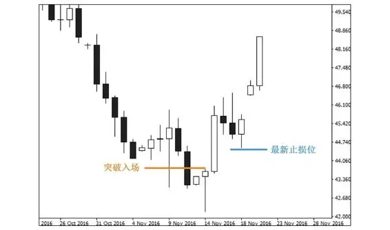

图7-46　行情演变2

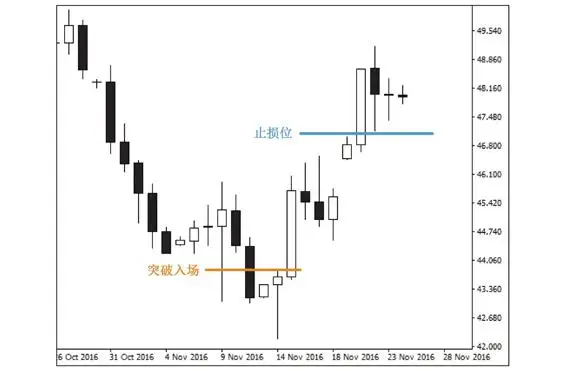

图7-47　行情演变3

　　最终，我们的单子触及最新设定的止损离场，但是我们却是获利的。

　　如图7-48所示，我们来总结一下三线战法在这笔交易的过程：

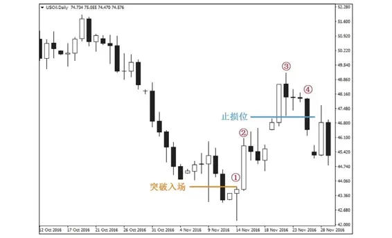

图7-48　三线战法交易总结

　　我们由1号K线判断行情要上涨，然后选择突破1号K线的最高位入场，入场的时间是在2号K线形成的过程中，最初的止损放在1号K线最低点下方，但没有设置止盈。随后，我们按照最新的3根K线的最低价来设置我们的止损，最终的止损位于3号K线的最低点，由4号K线击穿来结束我们的交易。整体获利330点，而最初的止损在160点左右，最终的盈亏比达到了2︰1。

## 7.4　瑞郎实战

　　我们来看一下瑞郎的一个信号。图7-49为2018年2月附近瑞郎的走势，首先看到的是瑞郎在走下跌趋势，并且在低位出现了一个类似"吞没"形态的K线组合。根据之前的学习，我们知道这种K线是可以合并成Pinbar并且作为信号的，所以我们对其进行研判。

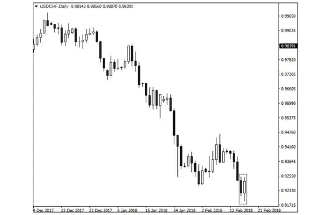

图7-49　出现吞没形态

　　我们先把较为明显的关键位画出来，如图7-50所示。那些不是特别明显的关键位，如果后续有需要或者被再次验证，我们再加上去。

　　好了，我们开始研判。

　　首先是两个基本条件：

　　1.是否处于明显的关键位？

　　是的。信号的位置是前期下跌趋势的低点附近。

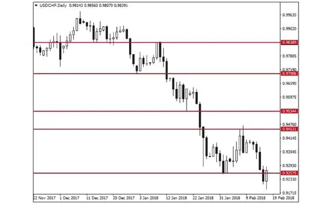

图7-50　关键位

　　2.是不是处于明显的高位或者低位？

　　是的。信号之前有7根K线处于明显的下跌趋势，而信号由2根K线组合而成，满足条件。

　　根据我们研判，这个信号是符合我们交易的基本条件的，接下来对其五个细节项进行细节研判：

　　1.整个Pinbar在盘面上是否明显？

　　不明显。至少相比之下前面有很多K线的幅度都要大于组合成信号的这两根K线，所以相比较之下，并不明显。但是K线自身的幅度是100个点，长度并不小。

　　2.有没有假突破？

　　有的。信号的左半部分直接突破前期低点，并且收盘在前低之下，而右半部分则上攻了前低并且收于前低上方，是一个标准的低位假突破。

　　3.Pinbar的实体有没有包含在之前的K线(左眼)的最高价和最低价之内，并且信号的幅度要大于左眼？

　　没有。Pinbar(信号)的实体很小，合成之后的Pinbar据观察实体并不在左眼范围之内，并且左眼的幅度要比信号大。

　　4.是不是顺着较大级别趋势？

　　不是。行情属于下跌趋势，而信号是一个看多信号，并不是顺势操作。

　　5.突破入场的盈亏比是否大于1.5︰1？

　　满足。突破入场的止损是信号本身，这个信号的长度是99个点，而上方的关键位离入场点有161个点，所以这个信号的盈亏比约为1.6：1，大于1.5︰1的要求，符合条件。

　　因此我们得出这个信号是2+2，符合我们的进场要求，所以我们决定执行这笔交易——别忘了设定止损！

　　我们的交易已经计划好了止盈和止损，如图7-51所示，就等行情突破信号高点入场了。

图7-51　交易计划

　　如图7-52，这笔交易最终顺利打止盈离场了。

图7-52　后续走势

## 7.5　欧元实战

　　我们来看看欧元盘面上的信号。如图7-53，欧元日线级别，高位下跌之后出现一个Pinbar，这里我们对其进行研判。

图7-53　出现Pinbar

　　两个基本条件：

　　1.是否处于明显的关键位？

　　是的。这个信号下方有两个关键位。

　　2.是不是处于明显的高位或者低位？

　　是的。该Pinbar处于短暂回落的第三根K线，虽然时间短，但是幅度够大。

　　如图7-54所示，AB段的幅度约等于CD段的幅度。虽然K线的个数AB段明显要多于CD段，但是市场力度上，CD段要大于AB段。

图7-54　CD段的回落幅度够大

　　五个细节项：

　　1.整个Pinbar在盘面上是否明显？

　　不太明显。

　　2.有没有假突破？

　　有的。价格虽然对于下方关键位踩得很精准，但是上方关键位却是假突破。

　　3.Pinbar的实体有没有包含在之前的K线(左眼)的最高价和最低价之内，并且信号的幅度要大于左眼？

　　不满足，虽然实体被左眼包含，但是左眼的幅度有105点，而信号只有100点，左眼幅度大于信号幅度，所以不满足。

　　4.是不是顺着较大级别趋势？

　　是的。目前处于上涨趋势高位，这个信号是看多的，所以是顺趋势操作。

　　5.突破入场的盈亏比是否大于1.5︰1？

　　很勉强。突破入场的盈利空间有144个点，而止损有100个点，略微小于1.5︰1，严格来说是不满足的。

　　最终信号强度为2+2，可以操作，这里我们可以选择收线入场，原因有2个：

　　1.因为收线入场的盈亏比是157︰87=1.8︰1已经符合我们的要求了。

　　2.下方两个关键位，如果价格回调到下方，那么很有可能会往下破位，对我们的多单是不利的，此时我们不应该继续做多。

　　如图7-55，我们的交易计划就已经出来了。其实这种情况对于看多是比较有利的，因为这个信号有两个关键位给它"撑腰"，如果要让这个信号失败，就必须连续击穿两个关键位，这要比单独击穿一个关键位难度要大。

图7-55　交易计划

　　图7-56是之后的行情，打到了止盈位。而且，在止盈位又再次出现了1个Pinbar。

图7-56　后续走势

　　图7-57中的这两个Pinbar，我们要讨论的是第二个信号。第一个信号形态很不错，但是很可惜，并不处在关键位上。所以这笔交易我们没有做，虽然后续行情也是有所下跌，但是按照我们的交易系统，我们不能操作。

图7-57　出现高位Pinbar①和②

　　但是第一个信号，却是一个明显的高点，它自己成了一个关键位，那么等到第二个信号出现的时候，我们就可以对其进行研判了。

　　两个基本条件：

　　1.是否处于明显的关键位？

　　是的。之前的Pinbar给了一个明显的高点，所以这个新出来的信号是处于关键位的。

　　2.是不是处于明显的高位或者低位？

　　是的。信号之前有一波短期上涨，而信号正处于目前的高点。

　　五个细节项：

　　1.整个Pinbar在盘面上是否明显？

　　不太明显。之前的Pinbar和左眼都比信号幅度大。

　　2.有没有假突破？

　　有的。是一个明显的假突破，创了新高之后又有所回落。

　　3.Pinbar的实体有没有包含在之前的K线(左眼)的最高价和最低价之内，并且信号的幅度要大于左眼？

　　不满足。虽然Pinbar的实体被左眼包含，但是左眼的幅度要大于信号。

　　4.是不是顺着较大级别趋势？

　　不是。这个信号是一个明显的看空信号，但是目前依旧处于上涨行情高点，属于逆势操作。

　　5.突破入场的盈亏比是否大于1.5︰1？

　　是的。突破入场止损约80个点，而预期的止盈有120个点，正好满足1.5︰1的盈亏比。

　　得出信号强度是2+2，可以操作，由于其盈利空间够大，我们选择突破信号入场，并且止损放在信号的最高点之后，目标则放在下方关键位之上：

　　如图7-58所示，我们的交易计划已经出来了。那么有朋友可能会觉得止损位是否可以放在信号的50%位置呢？这里，我的建议是放在最高点上方，如果觉得止损过大，也可以放在关键位上方。因为该信号50%的位置处于关键位下方，很容易被触及，所以把止损位放在关键位上方会比较保险。

图7-58　交易计划

　　如图7-59，价格突破之后一路下跌，我们顺利止盈离场。

图7-59　后续走势

　　我们再看一段欧元的走势，如图7-60。

图7-60　欧元走势

　　同样是欧元的日线级别走势，发生在之前那笔交易之后一个月左右时间，在下方关键位出现一个Pinbar，这个Pinbar引起了我的注意，我们现在来对其进行研判。

　　两个基本条件：

　　1.是否处于明显的关键位？

　　是的。处于明显的关键位。

　　2.是不是处于明显的高位或者低位？

　　是的。该信号处于一波下跌趋势的明显低点。

　　五个细节项：

　　1.整个Pinbar在盘面上是否明显？

　　不明显。相对而言该信号幅度较小。

　　2.有没有假突破？

　　没有。虽然突破了关键位，但是并未打破前期低点，所以并不是一个明显的假突破。

　　3.Pinbar的实体有没有包含在之前的K线(左眼)的最高价和最低价之内，并且信号的幅度要大于左眼？

　　不满足。左眼的幅度大于信号(见图7-61)。

图7-61　左眼幅度大于信号幅度

　　4.是不是顺着较大级别趋势？

　　不是。短期内行情处于下探，该信号看多，不属于顺势。

　　5.突破入场的盈亏比是否大于1.5︰1？

　　不满足。突破止损要70个点，而目标只有90个点，不满足1.5︰1的盈亏比要求。

　　这个信号根据我们的研判，是2+0的信号，不能操作。不过行情依旧走得很不错。

　　如图7-62所示，行情在这里的确走到了关键位，但是这个信号就是不符合我们的交易系统，
因为它在我们看来不够完美，这笔交易没有操作。可能有人觉得我们少赚了一笔，但是在我看来我们并没有做错！依旧是按照我们的交易系统在操作，而不是凭感觉来交易。

图7-62　后续走势能让一个交易员长久盈利的是一套稳定的交易系统，而不是患得患失，妄想把握市场的每一次机会。

　　我们继续来看，如图7-63，欧元在一波下跌之后在低位出现了一个Pinbar，我们对其进行研判。

图7-63　出现Pinbar

　　两个基本条件：

　　1.是否处于明显的关键位？

　　是的。Pinbar处于较明显的前低附近。

　　2.是不是处于明显的高位或者低位？

　　是的。该Pinbar处于一波下跌行情的低点位置。

　　五个细节项：

　　1.整个Pinbar在盘面上是否明显？

　　不明显。这个信号虽然自己的幅度有60个点，但是相比较之下，的确不算明显。

　　2.有没有假突破？

　　有的，其突破了之前的低点，然后收回于低点上方，是一个明显的假突破。

　　3.Pinbar的实体有没有包含在之前的K线(左眼)的最高价和最低价之内，并且信号的幅度要大于左眼？

　　满足。

　　4.是不是顺着较大级别趋势？

　　不是。目前是下跌趋势，这个信号是一个看涨信号，所以不满足顺势。

　　5.突破入场的盈亏比是否大于1.5︰1？

　　不满足。该信号突破后的止损是60个点，止盈是70个点，不满足1.5︰1的盈亏比要求。

　　该信号的强度是2+2，满足我们的进场要求，所以可以操作。进场方式可以选择收线入场。如果收线入场的话，我们面临的止损是48个点，而止盈有82个点，82︰42=1.95︰1，完全符合我们的盈亏比要求。当然，你也可以选择33%或者50%回调入场。这里并不是特别推荐突破入场，因为这个信号的幅度不大，如果突破入场的话，我们的止损位要放在信号的50%位置，而这个信号的50%位置正好处于关键位上方，很容易因为整理的延续而触及我们的止损。

　　如图7-64，我们的交易计划就已经出来了。我们在其收线之后就可以买入了，止损位于影线下方，目标位在上方关键位。

图7-64　交易计划

　　如图7-65，最终我们的交易顺利打了止盈。

图7-65　后续走势

　　那么这笔交易如果我们采用三线战法会怎么样呢？

　　我们知道，三线战法入场方式和普通的交易一样，但是止损一定是设置在影线后方的，就如图7-66所示。

图7-66　三线战法初始交易计划

　　然后我们根据三线战法原则：把止损移动到最新的三根K线的最低价，当然，止损只能越来越小，不能越移越大。

　　图7-67为第一次移动止损位。

图7-67　第一次移动止损位

　　如图7-68，出现大阳线之后，我们选择最近的三根K线的最低点作为止损参考。

图7-68　出现大阳线之后的止损位

　　大阳线之后出现回落，此时的止损位应该为图7-69所示。

图7-69　出现回落后的止损位

　　当然，这个位置是最终的止损位，之后价格回落触及该止损，我们平仓离场，如图7-70所示。

图7-70　平仓离场

　　让我们再整体回顾一下这笔交易，如图7-71，我们根据研判1号K线得出可以尝试做多，并选择在1号K线收线后买进，并且把止损设定在1号K线的最低点下方。之后在2号K线的时段内，我们进场并设定了初始止损位，然后把止损位移动到最新的3根K线的最低价。最终，我们按照规则把止损位放到了3号K线的最低点下方，4号K线触及我们的止损位让我们出局。那么，我们最后的利润一共有152
个点，较之前多了约70个点，翻了近一倍。而当初面临的止损有48点，盈亏比超过了3︰1。所以如果能够合适地使用三线战法，对我们的获利将会有非常大的帮助。

图7-71　三线战法交易总结

## 7.6　白银实战

　　我们来看一段白银日线图的行情，如图7-72所示。

图7-72　白银日线图

　　2013年的9月左右伦敦银的日线走势图，我们发现在一段上涨行情之后，在盘面上出现了一较为明显的Pinbar信号。我们观察得出，其位置正好经过了前期的拐点，所以它可能是我们要等待的交易信号，拉近盘面，画出附近的关键位。

　　如图7-73所示，我们将5月20日到8月底的明显的拐点，都在盘面上标记了出来，这些位置就是我们接下来的交易所需要关注的点位，当然，这些点位也要根据最新的行情反应来进行调整，这点在之前的教学中就有提到。

图7-73　关键位

　　下面我们对信号进行研判。

　　两个基本条件：

　　1.是否处于明显的关键位？

　　是的。处于之前明显的拐点。

　　2.是不是处于明显的高位或者低位？

　　是的。信号出现于一波明确的上涨趋势高位。

　　五个细节项：

　　1.整个Pinbar在盘面上是否明显？

　　明显。这个信号的鼻子在附近盘面是比较突出的，幅度也够。

　　2.有没有假突破？

　　有的。信号突破了之前高点，然后收线于高点下方，是一个假突破。

　　3.Pinbar的实体有没有包含在之前的K线(左眼)的最高价和最低价之内，并且信号的幅度要大于左眼？

　　满足。

　　4.是不是顺着较大级别趋势？

　　不是。现在观察行情是比较强的上涨趋势，这个信号是看空信号，所以不算顺势。

　　5.突破入场的盈亏比是否大于1.5︰1？

　　不满足。突破入场面临的止损是85个点以上，而目标位也只有85个点，所以不满足。

　　信号满足2+3，而且刨去盈利空间问题，是满足了4个细节要求中的3个，是一个非常优秀的信号。我们选择挂两个单：(1)突破信号入场，止损于信号的50%以上；(2)回调信号50%入场，止损于信号高点以上。

　　如图7-74所示，两笔交易用不同的颜色标出，下方关键位是我们的目标位，也就是止盈位置。

图7-74　交易计划

　　如图7-75所示，行情突破之后直接下跌，我们跟进破位单，顺利达到止盈目标。

图7-75　后续行情

　　我们继续等待之后的交易信号。

　　在之后的行情中，出现了图7-76的一个信号，我们对其进行研判。

图7-76　出现Pinbar

　　两个基本条件：

　　1.是否处于明显的关键位？

　　是。处于之前的一个拐点位置，属于关键位。

　　2.是不是处于明显的高位或者低位？　　是的。之前行情处于明显的下跌趋势，信号出现在最低点。

　　五个细节项：

　　1.整个Pinbar在盘面上是否明显？

　　比较明显。

　　2.有没有假突破？

　　没有。

　　3.Pinbar的实体有没有包含在之前的K线(左眼)的最高价和最低价之内，并且信号的幅度要大于左眼？

　　不满足。其左眼长度要大于信号长度。

　　4.是不是顺着较大级别趋势？

　　满足。虽然小级别趋势在下跌，但是此时并没有跌破之前趋势的61.8%，所以我们依旧认为是看涨趋势。更加的是：该信号所处位置正好为之前上涨趋势的回调61.8%位置，如图7-77所示。

图7-77　信号位于上涨趋势回调的61.8%位置

　　5.突破入场的盈亏比是否大于1.5︰1？

　　不满足。上方压力很大，盈利空间有限。

　　信号强度为2+2，可以操作。由于上方关键位离现价非常近，我们需要等回调才能入场。为了满足条件，我们只能选择回调信号的61.8%才能入场。

　　然而，行情在下一根K线就打我们脸了，直接高开低走。入场条件被破坏，而且，我们观察一下关键位，如图7-78所示。

图7-78　回补缺口后下跌

　　跳空突破了关键位，而且其所处位置正好是之前的关键位附近，而且如果算下方影线的话，这个位置已经完完全全打到了关键位。所以，这笔交易没有给我们入场的机会就把我们的盈利空间走完了。

　　因为没有给到回调入场位而错过的交易，后面还有一个。如图7-79，灰色区域出现了一个看涨吞没形态，研判之后是满足我们入场条件的，但是由于盈利空间问题，我们要等待50%回调才可以满足我们交易系统所规定的1.5︰1的最低盈亏比条件，但是很可惜，没有回调到位置，就拉上去并且碰到了上方关键位。不过也不是毫无收获，上方打到关键位之后，在关键位收了一个黄昏星，也是我们的一个交易信号，此时，我们对这个黄昏星进行研判。

图7-79　出现吞没形态和黄昏星形态

　　两个基本条件：

　　1.是否处于明显的关键位？

　　是的。处于之前的拐点位置附近。

　　我把整个区域展示出来，以便大家可以清晰地判断。如图7-80所示，这一水平的三个灰色区域都出现了较为明显的拐点，哪怕最近的黄昏星还没有走出来，但是最右边的大阴线也说明价格在这个位置受到了压力。

图7-80　三个拐点

　　2.是不是处于明显的高位或者低位？

　　是的。之前的K线有一波较明显的上涨。

　　五个细节项：

　　1.整个Pinbar在盘面上是否明显？

　　不明显。这里相比之下幅度并不算大。

　　2.有没有假突破？

　　没有。关键位踩得很规整，并没有明显的假突破。

　　3.Pinbar的实体有没有包含在之前的K线(左眼)的最高价和最低价之内，并且信号的幅度要大于左眼？

　　满足。如果把该形态的三根K线合成一根，则可以得到一个Pinbar，这个Pinbar的实体很小，包含在左边的那个小K线之内。而且信号长度明显大于左眼。

　　4.是不是顺着较大级别趋势？

　　是的。目前看来是较明显的下跌趋势。

　　5.突破入场的盈亏比是否大于1.5︰1？

　　不满足。盈利空间很小，必须要选择回调信号的61.8%才可以满足。

　　这个信号是2+2，同样是需要等回踩才可以入场。

　　好的，那么我们就等它回调。

　　我们的交易计划就如图7-81所示。此时，就等行情有没有给我们好的位置让我们入场了。

图7-81　交易计划

　　结果如图7-82所示。

图7-82　后续走势

　　市场还是给了一个不错的回调位置，然后我们入场，之后第二根K线就到了我们的止盈位，我们顺利出局。

　　这笔交易持续了2天时间都不到，然后又过了几天时间，盘面上再次出现了一个非常明显的Pinbar：为了让大家感受到它来得多快，我不把上一笔交易的标记擦掉，如图7-83所示。

图7-83　出现Pinbar

　　一眼就看出来，这是一个很大的Pinbar！我们迅速对其研判。

　　两个基本条件：

　　1.是否处于明显的关键位？

　　是的。Pinbar处于明显的关键位，而且是一个很强的关键位，为了让大家看到这个关键位有多强，我把之前的走势放大给大家看看，如图7-84所示。

图7-84　放大时间长度的走势图

　　之前的高点以及跳空缺口，再加上不久之前的拐点以及Pinbar自身的影线，都反映了这个位置是很强的关键位！

　　2.是不是处于明显的高位或者低位？

　　是的。信号自身处于最低点。

　　五个细节项：

　　1.整个Pinbar在盘面上是否明显？

　　是的。非常明显的一个Pinbar。

　　2.有没有假突破？

　　有的。关键位和前期低点都被刺穿，但是之后又收回关键位上方，是一个标准的假突破，信号头部还有一个关键位，不过其强度远远不如下方关键位，可以忽视。

　　3.Pinbar的实体有没有包含在之前的K线(左眼)的最高价和最低价之内，并且信号的幅度要大于左眼？

　　满足。

　　4.是不是顺着较大级别趋势？

　　不是。当前趋势是较明显的下跌趋势，该信号看涨，所以不是顺趋势。

　　5.突破入场的盈亏比是否大于1.5︰1？

　　不满足条件。突破入场之后的盈利约为1︰1，所以不满足1.5︰1的要求。

　　好了，那么这个信号的最终研判是2+3，由于其盈利空间还是不错的(差不多1个信号高度)，那么我们有较多的选择：

　　1.可以用双保险来做：挂突破入场单和回调入场单，回调入场依旧是50%。

　　2.收线入场。观察这个信号，它本身就是一个阴线，而且正好处于从最高点回落的38%附近，如要按照38%入场的话盈亏比是符合我们的要求的，所以可以选择收线入场。

　　双保险来做的，最终是破位入场，则止损55个点左右，止盈90个点左右，最终盈亏比是1.63︰1；收线入场的，止损70个点左右，止盈125个点左右，盈亏比为1.78︰1。

　　两种入场方式各有千秋，不能单纯地评价孰优孰劣，破位入场虽然盈亏比低而且止损风险较后者略大，但是基本能保证不错过机会；收线入场利润空间和止损都比较稳健，但如果止损的话，点位是比前者要多的。

　　这里，我个人选择收线入场，并且把止损放在信号最低价下方。如图7-85所示，收线入场的止盈和止损位置设定。入场之后，我们拿着单子就可以了。

图7-85　收线入场的交易计划

　　如图7-86，行情走得非常好，我们的单子顺利地走到了目标位。

　　当然，如果我们选择破位入场并且止损位在信号的50%位置，这笔交易也是可以获得盈利的。

图7-86　后续走势

　　图7-87是突破入场以及之后的止盈位及止损位设定参考方式。

图7-87　突破入场的交易计划

　　我们继续来看行情，看看有没有新的交易信号出来。

　　如图7-88，依旧是白银盘面，在关键位附近再一次出现了一个日线Pinbar！

图7-88　出现Pinbar

　　不过此时，我们需要对关键位进行一些调整，因为在Pinbar之前出现了一个拐点，这个是需要我们作为关键位来参考的！

　　调整好之后，盘面上的关键位如图7-89所示。

图7-89　调整关键位

　　那么我们对Pinbar进行研判。

　　两个基本条件：

　　1.是否处于明显的关键位？

　　是的。这个信号处于两个比较相近的关键位区间。

　　2.是不是处于明显的高位或者低位？

　　是的。Pinbar处于一波短期上涨的趋势，它自己就是最高点。

　　五个细节项：

　　1.整个Pinbar在盘面上是否明显？

　　是的。Pinbar幅度比较大，一眼就能看到。

　　2.有没有假突破？

　　有的。突破了之前的关键位之后又收在关键位下方，是一个假突破行为。不过Pinbar下方还有一个关键位，强度和上方关键位差不多，需要我们注意。

　　3.Pinbar的实体有没有包含在之前的K线(左眼)的最高价和最低价之内，并且信号的幅度要大于左眼？

　　满足。

　　4.是不是顺着较大级别趋势？

　　是的。较大级别趋势依旧处于下跌行情，整个信号是一个看空的信号，所以是符合顺趋势这个条件的。

　　5.突破入场的盈亏比是否大于1.5︰1？

　　不符合。突破进场止损70个点，止盈90多点，不符合我们的要求。

　　经过研判，这个信号居然有2+4，不过我们需要看清楚一点，信号的下方还有一个关键位呢！

　　这个信号比较特殊的地方在于，它的收盘是处于关键位附近，左边有一个刚形成的小级别高点，下方在之前有一个较大幅度高点，这两个都是比较有效的关键位。如果这个时候要交易，我们只能选择突破信号交易，也就是说我们必须要等待信号突破Pinbar的最低点之后才能确认。为什么？因为下方的关键位是一个支撑作用，而信号是看空的，如果这个时候要做的话必须等到行情完全突破这个支撑位，才可以做空。好在Pinbar的最低价是处于关键位下方的，如果价格突破信号的话也就是突破了关键位，可以做空。

　　综上所述，我们选择破关键位然后止损设置于信号的50%位置后方，不过50%位置比较接近上方关键位，也可以把止损放到关键位上方。

　　如图7-90所示，这两种止损的设置都是可以的，不过我个人更加偏向于把止损放到关键位上方，虽然止损点数较多，但是依旧满足1.5︰1的最低盈亏比要求。

图7-90　交易计划

　　入场之后，行情顺利达到止盈位，如图7-91所示。

　　我们接着看一下白银市场的一些机会。

　　图7-92是白银2017年的一波日线级别走势，在高位出现了我们所希望的信号：由三根K线组成的一个看空变形Pinbar。

图7-91　后续行情

图7-92　出现看空变形Pinbar

　　该走势相当简洁明了，我们补齐附近的关键位，如图7-93所示，最有可能用到的关键位就下方的两个低点。

图7-93　关键位

　　我们对信号进行研判。

　　两个基本条件：

　　1.是否处于明显的关键位？

　　是的。该信号处于明显的前期高点位置，是一个较强的关键位。

　　2.是不是处于明显的高位或者低位？

　　是的。目前处于明显的上涨趋势高位。

　　五个细节项：

　　1.整个Pinbar在盘面上是否明显？

　　明显。该信号幅度较大，比较明显。

　　2.有没有假突破？

　　有的。该信号突破前期高点并且收回于前高之下，是一个明显的假突破。

　　3.Pinbar的实体有没有包含在之前的K线(左眼)的最高价和最低价之内，并且信号的幅度要大于左眼？

　　满足。该信号合并之后的Pinbar实体包含于左眼之内，其长度为30个点，而左眼长度为29个点，满足条件。如图7-94所示。

图7-94　左眼长度和信号长度

　　4.是不是顺着较大级别趋势？

　　不是。目前处于上涨的高位，该信号是看空信号，所以不属于顺势。

　　5.突破入场的盈亏比是否大于1.5︰1？

　　满足。突破入场止盈60个点，止损30个点，盈亏比为2︰1，符合条件。

　　最终该信号强度为2+4，是一个非常优秀的信号。而且其盈亏比非常好，达到了突破入场后满足2︰1，我们可以选择突破信号入场，止损于信号上方。

　　如图7-95，我们该笔交易的计划就已经制定好了。

图7-95　交易计划

　　我们来看一下后续的走势。如图7-96，行情平稳地走到了我们的目标位，我们的交易以止盈结束。

图7-96　后续走势

　　而且，在下方关键位收出了一个日线级别的Pinbar。这个Pinbar不但有假突破，还是一个阳线的Pinbar。

　　虽然形态看起来不错。但是，并不是所有好看的Pinbar都是值得信赖的好信号。有些信号看似很好，却隐藏着一些危险，跳空就是其中一种。

　　图7-97中1号线的收盘价和2号线的开盘价出现了一个较大的跳空，我们对于该信号的考虑需要参考这个跳空缺口，上方的目标位不再是之前上方的关键位，而是要先补缺口。那么我们需要参考的第一目标位就是缺口的回补：因为这个缺口K线离信号太近了，它是Pinbar的左眼！

图7-97　跳空缺口

　　我们先补好关键位，如图7-98所示。

　　我们发现信号和目标位的距离过于接近。这个时候我们可以先考虑一下如果我们用最"让步"的入场方式是否能满足1.5︰1的最低盈亏比。如果不满足，就没有研判的必要了。该信号离目标位只有6个点，信号长度28个点，必须使用回调61.8%来进场。但是该信号如果回调61.8%就已经到关键位下方了！此时不能做多。既然无法满足1.5︰1的盈亏比，我们放弃了该信号。

图7-98　关键位

　　如图7-99，行情回补缺口后就一路下跌。

图7-99　后续走势

　　所以在以后的交易中，大家要务必警惕跳空缺口产生的影响。尤其是当缺口出现在左眼的时候，一定要注意。

