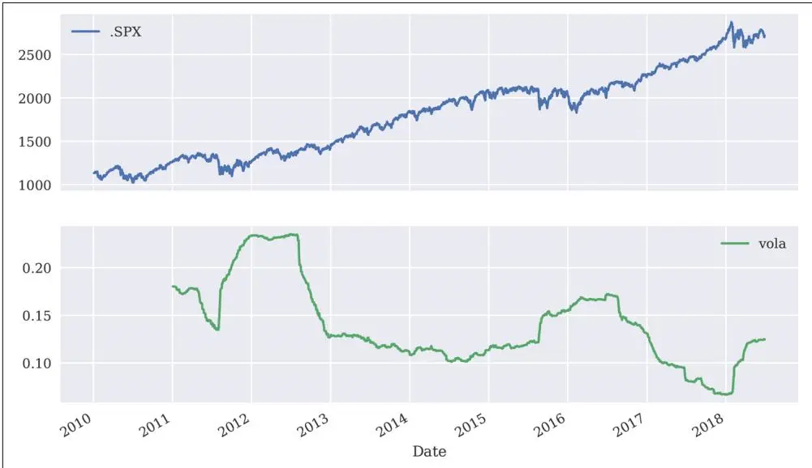
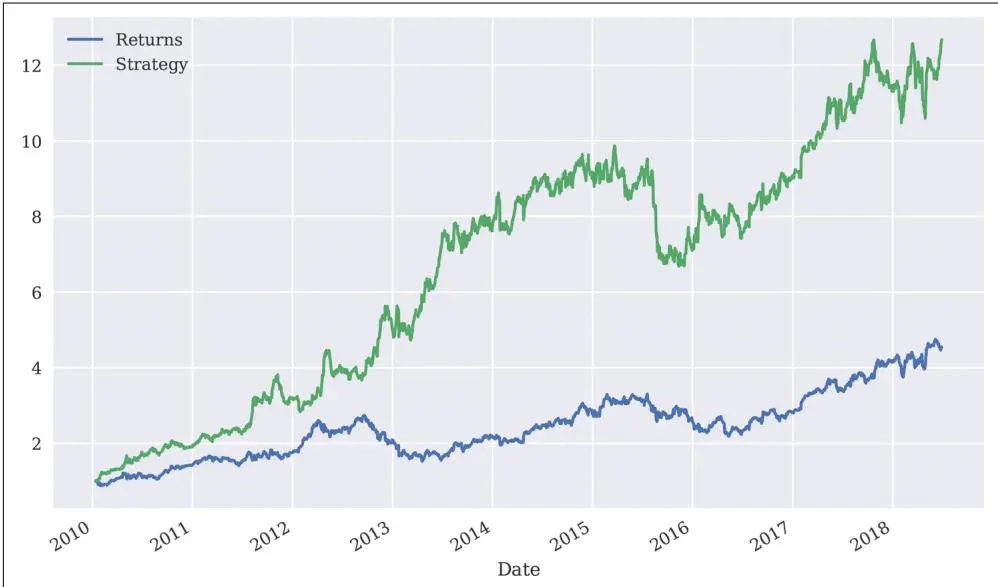


银行本质上是科技公司。
—Hugo Banziger


## Python编程语言

Python是一种高级、多用途编程语言，广泛应用于各种领域和技术领域。在Python官网上，你可以找到以下概要：

Python是一种解释型、面向对象、高级编程语言，具有动态语义。其高级内置数据结构，结合动态类型和动态绑定，使其非常适合快速应用开发（Rapid Application Development），也适用于作为脚本或胶水语言（glue language）来连接现有组件。Python简单易学的语法强调可读性，因此降低了程序维护成本。Python支持模块和包，促进了程序模块化和代码复用。Python解释器和扩展的标准库以源代码或二进制形式免费提供，支持所有主要平台，并且可以自由分发。

这很好地描述了为何Python已成为当今主要编程语言之一。如今，从初级程序员到高级专家开发者，从学校、大学到网络公司、大企业和金融机构，以及任何科学领域，都在使用Python。

## Python的特点包括：

**开源（Open source）**
Python及大多数支持的库和工具都是开源的，通常具有相当灵活和开放的许可证。

**解释型（Interpreted）**
参考CPython实现是该语言的解释器，在运行时将Python代码翻译为可执行的字节码（byte code）。

**多范式（Multiparadigm）**
Python支持不同的编程和实现范式，如面向对象、命令式、函数式和过程式编程。

**多用途（Multipurpose）**
Python既可用于快速交互式代码开发，也可用于构建大型应用；既可用于底层系统操作，也可用于高级分析任务。

**跨平台（Cross-platform）**
Python适用于最重要的操作系统，如Windows、Linux和macOS。它可用于构建桌面和Web应用，既可在大型集群和最强大的服务器上运行，也可在Raspberry Pi等小型设备上使用。

**动态类型（Dynamically typed）**
Python的类型通常在运行时推断，而非像大多数编译语言那样静态声明。

**缩进感知（Indentation aware）**
与大多数其他编程语言不同，Python使用缩进来标记代码块，而非圆括号、方括号或分号。

**垃圾回收（Garbage collecting）**
Python具有自动垃圾回收机制，无需程序员管理内存。

谈到Python语法和Python的核心理念，Python Enhancement Proposal 20——即所谓的"Python之禅"（Zen of Python）——提供了主要指导原则。它可以通过每个交互式shell中的命令 `import this` 来访问：

```txt
In [1]: import this
The Zen of Python, by Tim Peters

Beautiful is better than ugly.
Explicit is better than implicit.
Simple is better than complex.
Complex is better than complicated.
Flat is better than nested.
Sparse is better than dense.
Readability counts.
Special cases aren't special enough to break the rules.
Although practicality beats purity.
Errors should never pass silently.
Unless explicitly silenced.
```

面对歧义，拒绝猜测的诱惑。应该有一种——最好只有一种——明显的做法。虽然那种方式一开始可能并不明显，除非你是荷兰人。做比不做好。虽然"立刻"做通常不如"现在"做。如果实现难以解释，那是个坏主意。如果实现容易解释，那可能是个好主意。命名空间（Namespaces）是一个绝妙的理念——让我们多做些吧！

## Python简史

虽然Python对一些人来说可能仍有新鲜感，但它已经存在相当长的时间了。事实上，Python的开发工作始于1980年代，由来自荷兰的Guido van Rossum发起。他至今仍活跃在Python开发中，并被Python社区授予"终身仁慈独裁者"（Benevolent Dictator for Life）的称号。2018年7月，van Rossum在数十年来一直积极推动Python核心开发工作后，从这一职位上退了下来。以下是Python发展的里程碑：

• Python 0.9.0 于1991年发布（首次发布）
• Python 1.0 于1994年发布
• Python 2.0 于2000年发布
• Python 2.6 于2008年发布
• Python 3.0 于2008年发布
• Python 3.1 于2009年发布
• Python 2.7 于2010年发布
• Python 3.2 于2011年发布
• Python 3.3 于2012年发布
• Python 3.4 于2014年发布
• Python 3.5 于2015年发布
• Python 3.6 于2016年发布
• Python 3.7 于2018年6月发布

值得注意的是，有两个主要版本在同时开发和使用，自2008年以来一直并行——这对Python新手来说有时会感到困惑。截至撰写本书时，这种情况可能还会持续一段时间，因为仍有大量现有的生产代码是Python 2.6/2.7。虽然本书第一版基于Python 2.7，但第二版全程使用Python 3.7。

## Python生态系统

Python作为一个生态系统，与仅仅是一种编程语言相比，其主要特点是提供了大量的包和工具。这些包和工具通常需要在需要时导入（例如绘图库），或作为独立的系统进程启动（例如Python交互式开发环境）。导入意味着将包提供给当前命名空间和当前Python解释器进程。

Python本身已经附带了一大组包和模块，在各个方向上增强了基本解释器，这被称为Python标准库（Python Standard Library）。例如，基本的数学计算无需任何导入即可完成，而更专业的数学函数需要通过math模块导入：

```txt
In [2]: 100 * 2.5 + 50
Out[2]: 300.0

In [3]: log(1)
NameError Traceback (most recent call last)
<ipython-input-3-74f22a2fd43b> in <module>
----> 1 log(1)
NameError: name 'log' is not defined
In [4]: import math
In [5]: math.log(1)
Out[5]: 0.0
```

不进一步导入则会引发错误。

导入math模块后，可以执行计算。

虽然math是任何Python安装都附带的标准Python模块，但还有许多可以选择性安装的包，它们的使用方式与标准模块完全相同。这些包可以从不同的（网络）来源获得。不过，通常建议使用Python包管理器，以确保所有库之间保持一致（详见[第2章](ch02.md)）。

到目前为止展示的代码示例使用了交互式Python环境：IPython和Jupyter。在撰写本文时，它们可能是使用最广泛的交互式Python环境。虽然IPython最初只是一个增强型交互式Python shell，但如今它具备了集成开发环境（IDE）中的许多功能，如对性能分析和调试（profiling and debugging）的支持。IPython中缺少的功能通常由高级文本/代码编辑器（如Vim）提供，这些编辑器也可以与IPython集成。因此，将IPython与个人偏好的文本/代码编辑器结合使用，形成Python开发过程的基本工具链，是很常见的做法。

IPython在多个方面增强了标准交互式shell。它提供了改进的命令行历史功能，并允许轻松检查对象。例如，只需在函数名前后添加 `?` 即可打印函数的帮助文本（docstring）（添加 `??` 将提供更多信息）。

IPython最初有两种流行版本：shell版本和基于浏览器的版本（Notebook）。Notebook变体被证明非常实用和流行，以至于它演变为一个独立、语言无关的项目，现在称为Jupyter。基于这一背景，Jupyter Notebook继承了IPython的大部分有益特性也就不足为奇了——并且在可视化等方面提供了更多功能。

关于使用IPython的更多细节，请参考VanderPlas（2016，第1章）。

## Python用户谱系

Python不仅吸引专业软件开发者，也对休闲开发者以及领域专家和科学开发者非常有用。

专业软件开发者可以在Python中找到他们高效构建大型应用所需的一切。几乎所有编程范式都得到支持；有强大的开发工具可用；原则上，任何任务都可以用Python处理。这类用户通常构建自己的框架和类，也参与基础Python和科学栈的开发，并努力充分利用生态系统。

科学开发者或领域专家通常是某些包和框架的重度用户，他们构建自己的应用并随时间不断改进和优化，根据特定需求定制生态系统。这类用户通常也进行较长时间的交互式会话，快速原型化新代码，以及探索和可视化他们的研究和/或领域数据集。

休闲程序员通常喜欢使用Python来解决他们知道Python擅长的特定问题。例如，访问matplotlib的图库页面，复制其中提供的某段可视化代码，并根据自己的需求进行调整，可能是这类用户的一个有用场景。

还有另一类重要的Python用户：初级程序员，即刚开始编程的人。如今，Python在大学、学院甚至中学中已成为向学生介绍编程的非常流行的语言。¹ 主要原因之一是它的基本语法易于学习和理解，即使是非开发者也能轻松上手。此外，Python支持几乎所有编程风格也很有帮助。²

## 科学栈

有一组包被统称为科学栈（scientific stack）。该栈包括以下包：

**NumPy**
NumPy提供了一个多维数组对象来存储同质或异质数据；它还提供了优化的函数/方法来操作该数组对象。

**SciPy**
SciPy是一个子包和函数的集合，实现了科学或金融中经常需要的标准功能；例如，你可以找到用于三次样条插值（cubic splines interpolation）以及数值积分（numerical integration）的函数。

**matplotlib**
这是Python最流行的绘图和可视化包，提供2D和3D可视化能力。

**pandas**
pandas构建在NumPy之上，为管理和分析时间序列及表格数据提供了更丰富的类；它与matplotlib（用于绘图）和PyTables（用于数据存储和检索）紧密集成。

**scikit-learn**
scikit-learn是一个流行的机器学习（ML）包，为许多不同的ML算法（如估计、分类或聚类）提供了统一的应用程序编程接口（API）。

**PyTables**
PyTables是一个流行的HDF5数据存储包封装；它是一个基于分层数据库/文件格式实现优化的、基于磁盘的I/O操作的包。

根据具体的领域或问题，该栈会通过附加包进行扩展——这些包通常有一个共同点：它们构建在这些基础包的一个或多个之上。然而，最小的公分母或基本构建模块通常是NumPy的ndarray类（见[第4章](ch04.md)）和pandas的DataFrame类（见[第5章](ch05.md)）。

仅就Python作为一种编程语言而言，还有其他一些语言可能在语法和优雅性方面与之媲美。例如，Ruby是一种常与Python比较的流行语言。该语言的官网将Ruby描述为：

一种动态、开源的编程语言，注重简洁和生产力。它拥有优雅的语法，自然易读且易于编写。

大多数Python用户可能也会同意对Python本身做出完全相同的描述。然而，对于许多用户来说，Python与同样吸引人的语言（如Ruby）的区别在于科学栈的可用性。这使得Python不仅是一种好用且优雅的语言，而且还能够替代领域特定语言和工具集，如Matlab或R。它也默认提供了经验丰富的Web开发者或系统管理员所期望的一切功能。此外，Python擅长与R等领域特定语言交互，因此通常的选择不是Python还是其他语言——而是哪种语言应该成为主要语言。

## 金融中的技术

有了这些对Python的"大致了解"，退一步简要思考技术在金融中的作用是有意义的。这将帮助我们更好地判断Python已经扮演的角色，以及更重要的是，它可能在未来的金融行业中扮演的角色。

从某种意义上说，技术本身对金融机构来说并非特别之处（例如与生物技术公司相比），对财务职能来说也并非特别（与其他企业职能如物流相比）。然而，近年来，在创新和监管的推动下，银行和对冲基金等金融机构已越来越多地演变为技术公司，而不仅仅是金融中介。技术已成为全球几乎所有金融机构的主要资产，具有带来竞争优势和劣势的潜力。一些背景信息可以揭示这一发展的原因。

## 技术支出

银行和金融机构共同构成了年技术支出最多的行业。因此，以下陈述不仅表明技术对金融行业很重要，也表明金融行业对技术领域确实非常重要：


马萨诸塞州弗雷明汉，2018年6月14日——根据国际数据公司（IDC）发布的金融服务IT支出指南系列新数据，金融服务企业的全球信息技术（IT）支出将从2018年的4400亿美元增长到2021年的近5000亿美元。
—IDC


特别是，银行和其他金融机构正在竞相实现其业务和运营模式的数字化：


预计2017年北美地区银行在新技术上的支出将达到199亿美元。
各银行正在开发现有系统并开发新的技术解决方案，以提高其在全球市场的竞争力，并吸引对新型在线和移动技术感兴趣的客户。对于为银行业提供新思路和软件解决方案的全球金融科技公司来说，这是一个巨大的机遇。
—Statista


如今，大型跨国银行通常雇佣数千名开发者来维护现有系统和构建新系统。技术需求高的大型投资银行每年的技术预算通常达到数十亿美元。

## 技术作为推动力

技术发展也促进了金融领域的创新和效率提升。通常，这一领域的项目以数字化（digitalization）的名义进行。


过去几年，金融服务行业经历了由技术驱动的剧烈变革。许多高管寄望于IT部门来提高效率并推动颠覆性创新——同时还要降低成本并继续支持传统系统。与此同时，金融科技初创公司正在蚕食成熟市场，带来从头开发的、不受传统系统拖累的客户友好型解决方案。
—PwC第19届年度全球CEO调查，2016


作为效率提升的副作用，竞争优势往往需要在日益复杂的产品或交易中寻找。这反过来又内在地增加了风险，使风险管理以及监督和监管变得越来越困难。2007年和2008年的金融危机讲述了这种发展可能带来的潜在危险。类似地，"算法和计算机失控"代表了金融市场的潜在风险；这在2010年5月所谓的闪电崩盘（Flash Crash）中戏剧性地成为现实，当时自动卖出导致某些股票和股指出现巨大的日内下跌。第四部分涵盖了与金融工具算法交易相关的主题。

## 技术与人才能作为进入壁垒

一方面，技术进步会随着时间的推移降低成本（其他条件不变）。另一方面，金融机构继续大力投资于技术，以获取市场份额并捍卫现有地位。如今在某些金融领域开展业务，通常需要对技术和熟练员工进行大规模投资。以衍生品分析领域为例：


将整个软件生命周期汇总来看，采用自建方案进行场外衍生品定价的机构需要投资2500万至3600万美元，用于构建、维护和增强完整的衍生品库。
—Ding (2010)


构建一个完整的衍生品分析库不仅成本高且耗时长，还需要拥有足够的专家来完成这项工作。而这些专家必须拥有正确的工具和技术才能完成任务。随着Python生态系统的发展，这类工作变得更加高效，与此相关的预算如今相比10年前已大幅减少。第五部分涵盖了衍生品分析，并仅用Python和标准Python包构建了一个小巧但功能强大且灵活的衍生品定价库。

另一段关于长期资本管理公司（LTCM）早期经历的引述——该公司曾经是最受尊敬的量化对冲基金之一，但在1990年代末倒闭——进一步支持了关于技术和人才的这一见解：


Meriwether花费2000万美元购置了最先进的计算机系统，并聘请了一流的金融工程师团队来运营LTCM，其总部设在康涅狄格州格林尼治。这是工业级别的风险管理。
—Patterson (2010)


当年Meriwether需要花费数百万美元才能买到的计算能力，如今可能只需数千美元，或者可以按灵活的计费方案从云提供商那里租用。[第2章](ch02.md)展示了如何在云端建立用于交互式金融分析、应用开发和部署的Python基础设施。这种专业基础设施的预算每月仅需几美元。另一方面，对于大型金融机构来说，交易、定价和风险管理已经变得如此复杂，以至于如今它们需要部署拥有数万个计算核心的IT基础设施。

## 不断增长的速度、频率和数据量

金融行业受技术进步影响最大的一个维度是金融交易的决策和执行速度和频率。Lewis（2014）生动地描述了所谓的闪速交易（Flash Trading）——即尽可能高速的交易。

一方面，在越来越小的时间尺度上不断增长的数据可用性使得实时反应成为必要。另一方面，交易速度和频率的不断提高使数据量进一步增加。这导致了相互强化的过程，系统地推动金融交易的平均时间尺度不断下降。这一趋势十年前就已经开始：


Renaissance的Medallion基金在2008年取得了惊人的80%收益，凭借其闪电般的计算机从市场的极端波动中获利。Jim Simons是当年对冲基金界收入最高的人，轻松赚取了25亿美元。
—Patterson (2010)


三十年的单只股票日价格数据大约包含7,500个收盘报价。这就是当今大多数金融理论所依据的数据类型。例如，现代或均值-方差投资组合理论（MPT）、资本资产定价模型（CAPM）和风险价值（VaR）都建立在日股票价格数据的基础上。

相比之下，在一个典型的交易日中，仅一个交易小时内，Apple Inc.（AAPL）的股票价格可能会被报价约15,000次——这大约是30年间可用收盘报价数量的两倍（参见"数据驱动与AI优先金融"中的示例）。这带来了一系列挑战：

**数据处理（Data processing）**
仅仅考虑和处理股票或其他金融工具的收盘报价是不够的；一天中发生了"太多"事情，对于某些工具来说是每周7天每天24小时。

**分析速度（Analytics speed）**
决策往往需要在毫秒甚至更短时间内做出，因此需要构建相应的分析能力并实时分析大量数据。

**理论基础（Theoretical foundations）**
尽管传统的金融理论和概念远非完美，但它们已经过了时间的充分检验（有时也被充分否定）；对于当今重要的毫秒和微秒尺度，在传统意义上经过验证的、较为稳健的金融概念和理论仍然缺失。

所有这些挑战通常只能通过现代技术来解决。可能有点令人惊讶的是，一致理论的缺失往往通过技术方法来应对——高速算法利用市场微观结构（Market Microstructure）元素（例如订单流、买卖价差），而非依赖某种金融推理。

## 实时分析的兴起

有一个学科在金融行业中的重要性大幅提升：金融与数据分析。这一现象与行业速度、频率和数据量快速增长的趋势密切相关。事实上，实时分析（Real-Time Analytics）可以被视为行业对这一趋势的回应。

大致来说，"金融与数据分析"指的是应用软件和技术，结合（可能是高级的）算法和方法来收集、处理和分析数据，以获取洞见、做出决策或满足监管要求等学科。例如，评估零售银行部门金融产品定价结构变化对销售的影响，或者对投资银行复杂衍生品交易组合进行大规模的隔夜信用估值调整（CVA）计算。

金融机构在这方面面临两大挑战：

**大数据（Big data）**
即使在"大数据"一词被创造之前，银行和其他金融机构就已经需要处理海量数据；然而，单个分析任务中需要处理的数据量已大幅增加，这对计算能力以及内存和存储容量提出了更高的要求。

**实时经济（Real-time economy）**
过去，决策者可以依赖结构化的、定期的规划以及决策和风险管理流程，而如今他们需要实时处理这些职能；过去在后台办公室通过隔夜批处理完成的多项任务，现已转移到前台办公室并实时执行。

再次，我们可以观察到技术进步与金融/商业实践之间的相互作用。一方面，需要通过应用现代技术不断提高分析方法的速度和能力。另一方面，技术方面的进步使得几个月甚至几年前认为不可能（或因预算限制不可行）的新分析方法成为可能。

分析领域的一个主要趋势是CPU侧的并行架构和通用图形处理单元（GPGPU）侧的大规模并行（massively parallel）架构的利用。当前的GPGPU拥有数千个计算核心，这使得有时需要从根本上重新思考并行性对不同算法意味着什么。这方面的障碍在于，用户通常需要学习新的编程范式和技术才能利用此类硬件的强大能力。

## Python金融应用

上一节描述了技术在金融中角色的几个方面：

• 金融行业的技术成本
• 技术作为新业务和创新的推动力
• 技术与人才能作为金融行业的进入壁垒
• 不断增长的速度、频率和数据量
• 实时分析的兴起

本节分析Python如何帮助应对其中隐含的多项挑战。但首先，在更基础的层面上，从语言和语法的角度简要分析Python在金融中的应用。

## 金融与Python语法

大多数初次在金融领域接触Python的人可能会着手解决一个算法问题。这与科学家解微分方程、求积分或只是可视化某些数据类似。通常，在这个阶段，人们很少考虑正式的开发过程、测试、文档或部署等问题。然而，这似乎正是人们爱上Python的阶段。一个主要原因可能是Python语法通常与用于描述科学问题或金融算法的数学语法非常接近。

这可以通过一个金融算法——即通过蒙特卡洛模拟（Monte Carlo Simulation）对欧式看涨期权进行估值——来说明。该示例采用Black-Scholes-Merton（BSM）设置，其中期权的标的随机因子遵循几何布朗运动（Geometric Brownian Motion）。

假设以下数值参数用于估值：

• 初始股票指数水平 $S_{0} = 100$
• 欧式看涨期权的行权价 $K = 105$
• 到期时间 $T = 1$ 年
• 恒定无风险短期利率 $r = 0.05$
• 恒定波动率 $\sigma = 0.2$

在BSM模型中，到期时的指数水平是一个随机变量，由方程1-1给出，其中z是一个服从标准正态分布的随机变量。

方程1-1. Black-Scholes-Merton (1973) 到期指数水平

$$ $$
S_{T} = S_{0} \exp \left(\left(r - \frac{1}{2} \sigma^{2}\right) T + \sigma \sqrt{T} z\right)


以下是蒙特卡洛估值过程的算法描述：

1. 从标准正态分布中抽取I个伪随机数 $z(i), i \in \{1, 2, ..., I\}$。

2. 根据给定的z(i)和方程1-1，计算所有到期指数水平 $S_T(i)$。

3. 计算所有到期时期权的内在价值 $h_T(i) = \max(S_T(i) - K, 0)$。

4. 通过方程1-2给出的蒙特卡洛估计量（Monte Carlo estimator）估计期权现值。

方程1-2. 欧式期权的蒙特卡洛估计量

$$ $$
C_{0} \approx e^{- r T} \frac{1}{I} \sum_{I} h_{T} (i)


现在需要将这个问题和算法翻译为Python。以下代码实现了所需步骤：

```python
In [6]: import math
import numpy as np ①

In [7]: S0 = 100. ②
K = 105. ②
T = 1.0 ②
r = 0.05 ②
sigma = 0.2 ②

In [8]: I = 100000 ②

In [9]: np.random.seed(1000) ③

In [10]: z = np.random.standard_normal(I) ④
```

```txt
In [11]: ST = S0 * np.exp((r - sigma ** 2 / 2) * T + sigma * math.sqrt(T) * z)
In [12]: hT = np.maximum(ST - K, 0)
In [13]: C0 = math.exp(-r * T) * np.mean(hT)
In [14]: print('Value of the European call option: {:5.3f}.'.format(C0))
Value of the European call option: 8.019.
```

① NumPy是此处使用的主要包。
② 定义了模型和模拟参数值。
③ 固定了随机数生成器的种子值。
④ 生成标准正态分布的随机数。

计算期末价格。
计算到期时的期权收益。
计算蒙特卡洛估计量。
打印结果估值。

有三个值得强调的方面：

**语法（Syntax）**
Python语法确实与数学语法非常接近，例如在参数值赋值方面。

**转换（Translation）**
每个数学和/或算法语句通常都可以转换为一行Python代码。

**向量化（Vectorization）**
NumPy的优势之一是简洁、向量化的语法，例如可以在单行代码中执行100,000次计算。

这段代码可以在IPython或Jupyter Notebook等交互式环境中使用。然而，打算定期复用的代码通常会组织在所谓的模块（或脚本）中——即后缀为 `.py` 的单个Python文件（技术上是文本文件）。在这种情况下，这样的模块可能如示例1-1所示，保存为名为 `bsm_mcs_euro.py` 的文件。

示例1-1. 欧式看涨期权的蒙特卡洛估值

```python
#
### 欧式看涨期权的蒙特卡洛估值
### Black-Scholes-Merton 模型
### bsm_mcs_euro.py
#


#
import math
import numpy as np

### 参数值
S0 = 100. # 初始指数水平
K = 105. # 行权价
T = 1.0 # 到期时间
r = 0.05 # 无风险短期利率
sigma = 0.2 # 波动率

I = 100000 # 模拟次数

### 估值算法
z = np.random.standard_normal(I) # 伪随机数
### 到期指数值
ST = S0 * np.exp((r - 0.5 * sigma ** 2) * T + sigma * math.sqrt(T) * z)
hT = np.maximum(ST - K, 0) # 到期收益
C0 = math.exp(-r * T) * np.mean(hT) # 蒙特卡洛估计量

### 结果输出
print('Value of the European call option %5.3f.' % C0)
```

本小节中的算法示例说明，Python凭借其语法本身，非常适合于补充科学语言（英语和数学）的经典组合。将Python加入科学语言集似乎使其更加完善。于是我们有了：

• 英语——用于书写和讨论科学和金融问题等。
• 数学——用于简洁、精确地描述和建模抽象方面、算法、复杂量等。
• Python——用于技术性地建模和实现抽象方面、算法、复杂量等。

几乎没有哪种编程语言能像Python这样接近数学语法。因此，数值算法通常可以直截了当地从数学表示转换为Python实现。这使得金融领域的原型开发、开发和代码维护使用Python变得相当高效。

在某些领域，使用伪代码（pseudo-code）并由此引入第四种语言家族成员是一种常见做法。伪代码的作用是以更技术化的方式来表示金融算法等，这种方式既接近数学表示，又已经接近技术实现。除了算法本身之外，伪代码还考虑了计算机原则上如何工作。

这种做法通常是因为大多数（编译型）编程语言的技术实现与其形式化的数学表示之间存在较大的"距离"。大多数编程语言需要包含许多仅为技术所需的元素，以至于难以看出数学与代码之间的等价性。

如今，Python常被以伪代码的方式使用，因为其语法几乎与数学类似，且技术"开销"保持在最低限度。这得益于语言中体现的许多高级概念——这些概念不仅有其优势，通常也伴随着风险和/或其他成本。然而，可以肯定的是，使用Python，你可以在需要时遵循其他语言可能从一开始就要求的严格实现和编码实践。从这个意义上说，Python可以提供两全其美的体验：高级抽象和严谨实现。

## 通过Python提高效率与生产力

在高层面上，使用Python的好处可以从三个维度来衡量：

**效率（Efficiency）**
Python如何帮助更快获得结果、节省成本和节约时间？

**生产力（Productivity）**
Python如何帮助用相同的资源（人员、资产等）完成更多工作？

**质量（Quality）**
相比替代技术，Python能实现哪些替代技术无法实现的功能？

对这些方面的讨论不可能穷尽。但它可以突出一些论点作为起点。

## 缩短成果获取时间

Python效率表现得尤为明显的一个领域是交互式数据分析（Interactive Data Analytics）。这个领域从IPython、Jupyter Notebook和pandas等强大工具中受益匪浅。

考虑一位正在撰写硕士论文、对S&P 500指数值感兴趣的金融专业学生。他们希望分析过去几年的历史指数水平，以观察波动率如何随时间波动，并希望找到证据表明波动率（与某些典型模型假设相反）是随时间波动的，远非恒定。结果还应进行可视化。这位学生主要需要做以下工作：

• 从网络检索指数水平数据
• 计算对数收益的年化滚动标准差（波动率）
• 绘制指数水平数据和波动率结果

这些任务足够复杂，以至于不久前人们还会认为这些只有专业金融分析师才能完成。如今，即使是金融专业的学生也可以轻松应对这类问题。以下代码展示了具体如何实现——在这个阶段无需担心语法细节（一切将在后续章节中详细解释）：

```python
In [16]: import numpy as np
import pandas as pd
from pylab import plt, mpl

In [17]: plt.style.use('seaborn')
mpl.rcParams['font.family'] = 'serif'
%matplotlib inline

In [18]: data = pd.read_csv('../source/tr_eikon_eod_data.csv',
index_col=0, parse_dates=True)
data = pd.DataFrame(data['.SPX'])
data.dropna(inplace=True)
data.info()
<class 'pandas.core.frame.DataFrame'>
DatetimeIndex: 2138 entries, 2010-01-04 to 2018-06-29
Data columns (total 1 columns):
.SPX 2138 non-null float64
dtypes: float64(1)
memory usage: 33.4 KB

In [19]: data['rets'] = np.log(data / data.shift(1))
data['vola'] = data['rets'].rolling(252).std() * np.sqrt(252)
```

In [20]: data[['.SPX', 'vola']].plot(subplots=True, figsize=(10, 6));

导入NumPy和pandas。
导入matplotlib并配置Jupyter的绘图样式和方法。
`pd.read_csv()` 允许以CSV格式检索远程或本地存储的数据集。
选取数据子集并消除NaN（"not a number"）值。
显示数据集的元信息。
以向量化方式计算对数收益（在Python层面"无循环"）。
计算滚动年化波动率。
最后绘制两个时间序列。

图1-1显示了这次简短交互式会话的图形结果。几行代码就足以实现金融分析中通常遇到的三个相当复杂的任务：数据收集、复杂重复的数学计算以及结果可视化，这可以说是相当令人惊叹的。该示例说明，pandas使得处理整个时间序列几乎像对浮点数进行数学运算一样简单。

将其转化为专业金融背景，该示例意味着金融分析师在应用提供高级抽象的合适Python工具和包时，可以专注于他们的领域而非技术细节。分析师还可以更快地做出反应，几乎实时地提供有价值的洞见，确保他们领先竞争对手一步。这种效率提升的示例可以很容易地转化为可衡量的财务效益。



图1-1 S&P 500 收盘价与年化波动率

## 确保高性能

通常，人们认同Python具有相当简洁的语法，并且用其编码相对高效。然而，由于Python是解释型语言，仍有偏见认为Python对于金融中计算密集型任务来说往往太慢。确实，根据具体的实现方法，Python可能真的很慢。但它不一定是慢的——它在几乎任何应用领域都可以具有高性能。原则上，至少可以区分三种不同的性能优化策略：

**惯用法与范式（Idioms and paradigms）**
通常，在Python中可以通过多种不同方式达到相同结果，但有时性能特征差异相当大；"简单地"选择正确的方式（例如特定的实现方法，如明智地使用数据结构、通过向量化避免循环、或使用pandas等特定包）可以显著改善结果。

**编译（Compiling）**
如今有多个性能包可用，它们提供了重要函数的编译版本，或将Python代码静态或动态编译为机器码，这可以使此类函数比纯Python代码快几个数量级；流行的包括Cython和Numba。

**并行化（Parallelization）**
许多计算任务，特别是金融领域中的任务，可以显著受益于并行执行；这对Python来说并不特殊，但可以轻松实现。


**高性能计算与Python**

Python本身并非高性能计算技术。然而，Python已发展成为一个理想平台，用于访问当前的高性能技术。从这个意义上说，Python已成为高性能计算技术的胶水语言（glue language）。

本小节使用一个简单但现实的示例，涉及所有三种策略（后续章节将详细说明这些策略）。金融分析中一个相当常见的任务是在大型数值数组上计算复杂数学表达式。Python本身提供了所需的一切：

```python
In [21]: import math
loops = 2500000
a = range(1, loops)
def f(x):
    return 3 * math.log(x) + math.cos(x) ** 2
%timeit r = [f(x) for x in a]
1.59 s ± 41.2 ms per loop (mean ± std. dev. of 7 runs, 1 loop each)
```

在这种情况下，Python解释器需要约1.6秒来评估函数 `f()` 2,500,000次。同样的任务可以使用NumPy实现，它提供了优化的（即预编译的）函数来处理这类基于数组的操作：

```txt
In [22]: import numpy as np
    a = np.arange(1, loops)
    %timeit r = 3 * np.log(a) + np.cos(a) ** 2
87.9 ms ± 1.73 ms per loop (mean ± std. dev. of 7 runs, 10 loops each)
```

使用NumPy可将执行时间大幅减少到约88毫秒。然而，还有一个专门用于此类任务的包。它叫做numexpr（意为"数值表达式"）。它通过编译表达式来提升通用NumPy功能的性能，例如避免过程中ndarray对象的内存复制：

```python
In [23]: import numexpr as ne
ne.set_num_threads(1)
f = '3 * log(a) + cos(a) ** 2'
%timeit r = ne.evaluate(f)
50.6 ms ± 4.2 ms per loop (mean ± std. dev. of 7 runs, 10 loops each)
```

使用这种更专业的方法，执行时间进一步减少到约50毫秒。然而，numexpr还具有内置的能力来并行执行相应操作。这使我们能够使用CPU的多个线程：

```txt
In [24]: ne.set_num_threads(4)
%timeit r = ne.evaluate(f)
22.8 ms ± 1.76 ms per loop (mean ± std. dev. of 7 runs, 10 loops each)
```

在这种情况下，并行化将执行时间进一步降低到23毫秒以下，利用了四个线程。总体而言，这是超过90倍的性能提升。特别要注意，这种改进无需改变基本问题/算法，也无需了解编译或并行化方法的任何细节。即使是非专家也能从高级层面访问这些能力。不过，当然需要了解存在哪些能力和选项。

这个示例表明，Python提供了多种利用现有资源做更多事情的选择——即提高生产力。使用并行方法，在相同时间内可以完成三倍于串行方法的计算——在这种情况下只需告诉Python使用多个可用的CPU线程而不是仅使用一个。


## 从原型到生产

交互式分析的效率和执行速度方面的性能当然是Python值得考虑的两个优势。然而，使用Python进行金融的另一个主要优势乍看可能不那么明显；再看之时，它可能成为金融机构的重要战略因素。那就是端到端使用Python的可能性——从原型（prototyping）到生产（production）。

当今全球金融机构在金融开发流程方面的实践，往往仍以分离的两步过程为特征。一方面是负责模型开发和技术原型设计的定量分析师（quant）。他们喜欢使用Matlab和R等工具和环境，这些工具允许快速交互式应用开发。在此开发阶段，性能、稳定性、部署、访问管理和版本控制等问题并不那么重要。人们主要是在寻找概念验证（proof of concept）和/或展示算法或整个应用主要预期特征的原型。

一旦原型完成，IT部门及其开发者接手，负责将现有原型代码转换为可靠、可维护和高性能的生产代码。通常，在这个阶段会发生范式转变，使用C++或Java等编译语言来满足部署和生产的要求。同时，通常采用正式的开发流程，配备专业工具、版本控制等。

这种两步方法带来了一些通常非预期的后果：

**低效率（Inefficiencies）**
原型代码不可复用；算法需要实现两次；重复劳动耗费时间和资源；翻译过程中存在风险。

**多样化的技能集（Diverse skill sets）**
不同部门展示不同的技能集，使用不同的语言来实现"相同的事物"；人们不仅编程的语言不同，沟通的"语言"也不同。

**遗留代码（Legacy code）**
代码存在并有待维护，且使用不同的语言，通常采用不同的实现风格。

另一方面，使用Python可以实现从第一步交互式原型到高度可靠且高效可维护的生产代码的流线型端到端过程。不同部门之间的沟通变得更加容易。劳动力培训也更加流线化，因为只有一种主要语言覆盖金融应用构建的所有领域。它还避免了在开发过程的不同步骤中使用不同技术时固有的低效率和冗余。总之，Python可以为金融分析、金融应用开发和算法实现中的几乎所有任务提供一致的技术框架。

## 数据驱动与AI优先金融

基本上，2014年为本书第一版首次提出的关于技术与金融行业关系的所有观察，在2018年8月为第二版更新本章时，似乎仍然相当贴切和重要。然而，本节评论了即将从根本上重塑金融行业的两大趋势。这两个趋势主要在过去几年中显现出来。

## 数据驱动金融

一些最重要的金融理论，如MPT和CAPM，可以追溯到1950年代和1960年代。然而，它们仍然是经济学、金融学、金融工程和工商管理等专业学生教育中的基石。这可能令人惊讶，因为大多数这些理论的实证支持充其量微不足道，证据往往与理论所建议和暗示的完全相反。另一方面，它们的流行是可以理解的，因为它们符合人类对金融市场可能如何运作的预期，并且它们是建立在许多有吸引力但通常过于简化的假设之上的优雅数学理论。

例如物理学中的科学方法，从数据开始（例如来自实验或观察的数据），然后推进到假设和理论，再通过数据检验。如果检验结果为正面，假设和理论可能会被完善并正式记录下来，例如以研究论文的形式发表。如果检验结果为负面，假设和理论被拒绝，并重新开始寻找与数据一致的新理论。由于物理定律是随时间稳定的，一旦这样的定律被发现并经过充分检验，它通常会一直存在，最好永远存在。

（量化）金融的历史在很大程度上与科学方法相矛盾。在许多情况下，理论和模型是在简化数学假设的基础上"从零开始"开发的，目的是找到金融中心问题的优雅答案。金融中流行的假设包括金融工具的正态分布收益和感兴趣量之间的线性关系。由于这些现象在金融市场上几乎没有出现过，优雅理论缺乏实证证据也就不足为奇了。许多金融理论和模型是先被阐述、证明和发表，然后才进行实证检验。从某种程度上说，这当然是因为1950年代至1970年代甚至更晚时期的金融数据，并不像今天即使是刚开始攻读金融学士学位的学生都能获得的那么丰富。

自1990年代初期至中期以来，金融机构可获取的数据量大幅增加，如今即使是从事金融研究或涉足算法交易的个人，也可以通过流媒体服务访问海量的历史数据（精确到逐笔成交级别）以及实时逐笔数据。这使我们能够回归科学方法，该方法通常从数据开始，然后才构思想法、假设、模型和策略。

一个简短的示例可以说明，如今即使在本机上进行大规模专业数据检索也变得多么直接——使用Python和Eikon Data API的专业数据订阅。以下示例检索在一个常规交易日一小时内Apple Inc.股票的逐笔成交数据。约15,000条包含成交量信息的逐笔报价被检索。虽然股票的代码是AAPL，但路透代码（RIC）是AAPL.O：

```python
In [26]: import eikon as ek
```

```csv
In [27]: data = ek.get_timeseries('AAPL.0', fields='*', start_date='2018-10-1816:00:00', end_date='2018-10-1817:00:00', interval='tick') ①
In [28]: data.info() ②
<class 'pandas.core.frame.DataFrame'>
DatetimeIndex: 35350 entries, 2018-10-1816:00:00.002000 to 2018-10-18
```

```txt
16:59:59.888000
Data columns (total 2 columns):
VALUE 35285 non-null float64
VOLUME 35350 non-null float64
dtypes: float64(2)
memory usage: 828.5 KB
```

```csv
In [29]: data.tail( ) ③
Out[29]: AAPL.0 VALUE VOLUME
Date
2018-10-1816:59:59.433217.1310.02018-10-1816:59:59.433217.1312.02018-10-1816:59:59.439217.13231.02018-10-1816:59:59.754217.14100.02018-10-1816:59:59.888217.13100.0
```

① 使用Eikon Data API需要订阅和API连接。
② 检索Apple Inc. (AAPL.O)股票的逐笔成交数据。
③ 显示最后五行逐笔数据。

Eikon Data API不仅提供结构化金融数据（如历史价格数据）的访问，还提供非结构化数据（如新闻文章）的访问。下一个示例检索少量新闻文章的元数据，并显示其中一篇文章的开头全文：

```python
In [30]: news = ek.get_news_headlines('R:AAPL.0 Language:LEN', date_from='2018-05-01', date_to='2018-06-29', count=7)
```

```javascript
versionCreated \
2018-06-2823:00:00.0002018-06-2823:00:00.0002018-06-2821:23:26.5262018-06-2821:23:26.5262018-06-2819:48:32.6272018-06-2819:48:32.6272018-06-2817:33:10.3062018-06-2817:33:10.3062018-06-2817:33:07.0332018-06-2817:33:07.0332018-06-2817:33:07.0332018-06-2817:33:07.0332018-06-2817:31:44.9602018-06-2817:31:44.9602018-06-2817:00:00.0002018-06-2817:00:00.000
```

```txt
text \
2018-06-2823:00:00.000 RPT-FOCUS-AI ambulances and robot doctors: Chi...
2018-06-2821:23:26.526 Why Investors Should Love Apple's (AAPL) TV En...
2018-06-2819:48:32.627 Reuters Insider - Trump: We're reclaiming our ...
2018-06-2817:33:10.306 Apple v. Samsung ends not with a whimper but a...
2018-06-2817:33:07.033 Apple's trade-war discount extended for another...
2018-06-2817:31:44.960 Other Products: Apple's fast-growing island of...
2018-06-2817:00:00.000 Pokemon Go creator plans to sell the tech behi...
```

storyId \ 2018-06-2823:00:00.000 urn:newsml:reuters.com:20180628:nL4N1TU4F8:62018-06-2821:23:26.526 urn:newsml:reuters.com:20180628:nNRA6e2vft:12018-06-2819:48:32.627 urn:newsml:reuters.com:20180628:nRTV1vNw1p:12018-06-2817:33:10.306 urn:newsml:reuters.com:20180628:nNRA6e1oza:12018-06-2817:33:07.033 urn:newsml:reuters.com:20180628:nNRA6e1pmv:12018-06-2817:31:44.960 urn:newsml:reuters.com:20180628:nNRA6e1m3n:12018-06-2817:00:00.000 urn:newsml:reuters.com:20180628:nL1N1TU0PC:3

sourceCode 2018-06-2823:00:00.000 NS:RTRS 2018-06-2821:23:26.526 NS:ZACKSC 2018-06-2819:48:32.627 NS:CNBC 2018-06-2817:33:10.306 NS:WALLST 2018-06-2817:33:07.033 NS:WALLST 2018-06-2817:31:44.960 NS:WALLST 2018-06-2817:00:00.000 NS:RTRS

```python
In [32]: story_html = ek.get_news_story(news.iloc[1, 2])

In [33]: from bs4 import BeautifulSoup

In [34]: story = BeautifulSoup(story_html, 'html5lib').get_text()

In [35]: print(story[83:958]) Jun 28, 2018 For years, investors and Apple AAPL have been beholden to the iPhone, which is hardly a negative since its flagship product is largely responsible for turning Apple into one of the world's biggest companies. But Apple has slowly pushed into new growth areas, with streaming television its newest frontier. So let's take a look at what Apple has planned as it readies itself to compete against the likes of Netflix NFLX and Amazon AMZN in the battle for the new age of entertainment.Apple's second-quarter revenues jumped by 16% to reach \$61.14 billion, with iPhone revenues up 14%. However, iPhone unit sales climbed only 3% and iPhone revenues accounted for over 62% of total Q2 sales. Apple knows this is not a sustainable business model, because rare is the consumer product that can remain in vogue for decades. This is why Apple has made a big push into news,
```

① 检索少量新闻文章的元数据。
② 检索单篇文章的全文，以HTML文档形式提供。
③ 导入BeautifulSoup HTML解析包，并...
④ ...提取纯文本内容（str对象）。
⑤ 打印新闻文章的开头部分。

虽然只是浅尝辄止，但这两个示例说明了结构化和非结构化历史金融数据可以通过Python封装包和数据订阅服务以标准化、高效的方式获取。在许多情况下，即使是个体也可以免费访问类似的数据集，例如使用FXCM Group, LLC等交易平台——该平台将在[第14章](ch14.md)中介绍，并在[第16章](ch16.md)中使用。一旦数据进入Python层面——无论原始来源是什么——都可以利用Python数据分析生态系统的全部功能。


**数据驱动金融**

数据如今是驱动金融的核心。即使是一些最大且通常最成功的对冲基金也自称"数据驱动"而非"金融驱动"。越来越多的服务正在向大小机构和个体提供海量数据。Python通常是与API交互以及处理和分析这些数据的首选编程语言。


## AI优先金融

通过编程API获取大量金融数据，使得应用人工智能（AI）以及机器学习和深度学习（ML, DL）的方法来解决金融问题（如算法交易）变得更加容易和富有成效。

Python在AI世界中也可以被视为一流公民（first-class citizen）。它通常是AI研究人员和实践者的首选编程语言。从这个意义上说，金融领域受益于各个领域的发展——有时甚至与金融毫不相关。例如，考虑TensorFlow这个用于深度学习的开源包，它由Google Inc.开发维护，并被其母公司Alphabet Inc.用于构建、生产和销售自动驾驶汽车。

虽然肯定与自动、算法交易股票的问题毫无关系，但TensorFlow可以用来预测金融市场的走势。[第15章](ch15.md)提供了一些相关示例。

最广泛使用的Python ML包之一是scikit-learn。以下代码以高度简化的方式展示了如何使用ML的分类算法来预测未来市场价格变动的方向，并将这些预测作为算法交易策略的基础。所有细节都在[第15章](ch15.md)中解释，因此示例相对简洁。首先，导入数据并准备特征数据（方向性滞后对数收益数据）：

```python
In [36]: import numpy as np
    import pandas as pd

In [37]: data = pd.read_csv('../source/tr_eikon_eod_data.csv', index_col=0, parse_dates=True)
    data = pd.DataFrame(data['AAPL.0']) ①
    data['Returns'] = np.log(data / data.shift()) ②
    data.dropna(inplace=True)

In [38]: lags = 6

In [39]: cols = []
    for lag in range(1, lags + 1):
    col = 'lag_{}'.format(lag)
    data[col] = np.sign(data['Returns'].shift(lag)) ③
    cols.append(col)
    data.dropna(inplace=True)
```

① 选择Apple Inc. (AAPL.O)股票的历史日末数据。
② 计算整个历史期间的对数收益。
③ 生成包含方向性滞后对数收益数据（+1或-1）的DataFrame列。

接下来，实例化支持向量机（SVM）算法的模型对象、拟合模型和预测步骤。图1-2显示，基于预测的交易策略（根据预测做多或做空Apple Inc.股票）优于被动基准投资于该股票本身：

```txt
In [40]: from sklearn.svm import SVC
```

```python
In [41]: model = SVC(gamma='auto') ①
In [42]: model.fit(data[cols], np.sign(data['Returns'])) ②
Out[42]: SVC(C=1.0, cache_size=200, class_weight=None, coef0=0.0, decision_function_shape='ovr', degree=3, gamma='auto', kernel='rbf', max_iter=-1, probability=False, random_state=None, shrinking=True, tol=0.001, verbose=False)
In [43]: data['Prediction'] = model.predict(data[cols]) ③
In [44]: data['Strategy'] = data['Prediction'] * data['Returns'] ④
In [45]: data[['Returns', 'Strategy']].cumsum().apply(np.exp).plot(figsize=(10, 6)); ⑤
```

① 实例化模型对象。
② 根据特征和标签数据（均为方向性）拟合模型。
③ 使用拟合后的模型创建预测（样本内），即同期交易策略的头寸（多头或空头）。
④ 根据预测值和基准对数收益计算交易策略的对数收益。
⑤ 绘制基于ML的交易策略与被动基准投资的绩效对比。



图1-2 基于ML的算法交易策略 vs. Apple Inc. 股票的被动基准投资

这里采取的简化方法既没有考虑交易成本，也没有将数据集分为训练集和测试集。然而，它展示了将ML算法应用于金融数据是多么直接——至少在技术层面是如此；在实践中，还需要考虑许多重要主题（参见López de Prado (2018)）。


**AI优先金融**

AI将以重塑其他领域的方式重塑金融。通过编程API获取大量金融数据是这一背景下的关键推动因素。AI、ML和DL的基本方法在[第13章](ch13.md)中介绍，并在[第15章](ch15.md)和[第16章](ch16.md)中应用于算法交易。然而，对AI优先金融的恰当论述需要一本完全专注于该主题的书籍。

AI在金融中的应用，作为数据驱动金融的自然延伸，无论是从研究角度还是从业者角度来看，无疑都是一个迷人且激动人心的领域。尽管本书在不同上下文中使用了AI、ML和DL的多种方法，但总体重点——与本书副标题一致——在于数据驱动金融所需的基础Python技术和方法。然而，这些对AI优先金融同样重要。


## 结论

Python作为一种语言——更作为一个生态系统——是整个金融行业以及个体金融从业者的理想技术框架。它具有许多优势，如优雅的语法、高效的开发方法以及适用于原型和生产的能力。凭借其大量的可用包、库和工具，Python似乎对金融行业近期发展在分析、数据量和频率、合规与监管以及技术本身方面提出的大多数问题都有答案。它有潜力提供单一、强大且一致的框架，即使在大型金融机构中也能流线化端到端的开发和生产工作。

此外，Python已成为人工智能（尤其是机器学习和深度学习）领域的首选编程语言。因此，Python是数据驱动金融和AI优先金融的正确语言——这两个最新趋势正从根本上重塑金融和金融行业。

## 延伸阅读

以下书籍更详细地涵盖了本章仅粗略涉及的几个方面（如Python工具、衍生品分析、机器学习以及金融中的机器学习）：

• Hilpisch, Yves (2015). Derivatives Analytics with Python. Chichester, England: Wiley Finance.
• López de Prado, Marcos (2018). Advances in Financial Machine Learning. Hoboken, NJ: John Wiley & Sons.
• VanderPlas, Jake (2016). Python Data Science Handbook. Sebastopol, CA: O'Reilly.

关于算法交易，作者的公司提供了一系列在线培训项目，专注于Python以及这一快速增长的领域所需的其他工具和技术：

• <http://pyalgo.tpq.io>
• <http://certificate.tpq.io>

本章引用的来源包括：

• Ding, Cubillas (2010). "Optimizing the OTC Pricing and Valuation Infrastructure." Celent.
• Lewis, Michael (2014). Flash Boys. New York: W. W. Norton & Company.
• Patterson, Scott (2010). The Quants. New York: Crown Business.
