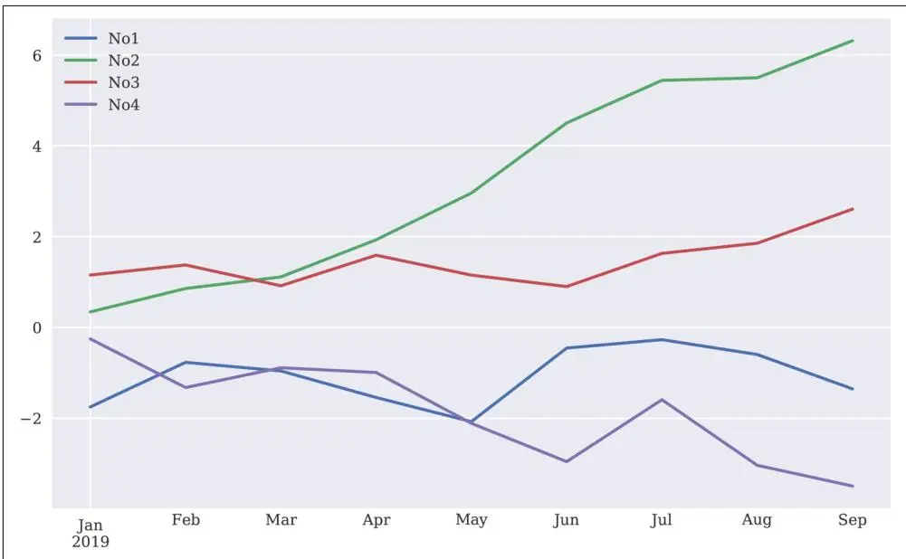
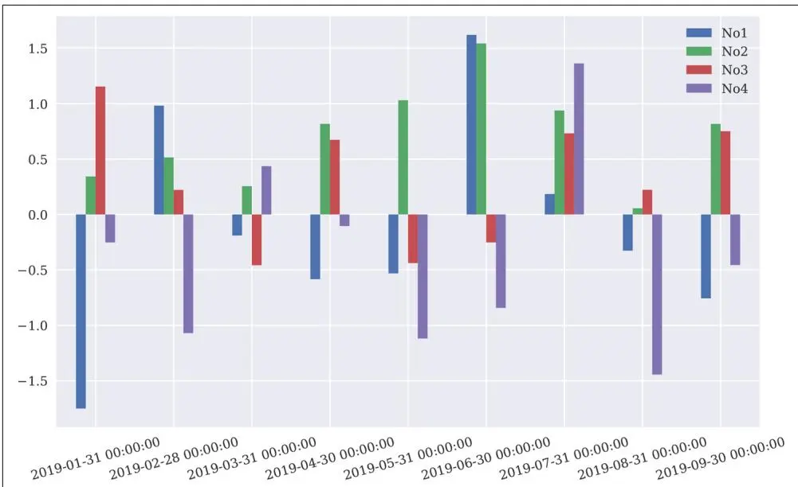
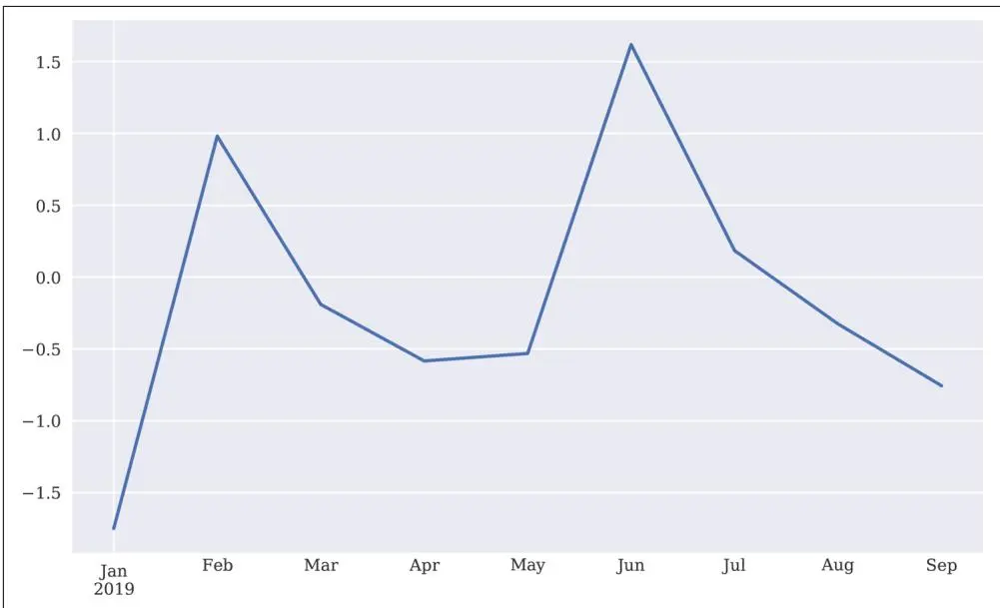

# pandas数据分析

数据！数据！数据！没有黏土，我无法造砖！

—Sherlock Holmes

本章介绍 pandas，一个专注于表格数据的数据分析库。pandas 是一个强大的工具，不仅提供了许多有用的类和函数，还出色地封装了其他包的功能。其结果是提供了一个用户界面，使数据分析，特别是金融分析，变得更加便捷高效。

本章涵盖以下基本数据结构：

<table><tr><td>对象类型</td><td>含义</td><td>用途</td></tr><tr><td>DataFrame</td><td>带索引的二维数据对象</td><td>按列组织的表格数据</td></tr><tr><td>Series</td><td>带索引的一维数据对象</td><td>单个（时间）数据序列</td></tr></table>

本章组织如下：

"DataFrame类" on page 114

本节首先通过简单的小数据集探索 pandas 的 DataFrame 类的基本特性和功能；然后展示如何将 NumPy 的 ndarray 对象转换为 DataFrame 对象。

"基本分析" on page 123 和 "基本可视化" on page 126

这些部分介绍了基本的分析和可视化功能（后续章节会更深入探讨这些主题）。

"Series类" on page 128

这一小节介绍 pandas 的 Series 类，它在某种意义上代表了 DataFrame 类的一种特殊情况，仅包含单列数据。

"GroupBy操作" on page 130

DataFrame 类的优势之一在于能够根据单个或多个列对数据进行分组。本节探讨 pandas 的分组功能。

"复杂选择" on page 132

本节说明如何使用（复杂）条件从 DataFrame 对象中轻松选择数据。

"连接、拼接与合并" on page 135

将不同数据集合并为一个是数据分析中的重要操作。pandas 提供了不同的选项来完成此任务，如本节所述。

"性能方面" on page 141

与 Python 的一般情况一样，pandas 通常提供多种选项来实现同一目标。本节简要看一下潜在的性能差异。

## DataFrame类

pandas（以及本章）的核心是 DataFrame，这是一个旨在高效处理表格形式数据的类——即以列式组织为特征的数据。为此，DataFrame 类提供例如列标签以及数据集的行的灵活索引功能，类似于关系数据库中的表或 Excel 电子表格。

本节涵盖 pandas DataFrame 类的一些基本方面。该类非常复杂和强大，这里只能介绍其一部分功能。后续章节将提供更多示例并从不同角度进行阐述。

## DataFrame类的初步使用

在基本层面上，DataFrame 类设计用于管理带索引和标签的数据，与 SQL 数据库表或电子表格应用程序中的工作表没有太大区别。考虑以下创建 DataFrame 对象的过程：

```python
In [1]: import pandas as pd ①
In [2]: df = pd.DataFrame([10, 20, 30, 40], columns=['numbers'], index=['a', 'b', 'c', 'd']) ④
In [3]: df ⑤
Out[3]: numbers
a 10
```

```asm
b 20
c 30
d 40
```

导入 pandas。

将数据定义为一个列表对象。

指定列标签。

指定索引值/标签。

显示 DataFrame 对象的数据以及列和索引标签。

这个简单的例子已经展示了 DataFrame 类在存储数据方面的一些主要特性：

• 数据本身可以以不同形状和类型提供（list、tuple、ndarray 和 dict 对象都是候选）。

• 数据按列组织，列可以有自定义名称（标签）。

• 有一个索引，可以采用不同的格式（例如数字、字符串、时间信息）。

使用 DataFrame 对象通常非常方便和高效，例如，与更专门化的 ndarray 对象相比，当想要（比如）扩展现有对象时，后者更受限制。同时，DataFrame 对象通常在计算效率上与 ndarray 对象相当。以下是 DataFrame 对象典型操作的简单示例：

```python
In [4]: df.index ①
Out[4]: Index(['a', 'b', 'c', 'd'], dtype='object')

In [5]: df.columns ②
Out[5]: Index(['numbers'], dtype='object')

In [6]: df.loc['c'] ③
Out[6]: numbers 30
Name: c, dtype: int64

In [7]: df.loc[['a', 'd']] ④
Out[7]: numbers
a 10
d 40

In [8]: df.iloc[1:3] ⑤
Out[8]: numbers
```

```txt
b 20
c 30

In [9]: df.sum( ) ⑥
Out[9]: numbers 100
dtype: int64

In [10]: df.apply(lambda x: x ** 2) ⑦
Out[10]: numbers
a 100
b 400
c 900
d 1600

In [11]: df ** 2 ⑧
Out[11]: numbers
a 100
b 400
c 900
d 1600
```

index 属性和 Index 对象。

columns 属性和 Index 对象。

选择索引 c 对应的值。

选择索引 a 和 d 对应的两个值。

通过索引位置选择第二行和第三行。

计算单列的和。

使用 apply() 方法以向量化方式计算平方。

像 ndarray 对象一样直接应用向量化。

与 NumPy 的 ndarray 对象不同，可以在两个维度上扩充 DataFrame 对象：

```python
In [12]: df['floats'] = (1.5, 2.5, 3.5, 4.5)
In [13]: df
Out[13]: numbers floats
a 101.5
b 202.5
c 303.5
d 404.5
In [14]: df['floats']
```

```yaml
Out[14]: a 1.5
b 2.5
c 3.5
d 4.5
Name: floats, dtype: float64
```

添加一个以元组对象提供浮点数的新列。

选择此列并显示其数据和索引标签。

整个 DataFrame 对象也可以用来定义新列。在这种情况下，索引会自动对齐：

```python
In [15]: df['names'] = pd.DataFrame(['Yves', 'Sandra', 'Lilli', 'Henry'], index=['d', 'a', 'b', 'c'])
```

```txt
In [16]: df
Out[16]: numbers floats names
a 101.5 Sandra
b 202.5 Lilli
c 303.5 Henry
d 404.5 Yves
```

## 基于 DataFrame 对象创建另一个新列。

追加数据的工作方式类似。然而，在以下示例中，可以看到一个通常应避免的副作用——即索引被替换为简单的范围索引：

```python
In [17]: df.append({'numbers': 100, 'floats': 5.75, 'names': 'Jil'}, ignore_index=True) ①
Out[17]: numbers floats names
0101.50 Sandra
1202.50 Lilli
2303.50 Henry
3404.50 Yves
41005.75 Jil
```

```txt
In [18]: df = df.append(pd.DataFrame({'numbers': 100, 'floats': 5.75, 'names': 'Jil'}, index=['y',]))
```

<table><tr><td colspan="4">In [19]: df</td></tr><tr><td>Out[19]:</td><td>numbers</td><td>floats</td><td>names</td></tr><tr><td>a</td><td>10</td><td>1.50</td><td>Sandra</td></tr><tr><td>b</td><td>20</td><td>2.50</td><td>Lilli</td></tr><tr><td>c</td><td>30</td><td>3.50</td><td>Henry</td></tr><tr><td>d</td><td>40</td><td>4.50</td><td>Yves</td></tr><tr><td>y</td><td>100</td><td>5.75</td><td>Jil</td></tr></table>

```python
In [20]: df = df.append(pd.DataFrame({'names': 'Liz'}, index=['z',]), sort=False) ③
```

```txt
In [21]: df
Out[21]: numbers floats names
a 10.01.50 Sandra
b 20.02.50 Lilli
c 30.03.50 Henry
d 40.04.50 Yves
y 100.05.75 Jil
z NaN NaN Liz
```

```txt
In [22]: df.dtypes ④
Out[22]: numbers float64
    floats float64
    names object
dtype: object
```

通过 dict 对象追加新行；这是一个临时操作，索引信息会丢失。

基于带有索引信息的 DataFrame 对象追加行；原始索引信息得以保留。

向 DataFrame 对象追加一个不完整的数据行，导致 NaN 值。

返回各列的不同 dtype；这与结构化 ndarray 对象的功能类似。

尽管现在存在缺失值，但大多数方法调用仍然有效：

```txt
In [23]: df[['numbers', 'floats']].mean()
Out[23]: numbers 40.00
    floats 3.55
    dtype: float64

In [24]: df[['numbers', 'floats']].std()
Out[24]: numbers 35.355339
    floats 1.662077
    dtype: float64
```

计算指定两列的均值（忽略包含 NaN 值的行）。

计算指定两列的标准差（忽略包含 NaN 值的行）。

```python
In [27]: a = np.random.standard_normal((9, 4))
```

## DataFrame类的进阶使用

本小节的示例基于包含标准正态分布随机数的 ndarray 对象。它进一步探索了诸如 DatetimeIndex 等功能，用于管理时间序列数据：

```txt
In [25]: import numpy as np
```

In [26]: np.random.seed(100)

```txt
In [28]: a
Out[28]: array([[-1.74976547, 0.3426804, 1.1530358, -0.25243604],
[0.98132079, 0.51421884, 0.22117967, -1.07004333],
[-0.18949583, 0.25500144, -0.45802699, 0.43516349],
[-0.58359505, 0.81684707, 0.67272081, -0.10441114],
[-0.53128038, 1.02973269, -0.43813562, -1.11831825],
[1.61898166, 1.54160517, -0.25187914, -0.84243574],
[0.18451869, 0.9370822, 0.73100034, 1.36155613],
[-0.32623806, 0.05567601, 0.22239961, -1.443217],
[-0.75635231, 0.81645401, 0.75044476, -0.45594693]])
```

虽然可以更直接地构造 DataFrame 对象（如前所述），但使用 ndarray 对象通常是一个不错的选择，因为 pandas 会保留基本结构，并"仅"添加元信息（例如索引值）。这也代表了金融应用和一般科学研究中的典型用例。例如：

```csv
In [29]: df = pd.DataFrame(a)
In [30]: df
Out[30]: 01230 -1.7497650.3426801.153036 -0.25243610.9813210.5142190.221180 -1.0700432 -0.1894960.255001 -0.4580270.4351633 -0.5835950.8168470.672721 -0.1044114 -0.5312801.029733 -0.438136 -1.11831851.6189821.541605 -0.251879 -0.84243660.1845190.9370820.7310001.3615567 -0.3262380.0556760.222400 -1.4432178 -0.7563520.8164540.750445 -0.455947
```

## 从 ndarray 对象创建 DataFrame 对象。

表5-1列出了 DataFrame() 函数接受的参数。表中，"array-like"指类似于 ndarray 对象的数据结构——例如列表。Index 是 pandas Index 类的实例。

表5-1. DataFrame() 函数的参数

<table><tr><td>参数</td><td>格式</td><td>描述</td></tr><tr><td>data</td><td>ndarray/dict/DataFrame</td><td>DataFrame 的数据；dict 可包含 Series、ndarray、list</td></tr><tr><td>index</td><td>Index/array-like</td><td>要使用的索引；默认为 range(n)</td></tr><tr><td>columns</td><td>Index/array-like</td><td>要使用的列标头；默认为 range(n)</td></tr><tr><td>dtype</td><td>dtype，默认为 None</td><td>使用/强制执行的数据类型；否则会被推断</td></tr><tr><td>copy</td><td>bool，默认为 None</td><td>从输入复制数据</td></tr></table>

与结构化数组类似，并且如前所述，DataFrame 对象具有可以直接通过分配一个元素数量正确的列表对象来定义的列名。这表明可以轻松定义/更改 DataFrame 对象的属性：

```csv
In [31]: df.columns = ['No1', 'No2', 'No3', 'No4']
In [32]: df
Out[32]: No1 No2 No3 No40 -1.7497650.3426801.153036 -0.25243610.9813210.5142190.221180 -1.0700432 -0.1894960.255001 -0.4580270.4351633 -0.5835950.8168470.672721 -0.1044114 -0.5312801.029733 -0.438136 -1.11831851.6189821.541605 -0.251879 -0.84243660.1845190.9370820.7310001.3615567 -0.3262380.0556760.222400 -1.4432178 -0.7563520.8164540.750445 -0.455947
```

```txt
In [33]: df['No2'].mean() ②
Out[33]: 0.7010330941456459
```

## 通过列表对象指定列标签。

## 现在选择一列变得很容易。

为了高效处理金融时间序列数据，必须能够很好地处理时间索引。这也可以被视为 pandas 的一个主要优势。例如，假设我们的九行四列数据对应月末数据，起始于2019年1月。使用 date_range() 函数生成一个 DatetimeIndex 对象如下：

```python
In [34]: dates = pd.date_range('2019-1-1', periods=9, freq='M')
In [35]: dates
Out[35]: DatetimeIndex(['2019-01-31', '2019-02-28', '2019-03-31', '2019-04-30', '2019-05-31', '2019-06-30', '2019-07-31', '2019-08-31', '2019-09-30'], dtype='datetime64[ns]', freq='M')
```

## 创建一个 DatetimeIndex 对象。

表5-2列出了 date_range() 函数接受的参数。

表5-2. date_range() 函数的参数

<table><tr><td>参数</td><td>格式</td><td>描述</td></tr><tr><td>start</td><td>string/datetime</td><td>生成日期的左边界</td></tr><tr><td>end</td><td>string/datetime</td><td>生成日期的右边界</td></tr><tr><td>periods</td><td>integer/None</td><td>期数（如果 start 或 end 为 None）</td></tr><tr><td>freq</td><td>string/DateOffset</td><td>频率字符串，例如 5D 表示5天</td></tr><tr><td>tz</td><td>string/None</td><td>本地化索引的时区名称</td></tr><tr><td>normalize</td><td>bool，默认为 None</td><td>将 start 和 end 归一化到午夜</td></tr><tr><td>name</td><td>string，默认为 None</td><td>结果索引的名称</td></tr></table>

以下代码将刚刚创建的 DatetimeIndex 对象定义为相关索引对象，从而使原始数据集成为一个时间序列：

```txt
In [36]: df.index = dates

In [37]: df
Out[37]:    No1    No2    No3    No42019-01-31 -1.7497650.3426801.153036 -0.2524362019-02-280.9813210.5142190.221180 -1.0700432019-03-31 -0.1894960.255001 -0.4580270.4351632019-04-30 -0.5835950.8168470.672721 -0.1044112019-05-31 -0.5312801.029733 -0.438136 -1.1183182019-06-301.6189821.541605 -0.251879 -0.8424362019-07-310.1845190.9370820.7310001.3615562019-08-31 -0.3262380.0556760.222400 -1.4432172019-09-30 -0.7563520.8164540.750445 -0.455947
```

在使用 date_range() 函数生成 DatetimeIndex 对象时，频率参数 freq 有多种选择。表5-3列出了所有选项。

表5-3. date_range() 函数的频率参数值

<table><tr><td>别名</td><td>描述</td></tr><tr><td>B</td><td>工作日频率</td></tr><tr><td>C</td><td>自定义工作日频率（实验性）</td></tr><tr><td>D</td><td>日历日频率</td></tr><tr><td>W</td><td>周频率</td></tr><tr><td>M</td><td>月末频率</td></tr><tr><td>BM</td><td>工作日月末频率</td></tr><tr><td>MS</td><td>月初频率</td></tr><tr><td>BMS</td><td>工作日月初频率</td></tr><tr><td>Q</td><td>季末频率</td></tr><tr><td>BQ</td><td>工作日季末频率</td></tr><tr><td>QS</td><td>季初频率</td></tr><tr><td>BQS</td><td>工作日季初频率</td></tr><tr><td>A</td><td>年末频率</td></tr><tr><td>BA</td><td>工作日年末频率</td></tr><tr><td>AS</td><td>年初频率</td></tr><tr><td>BAS</td><td>工作日年初频率</td></tr><tr><td>H</td><td>小时频率</td></tr><tr><td>T</td><td>分钟频率</td></tr><tr><td>S</td><td>秒频率</td></tr><tr><td>L</td><td>毫秒</td></tr><tr><td>U</td><td>微秒</td></tr></table>

在某些情况下，以 ndarray 对象的形式访问原始数据集是有益的。values 属性提供了直接访问：

```txt
In [38]: df.values
Out[38]: array([[-1.74976547, 0.3426804, 1.1530358, -0.25243604],
    [0.98132079, 0.51421884, 0.22117967, -1.07004333],
    [-0.18949583, 0.25500144, -0.45802699, 0.43516349],
    [-0.58359505, 0.81684707, 0.67272081, -0.10441114],
    [-0.53128038, 1.02973269, -0.43813562, -1.11831825],
    [1.61898166, 1.54160517, -0.25187914, -0.84243574],
    [0.18451869, 0.9370822, 0.73100034, 1.36155613],
    [-0.32623806, 0.05567601, 0.22239961, -1.443217],
    [-0.75635231, 0.81645401, 0.75044476, -0.45594693]])
```

```python
In [39]: np.array(df)
Out[39]: array([[-1.74976547, 0.3426804, 1.1530358, -0.25243604],
    [0.98132079, 0.51421884, 0.22117967, -1.07004333],
    [-0.18949583, 0.25500144, -0.45802699, 0.43516349],
    [-0.58359505, 0.81684707, 0.67272081, -0.10441114],
    [-0.53128038, 1.02973269, -0.43813562, -1.11831825],
    [1.61898166, 1.54160517, -0.25187914, -0.84243574],
    [0.18451869, 0.9370822, 0.73100034, 1.36155613],
    [-0.32623806, 0.05567601, 0.22239961, -1.443217],
    [-0.75635231, 0.81645401, 0.75044476, -0.45594693]])
```

可以从 ndarray 对象生成 DataFrame 对象，但也可以使用 DataFrame 类的 values 属性或 NumPy 的 np.array() 函数从 DataFrame 轻松生成 ndarray 对象。

## 基本分析

与 NumPy 的 ndarray 类一样，pandas 的 DataFrame 类内置了大量便捷方法。首先，考虑 info() 和 describe() 方法：

```python
In [40]: df.info() ①
    <class 'pandas.core.frame.DataFrame'>
    DatetimeIndex: 9 entries, 2019-01-31 to 2019-09-30
    Freq: M
    Data columns (total 4 columns):
    No19 non-null float64
    No29 non-null float64
    No39 non-null float64
    No49 non-null float64
    dtypes: float64(4)
    memory usage: 360.0 bytes
```

```txt
In [41]: df.describe() ②
Out[41]:    No1    No2    No3    No4
count    9.0000009.0000009.0000009.000000
mean    -0.1502120.7010330.289193    -0.387788
std    0.9883060.4576850.5799200.877532
min    -1.7497650.055676    -0.458027    -1.44321725%    -0.5835950.342680    -0.251879    -1.07004350%    -0.3262380.8164540.222400    -0.45594775%    0.1845190.9370820.731000    -0.104411
max    1.6189821.5416051.1530361.361556
```

提供关于数据、列和索引的元信息。

## 提供每列（数值数据）的有用摘要统计信息。

此外，可以轻松获取按列或按行的和、均值和累计和：

```txt
In [43]: df.sum( ) ①
Out[43]: No1 -1.351906
No26.309298
No32.602739
No4 -3.490089
dtype: float64
In [44]: df.mean( ) ②
```

```yaml
Out[44]: No1 -0.150212
No20.701033
No30.289193
No4 -0.387788
dtype: float64
```

```txt
In [45]: df.mean(axis=0)
Out[45]: No1 -0.150212
No20.701033
No30.289193
No4 -0.387788
dtype: float64
```

```csv
In [46]: df.mean(axis=1) ③
Out[46]: 2019-01-31 -0.1266212019-02-280.1616692019-03-310.0106612019-04-300.2003902019-05-31 -0.2645002019-06-300.5165682019-07-310.8035392019-08-31 -0.3728452019-09-300.088650
Freq: M, dtype: float64
```

```csv
In [47]: df.cumsum( ) ④
Out[47]: No1 No2 No3 No42019-01-31 -1.7497650.3426801.153036 -0.2524362019-02-28 -0.7684450.8568991.374215 -1.3224792019-03-31 -0.9579411.1119010.916188 -0.8873162019-04-30 -1.5415361.9287481.588909 -0.9917272019-05-31 -2.0728162.9584801.150774 -2.1100452019-06-30 -0.4538344.5000860.898895 -2.9524812019-07-31 -0.2693165.4371681.629895 -1.5909252019-08-31 -0.5955545.4928441.852294 -3.0341422019-09-30 -1.3519066.3092982.602739 -3.490089
```

按列求和。

按列求均值。

按行求均值。

按列累计求和（从第一个索引位置开始）。

DataFrame 对象也能理解 NumPy 的通用函数，正如预期的那样：

```csv
In [48]: np.mean(df) 1
Out[48]: No1 -0.150212
No20.701033
No30.289193
No4 -0.387788
```

```yaml
dtype: float64
```

```csv
In [49]: np.log(df) ②
Out[49]:
2019-01-31 NaN -1.0709570.142398 NaN
2019-02-28 -0.018856 -0.665106 -1.508780 NaN
2019-03-31 NaN -1.366486 NaN -0.8320332019-04-30 NaN -0.202303 -0.396425 NaN
2019-05-31 NaN 0.029299 NaN NaN
2019-06-300.4817970.432824 NaN NaN
2019-07-31 -1.690005 -0.064984 -0.3133410.3086282019-08-31 NaN -2.888206 -1.503279 NaN
2019-09-30 NaN -0.202785 -0.287089 NaN
```

```csv
In [50]: np.sqrt(abs(df)) ③
Out[50]:
2019-01-311.3227870.5853891.0737950.5024302019-02-280.9906160.7170910.4702971.0344292019-03-310.4353110.5049770.6767770.6596692019-04-300.7639340.9037960.8201960.3231272019-05-310.7288901.0147570.6619181.0575062019-06-301.2723921.2416140.5018760.9178432019-07-310.4295560.9680300.8549861.1668572019-08-310.5711730.2359580.4715931.2013402019-09-300.8696850.9035780.8662820.675238
```

```txt
In [51]: np.sqrt(abs(df)).sum()
Out[51]: No17.384345
No27.075190
No36.397719
No47.538440
dtype: float64
```

```csv
In [52]: 100 * df + 100 ⑤
Out[52]:
No1 No2 No3 No42019-01-31 -74.976547134.268040215.30358074.7563962019-02-28198.132079151.421884122.117967 -7.0043332019-03-3181.050417125.50014454.197301143.5163492019-04-3041.640495181.684707167.27208189.5588862019-05-3146.871962202.97326956.186438 -11.8318252019-06-30261.898166254.16051774.81208615.7564262019-07-31118.451869193.708220173.100034236.1556132019-08-3167.376194105.567601122.239961 -44.3217002019-09-3024.364769181.645401175.04447654.405307
```

按列求均值。

逐元素自然对数；会引发警告但计算会运行，导致多个 NaN 值。

对绝对值逐元素求平方根……

……并对结果按列求均值。

数值数据的线性变换。


## NumPy通用函数

一般来说，只要 NumPy 通用函数可以应用于包含相同类型数据的 ndarray 对象，就可以将其应用于 pandas DataFrame 对象。

pandas 具有相当高的容错性，即它会捕获错误，并在相应数学运算失败的位置放入 NaN 值。不仅如此，如前所述，在许多情况下，可以像处理完整数据集一样处理不完整的数据集。这很方便，因为现实中的数据往往比我们希望的更常是不完整的。

## 基本可视化

数据一旦存储在 DataFrame 对象中，绘图通常只需一行代码（见图5-1）：

```python
In [53]: from pylab import plt, mpl
plt.style.use('seaborn')
mpl.rcParams['font.family'] = 'serif'
%matplotlib inline
```

In [54]: df.cumsum().plot(lw=2.0, figsize=(10, 6));

自定义绘图样式。

绘制四列累计和的折线图。

基本上，pandas 提供了一个专门为 DataFrame 对象设计的围绕 matplotlib（参见第7章）的封装。表5-4列出了 plot() 方法接受的参数。


图5-1 DataFrame对象的折线图

表5-4. plot() 方法的参数

<table><tr><td>参数</td><td>格式</td><td>描述</td></tr><tr><td>x</td><td>标签/位置，默认为 None</td><td>仅当列值用作 x 刻度时使用</td></tr><tr><td>y</td><td>标签/位置，默认为 None</td><td>仅当列值用作 y 刻度时使用</td></tr><tr><td>subplots</td><td>boolean，默认为 False</td><td>在子图中绘制各列</td></tr><tr><td>sharex</td><td>boolean，默认为 True</td><td>共享 x 轴</td></tr><tr><td>sharey</td><td>boolean，默认为 False</td><td>共享 y 轴</td></tr><tr><td>use_index</td><td>boolean，默认为 True</td><td>使用 DataFrame.index 作为 x 刻度</td></tr><tr><td>stacked</td><td>boolean，默认为 False</td><td>堆叠（仅适用于柱状图）</td></tr><tr><td>sort_columns</td><td>boolean，默认为 False</td><td>绘制前按字母顺序排序列</td></tr><tr><td>title</td><td>string，默认为 None</td><td>图标题</td></tr><tr><td>grid</td><td>boolean，默认为 False</td><td>显示水平和垂直网格线</td></tr><tr><td>legend</td><td>boolean，默认为 True</td><td>显示标签图例</td></tr><tr><td>ax</td><td>matplotlib 轴对象</td><td>用于绘图的 matplotlib 轴对象</td></tr><tr><td>style</td><td>string 或 list/dictionary</td><td>线条绘图样式（每列）</td></tr><tr><td>kind</td><td>string（例如"line"、"bar"、"barh"、"kde"、"density"）</td><td>绘图类型</td></tr><tr><td>logx</td><td>boolean，默认为 False</td><td>使用 x 轴的对数刻度</td></tr><tr><td>logy</td><td>boolean，默认为 False</td><td>使用 y 轴的对数刻度</td></tr><tr><td>xticks</td><td>sequence，默认为 Index</td><td>图的 x 刻度</td></tr><tr><td>yticks</td><td>sequence，默认为 Values</td><td>图的 y 刻度</td></tr><tr><td>xlim</td><td>2-tuple, list</td><td>x 轴边界</td></tr><tr><td>ylim</td><td>2-tuple, list</td><td>y 轴边界</td></tr><tr><td>rot</td><td>integer，默认为 None</td><td>x 刻度旋转</td></tr><tr><td>secondary_y</td><td>boolean/sequence，默认为 False</td><td>在辅助 y 轴上绘制</td></tr><tr><td>mark_right</td><td>boolean，默认为 True</td><td>辅助轴自动标记</td></tr><tr><td>colormap</td><td>string/colormap 对象，默认为 None</td><td>绘图使用的颜色映射</td></tr><tr><td>kwds</td><td>关键词</td><td>传递给 matplotlib 的选项</td></tr></table>

作为另一个示例，考虑相同数据的柱状图（见图5-2）：

```python
In [55]: df.plot.bar(figsize=(10, 6), rot=15); ①
df.plot(kind='bar', figsize=(10, 6))
```


通过 .plot.bar() 绘制柱状图。

备选语法：使用 kind 参数更改绘图类型。


图5-2 DataFrame对象的柱状图

## Series类

到目前为止，本章主要使用 pandas 的 DataFrame 类。Series 是 pandas 的另一个重要类。它的特点是只有单列数据。在这个意义上，它是 DataFrame 类的一个特化，共享其许多但非全部的特性和能力。当从多列 DataFrame 对象中选择单个列时，会获得一个 Series 对象：

```python
In [56]: type(df)
Out[56]: pandas.core.frame.DataFrame

In [57]: S = pd.Series(np.linspace(0, 15, 7), name='series')

In [58]: S
Out[58]: 00.012.525.037.5410.0512.5615.0
Name: series, dtype: float64

In [59]: type(S)
Out[59]: pandas.core.series.Series

In [60]: s = df['No1']

In [61]: s
Out[61]: 2019-01-31 -1.7497652019-02-280.9813212019-03-31 -0.1894962019-04-30 -0.5835952019-05-31 -0.5312802019-06-301.6189822019-07-310.1845192019-08-31 -0.3262382019-09-30 -0.756352
Freq: M, Name: No1, dtype: float64

In [62]: type(s)
Out[62]: pandas.core.series.Series
```

主要的 DataFrame 方法同样适用于 Series 对象。为作说明，考虑 mean() 和 plot() 方法（见图5-3）：

```javascript
In [63]: s.mean()
Out[63]: -0.15021177307319458
In [64]: s.plot(lw=2.0, figsize=(10, 6));
```


图5-3 Series对象的折线图

## GroupBy操作

pandas 具有强大而灵活的分组功能。它们的工作方式类似于 SQL 中的分组以及 Microsoft Excel 中的数据透视表。为了有东西可分组，可以添加一个指示索引中相应数据所属季度的列：

<table><tr><td colspan="7">In [65]: df[&#x27;Quarter&#x27;] = [&#x27;Q1&#x27;, &#x27;Q1&#x27;, &#x27;Q1&#x27;, &#x27;Q2&#x27;, &#x27;Q2&#x27;, &#x27;Q2&#x27;, &#x27;Q3&#x27;, &#x27;Q3&#x27;],df</td></tr><tr><td>Out[65]:</td><td></td><td>No1</td><td>No2</td><td>No3</td><td>No4</td><td>Quarter</td></tr><tr><td></td><td>2019-01-31</td><td>-1.749765</td><td>0.342680</td><td>1.153036</td><td>-0.252436</td><td>Q1</td></tr><tr><td></td><td>2019-02-28</td><td>0.981321</td><td>0.514219</td><td>0.221180</td><td>-1.070043</td><td>Q1</td></tr><tr><td></td><td>2019-03-31</td><td>-0.189496</td><td>0.255001</td><td>-0.458027</td><td>0.435163</td><td>Q1</td></tr><tr><td></td><td>2019-04-30</td><td>-0.583595</td><td>0.816847</td><td>0.672721</td><td>-0.104411</td><td>Q2</td></tr><tr><td></td><td>2019-05-31</td><td>-0.531280</td><td>1.029733</td><td>-0.438136</td><td>-1.118318</td><td>Q2</td></tr><tr><td></td><td>2019-06-30</td><td>1.618982</td><td>1.541605</td><td>-0.251879</td><td>-0.842436</td><td>Q2</td></tr><tr><td></td><td>2019-07-31</td><td>0.184519</td><td>0.937082</td><td>0.731000</td><td>1.361556</td><td>Q3</td></tr><tr><td></td><td>2019-08-31</td><td>-0.326238</td><td>0.055676</td><td>0.222400</td><td>-1.443217</td><td>Q3</td></tr><tr><td></td><td>2019-09-30</td><td>-0.756352</td><td>0.816454</td><td>0.750445</td><td>-0.455947</td><td>Q3</td></tr></table>

以下代码按 Quarter 列分组，并输出各组的统计信息：

```python
In [66]: groups = df.groupby('Quarter')
In [67]: groups.size()
```

```txt
Out[67]: Quarter
Q13
Q23
Q33
dtype: int64
```

```csv
In [68]: groups.mean( ) ③
Out[68]: No1 No2 No3 No4
Quarter
Q1 -0.3193140.3706340.305396 -0.295772
Q20.1680351.129395 -0.005765 -0.688388
Q3 -0.2993570.6030710.567948 -0.179203
```

```csv
In [69]: groups.max() ④
Out[69]: Quarter No1 No2 No3 No4
Q10.9813210.5142191.1530360.435163
Q21.6189821.5416050.672721 -0.104411
Q30.1845190.9370820.7504451.361556
```

```txt
In [70]: groups.aggregate([min, max]).round(2) ⑤
Out[70]:
    No1    No2    No3    No4
    min    max    min    max    min    max    min    max
Quarter
Q1 -1.750.980.260.51 -0.461.15 -1.070.44
Q2 -0.581.620.821.54 -0.440.67 -1.12 -0.10
Q3 -0.760.180.060.940.220.75 -1.441.36
```

根据 Quarter 列分组。

给出每组中的行数。

给出每列的均值。

给出每列的最大值。

给出每列的最小值和最大值。

也可以使用多列进行分组。为此，引入另一列，指示索引日期的月份是奇数还是偶数：

```txt
In [71]: df['Odd_Even'] = ['Odd', 'Even', 'Odd', 'Even', 'Odd', 'Even', 'Odd']
    In [72]: groups = df.groupby(['Quarter', 'Odd_Even'])

In [73]: groups.size()
Out[73]: Quarter Odd_Even
Q1 Even 1
Odd 2
Q2 Even 2
```

```csv
Odd 1
Q3 Even 1
Odd 2
dtype: int64

In [74]: groups[['No1', 'No4']].aggregate([sum, np.mean])
Out[74]:
No1 No4
sum mean sum mean
Quarter Odd_Even
Q1 Even 0.9813210.981321 -1.070043 -1.070043
Odd -1.939261 -0.9696310.1827270.091364
Q2 Even 1.0353870.517693 -0.946847 -0.473423
Odd -0.531280 -0.531280 -1.118318 -1.118318
Q3 Even -0.326238 -0.326238 -1.443217 -1.443217
Odd -0.571834 -0.2859170.9056090.452805
```

## 复杂选择

通常，数据选择是通过对列值制定条件，并可能逻辑组合多个条件来完成的。考虑以下数据集：

```python
In [75]: data = np.random.standard_normal((10, 2)) ①
In [76]: df = pd.DataFrame(data, columns=['x', 'y']) ②
In [77]: df.info() ②
    <class 'pandas.core.frame.DataFrame'>
    RangeIndex: 10 entries, 0 to 9
    Data columns (total 2 columns):
    x 10 non-null float64
    y 10 non-null float64
    dtypes: float64(2)
    memory usage: 240.0 bytes
In [78]: df.head() ③
Out[78]: x y
    01.189622 -1.6906171 -1.356399 -1.2324352 -0.544439 -0.66817230.007315 -0.61293941.299748 -1.733096
In [79]: df.tail() ④
Out[79]: x y
    5 -0.9833100.3575086 -1.6135791.4707147 -1.188018 -0.5497468 -0.940046 -0.82793290.1088630.507810
```

包含标准正态分布随机数的 ndarray 对象。

包含相同随机数的 DataFrame 对象。

通过 head() 方法显示前五行。

通过 tail() 方法显示最后五行。

以下代码说明了Python的比较运算符和逻辑运算符在两列值上的应用：

```txt
In [80]: df['x'] > 0.5
Out[80]: 0 True
1 False
2 False
3 False
4 True
5 False
6 False
7 False
8 False
9 False
Name: x, dtype: bool
```

```txt
In [81]: (df['x'] > 0) & (df['y'] < 0)
Out[81]: 0 True
    1 False
    2 False
    3 True
    4 True
    5 False
    6 False
    7 False
    8 False
    9 False
dtype: bool
```

```asm
In [82]: (df['x'] > 0) | (df['y'] < 0)
Out[82]: 0 True
1 True
2 True
3 True
4 True
5 False
6 False
7 True
8 True
9 True
dtype: bool
```

检查 x 列的值是否大于 0.5。

检查 x 列的值是否为正且 y 列的值是否为负。

检查 x 列的值是否为正或 y 列的值是否为负。

使用生成的布尔 Series 对象，复杂的（行）选择变得简单。或者，可以使用 query() 方法并将条件作为 str 对象传递：

```txt
In [83]: df[df['x'] > 0] ①
Out[83]: x y
01.189622 -1.69061730.007315 -0.61293941.299748 -1.73309690.1088630.507810

In [84]: df.query('x > 0') ①
Out[84]: x y
01.189622 -1.69061730.007315 -0.61293941.299748 -1.73309690.1088630.507810

In [85]: df[(df['x'] > 0) & (df['y'] < 0)] ②
Out[85]: x y
01.189622 -1.69061730.007315 -0.61293941.299748 -1.733096

In [86]: df.query('x > 0 & y < 0') ②
Out[86]: x y
01.189622 -1.69061730.007315 -0.61293941.299748 -1.733096

In [87]: df[(df.x > 0) | (df.y < 0)] ③
Out[87]: x y
01.189622 -1.6906171 -1.356399 -1.2324352 -0.544439 -0.66817230.007315 -0.61293941.299748 -1.7330967 -1.188018 -0.5497468 -0.940046 -0.82793290.1088630.507810
```

所有 x 列值大于 0 的行。

所有 x 列值为正且 y 列值为负的行。

所有 x 列值为正或 y 列值为负的行（这里通过相应属性访问列）。

比较运算符也可以一次性应用于整个 DataFrame 对象：

```csv
In [88]: df > 0
Out[88]: x y
0 True False
1 False False
2 False False
3 True False
4 True False
5 False True
6 False True
7 False False
8 False False
9 True True
```

```csv
In [89]: df[df > 0] ②
Out[89]: x y
01.189622 NaN
1 NaN NaN
2 NaN NaN
30.007315 NaN
41.299748 NaN
5 NaN 0.3575086 NaN 1.4707147 NaN NaN
8 NaN NaN
90.1088630.507810
```

DataFrame 对象中哪些值是正数？

选择所有这样的值，并在其他所有位置放置 NaN。

## 连接、拼接与合并

本节介绍组合两个简单 DataFrame 对象数据集的不同方法。两个简单的数据集是：

```python
In [90]: df1 = pd.DataFrame(['100', '200', '300', '400'], index=['a', 'b', 'c', 'd'], columns=['A',])

In [91]: df1
Out[91]: A
    a 100
```

```python
b 200
c 300
d 400

In [92]: df2 = pd.DataFrame(['200', '150', '50'], index=['f', 'b', 'd'], columns=['B',])

In [93]: df2
Out[93]: B
    f 200
    b 150
    d 50
```

## 连接

连接或追加（Appending）基本上意味着行从一个 DataFrame 对象添加到另一个。这可以通过 append() 方法或 pd.concat() 函数完成。一个主要的考虑因素是如何处理索引值：

```python
In [94]: df1.append(df2, sort=False)
Out[94]:
    A B
    a 100 NaN
    b 200 NaN
    c 300 NaN
    d 400 NaN
    f NaN 200
    b NaN 150
    d NaN 50

In [95]: df1.append(df2, ignore_index=True, sort=False)
Out[95]:
    A B
    0100 NaN
    1200 NaN
    2300 NaN
    3400 NaN
    4 NaN 2005 NaN 1506 NaN 50

In [96]: pd.concat((df1, df2), sort=False)
Out[96]:
    A B
    a 100 NaN
    b 200 NaN
    c 300 NaN
    d 400 NaN
    f NaN 200
    b NaN 150
    d NaN 50

In [97]: pd.concat((df1, df2), ignore_index=True, sort=False)
Out[97]:
    A B
```

```markdown
0100 NaN
1200 NaN
2300 NaN
3400 NaN
4 NaN 2005 NaN 1506 NaN 50
```

将 df2 中的数据作为新行追加到 df1。

同样操作但忽略索引。

与第一个追加操作效果相同。

与第二个追加操作效果相同。

## 拼接

拼接（Joining）两个数据集时，DataFrame 对象的顺序也很重要，但方式不同。仅使用第一个 DataFrame 对象的索引值。这个默认行为称为左连接（Left Join）：

```txt
In [98]: df1.join(df2)
Out[98]: A B
a 100 NaN
b 200150
c 300 NaN
d 40050
```

```txt
In [99]: df2.join(df1)
Out[99]: B A
f 200 NaN
b 150200
d 50400
```

df1 的索引值起作用。

df2 的索引值起作用。

总共有四种不同的连接方法可用，每种方法在如何处理索引值和相应数据行方面表现不同：

```txt
In [100]: df1.join(df2, how='left')
Out[100]: A B
a 100 NaN
b 200150
c 300 NaN
d 40050
```

```txt
In [101]: df1.join(df2, how='right')
Out[101]: A B
f NaN 200
b 200150
d 40050

In [102]: df1.join(df2, how='inner')
Out[102]: A B
b 200150
d 40050

In [103]: df1.join(df2, how='outer')
Out[103]: A B
a 100 NaN
b 200150
c 300 NaN
d 40050
f NaN 200
```

左连接是默认操作。

右连接等同于反转 DataFrame 对象的顺序。

内连接仅保留两个索引中都存在的索引值。

外连接保留两个索引中的所有索引值。

连接也可以基于空的 DataFrame 对象进行。在这种情况下，列是按顺序创建的，导致的行为类似于左连接：

```txt
In [104]: df = pd.DataFrame()
In [105]: df['A'] = df1['A']
In [106]: df
Out[106]: A
a 100
b 200
c 300
d 400
In [107]: df['B'] = df2 ②
In [108]: df
Out[108]: A B
a 100 NaN
b 200150
c 300 NaN
d 40050
```

```txt
1 df1 作为第一列 A。
```

## df2 作为第二列 B。

使用字典来组合数据集会产生类似于外连接的结果，因为列是同时创建的：

```txt
In [109]: df = pd.DataFrame({'A': df1['A'], 'B': df2['B']} ①
In [110]: df
Out[110]: A B
a 100 NaN
b 200150
c 300 NaN
d 40050
f NaN 200
```

DataFrame 对象的列被用作 dict 对象中的值。

## 合并

连接操作基于待连接的 DataFrame 对象的索引进行，而合并（Merging）操作通常基于两个数据集之间共享的列进行。为此，向两个原始 DataFrame 对象添加一个新列 C：

```txt
In [111]: c = pd.Series([250, 150, 50], index=['b', 'd', 'c'])
df1['C'] = c
df2['C'] = c

In [112]: df1
Out[112]: A C
a 100 NaN
b 200250.0
c 30050.0
d 400150.0

In [113]: df2
Out[113]: B C
f 200 NaN
b 150250.0
d 50150.0
```

默认情况下，此处的合并操作基于共享列 C 进行。但还有其他选项，例如外合并：

```python
In [114]: pd.merge(df1, df2) ①
Out[114]: A C B
0100 NaN 2001200250.01502400150.050
In [115]: pd.merge(df1, df2, on='C') ①
Out[115]: A C B
```

```txt
0100 NaN 2001200250.01502400150.050
In [116]: pd.merge(df1, df2, how='outer')
Out[116]: A C B
0100 NaN 2001200250.0150230050.0 NaN
3400150.050
```

在列 C 上的默认合并。

外合并也是可能的，保留所有数据行。

还有更多类型的合并操作可用，以下代码展示了其中几种：

```python
In [117]: pd.merge(df1, df2, left_on='A', right_on='B')
Out[117]: A C_x B C_y
0200250.0200 NaN

In [118]: pd.merge(df1, df2, left_on='A', right_on='B', how='outer')
Out[118]: A C_x B C_y
0100 NaN NaN NaN
1200250.0200 NaN
230050.0 NaN NaN
3400150.0 NaN NaN
4 NaN NaN 150250.05 NaN NaN 50150.0

In [119]: pd.merge(df1, df2, left_index=True, right_index=True)
Out[119]: A C_x B C_y
b 200250.0150250.0
d 400150.050150.0

In [120]: pd.merge(df1, df2, on='C', left_index=True)
Out[120]: A C B
f 100 NaN 200
b 200250.0150
d 400150.050

In [121]: pd.merge(df1, df2, on='C', right_index=True)
Out[121]: A C B
a 100 NaN 200
b 200250.0150
d 400150.050

In [122]: pd.merge(df1, df2, on='C', left_index=True, right_index=True)
Out[122]: A C B
b 200250.0150
d 400150.050
```

## 性能方面

本章的许多示例表明，使用 pandas 通常有多种选项可以实现同一目标。本节比较这些选项在逐元素相加两列时的表现。首先，使用 NumPy 生成数据集：

```python
In [123]: data = np.random.standard_normal((1000000, 2))
In [124]: data.nbytes
Out[124]: 16000000

In [125]: df = pd.DataFrame(data, columns=['x', 'y'])
In [126]: df.info()
    <class 'pandas.core.frame.DataFrame'>
    RangeIndex: 1000000 entries, 0 to 999999
    Data columns (total 2 columns):
    x 1000000 non-null float64
    y 1000000 non-null float64
    dtypes: float64(2)
    memory usage: 15.3 MB
```

包含随机数的 ndarray 对象。

包含随机数的 DataFrame 对象。

其次，是完成任务的一些选项及其性能值：

```txt
In [127]: %time res = df['x'] + df['y']
CPU times: user 7.35 ms, sys: 7.43 ms, total: 14.8 ms
Wall time: 7.48 ms

In [128]: res[:3]
Out[128]: 00.3872421 -0.9693432 -0.863159
dtype: float64

In [129]: %time res = df.sum(axis=1)
CPU times: user 130 ms, sys: 30.6 ms, total: 161 ms
Wall time: 101 ms

In [130]: res[:3]
Out[130]: 00.3872421 -0.9693432 -0.863159
dtype: float64

In [131]: %time res = df.values.sum(axis=1)
CPU times: user 50.3 ms, sys: 2.75 ms, total: 53.1 ms
Wall time: 27.9 ms
```

```txt
In [132]: res[:3]
Out[132]: array([ 0.3872424 , -0.96934273, -0.86315944])

In [133]: %time res = np.sum(df, axis=1) ④
CPU times: user 127 ms, sys: 15.1 ms, total: 142 ms
Wall time: 73.7 ms

In [134]: res[:3]
Out[134]: 00.3872421 -0.9693432 -0.863159
dtype: float64

In [135]: %time res = np.sum(df.values, axis=1) ⑤
CPU times: user 49.3 ms, sys: 2.36 ms, total: 51.7 ms
Wall time: 26.9 ms

In [136]: res[:3]
Out[136]: array([ 0.3872424 , -0.96934273, -0.86315944])
```

直接使用列（Series 对象）是最快的方法。

通过调用 DataFrame 对象的 sum() 方法计算总和。

通过调用 ndarray 对象的 sum() 方法计算总和。

通过使用 np.sum() 函数计算 DataFrame 对象的总和。

通过使用 np.sum() 函数计算 ndarray 对象的总和。

最后，还有两个基于 eval() 和 apply() 方法的选项：<sup>1</sup>

```python
In [137]: %time res = df.eval('x + y') ①
CPU times: user 25.5 ms, sys: 17.7 ms, total: 43.2 ms
Wall time: 22.5 ms

In [138]: res[:3]
Out[138]: 00.3872421    -0.9693432    -0.863159
dtype: float64

In [139]: %time res = df.apply(lambda row: row['x'] + row['y'], axis=1) ②
CPU times: user 19.6 s, sys: 83.3 ms, total: 19.7 s
```

```txt
Wall time: 19.9 s
In [140]: res[:3]
Out[140]: 00.3872421 -0.9693432 -0.863159
dtype: float64
```

eval() 是一个专门用于求值（复杂）数值表达式的方法；可以直接引用列。

最慢的选项是逐行使用 apply() 方法；这就像在 Python 层面上遍历所有行。


## 明智选择

pandas 通常提供多个选项来实现同一目标。如果不确定使用哪个，请在时间紧迫时比较各选项以验证是否达到了最佳性能。在这个简单示例中，执行时间相差了几个数量级。

## 结语

pandas 是一个强大的数据分析工具，已成为所谓的 PyData 栈中的核心包。其 DataFrame 类特别适合处理任何类型的表格数据。这些对象上的大多数操作都是向量化的，不仅像 NumPy 一样带来简洁的代码，而且通常具有高性能。此外，pandas 使得处理不完整数据集变得方便（例如 NumPy 则不是这样）。pandas 和 DataFrame 类将在本书的许多后续章节中发挥核心作用，届时将在必要时使用和介绍更多功能。

## 延伸阅读

pandas 是一个开源项目，提供在线文档和 PDF 版本供下载。<sup>2</sup> 网站提供了两者的链接以及更多资源：

• <http://pandas.pydata.org/>

与 NumPy 类似，推荐的 pandas 书籍参考资料包括：

• McKinney, Wes (2017). Python for Data Analysis. Sebastopol, CA: O'Reilly.

• VanderPlas, Jake (2016). Python Data Science Handbook. Sebastopol, CA: O'Reilly.
