# 金融时间序列


时间让一切不会同时发生。
—Ray Cummings


金融时间序列数据（financial time series data）是金融领域中最重要的数据类型之一。这是按日期和/或时间索引的数据。例如，股票价格随时间的变化就代表了金融时间序列数据。类似地，欧元/美元汇率随时间变化也代表金融时间序列；汇率以短时间间隔报价，这些报价的集合就构成了汇率的时间序列。

没有一个金融学科不考虑时间这个重要因素。这基本上与物理学和其他科学相同。处理时间序列数据的主要 Python 工具是 pandas。Wes McKinney——pandas 的原作者和主要作者——在 AQR Capital Management（一家大型对冲基金）担任分析师时开始开发这个库。可以肯定地说，pandas 从头开始就被设计为处理金融时间序列数据。

本章主要基于两个金融时间序列数据集，格式为逗号分隔值（comma-separated values, CSV）文件。内容结构如下：

**金融数据**

本节介绍使用 pandas 处理金融时间序列数据的基础知识：数据导入、导出汇总统计、计算随时间的变化以及重采样。

**滚动统计**

在金融分析中，滚动统计（rolling statistics）扮演着重要角色。这些统计量通常在一个固定的时间区间上计算，并在整个数据集中向前滚动。一个流行的例子是简单移动平均线（simple moving averages）。本节说明 pandas 如何支持此类统计量的计算。

**相关性分析**

本节基于标准普尔500指数（S&P 500）和 VIX 波动率指数（VIX volatility index）的金融时间序列数据提供一个案例研究。它为两个指数呈负相关这一程式化（实证）事实提供了一些支持。

**高频数据**

本节处理高频数据（high-frequency data），或称逐笔数据（tick data），这在金融领域已变得非常普遍。pandas 再次证明了其在处理此类数据集方面的强大能力。

## 金融数据

本节使用一个本地存储的 CSV 格式金融数据集。从技术上讲，此类文件是简单的文本文件，具有以逗号分隔单个值的数据行结构。在导入数据之前，先进行一些包导入和自定义设置：

```python
In [1]: import numpy as np
import pandas as pd
from pylab import mpl, plt
plt.style.use('seaborn')
mpl.rcParams['font.family'] = 'serif'
%matplotlib inline
```

## 数据导入

pandas 提供了许多不同的函数和 DataFrame 方法来导入不同格式（CSV、SQL、Excel 等）存储的数据，并导出为不同格式（参见[第9章](ch09.md)了解更多细节）。以下代码使用 pd.read\_csv() 函数从 CSV 文件导入时间序列数据集：¹

```python
In [2]: filename = '.././source/tr_eikon_eod_data.csv'
In [3]: f = open(filename, 'r') ②
f.readlines()[:5] ②
Out[3]: ['Date,AAPL.0,MSFT.0,INTC.0,AMZN.0,GS.N,SPY,.SPX,.VIX,EUR=,XAU=,GDX, ,GLD\n',
'2010-01-01,,,,,,,1.4323,1096.35,,\n',
'2010-01-04,30.57282657,30.95,20.88,133.9,173.08,113.33,1132.99,20.04,
,1.4411,1120.0,47.71,109.8\n',
'2010-01-05,30.625683660000004,30.96,20.87,134.69,176.14,113.63,1136.52,
,19.35,1.4368,1118.65,48.17,109.7\n',
'2010-01-06,30.138541290000003,30.77,20.8,132.25,174.26,113.71,1137.14,
,19.16,1.4412,1138.5,49.34,111.51\n']
```

```txt
In [4]: data = pd.read_csv(filename, index_col=0, parse_dates=True)
In [5]: data.info() 6
<class 'pandas.core.frame.DataFrame'>
DatetimeIndex: 2216 entries, 2010-01-01 to 2018-06-29
Data columns (total 12 columns):
AAPL.02138 non-null float64
MSFT.02138 non-null float64
INTC.02138 non-null float64
AMZN.02138 non-null float64
GS.N 2138 non-null float64
SPY 2138 non-null float64
.SPX 2138 non-null float64
.VIX 2138 non-null float64
EUR= 2216 non-null float64
XAU= 2211 non-null float64
GDX 2138 non-null float64
GLD 2138 non-null float64
dtypes: float64(12)
memory usage: 225.1 KB
```

① 指定路径和文件名。

② 显示原始数据的前五行（Linux/Mac）。

③ 传递给 pd.read\_csv() 函数的文件名。

④ 指定第一列应作为索引处理。

⑤ 指定索引值类型为 datetime。

⑥ 生成的 DataFrame 对象。

此时，金融分析师可能会先查看数据，无论是通过检查还是可视化（见图8-1）：

<table><tr><td rowspan="6">Date</td><td>AAPL.O</td><td>MSFT.O</td><td>INTC.O</td><td>AMZN.O</td><td>GS.N</td><td>SPY</td><td>.SPX</td><td>.VIX</td><td></td></tr><tr><td>2010-01-01</td><td>NaN</td><td>NaN</td><td>NaN</td><td>NaN</td><td>NaN</td><td>NaN</td><td>NaN</td><td>NaN</td></tr><tr><td>2010-01-04</td><td>30.572827</td><td>30.950</td><td>20.88</td><td>133.90</td><td>173.08</td><td>113.33</td><td>1132.99</td><td>20.04</td></tr><tr><td>2010-01-05</td><td>30.625684</td><td>30.960</td><td>20.87</td><td>134.69</td><td>176.14</td><td>113.63</td><td>1136.52</td><td>19.35</td></tr><tr><td>2010-01-06</td><td>30.138541</td><td>30.770</td><td>20.80</td><td>132.25</td><td>174.26</td><td>113.71</td><td>1137.14</td><td>19.16</td></tr><tr><td>2010-01-07</td><td>30.082827</td><td>30.452</td><td>20.60</td><td>130.00</td><td>177.67</td><td>114.19</td><td>1141.69</td><td>19.06</td></tr><tr><td></td><td colspan="2">EUR=</td><td>XAU=</td><td>GDX</td><td>GLD</td><td></td><td></td><td></td><td></td></tr></table>

```python
In [7]: data.tail()
```

<table><tr><td colspan="5">Date</td></tr><tr><td>2010-01-01</td><td>1.4323</td><td>1096.35</td><td>NaN</td><td>NaN</td></tr><tr><td>2010-01-04</td><td>1.4411</td><td>1120.00</td><td>47.71</td><td>109.80</td></tr><tr><td>2010-01-05</td><td>1.4368</td><td>1118.65</td><td>48.17</td><td>109.70</td></tr><tr><td>2010-01-06</td><td>1.4412</td><td>1138.50</td><td>49.34</td><td>111.51</td></tr><tr><td>2010-01-07</td><td>1.4318</td><td>1131.90</td><td>49.10</td><td>110.82</td></tr></table>

<table><tr><td></td><td>AAPL.O</td><td>MSFT.O</td><td>INTC.O</td><td>AMZN.O</td><td>GS.N</td><td>SPY</td><td>.SPX</td><td>.VIX</td><td></td></tr><tr><td colspan="10">Date</td></tr><tr><td>2018-06-25</td><td>182.17</td><td>98.39</td><td>50.71</td><td>1663.15</td><td>221.54</td><td>271.00</td><td>2717.07</td><td>17.33</td><td></td></tr><tr><td>2018-06-26</td><td>184.43</td><td>99.08</td><td>49.67</td><td>1691.09</td><td>221.58</td><td>271.60</td><td>2723.06</td><td>15.92</td><td></td></tr><tr><td>2018-06-27</td><td>184.16</td><td>97.54</td><td>48.76</td><td>1660.51</td><td>220.18</td><td>269.35</td><td>2699.63</td><td>17.91</td><td></td></tr><tr><td>2018-06-28</td><td>185.50</td><td>98.63</td><td>49.25</td><td>1701.45</td><td>223.42</td><td>270.89</td><td>2716.31</td><td>16.85</td><td></td></tr><tr><td>2018-06-29</td><td>185.11</td><td>98.61</td><td>49.71</td><td>1699.80</td><td>220.57</td><td>271.28</td><td>2718.37</td><td>16.09</td><td></td></tr><tr><td></td><td>EUR=</td><td>XAU=</td><td>GDX</td><td>GLD</td><td></td><td></td><td></td><td></td><td></td></tr><tr><td colspan="10">Date</td></tr><tr><td>2018-06-25</td><td>1.1702</td><td>1265.00</td><td>22.01</td><td>119.89</td><td></td><td></td><td></td><td></td><td></td></tr><tr><td>2018-06-26</td><td>1.1645</td><td>1258.64</td><td>21.95</td><td>119.26</td><td></td><td></td><td></td><td></td><td></td></tr><tr><td>2018-06-27</td><td>1.1552</td><td>1251.62</td><td>21.81</td><td>118.58</td><td></td><td></td><td></td><td></td><td></td></tr><tr><td>2018-06-28</td><td>1.1567</td><td>1247.88</td><td>21.93</td><td>118.22</td><td></td><td></td><td></td><td></td><td></td></tr><tr><td>2018-06-29</td><td>1.1683</td><td>1252.25</td><td>22.31</td><td>118.65</td><td></td><td></td><td></td><td></td><td></td></tr></table>

```python
In [8]: data.plot(figsize=(10, 12), subplots=True);
```

① 前五行……

② ……和最后五行显示如下。

③ 通过多个子图可视化完整数据集。

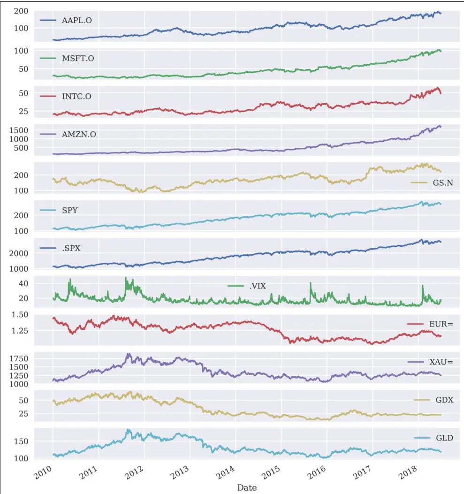
图8-1 以线图展示的金融时间序列数据

所使用的数据来自 Thomson Reuters (TR) Eikon Data API。在 TR 世界中，金融工具的符号称为路透工具代码（Reuters Instrument Codes, RICs）。各个 RIC 所代表的金融工具如下：

```python
In [9]: instruments = ['Apple Stock', 'Microsoft Stock', 'Intel Stock', 'Amazon Stock', 'Goldman Sachs Stock', 'SPDR S&P 500 ETF Trust', 'S&P 500 Index', 'VIX Volatility Index', 'EUR/USD Exchange Rate', 'Gold Price', 'VanEck Vectors Gold Miners ETF', 'SPDR Gold Trust']

In [10]: for ric, name in zip(data.columns, instruments):
    print('{:8s} | {}'.format(ric, name))
AAPL.O | Apple Stock
MSFT.O | Microsoft Stock
INTC.O | Intel Stock
AMZN.O | Amazon Stock
GS.N | Goldman Sachs Stock
SPY | SPDR S&P 500 ETF Trust
.SPX | S&P 500 Index
.VIX | VIX Volatility Index
EUR= | EUR/USD Exchange Rate
XAU= | Gold Price
GDX | VanEck Vectors Gold Miners ETF
GLD | SPDR Gold Trust
```

## 汇总统计

金融分析师下一步可能会查看数据集的各种汇总统计量，以"感受"数据的大致情况：

```txt
In [11]: data.info() ①
<class 'pandas.core.frame.DataFrame'>
DatetimeIndex: 2216 entries, 2010-01-01 to 2018-06-29
Data columns (total 12 columns):
AAPL.O 2138 non-null float64
MSFT.O 2138 non-null float64
INTC.O 2138 non-null float64
AMZN.O 2138 non-null float64
GS.N 2138 non-null float64
SPY 2138 non-null float64
.SPX 2138 non-null float64
.VIX 2138 non-null float64
EUR= 2216 non-null float64
XAU= 2211 non-null float64
GDX 2138 non-null float64
GLD 2138 non-null float64
dtypes: float64(12)
memory usage: 225.1 KB
```

<table><tr><td colspan="9">In [12]: data.describe().round(2) 2</td></tr><tr><td colspan="9">Out[12]:</td></tr><tr><td></td><td>AAPL.0</td><td>MSFT.0</td><td>INTC.0</td><td>AMZN.0</td><td>GS.N</td><td>SPY</td><td>.SPX</td><td>.VIX </td></tr><tr><td>count</td><td>2138.00</td><td>2138.00</td><td>2138.00</td><td>2138.00</td><td>2138.00</td><td>2138.00</td><td>2138.00</td><td>2138.00</td></tr><tr><td>mean</td><td>93.46</td><td>44.56</td><td>29.36</td><td>480.46</td><td>170.22</td><td>180.32</td><td>1802.71</td><td>17.03</td></tr><tr><td>std</td><td>40.55</td><td>19.53</td><td>8.17</td><td>372.31</td><td>42.48</td><td>48.19</td><td>483.34</td><td>5.88</td></tr><tr><td>min</td><td>27.44</td><td>23.01</td><td>17.66</td><td>108.61</td><td>87.70</td><td>102.20</td><td>1022.58</td><td>9.14</td></tr><tr><td>25%</td><td>60.29</td><td>28.57</td><td>22.51</td><td>213.60</td><td>146.61</td><td>133.99</td><td>1338.57</td><td>13.07</td></tr><tr><td>50%</td><td>90.55</td><td>39.66</td><td>27.33</td><td>322.06</td><td>164.43</td><td>186.32</td><td>1863.08</td><td>15.58</td></tr><tr><td>75%</td><td>117.24</td><td>54.37</td><td>34.71</td><td>698.85</td><td>192.13</td><td>210.99</td><td>2108.94</td><td>19.07</td></tr><tr><td>max</td><td>193.98</td><td>102.49</td><td>57.08</td><td>1750.08</td><td>273.38</td><td>286.58</td><td>2872.87</td><td>48.00</td></tr><tr><td></td><td>EUR=</td><td>XAU=</td><td>GDX</td><td>GLD</td><td></td><td></td><td></td><td></td></tr></table>

<table><tr><td>mean</td><td>1.25</td><td>1349.01</td><td>33.57</td><td>130.09</td></tr><tr><td>std</td><td>0.11</td><td>188.75</td><td>15.17</td><td>18.78</td></tr><tr><td>min</td><td>1.04</td><td>1051.36</td><td>12.47</td><td>100.50</td></tr><tr><td>25%</td><td>1.13</td><td>1221.53</td><td>22.14</td><td>117.40</td></tr><tr><td>50%</td><td>1.27</td><td>1292.61</td><td>25.62</td><td>124.00</td></tr><tr><td>75%</td><td>1.35</td><td>1428.24</td><td>48.34</td><td>139.00</td></tr><tr><td>max</td><td>1.48</td><td>1898.99</td><td>66.63</td><td>184.59</td></tr></table>

① info() 提供关于 DataFrame 对象的元信息。

② describe() 提供每列有用的标准统计量。


## 快速概览

pandas 提供了许多方法（如 info() 和 describe()）来快速了解新导入的金融时间序列数据集。它们还允许快速检查导入过程是否按预期工作（例如，DataFrame 对象是否确实具有 DatetimeIndex 类型的索引）。

当然，也可以自定义要推导和显示的统计类型：

```txt
In [13]: data.mean( ) ①
Out[13]: AAPL.O 93.455973
MSFT.O 44.561115
INTC.O 29.364192
AMZN.O 480.461251
GS.N 170.216221
SPY 180.323029
.SPX 1802.713106
.VIX 17.027133
EUR= 1.248587
XAU= 1349.014130
GDX 33.566525
GLD 130.086590
dtype: float64

In [14]: data.aggregate([min, ②
np.mean, ③
np.std, ④
np.median, ⑤
max] ⑥
).round(2)

Out[14]:
AAPL.O MSFT.O INTC.O AMZN.O GS.N SPY .SPX .VIX EUR= \
min 27.4423.0117.66108.6187.70102.201022.589.141.04
mean 93.4644.5629.36480.46170.22180.321802.7117.031.25
std 40.5519.538.17372.3142.4848.19483.345.880.11
median 90.5539.6627.33322.06164.43186.321863.0815.581.27
```

<table><tr><td></td><td>XAU=</td><td>GDX</td><td>GLD</td></tr><tr><td>min</td><td>1051.36</td><td>12.47</td><td>100.50</td></tr><tr><td>mean</td><td>1349.01</td><td>33.57</td><td>130.09</td></tr><tr><td>std</td><td>188.75</td><td>15.17</td><td>18.78</td></tr><tr><td>median</td><td>1292.61</td><td>25.62</td><td>124.00</td></tr><tr><td>max</td><td>1898.99</td><td>66.63</td><td>184.59</td></tr></table>

① 每列的均值。

② 每列的最小值。

③ 每列的均值。

④ 每列的标准差。

⑤ 每列的中位数。

⑥ 每列的最大值。

使用 aggregate() 方法还可以传递自定义函数。

## 随时间的变化

统计分析方法通常基于随时间的变化（changes over time），而不是绝对值本身。有多种选项可以计算时间序列随时间的变化，包括绝对差值、百分比变化和对数收益率（logarithmic returns, log returns）。

首先，绝对差值，pandas 为此提供了一个特殊方法：

```txt
In [15]: data.diff().head() ①
Out[15]:
```

<table><tr><td></td><td>AAPL.O</td><td>MSFT.O</td><td>INTC.O</td><td>AMZN.O</td><td>GS.N</td><td>SPY</td><td>.SPX</td><td>.VIX</td><td>EUR= </td></tr><tr><td colspan="10">Date</td></tr><tr><td>2010-01-01</td><td>NaN</td><td>NaN</td><td>NaN</td><td>NaN</td><td>NaN</td><td>NaN</td><td>NaN</td><td>NaN</td><td>NaN</td></tr><tr><td>2010-01-04</td><td>NaN</td><td>NaN</td><td>NaN</td><td>NaN</td><td>NaN</td><td>NaN</td><td>NaN</td><td>NaN</td><td>0.0088</td></tr><tr><td>2010-01-05</td><td>0.052857</td><td>0.010</td><td>-0.01</td><td>0.79</td><td>3.06</td><td>0.30</td><td>3.53</td><td>-0.69</td><td>-0.0043</td></tr><tr><td>2010-01-06</td><td>-0.487142</td><td>-0.190</td><td>-0.07</td><td>-2.44</td><td>-1.88</td><td>0.08</td><td>0.62</td><td>-0.19</td><td>0.0044</td></tr><tr><td>2010-01-07</td><td>-0.055714</td><td>-0.318</td><td>-0.20</td><td>-2.25</td><td>3.41</td><td>0.48</td><td>4.55</td><td>-0.10</td><td>-0.0094</td></tr></table>

<table><tr><td></td><td>XAU=</td><td>GDX</td><td>GLD</td></tr><tr><td colspan="4">Date</td></tr><tr><td>2010-01-01</td><td>NaN</td><td>NaN</td><td>NaN</td></tr><tr><td>2010-01-04</td><td>23.65</td><td>NaN</td><td>NaN</td></tr><tr><td>2010-01-05</td><td>-1.35</td><td>0.46</td><td>-0.10</td></tr><tr><td>2010-01-06</td><td>19.85</td><td>1.17</td><td>1.81</td></tr><tr><td>2010-01-07</td><td>-6.60</td><td>-0.24</td><td>-0.69</td></tr></table>

```txt
In [16]: data.diff().mean()
Out[16]: AAPL.00.064737
MSFT.00.031246
INTC.00.013540
AMZN.00.706608
GS.N 0.028224
SPY 0.072103
.SPX 0.732659
.VIX -0.019583
EUR= -0.000119
XAU= 0.041887
GDX -0.015071
GLD -0.003455
dtype: float64
```
① diff() 提供两个索引值之间的绝对变化。

② 当然，还可以额外应用聚合操作。

从统计学的角度来看，绝对变化并不理想，因为它们依赖于时间序列数据本身的尺度。因此，通常更倾向于使用百分比变化。以下代码计算百分比变化或百分比收益率（percentage returns，也称为简单收益率 simple returns），并可视化每列的平均值（见图8-2）：

```python
In [17]: data.pct_change().round(3).head()
Out[17]:
```

```python
AAPL.O MSFT.O INTC.O AMZN.O GS.N SPY .SPX .VIX EUR= \
Date
2010-01-01 NaN NaN NaN NaN NaN NaN NaN NaN NaN 0.0062010-01-04 NaN NaN NaN NaN NaN NaN NaN NaN 0.003 -0.034 -0.0032010-01-050.0020.000 -0.0000.0060.0180.0030.003 -0.034 -0.0032010-01-06 -0.016 -0.006 -0.003 -0.018 -0.0110.0010.001 -0.0100.0032010-01-07 -0.002 -0.010 -0.010 -0.0170.0200.0040.004 -0.005 -0.007
XAU= GDX GLD
Date
2010-01-01 NaN NaN NaN
2010-01-040.022 NaN NaN
2010-01-05 -0.0010.010 -0.0012010-01-060.0180.0240.0162010-01-07 -0.006 -0.005 -0.006
```

```python
In [18]: data.pct_change().mean().plot(kind='bar', figsize=(10, 6));
```

① pct\_change() 计算两个索引值之间的百分比变化。

② 结果的平均值以条形图的形式可视化。

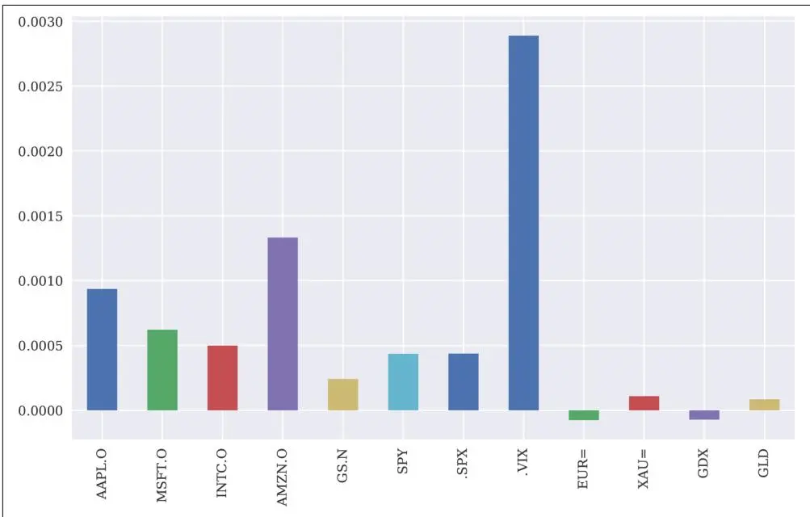
图8-2 百分比变化平均值的条形图

作为百分比收益率的替代方案，可以使用对数收益率（log returns）。在某些场景中，对数收益率更容易处理，因此在金融领域中通常更受青睐。² 图8-3 显示了单个金融时间序列的累积对数收益率。这种绘图方式实现了一定形式的归一化：

```txt
In [19]: rets = np.log(data / data.shift(1)) ①
In [20]: rets.head().round(3) ②
Out[20]:
AAPL.O MSFT.O INTC.O AMZN.O GS.N SPY .SPX .VIX EUR= \
Date
2010-01-01 NaN NaN NaN NaN NaN NaN NaN NaN NaN
2010-01-04 NaN NaN NaN NaN NaN NaN NaN NaN 0.0062010-01-050.0020.000 -0.0000.0060.0180.0030.003 -0.035 -0.0032010-01-06 -0.016 -0.006 -0.003 -0.018 -0.0110.0010.001 -0.0100.0032010-01-07 -0.002 -0.010 -0.010 -0.0170.0190.0040.004 -0.005 -0.007
XAU= GDX GLD
Date
2010-01-01 NaN NaN NaN
2010-01-040.021 NaN NaN
2010-01-05 -0.0010.010 -0.001
```

```txt
2010-01-060.0180.0240.0162010-01-07 -0.006 -0.005 -0.006
```

```python
In [21]: rets.cumsum().apply(np.exp).plot(figsize=(10, 6));
```

① 以向量化方式计算对数收益率。

② 结果子集。

③ 绘制随时间变化的累积对数收益率；首先调用 cumsum() 方法，然后对结果应用 np.exp()。

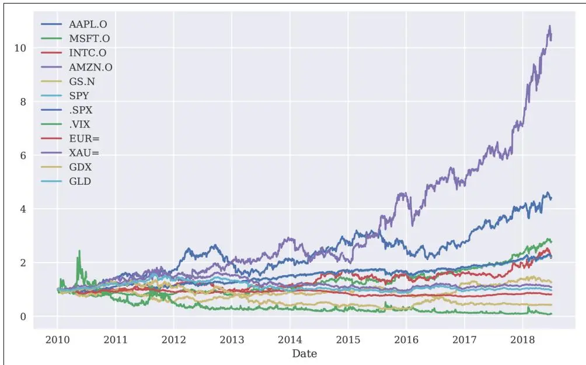
图8-3 随时间变化的累积对数收益率

## 重采样

重采样（Resampling）是金融时间序列数据的一项重要操作。通常采取降采样（downsampling）的形式，例如，将逐笔数据系列重采样为一分钟间隔，或将具有日观测值的时间序列重采样为周或月观测值（如图8-4所示）：

<table><tr><td colspan="9">In [22]: data.resample('1w', label='right').last().head() 1</td></tr><tr><td colspan="9">Out[22]:</td></tr><tr><td></td><td>AAPL.O</td><td>MSFT.O</td><td>INTC.O</td><td>AMZN.O</td><td>GS.N</td><td>SPY</td><td>.SPX</td><td>.VIX </td></tr><tr><td colspan="9">Date</td></tr><tr><td>2010-01-03</td><td>NaN</td><td>NaN</td><td>NaN</td><td>NaN</td><td>NaN</td><td>NaN</td><td>NaN</td><td>NaN</td></tr><tr><td>2010-01-10</td><td>30.282827</td><td>30.66</td><td>20.83</td><td>133.52</td><td>174.31</td><td>114.57</td><td>1144.98</td><td>18.13</td></tr><tr><td>2010-01-17</td><td>29.418542</td><td>30.86</td><td>20.80</td><td>127.14</td><td>165.21</td><td>113.64</td><td>1136.03</td><td>17.91</td></tr><tr><td>2010-01-24</td><td>28.249972</td><td>28.96</td><td>19.91</td><td>121.43</td><td>154.12</td><td>109.21</td><td>1091.76</td><td>27.31</td></tr><tr><td>2010-01-31</td><td>27.437544</td><td>28.18</td><td>19.40</td><td>125.41</td><td>148.72</td><td>107.39</td><td>1073.87</td><td>24.62</td></tr></table>

<table><tr><td></td><td>EUR=</td><td>XAU=</td><td>GDX</td><td>GLD</td></tr><tr><td colspan="5">Date</td></tr><tr><td>2010-01-03</td><td>1.4323</td><td>1096.35</td><td>NaN</td><td>NaN</td></tr><tr><td>2010-01-10</td><td>1.4412</td><td>1136.10</td><td>49.84</td><td>111.37</td></tr><tr><td>2010-01-17</td><td>1.4382</td><td>1129.90</td><td>47.42</td><td>110.86</td></tr><tr><td>2010-01-24</td><td>1.4137</td><td>1092.60</td><td>43.79</td><td>107.17</td></tr><tr><td>2010-01-31</td><td>1.3862</td><td>1081.05</td><td>40.72</td><td>105.96</td></tr></table>

```python
In [23]: data.resample('1m', label='right').last().head()
```

<table><tr><td></td><td>AAPL.O</td><td>MSFT.O</td><td>INTC.O</td><td>AMZN.O</td><td>GS.N</td><td>SPY</td><td>.SPX </td></tr><tr><td colspan="8">Date</td></tr><tr><td>2010-01-31</td><td>27.437544</td><td>28.1800</td><td>19.40</td><td>125.41</td><td>148.72</td><td>107.3900</td><td>1073.87</td></tr><tr><td>2010-02-28</td><td>29.231399</td><td>28.6700</td><td>20.53</td><td>118.40</td><td>156.35</td><td>110.7400</td><td>1104.49</td></tr><tr><td>2010-03-31</td><td>33.571395</td><td>29.2875</td><td>22.29</td><td>135.77</td><td>170.63</td><td>117.0000</td><td>1169.43</td></tr><tr><td>2010-04-30</td><td>37.298534</td><td>30.5350</td><td>22.84</td><td>137.10</td><td>145.20</td><td>118.8125</td><td>1186.69</td></tr><tr><td>2010-05-31</td><td>36.697106</td><td>25.8000</td><td>21.42</td><td>125.46</td><td>144.26</td><td>109.3690</td><td>1089.41</td></tr></table>

<table><tr><td></td><td>.VIX</td><td>EUR=</td><td>XAU=</td><td>GDX</td><td>GLD</td></tr><tr><td colspan="6">Date</td></tr><tr><td>2010-01-31</td><td>24.62</td><td>1.3862</td><td>1081.05</td><td>40.72</td><td>105.960</td></tr><tr><td>2010-02-28</td><td>19.50</td><td>1.3625</td><td>1116.10</td><td>43.89</td><td>109.430</td></tr><tr><td>2010-03-31</td><td>17.59</td><td>1.3510</td><td>1112.80</td><td>44.41</td><td>108.950</td></tr><tr><td>2010-04-30</td><td>22.05</td><td>1.3295</td><td>1178.25</td><td>50.51</td><td>115.360</td></tr><tr><td>2010-05-31</td><td>32.07</td><td>1.2305</td><td>1215.71</td><td>49.86</td><td>118.881</td></tr></table>

```python
In [24]: rets.cumsum().apply(np.exp).resample('1m', label='right').last().plot(figsize=(10, 6));
```

① EOD 数据被重采样为周时间间隔……

② ……和月时间间隔。

③ 绘制随时间变化的累积对数收益率：首先调用 cumsum() 方法，然后对结果应用 np.exp()；最后进行重采样。

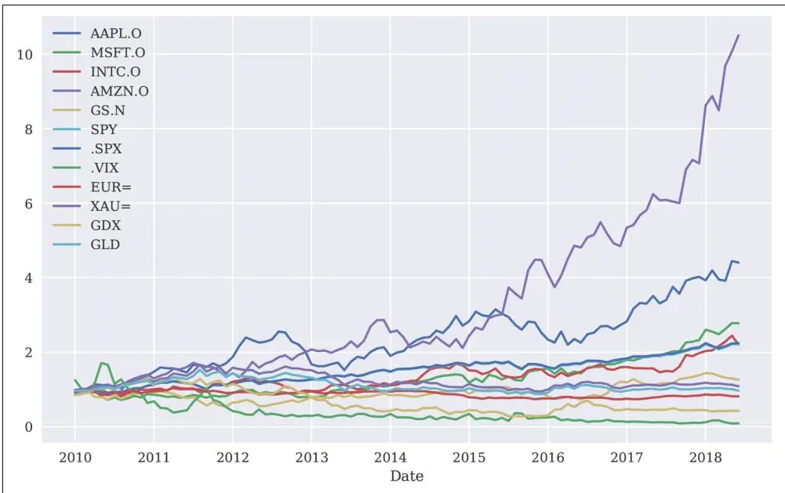
图8-4 随时间变化的重采样累积对数收益率（月度）



## 避免前视偏差

在重采样时，pandas 默认在许多情况下使用区间的左标签（或索引值）。为了保持金融学上的一致性，请确保使用右标签（索引值）并通常使用区间内的最后一个可用数据点。否则，前视偏差（foresight bias）可能会潜入金融分析中。³


## 滚动统计

在金融领域，使用滚动统计（rolling statistics，通常也称为金融指标或金融研究）是一种传统。例如，滚动统计是金融图表分析师和技术交易者的基本工具。本节仅使用单个金融时间序列：

```python
In [25]: sym = 'AAPL.O'

In [26]: data = pd.DataFrame(data[sym]).dropna()

In [27]: data.tail()
```


```txt
Out[27]: AAPL.O AAPL.0

Date 2018-06-25182.172018-06-26184.432018-06-27184.162018-06-28185.502018-06-29185.11
```

## 概述

用 pandas 推导标准滚动统计非常简单：

```python
In [28]: window = 20

In [29]: data['min'] = data[sym].rolling(window=window).min()

In [30]: data['mean'] = data[sym].rolling(window=window).mean()
```

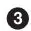

```python
In [31]: data['std'] = data[sym].rolling(window=window).std()
```


```python
In [32]: data['median'] = data[sym].rolling(window=window).median()

In [33]: data['max'] = data[sym].rolling(window=window).max()
```


```python
In [34]: data['ewma'] = data[sym].ewm(halflife=0.5, min_periods=window).mean()
```

① 定义窗口；即要包含的索引值数量。

② 计算滚动最小值。

③ 计算滚动均值。

④ 计算滚动标准差。

⑤ 计算滚动中位数。

⑥ 计算滚动最大值。

⑦ 计算指数加权移动平均线（exponentially weighted moving average, EWMA），半衰期为0.5。

要推导更专业的金融指标，通常需要额外的包（例如，参见[第4章](ch04.md)"交互式二维绘图"中的 Cufflinks 金融图表）。自定义指标也可以通过 apply() 方法轻松应用。

以下代码显示了一部分结果，并可视化了所选滚动统计量（见图8-5）：

```python
In [35]: data.dropna().head()
```

<table><tr><td></td><td>AAPL.0</td><td>min</td><td>mean</td><td>std</td><td>median</td><td>max </td></tr><tr><td colspan="7">Date</td></tr><tr><td>2010-02-01</td><td>27.818544</td><td>27.437544</td><td>29.580892</td><td>0.933650</td><td>29.821542</td><td>30.719969</td></tr><tr><td>2010-02-02</td><td>27.979972</td><td>27.437544</td><td>29.451249</td><td>0.968048</td><td>29.711113</td><td>30.719969</td></tr><tr><td>2010-02-03</td><td>28.461400</td><td>27.437544</td><td>29.343035</td><td>0.950665</td><td>29.685970</td><td>30.719969</td></tr><tr><td>2010-02-04</td><td>27.435687</td><td>27.435687</td><td>29.207892</td><td>1.021129</td><td>29.547113</td><td>30.719969</td></tr><tr><td>2010-02-05</td><td>27.922829</td><td>27.435687</td><td>29.099892</td><td>1.037811</td><td>29.419256</td><td>30.719969</td></tr></table>

```txt
ewma
Date
2010-02-0127.8054322010-02-0227.9363372010-02-0328.3301342010-02-0427.6592992010-02-0527.856947
```

```python
In [36]: ax = data[['min', 'mean', 'max']].iloc[-200:].plot( figsize=(10, 6), style=['g--', 'r--', 'g--'], lw=0.8) data[sym].iloc[-200:].plot(ax=ax, lw=2.0);
```

① 绘制最后200行的三个滚动统计量。

② 将原始时间序列数据添加到图中。

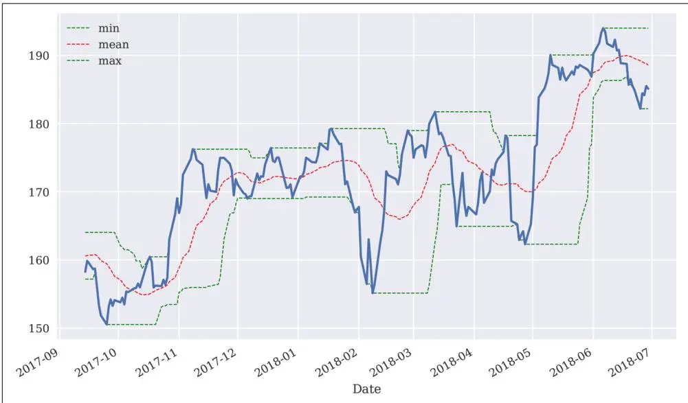
图8-5 最小值、均值、最大值的滚动统计量

## 技术分析示例

滚动统计是所谓股票技术分析（technical analysis）的主要工具——与基本面分析（fundamental analysis）不同，基本面分析侧重于财务报表和被分析公司的战略地位等。

一个基于技术分析的数十年历史的交易策略是使用两条简单移动平均线（simple moving averages, SMAs）。其核心思想是：当较短期的 SMA 高于较长期的 SMA 时，交易者应该做多（go long）该股票（或金融工具）；当情况相反时，应该做空（go short）。这些概念可以通过 pandas 和 DataFrame 对象的能力精确实现。

滚动统计通常只有在给定窗口参数规范下有足够数据时才会计算。如图8-6所示，SMA 时间序列只有在有足够数据满足特定参数化时才开始：

```python
In [37]: data['SMA1'] = data[sym].rolling(window=42).mean()
```

```python
In [38]: data['SMA2'] = data[sym].rolling(window=252).mean()
```

```txt
In [39]: data[[sym, 'SMA1', 'SMA2']].tail()
Out[39]: AAPL.0 SMA1 SMA2
Date
2018-06-25182.17185.606190168.2655562018-06-26184.43186.087381168.4187702018-06-27184.16186.607381168.5792062018-06-28185.50187.089286168.7366272018-06-29185.11187.470476168.901032
```

```python
In [40]: data[[sym, 'SMA1', 'SMA2']].plot(figsize=(10, 6));
```

① 计算较短周期 SMA 的值。

② 计算较长周期 SMA 的值。

③ 可视化股票价格数据以及两条 SMA 时间序列。

```python
In [42]: data['positions'] = np.where(data['SMA1'] > data['SMA2'], 1, -1)
```

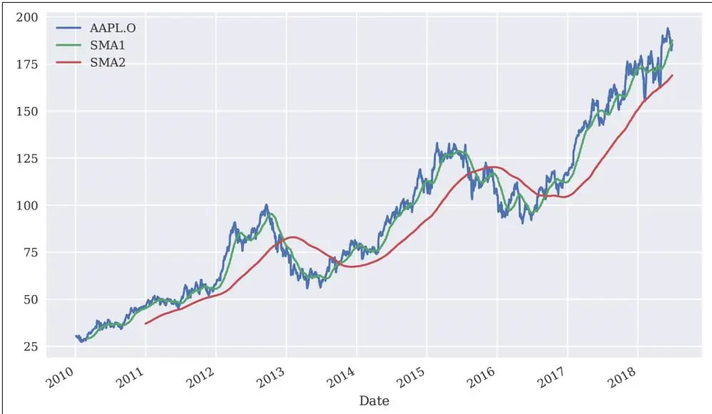
图8-6 苹果股票价格与两条简单移动平均线

在这个上下文中，SMA 只是达到目的的手段。它们用于推导头寸以实现交易策略。图8-7 将多头头寸可视化为值1，空头头寸可视化为值-1。头寸的变化（视觉上）由代表 SMA 时间序列的两条线的交叉触发：

```python
In [41]: data.dropna(inplace=True)
```

```python
In [43]: ax = data[[sym, 'SMA1', 'SMA2', 'positions']].plot(figsize=(10, 6), secondary_y='positions')
ax.get_legend().set_bbox_to_anchor((0.25, 0.85));
```

① 仅保留完整的数据行。

② 如果较短周期 SMA 值大于较长周期 SMA 值……

③ ……做多该股票（置为1）。

④ 否则，做空该股票（置为-1）。

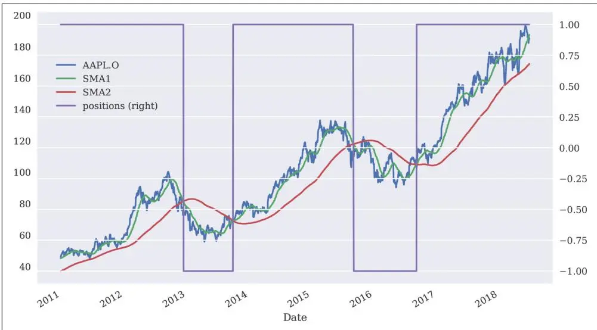
图8-7 苹果股票价格、两条简单移动平均线和头寸

这里隐含推导出的交易策略本身只产生少数几次交易：仅当头寸值发生变化（即发生交叉）时，才会进行交易。包括开仓和平仓交易在内，总共只会累积到六次交易。

## 相关性分析

作为使用 pandas 处理金融时间序列数据的进一步说明，考虑标准普尔500股票指数和 VIX 波动率指数的情况。一个程式化事实（stylized fact）是：当 S&P 500 上涨时，VIX 通常下跌，反之亦然。这是关于相关性（correlation）而非因果性（causation）。本节展示如何为 S&P 500 和 VIX（高度）负相关这一程式化事实提供一些统计证据支持。⁴

## 数据

现在数据集由两个金融时间序列组成，两者都可视化在图8-8中：

```python
In [44]: raw = pd.read_csv('../source/tr_eikon_eod_data.csv', index_col=0, parse_dates=True)

In [45]: data = raw[['.SPX', '.VIX']].dropna()
```

<table><tr><td colspan="3">In [46]: data.tail()</td></tr><tr><td>Out[46]:</td><td>.SPX</td><td>.VIX</td></tr><tr><td colspan="3">Date</td></tr><tr><td>2018-06-25</td><td>2717.07</td><td>17.33</td></tr><tr><td>2018-06-26</td><td>2723.06</td><td>15.92</td></tr><tr><td>2018-06-27</td><td>2699.63</td><td>17.91</td></tr><tr><td>2018-06-28</td><td>2716.31</td><td>16.85</td></tr><tr><td>2018-06-29</td><td>2718.37</td><td>16.09</td></tr></table>

```python
In [47]: data.plot(subplots=True, figsize=(10, 6));
```

① 从 CSV 文件读取 EOD 数据（最初来自 Thomson Reuters Eikon Data API）。

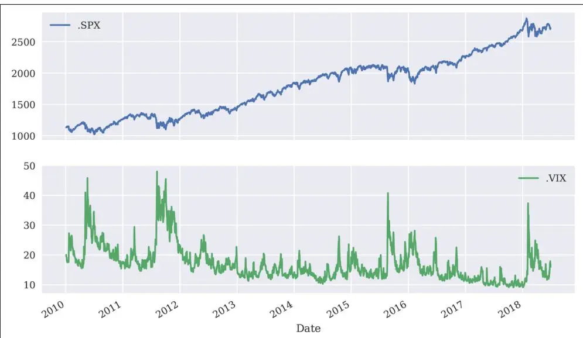
图8-8 S&P 500 和 VIX 时间序列数据（不同子图）

当在单个图中以调整后的缩放比例绘制（部分）两个时间序列时，通过简单的视觉检查，两个指数之间负相关的程式化事实就变得明显了（图8-9）：

```python
In [48]: data.loc[:'2012-12-31'].plot(secondary_y='.VIX', figsize=(10, 6));
```

① .loc[:DATE] 选择截至给定值 DATE 的数据。

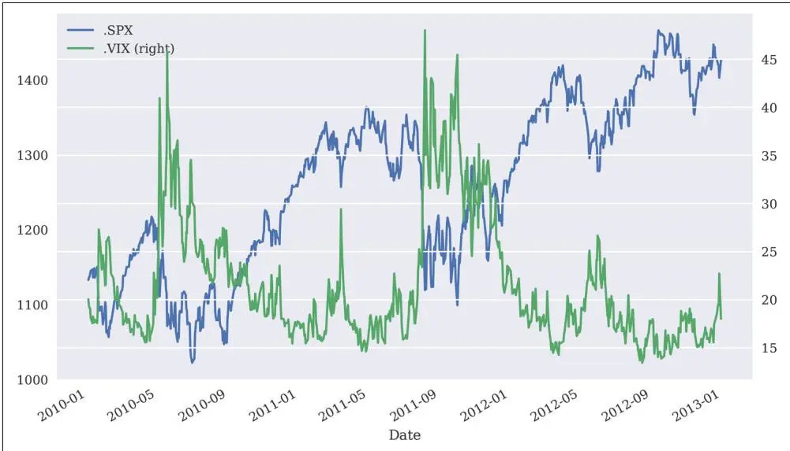
图8-9 S&P 500 和 VIX 时间序列数据（同一图）

## 对数收益率

如前所述，统计分析通常依赖于收益率（returns）而不是绝对变化甚至绝对值。因此，在任何进一步分析之前，我们首先计算对数收益率。图8-10 显示了对数收益率随时间的高度波动性。两个指数都可以观察到所谓的"波动率聚集"（volatility clusters）现象。一般来说，股票指数的高波动期伴随着波动率指数的相同现象：

```txt
In [49]: rets = np.log(data / data.shift(1))
In [50]: rets.head()
Out[50]: .SPX .VIX
Date
2010-01-04 NaN NaN
2010-01-050.003111 -0.0350382010-01-060.000545 -0.0098682010-01-070.003993 -0.0052332010-01-080.002878 -0.050024
```

```python
In [51]: rets.dropna(inplace=True)
```

```python
In [52]: rets.plot(subplots=True, figsize=(10, 6));
```

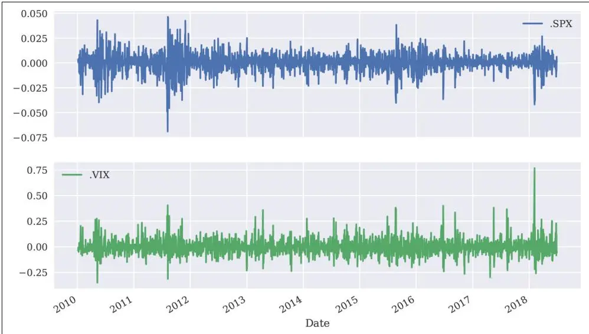
图8-10 S&P 500 和 VIX 随时间变化的对数收益率

在这种背景下，pandas 的 scatter\_matrix() 绘图函数对可视化非常有用。它将两个序列的对数收益率相互绘制，并且可以在对角线上添加直方图或核密度估计（kernel density estimator, KDE）（见图8-11）：

```python
In [53]: pd.plotting.scatter_matrix(rets, 1
    alpha=0.2, 2
    diagonal='hist', 3
    hist_kwargs={'bins': 35}, 4
    figsize=(10, 6));
```

① 要绘制的数据集。

② 点的透明度 alpha 参数。

③ 对角线上放置的内容；这里：列数据的直方图。

④ 传递给直方图绘图函数的关键字参数。

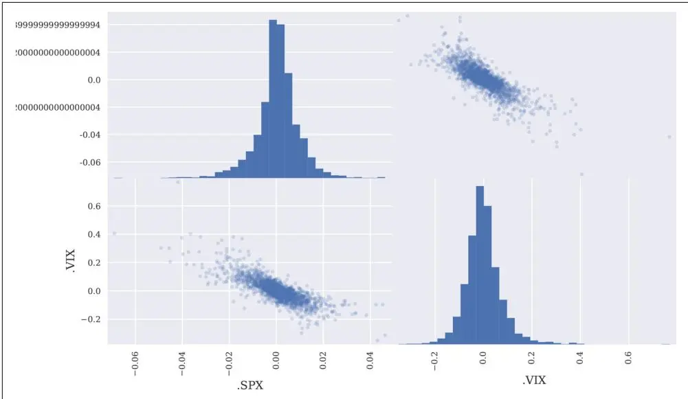
图8-11 S&P 500 和 VIX 对数收益率的散点矩阵图

## OLS 回归

有了所有这些准备工作，实现普通最小二乘法（ordinary least-squares, OLS）回归分析就变得很方便了。图8-12 显示了对数收益率的散点图以及穿过点云的线性回归线。斜率显然是负的，为两个指数之间负相关的程式化事实提供了支持：

```python
In [54]: reg = np.polyfit(rets['.SPX'], rets['.VIX'], deg=1)
In [55]: ax = rets.plot(kind='scatter', x='.SPX', y='.VIX', figsize=(10, 6))
ax.plot(rets['.SPX'], np.polyval(reg, rets['.SPX']), 'r', lw=2);
```

① 实现线性 OLS 回归。

② 将对数收益率绘制为散点图……

③ ……并添加线性回归线。

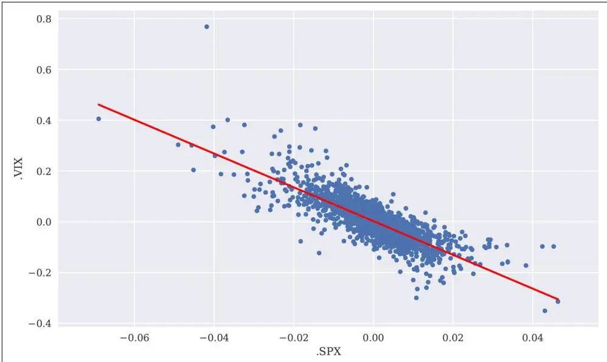
图8-12 S&P 500 和 VIX 对数收益率的散点矩阵图

## 相关性

最后，我们直接考虑相关性度量。考虑两种度量方法：一种静态的，考虑完整数据集；另一种滚动的，显示固定窗口随时间变化的相关性。图8-13 说明相关性确实随时间变化，但在给定参数化下始终为负。这为 S&P 500 和 VIX 指数（强烈）负相关的程式化事实提供了强有力的支持：

```txt
In [56]: rets.corr() 1
Out[56]: .SPX .VIX
. SPX 1.000000 -0.804382
. VIX -0.8043821.000000
```

```python
In [57]: ax = rets['.SPX'].rolling(window=252).corr(rets['.VIX']).plot(figsize=(10, 6)) ax.axhline(rets.corr().iloc[0, 1], c='r');
```

① 整个 DataFrame 的相关矩阵。

② 绘制随时间变化的滚动相关性……

③ ……并将静态值作为水平线添加到图中。

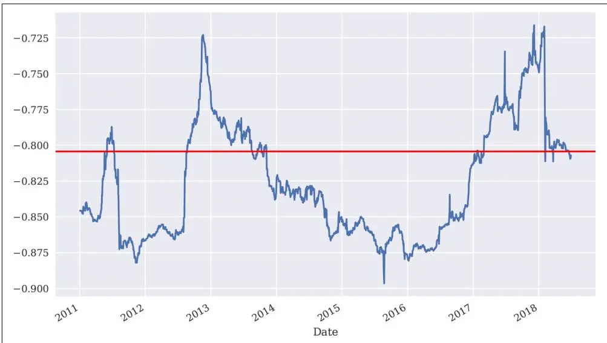
图8-13 S&P 500 和 VIX 之间的相关性（静态和滚动）

## 高频数据

本章讨论的是使用 pandas 进行金融时间序列分析。逐笔数据集（tick data sets）是金融时间序列的一种特殊情况。坦率地说，它们的处理方式与本章迄今为止使用的 EOD 数据集等大致相同。使用 pandas 导入此类数据集通常也很快。所使用的数据集包含17,352行数据（另见图8-14）：

```txt
In [59]: %%time
    # data from FXCM Forex Capital Markets Ltd.
    tick = pd.read_csv('../source/fxcm_eur_usd_tick_data.csv',
    index_col=0, parse_dates=True)
    CPU times: user 1.07 s, sys: 149 ms, total: 1.22 s
    Wall time: 1.16 s

In [60]: tick.info()
    <class 'pandas.core.frame.DataFrame'>
    DatetimeIndex: 461357 entries, 2018-06-2900:00:00.082000 to 2018-06-2920:59:00.607000
    Data columns (total 2 columns):
    Bid    461357 non-null float64
    Ask    461357 non-null float64
    dtypes: float64(2)
    memory usage: 10.6 MB

In [61]: tick['Mid'] = tick.mean(axis=1) ①

In [62]: tick['Mid'].plot(figsize=(10, 6));
```

① 计算每行数据的中价（Mid price）。

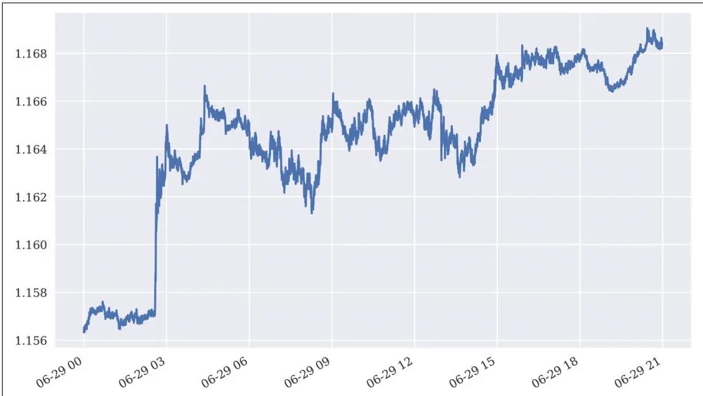
图8-14 EUR/USD 汇率的逐笔数据

处理逐笔数据通常是一个需要对金融时间序列数据进行重采样的场景。以下代码将逐笔数据重采样为五分钟柱状数据（见图8-15），然后可以用于例如回测算法交易策略或实施技术分析：

```python
In [63]: tick_resam = tick.resample(rule='5min', label='right').last()
```

<table><tr><td colspan="5">In [64]: tick_resam.head()</td></tr><tr><td>Out[64]:</td><td></td><td>Bid</td><td>Ask</td><td>Mid</td></tr><tr><td></td><td>2018-06-2900:05:00</td><td>1.15649</td><td>1.15651</td><td>1.156500</td></tr><tr><td></td><td>2018-06-2900:10:00</td><td>1.15671</td><td>1.15672</td><td>1.156715</td></tr><tr><td></td><td>2018-06-2900:15:00</td><td>1.15725</td><td>1.15727</td><td>1.157260</td></tr><tr><td></td><td>2018-06-2900:20:00</td><td>1.15720</td><td>1.15722</td><td>1.157210</td></tr><tr><td></td><td>2018-06-2900:25:00</td><td>1.15711</td><td>1.15712</td><td>1.157115</td></tr></table>

```python
In [65]: tick_resam['Mid'].plot(figsize=(10, 6));
```

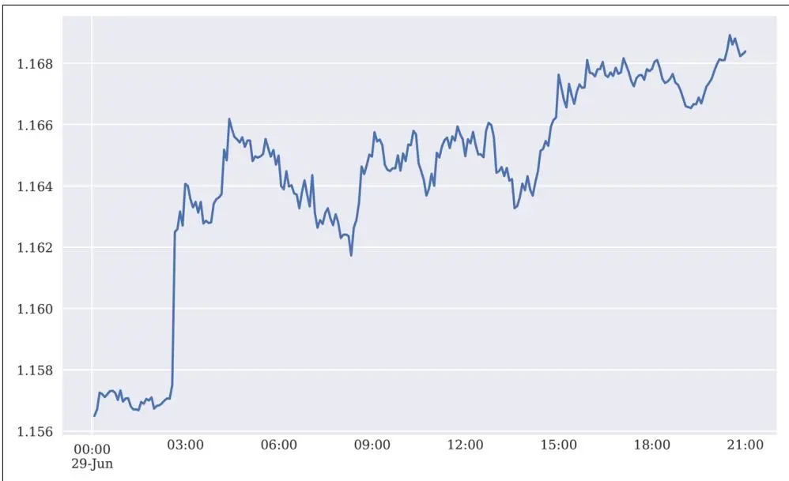
图8-15 EUR/USD 汇率的五分钟柱状数据

## 结论

本章讨论了金融时间序列——可能是金融领域中最重要的数据类型。pandas 是处理此类数据集的强大工具，不仅允许高效的数据分析，还允许轻松的可视化等。pandas 也有助于从不同来源读取此类数据集以及将数据集导出到不同的技术文件格式。这一点将在[第9章](ch09.md)中说明。

## 延伸资源

涵盖本章主题的优秀书籍参考文献包括：

- McKinney, Wes (2017). Python for Data Analysis. Sebastopol, CA: O'Reilly.
- VanderPlas, Jake (2016). Python Data Science Handbook. Sebastopol, CA: O'Reilly.
