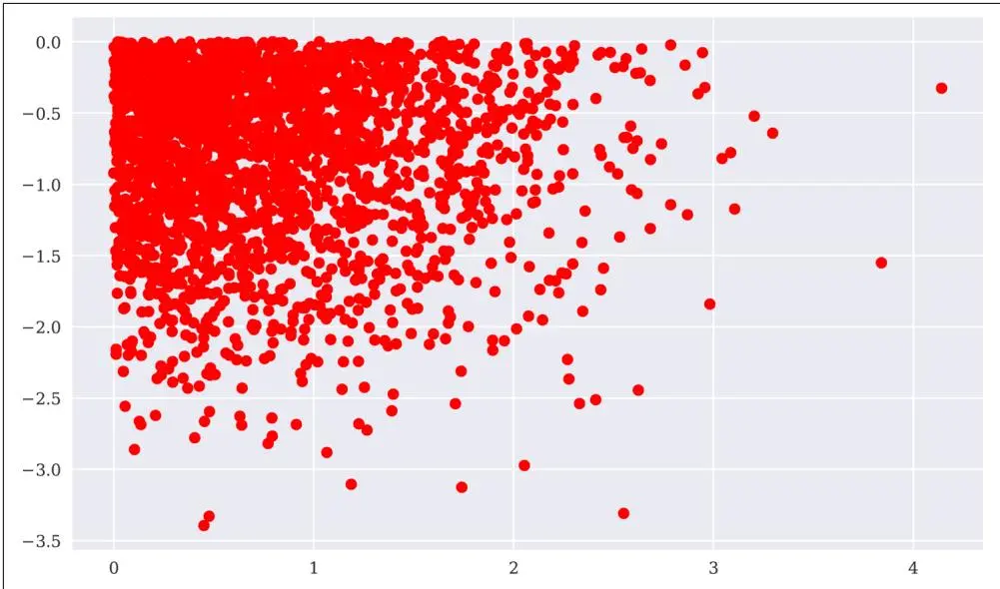
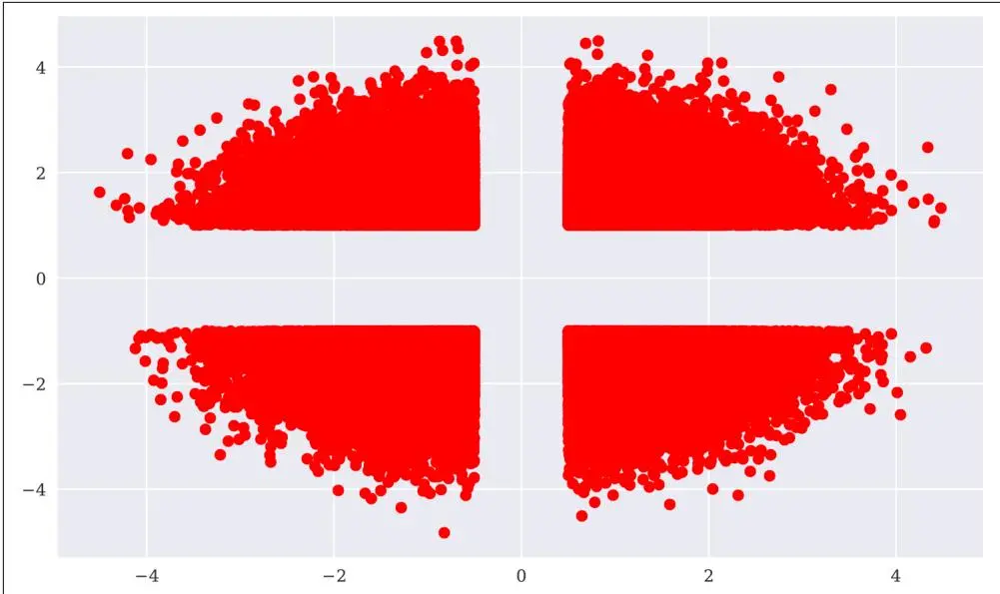
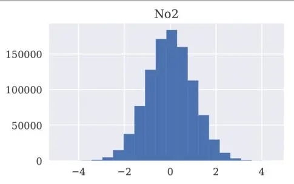
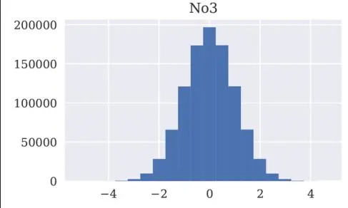
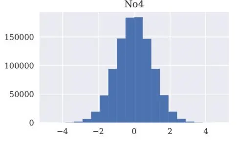
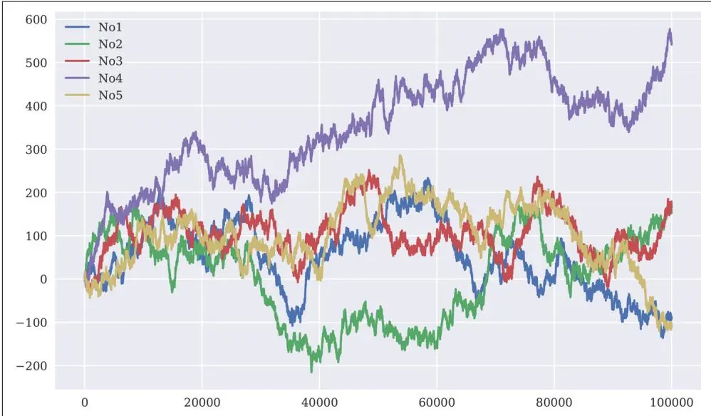
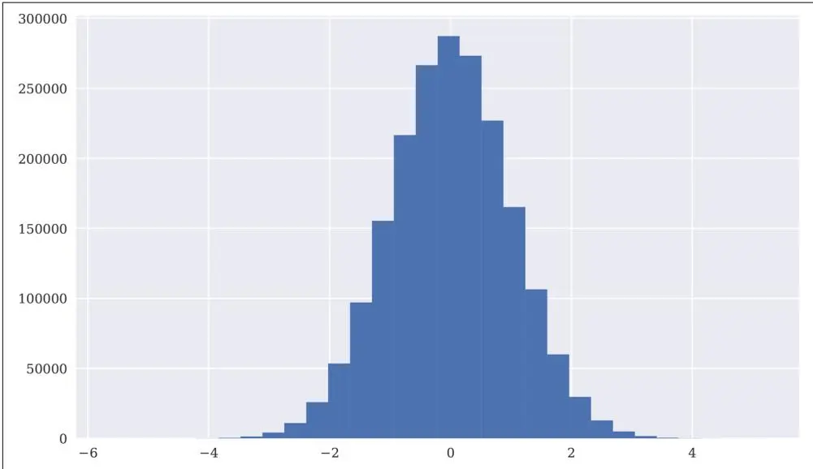
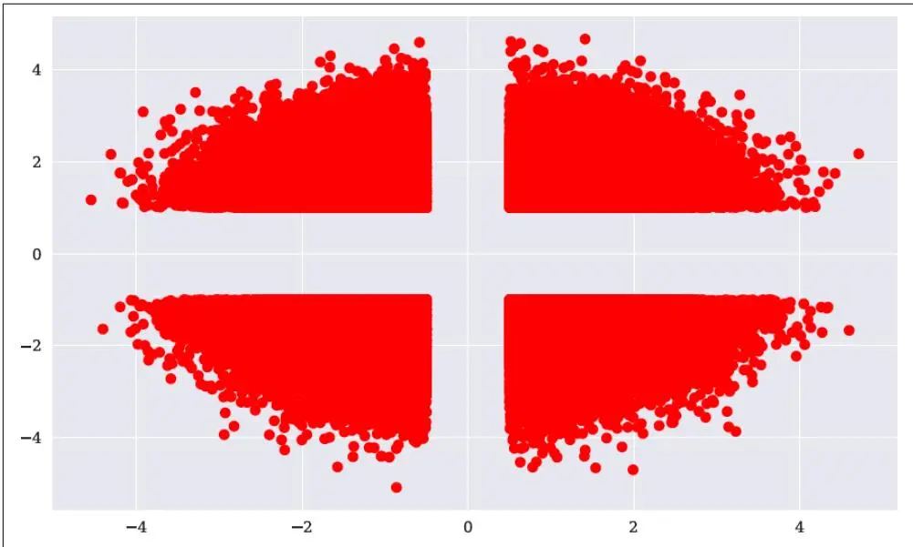
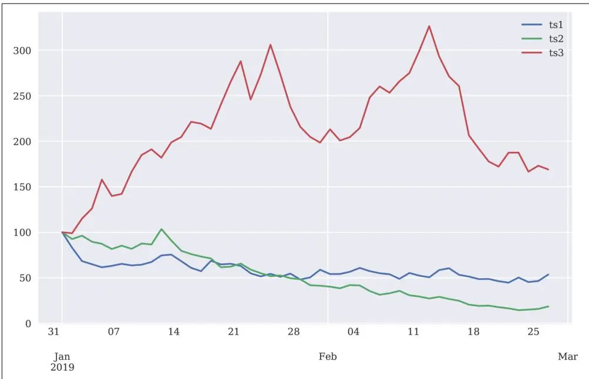
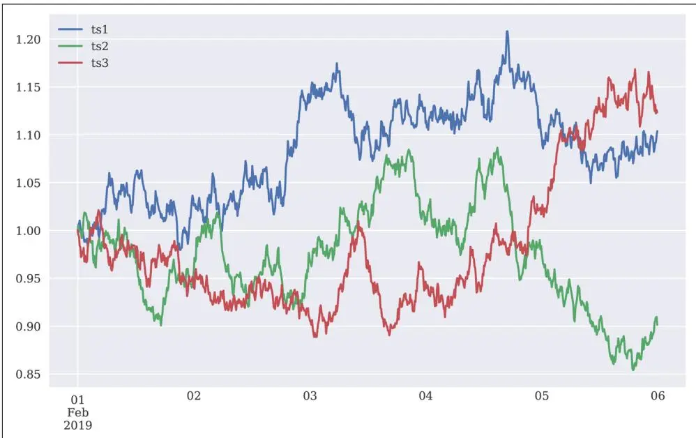

# 输入/输出操作


在没有数据之前就提出理论是一个致命的错误。
—Sherlock Holmes


作为一般规则，大多数数据——无论是在金融领域还是任何其他应用领域——都存储在硬盘驱动器（hard disk drives, HDDs）或其他某种永久存储设备上，如固态硬盘（solid state disks, SSDs）或混合硬盘驱动器。多年来，存储容量稳步增长，而每存储单元（例如每兆字节）的成本则稳步下降。

与此同时，存储的数据量增长速度远远超过即使是最大型机器上可用的典型随机存取存储器（random access memory, RAM）的增长速度。这使得不仅需要将数据存储到磁盘以实现永久存储，还需要通过将数据从 RAM 交换到磁盘及反向操作来弥补 RAM 不足的问题。

因此，输入/输出（I/O）操作在金融应用和数据密集型应用中是一项重要任务。它们通常代表了性能关键型计算的瓶颈，因为 I/O 操作通常无法足够快地将数据传送到 RAM¹ 或从 RAM 传送到磁盘。从某种意义上说，CPU 常常因慢速的 I/O 操作而"饥饿"。

尽管当今大多数金融和企业分析工作都面临大数据（例如 PB 级规模），但单个分析任务通常使用属于"中等"数据范畴的数据子集。微软研究院的一项研究指出：


我们的测量以及其他近期工作表明，大多数真实世界的分析任务处理的数据量不到 100 GB，但 Hadoop/MapReduce 等流行基础设施最初是为 PB 级处理设计的。
—Appuswamy et al. (2013)


就频率而言，单个金融分析任务通常处理不超过几 GB 的数据——而这正是 Python 及其科学栈库（如 NumPy、pandas 和 PyTables）的最佳适用点。这种大小的数据集也可以在内存中进行分析，利用当今的 CPU 和 GPU 通常能实现高速处理。然而，数据必须读入 RAM，结果必须写入磁盘，同时确保满足当今的性能要求。

本章涉及以下主题：

## "Python 基本 I/O" on page 232

Python 有内置函数来序列化并将任何对象存储到磁盘，以及从磁盘将其读入 RAM；除此之外，Python 在处理文本文件和 SQL 数据库方面也很强大。NumPy 也提供了专门的函数用于 ndarray 对象的快速二进制存储和检索。

## "pandas I/O" on page 244

pandas 库提供了大量便捷函数和方法，用于读取不同格式（如 CSV、JSON）存储的数据，以及将数据写入多种格式的文件。

## "PyTables I/O" on page 252

PyTables 使用具有分层数据库结构和二进制存储的 HDF5 标准，以实现大数据集的快速 I/O 操作；速度通常只受所用硬件的限制。

## "TsTables I/O" on page 267

TsTables 是一个构建在 PyTables 之上的包，允许时间序列数据的快速存储和检索。

## Python 基本 I/O

Python 本身带有大量 I/O 功能，其中一些针对性能进行了优化，另一些则更侧重于灵活性。总的来说，它们在交互式和生产环境中都很容易使用。

## 将对象写入磁盘

为了后续使用、文档记录或与他人共享，可能需要将 Python 对象存储到磁盘。一种选择是使用 pickle 模块。该模块可以序列化大多数 Python 对象。序列化（Serialization）指的是将对象（层次结构）转换为字节流；反序列化（deserialization）则是相反的操作。

像往常一样，首先进行一些导入和关于绘图的设置：

```python
In [1]: from pylab import plt, mpl
plt.style.use('seaborn')
mpl.rcParams['font.family'] = 'serif'
%matplotlib inline
```

接下来的示例使用（伪）随机数据，这次存储在列表对象中：

```python
In [2]: import pickle ①
    import numpy as np
    from random import gauss ②

In [3]: a = [gauss(1.5, 2) for i in range(1000000)] ③
In [4]: path = '/Users/yves/Temp/data/' ④
In [5]: pkl_file = open(path + 'data.pkl', 'wb') ⑤
```

① 从标准库导入 pickle 模块。

② 导入 gauss 以生成正态分布的随机数。

③ 创建一个包含随机数的大列表对象。

④ 指定存储数据文件的路径。

⑤ 以二进制写入模式（wb）打开文件。

序列化和反序列化 Python 对象的两个主要函数是 pickle.dump()（用于写入对象）和 pickle.load()（用于加载对象到内存）：

```txt
In [6]: %time pickle.dump(a, pkl_file) ①
CPU times: user 37.2 ms, sys: 15.3 ms, total: 52.5 ms
Wall time: 50.8 ms

In [7]: pkl_file.close() ②

In [8]: ll $path* ③
-rw-r--r-- 1 yves staff 9002006 Oct 1912:11
/Users/yves/Temp/data/data.pkl

In [9]: pkl_file = open(path + 'data.pkl', 'rb') ④

In [10]: %time b = pickle.load(pkl_file) ⑤
CPU times: user 34.1 ms, sys: 16.7 ms, total: 50.8 ms
```

```txt
Wall time: 48.7 ms
```

```json
In [11]: a[:3]
Out[11]: [6.517874180585469, -0.5552400459507827, 2.8488946310833096]
```

```json
In [12]: b[:3]
Out[12]: [6.517874180585469, -0.5552400459507827, 2.8488946310833096]
```

```txt
In [13]: np.allclose(np.array(a), np.array(b)) 6
Out[13]: True
```

① 序列化对象 a 并保存到文件。

② 关闭文件。

③ 显示磁盘上的文件及其大小（Mac/Linux）。

④ 以二进制读取模式（rb）打开文件。

⑤ 从磁盘读取对象并反序列化。

⑥ 将 a 和 b 转换为 ndarray 对象，np.allclose() 验证两者包含相同的数据（数字）。

使用 pickle 存储和检索单个对象显然非常简单。存储两个对象呢？

```python
In [14]: pkl_file = open(path + 'data.pkl', 'wb')
```

```txt
In [15]: %time pickle.dump(np.array(a), pkl_file) CPU times: user 58.1 ms, sys: 6.09 ms, total: 64.2 ms Wall time: 32.5 ms
```

```txt
In [16]: %time pickle.dump(np.array(a) ** 2, pkl_file) ②
CPU times: user 66.7 ms, sys: 7.22 ms, total: 73.9 ms
Wall time: 39.3 ms
```

```txt
In [17]: pkl_file.close()
```

```tcl
In [18]: ll $path* ③
-rw-r--r-- 1 yves staff 16000322 Oct 1912:11
/Users/yves/Temp/data/data.pkl
```

① 序列化 a 的 ndarray 版本并保存。

② 序列化 a 的平方 ndarray 版本并保存。

③ 文件现在的大小大约是之前的两倍。

那么，将两个 ndarray 对象读回内存呢？

```python
In [19]: pkl_file = open(path + 'data.pkl', 'rb')
```

```python
In [20]: x = pickle.load(pkl_file) ①
    x[:4]
Out[20]: array([6.51787418, -0.55524005, 2.84889463, 5.94489175])
```

```txt
In [21]: y = pickle.load(pkl_file) ②
    y[:4]
Out[21]: array([42.48268383, 0.30829151, 8.11620062, 35.34173791])
```

```txt
In [22]: pkl_file.close()
```

① 检索首先存储的对象。

② 检索其次存储的对象。

显然，pickle 按照先进先出（first in, first out, FIFO）原则存储对象。有一个主要问题：用户没有元信息可以预先知道 pickle 文件中存储了什么。

一个有时有用的变通方法是，不存储单个对象，而是存储一个包含所有其他对象的 dict 对象：

```python
In [23]: pkl_file = open(path + 'data.pkl', 'wb')
pickle.dump({'x': x, 'y': y}, pkl_file)
pkl_file.close()
```

```python
In [24]: pkl_file = open(path + 'data.pkl', 'rb')
    data = pickle.load(pkl_file) ②
    pkl_file.close()
    for key in data.keys():
    print(key, data[key][:4])
    x [6.51787418 -0.555240052.848894635.94489175]
    y [42.482683830.308291518.1162006235.34173791]
```

```txt
In [25]: !rm -f $path*
```

① 存储包含两个 ndarray 对象的 dict 对象。

② 检索 dict 对象。

这种方法需要一次性写入和读取所有对象，但考虑到它带来的更高便利性，在许多情况下这是一个可以接受的折衷方案。


## 兼容性问题


使用 pickle 进行对象序列化通常很简单。然而，当 Python 包升级且新版本无法再处理旧版本的序列化对象时，可能会导致问题。在不同平台和操作系统之间共享此类对象时也可能会出现问题。因此，通常建议使用后续章节讨论的 NumPy 和 pandas 等包的内置读写功能。


## 读写文本文件

文本处理可以说是 Python 的一个优势。事实上，许多企业和科学用户使用 Python 正是为了这项任务。使用 Python，有多种处理 str 对象以及一般文本文件的选项。

假设有一个相当大的数据集需要以 CSV 文件形式共享。尽管这类文件有特殊的内部结构，但它们基本上是纯文本文件。以下代码创建一个虚拟数据集作为 ndarray 对象，创建一个 DatetimeIndex 对象，将两者组合，并将数据存储为 CSV 文本文件：

```python
In [26]: import pandas as pd

In [27]: rows = 5000 ①
    a = np.random.standard_normal((rows, 5)).round(4) ②

In [28]: a ②
Out[28]: array([[-0.0892, -1.0508, -0.5942, 0.3367, 1.508],
    [2.1046, 3.2623, 0.704, -0.2651, 0.4461],
    [-0.0482, -0.9221, 0.1332, 0.1192, 0.7782],
    ...,
    [0.3026, -0.2005, -0.9947, 1.0203, -0.6578],
    [-0.7031, -0.6989, -0.8031, -0.4271, 1.9963],
    [2.4573, 2.2151, 0.158, -0.7039, -1.0337]])
In [29]: t = pd.date_range(start='2019/1/1', periods=rows, freq='H') ③
In [30]: t ③
Out[30]: DatetimeIndex(['2019-01-0100:00:00', '2019-01-0101:00:00',
    '2019-01-0102:00:00', '2019-01-0103:00:00',
    '2019-01-0104:00:00', '2019-01-0105:00:00',
    '2019-01-0106:00:00', '2019-01-0107:00:00',
    '2019-01-0108:00:00', '2019-01-0109:00:00',
    ...
    '2019-07-2722:00:00', '2019-07-2723:00:00',
    '2019-07-2800:00:00', '2019-07-2801:00:00',
    '2019-07-2802:00:00', '2019-07-2803:00:00',
    '2019-07-2804:00:00', '2019-07-2805:00:00',
```

```txt
'2019-07-2806:00:00', '2019-07-2807:00:00'],
dtype='datetime64[ns]', length=5000, freq='H')

In [31]: csv_file = open(path + 'data.csv', 'w') ④
In [32]: header = 'date,no1,no2,no3,no4,no5\n' ⑤
In [33]: csv_file.write(header) ⑤
Out[33]: 25

In [34]: for t_, (no1, no2, no3, no4, no5) in zip(t, a): ⑥
    s = '{{},{{},{{},{{},}}{{}\n'.format(t_, no1, no2, no3, no4, no5) ⑦
    csv_file.write(s) ⑧

In [35]: csv_file.close()

In [36]: ll $path*
    -rw-r--r-- 1 yves staff 284757 Oct 1912:11
    /Users/yves/Temp/data/data.csv
```

① 定义数据集的行数。

② 创建包含随机数的 ndarray 对象。

③ 创建适当长度的 DatetimeIndex 对象（小时间隔）。

④ 以写入模式（w）打开文件。

⑤ 定义标题行（列标签）并将其作为第一行写入。

⑥ 按行组合数据……

⑦ ……成 str 对象……

⑧ ……并逐行写入（追加到 CSV 文本文件中）。

反过来操作也类似。首先，打开现有的 CSV 文件。其次，使用文件对象的 .readline() 或 .readlines() 方法逐行读取其内容：

```python
In [37]: csv_file = open(path + 'data.csv', 'r') ①
In [38]: for i in range(5):
    print(csv_file.readline(), end=' ') ②
    date, no1, no2, no3, no4, no52019-01-0100:00:00, -0.0892, -1.0508, -0.5942, 0.3367, 1.5082019-01-0101:00:00, 2.1046, 3.2623, 0.704, -0.2651, 0.44612019-01-0102:00:00, -0.0482, -0.9221, 0.1332, 0.1192, 0.77822019-01-0103:00:00, -0.359, -2.4955, 0.6164, 0.712, -1.4328
```

```csv
In [39]: csv_file.close()
In [40]: csv_file = open(path + 'data.csv', 'r') ①
In [41]: content = csv_file.readlines() ③
In [42]: content[:5] ④
Out[42]: ['date,no1,no2,no3,no4,no5\n',
'2019-01-0100:00:00,-0.0892,-1.0508,-0.5942,0.3367,1.508\n',
'2019-01-0101:00:00,2.1046,3.2623,0.704,-0.2651,0.4461\n',
'2019-01-0102:00:00,-0.0482,-0.9221,0.1332,0.1192,0.7782\n',
'2019-01-0103:00:00,-0.359,-2.4955,0.6164,0.712,-1.4328\n']
```

In [43]: csv\_file.close()

① 以读取模式（r）打开文件。

② 逐行读取文件内容并打印。

③ 一步读取文件内容……

④ ……结果是一个列表对象，所有行作为独立的 str 对象。

CSV 文件非常重要且普遍存在，Python 标准库中有一个 csv 模块，可以简化这些文件的处理。csv 模块的两个有用的读取器（迭代器）对象要么返回 list 对象的列表，要么返回 dict 对象的列表：

```python
In [44]: import csv

In [45]: with open(path + 'data.csv', 'r') as f:
    csv_reader = csv.reader(f) ①
    lines = [line for line in csv_reader]

In [46]: lines[:5] ①
Out[46]: [['date', 'no1', 'no2', 'no3', 'no4', 'no5'],
['2019-01-0100:00:00', '-0.0892', '-1.0508', '-0.5942', '0.3367', '1.508'],
['2019-01-0101:00:00', '2.1046', '3.2623', '0.704', '-0.2651', '0.4461'],
['2019-01-0102:00:00', '-0.0482', '-0.9221', '0.1332', '0.1192', '0.7782'],
['2019-01-0103:00:00', '-0.359', '-2.4955', '0.6164', '0.712', '-1.4328']]
In [47]: with open(path + 'data.csv', 'r') as f:
    csv_reader = csv.DictReader(f) ②
    lines = [line for line in csv_reader]

In [48]: lines[:3] ②
```

```txt
In [51]: con = sq3.connect(path + 'numbs.db')
```

```python
Out[48]: [OrderedDict(['date', '2019-01-0100:00:00'),
    ('no1', '-0.0892'),
    ('no2', '-1.0508'),
    ('no3', '-0.5942'),
    ('no4', '0.3367'),
    ('no5', '1.508')]), OrderedDict(['date', '2019-01-0101:00:00'),
    ('no1', '2.1046'),
    ('no2', '3.2623'),
    ('no3', '0.704'),
    ('no4', '-0.2651'),
    ('no5', '0.4461')]), OrderedDict(['date', '2019-01-0102:00:00'),
    ('no1', '-0.0482'),
    ('no2', '-0.9221'),
    ('no3', '0.1332'),
    ('no4', '0.1192'),
    ('no5', '0.7782')])
```

In [49]: !rm -f \$path\*

① csv.reader() 将每一行作为 list 对象返回。

② csv.DictReader() 将每一行作为 OrderedDict（dict 对象的特例）返回。

## 使用 SQL 数据库

Python 可以使用任何类型的结构化查询语言（Structured Query Language, SQL）数据库，通常也可以使用任何类型的 NoSQL 数据库。Python 默认自带的一个 SQL 或关系型数据库是 SQLite3。有了它，可以很容易地说明 Python 处理 SQL 数据库的基本方法：²

In [50]: import sqlite3 as sq3

In [52]: query = 'CREATE TABLE numbs (Date date, No1 real, No2 real)'

In [53]: con.execute(query) Out[53]: <sqlite3.Cursor at 0x102655f10>

In [54]: con.commit()

```txt
In [55]: q = con.execute ⑤
In [56]: q('SELECT * FROM sqlite_master').fetchall() ⑥
Out[56]: [('table',
    'numbs',
    'numbs',
    2,
    'CREATE TABLE numbs (Date date, No1 real, No2 real)')]
```

① 打开数据库连接；如果文件不存在则创建。

② 一个创建包含三列的表的 SQL 查询。³

③ 执行查询……

④ ……并提交更改。

⑤ 定义 con.execute() 方法的短别名。

⑥ 获取关于数据库的元信息，显示刚刚创建的表是唯一对象。

现在有了一个包含表的数据库文件，可以用数据填充该表。每一行由一个 datetime 对象和两个 float 对象组成：

```python
In [57]: import datetime

In [58]: now = datetime.datetime.now()
    q('INSERT INTO numbs VALUES (?, ?, ?)', (now, 0.12, 7.3)) ①
Out[58]: <sqlite3.Cursor at 0x102655f80>

In [59]: np.random.seed(100)

In [60]: data = np.random.standard_normal((10000, 2)).round(4) ②

In [61]: %%time
    for row in data: ③
    now = datetime.datetime.now()
    q('INSERT INTO numbs VALUES (?, ?, ?)', (now, row[0], row[1]))
    con.commit()
    CPU times: user 115 ms, sys: 6.69 ms, total: 121 ms
    Wall time: 124 ms

In [62]: q('SELECT * FROM numbs').fetchmany(4) ④
Out[62]: [('2018-10-1912:11:15.564019', 0.12, 7.3),
    ('2018-10-1912:11:15.592956', -1.7498, 0.3427),
    ('2018-10-1912:11:15.593033', 1.153, -0.2524),
```

```python
('2018-10-1912:11:15.593051', 0.9813, 0.5142)]
In [63]: q('SELECT * FROM numbs WHERE no1 > 0.5').fetchmany(4) ⑤
Out[63]: [( '2018-10-1912:11:15.593033', 1.153, -0.2524),
    ('2018-10-1912:11:15.593051', 0.9813, 0.5142),
    ('2018-10-1912:11:15.593104', 0.6727, -0.1044),
    ('2018-10-1912:11:15.593134', 1.619, 1.5416)]
In [64]: pointer = q('SELECT * FROM numbs') ⑥
In [65]: for i in range(3):
    print(pointer.fetchone()) ⑦
    ('2018-10-1912:11:15.564019', 0.12, 7.3)
    ('2018-10-1912:11:15.592956', -1.7498, 0.3427)
    ('2018-10-1912:11:15.593033', 1.153, -0.2524)
In [66]: rows = pointer.fetchall() ⑧
rows[:3]
Out[66]: [( '2018-10-1912:11:15.593051', 0.9813, 0.5142),
    ('2018-10-1912:11:15.593063', 0.2212, -1.07),
    ('2018-10-1912:11:15.593073', -0.1895, 0.255)]
```

① 向 numbs 表写入单行（或记录）。

② 创建一个更大的虚拟数据集作为 ndarray 对象。

③ 遍历 ndarray 对象的行。

④ 从表中检索多行。

⑤ 同上，但带有 No1 列值的条件。

⑥ 定义一个指针对象……

⑦ ……其行为类似于生成器对象。

⑧ 检索所有剩余的行。

最后，如果不再需要数据库中的表对象，可以将其删除：

```txt
In [67]: q('DROP TABLE IF EXISTS numbs') ①
Out[67]: <sqlite3.Cursor at 0x1187a7420>

In [68]: q('SELECT * FROM sqlite_master').fetchall() ②
Out[68]: []

In [69]: con.close() ③

In [70]: !rm -f $path* ④
```

① 从数据库中删除表。

② 此操作后没有表对象剩下。

③ 关闭数据库连接。

④ 从磁盘删除数据库文件。

SQL 数据库是一个相当广泛的话题；确实，本章无法以任何有意义的方式全面覆盖。基本要点是：

- Python 几乎与任何数据库技术都能很好地集成。
- 基本的 SQL 语法主要由所使用的数据库决定；其余部分则是所谓的"Python 风格"。

本章后面还包含一些基于 SQLite3 的示例。

## 写入和读取 NumPy 数组

NumPy 本身具有以方便且高性能的方式写入和读取 ndarray 对象的函数。这在某些情况下可以省去一些工作，例如将 NumPy dtype 对象转换为特定的数据库数据类型（例如用于 SQLite3）。为了说明 NumPy 可以作为基于 SQL 的方法的有效替代方案，以下代码使用 NumPy 复现了上一节的示例。

代码使用 NumPy 的 np.arange() 函数生成一个包含 datetime 对象的 ndarray 对象，而不是使用 pandas：

```python
In [71]: dtimes = np.arange('2019-01-0110:00:00', '2025-12-3122:00:00', dtype='datetime64[m]') ①
In [72]: len(dtimes)
Out[72]: 3681360
In [73]: dty = np.dtype(['Date', 'datetime64[m']), ('No1', 'f'), ('No2', 'f']) ②
In [74]: data = np.zeros(len(dtimes), dtype=dty) ③
In [75]: data['Date'] = dtimes ④
In [76]: a = np.random.standard_normal((len(dtimes), 2)).round(4) ⑤
In [77]: data['No1'] = a[:, 0] ⑥
data['No2'] = a[:, 1] ⑥
In [78]: data.nbytes ⑦
Out[78]: 58901760
```

① 创建一个以 datetime 为 dtype 的 ndarray 对象。

② 为结构化数组定义特殊的 dtype 对象。

③ 使用特殊 dtype 实例化一个 ndarray 对象。

④ 填充 Date 列。

⑤ 虚拟数据集……

⑥ ……填充 No1 和 No2 列。

⑦ 结构化数组的大小（以字节为单位）。

ndarray 对象的保存经过了高度优化，因此相当快。将近 60 MB 的数据在几分之一秒内就能保存到磁盘（这里使用 SSD）。一个 480 MB 的更大的 ndarray 对象大约需要半秒保存到磁盘：⁴

```txt
In [79]: %time np.save(path + 'array', data)
CPU times: user 37.4 ms, sys: 58.9 ms, total: 96.4 ms
Wall time: 77.9 ms

In [80]: ll $path*
-rw-r--r-- 1 yves staff 58901888 Oct 1912:11
/Users/yves/Temp/data/array.npy

In [81]: %time np.load(path + 'array.npy')
CPU times: user 1.67 ms, sys: 44.8 ms, total: 46.5 ms
Wall time: 44.6 ms

Out[81]: array(['2019-01-01T10:00', 1.5131, 0.6973),
('2019-01-01T10:01', -1.722, -0.4815),
('2019-01-01T10:02', 0.8251, 0.3019), ...,
('2025-12-31T21:57', 1.372, 0.6446),
('2025-12-31T21:58', -1.2542, 0.1612),
('2025-12-31T21:59', -1.1997, -1.097)],
dtype=[('Date', '<M8[m]', ('No1', '<f4'), ('No2', '<f4')])

In [82]: %time data = np.random.standard_normal((10000, 6000)).round(4)
CPU times: user 2.69 s, sys: 391 ms, total: 3.08 s
Wall time: 2.78 s

In [83]: data.nbytes
Out[83]: 480000000
```

```txt
In [84]: %time np.save(path + 'array', data) ④
CPU times: user 42.9 ms, sys: 300 ms, total: 343 ms
Wall time: 481 ms

In [85]: ll $path* ④
-rw-r--r-- 1 yves staff 480000128 Oct 1912:11
/Users/yves/Temp/data/array.npy

In [86]: %time np.load(path + 'array.npy') ④
CPU times: user 2.32 ms, sys: 363 ms, total: 365 ms
Wall time: 363 ms

Out[86]: array([[0.3066, 0.5951, 0.5826, ..., 1.6773, 0.4294, -0.2216],
[0.8769, 0.7292, -0.9557, ..., 0.5084, 0.9635, -0.4443],
[-1.2202, -2.5509, -0.0575, ..., -1.6128, 0.4662, -1.3645],
...,
[-0.5598, 0.2393, -2.3716, ..., 1.7669, 0.2462, 1.035 ],
[0.273, 0.8216, -0.0749, ..., -0.0552, -0.8396, 0.3077],
[-0.6305, 0.8331, 1.3702, ..., 0.3493, 0.1981, 0.2037]])
```

```txt
In [87]: !rm -f $path*
```

① 将结构化 ndarray 对象保存到磁盘。

② 磁盘上的大小几乎不比内存中大（由于二进制存储）。

③ 从磁盘加载结构化 ndarray 对象。

④ 一个更大的常规 ndarray 对象。

这些示例说明，在这种情况下写入磁盘主要受硬件限制，因为观察到的速度大致代表了撰写本文时标准 SSD 的广告写入速度（约 500 MB/s）。

无论如何，可以预期这种数据存储和检索形式比 SQL 数据库或使用 pickle 模块进行序列化更快。有两个原因：首先，数据主要是数值型的；其次，NumPy 使用二进制存储，这几乎将开销降为零。当然，这种方法没有 SQL 数据库的功能，但 PyTables 将在这一方面提供帮助，后续章节将展示这一点。

## pandas I/O

pandas 的主要优势之一是其能够原生读写不同的数据格式，包括：

- CSV（逗号分隔值）
- SQL（结构化查询语言）
- XLS/XLSX（Microsoft Excel 文件）
- JSON（JavaScript 对象表示法）
- HTML（超文本标记语言）

表9-1 列出了 pandas 和 DataFrame 类分别支持的格式以及相应的导入和导出函数/方法。例如，pd.read\_csv() 导入函数接受的参数在 pandas.read\_csv 的文档中有描述。

表9-1 导入-导出函数和方法

<table><tr><td>格式</td><td>输入</td><td>输出</td><td>备注</td></tr><tr><td>CSV</td><td>pd.read_csv()</td><td>.to_csv()</td><td>文本文件</td></tr><tr><td>XLS/XLSX</td><td>pd.read_excel()</td><td>.to_excel()</td><td>电子表格</td></tr><tr><td>HDF</td><td>pd.read_hdf()</td><td>.to_hdf()</td><td>HDF5 数据库</td></tr><tr><td>SQL</td><td>pd.read_sql()</td><td>.to_sql()</td><td>SQL 表</td></tr><tr><td>JSON</td><td>pd.read_json()</td><td>.to_json()</td><td>JavaScript 对象表示法</td></tr><tr><td>MSGPACK</td><td>pd.read_msgpack()</td><td>.to_msgpack()</td><td>可移植二进制格式</td></tr><tr><td>HTML</td><td>pd.read_html()</td><td>.to_html()</td><td>HTML 代码</td></tr><tr><td>GBQ</td><td>pd.read_gbq()</td><td>.to_gbq()</td><td>Google Big Query 格式</td></tr><tr><td>DTA</td><td>pd.read_stata()</td><td>.to_stata()</td><td>格式 104, 105, 108, 113-115, 117</td></tr><tr><td>Any</td><td>pd.read_clipboard()</td><td>.to_clipboard()</td><td>例如从 HTML 页面</td></tr><tr><td>Any</td><td>pd.read_pickle()</td><td>.to_pickle()</td><td>（结构化）Python 对象</td></tr></table>

测试案例再次是一个较大的 float 对象集合：

```javascript
In [88]: data = np.random.standard_normal((1000000, 5)).round(4)
```

```txt
In [89]: data[:3]
Out[89]: array([[0.4918, 1.3707, 0.137, 0.3981, -1.0059], [0.4516, 1.4445, 0.0555, -0.0397, 0.44], [0.1629, -0.8473, -0.8223, -0.4621, -0.5137]])
```

为此，本节还重新审视了 SQLite3，并使用 pandas 将其性能与替代格式进行了比较。

## 使用 SQL 数据库

以下所有关于 SQLite3 的内容现在应该已经很熟悉了：

```txt
In [90]: filename = path + 'numbers'
```

```txt
In [91]: con = sq3.Connection(filename + '.db')
```

```txt
In [92]: query = 'CREATE TABLE numbers (No1 real, No2 real, No3 real, No4 real, No5 real)' ①
In [93]: q = con.execute
qm = con.executemany
In [94]: q(query)
Out[94]: <sqlite3.Cursor at 0x1187a76c0>
```

① 创建一个包含五列实数（float 对象）的表。

这次，由于数据可以在单个 ndarray 对象中获得，因此可以应用 .executemany() 方法。读取和处理数据的方式与之前相同。查询结果也可以轻松可视化（见图9-1）：

```txt
In [95]: %%time
qm('INSERT INTO numbers VALUES (?, ?, ?, ?, ?)', data)
con.commit()
CPU times: user 7.3 s, sys: 195 ms, total: 7.49 s
Wall time: 7.71 s

In [96]: ll $path*
-rw-r--r-- 1 yves staff 52633600 Oct 1912:11
/Users/yves/Temp/data/numbers.db

In [97]: %%time
temp = q('SELECT * FROM numbers').fetchall() ②
print(temp[:3])
[(0.4918, 1.3707, 0.137, 0.3981, -1.0059), (0.4516, 1.4445, 0.0555, -0.0397, 0.44), (0.1629, -0.8473, -0.8223, -0.4621, -0.5137)]
CPU times: user 1.7 s, sys: 124 ms, total: 1.82 s
Wall time: 1.9 s

In [98]: %%time
query = 'SELECT * FROM numbers WHERE No1 > 0 AND No2 < 0'
res = np.array(q(query).fetchall()).round(3) ③
CPU times: user 639 ms, sys: 64.7 ms, total: 704 ms
Wall time: 702 ms

In [99]: res = res[::-100] ④
plt.figure(figsize=(10, 6))
plt.plot(res[:, 0], res[:, 1], 'ro') ④
```

① 一步将整个数据集插入表中。

② 一步检索表中的所有行。

③ 检索选定的行并将其转换为 ndarray 对象。

④ 绘制查询结果的子集。


图9-1 查询结果（选择）的散点图

## 从 SQL 到 pandas

然而，一般而言更高效的方法是使用 pandas 读取整个表或查询结果。当可以将整个表读入内存时，分析查询通常比使用基于磁盘的 SQL 方法（内存外，out-of-memory）执行得快得多。

pandas 读取整个表所需的时间与将其读入 NumPy ndarray 对象大致相同。在这里和那里，性能瓶颈都是 SQL 数据库：

```txt
In [100]: %time data = pd.read_sql('SELECT * FROM numbers', con)
CPU times: user 2.17 s, sys: 180 ms, total: 2.35 s
Wall time: 2.32 s

In [101]: data.head()
Out[101]: No1 No2 No3 No4 No500.49181.37070.13700.3981 -1.005910.45161.44450.0555 -0.03970.440020.1629 -0.8473 -0.8223 -0.4621 -0.513731.30640.91250.5142 -0.7868 -0.33984 -0.1148 -1.5215 -0.7045 -1.0042 -0.0600
```

① 将表的所有行读入名为 data 的 DataFrame 对象。

数据现在在内存中，这使得分析速度快得多。加速通常是一个数量级或更多。pandas 也能处理更复杂的查询，尽管在处理复杂关系数据结构时，它既不能也不打算取代 SQL 数据库。结合多个条件的查询结果如图9-2 所示：

```markdown
In [102]: %time data[(data['No1'] > 0) & (data['No2'] < 0)].head()
CPU times: user 47.1 ms, sys: 12.3 ms, total: 59.4 ms
Wall time: 33.4 ms

Out[102]: No1 No2 No3 No4 No520.1629 -0.8473 -0.8223 -0.4621 -0.513750.1893 -0.0207 -0.21040.94190.255181.4784 -0.3333 -0.70500.3586 -0.3937100.8092 -0.98991.0364 -1.04530.0579110.9065 -0.7757 -0.92670.77970.0863

In [103]: %%time
q = '(No1 < -0.5 | No1 > 0.5) & (No2 < -1 | No2 > 1)'
res = data[['No1', 'No2']].query(q)
CPU times: user 95.4 ms, sys: 22.4 ms, total: 118 ms
Wall time: 56.4 ms

In [104]: plt.figure(figsize=(10, 6))
plt.plot(res['No1'], res['No2'], 'ro');
```

① 两个条件逻辑组合。

② 四个条件逻辑组合。


图9-2 查询结果（选择）的散点图

正如预期的那样，使用 pandas 的内存分析能力可以带来显著的加速，前提是 pandas 能够复现相应的 SQL 语句。

这并非使用 pandas 的唯一优势，因为 pandas 与许多其他包（包括 PyTables——下一节的主题）紧密集成。这里只需知道，两者的结合可以大大加快 I/O 操作。如下所示：

```txt
In [105]: h5s = pd.HDFStore(filename + '.h5s', 'w') ①
In [106]: %time h5s['data'] = data ②
CPU times: user 46.7 ms, sys: 47.1 ms, total: 93.8 ms
Wall time: 99.7 ms
In [107]: h5s ③
Out[107]: <class 'pandas.io.pytables.HDFStore'>
File path: /Users/yves/Temp/data/numbers.h5s
```

```txt
In [108]: h5s.close() 4
```

① 打开一个 HDF5 数据库文件用于写入；在 pandas 中会创建一个 HDFStore 对象。

② 通过二进制存储将整个 DataFrame 对象存储到数据库文件中。

③ HDFStore 对象信息。

④ 关闭数据库文件。

与使用 SQLite3 的相同过程相比，包含原始 SQL 表所有数据的整个 DataFrame 的写入速度要快得多。读取甚至更快：

```python
In [109]: %%time
    h5s = pd.HDFStore(filename + '.h5s', 'r') ①
    data_ = h5s['data'] ②
    h5s.close() ③
    CPU times: user 11 ms, sys: 18.3 ms, total: 29.3 ms
    Wall time: 29.4 ms

In [110]: data_is data ④
Out[110]: False

In [111]: (data_ == data).all() ⑤
Out[111]: No1 True
No2 True
No3 True
No4 True
No5 True
dtype: bool
```

```txt
In [112]: np.allclose(data_, data) ⑤
Out[112]: True

In [113]: ll $path* ⑥
-rw-r--r-- 1 yves staff 52633600 Oct 1912:11
/Users/yves/Temp/data/numbers.db
-rw-r--r-- 1 yves staff 48007240 Oct 1912:11
/Users/yves/Temp/data/numbers.h5s
```

① 打开 HDF5 数据库文件用于读取。

② DataFrame 被读取并作为 data\_ 存储在内存中。

③ 关闭数据库文件。

④ 两个 DataFrame 对象不相同……

⑤ ……但它们现在包含相同的数据。

⑥ 与 SQL 表相比，二进制存储通常具有更小的空间开销。

## 使用 CSV 文件

交换金融数据最广泛使用的格式之一是 CSV 格式。尽管它没有真正标准化，但它可以在任何平台上处理，并且绝大多数与数据和金融分析相关的应用程序都支持它。前面我们看到了如何使用标准 Python 功能将数据写入 CSV 文件以及从 CSV 文件读取数据（参见第236页的"读写文本文件"）。pandas 使整个过程更加方便、代码更简洁，并且执行速度通常更快（另见图9-3）：

```txt
In [114]: %time data.to_csv(filename + '.csv') ①
CPU times: user 6.44 s, sys: 139 ms, total: 6.58 s
Wall time: 6.71 s

In [115]: ll $path
total 283672
-rw-r--r-- 1 yves staff 43834157 Oct 1912:11 numbers.csv
-rw-r--r-- 1 yves staff 52633600 Oct 1912:11 numbers.db
-rw-r--r-- 1 yves staff 48007240 Oct 1912:11 numbers.h5s

In [116]: %time df = pd.read_csv(filename + '.csv') ②
CPU times: user 1.12 s, sys: 111 ms, total: 1.23 s
Wall time: 1.23 s

In [117]: df[['No1', 'No2', 'No3', 'No4']].hist(bins=20, figsize=(10, 6));
```

① .to\_csv() 方法以 CSV 格式将 DataFrame 数据写入磁盘。

② pd.read\_csv() 方法随后将其作为新的 DataFrame 对象读回内存。




图9-3 选中列的直方图



## 使用 Excel 文件

以下代码简要演示了 pandas 如何以 Excel 格式写入数据以及从 Excel 电子表格读取数据。在这种情况下，数据集限制为100,000行（另见图9-4）：

```txt
In [118]: %time data[:100000].to_excel(filename + '.xlsx')
CPU times: user 25.9 s, sys: 520 ms, total: 26.4 s
Wall time: 27.3 s

In [119]: %time df = pd.read_excel(filename + '.xlsx', 'Sheet1')
CPU times: user 5.78 s, sys: 70.1 ms, total: 5.85 s
Wall time: 5.91 s

In [120]: df.cumsum().plot(figsize=(10, 6));
In [121]: ll $path*
-rw-r--r-- 1 yves staff 43834157 Oct 1912:11
/Users/yves/Temp/data/numbers.csv
-rw-r--r-- 1 yves staff 52633600 Oct 1912:11
/Users/yves/Temp/data/numbers.db
-rw-r--r-- 1 yves staff 48007240 Oct 1912:11
/Users/yves/Temp/data/numbers.h5s
```

```txt
-rw-r--r-- 1 yves staff 4032725 Oct 1912:12 /Users/yves/Temp/data/numbers.xlsx
```

In [122]: rm -f \$path\*

① .to\_excel() 方法以 XLSX 格式将 DataFrame 数据写入磁盘。

② pd.read\_excel() 方法随后将其作为新的 DataFrame 对象读回内存，同时指定要读取的工作表。

使用较小的数据子集生成 Excel 电子表格文件需要相当长的时间。这说明了电子表格结构带来的额外开销。

检查生成的文件可以发现，DataFrame 与 HDFStore 的组合是最紧凑的替代方案（使用下一节描述的压缩可以进一步增加优势）。相同数据量的 CSV 文件——即文本文件——在大小上略大一些。这是处理 CSV 文件时性能较慢的一个原因，另一个原因是它们"仅仅"是通用文本文件这一事实。


图9-4 所有列的线图

## PyTables I/O

PyTables 是 HDF5 数据库标准的 Python 绑定。它专门设计用于优化 I/O 操作的性能并充分利用可用的硬件。该库的导入名称为 tables。与 pandas 类似，在内存分析方面，PyTables 既不能也不打算完全替代 SQL 数据库。然而，它带来了一些进一步缩小差距的功能。例如，PyTables 数据库可以有许多表，支持压缩和索引，以及对表的非平凡查询。此外，它可以高效地存储 NumPy 数组，并拥有自己风格的类似数组的数据结构。

首先，进行一些导入：

```txt
In [123]: import tables as tb import datetime as dt
```

① 包名是 PyTables，导入名是 tables。

## 使用表

PyTables 提供了一种基于文件的数据库格式，类似于 SQLite3。⁵ 以下代码打开一个数据库文件并创建一个表：

```python
In [124]: filename = path + 'pytab.h5'
In [125]: h5 = tb.open_file(filename, 'w') ①
In [126]: row_des = {'Date': tb.StringCol(26, pos=1), ②
    'No1': tb.IntCol(pos=2), ③
    'No2': tb.IntCol(pos=3), ④
    'No3': tb.Float64Col(pos=4), ⑤
    'No4': tb.Float64Col(pos=5) ⑥}
In [127]: rows = 2000000
In [128]: filters = tb.Filters(complevel=0) ⑤
In [129]: tab = h5.create_table('/', 'ints_floats', ⑥
    row_des, ⑦
    title='Integers and Floats', ⑧
    expectedrows=rows, ⑨
    filters=filters) ⑩
In [130]: type(tab)
Out[130]: tables.table.Table
In [131]: tab
Out[131]: /ints_floats (Table(0,)) 'Integers and Floats'
description := {```

```python
"Date": StringCol(itemsize=26, shape=(), dflt=b'', pos=0),
"No1": Int32Col(shape=(), dflt=0, pos=1),
"No2": Int32Col(shape=(), dflt=0, pos=2),
"No3": Float64Col(shape=(), dflt=0.0, pos=3),
"No4": Float64Col(shape=(), dflt=0.0, pos=4)}
byteorder := 'little'
chunkshape := (2621,)
```

① 以 HDF5 二进制存储格式打开数据库文件。

② Date 列用于日期-时间信息（作为 str 对象）。

③ 存储 int 对象的两列。

④ 存储 float 对象的两列。

⑤ 通过 Filters 对象，可以指定压缩级别等。

⑥ 表的节点（路径）和技术名称。

⑦ 行数据结构的描述。

⑧ 表的名称（标题）。

⑨ 预期的行数；允许进行优化。

⑩ 用于表的 Filters 对象。

为了用数值数据填充表，生成两个包含随机数的 ndarray 对象：一个包含随机整数，另一个包含随机浮点数。表的填充通过一个简单的 Python 循环完成：

```python
In [132]: pointer = tab.row
In [133]: ran_int = np.random.randint(0, 10000, size=(rows, 2))
In [134]: ran_flo = np.random.standard_normal((rows, 2)).round(4)
In [135]: %%time
    for i in range(rows):
    pointer['Date'] = dt.datetime.now()
    pointer['No1'] = ran_int[i, 0]
    pointer['No2'] = ran_int[i, 1]
    pointer['No3'] = ran_flo[i, 0]
    pointer['No4'] = ran_flo[i, 1]
    pointer.append()
    tab.flush()
    CPU times: user 8.16 s, sys: 78.7 ms, total: 8.24 s
    Wall time: 8.25 s
```

```python
In [136]: tab 7
Out[136]: /ints_floats (Table(2000000,)) 'Integers and Floats'
description := {"Date": StringCol(itemsize=26, shape=(), dflt=b'', pos=0),
    "No1": Int32Col(shape=(), dflt=0, pos=1),
    "No2": Int32Col(shape=(), dflt=0, pos=2),
    "No3": Float64Col(shape=(), dflt=0.0, pos=3),
    "No4": Float64Col(shape=(), dflt=0.0, pos=4)}
byteorder := 'little'
chunkshape := (2621,)
In [137]: ll $path*
-rw-r--r-- 1 yves staff 100156248 Oct 1912:12
/Users/yves/Temp/data/pytab.h5
```

① 创建一个指针对象。

② 包含随机 int 对象的 ndarray 对象。

③ 包含随机 float 对象的 ndarray 对象。

④ datetime 对象和两个 int、两个 float 对象逐行写入。

⑤ 追加新行。

⑥ 刷新所有写入的行；即提交为永久更改。

⑦ 更改反映在 Table 对象描述中。

在这种情况下，Python 循环相当慢。有一种更高性能和更 Pythonic 的方式来实现相同的结果：使用 NumPy 结构化数组。将完整数据集存储在结构化数组中后，表的创建简化为一行代码。注意不再需要行描述；PyTables 使用结构化数组的 dtype 对象来推断数据类型：

```python
In [138]: dty = np.dtype([('Date', 'S26'), ('No1', '<i4'), ('No2', '<i4'), ('No3', '<f8'), ('No4', '<f8']) ①
In [139]: sarray = np.zeros(len(ran_int), dtype=dty) ②
In [140]: sarray[:4] ③
Out[140]: array([(b'', 0, 0, 0., 0.), (b'', 0, 0, 0., 0.), (b'', 0, 0, 0., 0.), (b'', 0, 0, 0., 0.)], dtype=[('Date', 'S26'), ('No1', '<i4'), ('No2', '<i4'), ('No3', '<f8'), ('No4', '<f8')])
```

```txt
In [141]: %%time
```

```python
sarray['Date'] = dt.datetime.now() ④
sarray['No1'] = ran_int[:, 0] ④
sarray['No2'] = ran_int[:, 1] ④
sarray['No3'] = ran_flo[:, 0] ④
sarray['No4'] = ran_flo[:, 1] ④

CPU times: user 161 ms, sys: 42.7 ms, total: 204 ms
Wall time: 207 ms

In [142]: %%time
h5.create_table('/', 'ints_floats_from_array', sarray,
    title='Integers and Floats',
    expectedrows=rows, filters=filters) ⑤
CPU times: user 42.9 ms, sys: 51.4 ms, total: 94.3 ms
Wall time: 96.6 ms

Out[142]: /ints_floats_from_array (Table(2000000,)) 'Integers and Floats'
description := {"Date": StringCol(itemsize=26, shape=( ), dflt=b'', pos=0),
    "No1": Int32Col(shape=( ), dflt=0, pos=1),
    "No2": Int32Col(shape=( ), dflt=0, pos=2),
    "No3": Float64Col(shape=( ), dflt=0.0, pos=3),
    "No4": Float64Col(shape=( ), dflt=0.0, pos=4)}
byteorder := 'little'
chunkshape := (2621,)
```

① 定义特殊的 dtype 对象。

② 创建包含零（和空字符串）的结构化数组。

③ ndarray 对象中的几条记录。

④ 一次性填充 ndarray 对象的各列。

⑤ 创建 Table 对象并用数据填充它。

这种方法快了一个数量级，代码更简洁，并达到了相同的结果：

```python
In [143]: type(h5)
Out[143]: tables.file.File

In [144]: h5
Out[144]: File(filename=/Users/yves/Temp/data/pytab.h5, title='', mode='w', root_uep='/', filters=Filters(complevel=0, shuffle=False, bitshuffle=False, fletcher32=False, least_significant_digit=None)) / (RootGroup) ''
/ints_floats(Table(2000000,)) 'Integers and Floats'
description := {"Date": StringCol(itemsize=26, shape=( ), dflt=b'', pos=0),
    "No1": Int32Col(shape=( ), dflt=0, pos=1),
    "No2": Int32Col(shape=( ), dflt=0, pos=2),
```

```python
"No3": Float64Col(shape=(), dflt=0.0, pos=3),
"No4": Float64Col(shape=(), dflt=0.0, pos=4)}
byteorder := 'little'
chunkshape := (2621,)
/ints_floats_from_array (Table(2000000,)) 'Integers and Floats'
description := {"Date": StringCol(itemsize=26, shape=(), dflt=b'', pos=0),
"No1": Int32Col(shape=(), dflt=0, pos=1),
"No2": Int32Col(shape=(), dflt=0, pos=2),
"No3": Float64Col(shape=(), dflt=0.0, pos=3),
"No4": Float64Col(shape=(), dflt=0.0, pos=4)}
byteorder := 'little'
chunkshape := (2621,)
```

```python
In [145]: h5.remove_node Guangdong, 'ints_floats_from_array')
```

① 包含两个 Table 对象的 File 对象描述。

② 移除包含冗余数据的第二个 Table 对象。

Table 对象在大多数情况下与 NumPy 结构化 ndarray 对象的行为非常相似（另见图9-5）：

```txt
In [146]: tab[:3] ①
Out[146]: array([(b'2018-10-1912:12:28.227771', 8576, 5991, -0.0528, 0.2468), (b'2018-10-1912:12:28.227858', 2990, 9310, -0.0261, 0.3932), (b'2018-10-1912:12:28.227868', 4400, 4823, 0.9133, 0.2579)], dtype=['Date', 'S26'), ('No1', '<i4'), ('No2', '<i4'), ('No3', '<f8'), ('No4', '<f8')])
```

```txt
In [147]: tab[:4]['No4'] 2
Out[147]: array([0.2468, 0.3932, 0.2579, -0.5582])
```

```txt
In [148]: %time np.sum(tab[:]['No3']) ③
CPU times: user 76.7 ms, sys: 74.8 ms, total: 151 ms
Wall time: 152 ms
```

```txt
Out[148]: 88.8542999999997
```

```txt
In [149]: %time np.sum(np.sqrt(tab[:]['No1'])) ③
CPU times: user 91 ms, sys: 57.9 ms, total: 149 ms
Wall time: 164 ms
```

```javascript
Out[149]: 133349920.3689251
```

```txt
In [150]: %%time
plt.figure(figsize=(10, 6))
plt.hist(tab[:]['No3'], bins=30); ④
CPU times: user 328 ms, sys: 72.1 ms, total: 400 ms
Wall time: 456 ms
```

① 通过索引选择行。

② 仅通过索引选择列值。

③ 应用 NumPy 通用函数。

④ 从 Table 对象绘制列直方图。


图9-5 列数据的直方图

PyTables 还提供了通过类似 SQL 的语句灵活查询数据的工具，如下例所示（结果如图9-6 所示；与图9-2 基于 pandas 查询的结果比较）：

```txt
In [151]: query = '((No3 < -0.5) | (No3 > 0.5)) & ((No4 < -1) | (No4 > 1))'
```

```javascript
In [152]: iterator = tab.where(query) ②
```

```txt
In [153]: %time res = [(row['No3'], row['No4']) for row in iterator]
CPU times: user 269 ms, sys: 64.4 ms, total: 333 ms
Wall time: 294 ms
```

```txt
In [154]: res = np.array(res) ④
res[:3]
Out[154]: array([[0.7694, 1.4866], [0.9201, 1.3346], [1.4701, 1.8776]])
```

```txt
In [155]: plt.figure(figsize=(10, 6))
plt.plot(res.T[0], res.T[1], 'ro');
```

① 作为 str 对象的查询，四个条件通过逻辑运算符组合。

② 基于查询的迭代器对象。

③ 通过列表推导收集查询结果的行……

④ ……并转换为 ndarray 对象。


图9-6 列数据的散点图


## 快速查询

pandas 和 PyTables 都能处理相对复杂的类似 SQL 的查询和选择。它们都在这些操作上针对速度进行了优化。尽管与关系型数据库相比这些方法存在局限性，但对于大多数数值和金融应用来说，这些局限性通常并不重要。

如下例所示，使用 PyTables 中存储为 Table 对象的数据，无论从语法还是性能角度来看，都给人以在内存中使用 NumPy 或 pandas 对象的印象：

```python
In [156]: %%time
    values = tab[:]['No3']
    print('Max %18.3f' % values.max())
```

```python
print('Ave %18.3f' % values.mean())
print('Min %18.3f' % values.min())
print('Std %18.3f' % values.std())
Max 5.224
Ave 0.000
Min -5.649
Std 1.000
CPU times: user 163 ms, sys: 70.4 ms, total: 233 ms
Wall time: 234 ms

In [157]: %%time
res = [(row['No1'], row['No2']) for row in
    tab.where(('((No1 > 9800) | (No1 < 200)) \
    & ((No2 > 4500) & (No2 < 5500))')]
CPU times: user 165 ms, sys: 52.5 ms, total: 218 ms
Wall time: 155 ms

In [158]: for r in res[:4]:
    print(r)
    (91, 4870)
    (9803, 5026)
    (9846, 4859)
    (9823, 5069)

In [159]: %%time
res = [(row['No1'], row['No2']) for row in
    tab.where(('(No1 == 1234) & (No2 > 9776)')]
CPU times: user 58.9 ms, sys: 40.5 ms, total: 99.4 ms
Wall time: 81 ms

In [160]: for r in res:
    print(r)
    (1234, 9841)
    (1234, 9821)
    (1234, 9867)
    (1234, 9987)
    (1234, 9849)
    (1234, 9800)
```

## 使用压缩表

使用 PyTables 的一个主要优势是其处理压缩的方法。它不仅使用压缩来节省磁盘空间，而且在某些硬件场景下还能提高 I/O 操作的性能。这是如何实现的？当 I/O 是瓶颈且 CPU 能够快速（解）压缩数据时，压缩在速度方面的净效果可能是正的。由于以下示例基于标准 SSD 的 I/O，因此没有观察到压缩的速度优势。然而，使用压缩也几乎没有劣势：

```txt
In [161]: filename = path + 'pytabc.h5'
```

```python
In [162]: h5c = tb.open_file(filename, 'w')

In [163]: filters = tb.Filters(complevel=5, ①
    complib='blosc') ②

In [164]: tabc = h5c.create_table('/', 'ints_floats', sarray,
    title='Integers and Floats',
    expectedrows=rows, filters=filters)

In [165]: query = '((No3 < -0.5) | (No3 > 0.5)) & ((No4 < -1) | (No4 > 1))'

In [166]: iteratorc = tabc.where(query) ③

In [167]: %time res = [(row['No3'], row['No4']) for row in iteratorc] ④
    CPU times: user 300 ms, sys: 50.8 ms, total: 351 ms
    Wall time: 311 ms

In [168]: res = np.array(res)
    res[:3]

Out[168]: array([[0.7694, 1.4866],
    [0.9201, 1.3346],
    [1.4701, 1.8776]])
```

① complevel（压缩级别）参数可以取0（无压缩）到9（最高压缩）之间的值。

② 使用 Blosc 压缩引擎，该引擎针对性能进行了优化。

③ 基于之前的查询创建迭代器对象。

④ 通过列表推导收集查询结果的行。

使用原始数据生成压缩的 Table 对象并对其进行分析，与未压缩的 Table 对象相比稍慢。那么将数据读入 ndarray 对象呢？让我们检查一下：

```txt
In [169]: %time arr_non = tab.read() ①
CPU times: user 63 ms, sys: 78.5 ms, total: 142 ms
Wall time: 149 ms

In [170]: tab.size_on_disk
Out[170]: 100122200

In [171]: arr_non.nbytes
Out[171]: 100000000

In [172]: %time arr_com = tabc.read() ②
CPU times: user 106 ms, sys: 55.5 ms, total: 161 ms
Wall time: 173 ms

In [173]: tabc.size_on_disk
```

```txt
Out[173]: 41306140
In [174]: arr_com.nbytes
Out[174]: 100000000
In [175]: ll $path* ③
-rw-r--r-- 1 yves staff 200312336 Oct 1912:12
/Users/yves/Temp/data/pytab.h5
-rw-r--r-- 1 yves staff 41341436 Oct 1912:12
/Users/yves/Temp/data/pytabc.h5
```

```txt
In [176]: h5c.close() 4
```

① 从未压缩的 Table 对象 tab 读取。

② 从压缩的 Table 对象 tabc 读取。

③ 比较大小——压缩表的大小显著减小。

④ 关闭数据库文件。

示例表明，使用压缩的 Table 对象与未压缩的相比几乎没有速度差异。然而，磁盘上的文件大小——取决于数据的质量——可能会显著减小，这有许多好处：

- 降低存储成本。
- 降低备份成本。
- 减少网络流量。
- 提高网络速度（从远程服务器存储和检索更快）。
- 提高 CPU 利用率以克服 I/O 瓶颈。

## 使用数组

"Python 基本 I/O" on page 232 展示了 NumPy 具有内置的快速 ndarray 对象读写功能。PyTables 在存储和检索 ndarray 对象方面也非常快速和高效，而且由于它基于分层数据库结构，还提供了许多便利功能：

```python
In [177]: %%time
arr_int = h5.create_array('/', 'integers', ran_int)
arr_flo = h5.create_array('/', 'floats', ran_flo)
CPU times: user 4.26 ms, sys: 37.2 ms, total: 41.5 ms
Wall time: 46.2 ms
```

```python
In [178]: h5 ③
Out[178]: File(filename=/Users/yves/Temp/data/pytab.h5, title='', mode='w', root_uep='/', filters=Filters(complevel=0, shuffle=False, bitshuffle=False, fletcher32=False, least_significant_digit=None)) / (RootGroup) ''
/floats(Array(2000000, 2))''
    atom := Float64Atom(shape=( ), dflt=0.0)
    maindim := 0
    flavor := 'numpy'
    byteorder := 'little'
    chunkshape := None
/integers(Array(2000000, 2)) ''
    atom := Int64Atom(shape=( ), dflt=0)
    maindim := 0
    flavor := 'numpy'
    byteorder := 'little'
    chunkshape := None
/ints_floats(Table(2000000,)) 'Integers and Floats'
description := {"Date": StringCol(itemsize=26, shape=( ), dflt=b'', pos=0),
    "No1": Int32Col(shape=( ), dflt=0, pos=1),
    "No2": Int32Col(shape=( ), dflt=0, pos=2),
    "No3": Float64Col(shape=( ), dflt=0.0, pos=3),
    "No4": Float64Col(shape=( ), dflt=0.0, pos=4)}
byteorder := 'little'
chunkshape := (2621,)
In [179]: ll $path*
-rw-r--r-- 1 yves staff 262344490 Oct 1912:12
/Users/yves/Temp/data/pytab.h5
-rw-r--r-- 1 yves staff 41341436 Oct 1912:12
/Users/yves/Temp/data/pytabc.h5
In [180]: h5.close()
In [181]: !rm -f $path*
```

① 存储 ran\_int ndarray 对象。

② 存储 ran\_flo ndarray 对象。

③ 更改反映在对象描述中。

直接将对象写入 HDF5 数据库比循环遍历对象并逐行将数据写入 Table 对象或使用结构化 ndarray 对象的方法更快。


## 基于 HDF5 的数据存储

对于结构化数值和金融数据，HDF5 分层数据库（文件）格式是关系型数据库等功能强大的替代方案。无论是独立使用 PyTables 还是将其与 pandas 的功能结合，都可以预期获得可用硬件所允许的几乎最大 I/O 性能。

## 内存外计算

PyTables 支持内存外（out-of-memory）操作，这使得实现不适合内存的基于数组的计算成为可能。为此，考虑以下基于 EArray 类的代码。此类对象可以在一个维度（行方向）上扩展，而列数（每行元素数）需要固定：

```python
In [182]: filename = path + 'array.h5'
In [183]: h5 = tb.open_file(filename, 'w')
In [184]: n = 500
In [185]: ear = h5.create_array('/', 'ear', atom=tb.Float64Atom(), shape=(0, n))
In [186]: type(ear)
Out[186]: tables Honray.EArray
In [187]: rand = np.random.standard_normal((n, n)) ⑤
    rand[:4, :4]
Out[187]: array([[-1.25983231, 1.11420699, 0.1667485, 0.7345676], [-0.13785424, 1.22232417, 1.36303097, 0.13521042], [1.45487119, -1.47784078, 0.15027672, 0.86755989], [-0.63519366, 0.1516327, -0.64939447, -0.45010975]])
In [188]: %%time
    for_ in range(750):
    ear.append(rand) ⑥
    ear.flush()
    CPU times: user 814 ms, sys: 1.18 s, total: 1.99 s
    Wall time: 2.53 s
In [189]: ear
Out[189]: /ear (EArray(375000, 500)) ''
    atom := Float64Atom(shape=( ), dflt=0.0)
    maindim := 0
    flavor := 'numpy'
    byteorder := 'little'
```

```txt
chunkshape := (16, 500)
In [190]: ear.size_on_disk
Out[190]: 1500032000
```

① 固定的列数。

② EArray 对象的路径和技术名称。

③ 单个值的原子 dtype 对象。

④ 用于实例化的形状（零行，n 列）。

⑤ 包含随机数的 ndarray 对象……

⑥ ……被多次追加。

对于不导致聚合的内存外计算，需要另一个相同形状（大小）的 EArray 对象。PyTables 有一个特殊的模块来高效处理数值表达式。它称为 Expr，基于数值表达式库 numexpr。以下代码使用 Expr 对之前的整个 EArray 对象计算公式9-1中的数学表达式。

公式9-1 示例数学表达式

$$y = 3\sin (x) + \sqrt{|x|}$$

结果存储在 out EArray 对象中，表达式评估按块进行：

```python
In [191]: out = h5.create_earray('/', 'out',
    atom = tb.Float64Atom(),
    shape = (0, n))

In [192]: out.size_on_disk
Out[192]: 0

In [193]: expr = tbExpr('3 * sin(ear) + sqrt(abs(ear))') ①
In [194]: expr.set_output(out, append_mode=True) ②
In [195]: %time expr.eval() ③
CPU times: user 3.08 s, sys: 1.7 s, total: 4.78 s
Wall time: 4.03 s

Out[195]: /out (EArray(375000, 500)) ''
    atom := Float64Atom(shape=(), dflt=0.0)
    maindim := 0
```

```python
flavor := 'numpy'
byteorder := 'little'
chunkshape := (16, 500)

In [196]: out.size_on_disk
Out[196]: 1500032000

In [197]: out[0, :10]
Out[197]: array([-1.73369462, 3.74824436, 0.90627898, 2.86786818, 1.75424957, -0.91108973, -1.68313885, 1.29073295, -1.68665599, -1.71345309])

In [198]: %time out_ = out.read() CPU times: user 1.03 s, sys: 1.1 s, total: 2.13 s
Wall time: 2.22 s

In [199]: out_[0, :10]
Out[199]: array([-1.73369462, 3.74824436, 0.90627898, 2.86786818, 1.75424957, -0.91108973, -1.68313885, 1.29073295, - 1.68665599, -1.71345309])
```

① 将基于 str 对象的表达式转换为 Expr 对象。

② 将输出定义为 out EArray 对象。

③ 启动表达式的评估。

④ 将整个 EArray 读入内存。

考虑到整个操作发生在内存外，可以认为它相当快，尤其是在标准硬件上执行时。作为基准，numexpr 模块（另见[第10章](ch10.md)）的内存性能可以作为参考。它更快，但差距不大：

```python
In [200]: import numexpr as ne ①
In [201]: expr = '3 * sin(out_) + sqrt(abs(out_))' ②
In [202]: ne.set_num_threads(1) ③
Out[202]: 4
In [203]: %time ne.evaluate(expr)[0, :10] ④
CPU times: user 2.51 s, sys: 1.54 s, total: 4.05 s
Wall time: 4.94 s
Out[203]: array([-1.64358578, 0.22567882, 3.31363043, 2.50443549, 4.27413965, -1.41600606, -1.68373023, 4.01921805, -1.68117412, -1.66053597])
In [204]: ne.set_num_threads(4) ⑤
Out[204]: 1
```

```txt
In [205]: %time ne.evaluate(expr)[0, :10] ⑥
CPU times: user 3.39 s, sys: 1.94 s, total: 5.32 s
Wall time: 2.96 s

Out[205]: array([-1.64358578, 0.22567882, 3.31363043, 2.50443549, 4.27413965, -1.41600606, -1.68373023, 4.01921805, -1.68117412, -1.66053597])

In [206]: h5.close()

In [207]: !rm -f $path*
```

① 导入用于数值表达式内存评估的模块。

② 作为 str 对象的数值表达式。

③ 将线程数设置为1。

④ 使用单线程在内存中评估数值表达式。

⑤ 将线程数设置为4。

⑥ 使用四线程在内存中评估数值表达式。

## TsTables I/O

TsTables 包利用 PyTables 构建了一个高性能的时间序列数据存储。主要使用场景是"一次写入，多次检索"。这是金融分析中的典型场景：数据在市场中产生，实时或异步检索，并存储到磁盘供以后使用。这种使用可能是在一个更大的交易策略回测程序中，该程序需要反复使用历史金融时间序列的不同子集。此时，数据检索的速度非常重要。

## 样本数据

像往常一样，第一个任务是生成一个足够大的样本数据集，以说明 TsTables 的优势。以下代码基于几何布朗运动（geometric Brownian motion）的模拟生成了三个相当长的金融时间序列（参见[第12章](ch12.md)）：

```txt
In [208]: no = 5000000 ①
co = 3 ②
interval = 1. / (12 * 30 * 24 * 60) ③
vol = 0.2 ④
```

```python
In [209]: %%time
    rn = np.random.standard_normal((no, co)) ⑤
    rn[0] = 0.0 ⑥
    paths = 100 * np.exp(np.cumsum(-0.5 * vol ** 2 * interval + vol * np.sqrt(interval) * rn, axis=0)) ⑦
    paths[0] = 100 ⑧
    CPU times: user 869 ms, sys: 175 ms, total: 1.04 s
    Wall time: 812 ms
```

① 时间步数。

② 时间序列数量。

③ 以年分数表示的时间间隔。

④ 波动率。

⑤ 标准正态分布的随机数。

⑥ 将初始随机数设为零。

⑦ 基于欧拉离散化的模拟。

⑧ 将路径的初始值设为100。

由于 TsTables 与 pandas DataFrame 对象配合得很好，数据被转换为这样的对象（另见图9-7）：

```python
In [210]: dr = pd.date_range('2019-1-1', periods=no, freq='1s')

In [211]: dr[-6:]
Out[211]: DatetimeIndex(['2019-02-2720:53:14', '2019-02-2720:53:15', '2019-02-2720:53:16', '2019-02-2720:53:17', '2019-02-2720:53:18', '2019-02-2720:53:19'], dtype='datetime64[ns]', freq='S')

In [212]: df = pd.DataFrame(paths, index=dr, columns=['ts1', 'ts2', 'ts3'])

In [213]: df.info()
    <class 'pandas.core.frame.DataFrame'>
    DatetimeIndex: 5000000 entries, 2019-01-0100:00:00 to 2019-02-2720:53:19
    Freq: S
    Data columns (total 3 columns):
    ts1 float64
    ts2 float64
    ts3 float64
    dtypes: float64(3)
    memory usage: 152.6 MB
```

```txt
In [214]: df.head()
Out[214]:
2019-01-0100:00:00100.000000100.000000100.0000002019-01-0100:00:01100.01844399.96664499.9982552019-01-0100:00:02100.069023100.00442099.9866462019-01-0100:00:03100.086757100.00024699.9920422019-01-0100:00:04100.105448100.03603399.950618
```


图9-7 金融时间序列的选定数据点

## 数据存储

TsTables 基于一种特定的基于块的结构来存储金融时间序列数据，该结构允许快速检索由某个时间区间定义的任意数据子集。为此，该包向 PyTables 添加了 create\_ts() 函数。为了提供表列的数据类型，以下使用基于 PyTables 的 tb.IsDescription 类的方法：

```python
In [216]: import tstables as tstab
In [217]: class ts_desc(tb.IsDescription):
    timestamp = tb.Int64Col(pos=0)
    ts1 = tb.Float64Col(pos=1)
    ts2 = tb.Float64Col(pos=2)
    ts3 = tb.Float64Col(pos=3)
```

```txt
In [218]: h5 = tb.open_file(path + 'tstab.h5', 'w') ③
In [219]: ts = h5.create_ts('/', 'ts', ts_desc) ④
In [220]: %time ts.append(df) ⑤
CPU times: user 1.36 s, sys: 497 ms, total: 1.86 s
Wall time: 1.29 s
In [221]: type(ts)
Out[221]: tstables.tstable.TsTable
In [222]: ls -n $path
total 328472
-rw-r--r-- 150120157037368 Oct 1912:13 tstab.h5
```

① 时间戳列。

② 存储数值数据的列。

③ 以写入模式（w）打开 HDF5 数据库文件。

④ 基于 ts\_desc 对象创建 TsTable 对象。

⑤ 将 DataFrame 对象中的数据追加到 TsTable 对象。

## 数据检索

使用 TsTables 写入数据显然非常快——即使依赖于硬件。将数据块读回内存也是如此。方便的是，TsTables 返回一个 DataFrame 对象（另见图9-8）：

```txt
In [223]: read_start_dt = dt.datetime(2019, 2, 1, 0, 0) ①
    read_end_dt = dt.datetime(2019, 2, 5, 23, 59) ②

In [224]: %time rows = ts.read_range(read_start_dt, read_end_dt) ③
    CPU times: user 182 ms, sys: 73.5 ms, total: 255 ms
    Wall time: 163 ms

In [225]: rows.info() ④
    <class 'pandas.core.frame.DataFrame'>
    DatetimeIndex: 431941 entries, 2019-02-0100:00:00 to 2019-02-0523:59:00
    Data columns (total 3 columns):
    ts1431941 non-null float64
    ts2431941 non-null float64
    ts3431941 non-null float64
    dtypes: float64(3)
    memory usage: 13.2 MB

In [226]: rows.head() ④
```

<table><tr><td>Out[226]:</td><td></td><td></td><td>ts1</td><td>ts2</td><td>ts3</td></tr><tr><td></td><td>2019-02-01</td><td>00:00:00</td><td>52.063640</td><td>40.474580</td><td>217.324713</td></tr><tr><td></td><td>2019-02-01</td><td>00:00:01</td><td>52.087455</td><td>40.471911</td><td>217.250070</td></tr><tr><td></td><td>2019-02-01</td><td>00:00:02</td><td>52.084808</td><td>40.458013</td><td>217.228712</td></tr><tr><td></td><td>2019-02-01</td><td>00:00:03</td><td>52.073536</td><td>40.451408</td><td>217.302912</td></tr><tr><td></td><td>2019-02-01</td><td>00:00:04</td><td>52.056133</td><td>40.450951</td><td>217.207481</td></tr></table>

In [227]: h5.close()

In [228]: (rows[::500] / rows.iloc[0]).plot(figsize=(10, 6));

① 区间的起始时间。

② 区间的结束时间。

③ 函数 ts.read\_range() 返回区间对应的 DataFrame 对象。

④ DataFrame 对象有几十万行数据。


图9-8 金融时间序列的特定时间区间（归一化）

为了更好地说明基于 TsTables 的数据检索性能，考虑以下基准测试，它检索100个数据块，每个块包含3天的1秒柱状数据。检索一个包含345,600行数据的 DataFrame 仅需不到十分之一秒：

In [229]: import random

```python
In [230]: h5 = tb.open_file(path + 'tstab.h5', 'r')

In [231]: ts = h5.root.ts._f_get_timeseries() ①

In [232]: %%time
    for_ in range(100): ②
    d = random.randint(1, 24) ③
    read_start_dt = dt.datetime(2019, 2, d, 0, 0, 0)
    read_end_dt = dt.datetime(2019, 2, d + 3, 23, 59, 59)
    rows = ts.read_range(read_start_dt, read_end_dt)
    CPU times: user 7.17 s, sys: 1.65 s, total: 8.81 s
    Wall time: 4.78 s

In [233]: rows.info() ④
    <class 'pandas.core.frame.DataFrame'>
    DatetimeIndex: 345600 entries, 2019-02-0400:00:00 to 2019-02-0723:59:59
    Data columns (total 3 columns):
    ts1345600 non-null float64
    ts2345600 non-null float64
    ts3345600 non-null float64
    dtypes: float64(3)
    memory usage: 10.5 MB
```

In [234]: !rm \$path/tstab.h5

① 连接到 TsTable 对象。

② 数据检索重复多次。

③ 起始日期值随机化。

④ 获取最后一个 DataFrame 对象。

## 结论

基于 SQL 的或关系型数据库在处理单个对象/表之间具有大量关系的复杂数据结构时具有优势。在某些情况下，这可能证明它们在性能上不如纯 NumPy ndarray 或 pandas DataFrame 方法的合理性。

金融或科学中的许多应用领域可以采用主要基于数组的数据建模方法并取得成功。在这些情况下，通过利用原生 NumPy I/O 功能、NumPy 和 PyTables 功能的组合，或 pandas 基于 HDF5 存储的方法，可以实现巨大的性能改进。TsTables 在处理大型（金融）时间序列数据集时特别有用，尤其是在"一次写入，多次检索"的场景中。

虽然最近的趋势是使用基于云的解决方案——其中云由大量基于通用硬件的计算节点组成——但应该仔细考虑（尤其是在金融背景下）哪种硬件架构最能满足分析需求。微软的一项研究对此有所阐述：


我们认为，单个"纵向扩展"服务器可以处理这些任务中的每一个，并且在性能、成本、功耗和服务器密度方面与集群相比表现相当或更好。
—Appuswamy et al. (2013)


因此，从事数据分析的公司、研究机构和其他组织应首先分析通常需要完成哪些具体任务，然后决定硬件/软件架构，包括：

## 横向扩展（Scaling out）

使用包含许多标准 CPU 和相对较低内存的通用节点的集群

## 纵向扩展（Scaling up）

使用一个或少数几个强大的服务器，配备多核 CPU，当机器学习和深度学习发挥作用时可能还有 GPU 甚至是 TPU，以及大量内存

纵向扩展硬件并应用适当的实现方法可能会显著影响性能，这正是[第10章](ch10.md)的重点。

## 延伸资源

本章开头和结尾引用的论文值得一读，是思考金融分析硬件架构的良好起点：

- Appuswamy, Raja, et al. (2013). "Nobody Ever Got Fired for Buying a Cluster". Microsoft Technical Report.

与往常一样，网络提供了关于本章涵盖主题和 Python 包的许多宝贵资源：

- 关于使用 pickle 进行 Python 对象序列化，请参阅文档。
- NumPy 的 I/O 功能概述可在其网站上找到。
- 关于 pandas I/O，请参见在线文档中的相应章节。
- PyTables 主页提供了教程和详细文档。
- 更多关于 TsTables 的信息可以在其 GitHub 页面上找到。

TsTables 的一个友好分支可以在 http://github.com/yhilpisch/tstables 找到。使用 `pip install git+git://github.com/yhilpisch/tstables` 从该分支安装包，该分支为了与更新版本的 pandas 和其他 Python 包兼容而维护。
