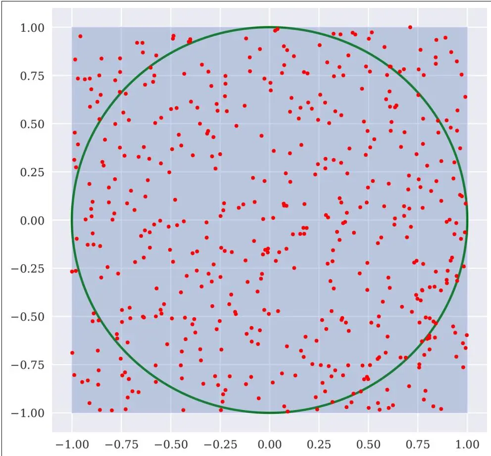
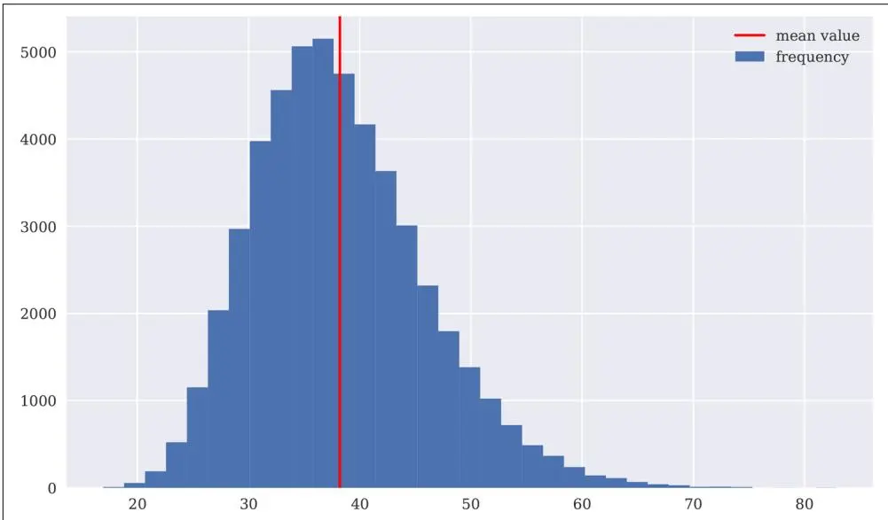
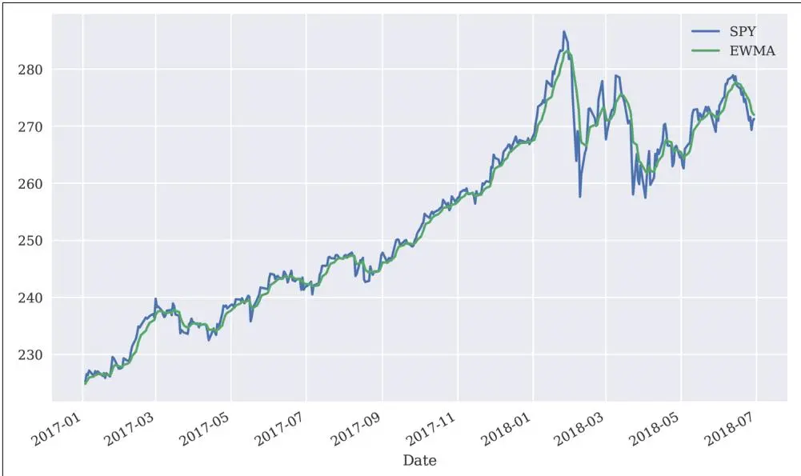

# Python性能优化


不要降低你的期望去适应你的表现。提升你的表现去达到你的期望。
—Ralph Marston


长期以来存在一种偏见，认为Python本身是一种相对较慢的编程语言，不适合实现金融中的计算密集型任务。除了Python是一种解释型语言这一事实外，推理通常沿着以下思路进行：Python在处理循环时很慢；而实现金融算法通常需要循环；因此Python对于金融算法实现来说太慢了。另一种推理思路是：其他（编译型）编程语言（如C或C++）在执行循环时很快；而金融算法通常需要循环；因此这些（编译型）编程语言非常适合金融和金融算法实现。

诚然，确实可以编写执行相当缓慢的Python代码——对于许多应用领域来说可能太慢了。本章介绍如何加速金融环境中常见的典型任务和算法。它表明，通过明智地使用数据结构、选择正确的实现惯用法和范式，以及使用正确的性能包，Python甚至能够与编译型编程语言竞争。这其中的原因之一就是Python本身也可以被编译。

为此，本章介绍了加速代码的不同方法：

## 向量化

利用Python的向量化（vectorization）能力是前面章节中已经广泛使用的一种方法。

动态编译（Dynamic compiling） 使用Numba包可以通过LLVM技术动态编译纯Python代码。

Cython 不仅是一个Python包，更是一种混合了Python和C的语言；例如，它允许使用静态类型声明并静态编译此类调整后的代码。

多进程处理（Multiprocessing） Python的multiprocessing模块可以轻松实现代码执行的并行化。

本章涉及以下主题：

"循环"一节 本节讨论Python循环以及如何加速它们。

"算法"一节 本节关注常用于性能基准测试的标准数学算法，如斐波那契数列生成。

"二叉树模型"一节 二叉树期权定价模型是一种广泛使用的金融模型，为更复杂的金融算法提供了一个有趣的案例研究。

"蒙特卡洛模拟"一节 同样，蒙特卡洛模拟在金融实践中广泛用于定价和风险管理。它的计算需求很高，长期以来被认为是C或C++等语言的领域。

本节讨论基于金融时间序列数据的递归算法的加速。特别是，它介绍了计算指数加权移动平均（EWMA, Exponentially Weighted Moving Average）的不同实现。

## 循环

本节解决Python循环问题。任务相当简单：编写一个函数，抽取一定"大"数量的随机数并返回这些值的平均值。执行时间是关注的重点，可以通过魔法函数%time和%timeit来估计。

### Python

让我们开始"慢速"进行——请原谅这个双关语。在纯Python中，这样的函数可能看起来像average_py()：

```txt
In [1]: import random

In [2]: def average_py(n):
    s = 0 ①
    for i in range(n):
    s += random.random() ②
    return s / n ③

In [3]: n = 10000000 ④

In [4]: %time average_py(n) ⑤
    CPU times: user 1.82 s, sys: 10.4 ms, total: 1.83 s
    Wall time: 1.93 s

Out[4]: 0.5000590124747943

In [5]: %timeit average_py(n) ⑥
    1.31 s ± 159 ms per loop (mean ± std. dev. of 7 runs, 1 loop each)

In [6]: %time sum([random.random() for_ in range(n)]) / n ⑦
    CPU times: user 1.55 s, sys: 188 ms, total: 1.74 s
    Wall time: 1.74 s

Out[6]: 0.49987031710661173
```

① 初始化变量s的值。

② 将区间(0, 1)内的均匀分布随机值累加到s中。

③ 返回平均值（均值）。

④ 定义循环的迭代次数。

⑤ 计时函数执行一次。

⑥ 计时函数多次执行以获得更可靠的估计。

⑦ 使用列表推导式（list comprehension）代替函数。

这为后续的其他方法设定了基准。

### NumPy

NumPy的优势在于其向量化能力。形式上，循环在Python层面消失了；循环在更深层次上基于NumPy提供的优化和编译好的例程进行。<sup>1</sup> 函数average_np()利用了这种方法：

```python
In [7]: import numpy as np

In [8]: def average_np(n):
    s = np.random.random(n)
    return s.mean() ①
In [9]: %time average_np(n)
CPU times: user 180 ms, sys: 43.2 ms, total: 223 ms
Wall time: 224 ms

Out[9]: 0.49988861556468317

In [10]: %timeit average_np(n)
128 ms ± 2.01 ms per loop (mean ± std. dev. of 7 runs, 10 loops each)

In [11]: s = np.random.random(n)
s.nbytes ③
Out[11]: 80000000
```

① "一次性"抽取所有随机数（无Python循环）。

② 返回平均值（均值）。

③ 创建的ndarray对象所使用的字节数。

加速效果相当显著，几乎达到了近10倍或者说一个数量级。然而，需要付出的代价是显著更高的内存使用量。这是因为NumPy通过预先分配数据来实现速度提升，这些数据可以在编译层中处理。因此，在这种方法下，无法处理"流式"数据。根据所处理的算法或问题，这种增加的内存使用量甚至可能变得过高而无法接受。



### 向量化与内存

尽可能使用NumPy编写向量化代码是很诱人的，因为语法简洁且通常能观察到速度提升。然而，这些好处往往以更高的内存占用为代价。


### Numba

Numba是一个允许通过LLVM动态编译纯Python代码的包。在像当前这样的简单情况下，应用起来出奇地直接，动态编译的函数average_nb()可以直接从Python调用：

```txt
In [12]: import numba

In [13]: average_nb = numba.jit(average_py) ①

In [14]: %time average_nb(n) ②
CPU times: user 204 ms, sys: 34.3 ms, total: 239 ms
Wall time: 278 ms

Out[14]: 0.4998865391283664

In [15]: %time average_nb(n) ③
CPU times: user 80.9 ms, sys: 457 μs, total: 81.3 ms
Wall time: 81.7 ms

Out[15]: 0.5001357454250273

In [16]: %timeit average_nb(n) ③
75.5 ms ± 1.95 ms per loop (mean ± std. dev. of 7 runs, 10 loops each)
```

① 创建Numba函数。

② 编译在运行时发生，导致一些开销。

③ 从第二次执行开始（使用相同的输入数据类型），执行速度更快。

纯Python与Numba的结合击败了NumPy版本，并保留了原始基于循环实现的内存效率。同样明显的是，在这种简单情况下应用Numba几乎没有任何编程开销。



### 没有免费的午餐

当比较Python代码与编译版本的性能时，Numba的应用有时看起来像魔法，特别是考虑到它的易用性。然而，有许多用例Numba并不适用，在这些情况下很难观察到性能提升，甚至完全无法实现。


### Cython

Cython允许静态编译Python代码。然而，应用起来并不像Numba那么简单，因为通常需要修改代码才能看到显著的加速效果。首先，考虑Cython函数average_cy1()，它为使用的变量引入了静态类型声明：

```txt
In [17]: %load_ext Cython
```

```python
In [18]: %%cython -a
    import random ①
    def average_cy1(int n): ②
    cdef int i ②
    cdef float s = 0 ②
    for i in range(n):
    s += random.random()
    return s / n
Out[18]: <IPython.core.display.HTML object>
```

```txt
In [19]: %time average_cy1(n)
CPU times: user 695 ms, sys: 4.31 ms, total: 699 ms
Wall time: 711 ms
```

```javascript
Out[19]: 0.49997106194496155
```

```txt
In [20]: %timeit average_cy1(n)
752 ms ± 91.1 ms per loop (mean ± std. dev. of 7 runs, 1 loop each)
```

① 在Cython上下文中导入random模块。

② 为变量n、i、s添加静态类型声明。

观察到了一些加速，但远不及NumPy版本所达到的效果。需要更多的Cython优化才能甚至击败Numba版本：

```python
In [21]: %%cython
    from libc.stdlib cimport rand ①
    cdef extern from 'limits.h': ②
    int INT_MAX ②
    cdef int i
    cdef float rn
    for i in range(5):
    rn = rand() / INT_MAX ③
    print(rn)
    0.67929643392562870.9346929192543030.38350206613540650.51941639184951780.8309653401374817
```

```python
In [22]: %%cython -a
    from libc.stdlib cimport rand ①
    cdef extern from 'limits.h': ②
    int INT_MAX ②
    def average_cy2(int n):
    cdef int i
    cdef float s = 0
    for i in range(n):
    s += rand() / INT_MAX ③
    return s / n
Out[22]: <IPython.core.display.HTML object>
```

```txt
In [23]: %time average_cy2(n)
CPU times: user 78.5 ms, sys: 422 μs, total: 79 ms
Wall time: 79.1 ms
```

```javascript
Out[23]: 0.500017523765564
```

```txt
In [24]: %timeit average_cy2(n)
65.4 ms ± 706 μs per loop (mean ± std. dev. of 7 runs, 10 loops each)
```

① 从C导入随机数生成器。

② 导入用于缩放随机数的常量值。

③ 在缩放后，添加区间(0,1)内的均匀分布随机数。

这个进一步优化的Cython版本average_cy2()现在比Numba版本稍快一些。然而，付出的努力也更大一些。与NumPy版本相比，Cython也保留了原始基于循环实现的内存效率。



### Cython = Python + C

Cython允许开发者根据需要对代码进行尽可能多或尽可能少（视合理情况而定）的性能调整——例如，从纯Python版本开始，然后在代码中逐步添加越来越多的C元素。编译步骤本身也可以参数化，以进一步优化编译后的版本。


## 算法

本节将前一节中的性能提升技术应用于一些众所周知的数学问题和算法。这些算法经常用于性能基准测试。

### 素数

素数（prime number）不仅在理论数学中扮演着重要角色，也在许多应用计算机科学学科中发挥着重要作用，例如加密。素数是大于1的正自然数，只能被1和自身整除而没有余数。没有其他因数。虽然由于素数的稀有性，找到较大的素数很困难，但证明一个数不是素数却很容易。所需要的只是找到一个除1以外的因数，能够整除该数且余数为零。

#### Python

有几种算法实现可用于测试一个数是否为素数。以下是一个Python版本，从算法角度来说还不是最优的，但已经相当高效了。然而，对于较大素数p2，执行时间较长：

```python
In [25]: def is_prime(I):
    if I % 2 == 0: return False ①
    for i in range(3, int(I ** 0.5) + 1, 2): ②
    if I % i == 0: return False ③
    return True ④

In [26]: n = int(1e8 + 3) ⑤
n
Out[26]: 100000003

In [27]: %time is_prime(n)
CPU times: user 35 μs, sys: 0 ns, total: 35 μs
Wall time: 39.1 μs

Out[27]: False

In [28]: p1 = int(1e8 + 7) ⑤
p1
Out[28]: 100000007

In [29]: %time is_prime(p1)
CPU times: user 776 μs, sys: 1 μs, total: 777 μs
Wall time: 787 μs

Out[29]: True

In [30]: p2 = 100109100129162907 ⑥

In [31]: p2.bit_length() ⑥
Out[31]: 57

In [32]: %time is_prime(p2)
CPU times: user 22.6 s, sys: 44.7 ms, total: 22.6 s
Wall time: 22.7 s
```

```txt
Out[32]: True
```

① 如果数字是偶数，立即返回False。

② 循环从3开始，步长为2，直到I的平方根加1。

③ 一旦找到因数，函数返回False。

④ 如果没有找到因数，返回True。

⑤ 相对较小的非素数和素数。

⑥ 一个需要较长执行时间的较大素数。

#### Numba

函数is_prime()中的循环结构非常适合使用Numba进行动态编译。开销再次很小，但加速效果显著：

```txt
In [33]: is_prime_nb = numba.jit(is_prime)

In [34]: %time is_prime_nb(n) ①
CPU times: user 87.5 ms, sys: 7.91 ms, total: 95.4 ms
Wall time: 93.7 ms

Out[34]: False

In [35]: %time is_prime_nb(n) ②
CPU times: user 9 μs, sys: 1e+03 ns, total: 10 μs
Wall time: 13.6 μs

Out[35]: False

In [36]: %time is_prime_nb(p1)
CPU times: user 26 μs, sys: 0 ns, total: 26 μs
Wall time: 31 μs

Out[36]: True

In [37]: %time is_prime_nb(p2) ③
CPU times: user 1.72 s, sys: 9.7 ms, total: 1.73 s
Wall time: 1.74 s

Out[37]: True
```

① 第一次调用is_prime_nb()包含编译开销。

② 从第二次调用开始，加速效果完全显现。

③ 对于较大素数的加速约为一个数量级。

#### Cython

Cython的应用也很直接。一个没有类型声明的普通Cython版本已经显著加速了代码：

```txt
In [38]: %%cython
    def is_prime_cy1(I):
    if I % 2 == 0: return False
    for i in range(3, int(I ** 0.5) + 1, 2):
    if I % i == 0: return False
    return True

In [39]: %timeit is_prime(p1)
    394 μs ± 14.7 μs per loop (mean ± std. dev. of 7 runs, 1000 loops each)

In [40]: %timeit is_prime_cy1(p1)
    243 μs ± 6.58 μs per loop (mean ± std. dev. of 7 runs, 1000 loops each)
```

然而，真正的改进只有引入静态类型声明后才能实现。Cython版本甚至比Numba版本略快：

```txt
In [41]: %%cython
    def is_prime_cy2(long I): ①
    cdef long i ①
    if I % 2 == 0: return False
    for i in range(3, int(I ** 0.5) + 1, 2):
    if I % i == 0: return False
    return True

In [42]: %%timeit is_prime_cy2(p1)
    87.6 μs ± 27.7 μs per loop (mean ± std. dev. of 7 runs, 10000 loops each)

In [43]: %%time is_prime_nb(p2)
    CPU times: user 1.68 s, sys: 9.73 ms, total: 1.69 s
    Wall time: 1.7 s

Out[43]: True

In [44]: %%time is_prime_cy2(p2)
    CPU times: user 1.66 s, sys: 9.47 ms, total: 1.67 s
    Wall time: 1.68 s

Out[44]: True
```

① 两个变量I和i的静态类型声明。

### 多进程处理

到目前为止，所有优化工作都集中在顺序代码执行上。特别是在素数检测中，可能需要同时检查多个数字。为此，multiprocessing模块可以帮助进一步加速代码执行。它允许生成多个并行运行的Python进程。在当前这个简单案例中，应用起来很直接。首先，设置一个包含多个进程的mp.Pool对象。其次，将要执行的函数映射到待检查的素数列表上：

```txt
In [45]: import multiprocessing as mp

In [46]: pool = mp.Pool(processes=4) ①
In [47]: %time pool.map(is_prime, 10 * [p1]) ②
CPU times: user 1.52 ms, sys: 2.09 ms, total: 3.61 ms
Wall time: 9.73 ms
Out[47]: [True, True, True, True, True, True, True, True, True, True]
In [48]: %time pool.map(is_prime_nb, 10 * [p2]) ②
CPU times: user 13.9 ms, sys: 4.8 ms, total: 18.7 ms
Wall time: 10.4 s
Out[48]: [True, True, True, True, True, True, True, True, True, True]
In [49]: %time pool.map(is_prime_cy2, 10 * [p2]) ②
CPU times: user 9.8 ms, sys: 3.22 ms, total: 13 ms
Wall time: 9.51 s
Out[49]: [True, True, True, True, True, True, True, True, True]
```

① 使用多个进程实例化mp.Pool对象。

② 然后将相应的函数映射到包含素数的列表对象上。

观察到的加速效果显著。Python函数is_prime()对于较大的素数p2需要超过20秒。而is_prime_nb()和is_prime_cy2()函数在4个进程并行执行时，对10倍数量的素数p2进行处理，耗时不到10秒。



### 并行处理

每当需要解决多个相同类型的问题时，应考虑并行处理（parallel processing）。当拥有具有多核和足够工作内存的强大硬件时，效果非常显著。multiprocessing是标准库中一个易于使用的模块。


### 斐波那契数列

斐波那契数列（Fibonacci numbers）和序列可以基于一个简单的算法推导。从两个1开始：1, 1。从第三个数开始，下一个斐波那契数由前两个数之和得到：1, 1, 2, 3, 5, 8, 13, 21, ...。本节分析两种不同的实现：递归实现和迭代实现。

#### 递归算法

与常规Python循环类似，众所周知常规的递归（recursive）函数实现在Python中相对较慢。这类函数会重复调用自身多次以得出最终结果。函数fib_rec_py1()展示了这种实现。在这种情况下，Numba对加速执行没有任何帮助。然而，Cython仅基于静态类型声明就显示出显著的加速：

```txt
In [50]: def fib_rec_py1(n):
    if n < 2:
    return n
    else:
    return fib_rec_py1(n - 1) + fib_rec_py1(n - 2)

In [51]: %time fib_rec_py1(35)
CPU times: user 6.55 s, sys: 29 ms, total: 6.58 s
Wall time: 6.6 s

Out[51]: 9227465

In [52]: fib_rec_nb = numba.jit(fib_rec_py1)

In [53]: %time fib_rec_nb(35)
CPU times: user 3.87 s, sys: 24.2 ms, total: 3.9 s
Wall time: 3.91 s

Out[53]: 9227465

In [54]: %%cython
def fib_rec_cy(int n):
    if n < 2:
    return n
    else:
    return fib_rec_cy(n - 1) + fib_rec_cy(n - 2)

In [55]: %time fib_rec_cy(35)
CPU times: user 751 ms, sys: 4.37 ms, total: 756 ms
Wall time: 755 ms

Out[55]: 9227465
```

递归算法的主要问题是中间结果没有被缓存而是被重新计算。为了避免这个问题，可以使用一个装饰器来处理中间结果的缓存。这将执行速度提升了多个数量级：

```python
In [56]: from functools import lru_cache as cache

In [57]: @cache(maxsize=None) ①
    def fib_rec_py2(n):
    if n < 2:
    return n
    else:
    return fib_rec_py2(n - 1) + fib_rec_py2(n - 2)
```

```txt
In [58]: %time fib_rec_py2(35) ②
CPU times: user 64 μs, sys: 28 μs, total: 92 μs
Wall time: 98 μs

In [59]: %time fib_rec_py2(80) ②
CPU times: user 38 μs, sys: 8 μs, total: 46 μs
Wall time: 51 μs

Out[59]: 23416728348467685
```

① 缓存中间结果...

② ...在这种情况下带来了巨大的加速。

#### 迭代算法

虽然计算第n个斐波那契数的算法可以递归实现，但并非必须如此。下面是一个迭代（iterative）实现，即使在纯Python中也比带缓存的递归实现更快。这也是Numba可以进一步改进的领域。然而，Cython版本胜出：

```txt
In [60]: def fib_it_py(n):
    x, y = 0, 1
    for i in range(1, n + 1):
    x, y = y, x + y
    return x

In [61]: %time fib_it_py(80)
CPU times: user 19 μs, sys: 1e+03 ns, total: 20 μs
Wall time: 26 μs

Out[61]: 23416728348467685
```

```python
In [62]: fib_it_nb = numba.jit(fib_it_py)
```

```txt
In [63]: %time fib_it_nb(80)
CPU times: user 57 ms, sys: 6.9 ms, total: 63.9 ms
Wall time: 62 ms
```

```javascript
Out[63]: 23416728348467685
```

```txt
In [64]: %time fib_it_nb(80)
CPU times: user 7 μs, sys: 1 μs, total: 8 μs
Wall time: 12.2 μs
```

```javascript
Out[64]: 23416728348467685
```

```python
In [65]: %%cython
    def fib_it_cy1(int n):
    cdef long i
    cdef long x = 0, y = 1
    for i in range(1, n + 1):
    x, y = y, x + y
    return x
```

```txt
In [66]: %time fib_it_cy1(80)
CPU times: user 4 μs, sys: 1e+03 ns, total: 5 μs
Wall time: 11 μs
```

```javascript
Out[66]: 23416728348467685
```

现在一切都这么快了，人们可能会想为什么只计算第80个斐波那契数，而不计算例如第150个。问题在于可用的数据类型。虽然Python基本上可以处理任意大的数字（参见[第2章](ch02.md)的"基本数据类型"），但对于编译型语言来说，情况通常并非如此。然而，使用Cython，我们可以依赖一种特殊的数据类型来处理超出64位双精度浮点数所能允许范围的更大数字：

```txt
In [67]: %%time
    fn = fib_rec_py2(150) ①
    print(fn) ①
    9969216677189303386214405760200
    CPU times: user 361 µs, sys: 115 µs, total: 476 µs
    Wall time: 430 µs

In [68]: fn.bit_length() ②
Out[68]: 103

In [69]: %%time
    fn = fib_it_nb(150) ③
    print(fn) ③
    6792540214324356296
    CPU times: user 270 µs, sys: 78 µs, total: 348 µs
    Wall time: 297 µs
```

```python
In [70]: fn.bit_length() ④
Out[70]: 63

In [71]: %%time
    fn = fib_it_cy1(150) ③
    print(fn) ③
    6792540214324356296
    CPU times: user 255 μs, sys: 71 μs, total: 326 μs
    Wall time: 279 μs

In [72]: fn.bit_length() ④
Out[72]: 63

In [73]: %%cython
    cdef extern from *:
    ctypedef int int128 '__int128_t' ⑤
    def fib_it_cy2(int n):
    cdef int128 i ⑤
    cdef int128 x = 0, y = 1 ⑤
    for i in range(1, n + 1):
    x, y = y, x + y
    return x

In [74]: %%time
    fn = fib_it_cy2(150) ⑥
    print(fn) ⑥
    9969216677189303386214405760200
    CPU times: user 280 μs, sys: 115 μs, total: 395 μs
    Wall time: 328 μs

In [75]: fn.bit_length() ⑥
Out[75]: 103
```

① Python版本快速且正确。

② 结果的整数位长为103（> 64）。

③ Numba和Cython版本更快但不正确。

④ 它们因受限于64位整数对象而出现溢出（overflow）问题。

⑤ 导入特殊的128位整数对象类型并使用它。

⑥ Cython版本fib_it_cy2()现在更快且正确。

### 圆周率Pi

本节分析的最后一个算法是基于蒙特卡洛模拟的算法，用于推导圆周率π的数字。<sup>2</sup> 基本思想依赖于圆的面积公式A = πr²。因此，π = A/r²。对于半径为r = 1的单位圆，有π = A。该算法的思想是模拟坐标值(x, y)的随机点，其中x, y ∈ [-1, 1]。边长为2的中心在原点的正方形面积正好是4。中心在原点的单位圆的面积是该正方形面积的一部分。这个比例可以通过蒙特卡洛模拟来估计：计算正方形中的所有点，然后计算圆中的点数，并将圆中的点数除以正方形中的点数。以下示例展示了（见图10-1）：

```python
In [76]: import random
    import numpy as np
    from pylab import mpl, plt
    plt.style.use('seaborn')
    mpl.rcParams['font.family'] = 'serif'
    %matplotlib inline

In [77]: rn = [(random.random() * 2 - 1, random.random() * 2 - 1)
    for_ in range(500)]

In [78]: rn = np.array(rn)
    rn[:5]

Out[78]: array([[0.45583018, -0.27676067],
    [-0.70120038, 0.15196888],
    [0.07224045, 0.90147321],
    [-0.17450337, -0.47660912],
    [0.94896746, -0.31511879]])
In [79]: fig = plt.figure(figsize=(7, 7))
    ax = fig.add_subplot(1, 1, 1)
    circ = plt.Circle((0, 0), radius=1, edgecolor='g', lw=2.0,
    facecolor='None') ①
    box = plt.Rectangle((-1, -1), 2, 2, edgecolor='b', alpha=0.3) ②
    ax.add_patch(circ) ①
    ax.add_patch(box) ②
    plt.plot(rn[:, 0], rn[:, 1], 'r.') ③
    plt.ylim(-1.1, 1.1)
    plt.xlim(-1.1, 1.1)
```

① 绘制单位圆。

② 绘制边长为2的正方形。

③ 绘制均匀分布的随机点。



图10-1 单位圆与边长为2的正方形及其均匀分布的随机点

这个算法的NumPy实现相当简洁，但也占用大量内存。在给定的参数化下，总执行时间约为1秒：

```python
In [80]: n = int(1e7)
In [81]: %time rn = np.random.random((n, 2)) * 2 - 1
CPU times: user 450 ms, sys: 87.9 ms, total: 538 ms
Wall time: 573 ms
In [82]: rn.nbytes
Out[82]: 160000000
In [83]: %time distance = np.sqrt((rn ** 2).sum(axis=1))
distance[:8].round(3)
```

```txt
CPU times: user 537 ms, sys: 198 ms, total: 736 ms
Wall time: 651 ms

Out[83]: array([1.181, 1.061, 0.669, 1.206, 0.799, 0.579, 0.694, 0.941])

In [84]: %time frac = (distance <= 1.0).sum() / len(distance) ②
CPU times: user 47.9 ms, sys: 6.77 ms, total: 54.7 ms
Wall time: 28 ms

In [85]: pi_mcs = frac * 4 ③
pi_mcs ③
Out[85]: 3.1413396
```

① 点到原点的距离（欧几里得范数（Euclidean norm））。

② 圆内点数与总点数的比例。

③ 这考虑了正方形面积为4的情况，用于估算圆的面积，从而估算π。

mcs_pi_py()是一个使用for循环并以内存高效方式实现蒙特卡洛模拟（Monte Carlo simulation）的Python函数。请注意，在这种情况下随机数没有被缩放。执行时间比NumPy版本长，但在这种情况下Numba版本比NumPy快：

```python
In [86]: def mcs_pi_py(n):
    circle = 0
    for_ in range(n):
    x, y = random.random(), random.random()
    if (x ** 2 + y ** 2) ** 0.5 <= 1:
    circle += 1
    return (4 * circle) / n

In [87]: %time mcs(pi_py(n))
CPU times: user 5.47 s, sys: 23 ms, total: 5.49 s
Wall time: 5.43 s

Out[87]: 3.1418964

In [88]: mcs(pi_nb = numba.jit(mcs(pi_py))

In [89]: %time mcs(pi_nb(n))
CPU times: user 319 ms, sys: 6.36 ms, total: 326 ms
Wall time: 326 ms

Out[89]: 3.1422012

In [90]: %time mcs(pi_nb(n))
CPU times: user 284 ms, sys: 3.92 ms, total: 288 ms
Wall time: 291 ms
```

```txt
Out[90]: 3.142066
```

只有静态类型声明的普通Cython版本并不比Python版本快多少。然而，再次依赖C的随机数生成能力显著加速了计算：

```python
In [91]: %%cython -a
import random
def mcs_pi_cy1(int n):
    cdef int i, circle = 0
    cdef float x, y
    for i in range(n):
    x, y = random.random(), random.random()
    if (x ** 2 + y ** 2) ** 0.5 <= 1:
    circle += 1
    return (4 * circle) / n

Out[91]: <IPython.core.display.HTML object>

In [92]: %time mcs_pi_cy1(n)
CPU times: user 1.15 s, sys: 8.24 ms, total: 1.16 s
Wall time: 1.16 s

Out[92]: 3.1417132

In [93]: %%cython -a
from libcstdlib cimport rand
cdef extern from 'limits.h':
    int INT_MAX
def mcs(pi_cy2(int n):
    cdef int i, circle = 0
    cdef float x, y
    for i in range(n):
    x, y = rand() / INT_MAX, rand() / INT_MAX
    if (x ** 2 + y ** 2) ** 0.5 <= 1:
    circle += 1
    return (4 * circle) / n

Out[93]: <IPython.core.display.HTML object>

In [94]: %time mcs(pi_cy2(n))
CPU times: user 170 ms, sys: 1.45 ms, total: 172 ms
Wall time: 172 ms

Out[94]: 3.1419388
```



### 算法类型

本节分析的算法可能与金融算法没有直接关系。然而，它们的优势在于简单且易于理解。此外，在金融环境中遇到的典型算法问题可以在这种简化的背景下进行讨论。


## 二叉树模型

一种流行的期权定价数值方法是Cox、Ross和Rubinstein（1979）开创的二叉树期权定价模型（binomial option pricing model）。该方法通过一个（重组）树来表示资产可能的未来演变。在这个模型中，与Black-Scholes-Merton（1973）框架一样，存在一个风险资产（指数或股票）和一个无风险资产（债券）。从今天到期权到期日的相关时间间隔通常被划分为长度为Δt的等距子间隔。给定在时间s的指数水平S_s，在t = s + Δt时的指数水平由S_t = S_s · m给出，其中m从{u, d}中随机选择，满足0 < d < e^{rΔt} < u = e^{σ√Δt}以及u = 1/d。r是恒定的无风险短期利率。

### Python

以下代码提供了一个Python实现，基于模型的一些固定数值参数创建一个重组树：

```python
In [95]: import math

In [96]: S0 = 36. ①
    T = 1.0 ②
    r = 0.06 ③
    sigma = 0.2 ④

In [97]: def simulate_tree(M):
    dt = T / M ⑤
    u = math.exp(sigma * math.sqrt(dt)) ⑥
    d = 1 / u ⑦
    S = np.zeros((M + 1, M + 1))
    S[0, 0] = S0
    z = 1
    for t in range(1, M + 1):
    for i in range(z):
    S[i, t] = S[i, t-1] * u
    S[i+1, t] = S[i, t-1] * d
    z += 1
    return S
```

① 风险资产的初始价值。

② 二叉树模拟的时间跨度。

③ 恒定短期利率。

④ 恒定波动率因子。

⑤ 时间间隔的长度。

⑥ 向上和向下运动的因子。

与典型的树图不同，在ndarray对象中，向上运动被表示为横向运动，这大大减小了ndarray的大小：

```python
In [98]: np.set_printoptions(formatter={'float': lambda x: '%6.2f' % x})

In [99]: simulate_tree(4) ①
Out[99]: array([[36.00, 39.79, 43.97, 48.59, 53.71],
    [0.00, 32.57, 36.00, 39.79, 43.97],
    [0.00, 0.00, 29.47, 32.57, 36.00],
    [0.00, 0.00, 0.00, 26.67, 29.47],
    [0.00, 0.00, 0.00, 0.00, 24.13]])

In [100]: %time simulate_tree(500) ②
CPU times: user 148 ms, sys: 4.49 ms, total: 152 ms
Wall time: 154 ms

Out[100]: array([[36.00, 36.32, 36.65, ..., 3095.69, 3123.50, 3151.57],
    [0.00, 35.68, 36.00, ..., 3040.81, 3068.13, 3095.69],
    [0.00, 0.00, 35.36, ..., 2986.89, 3013.73, 3040.81],
    ...,
    [0.00, 0.00, 0.00, ..., 0.42, 0.42, 0.43],
    [0.00, 0.00, 0.00, ..., 0.00, 0.41, 0.42],
    [0.00, 0.00, 0.00, ..., 0.00, 0.00, 0.41]])
```

① 4个时间间隔的树。

② 500个时间间隔的树。

### NumPy

通过一些技巧，可以基于完全向量化的代码使用NumPy创建这样的二叉树：

```python
In [101]: M = 4
In [102]: up = np.arange(M + 1)
    up = np.resize(up, (M + 1, M + 1))
    up
Out[102]: array([[0, 1, 2, 3, 4],
    [0, 1, 2, 3, 4],
    [0, 1, 2, 3, 4],
    [0, 1, 2, 3, 4],
    [0, 1, 2, 3, 4]])
In [103]: down = up.T * 2
down
Out[103]: array([[0, 0, 0, 0, 0],
```

```txt
[2, 2, 2, 2, 2],
[4, 4, 4, 4, 4],
[6, 6, 6, 6, 6],
[8, 8, 8, 8, 8]])
In [104]: up - down
Out[104]: array([[0, 1, 2, 3, 4],
[-2, -1, 0, 1, 2],
[-4, -3, -2, -1, 0],
[-6, -5, -4, -3, -2],
[-8, -7, -6, -5, -4]])
In [105]: dt = T / M
In [106]: S0 * np.exp(sigma * math.sqrt(dt) * (up - down))
Out[106]: array([[36.00, 39.79, 43.97, 48.59, 53.71],
[29.47, 32.57, 36.00, 39.79, 43.97],
[24.13, 26.67, 29.47, 32.57, 36.00],
[19.76, 21.84, 24.13, 26.67, 29.47],
[16.18, 17.88, 19.76, 21.84, 24.13]])
```

① 包含总向上运动的ndarray对象。

② 包含总向下运动的ndarray对象。

③ 包含净向上（正）和净向下（负）运动的ndarray对象。

④ 四个时间间隔的树（值的右上三角部分）。

在NumPy情况下，代码更紧凑一些。然而，更重要的是，NumPy向量化实现了数量级的加速，同时没有使用更多内存：

```python
In [107]: def simulate_tree_np(M):
    dt = T / M
    up = np.arange(M + 1)
    up = np.resize(up, (M + 1, M + 1))
    down = up.transpose() * 2
    S = S0 * np.exp(sigma * math.sqrt(dt) * (up - down))
    return S

In [108]: simulate_tree_np(4)
Out[108]: array([[36.00, 39.79, 43.97, 48.59, 53.71],
    [29.47, 32.57, 36.00, 39.79, 43.97],
    [24.13, 26.67, 29.47, 32.57, 36.00],
    [19.76, 21.84, 24.13, 26.67, 29.47],
    [16.18, 17.88, 19.76, 21.84, 24.13]])
In [109]: %time simulate_tree_np(500)
CPU times: user 8.72 ms, sys: 7.07 ms, total: 15.8 ms
Wall time: 12.9 ms
```

```python
In [110]: simulate_tree_nb = numba.jit(simulate_tree)

In [111]: simulate_tree_nb(4)
Out[111]: array([[ 36.00, 39.79, 43.97, 48.59, 53.71],
    [ 0.00, 32.57, 36.00, 39.79, 43.97],
    [ 0.00, 0.00, 29.47, 32.57, 36.00],
    [ 0.00, 0.00, 0.00, 26.67, 29.47],
    [ 0.00, 0.00, 0.00, 0.00, 24.13]])
```

```txt
Out[109]: array([[36.00, 36.32, 36.65, ..., 3095.69, 3123.50, 3151.57],
    [35.36, 35.68, 36.00, ..., 3040.81, 3068.13, 3095.69],
    [34.73, 35.05, 35.36, ..., 2986.89, 3013.73, 3040.81],
    ...
    [0.00, 0.00, 0.00, ..., 0.42, 0.42, 0.43],
    [0.00, 0.00, 0.00, ..., 0.41, 0.41, 0.42],
    [0.00, 0.00, 0.00, ..., 0.40, 0.41, 0.41]])
```

### Numba

这种金融算法应该非常适合通过Numba动态编译进行优化。确实，与NumPy版本相比，又观察到了一个数量级的加速。这使得Numba版本比Python（或者说混合）版本快多个数量级：

```txt
In [112]: %time simulate_tree_nb(500)
CPU times: user 425 μs, sys: 193 μs, total: 618 μs
Wall time: 625 μs

Out[112]: array([[36.00, 36.32, 36.65, ..., 3095.69, 3123.50, 3151.57],
    [0.00, 35.68, 36.00, ..., 3040.81, 3068.13, 3095.69],
    [0.00, 0.00, 35.36, ..., 2986.89, 3013.73, 3040.81],
    ...
    [0.00, 0.00, 0.00, ..., 0.42, 0.42, 0.43],
    [0.00, 0.00, 0.00, ..., 0.00, 0.41, 0.42],
    [0.00, 0.00, 0.00, ..., 0.00, 0.00, 0.41]])
```

In [113]: %timeit simulate_tree_nb(500)
559 $\mu$ s ± 46.1 $\mu$ s per loop (mean ± std. dev. of 7 runs, 1000 loops each)

### Cython

和之前一样，Cython需要对代码进行更多调整才能看到显著的改进。以下版本主要使用静态类型声明和某些导入，相比于常规的Python导入和函数，这些导入提升了性能：

```python
In [114]: %%cython -a
import numpy as np
cimport cython
from libc.math cimport exp, sqrt

cdef float S0 = 36.
cdef float T = 1.0
cdef float r = 0.06
cdef float sigma = 0.2
def simulate_tree_cy(int M):
    cdef int z, t, i
    cdef float dt, u, d
    cdef float[:, :] S = np.zeros((M + 1, M + 1), dtype=np.float32)
    dt = T / M
    u = exp(sigma * sqrt(dt))
    d = 1 / u
    S[0, 0] = S0
    z = 1
    for t in range(1, M + 1):
    for i in range(z):
    S[i, t] = S[i, t-1] * u
    S[i+1, t] = S[i, t-1] * d
    z += 1
    return np.array(S)
Out[114]: <IPython.core.display.HTML object>
```

① 将ndarray对象声明为C数组对性能至关重要。

Cython版本相比Numba版本又削减了约30%的执行时间：

```python
In [115]: simulate_tree_cy(4)
Out[115]: array([[36.00, 39.79, 43.97, 48.59, 53.71],
    [0.00, 32.57, 36.00, 39.79, 43.97],
    [0.00, 0.00, 29.47, 32.57, 36.00],
    [0.00, 0.00, 0.00, 26.67, 29.47],
    [0.00, 0.00, 0.00, 0.00, 24.13]], dtype=float32)
```

```txt
In [116]: %time simulate_tree_cy(500)
CPU times: user 2.21 ms, sys: 1.89 ms, total: 4.1 ms
Wall time: 2.45 ms

Out[116]: array([[36.00, 36.32, 36.65, ..., 3095.77, 3123.59, 3151.65],
    [0.00, 35.68, 36.00, ..., 3040.89, 3068.21, 3095.77],
    [0.00, 0.00, 35.36, ..., 2986.97, 3013.81, 3040.89],
    ...
    [0.00, 0.00, 0.00, ..., 0.42, 0.42, 0.43],
    [0.00, 0.00, 0.00, ..., 0.00, 0.41, 0.42],
    [0.00, 0.00, 0.00, ..., 0.00, 0.00, 0.41]],
    dtype=float32)

In [117]: %timeit S = simulate_tree_cy(500)
363 μs ± 29.5 μs per loop (mean ± std. dev. of 7 runs, 1000 loops each)
```

## 蒙特卡洛模拟

蒙特卡洛模拟（Monte Carlo simulation）是计算金融中不可或缺的数值工具。它在现代计算机出现之前就已经被使用了很长时间。银行和其他金融机构将其用于定价和风险管理等方面。作为一种数值方法，它可能是金融中最灵活、最强大的方法。然而，它通常也是计算量最大的方法。这就是为什么长期以来Python被认为不适合实现基于蒙特卡洛模拟的算法——至少对于实际应用场景来说是如此。

本节分析了几何布朗运动（geometric Brownian motion）的蒙特卡洛模拟，这是一种简单但仍然广泛使用的随机过程，用于模拟股票价格或指数水平的演变。Black-Scholes-Merton（1973）期权定价理论等就基于这一过程。在他们的框架中，待定价期权的标的资产遵循随机微分方程（SDE, stochastic differential equation），如方程10-1所示。S_t是t时刻标的资产的价值；r是恒定的无风险短期利率；σ是恒定的瞬时波动率；Z_t是布朗运动。

**方程10-1. Black-Scholes-Merton SDE（几何布朗运动）**

$$ $$
d S_{t} = r S_{t} d t + \sigma S_{t} d Z_{t}


该SDE可以在等距时间间隔上离散化并按方程10-2进行模拟，这代表了一个欧拉方案（Euler scheme）。在这种情况下，z是一个标准正态分布的随机数。对于M个时间间隔，时间间隔的长度由Δt ≡ T/M给出，其中T是模拟的时间跨度（例如，待定价期权的到期日）。

**方程10-2. Black-Scholes-Merton差分方程（欧拉方案）**

$$ $$
S_{t} = S_{t - \Delta t} \exp \left(\left(r - \frac{\sigma^{2}}{2}\right) \Delta t + \sigma \sqrt{\Delta t} z\right)


欧式看涨期权的蒙特卡洛估计量则由方程10-3给出，其中S_T(i)是标的资产在到期日T的第i次模拟值，模拟路径总数为I，i = 1, 2, ..., I。

**方程10-3. 欧式看涨期权的蒙特卡洛估计量**

$$ $$
C_{0} = e^{- r T} \frac{1}{I} \sum_{I} \max \left(S_{T} (i) - K, 0\right)


### Python

首先，一个Python——或者更确切地说是混合——版本mcs_simulation_py()，它实现了根据方程10-2的蒙特卡洛模拟。之所以说它是混合的，是因为它在ndarray对象上实现了Python循环。如前所述，这可以为使用Numba动态编译代码提供良好的基础。和之前一样，执行时间设定了基准。基于该模拟，对一个欧式看跌期权进行定价：

```python
In [118]: M = 100
    I = 50000
In [119]: def mcs_simulation_py(p):
    M, I = p
    dt = T / M
    S = np.zeros((M + 1, I))
    S[0] = S0
    rn = np.random.standard_normal(S.shape)
    for t in range(1, M + 1):
    for i in range(I):
    S[t, i] = S[t-1, i] * math.exp((r - sigma ** 2 / 2) * dt + sigma * math.sqrt(dt) * rn[t, i])
    return S

In [120]: %time S = mcs_simulation_py((M, I))
    CPU times: user 5.55 s, sys: 52.9 ms, total: 5.6 s
    Wall time: 5.62 s

In [121]: S[-1].mean()
Out[121]: 38.22291254503985

In [122]: S0 * math.exp(r * T)
Out[122]: 38.22611567563295

In [123]: K = 40.
In [124]: C0 = math.exp(-r * T) * np.maximum(K - S[-1], 0).mean()
In [125]: C0 # 8
Out[125]: 3.860545188088036
```

① 用于离散化的时间间隔数。

② 待模拟的路径数量。

③ 随机数，一步向量化抽取。

④ 实现基于欧拉方案的嵌套循环模拟。

⑤ 基于模拟的期末价值均值。

⑥ 理论上预期的期末价值。

⑦ 欧式看跌期权的行权价。

⑧ 期权的蒙特卡洛估计量。

图10-2显示了模拟期末（欧式看跌期权的到期日）模拟值的频率分布直方图。



图10-2 模拟期末值的频率分布

### NumPy

NumPy版本mcs_simulation_np()并没有太大不同。它仍然有一个Python循环，即对时间间隔的循环。另一个维度通过向量化代码在所有路径上处理。它比第一个版本快了约20倍：

```python
In [127]: def mcs_simulation_np(p):
    M, I = p
    dt = T / M
    S = np.zeros((M + 1, I))
    S[0] = S0
    rn = np.random.standard_normal(S.shape)
    for t in range(1, M + 1): ①
    S[t] = S[t-1] * np.exp((r - sigma ** 2 / 2) * dt + sigma * math.sqrt(dt) * rn[t])
    return S
```

```txt
In [128]: %time S = mcs_simulation_np((M, I))

CPU times: user 252 ms, sys: 32.9 ms, total: 285 ms
Wall time: 252 ms

In [129]: S[-1].mean()
Out[129]: 38.235136032258595

In [130]: %timeit S = mcs_simulation_np((M, I))
202 ms ± 27.7 ms per loop (mean ± std. dev. of 7 runs, 1 loop each)
```

① 对时间间隔的循环。

② 使用向量化NumPy代码一次处理所有路径的欧拉方案。

### Numba

Numba容易应用于此类算法并带来显著的性能提升，这应该不再令人意外。Numba版本mcs_simulation_nb()比NumPy版本稍快：

```txt
In [131]: mcs_simulation_nb = numba.jit(mcs_simulation_py)

In [132]: %time S = mcs_simulation_nb((M, I)) ①
CPU times: user 673 ms, sys: 36.7 ms, total: 709 ms
Wall time: 764 ms

In [133]: %time S = mcs_simulation_nb((M, I)) ②
CPU times: user 239 ms, sys: 20.8 ms, total: 259 ms
Wall time: 265 ms

In [134]: S[-1].mean()
Out[134]: 38.22350694016539

In [135]: C0 = math.exp(-r * T) * np.maximum(K - S[-1], 0).mean()

In [136]: C0
Out[136]: 3.8303077438193833

In [137]: %timeit S = mcs_simulation_nb((M, I)) ②
248 ms ± 20.6 ms per loop (mean ± std. dev. of 7 runs, 1 loop each)
```

① 第一次调用包含编译开销。

② 第二次调用没有该开销。

### Cython

对于Cython，同样不令人意外的是，加速代码所需的工作量更大。然而，加速效果本身并不更大。Cython版本mcs_simulation_cy()似乎甚至比NumPy和Numba版本稍慢。

除其他因素外，将模拟结果转换为ndarray对象需要一些时间：

```python
In [138]: %%cython
import numpy as np
cimport numpy as np
cimport cython
from libc.math cimport exp, sqrt
cdef float S0 = 36.
cdef float T = 1.0
cdef float r = 0.06
cdef float sigma = 0.2
@cython.boundscheck(False)
@cython.wraparound(False)
def mcs_simulation_cy(p):
    cdef int M, I
    M, I = p
    cdef int t, i
    cdef float dt = T / M
    cdef double[:, :] S = np.zeros((M + 1, I))
    cdef double[:, :] rn = np.random.standard_normal((M + 1, I))
    S[0] = S0
    for t in range(1, M + 1):
    for i in range(I):
    S[t, i] = S[t-1, i] * exp((r - sigma ** 2 / 2) * dt + sigma * sqrt(dt) * rn[t, i])
    return np.array(S)

In [139]: %time S = mcs_simulation_cy((M, I))
CPU times: user 237 ms, sys: 65.2 ms, total: 302 ms
Wall time: 271 ms

In [140]: S[-1].mean()
Out[140]: 38.241735841791574

In [141]: %timeit S = mcs_simulation_cy((M, I))
221 ms ± 9.26 ms per loop (mean ± std. dev. of 7 runs, 1 loop each)
```

### 多进程处理

蒙特卡洛模拟是一种非常适合并行化的任务。一种方法是将例如100,000条路径的模拟并行化为10个进程，每个进程模拟10,000条路径。另一种方法是将100,000条路径的模拟并行化为多个进程，每个进程模拟不同的金融工具。前一种情况——即基于固定数量的独立进程并行模拟大量路径——将在下面进行说明。

以下代码再次利用了multiprocessing模块。它将待模拟的总路径数I分成大小为I/p的更小块，其中p > 0。所有单个任务完成后，结果通过np.hstack()组合到一个ndarray对象中。这种方法可以应用于前面介绍的任何版本。对于此处选择的特定参数化，通过这种并行化方法没有观察到加速：

```python
In [142]: import multiprocessing as mp
In [143]: pool = mp.Pool(processes=4) ①
In [144]: p = 20 ②
In [145]: %timeit S = np.hstack(pool.map(mcs_simulation_np, p * [(M, int(I / p))]))
288 ms ± 10.2 ms per loop (mean ± std. dev. of 7 runs, 1 loop each)
In [146]: %timeit S = np.hstack(pool.map(mcs_simulation_nb, p * [(M, int(I / p))]))
258 ms ± 8.69 ms per loop (mean ± std. dev. of 7 runs, 1 loop each)
In [147]: %timeit S = np.hstack(pool.map(mcs_simulation_cy, p * [(M, int(I / p))]))
274 ms ± 11.9 ms per loop (mean ± std. dev. of 7 runs, 1 loop each)
```

① 用于并行化的Pool对象。

② 模拟被分割成的块数。



### 多进程处理策略

在金融领域，有许多算法适合并行化。其中一些甚至允许应用不同的策略来并行化代码。蒙特卡洛模拟是一个很好的例子，多个模拟可以很容易地并行执行，无论是在单台机器上还是在多台机器上，而且算法本身允许将单个模拟分布到多个进程中。


## 递归pandas算法

本节讨论一个有些特殊但仍然重要的金融分析主题：在存储在pandas DataFrame对象中的金融时间序列数据上实现递归（recursive）函数。虽然pandas允许对DataFrame对象进行复杂的向量化操作，但某些递归算法很难或无法进行向量化，这使金融分析师不得不使用在DataFrame对象上缓慢执行的Python循环。以下示例以简单形式实现了所谓的指数加权移动平均（EWMA, Exponentially Weighted Moving Average）。

金融时间序列S_t, t ∈ {0, ..., T}的EWMA由方程10-4给出。

**方程10-4. 指数加权移动平均（EWMA）**

$EWM A_{0} = S_{0}$ $EWM A_{t} = \alpha \cdot S_{t} + (1 - \alpha)\cdot EWM A_{t - 1}, t\in \{1,\dots ,T\}$

虽然本质上很简单且实现直接，但这样的算法可能会导致代码相当缓慢。

### Python

首先考虑Python版本，它遍历包含单个金融工具金融时间序列数据的DataFrame对象的DatetimeIndex（参见[第8章](ch08.md)）。图10-3可视化了金融时间序列和EWMA时间序列：

```python
In [148]: import pandas as pd

In [149]: sym = 'SPY'

In [150]: data = pd.DataFrame(pd.read_csv('../source/tr_eikon_eod_data.csv', index_col=0, parse_dates=True)[sym]).dropna()

In [151]: alpha = 0.25

In [152]: data['EWMA'] = data[sym]

In [153]: %%time
    for t in zip(data.index, data.index[1:]):
    data.loc[t[1], 'EWMA'] = (alpha * data.loc[t[1], sym] + (1 - alpha) * data.loc[t[0], 'EWMA']) ②
    CPU times: user 588 ms, sys: 16.4 ms, total: 605 ms
    Wall time: 591 ms

In [154]: data.head()

Out[154]:    SPY    EWMA
    Date
    2010-01-04113.33113.3300002010-01-05113.63113.4050002010-01-06113.71113.4812502010-01-07114.19113.6584382010-01-08114.57113.886328
```

```javascript
In [155]: data[data.index > '2017-1-1'].plot(figsize=(10, 6));
```

① 初始化EWMA列。

② 基于Python循环实现算法。



图10-3 带有EWMA的金融时间序列

现在考虑更通用的Python函数ewma_py()。它可以直接应用于列或原始金融时间序列数据（以ndarray对象的形式）：

```python
In [156]: def ewma_py(x, alpha):
    y = np.zeros_like(x)
    y[0] = x[0]
    for i in range(1, len(x)):
    y[i] = alpha * x[i] + (1-alpha) * y[i-1]
    return y

In [157]: %time data['EWMA_PY'] = ewma_py(data[sym], alpha) ①
CPU times: user 33.1 ms, sys: 1.22 ms, total: 34.3 ms
Wall time: 33.9 ms

In [158]: %time data['EWMA_PY'] = ewma_py(data[sym].values, alpha) ②
CPU times: user 1.61 ms, sys: 44 μs, total: 1.65 ms
Wall time: 1.62 ms
```

① 将函数直接应用于Series对象（即列）。

② 将函数应用于包含原始数据的ndarray对象。

这种方法已经大大加速了代码执行——加速因子从约20倍到100多倍。

### Numba

该算法的结构本身预示着应用Numba可以进一步加速。确实，当函数ewma_nb()应用于数据的ndarray版本时，加速又达到了一个数量级：

```txt
In [159]: ewma_nb = numba.jit(ewma_py)

In [160]: %time data['EWMA_NB'] = ewma_nb(data[sym], alpha) ①
CPU times: user 269 ms, sys: 11.4 ms, total: 280 ms
Wall time: 294 ms

In [161]: %timeit data['EWMA_NB'] = ewma_nb(data[sym], alpha) ①
30.9 ms ± 1.21 ms per loop (mean ± std. dev. of 7 runs, 10 loops each)

In [162]: %time data['EWMA_NB'] = ewma_nb(data[sym].values, alpha) ②
CPU times: user 94.1 ms, sys: 3.78 ms, total: 97.9 ms
Wall time: 97.6 ms

In [163]: %timeit data['EWMA_NB'] = ewma_nb(data[sym].values, alpha) ②
134 μs ± 12.5 μs per loop (mean ± std. dev. of 7 runs, 10000 loops each)
```

① 将函数直接应用于Series对象（即列）。

② 将函数应用于包含原始数据的ndarray对象。

### Cython

Cython版本ewma_cy()也实现了可观的加速，但在这种情况下不如Numba版本快：

```python
In [164]: %%cython
import numpy as np
cimport cython
@cython.boundscheck(False)
@cython.wraparound(False)
def ewma_cy(double[:] x, float alpha):
    cdef int i
    cdef double[:] y = np.empty_like(x)
    y[0] = x[0]
    for i in range(1, len(x)):
    y[i] = alpha * x[i] + (1 - alpha) * y[i - 1]
    return y

In [165]: %time data['EWMA_CY'] = ewma_cy(data[sym].values, alpha)
CPU times: user 2.98 ms, sys: 1.41 ms, total: 4.4 ms
Wall time: 5.96 ms

In [166]: %timeit data['EWMA_CY'] = ewma_cy(data[sym].values, alpha)
1.29 ms ± 194 μs per loop (mean ± std. dev. of 7 runs, 1000 loops each)
```

这最后一个例子再次说明，通常有多种选项来实现（非标准）算法。所有选项可能产生完全相同的结果，但同时也显示出截然不同的性能特征。本例中的执行时间范围从0.1毫秒到500毫秒——相差5000倍。



### 最佳与次优

通常，将算法转换为Python编程语言很容易。然而，考虑到可用的性能选项菜单，同样容易以不必要缓慢的方式实现算法。对于交互式金融分析，次优（first-best）解决方案——即能达到目的但不一定是最快或最节省内存的方案——可能完全足够。对于生产环境中的金融应用，应该努力实现最佳（best）解决方案，尽管这可能涉及更多的研究和一些正式的基准测试。


## 结论

Python生态系统提供了多种改善代码性能的方法：

### 惯用法与范式

某些Python范式和惯用法在特定问题上可能比其他方法性能更好；例如，在许多情况下，向量化是一种不仅能使代码更简洁，而且能带来更高速度的范式（有时以更高的内存占用为代价）。

### 包

有大量的包可用于不同类型的问题，使用适合问题的包通常可以带来更高的性能；很好的例子包括带有ndarray类的NumPy和带有DataFrame类的pandas。

### 编译

加速金融算法的强大包包括用于动态和静态编译Python代码的Numba和Cython。

### 并行化

一些Python包，如multiprocessing，允许轻松并行化Python代码；本章中的示例仅使用单台机器上的并行化，但Python生态系统也提供了多机器（集群）并行化技术。

本章介绍的性能方法的一个主要好处是它们通常易于实现，这意味着所需的额外工作量通常很低。换句话说，鉴于当今可用的性能包，性能改进往往是"低垂的果实"。

## 补充资源

对于本章介绍的所有性能包，都有有用的网络资源可用：

• http://cython.org 是Cython包和编译器项目的首页。

• multiprocessing模块的文档可在 https://docs.python.org/3/library/multiprocessing.html 找到。

• Numba的相关信息可在 http://github.com/numba/numba 和 https://numba.pydata.org 找到。

书籍形式的参考资料如下：

• Gorelick, Misha, and Ian Ozsvald (2014). High Performance Python. Sebastopol, CA: O'Reilly.

• Smith, Kurt (2015). Cython. Sebastopol, CA: O'Reilly.

本章引用的原始论文：

• Black, Fischer, and Myron Scholes (1973). "The Pricing of Options and Corporate Liabilities." Journal of Political Economy, Vol. 81, No. 3, pp. 638–659.

• Cox, John, Stephen Ross, and Mark Rubinstein (1979). "Option Pricing: A Simplified Approach." Journal of Financial Economics, Vol. 7, No. 3, pp. 229–263.

• Merton, Robert (1973). "Theory of Rational Option Pricing." Bell Journal of Economics and Management Science, Vol. 4, pp. 141–183.
