# 数学工具


数学家是现代世界的祭司。
—Bill Gaede


自20世纪80年代和90年代所谓的"火箭科学家"（Rocket Scientists）进入华尔街以来，金融学已发展为一门应用数学学科。早期的金融研究论文包含大量文本和少量数学表达式与方程，而当前的研究论文则主要由数学表达式和方程组成，周围辅以一些解释性文本。

本章介绍一些对金融有用的数学工具，但不对每一种工具提供详细的背景知识。关于这个主题有许多有用的书籍，因此本章重点介绍如何使用Python来应用这些工具和技术。具体而言，它涵盖：

"近似"一节

回归（regression）和插值（interpolation）是金融中最常用的数值技术之一。

"凸优化"一节

许多金融学科需要凸优化（convex optimization）工具（例如，在模型校准时的衍生品分析）。

"积分"一节 特别是金融（衍生）资产的估值通常归结为积分的计算。

"符号计算"一节 Python通过SymPy提供了一个强大的符号数学包，例如，用于求解（方程组）。

## 近似

首先，进行通常的导入：

```python
In [1]: import numpy as np from pylab import plt, mpl
```

```txt
In [2]: plt.style.use('seaborn')
mpl.rcParams['font.family'] = 'serif'
%matplotlib inline
```

在本节中，主要的示例函数如下，它由一个三角项和一个线性项组成：

```python
In [3]: def f(x):
    return np.sin(x) + 0.5 * x
```

主要关注点在给定区间上通过回归（regression）和插值（interpolation）技术对该函数进行近似。首先，绘制函数图像以更好地了解近似要达到什么效果。感兴趣的区间应为[–2π, 2π]。图11-1显示了通过np.linspace()函数定义的固定区间上的函数。函数create_plot()是一个辅助函数，用于创建本章中多次需要的相同类型的图：

```python
In [4]: def create_plot(x, y, styles, labels, axlabels):
    plt.figure(figsize=(10, 6))
    for i in range(len(x)):
    plt.plot(x[i], y[i], styles[i], label=labels[i])
    plt.xlabel(axlabels[0])
    plt.ylabel(axlabels[1])
    plt.legend(loc=0)
```

```python
In [5]: x = np.linspace(-2 * np.pi, 2 * np.pi, 50)
```

```javascript
In [6]: create_plot([x], [f(x)], ['b'], ['f(x)'], ['x', 'f(x)'])
```

① 用于绘图和计算的x值。

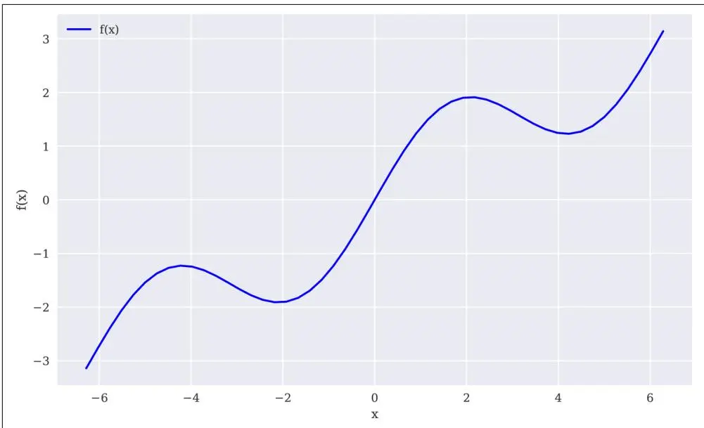

图11-1 示例函数图

### 回归

回归（regression）在函数近似方面是一种相当高效的工具。它不仅适用于一维函数的近似，在高维问题上也表现出色。得到回归结果所需的数值技术易于实现且执行迅速。基本上，给定一组所谓的基函数（basis functions）b_d, d ∈ {1, ..., D}，回归的任务是根据方程11-1找到最优参数α₁*, ..., α_D*，其中y_i ≡ f(x_i)，i ∈ {1, ..., I}为观测点。x_i被视为独立观测值，y_i为因变量观测值（在函数或统计意义上）。

**方程11-1. 回归的最小化问题**

$$
\min_{\alpha_{1}, \dots , \alpha_{D}} \frac{1}{I} \sum_{i = 1} ^{I} \left(y_{i} - \sum_{d = 1} ^{D} \alpha_{d} \cdot b_{d} (x_{i})\right) ^{2}
$$


#### 以单项式为基函数

最简单的情况之一是使用单项式（monomials）作为基函数——即b₁ = 1, b₂ = x, b₃ = x², b₄ = x³, ...。在这种情况下，NumPy具有内置函数，既可用于确定最优参数（即np.polyfit()），也可用于在给定一组输入值时评估近似结果（即np.polyval()）。

表11-1列出了np.polyfit()函数接受的参数。给定np.polyfit()返回的最优回归系数p，np.polyval(p, x)返回x坐标对应的回归值。

**表11-1. polyfit()函数的参数**
```txt
参数          描述
x            x坐标（自变量值）
y            y坐标（因变量值）
deg          拟合多项式的次数
full         如果为True，额外返回诊断信息
w            应用于y坐标的权重
cov          如果为True，额外返回协方差矩阵
```

以典型的向量化方式，np.polyfit()和np.polyval()对于线性回归（即deg=1）的应用形式如下。给定存储在ry数组中的回归估计值，我们可以将回归结果与原始函数进行比较，如图11-2所示。当然，线性回归无法解释示例函数的sin部分：

```python
In [7]: res = np.polyfit(x, f(x), deg=1, full=True)
In [8]: res
Out[8]: (array([4.28841952e-01, -1.31499950e-16]), array([21.03238686]), 2, array([1., 1.]), 1.1102230246251565e-14)
In [9]: ry = np.polyval(res[0], x)
In [10]: create_plot([x, x], [f(x), ry], ['b', 'r.', ['f(x)', 'regression'], ['x', 'f(x')])
```

① 线性回归步骤。

② 完整结果：回归参数、残差、有效秩、奇异值和相对条件数。

③ 使用回归参数进行评估。

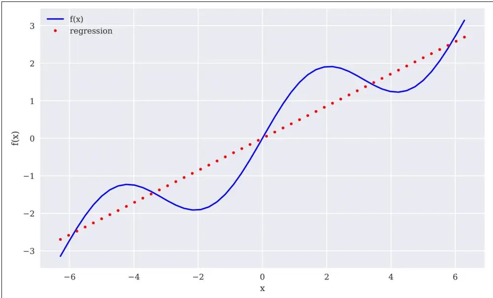

图11-2 线性回归

为了解释示例函数的sin部分，需要更高阶的单项式。接下来的回归尝试采用最高5阶的单项式作为基函数。毫不奇怪，回归结果（如图11-3所示）现在看起来更接近原始函数。然而，它仍然远非完美：


\begin{array}{r l} \text{In [11]:} & \text{reg = np.polyfit(x, f(x), deg = 5)} \\ & \text{ry = np.polyval(reg, x)} \end{array}


\begin{array}{l} \text{In [12]: create\_plot([x,x],[f(x),ry],['b','r.',} \\ \quad \quad \quad \quad \quad \quad \quad \quad \quad \quad \quad \quad \quad \quad \quad \quad \quad \quad \quad \quad \quad \quad \quad \quad \quad \quad \quad \quad \quad \quad \quad \quad \quad \quad \quad \quad \quad \quad \quad \quad \end{array}


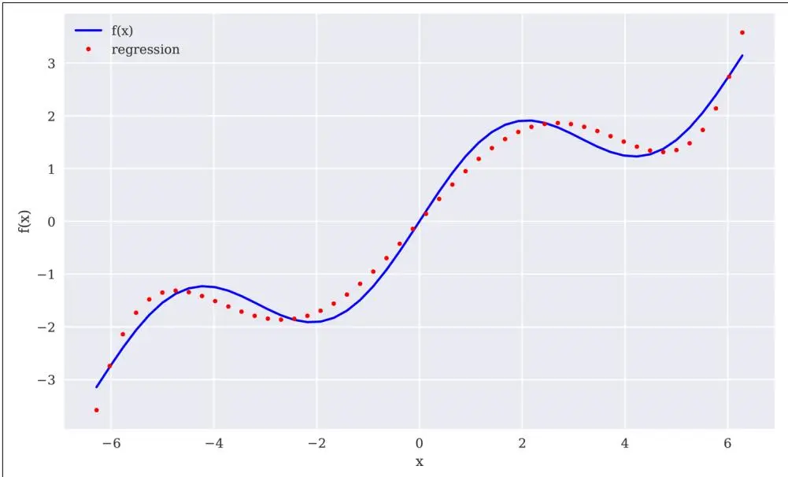

图11-3 使用最高5阶单项式的回归

最后一次尝试采用最高7阶单项式来逼近示例函数。在这种情况下，结果（如图11-4所示）相当令人信服：

```txt
In [13]: reg = np.polyfit(x, f(x), 7)
ry = np.polyval(reg, x)

In [14]: np.allclose(f(x), ry) ①
Out[14]: False

In [15]: np.mean((f(x) - ry) ** 2)
Out[15]: 0.0017769134759517689

In [16]: create_plot([x, x], [f(x), ry], ['b', 'r.', ['f(x)', 'regression'], ['x', 'f(x)'])
```

① 检查函数值和回归值是否相同（或至少接近）。

② 计算回归值相对于函数值的均方误差（MSE, Mean Squared Error）。

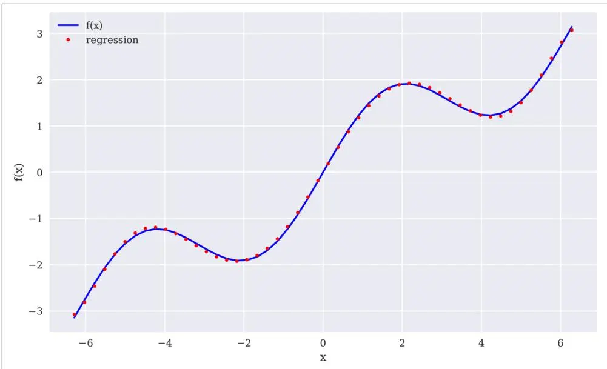

图11-4 使用最高7阶单项式的回归

#### 独立的基函数

一般来说，通过选择更好的基函数集，例如利用关于待逼近函数的知识，可以获得更好的回归结果。在这种情况下，需要通过矩阵方法（即使用NumPy ndarray对象）来定义独立的基函数。首先，考虑最高3阶单项式的情况（图11-5）。这里的核心函数是np.linalg.lstsq()：

```python
In [17]: matrix = np.zeros((3 + 1, len(x))) ①
    matrix[3, :] = x ** 3 ②
    matrix[2, :] = x ** 2 ②
    matrix[1, :] = x ②
    matrix[0, :] = 1 ②

In [18]: reg = np.linalg.lstsq(matrix.T, f(x), rcond=None)[0] ③
In [19]: reg.round(4) ④
Out[19]: array([0., 0.5628, -0., -0.0054])

In [20]: ry = np.dot(reg, matrix) ⑤
In [21]: create_plot([x, x], [f(x), ry], ['b', 'r.'], ['f(x)', 'regression'], ['x', 'f(x')])
```

① 用于基函数值的ndarray对象（矩阵）。

② 从常数项到三次项的基函数值。

③ 回归步骤。

④ 最优回归参数。

⑤ 函数值的回归估计。

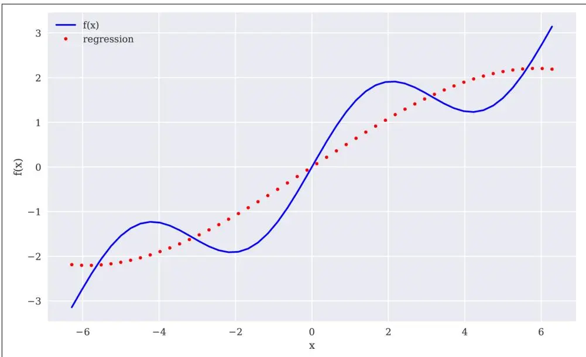

图11-5 使用独立基函数的回归

图11-5中的结果不如我们之前使用单项式的经验所预期的那么好。使用更通用的方法使我们能够利用关于示例函数的知识——即函数中存在sin部分。因此，在基函数集中包含一个正弦函数是合理的。为简单起见，我们替换掉了最高阶的单项式。现在拟合是完美的，如下面的数字和图11-6所示：

```javascript
In [22]: matrix[3, :] = np.sin(x)
```

```python
In [23]: reg = np.linalg.lstsq(matrix.T, f(x), rcond=None)[0]

In [24]: reg.round(4)

In [25]: ry = np.dot(reg, matrix)

In [26]: np.allclose(f(x), ry)

In [27]: np.mean((f(x) - ry) ** 2) 3

Out[27]: 3.404735992885531e-31
```

```javascript
In [28]: create_plot([x, x], [f(x), ry], ['b', 'r.', ], ['f(x)', 'regression'], ['x', 'f(x)'])
```

① 利用关于示例函数知识的新基函数。

② 最优回归参数恢复了原始参数。

③ 回归现在达到了完美拟合。

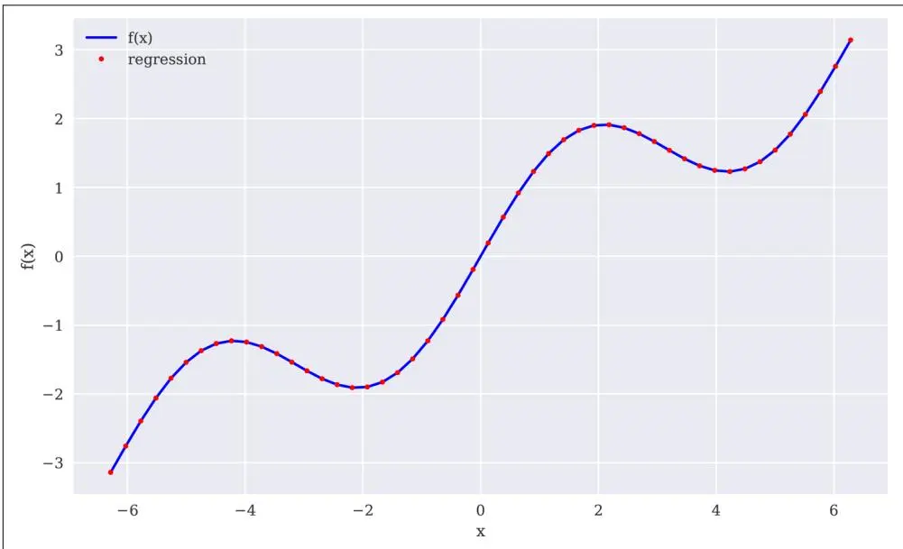

图11-6 使用正弦基函数的回归

#### 含噪声的数据

回归同样可以很好地处理含噪声的数据，无论是来自模拟的数据还是来自（非完美）测量的数据。为了说明这一点，生成了含噪声的自变量观测值和含噪声的因变量观测值。图11-7显示，回归结果比含噪声的数据点更接近原始函数。在某种意义上，回归在一定程度上平均了噪声：

```python
In [29]: xn = np.linspace(-2 * np.pi, 2 * np.pi, 50)
xn = xn + 0.15 * np.random.standard_normal(len(xn))
yn = f(xn) + 0.25 * np.random.standard_normal(len(xn))
In [30]: reg = np.polyfit(xn, yn, 7)
ry = np.polyval(reg, xn)
```

```python
In [31]: create_plot([x, x], [f(x), ry], ['b', 'r.', ['f(x)', 'regression'], ['x', 'f(x)'])
```

① 新的确定性x值。

② 在x值中引入噪声。

③ 在y值中引入噪声。

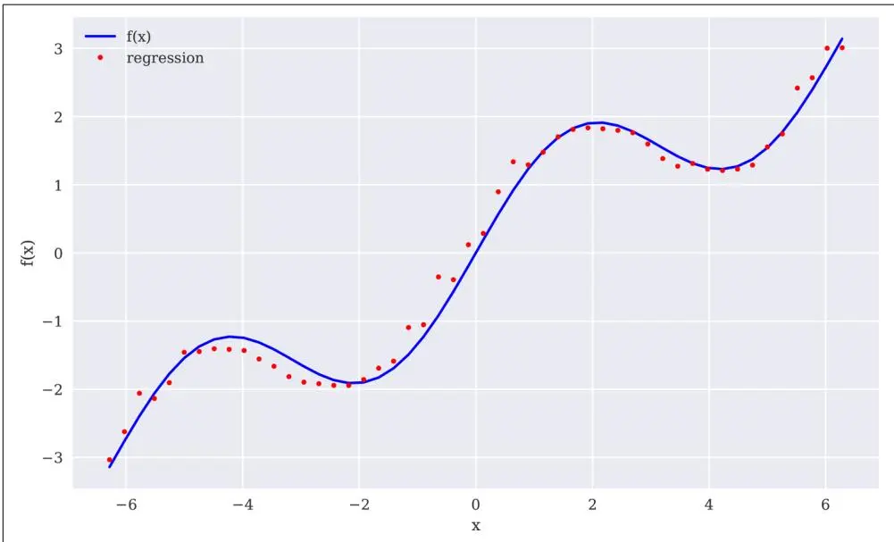

图11-7 含噪声数据的回归

#### 未排序的数据

回归的另一个重要方面是该方法同样可以无缝处理未排序的数据。前面的例子都依赖于排序后的x数据。但情况并非必须如此。为了说明这一点，让我们看一下x值的另一种随机化方法。在这种情况下，仅通过目视检查原始数据很难识别出任何结构：

```javascript
In [32]: xu = np.random.rand(50) * 4 * np.pi - 2 * np.pi
yu = f(xu)

In [33]: print(xu[:10].round(2)) ①
print(yu[:10].round(2)) ①
[-4.17 -0.11 -1.912.333.34 -0.965.814.92 -4.56 -5.42]
[-1.23 -0.17 -1.91.891.47 -1.292.451.48 -1.29 -1.95]

In [34]: reg = np.polyfit(xu, yu, 5)
ry = np.polyval(reg, xu)

In [35]: create_plot([xu, xu], [yu, ry], ['b.', 'ro'], ['f(x)', 'regression'], ['x', 'f(x)'])
```

① 随机化x值。

与含噪声的数据一样，回归方法不关心观测点的顺序。从方程11-1中最小化问题的结构可以明显看出这一点。其结果（如图11-8所示）也同样明显。

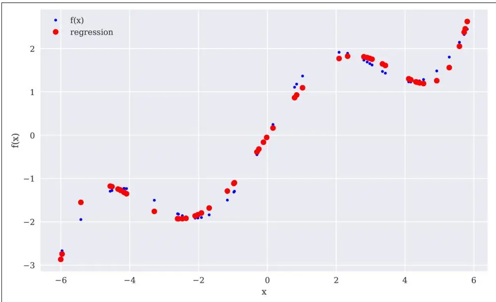

图11-8 未排序数据的回归

#### 多维回归

最小二乘回归方法的另一个便利特性是它可以轻松推广到多维，而不需要太多修改。以函数fm()为例，如下所示：


\begin{array}{l} \text{In [36]: def fm(p):} \\ \quad x, y = p \\ \quad \text{return np.sin(x) + 0.25 * x + np.sqrt(y) + 0.05 * y ** 2} \end{array}


为了正确可视化这个函数，需要独立数据点的网格（二维）。基于这样的二维自变量网格和由此产生的因变量数据点（在下面的代码中由X、Y和Z表示），图11-9展示了函数fm()的形状：

```python
In [37]: x = np.linspace(0, 10, 20)
    y = np.linspace(0, 10, 20)
    X, Y = np.meshgrid(x, y) ①

In [38]: Z = fm((X, Y))
    x = X.flatten() ②
    y = Y.flatten() ②

In [39]: from mpl_toolkits.mplot3d import Axes3D ③

In [40]: fig = plt.figure(figsize=(10, 6))
    ax = fig.gca(projection='3d')
    surf = ax.plot_surface(X, Y, Z, rstride=2, cstride=2, cmap='coolwarm', linewidth=0.5, antialiased=True)
    ax.set_xlabel('x')
    ax.set_ylabel('y')
    ax.set_zlabel('f(x, y)')
    fig.colorbar(surf, shrink=0.5, aspect=5)
```

① 从一维ndarray对象生成二维ndarray对象（"网格"）。

② 从二维ndarray对象生成一维ndarray对象。

③ 根据需要从matplotlib导入3D绘图功能。

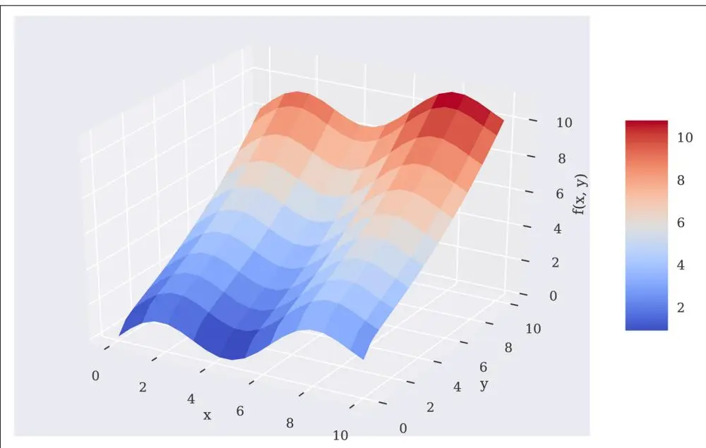

图11-9 具有两个参数的函数

```python
In [41]: matrix = np.zeros((len(x), 6 + 1))
    matrix[:, 6] = np.sqrt(y)
    matrix[:, 5] = np.sin(x)
    matrix[:, 4] = y ** 2
    matrix[:, 3] = x ** 2
    matrix[:, 2] = y
    matrix[:, 1] = x
    matrix[:, 0] = 1

In [42]: reg = np.linalg.lstsq(matrix, fm((x, y)), rcond=None)[0]

In [43]: RZ = np.dot(matrix, reg).reshape((20, 20)) ③

In [44]: fig = plt.figure(figsize=(10, 6))
    ax = fig.gca(projection='3d')
    surf1 = ax.plot_surface(X, Y, Z, rstride=2, cstride=2, cmap=mpl.cm.coolwarm, linewidth=0.5, antialiased=True) ④
    surf2 = ax.plot_wireframe(X, Y, RZ, rstride=2, cstride=2, label='regression') ⑤
    ax.set_xlabel('x')
    ax.set_ylabel('y')
    ax.set_zlabel('f(x, y)')
    ax.legend()
    fig.colorbar(surf, shrink=0.5, aspect=5)
```

为了获得良好的回归结果，基函数集至关重要。因此，考虑到函数fm()本身的知识，包含了np.sin()和np.sqrt()函数。图11-10直观地显示了完美的回归结果：

① 针对y参数的np.sqrt()函数。

② 针对x参数的np.sin()函数。

③ 将回归结果转换为网格结构。

④ 绘制原始函数曲面。

⑤ 绘制回归曲面。

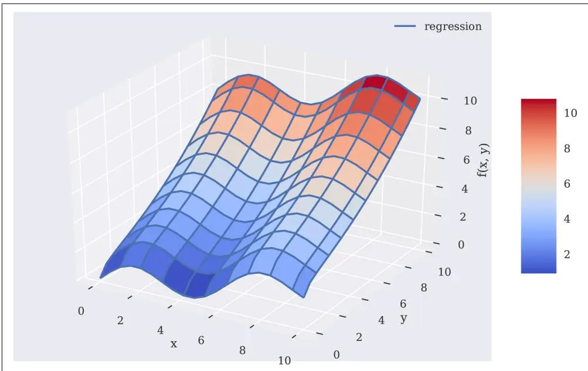

图11-10 具有两个参数的函数的回归曲面



### 回归

最小二乘回归方法有多个应用领域，包括简单的函数近似以及基于含噪声数据或未排序数据的函数近似。这些方法可以应用于一维以及多维问题。由于底层数学原理的一致性，其应用"几乎总是相同的"。


### 插值

与回归相比，插值（interpolation）（例如使用三次样条（cubic splines））在数学上更为复杂。它也被限制在低维问题上。给定一组有序的观测点（在x维度上有序），其基本思想是在两个相邻数据点之间进行回归，使得不仅数据点被由此产生的分段定义的插值函数完美匹配，而且该函数在数据点处是连续可微的。连续可微性至少需要3次插值——即使用三次样条。然而，该方法也适用于二次甚至线性样条。

以下代码实现了一个线性样条插值，其结果如图11-11所示：

```python
In [45]: import scipy.interpolate as spi ①
In [46]: x = np.linspace(-2 * np.pi, 2 * np.pi, 25)
In [47]: def f(x):
    return np.sin(x) + 0.5 * x
In [48]: ipo = spi.splrep(x, f(x), k=1) ②
In [49]: iy = spi.splev(x, ipo) ③
In [50]: np.allclose(f(x), iy) ④
Out[50]: True
In [51]: create_plot([x, x], [f(x), iy], ['b', 'ro'], ['f(x)', 'interpolation'], ['x', 'f(x)'])
```

① 从SciPy导入所需的子包。

② 实现线性样条插值。

③ 推导插值值。

④ 检查插值值是否（足够接近地）接近函数值。

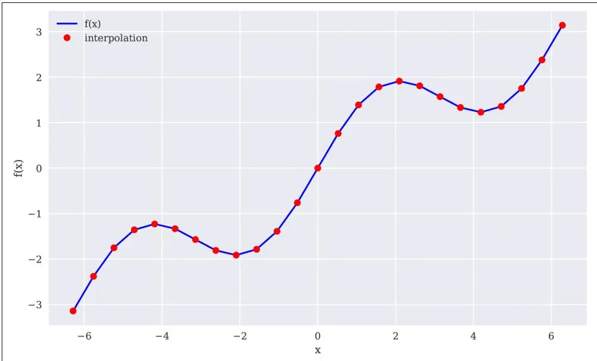

图11-11 线性样条插值（完整数据集）

应用本身，在给定x有序的数据点集的情况下，与np.polyfit()和np.polyval()的应用一样简单。这里，相应的函数是sci.splrep()和sci.splev()。表11-2列出了sci.splrep()函数的主要参数。

**表11-2. splrep()函数的参数**

<table><tr><td>参数</td><td>描述</td></tr><tr><td>x</td><td>（有序的）x坐标（自变量值）</td></tr><tr><td>y</td><td>（按x排序的）y坐标（因变量值）</td></tr><tr><td>w</td><td>应用于y坐标的权重</td></tr><tr><td>xb, xe</td><td>拟合区间；如果为None，则为[x[0], x[-1]]</td></tr><tr><td>k</td><td>样条拟合的阶数（1 ≤ k ≤ 5）</td></tr><tr><td>s</td><td>平滑因子（越大越平滑）</td></tr><tr><td>full_output</td><td>如果为True，返回额外输出</td></tr><tr><td>quiet</td><td>如果为True，抑制消息输出</td></tr></table>

表11-3列出了sci.splev()函数接受的参数。

**表11-3. splev()函数的参数**
```txt
参数          描述
x            （有序的）x坐标（自变量值）
tck          splrep()返回的长度为3的序列（节点、系数、次数）
der          导数的阶数（0为函数本身，1为一阶导数）
ext          如果x不在节点序列中的行为（0=外推，1=返回0，2=引发ValueError）
```

样条插值在金融中常用于生成未包含在原始观测中的自变量数据点所对应的因变量估计值。为此，下一个示例选择一个较小的区间，并详细查看线性样条的插值值。图11-12显示，插值函数确实在两个观测点之间进行线性插值。对于某些应用，这可能不够精确。此外，原始数据点处的函数不是连续可微的——这是另一个缺点：

```python
In [52]: xd = np.linspace(1.0, 3.0, 50) iyd = spi.splev(xd, ipo)
In [53]: create_plot([xd, xd], [f(xd), iyd], ['b', 'ro'], ['f(x)', 'interpolation'], ['x', 'f(x)'])
```

① 具有更多点的较小区间。

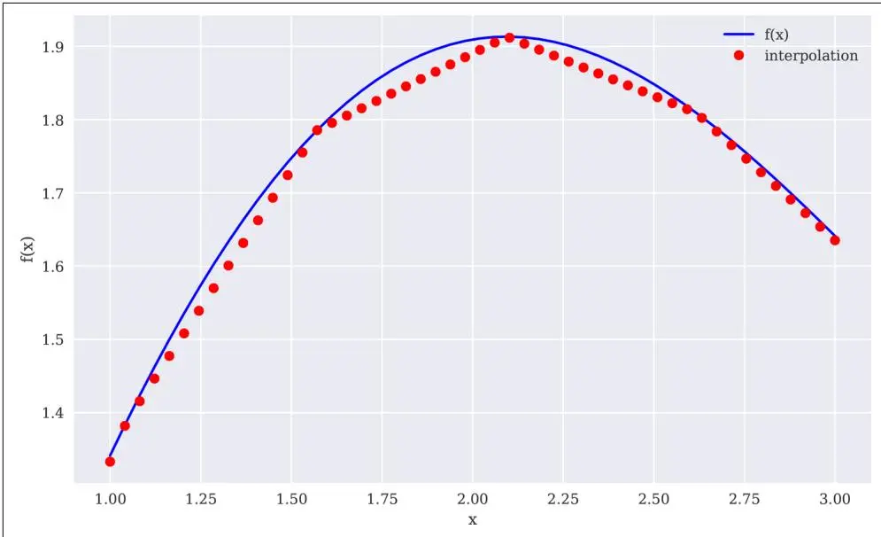

图11-12 线性样条插值（数据子集）

这次使用三次样条重复完整的练习，结果得到了显著改善（见图11-13）：

```python
In [54]: ipo = spi.splrep(x, f(x), k=3) ①
    iyd = spi.splev(xd, ipo) ②

In [55]: np.allclose(f(xd), iyd) ③
Out[55]: False

In [56]: np.mean((f(xd) - iyd) ** 2) ④
Out[56]: 1.1349319851436892e-08

In [57]: create_plot([xd, xd], [f(xd), iyd], ['b', 'ro'], ['f(x)', 'interpolation'], ['x', 'f(x')])
```

① 在完整数据集上进行三次样条插值。

② 将结果应用于较小区间。

③ 插值仍然不完美...

④ ...但比以前好多了。

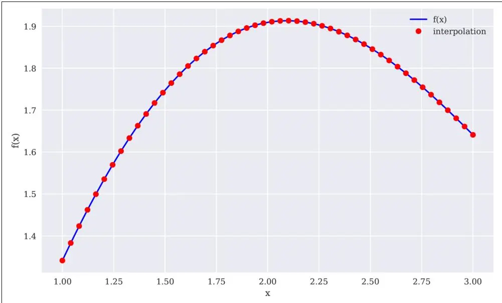

图11-13 三次样条插值（数据子集）



### 插值

在可以应用样条插值的情况下，可以预期比最小二乘回归方法更好的近似结果。然而，请记住，这需要排序后的（且"无噪声的"）数据，并且该方法仅限于低维问题。它的计算量也更大，因此在某些用例中可能比回归花费（更长的）时间。


## 凸优化

在金融和经济学中，凸优化（convex optimization）扮演着重要角色。例如，将期权定价模型校准到市场数据，或优化代理人的效用函数。以函数fm()为例：


\begin{array}{l} \text{In [58]: def fm(p):} \\ \quad x, y = p \\ \quad \text{return (np.sin(x) + 0.05 * x ** 2} \\ \quad \quad + n p. s i n (y) + 0. 05 * y * * 2) \end{array}


图11-14在x和y的已定义区间上以图形方式显示了该函数。目视检查已经表明该函数有多个局部最小值。是否存在全局最小值无法通过这种特定的图形表示来确认，但似乎存在：

```python
In [59]: x = np.linspace(-10, 10, 50)
    y = np.linspace(-10, 10, 50)
    X, Y = np.meshgrid(x, y)
    Z = fm((X, Y))

In [60]: fig = plt.figure(figsize=(10, 6))
    ax = fig.gca(projection='3d')
    surf = ax.plot_surface(X, Y, Z, rstride=2, cstride=2,
    cmap='coolwarm', linewidth=0.5,
    antialiased=True)
    ax.set_xlabel('x')
    ax.set_ylabel('y')
    ax.set_zlabel('f(x, y)')
    fig.colorbar(surf, shrink=0.5, aspect=5)
```

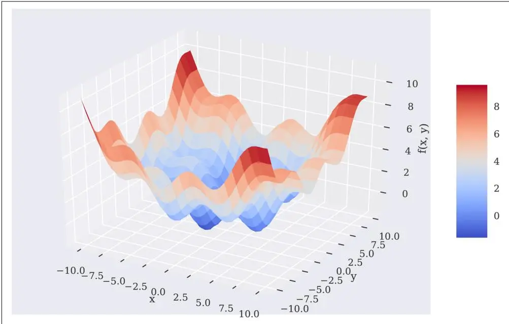

图11-14 具有多个局部最小值的函数

### 全局优化

下面将实现全局最小化和局部最小化两种方法。所应用的函数sco.brute()和sco.fmin()来自scipy.optimize。

为了更仔细地观察最小化过程中的幕后情况，以下代码对原始函数进行了修改，增加了一个输出当前参数值和函数值的选项。这使我们能够跟踪过程中所有相关信息：

```python
In [61]: import scipy.optimize as sco ①

In [62]: def fo(p):
    x, y = p
    z = np.sin(x) + 0.05 * x ** 2 + np.sin(y) + 0.05 * y ** 2
    if output == True:
    print('%8.4f | %8.4f | %8.4f' % (x, y, z)) ②
    return z

In [63]: output = True
sco.brute(fo, ((-10, 10.1, 5), (-10, 10.1, 5)), finish=None) ③
-10.0000 | -10.0000 | 11.0880
-10.0000 | -10.0000 | 11.0880
-10.0000 | -5.0000 | 7.7529
-10.0000 | 0.0000 | 5.5440
-10.0000 | 5.0000 | 5.8351
-10.0000 | 10.0000 | 10.0000
-5.0000 | -10.0000 | 7.7529
-5.0000 | -5.0000 | 4.4178
-5.0000 | 0.0000 | 2.2089
-5.0000 | 5.0000 | 2.5000
-5.0000 | 10.0000 | 6.66490.0000 | -10.0000 | 5.54400.0000 | -5.0000 | 2.20890.0000 | 0.0000 | 0.00000.0000 | 5.0000 | 0.29115.0000 | -10.0000 | 5.83515.0000 | -5.0000 | 2.50005.0000 | 5.83515.58225.5822 | 18.835112.5822 | -18.835112.5822 | -18.835112.5822 | -18.835112.5822 | -18.8351
```

Out[63]: array([0., 0.])

① 从SciPy导入所需的子包。

② 当output = True时要打印的信息。

③ 暴力搜索优化。

在给定的函数初始参数化下，最优参数值为x = y = 0。快速的输出回顾显示，结果函数值也为0。人们可能会接受这作为全局最小值。然而，这里的第一次参数化相当粗糙，两个输入参数的步长均为5。当然，这可以显著细化，在这种情况下会获得更好的结果——并显示之前的解并非最优：

```txt
In [64]: output = False
    opt1 = sco.brute(fo, ((-10, 10.1, 0.1), (-10, 10.1, 0.1)), finish=None)

In [65]: opt1
Out[65]: array([-1.4, -1.4])

In [66]: fm(opt1)
Out[66]: -1.7748994599769203
```

现在最优参数值为x = y = -1.4，全局最小化的最小函数值约为-1.7749。

### 局部优化

接下来的局部凸优化利用了全局优化的结果。函数sco.fmin()将待最小化的函数和起始参数值作为输入。可选的参数值包括输入参数公差和函数值公差，以及最大迭代次数和函数调用次数。局部优化进一步改进了结果：

```txt
In [67]: output = True
opt2 = sco.fmin(fo, opt1, xtol=0.001, ftol=0.001, maxiter=15, maxfun=20)
-1.4000 | -1.4000 | -1.7749
-1.4700 | -1.4000 | -1.7743
-1.4000 | -1.4700 | -1.7743
-1.3300 | -1.4700 | -1.7696
-1.4350 | -1.4175 | -1.7756
-1.4350 | -1.3475 | -1.7722
-1.4088 | -1.4394 | -1.7755
-1.4438 | -1.4569 | -1.7751
-1.4328 | -1.4427 | -1.7756
-1.4591 | -1.4208 | -1.7752
-1.4213 | -1.4347 | -1.7757
-1.4235 | -1.4096 | -1.7755
-1.4305 | -1.4344 | -1.7757
-1.4168 | -1.4516 | -1.7753
-1.4305 | -1.4260 | -1.7757
-1.4396 | -1.4257 | -1.7756
-1.4259 | -1.4325 | -1.7757
-1.4259 | -1.4241 | -1.7757
-1.4304 | -1.4177 | -1.7757
-1.4270 | -1.4288 | -1.7757

Warning: Maximum number of function evaluations has been exceeded.

In [68]: opt2
Out[68]: array([-1.42702972, -1.42876755])

In [69]: fm(opt2)
Out[69]: -1.7757246992239009
```

① 局部凸优化。

对于许多凸优化问题，建议在局部优化之前进行全局最小化。主要原因是局部凸优化算法很容易陷入局部最小值（或进行"盆地跳跃"（basin hopping）），完全忽略更好的局部最小值和/或全局最小值。下面显示，将起始参数设置为x = y = 2会得到例如大于零的"最小值"：

```txt
In [70]: output = False
sco.fmin(fo, (2.0, 2.0), maxiter=250)
Optimization terminated successfully.
Current function value: 0.015826
Iterations: 46
Function evaluations: 86

Out[70]: array([4.2710728, 4.27106945])
```

### 带约束的优化

到目前为止，本节仅考虑了无约束优化问题。然而，大多数经济或金融优化问题都受到一个或多个约束条件的限制。这些约束在形式上可以表现为等式或不等式。

作为一个简单的例子，考虑一个（期望效用最大化的）投资者的效用最大化问题，该投资者可以投资两种风险证券。两种证券今天的价格均为q_a = q_b = 10美元。一年后，它们在状态u下分别支付15美元和5美元，在状态d下分别支付5美元和12美元。两种状态发生的概率相等。将两种证券的向量收益分别记为r_a和r_b。

投资者的预算为w₀ = 100美元，并根据效用函数u(w) = √w从未来财富中获得效用，其中w是可用的财富（美元金额）。方程11-2是最大化问题的一种表述，其中a, b是投资者购买的证券数量。

**方程11-2. 期望效用最大化问题（1）**

$$
\begin{array}{r l r} \max_{a, b} \mathbf{E} (u (w_{1})) & = & p \sqrt{w_{1 u}} + (1 - p) \sqrt{w_{1 d}} \\ w_{1} & = & a \cdot r_{a} + b \cdot r_{b} \\ w_{0} & \geq & a \cdot q_{a} + b \cdot q_{b} \\ a, b & \geq & 0 \end{array}
$$


代入所有数值假设，得到方程11-3中的问题。注意这里改为最小化负的期望效用。

**方程11-3. 期望效用最大化问题（2）**

$\min_{a,b} - \mathbf{E}(u(w_1)) = -\left(0.5 \cdot \sqrt{w_{1u}} + 0.5 \cdot \sqrt{w_{1d}}\right)$ $w_{1u} = a \cdot 15 + b \cdot 5$ $w_{1d} = a \cdot 5 + b \cdot 12$ $100 \geq a \cdot 10 + b \cdot 10$ $a, b \geq 0$

为了解决这个问题，使用scipy.optimize.minimize()函数是合适的。该函数除了接受待最小化的函数外，还接受等式和不等式形式的约束条件（作为dict对象列表）以及参数的边界（作为tuple of tuples）。<sup>1</sup> 以下代码将方程11-3中的问题转换为Python代码：

```python
In [71]: import math

In [72]: def Eu(p): ①
    s, b = p
    return -(0.5 * math.sqrt(s * 15 + b * 5) +
    0.5 * math.sqrt(s * 5 + b * 12))

In [73]: cons = ({'type': 'ineq',
    'fun': lambda p: 100 - p[0] * 10 - p[1] * 10}) ②

In [74]: bnds = ((0, 1000), (0, 1000)) ③

In [75]: result = sco.minimize(Eu, [5, 5], method='SLSQP',
    bounds=bnds, constraints=cons) ④
```


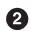

① 待最小化的函数（为了最大化期望效用）。

② 作为dict对象的不等式约束。

③ 参数的边界值（选择足够宽的范围）。

④ 带约束的优化。

结果对象包含了所有相关信息。关于最小函数值，需要记得将符号翻转回来：

```yaml
In [76]: result
Out[76]: fun: -9.700883611487832
jac: array([-0.48508096, -0.48489535])
message: 'Optimization terminated successfully.'
nfev: 21
nit: 5
njev: 5
status: 0
success: True
x: array([8.02547122, 1.97452878])
```

```javascript
In [77]: result['x'] ①
Out[77]: array([8.02547122, 1.97452878])
```

```javascript
In [78]: -result['fun']
Out[78]: 9.700883611487832
```

```txt
In [79]: np.dot(result['x'], [10, 10])
Out[79]: 99.9999999999999
```

① 最优参数值（即最优投资组合）。

② 负的最小函数值作为最优解的值。

③ 预算约束是紧约束；所有财富都被投资。

## 积分

特别是在估值和期权定价中，积分（integration）是一个重要的数学工具。这是因为衍生品的风险中性价值通常可以表示为在风险中性或鞅测度下其收益的贴现期望。而期望在离散情况下是求和，在连续情况下是积分。子包scipy.integrate提供了用于数值积分的不同函数。示例函数来自"近似"一节：

```txt
In [80]: import scipy.integrate as sci
```

```python
In [81]: def f(x):
    return np.sin(x) + 0.5 * x
```

积分区间应为[0.5, 9.5]，由此得到如方程11-4所示的定积分。

**方程11-4. 示例函数的积分**

$\int_{0.5}^{9.5}f(x)dx = \int_{0.5}^{9.5}\sin (x) + \frac{x}{2} dx$

以下代码定义了用于计算积分的主要Python对象：

```python
In [82]: x = np.linspace(0, 10)
    y = f(x)
    a = 0.5 ①
    b = 9.5 ②
    Ix = np.linspace(a, b) ③
    Iy = f(Ix) ④
```

① 左积分限。

② 右积分限。

③ 积分区间值。

④ 积分函数值。

图11-15将积分值可视化为函数下方的灰色阴影区域：<sup>2</sup>

```txt
In [83]: from matplotlib.patches import Polygon

In [84]: fig, ax = plt.subplots(figsize=(10, 6))
plt.plot(x, y, 'b', linewidth=2)
plt.ylim(bottom=0)
Ix = np.linspace(a, b)
Iy = f(Ix)
verts = [(a, 0)] + list(zip(Ix, Iy)) + [(b, 0)]
poly = Polygon(verts, facecolor='0.7', edgecolor='0.5')
ax.add_patch(poly)
plt.text(0.75 * (a + b), 1.5, r"$\int_a^b f(x)dx$", horizontalalignment='center', fontsize=20)
plt.figtext(0.9, 0.075, '$x$')
plt.figtext(0.075, 0.9, '$f(x)$')
ax.set_xticks((a, b))
ax.set_xticklabels(('$a$', '$b$'))
ax.set_yticks([f(a), f(b)]);
```

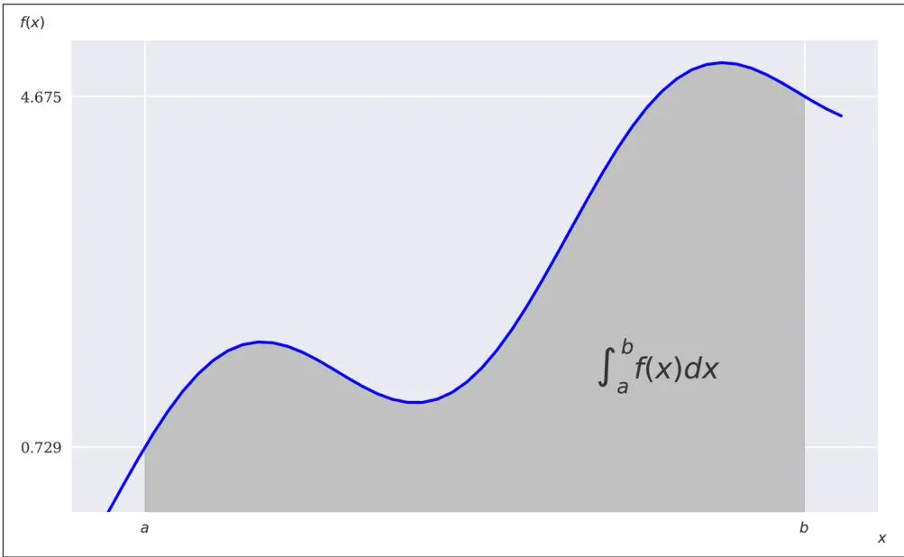

图11-15 作为阴影区域的积分值

### 数值积分

scipy.integrate子包包含一系列函数，用于在给定上下积分限的情况下对给定的数学函数进行数值积分。例如，用于固定高斯求积的sci.fixed_quad()、用于自适应求积的sci.quad()和用于龙贝格积分（Romberg integration）的sci.romberg()：

```python
In [85]: sci.fixed_quad(f, a, b)[0]
Out[85]: 24.366995967084602

In [86]: sci.quad(f, a, b)[0] Out[86]: 24.374754718086752

In [87]: sci.romberg(f, a, b)
Out[87]: 24.374754718086713
```

还有一些积分函数分别接受包含函数值和输入值的列表或ndarray对象作为输入。这方面的例子包括使用梯形法则的sci.trapz()和实现辛普森法则（Simpson's rule）的sci.simps()：

```txt
In [88]: xi = np.linspace(0.5, 9.5, 25)

In [89]: sci.trapz(f(xi), xi)
Out[89]: 24.352733271544516

In [90]: sci.simps(f(xi), xi)
Out[90]: 24.37496418455075
```

### 通过模拟进行积分

通过蒙特卡洛模拟（参见[第12章](ch12.md)）对期权和衍生品进行估值，其基础在于可以通过模拟来计算积分。为此，在积分限之间抽取I个x随机值，并在每个x随机值处评估积分函数。将所有函数值相加并取平均值，得到积分区间上的平均函数值。将该值乘以积分区间的长度，即可得到积分值的估计。

以下代码显示了蒙特卡洛估计的积分值如何随着随机抽取次数的增加而收敛（尽管不是单调地）到真实值。即使对于相对较少的随机抽取次数，估计量也已经相当接近：

```python
In [91]: for i in range(1, 20):
    np.random.seed(1000)
    x = np.random.random(i * 10) * (b - a) + a
    print(np.mean(f(x)) * (b - a))

24.80476227933146326.52291889833237826.26554751922397626.0277033994382424.9995418144084423.88181014162166323.52791227484325323.50785765896120723.6723674606698923.67941041606288624.42440170787930524.23900534681905624.11539692496280224.42419198756672623.92493308053378324.1948421202787524.11734837824983324.10069092966227423.76905109847816
```

① 每次迭代增加随机x值的数量。

## 符号计算

前面的章节主要关注数值计算。本节现在介绍符号计算（symbolic computation），它可以在金融的许多领域中得到有益的应用。为此，通常使用SymPy，一个专门用于符号计算的库。

### 基础

SymPy引入了新的对象类。一个基本的类是Symbol类：

```txt
In [92]: import sympy as sy
In [93]: x = sy.Symbol('x') ①
    y = sy.Symbol('y') ①
In [94]: type(x)
Out[94]: sympy.core.symbol.Symbol
In [95]: sy.sqrt(x) ②
Out[95]: sqrt(x)
In [96]: 3 + sy.sqrt(x) - 4 ** 2 ③
Out[96]: sqrt(x) - 13
In [97]: f = x ** 2 + 3 + 0.5 * x ** 2 + 3 / 2 ④
In [98]: sy.simplify(f) ⑤
Out[98]: 1.5*x**2 + 4.5
```

① 定义要使用的符号。

② 在符号上应用函数。

③ 在符号上定义的数值表达式。

④ 符号定义的函数。

⑤ 简化的函数表达式。

这已经展示了与常规Python代码的主要区别。尽管x没有数值，但x的平方根在SymPy中仍然是有定义的，因为x是一个Symbol对象。在这个意义上，sy.sqrt(x)可以是任意数学表达式的一部分。注意SymPy通常会自动简化给定的数学表达式。类似地，可以使用Symbol对象定义任意函数。它们不应与Python函数混淆。

SymPy为数学表达式提供了三种基本的渲染方式：

• 基于LaTeX

• 基于Unicode

• 基于ASCII

例如，当仅在Jupyter Notebook环境（基于HTML）中工作时，LaTeX渲染通常是一个好的（即视觉上吸引人的）选择。以下代码坚持使用最简单的选项ASCII，以说明这不涉及手动排版：

```python
In [99]: sy.init_printing(pretty_print=False, use_unicode=False)

In [100]: print(sy.pretty(f))
21.5*x + 4.5

In [101]: print(sy.pretty(sy.sqrt(x) + 0.5))
```

```txt
\ / x + 0.5
```

本节无法深入细节，但SymPy还提供了许多其他有用的数学函数——例如，在数值评估π时。以下示例显示了π的字符串表示的前40个和最后40个字符，最高达第400,000位。它还搜索一个六位数的、以日为先的生日日期——这是某些数学和IT圈中的热门任务：

```txt
In [102]: %time pi_str = str(sy.N(sy.pi, 400000)) ①
CPU times: user 400 ms, sys: 10.9 ms, total: 411 ms
Wall time: 501 ms

In [103]: pi_str[:42] ②
Out[103]: '3.1415926535897932384626433832795028841971'

In [104]: pi_str[-40:] ③
Out[104]: '8245672736856312185020980470362464176198'

In [105]: %time pi_str.find('061072') ④
CPU times: user 115 μs, sys: 1e+03 ns, total: 116 μs
Wall time: 120 μs

Out[105]: 80847
```

① 返回π的前400,000位数字的字符串表示。

② 显示前40位数字...

③ ...以及最后40位数字。

④ 在字符串中搜索生日日期。

### 方程

SymPy的一个强项是求解方程，例如x² - 1 = 0。通常，SymPy假设我们正在寻找通过将给定表达式设为零所得到的方程的解。因此，像x² - 1 = 3这样的方程可能需要重新表述才能得到期望的结果。当然，SymPy可以处理更复杂的表达式，如x³ + 0.5x² - 1 = 0。最后，它也可以处理涉及虚数的问题，如x² + y² = 0：

```txt
In [106]: sy.solve(x ** 2 - 1)
Out[106]: [-1, 1]

In [107]: sy.solve(x ** 2 - 1 - 3)
Out[107]: [-2, 2]

In [108]: sy.solve(x ** 3 + 0.5 * x ** 2 - 1)
Out[108]: [0.858094329496553, -0.679047164748276 - 0.839206763026694*I,
    -0.679047164748276 + 0.839206763026694*I]

In [109]: sy.solve(x ** 2 + y ** 2)
Out[109]: [{x: -I*y}, {x: I*y}]
```

### 积分与微分

SymPy的另一个强项是积分和微分。接下来的示例重新审视了用于数值和基于模拟的积分的示例函数，并推导出符号精确和数值精确的解。需要积分限的Symbol对象才能开始：

```python
In [110]: a, b = sy.symbols('a b') ①
In [111]: I = sy.Integral(sy.sin(x) + 0.5 * x, (x, a, b)) ②
In [112]: print(sy.pretty(I)) ②
    b
    /
    | (0.5*x + sin(x)) dx
    |
    /
    a
In [113]: int_func = sy.integrate(sy.sin(x) + 0.5 * x, x) ③
In [114]: print(sy.pretty(int_func)) ③
    20.25*x - cos(x)
In [115]: Fb = int_func.subs(x, 9.5).evalf() ④
    Fa = int_func.subs(x, 0.5).evalf() ④

In [116]: Fb - Fa ⑤
Out[116]: 24.3747547180867
```

① 积分限的Symbol对象。

② 定义Integral对象并美观打印。

③ 推导并美观打印反导数。

④ 通过.subs()和.evalf()方法获得反导数在积分限处的值。

⑤ 积分的精确数值。

积分也可以用符号积分限进行符号求解：

```python
In [117]: int_func_limits = sy.integrate(sy.sin(x) + 0.5 * x, (x, a, b))

In [118]: print(sy.pretty(int_func_limits)) ①
- 0.25*a + 0.25*b + cos(a) - cos(b)

In [119]: int_func_limits.subs({a : 0.5, b : 9.5}).evalf() ②
Out[119]: 24.3747547180868

In [120]: sy.integrate(sy.sin(x) + 0.5 * x, (x, 0.5, 9.5)) ③
Out[120]: 24.3747547180867
```

① 符号求解积分。

② 使用字典对象进行替换，数值求解积分。

③ 一步完成的数值积分。

### 微分

反导数的导数通常得到原始函数。对符号反导数应用sy.diff()函数可以说明这一点：

```python
In [121]: int_func.diff()
Out[121]: 0.5*x + sin(x)
```

与积分示例一样，微分现在将用于推导本章前面看到的凸最小化问题的精确解。为此，将相应的函数符号定义，推导偏导数，并确定根。

全局最小值的必要但不充分条件是所有偏导数为零。然而，不能保证存在符号解。算法和（多个）存在性问题都在这里起作用。然而，我们可以数值求解两个一阶条件，基于之前全局和局部最小化工作的"有依据的"猜测：

```javascript
In [122]: f = (sy.sin(x) + 0.05 * x ** 2 + sy.sin(y) + 0.05 * y ** 2)
In [123]: del_x = sy.diff(f, x) del_x
Out[123]: 0.1*x + cos(x)
In [124]: del_y = sy.diff(f, y) del_y
Out[124]: 0.1*y + cos(y)
In [125]: xo = sy.nsolve(del_x, -1.5) xo
Out[125]: -1.42755177876459
In [126]: yo = sy.nsolve(del_y, -1.5) yo
Out[126]: -1.42755177876459
In [127]: f.subs({x : xo, y : yo}).evalf()
Out[127]: -1.77572565314742
```

① 函数的符号版本。

② 推导并打印两个偏导数。

③ 根的"有依据"猜测及由此得到的最优值。

④ 全局最小值函数值。

同样，提供无依据/任意的猜测可能会使算法陷入局部最小值而非全局最小值：

```txt
In [128]: xo = sy.nsolve(del_x, 1.5) ①
    xo
Out[128]: 1.74632928225285

In [129]: yo = sy.nsolve(del_y, 1.5) ①
    yo
Out[129]: 1.74632928225285

In [130]: f.subs({x : xo, y : yo}).evalf() ②
Out[130]: 2.27423381055640
```

① 无依据的根猜测值。

② 局部最小值函数值。

这数值上说明了一阶条件是必要的但不充分的。



### 符号计算

当使用Python进行（金融）数学计算时，SymPy和符号计算被证明是一个有价值的工具。特别是对于交互式金融分析，这可能比非符号方法更高效。


## 结论

本章涵盖了与金融相关的一些精选数学主题和工具。例如，函数近似在许多金融领域中很重要，如基于因子的模型、收益率曲线插值以及美式期权的基于回归的蒙特卡洛估值方法。凸优化技术在金融中也是经常需要的；例如，在将参数化期权定价模型校准到市场报价或期权的隐含波动率时。

数值积分对于例如期权和衍生品的定价至关重要。在推导出（一组）随机过程的风险中性概率测度后，期权定价归结为在风险中性测度下计算期权收益的期望并将其贴现回当前日期。[第12章](ch12.md)涵盖了在风险中性测度下几种类型随机过程的模拟。

最后，本章介绍了使用SymPy进行符号计算。对于许多数学运算，如积分、微分或求解方程，符号计算可以证明是一个有用且高效的工具。

## 补充资源

关于本章中使用的Python库的更多信息，请查阅以下网络资源：

• 关于本章使用的NumPy函数的详细信息，请参见NumPy参考。

• 关于scipy.optimize的详细信息，请参见关于优化和求根的SciPy文档。

• 关于scipy.integrate的集成说明，请参见"Integration and ODEs"。

• SymPy网站提供了大量示例和详细文档。

关于本章所涵盖主题的数学参考，请参见：

• Brandimarte, Paolo (2006). Numerical Methods in Finance and Economics: A MATLAB-Based Introduction. 2nd ed., Hoboken, NJ: John Wiley & Sons.
