# 随机过程


可预测性不是事情将会如何发展，而是事情可能如何发展。
—Raheel Farooq


如今，随机过程（Stochastics）是金融学中最重要的数学与数值学科之一。在现代金融学早期，主要是20世纪70年代和80年代，金融研究的主要目标是为特定金融模型下的期权定价等问题寻找闭式解。近年来，需求已发生巨大变化——金融市场参与者不仅需要正确估值单个金融工具，还需要对整本衍生品账簿等进行一致估值。同样，要在整个金融机构范围内得出一致的风险度量指标（如风险价值（Value-at-Risk, VaR）和信用估值调整（Credit Valuation Adjustment, CVA）），必须考虑机构的所有账簿及其所有交易对手。这些艰巨的任务只能依靠灵活高效的数值方法来解决。因此，随机过程一般方法以及蒙特卡洛模拟（Monte Carlo Simulation）这一特定方法在金融领域日益重要。

本章从 Python 角度介绍以下主题：

"随机数" 见第346页

一切始于伪随机数（Pseudo-Random Numbers），它们构成了所有模拟工作的基础；尽管拟随机数（Quasi-Random Numbers，例如基于 Sobol 序列）在金融领域已获得一定认可，但伪随机数似乎仍是基准方法。

"模拟" 见第352页

在金融中，两项模拟任务尤为重要：随机变量（Random Variables）的模拟和随机过程（Stochastic Processes）的模拟。

```python
In [3]: npr.seed(100) ①
np.set_printoptions(precision=4) ①

In [4]: npr.rand(10) ②
Out[4]: array([0.5434, 0.2784, 0.4245, 0.8448, 0.0047, 0.1216, 0.6707, 0.8259, 0.1367, 0.5751])

In [5]: npr.rand(5, 5) ③
Out[5]: array([[0.8913, 0.2092, 0.1853, 0.1084, 0.2197], [0.9786, 0.8117, 0.1719, 0.8162, 0.2741], [0.4317, 0.94, 0.8176, 0.3361, 0.1754], [0.3728, 0.0057, 0.2524, 0.7957, 0.0153],
```

## "估值" 见第375页

估值（Valuation）的两个主要方向是欧式行权（European exercise，在特定日期行权）和美式行权（American exercise，在特定时间区间内行权）的衍生品估值；此外还有百慕大行权（Bermudan exercise），即在有限个特定日期行权的工具。

## "风险度量" 见第383页

模拟方法非常适合计算风险度量指标，如风险价值（VaR）、信用风险价值（Credit Value-at-Risk, CVaR）和信用估值调整（CVA）。

## 随机数

本章使用 numpy.random 子包提供的函数生成随机数：<sup>1</sup>

```python
In [1]: import math
import numpy as np
import numpy.random as npr
from pylab import plt, mpl
```

```txt
In [2]: plt.style.use('seaborn')
mpl.rcParams['font.family'] = 'serif'
%matplotlib inline
```

## 从 NumPy 导入随机数生成子包

例如，rand() 函数以参数指定的形状返回半开区间 [0,1) 中的随机数。返回对象是一个 ndarray 对象。这些数可以轻松变换到实数轴上的其他区间。例如，如果要生成区间 [a,b)=[5,10) 上的随机数，可以按如下示例变换 npr.rand() 返回的数——由于 NumPy 的广播机制，这在多维下同样适用：

```python
[0.5988, 0.6038, 0.1051, 0.3819, 0.0365]])
In [6]: a = 5.
    b = 10.
    npr.rand(10) * (b - a) + a
Out[6]: array([9.4521, 9.9046, 5.2997, 9.4527, 7.8845, 8.7124, 8.1509, 7.9092, 5.1022, 6.0501])
In [7]: npr.rand(5, 5) * (b - a) + a
Out[7]: array([[7.7234, 8.8456, 6.2535, 6.4295, 9.262], [9.875, 9.4243, 6.7975, 7.9943, 6.774], [6.701, 5.8904, 6.1885, 5.2243, 7.5272], [6.8813, 7.964, 8.1497, 5.713, 9.6692], [9.7319, 8.0115, 6.9388, 6.8159, 6.0217]])
```

设置种子值以确保可复现性，并设定打印位数。

一维 ndarray 对象的均匀分布随机数。

二维 ndarray 对象的均匀分布随机数。

下限……

……和上限……

……用于变换到另一区间。

对二维执行同样的变换。

表12-1列出了生成简单随机数的函数。

表12-1 简单随机数生成函数

<table><tr><td>函数</td><td>参数</td><td>返回值/结果</td></tr><tr><td>rand</td><td>d0, d1, ..., dn</td><td>给定形状的随机值</td></tr><tr><td>randn</td><td>d0, d1, ..., dn</td><td>标准正态分布的样本</td></tr><tr><td>randint</td><td>low[, high, size]</td><td>从 low（包含）到 high（不包含）的随机整数</td></tr><tr><td>random_integers</td><td>low[, high, size]</td><td>low 到 high 之间的随机整数（两端包含）</td></tr><tr><td>random_sample</td><td>[size]</td><td>半开区间 [0.0, 1.0) 内的随机浮点数</td></tr><tr><td>random</td><td>[size]</td><td>半开区间 [0.0, 1.0) 内的随机浮点数</td></tr><tr><td>ranf</td><td>[size]</td><td>半开区间 [0.0, 1.0) 内的随机浮点数</td></tr><tr><td>sample</td><td>[size]</td><td>半开区间 [0.0, 1.0) 内的随机浮点数</td></tr><tr><td>choice</td><td>a[, size, replace, p]</td><td>从给定一维数组中的随机样本</td></tr><tr><td>bytes</td><td>length</td><td>随机字节</td></tr></table>

用表12-1中选定的函数生成的随机抽取结果可以很直观地可视化。图12-1以图形方式展示了两个连续分布和两个离散分布的结果：

```python
In [8]: sample_size = 500
    rn1 = npr.rand(sample_size, 3) ①  # 均匀分布随机数
    rn2 = npr.randint(0, 10, sample_size) ②  # 给定区间的随机整数
    rn3 = npr.sample(size=sample_size) ①  # 均匀分布随机数
    a = [0, 25, 50, 75, 100] ③
    rn4 = npr.choice(a, size=sample_size) ③  # 从有限列表对象中随机抽样

In [9]: fig, ((ax1, ax2), (ax3, ax4)) = plt.subplots(nrows=2, ncols=2, figsize=(10, 8))
    ax1.hist(rn1, bins=25, stacked=True)
    ax1.set_title('rand')
    ax1.set_ylabel('frequency')
    ax2.hist(rn2, bins=25)
    ax2.set_title('randint')
    ax3.hist(rn3, bins=25)
    ax3.set_title('sample')
    ax3.set_ylabel('frequency')
    ax4.hist(rn4, bins=25)
    ax4.set_title('choice');
```

均匀分布随机数。

给定区间内的随机整数。

从有限列表对象中随机抽样的值。

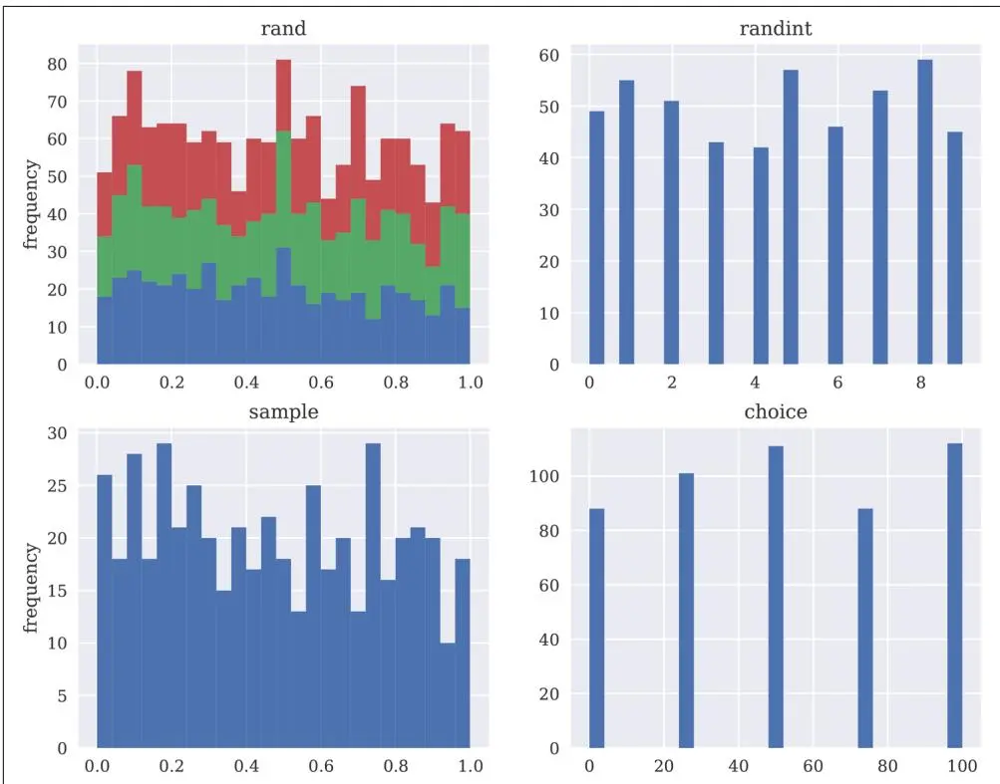
图12-1 简单随机数的直方图

表12-2列出了根据不同分布律生成随机数的函数。

表12-2 根据不同分布律生成随机数的函数

<table><tr><td>函数</td><td>参数</td><td>返回值/结果</td></tr><tr><td>beta</td><td>a, b[, size]</td><td>[0, 1] 上的 Beta 分布样本</td></tr><tr><td>binomial</td><td>n, p[, size]</td><td>二项分布样本</td></tr><tr><td>chisquare</td><td>df[, size]</td><td>卡方分布样本</td></tr><tr><td>dirichlet</td><td>alpha[, size]</td><td>Dirichlet 分布样本</td></tr><tr><td>exponential</td><td>[scale, size]</td><td>指数分布样本</td></tr><tr><td>f</td><td>dfnum, dfden[, size]</td><td>F 分布样本</td></tr><tr><td>gamma</td><td>shape[, scale, size]</td><td>Gamma 分布样本</td></tr><tr><td>geometric</td><td>p[, size]</td><td>几何分布样本</td></tr><tr><td>gumbel</td><td>[loc, scale, size]</td><td>Gumbel 分布样本</td></tr><tr><td>hypergeometric</td><td>ngood, nbad, nsample[, size]</td><td>超几何分布样本</td></tr><tr><td>laplace</td><td>[loc, scale, size]</td><td>Laplace（双指数）分布样本</td></tr><tr><td>logistic</td><td>[loc, scale, size]</td><td>Logistic 分布样本</td></tr><tr><td>lognormal</td><td>[mean, sigma, size]</td><td>对数正态分布样本</td></tr><tr><td>logseries</td><td>p[, size]</td><td>对数级数分布样本</td></tr><tr><td>multinomial</td><td>n, pvals[, size]</td><td>多项分布样本</td></tr><tr><td>multivariate_normal</td><td>mean, cov[, size]</td><td>多元正态分布样本</td></tr><tr><td>negative_binomial</td><td>n, p[, size]</td><td>负二项分布样本</td></tr><tr><td>noncentral_chisquare</td><td>df, nonc[, size]</td><td>非中心卡方分布样本</td></tr><tr><td>noncentral_f</td><td>dfnum, dfden, nonc[, size]</td><td>非中心 F 分布样本</td></tr><tr><td>normal</td><td>[loc, scale, size]</td><td>正态（高斯）分布样本</td></tr><tr><td>pareto</td><td>a[, size]</td><td>指定形状参数的 Pareto II 或 Lomax 分布样本</td></tr><tr><td>poisson</td><td>[lam, size]</td><td>泊松分布样本</td></tr><tr><td>power</td><td>a[, size]</td><td>[0, 1] 上指数为 a-1 的幂分布样本</td></tr><tr><td>rayleigh</td><td>[scale, size]</td><td>Rayleigh 分布样本</td></tr><tr><td>standard_cauchy</td><td>[size]</td><td>众数为 0 的标准 Cauchy 分布样本</td></tr><tr><td>standard_exponential</td><td>[size]</td><td>标准指数分布样本</td></tr><tr><td>standard_gamma</td><td>shape[, size]</td><td>标准 Gamma 分布样本</td></tr><tr><td>standard_normal</td><td>[size]</td><td>标准正态分布样本（均值=0，标准差=1）</td></tr><tr><td>standard_t</td><td>df[, size]</td><td>自由度为 df 的 t 分布样本</td></tr><tr><td>triangular</td><td>left, mode, right[, size]</td><td>区间 [left, right] 上的三角分布样本</td></tr><tr><td>uniform</td><td>[low, high, size]</td><td>均匀分布样本</td></tr><tr><td>vonmises</td><td>mu, kappa[, size]</td><td>von Mises 分布样本</td></tr><tr><td>wald</td><td>mean, scale[, size]</td><td>Wald（逆高斯）分布样本</td></tr><tr><td>weibull</td><td>a[, size]</td><td>Weibull 分布样本</td></tr><tr><td>zipf</td><td>a[, size]</td><td>Zipf 分布样本</td></tr></table>

尽管关于（标准）正态分布在金融中的使用存在不少批评，但它仍然是一个不可或缺的工具，并且无论分析应用还是数值应用，它仍然是使用最广泛的分布类型。原因之一是许多金融模型直接以某种方式依赖于正态分布或对数正态分布（Lognormal Distribution）。另一个原因是，许多不直接基于（对数）正态假设的金融模型可以通过正态分布进行离散化，从而近似用于模拟目的。

作为示例，图12-2展示了以下分布的随机抽取结果：

• 标准正态分布（均值 0，标准差 1）

• 正态分布（均值 100，标准差 20）

• 卡方分布（自由度 0.5）

• 泊松分布（lambda = 1）

图12-2展示了三个连续分布和一个离散分布（泊松分布）的结果。泊松分布（Poisson Distribution）用于模拟（稀有）外部事件的发生，如工具价格跳变或外源性冲击。以下是生成代码：

```python
In [10]: sample_size = 500
    rn1 = npr.standard_normal(sample_size) ①  # 标准正态分布随机数
    rn2 = npr.normal(100, 20, sample_size) ②  # 正态分布随机数
    rn3 = npr.chisquare(df=0.5, size=sample_size) ③  # 卡方分布随机数
    rn4 = npr.poisson(lam=1.0, size=sample_size) ④  # 泊松分布随机数

In [11]: fig, ((ax1, ax2), (ax3, ax4)) = plt.subplots(nrows=2, ncols=2, figsize=(10, 8))
    ax1.hist(rn1, bins=25)
    ax1.set_title('standard normal')
    ax1.set_ylabel('frequency')
    ax2.hist(rn2, bins=25)
    ax2.set_title('normal(100, 20)')
    ax3.hist(rn3, bins=25)
    ax3.set_title('chi square')
    ax3.set_ylabel('frequency')
    ax4.hist(rn4, bins=25)
    ax4.set_title('Poisson');
```

标准正态分布随机数。

正态分布随机数。

卡方分布随机数。

泊松分布随机数。

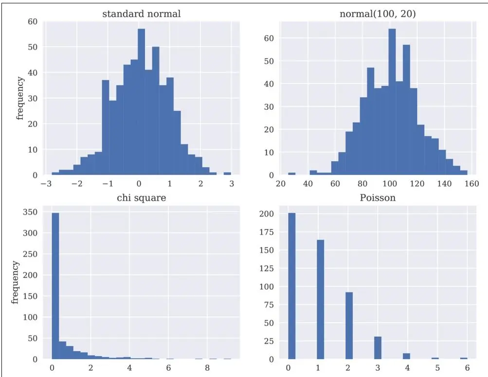
图12-2 不同分布随机样本的直方图


## NumPy 与随机数

本节展示了 NumPy 在 Python 中生成伪随机数时的强大（甚至不可或缺）作用。使用这类数创建小型或大型 ndarray 对象不仅便捷，而且性能优越。

## 模拟

蒙特卡洛模拟（Monte Carlo Simulation, MCS）是金融中最重要的数值技术之一，甚至可以说是最重要且最广泛使用的。这主要源于它是在评估数学表达式（例如积分）方面最灵活的数值方法，尤其是对金融衍生品的估值。然而，灵活性是以相对较高的计算负担为代价的，因为往往需要进行数十万甚至数百万次复杂计算才能得出一个估值。

## 随机变量

例如，考虑 Black-Scholes-Merton 期权定价框架。在该框架下，给定当前水平 $S_{0}$，未来日期 T 的股票指数水平 $S_{T}$ 由公式12-1给出。

公式12-1 Black-Scholes-Merton 框架中模拟未来指数水平

$$ $$
S_{T} = S_{0} \exp \left(\left(r - \frac{1}{2} \sigma^{2}\right) T + \sigma \sqrt{T} z\right)


变量和参数的含义如下：

$S_{T}$ 日期 $T$ 的指数水平 $r$ 恒定无风险短期利率
$\sigma$ S 的恒定波动率（即收益率的标准差）
$z$ 标准正态分布随机变量

该金融模型参数化并进行如下模拟。模拟代码的输出如图12-3所示：

```python
In [12]: S0 = 100  # 初始指数水平
    r = 0.05  # 恒定无风险短期利率
    sigma = 0.25  # 恒定波动率因子
    T = 2.0  # 以年为单位的时间跨度
    I = 10000  # 模拟次数
    ST1 = S0 * np.exp((r - 0.5 * sigma ** 2) * T + sigma * math.sqrt(T) * npr.standard_normal(I))
In [13]: plt.figure(figsize=(10, 6))
plt.hist(ST1, bins=50)
plt.xlabel('index level')
plt.ylabel('frequency');
```

初始指数水平。

恒定无风险短期利率。

恒定波动率因子。

以年为单位的到期期限。

模拟次数。

通过向量化表达式执行模拟；离散化方案使用了 npr.standard\_normal() 函数。

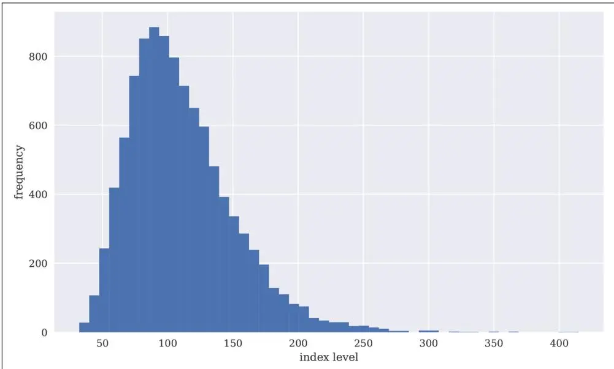
图12-3 静态模拟的几何布朗运动（通过 npr.standard\_normal()）

图12-3表明，公式12-1中定义的随机变量分布是对数正态的。因此，也可以尝试使用 npr.lognormal() 函数直接得出该随机变量的值。此时，需要向函数提供均值和标准差：

```typescript
In [14]: ST2 = S0 * npr.lognormal((r - 0.5 * sigma ** 2) * T, sigma * math.sqrt(T), size=I)
In [15]: plt.figure(figsize=(10, 6))
plt.hist(ST2, bins=50)
plt.xlabel('index level')
plt.ylabel('frequency');
```

The simulation via a vectorized expression; the discretization scheme makes use of the npr.lognormal() function.

结果如图12-4所示。

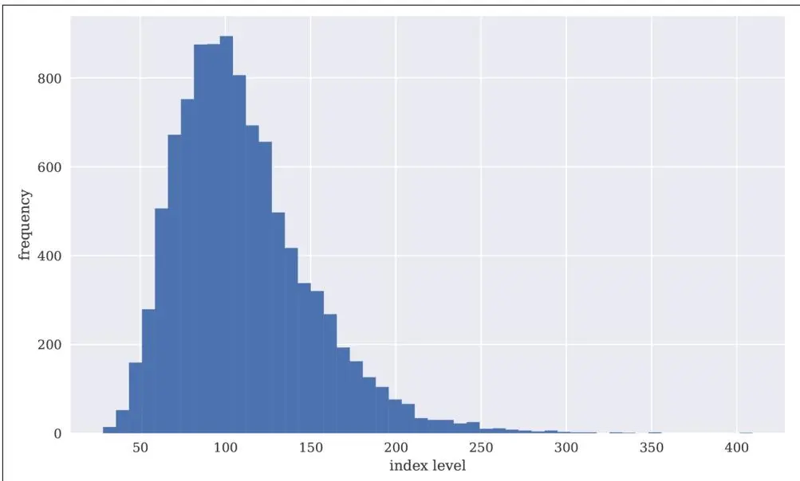
图12-4 静态模拟的几何布朗运动（通过 npr.lognormal()）

通过目视检查，图12-3和图12-4看起来确实非常相似。可以通过比较结果分布的统计矩来更严格地验证这一点。为了比较模拟结果的分布特征，scipy.stats 子包和在此定义的辅助函数 print\_statistics() 非常有用：

```python
In [16]: import scipy.stats as scs

In [17]: def print_statistics(a1, a2):
    ''' 打印选定的统计量。

    参数
    =====-
    a1, a2: ndarray 对象
    来自模拟的结果对象
    '''
    sta1 = scs.describe(a1) ①
    sta2 = scs.describe(a2) ①
    print('%14s %14s %14s' % ('statistic', 'data set 1', 'data set 2'))
    print(45 * "-" )
    print('%14s %14.3f %14.3f' % ('size', sta1[0], sta2[0]))
    print('%14s %14.3f %14.3f' % ('min', sta1[1][0], sta2[1][0]))
    print('%14s %14.3f %14.3f' % ('max', sta1[1][1], sta2[1][1]))
    print('%14s %14.3f %14.3f' % ('mean', sta1[2], sta2[2]))
    print('%14s %14.3f %14.3f' % ('std', np.sqrt(sta1[3]), np.sqrt(sta2[3])))
```

```python
print(‘%14s %14.3f %14.3f’ % (‘skew’, sta1[4], sta2[4]))
print(‘%14s %14.3f %14.3f’ % (‘kurtosis’, sta1[5], sta2[5]))
```

<table><tr><td colspan=”3”>In [18]: print_statistics(ST1, ST2)</td></tr><tr><td>statistic</td><td>data set 1</td><td>data set 2</td></tr><tr><td>size</td><td>10000.000</td><td>10000.000</td></tr><tr><td>min</td><td>32.327</td><td>28.230</td></tr><tr><td>max</td><td>414.825</td><td>409.110</td></tr><tr><td>mean</td><td>110.730</td><td>110.431</td></tr><tr><td>std</td><td>40.300</td><td>39.878</td></tr><tr><td>skew</td><td>1.122</td><td>1.115</td></tr><tr><td>kurtosis</td><td>2.438</td><td>2.217</td></tr></table>

scs.describe() 函数返回数据集的重要统计量。

显然，两个模拟结果的统计量非常相似。差异主要来自于模拟中的所谓抽样误差（Sampling Error）。另一种误差是在离散模拟连续随机过程时引入的——即离散化误差（Discretization Error），由于此处模拟方法的静态性质，该误差不起作用。

## 随机过程

粗略地说，随机过程（Stochastic Process）是一个随机变量序列。在这个意义上，模拟过程时应该期望类似于对随机变量进行重复模拟的结果。这基本上是成立的，除了抽取通常不是独立的，而是依赖于前一次抽取的结果。不过，金融中使用的随机过程通常具有马尔可夫性（Markov Property），即过程的明天值仅取决于过程的今天状态，而不取决于任何其他更”历史”的状态甚至整个路径历史。这种过程也称为无记忆过程。

## 几何布朗运动

现在考虑 Black-Scholes-Merton 模型的动态形式，如公式12-2中的随机微分方程（Stochastic Differential Equation, SDE）所述。其中 $Z_{t}$ 是标准布朗运动（Standard Brownian Motion）。该 SDE 被称为几何布朗运动（Geometric Brownian Motion, GBM）。$S_{t}$ 的值呈对数正态分布，（边际）收益率 $\frac{d S_{t}} {S_{t}}$ 呈正态分布。

公式12-2 Black-Scholes-Merton 框架中的随机微分方程

$$ $$
d S_{t} = r S_{t} d t + \sigma S_{t} d Z_{t}


公式12-2中的 SDE 可以通过 Euler 方案精确离散化。该方案如公式12-3所示，其中 Δt 是固定的离散化区间，$z_{t}$ 是标准正态分布随机变量。

公式12-3 Black-Scholes-Merton 框架中动态模拟指数水平

$$ $$
S_{t} = S_{t - \Delta t} \exp \left(\left(r - \frac{1}{2} \sigma^{2}\right) \Delta t + \sigma \sqrt{\Delta t} z_{t}\right)


与之前一样，翻译成 Python 和 NumPy 代码非常直接。如 图12-5 所示，指数水平的最终值再次呈对数正态分布。前四阶矩也与静态模拟方法的结果非常接近：

```python
In [19]: I = 10000  # 要模拟的路径数
    M = 50  # 离散化时间间隔数
    dt = T / M  # 以年为单位的时间间隔长度
    S = np.zeros((M + 1, I))  # 存储指数水平的二维 ndarray 对象
    S[0] = S0  # 初始时间点 t = 0 的初始值
    for t in range(1, M + 1):
    S[t] = S[t - 1] * np.exp((r - 0.5 * sigma ** 2) * dt + sigma * math.sqrt(dt) * npr.standard_normal(I))
    In [20]: plt.figure(figsize=(10, 6))
    plt.hist(S[-1], bins=50)
    plt.xlabel('index level')
    plt.ylabel('frequency');
```

要模拟的路径数。

离散化的时间间隔数。

以年为单位的时间间隔长度。

用于指数水平的二维 ndarray 对象。

初始时间点 t = 0 的初始值。

通过半向量化表达式进行模拟；循环遍历从 t = 1 到 t = T 的时间点。

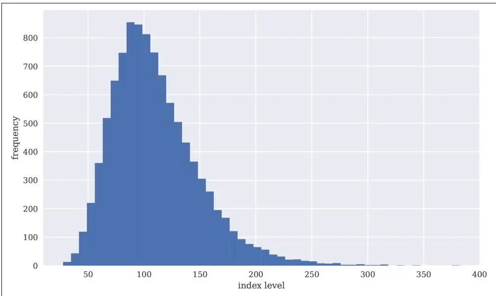
图12-5 到期时动态模拟的几何布朗运动

以下是动态模拟和静态模拟结果的统计量比较。图12-6展示了前10条模拟路径：

<table><tr><td>统计量</td><td>数据集1</td><td>数据集2</td></tr><tr><td>size</td><td>10000.000</td><td>10000.000</td></tr><tr><td>min</td><td>27.746</td><td>28.230</td></tr><tr><td>max</td><td>382.096</td><td>409.110</td></tr><tr><td>mean</td><td>110.423</td><td>110.431</td></tr><tr><td>std</td><td>39.179</td><td>39.878</td></tr><tr><td>skew</td><td>1.069</td><td>1.115</td></tr><tr><td>kurtosis</td><td>2.028</td><td>2.217</td></tr></table>

```txt
In [22]: plt.figure(figsize=(10, 6))
plt.plot(S[:, :10], lw=1.5)
plt.xlabel('time')
plt.ylabel('index level');
```

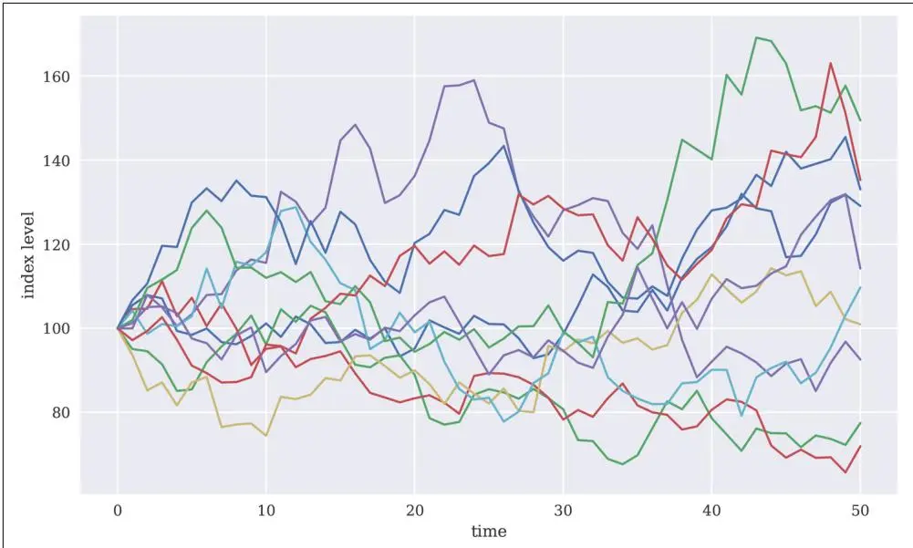
图12-6 动态模拟的几何布朗运动路径

使用动态模拟方法不仅可以可视化如图12-6所示的路径，还可以对美式/百慕大式行权的期权或路径依赖型收益的期权进行估值。可以说，这样可以获得随时间变化的完整动态图景。

## 平方根扩散

另一类重要的金融过程是均值回复过程（Mean-Reverting Process），用于建模短期利率或波动率过程等。一个流行且广泛使用的模型是 Cox、Ingersoll 和 Ross（1985）提出的平方根扩散（Square-Root Diffusion）。公式12-4给出了相应的 SDE。

公式12-4 平方根扩散的随机微分方程

$$ $$
d x_{t} = \kappa (\theta - x_{t}) d t + \sigma \sqrt{x_{t}} d Z_{t}


变量和参数的含义如下：

$$ $$
x_{t}


t 日期的过程水平

## κ

均值回复因子（Mean-Reversion Factor）

$\theta$ 过程长期均值 $\sigma$ 恒定波动率参数 $Z_{t}$ 标准布朗运动

众所周知，$x_{t}$ 的值服从卡方分布。然而，如前所述，许多金融模型可以通过正态分布进行离散化和近似（即所谓的 Euler 离散化方案）。虽然 Euler 方案对几何布朗运动是精确的，但对大多数其他随机过程存在偏差。即使存在精确方案——平方根扩散的精确方案将在稍后介绍——出于数值和/或计算原因，使用 Euler 方案可能更为可取。定义 $s = t - \Delta t$ 和 $x^{+} \equiv \operatorname* {m a x} \left( x , 0 \right)$，公式12-5给出了这样一个 Euler 方案。这个特定方案在文献中通常称为完全截断（Full Truncation）（详见 Hilpisch (2015)）。

公式12-5 平方根扩散的 Euler 离散化

$$ $$
\begin{array}{r l r} \tilde{x} _{t} & = & \tilde{x} _{s} + \kappa (\theta - \tilde{x} _{s} ^{+}) \Delta t + \sigma \sqrt{\tilde{x} _{s} ^{+}} \sqrt{\Delta t} z_{t} \\ x_{t} & = & \tilde{x} _{t} ^{+} \end{array}


平方根扩散具有一个便捷且现实的特性：$x_{t}$ 的值保持严格正数。当用 Euler 方案离散化时，无法排除负值。这就是为什么始终使用原始模拟过程的正数版本的原因。因此在模拟代码中，需要两个 ndarray 对象而不是一个。图12-7以直方图形式展示了模拟结果：

```python
In [23]: x0 = 0.05
    kappa = 3.0
    theta = 0.02
    sigma = 0.1
    I = 10000
    M = 50
    dt = T / M

In [24]: def srd_euler():
    xh = np.zeros((M + 1, I))
    x = np.zeros_like(xh)
    xh[0] = x0
    x[0] = x0
    for t in range(1, M + 1):
    xh[t] = (xh[t - 1] +
```

```txt
kappa * (theta - np.maximum(xh[t - 1], 0)) * dt + sigma * np.sqrt(np.maximum(xh[t - 1], 0)) * math.sqrt(dt) * npr.standard_normal(I)) ⑤
x = np.maximum(xh, 0)
return x
x1 = srd_euler()

In [25]: plt.figure(figsize=(10, 6))
plt.hist(x1[-1], bins=50)
plt.xlabel('value')
plt.ylabel('frequency');
```

初始值（例如短期利率）。

均值回复因子。

长期均值。

波动率因子。

基于 Euler 方案的模拟。

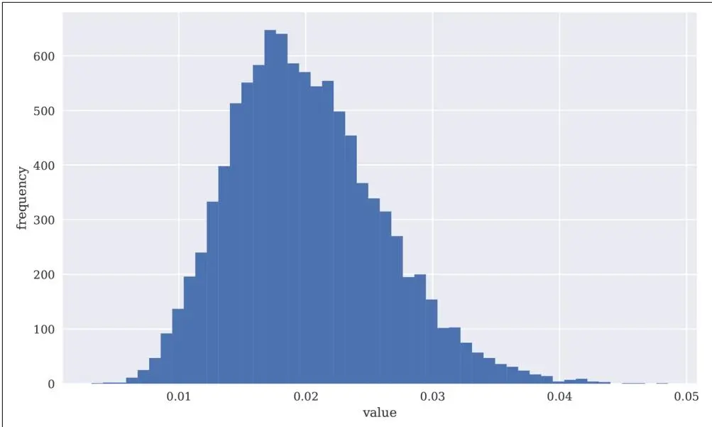
图12-7 到期时动态模拟的平方根扩散（Euler 方案）

图12-8 随后展示了前10条模拟路径，说明了由于 $x_{0} > \theta$ 导致的负平均漂移以及向 $\theta = 0.02$ 的收敛

$$ $$
\begin{array}{l} \text{In [26]: plt.figure(figsize=(10, 6))} \\ \quad \text{plt.plot(x1[:, :10], lw = 1.5)} \\ \quad \text{plt.xlabel('time')} \\ \quad \text{plt.ylabel('index level');} \end{array}


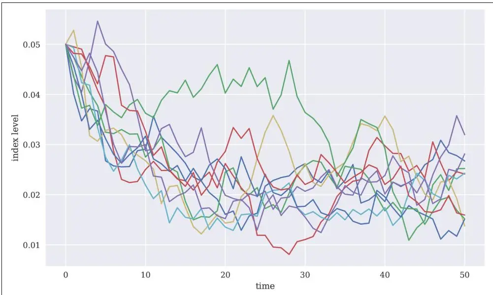
图12-8 动态模拟的平方根扩散路径（Euler 方案）

公式12-6给出了基于非中心卡方分布（Noncentral Chi-Square Distribution）$\chi_{d} ^{2}$的平方根扩散精确离散化方案，其中

$$ $$
d f = \frac{4 \theta \kappa}{\sigma^{2}}


自由度和非中心参数

$$ $$
n c = \frac{4 \kappa e^{- \kappa \Delta t}}{\sigma^{2} (1 - e^{- \kappa \Delta t})} x_{s}


公式12-6 平方根扩散的精确离散化

$$ $$
x_{t} = \frac{\sigma^{2} (1 - e^{- \kappa \Delta t})}{4 \kappa} \chi_{d} ^{' 2} \bigg (\frac{4 \kappa e^{- \kappa \Delta t}}{\sigma^{2} (1 - e^{- \kappa \Delta t})} x_{s} \bigg)


该离散化方案的 Python 实现稍微复杂一些，但仍然相当简洁。图12-9以直方图形式展示了精确方案模拟在到期时的输出：

```python
In [27]: def srd_exact():
    x = np.zeros((M + 1, I))
    x[0] = x0
    for t in range(1, M + 1):
    df = 4 * theta * kappa / sigma ** 2
    c = (sigma ** 2 * (1 - np.exp(-kappa * dt))) / (4 * kappa)
    nc = np.exp(-kappa * dt) / c * x[t - 1]
    x[t] = c * npr.noncentral_chisquare(df, nc, size=I)
    return x
    x2 = srd_exact()

In [28]: plt.figure(figsize=(10, 6))
    plt.hist(x2[-1], bins=50)
    plt.xlabel('value')
    plt.ylabel('frequency');
```

精确离散化方案，使用了 npr.noncentral\_chisquare()。

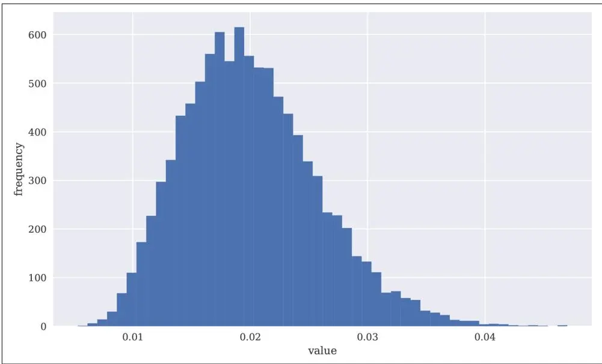
图12-9 到期时动态模拟的平方根扩散（精确方案）

图12-10 同样展示了前10条模拟路径，再次显示了负平均漂移和向 θ 的收敛：

```python
In [29]: plt.figure(figsize=(10, 6))
plt.plot(x2[:, :10], lw=1.5)
```

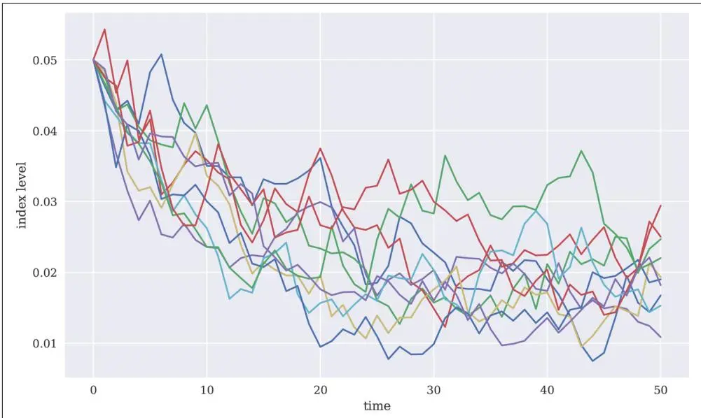
图12-10 动态模拟的平方根扩散路径（精确方案）

比较不同方法的主要统计量可以看出，有偏的 Euler 方案在期望的统计特性方面表现确实相当好：

```txt
In [30]: print_statistics(x1[-1], x2[-1])
    statistic data set 1 data set 2
    size 10000.00010000.000
    min 0.0030.005
    max 0.0490.047
    mean 0.0200.020
    std 0.0060.006
    skew 0.5290.532
    kurtosis 0.2890.273

In [31]: I = 250000
%time x1 = srd_euler()
CPU times: user 1.62 s, sys: 184 ms, total: 1.81 s
Wall time: 1.08 s

In [32]: %time x2 = srd_exact()
CPU times: user 3.29 s, sys: 39.8 ms, total: 3.33 s
Wall time: 1.98 s

In [33]: print_statistics(x1[-1], x2[-1])
x1 = 0.0; x2 = 0.0
```

<table><tr><td>statistic</td><td>data set 1</td><td>data set 2</td></tr><tr><td>size</td><td>250000.000</td><td>250000.000</td></tr><tr><td>min</td><td>0.002</td><td>0.003</td></tr><tr><td>max</td><td>0.071</td><td>0.055</td></tr><tr><td>mean</td><td>0.020</td><td>0.020</td></tr><tr><td>std</td><td>0.006</td><td>0.006</td></tr><tr><td>skew</td><td>0.563</td><td>0.579</td></tr><tr><td>kurtosis</td><td>0.492</td><td>0.520</td></tr></table>

然而，在执行速度方面存在显著差异，因为从非中心卡方分布中抽样比从标准正态分布中抽样的计算量更大。在结果几乎相同的情况下，精确方案所需时间大约是 Euler 方案的两倍。

## 随机波动率

Black-Scholes-Merton 模型的主要简化假设之一是恒定波动率。然而，波动率通常既不是恒定的也不是确定性的——它是随机的。因此，20世纪90年代初引入的所谓随机波动率模型（Stochastic Volatility Model）是金融建模的重大进展。该类中最流行的模型之一是 Heston（1993）模型，如公式12-7所示。

公式12-7 Heston 随机波动率模型的随机微分方程

$$ $$
\begin{array}{r l r} {d S_{t}} & = & {r S_{t} d t + \sqrt{\nu_{t}} S_{t} d Z_{t} ^{1}} \\ {d \nu_{t}} & = & {\kappa_{\nu} (\theta_{\nu} - \nu_{t}) d t + \sigma_{\nu} \sqrt{\nu_{t}} d Z_{t} ^{2}} \\ {d Z_{t} ^{1} d Z_{t} ^{2}} & = & {\rho} \end{array}


变量和参数的含义可以从几何布朗运动和平方根扩散的讨论中容易推断出来。参数 $\rho$ 表示两个标准布朗运动 $Z_{t} ^{1} , Z_{t} ^{2}$ 之间的瞬时相关性。这使我们能够解释一个称为杠杆效应（Leverage Effect）的风格化事实，其本质是在压力时期（市场下跌）波动率上升，而在牛市时期（市场上涨）波动率下降。

考虑以下模型参数化。为了处理两个随机过程之间的相关性，需要计算相关矩阵的 Cholesky 分解：

```txt
In [34]: S0 = 100.
r = 0.05
v0 = 0.1
kappa = 3.0
theta = 0.25
```

```python
sigma = 0.1
rho = 0.6 ②
T = 1.0

In [35]: corr_mat = np.zeros((2, 2))
corr_mat[0, :] = [1.0, rho]
corr_mat[1, :] = [rho, 1.0]
cho_mat = np.linalg.cholesky(corr_mat) ③

In [36]: cho_mat ③
Out[36]: array([[1., 0.], [0.6, 0.8]])
```

初始（瞬时）波动率值。

两个布朗运动之间的固定相关性。

Cholesky 分解及结果矩阵。

在开始随机过程模拟之前，先生成两个过程的全部随机数集合，使用集合0用于指数过程，集合1用于波动率过程。对于由平方根扩散建模的波动率过程，选择 Euler 方案，并通过 Cholesky 矩阵考虑相关性：

```python
In [37]: M = 50
    I = 10000
    dt = T / M

In [38]: ran_num = npr.standard_normal((2, M + 1, I)) ①
In [39]: v = np.zeros_like(ran_num[0])
    vh = np.zeros_like(v)

In [40]: v[0] = v0
    vh[0] = v0

In [41]: for t in range(1, M + 1):
    ran = np.dot(cho_mat, ran_num[:, t, :]) ②
    vh[t] = (vh[t - 1] +
    kappa * (theta - np.maximum(vh[t - 1], 0)) * dt +
    sigma * np.sqrt(np.maximum(vh[t - 1], 0)) *
    math.sqrt(dt) * ran[1]) ③

In [42]: v = np.maximum(vh, 0)
```

生成三维随机数数据集。

挑选出相关的随机数子集并通过 Cholesky 矩阵进行变换。

基于 Euler 方案模拟路径。

指数水平过程的模拟也考虑了相关性，并使用了（在此情况下的）几何布朗运动精确 Euler 方案。图12-11以直方图形式展示了指数水平过程和波动率过程在到期时的模拟结果：

```python
In [43]: S = np.zeros_like(ran_num[0])
    S[0] = S0
    for t in range(1, M + 1):
    ran = np.dot(cho_mat, ran_num[:, t, :])
    S[t] = S[t - 1] * np.exp((r - 0.5 * v[t]) * dt +
    np.sqrt(v[t]) * ran[0] * np.sqrt(dt))
```

```python
In [44]: fig, (ax1, ax2) = plt.subplots(1, 2, figsize=(10, 6))
    ax1.hist(S[-1], bins=50)
    ax1.set_xlabel('index level')
    ax1.set_ylabel('frequency')
    ax2.hist(v[-1], bins=50)
    ax2.set_xlabel('volatility');
```

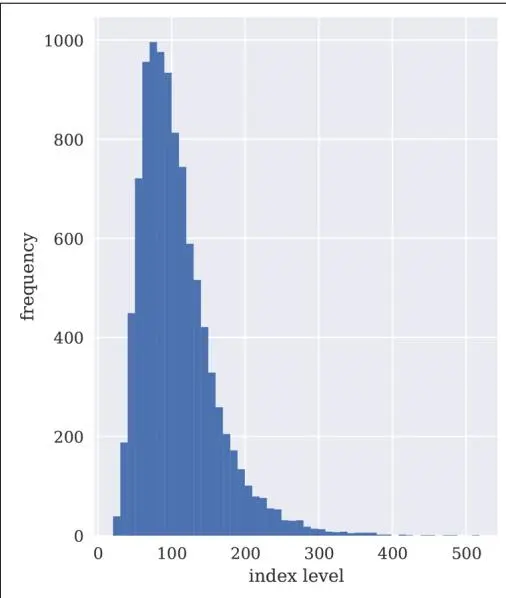

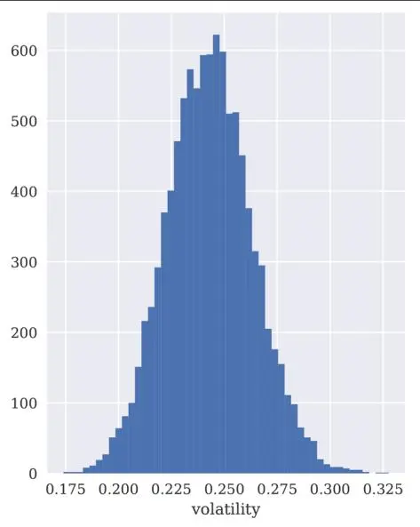
Figure 12-11. Dynamically simulated stochastic volatility process at maturity

这说明了使用平方根扩散 Euler 方案的另一个优势：由于只抽取标准正态分布随机数，相关性可以轻松且一致地处理。使用混合方法（即对指数过程使用 Euler 方案，对波动率过程使用基于非中心卡方分布的精确方案）则无法简单实现同样的效果。

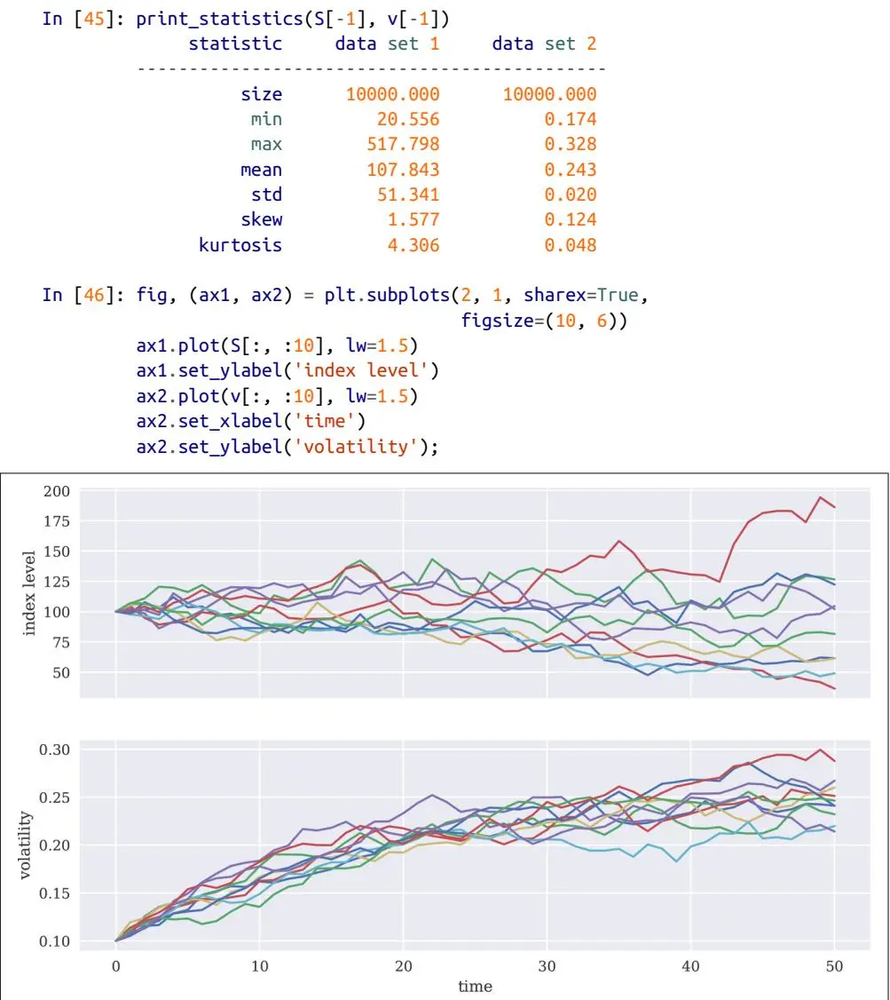

检查每个过程的前10条模拟路径（见图12-12）表明，波动率过程平均正向漂移，并且如预期收敛到 θ = 0.25：

<table><tr><td colspan="3">In [45]: print_statistics(S[-1], v[-1])</td></tr><tr><td>statistic</td><td>data set 1</td><td>data set 2</td></tr><tr><td>size</td><td>10000.000</td><td>10000.000</td></tr><tr><td>min</td><td>20.556</td><td>0.174</td></tr><tr><td>max</td><td>517.798</td><td>0.328</td></tr><tr><td>mean</td><td>107.843</td><td>0.243</td></tr><tr><td>std</td><td>51.341</td><td>0.020</td></tr><tr><td>skew</td><td>1.577</td><td>0.124</td></tr><tr><td>kurtosis</td><td>4.306</td><td>0.048</td></tr></table>

```python
In [46]: fig, (ax1, ax2) = plt.subplots(2, 1, sharex=True, figsize=(10, 6))
    ax1.plot(S[:, :10], lw=1.5)
    ax1.set_ylabel(‘index level’)
    ax2.plot(v[:, :10], lw=1.5)
    ax2.set_xlabel(‘time’)
    ax2.set_ylabel(‘volatility’);
```
图12-12 动态模拟的随机波动率过程路径

快速查看两个数据集在到期日的统计量会发现，指数水平过程的最大值相当高。实际上，在其他条件相同的情况下，这远高于具有恒定波动率的几何布朗运动所能达到的水平。

## 跳扩散

随机波动率和杠杆效应是多个市场中发现的风格化（实证）事实。另一个重要的风格化事实是资产价格和波动率中存在跳跃（Jump）。1976年，Merton 发表了他的跳扩散模型（Jump Diffusion Model），通过一个产生对数正态分布跳跃的模型组件增强了 Black-Scholes-Merton 框架。风险中性 SDE 如公式12-8所示。

公式12-8 Merton 跳扩散模型的随机微分方程

$$ $$
d S_{t} = (r - r_{j}) S_{t} d t + \sigma S_{t} d Z_{t} + J_{t} S_{t} d N_{t}


为完整起见，以下是变量和参数的含义概述：

$$ $$
S_{t}


t 日期的指数水平

恒定无风险短期利率

$$ $$
r_{J} \equiv \lambda \cdot \left(e^{\mu_{J} + \delta^{2} / 2} - 1\right)


为维持风险中性而进行的跳跃漂移修正

S 的恒定波动率

$$ $$
Z_{t}


标准布朗运动

$$ $$
J_{t}


t 日期的跳跃，其分布为……

$$ $$
\dots \log (1 + J_{t}) \approx \mathbf{N} \left(\log (1 + \mu_{J}) - \frac{\delta^{2}}{2}, \delta^{2}\right) \text{with} \dots


• … N 为标准正态随机变量的累积分布函数

$$ $$
N_{t}


强度为 λ 的泊松过程

公式12-9给出了跳扩散的 Euler 离散化，其中 ${z_{t}} ^{n}$ 为标准正态分布，$\gamma_{t}$ 为强度 λ 的泊松分布。

公式12-9 Merton 跳扩散模型的 Euler 离散化

$$ $$
S_{t} = S_{t - \Delta t} \Big (e^{\left(r - r_{J} - \sigma^{2} / 2\right) \Delta t + \sigma \sqrt{\Delta t} z_{t} ^{1}} + \left(e^{\mu_{J} + \delta z_{t} ^{2}} - 1\right) y_{t} \Big)


Given the discretization scheme, consider the following numerical parameterization:

```txt
In [47]: S0 = 100.
    r = 0.05
    sigma = 0.2
    lamb = 0.75
    mu = -0.6
    delta = 0.25
    rj = lamb * (math.exp(mu + 0.5 * delta ** 2) - 1)
In [48]: T = 1.0
    M = 50
    I = 10000
    dt = T / M
```

跳跃强度。

平均跳跃大小。

跳跃波动率。

漂移修正。

这次需要三组随机数。注意图12-13中的第二个峰值（双峰频率分布），这是由跳跃引起的：

```python
In [49]: S = np.zeros((M + 1, I))
    S[0] = S0
    sn1 = npr.standard_normal((M + 1, I)) ①
    sn2 = npr.standard_normal((M + 1, I)) ①
    poi = npr.poisson(lamb * dt, (M + 1, I)) ②
    for t in range(1, M + 1, 1):
    S[t] = S[t - 1] * (np.exp((r - rj - 0.5 * sigma ** 2) * dt + sigma * math.sqrt(dt) * sn1[t]) + (np.exp(mu + delta * sn2[t]) - 1) * poi[t]) ③
    S[t] = np.maximum(S[t], 0)

In [50]: plt.figure(figsize=(10, 6))
    plt.hist(S[-1], bins=50)
    plt.xlabel('value')
    plt.ylabel('frequency');
```

标准正态分布随机数。

泊松分布随机数。

基于精确 Euler 方案的模拟。

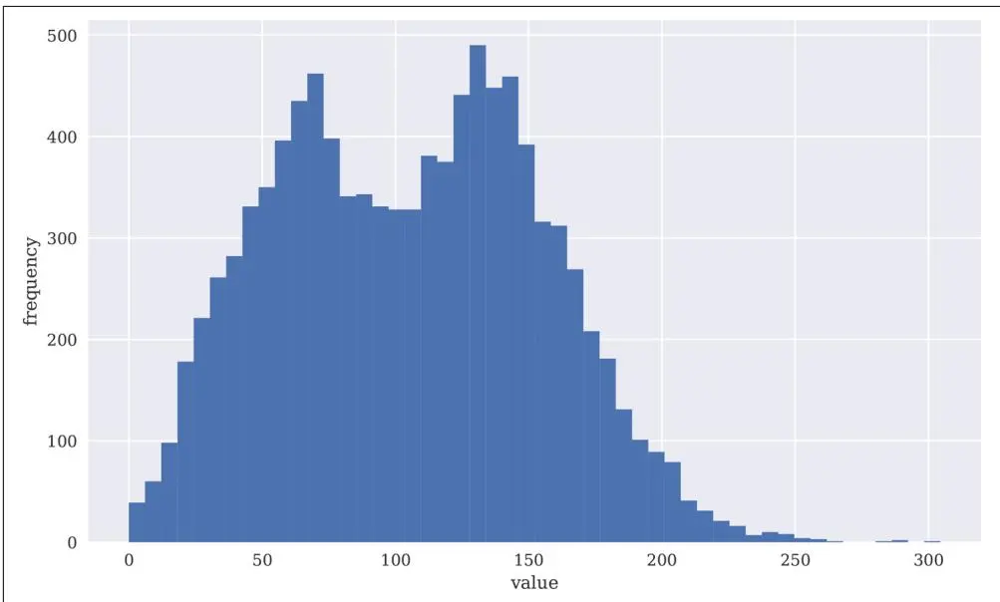
图12-13 到期时动态模拟的跳扩散过程

负向跳跃也可以在如前10条模拟指数水平路径中观察到，如图12-14所示：

```txt
In [51]: plt.figure(figsize=(10, 6))
plt.plot(S[:, :10], lw=1.5)
plt.xlabel('time')
plt.ylabel('index level');
```

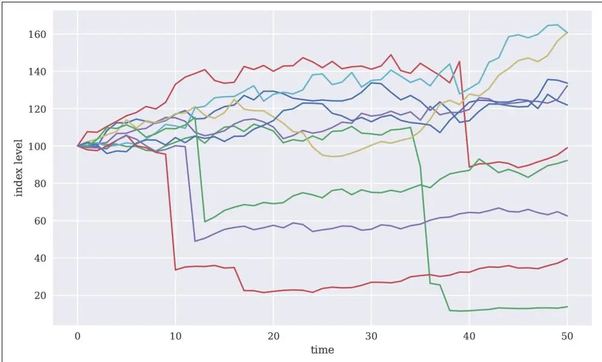
图12-14 动态模拟的跳扩散过程路径

## 方差缩减

由于迄今为止使用的 Python 函数生成的是伪随机数，并且由于抽取的样本大小不同，生成的数字集合可能不会表现出足够接近期望或预期值的统计特性。例如，人们期望一组标准正态分布的随机数的均值为0，标准差为1。让我们检查不同随机数集合表现出的统计量。为了实现现实的比较，固定随机数生成器的种子值：

```python
In [52]: print('%15s %15s' % ('Mean', 'Std. Deviation'))
print(31 * '-' )
for i in range(1, 31, 2):
    npr.seed(100)
    sn = npr.standard_normal(i ** 2 * 10000)
    print('%15.12f %15.12f' % (sn.mean(), sn.std()))
    Mean Std. Deviation
----
0.0011509448331.0062963546000.0028412040010.9959879671460.0019980820160.9977017142330.0013223220670.9977711869680.0005927113110.998388962646
-0.0003397307510.998399891450
-0.0002281090100.9986574293960.0002957687190.9988773333400.0002571077890.999284894532
```

结果显示，随着抽取次数增加，统计量”某种程度上”变得更好。<sup>2</sup> 但即使在我们最大的超过8,000,000个随机数的样本中，它们仍然与期望值不完全匹配。

幸运的是，有一些易于实现的通用方差缩减（Variance Reduction）技术可以改善（标准）正态分布前两阶矩的匹配。第一种技术是对偶变量法（Antithetic Variates）。该方法只需抽取所需随机数的一半，然后添加符号相反的同一组随机数。<sup>3</sup> 例如，如果随机数生成器（即相应的 Python 函数）抽取了0.5，则向集合中添加值为 –0.5 的另一个数。通过构造，此类数据集的均值必定为零。

在 NumPy 中，这可以通过 np.concatenate() 函数简洁地实现。以下重复之前的练习，这次使用对偶变量法：

```python
In [54]: sn = npr.standard_normal(int(10000 / 2))
    sn = np.concatenate((sn, -sn)) ①

In [55]: np.shape(sn) ②
Out[55]: (10000,)
In [56]: sn.mean() ③
Out[56]: 2.842170943040401e-18

In [57]: print('%15s %15s' % ('Mean', 'Std. Deviation'))
    print(31 * "-" )
    for i in range(1, 31, 2):
    npr.seed(1000)
    sn = npr.standard_normal(i ** 2 * int(10000 / 2))
    sn = np.concatenate((sn, -sn))
    print("%15.12f %15.12f" % (sn.mean(), sn.std()))
    Mean Std. Deviation
----.
0.0000000000001.009653753942
```

```csv
-0.0000000000001.0004137167830.0000000000001.002925061201
-0.0000000000001.0007552126730.0000000000001.001636910076
-0.0000000000001.000726758438
-0.0000000000001.0016212651490.0000000000001.001203722778
-0.000000000001.000556669784
-0.000000000001.000113464185
-0.00000000000.999435175324
-0.00000000000.999356961431
-0.0000000000.999641436845
-   -   -   -   -   -   -   -   -   -   -   -   -   -   -   -   -   -   -   -   -   -   -   -   -   -   -   -   -   -
```

连接两个 ndarray 对象……

……以达到所需的随机数数量。

结果均值为零（在标准浮点运算误差范围内）。

正如立即注意到的，这种方法完美地修正了一阶矩——由于数据集的构造方式，这并不令人惊讶。然而，这种方法对二阶矩（标准差）没有任何影响。使用另一种称为矩匹配（Moment Matching）的方差缩减技术，可以在一步中同时修正一阶矩和二阶矩：

```txt
In [58]: sn = npr.standard_normal(10000)
```

```txt
In [59]: sn.mean()
Out[59]: -0.001165998295162494
```

```txt
In [60]: sn.std()
Out[60]: 0.991255920204605
```

```txt
In [61]: sn_new = (sn - sn.mean()) / sn.std() ①
```

```txt
In [62]: sn_new.mean()
Out[62]: -2.3803181647963357e-17
```

```javascript
In [63]: sn_new.std()
Out[63]: 0.9999999999999999
```

在一步中同时修正一阶矩和二阶矩。

通过从每个随机数中减去均值，并将每个数除以标准差，该技术确保了随机数集合（几乎）完美地匹配标准正态分布所需的一阶矩和二阶矩。

以下函数利用方差缩减技术的洞见，生成用于过程模拟的标准正态随机数，可选择使用两种、一种或不使用方差缩减技术：

```python
In [64]: def gen_sn(M, I, anti_paths=True, mo_match=True):
    ''' 生成用于模拟的随机数的函数

参数
====================
M: int
    离散化的时间间隔数
I: int
    要模拟的路径数
anti_paths: boolean
    是否使用对偶变量法
mo_match: boolean
    是否使用矩匹配
if anti_paths is True:
    sn = npr.standard_normal((M + 1, int(I / 2)))
    sn = np.concatenate((sn, -sn), axis=1)
else:
    sn = npr.standard_normal((M + 1, I))
if mo_match is True:
    sn = (sn - sn.mean()) / sn.std()
return sn
```


## 向量化与模拟

使用 NumPy 进行向量化是在 Python 中实现蒙特卡洛模拟算法的一种自然、简洁且高效的方法。然而，使用 NumPy 向量化通常会带来更大的内存占用。关于可能同样快速的替代方案，请参见第10章。

## 估值

蒙特卡洛模拟最重要的应用之一是或有债权（期权、衍生品、混合工具等）的估值。简单来说，在风险中性世界中，或有债权的价值就是风险中性（鞅）测度下的贴现期望收益。该概率测度使所有风险因子（股票、指数等）以无风险短期利率漂移，从而使贴现过程成为鞅。根据资产定价基本定理（Fundamental Theorem of Asset Pricing），这种概率测度的存在等价于无套利条件。

金融期权体现了在给定到期日（欧式期权）或给定时间段内（美式期权）以给定价格（行权价）买入（看涨期权）或卖出（看跌期权）指定金融工具的权利。让我们首先考虑较简单的欧式期权估值情况。

## European Options

欧式看涨期权在到期日的收益由 $h ( S_{T} ) \equiv$ max $( S_{T} - K , 0 )$ 给出，其中 $S_{T}$ 是到期日 T 的指数水平，K 是行权价（Strike Price）。给定相关随机过程（如几何布朗运动）的风险中性测度，此类期权的价格由公式12-10给出。

公式12-10 风险中性期望定价

$$ $$
C_{0} = e^{- r T} \mathbf{E} _{0} ^{Q} (h (S_{T})) = e^{- r T} \int_{0} ^{\infty} h (s) q (s) d s


[第11章](ch11.md)介绍了如何通过蒙特卡洛模拟数值评估积分。该方法将在以下内容中使用并应用于公式12-10。公式12-11提供了欧式期权的相应蒙特卡洛估计量，其中 $\tilde{S} _{T} ^{i}$ 是到期时第 i 个模拟的指数水平。

公式12-11 风险中性蒙特卡洛估计量

$$ $$
\widetilde{C} _{0} = e^{- r T} \frac{1}{I} \sum_{i = 1} ^{I} h \left(\tilde{S} _{T} ^{i}\right)


现在考虑几何布朗运动的以下参数化和估值函数 gbm\_mcs\_stat()，该函数仅以行权价作为参数。这里仅模拟到期时的指数水平。作为参考，考虑行权价 K = 105 的情况：

```python
In [65]: S0 = 100.
    r = 0.05
    sigma = 0.25
    T = 1.0
    I = 50000

In [66]: def gbm_mcs_stat(K):
    ''' 通过蒙特卡洛模拟（到期指数水平）对 Black-Scholes-Merton 欧式看涨期权进行估值

    参数
    ========
    K: float
    （正数）期权的行权价

    返回
```

```python
-------------- C0: float
    欧式看涨期权的估计现值
    sn = gen_sn(1, I)
    # 模拟到期指数水平
    ST = S0 * np.exp((r - 0.5 * sigma ** 2) * T + sigma * math.sqrt(T) * sn[1])
    # 计算到期收益
    hT = np.maximum(ST - K, 0)
    # 计算 MCS 估计量
    C0 = math.exp(-r * T) * np.mean(hT)
    return C0

In [67]: gbm_mcs_stat(K=105.) ①
Out[67]: 10.044221852841922
```

## 欧式看涨期权的蒙特卡洛估计量值。

接下来，考虑动态模拟方法并允许在看涨期权之外加入欧式看跌期权。函数 gbm\_mcs\_dyna() 实现了该算法。代码还比较了相同行权价水平的看涨和看跌期权价格估计：

```python
In [68]: M = 50
In [69]: def gbm_mcs_dyna(K, option='call'):
    ''' 通过蒙特卡洛模拟（指数水平路径）对 Black-Scholes-Merton 欧式期权进行估值

参数
====================
K: float
    （正数）期权的行权价
option : string
    要估值的期权类型（'call' 看涨, 'put' 看跌）

返回
====================
C0: float
    欧式看涨期权的估计现值
,...
dt = T / M
# 模拟指数水平路径
S = np.zeros((M + 1, I))
S[0] = S0
sn = gen_sn(M, I)
for t in range(1, M + 1):
    S[t] = S[t - 1] * np.exp((r - 0.5 * sigma ** 2) * dt + sigma * math.sqrt(dt) * sn[t])
# 根据情况计算收益
if option == 'call':
```

```python
hT = np.maximum(S[-1] - K, 0)
else:
    hT = np.maximum(K - S[-1], 0)
# 计算 MCS 估计量
C0 = math.exp(-r * T) * np.mean(hT)
return C0

In [70]: gbm_mcs_dyna(K=110., option='call')
Out[70]: 7.950008525028434

In [71]: gbm_mcs_dyna(K=110., option='put')
Out[71]: 12.629934942682004
```

离散化的时间间隔数。

欧式看涨期权的蒙特卡洛估计量值。

欧式看跌期权的蒙特卡洛估计量值。

问题是，这些基于模拟的估值方法与 Black-Scholes-Merton 估值公式的基准值相比表现如何。为了找出答案，以下代码使用 bsm\_functions.py 模块中的欧式看涨期权解析定价公式（见第392页”Python 脚本”），生成一系列行权价的期权值/估计值。

首先，我们将静态模拟方法的结果与精确解析值进行比较：

```python
In [72]: from bsm_functions import bsm_call_value
```

```python
In [73]: stat_res = [] ①
dyna_res = [] ①
anal_res = [] ①
k_list = np.arange(80., 120.1, 5.) ②
np.random.seed(100)

In [74]: for K in k_list:
    stat_res.append(gbm_mcs_stat(K)) ③
    dyna_res.append(gbm_mcs_dyna(K)) ③
    anal_res.append(bsm_call_value(S0, K, T, r, sigma)) ③

In [75]: stat_res = np.array(stat_res) ④
dyna_res = np.array(dyna_res) ④
anal_res = np.array(anal_res) ④
```

实例化空列表对象以收集结果。

创建包含行权价范围的 ndarray 对象。

模拟/计算并收集所有行权价的期权值。

将列表对象转换为 ndarray 对象。

图12-15显示了结果。所有估值差异绝对值均小于1%。存在负值和正值差异：

```python
In [76]: plt.figure(figsize=(10, 6))
    fig, (ax1, ax2) = plt.subplots(2, 1, sharex=True, figsize=(10, 6))
    ax1.plot(k_list, anal_res, 'b', label='analytical')
    ax1.plot(k_list, stat_res, 'ro', label='static')
    ax1.set_ylabel('European call option value')
    ax1.legend(loc=0)
    ax1.set_ylim(bottom=0)
    wi = 1.0
    ax2.bar(k_list - wi / 2, (anal_res - stat_res) / anal_res * 100, wi)
    ax2.set_xlabel('strike')
    ax2.set_ylabel('difference in %')
    ax2.set_xlim(left=75, right=125);
Out[76]: <Figure size 720x432 with 0 Axes>
```

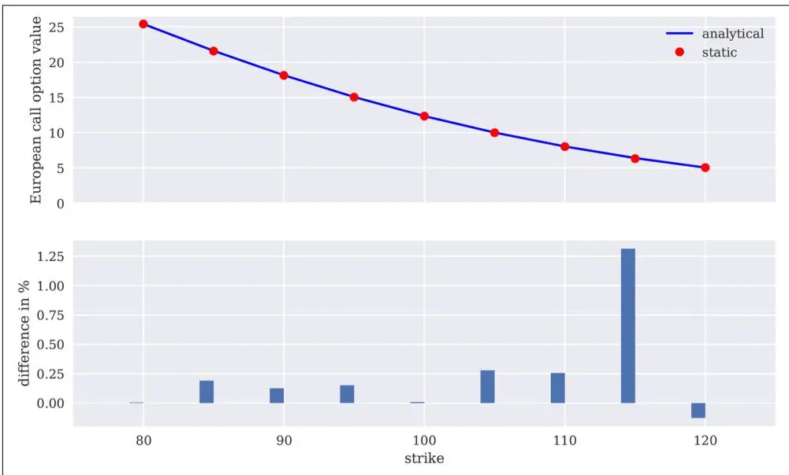
图12-15 解析期权值与蒙特卡洛估计量（静态模拟）

动态模拟和估值方法也呈现出类似的情况，其结果在图12-16中报告。同样，所有估值差异绝对值均小于1%，存在正偏差和负偏差。一般来说，可以通过调整使用的时间间隔数 M 和/或模拟路径数 I 来控制蒙特卡洛估计量的质量：

```python
In [77]: fig, (ax1, ax2) = plt.subplots(2, 1, sharex=True, figsize=(10, 6))
    ax1.plot(k_list, anal_res, 'b', label='analytical')
    ax1.plot(k_list, dyna_res, 'ro', label='dynamic')
```

```txt
ax1.set_ylabel('European call option value')
ax1.legend(loc=0)
ax1.set_ylim(bottom=0)
wi = 1.0
ax2.bar(k_list - wi / 2, (anal_res - dyna_res) / anal_res * 100, wi)
ax2.set_xlabel('strike')
ax2.set_ylabel('difference in %')
ax2.set_xlim(left=75, right=125);
```

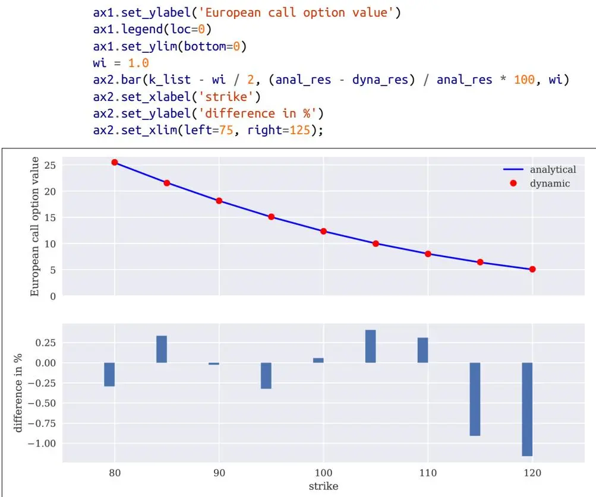
图12-16 解析期权值与蒙特卡洛估计量（动态模拟）

## 美式期权

与欧式期权相比，美式期权的估值更为复杂。在这种情况下，需要解决一个最优停时问题（Optimal Stopping Problem）才能得出期权的公允价值。公式12-12将美式期权的估值表述为这样一个问题。问题表述已经基于用于数值模拟的离散时间网格。因此从某种意义上说，更准确的表述是在百慕大式行权下给出期权价值。当时间区间趋近于零长度时，百慕大式期权的价值收敛于美式期权的价值。

公式12-12 美式期权价格作为最优停时问题

$$ $$
V_{0} = \sup_{\tau \in \{0, \Delta t, 2 \Delta t, \dots , T \}} e^{- r T} \mathbf{E} _{0} ^{Q} (h_{\tau} (S_{\tau}))


下面描述的算法称为最小二乘蒙特卡洛（Least-Squares Monte Carlo, LSM），来自 Longstaff 和 Schwartz（2001）的论文。可以证明，任何给定日期 t 的美式（百慕大式）期权价值为 $V_{t} ( s ) = \operatorname* {m a x} \left( h_{t} ( s ) , C_{t} ( s ) \right)$，其中 $C_{t} ( s ) = \mathbf{E} _{t} ^{Q} \big ( e^{- r \Delta t} V_{_{t + \Delta t}} ( S_{_{t + \Delta t}} ) \big | ~ S_{t} = s \big )$ 是指数水平为 $S_{t} {=} s$ 时所谓的期权持有价值（Continuation Value）。

现在假设我们在 M 个等长 Δt 的时间间隔上模拟了 I 条指数水平路径。定义 $\begin{array} {r} {Y_{t , i} \equiv e^{- r \Delta t} V_{t + \Delta t , i}} \end{array}$ 为路径 i 在时间 t 的模拟持有价值。我们不能直接使用这个数值，因为这将意味着完美预见。然而，我们可以使用所有此类模拟持有价值的横截面数据，通过最小二乘回归来估计（期望）持有价值。

给定一组基函数（Basis Function）$b_{d} , d = 1 , \cdots , D$，持有价值则由回归估计 $\begin{array} {r} {\hat{C} _{t , i} ~ = ~ \sum_{d = 1} ^{D} \alpha_{d , t} ^{*} \cdot b_{d} ( S_{t , i} )} \end{array}$ 给出，其中最优回归参数 α<sup>\*</sup> 是公式12-13中所述最小二乘问题的解。

公式12-13 美式期权估值的最小二乘回归

$\min_{\alpha_{1,t},\ldots,\alpha_{D,t}}\frac{1}{I}\sum_{i=1}^{I}\left(Y_{t,i}-\sum_{d=1}^{D}\alpha_{d,t}\cdot b_{d}(S_{t,i})\right)^{2}$

函数 gbm\_mcs\_amer() 同时为美式看涨和看跌期权实现了 LSM 算法：<sup>4</sup>

```python
In [78]: def gbm_mcs_amer(K, option='call'):
    ''' 通过蒙特卡洛模拟和 LSM 算法对 Black-Scholes-Merton 美式期权进行估值

    参数
    ========
    K: float
    （正数）期权的行权价
    option: string
    要估值的期权类型（'call' 看涨, 'put' 看跌）

    返回
    ========
    C0: float
    美式看涨期权的估计现值
    '''
    dt = T / M
    df = math.exp(-r * dt)
    # 模拟指数水平
    S = np.zeros((M + 1, I))
    S[0] = S0
```

```python
sn = gen_sn(M, I)
for t in range(1, M + 1):
    S[t] = S[t - 1] * np.exp((r - 0.5 * sigma ** 2) * dt + sigma * math.sqrt(dt) * sn[t])
# 根据情况计算收益
if option == 'call':
    h = np.maximum(S - K, 0)
else:
    h = np.maximum(K - S, 0)
# LSM 算法
V = np.copy(h)
for t in range(M - 1, 0, -1):
    reg = np.polyfit(S[t], V[t + 1] * df, 7)
    C = np.polyval(reg, S[t])
    V[t] = np.where(C > h[t], V[t + 1] * df, h[t])
# MCS 估计量
C0 = df * np.mean(V[1])
return C0
```

```txt
In [79]: gbm_mcs_amer(110., option='call')
Out[79]: 7.721705606305352
```

```python
In [80]: gbm_mcs_amer(110., option='put')
Out[80]: 13.609997625418051
```

欧式期权价值代表美式期权价值的下限。其差异通常称为提前行权溢价（Early Exercise Premium）。以下内容对与之前相同行权价范围的欧式和美式期权价值进行比较，以估计提前行权溢价，这次使用看跌期权：<sup>5</sup>

```python
In [81]: euro_res = []
amer_res = []
```

```python
In [82]: k_list = np.arange(80., 120.1, 5.)
```

```python
In [83]: for K in k_list:
    euro_res.append(gbm_mcs_dyna(K, 'put'))
    amer_res.append(gbm_mcs_amer(K, 'put'))
```

```python
In [84]: euro_res = np.array(euro_res)
amer_res = np.array(amer_res)
```

图12-17显示，在所选择的行权价范围内，提前行权溢价可达10%：

```python
In [85]: fig, (ax1, ax2) = plt.subplots(2, 1, sharex=True, figsize=(10, 6))
    ax1.plot(k_list, euro_res, 'b', label='European put')
    ax1.plot(k_list, amer_res, 'ro', label='American put')
```

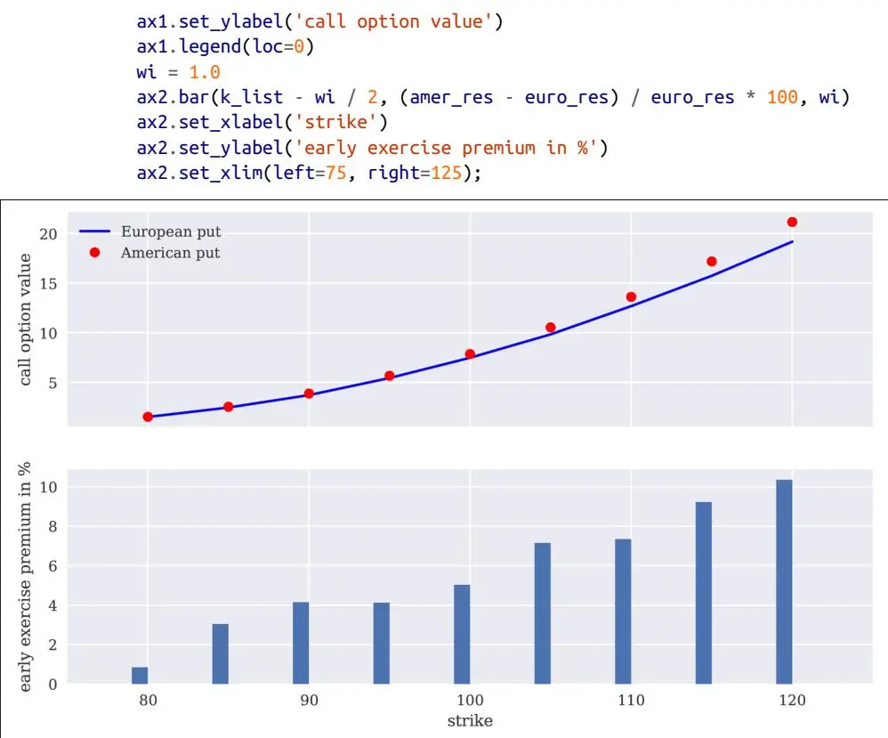
图12-17 欧式 vs. 美式蒙特卡洛估计量

## 风险度量

除估值外，风险管理是随机方法和模拟的另一个重要应用领域。本节说明当今金融行业中两个最常用风险度量的计算/估计。

## 风险价值

风险价值（Value-at-Risk, VaR）是使用最广泛、也最具争议的风险度量之一。从业者喜爱其直观性，但许多人在理论层面上对其广泛讨论和批评，主要涉及其捕捉尾端风险（Tail Risk）的能力有限（稍后将详述）。简而言之，VaR 是一个以货币单位（如美元、欧元、日元）表示的数字，指示在给定时间段内、以某个置信水平（概率）不会超过的（组合、单个头寸等的）损失。

考虑一个当前价值100万美元的股票头寸，在30天（一个月）的时间段内、99%置信水平下的 VaR 为50,000美元。这个 VaR 数字表示，在99%的概率下（即100例中99例），30天内的预期损失不会超过50,000美元。然而，它并未说明一旦损失超过50,000美元时损失的大小——即最大损失是100,000美元还是500,000美元，以及这种特定"高于 VaR 的损失"的概率是多少。它只说明有1%的概率会发生至少50,000美元或更高的损失。

假设 Black-Scholes-Merton 框架，考虑以下参数化和对未来日期 T = 30/365（30天期间）的指数水平模拟。VaR 的估计需要将模拟的绝对盈亏相对于当前头寸价值进行排序，即从最大损失到最大利润。图12-18显示了模拟绝对表现值的直方图：

```python
In [86]: S0 = 100
    r = 0.05
    sigma = 0.25
    T = 30 / 365.
    I = 10000

In [87]: ST = S0 * np.exp((r - 0.5 * sigma ** 2) * T + sigma * np.sqrt(T) * npr.standard_normal(I)) ①

In [88]: R_gbm = np.sort(ST - S0) ②

In [89]: plt.figure(figsize=(10, 6))
    plt.hist(R_gbm, bins=50)
    plt.xlabel('absolute return')
    plt.ylabel('frequency');
```

模拟几何布朗运动的期末值。

计算每次模拟运行的绝对盈亏并对值进行排序。

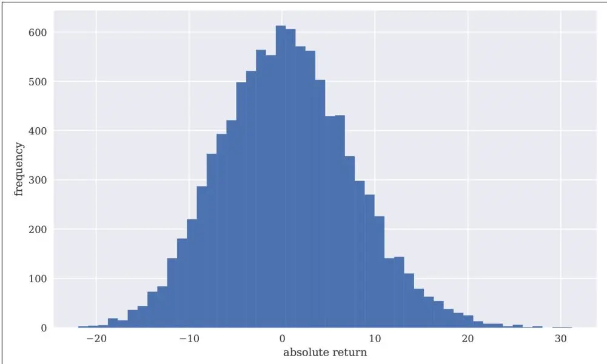
图12-18 模拟的绝对盈亏（几何布朗运动）

有了包含排序结果的 ndarray 对象，scs.scoreatpercentile() 函数即可完成工作。所需要做的就是定义感兴趣的百分位数（以百分比值表示）。在列表对象 percs 中，0.1 转换为置信水平 100% – 0.1% = 99.9%。在这种情况下，给定置信水平 99.9% 的30天 VaR 为18.8个货币单位，而在90%置信水平下为8.5：

```python
In [91]: percs = [0.01, 0.1, 1., 2.5, 5.0, 10.0]
var = scs.scoreatpercentile(R_gbm, percs)
print('%16s %16s' % ('Confidence Level', 'Value-at-Risk'))
print(33 * '-' )
for pair in zip(percs, var):
    print('%16.2f %16.3f' % (100 - pair[0], -pair[1]))
Confidence Level Value-at-Risk
99.9921.81499.9018.83799.0015.23097.5012.81695.0010.82490.008.504
```

作为第二个示例，回顾 Merton 的跳扩散框架，它是动态模拟的。在这种情况下，由于跳跃分量为负均值，图12-19中模拟盈亏呈现类似双峰分布。从正态分布的角度来看，可以看到明显的左厚尾（Left Fat Tail）：

```python
In [92]: dt = 30. / 365 / M
    rj = lamb * (math.exp(mu + 0.5 * delta ** 2) - 1)

In [93]: S = np.zeros((M + 1, I))
    S[0] = S0
    sn1 = npr.standard_normal((M + 1, I))
    sn2 = npr.standard_normal((M + 1, I))
    poi = npr.poisson(lamb * dt, (M + 1, I))
    for t in range(1, M + 1, 1):
    S[t] = S[t - 1] * (np.exp((r - rj - 0.5 * sigma ** 2) * dt
    + sigma * math.sqrt(dt) * sn1[t])
    + (np.exp(mu + delta * sn2[t]) - 1)
    * poi[t])
    S[t] = np.maximum(S[t], 0)

In [94]: R_jd = np.sort(S[-1] - S0)

In [95]: plt.figure(figsize=(10, 6))
    plt.hist(R_jd, bins=50)
    plt.xlabel('absolute return')
    plt.ylabel('frequency');
```

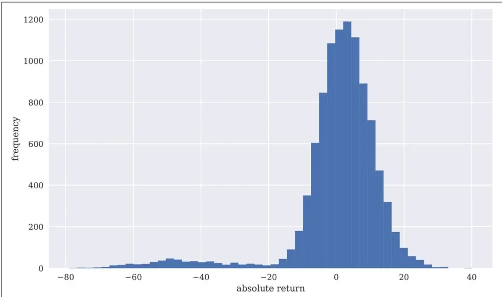
图12-19 模拟的绝对盈亏（跳扩散）

对于该过程和参数化，90%水平下的30天 VaR 与几何布朗运动几乎相同，而在99.9%水平下则高出三倍以上（70 vs. 18.8个货币单位）：

```python
In [96]: percs = [0.01, 0.1, 1., 2.5, 5.0, 10.0]
var = scs.scoreatpercentile(R_jd, percs)
print('%16s %16s' % ('Confidence Level', 'Value-at-Risk'))
print(33 * '-'')
for pair in zip(percs, var):
    print('%16.2f %16.3f' % (100 - pair[0], -pair[1]))
Confidence Level Value-at-Risk
99.9976.52099.9069.39699.0055.97497.5046.40595.0024.19890.008.836
```

这说明了标准 VaR 度量在捕捉金融市场中经常遇到的尾端风险时存在的问题。

为进一步说明这一点，图12-20最后以图形方式直接比较了两种情况下的 VaR 度量。如图所示，在给定一系列典型置信水平的情况下，VaR 度量的表现完全不同：

```matlab
In [97]: percs = list(np.arange(0.0, 10.1, 0.1))
gbm_var = scs.scoreatpercentile(R_gbm, percs)
jd_var = scs.scoreatpercentile(R_jd, percs)

In [98]: plt.figure(figsize=(10, 6))
plt.plot(percs, gbm_var, 'b', lw=1.5, label='GBM')
plt.plot(percs, jd_var, 'r', lw=1.5, label='JD')
plt.legend(loc=4)
plt.xlabel('100 - confidence level [%]')
plt.ylabel('value-at-risk')
plt.ylim(ymax=0.0);
```

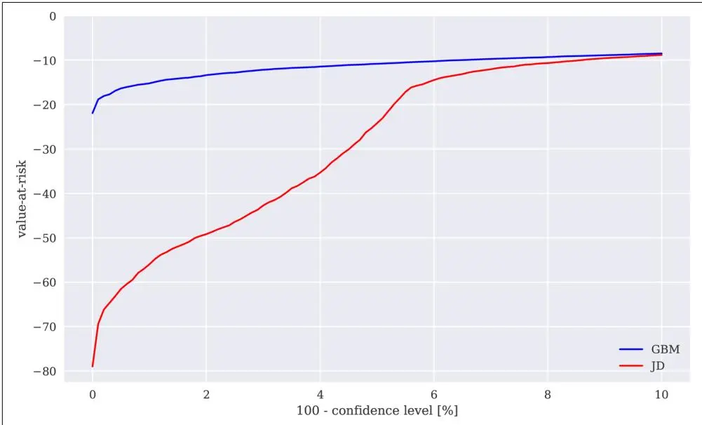
图12-20 几何布朗运动与跳扩散的风险价值

## 信用估值调整

其他重要的风险度量包括信用风险价值（Credit Value-at-Risk, CVaR）和信用估值调整（Credit Valuation Adjustment, CVA），后者由 CVaR 导出。粗略来说，CVaR 是衡量交易对手可能无法履行其义务（例如交易对手破产）所产生风险的指标。在这种情况下，需要做两个主要假设：违约概率和（平均）损失水平。

具体来说，再次考虑 Black-Scholes-Merton 基准框架，使用以下代码中的参数化。在最简单的情况下，考虑固定的（平均）损失水平 L 和交易对手的固定违约概率 p（每年）。使用泊松分布，如下生成违约场景，考虑到违约只能发生一次：

```python
In [99]: S0 = 100.
    r = 0.05
    sigma = 0.2
    T = 1.
    I = 100000

In [100]: ST = S0 * np.exp((r - 0.5 * sigma ** 2) * T + sigma * np.sqrt(T) * npr.standard_normal(I))

In [101]: L = 0.5
```

```python
In [102]: p = 0.01
In [103]: D = npr.poisson(p * T, I)
In [104]: D = np.where(D > 1, 1, D)
```

定义损失水平。

定义违约概率。

模拟违约事件。

将违约限制为一次事件。

如果没有违约，未来指数水平的风险中性价值应等于资产的当前价值（数值误差导致的差异除外）。CVaR 和经信用风险调整后的资产现值如下：

```txt
In [105]: math.exp(-r * T) * np.mean(ST)
Out[105]: 99.94767178982691
In [106]: CVaR = math.exp(-r * T) * np.mean(L * D * ST)
CVaR
Out[106]: 0.4883560258963962
In [107]: S0_CVA = math.exp(-r * T) * np.mean((1 - L * D) * ST)
S0_CVA
Out[107]: 99.45931576393053
In [108]: S0_adj = S0 - CVaR
S0_adj
Out[108]: 99.5116439741036
```

T 时刻资产贴现的平均模拟值。

CVaR 作为违约情况下未来损失的贴现平均值。

T 时刻资产贴现的平均模拟值，经违约模拟损失调整。

经模拟 CVaR 调整后的资产当前价格。

在这个特定的模拟示例中，观察到大约1,000次信用风险损失，考虑到假设的1%违约概率和100,000条模拟路径，这是符合预期的。图12-21显示了因违约导致的损失的完整频率分布。当然，在绝大多数情况下（即大约100,000例中的99,000例），没有观察到损失：

```matlab
In [109]: np.count_nonzero(L * D * ST)
Out[109]: 978
In [110]: plt.figure(figsize=(10, 6))
plt.hist(L * D * ST, bins=50)
plt.xlabel('loss')
plt.ylabel('frequency')
plt.ylim(ymax=175);
```

违约事件及其相应的损失事件次数。

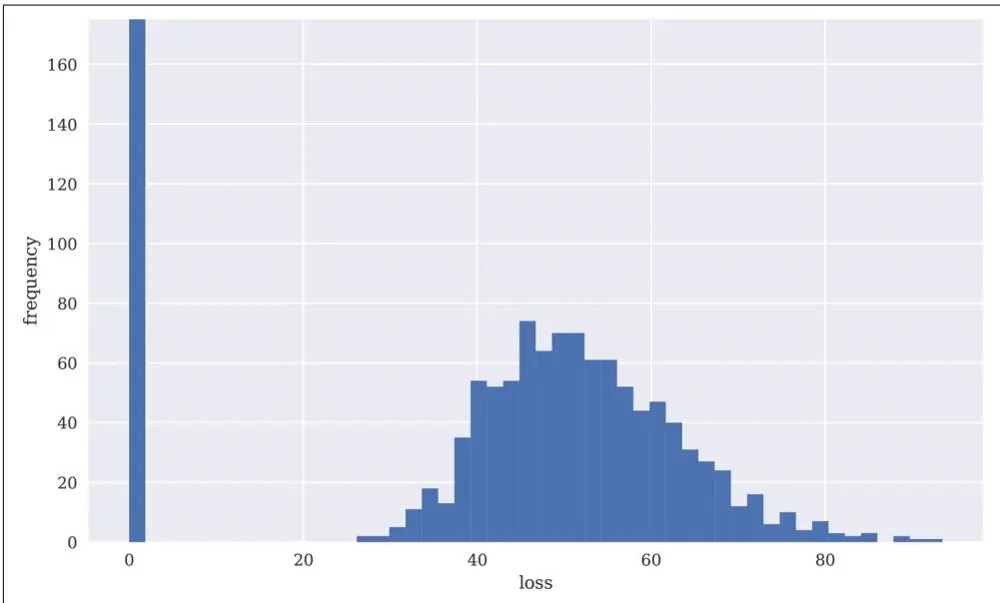
图12-21 风险中性预期违约导致的损失（股票）

现在考虑欧式看涨期权的情况。其行权价为100时，价值约为10.4个货币单位。在相同的违约概率和损失水平假设下，CVaR 约为5美分：

```txt
In [111]: K = 100.
    hT = np.maximum(ST - K, 0)

In [112]: C0 = math.exp(-r * T) * np.mean(hT) ①
    C0 ①

Out[112]: 10.396916492839354

In [113]: CVaR = math.exp(-r * T) * np.mean(L * D * hT) ②
    CVaR ②

Out[113]: 0.05159099858923533

In [114]: C0_CVA = math.exp(-r * T) * np.mean((1 - L * D) * hT) ③
```

```txt
C0_CVA 3
Out[114]: 10.34532549425012
```

欧式看涨期权的蒙特卡洛估计量值。

CVaR 作为违约情况下未来损失的贴现平均值。

经违约模拟损失调整后的欧式看涨期权蒙特卡洛估计量值。

与常规资产相比，期权的情况具有略微不同的特征。虽然总共有1,000次违约，但仅观察到500多次因违约导致的损失。这是因为期权到期收益有很大概率为零。图12-22显示，期权的 CVaR 与常规资产情况相比具有截然不同的频率分布：

```txt
In [115]: np.count_nonzero(L * D * hT) 1
Out[115]: 538
```

```txt
In [116]: np.count_nonzero(D) ②
Out[116]: 978
```

```python
In [117]: I - np.count_nonzero(hT) 3
Out[117]: 44123
```

```matlab
In [118]: plt.figure(figsize=(10, 6))
plt.hist(L * D * hT, bins=50)
plt.xlabel('loss')
plt.ylabel('frequency')
plt.ylim(ymax=350);
```

因违约导致的损失次数。

违约次数。

期权到期无价值的案例数。

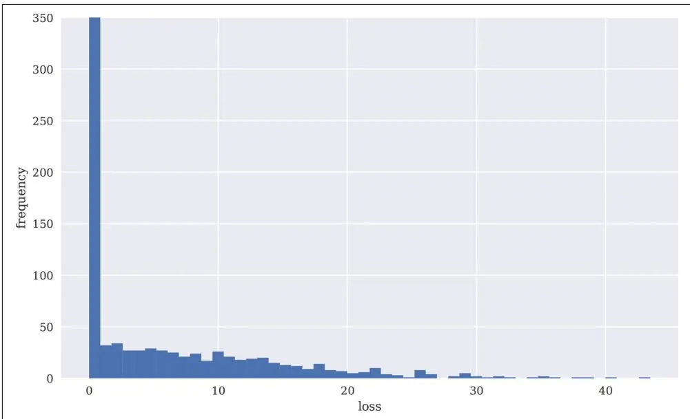
图12-22 风险中性预期违约导致的损失（看涨期权）

## Python 脚本

以下展示了与 Black-Scholes-Merton 模型相关的核心函数的实现，用于欧式（看涨）期权的解析定价。关于模型的详细信息，请参见 Black 和 Scholes（1973）以及 Merton（1973）。参见附录B中基于 Python 类的替代实现。

```python
#
# Black-Scholes-Merton 模型中的欧式看涨期权估值
# 包括 vega 函数和隐含波动率估计
# bsm_functions.py
#


#
def bsm_call_value(S0, K, T, r, sigma):
    ''' BSM 模型中欧式看涨期权的估值。
    解析公式。

    参数
    ======-
    S0: float
    初始股票/指数水平
    K: float
```

```python
strike price
T: float
到期日（以年分数表示）
r: float
恒定无风险短期利率
sigma: float
扩散项中的波动率因子

返回
=====
value: float
欧式看涨期权的现值
',
from math import log, sqrt, exp
from scipy import stats

S0 = float(S0)
d1 = (log(S0 / K) + (r + 0.5 * sigma ** 2) * T) / (sigma * sqrt(T))
d2 = (log(S0 / K) + (r - 0.5 * sigma ** 2) * T) / (sigma * sqrt(T))
# stats.norm.cdf --> 正态分布的累积分布函数
value = (S0 * stats.norm.cdf(d1, 0.0, 1.0) -
K * exp(-r * T) * stats.norm.cdf(d2, 0.0, 1.0))
return value

def bsm_vega(S0, K, T, r, sigma):
''' BSM 模型中欧式期权的 Vega。

参数
=====
S0: float
初始股票/指数水平
K: float
行权价
T: float
到期日（以年分数表示）
r: float
恒定无风险短期利率
sigma: float
扩散项中的波动率因子

返回
=====
vega: float
BSM 公式对 sigma 的偏导数，即 vega

',
from math import log, sqrt
from scipy import stats
```

```python
S0 = float(S0)
d1 = (log(S0 / K) + (r + 0.5 * sigma ** 2) * T) / (sigma * sqrt(T))
vega = S0 * stats.norm.pdf(d1, 0.0, 1.0) * sqrt(T)
return vega

# 隐含波动率函数

def bsm_call_imp_vol(S0, K, T, r, C0, sigma_est, it=100):
    ''' BSM 模型中欧式看涨期权的隐含波动率。

参数
====================
S0: float
    初始股票/指数水平
K: float
    行权价
T: float
    到期日（以年分数表示）
r: float
    恒定无风险短期利率
sigma_est: float
    隐含波动率的估计值
it: integer
    迭代次数

返回
====================
sigma_est: float
    数值估计的隐含波动率

for i in range(it):
    sigma_est -= ((bsm_call_value(S0, K, T, r, sigma_est) - C0) /
    bsm_vega(S0, K, T, r, sigma_est))
    return sigma_est
```

## 结论

本章涉及蒙特卡洛模拟在金融中应用的重要方法和技术。具体来说，首先展示了如何基于不同分布律生成伪随机数，然后讨论了随机变量和随机过程的模拟——这在许多金融领域都很重要。本章深入讨论了两个应用领域：欧式与美式行权期权的估值，以及风险价值（VaR）和信用估值调整（CVA）等风险度量的估计。

本章说明，Python 结合 NumPy 非常适合实现即使是计算密集型的任务，如通过蒙特卡洛模拟对美式期权进行估值。这主要是因为 NumPy 的大多数函数和类都是用 C 实现的，通常比纯 Python 代码具有显著的速度优势。另一个好处是由于向量化操作，生成的代码紧凑且可读性强。

## 延伸阅读

将蒙特卡洛模拟引入金融领域的原始文章：

• Boyle, Phelim (1977). “Options: A Monte Carlo Approach.” Journal of Financial Economics, Vol. 4, No. 4, pp. 322–338.

本章引用的其他原始论文（另见第18章）：

• Black, Fischer, and Myron Scholes (1973). “The Pricing of Options and Corporate Liabilities.” Journal of Political Economy, Vol. 81, No. 3, pp. 638–659.

• Cox, John, Jonathan Ingersoll, and Stephen Ross (1985). “A Theory of the Term Structure of Interest Rates.” Econometrica, Vol. 53, No. 2, pp. 385–407.

• Heston, Steven (1993). “A Closed-Form Solution for Options with Stochastic Volatility with Applications to Bond and Currency Options.” The Review of Financial Studies, Vol. 6, No. 2, 327–343.

• Merton, Robert (1973). “Theory of Rational Option Pricing.” Bell Journal of Economics and Management Science, Vol. 4, pp. 141–183.

• Merton, Robert (1976). “Option Pricing When the Underlying Stock Returns Are Discontinuous.” Journal of Financial Economics, Vol. 3, No. 3, pp. 125–144.

以下书籍更深入地涵盖了本章的主题（但第一本不涉及技术实现细节）：

• Glasserman, Paul (2004). Monte Carlo Methods in Financial Engineering. New York: Springer.

• Hilpisch, Yves (2015). Derivatives Analytics with Python. Chichester, England: Wiley Finance.

直到世纪之交，才发表了通过蒙特卡洛模拟对美式期权进行有效估值的方法：

• Longstaff, Francis, and Eduardo Schwartz (2001). “Valuing American Options by Simulation: A Simple Least Squares Approach.” Review of Financial Studies, Vol. 14, No. 1, pp. 113–147.

对信用风险的广泛和深入讨论见：

• Duffie, Darrell, and Kenneth Singleton (2003). Credit Risk—Pricing, Measurement, and Management. Princeton, NJ: Princeton University Press.
