# 统计学


除了真相，我可以用统计数据证明任何事情。
—George Canning


统计学（Statistics）是一个广阔的领域，但它提供的工具和结果已成为金融领域不可或缺的部分。这解释了为什么 R 等特定领域语言在金融行业中如此流行。统计模型越精细复杂，拥有易用且高性能的计算解决方案就越重要。

一本像这样的书中的单一章节无法全面展现统计学的丰富性和深度。因此，与许多其他章节一样，本章的方法是聚焦于精选的主题，这些主题看似重要，或者为使用 Python 处理特定任务提供了良好的起点。本章有四个重点：

"正态性检验" 见第398页

大量重要的金融模型，如现代投资组合理论（Modern Portfolio Theory, MPT，即均值-方差投资组合理论）和资本资产定价模型（Capital Asset Pricing Model, CAPM），都依赖于证券收益率呈正态分布的假设。因此，本章介绍了检验给定时间序列收益率正态性的方法。

"投资组合优化" 见第415页

MPT 可被视为统计学在金融领域最成功的应用之一。从20世纪50年代初先驱 Harry Markowitz 的工作开始，这一理论开始用严谨的数学和统计方法取代人们在金融市场投资中对判断和经验的依赖。在这个意义上，它或许是金融领域第一个真正的量化模型和方法。

## "贝叶斯统计学" 见第429页

在概念层面上，贝叶斯统计学（Bayesian Statistics）引入了代理信念（Beliefs）和信念更新的概念。在线性回归中，这可能表现为回归参数具有统计分布而非单一点估计（例如回归线的截距和斜率）。如今，贝叶斯方法在金融领域被广泛使用，因此本节通过一些示例来说明贝叶斯方法。

## "机器学习" 见第444页

机器学习（Machine Learning，或称统计学习）基于先进的统计方法，被认为是人工智能（AI）的子学科。与统计学本身一样，机器学习提供了丰富的方法和模型来从数据集中学习，并根据所学内容进行预测。区分了不同的学习算法，如监督学习（Supervised Learning）或无监督学习（Unsupervised Learning）。算法解决的问题类型也有所不同，如估计或分类。本章中的示例属于分类的监督学习范畴。

本章的许多方面涉及日期和/或时间信息。请参阅附录A，了解如何使用 Python、NumPy 和 pandas 处理此类数据。

## 正态性检验

正态分布（Normal Distribution）可以被认为是金融中最重要的分布，也是金融理论的主要统计基石之一。以下金融理论的基石在很大程度上依赖于金融工具收益率呈正态分布的假设：<sup>1</sup>

## 投资组合理论

当股票收益率呈正态分布时，最优投资组合选择可以转化为一个框架，其中只有（期望）平均收益率、收益率方差（或波动率）以及不同股票之间的协方差与投资决策（即最优投资组合构成）相关。

## 资本资产定价模型

同样，当股票收益率呈正态分布时，单只股票的价格可以优雅地表示为与广泛市场指数的线性关系；这种关系通常通过衡量单只股票与市场指数共同运动的指标——贝塔（Beta 或 β）来表示。

## 有效市场假说

有效市场（Efficient Market）是指价格反映所有可用信息的市场，其中"所有"可以狭义或广义地定义（例如，"所有公开可用"信息 vs. 也包括"仅私下可用"信息）。如果该假说成立，那么股票价格随机波动，收益率呈正态分布。

## 期权定价理论

布朗运动是建模金融工具随机价格运动的基准模型；著名的 Black-Scholes-Merton 期权定价公式使用几何布朗运动作为股票随时间随机价格波动的模型，导致价格呈对数正态分布，收益率呈正态分布。

这个远非详尽无遗的列表凸显了正态性假设在金融中的重要性。

## 基准案例

为了为进一步分析奠定基础，首先从几何布朗运动开始——它是金融建模中的典型随机过程之一。关于几何布朗运动 S 的路径特征，可以得出以下结论：

## 正态对数收益率

在时间 0 < s < t 之间的对数收益率 log $\begin{array} {r} {\frac{\boldsymbol{S} _{t}} {\boldsymbol{S} _{s}} = \log \boldsymbol{S} _{t} - \log \boldsymbol{S} _{s}} \end{array}$ 呈正态分布。

## 对数正态值

在任何时间 t > 0，S 的值呈对数正态分布。

首先配置绘图设置。然后导入一系列 Python 包，包括 scipy.stats 和 statsmodels.api：

```python
In [1]: import math
import numpy as np
import scipy.stats as scs
import statsmodels.api as sm
from pylab import mpl, plt

In [2]: plt.style.use('seaborn')
mpl.rcParams['font.family'] = 'serif'
%matplotlib inline
```

以下使用函数 gen\_paths() 生成几何布朗运动的样本蒙特卡洛路径（另见[第12章](ch12.md)）：

```python
In [3]: def gen_paths(S0, r, sigma, T, M, I):
    ''' 生成几何布朗运动的蒙特卡洛路径。

参数
====================
S0: float
    初始股票/指数价值
r: float
    恒定短期利率
sigma: float
    恒定波动率
T: float
    最终时间水平
M: int
    时间步长/间隔数
I: int
    要模拟的路径数

返回
====================
paths: ndarray, shape (M + 1, I)
    给定参数下的模拟路径
,...
dt = T / M
paths = np.zeros((M + 1, I))
paths[0] = S0
for t in range(1, M + 1):
    rand = np.random.standard_normal(I)
    rand = (rand - rand.mean()) / rand.std() ①  # 匹配一阶和二阶矩
    paths[t] = paths[t - 1] * np.exp((r - 0.5 * sigma ** 2) * dt + sigma * math.sqrt(dt) * rand)
return paths
```

几何布朗运动的向量化 Euler 离散化。

模拟基于此处显示的蒙特卡洛模拟参数化，结合函数 gen\_paths() 生成 250,000 条路径，每条路径 50 个时间步。图13-1展示了前 10 条模拟路径：

```python
In [4]: S0 = 100.
    r = 0.05
    sigma = 0.2
    T = 1.0
    M = 50
    I = 250000
    np.random.seed(1000)

In [5]: paths = gen_paths(S0, r, sigma, T, M, I)

In [6]: S0 * math.exp(r * T)
```

```javascript
Out[6]: 105.12710963760242
In [7]: paths[-1].mean( ) ⑦
Out[7]: 105.12645392478755
In [8]: plt.figure(figsize=(10, 6))
plt.plot(paths[:, :10])
plt.xlabel('time steps')
plt.ylabel('index level');
```

模拟过程的初始值。

恒定短期利率。

恒定波动率因子。

以年分数表示的时间跨度。

时间间隔数。

模拟过程的数量。

期望值与平均模拟值。

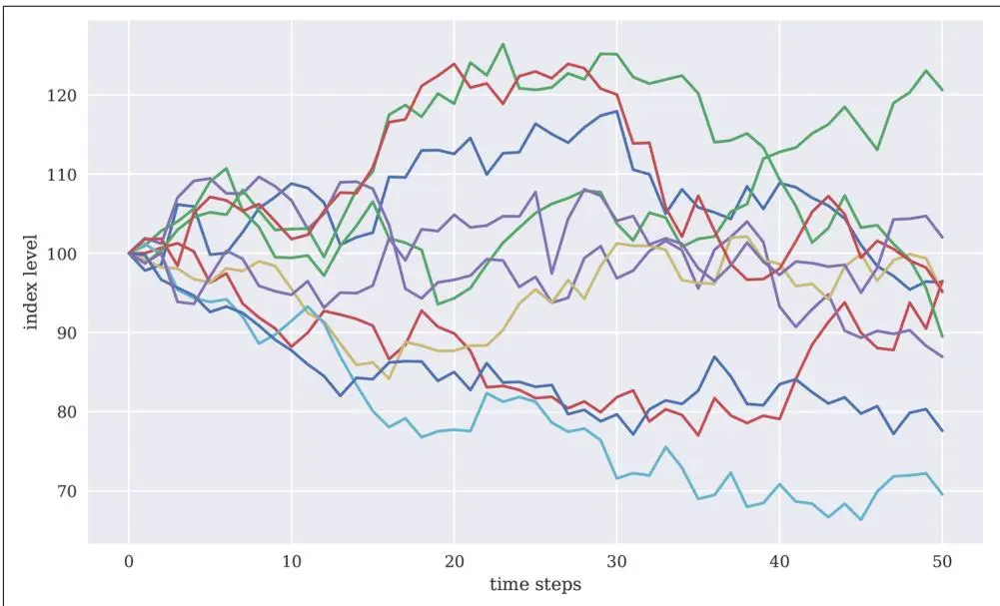
图13-1 几何布朗运动的十条模拟路径

主要关注的是对数收益率（Log Returns）的分布。为此，基于模拟路径创建一个包含所有对数收益率的 ndarray 对象。这里展示了一条模拟路径及其产生的对数收益率：

```txt
In [9]: paths[:, 0].round(4)
Out[9]: array([100., 97.821, 98.5573, 106.1546, 105.899, 99.8363, 100.0145, 102.6589, 105.6643, 107.1107, 108.7943, 108.2449, 106.4105, 101.0575, 102.0197, 102.6052, 109.6419, 109.5725, 112.9766, 113.0225, 112.5476, 114.5585, 109.942, 112.6271, 112.7502, 116.3453, 115.0443, 113.9586, 115.8831, 117.3705, 117.9185, 110.5539, 109.9687, 104.9957, 108.0679, 105.7822, 105.1585, 104.3304, 108.4387, 105.5963, 108.866, 108.3284, 107.0077, 106.0034, 104.3964, 101.0637, 98.3776, 97.135, 95.4254, 96.4271, 96.3386])
```

```python
In [10]: log_returns = np.log(paths[1:] / paths[:-1])
```

```python
In [11]: log_returns[:, 0].round(4)
Out[11]: array([ -0.022, 0.0075, 0.0743, -0.0024, -0.059, 0.0018, 0.0261, 0.0289, 0.0136, 0.0156, -0.0051, -0.0171, -0.0516, 0.0095, 0.0057, 0.0663, -0.0006, 0.0306, 0.0004, -0.0042, 0.0177, -0.0411, 0.0241, 0.0011, 0.0314, -0.0112, -0.0095, 0.0167, 0.0128, 0.0047, -0.0645, -0.0053, -0.0463, 0.0288, -0.0214, -0.0059, -0.0079, 0.0386, -0.0266, 0.0305, -0.0049, -0.0123, -0.0094, -0.0153, -0.0324, -0.0269, -0.0127, -0.0178, 0.0104, -0.0009])
```

这也是在金融市场中可能会遇到的情况：有些日子投资获得正收益，有些日子则相对于最近财富状况发生亏损。

函数 print\_statistics() 是 scipy.stats 子包中 scs.describe() 函数的包装器。它主要生成更易于人类阅读的输出，显示给定（历史或模拟）数据集的均值、偏度（Skewness）或峰度（Kurtosis）等统计量：

```python
In [13]: def print_statistics(array):
    ''' 打印选定的统计量。

参数
====================
array: ndarray
    要生成统计量的对象
'''
sta = scs.describe(array)
print('%14s %15s' % ('statistic', 'value'))
print(30 * '-'')
print('%14s %15.5f' % ('size', sta[0]))
print('%14s %15.5f' % ('min', sta[1][0]))
print('%14s %15.5f' % ('max', sta[1][1]))
print('%14s %15.5f' % ('mean', sta[2]))
```

```python
print('%14s %15.5f' % ('std', np.sqrt(sta[3])))
print('%14s %15.5f' % ('skew', sta[4]))
print('%14s %15.5f' % ('kurtosis', sta[5]))

In [14]: print_statistics(log_returns.flatten())
    statistic value
    size 12500000.00000
    min -0.15664
    max 0.15371
    mean 0.00060
    std 0.02828
    skew 0.00055
    kurtosis 0.00085

In [15]: log_returns.mean() * M + 0.5 * sigma ** 2
Out[15]: 0.05000000000000005

In [16]: log_returns.std() * math.sqrt(M)
Out[16]: 0.20000000000000015
```

经过 Itô 项修正后的年化平均对数收益率。<sup>2</sup>

## 年化波动率，即对数收益率的年化标准差。

该情况下的数据集包含12,500,000个数据点，值主要位于 +/-0.15 之间。预期年化平均收益率为0.05（经 Itô 项修正后），标准差（波动率）为0.2。年化值与这些值几乎完美匹配（将平均值乘以50并修正 Itô 项；将标准差乘以50）。良好匹配的一个原因是在抽取随机数时使用了矩匹配进行方差缩减（见第372页"方差缩减"）。

图13-2比较了模拟对数收益率的频率分布与给定 r 和 sigma 参数化下正态分布的概率密度函数（Probability Density Function, PDF）。使用的函数是 scipy.stats 子包中的 norm.pdf()。显然拟合得非常好：

```python
In [17]: plt.figure(figsize=(10, 6))
    plt.hist(log_returns.flatten(), bins=70, density=True,
    label='frequency', color='b')
    plt.xlabel('log return')
    plt.ylabel('frequency')
    x = np.linspace(plt.axis()[0], plt.axis()[1])
    plt.plot(x, scs.norm.pdf(x, loc=r / M, scale=sigma / np.sqrt(M)),
```

绘制假设参数下的 PDF，已缩放到间隔长度。

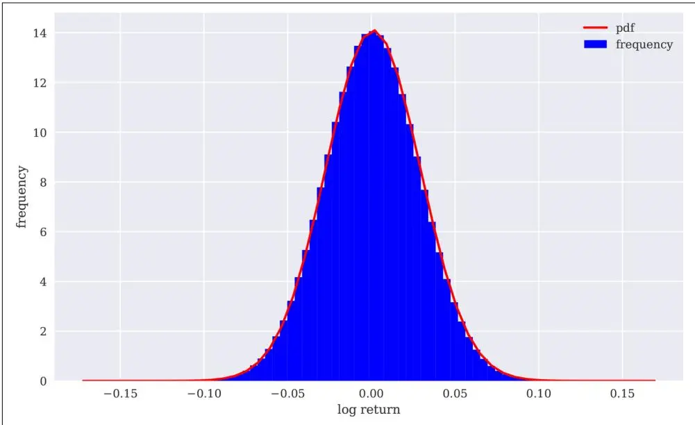
图13-2 几何布朗运动对数收益率直方图与正态密度函数

将频率分布（直方图）与理论 PDF 进行比较并不是图形化"检验"正态性的唯一方法。所谓的分位数-分位数图（Quantile-Quantile Plot, QQ 图）也非常适合此任务。在这里，样本分位数与理论分位数进行比较。对于正态分布的样本数据集，这种图可能如图13-3所示，绝大多数分位数值（点）位于一条直线上：

```txt
In [18]: sm.qqplot(log_returns.flatten()[::-500], line='s')
plt.xlabel('theoretical quantiles')
plt.ylabel('sample quantiles');
```

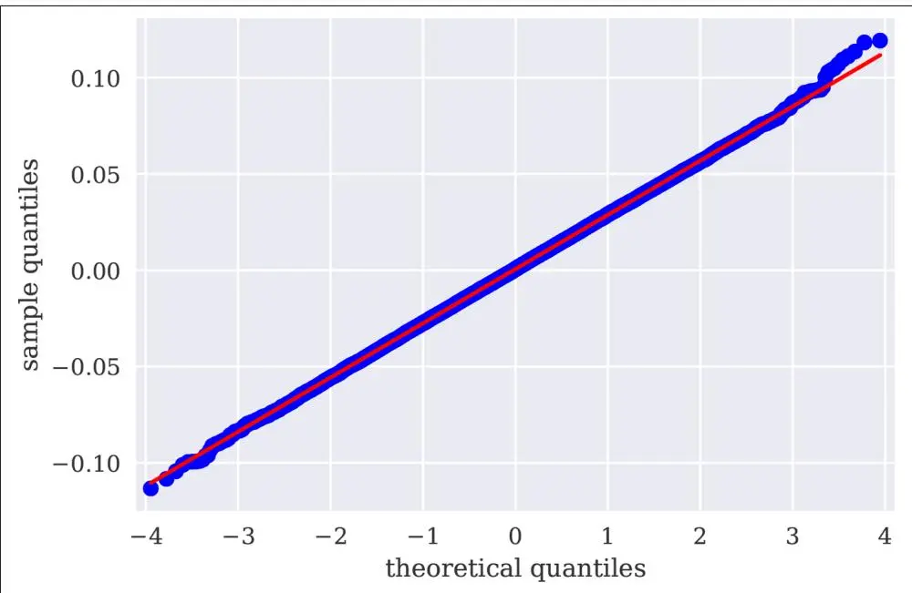
图13-3 几何布朗运动对数收益率的分位数-分位数图

尽管图形方法很有吸引力，但它们通常无法替代更严格的检验程序。下一个示例中使用的函数 normality\_tests() 结合了三种不同的统计检验：

## 偏度检验（skewtest()）

检验样本数据的偏度是否"正常"（即值足够接近零）。

## 峰度检验（kurtosistest()）

类似地，检验样本数据的峰度是否"正常"（同样足够接近零）。

## 正态性检验（normaltest()）

结合了其他两种检验方法来检验正态性。

检验值表明几何布朗运动的对数收益率确实呈正态分布——即它们显示 p 值在0.05或以上：

```python
In [19]: def normality_tests(arr):
    ''' 检验给定数据集的正态分布。

参数
====================
array: ndarray
要生成统计量的对象
```

```txt
print('Skew of data set %14.3f' % scs.skew(arr))
print('Skew test p-value %14.3f' % scs.skewtest(arr)[1])
print('Kurt of data set %14.3f' % scs.kurtosis(arr))
print('Kurt test p-value %14.3f' % scs.kurtosistest(arr)[1])
print('Norm test p-value %14.3f' % scs.normaltest(arr)[1])
```

```txt
In [20]: normality_tests(log_returns.flatten())
Skew of data set 0.001
Skew test p-value 0.430
Kurt of data set 0.001
Kurt test p-value 0.541
Norm test p-value 0.607
```

## 所有 p 值均远高于 0.05。

最后，检查期末值是否确实呈对数正态分布。这可以归结为一个正态性检验，因为只需对数据应用 log 函数进行变换，就能得到正态分布的值（也可能不是）。图13-4绘制了对数正态分布的期末值和变换后的值（"对数指数水平"）：

```python
In [21]: f, (ax1, ax2) = plt.subplots(1, 2, figsize=(10, 6))
    ax1.hist(paths[-1], bins=30)
    ax1.set_xlabel('index level')
    ax1.set_ylabel('frequency')
    ax1.set_title('regular data')
    ax2.hist(np.log(paths[-1]), bins=30)
    ax2.set_xlabel('log index level')
    ax2.set_title('log data')
```

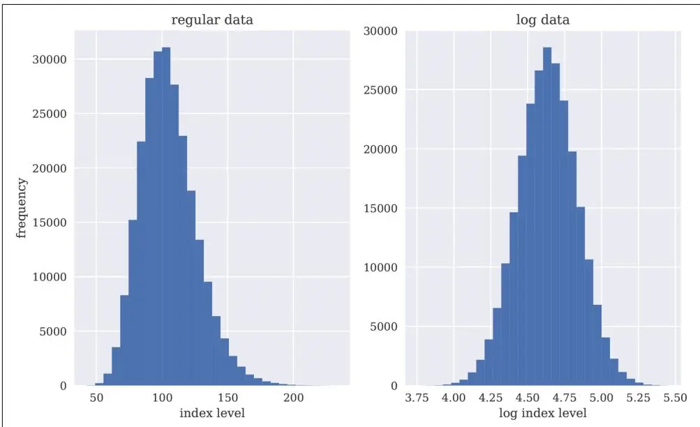
图13-4 几何布朗运动模拟期末指数水平直方图

数据集的统计量显示出预期行为——例如，平均值接近105。对数指数水平的偏度和峰度值接近零，并显示出较高的 p 值，为正态分布假设提供了有力支持：

<table><tr><td colspan="2">In [22]: print_statistics(paths[-1])</td></tr><tr><td>statistic</td><td>value</td></tr><tr><td>size</td><td>250000.00000</td></tr><tr><td>min</td><td>42.74870</td></tr><tr><td>max</td><td>233.58435</td></tr><tr><td>mean</td><td>105.12645</td></tr><tr><td>std</td><td>21.23174</td></tr><tr><td>skew</td><td>0.61116</td></tr><tr><td>kurtosis</td><td>0.65182</td></tr></table>

<table><tr><td colspan="2">In [23]: print_statistics(np.log(paths[-1]))</td></tr><tr><td>statistic</td><td>value</td></tr><tr><td>----</td><td>----</td></tr><tr><td>size</td><td>250000.00000</td></tr><tr><td>min</td><td>3.75534</td></tr><tr><td>max</td><td>5.45354</td></tr><tr><td>mean</td><td>4.63517</td></tr><tr><td>std</td><td>0.19998</td></tr><tr><td>skew</td><td>-0.00092</td></tr><tr><td>kurtosis</td><td>-0.00327</td></tr></table>

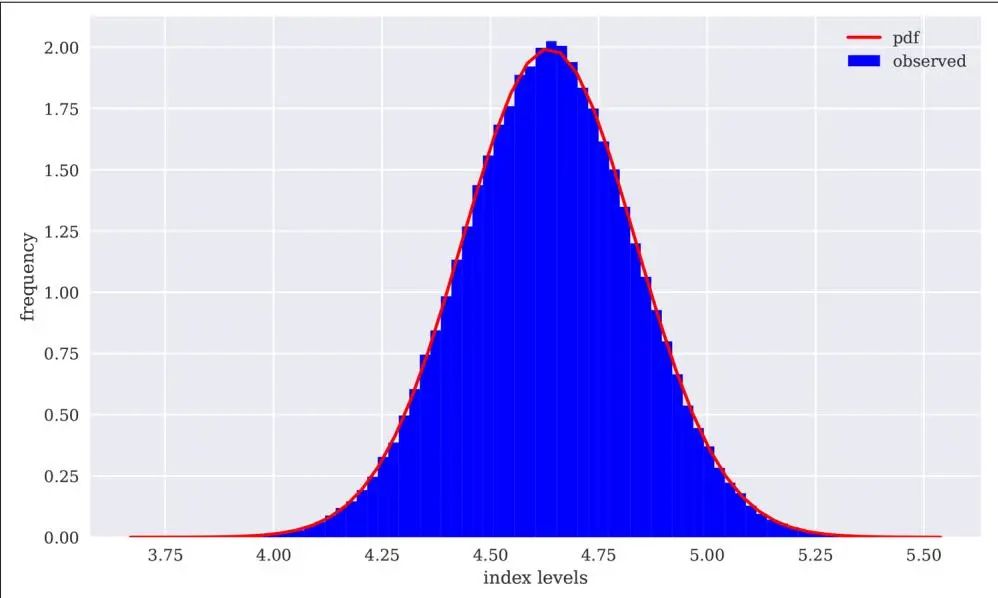

```txt
In [24]: normality_tests(np.log(paths[-1]))
Skew of data set -0.001
Skew test p-value 0.851
Kurt of data set -0.003
Kurt test p-value 0.744
Norm test p-value 0.931
```

图13-5再次比较了频率分布与正态分布的 PDF，显示出相当好的拟合（这当然是意料之中的）：

```python
In [25]: plt.figure(figsize=(10, 6))
    log_data = np.log(paths[-1])
    plt.hist(log_data, bins=70, density=True,
    label='observed', color='b')
    plt.xlabel('index levels')
    plt.ylabel('frequency')
    x = np.linspace(plt.axis()[0], plt.axis()[1])
    plt.plot(x, scs.norm.pdf(x, log_data.mean(), log_data.std()), 'r', lw=2.0, label='pdf')
    plt.legend();
```
图13-5 几何布朗运动对数指数水平的直方图与正态密度函数

图13-6也支持了对数指数水平呈正态分布的假设：

```javascript
In [26]: sm.qqplot(log_data, line='s')
plt.xlabel('theoretical quantiles')
plt.ylabel('sample quantiles');
```

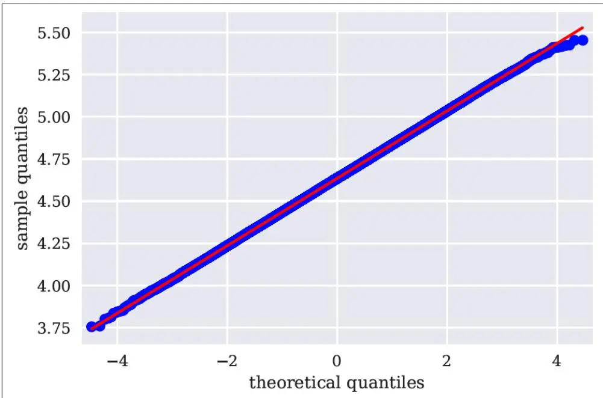
图13-6 几何布朗运动对数指数水平的分位数-分位数图


## 正态性

关于金融工具不确定收益的正态性假设是许多金融理论的核心。Python 提供了高效的统计和图形化手段来检验时间序列数据是否呈正态分布。

## 真实世界数据

本节分析了四个历史金融时间序列：两只科技股和两只交易所交易基金（Exchange Traded Funds, ETFs）：

• AAPL.O：Apple Inc. 股票价格

• MSFT.O：Microsoft Inc. 股票价格

• SPY：SPDR S&P 500 ETF Trust

• GLD：SPDR Gold Trust

数据管理工具的首选是 pandas（见[第8章](ch08.md)）。图13-7显示了随时间变化的归一化价格：

In [27]: import pandas as pd

```python
In [28]: raw = pd.read_csv('../source/tr_eikon_eod_data.csv', index_col=0, parse_dates=True).dropna()

In [29]: symbols = ['SPY', 'GLD', 'AAPL.0', 'MSFT.0']

In [30]: data = raw[symbols]
data = data.dropna()

In [31]: data.info()
<class 'pandas.core.frame.DataFrame'>
DatetimeIndex: 2138 entries, 2010-01-04 to 2018-06-29
Data columns (total 4 columns):
SPY 2138 non-null float64
GLD 2138 non-null float64
AAPL.02138 non-null float64
MSFT.02138 non-null float64
dtypes: float64(4)
memory usage: 83.5 KB
```

```txt
In [32]: data.head()
Out[32]:    SPY    GLD    AAPL.O    MSFT.O
Date
2010-01-04113.33109.8030.57282730.9502010-01-05113.63109.7030.62568430.9602010-01-06113.71111.5130.13854130.7702010-01-07114.19110.8230.08282730.4522010-01-08114.57111.3730.28282730.660
```

```javascript
In [33]: (data / data.iloc[0] * 100).plot(figsize=(10, 6))
```

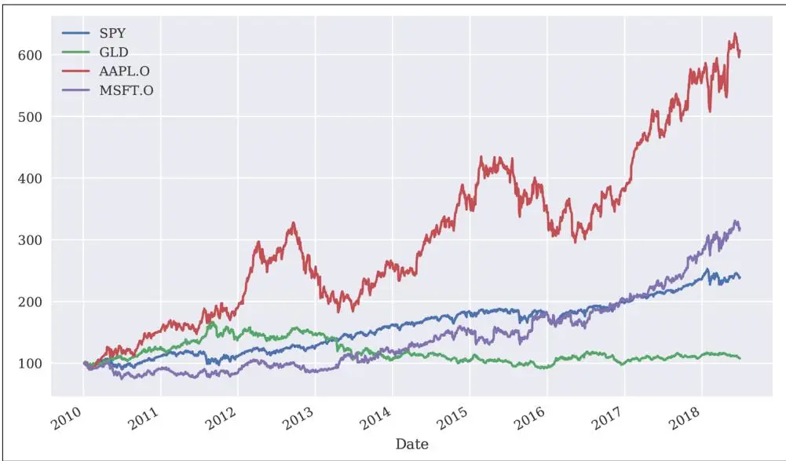
图13-7 金融工具随时间的归一化价格

图13-8以直方图形式展示了金融工具的对数收益率：

<table><tr><td colspan="5">In [34]: log_returns = np.log(data / data.shift(1))log_returns.head()</td></tr><tr><td>Out[34]: Date</td><td>SPY</td><td>GLD</td><td>AAPL.O</td><td>MSFT.O</td></tr><tr><td>2010-01-04</td><td>NaN</td><td>NaN</td><td>NaN</td><td>NaN</td></tr><tr><td>2010-01-05</td><td>0.002644</td><td>-0.000911</td><td>0.001727</td><td>0.000323</td></tr><tr><td>2010-01-06</td><td>0.000704</td><td>0.016365</td><td>-0.016034</td><td>-0.006156</td></tr><tr><td>2010-01-07</td><td>0.004212</td><td>-0.006207</td><td>-0.001850</td><td>-0.010389</td></tr><tr><td>2010-01-08</td><td>0.003322</td><td>0.004951</td><td>0.006626</td><td>0.006807</td></tr></table>

In [35]: log\_returns.hist(bins=50, figsize=(10, 8));
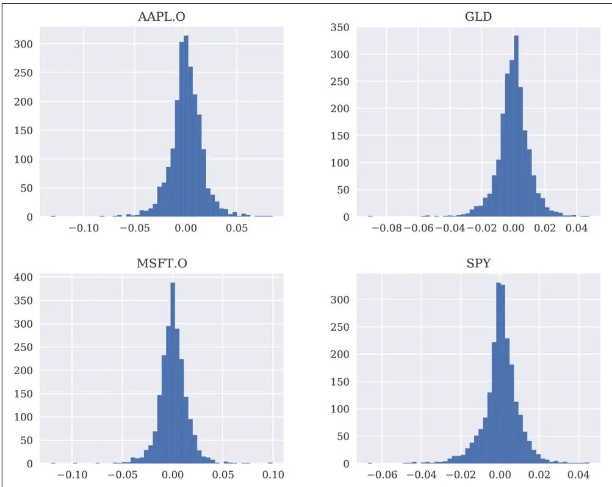
图13-8 金融工具对数收益率的直方图

作为下一步，考虑时间序列数据集的不同统计量。所有四个数据集的峰度值似乎尤其远离正态分布：

```python
In [36]: for sym in symbols:
    print('\nResults for symbol {}'.format(sym))
    print(30 * '-'')
    log_data = np.array(log_returns[sym].dropna())
    print_statistics(log_data)
```

Results for symbol SPY

<table><tr><td>statistic</td><td>value</td></tr><tr><td>size</td><td>2137.00000</td></tr><tr><td>min</td><td>-0.06734</td></tr><tr><td>max</td><td>0.04545</td></tr><tr><td>mean</td><td>0.00041</td></tr><tr><td>std</td><td>0.00933</td></tr><tr><td>skew</td><td>-0.52189</td></tr><tr><td>kurtosis</td><td>4.52432</td></tr></table>

Results for symbol GLD

<table><tr><td>statistic</td><td>value</td></tr><tr><td>size</td><td>2137.00000</td></tr><tr><td>min</td><td>-0.09191</td></tr><tr><td>max</td><td>0.04795</td></tr><tr><td>mean</td><td>0.00004</td></tr><tr><td>std</td><td>0.01020</td></tr><tr><td>skew</td><td>-0.59934</td></tr><tr><td>kurtosis</td><td>5.68423</td></tr></table>

Results for symbol AAPL.O

<table><tr><td>statistic</td><td>value</td></tr><tr><td>size</td><td>2137.00000</td></tr><tr><td>min</td><td>-0.13187</td></tr><tr><td>max</td><td>0.08502</td></tr><tr><td>mean</td><td>0.00084</td></tr><tr><td>std</td><td>0.01591</td></tr><tr><td>skew</td><td>-0.23510</td></tr><tr><td>kurtosis</td><td>4.78964</td></tr></table>

Results for symbol MSFT.O

<table><tr><td>statistic</td><td>value</td></tr><tr><td>size</td><td>2137.00000</td></tr><tr><td>min</td><td>-0.12103</td></tr><tr><td>max</td><td>0.09941</td></tr><tr><td>mean</td><td>0.00054</td></tr><tr><td>std</td><td>0.01421</td></tr><tr><td>skew</td><td>-0.09117</td></tr><tr><td>kurtosis</td><td>7.29106</td></tr></table>

金融工具时间序列的统计量。

图13-9显示了 SPY ETF 的 QQ 图。显然，样本分位数值不在一条直线上，表明"非正态性"。在左侧和右侧，分别有许多值远低于直线和远高于直线。换句话说，时间序列数据表现出厚尾（Fat Tails）。这个术语指的是一个（频率）分布，其中大的负值和正值比正态分布所暗示的更频繁出现。从图13-10中也可以得出相同的结论，该图展示了微软股票的数据。似乎也有证据表明存在厚尾分布：

```txt
In [37]: sm.qqplot(log_returns['SPY'].dropna(), line='s')
plt.title('SPY')
plt.xlabel('theoretical quantiles')
plt.ylabel('sample quantiles');
In [38]: sm.qqplot(log_returns['MSFT.0'].dropna(), line='s')
plt.title('MSFT.0')
plt.xlabel('theoretical quantiles')
plt.ylabel('sample quantiles');
```

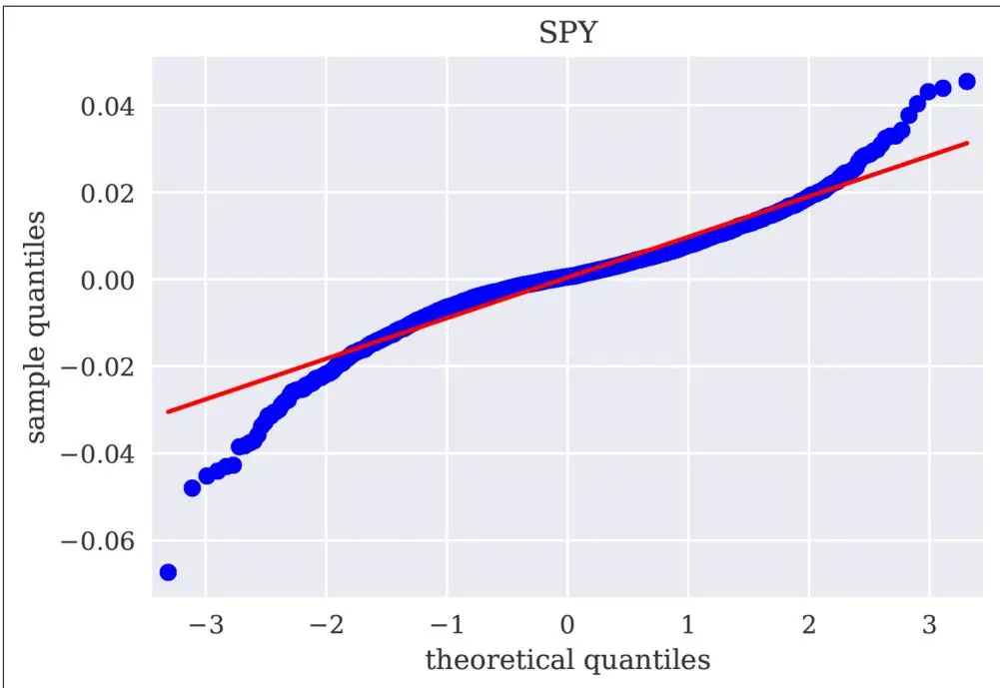
图13-9 SPY 对数收益率的分位数-分位数图

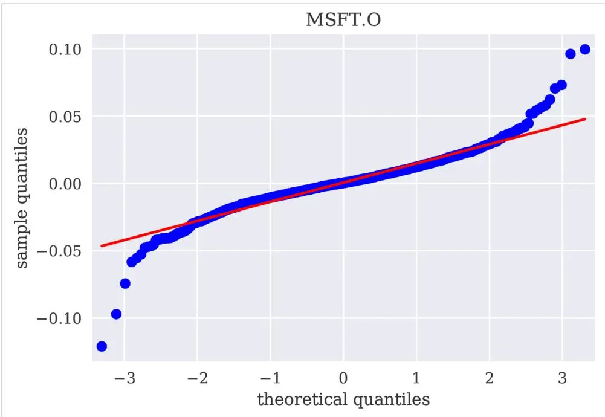
图13-10 MSFT.O 对数收益率的分位数-分位数图

这最终引出了统计正态性检验：

```python
In [39]: for sym in symbols:
    print('\nResults for symbol {}'.format(sym))
    print(32 * '-'')
    log_data = np.array(log_returns[sym].dropna())
    normality_tests(log_data) ①

Results for symbol SPY
Skew of data set -0.522
Skew test p-value 0.000
Kurt of data set 4.524
Kurt test p-value 0.000
Norm test p-value 0.000

Results for symbol GLD
Skew of data set -0.599
Skew test p-value 0.000
Kurt of data set 5.684
Kurt test p-value 0.000
Norm test p-value 0.000

Results for symbol AAPL.0
```

<table><tr><td>Skew of data set</td><td>-0.235</td></tr><tr><td>Skew test p-value</td><td>0.000</td></tr><tr><td>Kurt of data set</td><td>4.790</td></tr><tr><td>Kurt test p-value</td><td>0.000</td></tr><tr><td>Norm test p-value</td><td>0.000</td></tr><tr><td colspan="2">Results for symbol MSFT.0</td></tr><tr><td>Skew of data set</td><td>-0.091</td></tr><tr><td>Skew test p-value</td><td>0.085</td></tr><tr><td>Kurt of data set</td><td>7.291</td></tr><tr><td>Kurt test p-value</td><td>0.000</td></tr><tr><td>Norm test p-value</td><td>0.000</td></tr></table>

金融工具时间序列的正态性检验结果。

不同检验的 p 值均为零，强烈拒绝了各样本数据集呈正态分布的检验假设。这表明对股票市场收益和其他资产类别的正态假设——例如体现在几何布朗运动模型中的假设——通常无法得到证明，可能必须使用能够产生厚尾的更丰富模型（如跳扩散模型或随机波动率模型）。

## 投资组合优化

现代投资组合理论（即均值-方差投资组合理论）是金融理论的主要基石之一。基于这一理论突破，其发明者 Harry Markowitz 于1990年获得诺贝尔经济学奖。尽管该理论形成于20世纪50年代，但至今仍在教授给金融专业学生，并在实践中应用（通常带有一些次要或主要修改）。<sup>3</sup> 本节阐述了该理论的基本原则。

Copeland、Weston 和 Shastri（2005）一书的[第5章](ch05.md)介绍了与 MPT 相关的正式主题。如前所述，收益率呈正态分布的假设是该理论的基础：


仅关注均值和方差，我们必然假设没有其他统计量是描述期末财富分布所必需的。除非投资者具有特殊类型的效用函数（二次效用函数），否则必须假设收益率具有正态分布，这可以通过均值和方差完全描述。


## 数据

以下分析和示例使用与之前相同的金融工具。MPT 的基本思想是利用多样化（Diversification）来在给定目标收益水平下实现最小投资组合风险，或在给定风险水平下实现最大投资组合回报。通过适当组合大量资产并确保资产具有一定的多样性，可以预期这种多样化效应。不过，为了传达基本思想并展示典型效果，四个金融工具已足够。图13-11显示了金融工具对数收益率的频率分布：

```python
In [40]: symbols = ['AAPL.0', 'MSFT.0', 'SPY', 'GLD']
```

```txt
In [41]: noa = len(symbols) ②
```

In [42]: data = raw[symbols]

In [43]: rets = np.log(data / data.shift(1))

```javascript
In [44]: rets.hist(bins=40, figsize=(10, 8));
```

用于投资组合构成的四种金融工具。

## 定义的金融工具数量。

The covariance matrix for the financial instruments to be invested in is the central piece of the portfolio selection process. pandas has a built-in method to generate the covariance matrix on which the same scaling factor is applied:

```txt
In [45]: rets.mean() * 252
Out[45]: AAPL.O 0.212359
MSFT.O 0.136648
SPY 0.102928
GLD 0.009141
dtype: float64
```

```txt
In [46]: rets.cov() * 252
Out[46]:
AAPL.0 MSFT.0 SPY GLD
AAPL.00.0637730.0234270.0210390.001513
MSFT.00.0234270.0509170.022244 -0.000347
SPY 0.0210390.0222440.0219390.000062
GLD 0.001513 -0.0003470.0000620.026209
```

```txt
1 年化平均收益率。
```

年化协方差矩阵。

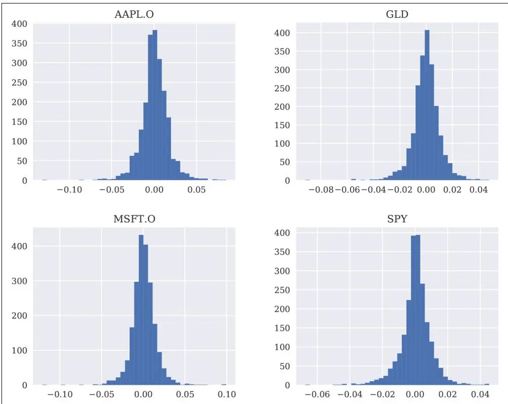
图13-11 金融工具对数收益率的直方图

## 基本理论

在以下内容中，假设投资者不允许对金融工具建立空头头寸（Short Position）。只允许多头头寸（Long Position），这意味着投资者100%的财富必须以所有头寸均为多头（正数）且头寸总和为100%的方式在可用工具之间分配。以四种工具为例，可以等额投资于每种工具——即每种工具投入可用财富的25%。以下代码生成四个介于0和1之间的均匀分布随机数，然后归一化这些值，使所有值的总和等于1：

```python
In [47]: weights = np.random.random(noa) ①
    weights /= np.sum(weights) ②

In [48]: weights
Out[48]: array([0.07650728, 0.06021919, 0.63364218, 0.22963135])

In [49]: weights.sum()
Out[49]: 1.0
```

## 随机投资组合权重……

## ……归一化为1或100%。

正如验证所示，权重确实加起来等于1；即 $\Sigma_{I} w_{i} = 1$，其中 I 是金融工具的数量，$w_{i} > 0$ 是金融工具 i 的权重。公式13-1给出了给定单个工具权重下的期望投资组合收益率公式。这是一种期望投资组合收益率，因为历史平均表现被认为是未来（期望）表现的最佳估计量。其中 $r_{i}$ 是依赖于状态的未来收益率（假设呈正态分布的收益率值向量），$\mu_{i}$ 是工具 i 的期望收益率。最后，$\boldsymbol{w} ^{T}$ 是权重向量的转置，μ 是期望证券收益率向量。

公式13-1 期望投资组合收益率的一般公式

$$
\begin{array}{r c l} \mu_{p} & = & \mathbf{E} \big (\sum_{I} w_{i} r_{i} \big) \\ & = & \sum_{I} w_{i} \mathbf{E} (r_{i}) \\ & = & \sum_{I} w_{i} \mu_{i} \\ & = & w^{T} \mu \end{array}
$$

翻译成 Python 后，这简化为包含年化在内的单行代码：

```javascript
In [50]: np.sum(rets.mean() * weights) * 252
Out[50]: 0.09179459482057793
```

给定投资组合权重下的年化投资组合收益率。

MPT 中第二个重要的对象是期望投资组合方差。两个证券之间的协方差定义为 $\sigma_{i j} = \sigma_{j i} = \mathbf{E} ( r_{i} - \mu_{i} ) ( r_{j} - \mu_{j} )$。证券的方差是与自身协方差的特例：$\dot{\sigma_{i} ^{2}} = \mathbf{E} \big ( ( r_{i} - \mu_{i} ) ^{2} \big )$。图13-12提供了证券投资组合的协方差矩阵（假设每只证券的等权重为1）。

$$
\Sigma = \left[ \begin{array}{c c c c} \sigma_{1} ^{2} & \sigma_{12} & \dots & \sigma_{1 I} \\ \sigma_{21} & \sigma_{2} ^{2} & \dots & \sigma_{2 I} \\ \vdots & \vdots & \ddots & \vdots \\ \sigma_{I 1} & \sigma_{I 2} & \dots & \sigma_{I} ^{2} \end{array} \right]
$$

图13-12 投资组合协方差矩阵

有了投资组合协方差矩阵，公式13-2给出了期望投资组合方差的公式。

公式13-2 期望投资组合方差的一般公式

$$
\begin{array}{r l r} \sigma_{p} ^{2} & = & \mathbf{E} \big ((r - \mu) ^{2} \big) \\ & = & \sum_{i \in I} \sum_{j \in I} w_{i} w_{j} \sigma_{i j} \\ & = & w^{T} \Sigma w \end{array}
$$

In Python, this all again boils down to a single line of code, making heavy use of NumPy vectorization capabilities. The np.dot() function gives the dot product of two vectors/matrices. The T attribute or transpose() method gives the transpose of a vector or matrix. Given the portfolio variance, the (expected) portfolio standard deviation or volatility $\sigma_{{p}} = \sqrt{\sigma_{{p}} ^{2}}$ is then only one square root away:

```txt
In [51]: np.dot(weights.T, np.dot(rets.cov() * 252, weights)) ①
Out[51]: 0.014763288666485574

In [52]: math.sqrt(np.dot(weights.T, np.dot(rets.cov() * 252, weights))) ②
Out[52]: 0.12150427427249452
```

给定投资组合权重下的年化投资组合方差。

给定投资组合权重下的年化投资组合波动率。


## Python 与向量化

MPT 示例展示了使用 Python 将投资组合收益率或投资组合方差等数学概念转化为可执行的向量化代码是多么高效（这是[第1章](ch01.md)中提出的论点）。

这基本上完成了均值-方差投资组合选择的工具集。投资者最关心的是，给定一组金融工具，可能实现什么样的风险-收益特征及其统计特性。为此，以下实现了蒙特卡洛模拟（见[第12章](ch12.md)），以较大规模生成随机投资组合权重向量。对于每个模拟的分配，代码记录由此产生的期望投资组合收益率和方差。为简化代码，定义了 port\_ret() 和 port\_vol() 两个函数：

```python
In [53]: def port_ret(weights):
    return np.sum(rets.mean() * weights) * 252

In [54]: def port_vol(weights):
    return np.sqrt(np.dot(weights.T, np.dot(rets.cov() * 252, weights)))

In [55]: prets = []
    pvols = []

    for p in range (2500): ①
    weights = np.random.random(noa) ①
    weights /= np.sum(weights) ①
    prets.append(port_ret(weights)) ②
    pvols.append(port_vol(weights)) ②
    prets = np.array(prets)
    pvols = np.array(pvols)
```

投资组合权重的蒙特卡洛模拟。

## 将结果统计量收集到列表对象中。

图13-13展示了蒙特卡洛模拟的结果。此外，它还提供了夏普比率（Sharpe Ratio）的结果，定义为 $\begin{array} {r} {S R \equiv \frac{\boldsymbol{\mu} _{p} - \boldsymbol{r} _{f}} {\sigma_{p}}} \end{array}$，即投资组合相对于无风险短期利率 $r_{f}$ 的期望超额收益率除以投资组合的期望标准差。为简单起见，假设 $r_{f} \equiv 0$：

```javascript
In [56]: plt.figure(figsize=(10, 6))
plt.scatter(pvols, prets, c=prets / pvols,
    marker='o', cmap='coolwarm')
plt.xlabel('expected volatility')
plt.ylabel('expected return')
plt.colorbar(label='Sharpe ratio');
```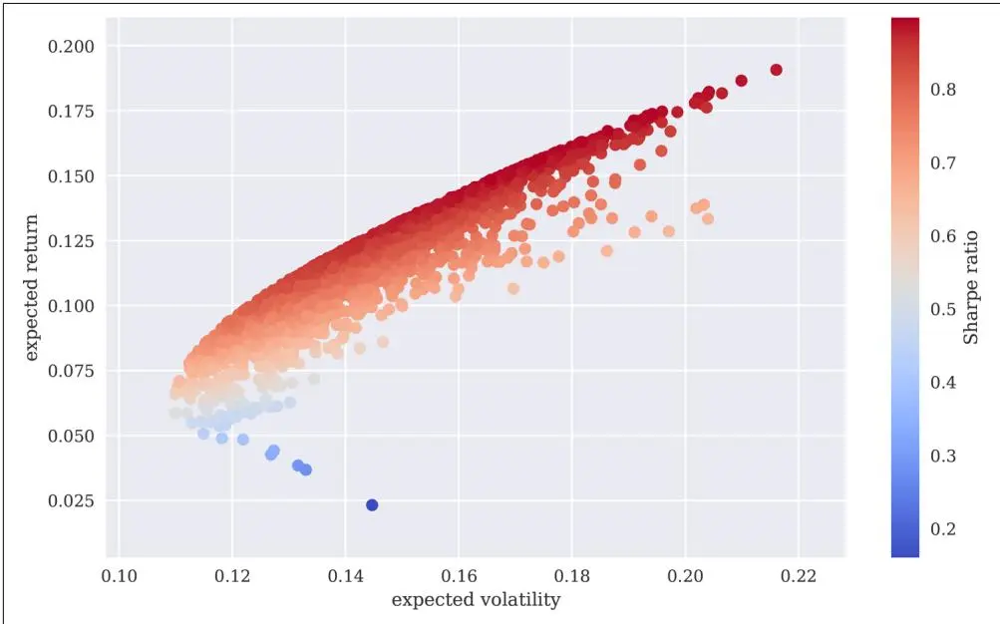
图13-13 随机投资组合权重的期望收益与波动率

通过观察图13-13可以清楚地看到，并非所有权重分布在均值和波动率方面都表现良好。例如，对于固定的风险水平（如15%），存在多个投资组合都显示出不同的收益率。作为投资者，通常感兴趣的是给定固定风险水平下的最大收益，或给定固定收益期望下的最小风险。这一组投资组合构成了所谓的有效前沿（Efficient Frontier）。本章后面将推导这一前沿。

## 最优投资组合

该最小化函数非常通用，允许等式约束、不等式约束和参数的数值边界。

首先是夏普比率的最大化。形式上，通过最小化夏普比率的负值来推导最大值和最优投资组合构成。约束条件是所有参数（权重）加起来等于1。可以使用 minimize() 函数的约定来如下表述。<sup>4</sup> 参数值（权重）也被限制在0和1之间。这些值作为元组的元组提供给最小化函数。

调用优化函数唯一缺少的输入是起始参数列表（权重向量的初始猜测）。等权重分布即可：

```txt
In [57]: import scipy.optimize as sco
```

```txt
In [58]: def min_func_sharpe(weights): 1
    return -port_ret(weights) / port_vol(weights) 1
```

```javascript
In [59]: cons = ({'type': 'eq', 'fun': lambda x: np.sum(x) - 1})
```

```txt
In [60]: bnds = tuple((0, 1) for x in range(noa)) ③
```

```python
In [61]: ewights = np.array(noa * [1. / noa,])
    ewights
Out[61]: array([0.25, 0.25, 0.25, 0.25])
```

```txt
In [62]: min_func_sharpe(eweights)
Out[62]: -0.8436203363155397
```

要最小化的函数。

等式约束。

参数的边界。

等权重向量。

调用该函数返回的不仅仅是优化参数值。结果存储在一个名为 opts 的对象中。主要兴趣在于获得最优投资组合构成。为此，可以通过提供感兴趣的键来访问结果对象；即本例中的 x：

```python
In [63]: %%time
    opts = sco.minimize(min_func_sharpe, ewights,
    method='SLSQP', bounds=bnds,
    constraints=cons) ①
    CPU times: user 67.6 ms, sys: 1.94 ms, total: 69.6 ms
    Wall time: 75.2 ms

In [64]: opts ②
Out[64]: fun: -0.8976673894052725
jac: array([ 8.96826386e-05, 8.30739737e-05, -2.45958567e-04,
    1.92895532e-05])
message: 'Optimization terminated successfully.'
nfev: 36
nit: 6
njev: 6
status: 0
success: True
```

```python
x: array([0.51191354, 0.19126414, 0.25454109, 0.04228123])
In [65]: opts['x'].round(3) ③
Out[65]: array([0.512, 0.191, 0.255, 0.042])
In [66]: port_ret(opts['x']).round(3) ④
Out[66]: 0.161
In [67]: port_vol(opts['x']).round(3) ⑤
Out[67]: 0.18
In [68]: port_ret(opts['x']) / port_vol(opts['x']) ⑥
Out[68]: 0.8976673894052725
```

优化（即最小化函数 min\_func\_sharpe()）。

优化结果。

最优投资组合权重。

由此产生的投资组合收益率。

由此产生的投资组合波动率。

最大夏普比率。

接下来，最小化投资组合的方差。这与最小化波动率相同：

```python
In [69]: optv = sco.minimize(port_vol, ewights,
    method='SLSQP', bounds=bnds,
    constraints=cons) ①

In [70]: optv
Out[70]: fun: 0.1094215526341138
jac: array([0.11098004, 0.10948556, 0.10939826, 0.10944918])
message: 'Optimization terminated successfully.'
nfev: 54
nit: 9
njev: 9
status: 0
success: True
x: array([1.62630326e-18, 1.06170720e-03, 5.43263079e-01,
4.55675214e-01])

In [71]: optv['x'].round(3)
Out[71]: array([0., 0.001, 0.543, 0.456])

In [72]: port_vol(optv['x']).round(3)
Out[72]: 0.109
```

```python
In [73]: port_ret(optv['x']).round(3)
Out[73]: 0.06
In [74]: port_ret(optv['x']) / port_vol(optv['x'])
Out[74]: 0.5504173653075624
```

最小化投资组合的波动率。

这次，投资组合仅由三种金融工具组成。这种投资组合混合导致了所谓的最小波动率或最小方差投资组合。

## 有效前沿

所有最优投资组合的推导——即对于给定的目标收益水平，具有最小波动率的投资组合（或者对于给定的风险水平，具有最大收益的投资组合）——与之前的优化类似。唯一的区别在于需要遍历多个起始条件。

采用的方法是固定一个目标收益水平，并为每个这样的水平推导出使波动率最小的投资组合权重。对于优化而言，这导致了两个约束条件：一个是目标收益水平 `tret`，另一个是投资组合权重之和，与之前一样。每个参数的边界值保持不变。当遍历不同的目标收益水平（`trets`）时，最小化的一个约束条件会发生变化。这就是为什么约束字典在每次循环中都要更新：

```python
In [75]: cons = ({'type': 'eq', 'fun': lambda x: port_ret(x) - tret}, {'type': 'eq', 'fun': lambda x: np.sum(x) - 1}) ①
In [76]: bnds = tuple((0, 1) for x in weights)
In [77]: %%time
    trets = np.linspace(0.05, 0.2, 50)
    tvols = []
    for tret in trets:
    res = sco.minimize(port_vol, ewights, method='SLSQP', bounds=bnds, constraints=cons) ②
    tvols.append(res['fun'])
    tvols = np.array(tvls)
    CPU times: user 2.6 s, sys: 13.1 ms, total: 2.61 s
    Wall time: 2.66 s
```

有效前沿的两个约束条件。

不同目标收益下投资组合波动率的最小化。

图13-14展示了优化结果。粗线表示给定目标收益下的最优投资组合；散点仍然是随机投资组合。此外，图中还显示了两个较大的星形标志，一个代表最小波动率/方差投资组合（最左边的组合），另一个代表具有最大夏普比率的投资组合：

```python
In [78]: plt.figure(figsize=(10, 6))
plt.scatter(pvols, prets, c=prets / pvols,
    marker='.', alpha=0.8, cmap='coolwarm')
plt.plot(tvls, trets, 'b', lw=4.0)
plt.plot(port_vol(opts['x']), port_ret(opts['x']), 'y*', markersize=15.0)
plt.plot(port_vol(optv['x']), port_ret(optv['x']), 'r*', markersize=15.0)
plt.xlabel('expected volatility')
plt.ylabel('expected return')
plt.colorbar(label='Sharpe ratio')
```

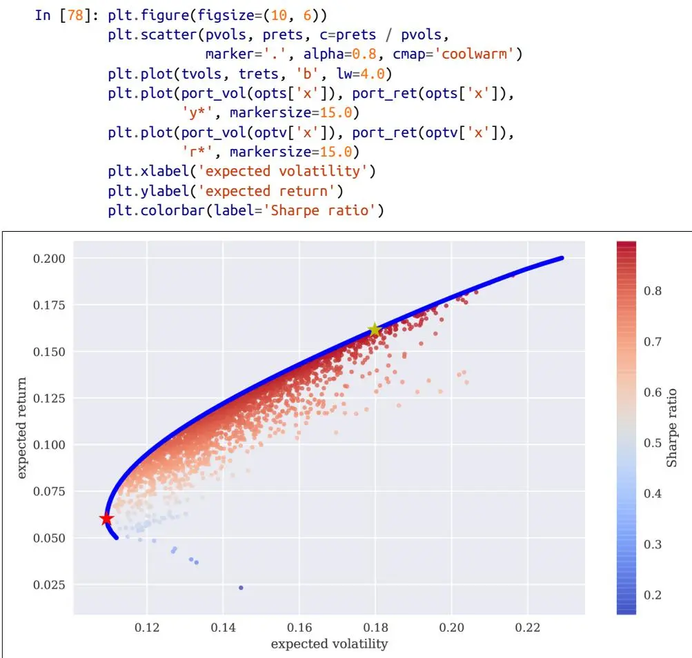
图13-14 给定收益水平下的最小风险投资组合（有效前沿）

有效前沿由所有收益高于绝对最小方差投资组合的最优投资组合组成。在给定风险水平下，这些投资组合在预期收益方面优于所有其他投资组合。

## 资本市场线（Capital Market Line）

除了股票或商品（如黄金）等风险金融工具外，通常还存在一种普遍的无风险投资机会：现金或现金账户。在理想化的世界中，存放在大型银行现金账户中的资金可以被视为无风险（例如，通过公共存款保险计划）。其缺点是，这种无风险投资的收益通常很低，有时接近于零。

然而，考虑到这种无风险资产，投资者的有效投资机会集会显著扩大。基本思想是，投资者首先确定一个风险资产的有效投资组合，然后将无风险资产加入组合。通过调整投资于无风险资产的财富比例，可以在风险-收益空间中实现位于无风险资产与有效投资组合之间直线上的任何风险-收益特征。

在众多选择中，哪一个有效投资组合是最优投资对象？是有效前沿的切线恰好穿过无风险投资组合风险-收益点的那个投资组合。例如，考虑一个无风险利率 $r_{f} = 0.01$。需要在有效前沿上找到这样一个投资组合，使得其切线在风险-收益空间中穿过点 $\left( \sigma_{f} , r_{f} \right) = \left( 0 , 0.01 \right)$。

在接下来的计算中，需要使用有效前沿的函数近似及其一阶导数。三次样条插值提供了这种可微的函数近似（见[第11章](ch11.md)）。对于样条插值，只使用有效前沿上的那些投资组合。通过这种数值方法，可以为有效前沿定义一个连续可微函数 f(x) 及其相应的一阶导数函数 df(x)：

```python
In [79]: import scipy.interpolate as sci

In [80]: ind = np.argmin(tvols) ①
    evols = tvols[ind:] ②
    erets = trets[ind:] ②

In [81]: tck = sci.splrep(evols, erets) ③

In [82]: def f(x):
    ''' Efficient frontier function (splines approximation). ''' return sci.splev(x, tck, der=0)
    def df(x):
    ''' First derivative of efficient frontier function. ''' return sci.splev(x, tck, der=1)
```

最小波动率投资组合的索引位置。

相关的投资组合波动率和收益值。

对这些值进行三次样条插值。

现在需要推导的是一个线性函数 t(x) = a + b · x，代表在风险-收益空间中穿过无风险资产并与有效前沿相切的直线。方程13-3描述了函数 t(x) 需要满足的三个条件。

方程13-3 资本市场线的数学条件

$t(x) = a + b \cdot x$ $t(0) = r_f \iff a = r_f$ $t(x) = f(x) \iff a + b \cdot x = f(x)$ $t'(x) = f'(x) \iff b = f'(x)$

由于有效前沿及其一阶导数没有闭式公式，必须对方程13-3中的方程组进行数值求解。为此，定义一个 Python 函数，该函数在给定参数集 p = (a, b, x) 的情况下返回所有三个方程的值。

`scipy.optimize` 中的 `sco.fsolve()` 函数能够求解这样的方程组。除了 `equations()` 函数外，还需要提供一个初始参数化。请注意，优化的成功与否可能取决于初始参数化，因此必须谨慎选择——通常是通过有根据的猜测和试错相结合：

```python
In [83]: def equations(p, rf=0.01):
    eq1 = rf - p[0] ①
    eq2 = rf + p[1] * p[2] - f(p[2]) ①
    eq3 = p[1] - df(p[2]) ①
    return eq1, eq2, eq3

In [84]: opt = sco.fsolve(equations, [0.01, 0.5, 0.15])
In [85]: opt ③
Out[85]: array([0.01, 0.84470952, 0.19525391])

In [86]: np.round(equations(opt), 6) ④
Out[86]: array([0., 0., -0.])
```

描述资本市场线（CML）的方程。

对给定的初始值求解这些方程。

最优参数值。

方程值均为零。

图13-15以图形方式呈现了结果；星形代表有效前沿上的最优投资组合，该组合的切线穿过无风险资产点 (0, r = 0.01)：

```python
In [87]: plt.figure(figsize=(10, 6))
    plt.scatter(pvols, prets, c=(prets - 0.01) / pvols,
    marker='.', cmap='coolwarm')
    plt.plot(evols, erets, 'b', lw=4.0)
    cx = np.linspace(0.0, 0.3)
    plt.plot(cx, opt[0] + opt[1] * cx, 'r', lw=1.5)
    plt.plot(opt[2], f(opt[2]), 'y*', markersize=15.0)
    plt.grid(True)
    plt.axhline(0, color='k', ls='--', lw=2.0)
    plt.axvline(0, color='k', ls='--', lw=2.0)
    plt.xlabel('expected volatility')
    plt.ylabel('expected return')
    plt.colorbar(label='Sharpe ratio')
```

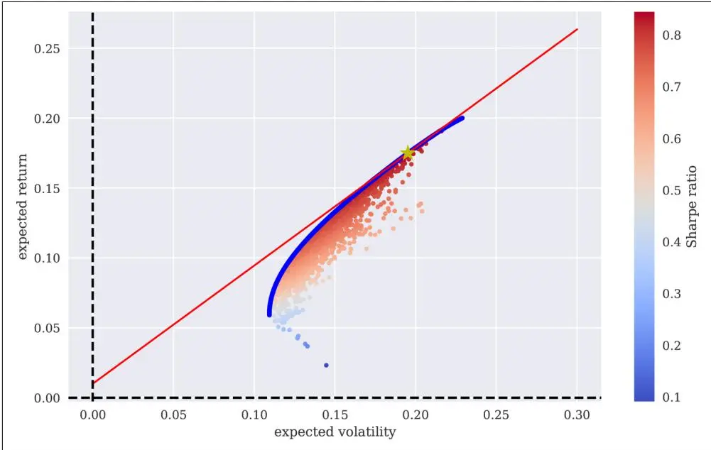
图13-15 无风险利率1%情况下的资本市场线与切线投资组合（星形）

最优（切线）投资组合的权重如下。四种资产中只有三种被纳入组合：

```python
In [88]: cons = ({'type': 'eq', 'fun': lambda x: port_ret(x) - f(opt[2])}, {'type': 'eq', 'fun': lambda x: np.sum(x) - 1}) ① res = sco.minimize(port_vol, ewights, method='SLSQP', bounds=bnds, constraints=cons)
In [89]: res['x'].round(3) ②
Out[89]: array([0.59, 0.221, 0.189, 0. ])
In [90]: port_ret(res['x'])
Out[90]: 0.1749328414905194
```

```python
In [91]: port_vol(res['x'])
Out[91]: 0.19525371793918325
In [92]: port_ret(res['x']) / port_vol(res['x'])
Out[92]: 0.8959257899765407
```

切线投资组合（图13-15中的金色星形）的约束条件。

该特定投资组合的权重。

## 贝叶斯统计学（Bayesian Statistics）

贝叶斯统计学（Bayesian Statistics）如今在实证金融中广为流行。本章当然无法为该领域的所有概念奠定基础。因此，如有需要，读者应参考教科书，如 Geweke（2005）的综合导论，或 Rachev（2008）的金融导向版本。

## 贝叶斯公式（Bayes' Formula）

贝叶斯公式在金融中最常见的解释是历时解释（Diachronic Interpretation）。这主要是指随着时间的推移，人们会学习到关于某些感兴趣的变量或参数的新信息，例如时间序列的均值收益。方程13-4正式表述了该定理。

方程13-4 贝叶斯公式

$$
p (H \mid D) = \frac{p (H) \cdot p (D \mid H)}{p (D)}
$$

这里，H 代表事件，即假设（Hypothesis），D 代表实验或现实世界可能呈现的数据（Data）。<sup>5</sup> 基于这些基本概念，我们有：

$p(H)$ 先验概率（Prior Probability）

p(D) 在任何假设下的数据概率，称为归一化常数（Normalizing Constant）

p(D | H) 在假设 H 下的数据似然（Likelihood），即概率

```python
In [1]: import numpy as np
    import pandas as pd
    import datetime as dt
    from pylab import mpl, plt

In [2]: plt.style.use('seaborn')
mpl.rcParams['font.family'] = 'serif'
np.random.seed(1000)
%matplotlib inline
```

p(H | D)

后验概率（Posterior Probability），即在观察到数据之后的概率

考虑一个简单的例子。有两个盒子，$B_{1}$ 和 $B_{2}$。盒子 $B_{1}$ 包含 30 个黑球和 60 个红球，而盒子 $B_{2}$ 包含 60 个黑球和 30 个红球。从两个盒子中随机抽取一个球。假设抽到的球是黑色的。那么假设 $H_{1}$：球来自盒子 $B_{1}$，和假设 $H_{2}$：球来自盒子 $B_{2}$ 的概率分别是多少？

在随机抽取球之前，两个假设同样可能。当确定球是黑色之后，需要根据贝叶斯公式更新两个假设的概率。考虑假设 $H_{1}$：

• 先验概率：$\begin{array} {r} {p ( H_{1} ) = \frac{1} {2}} \end{array}$

• 归一化常数：$\begin{array} {r} {p ( D ) = {\frac{1} {2}} \cdot{\frac{1} {3}} + {\frac{1} {2}} \cdot{\frac{2} {3}} = {\frac{1} {2}}} \end{array}$

• 似然：$\begin{array} {r} {p ( D \mid H_{1} ) = \frac{1} {3}} \end{array}$

由此得到 $H_{1}$ 的更新后概率为 $\begin{array} {r} {p ( H_{1} \mid D ) = \frac{\frac 12 \cdot \frac 13} {\frac 12} = \frac 1 {3} .} \end{array}$

这个结果在直观上也是有道理的。从盒子 $B_{2}$ 中抽到黑球的概率是从盒子 $B_{1}$ 中抽到黑球的两倍。因此，在抽到黑球后，假设 $H_{2}$ 的更新后概率为 $\begin{array} {r} {p ( H_{2} \mid D ) = \frac{2} {3}} \end{array}$，是假设 $H_{1}$ 更新后概率的两倍高。

## 贝叶斯回归（Bayesian Regression）

Python 生态中的 PyMC3 为实现贝叶斯统计学和概率编程（Probabilistic Programming）提供了一个全面的工具包。

考虑以下基于围绕直线带有噪声数据的示例。<sup>6</sup> 首先，在数据集上实现线性普通最小二乘回归（Ordinary Least-Squares Regression，见[第11章](ch11.md)），其结果如图13-16所示：

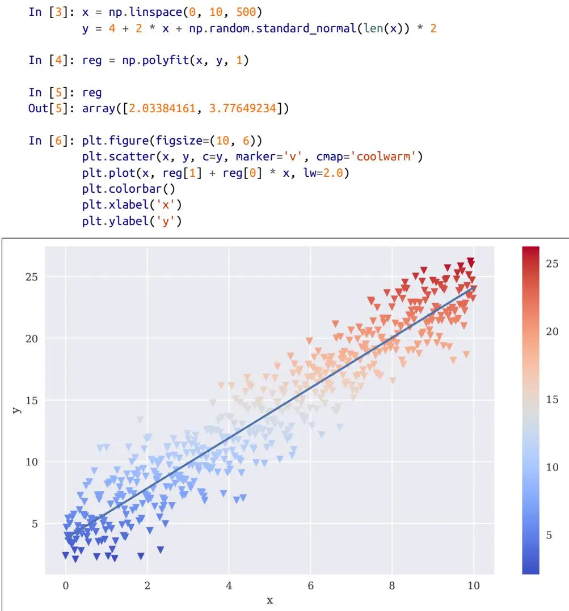
图13-16 样本数据点与回归线

OLS 回归方法的结果是回归线两个参数（截距和斜率）的固定值。请注意，最高次单项因子（本例中为回归线的斜率）位于索引级别 0，截距位于索引级别 1。原始参数 2 和 4 并未完美恢复，但这当然是由于数据中包含噪声所致。

其次，利用 PyMC3 包进行贝叶斯回归。这里假设参数以某种方式分布。例如，考虑描述回归线的方程 ŷ(x) = α + β · x。现假设以下先验分布：

• α 服从均值为 0、标准差为 20 的正态分布。

• β 服从均值为 0、标准差为 10 的正态分布。

对于似然（Likelihood），假设其服从均值为 ŷ(x) 的正态分布，标准差在 0 到 10 之间均匀分布。

贝叶斯回归的一个主要元素是马尔可夫链蒙特卡洛（Markov Chain Monte Carlo，MCMC）采样。<sup>7</sup> 原则上，这与上一节简单示例中多次从盒子中抽球相同——只是以更系统、更自动化的方式进行。

在技术采样方面，有三个不同的函数需要调用：

• find\_MAP() 通过推导局部最大后验（Maximum A Posteriori）点来寻找采样算法的起点。

• NUTS() 实现在给定假设先验下的 MCMC 采样，即所谓的"高效无U转采样器与双平均"（No-U-Turn Sampler with dual averaging，NUTS）算法。

• sample() 根据 find\_MAP() 的起始值和 NUTS 算法的最优步长，抽取一定数量的样本。

所有这些都需要封装到 PyMC3 的 Model 对象中，并在 with 语句内执行：

```python
In [8]: import pymc3 as pm

In [9]: %%time
    with pm.Model() as model:
    # model
    alpha = pm.Normal('alpha', mu=0, sd=20) ①
    beta = pm.Normal('beta', mu=0, sd=10) ①
    sigma = pm.Uniform('sigma', lower=0, upper=10) ①
    y_est = alpha + beta * x ②
    likelihood = pm.Normal('y', mu=y_est, sd=sigma, observed=y) ③

    # inference
    start = pm.find_MAP() ④
    step = pm.NUTS() ⑤
    trace = pm.sample(100, tune=1000, start=start, progressbar=True) ⑥
    logp = -1,067.8, ||grad|| = 60.354: 100% | 28/28 [00:00<00:00, 474.70it/s]
```

```txt
Only 100 samples in chain.
Auto-assigning NUTS sampler...
Initializing NUTS using jitter+adapt_diag...
Multiprocess sampling (2 chains in 2 jobs)
NUTS: [sigma, beta, alpha]
Sampling 2 chains: 100% | 2200/2200 [00:03<00:00, 690.96draws/s]

CPU times: user 6.2 s, sys: 1.72 s, total: 7.92 s
Wall time: 1min 28s
```

```csv
In [10]: pm.summary(trace) ⑦
Out[10]:
mean sd mc_error hpd_2.5 hpd_97.5 n_eff Rhat
alpha 3.7640270.1747960.0131773.4317394.070091152.4469510.996281
beta 2.0363180.0305190.0022301.9868742.094008106.5055900.999155
sigma 2.0103980.0586630.0045171.9043952.138187188.6432930.998547
```

```python
In [11]: trace[0] ⑧
Out[11]: {'alpha': 3.9303300798212444,
    'beta': 2.0020264758995463,
    'sigma_interval_': -1.3519315719461853,
    'sigma': 2.0555476283253156}
```

定义先验分布。

指定线性回归。

定义似然。

通过优化寻找起始值。

实例化 MCMC 算法。

使用 NUTS 抽取后验样本。

显示采样结果的汇总统计量。

第一个样本的估计值。

显示的三个估计值与原始值（4, 2, 2）相当接近。然而，整个过程产生了更多的估计值。最好通过轨迹图（Trace Plot）来展示它们，如图13-17所示——即展示不同参数的后验分布以及每个样本的所有单个估计值的图。后验分布直观地给出了估计值的不确定性感：

```javascript
In [12]: pm.traceplot(trace, lines={'alpha': 4, 'beta': 2, 'sigma': 2});
```

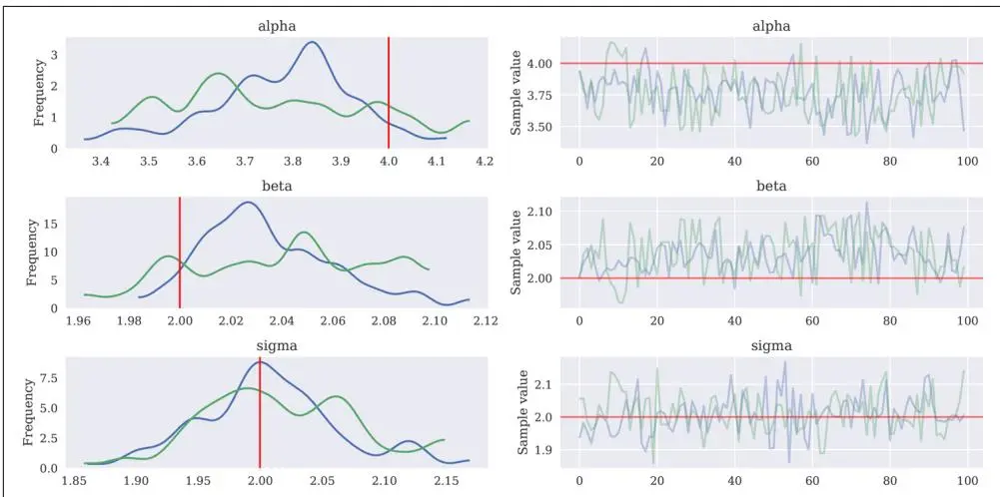
图13-17 后验分布与轨迹图

仅从回归中取 alpha 和 beta 值，可以绘制所有得到的回归线，如图13-18所示：

```python
In [13]: plt.figure(figsize=(10, 6))
    plt.scatter(x, y, c=y, marker='v', cmap='coolwarm')
    plt.colorbar()
    plt.xlabel('x')
    plt.ylabel('y')
    for i in range(len(trace)):
    plt.plot(x, trace['alpha'][i] + trace['beta'][i] * x)
```

## 绘制单个回归线。

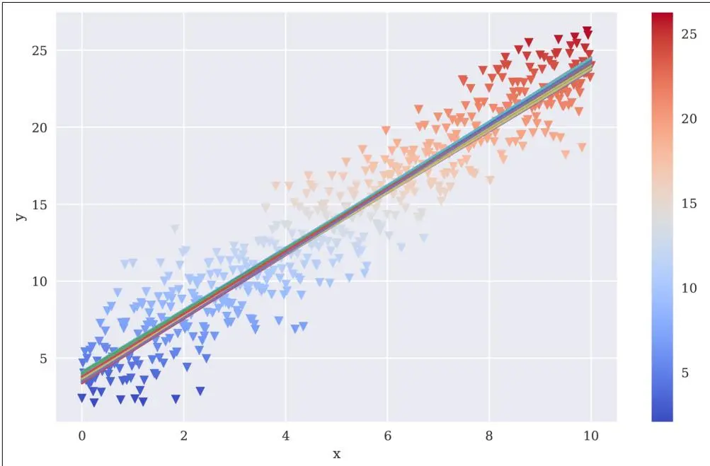
图13-18 基于不同估计值的回归线

## 两个金融工具（Two Financial Instruments）

在基于虚拟数据介绍了使用 PyMC3 的贝叶斯回归之后，转向真实金融数据是顺理成章的。示例使用了两只交易所交易基金（ETF）GLD 和 GDX 的金融时间序列数据（见图13-19）：

```python
In [14]: raw = pd.read_csv('../source/tr_eikon_eod_data.csv', index_col=0, parse_dates=True)

In [15]: data = raw[['GDX', 'GLD']].dropna()

In [16]: data = data / data.iloc[0] ①

In [17]: data.info()
    <class 'pandas.core.frame.DataFrame'>
    DatetimeIndex: 2138 entries, 2010-01-04 to 2018-06-29
    Data columns (total 2 columns):
    GDX 2138 non-null float64
    GLD 2138 non-null float64
    dtypes: float64(2)
    memory usage: 50.1 KB

In [18]: data.iloc[-1] / data.iloc[0] - 1 ②
Out[18]: GDX -0.532383
    GLD 0.080601
    dtype: float64
```

```txt
In [19]: data.corr() ③
Out[19]: GDX GLD
GDX 1.000000.71539
GLD 0.715391.00000
```

```javascript
In [20]: data.plot(figsize=(10, 6));
```

将数据归一化到起始值为 1。

计算相对表现。

计算两个工具之间的相关性。

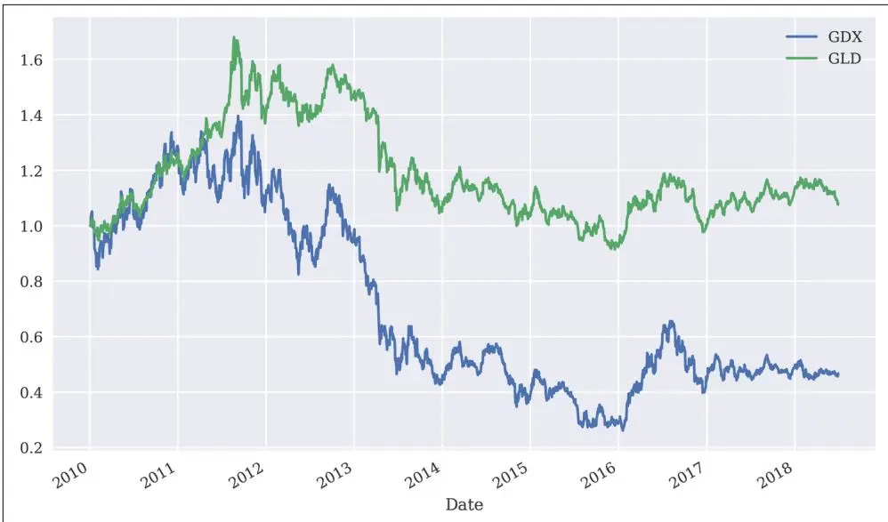
图13-19 GLD 和 GDX 随时间变化的归一化价格

在接下来的内容中，单个数据点的日期将在散点图中可视化。为此，DataFrame 的 DatetimeIndex 对象被转换为 matplotlib 日期。图13-20显示了时间序列数据的散点图，将 GLD 值对 GDX 值绘制，并通过不同颜色说明每个数据对的日期：<sup>8</sup>

$$
\begin{array}{l} \text{In [21]: data.index[:3]} \\ \text{Out[21]: DatetimeIndex(['2010 - 01 - 04', '2010 - 01 - 05', '2010 - 01 - 06'],} \\ \text{dtype='datetime64[ns]', name='Date', freq=None)} \end{array}
$$

```python
In [22]: mpl_dates = mpl.dates.date2num(data.index.to_pydatetime())
mpl_dates[:3]
Out[22]: array([733776., 733777., 733778.])

In [23]: plt.figure(figsize=(10, 6))
plt.scatter(data['GDX'], data['GLD'], c=mpl_dates,
    marker='o', cmap='coolwarm')
plt.xlabel('GDX')
plt.ylabel('GLD')
plt.colorbar(ticks=mpl.dates.DayLocator(interval=250),
    format=mpl.dates.DateFormatter('%d %b %y'));
```

将 DatetimeIndex 对象转换为 matplotlib 日期。

为日期定制颜色条。

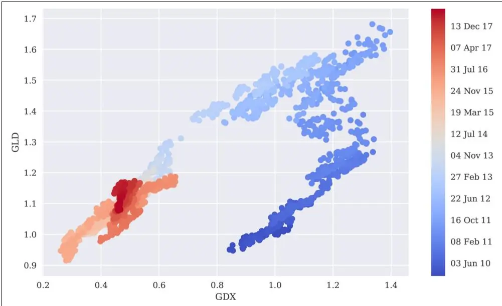
图13-20 GLD 价格对 GDX 价格的散点图

以下代码基于这两个时间序列实现了贝叶斯回归。参数化设置与之前使用虚拟数据的示例基本相同。图13-21显示了在给定三个参数先验概率分布假设下的 MCMC 采样过程的结果：

```python
In [24]: with pm.Model() as model:
    alpha = pm.Normal('alpha', mu=0, sd=20)
    beta = pm.Normal('beta', mu=0, sd=20)
    sigma = pm.Uniform('sigma', lower=0, upper=50)
```

```python
y_est = alpha + beta * data['GDX'].values
likelihood = pm.Normal('GLD', mu=y_est, sd=sigma,
observed=data['GLD'].values)
start = pm.find_MAP()
step = pm.NUTS()
trace = pm.sample(250, tune=2000, start=start,
    progressbar=True)
logp = 1,493.7, ||grad|| = 188.29: 100% | 27/27 [00:00<00:00,
1609.34it/s]
Only 250 samples in chain.
Auto-assigning NUTS sampler...
Initializing NUTS using jitter+adapt_diag...
Multiprocess sampling (2 chains in 2 jobs)
NUTS: [sigma, beta, alpha]
Sampling 2 chains: 100% | 4500/4500 [00:09<00:00,
465.07draws/s]
The estimated number of effective samples is smaller than 200 for some
parameters.
```

```csv
In [25]: pm.summary(trace)
Out[25]:
mean sd mc_error hpd_2.5 hpd_97.5 n_eff Rhat
alpha 0.9133350.0059830.0003560.9015860.924714184.2649001.001855
beta 0.3853940.0077460.0004610.3691540.398291215.4777381.001570
sigma 0.1194840.0019640.0000980.1153050.123315312.2602131.005246
```

```txt
alpha
Sample value
0.92
alpha
Sample value
0.90
beta
Sample value
0.36
beta
Sample value
0.38
sigma
Sample value
0.125
sigma
Sample value
0.115
```
图13-21 GDX 和 GLD 数据的后验分布与轨迹图

图13-22将所有得到的回归线添加到之前的散点图中。然而，所有回归线彼此之间非常接近：

```python
In [27]: plt.figure(figsize=(10, 6))
plt.scatter(data['GDX'], data['GLD'], c=mpl_dates,
    marker='o', cmap='coolwarm')
plt.xlabel('GDX')
plt.ylabel('GLD')
for i in range(len(trace)):
    plt.plot(data['GDX'],
    trace['alpha'][i] + trace['beta'][i] * data['GDX'])
plt.colorbar(ticks=mpl.dates.DayLocator(interval=250),
    format=mpl.dates.DateFormatter('%d %b %y'));
```

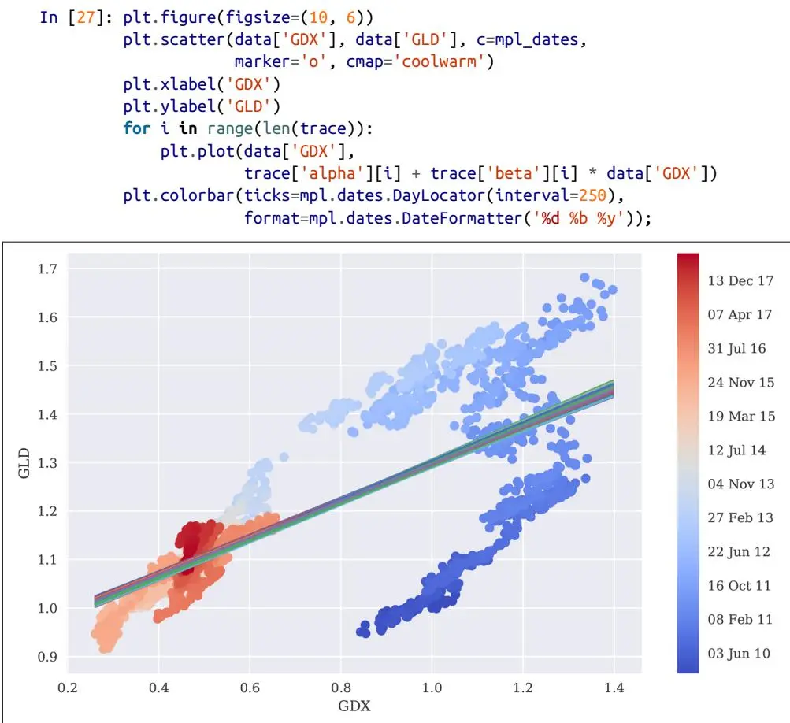
图13-22 穿过 GDX 和 GLD 数据的多条贝叶斯回归线

该图揭示了所用回归方法的一个主要缺点：该方法没有考虑随时间的变化。也就是说，最新数据与最旧数据被同等对待。

## 随时间更新估计值（Updating Estimates over Time）

如前所述，金融中的贝叶斯方法通常在被视为历时性（Diachronic）时最为有用——即随着时间的推移，新数据的出现使得通过更新或学习能够获得更好的回归和估计。

为了在当前示例中融入这一概念，假设回归参数不仅是随机的并以某种方式分布，而且它们随时间遵循某种随机游走（Random Walk）。这与金融理论中从随机变量过渡到随机过程（本质上是随机变量的有序序列）时所使用的推广相同。

为此，定义一个新的 PyMC3 模型，这次将参数值指定为随机游走。在指定了随机游走参数的分布之后，接着指定 alpha 和 beta 的随机游走。为了使整个过程更高效，每 50 个数据点共享共同的系数：

```python
In [28]: from pymc3.distributions.timeseries import GaussianRandomWalk

In [29]: subsample_alpha = 50
    subsample_beta = 50

In [30]: model_randomwalk = pm.Model()
    with model_randomwalk:
    sigma_alpha = pm.Exponential('sig_alpha', 1. / .02, testval=.1)
    sigma_beta = pm.Exponential('sig_beta', 1. / .02, testval=.1)
    alpha = GaussianRandomWalk('alpha', sigma_alpha ** -2,
    shape=int(len(data) / subsample_alpha))
    beta = GaussianRandomWalk('beta', sigma_beta ** -2,
    shape=int(len(data) / subsample_beta))
    alpha_r = np.repeat(alpha, subsample_alpha)
    beta_r = np.repeat(beta, subsample_beta)
    regression = alpha_r + beta_r * data['GDX'].values[:2100]
    sd = pm.Uniform('sd', 0, 20)
    likelihood = pm.Normal('GLD', mu=regression, sd=sd,
    observed=data['GLD'].values[:2100])
```

定义随机游走参数的先验分布。

随机游走的模型。

将参数向量扩展到区间长度。

定义回归模型。

标准差的先验分布。

使用回归结果的 mu 定义似然。

所有这些定义比之前稍微复杂一些，因为使用了随机游走而不是单个随机变量。然而，MCMC 采样的推理步骤基本相同。不过请注意，计算负担大幅增加，因为算法需要为每个随机游走样本估计参数——在本例中为 1,950 / 50 = 39 个参数组合（而不是之前的 1 个）：

```txt
In [32]: pm.summary(trace_rw).head()
Out[32]:
mean sd mc_error hpd_2.5 hpd_97.5 n_eff \
alpha_00.6738460.0402240.0013760.5926550.7530341004.616544
alpha_10.4248190.0412570.0016180.3481020.509757804.760648
alpha_20.4568170.0572000.0020110.3211250.553173800.225916
alpha_30.2681480.0448790.0017250.1827440.352197724.967532
alpha_40.6514650.0574720.0021970.5440760.761216978.073246
Rhat
alpha_00.998637
alpha_10.999540
alpha_20.998075
alpha_30.998995
alpha_40.998060
```

```python
In [31]: %%time
import scipy.optimize as sco
with model_randomwalk:
    start = pm.find_MAP(vars=[alpha, beta],
    fmin=sco.fmin_l_bfgs_b)
    step = pm.NUTS(scaling=start)
    trace_rw = pm.sample(250, tune=1000, start=start,
    progressbar=True)
logp = -6,657: 2%|| | 82/5000 [00:00<00:08, 550.29it/s]
Only 250 samples in chain.
Auto-assigning NUTS sampler...
Initializing NUTS using jitter+adapt_diag...
Multiprocess sampling (2 chains in 2 jobs)
NUTS: [sd, beta, alpha, sig_beta, sig_alpha]
Sampling 2 chains: 100%| 2500/2500 [02:48<00:00, 8.59draws/s]

CPU times: user 27.5 s, sys: 3.68 s, total: 31.2 s
Wall time: 5min 3s
```

## 每个区间的汇总统计量（仅前五个和 alpha）。

图13-23通过绘制一部分估计值来说明回归参数 alpha 和 beta 随时间的演变：

```python
In [33]: sh = np.shape(trace_rw['alpha']) ①
    sh ①
Out[33]: (500, 42)

In [34]: part_dates = np.linspace(min(mpl_dates), max(mpl_dates), sh[1]) ②

In [35]: index = [dt.datetime.fromordinal(int(date)) for date in part_dates] ②

In [36]: alpha = {'alpha_%i' % i: v for i, v in enumerate(trace_rw['alpha']) if i < 20} ③
```

```python
In [37]: beta = {'beta_%i' % i: v for i, v in
    enumerate(trace_rw['beta']) if i < 20} ③

In [38]: df_alpha = pd.DataFrame(alpha, index=index) ③

In [39]: df_beta = pd.DataFrame(beta, index=index) ③

In [40]: ax = df_alpha.plot(color='b', style='-.', legend=False,
    lw=0.7, figsize=(10, 6))
    df_beta.plot(color='r', style='-.', legend=False,
    lw=0.7, ax=ax)
plt.ylabel('alpha/beta');
```

参数估计对象的形状。

创建与区间数匹配的日期列表。

将相关参数时间序列收集到两个 DataFrame 对象中。

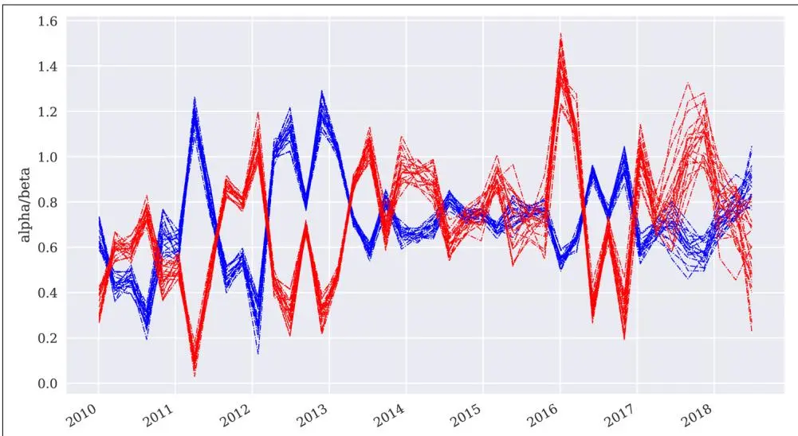
图13-23 选定的参数估计值随时间变化图


## 绝对价格数据与相对收益数据（Absolute Price Data Versus Relative Return Data）

本节中的分析基于归一化的价格数据。这仅用于说明目的，因为相应的图形结果更易于理解和解释（它们在视觉上"更具吸引力"）。对于现实世界的金融应用，应转而使用收益数据，例如，以确保时间序列数据的平稳性（Stationarity）。

使用 alpha 和 beta 的均值，图13-24说明了回归如何随时间更新。显示了由 alpha 和 beta 均值得到的 39 条不同的回归线。显然，随时间更新显著改善了回归拟合（针对当前/最新数据）——换句话说，"每个时间段都需要自己的回归"：

```python
In [41]: plt.figure(figsize=(10, 6))
    plt.scatter(data['GDX'], data['GLD'], c=mpl_dates,
    marker='o', cmap='coolwarm')
    plt.colorbar(ticks=mpl.dates.DayLocator(interval=250),
    format=mpl.dates.DateFormatter('%d %b %y'))
    plt.xlabel('GDX')
    plt.ylabel('GLD')
    x = np.linspace(min(data['GDX']), max(data['GDX']))
    for i in range(sh[1]):
    alpha_rw = np.mean(trace_rw['alpha'].T[i])
    beta_rw = np.mean(trace_rw['beta'].T[i])
    plt.plot(x, alpha_rw + beta_rw * x, '--', lw=0.7,
    color=plt.cm.coolwarm(i / sh[1]))
```

## 绘制所有长度为 50 的时间区间的回归线。

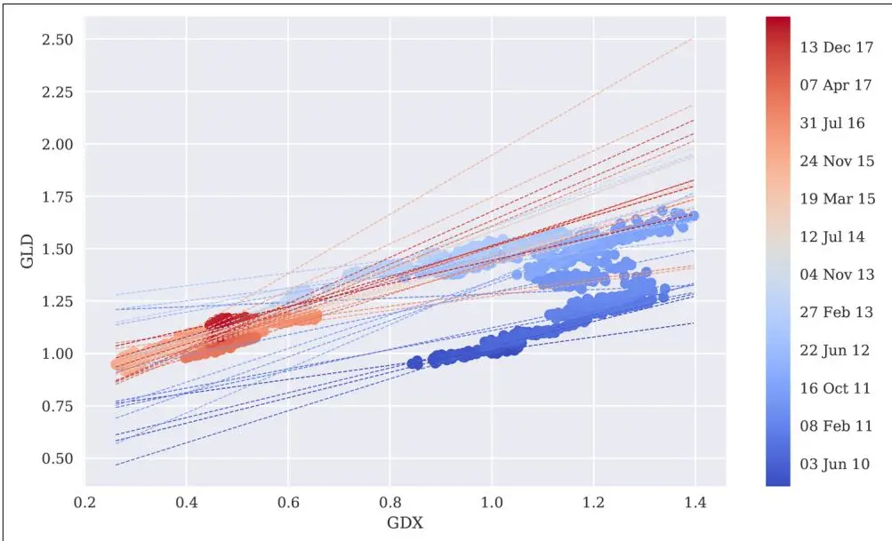
图13-24 具有时间依赖回归线的散点图（更新后的估计值）

本节结束了关于贝叶斯统计学的讨论。Python 通过 PyMC3 提供了一个全面的包来实现贝叶斯统计学和概率编程的不同方法。特别是贝叶斯回归，已成为量化金融中相当流行和重要的工具。

## 机器学习（Machine Learning）

在金融和许多其他领域，当今的"关键任务"就是机器学习（Machine Learning，ML）。正如以下引文所述：

计量经济学或许足以在金融学术界取得成功（暂时如此），但在实践中取得成功需要机器学习。

——Marcos López de Prado（2018）

机器学习涵盖了不同类型的算法，这些算法基本上能够自主从原始数据中学习某些关系、模式等。第463页的"延伸阅读"列出了大量关于机器学习方法和算法的数学与统计方面，以及与其实现和实际使用相关的书籍。例如，Alpaydin（2016）对该领域进行了温和的介绍，并对常用的算法类型给出了非技术性的概述。

本节采取严格实践的方法，仅关注选定的实现方面——着眼于[第15章](ch15.md)中使用的技术。然而，所介绍的算法和技术当然可以用于许多不同的金融领域，而不仅仅是算法交易。本节涵盖两种类型的算法：无监督学习和监督学习算法。

Python 中最流行的机器学习包之一是 scikit-learn。它不仅提供了各种 ML 算法的实现，还提供了大量用于 ML 任务相关预处理和后处理活动的有用工具。本节主要依赖这个包。它还在深度神经网络（Deep Neural Networks，DNNs）的上下文中使用了 TensorFlow。

VanderPlas（2016）提供了基于 Python 和 scikit-learn 的不同 ML 算法的简明介绍。Albon（2018）提供了许多针对 ML 中典型任务的配方，也主要使用 Python 和 scikit-learn。

## 无监督学习（Unsupervised Learning）

无监督学习体现了机器学习算法在没有进一步指导的情况下从原始数据中发现洞察力的思想。其中一种算法是 k-means 聚类算法，它将原始数据集聚类成若干子集，并为这些子集分配标签（"簇 0"、"簇 1"等）。另一种是高斯混合模型（Gaussian Mixture）。<sup>9</sup>

## 数据

除其他功能外，scikit-learn 允许为不同类型的 ML 问题创建样本数据集。以下创建一个适用于说明 k-means 聚类的样本数据集。

首先，一些标准导入和配置：

```python
In [1]: import numpy as np
import pandas as pd
import datetime as dt
from pylab import mpl, plt

In [2]: plt.style.use('seaborn')
mpl.rcParams['font.family'] = 'serif'
np.random.seed(1000)
np.set_printoptions(suppress=True, precision=4)
%matplotlib inline
```

其次，创建样本数据集。图13-25可视化了样本数据：

```python
In [3]: from sklearn.datasets.samples_generator import make_blobs
In [4]: X, y = make_blobs(n_samples=250, centers=4, random_state=500, cluster_std=1.25)
In [5]: plt.figure(figsize=(10, 6))
plt.scatter(X[:, 0], X[:, 1], s=50);
```

创建用于聚类的样本数据集，包含 250 个样本和 4 个中心点。

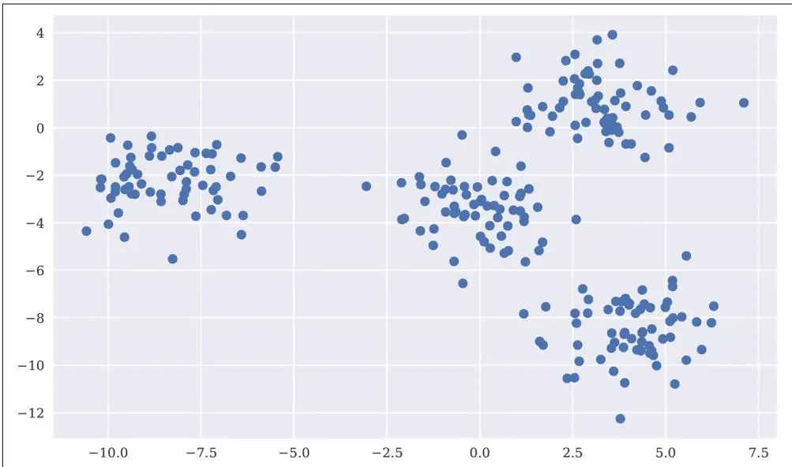
图13-25 用于聚类算法应用的样本数据

## k-means 聚类

scikit-learn 的一个便捷特性是它提供了标准化的 API 来应用不同类型的算法。以下代码展示了 k-means 聚类的基本步骤，这些步骤也将在后续的其他模型中重复使用：

• 导入模型类

• 实例化模型对象

• 将模型对象拟合到数据

• 根据拟合模型预测结果

图13-26显示了结果：

```python
In [6]: from sklearn.cluster import KMeans ①
In [7]: model = KMeans(n_clusters=4, random_state=0) ②
In [8]: model.fit(X) ③
Out[8]: KMeans(algorithm='auto', copy_x=True, init='k-means++', max_iter=300, n_clusters=4, n_init=10, n_jobs=None, precompute_distances='auto', random_state=0, tol=0.0001, verbose=0)
In [9]: y_kmeans = model.predict(X) ④
In [10]: y_kmeans[:12] ⑤
Out[10]: array([1, 1, 0, 3, 0, 1, 3, 3, 3, 0, 2, 2], dtype=int32)
In [11]: plt.figure(figsize=(10, 6))
plt.scatter(X[:, 0], X[:, 1], c=y_kmeans, cmap='coolwarm');
```

从 scikit-learn 导入模型类。

实例化模型对象，给定某些参数；使用对样本数据的了解来通知实例化。

将模型对象拟合到原始数据。

根据原始数据预测簇（编号）。

显示一些预测的簇编号。

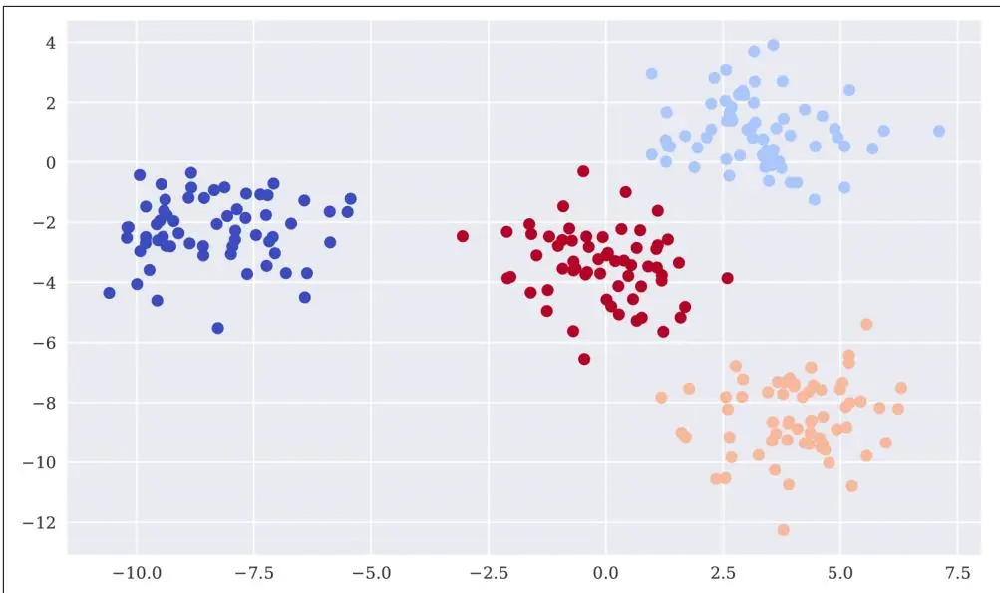
图13-26 样本数据与识别出的簇

## 高斯混合（Gaussian Mixture）

作为一种替代的聚类方法，考虑高斯混合模型。应用方式相同，并且在适当的参数化下，结果也是相同的：

```txt
In [12]: from sklearn.mixture import GaussianMixture
```

```python
In [13]: model = GaussianMixture(n_components=4, random_state=0)

In [14]: model.fit(X)
Out[14]: GaussianMixture(covariance_type='full', init_params='kmeans', max_iter=100, means_init=None, n_components=4, n_init=1, precisions_init=None, random_state=0, reg_covar=1e-06, tol=0.001, verbose=0, verbose_interval=10, warm_start=False, weights_init=None)

In [15]: y_gm = model.predict(X)

In [16]: y_gm[:12]
Out[16]: array([1, 1, 0, 3, 0, 1, 3, 3, 3, 0, 2, 2])

In [17]: (y_gm == y_kmeans).all() ①
Out[17]: True
```

k-means 聚类和高斯混合的结果相同。

## 监督学习（Supervised Learning）

监督学习是在已知结果或观测数据形式的指导下进行的机器学习。这意味着原始数据已经包含了 ML 算法应当学习的内容。接下来的重点将放在分类问题上，而非估计问题。估计问题通常是关于实值数量的估计，而分类问题的特点是将特定的特征组合分配给来自相对较小的类别（整数值）集合中的某个类别（整数值）。

上一小节的示例表明，在无监督学习中，算法会为识别出的簇自行生成分类标签。对于四个簇，标签是 0、1、2 和 3。在监督学习中，这样的分类标签已经给定，因此算法可以学习特征与类别之间的关系。换句话说，在拟合步骤中，算法知道给定的特征值组合对应的正确类别。

本小节说明了以下分类算法的应用：高斯朴素贝叶斯（Gaussian Naive Bayes）、逻辑回归（Logistic Regression）、决策树（Decision Trees）、深度神经网络（Deep Neural Networks）和支持向量机（Support Vector Machines）。<sup>10</sup>

## 数据

同样，scikit-learn 允许创建适合应用分类算法的样本数据集。为了能够可视化结果，样本数据仅包含两个实值信息特征和一个二元标签（二元标签仅由两个不同的类别 0 和 1 表征）。以下代码创建样本数据，显示部分数据，并将数据可视化（见图13-27）：

In [18]: from sklearn.datasets import make\_classification

In [19]: n\_samples = 100

```python
In [20]: X, y = make_classification(n_samples=n_samples, n_features=2, n_informative=2, n_redundant=0, n_repeated=0, random_state=250)
```

In [21]: X[:5] Out[21]: array([[ 1.6876, -0.7976], [-0.4312, -0.7606], [-1.4393, -1.2363], [ 1.118 , -1.8682], [ 0.0502, 0.659 ]])

```txt
In [22]: X.shape ①
Out[22]: (100, 2)

In [23]: y[:5] ②
Out[23]: array([1, 0, 0, 1, 1])

In [24]: y.shape ②
Out[24]: (100,)
plt.figure(figsize=(10, 6))
plt.hist(X);
In [25]: plt.figure(figsize=(10, 6))
    plt.scatter(x=X[:, 0], y=X[:, 1], c=y, cmap='coolwarm');
```

两个有信息的实值特征。

单一的二元标签。

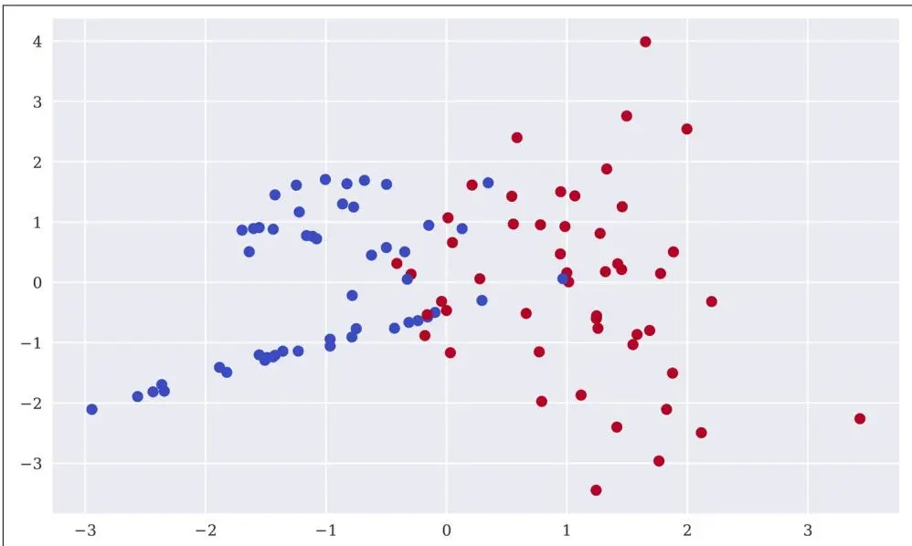
图13-27 用于分类算法应用的样本数据

## 高斯朴素贝叶斯（Gaussian Naive Bayes）

高斯朴素贝叶斯（GNB）通常被认为是适用于多种不同分类问题的一个良好的基准算法。其应用与第446页"k-means 聚类"中概述的步骤一致：

```python
In [26]: from sklearn.naive_bayes import GaussianNB from sklearn.metrics import accuracy_score
```

```txt
In [32]: pred == y ③
```

```python
In [27]: model = GaussianNB()
In [28]: model.fit(X, y)
Out[28]: GaussianNB(priors=None, var_smoothing=1e-09)
```

```python
In [29]: model.predict_proba(X).round(4)[:5] ①
Out[29]: array([[0.0041, 0.9959],
    [0.8534, 0.1466],
    [0.9947, 0.0053],
    [0.0182, 0.9818],
    [0.5156, 0.4844]])
```

```javascript
In [30]: pred = model.predict(X) 2
```

```python
In [31]: pred ②
Out[31]: array([1, 0, 0, 1, 0, 0, 1, 1, 1, 0, 0, 0, 0, 0, 1, 1, 0, 1, 0, 1, 1, 0,
    0, 0, 1, 0, 0, 0, 0, 0, 1, 0, 1, 1, 0, 0, 0, 1, 1, 0, 1, 0, 0, 0,
    0, 1, 1, 1, 0, 0, 1, 0, 0, 1, 1, 1, 1, 1, 0, 0, 0, 1, 1, 1, 1, 0,
    0, 0, 1, 0, 0, 1, 1, 1, 1, 1, 1, 0, 0, 1, 0, 0, 0, 1, 0, 0, 0, 1,
    0, 1, 1, 1, 1, 1, 0, 0, 0, 0]
```

```txt
Out[32]: array([ True, True, True, True, False, True, True, True, True, True, False, True, True, True, True, True, False, False, False, False, True, True, True, True, True, True, True, True, True, True, True, True, True, True, True, True, True, True, True, True, True, True, True, True, True, True, True, True, True, True, True, True, True, True, True, True]
```

```txt
In [33]: accuracy_score(y, pred) 4
Out[33]: 0.87
```


显示算法在拟合后分配给每个类别的概率。

基于概率，预测数据集的二元类别。

将预测的类别与真实类别进行比较。

计算给定预测值的准确率得分。

图13-28可视化了 GNB 的正确和错误预测：

```txt
In [34]: Xc = X[y == pred] ①
Xf = X[y != pred] ②
```

```python
In [35]: plt.figure(figsize=(10, 6))
plt.scatter(x=Xc[:, 0], y=Xc[:, 1], c=y[y == pred], marker='o', cmap='coolwarm') ①
plt.scatter(x=Xf[:, 0], y=Xf[:, 1], c=y[y != pred], marker='x', cmap='coolwarm') ②
```

选择正确预测并绘制它们。

选择错误预测并绘制它们。

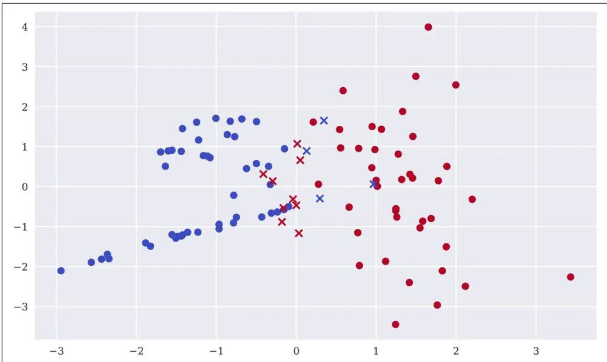
图13-28 GNB 的正确（圆点）和错误（叉号）预测

## 逻辑回归（Logistic Regression）

逻辑回归（LR）是一种快速且可扩展的分类算法。在这种特定情况下的准确率略高于 GNB：

```txt
In [36]: from sklearn.linear_model import LogisticRegression
```

```python
In [37]: model = LogisticRegression(C=1, solver='lbfgs')

In [38]: model.fit(X, y)
Out[38]: LogisticRegression(C=1, class_weight=None, dual=False,
    fit_intercept=True,
    intercept_scaling=1, max_iter=100, multi_class='warn',
    n_jobs=None, penalty='l2', random_state=None, solver='lbfgs',
    tol=0.0001, verbose=0, warm_start=False)

In [39]: model.predict_proba(X).round(4)[:5]
Out[39]: array([[0.011, 0.989],
```

```python
[0.7266, 0.2734],
[0.971, 0.029],
[0.04, 0.96],
[0.4843, 0.5157]])
In [40]: pred = model.predict(X)
In [41]: accuracy_score(y, pred)
Out[41]: 0.9
In [42]: Xc = X[y == pred]
    Xf = X[y != pred]
In [43]: plt.figure(figsize=(10, 6))
    plt.scatter(x=Xc[:, 0], y=Xc[:, 1], c=y[y == pred],
    marker='o', cmap='coolwarm')
    plt.scatter(x=Xf[:, 0], y=Xf[:, 1], c=y[y != pred],
    marker='x', cmap='coolwarm');
```

## 决策树（Decision Trees）

决策树（DT）是另一种扩展性相当好的分类算法。在最大深度为 1 的情况下，该算法的性能已经略优于 GNB 和 LR（另见图13-29）：

```python
In [44]: from sklearn.tree import DecisionTreeClassifier

In [45]: model = DecisionTreeClassifier(max_depth=1)

In [46]: model.fit(X, y)
Out[46]: DecisionTreeClassifier(class_weight=None, criterion='gini', max_depth=1,
    max_features=None, max_leaf_nodes=None,
    min_impurity_decrease=0.0, min_impurity_split=None,
    min_samples_leaf=1, min_samples_split=2,
    min_weight_fraction_leaf=0.0, presort=False, random_state=None, splitter='best')

In [47]: model.predict_proba(X).round(4)[:5]
Out[47]: array([[0.08, 0.92],
    [0.92, 0.08],
    [0.92, 0.08],
    [0.08, 0.92],
    [0.08, 0.92]])
In [48]: pred = model.predict(X)

In [49]: accuracy_score(y, pred)
Out[49]: 0.92

In [50]: Xc = X[y == pred]
    Xf = X[y != pred]
```

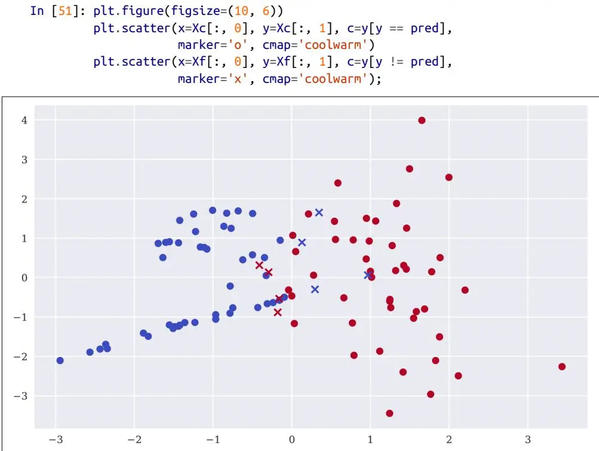
图13-29 决策树（最大深度=1）的正确（圆点）和错误（叉号）预测

然而，增加决策树的最大深度参数可以获得完美的结果：

```python
In [52]: print('{:>8s} | {:8s}'.format('depth', 'accuracy'))
print(20 * '-')

for depth in range(1, 7):
    model = DecisionTreeClassifier(max_depth=depth)
    model.fit(X, y)
    acc = accuracy_score(y, model.predict(X))
    print('[:8d] | {:8.2f}'.format(depth, acc))
    depth | accuracy

    1 | 0.922 | 0.923 | 0.944 | 0.975 | 0.996 | 1.00
```

## 深度神经网络（Deep Neural Networks）

深度神经网络（DNN）被认为是用于估计和分类的最强大——但也是计算需求最高的——算法之一。Google 开源的 TensorFlow 包以及相关的成功故事在一定程度上推动了它们的流行。DNN 能够学习和建模复杂的非线性关系。虽然它们的起源可以追溯到 20 世纪 70 年代，但直到最近由于硬件（CPU、GPU、TPU）、数值算法和相关软件实现的进步，才在大规模上变得可行。

虽然其他 ML 算法，如 LR 类型的线性模型，可以基于标准优化问题高效拟合，但 DNN 依赖于深度学习，这通常需要大量重复步骤来调整某些参数（权重）并将结果与数据进行比较。在这个意义上，深度学习可以比作数学金融中的蒙特卡洛模拟，例如，欧式看涨期权的价格可以基于标的资产的 100,000 条模拟路径来估计。另一方面，Black-Scholes-Merton 期权定价公式具有闭式形式，可以解析计算。

虽然蒙特卡洛模拟是数学金融中最灵活和最强大的数值技术之一，但需要付出高计算负担和大内存占用的代价。深度学习也是如此，它通常比许多其他 ML 算法更灵活，但需要更大的计算能力。

使用 scikit-learn 的 DNN。尽管 scikit-learn 的 MLPClassifier 算法类<sup>11</sup>在性质上有所不同，但它为这个 DNN 模型提供了与之前使用的其他 ML 算法相同的 API。仅需两个所谓的隐藏层，它就能在测试数据上达到完美结果（隐藏层正是将简单学习转化为深度学习的关键——例如，在线性回归的上下文中"学习"权重，而不是使用 OLS 回归直接推导它们）：

In [53]: from sklearn.neural\_network import MLPClassifier

```python
In [54]: model = MLPClassifier(solver='lbfgs', alpha=1e-5, hidden_layer_sizes=2 * [75], random_state=10)
```

```txt
In [55]: %time model.fit(X, y)
CPU times: user 537 ms, sys: 14.2 ms, total: 551 ms
Wall time: 340 ms
```

Out[55]: MLPClassifier(activation='relu', alpha=1e-05, batch\_size='auto', beta\_1=0.9,

```javascript
beta_2=0.999, early_stopping=False, epsilon=1e-08, hidden_layer_sizes=[75, 75], learning_rate='constant', learning_rate_init=0.001, max_iter=200, momentum=0.9, n_iter_no_change=10, nesterovs_momentum=True, power_t=0.5, random_state=10, shuffle=True, solver='lbfgs', tol=0.0001, validation_fraction=0.1, verbose=False, warm_start=False)
```

使用 TensorFlow 的 DNN。TensorFlow 的 API 与 scikit-learn 的标准不同。然而，DNNClassifier 类的应用同样直接：

```python
In [58]: import tensorflow as tf
    tf.logging.set_verbosity(tf.logging.ERROR) ①

In [59]: fc = [tf.contrib.layers.real_valued_column('features')] ②

In [60]: model = tf.contrib.learn.DNNClassifier(hidden_units=5 * [250], n_classes=2, feature_columns=fc) ③

In [61]: def input_fn(): ④
    fc = {'features': tf.constant(X)}
    la = tf.constant(y)
    return fc, la

In [62]: %time model.fit(input_fn=input_fn, steps=100) ⑤
    CPU times: user 7.1 s, sys: 1.35 s, total: 8.45 s
    Wall time: 4.71 s

Out[62]: DNNClassifier(params={'head':
    <tensorflow.contrib.learn.python.learn ... head._BinaryLogisticHead object at 0x1a3ee692b0>, 'hidden_units': [250, 250, 250, 250, 250],
    'feature_columns': (_RealValuedColumn(column_name='features', dimension=1, default_value=None, dtype=tf.float32, normalizer=None),),
    'optimizer': None, 'activation_fn': <function relu at 0x1a3aa75b70>,
    'dropout': None, 'gradient_clip_norm': None,
    'embedding_lr_multipliers': None, 'input_layer_min_slice_size': None})

In [63]: model.evaluate(input_fn=input_fn, steps=1) ⑤
Out[63]: {'loss': 0.18724777,
```

```python
'accuracy': 0.91,
'labels/prediction_mean': 0.5003989,
'labels/actual_label_mean': 0.5,
'accuracy/baseline_label_mean': 0.5,
'auc': 0.9782,
'auc_precision_recall': 0.97817385,
'accuracy/threshold_0.500000_mean': 0.91,
'precision/positive_threshold_0.500000_mean': 0.9019608,
'recall/positive_threshold_0.500000_mean': 0.92,
'global_step': 100}

In [64]: pred = np.array(list(model.predict(input_fn=input_fn))) ⑥
pred[:10] ⑥
Out[64]: array([1, 0, 0, 1, 1, 0, 1, 1, 1, 1])

In [65]: %time model.fit(input_fn=input_fn, steps=750) ⑦
CPU times: user 29.8 s, sys: 7.51 s, total: 37.3 s
Wall time: 13.6 s

Out[65]: DNNClassifier(params={'head':
    <tensorflow.contrib.learn.python.learn ... head._BinaryLogisticHead
object at 0x1a3ee692b0>, 'hidden_units': [250, 250, 250, 250, 250],
    'feature_columns': (_RealValuedColumn(column_name='features',
    dimension=1, default_value=None, dtype=tf.float32, normalizer=None),),
    'optimizer': None, 'activation_fn': <function relu at 0x1a3aa75b70>,
    'dropout': None, 'gradient_clip_norm': None,
    'embedding_lr_multipliers': None, 'input_layer_min_slice_size': None})

In [66]: model.evaluate(input_fn=input_fn, steps=1) ⑧
Out[66]: {'loss': 0.09271307,
    'accuracy': 0.94,
    'labels/prediction_mean': 0.5274486,
    'labels/actual_label_mean': 0.5,
    'accuracy/baseline_label_mean': 0.5,
    'auc': 0.99759996,
    'auc_precision_recall': 0.9977609,
    'accuracy/threshold_0.500000_mean': 0.94,
    'precision/positive_threshold_0.500000_mean': 0.9074074,
    'recall/positive_threshold_0.500000_mean': 0.98,
    'global_step': 850}
```

设置 TensorFlow 日志的详细程度。

抽象定义实值特征。

实例化模型对象。

特征和标签数据需通过函数传递。

通过学习拟合模型并进行评估。

基于特征值预测标签值。

基于更多学习步骤重新训练模型；以前的结果作为起点。

## 重新训练后准确率提高。

这仅仅触及了 TensorFlow 的表面，它被用于许多高要求的用例，例如 Alphabet Inc. 构建自动驾驶汽车的努力。在速度方面，TensorFlow 模型的训练通常显著受益于使用 GPU 和 TPU 等专用硬件而非 CPU。

## 特征变换（Feature Transforms）

出于多种原因，变换实值特征可能是有益的甚至是必要的。以下代码展示了一些典型的变换，并在图13-30中可视化了结果以供比较：

```python
In [67]: from sklearn import preprocessing

In [68]: X[:5]

Out[68]: array([[1.6876, -0.7976],
    [-0.4312, -0.7606],
    [-1.4393, -1.2363],
    [1.118, -1.8682],
    [0.0502, 0.659]])

In [69]: Xs = preprocessing.StandardScaler().fit_transform(X) ①
Xs[:5]

Out[69]: array([[1.2881, -0.5489],
    [-0.3384, -0.5216],
    [-1.1122, -0.873],
    [0.8509, -1.3399],
    [0.0312, 0.5273]])

In [70]: Xm = preprocessing.MinMaxScaler().fit_transform(X) ②
Xm[:5]

Out[70]: array([[0.7262, 0.3563],
    [0.3939, 0.3613],
    [0.2358, 0.2973],
    [0.6369, 0.2122],
    [0.4694, 0.5523]])

In [71]: Xn1 = preprocessing.Normalizer(norm='l1').transform(X) ③
Xn1[:5]

Out[71]: array([[0.6791, -0.3209],
    [-0.3618, -0.6382],
    [-0.5379, -0.4621],
    [0.3744, -0.6256],
    [0.0708, 0.9292]])
```

```python
In [72]: Xn2 = preprocessing.Normalizer(norm='l2').transform(X) 3
    Xn2[:5]

Out[72]: array([[0.9041, -0.4273],
    [-0.4932, -0.8699],
    [-0.7586, -0.6516],
    [0.5135, -0.8581],
    [0.076, 0.9971]])
In [73]: plt.figure(figsize=(10, 6))
    markers = ['o', '.', 'x', '^', 'v']
    data_sets = [X, Xs, Xm, Xn1, Xn2]
    labels = ['raw', 'standard', 'minmax', 'norm(1)', 'norm(2)']
    for x, m, l in zip(data_sets, markers, labels):
    plt.scatter(x=x[:, 0], y=x[:, 1], c=y,
    marker=m, cmap='coolwarm', label=l)
    plt.legend();
```

将特征数据变换为标准正态分布数据，均值为零，方差为单位。

将特征数据变换到由每个特征的最小值和最大值定义的给定范围。

将特征数据分别缩放到单位范数（L1 或 L2）。

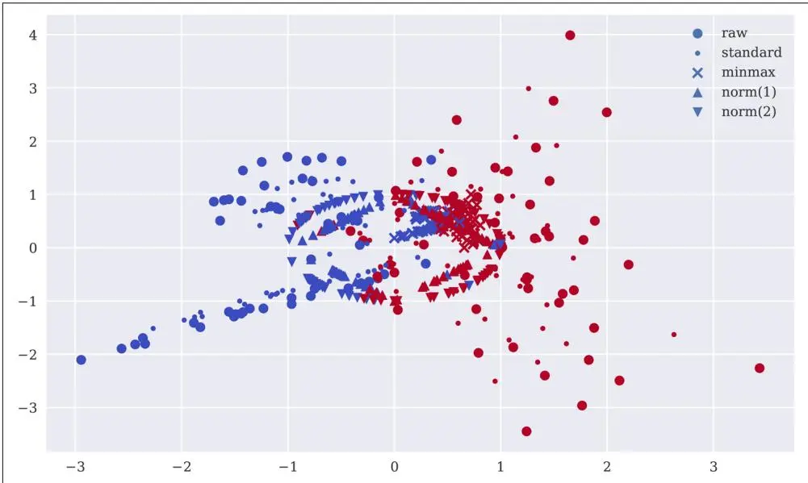
图13-30 原始数据与变换数据的对比

在模式识别任务中，变换为分类特征通常有助于甚至需要达到可接受的结果。为此，特征的实值被映射到有限的、固定数量的可能整数值（类别、分类）：

```python
In [74]: X[:5]
Out[74]: array([[1.6876, -0.7976],
    [-0.4312, -0.7606],
    [-1.4393, -1.2363],
    [1.118, -1.8682],
    [0.0502, 0.659]])
In [75]: Xb = preprocessing.Binarizer().fit_transform(X)
    Xb[:5]
Out[75]: array([[1., 0.],
    [0., 0.],
    [0., 0.],
    [1., 0.],
    [1., 1.]])

In [76]: 2 ** 2
Out[76]: 4

In [77]: Xd = np.digitize(X, bins=[-1, 0, 1])
    Xd[:5]
Out[77]: array([[3, 1],
    [1, 1],
    [0, 0],
    [3, 0],
    [2, 2]])
In [78]: 4 ** 2
Out[78]: 16
```

将特征变换为二值特征。

两个二值特征的可能特征值组合数。

基于用于分箱的值列表将特征变换为分类特征。

对于两个特征，使用三个分箱值的可能特征值组合数。

## 训练-测试集划分：支持向量机（Support Vector Machines）

在这一点上，每位经验丰富的 ML 研究人员和从业人员可能对本节中的实现有所顾虑：它们都依赖于相同的数据进行训练、学习和预测。当然，当使用不同的数据（子）集分别进行训练学习和测试时，ML 算法的质量可以更好地判断。这更接近现实世界的应用场景。

同样，scikit-learn 提供了高效实现这种方法的函数。特别是，train_test_split() 函数可以以随机化但可重复的方式将数据集分割为训练数据和测试数据。

以下代码使用了另一种分类算法——支持向量机（SVM）。它首先基于训练数据拟合 SVM 模型：

```python
In [79]: from sklearn.svm import SVC
    from sklearn.model_selection import train_test_split

In [80]: train_x, test_x, train_y, test_y = train_test_split(X, y, test_size=0.33, random_state=0)

In [81]: model = SVC(C=1, kernel='linear')

In [82]: model.fit(train_x, train_y) ①
Out[82]: SVC(C=1, cache_size=200, class_weight=None, coef0=0.0, decision_function_shape='ovr', degree=3, gamma='auto_deprecated', kernel='linear', max_iter=-1, probability=False, random_state=None, shrinking=True, tol=0.001, verbose=False)

In [83]: pred_train = model.predict(train_x) ②
In [84]: accuracy_score(train_y, pred_train) ③
Out[84]: 0.9402985074626866
```

基于训练数据拟合模型。

预测训练数据标签值。

训练数据预测的准确率（"样本内"）。

接下来，基于测试数据对拟合模型进行测试。图13-31显示了测试数据的正确和错误预测。测试数据的准确率——正如人们自然预期的那样——低于训练数据：

```python
In [85]: pred_test = model.predict(test_x) ①
In [86]: test_y == pred_test ②
Out[86]: array([ True, True, True, True, True, True, True, True, True, True, True, False, False, False, False, True, True, True, True, True, True, True, True, True, True, True, True, True, True, True])
In [87]: accuracy_score(test_y, pred_test) ②
Out[87]: 0.7878787878787878
```

```python
In [88]: test_c = test_x[test_y == pred_test]
    test_f = test_x[test_y != pred_test]

In [89]: plt.figure(figsize=(10, 6))
    plt.scatter(x=test_c[:, 0], y=test_c[:, 1], c=test_y[test_y == pred_test],
    marker='o', cmap='coolwarm')
    plt.scatter(x=test_f[:, 0], y=test_f[:, 1], c=test_y[test_y != pred_test],
    marker='x', cmap='coolwarm');
```

基于测试数据预测测试数据标签值。

评估拟合模型对测试数据的准确率（"样本外"）。

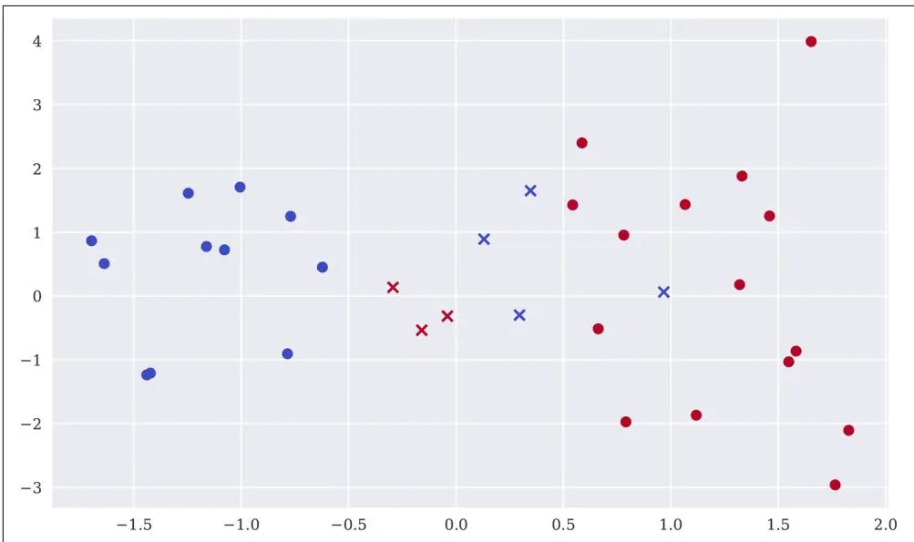
图13-31 SVM 对测试数据的正确（圆点）和错误（叉号）预测

SVM 分类算法为所使用的核函数提供了多种选项。根据手头的问题，不同的核函数可能导致相当不同的结果（即准确率得分），如下面的分析所示。代码首先将实值特征变换为分类特征：

```txt
In [90]: bins = np.linspace(-4.5, 4.5, 50)
In [91]: Xd = np.digitize(X, bins=bins)
In [92]: Xd[:5]
Out[92]: array([[34, 21], [23, 21], [17, 18], [31, 15], [25, 29]])
```

```python
In [93]: train_x, test_x, train_y, test_y = train_test_split(Xd, y, test_size=0.33, random_state=0)
```

```python
In [94]: print Arab( {: >8s} | {: 8s} '.format('kernel', 'accuracy'))
print(20 * '-' )
for kernel in ['linear', 'poly', 'rbf', 'sigmoid']:
    model = SVC(C=1, kernel=kernel, gamma='auto')
    model.fit(train_x, train_y)
    acc = accuracy_score(test_y, model.predict(test_x))
    print( {: >8s} | {: 8.3f} '.format(kernel, acc))
kernel | accuracy
----
linear | 0.848
poly | 0.758
rbf | 0.788
sigmoid | 0.455
```

## 结论（Conclusion）

统计学本身不仅是一门重要的学科，还为许多其他学科（如金融和社会科学）提供了不可或缺的工具。在一个章节中不可能全面概述如此庞大的主题。因此，本章聚焦于四个重要主题，在真实示例的基础上说明了 Python 及若干统计库的使用：

## 正态性

关于金融市场收益的正态性假设对许多金融理论和应用至关重要；因此，能够检验特定时间序列数据是否符合这一假设非常重要。如第398页的"正态性检验"所见——通过图形和统计手段——现实世界的收益数据通常不是正态分布的。

## 投资组合优化

现代投资组合理论（MPT）关注收益的均值和方差/波动率，不仅可以被视为统计学在金融领域的早期成就之一，也是其主要的概念性成功之一；投资多样化的重概念在这一背景下得到了精美的阐述。

## 贝叶斯统计学

贝叶斯统计学（特别是贝叶斯回归）已成为金融中流行的工具，因为这种方法克服了其他方法的一些缺点，例如在[第11章](ch11.md)中介绍的方法；即使数学和形式化更为复杂，其基本思想——如随时间更新概率/分布信念——也很容易掌握（至少在直觉上是这样）。

## 机器学习

如今，机器学习已在金融领域与传统统计方法和技术并存。本章介绍了无监督学习（如 k-means 聚类）和有监督学习（如 DNN 分类器）的 ML 算法，并说明了选定的相关主题，如特征变换和训练-测试集划分。

## 延伸阅读（Further Resources）

关于本章涵盖的主题和包的更多信息，请参考以下在线资源：

• SciPy 统计函数的文档

• statsmodels 库的文档

• 本章使用的优化函数的详细信息

• PyMC3 的文档

• scikit-learn 的文档

更多背景信息的有用书籍参考包括：

• Albon, Chris (2018). Machine Learning with Python Cookbook. Sebastopol, CA: O’Reilly.

• Alpaydin, Ethem (2016). Machine Learning. Cambridge, MA: MIT Press.

• Copeland, Thomas, Fred Weston, and Kuldeep Shastri (2005). Financial Theory and Corporate Policy. Boston, MA: Pearson.

• Downey, Allen (2013). Think Bayes. Sebastopol, CA: O’Reilly.

• Geweke, John (2005). Contemporary Bayesian Econometrics and Statistics. Hoboken, NJ: John Wiley & Sons.

• Hastie, Trevor, Robert Tibshirani, and Jerome Friedman (2009). The Elements of Statistical Learning: Data Mining, Inference, and Prediction. New York: Springer.

• James, Gareth, et al. (2013). An Introduction to Statistical Learning—With Applications in R. New York: Springer.

• López de Prado, Marcos (2018). Advances in Financial Machine Learning. Hoboken, NJ: John Wiley & Sons.

• Rachev, Svetlozar, et al. (2008). Bayesian Methods in Finance. Hoboken, NJ: John Wiley & Sons.

• VanderPlas, Jake (2016). Python Data Science Handbook. Sebastopol, CA: O’Reilly.

介绍现代投资组合理论的论文是：

Markowitz, Harry (1952). "Portfolio Selection." Journal of Finance, Vol. 7, pp. 77–91.

## 算法交易（Algorithmic Trading）

本书的这一部分是关于使用 Python 进行算法交易。越来越多的交易平台和经纪商允许其客户使用 REST API 以编程方式检索历史数据或流数据，或下达买卖订单。长期以来属于大型金融机构的领域，现在即使是零售算法交易者也可以触及。在这个领域，Python 作为编程语言和技术平台已经确立了顶级地位。除其他因素外，这得益于许多交易平台（如 FXCM  Forex Capital Markets）为其 REST API 提供了易于使用的 Python 包装包。

本书的这一部分包括三章：

• [第14章](ch14.md)介绍 FXCM 交易平台、其 REST API 和 fxcmpy 包装包。

• [第15章](ch15.md)侧重于使用统计学和机器学习的方法来推导算法交易策略；本章还展示了如何使用向量化回测。

• 第16章探讨自动化算法交易策略的部署；涉及资金管理、绩效与风险回测、在线算法以及部署。
