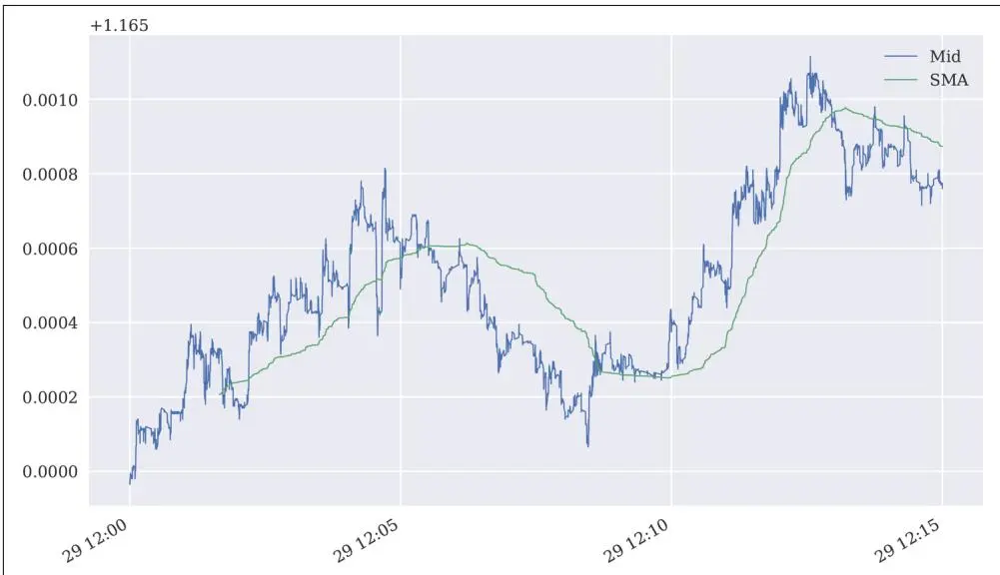
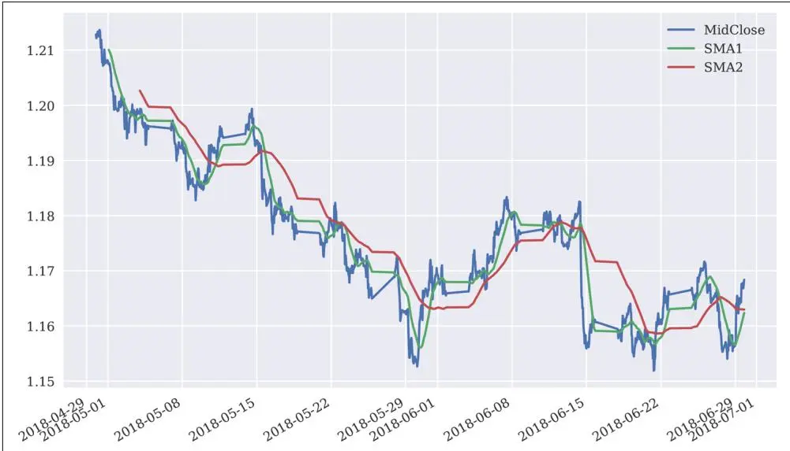
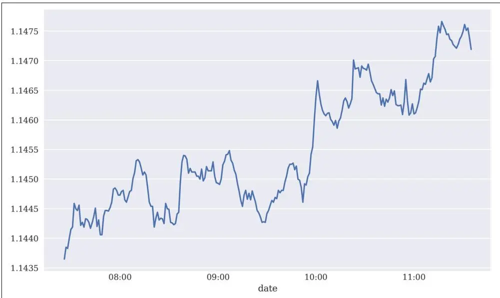

# FXCM 交易平台


金融机构喜欢将自己做的事情称为"交易"。但说实话，这不是交易，这是赌博。
—Graydon Carter


本章介绍FXCM集团（以下简称"FXCM"）的交易平台，包括其RESTful和流式应用程序接口（API），以及Python封装包fxcmpy。FXCM为零售和机构交易者提供了多种金融产品，这些产品既可以通过传统交易应用程序进行交易，也可以通过API以编程方式进行交易。产品重点在于货币对以及主要股票指数和大宗商品等的差价合约（Contract for Difference, CFD）。


## 风险免责声明


以保证金交易外汇/差价合约具有较高的风险水平，可能不适合所有投资者，因为您可能遭受超过本金的损失。杠杆可能对您不利。这些产品面向零售和专业客户。由于当地法律法规的特定限制，德国居民零售客户可能遭受存入资金的全部损失，但无需承担超出存入资金的后续付款义务。请了解并充分理解与市场和交易相关的所有风险。在交易任何产品之前，请仔细考虑您的财务状况和经验水平。任何意见、新闻、研究、分析、价格或其他信息均作为一般市场评论提供，不构成投资建议。市场评论并非按照旨在促进投资研究独立性的法律要求编制，因此不受任何禁止抢先传播的限制。FXCM和作者不对因使用或依赖此类信息而直接或间接产生的任何损失或损害（包括但不限于利润损失）承担责任。


FXCM的交易平台使即使是资金规模较小的个人交易者也能实施和部署算法交易策略。

本章涵盖使用FXCM交易API和fxcmpy Python包实现自动化算法交易策略所需的基本功能。内容结构如下：

## "入门指南" 第469页

本节展示如何设置一切以使用FXCM REST API进行算法交易。

## "获取数据" 第469页

本节展示如何获取和处理金融数据（精确到刻级别）。

## "使用API" 第474页

本节说明使用REST API实现的典型任务，如获取历史数据和流数据、下单以及查询账户信息。

## 入门指南

FXCM API的详细文档请访问 https://fxcm.github.io/rest-apidocs。要安装Python封装包fxcmpy，在终端中执行以下命令：

```batch
pip install fxcmpy
```

fxcmpy包的文档请访问 http://fxcmpy.tpq.io。

要开始使用FXCM交易API和fxcmpy包，拥有一个免费的FXCM模拟账户即可。<sup>1</sup> 下一步是在模拟账户中创建一个唯一的API令牌——例如 YOUR\_FXCM\_API\_TOKEN。然后通过以下方式打开与API的连接：

```python
import fxcmpy
api = fxcmpy.fxcmpy(access_token=YOUR_FXCM_API_TOKEN, log_level='error')
```

或者，也可以使用配置文件（例如 fxcm.cfg）来连接API。该文件的内容应如下所示：

```ini
[FXCM]
log_level = error
log_file = PATH_TO_AND_NAME_OF_LOG_FILE
access_token = YOUR_FXCM_API_TOKEN
```

然后可以通过以下方式进行连接：

```python
import fxcmpy
api = fxcmpy.fxcmpy(config_file='fxcm.cfg')
```

默认情况下，fxcmpy类连接到模拟服务器。但通过使用server参数，可以连接到真实交易服务器（如果存在此类账户）：

```python
api = fxcmpy.fxcmpy(config_file='fxcm.cfg', server='demo')
api = fxcmpy.fxcmpy(config_file='fxcm.cfg', server='real')
```

连接到模拟服务器。


连接到真实交易服务器。

## 获取数据

FXCM以预打包形式提供历史市场价格数据集，例如刻成交数据。这意味着可以从FXCM服务器检索包含2018年第26周EUR/USD汇率刻成交数据的压缩文件，如下一小节所述。通过API获取历史K线数据将在后续小节中说明。


### 获取刻成交数据

对于多种货币对，FXCM提供历史刻成交数据。fxcmpy包使得检索和处理此类刻成交数据变得便捷。首先，导入必要的库：

```txt
In [1]: import time
import numpy as np
import pandas as pd
import datetime as dt
from pylab import mpl, plt
```

```txt
In [2]: plt.style.use('seaborn')
mpl.rcParams['font.family'] = 'serif'
%matplotlib inline
```

其次，查看可用的刻成交数据交易品种（货币对）：

In [3]: from fxcmpy import fxcmpy\_tick\_data\_reader as tdr

```python
In [4]: print(tdr.get_available_symbols())
('AUDCAD', 'AUDCHF', 'AUDJPY', 'AUDNZD', 'CADCHF', 'EURAUD', 'EURCHF',
'EURGBP', 'EURJPY', 'EURUSD', 'GBPCHF', 'GBPJPY', 'GBPNZD', 'GBPUSD',
'GBPCHF', 'GBPJPY', 'GBPNZD', 'NZDCAD', 'NZDCHF', 'NZDJPY', 'NZDUSD',
'USDCAD', 'USDCHF', 'USDJPY')
```

以下代码检索单个交易品种一周的刻成交数据。生成的pandas DataFrame对象包含超过150万行数据：

```csv
In [5]: start = dt.datetime(2018, 6, 25) ①
stop = dt.datetime(2018, 6, 30) ①

In [6]: td = tdr('EURUSD', start, stop) ①

In [7]: td.get_raw_data().info() ②
<class 'pandas.core.frame.DataFrame'>
Index: 1963779 entries, 06/24/201821:00:12.290 to 06/29/201820:59:00.607
Data columns (total 2 columns):
Bid float64
Ask float64
dtypes: float64(2)
memory usage: 44.9+ MB

In [8]: td.get_data().info() ③
<class 'pandas.core.frame.DataFrame'>
DatetimeIndex: 1963779 entries, 2018-06-2421:00:12.290000 to 2018-06-2920:59:00.607000
```


```txt
Data columns (total 2 columns):
Bid float64
Ask float64
dtypes: float64(2)
memory usage: 44.9 MB
```

```csv
In [9]: td.get_data().head()
Out[9]:
2018-06-2421:00:12.2901.16621.166602018-06-2421:00:16.0461.16621.166502018-06-2421:00:22.8461.16621.166582018-06-2421:00:22.9071.16621.166602018-06-2421:00:23.4411.16621.16663
```

① 检索数据文件，解压缩，并将原始数据存储在DataFrame对象中（作为结果对象的属性）。

② 调用td.get\_raw\_data()方法返回包含原始数据的DataFrame对象，即索引值仍为str对象。

③ 调用td.get\_data()方法返回索引已转换为DatetimeIndex的DataFrame对象。

由于刻成交数据存储在DataFrame对象中，可以方便地选取数据子集并执行典型的金融分析任务。图14.1 EUR/USD的历史中间刻成交价与SMA显示了从中价格导出的子集中间价图和简单移动平均线（Simple Moving Average, SMA）：

```python
In [10]: sub = td.get_data(start='2018-06-2912:00:00', end='2018-06-2912:15:00')
```

```txt
In [11]: sub.head()
Out[11]:
2018-06-2912:00:00.0111.164971.164982018-06-2912:00:00.0711.164971.164972018-06-2912:00:00.0791.164971.164982018-06-2912:00:00.0911.164951.164982018-06-2912:00:00.2051.164961.16498
```

```txt
In [12]: sub['Mid'] = sub.mean(axis=1)
```

```javascript
In [13]: sub['SMA'] = sub['Mid'].rolling(1000).mean()
```

```javascript
In [14]: sub[['Mid', 'SMA']].plot(figsize=(10, 6), lw=0.75);
```

① 选取完整数据集的子集。

② 根据买入价和卖出价计算中间价。

③ 计算1000个刻间隔的SMA值。


图14.1 EUR/USD的历史中间刻成交价与SMA

### 获取K线数据

FXCM还提供历史K线数据（除了API之外）——即特定同质时间间隔（"柱"）的数据，包含买入价和卖出价的开盘价、最高价、最低价和收盘价。

首先，查看可用的K线数据交易品种：

In [15]: from fxcmpy import fxcmpy\_candles\_data\_reader as cdr

```txt
In [16]: print(cdr.get_available_symbols())
('AUDCAD', 'AUDCHF', 'AUDJPY', 'AUDNZD', 'CADCHF', 'EURAUD', 'EURCHF',
'EURGBP', 'EURJPY', 'EURUSD', 'GBPCHF', 'GBPJPY', 'GBPNZD', 'GBPUSD',
'GBPCHF', 'GBPJPY', 'GBPNZD', 'NZDCAD', 'NZDCHF', 'NZDJPY', 'NZDUSD',
'USDCAD', 'USDCHF', 'USDJPY')
```

其次，数据检索本身。它与刻成交数据检索类似，唯一的区别是需要指定周期值——即柱长度（例如m1表示一分钟，H1表示一小时，或D1表示一天）：

```python
In [17]: start = dt.datetime(2018, 5, 1)
stop = dt.datetime(2018, 6, 30)

In [18]: period = 'H1'
①

In [19]: candles = cdr('EURUSD', start, stop, period)
```


```javascript
In [20]: data = candles.get_data()
```

```txt
In [21]: data.info()
    <class 'pandas.core.frame.DataFrame'>
    DatetimeIndex: 1080 entries, 2018-04-2921:00:00 to 2018-06-2920:00:00
    Data columns (total 8 columns):
    BidOpen 1080 non-null float64
    BidHigh 1080 non-null float64
    BidLow 1080 non-null float64
    BidClose 1080 non-null float64
    AskOpen 1080 non-null float64
    AskHigh 1080 non-null float64
    AskLow 1080 non-null float64
    AskClose 1080 non-null float64
    dtypes: float64(8)
    memory usage: 75.9 KB
```

```python
In [22]: data[data.columns[:4]].tail() ②
Out[22]:
    2018-06-2916:00:001.167681.168201.167311.167692018-06-2917:00:001.167691.168261.167091.167812018-06-2918:00:001.167811.168161.66681.166842018-06-2919:00:001.166841.167921.166381.167742018-06-2920:00:001.167741.169041.167581.16816
```

```python
In [23]: data[data.columns[4:]].tail() ③
Out[23]:
    AskOpen    AskHigh    AskLow    AskClose
    2018-06-2916:00:001.167691.168201.167321.167712018-06-2917:00:001.167711.168271.167111.167822018-06-2918:00:001.167821.168171.166691.166862018-06-2919:00:001.166861.167941.166401.167752018-06-2920:00:001.167751.169071.167601.16861
```

① 指定周期值。

② 买入价的开盘价、最高价、最低价、收盘价。

③ 卖出价的开盘价、最高价、最低价、收盘价。

为了结束本节，以下代码计算中间收盘价和两个SMA，并绘制结果（参见图14.2）：

```python
In [24]: data['MidClose'] = data[['BidClose', 'AskClose']].mean(axis=1)
```

```txt
In [25]: data['SMA1'] = data['MidClose'].rolling(30).mean() ②
data['SMA2'] = data['MidClose'].rolling(100).mean() ②
```

```javascript
In [26]: data[['MidClose', 'SMA1', 'SMA2']].plot(figsize=(10, 6));
```

① 根据买入收盘价和卖出收盘价计算中间收盘价。

② 计算两个SMA，一个用于较短时间间隔，一个用于较长时间间隔。


图14.2 EUR/USD的历史小时中间收盘价与两个SMA

## 使用API

前面的部分演示了从FXCM服务器检索预打包的历史刻成交数据和K线数据，本节则展示如何通过API检索历史数据。为此，需要一个与FXCM API的连接对象。因此，首先导入fxcmpy包，连接到API（基于唯一的API令牌），并查看可用的交易品种：

```python
In [27]: import fxcmpy

In [28]: fxcmpy.__version__

Out[28]: '1.1.33'

In [29]: api = fxcmpy.fxcmpy(config_file='../fxcm.cfg') ①

In [30]: instruments = api.get_instruments()

In [31]: print(instruments)
['EUR/USD', 'XAU/USD', 'GBP/USD', 'UK100', 'USDOLLAR', 'XAG/USD', 'GER30',
'FRA40', 'USD/CNH', 'EUR/JPY', 'USD/JPY', 'CHN50', 'GBP/JPY', 'AUD/JPY',
'CHF/JPY', 'USD/CHF', 'GBP/CHF', 'AUD/USD', 'EUR/AUD', 'EUR/CHF',
'EUR/CAD', 'EUR/GBP', 'AUD/CAD', 'NZD/USD', 'USD/CAD', 'CAD/JPY',
'GBP/AUD', 'NZD/JPY', 'US30', 'GBP/CAD', 'SOYF', 'GBP/NZD', 'AUD/NZD',
'USD/SEK', 'EUR/SEK', 'EUR/NOK', 'USD/NOK', 'USD/MXN', 'AUD/CHF',
'EUR/NZD', 'USD/ZAR', 'USD/HKD', 'ZAR/JPY', 'BTC/USD', 'USD/TRY',
'EUR/TRY', 'NZD/CHF', 'CAD/CHF', 'NZD/CAD', 'TRY/JPY', 'AUS200',
```

```python
'ESP35', 'HKG33', 'JPN225', 'NAS100', 'SPX500', 'Copper', 'EUSTX50', 'USOil', 'UKOil', 'NGAS', 'Bund']
```

① 连接到API；请根据实际情况调整路径/文件名。

### 获取历史数据

连接后，通过单个方法调用即可获取特定时间间隔的数据。使用get\_candles()方法时，参数period可以是m1、m5、m15、m30、H1、H2、H3、H4、H6、H8、D1、W1或M1之一。以下代码给出几个示例。图14.3显示了EUR/USD交易品种（货币对）的一分钟柱卖出收盘价：

```python
In [32]: candles = api.get_candles('USD/JPY', period='D1', number=10)
```

```csv
In [33]: candles[candles.columns[:4]] ①
Out[33]: bidopen bidclose bidhigh bidlow
date
2018-10-0821:00:00113.760113.219113.937112.8162018-10-0921:00:00113.219112.946113.386112.8632018-10-1021:00:00112.946112.267113.281112.2392018-10-1121:00:00112.267112.155112.528111.8252018-10-1221:00:00112.155112.200112.491111.8732018-10-1421:00:00112.163112.130112.270112.1092018-10-1521:00:00112.130111.758112.230111.6192018-10-1621:00:00112.151112.238112.333111.7272018-10-1721:00:00112.238112.636112.670112.0092018-10-1821:00:00112.636112.168112.725111.942
```

```python
In [34]: candles[candles.columns[4:]] ①
Out[34]:
    date
    2018-10-0821:00:00113.840113.244113.950112.8271848352018-10-0921:00:00113.244112.970113.399112.8753217552018-10-1021:00:00112.970112.287113.294112.2653291742018-10-1121:00:00112.287112.175112.541111.8355682312018-10-1221:00:00112.175112.243112.504111.8853632332018-10-1421:00:00112.219112.181112.294112.1455812018-10-1521:00:00112.181111.781112.243111.6313223042018-10-1621:00:00112.163112.271112.345111.7402534202018-10-1721:00:00112.271112.664112.682112.0225421662018-10-1821:00:00112.664112.237112.738111.955369012

In [35]: start = dt.datetime(2017, 1, 1) ②
end = dt.datetime(2018, 1, 1) ②

In [36]: candles = api.get_candles('EUR/GBP', period='D1', start=start, stop=end) ②

In [37]: candles.info() ②
<class 'pandas.core.frame.DataFrame'>
```

```txt
DatetimeIndex: 309 entries, 2017-01-0322:00:00 to 2018-01-0122:00:00
Data columns (total 9 columns):
bidopen 309 non-null float64
bidclose 309 non-null float64
bidhigh 309 non-null float64
bidlow 309 non-null float64
askopen 309 non-null float64
askclose 309 non-null float64
askhigh 309 non-null float64
asklow 309 non-null float64
tickqty 309 non-null int64
dtypes: float64(8), int64(1)
memory usage: 24.1 KB
```

```python
In [38]: candles = api.get_candles('EUR/USD', period='m1', number=250)
```

```javascript
In [39]: candles['askclose'].plot(figsize=(10, 6))
```

① 检索最近10个交易日收盘价。

② 检索一整年的交易日收盘价。

③ 检索最近可用的分钟柱价格。


图14.3 EUR/USD的历史卖出收盘价（分钟柱）

### 获取流数据

历史数据对于例如回测算法交易策略非常重要，但要部署和自动化算法交易策略，需要持续访问实时或流数据（在交易时间内）。FXCM API允许订阅所有交易品种的实时数据流。fxcmpy封装包支持此功能，允许用户提供自定义函数（即所谓的回调函数）来处理实时数据流。

以下代码展示了一个简单的回调函数——它仅打印出所检索数据集的选定元素——并在订阅所需交易品种（此处为EUR/USD）后，用于处理实时检索的数据：

```python
In [40]: def output(data, dataframe):
    print('%3d | %s | %s | %6.5f, %6.5f'
    % (len(dataframe), data['Symbol'],
    pd.to_datetime(int(data['Updated']), unit='ms'),
    data['Rates'][0], data['Rates'][1]))
```

```txt
In [41]: api.subscribe_market_data('EUR/USD', (output,)) ②
1 | EUR/USD | 2018-10-1911:36:39.735000 | 1.14694, 1.147052 | EUR/USD | 2018-10-1911:36:39.776000 | 1.14694, 1.147063 | EUR/USD | 2018-10-1911:36:40.714000 | 1.14695, 1.147074 | EUR/USD | 2018-10-1911:36:41.646000 | 1.14696, 1.147085 | EUR/USD | 2018-10-1911:36:41.992000 | 1.14696, 1.147096 | EUR/USD | 2018-10-1911:36:45.131000 | 1.14696, 1.147087 | EUR/USD | 2018-10-1911:36:45.247000 | 1.14696, 1.14709
```

```txt
In [42]: api.get_last_price('EUR/USD') ③
Out[42]: Bid 1.14696
Ask 1.14709
High 1.14775
Low 1.14323
Name: 2018-10-1911:36:45.247000, dtype: float64
```

```txt
In [43]: api. unsubscribe_market_data('EUR/USD') ④
8 | EUR/USD | 2018-10-1911:36:48.239000 | 1.14696, 1.14708
```

① 回调函数，打印所检索数据集的特定元素。

② 订阅特定的实时数据流；在没有"取消订阅"事件之前，数据被异步处理。

③ 订阅期间，.get\_last\_price()方法返回最后可用的数据集。

④ 取消订阅实时数据流。

回调函数是一种灵活的方式，可以基于Python函数甚至多个函数来处理实时流数据。它们可以用于简单任务（如打印传入数据）或复杂任务（如基于在线交易算法生成交易信号，参见[第16章](ch16.md)）。

### 下单

FXCM API允许下和管理所有类型的订单，这些订单也可以通过FXCM交易应用程序使用（例如入场订单或追踪止损订单）。<sup>2</sup> 然而，以下代码仅演示基本的市价买入和卖出订单，因为它们通常足以开始算法交易。首先验证没有未平仓头寸，然后开立不同头寸（通过create\_market\_buy\_order()方法）：

```python
In [44]: api.get_open_positions()
Out[44]: Empty DataFrame
Columns: []
Index: []

In [45]: order = api.create_market_buy_order('EUR/USD', 10)
In [46]: sel = ['tradeId', 'amountK', 'currency',
    'grossPL', 'isBuy']
In [47]: api.get_open_positions()[sel]
Out[47]: tradeId amountK currency grossPL isBuy
013260789910 EUR/USD 0.17436 True

In [48]: order = api.create_market_buy_order('EUR/GBP', 5)
In [49]: api.get_open_positions()[sel]
Out[49]: tradeId amountK currency grossPL isBuy
013260789910 EUR/USD 0.17436 True
11326079285 EUR/GBP -1.53367 True
```

① 显示已连接（默认）账户的未平仓头寸。

② 开立100,000单位的EUR/USD货币对头寸。<sup>3</sup>

③ 仅显示所选元素的未平仓头寸。

④ 开立另一个50,000单位的EUR/GBP货币对头寸。

create\_market\_buy\_order()函数用于开立或增加头寸，而create\_market\_sell\_order()函数则用于平仓或减少头寸。还有一些更通用的方法可以实现平仓，如下代码所示：

```python
In [50]: order = api.create_market_sell_order('EUR/USD', 3)
```

```python
In [51]: order = api.create_market_buy_order('EUR/GBP', 5)
```

```txt
In [52]: api.get_open_positions()[sel] ③
Out[52]: tradeId amountK currency grossPL isBuy
013260789910 EUR/USD 0.17436 True
11326079285 EUR/GBP -1.53367 True
21326079303 EUR/USD -1.33369 False
31326079325 EUR/GBP -1.64728 True
```

```javascript
In [53]: api.close_all_for_symbol('EUR/GBP') 4
```

```txt
In [54]: api.get_open_positions()[sel]
Out[54]: tradeId amountK currency grossPL isBuy
013260789910 EUR/USD 0.17436 True
11326079303 EUR/USD -1.33369 False
```

```txt
In [55]: api.close_all() ⑤
```

```txt
In [56]: api.get_open_positions()
Out[56]: Empty DataFrame
Columns: []
Index: []
```

① 减少EUR/USD货币对的头寸。

② 增加EUR/GBP货币对的头寸。

③ 现在EUR/GBP有两个未平仓多头头寸；与EUR/USD头寸不同，它们没有被净额结算。

④ close\_all\_for\_symbol()方法关闭指定交易品种的所有头寸。

⑤ close\_all()方法关闭所有未平仓头寸。

### 账户信息

除了未平仓头寸之外，FXCM API还允许检索更通用的账户信息。例如，可以查找默认账户（如果有多个账户）或查看权益和保证金情况的概览：

```python
In [57]: api.get_default_account()
Out[57]: 1090495
```

```asm
In [58]: api.get_accounts().T ②
Out[58]:
    accountId 1090495
    accountName 01090495
    balance 4915.2
    dayPL -41.97
    equity 4915.2
    grossPL 0
    hedging Y
    mc N
    mcDate
    ratePrecision 0
    t 6
    usableMargin 4915.2
    usableMargin34915.2
    usableMargin3Perc 100
    usableMarginPerc 100
    usdMr 0
    usdMr30
```
① 显示默认的accountId值。

② 显示所有账户的财务状况和部分参数。

## 结论

本章介绍了用于算法交易的FXCM REST API，涵盖以下主题：

• 设置API使用的所有准备工作

• 获取历史刻成交数据

• 获取历史K线数据

• 实时获取流数据

• 下达市价买入和卖出订单

• 查询账户信息

当然，FXCM API和fxcmpy封装包提供了更多功能，但上述内容是开始算法交易所需要的基本构建模块。

## 延伸资源

有关FXCM交易API和Python封装包的更多详细信息，请参阅文档：

• Trading API

• fxcmpy package

如需涵盖Python算法交易的全面在线培训课程，请访问 http://certificate.tpq.io。
