# 交易策略


[T]他们愚蠢到认为可以通过观察过去来预测未来。
—The Economist<sup>1</sup>


本章介绍算法交易策略的向量化回测。术语"算法交易策略"（algorithmic trading strategy）用于描述任何基于算法的金融交易策略，该算法旨在自主地（无需人工干预）对金融工具建立多头、空头或中性头寸。一个简单的算法，如"每五分钟在苹果公司股票的多头和中性头寸之间切换"，就符合这一定义。从更技术的角度来说，本章中，算法交易策略由一段Python代码表示，该代码在新数据可用时，决定买入或卖出某种金融工具，以对其建立多头、空头或中性头寸。

本章不提供算法交易策略的全面概述（关于算法交易策略的详细参考资料，请参见第519页的"延伸资源"）。而是重点介绍几种精选策略的向量化回测（vectorized backtesting）技术方面。在这种方法中，被测试策略所基于的金融数据通常整体上进行操作，对存储金融数据的NumPy ndarray和pandas DataFrame对象应用向量化操作。<sup>2</sup>

本章的另一个重点是应用机器学习和深度学习算法来制定算法交易策略。为此，在历史数据上训练分类算法，以预测未来的方向性市场运动。这通常需要将金融数据从实际值转换为相对较少的分类值。<sup>3</sup> 这使我们能够利用此类算法的模式识别能力。

本章分为以下几个部分：

"简单移动平均线" 第484页 本节重点介绍基于简单移动平均线的算法交易策略以及如何回测此类策略。

"随机游走假说" 第491页 本节介绍随机游走假说。

"线性OLS回归" 第494页 本节探讨使用OLS回归推导算法交易策略。

"聚类" 第499页 在本节中，我们探索使用无监督学习算法推导算法交易策略。

"频率方法" 第501页 本节介绍一种用于算法交易的简单频率方法。

"分类" 第504页 这里我们探讨机器学习中的分类算法在算法交易中的应用。

"深度神经网络" 第512页 本节重点介绍深度神经网络及其在算法交易中的使用方法。

## 简单移动平均线

基于简单移动平均线（Simple Moving Average, SMA）进行交易是一种已有数十年历史的交易方法（例如，参见Brock等人(1992)的论文）。虽然许多交易者在自主交易中使用SMA，但它们也可以用来制定简单的算法交易策略。本节使用SMA来介绍算法交易策略的向量化回测，它建立在[第8章](ch08.md)中的技术分析示例基础之上。

```python
In [1]: import numpy as np
    import pandas as pd
    import datetime as dt
    from pylab import mpl, plt

In [2]: plt.style.use('seaborn')
mpl.rcParams['font.family'] = 'serif'
%matplotlib inline
```

## 数据导入

首先，导入相关库：

其次，读取原始数据并选择单个交易品种——苹果公司股票（AAPL.O）的金融时间序列。本节的分析基于日终数据；日内数据将在后续部分使用：

```python
In [3]: raw = pd.read_csv('../source/tr_eikon_eod_data.csv', index_col=0, parse_dates=True)

In [4]: raw.info()
    <class 'pandas.core.frame.DataFrame'>
    DatetimeIndex: 2216 entries, 2010-01-01 to 2018-06-29
    Data columns (total 12 columns):
    AAPL.O 2138 non-null float64
    MSFT.O 2138 non-null float64
    INTC.O 2138 non-null float64
    AMZN.O 2138 non-null float64
    GS.N 2138 non-null float64
    SPY 2138 non-null float64
    .SPX 2138 non-null float64
    .VIX 2138 non-null float64
    EUR= 2216 non-null float64
    XAU= 2211 non-null float64
    GDX 2138 non-null float64
    GLD 2138 non-null float64
    dtypes: float64(12)
    memory usage: 225.1 KB

In [5]: symbol = 'AAPL.O'

In [6]: data = (
    pd.DataFrame(raw[symbol])
    .dropna()
)
```

## 交易策略

第三，计算两个不同滚动窗口大小的SMA值。图15.1直观展示了这三个时间序列：

```txt
In [7]: SMA1 = 42 ①
SMA2 = 252 ②
```

```txt
In [8]: data['SMA1'] = data[symbol].rolling(SMA1).mean()
    data['SMA2'] = data[symbol].rolling(SMA2).mean()
```

```javascript
In [9]: data.plot(figsize=(10, 6));
```

① 计算较短SMA的值。

② 计算较长SMA的值。

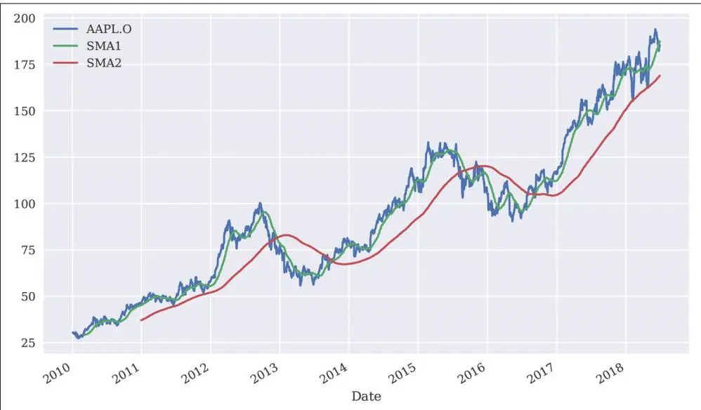
图15.1 苹果股价与两条简单移动平均线

第四，推导头寸。交易规则为：

• 当较短SMA位于较长SMA之上时，做多（= +1）。

• 当较短SMA位于较长SMA之下时，做空（= -1）。<sup>4</sup>

头寸如图15.2所示：

In [10]: data.dropna(inplace=True)

```javascript
In [11]: data['Position'] = np.where(data['SMA1'] > data['SMA2'], 1, -1)
```

In [12]: data.tail()

<table><tr><td>Out[12]:</td><td>AAPL.0</td><td>SMA1</td><td>SMA2</td><td>Position</td></tr><tr><td colspan="5">Date</td></tr><tr><td>2018-06-25</td><td>182.17</td><td>185.606190</td><td>168.265556</td><td>1</td></tr><tr><td>2018-06-26</td><td>184.43</td><td>186.087381</td><td>168.418770</td><td>1</td></tr><tr><td>2018-06-27</td><td>184.16</td><td>186.607381</td><td>168.579206</td><td>1</td></tr><tr><td>2018-06-28</td><td>185.50</td><td>187.089286</td><td>168.736627</td><td>1</td></tr><tr><td>2018-06-29</td><td>185.11</td><td>187.470476</td><td>168.901032</td><td>1</td></tr></table>

In [13]: ax = data.plot(secondary\_y='Position', figsize=(10, 6)) ax.get\_legend().set\_bbox\_to\_anchor((0.25, 0.85));

① np.where(cond, a, b)逐元素评估条件cond，当条件为True时取a，否则取b。

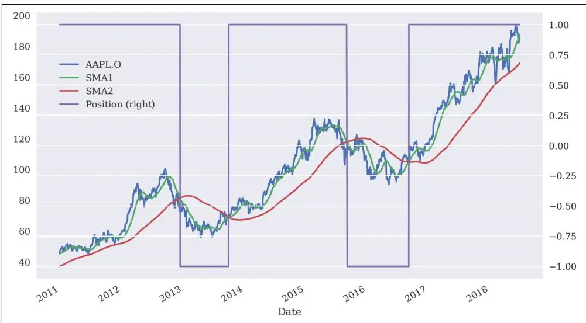
图15.2 苹果股价、两条SMA及由此产生的头寸

以上复制了[第8章](ch08.md)中得出的结果。但[第8章](ch08.md)没有讨论的是，遵循交易规则——即实施算法交易策略——是否优于在整个期间简单地长期持有苹果股票的基准情况。由于该策略只导致两段应该做空苹果股票的时期，因此业绩差异只能来自这两个时期。

## 向量化回测

现在可以按如下方式实施向量化回测。首先，计算对数收益率。然后将以+1或-1表示的头寸乘以其对应的对数收益率。这种简单的计算是可行的，因为多头头寸赚取苹果股票的收益率，而空头头寸赚取苹果股票的负收益率。最后，需要将苹果股票和基于SMA的算法交易策略的对数收益率分别累加，并应用指数函数以获得业绩数值：

```javascript
In [14]: data['Returns'] = np.log(data[symbol] / data[symbol].shift(1))
```

```txt
In [15]: data['Strategy'] = data['Position'].shift(1) * data['Returns']
```

```csv
In [16]: data.round(4).head()
Out[16]: AAPL.0 SMA1 SMA2 Position Returns Strategy
Date
2010-12-3146.080045.281037.12071 NaN NaN
2011-01-0347.081445.349737.186210.02150.02152011-01-0447.327145.412637.252510.00520.00522011-01-0547.714245.466137.322310.00810.00812011-01-0647.675745.522637.39211 -0.0008 -0.0008
```

```javascript
In [17]: data.dropna(inplace=True)
```

```txt
In [18]: np.exp(data[['Returns', 'Strategy']].sum())
Out[18]: Returns 4.017148
Strategy 5.811299
dtype: float64

In [19]: data[['Returns', 'Strategy']].std() * 252 ** 0.5
Out[19]: Returns 0.250571
Strategy 0.250407
dtype: float64
```

① 计算苹果股票的对数收益率（即基准投资）。

② 将头寸值（滞后一天）乘以苹果股票的对数收益率；需要滞后以避免前视偏差。<sup>5</sup>

③ 累加策略和基准投资的对数收益率，计算指数值以获得绝对业绩。

④ 计算策略和基准投资的年化波动率。

数据显示，算法交易策略确实优于被动持有苹果股票的基准投资。由于该策略的类型和特征，年化波动率相同，因此在风险调整基础上也优于基准投资。

为了更全面地了解整体业绩，图15.3显示了苹果股票和算法交易策略随时间的业绩表现：

```txt
In [20]: ax = data[['Returns', 'Strategy']].cumsum().apply(np.exp).plot(figsize=(10, 6))
data['Position'].plot(ax=ax, secondary_y='Position', style='--')
ax.get_legend().set_bbox_to_anchor((0.25, 0.85));
```

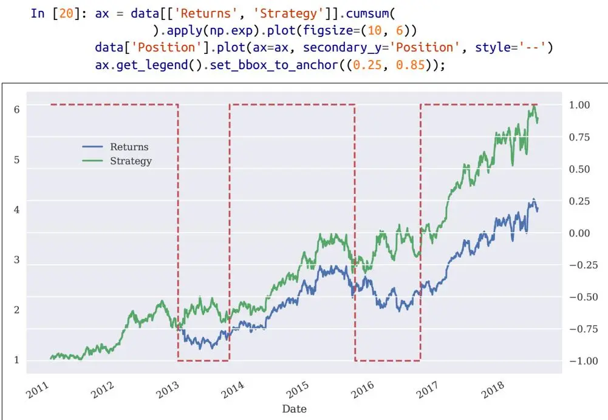
图15.3 苹果股票与SMA交易策略随时间的业绩表现


## 简化假设

本小节介绍的向量化回测方法基于若干简化假设。其中包括未考虑交易成本（固定费用、买卖价差、借券成本等）。对于一个在多年间仅产生少量交易的交易策略来说，这可能情有可原。此外，还假设所有交易均按苹果股票的日终收盘价执行。更真实的回测方法需要将这些和其他（市场微观结构）因素考虑在内。

## 优化

自然会有一个问题：所选参数SMA1=42和SMA2=252是否"正确"。通常，在其他条件相同的情况下，投资者偏好更高的收益而非更低的收益。因此，人们可能会倾向于寻找能在相关时期内最大化收益的参数。为此，可以使用暴力搜索方法，简单地重复不同参数组合下的整个向量化回测过程，记录结果，然后进行排序。以下代码实现了这一过程：

In [21]: from itertools import product

```python
In [22]: sma1 = range(20, 61, 4) ①
    sma2 = range(180, 281, 10) ②

In [23]: results = pd.DataFrame()
    for SMA1, SMA2 in product(sma1, sma2): ③
    data = pd.DataFrame(raw[symbol])
    data.dropna(inplace=True)
    data['Returns'] = np.log(data[symbol] / data[symbol].shift(1))
    data['SMA1'] = data[symbol].rolling(SMA1).mean()
    data['SMA2'] = data[symbol].rolling(SMA2).mean()
    data.dropna(inplace=True)
    data['Position'] = np.where(data['SMA1'] > data['SMA2'], 1, -1)
    data['Strategy'] = data['Position'].shift(1) * data['Returns']
    data.dropna(inplace=True)
    perf = np.exp(data[['Returns', 'Strategy']].sum())
    results = results.append(pd.DataFrame(
    {'SMA1': SMA1, 'SMA2': SMA2,
    'MARKET': perf['Returns'],
    'STRATEGY': perf['Strategy'],
    'OUT': perf['Strategy'] - perf['Returns']},
    index=[0]), ignore_index=True) ④
```

① 指定SMA1的参数值。

② 指定SMA2的参数值。

③ 将SMA1的所有值与SMA2的所有值组合。

④ 将向量化回测结果记录在DataFrame对象中。

以下代码给出了结果概览，并显示了所有回测结果中表现最好的七组参数组合。排名根据算法交易策略相对于基准投资的超额收益进行。基准投资的业绩会变化，因为SMA2参数的选择会影响实施向量化回测的时间间隔和数据集的长度：

```txt
In [24]: results.info()
<class 'pandas.core.frame.DataFrame'>
RangeIndex: 121 entries, 0 to 120
Data columns (total 5 columns):
SMA1121 non-null int64
SMA2121 non-null int64
MARKET 121 non-null float64
STRATEGY 121 non-null float64
```

```txt
OUT 121 non-null float64
dtypes: float64(3), int64(2)
memory usage: 4.8 KB
```

<table><tr><td colspan="6">In [25]: results.sort_values(&#x27;OUT&#x27;, ascending=False).head(7)</td></tr><tr><td>Out[25]:</td><td>SMA1</td><td>SMA2</td><td>MARKET</td><td>STRATEGY</td><td>OUT</td></tr><tr><td>56</td><td>40</td><td>190</td><td>4.650342</td><td>7.175173</td><td>2.524831</td></tr><tr><td>39</td><td>32</td><td>240</td><td>4.045619</td><td>6.558690</td><td>2.513071</td></tr><tr><td>59</td><td>40</td><td>220</td><td>4.220272</td><td>6.544266</td><td>2.323994</td></tr><tr><td>46</td><td>36</td><td>200</td><td>4.074753</td><td>6.389627</td><td>2.314874</td></tr><tr><td>55</td><td>40</td><td>180</td><td>4.574979</td><td>6.857989</td><td>2.283010</td></tr><tr><td>70</td><td>44</td><td>220</td><td>4.220272</td><td>6.469843</td><td>2.249571</td></tr><tr><td>101</td><td>56</td><td>200</td><td>4.074753</td><td>6.319524</td><td>2.244772</td></tr></table>

根据暴力搜索优化结果，SMA1=40和SMA2=190是最优参数，带来了约230个百分点的超额收益。然而，这一结果严重依赖于所使用的数据集，并且容易过拟合。更严谨的方法是在一个数据集（样本内或训练数据集）上进行优化，然后在另一个数据集（样本外或测试数据集）上进行测试。


## 过拟合

通常，算法交易策略中的任何类型的优化、拟合或训练都容易出现过拟合（overfitting）。这意味着所选参数可能在所使用的数据集上表现（异常）良好，但在其他数据集或实际应用中可能表现（异常）糟糕。

## 随机游走假说

上一节介绍了向量化回测作为回测算法交易策略的高效工具。基于单个金融时间序列（即苹果股票的历史日终价格）回测的单一策略，在同一时期内优于简单地长期持有苹果股票的基准投资。

尽管这些结果具有特定的性质，但它们与随机游走假说（Random Walk Hypothesis, RWH）的预测相悖——即此类预测方法不应产生任何超额收益。RWH假设金融市场中的价格遵循随机游走，或者在连续时间中，服从无漂移的算术布朗运动。无漂移的算术布朗运动在未来任何时间点的预期值都等于其当前值。<sup>6</sup> 因此，如果RWH成立，从最小二乘意义上讲，对明日价格的最佳预测就是今日价格。

其后果总结如下：


多年来，经济学家、统计学家和金融学教师一直致力于开发和检验股票价格行为模型。从这项研究中演变出的一个重要模型是随机游走理论。该理论对许多其他描述和预测股票价格行为的方法——这些方法在学术界以外相当流行——提出了严重质疑。例如，我们稍后将看到，如果随机游走理论是对现实的准确描述，那么各种预测股票价格的"技术"或"图表"方法就完全没有价值。
—Eugene F. Fama (1965)


RWH与有效市场假说（Efficient Markets Hypothesis, EMH）是一致的，通俗地说，该假说认为市场价格反映了"所有可用信息"。通常区分不同程度的效率，如弱式、半强式和强式，更具体地定义了"所有可用信息"的含义。从形式上讲，这样的定义可以基于理论上的信息集概念和编程上的数据集概念，如下面的引文所示：


如果基于信息集S进行交易不可能获得经济利润，那么市场相对于信息集S是有效的。
—Michael Jensen (1978)


使用Python，可以针对特定情况测试RWH。使用一个历史市场价格金融时间序列，为其创建多个滞后版本——例如五个。然后使用OLS回归基于之前创建的滞后市场价格来预测市场价格。其基本思想是，昨天和之前四天的市场价格可以用来预测今天的市场价格。

以下Python代码实现了这一想法，为S&P 500股票指数的历史日终收盘水平创建了五个滞后版本：

```python
In [26]: symbol = '.SPX'

In [27]: data = pd.DataFrame(raw[symbol])

In [28]: lags = 5
    cols = []
    for lag in range(1, lags + 1):
    col = 'lag_{}'.format(lag) ①
    data[col] = data[symbol].shift(lag) ②
```

## cols.append(col)

<table><tr><td colspan="7">In [29]: data.head(7)</td></tr><tr><td>Out[29]:</td><td>.SPX</td><td>lag_1</td><td>lag_2</td><td>lag_3</td><td>lag_4</td><td>lag_5</td></tr><tr><td colspan="7">Date</td></tr><tr><td>2010-01-01</td><td>NaN</td><td>NaN</td><td>NaN</td><td>NaN</td><td>NaN</td><td>NaN</td></tr><tr><td>2010-01-04</td><td>1132.99</td><td>NaN</td><td>NaN</td><td>NaN</td><td>NaN</td><td>NaN</td></tr><tr><td>2010-01-05</td><td>1136.52</td><td>1132.99</td><td>NaN</td><td>NaN</td><td>NaN</td><td>NaN</td></tr><tr><td>2010-01-06</td><td>1137.14</td><td>1136.52</td><td>1132.99</td><td>NaN</td><td>NaN</td><td>NaN</td></tr><tr><td>2010-01-07</td><td>1141.69</td><td>1137.14</td><td>1136.52</td><td>1132.99</td><td>NaN</td><td>NaN</td></tr><tr><td>2010-01-08</td><td>1144.98</td><td>1141.69</td><td>1137.14</td><td>1136.52</td><td>1132.99</td><td>NaN</td></tr><tr><td>2010-01-11</td><td>1146.98</td><td>1144.98</td><td>1141.69</td><td>1137.14</td><td>1136.52</td><td>1132.99</td></tr></table>

In [30]: data.dropna(inplace=True)

① 为当前滞后值定义列名。

② 为当前滞后值创建市场价格的滞后版本。

③ 收集列名以备后续引用。

使用NumPy，OLS回归的实现很简单。如最优回归参数所示，lag\_1确实是基于OLS回归预测市场价格的最重要因素，其值接近1。其他四个值则相当接近0。图15.4可视化了最优回归参数值。

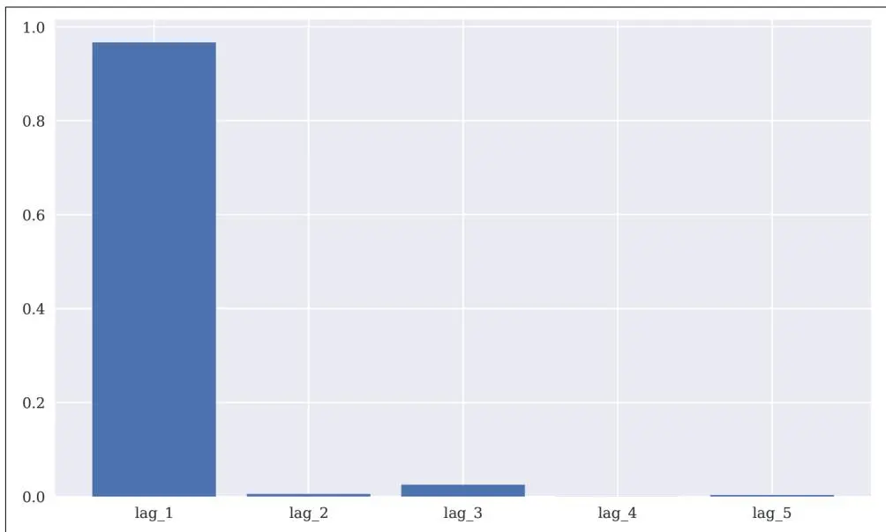
图15.4 OLS回归用于价格预测的最优回归参数

使用最优结果将预测值与S&P 500的原始指数值进行可视化比较时，从图15.5中可以明显看出，lag\_1基本上就是用于得出预测值的因素。从图形上看，图15.5中的预测线就是原始时间序列向右移动一天（经过一些微小调整）。

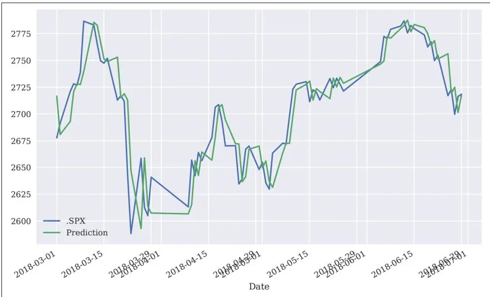
图15.5 S&P 500水平值与OLS回归预测值比较

总的来说，本节简要分析为RWH和EMH提供了一定支持。当然，该分析仅针对单一股票指数，使用了相当特定的参数设置——但可以轻松扩展为涵盖多个资产类别的多个金融工具、不同数量的滞后值等。通常，人们会发现结果在性质上或多或少是相同的。毕竟，RWH和EMH是拥有广泛实证支持的金融理论之一。从这个意义上说，任何算法交易策略都必须通过证明RWH并非普遍适用来证明其价值。这无疑是一个严峻的挑战。

## 线性OLS回归

本节应用线性OLS回归基于历史对数收益率来预测市场运动的方向。为简单起见，仅使用两个特征。第一个特征（lag\_1）表示滞后一天的对数收益率。第二个特征（lag\_2）表示滞后两天的对数收益率。对数收益率——与价格不同——通常是平稳的，这往往是应用统计和机器学习算法的必要条件。

使用滞后对数收益率作为特征的基本思想是，它们可能对预测未来收益率具有信息价值。例如，可以假设在两次下跌之后，上涨的可能性更大（"均值回复"），或者相反，再次下跌的可能性更大（"动量"或"趋势"）。回归技术的应用使得这种非正式推理形式化成为可能。

## 数据

首先，导入并准备数据集。图15.6显示了EUR/USD汇率每日历史对数收益率的频率分布。它们是后续使用的特征和标签的基础：

```python
In [3]: raw = pd.read_csv('../source/tr_eikon_eod_data.csv', index_col=0, parse_dates=True).dropna()

In [4]: raw.columns
Out[4]: Index(['AAPL.0', 'MSFT.0', 'INTC.0', 'AMZN.0', 'GS.N', 'SPY', '.SPX', '.VIX', 'EUR=', 'XAU=', 'GDX', 'GLD'], dtype='object')
```

```txt
In [5]: symbol = 'EUR='
```

```txt
In [6]: data = pd.DataFrame(raw[symbol])
```

```txt
In [7]: data['returns'] = np.log(data / data.shift(1))
```

```javascript
In [8]: data.dropna(inplace=True)
```

```python
In [9]: data['direction'] = np.sign(data['returns']).astype(int)
```

```txt
In [10]: data.head()
Out[10]:
EUR= returns direction
Date
2010-01-051.4368 -0.002988 -12010-01-061.44120.00305812010-01-071.4318 -0.006544 -12010-01-081.44120.00654412010-01-111.45130.0069841
```

```javascript
In [11]: data['returns'].hist(bins=35, figsize=(10, 6));
```

```javascript
In [16]: data.dropna(inplace=True)
```

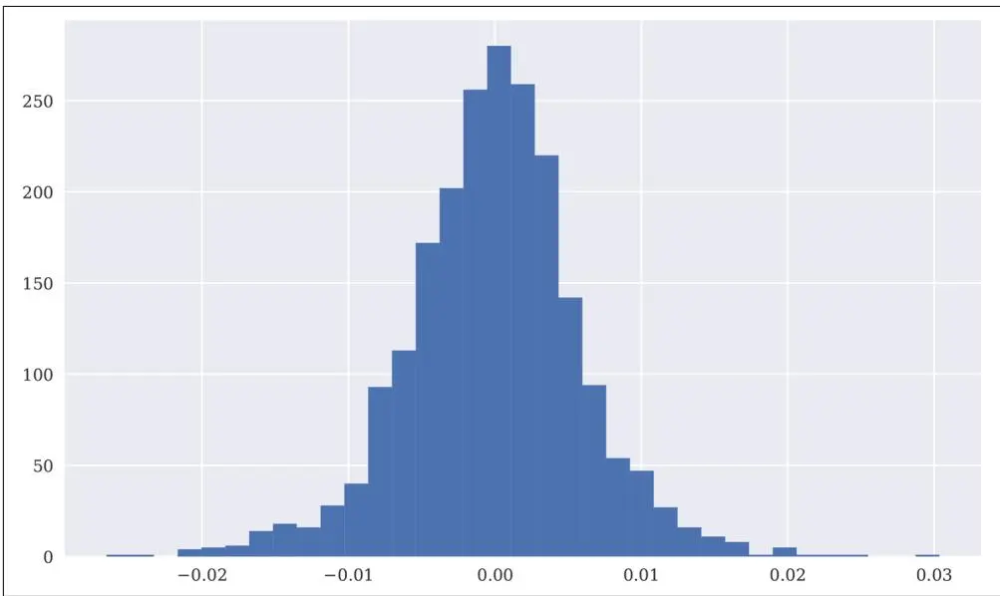
图15.6 EUR/USD汇率对数收益率直方图

其次，通过滞后对数收益率创建特征数据，并将其与收益率数据一起可视化（参见图15.7）：

```python
In [12]: lags = 2

In [13]: def create_lags(data):
    global cols
    cols = []
    for lag in range(1, lags + 1):
    col = 'lag_{}'.format(lag)
    data[col] = data['returns'].shift(lag)
    cols.append(col)
```

```javascript
In [14]: create_lags(data)
```

```csv
In [15]: data.head()
Out[15]: EUR= returns direction lag_1 lag_2
Date
2010-01-051.4368 -0.002988 -1 NaN NaN
2010-01-061.44120.0030581 -0.002988 NaN
2010-01-071.4318 -0.006544 -10.003058 -0.0029882010-01-081.44120.0065441 -0.0065440.0030582010-01-111.45130.00698410.006544 -0.006544
```

```javascript
In [17]: data.plot.scatter(x='lag_1', y='lag_2', c='returns', cmap='coolwarm', figsize=(10, 6), colorbar=True)
```

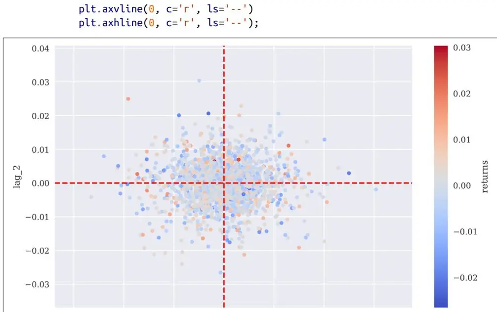
图15.7 基于特征和标签数据的散点图

## 回归

数据集准备完成后，可以应用线性OLS回归来了解任何潜在的（线性）关系，基于特征预测市场运动，并根据预测回测交易策略。有两种基本方法：在回归期间使用对数收益率或仅使用方向数据作为因变量。无论如何，预测值是实数值，因此需要转换为+1或-1，以便仅使用预测的方向：

```python
In [18]: from sklearn.linear_model import LinearRegression ①
In [19]: model = LinearRegression() ①
In [20]: data['pos_ols_1'] = model.fit(data[cols], data['returns']).predict(data[cols]) ②
In [21]: data['pos_ols_2'] = model.fit(data[cols], data['direction']).predict(data[cols]) ③
In [22]: data[['pos_ols_1', 'pos_ols_2']].head()
Out[22]: pos_ols_1 pos_ols_2
Date
2010-01-07 -0.000166 -0.0000862010-01-080.0000170.0404042010-01-11 -0.000244 -0.0117562010-01-12 -0.000139 -0.043398
```

```txt
2010-01-13 -0.0000220.002237
```

```python
In [23]: data[['pos_ols_1', 'pos_ols_2']] = np.where(
    data[['pos_ols_1', 'pos_ols_2']] > 0, 1, -1)
In [24]: data['pos_ols_1'].value_counts()
Out[24]: -118471288
    Name: pos_ols_1, dtype: int64

In [25]: data['pos_ols_2'].value_counts()
Out[25]: 11377
    -1758
    Name: pos_ols_2, dtype: int64

In [26]: (data['pos_ols_1'].diff() != 0).sum()
Out[26]: 555

In [27]: (data['pos_ols_2'].diff() != 0).sum()
Out[27]: 762
```

① 使用来自scikit-learn的线性OLS回归实现。

② 直接对对数收益率实施回归……

③ ……以及对我们主要关心的方向数据实施回归。

④ 将实值预测转换为方向值（+1, -1）。

⑤ 这两种方法通常产生不同的方向预测。

⑥ 然而，两者都导致较长时间内相对较多的交易次数。

有了方向性预测后，可以应用向量化回测来判断所得到的交易策略的业绩。在此阶段，分析基于若干简化假设，如"零交易成本"和将相同数据集同时用于训练和测试。在这些假设下，两种基于回归的策略都优于被动基准投资，而只有基于市场方向训练的策略显示出正的整体业绩（图15.8）：

```python
In [28]: data['strat_ols_1'] = data['pos_ols_1'] * data['returns']
In [29]: data['strat_ols_2'] = data['pos_ols_2'] * data['returns']
In [30]: data[['returns', 'strat_ols_1', 'strat_ols_2']].sum().apply(np.exp)
Out[30]: returns 0.810644
strat_ols_10.942422
strat_ols_21.339286
```

```txt
dtype: float64

In [31]: (data['direction'] == data['pos_ols_1']).value_counts()
Out[31]: False 1093
True 1042
dtype: int64

In [32]: (data['direction'] == data['pos_ols_2']).value_counts()
Out[32]: True 1096
False 1039
dtype: int64

In [33]: data[['returns', 'strat_ols_1', 'strat_ols_2']].cumsum().apply(np.exp).plot(figsize=(10, 6));
```

① 显示策略的正确和错误预测数量。

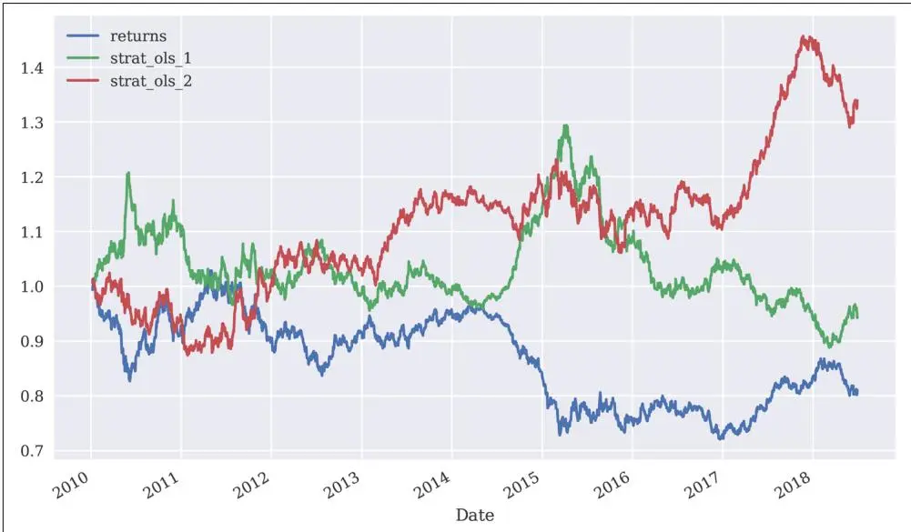
图15.8 EUR/USD与基于回归的策略随时间的业绩表现

## 聚类

本节将k-means聚类（k-means clustering）（如第12章"机器学习"中所述）应用于金融时间序列数据，以自动生成用于制定交易策略的聚类。其思想是，算法识别出两个特征值聚类，分别预测上涨或下跌。

以下代码将k-means算法应用于之前使用的两个特征。图15.9可视化了这两个聚类：

```python
In [34]: from sklearn.cluster import KMeans

In [35]: model = KMeans(n_clusters=2, random_state=0) ①

In [36]: model.fit(data[cols])
Out[36]: KMeans(algorithm='auto', copy_x=True, init='k-means+', max_iter=300, n_clusters=2, n_init=10, n_jobs=None, precompute_distances='auto', random_state=0, tol=0.0001, verbose=0)

In [37]: data['pos_clus'] = model.predict(data[cols])

In [38]: data['pos_clus'] = np.where(data['pos_clus'] == 1, -1, 1) ②

In [39]: data['pos_clus'].values
Out[39]: array([-1, 1, -1, ..., 1, 1, -1])

In [40]: plt.figure(figsize=(10, 6))
plt.scatter(data[cols].iloc[:, 0], data[cols].iloc[:, 1], c=data['pos_clus'], cmap='coolwarm');
```

① 为算法选择两个聚类。

② 根据聚类值选择头寸。

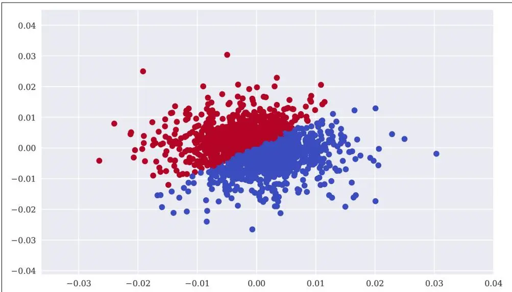
图15.9 k-means算法识别的两个聚类

诚然，在这种背景下，这种方法相当随意——毕竟，算法怎么会知道我们在寻找什么？然而，与被动基准投资相比，由此产生的交易策略在期末显示出轻微的超额收益（参见图15.10）。值得注意的是，没有提供任何指导（监督），命中率（即正确预测数量与所有预测数量的比率）低于50%：

```python
In [41]: data['strat_clus'] = data['pos_clus'] * data['returns']
```

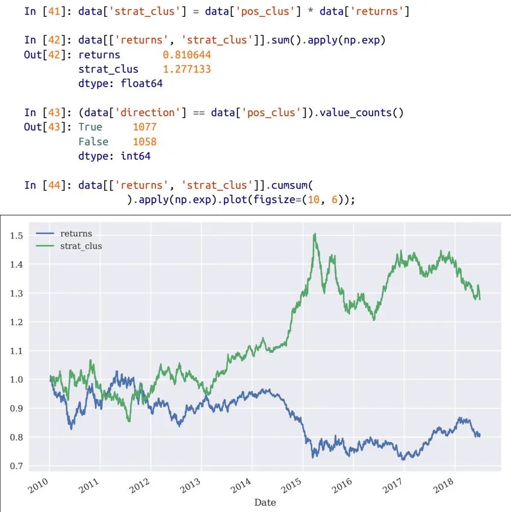
图15.10 EUR/USD与基于k-means的策略随时间的业绩表现

## 频率方法

除了更复杂的算法和技术之外，人们可能还会想到仅实现一种频率方法来预测金融市场的方向性运动。为此，可以将两个实值特征转换为二元特征，并根据这些运动的歷史观测值，在两种二元特征的四种可能组合（(0, 0)、(0, 1)、(1, 0)、(1, 1)）下，评估上涨和下跌的概率。

利用pandas的数据分析能力，这种方法相对容易实现：

```python
In [45]: def create_bins(data, bins=[0]):
    global cols_bin
    cols_bin = []
    for col in cols:
    col_bin = col + '_bin'
    data[col_bin] = np.digitize(data[col], bins=bins)
    cols_bin.append(col_bin)
```

```javascript
In [46]: create_bins(data)
```

```txt
In [47]: data[cols_bin + ['direction']].head() ②
Out[47]: lag_1_bin lag_2_bin direction
Date
2010-01-0710 -12010-01-080112010-01-111012010-01-1211 -12010-01-13011
```

```txt
In [48]: grouped = data.groupby(cols_bin + ['direction'])
grouped.size() 3
```

```txt
Out[48]: lag_1_bin lag_2_bin direction
00 -123904125811 -1262128810 -12720112781 -1278041251
```

```python
In [49]: res = grouped['direction'].size().unstack(fill_value=0)
```

```python
In [50]: def highlight_max(s):
    is_max = s == s.max()
    return ['background-color: yellow' if v else '' for v in is_max]
```

```txt
In [51]: res.style.apply(highlight_max, axis=1) ⑤
Out[51]: <pandas.io.formats.style.Styler at 0x1a194216a0>
```

① 根据bins参数对特征值进行数字化。

② 显示数字化后的特征值和标签值。

③ 显示在特征值组合条件下的可能运动频率。

④ 转换DataFrame对象，使频率位于列中。

⑤ 高亮每个特征值组合的最高频率值。

根据频率数据，三个特征值组合暗示下跌，而一个组合使上涨更有可能。这转化为一个交易策略，其业绩如图15.11所示：

```javascript
In [52]: data['pos_freq'] = np.where(data[cols_bin].sum(axis=1) == 2, -1, 1)
In [53]: (data['direction'] == data['pos_freq']).value_counts()
Out[53]: True    1102
    False    1033
    dtype: int64

In [54]: data['strat_freq'] = data['pos_freq'] * data['returns']

In [55]: data[['returns', 'strat_freq']].sum().apply(np.exp)
Out[55]: returns    0.810644
    strat_freq    0.989513
    dtype: float64

In [56]: data[['returns', 'strat_freq']].cumsum( ).apply(np.exp).plot(figsize=(10, 6));
```

① 将频率分析结果转化为交易策略。

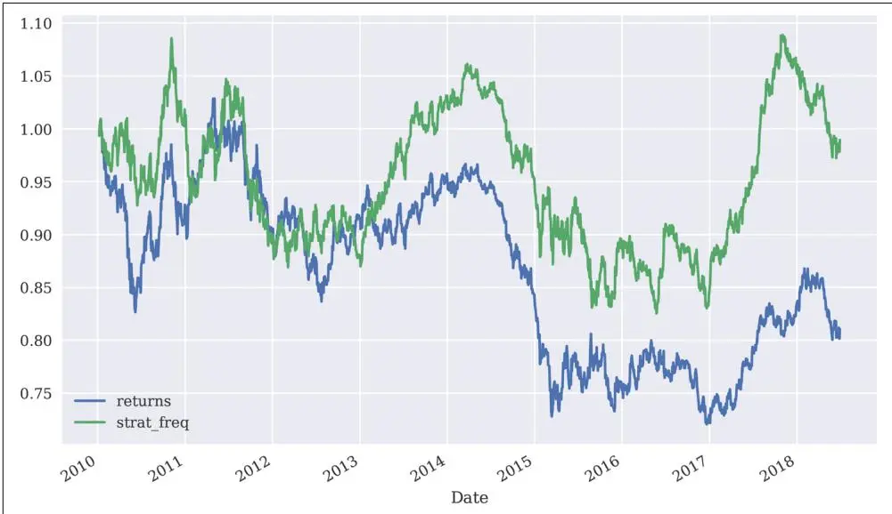
图15.11 EUR/USD与基于频率的交易策略随时间的业绩表现

## 分类

本节将机器学习中的分类算法（如第12章"机器学习"中所述）应用于预测金融市场价格运动方向的问题。基于此背景和前面几节的示例，逻辑回归、高斯朴素贝叶斯和支持向量机方法的应用就像将它们应用于较小的样本数据集一样直接。

## 两个二元特征

首先，基于二元特征值拟合模型并推导出相应的头寸值：

```python
In [57]: from sklearn import linear_model
    from sklearn.naive_bayes import GaussianNB
    from sklearn.svm import SVC

In [58]: C = 1

In [59]: models = {'log_reg': linear_model.LogisticRegression(C=C),
    'gauss_nb': GaussianNB(),
    'svm': SVC(C=C)}
```

```python
In [60]: def fit_models(data): 1
    mfit = {model: models[model].fit(data[cols_bin], data['direction'])
    for model in models.keys()}
```

```python
In [61]: fit_models(data)
```

```python
In [62]: def derive_positions(data): ②
    for model in models.keys():
    data['pos_' + model] = models[model].predict(data[cols_bin])
```

```python
In [63]: derive_positions(data)
```

① 拟合所有模型的函数。

② 从拟合模型中推导所有头寸值的函数。

其次，对所得交易策略进行向量化回测。图15.12可视化了随时间的业绩表现：

```python
In [64]: def evaluate_strats(data): ①
    global sel
    sel = []
    for model in models.keys():
    col = 'strat_' + model
    data[col] = data['pos_' + model] * data['returns']
    sel.append(col)
    sel.insert(0, 'returns')

In [65]: evaluate_strats(data)

In [66]: sel.insert(1, 'strat_freq')

In [67]: data[sel].sum().apply(np.exp) ②
Out[67]: returns 0.810644
    strat_freq 0.989513
    strat_log_reg 1.243322
    strat_gauss_nb 1.243322
    strat_svm 0.989513
    dtype: float64
```

```javascript
In [68]: data[sel].cumsum().apply(np.exp).plot(figsize=(10, 6));
```

① 评估所有结果交易策略的函数。

② 某些策略可能显示完全相同的业绩。

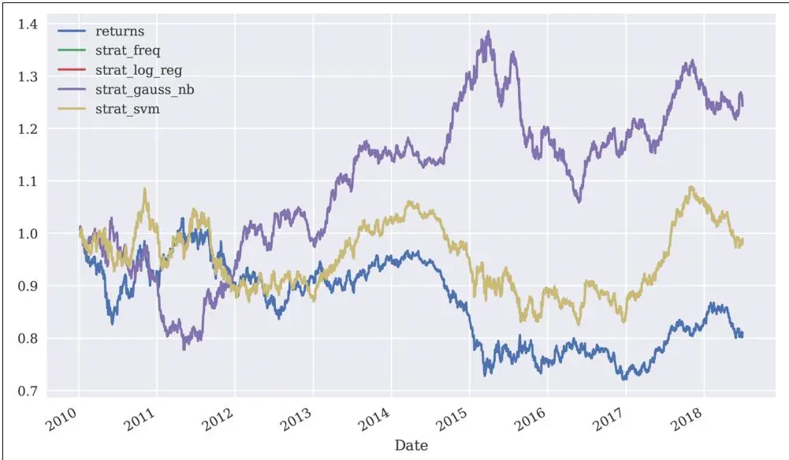
图15.12 EUR/USD与基于分类的交易策略（两个二元滞后）随时间的业绩表现

## 五个二元特征

为了提高策略的业绩，以下代码使用五个二元滞后而不是两个。特别是，基于SVM的策略的业绩显著提高（参见图15.13）。另一方面，基于LR和GNB的策略的业绩则有所下降：

```python
In [69]: data = pd.DataFrame(raw[symbol])

In [70]: data['returns'] = np.log(data / data.shift(1))

In [71]: data['direction'] = np.sign(data['returns'])

In [72]: lags = 5
    create_lags(data)
    data.dropna(inplace=True)

In [73]: create_bins(data)
    cols_bin

Out[73]: ['lag_1_bin', 'lag_2_bin', 'lag_3_bin', 'lag_4_bin', 'lag_5_bin']

In [74]: data[cols_bin].head()

Out[74]: lag_1_bin lag_2_bin lag_3_bin lag_4_bin lag_5_bin
Date
2010-01-12110102010-01-13011012010-01-1410110
```

<table><tr><td>2010-01-15</td><td>0</td><td>1</td><td>0</td><td>1</td><td>1</td></tr><tr><td>2010-01-19</td><td>0</td><td>0</td><td>1</td><td>0</td><td>1</td></tr></table>

In [75]: data.dropna(inplace=True)

In [76]: fit\_models(data)

In [77]: derive\_positions(data)

In [78]: evaluate\_strats(data)

```yaml
In [79]: data[sel].sum().apply(np.exp)
Out[79]: returns 0.805002
strat_log_reg 0.971623
strat_gauss_nb 0.986420
strat_svm 1.452406
dtype: float64
```

In [80]: data[sel].cumsum().apply(np.exp).plot(figsize=(10, 6));

① 现在使用对数收益率序列的五个滞后。

② 将实值特征数据转换为二元数据。

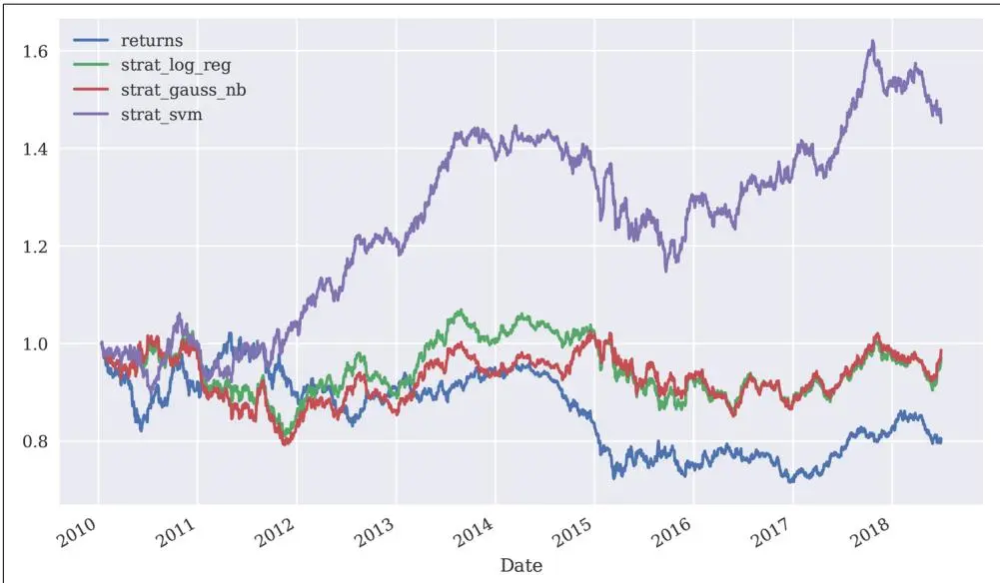
图15.13 EUR/USD与基于分类的交易策略（五个二元滞后）随时间的业绩表现

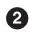

## 五个数字化特征

最后，以下代码使用历史对数收益率的一阶矩和二阶矩来数字化特征数据，允许更多可能的特征值组合。这提高了所用所有分类算法的业绩，但SVM的改进最为显著（参见图15.14）：

```javascript
In [81]: mu = data['returns'].mean() ①
v = data['returns'].std() ②
```

```txt
In [82]: bins = [mu - v, mu, mu + v] ③
bins ③
Out[82]: [-0.006033537040418665, -0.00010174015279231306, 0.005830056734834039]
```

In [83]: create\_bins(data, bins)

```txt
In [84]: data[cols_bin].head()
Out[84]: lag_1_bin lag_2_bin lag_3_bin lag_4_bin lag_5_bin
Date
2010-01-12330212010-01-13133022010-01-14213302010-01-15121332010-01-1901213
```

```txt
In [85]: fit_models(data)
```

```python
In [86]: derive_positions(data)
```

```javascript
In [87]: evaluate_strats(data)
```

```txt
In [88]: data[sel].sum().apply(np.exp)
Out[88]: returns 0.805002
strat_log_reg 1.431120
strat_gauss_nb 1.815304
strat_svm 5.653433
dtype: float64
```

In [89]: data[sel].cumsum().apply(np.exp).plot(figsize=(10, 6));

① 平均对数收益率和……

② ……标准差用于……

③ ……数字化特征数据。

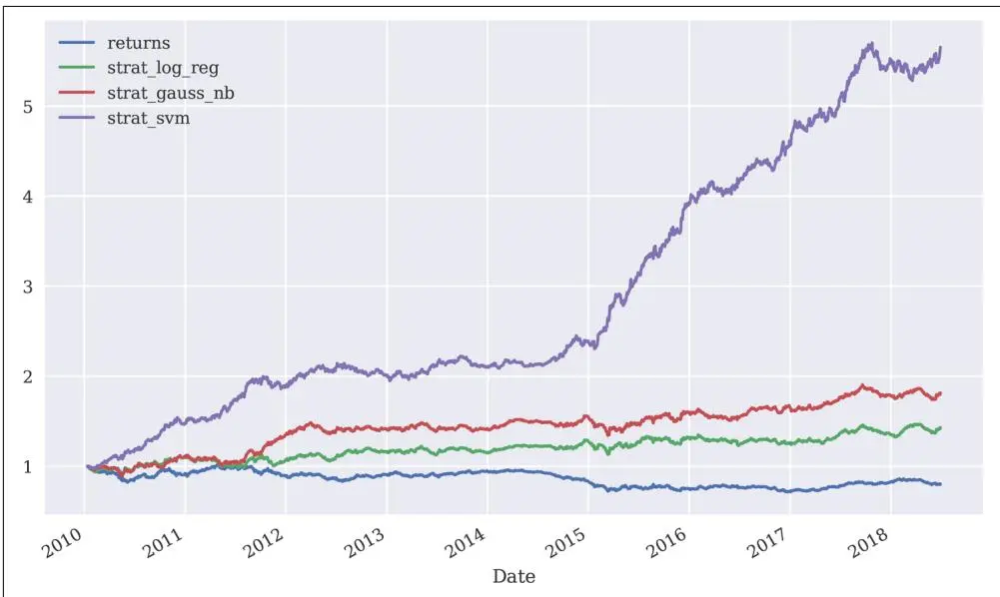
图15.14 EUR/USD与基于分类的交易策略（五个数字化滞后）随时间的业绩表现


## 特征类型

本章专门使用滞后收益率数据作为特征数据，且主要以二值化或数字化形式呈现。这主要是为了方便，因为此类特征数据可以直接从金融时间序列本身推导得出。然而，在实际应用中，特征数据可以来自多种不同的数据源，可能包括其他金融时间序列及其衍生统计量、宏观经济数据、公司财务指标或新闻文章。关于此主题的深入讨论，请参考López de Prado (2018)。此外，还有一些Python包可用于自动化时间序列特征提取，例如tsfresh。

## 顺序训练-测试分割

为了更好判断分类算法的性能，以下代码实现了顺序训练-测试分割。其思想是模拟以下情景：只有截至某个时间点的数据可用于训练机器学习算法。在实盘交易中，算法将面对从未见过的数据。这正是算法必须证明其价值的地方。在此特定案例中，所有分类算法——在之前的简化假设下——都优于被动基准投资，但只有GNB和LR算法实现了正的绝对业绩（图15.15）：

```txt
In [90]: split = int(len(data) * 0.5)
```

```txt
In [91]: train = data.iloc[:split].copy()
```

```txt
In [92]: fit_models(train) 1
```

```txt
In [93]: test = data.iloc[split:].copy()
```

```txt
In [94]: derive_positions(test) ②
```

```txt
In [95]: evaluate_strats(test) ②
```

```yaml
In [96]: test[sel].sum().apply(np.exp)
Out[96]: returns 0.850291
strat_log_reg 0.962989
strat_gauss_nb 0.941172
strat_svm 1.048966
dtype: float64
```

In [97]: test[sel].cumsum().apply(np.exp).plot(figsize=(10, 6));

① 在训练数据上训练所有分类算法。

② 在测试数据上测试所有分类算法。

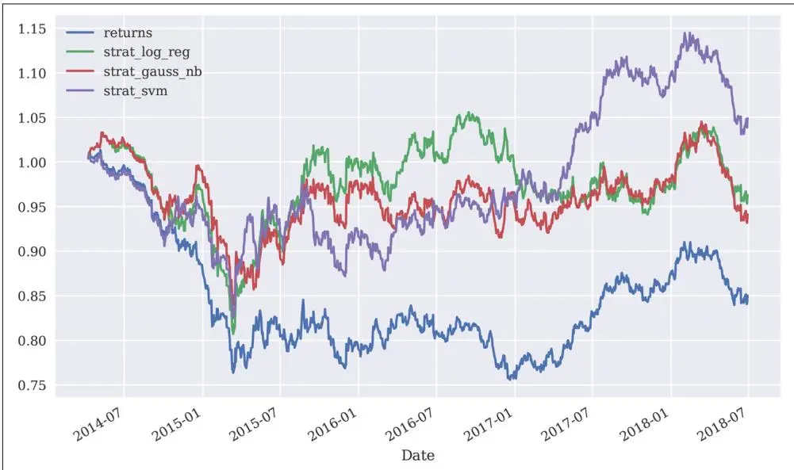
图15.15 EUR/USD与基于分类的交易策略（顺序训练-测试分割）

## 随机训练-测试分割

分类算法在二值化或数字化特征数据上进行训练和测试。其思想是，特征值模式能够以高于50%的命中率预测未来的市场运动。这里隐含的假设是，模式的预测能力随时间持续存在。从这个意义上说，算法在数据的哪一部分进行训练、在哪一部分进行测试，应该不会（太）有影响——这意味着我们可以打破数据的时间顺序进行训练和测试。

一种典型的方法是使用随机训练-测试分割来测试分类算法在样本外的性能——再次尝试模拟现实情况，即算法在交易中持续面对新数据。使用的方法与第12章"训练-测试分割：支持向量机"中应用于样本数据的方法相同。基于此方法，SVM算法再次显示出最好的样本外性能（参见图15.16）：

```txt
In [98]: from sklearn.model_selection import train_test_split
In [99]: train, test = train_test_split(data, test_size=0.5,
    shuffle=True, random_state=100)
In [100]: train = train.copy().sort_index()
In [101]: train[cols_bin].head()
Out[101]: lag_1_bin lag_2_bin lag_3_bin lag_4_bin lag_5_bin
Date
2010-01-12330212010-01-13133022010-01-14213302010-01-15121332010-01-2010121
In [102]: test = test.copy().sort_index()
In [103]: fit_models(train)
In [104]: derive_positions(test)
In [105]: evaluate_strats(test)
In [106]: test[sel].sum().apply(np.exp)
Out[106]: returns 0.878078
strat_log_reg 0.735893
strat_gauss_nb 0.765009
strat_svm 0.695428
dtype: float64
In [107]: test[sel].cumsum().apply(np.exp).plot(figsize=(10, 6));
```

① 复制训练和测试数据集并按时间顺序排序。

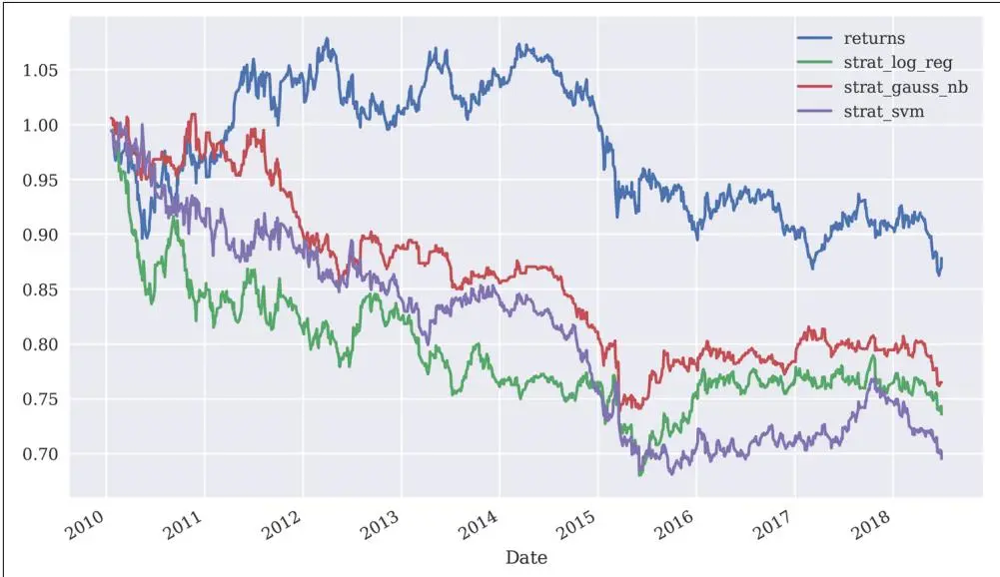
图15.16 EUR/USD与基于分类的交易策略（随机训练-测试分割）

## 深度神经网络

深度神经网络（Deep Neural Network, DNN）试图模拟人脑的功能。它们通常由一个输入层（特征）、一个输出层（标签）和若干隐藏层组成。隐藏层的存在使得神经网络具有深度，使其能够学习更复杂的关系，并在多种问题类型上表现得更好。当应用DNN时，通常称之为深度学习（deep learning）而非机器学习。有关此领域的介绍，请参考Géron (2017)或Gibson和Patterson (2017)。

## 使用scikit-learn的DNN

本节应用来自scikit-learn的MLPClassifier算法（如第12章"深度神经网络"中所述）。首先，在整个数据集上使用数字化特征进行训练和测试。该算法在样本内实现了卓越的性能（参见图15.17），这说明了DNN对这类问题的强大能力。同时也暗示了严重的过拟合，因为该性能确实显得不切实际地好：

In [108]: from sklearn.neural\_network import MLPClassifier

In [109]: model = MLPClassifier(solver='lbfgs', alpha=1e-5,

```python
hidden_layer_sizes=2 * [250],
random_state=1)

In [110]: %time model.fit(data[cols_bin], data['direction'])
CPU times: user 16.1 s, sys: 156 ms, total: 16.2 s
Wall time: 9.85 s

Out[110]: MLPClassifier(activation='relu', alpha=1e-05, batch_size='auto', beta_1=0.9,
beta_2=0.999, early_stopping=False, epsilon=1e-08,
hidden_layer_sizes=[250, 250], learning_rate='constant',
learning_rate_init=0.001, max_iter=200, momentum=0.9,
n_iter_no_change=10, nesterovs_momentum=True, power_t=0.5,
random_state=1, shuffle=True, solver='lbfgs', tol=0.0001,
validation_fraction=0.1, verbose=False, warm_start=False)

In [111]: data['pos_dnn_sk'] = model.predict(data[cols_bin])

In [112]: data['strat_dnn_sk'] = data['pos_dnn_sk'] * data['returns']

In [113]: data[['returns', 'strat_dnn_sk']].sum().apply(np.exp)
Out[113]: returns 0.805002
strat_dnn_sk 35.156677
dtype: float64
```

```javascript
In [114]: data[['returns', 'strat_dnn_sk']].cumsum().apply(np.exp).plot(figsize=(10, 6));
```

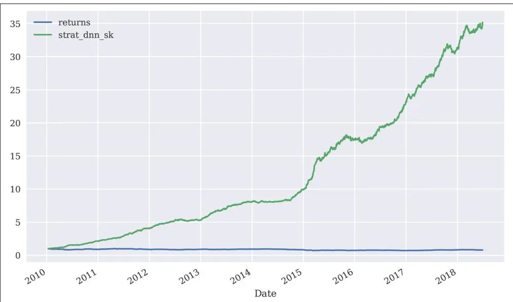
图15.17 EUR/USD与基于DNN的交易策略（scikit-learn，样本内）

为了避免DNN模型的过拟合，接下来应用随机训练-测试分割。该算法再次优于被动基准投资，并实现了正的绝对业绩（图15.18）。然而，现在的结果看起来更真实：

```python
In [115]: train, test = train_test_split(data, test_size=0.5, random_state=100)

In [116]: train = train.copy().sort_index()

In [117]: test = test.copy().sort_index()

In [118]: model = MLPClassifier(solver='lbfgs', alpha=1e-5, max_iter=500, hidden_layer_sizes=3 * [500], random_state=1)

In [119]: %time model.fit(train[cols_bin], train['direction'])
CPU times: user 2min 26s, sys: 1.02 s, total: 2min 27s
Wall time: 1min 31s

Out[119]: MLPClassifier(activation='relu', alpha=1e-05, batch_size='auto', beta_1=0.9,
beta_2=0.999, early_stopping=False, epsilon=1e-08,
hidden_layer_sizes=[500, 500, 500], learning_rate='constant',
learning_rate_init=0.001, max_iter=500, momentum=0.9,
n_iter_no_change=10, nesterovs_momentum=True, power_t=0.5,
random_state=1, shuffle=True, solver='lbfgs', tol=0.0001,
validation_fraction=0.1, verbose=False, warm_start=False)

In [120]: test['pos_dnn_sk'] = model.predict(test[cols_bin])

In [121]: test['strat_dnn_sk'] = test['pos_dnn_sk'] * test['returns']

In [122]: test[['returns', 'strat_dnn_sk']].sum().apply(np.exp)
Out[122]: returns 0.878078
strat_dnn_sk 1.242042
dtype: float64

In [123]: test[['returns', 'strat_dnn_sk']].cumsum( ).apply(np.exp).plot(figsize=(10, 6));

① 增加隐藏层和隐藏单元的数量。
```

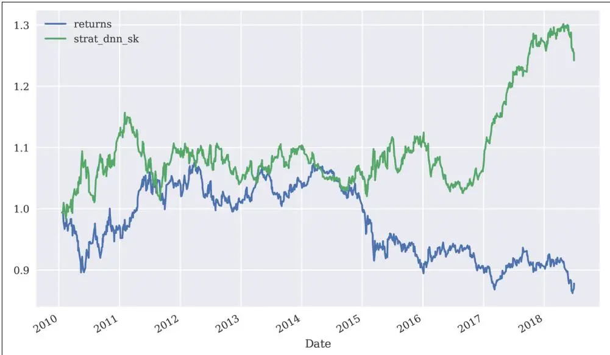
图15.18 EUR/USD与基于DNN的交易策略（scikit-learn，随机训练-测试分割）

## 使用TensorFlow的DNN

TensorFlow已成为流行的深度学习包。它由Google Inc.开发和维护，并在Google内部广泛应用于各种机器学习问题。Zedah和Ramsundar (2018)深入介绍了TensorFlow在深度学习中的应用。

与scikit-learn类似，在之前第12章"深度神经网络"的基础上，应用TensorFlow的DNNClassifier算法来推导算法交易策略非常简单。训练和测试数据与之前相同。首先，训练模型。在样本内，该算法优于被动基准投资，并显示出可观的正绝对收益（参见图15.19），再次暗示了过拟合：

```python
In [124]: import tensorflow as tf
    tf.logging.set_verbosity(tf.logging.ERROR)

In [125]: fc = [tf.contrib.layers.real_valued_column('lags', dimension=lags)]

In [126]: model = tf.contrib.learn.DNNClassifier(hidden_units=3 * [500], n_classes=len(bins) + 1, feature_columns=fc)

In [127]: def input_fn():
    fc = {'lags': tf.constant(data[cols_bin].values)}
    la = tf.constant(data['direction'].apply(lambda x: 0 if x < 0 else 1).values,
```

```python
shape=[data['direction'].size, 1])
return fc, la

In [128]: %time model.fit(input_fn=input_fn, steps=250) ①
CPU times: user 2min 7s, sys: 8.85 s, total: 2min 16s
Wall time: 49 s

Out[128]: DNNClassifier(params={'head':
    <tensorflow.contrib.learn.python.learn.estimators.head._MultiClassHead
    object at 0x1a19acf898>, 'hidden_units': [500, 500, 500],
    'feature_columns': (_RealValuedColumn(column_name='lags', dimension=5,
    default_value=None, dtype=tf.float32, normalizer=None),), 'optimizer':
    None, 'activation_fn': <function relu at 0x1161441e0>, 'dropout':
    None, 'gradient_clip_norm': None, 'embedding_lr_multipliers': None,
    'input_layer_min_slice_size': None})

In [129]: model.evaluate(input_fn=input_fn, steps=1) ②
Out[129]: {'loss': 0.6879357, 'accuracy': 0.5379925, 'global_step': 250}

In [130]: pred = np.array(list(model.predict(input_fn=input_fn))) ②
pred[:10] ②
Out[130]: array([0, 0, 0, 0, 0, 1, 0, 1, 1, 0])

In [131]: data['pos_dnn_tf'] = np.where(pred > 0, 1, -1) ③

In [132]: data['strat_dnn_tf'] = data['pos_dnn_tf'] * data['returns']

In [133]: data[['returns', 'strat_dnn_tf']].sum().apply(np.exp)
Out[133]: returns    0.805002
    strat_dnn_tf    2.437222
    dtype: float64

In [134]: data[['returns', 'strat_dnn_tf']].cumsum(
    ).apply(np.exp).plot(figsize=(10, 6));
```

① 训练所需的时间可能相当可观。

② 二元预测值（0, 1）……

③ ……需要转换为市场头寸（-1, +1）。

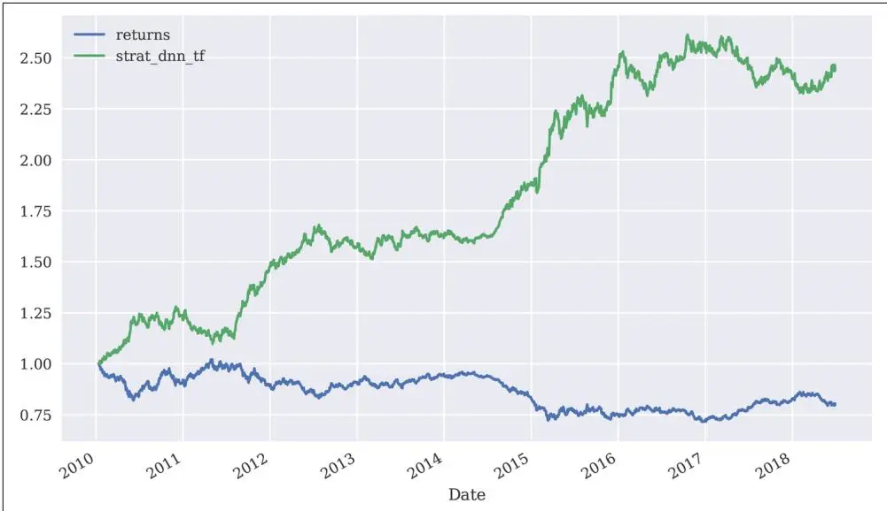
图15.19 EUR/USD与基于DNN的交易策略（TensorFlow，样本内）

以下代码再次实现随机训练-测试分割，以获得对基于DNN的算法交易策略性能的更现实评估。如预期那样，样本外性能较差（参见图15.20）。此外，在特定参数化下，TensorFlow DNNClassifier的性能比scikit-learn MLPClassifier算法低几个百分点：

```python
In [135]: model = tf.contrib.learn.DNNClassifier(hidden_units=3 * [500], n_classes=len(bins) + 1, feature_columns=fc)

In [136]: data = train

In [137]: %time model.fit(input_fn=input_fn, steps=2500)
CPU times: user 11min 7s, sys: 1min 7s, total: 12min 15s
Wall time: 4min 27s

Out[137]: DNNClassifier(params={'head':
    <tensorflow.contrib.learn.python.learn.estimators.head._MultiClassHead object at 0x116828cc0>, 'hidden_units': [500, 500, 500],
    'feature_columns': (_RealValuedColumn(column_name='lags', dimension=5, default_value=None, dtype=tf.float32, normalizer=None),), 'optimizer': None, 'activation_fn': <function relu at 0x1161441e0>, 'dropout': None, 'gradient_clip_norm': None, 'embedding_lr_multipliers': None, 'input_layer_min_slice_size': None})
```

```txt
In [138]: data = test
```

```python
In [139]: model.evaluate(input_fn=input_fn, steps=1)
Out[139]: {'loss': 0.82882184, 'accuracy': 0.48968107, 'global_step': 2500}
In [140]: pred = np.array(list(model.predict(input_fn=input_fn)))
In [141]: test['pos_dnn_tf'] = np.where(pred > 0, 1, -1)
In [142]: test['strat_dnn_tf'] = test['pos_dnn_tf'] * test['returns']
In [143]: test[['returns', 'strat_dnn_sk', 'strat_dnn_tf']].sum().apply(np.exp)
Out[143]: returns    0.878078
    strat_dnn_sk    1.242042
    strat_dnn_tf    1.063968
    dtype: float64
```

```javascript
In [144]: test[['returns', 'strat_dnn_sk', 'strat_dnn_tf']].cumsum().apply(np.exp).plot(figsize=(10, 6));
```

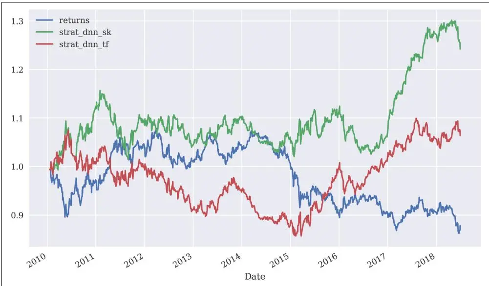
图15.20 EUR/USD与基于DNN的交易策略（TensorFlow，随机训练-测试分割）


## 业绩结果

截至目前所示的不同算法交易策略在向量化回测中的所有业绩结果仅用于说明目的。除了无交易成本的简化假设外，结果还依赖于许多其他（大多任意选择的）参数。它们还依赖于整个过程中使用的相对较小的EUR/USD汇率日终价格数据集。重点在于说明不同方法和机器学习算法在金融数据上的应用，而非推导出一个可在实践中部署的稳健算法交易策略。下一章将讨论其中的一些问题。

## 结论

本章介绍了算法交易策略，并基于向量化回测评估其性能。首先从一个基于两条简单移动平均线相当简单的算法交易策略开始，这种策略在实践中已为人所知并使用了数十年。该策略用于说明向量化回测，充分利用了NumPy和pandas的数据分析向量化能力。

通过OLS回归，本章还基于真实金融时间序列说明了随机游走假说。这是衡量任何算法交易策略是否有价值的基准。

本章的核心是将第12章中介绍的机器学习算法应用于实践。使用了多种算法（其中大多数属于分类类型），并基本遵循相同的"节奏"。在特征方面，使用了滞后对数收益率数据的多种变体——尽管这一限制显然不是必须的，主要是出于方便和简单的考虑。此外，分析基于若干简化假设，因为重点主要在于将机器学习算法应用于金融时间序列数据以预测金融市场运动方向的技术方面。

## 延伸资源

本章引用的论文有：

• Brock, William, Josef Lakonishok, and Blake LeBaron (1992). "Simple Technical Trading Rules and the Stochastic Properties of Stock Returns." Journal of Finance, Vol. 47, No. 5, pp. 1731–1764.

• Fama, Eugene (1965). "Random Walks in Stock Market Prices." Selected Papers, No. 16, Graduate School of Business, University of Chicago.

• Jensen, Michael (1978). "Some Anomalous Evidence Regarding Market Efficiency." Journal of Financial Economics, Vol. 6, No. 2/3, pp. 95–101.

涵盖本章相关主题的金融类书籍有：

• Baxter, Martin, and Andrew Rennie (1996). Financial Calculus. Cambridge, England: Cambridge University Press.

• Chan, Ernest (2009). Quantitative Trading. Hoboken, NJ: John Wiley & Sons.

• Chan, Ernest (2013). Algorithmic Trading. Hoboken, NJ: John Wiley & Sons.

• Chan, Ernest (2017). Machine Trading. Hoboken, NJ: John Wiley & Sons.

• López de Prado, Marcos (2018). Advances in Financial Machine Learning. Hoboken, NJ: John Wiley & Sons.

涵盖本章相关主题的技术类书籍有：

• Albon, Chris (2018). Machine Learning with Python Cookbook. Sebastopol, CA: O'Reilly.

• Géron, Aurélien (2017). Hands-On Machine Learning with Scikit-Learn and Tensorflow. Sebastopol, CA: O'Reilly.

• Gibson, Adam, and Josh Patterson (2017). Deep Learning. Sebastopol, CA: O'Reilly.

• VanderPlas, Jake (2016). Python Data Science Handbook. Sebastopol, CA: O'Reilly.

• Zadeh, Reza Bosagh, and Bharath Ramsundar (2018). TensorFlow for Deep Learning. Sebastopol, CA: O'Reilly.

如需涵盖Python算法交易的全面在线培训课程，请访问 <http://certificate.tpq.io>。
