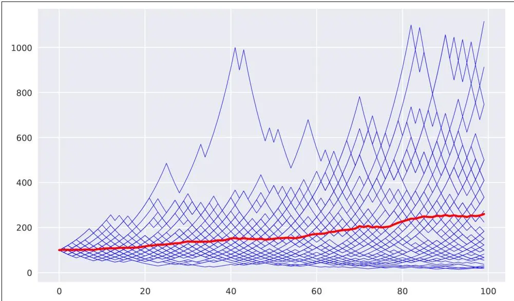
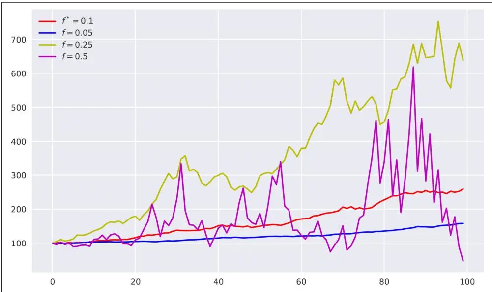
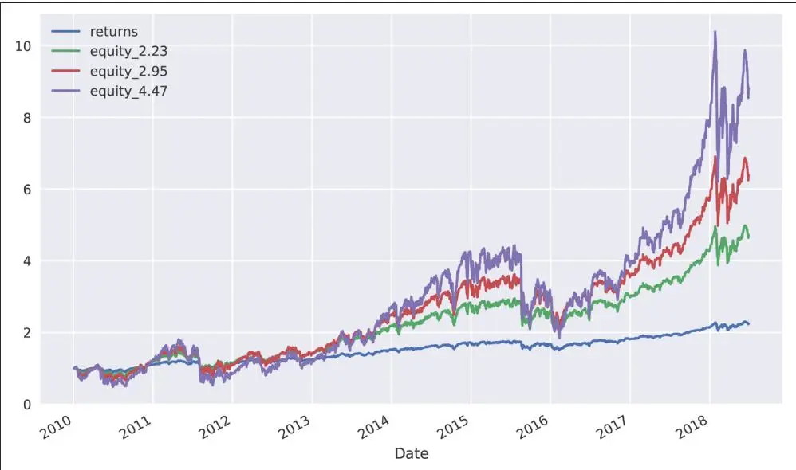
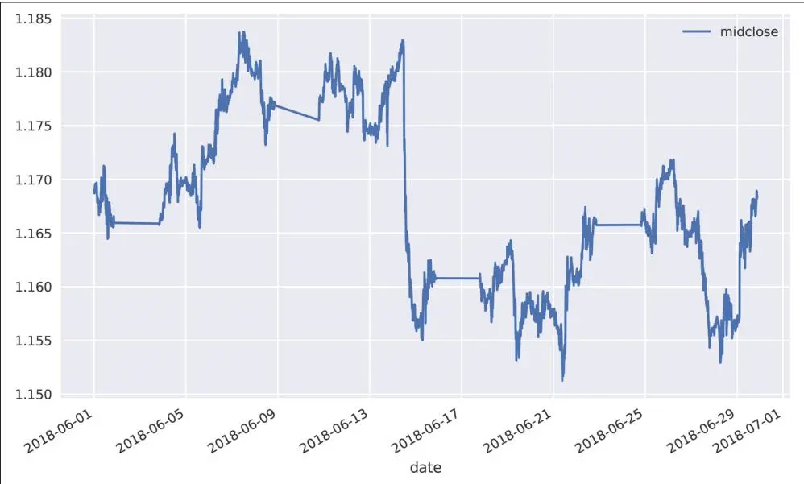
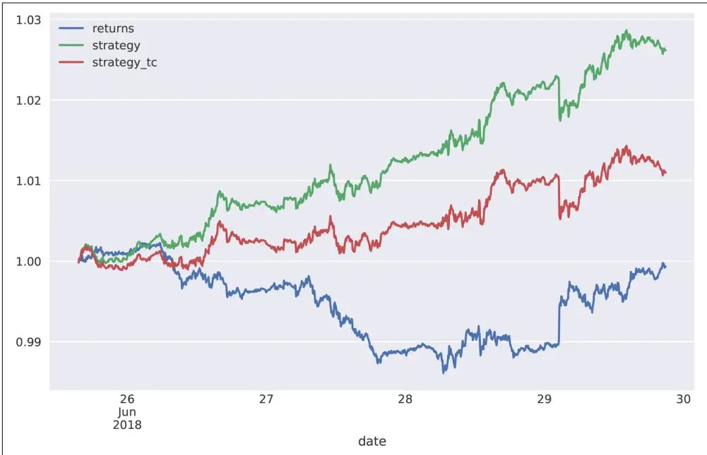
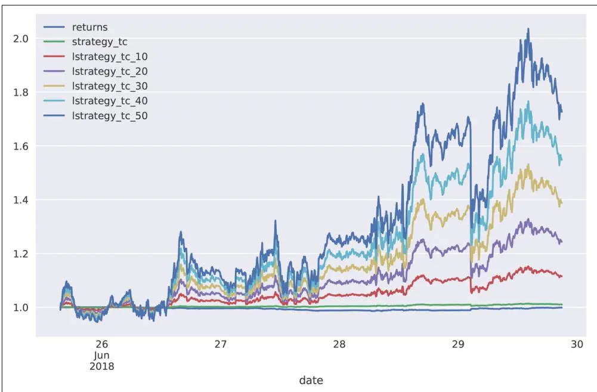
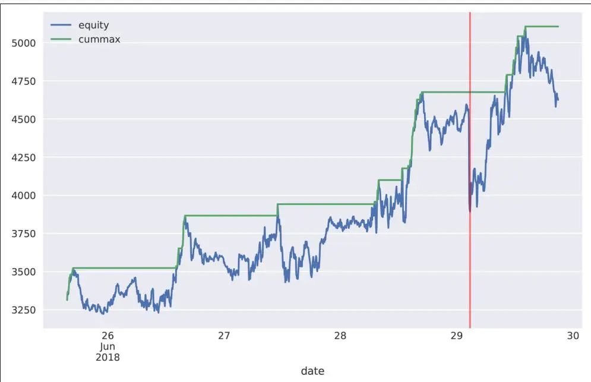

# 自动化交易


人们担心计算机会变得太聪明并接管世界，但真正的问题是它们太笨了，而且它们已经接管了世界。
—Pedro Domingos


"现在该怎么办？"你可能会想。我们有了一个交易平台，可以检索历史数据和流数据、下达买入和卖出订单、检查账户状态。我们还介绍了多种通过预测市场价格运动方向来推导算法交易策略的方法。如何将这一切整合在一起以自动化方式工作？这个问题无法一概而论。然而，本章讨论在此背景下重要的若干主题。本章假设仅部署单个自动化算法交易策略。这简化了资金管理和风险管理等方面的问题。

本章涵盖以下主题：

"资金管理" 第522页

如本节所示，根据策略特征和可用交易资金，凯利准则有助于确定交易规模。

"基于机器学习的交易策略" 第532页

为了建立对算法交易策略的信心，需要从业绩和风险特征两方面进行彻底回测；示例策略基于[第15章](ch15.md)介绍的机器学习分类算法。

"在线算法" 第544页

为了部署算法交易策略进行自动化交易，需要将其转换为一个能够实时处理传入流数据的在线算法。

"基础设施与部署" 第546页

为了稳健可靠地运行自动化算法交易策略，从可用性、性能和安全性角度来看，云端部署是首选方案。

"日志记录与监控" 第547页

为了能够分析部署期间的历史记录和某些事件，日志记录起着重要作用；通过套接字通信进行监控可以（远程）实时观察事件。

## 资金管理

算法交易中的一个核心问题是，在给定总可用资金的情况下，应向特定算法交易策略分配多少资金。这个问题的答案取决于通过算法交易试图实现的主要目标。大多数个人和金融机构都会同意，长期财富最大化是一个合理的候选目标。这正是Edward Thorp在推导投资中的凯利准则（Kelly Criterion）时所考虑的，如Rotando和Thorp (1992)的论文所述。

## 二项式设定中的凯利准则

介绍凯利准则投资理论的常见方式是基于一个抛硬币游戏，或者更一般地，一个二项式设定（只有两种可能结果）。本节遵循这一思路。假设一个赌徒在与一个资金无限的银行或赌场玩抛硬币游戏。再进一步假设正面朝上的概率为某个值 $\boldsymbol{p}$，满足 $\frac{1} {2} < p < 1$。反面朝上的概率定义为 $q = 1 - p < \frac{1} {2}$。赌徒可以下任意大小的赌注 $b > 0$，如果猜对则赢得相同金额，如果猜错则输掉全部赌注。根据概率假设，赌徒当然希望押注正面。因此，这个赌博游戏 B（即代表该游戏的随机变量）在单次设定下的期望值为：

$$
\mathbf{E} [ B ] = p \cdot b - q \cdot b = (p - q) \cdot b > 0
$$

一个风险中性且资金无限的赌徒希望下尽可能大的赌注，因为这将最大化期望收益。然而，金融市场中的交易通常不是一次性游戏，而是重复进行的。因此，假设 $b_{i}$ 表示第 i 天下注的金额，$c_{0}$ 表示初始资金。第一天结束时的资金 $c_{1}$ 取决于当天的下注结果，可能是 $c_{0} + b_{1}$ 或 $c_{0} - b_{1}$。重复 n 次的赌博的期望值为：

$$
\mathbf{E} [ B^{n} ] = c_{0} + \sum_{i = 1} ^{n} (p - q) \cdot b_{i}
$$

在经典经济理论中，风险中性且追求期望效用最大化的代理人会试图最大化这个表达式。容易看出，最大化该表达式的方法是将所有可用资金全部押上——即 $b_{i} = c_{i - 1}$——与一次性场景相同。然而，这意味着单次损失将耗尽所有可用资金并导致破产（除非可以无限借贷）。因此，这种策略并不能带来长期财富最大化。

押上最大可用资金可能导致突然破产，而完全不下注可以避免任何损失，但也无法从有利可图的赌博中获益。这时凯利准则就派上了用场，它推导出每轮下注中应使用的最佳资金比例 f<sup>\*</sup>。假设 $n =$ $h + t$，其中 h 表示在 n 轮下注中观察到的正面次数，t 表示反面次数。根据这些定义，n 轮后的可用资金为：

$$
c_{n} = c_{0} \cdot (1 + f) ^{h} \cdot (1 - f) ^{t}
$$

在这种背景下，长期财富最大化归结为最大化每注的平均几何增长率，其公式为：

$$
\begin{array}{r c l} r^{g} & = & \log \left(\frac{c_{n}}{c_{0}}\right) ^{1 / n} \\ & = & \log \left(\frac{c_{0} \cdot (1 + f) ^{h} \cdot (1 - f) ^{t}}{c_{0}}\right) ^{1 / n} \\ & = & \log \left((1 + f) ^{h} \cdot (1 - f) ^{t}\right) ^{1 / n} \\ & = & \frac{h}{n} \log (1 + f) + \frac{t}{n} \log (1 - f) \end{array}
$$

那么问题形式化地就是通过选择最优 f 来最大化期望平均增长率。由于 $\mathbf{E} [ h ] = n \cdot p$ 且 $\mathbf{E} [ t ] = n \cdot q$，得到：

$$
\begin{array}{r c l} \mathbf{E} [ r^{g} ] & = & \mathbf{E} \bigg [ \frac{h}{n} \log (1 + f) + \frac{t}{n} \log (1 - f) \bigg ] \\ & = & \mathbf{E} [ p \log (1 + f) + q \log (1 - f) ] \\ & = & p \log (1 + f) + q \log (1 - f) \\ & \equiv & G (f) \end{array}
$$

现在可以通过一阶条件选择最优比例 f<sup>\*</sup> 来最大化该表达式。一阶导数为：

$$
\begin{array}{r c l} G^{'} (f) & = & \frac{p}{1 + f} - \frac{q}{1 - f} \\ & = & \frac{p - p f - q - q f}{(1 + f) (1 - f)} \\ & = & \frac{p - q - f}{(1 + f) (1 - f)} \end{array}
$$

由一阶条件可得：

$$
G^{'} (f) \stackrel{!} {=} 0 \Rightarrow f^{*} = p - q
$$

如果认为这是最大值（而非最小值），则此结果意味着每轮下注的最优投资比例为 $f^{*} = p - q$。例如，$\hbar =$ 0.55 时 $f^{\ast} = 0 . 55 - 0 . 45 = 0 . 1$，表明最优比例为 10%。

以下 Python 代码通过模拟将这些概念和结果形式化。首先，导入必要的库并进行配置：

```python
In [1]: import math
import time
import numpy as np
import pandas as pd
import datetime as dt
import cufflinks as cf
from pylab import plt
In [2]: np.random.seed(1000)
plt.style.use('seaborn')
%matplotlib inline
```

接下来模拟，例如，50个序列，每个序列包含100次抛硬币。Python 代码很直接：

```txt
In [3]: p = 0.55
In [4]: f = p - (1 - p)
In [5]: f
Out[5]: 0.10000000000000009
In [6]: I = 50
In [7]: n = 100
```

① 设定正面概率。

② 根据凯利准则计算最优比例。

③ 要模拟的序列数量。

④ 每个序列的试验次数。

主要部分是 Python 函数 run\_simulation()，它根据先前的假设完成模拟。图16.1显示了模拟结果：

```python
In [8]: def run_simulation(f):
    c = np.zeros((n, I)) ①
    c[0] = 100 ②
    for i in range(I): ③
    for t in range(1, n): ④
    o = np.random.binomial(1, p) ⑤
    if o > 0: ⑥
    c[t, i] = (1 + f) * c[t - 1, i] ⑦
    else: ⑧
    c[t, i] = (1 - f) * c[t - 1, i] ⑨
    return c
```

In [9]: c\_1 = run\_simulation(f)

```txt
In [10]: c_1.round(2)
Out[10]: array([[100. , 100. , 100. , ..., 100. , 100. , 100. ],
    [ 90. , 110. , 90. , ..., 110. , 90. , 110. ],
    [ 99. , 121. , 99. , ..., 121. , 81. , 121. ],
    ...
    [226.35, 338.13, 413.27, ..., 123.97, 123.97, 123.97],
    [248.99, 371.94, 454.6 , ..., 136.37, 136.37, 136.37],
    [273.89, 409.14, 409.14, ..., 122.73, 150.01, 122.73]])
```

```txt
In [11]: plt.figure(figsize=(10, 6))
plt.plot(c_1, 'b', lw=0.5)
plt.plot(c_1.mean(axis=1), 'r', lw=2.5);
```

① 实例化一个 ndarray 对象来存储模拟结果。

② 将起始资金初始化为 100。

③ 外层循环，用于序列模拟。

④ 内层循环，用于序列本身。

⑤ 模拟抛硬币。

⑥ 如果为 1，即正面朝上……

⑦ ……则将赢利加入资金。

⑧ 如果为 0，即反面朝上……

⑨ ……则将损失从资金中扣除。

⑩ 运行模拟。

⑪ 绘制所有 50 个序列。

⑫ 绘制所有 50 个序列的平均值。


图16.1 50个模拟序列，每个包含100次试验（红线 = 平均值）

以下代码对不同 f 值重复模拟。如图16.2所示，较低的比例导致平均增长率较低。较高的值可能在模拟结束时导致较高的平均资金（f = 0.25）或更低的平均资金（f = 0.5）。在 f 值较高的两种情况下，波动性都显著增加：

In [12]: c\_2 = run\_simulation(0.05)

In [13]: c\_3 = run\_simulation(0.25)

```txt
In [14]: c_4 = run_simulation(0.5) 3
```

```txt
In [15]: plt.figure(figsize=(10, 6))
plt.plot(c_1.mean(axis=1), 'r', label='f^*=0.1$')
plt.plot(c_2.mean(axis=1), 'b', label='f=0.05$')
plt.plot(c_3.mean(axis=1), 'y', label='f=0.25$')
```

```javascript
plt.plot(c_4.mean(axis=1), 'm', label='f=0.5')
plt.legend(loc=0);
```

① f = 0.05 的模拟。

② f = 0.25 的模拟。

③ f = 0.5 的模拟。


图16.2 不同比例下随时间变化的平均资金

## 股票和指数的凯利准则

现在假设一个股票市场设定，其中相关股票（指数）在一年后只能取两个值，其当前值已知。该设定仍然是二项式的，但这次在建模方面更接近股票市场现实。<sup>1</sup> 具体来说，假设：

$$
P (r^{s} = \mu + \sigma) = P (r^{s} = \mu - \sigma) = \frac{1}{2}
$$

其中 $\mathbf{E} [ r^{s} ] = \mu > 0$ 是股票一年期的预期收益率，$\sigma > 0$ 是收益率的标准差（波动率）。在单期设定中，一年后的可用资金为（$c_{0}$ 和 f 如前所述）：

$$
c (f) = c_{0} \cdot (1 + (1 - f) \cdot r + f \cdot r^{S})
$$

这里，r 是未投资于股票的资金所赚取的恒定短期利率。最大化几何增长率意味着最大化下式：

$$
G (f) = \mathbf{E} \left[ \log \frac{c (f)}{c_{0}} \right]
$$

现在假设一年中有 n 个相关交易日，使得对于每个交易日 i：

$$
P \left(r_{i} ^{S} = \frac{\mu}{n} + \frac{\sigma}{\sqrt{n}}\right) = P \left(r_{i} ^{S} = \frac{\mu}{n} - \frac{\sigma}{\sqrt{n}}\right) = \frac{1}{2}
$$

注意，波动率随交易日数的平方根缩放。在这些假设下，每日值按照之前的方式累加为年化值，得到：

$$
c_{n} (f) = c_{0} \cdot \prod_{i = 1} ^{n} \left(1 + (1 - f) \cdot \frac{r}{n} + f \cdot r_{i} ^{s}\right)
$$

现在需要最大化以下量，以在投资该股票时实现长期财富最大化：

$$
\begin{array}{r c l} G_{n} (f) & = & \mathbf{E} \bigg [ \log \frac{c_{n} (f)}{c_{0}} \bigg ] \\ & = & \mathbf{E} \bigg [ \sum_{i = 1} ^{n} \log \left(1 + (1 - f) \cdot \frac{r}{n} + f \cdot r_{i} ^{s}\right) \bigg ] \\ & = & \frac{1}{2} \sum_{i = 1} ^{n} \log \left(1 + (1 - f) \cdot \frac{r}{n} + f \cdot \left(\frac{\mu}{n} + \frac{\sigma}{\sqrt{n}}\right)\right) \\ & + & \log \left(1 + (1 - f) \cdot \frac{r}{n} + f \cdot \left(\frac{\mu}{n} - \frac{\sigma}{\sqrt{n}}\right)\right) \\ & = & \frac{n}{2} \log \left(\left(1 + (1 - f) \cdot \frac{r}{n} + f \cdot \frac{\mu}{n}\right) ^{2} - \frac{f^{2} \sigma^{2}}{n}\right) \end{array}
$$

使用泰勒级数展开，最终得到：

$$
G_{n} (f) = r + (\mu - r) \cdot f - \frac{\sigma^{2}}{2} \cdot f^{2} + \mathcal{O} \left(\frac{1}{\sqrt{n}}\right)
$$

或者说对于无限多个交易时间点——即连续交易——为：

$$
G_{\infty} (f) = r + (\mu - r) \cdot f - \frac{\sigma^{2}}{2} \cdot f^{2}
$$

最优比例 f<sup>\*</sup> 通过一阶条件由下式给出：

$$
f^{*} = \frac{\mu - r}{\sigma^{2}}
$$

即股票的预期超额收益率除以收益率方差。该表达式看起来类似于夏普比率（Sharpe ratio）（参见第13章"投资组合优化"），但有所不同。

一个实际例子将说明这些公式的应用及其在交易策略中权益杠杆的作用。所考虑的交易策略简单地是 S&P 500 指数的被动多头头寸。为此，快速检索基础数据并轻松推导所需统计量：

```txt
In [16]: raw = pd.read_csv('../source/tr_eikon_eod_data.csv', index_col=0, parse_dates=True)
```

In [17]: symbol = '.SPX'

In [18]: data = pd.DataFrame(raw[symbol])

In [19]: data['returns'] = np.log(data / data.shift(1))

In [20]: data.dropna(inplace=True)

```csv
In [21]: data.tail()
Out[21]: .SPX returns
Date
2018-06-252717.07 -0.0138202018-06-262723.060.0022022018-06-272699.63 -0.0086422018-06-282716.310.0061602018-06-292718.370.000758
```

所覆盖期间 S&P 500 指数的统计特性表明，最佳投资比例约为 4.5。换句话说，每持有 1 美元应投资 4.5 美元——意味着杠杆率为 4.5，符合最优凯利"比例"（或在此情况下更准确地说是"因子"）。在其他条件相同的情况下，凯利准则意味着预期收益越高、波动率（方差）越低，杠杆率越高：

```txt
In [22]: mu = data_returns.mean() * 252
In [23]: mu
Out[23]: 0.09898579893004976
In [24]: sigma = data_returns.std() * 252 ** 0.5
In [25]: sigma
Out[25]: 0.1488567510081967
In [26]: r = 0.0
In [27]: f = (mu - r) / sigma ** 2
In [28]: f
Out[28]: 4.4672043679706865
```

① 计算年化收益率。

② 计算年化波动率。

③ 设定无风险利率为 0（为简单起见）。

④ 计算投资该策略的最优凯利比例。

以下代码模拟凯利准则和最优杠杆率的应用。为简单和便于比较，初始权益设为 1，初始总投资资本设为 1 · f<sup>\*</sup>。根据投入到策略的资本表现，总资本本身每日根据可用权益进行调整。亏损后，资本减少；盈利后，资本增加。权益头寸与指数本身的演变如图16.3所示：

```python
In [29]: equs = []

In [30]: def kelly_strategy(f):
    global equs
    equ = 'equity_{:.2f}'.format(f)
    equs.append(equ)
    cap = 'capital_{:.2f}'.format(f)
    data[equ] = 1 ①
    data[cap] = data[equ] * f ②
``````python
for i, t in enumerate(data.index[1:]):
    t_1 = data.index[i] ③
    data.loc[t, cap] = data[cap].loc[t_1] * \
    math.exp(data['returns'].loc[t]) ④
    data.loc[t, equ] = data[cap].loc[t] - \
    data[cap].loc[t_1] + \
    data[equ].loc[t_1] ⑤
    data.loc[t, cap] = data[equ].loc[t] * f ⑥
```

```txt
In [31]: kelly_strategy(f * 0.5)
```

```txt
In [32]: kelly_strategy(f * 0.66)
```

```txt
In [33]: kelly_strategy(f) ⑨
```

```csv
In [34]: print(data[equs].tail())
    equity_2.23    equity_2.95    equity_4.47
Date
2018-06-254.7070706.3673408.7943422018-06-264.7302486.4087278.8809522018-06-274.6393406.2461478.5395932018-06-284.7033656.3599328.7752962018-06-294.7113326.3741528.805026
```

```javascript
In [35]: ax = data['returns'].cumsum().apply(np.exp).plot(legend=True, figsize=(10, 6))
data[equs].plot(ax=ax, legend=True);
```

① 为权益生成新列，初始值设为 1。

② 为资本生成新列，初始值设为 1 · f<sup>\*</sup>。

③ 选择前一个值的正确 DatetimeIndex 值。

④ 根据收益率计算新的资本头寸。

⑤ 根据资本头寸的业绩调整权益值。

⑥ 根据新的权益头寸和固定的杠杆率调整资本头寸。

⑦ 对 f 的一半模拟基于凯利准则的策略……

⑧ ……对 f 的三分之二……

⑨ ……以及对 f 本身。


图16.3 S&P 500 的累积业绩与不同 f 值下的权益头寸比较

如图16.3所示，应用最优凯利杠杆导致权益头寸的演变相当不稳定（高波动性），考虑到杠杆率为 4.47，这在直觉上是合理的。可以预期权益头寸的波动性随杠杆率增加而增加。因此，实践者通常降低杠杆率至例如"半凯利"——在本例中为 $\begin{array} {r} {\frac{1} {2} \cdot f^{*} \approx 2 . 23} \end{array}$。因此，图16.3也显示了低于"全凯利"的权益头寸演变。风险确实随 f 值的降低而降低。

## 基于机器学习的交易策略

[第14章](ch14.md)介绍了 FXCM 交易平台、其 REST API 和 Python 封装包 fxcmpy。本节将基于机器学习的方法与 FXCM REST API 的历史数据结合起来，预测市场价格运动方向，从而回测 EUR/USD 货币对的算法交易策略。它使用向量化回测，这次将买卖价差作为比例交易成本考虑在内。与[第15章](ch15.md)中介绍的简单向量化回测方法相比，它还增加了对被测交易策略风险特征的更深入分析。

## 向量化回测

回测基于日内数据，具体是五分钟长度的柱。以下代码连接到 FXCM REST API 并检索整个月的五分钟柱数据。图16.4可视化了数据检索期间内的中间收盘价：

```csv
In [36]: import fxcmpy

In [37]: fxcmpy.__version__
Out[37]: '1.1.33'

In [38]: api = fxcmpy.fxcmpy(config_file='../fxcm.cfg') ①

In [39]: data = api.get_candles('EUR/USD', period='m5',
    start='2018-06-0100:00:00',
    stop='2018-06-3000:00:00') ①

In [40]: data.iloc[-5:, 4:]
Out[40]: askopen askclose askhigh asklow tickqty
date
2018-06-2920:35:001.168621.168821.168961.168396012018-06-2920:40:001.168821.168531.168981.168523872018-06-2920:45:001.168531.168261.168621.168225922018-06-2920:50:001.168261.168361.168461.168198422018-06-2920:55:001.168361.168611.168761.16834540

In [41]: data.info()
<class 'pandas.core.frame.DataFrame'>
DatetimeIndex: 6083 entries, 2018-06-0100:00:00 to 2018-06-2920:55:00
Data columns (total 9 columns):
bidopen 6083 non-null float64
bidclose 6083 non-null float64
bidhigh 6083 non-null float64
bidlow 6083 non-null float64
askopen 6083 non-null float64
askclose 6083 non-null float64
askhigh 6083 non-null float64
asklow 6083 non-null float64
tickqty 6083 non-null int64
dtypes: float64(8), int64(1)
memory usage: 475.2 KB

In [42]: spread = (data['askclose'] - data['bidclose']).mean() ②
spread ②
Out[42]: 2.6338977478217845e-05

In [43]: data['midclose'] = (data['askclose'] + data['bidclose']) / 2 ③
In [44]: ptc = spread / data['midclose'].mean() ④
ptc ④
Out[44]: 2.255685318140426e-05
```

In [45]: data['midclose'].plot(figsize=(10, 6), legend=True);

① 连接到 API 并检索数据。

② 计算平均买卖价差（bid-ask spread）。

③ 根据卖出收盘价和买入收盘价计算中间收盘价。

④ 根据平均价差和平均中间收盘价计算平均比例交易成本。


图16.4 EUR/USD 汇率（五分钟柱）

基于机器学习的策略基于二值化的滞后收益率数据。也就是说，机器学习算法从历史上涨和下跌的模式中学习，判断另一次上涨或下跌更可能发生。因此，以下代码创建值为 0 和 1 的特征数据，以及值为 +1 和 -1 的标签数据，表示在所有情况下观察到的市场方向：

```javascript
In [46]: data['returns'] = np.log(data['midclose'] / data['midclose'].shift(1))
```

In [47]: data.dropna(inplace=True)

In [48]: lags = 5

```python
In [49]: cols = []
    for lag in range(1, lags + 1):
```

```python
col = 'lag_{}'.format(lag)
data[col] = data['returns'].shift(lag) ①
cols.append(col)

In [50]: data.dropna(inplace=True)

In [51]: data[cols] = np.where(data[cols] > 0, 1, 0) ②

In [52]: data['direction'] = np.where(data['returns'] > 0, 1, -1) ③

In [53]: data[cols + ['direction']].head()
Out[53]: lag_1 lag_2 lag_3 lag_4 lag_5 direction
date
2018-06-0100:30:001010112018-06-0100:35:001101012018-06-0100:40:001110112018-06-0100:45:001111012018-06-0100:50:0011111 -1
```

① 根据滞后数量创建滞后收益率数据。

② 将特征值转换为二元数据。

③ 将收益率数据转换为方向标签数据。

有了特征和标签数据后，可以应用不同的监督学习算法。以下使用 scikit-learn 机器学习包中的支持向量机分类算法。代码基于顺序训练-测试分割来训练和测试算法交易策略。模型在训练和测试数据上的准确率略高于 50%，在测试数据上的得分甚至更高。在金融交易背景下，准确率也可以称为交易策略的命中率（hit ratio）；即盈利交易数量与所有交易数量的比值。由于命中率大于 50%，这可能表明——在凯利准则的背景下——相较于随机游走设定具有微小优势：

```python
In [54]: from sklearn.svm import SVC
from sklearn.metrics import accuracy_score
```

```txt
In [55]: model = SVC(C=1, kernel='linear', gamma='auto')
```

```txt
In [56]: split = int(len(data) * 0.80)
```

```txt
In [57]: train = data.iloc[:split].copy()
```

```python
In [58]: model.fit(train[cols], train['direction'])
Out[58]: SVC(C=1, cache_size=200, class_weight=None, coef0=0.0,
    decision_function_shape='ovr', degree=3, gamma='auto', kernel='linear',
    max_iter=-1, probability=False, random_state=None, shrinking=True,
    tol=0.001, verbose=False)
```

```txt
In [59]: accuracy_score(train['direction'], model.predict(train[cols])) ①
Out[59]: 0.5198518823287389
```

```lua
In [60]: test = data.iloc[split:].copy()
```

```python
In [61]: test['position'] = model.predict(test[col s])
```

```txt
In [62]: accuracy_score(test['direction'], test['position'])
Out[62]: 0.5419407894736842
```

① 已训练模型在样本内（训练数据）的预测准确率。

② 已训练模型在样本外（测试数据）的预测准确率。

众所周知，命中率只是金融交易成功的其中一个方面。同样关键的是交易策略所产生的交易成本以及正确把握重要交易。<sup>2</sup> 为此，只有正式的向量化回测方法才能判断交易策略的质量。以下代码考虑了基于平均买卖价差的比例交易成本。图16.5比较了算法交易策略（不含和含比例交易成本）与被动基准投资的业绩：

```python
In [63]: test['strategy'] = test['position'] * test['returns']
```

```txt
In [64]: sum(test['position'].diff() != 0)
Out[64]: 660
```

```python
In [65]: test['strategy_tc'] = np.where(test['position'].diff() != 0, test['strategy'] - ptc, test['strategy'])
```

```python
In [66]: test[['returns', 'strategy', 'strategy_tc']].sum().apply(np.exp)
Out[66]: returns 0.999324
strategy 1.026141
strategy_tc 1.010977
dtype: float64
```

```javascript
In [67]: test[['returns', 'strategy', 'strategy_tc']].cumsum().apply(np.exp).plot(figsize=(10, 6));
```

① 推导基于机器学习的算法交易策略的对数收益率。

② 根据头寸变化计算交易策略隐含的交易次数。

③ 每当发生交易时，从该日的策略对数收益率中减去比例交易成本。


图16.5 EUR/USD 汇率与算法交易策略的业绩表现


## 向量化回测的局限性

向量化回测在策略可以多接近市场现实方面存在局限。例如，它不允许直接包含每笔交易的固定交易成本。作为一种近似，可以取平均比例交易成本的倍数（基于平均头寸规模）来间接考虑固定交易成本。但这通常不会很精确。如果需要更高的精度，则需要应用其他方法，例如基于事件驱动的回测，对每个价格柱进行显式循环。

## 最优杠杆

有了交易策略的对数收益率数据后，可以计算均值和方差，从而根据凯利准则推导最优杠杆。以下代码将数值缩放为年化值，但这不会改变根据凯利准则的最优杠杆值，因为均值收益率和方差按相同因子缩放：

```txt
In [68]: mean = test[['returns', 'strategy_tc']].mean() * len(data) * 12
    mean
Out[68]: returns -0.040535
    strategy_tc 0.654711
    dtype: float64

In [69]: var = test[['returns', 'strategy_tc']].var() * len(data) * 12
    var
Out[69]: returns 0.007861
    strategy_tc 0.007837
    dtype: float64

In [70]: vol = var ** 0.5
    vol
Out[70]: returns 0.088663
    strategy_tc 0.088524
    dtype: float64

In [71]: mean / var
Out[71]: returns -5.156448
    strategy_tc 83.545792
    dtype: float64

In [72]: mean / var * 0.5
Out[72]: returns -2.578224
    strategy_tc 41.772896
    dtype: float64
```

① 年化平均收益率。

② 年化方差。

③ 年化波动率。

④ 根据凯利准则的最优杠杆（"全凯利"）。

⑤ 根据凯利准则的最优杠杆（"半凯利"）。

使用"半凯利"准则，交易策略的最优杠杆约为 40。对于像 FXCM 这样的经纪商以及外汇和差价合约（Contract for Difference, CFD）等金融工具，即使是零售交易者也可以使用这样的杠杆比率。<sup>3</sup> 图16.6显示了不同杠杆值下含交易成本的策略业绩对比：

```python
In [73]: to_plot = ['returns', 'strategy_tc']

In [74]: for lev in [10, 20, 30, 40, 50]:
    label = 'lstrategy_tc_%d' % lev
    test[label] = test['strategy_tc'] * lev
    to_plot.append(label)

In [75]: test[to_plot].cumsum().apply(np.exp).plot(figsize=(10, 6));
```

① 对不同杠杆值缩放策略收益。


图16.6 不同杠杆值下算法交易策略的业绩表现

## 风险分析

由于杠杆增加了交易策略的风险，有必要进行更深入的风险分析。以下风险分析假设杠杆率为 30。首先，计算最大回撤（maximum drawdown）和最长的回撤期。最大回撤是自近期高点以来的最大损失（下跌）。相应地，最长回撤期是交易策略恢复到近期高点所需的最长时间。分析假设初始权益为 3,333 欧元，对于杠杆率 30，初始头寸规模为 100,000 欧元。同时假设无论业绩如何，权益随时间不作调整：

```python
In [76]: equity = 3333
In [77]: risk = pd.DataFrame(test['lstrategy_tc_30']) ②
In [78]: risk['equity'] = risk['lstrategy_tc_30'].cumsum().apply(np.exp) * equity ③
In [79]: risk['cummax'] = risk['equity'].cummax() ④
In [80]: risk['drawdown'] = risk['cummax'] - risk['equity'] ⑤
In [81]: risk['drawdown'].max() ⑥
Out[81]: 781.7073602069818
In [82]: t_max = risk['drawdown'].idxmax() ⑦
t_max ⑦
Out[82]: Timestamp('2018-06-2902:45:00')
```

① 初始权益。

② 相关的对数收益率时间序列……

③ ……按初始权益缩放。

④ 随时间累积的最大值。

⑤ 随时间变化的回撤值。

⑥ 最大回撤值。

⑦ 发生的时间点。

技术上，新高（new high）以回撤值为 0 为特征。回撤期是两个这样的新高之间的时间。图16.7可视化了最大回撤和回撤期：

```python
In [83]: temp = risk['drawdown'][risk['drawdown'] == 0] ①
In [84]: periods = (temp.index[1:].to_pydatetime() - temp.index[:-1].to_pydatetime()) ②
In [85]: periods[20:30] ②
Out[85]: array([datetime.timedelta(seconds=68700), datetime.timedelta(seconds=72000), datetime.timedelta(seconds=1800), datetime.timedelta(seconds=300), datetime.timedelta(seconds=600), datetime.timedelta(seconds=300), datetime.timedelta(seconds=17400), datetime.timedelta(seconds=4500), datetime.timedelta(seconds=1500), datetime.timedelta(seconds=900)], dtype=object)
In [86]: t_per = periods.max() ③
In [87]: t_per ③
Out[87]: datetime.timedelta(seconds=76500)
In [88]: t_per.seconds / 60 / 60 ④
Out[88]: 21.25
In [89]: risk[['equity', 'cummax']].plot(figsize=(10, 6))
plt.axvline(t_max, c='r', alpha=0.5);
```

① 识别出回撤必须为 0 的高点。

② 计算所有高点之间的时间差。

③ 最长回撤期（以秒计）……

④ ……以及小时数。


图16.7 最大回撤（垂直线）和回撤期（水平线）

另一个重要的风险度量是风险价值（Value-at-Risk, VaR）。它以货币金额表示，代表在给定时间范围和置信水平下预期的最大损失。以下代码基于不同置信水平下杠杆交易策略的权益头寸对数收益率，推导随时间变化的 VaR 值。时间间隔固定为柱长度五分钟：

```python
In [91]: import scipy.stats as scs
In [92]: percs = np.array([0.01, 0.1, 1., 2.5, 5.0, 10.0])
In [93]: risk['returns'] = np.log(risk['equity'] /
    risk['equity'].shift(1))
In [94]: VaR = scs.scoreatpercentile(equity * risk['returns'], percs)
In [95]: def print_var():
    print('%16s %16s' % ('Confidence Level', 'Value-at-Risk'))
    print(33 * '-')
    for pair in zip(percs, VaR):
    print('%16.2f %16.3f' % (100 - pair[0], -pair[1]))
In [96]: print_var()
    Confidence Level    Value-at-Risk
    99.99400.854
```

<table><tr><td>99.90</td><td>175.932</td></tr><tr><td>99.00</td><td>88.139</td></tr><tr><td>97.50</td><td>60.485</td></tr><tr><td>95.00</td><td>45.010</td></tr><tr><td>90.00</td><td>32.056</td></tr></table>

① 定义要使用的百分位值。

② 根据百分位值计算 VaR 值。

③ 将百分位值转换为置信水平，并将 VaR 值（负值）转换为正值用于打印。

最后，以下代码通过对原始 DataFrame 对象进行重采样，计算时间跨度为 1 小时的 VaR 值。实际上，除最高置信水平外，所有置信水平的 VaR 值都有所增加：

```javascript
In [97]: hourly = risk.resample('1H', label='right').last()
```

```javascript
In [98]: hourly['returns'] = np.log(hourly['equity'] / hourly['equity'].shift(1))
```

```txt
In [99]: VaR = scs.scoreatpercentile(equity * hourly['returns'], percsc)
```

```txt
In [100]: print_var()
Confidence Level Value-at-Risk
99.99389.52499.90372.65799.00205.66297.50186.99995.00164.86990.00101.835
```
① 将数据从五分钟柱重采样为一小时柱。

② 为重采样数据重新计算 VaR 值。

## 持久化模型对象

一旦基于回测、杠杆和风险分析结果"接受"了算法交易策略，就可以持久化模型对象以供后续部署使用。该模型现在体现了基于机器学习的交易策略或交易算法：

```txt
In [101]: import pickle
```

```javascript
In [102]: pickle.dump(model, open('algorithm.pkl', 'wb'))
```

## 在线算法

到目前为止测试的交易算法是一个离线算法（offline algorithm）。这种算法使用完整的数据集来解决当前问题。当前的问题是：基于二值化特征数据和方向标签数据训练一个 SVM 算法。在实践中，当在金融市场中部署交易算法时，它必须逐条消费到达的数据，以预测下一个时间间隔（柱）的市场运动方向。本节使用上一节中持久化的模型对象，并将其嵌入到流数据环境中。

将离线交易算法转换为在线交易算法的代码主要处理以下问题：

## 刻数据

刻数据实时到达，需要实时处理

## 重采样

需要将刻数据重采样到交易算法所需的柱大小

## 预测

交易算法对相关时间间隔（本质上属于未来）的市场运动方向生成预测

## 订单

根据当前头寸和算法生成的预测（"信号"），下达订单或保持头寸

第14章"获取流数据"展示了如何从 FXCM REST API 实时检索刻数据。基本方法是订阅市场数据流并传递一个处理数据的回调函数。

首先，加载持久化的交易算法——它代表了将要遵循的交易逻辑。定义一个辅助函数来在交易算法运行时打印未平仓头寸也可能很有用：

```python
In [103]: algorithm = pickle.load(open('algorithm.pkl', 'rb'))
In [104]: algorithm
Out[104]: SVC(C=1, cache_size=200, class_weight=None, coef0=0.0, decision_function_shape='ovr', degree=3, gamma='auto', kernel='linear', max_iter=-1, probability=False, random_state=None, shrinking=True, tol=0.001, verbose=False)
In [105]: sel = ['tradeId', 'amountK', 'currency', 'grossPL', 'isBuy'] ①
In [106]: def print_positions(pos):
    print('\n\n' + 50 * '=')
```

```python
print('Going {}.\n'.format(pos))
time.sleep(1.5) ②
print(api.get_open_positions()[sel])
print(50 * '=' + '\n\n')
```

① 定义要显示的 DataFrame 列。

② 等待订单执行并反映在未平仓头寸中。

③ 打印未平仓头寸。

在定义和启动在线算法之前，设置几个参数值：

```txt
In [107]: symbol = 'EUR/USD'
bar = '15s'
amount = 100
position = 0
min_bars = lags + 1
df = pd.DataFrame()
```

① 要交易的交易品种代码。

② 用于重采样的柱长度；为便于测试，柱长度可能比实际部署时更短（例如 15 秒而非 5 分钟）。

③ 交易金额，以千计。

④ 初始头寸（"中性"）。

⑤ 首次预测和交易所需的最少重采样柱数量。

⑥ 一个空的 DataFrame 对象，稍后用于存储重采样的数据。

以下是回调函数 automated\_strategy()，它将交易算法转换为实时环境：

```python
In [108]: def automated_strategy(data, dataframe):
    global min_bars, position, df
    ldf = len(dataframe) ①
    df = dataframe.resample(bar, label='right').last().ffill() ②
    if ldf % 20 == 0:
    print('%3d' % len(dataframe), end=',)

    if len(df) > min_bars:
    min_bars = len(df)
    df['Mid'] = df[['Bid', 'Ask']].mean(axis=1)
    df['Returns'] = np.log(df['Mid'] / df['Mid'].shift(1))
    df['Direction'] = np.where(df['Returns'] > 0, 1, -1)
    features = df['Direction'].iloc[-(lags + 1):-1] ③
```

```python
features = features.values.reshape(1, -1)
signal = algorithm.predict(features)[0]
if position in [0, -1] and signal == 1:
    api.create_market_buy_order(
    symbol, amount - position * amount)
    position = 1
    print_positions('LONG')

elif position in [0, 1] and signal == -1:
    api.create_market_sell_order(
    symbol, amount + position * amount)
    position = -1
    print_positions('SHORT')

if len(dataframe) > 350:
    api unsubscribe_market_data('EUR/USD')
    api.close_all()
```

① 获取包含刻数据的 DataFrame 对象的长度。

② 将刻数据重采样为定义的柱长度。

③ 选择所有滞后的相关特征值……

④ ……并重塑为模型可以用于预测的形式。

⑤ 生成预测值（+1 或 -1）。

⑥ 进入（或保持）多头头寸的条件。

⑦ 进入（或保持）空头头寸的条件。

⑧ 停止交易并平掉所有未平仓头寸的条件（根据检索到的刻数量任意定义）。

## 基础设施与部署

使用真实资金部署自动化算法交易策略需要适当的基础设施。基础设施应满足以下条件：

## 可靠性

部署算法交易策略的基础设施应支持高可用性（例如 > 99.9%），并应确保可靠性（自动备份、驱动器和网络连接冗余等）。

## 性能

根据处理的数据量和算法产生的计算需求，基础设施必须具有足够的 CPU 核心、工作内存（RAM）和存储空间（SSD）；此外，网络连接应足够快。

## 安全性

操作系统及其上运行的应用程序应通过强密码和 SSL 加密进行保护；硬件应防火、防水并防止未经授权的物理访问。

基本上，这些要求只能通过从专业数据中心或云提供商处租用适当的基础设施来满足。为满足上述要求而投资物理基础设施，通常只有较大型甚至最大型的金融市场参与者才能负担得起。

从开发和测试的角度来看，即使是 DigitalOcean 的最小 Droplet（云实例）也足以入门。在撰写本文时，这样的 Droplet 每月费用为 5 美元；按小时计费，服务器可以在几分钟内创建并在几秒内销毁。<sup>4</sup>

如何设置 DigitalOcean Droplet 在第3章"使用云实例"中有详细说明，其中包括可调整的 bash 脚本，以反映对 Python 包等的个性化需求。


## 操作风险

尽管可以从本地计算机（台式机、笔记本等）进行自动化算法交易策略的开发和测试，但部署使用真实资金的实盘策略并不合适。简单的网络连接中断或短暂停电可能导致整个算法崩溃，例如在投资组合中留下意外的未平仓头寸，或导致数据集损坏（由于错过实时刻数据），潜在地导致错误信号和意外交易/头寸。

## 日志记录与监控

假设自动化算法交易策略将部署在远程服务器上（云实例、租用服务器等），所有需要的 Python 包都已安装（参见第3章"使用云实例"），并且例如 Jupyter Notebook 正在安全运行。如果算法交易者不想整天坐在屏幕前登录服务器，还需要考虑什么？

本节讨论与此相关的两个重要主题：日志记录和实时监控。日志记录将信息和事件持久化到磁盘上，供后续检查。这是软件应用程序开发和部署中的标准实践。然而，这里的重点可能更偏向金融方面，记录重要的金融数据和事件信息供后续检查和分析。实时监控也是如此，它利用套接字通信。通过套接字，可以创建一个重要金融方面的持续实时流，即使部署发生在云端，也可以在本地计算机上检索和处理。

第550页的"自动化交易策略"提供了一个实现所有这些方面的 Python 脚本，并使用了第544页"在线算法"中的代码。该脚本将代码组织成一种形式，允许例如基于持久化的算法对象在远程服务器上部署算法交易策略。它基于自定义函数（其中使用 ZeroMQ 进行套接字通信）增加了日志记录和监控能力。结合第553页的"策略监控"中的短脚本，这允许远程实时监控远程服务器上的活动。

当运行第550页"自动化交易策略"中的脚本时（无论是本地还是远程），记录并通过套接字发送的输出如下所示：

```txt
2018-07-2509:16:15.568208
====================
NUMBER OF BARS: 24
====================
MOST RECENT DATA
Mid Returns Direction
2018-07-2507:15:301.168885 -0.000009 -12018-07-2507:15:451.1689450.00004312018-07-2507:16:001.168895 -0.000051 -12018-07-2507:16:151.168895 -0.000009 -12018-07-2507:16:301.168885 -0.000017 -1
====================
features: [[ 1 -11 -1 -1]]
position: -1
signal: -12018-07-2509:16:15.581453
====================
no trade placed
*****END OF CYCLE***
```

```markdown
2018-07-2509:16:30.069737
====================
NUMBER OF BARS: 25
====================
MOST RECENT DATA
Mid Returns Direction
2018-07-2507:15:451.1689450.00004312018-07-2507:16:001.168895 -0.000051 -12018-07-2507:16:151.168895 -0.000009 -12018-07-2507:16:301.1689500.00003412018-07-2507:16:451.168945 -0.000017 -1
====================
features: [[-11 -1 -11]]
position: -1
signal: 12018-07-2509:16:33.035094
====================
Going LONG.
tradeId amountK currency grossPL isBuy
061476318100 EUR/USD -2 True
====================
```

在本地运行第553页"策略监控"中的脚本，然后可以实时检索和处理此类信息。当然，可以根据自己的需求调整日志记录和流数据。<sup>5</sup> 同样地，也可以例如持久化在交易脚本执行期间创建的 DataFrame 对象。此外，交易脚本和整个逻辑可以调整，以编程方式包含止损或止盈目标等元素。或者，也可以利用通过 FXCM 交易 API 可用的更复杂的订单类型。


## 考虑所有风险


交易货币对和/或差价合约涉及多种金融风险。对此类工具实施算法交易策略会自动带来额外风险。其中包括交易和/或执行逻辑中的缺陷，以及技术风险，如部署期间套接字通信问题、数据检索延迟甚至刻数据丢失。因此，在以自动化方式部署交易策略之前，应确保所有相关的市场、执行、操作、技术和其他风险已被识别、评估和处理。本章提供的代码仅用于技术说明目的。


## 结论

本章讨论了以自动化方式部署算法交易策略——该策略基于机器学习中的分类算法预测市场运动方向。涉及的主题包括资金管理（基于凯利准则）、用于业绩和风险分析的向量化回测、离线到在线交易算法的转换、适当的基础设施以及部署期间的日志记录和监控。

本章的主题很复杂，需要算法交易从业者具备广泛的技能。另一方面，拥有用于算法交易的 REST API（例如 FXCM 的 API）大大简化了自动化任务，因为核心部分主要归结为利用 Python 封装包 fxcmpy 进行刻数据检索和订单下达功能。围绕这一核心，需要添加尽可能减轻操作和技术风险的元素。

## Python 脚本

## 自动化交易策略

以下是以自动化方式实现算法交易策略的 Python 脚本，包括日志记录和监控。

```python
#
# FXCM 自动化基于机器学习的交易策略
# 在线算法、日志记录、监控
#


#
import zmq
```

```python
import time
import pickle
import fxcmpy
import numpy as np
import pandas as pd
import datetime as dt

sel = ['tradeId', 'amountK', 'currency',
    'grossPL', 'isBuy']

log_file = 'automated_strategy.log'

# 加载持久化的算法对象
algorithm = pickle.load(open('algorithm.pkl', 'rb'))

# 通过 ZeroMQ 建立套接字通信（此处为"发布者"）
context = zmq.Context()
socket = context.socket(zmq.PUB)

# 将套接字通信绑定到机器的所有 IP 地址
socket.bind('tcp://0.0.0.0:5555')

def logger_monitor(message, time=True, sep=True):
    ''' 自定义日志记录和监控函数。
    '''
    with open(log_file, 'a') as f:
    t = str(dt.datetime.now())
    msg = ''
    if time:
    msg += '\n' + t + '\n'
    if sep:
    msg += 66 * '=' + '\n'
    msg += message + '\n\n'
    # 通过套接字发送消息
    socket.send_string(msg)
    # 将消息写入日志文件
    f.write(msg)

def report_positions(pos):
    ''' 打印、记录和发送头寸数据。
    '''
    out = '\n\n' + 50 * '=' + '\n'
    out += 'Going {}.\n'.format(pos) + '\n'
    time.sleep(2)  # 等待订单执行
    out += str(api.get_open_positions()[sel]) + '\n'
    out += 50 * '=' + '\n'
    logger_monitor(out)
    print(out)
```

```python
def automated_strategy(data, dataframe):
    ''' 封装交易逻辑的回调函数。
    '''
    global min_bars, position, df
    # 重采样刻数据
    df = dataframe.resample(bar, label='right').last().ffill()

    if len(df) > min_bars:
    min_bars = len(df)
    logger_monitor('NUMBER OF TICKS: {} | '.format(len(dataframe)) +
    'NUMBER OF BARS: {}'.format(min_bars))
    # 数据处理和特征准备
    df['Mid'] = df[['Bid', 'Ask']].mean(axis=1)
    df['Returns'] = np.log(df['Mid'] / df['Mid'].shift(1))
    df['Direction'] = np.where(df['Returns'] > 0, 1, -1)
    # 选取相关数据点
    features = df['Direction'].iloc[-(lags + 1):-1]
    # 必要的重塑
    features = features.values.reshape(1, -1)
    # 生成信号（+1 或 -1）
    signal = algorithm.predict(features)[0]

    # 记录和发送主要金融信息
    logger_monitor('MOST RECENT DATA\n' +
    str(df[['Mid', 'Returns', 'Direction']].tail()), False)
    logger_monitor('features: ' + str(features) + '\n' +
    'position: ' + str(position) + '\n' +
    'signal: ' + str(signal), False)

    # 交易逻辑
    if position in [0, -1] and signal == 1: # 是否做多？
    api.create_market_buy_order(
    symbol, size - position * size) # 下达买入订单
    position = 1 # 将头寸更改为多头
    report_positions('LONG')

    elif position in [0, 1] and signal == -1: # 是否做空？
    api.create_market_sell_order(
    symbol, size + position * size) # 下达卖出订单
    position = -1 # 将头寸更改为空头
    report_positions('SHORT')

    else: # 不交易
    logger_monitor('no trade placed')

    logger_monitor('****END OF CYCLE***\n\n', False, False)

    if len(dataframe) > 350: # 停止条件
    api.%subscribe_market_data('EUR/USD') # 取消订阅数据流
    report_positions('CLOSE OUT')
    api.%close_all() # 关闭所有未平仓头寸
    logger_monitor('***CLOSING OUT ALL POSITIONS**')
```

```python
if__name__ == '__main__':
    symbol = 'EUR/USD'  # 要交易的交易品种
    bar = '15s'  # 柱长度；根据测试和部署情况调整
    size = 100  # 头寸规模（千货币单位）
    position = 0  # 初始头寸
    lags = 5  # 特征数据的滞后数量
    min_bars = lags + 1  # 重采样 DataFrame 的最小长度
    df = pd.DataFrame()
    # 根据实际情况调整配置文件位置
    api = fxcmpy.fxcmpy(config_file='../fxcm.cfg')
    # 使用回调函数的主异步循环
    api.subscribe_market_data(symbol, (automated_strategy,))
```

## 策略监控

以下是通过套接字通信实现自动化算法交易策略本地或远程监控的 Python 脚本。

```python
#
# FXCM 自动化基于机器学习的交易策略
# 通过套接字通信实现策略监控
#


#
import zmq

# 通过 ZeroMQ 建立套接字通信（此处为"订阅者"）
context = zmq.Context()
socket = context.socket(zmq.SUB)

# 调整 IP 地址以反映远程位置
socket.connect('tcp://REMOTE_IP_ADDRESS:5555')

# 配置套接字以检索所有消息
socket.setsockopt_string(zmq.SUBSCRIBE,）

while True:
    msg = socket.recv_string()
    print(msg)
```

## 延伸资源

本章引用的论文有：

• Rotando, Louis, and Edward Thorp (1992). "The Kelly Criterion and the Stock Market." The American Mathematical Monthly, Vol. 99, No. 10, pp. 922–931.

• Hung, Jane (2010): "Betting with the Kelly Criterion." http://bit.ly/ betting\_with\_kelly.

如需涵盖 Python 算法交易的全面在线培训课程，请访问 http://certificate.tpq.io。

## 衍生品分析

本书的这一部分关注于开发一个较小但仍然强大的实际应用——通过蒙特卡洛模拟进行期权和衍生品定价。<sup>1</sup> 最终目标是拥有一组 Python 类——一个名为 DX（Derivatives AnalytiX）的定价库——能够实现以下功能：

## 建模

为贴现目的对短期利率进行建模；对欧式和美式期权（包括其底层风险因子和相关市场环境）进行建模；对包含多个期权和多个（可能相关的）底层风险因子的复杂投资组合进行建模

## 模拟

基于几何布朗运动、跳跃扩散和平方根扩散对风险因子进行模拟，并对多个这样的风险因子同时且一致地进行模拟，无论它们是否相关

## 估值

通过风险中性估值方法，对具有任意收益的欧式和美式期权进行估值；以一致、集成的方式对由这些期权组成的投资组合进行估值（"全局估值"）

## 风险管理

数值估计最重要的 Greeks——即期权/衍生品的 delta 和 vega——与底层风险因子或行权类型无关

## 应用

使用该包对 DAX 30 股票指数上的非交易美式期权投资组合进行市场一致性估值；即基于校准后的 DAX 30 指数模型

本书本部分所呈现的材料依赖于 DX 分析包，该包由作者和 The Python Quants GmbH 开发和维护（例如可通过 Quant Platform 获取）。完整版本允许对复杂的多风险衍生品及其组成的交易簿进行建模、定价和风险管理。

## 本部分分为以下几章：

• [第17章](ch17.md) 从理论和实践两方面介绍估值框架。理论上，资产定价基本定理和风险中性估值方法是核心。实践上，该章提供了用于风险中性贴现和市场环境的 Python 类。

• [第18章](ch18.md) 关注基于几何布朗运动、跳跃扩散和平方根扩散过程的风险因子模拟；讨论了一个通用类和三个专用类。

• [第19章](ch19.md) 讨论基于单一底层风险因子的欧式或美式行权的单个衍生品估值；同样，一个通用类和两个专用类代表了主要的构建模块。通用类允许独立于期权类型估计 delta 和 vega。

• [第20章](ch20.md) 介绍可能包含多个衍生品和多个可能相关的底层因子的复杂衍生品投资组合的估值；提供了一个用于建模单个衍生品头寸的简单类，以及一个用于一致投资组合估值的更复杂类。

• [第21章](ch21.md) 使用前几章开发的 DX 库对 DAX 30 股票指数上的美式看跌期权投资组合进行估值和风险管理。
