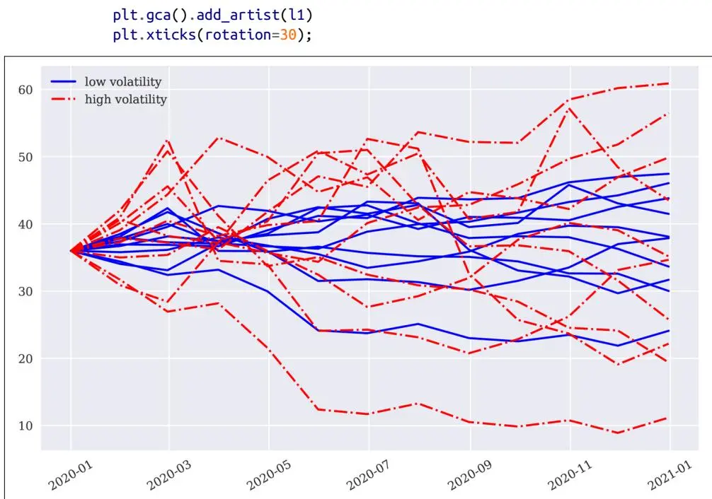
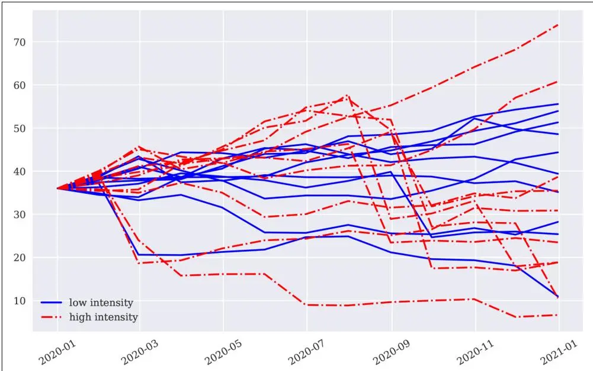
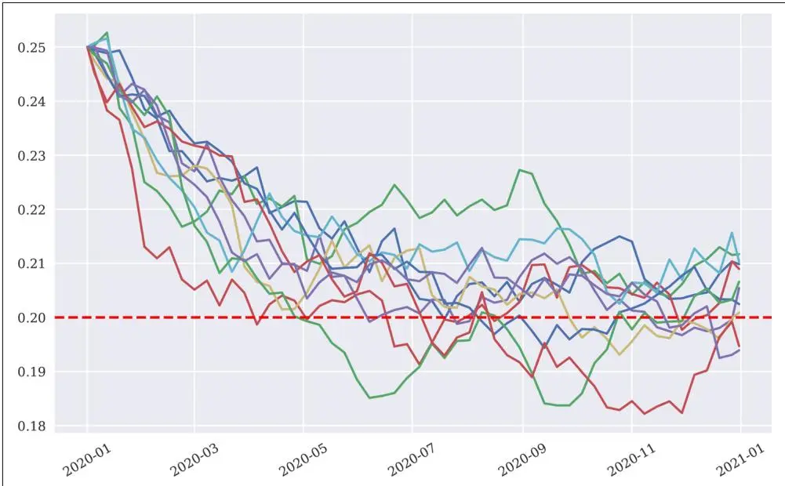

# 金融模型模拟（Simulation of Financial Models）


科学的目的不是分析或描述，而是建立有用的世界模型。

—Edward de Bono


[第12章](ch12.md) 详细介绍了使用 Python 和 NumPy 对随机过程进行蒙特卡洛模拟的方法。本章将应用那里介绍的基本技术来实现模拟类，作为 DX 包的核心组件。随机过程集合限制为三种广泛使用的过程。具体而言，本章包括以下部分：

"随机数生成" 第572页

本节开发了一个使用方差缩减技术生成标准正态分布随机数的函数。<sup>1</sup>

"通用模拟类" 第574页

本节开发了一个通用模拟类，其他特定的模拟类从中继承基本属性和方法。

"几何布朗运动" 第577页

本节讨论几何布朗运动（geometric Brownian motion, GBM），该过程通过 Black 和 Scholes (1973) 及 Merton (1973) 的开创性工作被引入期权定价文献；尽管它存在已知的缺陷且越来越多的实证证据对其不利，但它在本章中多次使用，并仍然是期权和衍生品估值的基准过程。

```perl
#
### DX 包
#
### 框架 -- 随机数生成
#
**sn_random_numbers.py**
#


#
import numpy as np
```

"跳跃扩散" 第582页

由 Merton (1976) 引入金融学的跳跃扩散（jump diffusion），在 GBM 的基础上增加了一个对数正态分布的跳跃分量。这允许考虑如下事实：例如，短期虚值（out-of-the-money, OTM）期权往往似乎已将较大跳跃的可能性定价在内；换句话说，依赖 GBM 作为金融模型往往无法令人满意地解释此类 OTM 期权的市场价值，而跳跃扩散可能能够做到。

## "平方根扩散" 第587页

由 Cox、Ingersoll 和 Ross (1985) 在金融学中推广的平方根扩散（square-root diffusion），用于建模利率和波动率等均值回归量；除了具有均值回归特性外，该过程保持正值，这通常是这些量所期望的特征。

关于本章介绍的模型模拟的更多细节，请参阅 Hilpisch (2015)。特别是，该书包含一个基于 Merton (1976) 跳跃扩散模型的完整案例研究。

## 随机数生成（Random Number Generation）

随机数生成是蒙特卡洛模拟的核心任务。<sup>2</sup> [第12章](ch12.md) 展示了如何使用 Python 及其子包（如 numpy.random）生成不同分布的随机数。对于当前项目，标准正态分布随机数是最重要的。因此，有一个便捷函数 sn\_random\_numbers() 可供使用，用于生成这类随机数：

```python
def sn_random_numbers(shape, antithetic=True, moment_matching=True,
                      fixed_seed=False):
    ''' 返回形状为 shape 的 ndarray 对象，包含标准正态分布的（伪）随机数。

    参数（Parameters）
    ====================
    shape: tuple (o, n, m)
        生成形状为 (o, n, m) 的数组
    antithetic: Boolean
        是否生成对偶变量
    moment_matching: Boolean
        是否匹配一阶和二阶矩
    fixed_seed: Boolean
        是否固定随机种子

    结果（Results）
    ======
    ran: (o, n, m) 数组的（伪）随机数
    '''
    if fixed_seed:
        np.random.seed(1000)
    if antithetic:
        ran = np.random.standard_normal(
            (shape[0], shape[1], shape[2] // 2))
        ran = np.concatenate((ran, -ran), axis=2)
    else:
        ran = np.random.standard_normal(shape)
    if moment_matching:
        ran = ran - np.mean(ran)
        ran = ran / np.std(ran)
    if shape[0] == 1:
        return ran[0]
    else:
        return ran
```

该函数中使用的方差缩减技术，即对偶路径（antithetic paths）和矩匹配（moment matching），也在[第12章](ch12.md)中进行了说明。<sup>3</sup> 该函数的应用非常简单：

```python
In [26]: from sn_random_numbers import sn_random_numbers

In [27]: snrn = sn_random_numbers((2, 2, 2), antithetic=False,
                                  moment_matching=False, fixed_seed=True)
    snrn
Out[27]: array([[[-0.8044583, 0.32093155],
                 [-0.02548288, 0.64432383]],

                [[-0.30079667, 0.38947455],
                 [-0.1074373, -0.47998308]]])

In [28]: round(snrn.mean(), 6)
Out[28]: -0.045429

In [29]: round(snrn.std(), 6)
Out[29]: 0.451876

In [30]: snrn = sn_random_numbers((2, 2, 2), antithetic=False,
                                  moment_matching=True, fixed_seed=True)
    snrn
Out[30]: array([[[-1.67972865, 0.81075283],
                 [0.04413963, 1.52641815]],

                [[-0.56512826, 0.96243813],
                 [-0.13722505, -0.96166678]]])

In [31]: round(snrn.mean(), 6)
Out[31]: -0.0

In [32]: round(snrn.std(), 6)
Out[32]: 1.0
```

该函数将是后续模拟类的主力工具。

## 通用模拟类（Generic Simulation Class）

面向对象建模——如[第6章](ch06.md)所述——允许继承属性和方法。以下代码在构建模拟类时就利用了这一点：从一个包含所有模拟类共享的属性和方法的通用模拟类开始，然后专注于待模拟随机过程的特定元素。

任何模拟类的对象实例化只需提供三个属性：

**name**

一个 str 对象，作为模型模拟对象的名称

**mar\_env**

一个 dx.market\_environment 类的实例

**corr**

一个标志（bool），指示该对象是否相关

这再次说明了市场环境的作用：一次性提供模拟和估值所需的所有数据和对象。通用类的方法有：

### generate\_time\_grid()

该方法生成模拟所使用的相关日期的时间网格；此任务对所有模拟类都是相同的。

### get\_instrument\_values()

每个模拟类必须返回包含模拟工具值（例如模拟股票价格、商品价格、波动率）的 ndarray 对象。

以下是通用模型模拟类的代码。这些方法使用了其他特定于模型的类将提供的方法，如 self.generate\_paths()。这方面的细节在拥有一个专门的、非通用模拟类的完整图景时会变得清晰。首先是基类：

```python
#
### DX 包
#
### 模拟类 -- 基类
#
**simulation_class.py**
#


#
import numpy as np
import pandas as pd

class simulation_class(object):
    ''' 为模拟类提供基础方法。

    属性（Attributes）
    ========
    name: str
        对象名称
    mar_env: instance of market_environment
        用于模拟的市场环境数据
    corr: bool
        如果与其他模型对象相关则为 True

    方法（Methods）
    ========
    generate_time_grid:
        返回模拟的时间网格
    get_instrument_values:
        返回当前工具值（数组）
    '''

    def __init__(self, name, mar_env, corr):
        self.name = name
        self.pricing_date = mar_env.pricing_date
        self.initial_value = mar_env.get_constant('initial_value')
        self.volatility = mar_env.get_constant('volatility')
        self.final_date = mar_env.get_constant('final_date')
        self.currency = mar_env.get_constant('currency')
        self.frequency = mar_env.get_constant('frequency')
        self.paths = mar_env.get_constant('paths')
        self.discount_curve = mar_env.get_curve('discount_curve')

        try:
            # 如果 mar_env 中有 time_grid 则使用该对象
            # （用于投资组合估值）
            self.time_grid = mar_env.get_list('time_grid')
        except:
            self.time_grid = None

        try:
            # 如果有特殊日期，则添加这些日期
            self.special_dates = mar_env.get_list('special_dates')
        except:
            self.special_dates = []
        self.instrument_values = None
        self.correlated = corr

        if corr is True:
            # 仅在投资组合上下文中需要，
            # 当风险因子相关时
            self.cholesky_matrix = mar_env.get_list('cholesky_matrix')
            self.rn_set = mar_env.get_list('rn_set')[self.name]
            self.random_numbers = mar_env.get_list('random_numbers')

    def generate_time_grid(self):
        start = self.pricing_date
        end = self.final_date
        # pandas date_range 函数
        # freq 例如 'B' 表示工作日，
        # 'W' 表示周，'M' 表示月
        time_grid = pd.date_range(start=start, end=end,
                                  freq=self.frequency).to_pydatetime()
        time_grid = list(time_grid)
        # 通过 start、end 和 special_dates 增强 time_grid
        if start not in time_grid:
            time_grid.insert(0, start)  # 如果不在列表中则插入开始日期
        if end not in time_grid:
            time_grid.append(end)  # 如果不在列表中则插入结束日期
        if len(self.special_dates) > 0:
            # 添加所有特殊日期
            time_grid.extend(self.special_dates)
        # 删除重复项
        time_grid = list(set(time_grid))
        # 排序列表
        time_grid.sort()
        self.time_grid = np.array(time_grid)

    def get_instrument_values(self, fixed_seed=True):
        if self.instrument_values is None:
            # 仅在无工具值时启动模拟
            self.generate_paths(fixed_seed=fixed_seed, day_count=365.)
        elif fixed_seed is False:
            # 当 fixed_seed 为 False 时也重新模拟
            self.generate_paths(fixed_seed=fixed_seed, day_count=365.)
        return self.instrument_values
```

市场环境的解析嵌入在特殊方法 \_\_init\_\_() 中，该方法在实例化时被调用。为了保持代码简洁，没有实现健全性检查。例如，以下代码行被视为"成功"，无论其内容是否是贴现类的实例。因此，在编译和传递 dx.market\_environment 对象给任何模拟类时必须相当小心：

表18-1显示了通用模拟类（因此也是所有其他模拟类）的 dx.market\_environment 对象必须包含的所有组件。

**表18-1. 所有模拟类的市场环境元素**

<table><tr><td>元素</td><td>类型</td><td>必填</td><td>描述</td></tr><tr><td>initial_value</td><td>Constant</td><td>是</td><td>在 pricing_date 的过程初始值</td></tr><tr><td>volatility</td><td>Constant</td><td>是</td><td>过程的波动率系数</td></tr><tr><td>final_date</td><td>Constant</td><td>是</td><td>模拟时间范围</td></tr><tr><td>currency</td><td>Constant</td><td>是</td><td>金融实体的货币</td></tr><tr><td>frequency</td><td>Constant</td><td>是</td><td>日期频率，与 pandas freq 参数一致</td></tr><tr><td>paths</td><td>Constant</td><td>是</td><td>待模拟的路径数量</td></tr><tr><td>discount_curve</td><td>Curve</td><td>是</td><td>dx.constant_short_rate 的实例</td></tr><tr><td>time_grid</td><td>List</td><td>否</td><td>相关日期的时间网格（在投资组合上下文中）</td></tr><tr><td>random_numbers</td><td>List</td><td>否</td><td>随机数 np.ndarray 对象（用于相关对象）</td></tr><tr><td>cholesky_matrix</td><td>List</td><td>否</td><td>Cholesky 矩阵（用于相关对象）</td></tr><tr><td>rn_set</td><td>List</td><td>否</td><td>指向相关随机数集的 dict 对象</td></tr></table>

所有与模型模拟对象相关性有关的内容将在后续章节中解释。本章的重点是单个不相关过程的模拟。类似地，传递 time\_grid 的选项仅在投资组合上下文中相关，这也在后面解释。

## 几何布朗运动（Geometric Brownian Motion）

几何布朗运动是一个随机过程，如方程18-1所述（另见[第12章](ch12.md)中的方程12-2，特别是参数和变量的含义）。该过程的漂移已经设定等于无风险常数短期利率 r，这意味着我们在等价鞅测度下操作（参见[第17章](ch17.md)）。

**方程18-1. 几何布朗运动的随机微分方程**

$$ $$
d S_{t} = r S_{t} d t + \sigma S_{t} d Z_{t}

方程18-2给出了用于模拟的欧拉离散化（Euler discretization）（更多细节见[第12章](ch12.md)中的方程12-3）。总体框架是一个离散时间市场模型，例如[第17章](ch17.md)中的一般市场模型 ℳ，具有一组有限的相关日期 $0 < t_{1} < t_{2} < ... < T$。

**方程18-2. 用于模拟几何布朗运动的差分方程**

$$ $$
\begin{array}{r l r} {S_{t_{m + 1}}} & = & {S_{t_{m}} \exp \left(\left(r - \frac{\sigma^{2}}{2}\right) (t_{m + 1} - t_{m}) + \sigma \sqrt{t_{m + 1} - t_{m}} z_{t}\right)} \\ {0} & \leq & {t_{m} < t_{m + 1} \leq T} \end{array}

### 模拟类（The Simulation Class）

以下是 GBM 模型的专门类：

```python
#
### DX 包
#
### 模拟类 -- 几何布朗运动
#
**geometric_brownian_motion.py**
#


#
import numpy as np

from sn_random_numbers import sn_random_numbers
from simulation_class import simulation_class

class geometric_brownian_motion(simulation_class):
    ''' 基于 Black-Scholes-Merton 几何布朗运动模型生成模拟路径的类。

    属性（Attributes）
    ========
    name: string
        对象名称
    mar_env: instance of market_environment
        用于模拟的市场环境数据
    corr: Boolean
        如果与其他模型模拟对象相关则为 True

    方法（Methods）
    ======
    update:
        更新参数
    generate_paths:
        根据市场环境返回蒙特卡洛路径
    '''

    def __init__(self, name, mar_env, corr=False):
        super(geometric_brownian_motion, self).__init__(name, mar_env, corr)

    def update(self, initial_value=None, volatility=None, final_date=None):
        if initial_value is not None:
            self.initial_value = initial_value
        if volatility is not None:
            self.volatility = volatility
        if final_date is not None:
            self.final_date = final_date
        self.instrument_values = None

    def generate_paths(self, fixed_seed=False, day_count=365.):
        if self.time_grid is None:
            # 来自通用模拟类的方法
            self.generate_time_grid()
        # 时间网格的日期数量
        M = len(self.time_grid)
        # 路径数量
        I = self.paths
        # 用于路径模拟的 ndarray 初始化
        paths = np.zeros((M, I))
        # 用 initial_value 初始化第一个日期
        paths[0] = self.initial_value
        if not self.correlated:
            # 如果不相关，生成随机数
            rand = sn_random_numbers((1, M, I),
                                     fixed_seed=fixed_seed)
        else:
            # 如果相关，使用市场环境中提供的随机数对象
            rand = self.random_numbers
        short_rate = self.discount_curve.short_rate
        # 获取用于过程漂移的短期利率
        for t in range(1, len(self.time_grid)):
            # 从相关随机数集中选择正确的时间切片
            if not self.correlated:
                ran = rand[t]
            else:
                ran = np.dot(self.cholesky_matrix, rand[:, t, :])
                ran = ran[self.rn_set]
            # 两个日期之差，以年分数表示
            dt = (self.time_grid[t] - self.time_grid[t - 1]).days / day_count
            # 生成相应日期的模拟值
            paths[t] = paths[t - 1] * np.exp(
                (short_rate - 0.5 * self.volatility ** 2) * dt
                + self.volatility * np.sqrt(dt) * ran)
        self.instrument_values = paths
```

在这种特定情况下，dx.market\_environment 对象只需包含表18-1中所示的数据和对象——即最小的组件集合。

方法 update() 如其名称所示：它允许更新模型中选定的重要参数。方法 generate\_paths() 当然稍微复杂一些。然而，它包含许多内联注释，应该能阐明最重要的方面。该方法的一些复杂性来自原则上允许不同模型模拟对象之间的相关性——其目的将在后续章节中变得清晰，尤其是在[第20章](ch20.md)中。

### 一个使用案例（A Use Case）

以下交互式 IPython 会话说明了 GBM 模拟类的使用。首先，需要生成一个包含所有必填元素的 dx.market\_environment 对象：

```python
In [33]: from dx_frame import *

In [34]: me_gbm = market_environment('me_gbm', dt.datetime(2020, 1, 1))

In [35]: me_gbm.add_constant('initial_value', 36.)
    me_gbm.add_constant('volatility', 0.2)
    me_gbm.add_constant('final_date', dt.datetime(2020, 12, 31))
    me_gbm.add_constant('currency', 'EUR')
    me_gbm.add_constant('frequency', 'M')  # ① 月频，默认月末
    me_gbm.add_constant('paths', 10000)

In [36]: csr = constant_short_rate('csr', 0.06)

In [37]: me_gbm.add_curve('discount_curve', csr)
```

第二，实例化一个模型模拟对象以供使用：

```javascript
In [38]: from geometric_brownian_motion import geometric_brownian_motion

In [39]: gbm = geometric_brownian_motion('gbm', me_gbm)  # ① 实例化模拟对象

In [40]: gbm.generate_time_grid()  # ② 生成时间网格

In [41]: gbm.time_grid  # ③ 显示时间网格；注意初始日期已被添加
Out[41]: array([datetime.datetime(2020, 1, 1, 0, 0),
                datetime.datetime(2020, 1, 31, 0, 0),
                datetime.datetime(2020, 2, 29, 0, 0),
                datetime.datetime(2020, 3, 31, 0, 0),
                datetime.datetime(2020, 4, 30, 0, 0),
                datetime.datetime(2020, 5, 31, 0, 0),
                datetime.datetime(2020, 6, 30, 0, 0),
                datetime.datetime(2020, 7, 31, 0, 0),
                datetime.datetime(2020, 8, 31, 0, 0),
                datetime.datetime(2020, 9, 30, 0, 0),
                datetime.datetime(2020, 10, 31, 0, 0),
                datetime.datetime(2020, 11, 30, 0, 0),
                datetime.datetime(2020, 12, 31, 0, 0)], dtype=object)

In [42]: %time paths_1 = gbm.get_instrument_values()  # ④ 在给定参数化下模拟路径
CPU times: user 21.3 ms, sys: 6.74 ms, total: 28.1 ms
Wall time: 40.3 ms

In [43]: paths_1.round(3)  # ④
Out[43]: array([[36.   , 36.   , 36.   , ..., 36.   , 36.   , 36.   ],
                [37.403, 38.12 , 34.4  , ..., 36.252, 35.084, 39.668],
                [39.562, 42.335, 32.405, ..., 34.836, 33.637, 37.655],
                ...,
                [40.534, 33.506, 23.497, ..., 37.851, 30.122, 30.446],
                [42.527, 36.995, 21.885, ..., 36.014, 30.907, 30.712],
                [43.811, 37.876, 24.1  , ..., 36.263, 28.138, 29.038]])

In [44]: gbm.update(volatility=0.5)  # ⑤ 更新波动率参数

In [45]: %time paths_2 = gbm.get_instrument_values()  # ⑤ 重复模拟
CPU times: user 27.8 ms, sys: 3.91 ms, total: 31.7 ms
Wall time: 19.8 ms
```

图18-1显示了两种不同参数化下的10条模拟路径。增加波动率参数值的效果显而易见：

```python
In [46]: plt.figure(figsize=(10, 6))
    p1 = plt.plot(gbm.time_grid, paths_1[:, :10], 'b')
    p2 = plt.plot(gbm.time_grid, paths_2[:, :10], 'r-.')
    l1 = plt.legend([p1[0], p2[0]],
                    ['低波动率', '高波动率'], loc=2)
```

图18-1 来自GBM模拟类的模拟路径




### 模拟向量化（Vectorization for Simulation）

正如[第12章](ch12.md)中已经论证和展示的那样，使用 NumPy 和 pandas 的向量化方法非常适合编写简洁且高性能的模拟代码。

## 跳跃扩散（Jump Diffusion）

有了 dx.geometric\_brownian\_motion 类的背景知识，现在可以直截了当地实现 Merton (1976) 描述的跳跃扩散模型的类。跳跃扩散模型的随机微分方程如方程18-3所示（另见[第12章](ch12.md)中的方程12-8，特别是参数和变量的含义）。

**方程18-3. Merton 跳跃扩散模型的随机微分方程**

$$ $$
d S_{t} = (r - r_{J}) S_{t} d t + \sigma S_{t} d Z_{t} + J_{t} S_{t} d N_{t}

方程18-4给出了用于模拟的欧拉离散化（详见[第12章](ch12.md)中的方程12-9及更详细的解释）。

**方程18-4. Merton 跳跃扩散模型的欧拉离散化**

$$ $$
\begin{array}{r c l} S_{t_{m + 1}} & = & S_{t_{m}} \Big (\exp \left(\left(r - r_{J} - \frac{\sigma^{2}}{2}\right) (t_{m + 1} - t_{m}) + \sigma \sqrt{t_{m + 1} - t_{m}} z_{t} ^{1}\right) + \left(e^{\mu_{J} + \delta z_{t} ^{2}} - 1\right) y_{t} \Big) \\ 0 & \leq & t_{m} < t_{m + 1} \leq T \end{array}

### 模拟类（The Simulation Class）

以下是 dx.jump\_diffusion 模拟类的 Python 代码。到目前为止，这个类应该不会让人感到意外。当然，模型不同，但设计和方法本质上是相同的：

```python
#
### DX 包
#
### 模拟类 -- 跳跃扩散
#
**jump_diffusion.py**
#


#
import numpy as np

from sn_random_numbers import sn_random_numbers
from simulation_class import simulation_class

class jump_diffusion(simulation_class):
    ''' 基于 Merton (1976) 跳跃扩散模型生成模拟路径的类。

    属性（Attributes）
    ========
    name: str
        对象名称
    mar_env: instance of market_environment
        用于模拟的市场环境数据
    corr: bool
        如果与其他模型对象相关则为 True

    方法（Methods）
    ========
    update:
        更新参数
    generate_paths:
        根据市场环境返回蒙特卡洛路径
    '''

    def __init__(self, name, mar_env, corr=False):
        super(jump_diffusion, self).__init__(name, mar_env, corr)
        # 需要的额外参数
        self.lamb = mar_env.get_constant('lambda')
        self.mu = mar_env.get_constant('mu')
        self.delt = mar_env.get_constant('delta')

    def update(self, initial_value=None, volatility=None, lamb=None,
               mu=None, delta=None, final_date=None):
        if initial_value is not None:
            self.initial_value = initial_value
        if volatility is not None:
            self.volatility = volatility
        if lamb is not None:
            self.lamb = lamb
        if mu is not None:
            self.mu = mu
        if delta is not None:
            self.delt = delta
        if final_date is not None:
            self.final_date = final_date
        self.instrument_values = None

    def generate_paths(self, fixed_seed=False, day_count=365):
        if self.time_grid is None:
            # 来自通用模拟类的方法
            self.generate_time_grid()
        # 时间网格的日期数量
        M = len(self.time_grid)
        # 路径数量
        I = self.paths
        # 用于路径模拟的 ndarray 初始化
        paths = np.zeros((M, I))
        # 用 initial_value 初始化第一个日期
        paths[0] = self.initial_value
        if self.correlated is False:
            # 如果不相关，生成随机数
            sn1 = sn_random_numbers((1, M, I),
                                    fixed_seed=fixed_seed)
        else:
            # 如果相关，使用市场环境中提供的随机数对象
            sn1 = self.random_numbers

        # 用于跳跃分量的标准正态分布伪随机数
        sn2 = sn_random_numbers((1, M, I),
                                fixed_seed=fixed_seed)

        rj = self.lamb * (np.exp(self.mu + 0.5 * self.delt ** 2) - 1)
        short_rate = self.discount_curve.short_rate
        for t in range(1, len(self.time_grid)):
            # 从相关随机数集中选择正确的时间切片
            if self.correlated is False:
                ran = sn1[t]
            else:
                # 仅在投资组合上下文中相关时使用
                ran = np.dot(self.cholesky_matrix, sn1[:, t, :])
                ran = ran[self.rn_set]
            # 两个日期之差，以年分数表示
            dt = (self.time_grid[t] - self.time_grid[t - 1]).days / day_count
            # 跳跃分量的泊松分布伪随机数
            poi = np.random.poisson(self.lamb * dt, I)
            paths[t] = paths[t - 1] * (
                np.exp((short_rate - rj - 0.5 * self.volatility ** 2) * dt
                       + self.volatility * np.sqrt(dt) * ran) +
                (np.exp(self.mu + self.delt * sn2[t]) - 1) * poi)
        self.instrument_values = paths
```

当然，由于这是一个不同的模型，它需要 dx.market\_environment 对象中不同的元素集。除了通用模拟类所需的元素（见表18-1）之外，还需要三个参数，如表18-2所示：即对数正态跳跃分量的参数 lambda、mu 和 delta。

**表18-2. dx.jump\_diffusion 类市场环境的特定元素**

<table><tr><td>元素</td><td>类型</td><td>必填</td><td>描述</td></tr><tr><td>lambda</td><td>Constant</td><td>是</td><td>跳跃强度（年化概率）</td></tr><tr><td>mu</td><td>Constant</td><td>是</td><td>期望跳跃幅度</td></tr><tr><td>delta</td><td>Constant</td><td>是</td><td>跳跃幅度的标准差</td></tr></table>

由于跳跃分量的存在，该类在生成路径时需要额外的随机数。方法 generate\_paths() 中的内联注释标明了生成这些额外随机数的两个位置。关于泊松分布随机数的生成，另见[第12章](ch12.md)。

### 一个使用案例（A Use Case）

以下交互式会话说明了如何使用模拟类 dx.jump\_diffusion。之前为 GBM 对象定义的 dx.market\_environment 对象被用作基础：

```python
In [47]: me_jd = market_environment('me_jd', dt.datetime(2020, 1, 1))

In [48]: me_jd.add_constant('lambda', 0.3)
    me_jd.add_constant('mu', -0.75)    # ①
    me_jd.add_constant('delta', 0.1)   # ①

In [49]: me_jd.add_environment(me_gbm)  # ② 将完整环境添加到现有环境

In [50]: from jump_diffusion import jump_diffusion

In [51]: jd = jump_diffusion('jd', me_jd)

In [52]: %time paths_3 = jd.get_instrument_values()  # ③ 使用基础参数模拟路径
CPU times: user 28.6 ms, sys: 4.37 ms, total: 33 ms
Wall time: 49.4 ms

In [53]: jd.update(lamb=0.9)  # ④ 增加跳跃强度参数

In [54]: %time paths_4 = jd.get_instrument_values()  # ⑤ 使用更新后的参数模拟路径
CPU times: user 29.7 ms, sys: 3.58 ms, total: 33.3 ms
Wall time: 66.7 ms
```

图18-2比较了来自低强度和高强度（跳跃概率）两组参数的一些模拟路径。图中可以很容易地看到低强度情况下的几个跳跃和高强度情况下的多个跳跃：

```python
In [55]: plt.figure(figsize=(10, 6))
    p1 = plt.plot(gbm.time_grid, paths_3[:, :10], 'b')
    p2 = plt.plot(gbm.time_grid, paths_4[:, :10], 'r-.')
    l1 = plt.legend([p1[0], p2[0]],
                    ['低强度', '高强度'], loc=3)
plt.gca().add_artist(l1)
plt.xticks(rotation=30);
```

图18-2 来自跳跃扩散模拟类的模拟路径



## 平方根扩散（Square-Root Diffusion）

第三个要模拟的随机过程是平方根扩散，例如 Cox、Ingersoll 和 Ross (1985) 用于建模随机短期利率的过程。方程18-5显示了该过程的随机微分方程（更多细节见[第12章](ch12.md)中的方程12-4）。

**方程18-5. 平方根扩散的随机微分方程**

$$ $$
d x_{t} = \kappa (\theta - x_{t}) d t + \sigma \sqrt{x_{t}} d Z_{t}

代码使用方程18-6所示的离散化方案（另见[第12章](ch12.md)中的方程12-5，以及方程12-6中的替代精确方案）。

**方程18-6. 平方根扩散的欧拉离散化（完全截断方案）**

$$ $$
\begin{array}{r l r} \tilde{x}_{t_{m + 1}} & = & \tilde{x}_{t_{m}} + \kappa (\theta - \tilde{x}_{s}^{+}) (t_{m + 1} - t_{m}) + \sigma \sqrt{\tilde{x}_{s}^{+}} \sqrt{t_{m + 1} - t_{m}} z_{t} \\ x_{t_{m + 1}} & = & \tilde{x}_{t_{m^{\prime} 1}}^{'} \end{array}

### 模拟类（The Simulation Class）

以下是 dx.square\_root\_diffusion 模拟类的 Python 代码，这是第三个也是最后一个类。当然，除了不同的模型和离散化方案之外，该类与另外两个专门类相比没有包含任何新内容：

```python
#
### DX 包
#
### 模拟类 -- 平方根扩散
#
**square_root_diffusion.py**
#


#
import numpy as np

from sn_random_numbers import sn_random_numbers
from simulation_class import simulation_class

class square_root_diffusion(simulation_class):
    ''' 基于 Cox-Ingersoll-Ross (1985) 平方根扩散模型生成模拟路径的类。

    属性（Attributes）
    =======
    name : string
        对象名称
    mar_env : instance of market_environment
        用于模拟的市场环境数据
    corr : Boolean
        如果与其他模型对象相关则为 True

    方法（Methods）
    ======
    update :
        更新参数
    generate_paths :
        根据市场环境返回蒙特卡洛路径
    '''

    def __init__(self, name, mar_env, corr=False):
        super(square_root_diffusion, self).__init__(name, mar_env, corr)
        # 需要的额外参数
        self.kappa = mar_env.get_constant('kappa')
        self.theta = mar_env.get_constant('theta')

    def update(self, initial_value=None, volatility=None, kappa=None,
               theta=None, final_date=None):
        if initial_value is not None:
            self.initial_value = initial_value
        if volatility is not None:
            self.volatility = volatility
        if kappa is not None:
            self.kappa = kappa
        if theta is not None:
            self.theta = theta
        if final_date is not None:
            self.final_date = final_date
        self.instrument_values = None

    def generate_paths(self, fixed_seed=True, day_count=365.):
        if self.time_grid is None:
            self.generate_time_grid()
        M = len(self.time_grid)
        I = self.paths
        paths = np.zeros((M, I))
        paths_ = np.zeros_like(paths)
        paths[0] = self.initial_value
        paths_[0] = self.initial_value
        if self.correlated is False:
            rand = sn_random_numbers((1, M, I),
                                     fixed_seed=fixed_seed)
        else:
            rand = self.random_numbers

        for t in range(1, len(self.time_grid)):
            dt = (self.time_grid[t] - self.time_grid[t - 1]).days / day_count
            if self.correlated is False:
                ran = rand[t]
            else:
                ran = np.dot(self.cholesky_matrix, rand[:, t, :])
                ran = ran[self.rn_set]

            # 完全截断欧拉离散化
            paths_[t] = (paths_[t - 1] +
                         self.kappa * (self.theta - np.maximum(0, paths_[t - 1, :])) * dt +
                         np.sqrt(np.maximum(0, paths_[t - 1, :])) *
                         self.volatility * np.sqrt(dt) * ran)
            paths[t] = np.maximum(0, paths_[t])
        self.instrument_values = paths
```

表18-3列出了该类特有的两个市场环境元素。

**表18-3. dx.square\_root\_diffusion 类市场环境的特定元素**

<table><tr><td>元素</td><td>类型</td><td>必填</td><td>描述</td></tr><tr><td>kappa</td><td>Constant</td><td>是</td><td>均值回归因子</td></tr><tr><td>theta</td><td>Constant</td><td>是</td><td>过程的长期均值</td></tr></table>


### 一个使用案例（A Use Case）

一个简短的例子说明了该模拟类的使用。像往常一样，需要一个市场环境，例如用于建模波动率（指数）过程：

```python
In [56]: me_srd = market_environment('me_srd', dt.datetime(2020, 1, 1))  # ①

In [57]: me_srd.add_constant('initial_value', .25)
    me_srd.add_constant('volatility', 0.05)
    me_srd.add_constant('final_date', dt.datetime(2020, 12, 31))
    me_srd.add_constant('currency', 'EUR')
    me_srd.add_constant('frequency', 'W')
    me_srd.add_constant('paths', 10000)

In [58]: me_srd.add_constant('kappa', 4.0)
    me_srd.add_constant('theta', 0.2)

In [59]: me_srd.add_curve('discount_curve', constant_short_rate('r', 0.0))  # ②

In [60]: from square_root_diffusion import square_root_diffusion

In [61]: srd = square_root_diffusion('srd', me_srd)  # ③ 实例化对象

In [62]: srd_paths = srd.get_instrument_values()[:, :10]  # ④ 模拟路径并选择10条
```

图18-3 来自平方根扩散模拟类的模拟路径（虚线 = 长期均值 theta）

图18-3通过显示模拟路径平均回归到假设为0.2的长期均值 theta（虚线），说明了均值回归特性：

```matlab
In [63]: plt.figure(figsize=(10, 6))
    plt.plot(srd.time_grid, srd.get_instrument_values()[:, :10])
    plt.axhline(me_srd.get_constant('theta'), color='r', ls='--', lw=2.0)
    plt.xticks(rotation=30);
```



## 本章小结（Conclusion）

本章开发了模拟三个感兴趣的随机过程所需的所有工具和类：几何布朗运动、跳跃扩散和平方根扩散。本章介绍了一个方便生成标准正态分布随机数的函数。然后引入了一个通用模型模拟类。在此基础上，本章介绍了三个专门的模拟类，并展示了这些类的使用案例。

为了简化未来的导入，可以再次使用包装模块，这次称为 dx\_simulation.py：

```python
#
### DX 包
#
### 模拟函数与类
#
**dx_simulation.py**
#


#
import numpy as np
import pandas as pd

from dx_frame import *
from sn_random_numbers import sn_random_numbers
from simulation_class import simulation_class
from geometric_brownian_motion import geometric_brownian_motion
from jump_diffusion import jump_diffusion
from square_root_diffusion import square_root_diffusion
```

与第一个包装模块 dx\_frame.py 一样，其优点是一条导入语句即可使用所有模拟组件：

```txt
from dx_simulation import *
```

由于 dx\_simulation.py 也从 dx\_frame.py 导入了所有内容，因此这条导入语句实际上暴露了迄今为止开发的所有功能。对于 dx 文件夹中增强的 \_\_init\_\_.py 文件也是如此：

```python
#
### DX 包
### 打包文件
**__init__.py**
#
import numpy as np
import pandas as pd
import datetime as dt

# 框架
from get_year_deltas import get_year_deltas
from constant_short_rate import constant_short_rate
from market_environment import market_environment

# 模拟
from sn_random_numbers import sn_random_numbers
from simulation_class import simulation_class
from geometric_brownian_motion import geometric_brownian_motion
from jump_diffusion import jump_diffusion
from square_root_diffusion import square_root_diffusion
```

## 延伸阅读（Further Resources）

本章所涵盖主题的参考书籍包括：

• Glasserman, Paul (2004). Monte Carlo Methods in Financial Engineering. New York: Springer.

• Hilpisch, Yves (2015). Derivatives Analytics with Python. Chichester, England: Wiley Finance.

本章引用的原创论文包括：

• Black, Fischer, and Myron Scholes (1973). "The Pricing of Options and Corporate Liabilities." Journal of Political Economy, Vol. 81, No. 3, pp. 638–659.

• Cox, John, Jonathan Ingersoll, and Stephen Ross (1985). "A Theory of the Term Structure of Interest Rates." Econometrica, Vol. 53, No. 2, pp. 385–407.

• Merton, Robert (1973). "Theory of Rational Option Pricing." Bell Journal of Economics and Management Science, Vol. 4, pp. 141–183.

• Merton, Robert (1976). "Option Pricing When the Underlying Stock Returns Are Discontinuous." Journal of Financial Economics, Vol. 3, No. 3, pp. 125–144.
