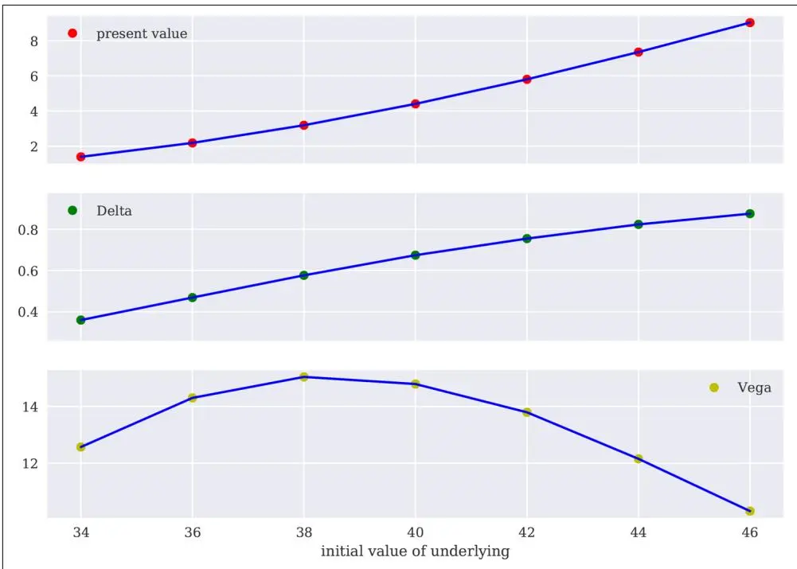
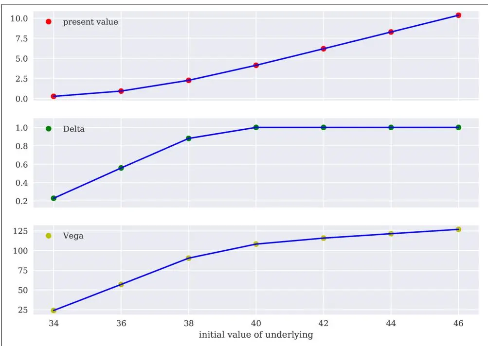

# 衍生品估值（Derivatives Valuation）


衍生品是一个庞大而复杂的问题。

—Judd Gregg


长期以来，期权和衍生品估值一直是华尔街所谓的"火箭科学家"的领域——即拥有物理学或类似高难度学科学位的人。然而，通过蒙特卡洛模拟等数值方法应用模型通常比理论模型本身要简单一些。

对于欧式行权（European exercise）的期权和衍生品估值尤其如此——即只能在某个预定日期行权的情况。而对于美式行权（American exercise）的期权和衍生品，情况则稍微复杂一些，因为允许在预定时间段内的任何时间点行权。本章介绍并使用了最小二乘蒙特卡洛（Least-Squares Monte Carlo, LSM）算法，该算法已成为基于蒙特卡洛模拟的美式期权估值的基准算法。

本章的结构与[第18章](ch18.md)相似：首先介绍一个通用估值类，然后提供两个专门的估值类，一个用于欧式行权，另一个用于美式行权。通用估值类包含数值估计期权最重要希腊字母（Greeks）的方法：delta 和 vega。因此，估值类不仅对估值目的很重要，对风险管理目的也同样重要。

本章的结构如下：

"通用估值类" 第596页

本节介绍通用估值类，具体的估值类从中继承。

"欧式行权" 第600页

本节介绍用于欧式行权的期权和衍生品估值类。

"美式行权" 第606页

本节介绍用于美式行权的期权和衍生品估值类。

## 通用估值类（Generic Valuation Class）

与通用模拟类一样，实例化估值类对象只需提供少量输入（此处为四个）：

**name**

一个 str 对象，作为模型模拟对象的名称

**underlying**

一个模拟类的实例，代表标的资产

**mar\_env**

一个 dx.market\_environment 类的实例

**payoff\_func**

一个 Python str 对象，包含期权/衍生品的收益函数

通用类有三个方法：

**update()** 更新选定的估值参数（属性）

**delta()** 计算期权/衍生品 delta 的数值

**vega()** 计算期权/衍生品 vega 的数值

有了前几章关于 DX 包的背景知识，这里介绍的通用估值类应该几乎是自解释的；在适当的地方也提供了内联注释。再次，首先完整呈现该类，然后进行更详细的讨论：

```shell
#
### DX 包
#
### 估值 -- 基类
#
**valuation_class.py**
#
```

```python


#
class valuation_class(object):
    ''' 单因子估值的基础类。

    属性（Attributes）
    ========
    name: str
        对象名称
    underlying: instance of simulation class
        对单个风险因子进行建模的对象
    mar_env: instance of market_environment
        用于估值的市场环境数据
    payoff_func: str
        Python 语法的衍生品收益函数
        例如：'np.maximum(maturity_value - 100, 0)'
        其中 maturity_value 是包含标的资产相应值的 NumPy 向量
        例如：'np.maximum(instrument_values - 100, 0)'
        其中 instrument_values 是包含整个时间/路径网格上标的资产值的 NumPy 矩阵

    方法（Methods）
    ========
    update:
        更新选定的估值参数
    delta:
        返回衍生品的 delta
    vega:
        返回衍生品的 vega
    '''

    def __init__(self, name, underlying, mar_env, payoff_func=''):
        self.name = name
        self.pricing_date = mar_env.pricing_date
        try:
            # strike 是可选的
            self.strike = mar_env.get_constant('strike')
        except:
            pass
        self.maturity = mar_env.get_constant('maturity')
        self.currency = mar_env.get_constant('currency')
        # 来自模拟对象的模拟参数和贴现曲线
        self.frequency = underlying.frequency
        self.paths = underlying.paths
        self.discount_curve = underlying.discount_curve
        self.payoff_func = payoff_func
        self.underlying = underlying
        # 向标的对象提供 pricing_date 和 maturity
        self.underlying.special_dates.extend([self.pricing_date, self.maturity])

    def update(self, initial_value=None, volatility=None, strike=None,
               maturity=None):
        if initial_value is not None:
            self.underlying.update(initial_value=initial_value)
        if volatility is not None:
            self.underlying.update(volatility=volatility)
        if strike is not None:
            self.strike = strike
        if maturity is not None:
            self.maturity = maturity
            # 如果 time_grid 中没有新的到期日则添加
            if maturity not in self.underlying.time_grid:
                self.underlying.special_dates.append(maturity)
        self.underlying.instrument_values = None

    def delta(self, interval=None, accuracy=4):
        if interval is None:
            interval = self.underlying.initial_value / 50.
        # 前向差分近似
        # 计算数值 delta 的左值
        value_left = self.present_value(fixed_seed=True)
        # 右值的数值标的资产值
        initial_del = self.underlying.initial_value + interval
        self.underlying.update(initial_value=initial_del)
        # 计算数值 delta 的右值
        value_right = self.present_value(fixed_seed=True)
        # 重置模拟对象的 initial_value
        self.underlying.update(initial_value=initial_del - interval)
        delta = (value_right - value_left) / interval
        # 修正潜在的数值误差
        if delta < -1.0:
            return -1.0
        elif delta > 1.0:
            return 1.0
        else:
            return round(delta, accuracy)

    def vega(self, interval=0.01, accuracy=4):
        if interval < self.underlying.volatility / 50.:
            interval = self.underlying.volatility / 50.
        # 前向差分近似
        # 计算数值 vega 的左值
        value_left = self.present_value(fixed_seed=True)
        # 右值的数值波动率值
        vola_del = self.underlying.volatility + interval
        # 更新模拟对象
        self.underlying.update(volatility=vola_del)
        # 计算数值 vega 的右值
        value_right = self.present_value(fixed_seed=True)
        # 重置模拟对象的波动率值
        self.underlying.update(volatility=vola_del - interval)
        vega = (value_right - value_left) / interval
        return round(vega, accuracy)
```

通用 dx.valuation\_class 类涉及的一个主题是 Greeks 的估计。这值得仔细研究。为此，假设存在一个连续可微函数 $V(S_{0}, \sigma_{0})$ 表示期权的现值。期权的 delta 定义为对标的资产当前值 $S_{0}$ 的一阶偏导数，即 $\Delta = \frac{\partial V(\cdot)}{\partial S_{0}}$。

现在假设通过蒙特卡洛估值（见[第12章](ch12.md)及本章后续章节），可以得到期权价值的数值蒙特卡洛估计量 $\bar{V}(S_{0}, \sigma_{0})$。期权 delta 的数值近似由方程19-1给出。<sup>1</sup> 这就是通用估值类的 delta() 方法实现的内容。该方法假设存在一个 present\_value() 方法，可以在给定参数集的情况下返回蒙特卡洛估计量。

**方程19-1. 期权的数值 delta**

$$ $$
\bar{\Delta} = \frac{\bar{V}(S_{0} + \Delta S, \sigma_{0}) - \bar{V}(S_{0}, \sigma_{0})}{\Delta S}, \Delta S > 0

类似地，工具的 vega 定义为现值对当前（瞬时）波动率 $\sigma_{0}$ 的一阶偏导数，即 $\mathbf{V} = \frac{\partial V(\cdot)}{\partial \sigma_{0}}$。再次假设存在期权价值的蒙特卡洛估计量，方程19-2提供了 vega 的数值近似。这就是 dx.valuation\_class 类的 vega() 方法实现的内容。

**方程19-2. 期权的数值 vega**

$$ $$
\mathbf{V} = \frac{\bar{V}(S_{0}, \sigma_{0} + \Delta \sigma) - \bar{V}(S_{0}, \sigma_{0})}{\Delta \sigma}, \Delta \sigma > 0

需要注意的是，关于 delta 和 vega 的讨论仅基于存在一个可微函数或期权现值的蒙特卡洛估计量。这正是为什么可以在不了解蒙特卡洛估计量的精确定义和数值实现的情况下，定义数值估计这些量的方法。

## 欧式行权（European Exercise）

通用估值类特化的第一种情况是欧式行权。为此，考虑以下生成期权价值蒙特卡洛估计量的简化步骤：

1. 在风险中性测度下模拟相关的标的风险因子 S 共 I 次，得到期权到期日 T 的标的资产模拟值，即 $\bar{S}_{T}(i), i \in \{1, 2, ..., I\}$。

2. 对每个模拟的标的资产值计算期权到期日的收益 $h_{T}$，即 $h_{T}(\bar{S}_{T}(i)), i \in \{1, 2, ..., I\}$。

3. 推导期权现值的蒙特卡洛估计量为 $\bar{V}_{0} \equiv e^{-rT} \frac{1}{I} \sum_{i=1}^{I} h_{T}(\bar{S}_{T}(i))$。

### 估值类（The Valuation Class）

以下代码显示了基于上述步骤实现 present\_value() 方法的类。此外，它还包含 generate\_payoff() 方法，用于生成模拟路径和给定模拟路径下的期权收益。这当然构成了蒙特卡洛估计量的基础：

```python
#
### DX 包
#
### 估值 -- 欧式行权类
#
**valuation_mcs_european.py**
#


#
import numpy as np

from valuation_class import valuation_class

class valuation_mcs_european(valuation_class):
    ''' 通过单因子蒙特卡洛模拟对具有任意收益的欧式期权进行估值的类。

    方法（Methods）
    ======
    generate_payoff:
        根据路径和收益函数返回收益
    present_value:
        返回现值（蒙特卡洛估计量）
    '''

    def generate_payoff(self, fixed_seed=False):
        '''
        参数（Parameters）
        ======
        fixed_seed: bool
            使用相同/固定的随机种子进行估值
        '''
        try:
            # strike 是可选的
            strike = self.strike
        except:
            pass
        paths = self.underlying.get_instrument_values(fixed_seed=fixed_seed)
        time_grid = self.underlying.time_grid
        try:
            time_index = np.where(time_grid == self.maturity)[0]
            time_index = int(time_index)
        except:
            print('到期日不在标的资产的时间网格中。')
        maturity_value = paths[time_index]
        # 整个路径的平均值
        mean_value = np.mean(paths[:time_index], axis=1)
        # 整个路径的最大值
        max_value = np.amax(paths[:time_index], axis=1)[-1]
        # 整个路径的最小值
        min_value = np.amin(paths[:time_index], axis=1)[-1]
        try:
            payoff = eval(self.payoff_func)
            return payoff
        except:
            print('评估收益函数时出错。')

    def present_value(self, accuracy=6, fixed_seed=False, full=False):
        '''
        参数（Parameters）
        ======
        accuracy: int
            返回结果的小数位数
        fixed_seed: bool
            使用相同/固定的随机种子进行估值
        full: bool
            同时返回完整的现值一维数组
        '''
        cash_flow = self.generate_payoff(fixed_seed=fixed_seed)
        discount_factor = self.discount_curve.get_discount_factors(
            (self.pricing_date, self.maturity))[0, 1]
        result = discount_factor * np.sum(cash_flow) / len(cash_flow)
        if full:
            return round(result, accuracy), discount_factor * cash_flow
        else:
            return round(result, accuracy)
```

generate\_payoff() 方法提供了一些用于定义期权收益的特殊对象：

• **strike** 为期权的行权价。

• **maturity\_value** 表示一维 ndarray 对象，包含标的资产在期权到期日的模拟值。

• **mean\_value** 是从今天到到期日整个路径上标的资产的平均值。

• **max\_value** 是整个路径上标的资产的最大值。

• **min\_value** 是整个路径上标的资产的最小值。

最后三个对象允许有效处理具有亚式（即回望或路径依赖）特征的期权。


### 灵活的收益函数（Flexible Payoffs）

对欧式行权的期权和衍生品进行估值所采用的方法非常灵活，可以定义任意的收益函数。这允许对条件行权（conditional exercise）的衍生品（如期权）和无条件行权（unconditional exercise）的衍生品（如远期）进行建模。它还允许包含奇异收益元素，如回望特征。

### 一个使用案例（A Use Case）

估值类 dx.valuation\_mcs\_european 的应用最好通过一个具体的使用案例来说明。然而，在实例化估值类之前，需要有一个模拟对象的实例——即待估值期权的标的资产。从[第18章](ch18.md)开始，使用 dx.geometric\_brownian\_motion 类对标的资产进行建模：

```python
In [64]: me_gbm = market_environment('me_gbm', dt.datetime(2020, 1, 1))

In [65]: me_gbm.add_constant('initial_value', 36.)
    me_gbm.add_constant('volatility', 0.2)
    me_gbm.add_constant('final_date', dt.datetime(2020, 12, 31))
    me_gbm.add_constant('currency', 'EUR')
    me_gbm.add_constant('frequency', 'M')
    me_gbm.add_constant('paths', 10000)

In [66]: csr = constant_short_rate('csr', 0.06)

In [67]: me_gbm.add_curve('discount_curve', csr)

In [68]: gbm = geometric_brownian_motion('gbm', me_gbm)
```

除了模拟对象之外，还需要为期权本身定义一个市场环境。它至少需要包含到期日和货币。可选地，也可以包含行权价参数：

```python
In [69]: me_call = market_environment('me_call', me_gbm.pricing_date)

In [70]: me_call.add_constant('strike', 40.)
    me_call.add_constant('maturity', dt.datetime(2020, 12, 31))
    me_call.add_constant('currency', 'EUR')
```

当然，核心要素是收益函数，这里以包含 Python 代码的 str 对象提供，eval() 函数可以对其求值。这里对一个欧式看涨期权进行建模。这种期权的收益为 $h_{T} = \max(S_{T} - K, 0)$，其中 $S_{T}$ 是标的资产在到期日的价值，K 是期权的行权价。在 Python 和 NumPy 中——所有模拟值以向量化方式存储——其形式如下：

```python
In [71]: payoff_func = 'np.maximum(maturity_value - strike, 0)'
```

所有要素齐全后，就可以从 dx.valuation\_mcs\_european 类实例化一个对象。有了估值对象，所有关注的量只需一个方法调用即可获得：

```txt
In [72]: from valuation_mcs_european import valuation_mcs_european

In [73]: eur_call = valuation_mcs_european('eur_call', underlying=gbm,
                                           mar_env=me_call,
                                           payoff_func=payoff_func)

In [74]: %time eur_call.present_value()  # ① 估计欧式看涨期权的现值
CPU times: user 14.8 ms, sys: 4.06 ms, total: 18.9 ms
Wall time: 43.5 ms
Out[74]: 2.146828

In [75]: %time eur_call.delta()  # ② 数值估计期权的 delta；看涨期权的 delta 为正
CPU times: user 12.4 ms, sys: 2.68 ms, total: 15.1 ms
Wall time: 40.1 ms
Out[75]: 0.5155

In [76]: %time eur_call.vega()  # ③ 数值估计期权的 vega；看涨和看跌期权的 vega 均为正
CPU times: user 21 ms, sys: 2.72 ms, total: 23.7 ms
Wall time: 89.9 ms
Out[76]: 14.301
```

一旦估值对象被实例化，就可以轻松实现现值和 Greeks 的更全面分析。以下代码计算标的资产初始值从34到46欧元范围内的现值、delta 和 vega。结果如图19-1所示：

```python
In [77]: %%time
    s_list = np.arange(34., 46.1, 2.)
    p_list = []; d_list = []; v_list = []
    for s in s_list:
        eur_call.update(initial_value=s)
        p_list.append(eur_call.present_value(fixed_seed=True))
        d_list.append(eur_call.delta())
        v_list.append(eur_call.vega())
    CPU times: user 374 ms, sys: 8.82 ms, total: 383 ms
    Wall time: 609 ms

In [78]: from plot_option_stats import plot_option_stats

In [79]: plot_option_stats(s_list, p_list, d_list, v_list)
```

图19-1 欧式看涨期权的现值、delta 和 vega 估计



该可视化使用了辅助函数 plot\_option\_stats()：

```python
#
### DX 包
#
### 估值 -- 期权统计数据绘图
#
**plot_option_stats.py**
#


#
import matplotlib.pyplot as plt

def plot_option_stats(s_list, p_list, d_list, v_list):
    ''' 为不同标的资产初始值集合绘制期权价格、delta 和 vega。

    参数（Parameters）
    ========
    s_list: array or list
        标的资产初始值集合
    p_list: array or list
        现值
    d_list: array or list
        delta 结果
    v_list: array or list
        vega 结果
    '''
    plt.figure(figsize=(10, 7))
    sub1 = plt.subplot(311)
    plt.plot(s_list, p_list, 'ro', label='现值')
    plt.plot(s_list, p_list, 'b')
    plt.legend(loc=0)
    plt.setp(sub1.get_xticklabels(), visible=False)
    sub2 = plt.subplot(312)
    plt.plot(s_list, d_list, 'go', label='Delta')
    plt.plot(s_list, d_list, 'b')
    plt.legend(loc=0)
    plt.ylim(min(d_list) - 0.1, max(d_list) + 0.1)
    plt.setp(sub2.get_xticklabels(), visible=False)
    sub3 = plt.subplot(313)
    plt.plot(s_list, v_list, 'yo', label='Vega')
    plt.plot(s_list, v_list, 'b')
    plt.xlabel('标的资产初始值')
    plt.legend(loc=0)
```

这表明尽管涉及大量的数值计算，使用 DX 包工作归结为一种与拥有闭合形式期权定价公式相当的方法。然而，这种方法不仅适用于如此简单或"普通香草"的收益函数。使用完全相同的方法，可以处理更复杂的收益函数。

为此，考虑以下收益函数，它是常规收益和亚式收益的混合。处理和分析与之前相同，并且主要独立于收益函数的类型。图19-2显示，当标的资产初始值在本例中达到行权价40时，delta 变为1。标的资产初始值的每（边际）增加都会从这一点开始导致期权价值的相同（边际）增加：

```python
In [80]: payoff_func = 'np.maximum(0.33 *'
    payoff_func += '(maturity_value + max_value) - 40, 0)'  # ①

In [81]: eur_as_call = valuation_mcs_european('eur_as_call', underlying=gbm,
                                              mar_env=me_call,
                                              payoff_func=payoff_func)

In [82]: %%time
    s_list = np.arange(34., 46.1, 2.)
    p_list = []; d_list = []; v_list = []
    for s in s_list:
        eur_as_call.update(s)
        p_list.append(eur_as_call.present_value(fixed_seed=True))
        d_list.append(eur_as_call.delta())
        v_list.append(eur_as_call.vega())
    CPU times: user 319 ms, sys: 14.2 ms, total: 333 ms
    Wall time: 470 ms

In [83]: plot_option_stats(s_list, p_list, d_list, v_list)
```

图19-2 含亚式特征的期权的现值、delta 和 vega 估计

收益同时依赖于模拟的到期日价值和整个模拟路径的最大值。



## 美式行权（American Exercise）

美式行权或百慕大式行权（Bermudan exercise）的期权估值比欧式行权要复杂得多。<sup>2</sup> 因此，在详细介绍估值类之前，需要更多的估值理论知识。

### 最小二乘蒙特卡洛（Least-Squares Monte Carlo）

尽管 Cox、Ross 和 Rubinstein (1979) 通过他们的二叉树模型提出了一种在同一框架内对欧式和美式期权进行估值的简单数值方法，但直到 Longstaff-Schwartz (2001) 的方法出现，才令人满意地解决了通过蒙特卡洛模拟（MCS）对美式期权进行估值的问题。主要问题在于 MCS 本质上是一种前向推进算法，而美式期权的估值通常通过反向归纳（backward induction）来完成，从到期日开始估计美式期权的持续价值，然后反向工作到现在。

Longstaff-Schwartz (2001) 模型的主要洞见是使用普通最小二乘回归（ordinary least-squares regression），基于所有可用模拟值的横截面来估计持续价值。<sup>3</sup> 该算法对每条路径考虑：

• 标的资产的模拟值

• 期权的内涵价值（inner value）

• 给定特定路径的实际持续价值（continuation value）

在离散时间中，百慕大期权（极限情况下为美式期权）的价值由方程19-3给出的最优停时问题（optimal stopping problem）定义，其中考虑有限时间点集 $0 < t_{1} < t_{2} < ... < T$。<sup>4</sup>

**方程19-3. 百慕大期权的离散时间最优停时问题**

$$ $$
V_{0} = \sup_{\tau \in \{0, t_{1}, t_{2}, \dots, T\}} e^{-r\tau} \mathbf{E}_{0}^{Q}(h_{\tau}(S_{\tau}))

方程19-4给出了美式期权在日期 $0 \le t_{m} < T$ 的持续价值。它是日期 $t_{m}$ 在鞅测度下对美式期权价值 $V_{t_{m+1}}$ 在后续日期的风险中性期望。

**方程19-4. 美式期权的持续价值**

$$ $$
C_{t_{m}}(s) = e^{-r(t_{m+1} - t_{m})} \mathbf{E}_{t_{m}}^{Q}\bigl(V_{t_{m+1}}(S_{t_{m+1}}) \big| S_{t_{m}} = s\bigr)

可以证明，美式期权在日期 $t_{m}$ 的价值 $V_{t_{m}}$ 等于方程19-5中的公式——即立即行权的收益（内涵价值）与不行权的期望收益（持续价值）的最大值。

**方程19-5. 美式期权在任意给定日期的价值**

$$ $$
V_{t_{m}} = \max\left(h_{t_{m}}(s), C_{t_{m}}(s)\right)

在方程19-5中，内涵价值当然很容易计算。持续价值才是使之变得稍显棘手的原因。Longstaff-Schwartz (2001) 算法通过回归来近似这个值，如方程19-6所示。其中 i 表示当前模拟路径，D 是回归使用的基函数数量，$\alpha^{*}$ 是最优回归参数，$b_{d}$ 是第 d 个回归函数。

**方程19-6. 基于回归的持续价值近似**

$$ $$
\bar{C}_{t_{m}, i} = \sum_{d=1}^{D} \alpha_{d, t_{m}}^{*} \cdot b_{d}(S_{t_{m}, i})

最优回归参数是求解方程19-7所示的最小二乘回归问题的结果。这里 $Y_{t_{m}, i} \equiv e^{-r(t_{m+1} - t_{m})} V_{t_{m+1}, i}$ 是路径 i 在日期 $t_{m}$ 的实际持续价值（而非回归/估计的持续价值）。

**方程19-7. 普通最小二乘回归**

$$ $$
\min_{\alpha_{1, t_{m}}, \dots, \alpha_{D, t_{m}}} \frac{1}{I} \sum_{i=1}^{I} \left(Y_{t_{m}, i} - \sum_{d=1}^{D} \alpha_{d, t_{m}} \cdot b_{d}\left(S_{t_{m}, i}\right)\right)^{2}

这完成了通过 MCS 对美式期权进行估值所需的基本（数学）工具集。

### 估值类（The Valuation Class）

以下代码展示了用于美式行权的期权和衍生品估值的类。在 present\_value() 方法中 LSM 算法的实现有一个值得注意的步骤（也有内联注释）：最优决策步骤。这里重要的是，基于所做出的决策，LSM 算法取内涵价值或实际持续价值，而不是估计的持续价值：<sup>5</sup>

```python
#
### DX 包
#
### 估值 -- 美式行权类
#
**valuation_mcs_american.py**
#


#
import numpy as np

from valuation_class import valuation_class

class valuation_mcs_american(valuation_class):
    ''' 通过单因子蒙特卡洛模拟对具有任意收益的美式期权进行估值的类。

    方法（Methods）
    ======
    generate_payoff:
        根据路径和收益函数返回收益
    present_value:
        返回现值（LSM 蒙特卡洛估计量）
        根据 Longstaff-Schwartz (2001)
    '''

    def generate_payoff(self, fixed_seed=False):
        '''
        参数（Parameters）
        ======
        fixed_seed:
            使用相同/固定的随机种子进行估值
        '''
        try:
            # strike 是可选的
            strike = self.strike
        except:
            pass
        paths = self.underlying.get_instrument_values(fixed_seed=fixed_seed)
        time_grid = self.underlying.time_grid
        time_index_start = int(np.where(time_grid == self.pricing_date)[0])
        time_index_end = int(np.where(time_grid == self.maturity)[0])
        instrument_values = paths[time_index_start:time_index_end + 1]
        payoff = eval(self.payoff_func)
        return instrument_values, payoff, time_index_start, time_index_end

    def present_value(self, accuracy=6, fixed_seed=False, bf=5, full=False):
        '''
        参数（Parameters）
        ========
        accuracy: int
            返回结果的小数位数
        fixed_seed: bool
            使用相同/固定的随机种子进行估值
        bf: int
            回归的基函数数量
        full: bool
            同时返回完整的现值一维数组
        '''
        instrument_values, inner_values, time_index_start, time_index_end = \
            self.generate_payoff(fixed_seed=fixed_seed)
        time_list = self.underlying.time_grid[
            time_index_start:time_index_end + 1]
        discount_factors = self.discount_curve.get_discount_factors(
            time_list, dtobjects=True)
        V = inner_values[-1]
        for t in range(len(time_list) - 2, 0, -1):
            # 推导给定时间间隔的相关贴现因子
            df = discount_factors[t, 1] / discount_factors[t + 1, 1]
            # 回归步骤
            rg = np.polyfit(instrument_values[t], V * df, bf)
            # 计算每条路径的持续价值
            C = np.polyval(rg, instrument_values[t])
            # 最优决策步骤：
            # 如果条件满足（内涵价值 > 回归的持续价值）
            # 则取内涵价值；否则取实际持续价值
            V = np.where(inner_values[t] > C, inner_values[t], V * df)
        df = discount_factors[0, 1] / discount_factors[1, 1]
        result = df * np.sum(V) / len(V)
        if full:
            return round(result, accuracy), df * V
        else:
            return round(result, accuracy)
```

### 一个使用案例（A Use Case）

按照目前的首选方式，一个使用案例说明了如何使用 dx.valuation\_mcs\_american 类。该使用案例复现了 Longstaff 和 Schwartz (2001) 开创性论文表1中给出的所有美式期权价值。标的资产与之前相同，是一个 dx.geometric\_brownian\_motion 对象。初始参数化如下：

```python
In [84]: me_gbm = market_environment('me_gbm', dt.datetime(2020, 1, 1))

In [85]: me_gbm.add_constant('initial_value', 36.)
    me_gbm.add_constant('volatility', 0.2)
    me_gbm.add_constant('final_date', dt.datetime(2021, 12, 31))
    me_gbm.add_constant('currency', 'EUR')
    me_gbm.add_constant('frequency', 'W')
    me_gbm.add_constant('paths', 50000)

In [86]: csr = constant_short_rate('csr', 0.06)

In [87]: me_gbm.add_curve('discount_curve', csr)

In [88]: gbm = geometric_brownian_motion('gbm', me_gbm)

In [89]: payoff_func = 'np.maximum(strike - instrument_values, 0)'

In [90]: me_am_put = market_environment('me_am_put', dt.datetime(2020, 1, 1))

In [91]: me_am_put.add_constant('maturity', dt.datetime(2020, 12, 31))
    me_am_put.add_constant('strike', 40.)
    me_am_put.add_constant('currency', 'EUR')
```

下一步是基于数值假设实例化估值对象并启动估值。美式看跌期权的估值可能比相同任务的欧式期权花费更长的时间。不仅路径数量和时间间隔增加了，而且由于反向归纳和每个归纳步骤的回归，算法在计算上要求也更高。获得的第一个期权的数值估计接近原始论文中报告的4.478正确值：

```txt
In [92]: from valuation_mcs_american import valuation_mcs_american

In [93]: am_put = valuation_mcs_american('am_put', underlying=gbm,
                                         mar_env=me_am_put,
                                         payoff_func=payoff_func)

In [94]: %time am_put.present_value(fixed_seed=True, bf=5)
CPU times: user 1.57 s, sys: 219 ms, total: 1.79 s
Wall time: 2.01 s
Out[94]: 4.472834
```

由于 LSM 蒙特卡洛估计量的构造方式，它代表了数学上正确的美式期权价值的下界。<sup>6</sup> 因此，在任何数值现实情况下，可以预期数值估计值低于真实值。替代的对偶估计量也可以提供上界。<sup>7</sup> 综合起来，两个这样的不同估计量定义了真实美式期权价值的一个区间。

本使用案例的主要目标是复现原始论文表1中的所有美式期权价值。为此，只需将估值对象与嵌套循环结合使用。在最内层循环中，估值对象需要根据当前的参数化进行更新：

```python
In [95]: %%time
    ls_table = []
    for initial_value in (36., 38., 40., 42., 44.):
        for volatility in (0.2, 0.4):
            for maturity in (dt.datetime(2020, 12, 31),
                             dt.datetime(2021, 12, 31)):
                am_put.update(initial_value=initial_value,
                              volatility=volatility,
                              maturity=maturity)
                ls_table.append([initial_value,
                                 volatility,
                                 maturity,
                                 am_put.present_value(bf=5)])
    CPU times: user 41.1 s, sys: 2.46 s, total: 43.5 s
    Wall time: 1min 30s

In [96]: print('S0 | Vola | T | Value')
    print(22 * '-')
    for r in ls_table:
        print('%d | %3.1f | %d | %5.3f' %
              (r[0], r[1], r[2].year - 2019, r[3]))
    S0 | Vola | T | Value
    --------------------
    36 | 0.2 | 1 | 4.447
    36 | 0.2 | 2 | 4.773
    36 | 0.4 | 1 | 7.006
    36 | 0.4 | 2 | 8.377
    38 | 0.2 | 1 | 3.213
    38 | 0.2 | 2 | 3.645
    38 | 0.4 | 1 | 6.069
    38 | 0.4 | 2 | 7.539
    40 | 0.2 | 1 | 2.269
    40 | 0.2 | 2 | 2.781
    40 | 0.4 | 1 | 5.211
    40 | 0.4 | 2 | 6.756
    42 | 0.2 | 1 | 1.556
    42 | 0.2 | 2 | 2.102
    42 | 0.4 | 1 | 4.466
    42 | 0.4 | 2 | 6.049
    44 | 0.2 | 1 | 1.059
    44 | 0.2 | 2 | 1.617
    44 | 0.4 | 1 | 3.852
    44 | 0.4 | 2 | 5.490
```

这些结果是 Longstaff 和 Schwartz (2001) 论文中表1的简化版本。总体而言，数值结果接近论文中报告的值（他们使用了一些不同的参数，例如路径数量增加了一倍）。

作为本使用案例的总结，注意美式期权的 Greeks 估计在形式上与欧式期权相同——这是所采用的方法相对于其他数值方法（如二叉树模型）的一个主要优势：

```python
In [97]: am_put.update(initial_value=36.)
    am_put.delta()
Out[97]: -0.4631

In [98]: am_put.vega()
Out[98]: 18.0961
```


## 最小二乘蒙特卡洛（Least-Squares Monte Carlo）

Longstaff 和 Schwartz (2001) 的 LSM 估值算法是一种数值高效的算法，用于对具有美式或百慕大式行权特征的期权甚至复杂衍生品进行估值。OLS 回归步骤允许基于高效的数值方法近似最优行权策略。由于 OLS 回归可以轻松处理高维数据，它使其成为衍生品定价中的一种灵活方法。

## 本章小结（Conclusion）

本章讨论了基于蒙特卡洛模拟的欧式和美式期权的数值估值。本章介绍了一个通用估值类，称为 dx.valuation\_class。该类提供了方法，例如用于估计两种类型期权的最重要的 Greeks（delta、vega），且独立于用于估值的模拟对象（即风险因子或随机过程）。

基于通用估值类，本章介绍了两个专门的类：dx.valuation\_mcs\_european 和 dx.valuation\_mcs\_american。用于欧式期权估值的类主要是[第17章](ch17.md)中介绍的风险中性估值方法的直接实现，结合了期望项（即通过蒙特卡洛模拟的积分，[第11章](ch11.md)讨论过）的数值估计。

用于美式期权估值的类需要某种基于回归的估值算法，称为最小二乘蒙特卡洛（LSM）。这是因为美式期权需要推导最优行权策略用于估值。这在理论和数值上都稍微复杂一些。然而，该类的相应 present\_value() 方法仍然简洁。

采用 DX 衍生品分析包的方法证明是有益的。无需太多努力，就可以对具有以下特征的一类相对较大的期权进行估值：

• 单一风险因子

• 欧式或美式行权

• 任意收益函数

此外，还可以估计这类期权最重要的 Greeks。为了简化未来的导入，再次使用包装模块，这次称为 dx\_valuation.py：

```python
#
### DX 包
#
### 估值类
#
**dx_valuation.py**
#


#
import numpy as np
import pandas as pd

from dx_simulation import *
from valuation_class import valuation_class
from valuation_mcs_european import valuation_mcs_european
from valuation_mcs_american import valuation_mcs_american
```

dx 文件夹中的 \_\_init\_\_.py 文件相应更新：

```python
#
### DX 包
### 打包文件
**__init__.py**
#
import numpy as np
import pandas as pd
import datetime as dt

# 框架
from get_year_deltas import get_year_deltas
from constant_short_rate import constant_short_rate
from market_environment import market_environment
from plot_option_stats import plot_option_stats

# 模拟
from sn_random_numbers import sn_random_numbers
from simulation_class import simulation_class
from geometric_brownian_motion import geometric_brownian_motion
from jump_diffusion import jump_diffusion
from square_root_diffusion import square_root_diffusion

# 估值
from valuation_class import valuation_class
from valuation_mcs_european import valuation_mcs_european
from valuation_mcs_american import valuation_mcs_american
```

## 延伸阅读（Further Resources）

本章所涵盖主题的参考书籍包括：

• Glasserman, Paul (2004). Monte Carlo Methods in Financial Engineering. New York: Springer.

• Hilpisch, Yves (2015). Derivatives Analytics with Python. Chichester, England: Wiley Finance.

本章引用的原创论文包括：

• Cox, John, Stephen Ross, and Mark Rubinstein (1979). "Option Pricing: A Simplified Approach." Journal of Financial Economics, Vol. 7, No. 3, pp. 229–263.

• Kohler, Michael (2010). "A Review on Regression-Based Monte Carlo Methods for Pricing American Options." In Luc Devroye et al. (eds.): Recent Developments in Applied Probability and Statistics (pp. 37–58). Heidelberg: Physica-Verlag.

• Longstaff, Francis, and Eduardo Schwartz (2001). "Valuing American Options by Simulation: A Simple Least Squares Approach." Review of Financial Studies, Vol. 14, No. 1, pp. 113–147.
